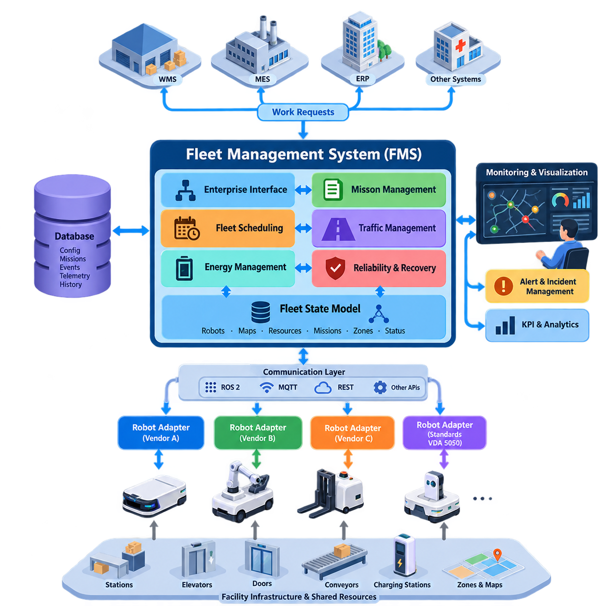
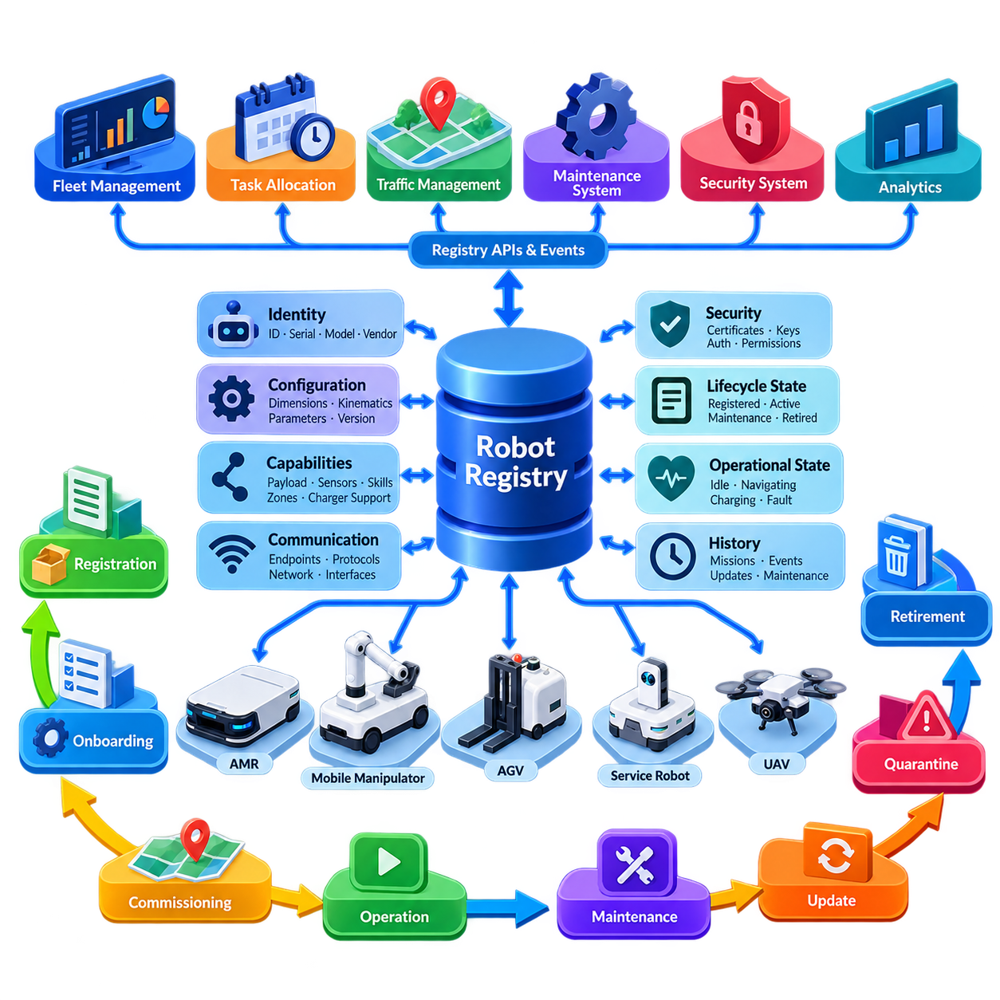
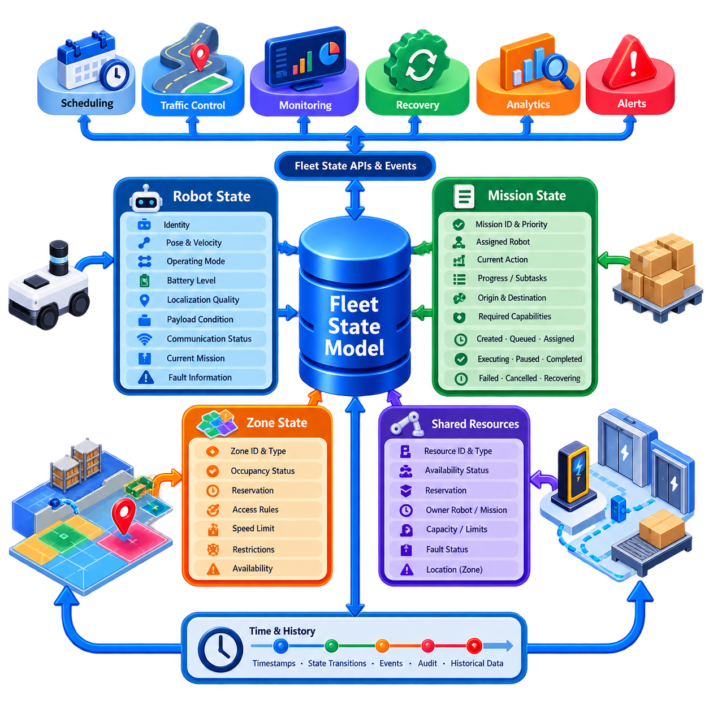
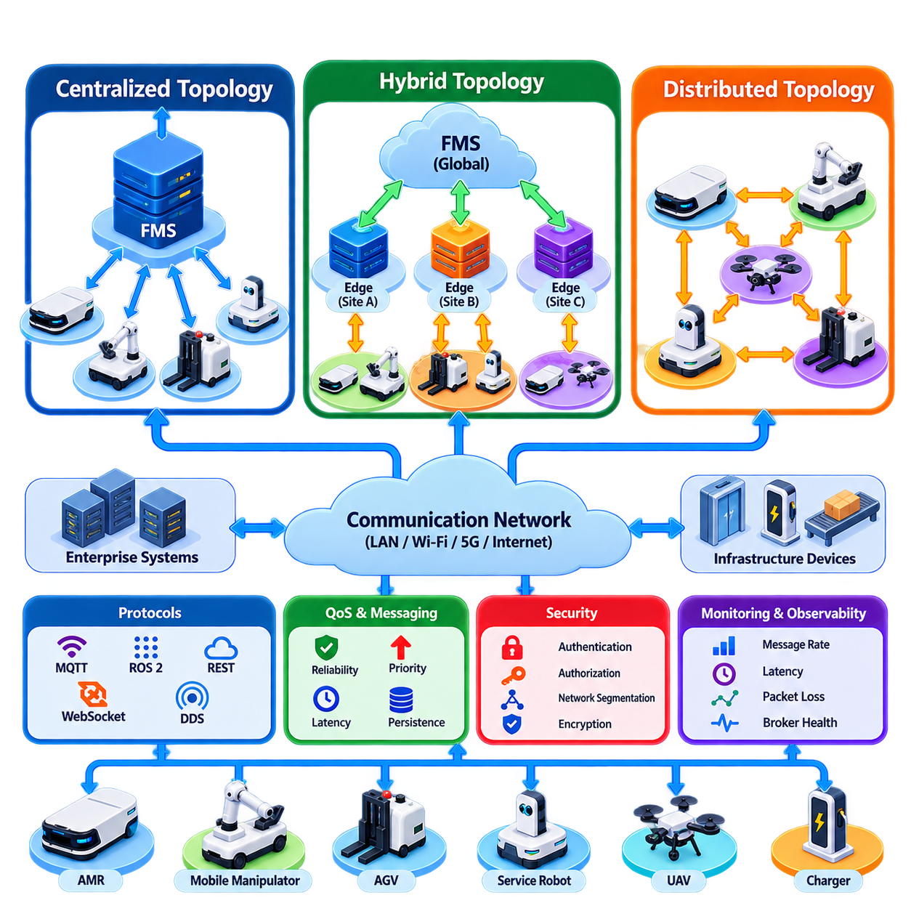
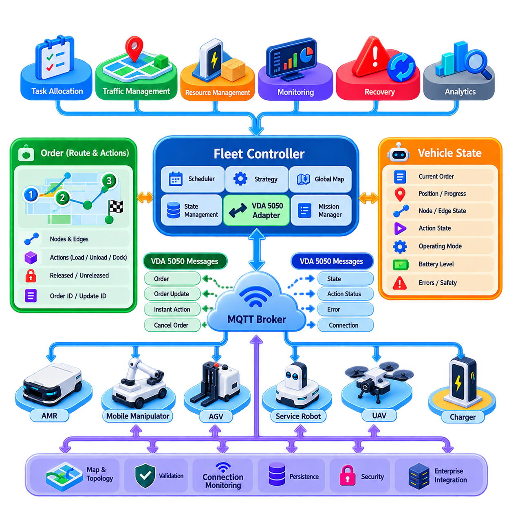
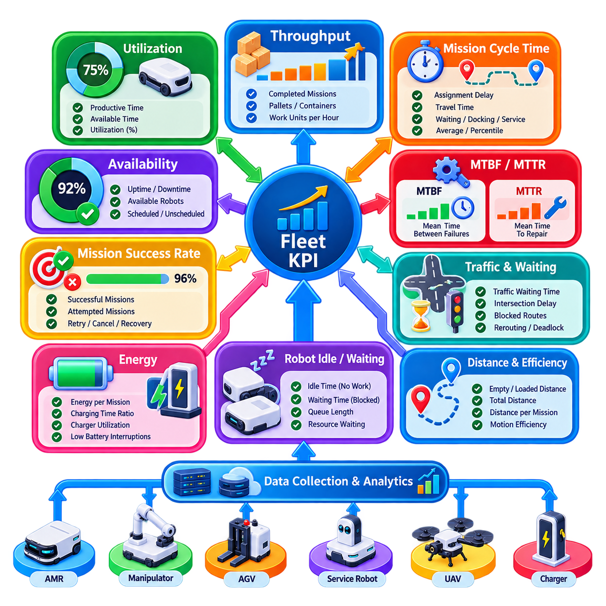
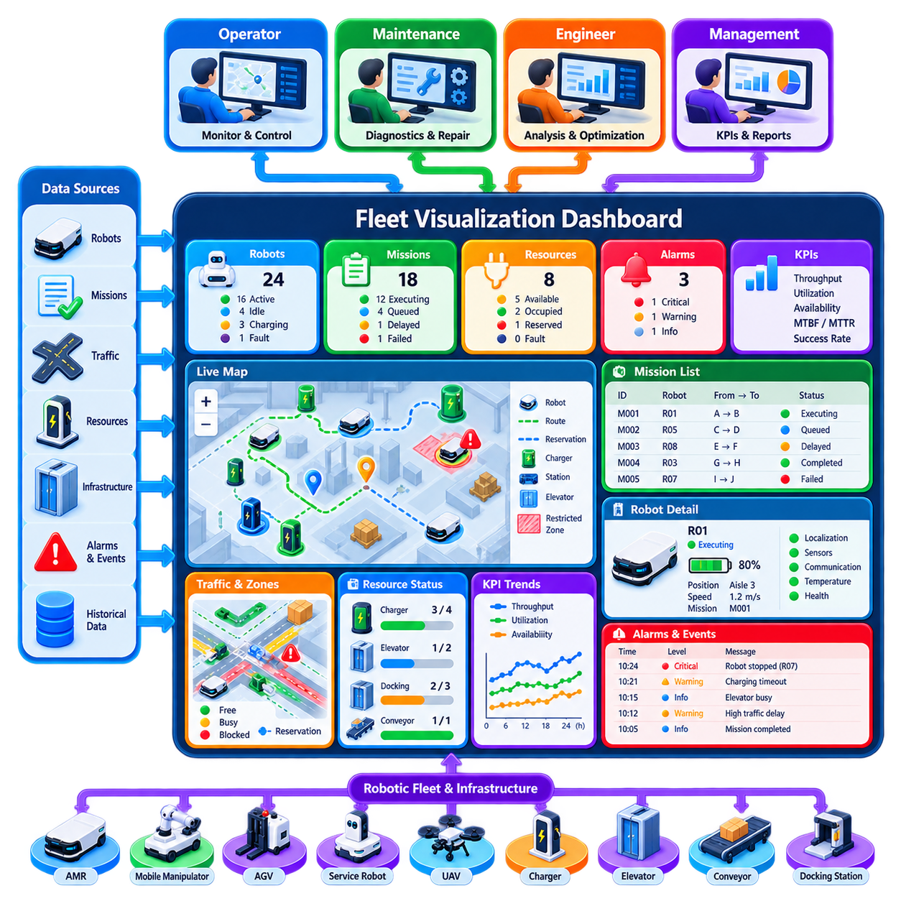
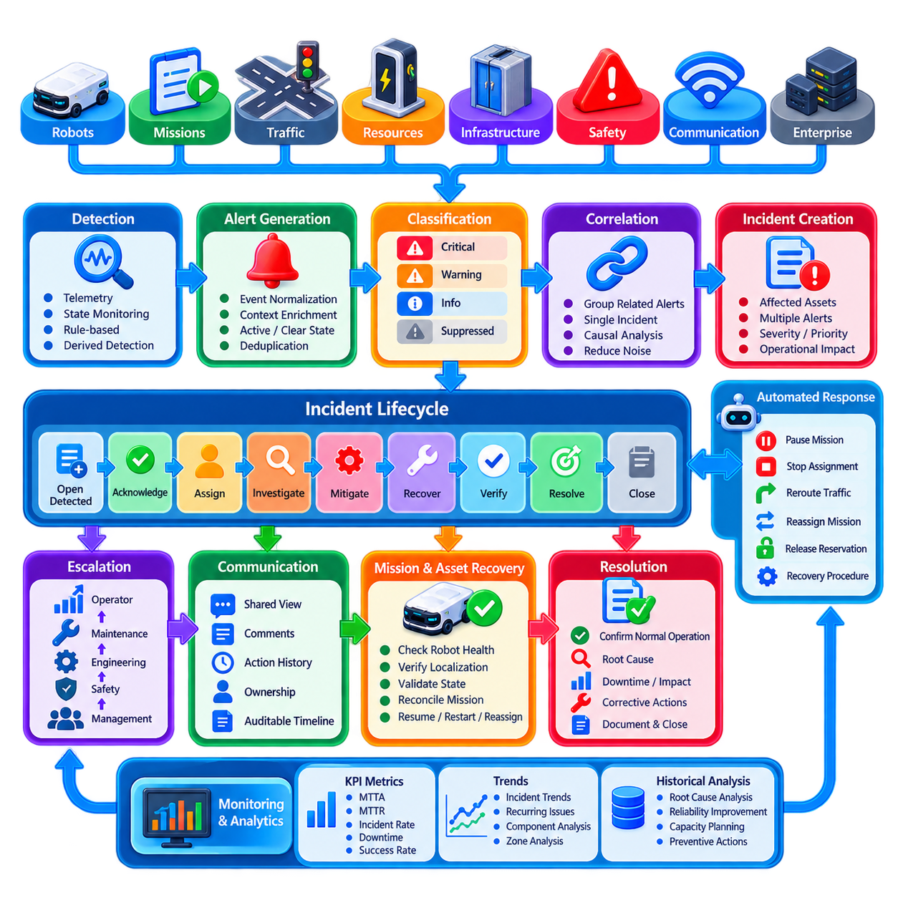
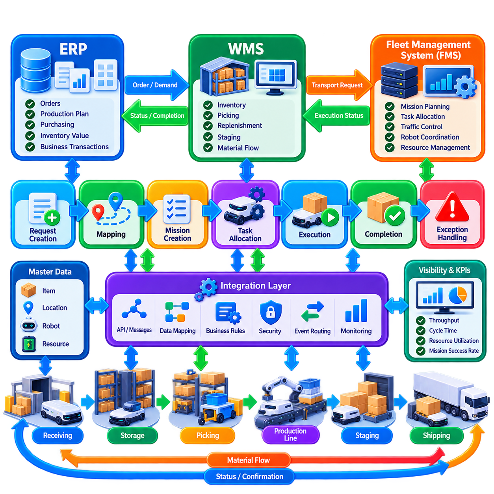
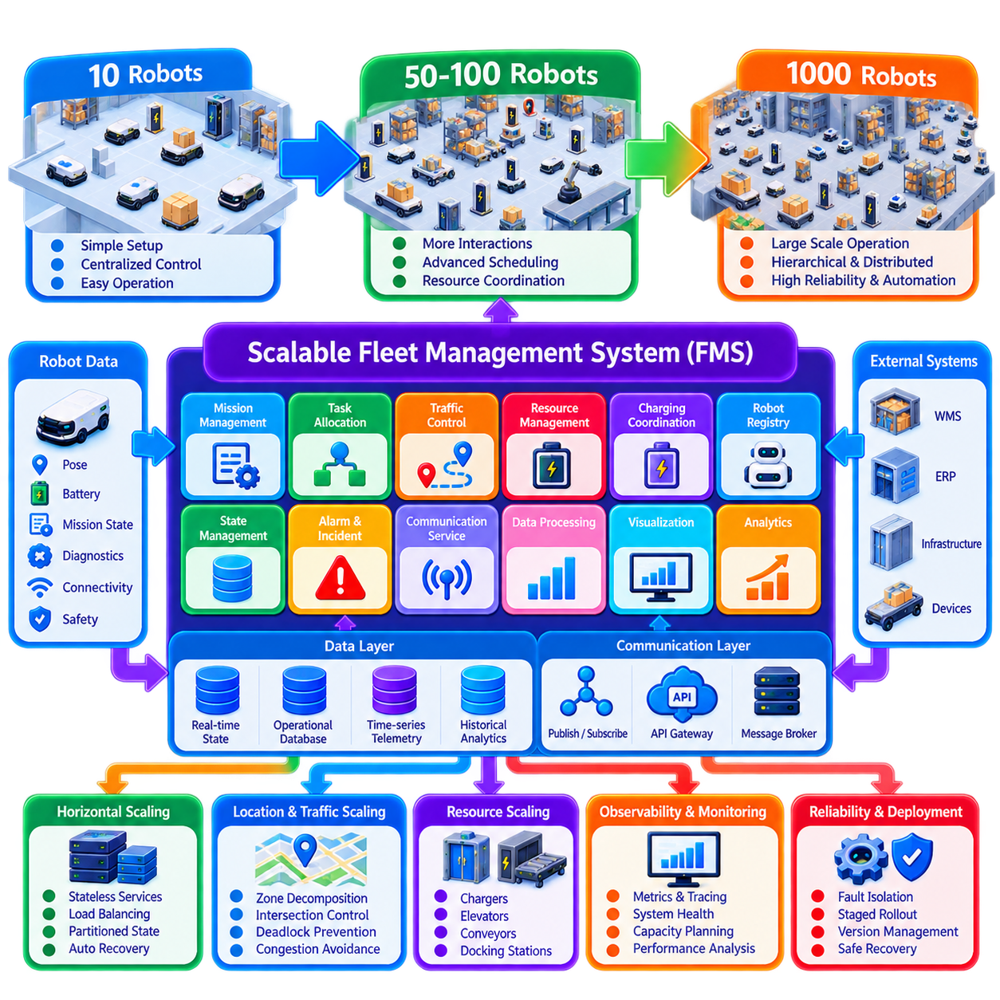

**Volume 16 Multi Robot and Fleet Intelligence**

# 01. Fleet Management Fundamentals

## 01.01 Fleet Management System FMS Architecture Overview

{width="7.268055555555556in" height="7.268055555555556in"}

A Fleet Management System (FMS) provides the supervisory software layer that coordinates multiple autonomous robots as a unified operational resource. While an individual robot is responsible for localization, perception, navigation, obstacle avoidance, and low-level motion execution, the FMS maintains a fleet-wide view of missions, robot availability, traffic conditions, energy state, faults, and shared resources. This separation allows autonomous robots to retain local safety while participating in coordinated operations.

The fundamental architectural objective of an FMS is to transform independent robotic platforms into an organized fleet capable of executing business-level objectives. A warehouse management system, manufacturing execution system, hospital information system, or logistics application may request transportation or service operations without selecting a particular robot. The FMS interprets these requests as missions, evaluates the state of available robots, assigns appropriate resources, and supervises execution until completion or recovery.

A typical architecture can be understood as several interacting logical layers rather than one monolithic application. Enterprise interfaces receive work requests from external systems, while mission management converts those requests into executable operations. Fleet scheduling determines which robots should perform them, traffic management coordinates shared space, robot adapters communicate with heterogeneous platforms, and monitoring services maintain operational visibility. Persistent storage records configuration, missions, events, telemetry, and historical performance.

At the center of the architecture is a fleet state model representing the operational condition of the entire robotic system. Each robot normally contributes information such as identity, pose, velocity, operating mode, battery state, payload condition, current mission, navigation state, and fault status. The FMS combines these observations with information about maps, stations, elevators, doors, chargers, restricted areas, and traffic zones to maintain a coherent representation of fleet operation. :chatgpt-content-reference{index="0"}

Mission management provides the abstraction between business requests and robot-level actions. A request such as moving material from storage to an assembly station may become a sequence containing pickup, navigation, docking, loading confirmation, transport, unloading, and completion operations. Mission execution therefore behaves as a stateful workflow rather than a single navigation command. The FMS must track progress and determine appropriate responses when actions fail, resources become unavailable, or operational priorities change.

Task allocation determines which robot should execute each available mission. Simple systems may select the nearest idle robot, whereas larger fleets consider distance, estimated completion time, battery level, payload capability, robot type, congestion, charging requirements, and task priority. Allocation is consequently an optimization problem whose complexity increases with fleet size and heterogeneity. More advanced allocation mechanisms can use auctions, assignment algorithms, mathematical optimization, or learned policies, which are treated separately in the volume. :chatgpt-content-reference{index="1"}

Traffic management complements task allocation by controlling how assigned robots share physical infrastructure. Corridors, intersections, docking stations, elevators, automatic doors, loading areas, and charging stations may become contested resources. The FMS can manage these resources through reservations, zones, priorities, route constraints, or time-dependent occupancy rules. Local collision avoidance remains a robot responsibility, but fleet-level coordination attempts to prevent situations such as congestion and deadlock before local planners encounter them.

Communication architecture connects fleet intelligence with individual robots and external systems. Depending on deployment requirements, an FMS may employ publish-subscribe messaging for continuous state updates, request-response interfaces for configuration and business integration, and asynchronous event channels for alarms and mission transitions. Technologies such as ROS 2, MQTT, REST, and other fleet APIs can coexist because telemetry, commands, transactions, and configuration data have different latency and reliability requirements. :chatgpt-content-reference{index="2"}

The robot interface layer is particularly important when a fleet contains platforms from multiple vendors. Instead of allowing higher-level scheduling logic to depend directly on vendor-specific APIs, adapters can translate standardized fleet commands into robot-native messages and convert proprietary state information into a common fleet model. This architectural boundary improves interoperability and allows robots to evolve independently from fleet applications. Standards such as VDA 5050 can provide an additional interface model for suitable industrial deployments.

An FMS should also distinguish command authority from robot autonomy. Fleet software can determine destinations, missions, priorities, reservations, and operational policies, but safety-critical reactions should not depend entirely on a remote server. A robot must remain capable of stopping safely, avoiding immediate hazards, detecting local failures, and maintaining essential behavior during temporary communication loss. This creates a hierarchical control model in which global optimization operates above autonomous local execution.

Reliability therefore requires explicit treatment of partial failure. Robots may disconnect, servers may restart, wireless networks may degrade, missions may remain incomplete, and infrastructure devices may become unavailable. The architecture should preserve mission identifiers, execution state, command history, and resource ownership so that recovery does not produce duplicated actions or conflicting reservations. Heartbeats, timeouts, acknowledgements, retries, persistent queues, and idempotent operations are common mechanisms for controlling these failure conditions.

Energy management forms another fleet-wide responsibility because charging decisions influence throughput as directly as task assignment. Battery state must be interpreted together with predicted mission demand, charger availability, travel distance, charging duration, and operational priority. Sending every robot to charge at the same threshold can create charger congestion and reduce capacity. A more capable FMS treats charging infrastructure as a shared resource and coordinates charging opportunities with the mission scheduler.

Operational observability converts the FMS from a dispatcher into a manageable production system. Operators require visibility into robot status, active and queued missions, map occupancy, traffic bottlenecks, battery distribution, alarms, unavailable resources, and system performance. Historical information supports analysis of utilization, throughput, mission completion time, mean time between failures, recovery frequency, and charging behavior. These measurements establish the foundation for later fleet KPI, visualization, and incident-management functions. :chatgpt-content-reference{index="3"}

The architecture must additionally provide integration boundaries for enterprise and facility systems. Warehouse management systems can generate transport orders, manufacturing execution systems can associate missions with production processes, and ERP applications can provide higher-level business context. Elevators, automatic doors, conveyors, docking stations, and other infrastructure may also participate as managed resources. Consequently, an industrial FMS often becomes an orchestration layer connecting autonomous mobility with the surrounding operational environment.

Scalability changes the architecture substantially as a deployment grows from several robots to hundreds or thousands. Centralized processing is straightforward for small fleets, but large installations generate increasing volumes of telemetry, scheduling decisions, route conflicts, database transactions, and operator events. Services may therefore be separated by responsibility, communication may become event-driven, state may be partitioned by site or zone, and computationally intensive optimization may operate independently from safety-critical fleet services. The source structure explicitly treats scaling from 10 to 1,000 robots as a fundamental FMS topic. :chatgpt-content-reference{index="4"}

A production FMS is therefore better understood as a distributed orchestration system than as a graphical robot monitoring application. Its essential function is to maintain consistent fleet state, translate operational demand into missions, allocate robots, coordinate shared resources, supervise execution, recover from failures, and expose reliable interfaces to surrounding systems. This foundation supports the more advanced multi-robot coordination, distributed intelligence, AI optimization, digital-twin, cybersecurity, and large-scale fleet capabilities developed throughout the broader fleet-intelligence architecture.

## 01.02 Robot Registry Onboarding and Lifecycle Management

{width="7.268055555555556in" height="7.268055555555556in"}

A robot registry is the authoritative inventory of robotic assets known to a Fleet Management System (FMS). It provides each robot with a persistent identity and associates that identity with configuration, capabilities, ownership, communication endpoints, security credentials, software versions, and operational status. Rather than treating a robot as a temporary network connection, the registry represents it as a managed system asset whose history can be traced throughout its complete operational lifecycle.

The registry becomes especially important when a fleet contains robots with different manufacturers, mobility mechanisms, payload capacities, sensors, manipulators, batteries, or navigation capabilities. A common robot record allows higher-level fleet services to reason about these differences without depending directly on vendor-specific implementations. The FMS can therefore determine not only whether a robot is online, but also whether it is technically qualified and operationally authorized to execute a particular mission.

A robust identity model normally separates persistent robot identity from temporary network properties. IP addresses, hostnames, communication sessions, and wireless interfaces can change during operation, whereas the logical robot identity should remain stable. A globally unique identifier, fleet-specific robot identifier, serial number, model, manufacturer, and hardware revision can form the identity foundation. Human-readable names may be added for operators, but they should not replace immutable identifiers used by software and databases.

Capability information describes what each registered robot can actually perform. A mobile robot may declare maximum payload, supported navigation modes, docking capability, charger compatibility, permitted operating zones, maximum speed, and available sensors. A mobile manipulator may additionally expose arm reach, gripper type, manipulation skills, or tool interfaces. Capability metadata enables mission planners and task allocation services to filter unsuitable robots before optimization or dispatch begins.

Registration is only the first step of onboarding. A newly discovered robot should not immediately become an active production resource simply because it can communicate with the FMS. Onboarding typically establishes identity, validates hardware and software compatibility, provisions communication parameters, installs or verifies credentials, assigns fleet membership, associates maps and operational zones, and checks required capabilities. The robot progresses toward active service only after these prerequisites have been successfully validated.

Security provisioning should be integrated into onboarding rather than added after deployment. Each robot requires a trustworthy mechanism for authenticating itself to fleet services, while the robot must also verify the systems issuing commands. Certificates, device credentials, secure keys, or equivalent identity mechanisms can bind communication sessions to registered robot identities. Credential issuance, expiration, rotation, revocation, and replacement should consequently be treated as lifecycle operations associated with the registry record.

Configuration management connects the generic fleet model with the physical characteristics of each platform. The registry may reference robot dimensions, footprint, kinematic class, velocity limits, payload constraints, safety parameters, charging characteristics, communication profiles, and supported protocol versions. Configuration should be versioned because a robot can change during its lifetime through hardware replacement, sensor upgrades, firmware updates, or software releases, while historical missions may still require interpretation using earlier configurations.

Onboarding should also verify compatibility with the operational environment. A robot intended for a specific site may require the correct map, localization configuration, traffic rules, docking definitions, charger assignments, restricted-zone permissions, and facility interfaces. A technically functional robot can still be operationally incompatible if these relationships are incorrect. Site commissioning therefore connects robot-level configuration with the fleet-level representation of maps, zones, missions, and shared resources.

Lifecycle state management provides explicit control over whether a robot may participate in fleet operations. Useful states can distinguish newly registered, provisioning, commissioning, available, active, maintenance, degraded, quarantined, suspended, and retired assets. The exact state model depends on the deployment, but transitions should be controlled rather than inferred only from network connectivity. An online robot undergoing maintenance, for example, must not automatically become eligible for mission assignment.

Operational state and lifecycle state should therefore remain conceptually separate. Operational state describes what the robot is doing now, such as idle, navigating, charging, executing a mission, or reporting a fault. Lifecycle state describes whether the asset is approved for fleet use and under what conditions. This distinction prevents transient telemetry from unintentionally changing administrative authorization and allows maintenance or security policies to override otherwise healthy operational behavior.

Health information enriches registry data throughout normal operation. Heartbeats and telemetry can update connectivity, battery condition, subsystem faults, temperatures, localization quality, software health, and other diagnostic indicators. The registry itself does not need to store every high-frequency sensor sample, but it should maintain or reference the current health summary required by fleet services. Historical telemetry can reside in specialized time-series or observability systems while remaining associated with the persistent robot identity.

Maintenance events form another important part of lifecycle management. When a robot requires inspection, repair, battery replacement, sensor calibration, or software intervention, it can be removed from the allocatable fleet without deleting its identity or history. Maintenance records can identify the reason, responsible technician or process, affected components, timestamps, and validation results. After maintenance, controlled recommissioning verifies that the robot is safe and compatible before restoring normal mission eligibility.

Software and firmware updates should also be reflected in the lifecycle record because fleet behavior may depend on deployed versions. The FMS may need to know which robots support a new mission feature, protocol revision, navigation behavior, or security patch. Progressive deployment can place selected robots into an update or validation state before fleet-wide rollout. If problems appear, version history supports rollback, diagnosis, and correlation between operational incidents and software changes.

Quarantine provides a controlled state for robots that should remain connected but must not participate normally in operations. A robot may be quarantined because of repeated faults, inconsistent configuration, expired credentials, cybersecurity concerns, failed validation, or abnormal behavior. Maintaining communication while preventing mission allocation allows operators and automated diagnostic services to investigate the robot without exposing the wider fleet to unnecessary operational or security risk.

Registry consistency becomes increasingly important as the fleet grows across buildings, sites, or regions. Duplicate identities, stale records, conflicting configurations, and uncontrolled manual changes can cause incorrect task assignment or misleading dashboards. The registry should therefore define ownership of each field, validation rules, update authority, audit history, and synchronization behavior. Database constraints and transactional updates help preserve a coherent source of truth while distributed services consume registry information.

External systems may also require controlled access to robot registry information. Fleet dashboards need names and lifecycle states, task allocators require capabilities and availability, maintenance systems require asset and service history, and security services require identity and credential status. Instead of allowing every application to maintain independent robot lists, registry APIs and events can distribute authoritative changes. This reduces configuration drift and provides a consistent robot identity across the operational ecosystem.

Robot retirement is the final lifecycle stage and should be managed as deliberately as onboarding. Retirement removes the robot from future mission allocation, revokes active credentials, releases assignments and licenses where appropriate, and records the final configuration and service history. Historical mission, incident, maintenance, and performance records should remain associated with the retired identity rather than being erased, because they may still be required for analytics, audits, reliability studies, or operational traceability.

The robot registry and lifecycle framework therefore acts as the governance foundation for fleet membership. It answers fundamental questions about what robots exist, which capabilities they possess, where they are permitted to operate, which configuration and software they run, whether they are healthy and authorized, and how their status has changed over time. By controlling the path from registration and commissioning through operation, maintenance, update, quarantine, and retirement, the FMS can scale without losing asset identity, configuration integrity, security, or operational accountability.

## 01.03 Fleet State Model Robot Status Mission Zone

{width="7.268055555555556in" height="7.268055555555556in"}

A fleet state model is the shared operational representation through which a Fleet Management System (FMS) understands the condition of robots, missions, zones, and resources at a given moment. Instead of allowing scheduling, traffic control, monitoring, and recovery services to maintain unrelated interpretations of the fleet, the model establishes consistent entities, states, relationships, and transition rules. It therefore becomes a common operational language for fleet-wide decision making.

Robot state forms the most visible component of this model. A robot state normally combines identity with dynamic information such as pose, velocity, operating mode, battery level, localization quality, payload condition, communication status, current mission, and fault information. The objective is not to reproduce every sensor measurement but to maintain the operational facts required by fleet services to determine whether a robot is available, busy, degraded, charging, disconnected, or otherwise unsuitable for assignment.

A useful model distinguishes lifecycle state from operational status. Lifecycle state determines whether an asset is authorized for fleet participation, while operational status describes its current activity. An active robot may therefore be idle, navigating, docking, loading, unloading, charging, waiting, paused, or recovering from a fault. Maintaining this separation prevents temporary robot behavior from unintentionally changing administrative eligibility and provides clearer reasoning for scheduling, maintenance, and security services.

Robot states should be represented through controlled transitions rather than arbitrary status strings. For example, an available robot may transition from idle to assigned, then navigating, docking, executing an operation, and finally back to idle. Failure may redirect execution into paused, degraded, recovery, or fault states. Explicit transition rules make abnormal sequences detectable and provide deterministic points at which the FMS can trigger allocation changes, alerts, retries, or operator intervention.

Mission state represents the progress of work requested from the fleet. A mission is generally more than a destination and may contain multiple actions, dependencies, resource reservations, and completion conditions. Typical states can include created, queued, assigned, dispatched, executing, paused, completed, failed, cancelled, or recovering. The mission record should preserve its identifier, priority, assigned robot, current action, timestamps, origin, destination, required capabilities, and relevant execution context.

Robot state and mission state are strongly related but should remain independent entities. A robot can exist without an active mission, and a mission can temporarily exist without an assigned robot. During reassignment, the original robot may enter a fault or maintenance condition while the mission returns to a queued or recovery state. Separating these entities enables the FMS to replan work without corrupting robot history and supports more flexible task allocation in dynamic environments.

Mission execution can also be modeled hierarchically. A business request may create a mission, the mission may contain several tasks, and each task may contain robot-level actions such as navigate, dock, pickup, wait, inspect, charge, or release. Each level can maintain its own state while contributing to the parent state. This hierarchy allows operators and software services to distinguish whether an entire mission has failed or whether only one recoverable action is delayed.

Zone state extends the fleet model from moving robots to the spatial environment in which they operate. A zone represents a meaningful area such as a corridor, intersection, loading station, elevator lobby, restricted region, charging area, inspection location, or shared workspace. The FMS can associate each zone with occupancy limits, permitted robot classes, speed restrictions, direction rules, priorities, reservations, safety constraints, or temporary availability conditions.

Zone occupancy provides an important connection between localization and fleet traffic management. Robot poses can be mapped to logical zones, allowing the FMS to determine which robots occupy or approach constrained areas. A zone may be free, occupied, reserved, blocked, restricted, or unavailable depending on the control strategy. These logical states simplify coordination because scheduling and traffic services can reason about operational regions rather than continuously processing raw geometric information.

Reservations add a future dimension to zone state. A robot may not yet occupy an intersection, narrow corridor, elevator, or docking station but may require exclusive or capacity-limited access shortly. The FMS can therefore represent reservation owner, requested interval, priority, expiration, and release conditions. Coordinating occupancy with reservations helps prevent conflicting routes and reduces the probability of deadlock, particularly when many robots compete for limited shared infrastructure.

Shared resources can be modeled similarly to zones even when they are not purely spatial. Chargers, elevators, automatic doors, conveyors, docking stations, manipulators, inspection equipment, and loading interfaces may have states such as available, reserved, occupied, busy, faulted, or offline. Associating resource state with missions and robots allows the FMS to understand why a robot is waiting and prevents several missions from assuming simultaneous ownership of an exclusive facility resource.

Time is fundamental to fleet state because distributed information never arrives simultaneously. Every significant state update should therefore carry timestamps, sequence information, or equivalent ordering metadata. The FMS must distinguish current information from delayed or stale information, especially when wireless communication is intermittent. A robot reported as navigating several seconds ago cannot automatically be assumed to remain in that state if its heartbeat has disappeared or newer evidence indicates a communication failure.

State consistency does not necessarily require every service to synchronously access one centralized database. A production architecture may maintain authoritative state in dedicated services while distributing changes through events, message brokers, caches, or replicated read models. Scheduling may consume robot availability, traffic management may consume poses and reservations, and dashboards may consume summarized status. The important requirement is that each consumer understands state ownership, versioning, freshness, and conflict-resolution rules.

Derived state is often as valuable as directly reported state. A robot may report battery percentage, pose, and diagnostic values, while the FMS derives mission eligibility, estimated remaining operating time, zone membership, congestion contribution, or degraded status. Similarly, mission delay can be inferred from expected versus actual progress. Separating observed state from derived state makes reasoning more transparent and prevents calculated fleet conclusions from being confused with measurements reported by physical robots.

Failure handling requires uncertainty to be represented explicitly. When communication with a robot is lost, its last known pose and mission should not simply disappear, nor should the system immediately assume that the robot has stopped safely. The state model can mark information as stale, uncertain, disconnected, or awaiting confirmation while preserving the last trusted values. Traffic management may then protect the robot\'s last occupied area until its physical condition has been verified.

State transitions should generate meaningful events because many fleet functions depend on changes rather than static values. A robot entering a fault state can trigger an alert, a mission completion can release reservations, a zone becoming blocked can initiate route replanning, and a charger becoming available can activate an energy-management decision. Event-driven propagation allows independent fleet services to react to the same authoritative transition without tightly coupling their internal implementations.

Historical state is equally important even though the fleet state model primarily represents current operation. Recording significant transitions creates a timeline that supports incident reconstruction, performance analytics, maintenance analysis, and KPI calculation. Operators can determine when a mission was assigned, where delays occurred, which zones were congested, when communication was lost, and how recovery proceeded. This temporal history transforms operational state into evidence for continuous fleet improvement.

At larger scale, the model must remain efficient as hundreds or thousands of robots continuously change state. High-frequency telemetry should not be treated identically to business-critical transitions. Pose updates may use streaming channels and short-lived caches, while mission completion, ownership changes, safety events, and configuration transitions require stronger persistence. Separating data according to update frequency, criticality, and retention requirements prevents the fleet state architecture from becoming a single overloaded data store.

The fleet state model ultimately connects robot status, mission execution, spatial zones, and shared resources into one coherent operational context. It allows the FMS to answer not merely where a robot is, but what it is doing, why it is there, which mission it serves, which resources it owns, which zones constrain its movement, and whether its information remains trustworthy. This unified state foundation enables reliable scheduling, traffic coordination, monitoring, recovery, analytics, and scalable multi-robot operation.

## 01.04 Fleet Communication Topology Centralized Hybrid

{width="7.268055555555556in" height="7.268055555555556in"}

Fleet communication topology defines how robots, Fleet Management Systems (FMS), edge servers, infrastructure devices, and enterprise applications exchange operational information. The topology influences latency, scalability, fault tolerance, consistency, and command authority across the fleet. A suitable architecture must support continuous robot state exchange while also carrying mission commands, traffic reservations, alarms, configuration changes, and infrastructure events with predictable reliability.

Communication topology is different from the communication protocol itself. MQTT, ROS 2, REST, WebSocket, DDS, or proprietary interfaces describe mechanisms for exchanging information, while topology describes which components communicate with one another and where coordination decisions are made. The same protocol can therefore support centralized, distributed, or hybrid architectures depending on how endpoints, brokers, controllers, and decision services are arranged within the system.

A centralized topology places a fleet controller or FMS at the logical center of communication. Individual robots establish communication with this central service and continuously report state such as pose, battery level, operating mode, mission progress, and fault status. The FMS aggregates these observations into a fleet-wide state and sends mission assignments, route constraints, traffic permissions, resource reservations, and operational commands back to the robots.

Centralization simplifies global coordination because one logical authority has access to the state of the entire fleet. Task allocation can compare all available robots, traffic management can observe competing route requests, and operators can monitor missions through a unified control point. Consistent policies are easier to enforce because scheduling, mission execution, and shared-resource ownership can use the same authoritative fleet state rather than reconstructing it from multiple independent controllers.

The principal limitation of centralized communication is dependency on the central path. Network interruption, controller overload, software failure, or database unavailability can affect many robots simultaneously if essential decisions require continuous access to the FMS. A centralized architecture therefore should not imply that every safety reaction is centralized. Robots must retain local capabilities for emergency stopping, obstacle avoidance, motion control, and safe behavior when communication becomes unavailable.

Scalability also changes the characteristics of centralized topology. Ten robots may produce modest communication traffic, whereas hundreds or thousands can generate large volumes of pose updates, heartbeats, diagnostics, mission events, and reservation requests. Sending every update directly to one process creates unnecessary bottlenecks. Production systems can preserve logical centralization while distributing brokers, API gateways, databases, state services, and processing workers across multiple computing nodes.

A distributed topology moves more communication and decision authority toward individual robots or local groups. Robots may exchange information directly with nearby peers for collision coordination, cooperative exploration, shared mapping, formation control, or local resource negotiation. This reduces dependence on a single controller and can improve responsiveness when decisions depend primarily on nearby conditions rather than complete fleet-wide knowledge.

However, distributed communication introduces its own complexity. Each participant observes only part of the system, messages may arrive in different orders, and robots can temporarily hold inconsistent views of shared resources. Consensus, leader election, distributed locking, conflict resolution, and synchronization mechanisms may become necessary. The architecture must also determine what happens when the communication graph becomes partitioned and groups of robots can communicate internally but cannot reach other groups or the central infrastructure.

A hybrid topology combines centralized fleet supervision with distributed or local decision making. This is often practical for industrial fleets because different functions operate at different spatial and temporal scales. The FMS can maintain global missions, task allocation, policy, analytics, and long-term optimization, while robots independently perform navigation, obstacle avoidance, safety reactions, and selected local coordination. Edge controllers can provide an intermediate layer between individual robots and global services.

Hierarchical communication is a common form of hybrid topology. A large facility may be divided into buildings, floors, production areas, or traffic zones, each managed by an edge or zone controller. Robots exchange high-frequency operational information with nearby controllers, while summarized state and significant events are forwarded to the global FMS. Global commands travel in the opposite direction and are refined into local actions, reducing backbone traffic while retaining fleet-wide supervisory control.

Edge controllers can also preserve limited operation during temporary cloud or backbone failures. A site-level controller may continue executing already authorized missions, maintaining traffic reservations, coordinating chargers, or buffering telemetry until connectivity returns. The global FMS can later reconcile state and resume normal supervision. This approach requires explicit rules defining which decisions remain valid offline, how long local authority persists, and how conflicting changes are resolved after reconnection.

Communication paths should be selected according to information characteristics rather than forcing all data through one channel. Robot pose and velocity may require frequent low-latency streaming, while mission creation and configuration changes are transactional and less frequent. Alerts require reliable priority delivery, whereas raw diagnostics may tolerate delay. Map packages, software images, and AI models can require high bandwidth but do not necessarily need the latency characteristics of motion-related state messages.

Publish-subscribe communication is particularly suitable for dynamic fleet state because producers and consumers can remain loosely coupled. Robots publish state without needing to know every application that consumes it, while scheduling, monitoring, analytics, and digital-twin services subscribe to relevant topics. Request-response communication remains useful for operations requiring explicit results, such as configuration queries, mission creation, registry access, or administrative actions. Hybrid FMS platforms commonly use both interaction patterns.

Quality of Service (QoS) becomes critical because fleet messages do not have equal importance. Emergency and safety-related events require different handling from routine telemetry, and mission state transitions are generally more important than visualization updates. Reliability, delivery deadline, persistence, ordering, priority, and retry policies should therefore reflect message semantics. Excessive reliability applied to high-frequency noncritical data can consume bandwidth and increase latency rather than improving fleet behavior.

Network segmentation can align communication topology with operational and security boundaries. Robot networks, safety infrastructure, enterprise IT, maintenance systems, and external cloud services may occupy separate network segments connected through controlled gateways. The FMS communication layer then mediates authorized information exchange across these boundaries. Such separation limits unnecessary traffic propagation and reduces the consequences of compromised devices or incorrectly configured endpoints.

Wireless connectivity requires special consideration because mobile robots continuously change their physical relationship to access points. Wi-Fi roaming, private 5G, industrial wireless networks, or combinations of technologies can introduce variable latency, packet loss, temporary disconnection, and coverage transitions. Fleet communication must therefore tolerate intermittent connectivity through heartbeats, timeouts, buffering, retries, sequence tracking, and reconnection procedures rather than assuming a permanently reliable network.

Topology design must also consider command ownership. If a global FMS, edge controller, local operator interface, and robot autonomy can all issue commands, conflicting authority can create unsafe or unpredictable behavior. The system should define which controller owns each decision domain and how authority is transferred. Command identifiers, timestamps, leases, priorities, acknowledgements, and state-machine constraints can help ensure that robots execute valid commands from the currently authorized source.

Observability should cover the communication fabric itself, not only robot application state. Useful indicators include connection status, message rate, latency, packet loss, queue depth, retry count, broker health, dropped messages, synchronization delay, and endpoint availability. These measurements allow operators to distinguish a navigation problem from a network problem and provide evidence for capacity planning as the fleet expands across more robots, zones, and facilities.

No single topology is optimal for every fleet function. Pure centralization offers simple global reasoning but increases dependence on central infrastructure, while fully distributed communication improves local autonomy but increases consistency and coordination complexity. Hybrid architectures intentionally divide responsibility according to latency, scope, safety, and availability requirements, allowing global optimization to coexist with local autonomy and resilient edge operation.

The resulting fleet communication architecture should therefore be viewed as a layered control and information network rather than a collection of robot connections. Central FMS services provide fleet-wide coordination, edge services handle site or zone responsibilities, and robots preserve local autonomous and safety functions. By combining these layers with appropriate messaging patterns, QoS, security boundaries, failure handling, and authority rules, the fleet can scale while remaining responsive, observable, and operationally resilient.

## 01.05 VDA 5050 Fleet Controller Implementation [w/Code]

{width="7.268055555555556in" height="7.268055555555556in"}

VDA 5050 provides a standardized communication interface between a fleet controller and automated guided vehicles or autonomous mobile robots from potentially different manufacturers. Its architectural purpose is not to replace vehicle navigation, safety control, or low-level motion software, but to define a common coordination boundary through which fleet-level orders, vehicle states, actions, and operational information can be exchanged consistently across heterogeneous systems.

In a VDA 5050 deployment, the fleet controller acts as the higher-level orchestration component responsible for assigning transport orders, coordinating traffic, managing shared resources, and observing vehicle execution. Each vehicle retains its own vehicle-side control software, commonly referred to as the AGV control or vehicle control system. The interface therefore separates global fleet decisions from local vehicle execution while allowing both sides to maintain a synchronized understanding of the current order.

The communication model is commonly implemented using MQTT publish-subscribe messaging. Instead of maintaining tightly coupled point-to-point interfaces for every robot vendor, the fleet controller and vehicles exchange standardized JSON messages through an MQTT broker. This decouples producers and consumers, supports asynchronous communication, and provides a practical mechanism for integrating multiple vehicles while preserving manufacturer-specific implementations behind the standardized interface.

A production implementation begins with vehicle identity and topic management. The fleet controller must associate incoming messages with the correct manufacturer and vehicle identity and maintain a communication context for every connected robot. Topic construction, namespace management, MQTT session behavior, connection monitoring, and message validation should therefore be treated as infrastructure functions rather than being embedded independently inside mission-planning logic.

The vehicle state message is fundamental to fleet-controller operation. It allows the controller to observe information associated with the vehicle\'s current order, navigation progress, node and edge execution, action state, operating mode, battery condition, errors, safety-related status, and other standardized state elements. The controller converts these messages into its internal fleet state model so that scheduling, monitoring, traffic management, and recovery functions can reason about each vehicle consistently.

Orders describe the route and work that the vehicle is expected to execute. Rather than sending only a destination coordinate, the fleet controller constructs an ordered graph composed of nodes and edges. Nodes represent significant positions or operational points, while edges describe permitted movement between them. Actions can be associated with appropriate parts of the order to represent operations such as loading, unloading, docking, interaction with equipment, or other vehicle-supported functions.

A central implementation concept is the distinction between released and unreleased portions of an order. The fleet controller can authorize an executable route segment while retaining later route elements as a horizon that may change as traffic conditions evolve. This allows the controller to reserve or coordinate the near-term path while preserving flexibility for future planning. The vehicle executes only the portion that has been released according to the order semantics.

Order identifiers and update identifiers are essential for maintaining synchronization between the fleet controller and vehicle. The controller must know whether it is issuing a new order, extending or modifying an existing order, or responding to changed operational conditions. Incoming state must be correlated with the expected order version. Incorrect handling can cause stale commands, duplicated execution, rejected updates, or inconsistent interpretations of the active mission.

The fleet controller should therefore maintain an explicit state machine for every vehicle-order relationship. Internal states can represent conditions such as unassigned, order prepared, transmitted, acknowledged through state observation, executing, waiting, completed, failed, cancelled, or recovering. The exact internal implementation can differ from the standardized message representation, but transitions should be deterministic and traceable so that asynchronous messages do not create ambiguous mission ownership.

Actions require similar lifecycle tracking. A fleet controller may request actions as part of an order or through supported control mechanisms, while the vehicle reports corresponding action states during execution. The controller should correlate each action identifier with its mission context and determine whether completion, failure, or another reported condition permits the mission to continue. Vendor-specific capabilities should be mapped carefully rather than assuming that every vehicle supports identical actions.

Instant actions provide a mechanism for commands that are not simply part of the normal node-edge progression of an order. Depending on the supported VDA 5050 version and vehicle capability, these can be used for operational interventions or control functions that need to affect the current execution context. Because they may interact with an active order, the controller must understand their semantics, identifiers, execution state, and potential effect on mission progression.

Traffic coordination remains primarily a fleet-controller responsibility. The controller can calculate routes while considering intersections, narrow corridors, stations, elevators, docking areas, and other shared resources. It then releases route segments only when the corresponding movement is permitted. VDA 5050 consequently becomes an execution interface through which traffic-management decisions are communicated, while the algorithms for reservation, deadlock prevention, prioritization, and optimization can remain internal to the FMS.

The map used by the fleet controller must also correspond meaningfully to the topology understood by the vehicle integration layer. Nodes, edges, positions, orientations, and map-related identifiers require consistent interpretation. A fleet controller may maintain a richer internal map containing semantic zones, costs, traffic restrictions, and infrastructure relationships, then translate the selected route into the node-edge representation required for communication with each vehicle.

Robust message validation is necessary before standardized messages are allowed to influence production decisions. The controller should verify required fields, identifiers, sequence relationships, supported protocol version, expected data types, and relevant semantic constraints. Syntactically valid JSON is not sufficient if an order references unknown nodes, an action is unsupported, or state information conflicts with the controller\'s known vehicle context. Invalid input should generate controlled diagnostics rather than undefined behavior.

Communication failure must be treated as an expected operating condition. MQTT connectivity can be interrupted by wireless roaming, broker failure, network segmentation, vehicle restart, or infrastructure maintenance. The fleet controller should maintain connection and freshness information, detect stale state, and avoid assuming that the last reported vehicle condition remains valid indefinitely. Reconnection procedures must restore a trustworthy relationship between current vehicle state and the controller\'s mission representation.

Recovery is especially important because blindly retransmitting commands after reconnection can duplicate physical operations. The controller should first determine which order and update the vehicle believes it is executing, which nodes or actions have already been completed, and whether the remaining mission is still valid. Only after reconciliation should execution continue, be updated, or be cancelled. Persistent order history and idempotent controller logic significantly improve recovery behavior.

Errors reported by vehicles should be integrated with fleet-level incident handling rather than displayed only as raw protocol messages. The controller can classify errors according to severity, affected capability, mission impact, and recovery possibility. A navigation-related failure may trigger route replanning, an unavailable load-handling function may require reassignment, and a severe vehicle fault may remove the robot from allocation while preserving its current area as a traffic constraint.

A scalable implementation should isolate the VDA 5050 adapter from higher-level fleet intelligence. Mission scheduling, task allocation, traffic optimization, energy management, and enterprise integration can operate on an internal vendor-neutral domain model. A dedicated adapter translates this model into VDA 5050 orders and converts received vehicle messages back into normalized fleet events. This prevents protocol-specific details from spreading throughout the entire FMS architecture.

The same separation also supports mixed fleets. Some robots may communicate through VDA 5050, while others use proprietary APIs, ROS 2 interfaces, or specialized controllers. Higher-level fleet services should interact with normalized concepts such as robot state, mission, route, capability, action, and fault rather than directly with transport-specific message schemas. VDA 5050 then becomes one standardized southbound interface within a broader multi-vendor fleet architecture.

Testing should cover more than successful order execution. A controller implementation should be exercised against duplicated messages, delayed state, unsupported actions, invalid order updates, disconnected vehicles, broker restart, partial route execution, emergency conditions, and recovery after controller restart. Simulation and protocol emulators are particularly useful because they allow many vehicle behaviors and failure combinations to be evaluated before integration with physical robots.

A well-designed VDA 5050 fleet controller therefore combines standardized communication with explicit internal state management, route coordination, validation, persistence, and failure recovery. The standard defines the interoperability boundary, while the FMS remains responsible for the intelligence behind task assignment, traffic management, resource coordination, and operational policy. Keeping this distinction clear enables heterogeneous robots to participate in a common fleet without sacrificing local autonomy or fleet-level optimization.

## 01.06 Fleet KPI Definition Throughput Utilization MTBF

{width="7.268055555555556in" height="7.268055555555556in"}

Fleet Key Performance Indicators (KPIs) provide quantitative measures for evaluating whether a robotic fleet is delivering the required operational capacity, reliability, and efficiency. Individual robot metrics alone are insufficient because fleet performance emerges from interactions among task allocation, traffic conditions, charging, failures, waiting, and shared resources. A useful KPI framework therefore connects robot-level measurements with mission-level and system-level operational outcomes.

A KPI should be defined before it is measured. The definition must specify the measured entity, observation interval, inclusion and exclusion rules, aggregation method, units, and treatment of abnormal conditions. Without these rules, two dashboards can display different values for apparently identical metrics. Production fleet analytics therefore requires a controlled KPI dictionary so that operations, engineering, maintenance, and management interpret performance consistently.

Throughput measures how much useful work the fleet completes during a defined period. Depending on the application, it can represent completed missions per hour, transported pallets per shift, delivered containers per day, inspected locations per hour, or another meaningful unit of production. A basic formulation is Throughput = Completed Work Units / Observation Time. The work unit must remain consistent when values are compared across periods or sites.

Throughput should not be interpreted only as robot speed. A faster robot does not necessarily increase fleet throughput when congestion, loading delays, blocked intersections, unavailable elevators, or insufficient chargers dominate the process. Fleet throughput is an end-to-end property of the complete operational system. Consequently, throughput analysis should be correlated with mission cycle time, queue length, traffic delay, resource waiting, charging behavior, and failure events.

Mission cycle time measures the elapsed time between defined mission start and completion points. It can be decomposed into assignment delay, travel time, waiting time, docking time, loading or service time, and recovery delay. Average cycle time is useful, but percentiles often reveal operational problems more clearly because a small number of severely delayed missions may be hidden by the mean. Consistent start and completion definitions are essential for valid comparison.

Utilization expresses how much of the available robot capacity is being used for productive activity. A simple formulation is Utilization = Productive Time / Available Time × 100%. Productive time may include mission travel and task execution, while charging, waiting, maintenance, fault recovery, or idle periods can be classified separately. The exact classification depends on operational objectives and must be documented rather than assumed.

High utilization is not automatically desirable. A fleet operating continuously near 100% utilization may have insufficient reserve capacity to absorb demand peaks, failures, or temporary infrastructure restrictions. Queues can increase rapidly when almost every robot is occupied. Conversely, low utilization can indicate excessive fleet size, poor task generation, scheduling inefficiency, or unnecessary waiting. Utilization must therefore be interpreted together with throughput and service demand.

Availability measures whether robots are capable of performing required operations when needed. It differs from utilization because an available robot can be idle simply because no mission currently requires it. Availability can be estimated from uptime and downtime or from reliability and repair metrics. Clearly distinguishing available, unavailable, scheduled maintenance, unscheduled failure, and administratively disabled states improves the operational meaning of this KPI.

Mean Time Between Failures (MTBF) describes the average operating time between repairable failures. A common fleet formulation is MTBF = Total Operating Time / Number of Relevant Failures. The definition of a failure is critical. Minor warnings should not automatically be counted in the same way as events that interrupt mission execution. Failure taxonomy should distinguish hardware, software, communication, localization, navigation, safety, and infrastructure-related events.

MTBF can be calculated for individual robots, robot models, subsystems, or the complete fleet. Fleet-wide aggregation provides an overall reliability view, while component-level analysis helps identify recurring weaknesses such as batteries, drive modules, sensors, computers, or communication devices. Comparisons are meaningful only when operating conditions and failure definitions are sufficiently similar. A robot working continuously in a demanding environment should not be compared naively with one operating intermittently under lighter conditions.

Mean Time To Repair (MTTR) complements MTBF by measuring how long recovery from failure requires. A system with frequent failures can sometimes maintain acceptable availability if recovery is extremely fast, whereas a rare failure can still create serious operational disruption when repair requires many hours. MTTR can include diagnosis, technician response, spare-part replacement, software restoration, validation, and recommissioning depending on the defined maintenance boundary.

Availability can be related conceptually to MTBF and MTTR through Availability = MTBF / (MTBF + MTTR) when the assumptions of the simplified reliability model are appropriate. This relationship shows why reliability improvement and repair-time reduction are both valuable. Increasing MTBF reduces failure frequency, while decreasing MTTR limits the operational impact of each failure. Fleet maintenance strategy should therefore address both dimensions rather than focusing on failure count alone.

Mission success rate measures the proportion of missions completed according to defined acceptance conditions. A basic calculation is Successful Missions / Attempted Missions × 100%. However, retries, cancellations, operator interventions, partial completions, and reassigned missions require explicit treatment. A mission completed only after manual recovery may be operationally successful but should still contribute to a separate intervention or recovery metric.

Robot idle time and waiting time provide important explanations for poor utilization. Idle time can indicate that no work is available, whereas waiting may indicate that work exists but execution is blocked by traffic, a station, an elevator, a charger, another robot, or an external process. Separating these conditions prevents the FMS from treating all nonproductive time identically and helps determine whether improvement requires scheduling changes, infrastructure expansion, or process redesign.

Traffic-related KPIs reveal whether multi-robot coordination is limiting fleet capacity. Useful measures include average traffic waiting time, intersection delay, blocked-route frequency, reservation conflicts, rerouting frequency, and deadlock recovery events. Increasing robot count can improve throughput initially but eventually produce congestion that reduces marginal benefit. These metrics help identify the point where additional robots no longer translate directly into additional productive capacity.

Energy KPIs connect fleet productivity with battery and charging behavior. Relevant measurements include energy consumed per mission, productive work per kilowatt-hour, charging time ratio, charger utilization, low-battery interruptions, and distance traveled to charging stations. Poor charging coordination can reduce effective fleet capacity even when sufficient robots are physically available. Energy analytics can therefore support charger placement, charging policy, and battery-sizing decisions.

Distance and motion efficiency provide another perspective on fleet performance. Empty travel distance, loaded travel distance, total distance, unnecessary rerouting, and travel distance per completed mission can reveal inefficient task allocation or facility layout. Minimizing distance alone is not always optimal because a slightly longer route may avoid congestion and reduce total mission time. Distance metrics should therefore be evaluated together with cycle time and traffic conditions.

KPI aggregation must preserve context. A single fleet-wide average can conceal differences among shifts, zones, robot models, mission classes, or operating conditions. Metrics should be filterable by time interval, site, robot, mission type, zone, software version, and relevant equipment configuration. This dimensional structure allows engineers to determine whether a performance change is systemic or associated with a particular subset of the fleet.

Historical baselines make KPI values actionable. A throughput value has limited meaning without a target, previous-period comparison, design capacity, or service-level requirement. Trend analysis can reveal gradual battery degradation, increasing traffic congestion, deteriorating MTBF, or rising recovery time before these become major operational problems. Statistical thresholds and anomaly detection can further support proactive investigation without replacing engineering interpretation.

KPI quality ultimately depends on data quality. Missing timestamps, duplicated mission events, inconsistent failure codes, unsynchronized clocks, stale robot states, or incorrectly classified downtime can produce convincing but misleading dashboards. Fleet analytics should therefore validate event completeness, timestamp consistency, state-transition logic, and data provenance. KPI calculations should be reproducible from retained operational records rather than existing only as transient dashboard values.

A mature fleet KPI framework combines throughput, utilization, availability, MTBF, MTTR, mission success, cycle time, traffic delay, energy efficiency, and supporting diagnostic measures into a coherent performance model. No single metric can represent fleet quality. The objective is to understand how productivity, capacity, reliability, maintenance, traffic, and energy interact, allowing the FMS and operations team to identify bottlenecks, evaluate improvements, plan fleet size, and continuously optimize robotic operations.

## 01.07 Fleet Visualization Dashboard Design [w/Code]

{width="7.268055555555556in" height="7.268055555555556in"}

Fleet visualization dashboard design transforms distributed robot, mission, traffic, resource, and infrastructure data into an operational view that humans can understand and act upon quickly. A dashboard is not merely a graphical presentation layer for telemetry. It is an operational interface between the Fleet Management System (FMS) and operators, supervisors, maintenance personnel, and managers who require different levels of information for monitoring, diagnosis, intervention, and performance improvement.

An effective dashboard begins with information hierarchy. The most important fleet conditions should be understandable within seconds, while detailed diagnostic information should remain accessible without overwhelming the primary view. Fleet size, active missions, available robots, faults, blocked zones, charging status, and critical alarms typically occupy the highest level. Detailed robot telemetry, mission history, subsystem diagnostics, and configuration information can appear through drill-down views when investigation is required.

The fleet overview should answer several fundamental operational questions simultaneously: how many robots are available, what work is currently executing, where problems exist, and whether overall operation is progressing normally. Summary cards can present active, idle, charging, degraded, disconnected, and faulted robots together with queued, executing, delayed, completed, and failed missions. These values should derive from the authoritative fleet state rather than independent dashboard calculations whenever possible.

Spatial visualization is particularly important because mobile-robot operation is inherently geographic. A map view can display robot positions, orientations, routes, destinations, zones, stations, chargers, elevators, restricted areas, and other infrastructure. Robot icons should communicate state without requiring operators to inspect every vehicle individually. Selected robots can expose additional information such as mission, battery level, velocity, localization quality, destination, and recent alarms.

Map visualization should balance detail with readability. Displaying every planned path, reservation, sensor footprint, and historical trajectory simultaneously can create visual clutter as fleet size increases. Layer controls allow operators to enable traffic routes, reservations, restricted zones, heat maps, infrastructure, or diagnostic overlays only when required. Zoom-dependent rendering and clustering can further reduce complexity when hundreds of robots occupy a large facility.

Mission visualization complements the spatial view by presenting work as an operational workflow. Operators should be able to identify queued, assigned, executing, paused, completed, failed, and recovering missions and understand which robot is responsible for each one. Mission detail can show origin, destination, priority, current task or action, elapsed time, expected completion, dependencies, and relevant resources. Delayed missions should be visually distinguishable from normal execution.

Traffic visualization helps explain conditions that cannot be understood from robot status alone. A robot waiting in a healthy state may actually be blocked by a reserved intersection, narrow corridor, elevator, docking station, or another vehicle. Traffic overlays can display zone occupancy, route reservations, blocked paths, congestion, and deadlock-related conditions. Historical heat maps can reveal recurring bottlenecks that are difficult to identify from individual incidents.

Shared resources require their own visible state because they often determine fleet performance. Chargers, elevators, doors, conveyors, docking stations, loading equipment, and inspection resources can be represented as available, reserved, occupied, busy, faulted, or offline. Connecting resource state with the robots and missions using it allows operators to distinguish a robot problem from an infrastructure problem and identify why missions are waiting.

Alarm design should prioritize operational significance rather than simply displaying every warning generated by every subsystem. Events can be categorized by severity, urgency, affected scope, acknowledgement state, and required response. Critical safety or fleet-stopping conditions should remain visually distinct from informational notifications. Alarm flooding should be avoided because excessive low-value alerts can hide the few events that require immediate operator attention.

An alarm should provide context rather than only an error code. Useful information includes the affected robot or resource, current mission, location, timestamp, severity, probable operational impact, and recommended or permitted response. Related alarms can be correlated into a single incident when they originate from the same underlying problem. Operators should also be able to acknowledge, assign, annotate, and review incidents without destroying the original event history.

Robot detail views support diagnosis and maintenance by combining current status with relevant recent history. Information can include battery state, operating mode, connectivity, localization quality, current mission, payload condition, software version, fault codes, temperatures, sensor health, and maintenance status. Time-series plots are useful for values whose trends matter, but only selected signals should be shown by default. Raw high-frequency telemetry belongs in deeper diagnostic tools rather than the primary operational screen.

KPI visualization provides a management and optimization perspective beyond real-time control. Throughput, utilization, availability, mission success rate, cycle time, MTBF, MTTR, traffic waiting, charger utilization, and energy efficiency can be displayed with targets and historical baselines. Trend charts should make deterioration or improvement visible over time, while filters can separate performance by site, shift, robot model, mission class, zone, or software version.

Dashboard design should distinguish real-time operational views from analytical views. Operators managing active robots require immediate state, alarms, map conditions, and intervention controls, whereas engineers may need historical comparisons and root-cause information. Managers may primarily require capacity, reliability, throughput, and service-level indicators. Trying to place all these requirements on one screen usually produces an interface that serves none of the user groups effectively.

Role-based views can therefore present the same underlying fleet data at different levels of abstraction. An operator dashboard may emphasize live missions and exceptions, a maintenance dashboard may emphasize health and fault history, and an engineering dashboard may expose communication latency, localization quality, software versions, or subsystem diagnostics. Management views can summarize trends and KPIs without exposing unnecessary low-level control functions.

Interaction design is as important as visualization. Operators should be able to search for a robot or mission, filter by state, select a map object, navigate from an alarm to the affected asset, and inspect related mission and resource information with minimal steps. Context should be preserved when moving between views. If an operator selects a failed mission, the interface should maintain the relationship among the mission, assigned robot, location, associated alarm, and relevant resource.

Manual intervention controls require particularly careful design because dashboard actions can influence physical machines. Commands such as pause, resume, cancel, reassign, release a resource, or send a robot to maintenance should clearly identify their target and expected effect. Confirmation should be proportional to operational risk rather than applied indiscriminately. Role-based authorization and audit logging should record who issued significant commands and when they were executed.

Data freshness must be visible because a visually convincing dashboard can become dangerous if it presents stale information as current. Connection indicators, last-update timestamps, or stale-state markers can distinguish recently verified data from information received before communication loss. The interface should not silently leave a disconnected robot displayed as normally operating. Similar freshness rules apply to missions, infrastructure devices, reservations, and external system integrations.

Scalability affects visualization as much as backend architecture. A map that works for ten robots may become unreadable with five hundred. Large fleets require aggregation, filtering, clustering, hierarchical site navigation, and exception-oriented presentation. Operators should not be expected to watch every robot continuously. The dashboard should direct attention toward deviations, bottlenecks, failures, and decisions while allowing normal autonomous operation to remain visually quiet.

Performance and reliability of the dashboard itself are operational concerns. Excessive telemetry updates can overload browsers, networks, or visualization services without improving human awareness. Backend services can aggregate high-frequency data and publish display-oriented state at appropriate rates. Critical events should remain event-driven and immediate, while rapidly changing values such as pose can be sampled or interpolated according to visualization requirements.

Historical replay can significantly improve incident analysis. By reconstructing robot positions, mission states, traffic reservations, alarms, and resource conditions along a common timeline, engineers can investigate what occurred before and after an event. Replay is particularly useful for intermittent congestion, deadlocks, communication failures, and unusual mission behavior that cannot be reproduced easily. Accurate timestamps and retained state transitions are prerequisites for trustworthy reconstruction.

A mature fleet dashboard therefore combines real-time situational awareness, spatial visualization, mission supervision, traffic and resource context, alarm management, diagnostics, KPI analysis, and controlled intervention within a coherent human-machine interface. Its objective is not to display the maximum amount of data, but to expose the right information at the right level and time, enabling humans to supervise increasingly autonomous fleets without becoming the bottleneck in robotic operation.

## 01.08 Fleet Alert and Incident Management Workflow

{width="7.268055555555556in" height="7.268055555555556in"}

Alert and incident management is the operational process through which a Fleet Management System (FMS) detects abnormal conditions, evaluates their significance, coordinates an appropriate response, and preserves evidence for later analysis. In a robotic fleet, abnormal events may originate from robots, missions, traffic services, infrastructure, communication networks, safety systems, or enterprise interfaces. A structured workflow prevents isolated warnings from becoming unmanaged operational disruptions.

An alert represents an observable condition that may require attention, whereas an incident represents an operational situation requiring coordinated investigation or response. A single incident can therefore contain multiple related alerts. For example, loss of localization may generate navigation errors, mission delays, and traffic blockage alerts, although all of them originate from one underlying robot problem. Separating alerts from incidents reduces duplication and improves operational understanding.

Alert generation begins with continuous observation of fleet state, telemetry, mission execution, infrastructure status, and communication health. Sources can include robot fault messages, battery thresholds, localization degradation, missed heartbeats, blocked routes, failed actions, charger faults, elevator failures, safety events, and mission timeouts. The monitoring layer converts these observations into standardized events that can be evaluated consistently by higher-level incident logic.

Detection rules should combine explicit device reports with conditions derived by the FMS. A robot may directly report a motor fault, while the fleet system can infer abnormal behavior from repeated mission retries, excessive waiting, rapidly decreasing battery capacity, or communication latency. Derived detection is especially valuable because many fleet-level problems emerge from interactions among otherwise healthy components rather than from a single device reporting a failure.

Every generated alert should contain sufficient context for automated and human interpretation. Important attributes include alert identifier, timestamp, source, affected robot or resource, severity, category, current mission, location, relevant state, and supporting diagnostic information. Where possible, alerts should also indicate whether the condition is active, acknowledged, cleared, recurring, or suppressed. Structured metadata enables filtering, correlation, routing, and historical analysis.

Severity classification establishes the operational importance of an alert. Informational events may require recording but no immediate response, while warnings indicate conditions that should be investigated before they degrade operation. Critical alerts can indicate mission-stopping failures, major infrastructure problems, or conditions requiring immediate intervention. Severity should reflect operational impact and urgency rather than simply reproduce the internal error level reported by a component.

Priority and severity should not always be treated as identical. Severity describes the seriousness of the technical condition, while priority can reflect the urgency of resolving it within the current operational context. A moderate robot fault may become high priority when the robot blocks a critical corridor, while a severe failure on an isolated robot in a maintenance area may have limited immediate fleet impact. The FMS can therefore combine technical severity with operational context.

Alert correlation prevents operators from being overwhelmed by cascades of messages generated by one underlying event. Correlation logic can group alerts according to robot identity, location, mission, time proximity, subsystem, or causal relationships. If communication loss causes mission timeout and stale localization warnings, the incident manager can associate these symptoms with the original connectivity event instead of presenting them as unrelated failures requiring separate investigation.

Deduplication provides another essential filtering mechanism. A persistent fault may be reported repeatedly at high frequency, but operators generally need one active alert whose duration and recurrence count are updated. Repeated identical messages should not create hundreds of independent incidents. Deduplication keys, time windows, state transitions, and clear conditions allow the alert service to preserve important evidence without producing unnecessary operational noise.

Suppression and maintenance rules help distinguish expected abnormal conditions from genuine incidents. A robot undergoing scheduled maintenance may intentionally be offline, and infrastructure may be temporarily disabled during service. Suppression should be explicit, time bounded, attributable to an authorized user or workflow, and auditable. Permanent suppression of recurring alarms can hide unresolved engineering problems, so suppressed conditions should remain available for later reliability analysis.

When an alert qualifies as an incident, the system creates an incident record representing the complete operational problem. The record can contain affected assets, associated alerts, severity, priority, current owner, status, timestamps, mission impact, traffic impact, actions taken, and recovery progress. The incident becomes the central object through which operators, automated recovery services, maintenance personnel, and supervisors coordinate their response.

Incident states should follow a controlled lifecycle. A typical flow progresses from detected or open to acknowledged, assigned, investigating, mitigating, recovering, resolved, and closed. Additional states may represent monitoring or escalation depending on organizational requirements. Explicit state transitions clarify responsibility and provide timestamps for measuring detection time, acknowledgement time, response time, recovery time, and total incident duration.

Acknowledgement indicates that an authorized operator or automated process has recognized the incident and accepted responsibility for further handling. It should not be interpreted as resolution. The system should record who acknowledged the event and when, allowing supervisors to distinguish unattended incidents from problems already being investigated. Time-to-acknowledge can also become an important operational KPI for control-room performance.

Automated mitigation can reduce response time for well-understood failure modes. The FMS may pause a mission, stop assigning work to a degraded robot, release invalid reservations, reroute traffic around a blocked zone, reassign a mission, or request a controlled robot recovery procedure. Automation should operate within predefined authority boundaries so that recovery actions do not create additional conflicts or override safety functions implemented locally on the robot.

Escalation is required when an incident cannot be resolved within defined time, severity, or capability limits. A warning may escalate if it persists, repeatedly returns, affects multiple robots, or begins reducing throughput. Escalation can route the incident from an operator to maintenance, engineering, safety personnel, or management according to the problem category. Clear escalation policies prevent difficult incidents from remaining indefinitely in an acknowledged but unresolved state.

Communication during an incident should provide a shared operational picture rather than separate interpretations across teams. Operators need to know which robots and missions are affected, maintenance personnel require diagnostic and service information, and supervisors need fleet-level impact. A common incident record allows comments, actions, ownership changes, and status updates to remain associated with the same event while preserving an auditable timeline.

Recovery requires verification rather than simply disappearance of an alarm. If communication returns, localization recovers, or a subsystem restarts, the FMS should confirm that the robot is again capable of safe and valid operation. This can include checking state freshness, localization quality, mission consistency, resource ownership, software health, and required capabilities. A robot should not automatically return to normal allocation merely because its original error message has cleared.

Mission recovery must also consider physical work already performed. If an incident occurred during loading, unloading, docking, inspection, or another physical action, blindly restarting the mission can duplicate an operation. The incident workflow should determine the last verified execution point and reconcile robot, mission, payload, and infrastructure state. Depending on the result, the mission may resume, restart from a safe checkpoint, be reassigned, or require operator confirmation.

Incident resolution indicates that the operational condition has been restored or otherwise brought under control. Closure should occur only after required verification, documentation, and follow-up actions are complete. The final record can include root cause, affected components, recovery method, downtime, mission losses, operator interventions, and corrective actions. Separating resolution from closure allows operations to resume while engineering investigation continues when necessary.

Historical incident data provides an important foundation for reliability improvement. Repeated incidents can reveal weak components, problematic software releases, communication coverage gaps, congested zones, unreliable chargers, or insufficient recovery logic. Metrics such as incident frequency, Mean Time To Acknowledge, Mean Time To Recover, recurrence rate, affected mission count, and operational downtime allow teams to measure whether corrective actions actually improve fleet performance.

A mature fleet alert and incident management workflow therefore connects detection, classification, correlation, prioritization, acknowledgement, mitigation, escalation, recovery, verification, resolution, and post-incident analysis into one traceable process. Its purpose is not to generate the largest number of alarms, but to convert abnormal fleet behavior into actionable operational knowledge, enabling humans and automated services to restore normal operation quickly while continuously improving fleet reliability and resilience.

## 01.09 WMS ERP Integration with Fleet Management [w/Code]

{width="7.268055555555556in" height="7.268055555555556in"}

Warehouse Management System (WMS) and Enterprise Resource Planning (ERP) integration connects robotic fleet execution with the business processes that create, prioritize, and verify material movement. The Fleet Management System (FMS) operates between enterprise-level demand and physical robots, translating logistics requirements into executable missions while returning operational status, completion results, exceptions, and performance information to upstream systems.

The responsibilities of WMS, ERP, and FMS should remain clearly separated. ERP generally manages business objects such as customer orders, production requirements, purchasing, inventory value, and enterprise transactions. WMS manages warehouse-specific inventory locations, picking, replenishment, staging, and material-flow processes. FMS determines how available robots execute physical movements while coordinating routes, traffic, batteries, capabilities, and shared resources.

A typical integration begins when ERP or WMS generates a business-level request requiring physical movement. Examples include transporting a pallet from receiving to storage, delivering components to a production line, replenishing a picking station, moving finished goods to staging, or retrieving material for shipment. The request describes the required logistics outcome, while the FMS determines which robot should perform the movement and how execution should occur.

The integration boundary should use stable business identifiers rather than relying only on robot-specific information. Transport requests can contain order identifiers, material or load identifiers, source and destination locations, priority, requested completion time, handling constraints, and process references. These identifiers allow physical robot execution to remain traceable to the originating warehouse or enterprise transaction throughout the complete operational workflow.

Location mapping is essential because WMS and FMS may represent the same facility differently. WMS may identify storage bins, workstations, staging areas, and production locations using business-oriented codes, while FMS uses maps, nodes, zones, docking poses, and navigation coordinates. An integration layer must maintain controlled mappings between logical business locations and robot-accessible physical destinations without exposing navigation details to the WMS.

Mission creation transforms a transport request into robot-executable work. A single WMS request may become one FMS mission containing navigation, docking, pickup, transport, delivery, confirmation, and release actions. More complex processes can generate several dependent missions or tasks involving different robots or equipment. This transformation allows enterprise systems to request outcomes without requiring knowledge of individual robot navigation or traffic-control mechanisms.

Task allocation remains primarily an FMS responsibility. WMS can provide business priority, due time, material constraints, or process sequence, but it should not normally select a particular robot unless the operational architecture explicitly requires it. The FMS can evaluate robot availability, payload capability, current location, battery state, congestion, maintenance condition, and workload before assigning the most appropriate robot to the requested movement.

Priority translation requires careful governance because business priority and robot execution priority are related but not identical. An urgent production request may receive elevated scheduling priority, but the FMS must still respect safety constraints, traffic reservations, resource ownership, and already committed physical actions. Integration logic should therefore translate enterprise urgency into controlled scheduling parameters rather than allowing external systems to bypass fleet coordination rules.

Execution status should flow back toward WMS and ERP through well-defined state mappings. FMS states such as accepted, queued, assigned, executing, waiting, completed, failed, cancelled, or recovering can be translated into the states required by the upstream workflow. The systems do not need identical internal state machines, but the mapping must define when a business request is considered accepted, physically started, successfully completed, or unable to continue.

Completion confirmation is particularly important because physical movement changes the real-world location of material. The FMS should report completion only when the defined physical acceptance condition has been satisfied, rather than when the robot merely reaches a coordinate. Depending on the process, completion may require docking confirmation, load transfer, sensor verification, equipment acknowledgement, or another validated event before WMS updates the corresponding inventory or workflow state.

Failure handling must preserve synchronization between digital records and physical reality. If a robot fails after picking up a pallet but before delivery, simply marking the transport request as failed can leave the WMS representation inconsistent with the actual load position. The integration workflow should preserve the last verified process state, report the exception, and support recovery, reassignment, manual confirmation, or reconciliation before business records are finalized.

Idempotency is essential because distributed systems can retransmit messages after timeouts or temporary communication failures. Repeated submission of the same transport request must not automatically create duplicate robot missions, and repeated completion notifications must not generate duplicate enterprise transactions. Unique request identifiers, correlation identifiers, processing state, and idempotency rules allow systems to retry communication without unintentionally repeating physical operations.

Asynchronous integration is often preferable for long-running robotic operations. A transport mission may require several minutes or longer, making a continuously open synchronous transaction inappropriate. ERP or WMS can submit a request and receive an acknowledgement, while subsequent state changes are delivered through events, message queues, callbacks, or status queries. This separates business transaction timing from the duration of physical robot execution.

REST APIs can support request creation, status queries, configuration access, and administrative operations, while message brokers or event-streaming platforms can distribute mission state changes and completion events. The exact technology is less important than the integration contract. Message schemas, identifiers, state semantics, retry behavior, timeout handling, versioning, authentication, and error responses should be defined explicitly so that each system behaves predictably during abnormal conditions.

An integration or orchestration layer can reduce direct coupling among ERP, WMS, FMS, and facility systems. This layer can translate schemas, map locations, validate requests, manage correlation identifiers, route events, and apply business transformation rules. It also prevents robot-specific concepts from spreading into enterprise applications and allows the FMS or WMS implementation to evolve without requiring every connected system to change simultaneously.

Shared infrastructure may require coordination beyond the WMS-FMS interface. Elevators, conveyors, automatic doors, production equipment, storage systems, and loading stations can participate in the same material-flow process. The FMS can coordinate robot interaction with these resources while reporting meaningful process milestones upstream. Enterprise systems should receive business-relevant outcomes rather than every low-level infrastructure command exchanged during mission execution.

Inventory integrity is a critical integration objective. WMS typically remains authoritative for warehouse inventory records, while FMS is authoritative for robot execution and current fleet operation. The architecture should define exactly when custody or location changes are committed and which system owns each data element. Clear ownership prevents both systems from independently modifying the same business fact and reduces reconciliation problems after communication or execution failures.

Security boundaries should reflect the different trust domains of operational technology and enterprise information technology. ERP and WMS should not require unrestricted direct access to robot networks. API gateways, integration services, authenticated messaging, role-based authorization, encrypted communication, and network segmentation can provide controlled information exchange. Commands entering the robotic domain should be validated before they are allowed to influence physical fleet operation.

Observability should provide end-to-end traceability across system boundaries. Operators and engineers should be able to follow a business order from ERP through WMS transport creation, FMS mission generation, robot assignment, physical execution, and final confirmation. Correlation identifiers, timestamps, event histories, and structured logs make it possible to determine where delays or failures occurred without manually reconstructing unrelated records from several systems.

Performance monitoring should distinguish enterprise waiting from fleet execution time. A request may spend time awaiting inventory release, production readiness, robot assignment, traffic clearance, physical transport, or destination acceptance. Measuring these stages separately prevents robot performance from being blamed for delays originating elsewhere in the process. The resulting data also supports throughput analysis, capacity planning, and identification of cross-system bottlenecks.

Integration testing should include abnormal workflows as well as successful material movement. Important scenarios include duplicate requests, invalid locations, unavailable robots, blocked destinations, lost acknowledgements, delayed events, robot failures while carrying loads, WMS restart, FMS restart, and temporary network disconnection. Recovery testing should confirm that digital workflow state can be reconciled with the actual physical condition without duplicating or losing material movements.

A mature WMS, ERP, and fleet-management integration therefore forms a closed operational loop between business demand and physical execution. ERP establishes enterprise intent, WMS manages warehouse processes and inventory context, and FMS converts transport requirements into coordinated robotic missions. Reliable identifiers, state mapping, asynchronous events, ownership rules, recovery logic, security, and traceability allow this chain to scale while preserving consistency between digital transactions and the physical movement of goods.

## 01.10 Fleet Management Scalability 10 to 1000 Robots

{width="7.268055555555556in" height="7.268055555555556in"}

Fleet management scalability describes the ability of a Fleet Management System (FMS) to expand from a small deployment of approximately 10 robots to hundreds or even 1,000 robots without losing responsiveness, operational reliability, coordination quality, or maintainability. Scalability is not achieved simply by adding computing resources. It requires architectural changes in communication, state management, scheduling, traffic control, data processing, observability, and operational organization.

A fleet of 10 robots can often be managed using a relatively centralized architecture. A single FMS instance may maintain robot states, allocate missions, calculate routes, monitor batteries, coordinate traffic, and provide operator visualization. Message volume and computational load remain limited, and operators can understand individual robot behavior directly. This architecture is useful during early deployment because it minimizes system complexity and simplifies debugging, validation, and integration.

As fleet size approaches 50 to 100 robots, interactions among robots become increasingly important. Task allocation decisions influence traffic, charging behavior affects robot availability, and multiple vehicles compete for intersections, corridors, elevators, docking stations, and other shared resources. The scalability problem therefore changes from managing individual robots efficiently to coordinating a growing network of coupled resources whose decisions influence one another.

Communication architecture is one of the first areas affected by scale. Every robot can continuously publish pose, velocity, battery state, mission progress, diagnostics, connectivity, and safety-related information. If message frequency and payload remain unchanged, aggregate traffic grows approximately with fleet size. A system supporting 1,000 robots must therefore control publication rates, message size, subscription scope, retention, and processing cost rather than forwarding every telemetry update to every service.

Publish-subscribe architectures are well suited to large fleets because producers and consumers can remain loosely coupled. Message brokers can distribute robot states, mission events, alarms, and infrastructure information according to topic or subscription requirements. However, a single broker should not automatically be assumed to scale indefinitely. Broker clustering, partitioning, load balancing, persistence policies, and failure recovery become increasingly important as message rates and connected endpoints increase.

Robot state management must also evolve. A small system can maintain most fleet state inside one application process, but this approach becomes difficult to scale and recover as the fleet grows. Larger systems benefit from separating transient real-time state, persistent operational records, mission history, configuration, and analytical data. Each category has different consistency, latency, durability, and query requirements and should not necessarily share the same storage mechanism.

State update frequency should reflect operational value. Robot pose may change many times per second, while battery percentage, mission transitions, maintenance state, and software configuration change much less frequently. High-frequency data can be sampled, aggregated, or processed close to the robot or edge layer before reaching global services. Critical state transitions should remain event-driven so that important operational changes are not delayed by aggressive telemetry reduction.

Task allocation becomes computationally more challenging as both robot count and mission demand increase. Comparing every pending mission against every available robot can become expensive, particularly when capability, battery, distance, traffic, deadlines, payload, and resource constraints are included. Scalable schedulers can reduce the search space through zoning, candidate filtering, hierarchical allocation, batching, incremental optimization, or decomposition of the global scheduling problem.

Centralized optimization can still provide valuable fleet-wide decisions, but it does not require every decision to be made globally. A hierarchical FMS can assign work at the site or zone level while local schedulers select robots within their operational regions. Global services can manage workload balancing and cross-zone transfers, while local controllers handle fast decisions. This decomposition reduces computational complexity and limits the operational impact of individual service failures.

Traffic management often becomes the dominant scalability challenge before raw computing capacity does. Ten robots can share a facility with relatively simple reservation logic, while hundreds of robots create large numbers of interacting routes and resource conflicts. Adding robots eventually produces congestion rather than additional throughput. Scalable traffic control therefore requires structured route graphs, reservation horizons, intersection management, congestion-aware routing, and mechanisms for detecting and preventing deadlocks.

Spatial decomposition can reduce traffic-control complexity. A large facility can be divided into zones, sectors, floors, or traffic domains with controlled interfaces between them. Local traffic controllers manage reservations within their domains, while boundary coordination governs robot transfer between regions. This approach limits the number of simultaneously interacting robots considered by each controller and allows different areas of a facility to operate with a degree of independence.

Shared resources become increasingly significant as fleet size grows. Chargers, elevators, doors, conveyors, docking stations, loading areas, and production equipment can become bottlenecks even when robot capacity is sufficient. Resource managers should maintain explicit reservation, ownership, queue, timeout, and release states. Scaling the number of robots without scaling or optimizing these shared resources can reduce overall throughput instead of increasing it.

Charging coordination illustrates this effect clearly. Ten robots may operate successfully with simple low-battery thresholds, but hundreds of robots responding to similar thresholds can create synchronized charging demand. A scalable energy manager can consider predicted mission demand, charger availability, battery state, charging duration, travel distance, and future workload. Staggered or opportunity charging can distribute demand while preserving sufficient active fleet capacity.

Service decomposition helps prevent the FMS from becoming one increasingly large application. Mission management, task allocation, traffic control, robot registry, resource management, charging, alert management, telemetry processing, visualization, and analytics can be separated according to clear domain responsibilities. This does not require excessive microservice fragmentation, but critical functions should be isolated enough to scale, restart, deploy, and monitor independently where operationally justified.

Horizontal scaling requires services to minimize unnecessary dependence on local process state. Stateless API services can be replicated behind load balancers, while stateful services require controlled partitioning, replication, or leader mechanisms. Robot ownership can be partitioned by site, zone, fleet group, or consistent identifier. The architecture must also define how ownership changes during failover so that two controllers do not issue conflicting commands to the same robot.

Database scalability requires similar separation of workloads. Transactional mission and configuration records require consistency and durability, while high-volume telemetry is better suited to time-series or streaming storage patterns. Historical analytics can be transferred into separate analytical stores rather than competing with real-time fleet operations. Data retention policies should determine which high-frequency signals require full preservation and which can be aggregated after a defined period.

Operator scalability is as important as software scalability. A human can inspect 10 robots individually, but this model does not work for 1,000 robots. Large-fleet interfaces should emphasize exceptions, incidents, congestion, delayed missions, unavailable resources, and performance deviations rather than continuously presenting every robot equally. Hierarchical dashboards, filtering, clustering, role-based views, and automated incident correlation allow a limited operations team to supervise a much larger autonomous fleet.

Failure domains should become smaller as deployment size increases. A centralized component whose failure stops 10 robots is undesirable, but the same failure stopping 1,000 robots can be operationally unacceptable. Site-level and zone-level isolation, redundant communication services, replicated databases, local autonomy, and controlled degraded modes can prevent individual failures from becoming fleet-wide outages. Robots should retain sufficient local safety and motion capability when global services become temporarily unavailable.

Recovery behavior must also scale. Restarting a controller responsible for hundreds of active missions requires reconstruction of robot state, mission ownership, reservations, and shared-resource state without duplicating physical actions. Persistent identifiers, event histories, checkpoints, idempotent commands, leases, and reconciliation procedures allow services to recover authoritative state. Recovery time should be treated as a scalability metric because larger systems contain more state that must be reconstructed.

Software deployment becomes increasingly sensitive at large scale. Updating 10 robots simultaneously may be manageable, while an incorrect release across 1,000 robots can create a fleet-wide incident. Staged rollout, compatibility checking, canary deployment, rollback, configuration versioning, and fleet segmentation reduce deployment risk. FMS services should also tolerate temporary coexistence of different robot software versions during controlled upgrade campaigns.

Observability must evolve from individual debugging to distributed-system monitoring. Metrics should cover message rates, queue depth, service latency, database load, scheduler time, reservation conflicts, robot connectivity, mission backlog, error rates, and resource utilization. Distributed tracing and correlation identifiers can connect a business request to mission creation, allocation, robot execution, and completion. Capacity trends can then reveal which subsystem approaches saturation first.

Scalability testing should reproduce realistic interaction patterns rather than simply simulate large numbers of connected robots. A meaningful 1,000-robot test should include mission generation, traffic conflicts, charging, failures, reconnects, shared resources, state updates, operator queries, and database writes. Load testing should identify saturation points and degraded behavior so that architectural limits are understood before production deployment reaches them.

The transition from 10 to 1,000 robots is therefore a progression from centralized robot supervision toward distributed fleet orchestration. Small fleets favor simplicity, while medium fleets require stronger scheduling, traffic, and resource management. Large fleets increasingly require hierarchical control, partitioned state, scalable messaging, failure isolation, automated operations, and exception-oriented human supervision. The objective is not merely to connect more robots, but to preserve predictable performance and operational control as system complexity grows.
