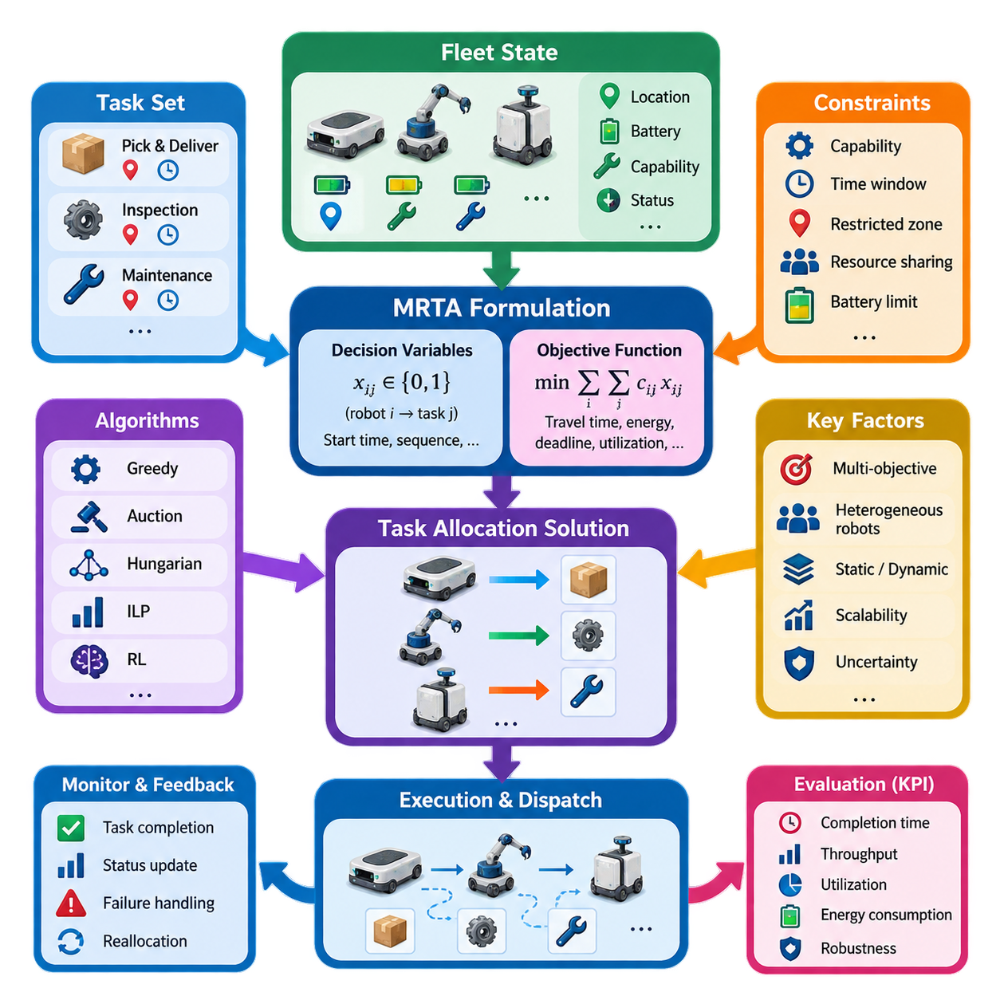
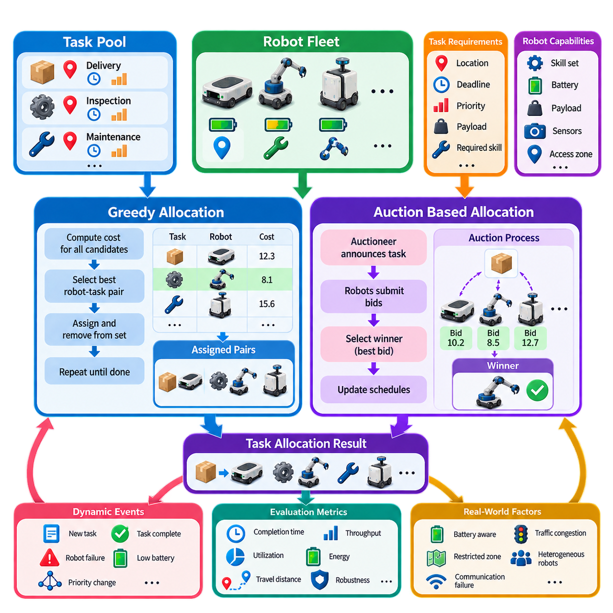
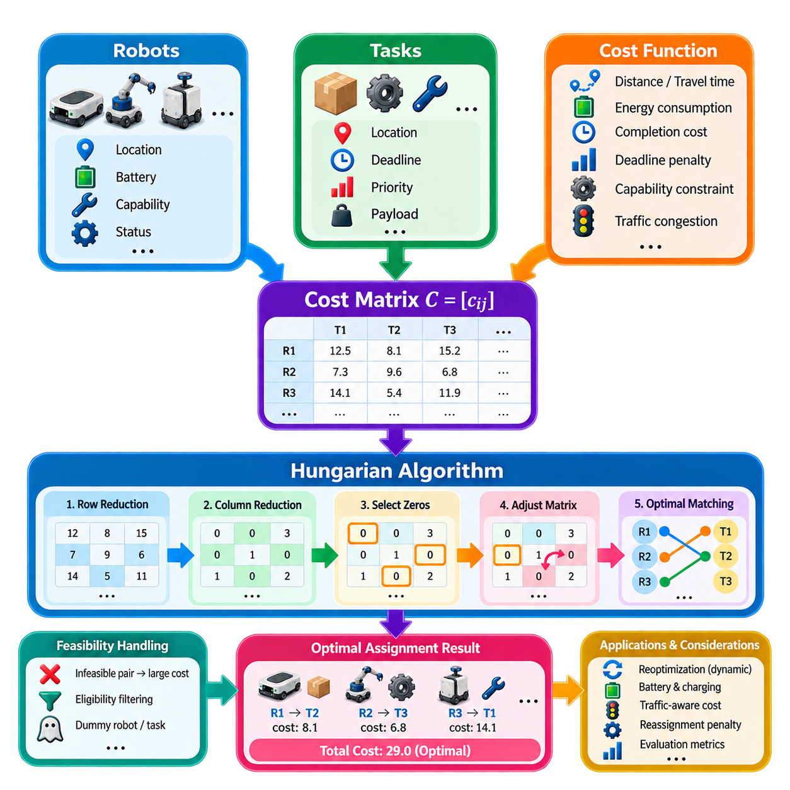
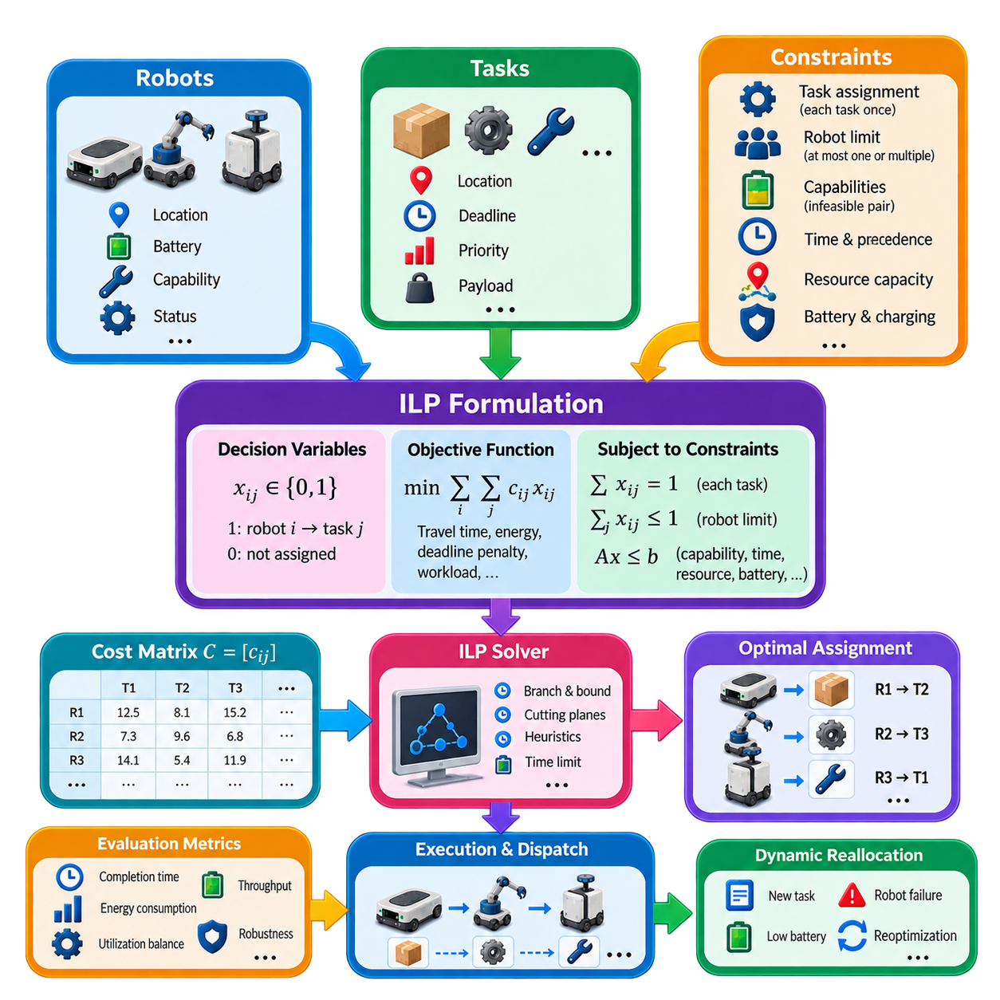
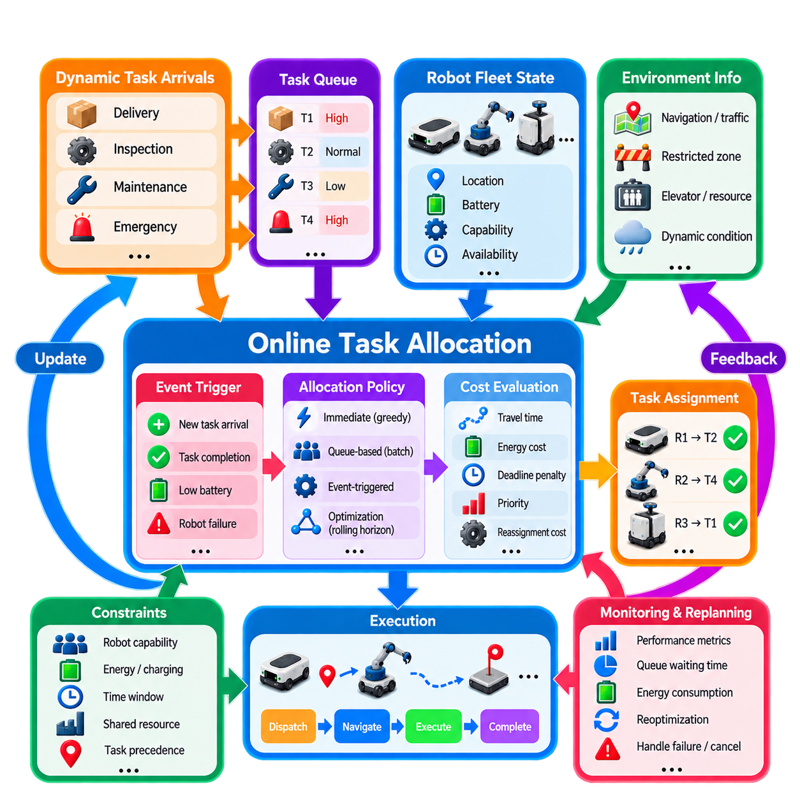
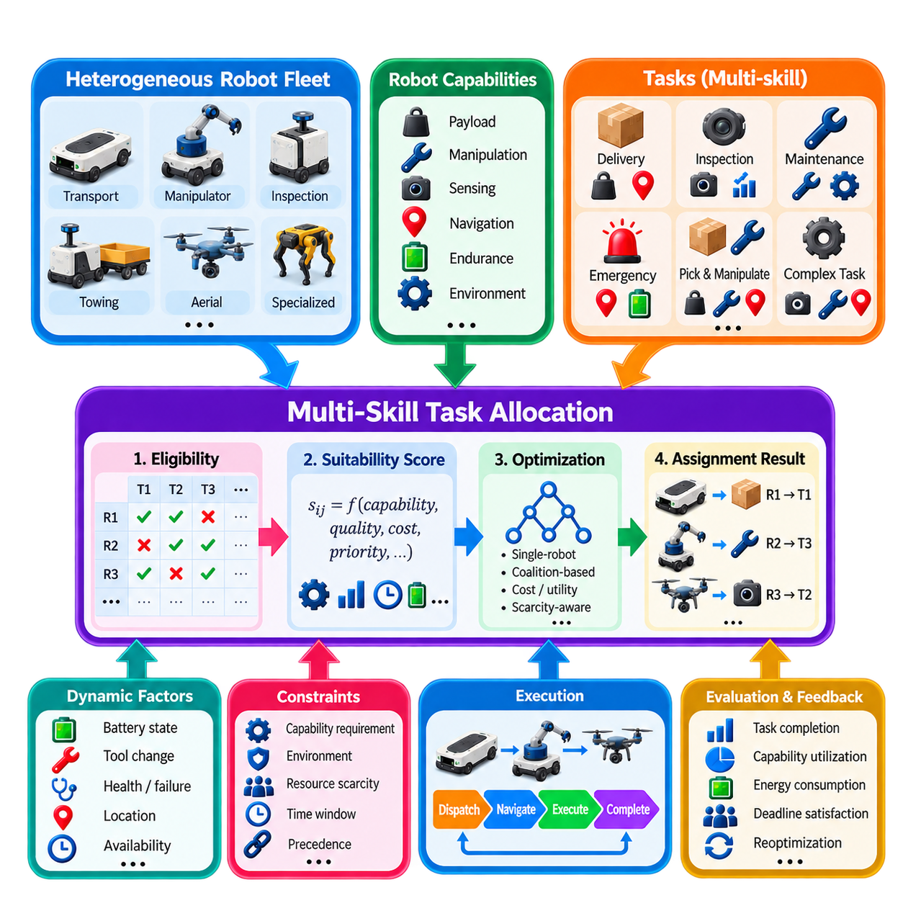
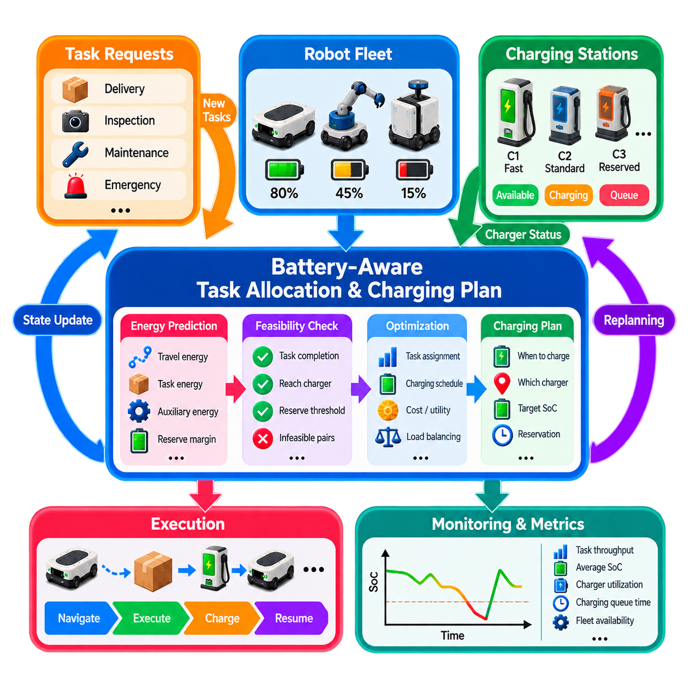
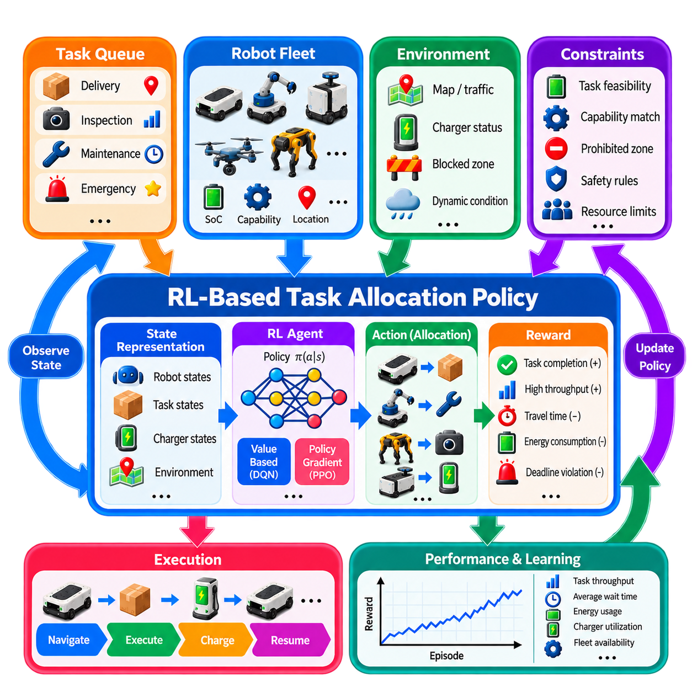
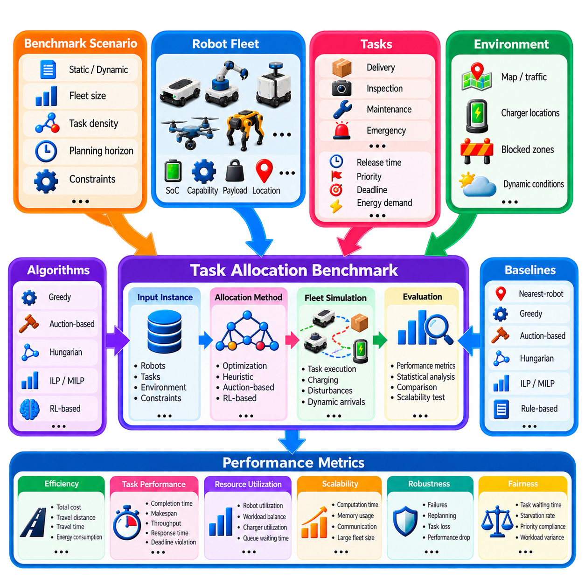
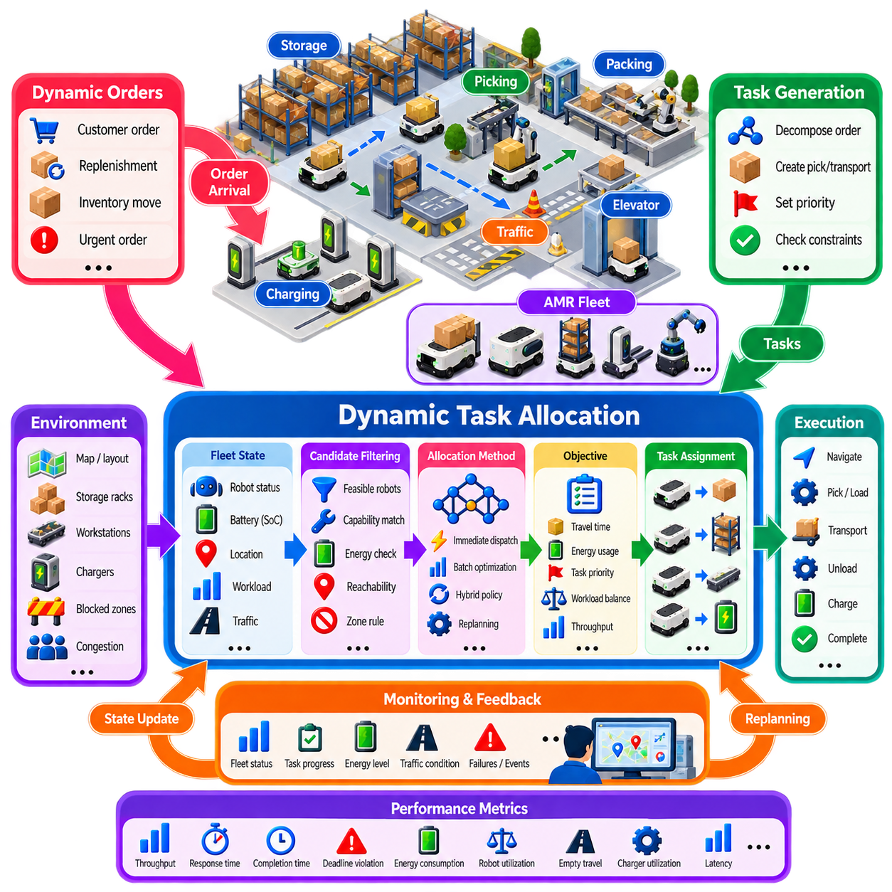

**Volume 16 Multi Robot and Fleet Intelligence**

# 02. Robot Task Allocation

## 02.01 Task Allocation Problem Formulation MRTA Framework

{width="7.268055555555556in" height="7.268055555555556in"}

Multi-Robot Task Allocation (MRTA) defines the problem of deciding which robots should perform which tasks, at what time, and under what operational constraints. In a fleet system, allocation sits between mission generation and robot execution. It transforms incoming work orders into robot-task assignments while considering robot capabilities, locations, availability, workload, energy state, task priorities, and environmental conditions. The surrounding volume places this formulation before algorithmic methods such as auctions, Hungarian assignment, integer linear programming, online allocation, and reinforcement learning.

An MRTA problem can be represented through a set of robots \\(R=\\{r_1,r_2,\\ldots,r_m\\}\\), a set of tasks \\(T=\\{t_1,t_2,\\ldots,t_n\\}\\), and an assignment relation connecting them. Each robot has a state describing properties such as pose, velocity, payload capacity, battery level, tool configuration, current mission, and operational status. Each task similarly contains requirements such as location, service duration, deadline, priority, payload, required skills, and precedence relationships.

The fundamental decision variable expresses whether a robot is assigned to a task. In a simple binary formulation, \\(x_{ij}=1\\) indicates that robot \\(r_i\\) performs task \\(t_j\\), while \\(x_{ij}=0\\) indicates otherwise. More complex systems may introduce variables for start time, completion time, route sequence, charging decisions, resource reservations, or cooperative assignments. The resulting decision space grows rapidly as fleet size, task count, and operational constraints increase.

The objective function defines what constitutes a desirable allocation. A basic formulation may minimize the total assignment cost, expressed conceptually as \\( \\min \\sum_i\\sum_j c_{ij}x_{ij} \\), where \\(c_{ij}\\) represents the cost of assigning robot \\(i\\) to task \\(j\\). Cost does not have to represent physical distance alone. It can combine estimated travel time, energy consumption, task execution time, congestion exposure, lateness penalties, robot wear, and other operational factors.

In industrial fleets, task allocation is therefore usually a multi-objective decision problem. Minimizing travel distance can conflict with balancing robot utilization, preserving battery reserves, meeting deadlines, or maximizing throughput. A robot located closest to a task may not be the best candidate if its battery is low, its payload capability is insufficient, or assigning it would create congestion elsewhere. Practical MRTA systems consequently evaluate utility or cost from several fleet-level and robot-level variables simultaneously.

Constraints define the feasible region of the allocation problem. A task requiring one robot must normally be assigned exactly once, while an individual robot may be prevented from executing overlapping tasks. Capability constraints prohibit assignments to robots lacking required sensors, manipulators, payload capacity, environmental ratings, or certifications. Temporal constraints may enforce release times and deadlines, while spatial and resource constraints can represent restricted zones, elevators, docking stations, work cells, or shared infrastructure.

Robot and task heterogeneity fundamentally changes the formulation. In a homogeneous fleet, robots may be approximately interchangeable, allowing assignment to depend mainly on distance, availability, or queue length. In a heterogeneous fleet, the allocation engine must match task requirements against explicit robot capabilities. This becomes especially important when a fleet contains AMRs, mobile manipulators, inspection robots, towing platforms, or other machines whose mobility, payload, sensing, and manipulation capabilities differ significantly.

MRTA problems are also classified by how many robots and tasks participate in each assignment. Single-robot tasks require one robot, whereas multi-robot tasks require coordinated participation by several robots. A robot may execute a single task at a time or receive a sequence of tasks forming a schedule. These distinctions determine whether the problem resembles bipartite matching, scheduling, vehicle routing, coalition formation, or a combination of several optimization problems.

Time introduces another major dimension. Static MRTA assumes that the relevant robots and tasks are known when optimization begins. Real fleet operations are usually dynamic: new orders arrive, priorities change, robots complete missions, batteries decline, paths become congested, and failures remove resources from service. Allocation therefore becomes an online decision process in which assignments may need to be generated or revised continuously as fleet state changes.

A useful MRTA architecture separates problem formulation from the allocation algorithm itself. The formulation layer converts fleet state and mission requirements into robots, tasks, costs, utilities, and constraints. An allocation solver then searches for feasible assignments, and an execution layer dispatches the resulting missions to robots. Feedback from robot execution updates the fleet state and may trigger reassignment when tasks fail, robots become unavailable, or operating conditions change.

This separation is important because no single allocation algorithm is universally optimal. Greedy assignment can provide rapid decisions with low computational overhead, while auction mechanisms support flexible distributed or market-based allocation. The Hungarian algorithm is appropriate for structured one-to-one assignment, and integer linear programming can express richer combinations of objectives and constraints. The chapter structure deliberately progresses from MRTA formulation into these algorithmic approaches and later into dynamic, heterogeneous, battery-aware, and learning-based allocation.

Centralized MRTA uses a fleet-level allocator with broad visibility of robot and task states. This enables globally informed optimization and consistent enforcement of shared constraints, but computation and communication can become demanding as the fleet grows. Distributed allocation allows robots or local agents to negotiate assignments using partial information, improving autonomy and resilience but making global optimality and consistency more difficult. Hybrid architectures combine fleet-wide supervision with local decision authority.

Scalability is consequently part of the problem formulation rather than merely an implementation concern. If every robot can potentially serve every task, the number of candidate relationships increases with fleet and task population, while sequencing and temporal decisions can expand the search space far more aggressively. Large fleets therefore benefit from techniques such as candidate filtering, spatial partitioning, hierarchical allocation, rolling-horizon optimization, and decomposition before expensive optimization is performed.

Uncertainty must also be represented explicitly or indirectly. Travel time may change because of traffic, task duration may vary, localization confidence can degrade, and battery consumption depends on payload and motion conditions. An assignment that appears optimal from nominal values can become poor during execution. Robust MRTA therefore benefits from updated state estimation, uncertainty margins, prediction models, and periodic replanning rather than treating the initial allocation as permanently valid.

Task allocation should not be confused with path planning or traffic coordination. MRTA primarily determines responsibility: which robot or robot group should execute each task. Navigation determines how the assigned robot reaches its destination, while coordination manages interactions such as shared corridors, intersections, zones, and resources. Nevertheless, these layers are coupled because realistic assignment costs depend on route length, congestion, reservations, and predicted completion time. The volume accordingly treats task allocation before dedicated multi-robot coordination.

A production MRTA system ultimately operates as a closed decision loop. Fleet state and external orders define the current problem instance; the allocator evaluates feasible robot-task combinations; an optimization or policy mechanism selects assignments; missions are dispatched; and execution results return as new state. The process repeats whenever meaningful events occur. This event-driven perspective allows task allocation to respond naturally to new jobs, task completion, failures, charging requirements, and operational priority changes.

The quality of an MRTA framework should therefore be evaluated at both assignment and fleet levels. Relevant measures include assignment cost, task completion time, throughput, deadline satisfaction, robot utilization, workload balance, energy consumption, computational latency, and robustness to disturbances. An algorithm producing mathematically low assignment cost may still perform poorly operationally if decisions take too long, create traffic bottlenecks, repeatedly exhaust the same robots, or react inadequately to dynamic arrivals.

MRTA is consequently best understood as the decision foundation connecting fleet management with autonomous execution. Its formulation determines what information the system considers, which assignments are legal, and what operational goals the fleet optimizes. Once robots, tasks, decision variables, objective functions, constraints, dynamics, and uncertainty are represented coherently, different allocation methods can be compared on a common foundation and selected according to fleet scale, heterogeneity, real-time requirements, and industrial operating conditions.

## 02.02 Greedy Auction Based Task Allocation [w/Code]

{width="7.268055555555556in" height="7.268055555555556in"}

Greedy and auction-based task allocation provide practical mechanisms for assigning tasks to robots without solving a large global optimization problem every time the fleet state changes. Within the MRTA framework, these methods evaluate candidate robot-task relationships and progressively construct an assignment. They are particularly attractive when decisions must be produced quickly, tasks arrive dynamically, or the computational cost of exact optimization becomes difficult to justify in real-time fleet operation.

A greedy allocation strategy selects the locally best available robot-task pair according to a predefined cost or utility function. For each candidate assignment between robot \\(r_i\\) and task \\(t_j\\), the allocator computes a score such as \\(c_{ij}\\), representing travel time, distance, energy consumption, expected completion time, or a weighted combination of several factors. The pair with the lowest cost, or equivalently the highest utility, is selected first and committed to the current allocation.

After an assignment is committed, the selected robot, task, or both are removed from the corresponding candidate set according to the problem constraints. The allocator then evaluates the remaining combinations and repeatedly chooses the next best candidate until all feasible tasks are assigned or no eligible robots remain. This sequential procedure is computationally simple and easy to implement, making greedy allocation useful for fleets in which rapid response is more important than guaranteed global optimality.

The principal limitation of greedy allocation is that a locally attractive decision can produce a poor global result. Assigning the nearest robot to the first task may prevent that robot from serving another task for which it is uniquely suitable. The outcome therefore depends strongly on task ordering, priority rules, and the design of the cost function. Greedy methods are best viewed as fast heuristics that trade some potential solution quality for low latency and predictable computational behavior.

Priority-aware greedy allocation improves this basic mechanism by processing urgent or operationally important tasks before ordinary tasks. A task score may combine deadline, waiting time, service class, production impact, and safety relevance. Robot candidates can then be ranked separately for each task. This approach allows an industrial fleet to encode operational policy directly into allocation without requiring a complex mathematical optimizer for every dispatch decision.

Auction-based allocation extends the assignment process by treating robots as bidders and tasks as items or contracts. When a task becomes available, an auctioneer announces its requirements to eligible robots. Each robot evaluates the task using its local state and calculates a bid reflecting the cost or utility of performing it. The task is awarded to the robot offering the most favorable bid, after which the winning robot updates its schedule and resource commitments.

A simple bid can be expressed as \\(b_{ij}=f(d_{ij},t_{ij},e_{ij},q_i,p_j)\\), where distance \\(d_{ij}\\), expected execution time \\(t_{ij}\\), energy requirement \\(e_{ij}\\), robot workload \\(q_i\\), and task priority \\(p_j\\) contribute to the bid. Depending on the convention, a lower bid may represent lower cost or a higher bid may represent greater utility. The important requirement is that bids provide a consistent basis for comparing candidate robots.

Auction mechanisms naturally support heterogeneous robot fleets because each robot can determine whether it is capable of executing a task before submitting a bid. A mobile manipulator may bid for a manipulation task, while a transport AMR may ignore it because the required capability is unavailable. Payload capacity, sensors, tools, battery state, access permissions, and environmental ratings can all participate in eligibility filtering and bid calculation before an assignment is accepted.

The auctioneer can be implemented as a centralized fleet-management component, but auction principles also support distributed architectures. In a centralized implementation, the fleet manager broadcasts tasks, collects bids, selects winners, and records assignments. In a distributed implementation, robots or local agents exchange task announcements and bids through communication middleware. Distributed auctions reduce dependence on a single decision node but require mechanisms for synchronization, duplicate prevention, timeout handling, and agreement on auction results.

Single-round auctions are suitable when rapid decisions are required. A task is announced, bids are collected for a short interval, and the best candidate receives the assignment. Multi-round auctions allow robots to revise bids as other assignments become known or as schedules change. Although additional rounds can improve allocation quality, they increase communication traffic and decision latency. The appropriate mechanism therefore depends on fleet size, network conditions, task urgency, and required optimization quality.

Greedy and auction approaches can also be combined. The fleet manager may greedily select the highest-priority unassigned task and then conduct an auction among eligible robots for that task. Alternatively, robots may submit bids for several tasks, after which the allocator greedily accepts the best nonconflicting bids. Such hybrid methods preserve much of the computational simplicity of greedy selection while incorporating robot-specific information and decentralized evaluation through bidding.

Dynamic task arrival makes these methods especially useful in practical fleet systems. When a new order appears, the system does not necessarily need to recompute the entire fleet schedule. Instead, it can identify currently available or interruptible robots, calculate new costs or bids, and allocate the task within a limited decision horizon. Completed missions, robot failures, priority changes, or canceled orders can similarly trigger local reallocation rather than complete global rescheduling.

Battery awareness can be incorporated directly into both greedy costs and auction bids. A robot with insufficient predicted energy to execute a task and reach a charging location can be removed from the candidate set. Robots approaching their charging threshold can receive additional cost penalties, while robots with sufficient energy reserves remain competitive. This prevents apparently efficient short-distance assignments from creating later mission failures or emergency charging events.

Congestion and route conditions should also influence allocation when navigation information is available. The geometrically nearest robot may require a long delay because of occupied corridors, intersections, elevators, or restricted zones. Replacing Euclidean distance with estimated travel time produces more realistic allocation decisions. Fleet systems can further incorporate predicted traffic cost so that several robots are not repeatedly assigned through the same bottleneck simply because their nominal paths appear shortest.

Robust implementations require explicit handling of communication and execution failures. An auction must define bidding deadlines, late-bid policies, acknowledgment procedures, and task ownership states. If the winning robot rejects the assignment, disconnects, or fails before execution, the task should return to the allocation pool. Assignment identifiers and state transitions are important for preventing two robots from simultaneously believing that they own the same task after retries or network disruptions.

Computational complexity is one of the strongest practical advantages of greedy allocation. Rather than exploring a combinatorial space of complete fleet assignments, the algorithm evaluates candidate relationships and makes incremental selections. Auction methods distribute part of this evaluation to individual robots, allowing local information to contribute without constructing a monolithic optimization model. These properties make both approaches attractive for online operation where decisions must often be made within milliseconds or seconds.

However, performance must be evaluated beyond allocation latency alone. Useful metrics include total travel distance, task completion time, throughput, deadline violation rate, robot utilization, workload balance, energy consumption, communication overhead, and the frequency of reassignment. Comparing greedy, auction-based, and globally optimized methods under identical task streams helps determine whether faster decisions compensate for any loss in assignment quality.

Simulation is valuable for tuning the cost function and bidding policy before fleet deployment. Different weights for distance, energy, priority, congestion, and workload can produce substantially different fleet behavior even when the allocation algorithm itself remains unchanged. Stress scenarios involving task bursts, robot failures, charging demand, communication delays, and uneven task distribution reveal whether the policy remains stable under conditions that are difficult to reproduce safely in production.

Greedy and auction-based allocation therefore occupy an important position between simple dispatch rules and computationally expensive global optimization. Greedy selection offers speed, determinism, and implementation simplicity, while auctions introduce flexible competition and robot-specific decision information. When combined with eligibility filtering, dynamic costs, failure recovery, and continuous fleet-state feedback, these methods provide a scalable foundation for real-time task assignment in practical multi-robot systems.

## 02.03 Hungarian Algorithm Optimal Assignment [w/Code]

{width="7.268055555555556in" height="7.268055555555556in"}

The Hungarian Algorithm is a classical optimization method for solving one-to-one assignment problems with minimum total cost. In multi-robot task allocation, it provides a systematic way to assign robots to tasks when the cost of every feasible robot-task combination can be represented in a matrix. Unlike greedy selection, which commits to locally attractive pairs sequentially, the Hungarian method evaluates the assignment structure globally and returns an optimal solution for the defined cost matrix.

Consider a fleet containing robots \\(R=\\{r_1,r_2,\\ldots,r_m\\}\\) and tasks \\(T=\\{t_1,t_2,\\ldots,t_n\\}\\). For each possible robot-task pair, a cost \\(c_{ij}\\) is calculated and stored in a cost matrix \\(C=[c_{ij}]\\). The value may represent distance, predicted travel time, energy consumption, completion cost, or a weighted combination of operational factors. The optimization objective is to choose assignments that minimize the sum of selected costs while preventing conflicting assignments.

For a balanced problem with \\(n\\) robots and \\(n\\) tasks, the binary decision variable \\(x_{ij}\\) indicates whether robot \\(i\\) is assigned to task \\(j\\). The objective can be written as \\( \\min \\sum_i\\sum_j c_{ij}x_{ij} \\), subject to each robot receiving exactly one task and each task being assigned to exactly one robot. The Hungarian Algorithm exploits this structured assignment form and solves it much more efficiently than enumerating every possible permutation of assignments.

The cost matrix is the central representation of the problem. A simple matrix may contain geometric distances between current robot positions and task locations, but practical fleet systems usually benefit from more meaningful costs. Estimated travel time can incorporate the navigation graph and traffic conditions, while energy cost can account for payload and battery state. Penalties can also represent deadlines, restricted areas, capability mismatches, or undesirable workload imbalance.

The algorithm operates by transforming the cost matrix without changing which complete assignment has the minimum total cost. Conceptually, the minimum value in each row is first subtracted from all elements in that row. A similar reduction is then applied to columns. These operations create zero-cost positions that represent candidate assignments in the transformed matrix while preserving the relative optimality of complete assignment solutions.

The next stage attempts to select independent zeros so that no two selected zeros occupy the same row or column. If enough independent zeros exist to construct a complete assignment, the corresponding robot-task pairs define an optimal solution. If this is not possible, the matrix is adjusted using uncovered minimum values, producing additional zeros while preserving the underlying assignment optimum. The selection and adjustment process continues until a complete matching becomes available.

This matrix-reduction interpretation is important because the zeros do not mean that the original robot-task assignments actually have zero physical cost. They are artifacts of the mathematical transformation. Once the optimal zero structure has been identified, the selected row-column relationships are mapped back to the original cost matrix. The actual fleet cost is then calculated from the original travel, energy, time, or composite values associated with those assignments.

Real robot fleets frequently have different numbers of robots and tasks. If the cost matrix is rectangular, dummy robots or dummy tasks can be introduced to produce a square matrix. A dummy assignment may represent an idle robot or an unassigned task, depending on the situation. The associated dummy cost must be chosen carefully because it influences whether the optimizer prefers real assignments, temporary idleness, or deferred work.

Feasibility constraints also require careful treatment. If a robot cannot perform a particular task because of payload, sensor, manipulator, access-zone, or other capability requirements, the corresponding matrix element should not behave like an ordinary candidate. The system can remove the pair before optimization or assign it a sufficiently large penalty cost. Eligibility filtering before matrix construction is often preferable because it prevents physically impossible assignments from entering the optimization process.

Compared with greedy allocation, the Hungarian Algorithm can avoid decisions that appear attractive individually but create poor fleet-wide combinations. A nearby robot may have the lowest cost for one task, yet assigning another robot to that task could allow the nearby robot to serve a second task much more efficiently. By considering the complete matrix structure, the algorithm can select a combination whose total cost is lower even when some individual assignments are not locally minimal.

The major computational advantage is that the Hungarian Algorithm solves the structured assignment problem in polynomial time, commonly characterized as approximately \\(O(n\^3)\\) for an \\(n\\times n\\) problem. This is dramatically more efficient than evaluating all \\(n!\\) possible one-to-one assignments. Consequently, it can be practical for substantial robot-task matrices, although very large fleets or extremely frequent reallocations may still require filtering, partitioning, or hierarchical optimization.

The method is especially appropriate when a reasonably stable snapshot of available robots and tasks can be constructed. For example, a fleet manager can periodically collect waiting tasks and idle robots, build a cost matrix, calculate an optimal matching, and dispatch the resulting assignments. This batch-oriented structure works well when assignments can be reconsidered at defined decision epochs rather than requiring independent decisions immediately whenever every new task arrives.

Dynamic operation can nevertheless be supported through repeated optimization. When tasks arrive, robots finish missions, failures occur, or priorities change, the fleet manager can construct an updated matrix and execute the Hungarian Algorithm again. Reoptimization frequency must be selected carefully because continuously changing assignments can cause instability. Practical systems often protect tasks already being executed while reconsidering only unassigned tasks and robots that remain available for new work.

Assignment stability can be incorporated by adding reassignment penalties. If a robot has already accepted a task but has not started execution, changing that assignment may impose communication, routing, or operational costs. Adding a switching penalty to the relevant matrix entries discourages unnecessary reassignment while still allowing changes when the improvement is sufficiently large. This converts mathematical optimality into behavior that better reflects real fleet operations.

Battery and charging conditions can also be represented through the cost matrix. A robot with a low state of charge may receive a high cost for distant or energy-intensive tasks, while an assignment that leaves the robot near a charging station may receive a lower effective cost. If predicted energy is insufficient to complete the mission safely, that robot-task pair should be considered infeasible rather than merely expensive.

Traffic-aware assignment further improves practical performance. Straight-line distance may poorly represent the actual cost of moving through warehouses, factories, hospitals, or outdoor logistics sites. Estimated path length, reserved-zone delays, elevator waiting time, intersection congestion, and predicted traffic can be incorporated into \\(c_{ij}\\). The assignment optimizer then operates on costs that better approximate the actual consequences of dispatching each robot.

A limitation of the standard Hungarian formulation is that it primarily addresses one-to-one assignment rather than complex scheduling. It does not directly represent long task sequences, multiple robots cooperating on one task, precedence constraints, shared-resource schedules, or detailed charging plans. Such requirements may demand extensions, repeated assignment stages, or more expressive optimization approaches such as integer linear programming, vehicle-routing formulations, or dedicated scheduling methods.

Another important limitation is that optimality is defined only with respect to the supplied cost matrix. If the cost model ignores congestion, battery degradation, deadlines, or robot capability, the algorithm can produce a mathematically optimal but operationally poor assignment. Considerable engineering effort therefore belongs in cost modeling, state estimation, eligibility filtering, and prediction rather than in the assignment solver alone.

Performance evaluation should compare the optimized assignment against practical baselines such as nearest-robot and greedy allocation. Relevant measures include total assignment cost, travel distance, completion time, throughput, deadline satisfaction, utilization balance, energy consumption, optimization latency, and reassignment frequency. Such comparisons reveal when global one-to-one optimization provides meaningful operational improvement and when simpler allocation methods are sufficient.

The Hungarian Algorithm therefore provides an important bridge between heuristic dispatch and more general mathematical optimization within robot task allocation. It offers guaranteed optimal matching for a defined one-to-one cost matrix, predictable polynomial complexity, and a clean interface between fleet-state estimation and mission dispatch. When combined with realistic costs, capability filtering, periodic reoptimization, and execution feedback, it becomes a powerful allocation mechanism for practical multi-robot fleet systems.

## 02.04 Integer Linear Programming ILP for Task Alloc [w/Code]

{width="7.268055555555556in" height="7.268055555555556in"}

Integer Linear Programming (ILP) provides a general mathematical framework for robot task allocation when assignment decisions must satisfy multiple operational constraints simultaneously. Unlike specialized matching methods that primarily solve one-to-one assignments, ILP can represent robot capabilities, task priorities, resource limits, deadlines, workload, battery conditions, and other requirements within one optimization model. This flexibility makes ILP particularly useful for structured fleet-planning problems.

The basic formulation begins with binary decision variables such as \\(x_{ij}\\), where \\(x_{ij}=1\\) means robot \\(i\\) is assigned to task \\(j\\), and \\(x_{ij}=0\\) means that assignment is not selected. Additional integer or binary variables can represent task sequencing, charging decisions, resource reservations, robot activation, or assignment alternatives. The optimization solver searches for values of these variables that satisfy every constraint while minimizing or maximizing a defined objective.

A simple objective minimizes total assignment cost and can be expressed as \\( \\min \\sum_i\\sum_j c_{ij}x_{ij} \\). The coefficient \\(c_{ij}\\) describes the cost of assigning robot \\(i\\) to task \\(j\\). In practical fleets, this cost may combine travel distance, expected travel time, execution duration, energy consumption, deadline penalties, workload imbalance, or operational risk. Proper cost design allows the mathematical objective to represent meaningful fleet-level performance rather than distance alone.

Assignment constraints define the fundamental relationship between robots and tasks. If every task must be performed exactly once, the model can impose \\( \\sum_i x_{ij}=1 \\) for every task \\(j\\). If a robot may receive at most one task during the current allocation cycle, \\( \\sum_j x_{ij}\\leq1 \\) can be applied. These equations and inequalities form the foundation on which more detailed industrial constraints can be added.

Robot capability constraints prevent physically invalid assignments. Suppose task \\(j\\) requires a payload capacity, manipulator, sensor, certification, or environmental rating that robot \\(i\\) does not possess. The corresponding variable can be fixed as \\(x_{ij}=0\\), removing that combination from the feasible solution space. Capability matrices can automate this process and allow one ILP model to allocate tasks across heterogeneous fleets containing several different robot classes.

Capacity constraints become important when robots can execute multiple tasks or transport multiple items within a planning horizon. If \\(w_j\\) represents the load associated with task \\(j\\) and \\(W_i\\) represents the capacity of robot \\(i\\), a constraint such as \\( \\sum_j w_jx_{ij}\\leq W_i \\) prevents overload. Similar formulations can represent storage capacity, tool availability, processing limits, or other finite resources associated with each robot.

Time-related requirements can be represented by introducing scheduling variables. A task may have a release time, expected service duration, and deadline, while the robot may need travel time between task locations. Start-time and completion-time variables allow the optimization model to enforce temporal feasibility. Additional binary variables can specify which task occurs before another when two tasks are assigned to the same robot, transforming basic allocation into a combined assignment-and-scheduling problem.

Task precedence is important when missions contain dependent operations. Inspection may need to occur before maintenance, material pickup before delivery, or preparation before manipulation. ILP can represent such relationships using linear constraints between task start or completion variables. This capability distinguishes general mathematical programming from simple matching because the optimizer can select assignments while simultaneously respecting the logical structure of an industrial workflow.

Battery-aware allocation can also be incorporated into the model. Each candidate assignment can have an estimated energy requirement, while each robot has available energy and a required safety reserve. Constraints can prohibit task combinations that exceed the robot\'s usable battery capacity. Charging can be modeled as an explicit decision when necessary, allowing the optimizer to determine whether a robot should continue executing tasks or visit a charging station within the planning horizon.

Shared resources introduce another class of constraints. Multiple robots may require the same elevator, docking station, loading point, inspection device, work cell, or charging station. ILP variables can represent resource occupancy and ordering so that incompatible uses do not occur simultaneously. Although such formulations increase model size, they enable the allocation layer to account for infrastructure limitations that would otherwise produce conflicts during mission execution.

Multi-objective fleet behavior is commonly represented through a weighted objective function. Total travel cost, lateness, energy use, workload imbalance, and unassigned-task penalties can be multiplied by coefficients and combined into one scalar objective. The weights express operational priorities. A warehouse focused on throughput may emphasize completion time, while an energy-constrained inspection fleet may assign greater importance to battery consumption and charging requirements.

Unassigned tasks require explicit modeling when demand can exceed available fleet capacity. A binary variable can indicate whether a task is deferred, and the objective function can assign a penalty according to task priority. High-priority work can receive a large deferral penalty, while low-priority work can be postponed at lower cost. This allows the optimizer to return a feasible operational plan even when completing every task within the current planning horizon is impossible.

The strength of ILP lies in its ability to describe a wide range of requirements precisely, but this flexibility creates computational challenges. Robot-task assignment alone may remain manageable, while sequencing, time windows, shared resources, charging, and routing can dramatically increase the number of variables and constraints. Many practical formulations become mixed-integer linear programs (MILPs), whose solution time can grow rapidly as fleet size and planning horizon increase.

Modern solvers typically use techniques such as branch-and-bound, cutting planes, preprocessing, and heuristics to search the discrete solution space efficiently. The solver maintains bounds on solution quality and can often provide a feasible solution before proving mathematical optimality. This is valuable in robotics because an operationally good assignment delivered within a strict time limit may be more useful than waiting much longer for a formally optimal solution.

Solver time limits therefore become an important engineering parameter. A fleet manager may allow several seconds for strategic batch scheduling but only hundreds of milliseconds for urgent online allocation. When the time limit expires, the best feasible solution found so far can be used if its quality is acceptable. This creates a practical trade-off between optimization quality, computational latency, and responsiveness to changing fleet conditions.

Problem decomposition can improve scalability. Instead of optimizing hundreds of robots and tasks in one monolithic model, the fleet can be divided by geographic zone, robot type, task class, or planning horizon. A higher-level allocator can first partition the workload, after which smaller ILP problems are solved independently. Rolling-horizon optimization similarly solves only a limited future interval and repeats the process as new information becomes available.

Dynamic fleet operation requires repeated model updates. New tasks may arrive, robots may fail, battery states may change, and execution delays may invalidate earlier assumptions. Rather than rebuilding every decision from the beginning, practical systems can preserve tasks already in execution and reoptimize the remaining workload. Warm-start information from a previous solution can also help the solver obtain a high-quality updated assignment more quickly.

The quality of an ILP solution depends directly on the accuracy of its model parameters. Travel times, energy estimates, task durations, and resource availability are often uncertain in real environments. A mathematically optimal plan can therefore perform poorly if its assumptions differ substantially from actual execution. Safety margins, periodic state updates, conservative estimates, and continuous replanning help connect deterministic optimization models with uncertain robot operations.

ILP also provides a useful reference for evaluating simpler task-allocation algorithms. For problem instances small enough to solve near optimality, the ILP result can serve as a benchmark against greedy, auction-based, or learning-based approaches. Differences in total cost, completion time, energy consumption, and computation time reveal how much solution quality is sacrificed when faster or more decentralized methods are used.

In production architectures, the optimization model should remain separated from fleet execution. Fleet state, tasks, capabilities, and infrastructure information are converted into variables, coefficients, and constraints; the solver produces an assignment plan; and the fleet-management layer validates and dispatches the resulting missions. Execution feedback then updates the next optimization cycle. This separation prevents mathematical decisions from bypassing safety and operational controls.

Integer Linear Programming therefore extends robot task allocation from simple matching into constraint-rich fleet optimization. Its main advantage is not merely finding a low-cost assignment, but expressing complex operational rules within a consistent mathematical framework. When combined with realistic cost models, solver time limits, decomposition, rolling-horizon replanning, and execution feedback, ILP becomes a powerful method for planning heterogeneous multi-robot fleets under industrial constraints.

## 02.05 Online Task Allocation with Dynamic Arrivals [w/Code]

{width="7.268055555555556in" height="7.268055555555556in"}

Online task allocation addresses multi-robot environments in which tasks are not completely known before operation begins but arrive continuously while robots are already executing missions. Unlike static allocation, where a fixed set of robots and tasks can be optimized together, an online allocator must make decisions using the information currently available. New orders, inspection requests, transport missions, emergency jobs, and cancellations can therefore modify the allocation problem at any moment.

The system can be modeled as an event-driven decision process. At time \\(t\\), the fleet has a robot state \\(R(t)\\), a set of waiting tasks \\(Q(t)\\), and a collection of assignments already being executed. When a new task \\(j\\) arrives at time \\(a_j\\), the allocator updates the task queue and determines whether an immediate assignment should be made or whether the task should wait for a future decision epoch. This repeated process transforms task allocation from a one-time optimization problem into continuous fleet control.

Each dynamically arriving task contains information required for allocation, such as location, release time, priority, service duration, deadline, payload, and required capabilities. The fleet state simultaneously changes as robots move, consume energy, complete work, enter charging, or become unavailable. Consequently, the cost \\(c_{ij}(t)\\) of assigning robot \\(i\\) to task \\(j\\) is time dependent rather than fixed and should be recalculated from the latest operational state.

A simple online policy assigns every new task immediately to the best currently available robot. This provides low decision latency and works well when tasks are independent and fleet capacity is abundant. However, immediate commitment can be inefficient when several important tasks arrive close together. A robot assigned to a low-priority request may become unavailable just before a critical task appears, illustrating the fundamental difficulty of making decisions without knowledge of future arrivals.

Queue-based allocation reduces this problem by temporarily collecting unassigned tasks and processing them at defined decision epochs. Instead of reacting independently to every arrival, the allocator may optimize all waiting tasks every few seconds or whenever the queue reaches a threshold. This batching strategy provides more opportunities for globally efficient combinations, although tasks experience additional waiting time. The batch interval therefore creates a trade-off between responsiveness and allocation quality.

Event-triggered allocation provides another approach. Reallocation can be initiated when a new high-priority task arrives, a robot completes a mission, battery state crosses a threshold, a robot fails, or an existing task is canceled. Routine state changes do not necessarily invoke expensive optimization. By associating allocation decisions with meaningful fleet events, the system can reduce computational overhead while maintaining rapid responses to conditions that materially affect mission execution.

Dynamic allocation must distinguish between committed and flexible work. A task already being physically executed should normally remain protected, while a task assigned but not yet started may be reconsidered if conditions change. Unassigned tasks remain fully flexible. Explicit assignment states such as queued, reserved, dispatched, accepted, executing, completed, failed, and canceled prevent the optimizer from treating every task as equally movable during each reallocation cycle.

Reassignment introduces both opportunities and costs. Moving a task from one robot to another can improve travel time or satisfy a newly changed priority, but excessive reassignment creates instability known as assignment thrashing. Robots may repeatedly receive new destinations without completing useful work. Practical online allocators therefore introduce reassignment penalties, minimum commitment periods, hysteresis, or improvement thresholds so that an existing assignment changes only when the expected benefit is significant.

Priority management becomes particularly important under dynamic arrivals. Emergency, safety-critical, or production-blocking tasks may need to preempt ordinary work. Priority can be represented through weighted costs, deadlines, queue ordering, or explicit service classes. Aging mechanisms can gradually increase the priority of tasks that have waited for a long time, preventing low-priority jobs from suffering indefinite starvation when high-priority requests arrive continuously.

Robot availability cannot be represented by a simple idle-or-busy flag. A robot currently executing a mission may soon become available near a newly arriving task, making it a better candidate than an idle robot located far away. Online allocation can therefore use predicted availability time and predicted completion position. This forward-looking state representation improves assignment quality by evaluating where robots are expected to be when they can actually begin the new task.

Battery state creates another dynamic constraint. The allocator should consider not only current state of charge but also predicted energy consumption for the active mission, candidate task, and subsequent movement to a charging location. A robot may be geographically attractive yet operationally unsuitable because accepting another task would violate its reserve threshold. Charging missions can themselves be inserted dynamically when predicted energy becomes insufficient for future work.

Online allocation is closely coupled with navigation and traffic conditions because assignment costs change while robots move. Congestion, blocked corridors, elevator queues, restricted zones, and temporary obstacles can significantly modify estimated travel time. Periodically updating robot-task costs from the navigation layer allows the allocator to respond to the real operational environment rather than relying on static geometric distance.

Several allocation algorithms can operate inside the online framework. Greedy selection provides very fast decisions, auctions allow robots to evaluate dynamically announced tasks, and matching algorithms can optimize batches of currently waiting work. Integer or mixed-integer optimization can be applied over a rolling horizon when richer constraints must be considered. The online architecture therefore describes when and how allocation is updated rather than requiring one specific optimization algorithm.

Rolling-horizon optimization is especially useful when limited future information is available. At each decision epoch, the allocator optimizes tasks known within a finite horizon, commits only near-term decisions, and postpones less urgent choices. When new information arrives, the horizon advances and the problem is solved again. This strategy avoids assuming that a long-term schedule will remain valid in an environment where task demand and robot conditions continually change.

Prediction can further improve online decisions. Historical order patterns, production schedules, traffic statistics, and task arrival models can estimate future demand even though exact tasks are unknown. The allocator may intentionally keep some robots available near locations where high-priority work is likely to appear. Such anticipatory allocation trades immediate efficiency for future responsiveness and forms a bridge between reactive scheduling and predictive fleet optimization.

Communication delay and distributed state consistency must also be considered. A fleet manager may receive robot states several hundred milliseconds after they were generated, while two tasks may arrive almost simultaneously from different external systems. Timestamped events, monotonic task versions, assignment identifiers, acknowledgments, and transactional state transitions help prevent duplicate dispatches or decisions based on obsolete information.

Failure handling is naturally integrated into an online architecture. If a robot disconnects or reports a fault, its unfinished tasks can return to the allocation queue unless execution state requires human intervention. Other robots are then evaluated using the updated fleet state. Similarly, a canceled task releases its reserved robot, while a delayed task can trigger downstream rescheduling. Recovery therefore becomes another allocation event rather than a completely separate mechanism.

Scalability depends strongly on how many candidate relationships are reconsidered after each event. Reoptimizing every robot against every task can become expensive for large fleets. Candidate filtering can restrict consideration to compatible robots, nearby zones, appropriate robot classes, or a limited number of best candidates. Hierarchical allocation can first select a site or zone and then perform detailed assignment locally, reducing both computation and communication requirements.

Performance evaluation must include dynamic metrics rather than only the cost of individual assignments. Important measures include task response time, queue waiting time, completion time, throughput, deadline violation rate, reassignment frequency, robot utilization, energy consumption, starvation rate, and computational latency. Tail behavior is also important because occasional extremely long waits may be unacceptable even when average performance appears good.

Simulation should reproduce realistic arrival processes rather than testing only fixed task sets. Burst demand, priority changes, robot failures, charging events, congestion, communication delays, and cancellations can reveal behavior that static benchmarks cannot expose. Comparing immediate dispatch, periodic batching, event-triggered allocation, and rolling-horizon optimization under identical arrival streams provides a practical basis for selecting an online allocation policy.

Online task allocation with dynamic arrivals therefore converts MRTA into a continuously operating decision loop. The fleet repeatedly observes robot and task states, processes new events, updates costs and constraints, selects or revises assignments, dispatches missions, and incorporates execution feedback. A robust implementation balances rapid response with assignment stability, future uncertainty, energy constraints, computational limits, and operational priorities, enabling multi-robot fleets to remain productive as demand changes in real time.

## 02.06 Multi Skill Task Allocation Heterogeneous Fleet [w/Code]

{width="7.268055555555556in" height="7.268055555555556in"}

Multi-skill task allocation extends the conventional Multi-Robot Task Allocation problem to fleets in which robots are not interchangeable. A heterogeneous fleet may contain transport AMRs, mobile manipulators, inspection robots, towing platforms, aerial robots, or specialized service robots. Each platform possesses a different combination of mobility, sensing, manipulation, payload, communication, endurance, and environmental capabilities, so allocation must match task requirements with compatible robot skills.

A useful formulation represents every robot \\(r_i\\) with a capability vector \\(S_i=[s_{i1},s_{i2},\\ldots,s_{ik}]\\). Individual elements may describe payload capacity, manipulation ability, sensing modality, navigation capability, operating environment, certification, or other skills. Each task \\(t_j\\) is similarly associated with a requirement vector \\(Q_j=[q_{j1},q_{j2},\\ldots,q_{jk}]\\), allowing the allocator to compare available capabilities with required capabilities before evaluating assignment cost.

Capability representation can contain both binary and continuous properties. A robot either possesses a thermal camera or does not, which can be represented as a binary skill. Payload capacity, manipulator reach, positioning accuracy, battery endurance, maximum speed, or sensor range are naturally represented numerically. Categorical properties such as indoor, outdoor, clean-room, hazardous-area, or stair-capable operation can be encoded through explicit compatibility rules or capability classes.

Eligibility filtering is normally performed before optimization. If task \\(j\\) requires capabilities that robot \\(i\\) cannot provide, the robot-task pair is declared infeasible and removed from the candidate set. Conceptually, an eligibility function \\(e_{ij}\\in\\{0,1\\}\\) can indicate whether the assignment is permitted. This prevents an optimizer from selecting a physically impossible robot merely because its travel distance or nominal assignment cost is attractive.

Exact capability matching is not always sufficient because robots can possess different performance levels for the same skill. Two inspection robots may both carry cameras, but one may provide higher resolution, thermal sensing, or more accurate localization. The allocator can therefore introduce capability quality or suitability scores. Assignment utility then reflects not only whether a robot can perform the task, but how effectively it is expected to perform it under the current conditions.

Tasks themselves may require multiple skills simultaneously. An inspection mission could require outdoor navigation, high-resolution imaging, thermal sensing, and precise localization, while a material-handling task could require high payload, manipulation, and docking capabilities. A single robot may satisfy the complete requirement set, or the system may need to determine whether several robots can collectively provide the required capabilities.

This distinction introduces single-robot and coalition-based task allocation. In a single-robot assignment, one platform must contain every required skill. In coalition allocation, a group of robots jointly satisfies the task requirement. For example, one robot may provide transportation while another provides manipulation or specialized sensing. Coalition formation greatly expands the decision space because the allocator must evaluate combinations of robots rather than individual candidates.

Skill complementarity is therefore an important concept in heterogeneous fleets. Robots should not be evaluated only by independent capability scores but also by how their skills combine. Two individually unsuitable robots may form a feasible team when their capabilities are complementary. However, coalition tasks also require synchronization, communication, spatial coordination, and compatible execution timing, so the benefit of combining skills must be weighed against additional coordination cost.

The assignment objective can combine capability suitability with conventional operational costs. A generalized cost \\(c_{ij}\\) may include travel time, energy consumption, workload, task priority, and capability mismatch penalties. Alternatively, a utility function can reward higher skill compatibility while penalizing distance and resource consumption. The weighting between capability quality and operational efficiency determines whether the fleet favors the most specialized robot or a sufficiently capable robot that can respond more efficiently.

Resource scarcity strongly influences multi-skill allocation. Some specialized capabilities may exist on only one or two robots within the entire fleet. Assigning such a robot to an ordinary task can make a later specialized mission impossible. Scarcity-aware allocation therefore assigns an opportunity cost to rare skills. General-purpose tasks are preferably given to common robot classes when doing so preserves specialized resources for missions that genuinely require them.

Task priority interacts with capability scarcity. A high-priority task requiring a unique sensor or manipulator may justify reserving the only compatible robot even if that robot is currently performing lower-value work. Conversely, continuously reserving specialized robots for hypothetical future demand can reduce utilization. Practical systems therefore balance current task value, predicted demand, skill scarcity, and the cost of keeping specialized resources available.

Robot state changes can temporarily modify capability availability. A mobile manipulator may technically possess manipulation capability but become unable to accept a manipulation task because its gripper has failed. A sensor may be degraded, payload space may already be occupied, or battery state may prevent outdoor operation over a long route. Capability models should therefore distinguish static platform specifications from dynamic operational capabilities derived from current health and resource state.

Tool-changing and modular robots make the allocation problem more complex. A robot may acquire a required skill by visiting a tool station and attaching a gripper, sensor, or other module. The allocator can treat reconfiguration as an additional action with associated time, energy, and resource costs. A robot that is initially incompatible with a task may become feasible if the benefit of reconfiguration exceeds the cost of preparing another platform.

Heterogeneous fleets also require normalization of performance measures. Travel speed, payload, endurance, sensing quality, and execution time can differ significantly across robot classes, so raw values should not be compared without context. Cost models can convert these characteristics into common operational measures such as predicted completion time, energy expenditure, service quality, or economic cost, enabling meaningful comparisons between fundamentally different platforms.

Centralized allocation is useful when a fleet manager maintains a global capability registry and can compare all robots consistently. Each robot reports its static specifications and dynamic state, while the allocator maintains task requirement profiles. This architecture simplifies fleet-wide optimization and resource reservation. However, the capability model must remain synchronized with actual robot configuration to prevent assignments based on outdated information.

Distributed approaches allow individual robots to evaluate task requirements and submit bids based on their own capabilities. This is particularly attractive when robot types are highly diverse or supplied by different vendors. Each platform can internally determine whether a task is feasible and estimate its execution cost without exposing every implementation detail. A fleet-level auction or negotiation mechanism can then compare standardized bids and select appropriate robots or coalitions.

Interoperability becomes critical when heterogeneous robots use different software stacks, interfaces, and capability descriptions. A common task and capability ontology can define standardized concepts such as transport, inspect, manipulate, tow, dock, charge, or localize. The allocation layer can operate on these abstract skills while robot-specific adapters translate selected tasks into platform-specific commands. This separation reduces dependence on individual hardware implementations.

Multi-skill allocation is closely connected with scheduling because specialized robots can become bottleneck resources. If several tasks require the same rare capability, selecting the correct robot is only part of the problem; the system must also determine execution order and timing. Capability-aware scheduling can reduce idle periods, avoid unnecessary tool changes, and ensure that high-priority missions gain timely access to scarce resources.

Online operation introduces additional complexity because both task demand and available capabilities change dynamically. Newly arriving tasks may require rare skills, robots may fail, modules may be exchanged, and maintenance can remove specialized platforms from service. The allocator must continuously update eligibility, suitability, and scarcity information. Reallocation may be necessary when a previously feasible robot loses a required capability during operation.

Learning methods can support capability estimation when performance cannot be described accurately by fixed specifications. Historical execution data can estimate how long different robot classes take to complete particular task types, how energy consumption varies with payload, or how sensing quality changes with environmental conditions. These learned models can improve cost and suitability predictions while explicit safety and capability constraints continue to define hard feasibility boundaries.

Simulation is especially valuable for heterogeneous fleet design because allocation performance depends on fleet composition as well as algorithm quality. By varying the number of transport robots, manipulators, inspection platforms, and other specialized units, designers can identify capability bottlenecks and underutilized resources. Simulation can therefore support both real-time task allocation policy design and longer-term decisions about which robot types should be added to the fleet.

Evaluation should measure more than total travel distance. Relevant metrics include task completion time, capability utilization, specialized-resource utilization, percentage of tasks successfully matched, coalition formation frequency, deadline satisfaction, energy consumption, reconfiguration overhead, and the number of tasks rejected because required skills are unavailable. These measures reveal whether the fleet has an appropriate capability mix as well as whether the allocator uses it effectively.

Multi-skill task allocation ultimately treats robot capability as a first-class element of fleet intelligence rather than a secondary assignment constraint. By combining capability models, task requirements, eligibility filtering, suitability scoring, scarcity awareness, coalition formation, dynamic robot state, and operational cost, the allocation system can select not merely the nearest available robot but the most appropriate resource for each mission. This capability-aware approach is fundamental to scalable heterogeneous multi-robot fleets.

## 02.07 Battery Aware Task Allocation and Charging Plan [w/Code]

{width="7.268055555555556in" height="7.268055555555556in"}

Battery-aware task allocation integrates energy management directly into Multi-Robot Task Allocation rather than treating charging as an independent maintenance activity. Every assignment changes not only robot position and workload but also the energy available for future missions. A fleet allocator must therefore determine whether a robot can safely complete a candidate task, preserve an operational reserve, reach a charging resource when necessary, and remain productive over the planning horizon.

The fundamental state variable is the robot State of Charge (SoC), usually expressed as a percentage or normalized energy level. For robot \\(r_i\\), the allocator maintains an estimate \\(SoC_i(t)\\) together with battery capacity, minimum reserve threshold, charging status, and predicted consumption. Because measured SoC can contain estimation error, practical systems should distinguish nominal remaining energy from energy that can safely be committed to future tasks.

Task energy cost depends on more than travel distance. A candidate mission may include travel to the task, payload transport, manipulation or sensing, waiting, communication, auxiliary computing, and movement after task completion. A useful prediction therefore considers \\(E_{ij}=E_{travel}+E_{task}+E_{aux}+E_{reserve}\\). Terrain, velocity, payload, temperature, stopping frequency, and robot type can further modify the energy required for the same nominal mission.

Energy feasibility should be checked before a robot becomes an assignment candidate. If the predicted energy required to reach task \\(j\\), execute it, and subsequently reach a safe charging location exceeds the robot\'s usable energy, the robot-task pair should be rejected. This is stronger than simply applying a high cost to a low-battery robot because it establishes a hard feasibility boundary that prevents assignments likely to strand a robot during operation.

Battery information can also enter the allocation objective as a soft cost. Two robots may both have enough energy to execute a task, but assigning the robot with a critically reduced reserve may create future scheduling problems. A battery penalty can therefore increase as SoC approaches a defined threshold. The allocator can prefer robots with healthier reserves while still permitting low-energy robots to perform short or urgent tasks when operational conditions justify it.

Charging can be represented as a fleet task rather than as an external process. A charging mission contains a charger destination, expected travel time, charging duration, target SoC, and resource availability. Once charging is modeled in the same planning framework as productive work, the allocator can decide when a robot should stop accepting tasks, which charger it should use, and how much energy it should recover before returning to service.

Simple charging policies rely on fixed thresholds. For example, a robot may enter charging mode when SoC falls below a lower threshold and return to operation after reaching an upper threshold. This hysteresis prevents rapid switching between work and charging states. Although threshold policies are easy to implement, they can cause many robots to request charging simultaneously when their batteries have experienced similar duty cycles.

Opportunity charging provides a more flexible strategy. Instead of waiting until the battery becomes low, a robot can recharge during naturally occurring idle periods, production breaks, queue delays, or when it passes near an available charger. Short charging sessions can reduce the probability of long future interruptions. However, excessive opportunity charging may occupy chargers unnecessarily, so charging benefit must be compared with expected task demand and resource contention.

Charger assignment creates a resource-allocation problem of its own. A fleet may contain multiple chargers with different locations, power levels, connector types, or robot compatibility. Selecting the geographically closest charger is not always optimal if that charger is occupied or has a long queue. The planner should consider travel time, expected waiting time, charging rate, compatibility, and the robot\'s future task location when selecting a charging station.

Charging-station capacity must be explicitly considered when many robots share limited infrastructure. If several robots are scheduled to charge simultaneously at a station with only a few charging ports, queues can develop and reduce fleet availability. Reservation systems can allocate charger time windows before robots arrive. This converts charging from an uncontrolled reaction to low SoC into a coordinated resource-scheduling process integrated with fleet operations.

Task allocation and charging planning are tightly coupled. Assigning a distant task consumes additional energy and may force an earlier charging stop, while assigning a task near a charger can create an efficient transition into charging. The cost of an assignment should therefore include its downstream energy consequences. A locally inexpensive task may be globally undesirable if it causes a long detour to recharge immediately afterward.

Battery-aware allocation can also balance energy consumption across the fleet. Repeatedly selecting the same highly efficient or conveniently located robots may cause their batteries to cycle more frequently than others. Introducing workload and battery-usage balancing terms distributes missions more evenly. This can improve fleet availability and may reduce uneven battery aging, although utilization balancing should not override urgent operational requirements.

Battery State of Health (SoH) adds a longer-term dimension to the problem. Two robots with the same SoC may have different usable capacities because their batteries have aged differently. Energy prediction should therefore use effective battery capacity rather than nominal capacity whenever reliable SoH information is available. Aging-aware allocation can also avoid repeatedly imposing high-power or deep-discharge cycles on already degraded batteries.

Dynamic task arrivals require continuous revision of the energy plan. A robot scheduled to charge may be temporarily reassigned to an urgent task if sufficient reserve exists, while unexpected task bursts may require postponing nonessential charging. Conversely, slower-than-expected execution or increased energy consumption may force an earlier charging decision. Online allocation therefore updates predicted energy trajectories whenever meaningful fleet events occur.

Prediction over a planning horizon improves charging decisions beyond simple thresholds. If a robot has 45 percent SoC but several energy-intensive tasks are expected soon, charging now may be preferable to waiting until the battery reaches 20 percent. Conversely, a robot at relatively low SoC may continue working if upcoming demand is light and an available charger is nearby. Predictive planning connects present battery state with expected future workload.

Rolling-horizon optimization is well suited to this problem because both task demand and battery state evolve continuously. At each planning cycle, the system considers available robots, waiting tasks, charger states, predicted energy consumption, and a limited future horizon. It commits near-term task and charging decisions while leaving later choices flexible. The optimization is repeated as robots move, tasks arrive, and charging conditions change.

Energy uncertainty must be treated conservatively. Predicted consumption can differ from actual consumption because of congestion, payload variation, terrain, temperature, detours, or battery-model error. A safety reserve prevents the planner from consuming all theoretically available energy. The required reserve may vary by operating environment, with larger margins appropriate when chargers are distant or mission interruption carries significant risk.

Failures in charging infrastructure must also be considered. A charger may become unavailable, communication with a station may fail, or docking may not succeed. Robots should maintain sufficient reserve to reach an alternative charger whenever practical. Charger health and reservation status should therefore form part of fleet state, and failed charging attempts should trigger replanning rather than allowing the robot to continue consuming energy without a recovery strategy.

Different robot classes require different energy models in heterogeneous fleets. A transport AMR, mobile manipulator, towing robot, and inspection platform can have substantially different battery capacities and consumption profiles. Payload and manipulation may dominate one platform\'s energy use while locomotion dominates another. Battery-aware allocation should therefore use robot-specific models rather than applying a uniform percentage-based policy across the entire fleet.

Simulation provides an effective environment for tuning battery and charging policies. Task intensity, charger count, charging power, battery capacity, reserve thresholds, and opportunity-charging rules can be varied systematically. Stress scenarios involving task bursts, charger failures, long queues, degraded batteries, or high-energy missions reveal whether the fleet can maintain operation without excessive charging congestion or mission rejection.

Evaluation should consider fleet productivity together with energy performance. Relevant metrics include task throughput, mission completion rate, average and minimum SoC, charger utilization, charging queue time, energy consumed per task, time spent charging, number of energy-infeasible assignments, emergency charging events, and fleet availability. Battery degradation indicators can also be monitored when long-term lifecycle performance is important.

Battery-aware task allocation and charging planning therefore form a unified energy-management problem. The allocator must connect task demand, robot capability, predicted energy consumption, SoC and SoH, charging infrastructure, safety reserves, and future workload within one decision loop. By treating energy as a continuously managed fleet resource, multi-robot systems can avoid stranded robots, reduce charging bottlenecks, maintain higher availability, and sustain productive operation over long missions.

## 02.08 RL Based Task Allocation Policy [w/Code]

{width="7.268055555555556in" height="7.268055555555556in"}

Reinforcement Learning (RL)-based task allocation treats robot-task assignment as a sequential decision problem in which an allocation policy learns how to select actions from repeated interaction with a fleet environment. Unlike optimization methods that explicitly solve a mathematical model at every decision point, RL attempts to learn a policy that maps observed fleet states directly to allocation decisions. This approach is particularly attractive when task arrivals, congestion, energy use, and future consequences make analytical cost models difficult to construct.

The allocation problem can be formulated as a Markov Decision Process (MDP) consisting of states, actions, transition dynamics, rewards, and a discount factor. At decision time \\(t\\), the fleet state \\(s_t\\) describes relevant information about robots, tasks, infrastructure, and the operating environment. The policy \\(\\pi(a_t\|s_t)\\) selects an allocation action \\(a_t\\), after which the environment transitions to a new state \\(s_{t+1}\\) and returns reward \\(r_t\\).

A useful state representation may include robot position, velocity, current task, availability, battery State of Charge (SoC), payload, capability, predicted completion time, and health status. Task information can include location, priority, waiting time, deadline, required skill, expected service duration, and energy demand. Charger availability, traffic conditions, queue lengths, blocked regions, and shared-resource states can also be included when they influence future allocation quality.

The action space defines what allocation decisions the learning agent can make. A simple action may select one robot for one waiting task, while a larger action can represent several assignments simultaneously. Other actions may defer a task, send a robot to charge, preserve a robot for future demand, or reassign previously reserved work. Action-space design is critical because the number of possible robot-task combinations grows rapidly as fleet size increases.

Invalid actions should normally be removed before policy selection rather than learned entirely through negative rewards. A robot without sufficient payload, sensing capability, access permission, battery reserve, or required tool should not be allowed to receive an incompatible task. Action masking can set such choices as unavailable while the RL policy chooses among feasible alternatives. This combines explicit engineering constraints with learned decision-making and improves both training efficiency and operational safety.

Reward design determines what behavior the policy learns. A task-allocation reward may positively value completed tasks and high throughput while penalizing travel time, energy consumption, deadline violations, queue waiting, charger congestion, or unassigned high-priority work. A simplified reward can be expressed as \\(r_t=w_1R_{complete}-w_2C_{travel}-w_3C_{delay}-w_4C_{energy}\\), with additional terms introduced for operational objectives.

Reward shaping must be performed carefully because poorly chosen rewards can produce unintended strategies. If only task completion is rewarded, the agent may ignore workload balance or excessive travel. If energy consumption is penalized too strongly, it may avoid useful missions. Sparse rewards can also slow learning when meaningful feedback occurs only after long missions. Intermediate rewards can provide learning signals while preserving the desired long-term objective.

The key advantage of RL is its ability to optimize long-term return rather than only immediate assignment cost. A robot that is currently closest to a task may not be the best choice if using it leaves an important region uncovered or causes an imminent charging interruption. Through repeated training, the policy can learn that some apparently suboptimal short-term assignments create better future fleet states and improve cumulative performance over time.

Value-based methods estimate the expected future return associated with states or state-action pairs. Deep Q-Network (DQN) approaches can be applied when the action space is discrete and reasonably bounded. However, directly representing every robot-task combination as an independent action becomes difficult as fleet size increases. Factorized actions, candidate filtering, hierarchical decisions, or alternative policy architectures are therefore often required for practical multi-robot systems.

Policy-gradient methods learn a parameterized policy directly and can support stochastic decision-making. Actor-Critic methods combine a policy-producing actor with a critic that estimates expected return and guides policy updates. Algorithms such as Proximal Policy Optimization (PPO) are commonly attractive for complex simulated environments because they provide a relatively stable training process and can accommodate richer state and action representations than simple tabular approaches.

Multi-Agent Reinforcement Learning (MARL) provides another formulation in which individual robots act as learning agents. Each robot may observe local state and select tasks, bids, movements, or coordination actions. This architecture can improve decentralization and scalability, but learning becomes more difficult because each agent experiences an environment that changes as the policies of other agents evolve. Coordination and credit assignment therefore become central challenges.

Centralized Training with Decentralized Execution (CTDE) addresses part of this difficulty. During training, a centralized critic can access broader fleet information to evaluate joint behavior, while individual robot policies learn to act using only observations available during deployment. This approach can exploit global information during learning without requiring every robot to access the entire fleet state at execution time.

Graph Neural Networks (GNNs) are well suited to RL-based task allocation because fleets naturally form relational structures. Robots and tasks can be represented as graph nodes, while candidate assignments, spatial relationships, communication links, or resource conflicts form edges. A graph-based policy can aggregate information across these relationships and produce allocation scores while supporting variable numbers of robots and tasks more naturally than fixed-size vector inputs.

Attention mechanisms provide another way to handle changing fleet dimensions. Instead of concatenating all robot and task states into one fixed vector, an attention-based policy can evaluate relevant relationships among robots, tasks, chargers, and infrastructure. This allows the policy to focus on the most important candidates at each decision point and can improve generalization across different task distributions or fleet sizes.

Training generally requires simulation because a task-allocation policy may need millions of interactions before becoming reliable. A simulator can generate task arrivals, robot motion, charging behavior, failures, congestion, and resource conflicts much faster and more safely than a physical fleet. Domain randomization can vary task rates, travel times, battery consumption, robot failures, and environmental conditions so that the learned policy does not overfit to one nominal scenario.

Curriculum learning can improve training efficiency by gradually increasing problem difficulty. Initial training may use a small number of robots, simple task distributions, and no failures. Later stages can introduce larger fleets, heterogeneous capabilities, charging constraints, dynamic arrivals, congestion, and communication delays. The policy therefore learns basic assignment behavior before confronting the full complexity of realistic fleet operations.

Offline Reinforcement Learning offers an alternative when historical fleet data are available but unrestricted online exploration is unacceptable. Logged task assignments, robot states, execution outcomes, and energy records can form an offline dataset from which a policy is trained. The major challenge is distribution shift: the learned policy may propose actions that are poorly represented in the historical data, making reliable value estimation difficult.

Imitation Learning can provide an effective initialization for RL. Demonstrations generated by human dispatchers, heuristic policies, the Hungarian Algorithm, or Integer Linear Programming can teach the policy reasonable initial behavior. Reinforcement learning can then improve beyond the demonstrations through simulated interaction. This hybrid approach reduces the amount of unsafe or inefficient exploration required during early training.

Safety constraints should remain outside the learned reward whenever violations are unacceptable. Collision avoidance, prohibited-zone access, payload limits, minimum battery reserve, emergency-stop conditions, and mandatory capability requirements should be enforced through deterministic safety layers, action masks, or constrained optimization. RL should optimize among safe alternatives rather than learn through experience that dangerous actions are undesirable.

A practical deployment architecture can therefore use RL as a policy recommendation layer rather than an unrestricted fleet controller. The policy receives validated fleet state, ranks feasible robot-task actions, and proposes an allocation. A rule-based or optimization-based supervisory layer verifies hard constraints before dispatch. If the learned policy produces an invalid, uncertain, or unsupported decision, the system can fall back to a conventional allocator.

Online adaptation may improve performance when operational conditions differ from training, but uncontrolled learning on a production fleet creates risk. A safer strategy collects execution experience, evaluates policy updates offline or in a digital twin, and deploys only validated versions. Policy versioning, rollback capability, performance monitoring, and comparison against a stable baseline are important elements of an operational RL lifecycle.

Generalization is one of the most important evaluation criteria. A policy that performs well only with the exact number of robots and task distribution used during training has limited fleet value. Testing should vary fleet size, robot capability combinations, arrival rates, charger availability, map topology, congestion, and failure patterns. Graph-based representations, attention, randomization, and diverse training scenarios can improve robustness to these changes.

RL policies should be compared with strong non-learning baselines rather than only simple random or nearest-robot strategies. Greedy allocation, auction-based methods, Hungarian matching, and ILP or MILP solutions provide useful references. Evaluation should include throughput, task waiting time, completion time, deadline violations, travel distance, energy consumption, charger congestion, utilization balance, computation latency, and performance under unexpected disturbances.

RL-based task allocation is therefore most valuable when allocation decisions have long-term consequences that are difficult to capture with manually designed instantaneous costs. It can learn predictive and anticipatory behavior from repeated interaction, but its flexibility introduces challenges in reward design, scalability, generalization, explainability, and safety assurance. Combining learned policies with explicit feasibility constraints, simulation, strong baselines, and supervisory control provides a practical path toward intelligent task allocation for dynamic multi-robot fleets.

## 02.09 Task Allocation Benchmark and Performance Metrics

{width="7.268055555555556in" height="7.268055555555556in"}

Task allocation benchmarks provide a systematic basis for evaluating how effectively Multi-Robot Task Allocation algorithms convert fleet resources into completed missions. Because different allocation methods optimize different objectives, comparing algorithms only by whether tasks are successfully assigned is insufficient. A useful benchmark must evaluate operational efficiency, solution quality, computational cost, robustness, scalability, fairness, energy behavior, and responsiveness under controlled and repeatable scenarios.

A benchmark begins by defining a reproducible problem instance containing robots, tasks, environment conditions, and operational constraints. Robot information may include initial position, mobility class, payload, capabilities, battery state, and availability. Tasks may specify location, release time, priority, deadline, required skills, service duration, and energy demand. Using identical instances ensures that competing algorithms are evaluated against the same workload and fleet conditions.

Static benchmarks evaluate a fixed set of tasks known before allocation begins. They are useful for comparing assignment quality because every algorithm receives identical information and can be measured against an optimal or near-optimal reference. Dynamic benchmarks introduce tasks during execution and better represent warehouses, factories, hospitals, inspection systems, and service fleets where new requests arrive continuously and future demand is not completely known.

Benchmark scenarios should vary fleet size and task density to expose scalability limits. A small scenario may contain only a few robots and tasks, while progressively larger cases can include tens, hundreds, or potentially thousands of allocation candidates. Increasing the robot-task ratio, task arrival rate, or planning horizon reveals how computation time and solution quality change as the allocation problem becomes more complex.

Heterogeneous fleet benchmarks should explicitly represent capability differences. Tasks can require payload capacity, manipulation, sensing, towing, environmental protection, or specialized tools, while only subsets of robots satisfy those requirements. Such scenarios evaluate whether an allocator correctly handles eligibility, capability scarcity, and specialized-resource utilization instead of assuming that every robot can perform every task.

Total assignment cost is one of the most fundamental performance measures. If \\(c_{ij}\\) represents the cost of assigning robot \\(i\\) to task \\(j\\), the resulting solution can be evaluated using \\(J=\\sum_i\\sum_j c_{ij}x_{ij}\\). Depending on the benchmark, cost may represent travel distance, execution time, energy, economic cost, or a weighted combination. The exact definition must remain identical across compared algorithms.

Solution optimality can be measured when an optimal reference solution is available. An optimality gap compares the cost produced by an algorithm with the known optimum, commonly expressed as a relative percentage difference. This is particularly useful when comparing greedy, auction-based, learning-based, or time-limited optimization methods against Hungarian, ILP, or MILP solutions on problem sizes where an exact or high-quality reference can be obtained.

Task completion time measures how long individual missions require from assignment or release until completion. Makespan measures the time required to complete the entire set of tasks within a benchmark episode. An allocator that minimizes travel distance does not necessarily minimize makespan because poor workload distribution can leave some robots overloaded while others become idle. Both local completion time and fleet-wide finishing time should therefore be considered.

Throughput measures the number of successfully completed tasks per unit time and is especially important for continuously operating fleets. Warehouse transport, production logistics, and service robots are often evaluated primarily by sustained throughput rather than by the cost of one isolated assignment. Throughput should be measured after sufficient simulation time so that initialization effects do not dominate the result.

Task response time and queue waiting time are essential for dynamic allocation. Response time measures how quickly the system reacts after a task becomes available, while queue waiting time measures how long the task remains unserved before execution begins. Average values are useful, but percentile statistics such as the 95th or 99th percentile reveal rare but operationally serious delays that averages can hide.

Deadline performance should distinguish successful completion from timely completion. Deadline violation rate measures the fraction of tasks completed after their required deadline, while tardiness measures the amount of delay beyond the deadline. Priority-weighted tardiness can assign greater penalties to emergency or production-critical tasks. These metrics reveal whether an allocator preserves service quality under high workload.

Robot utilization describes the fraction of operational time spent performing productive work. Utilization should be interpreted together with workload balance because maximizing average utilization can still overload a subset of robots. Metrics such as variance in task count, working time, traveled distance, or energy use across robots indicate whether work is distributed fairly and whether particular platforms become persistent bottlenecks.

Travel efficiency is commonly measured using total distance, empty travel distance, and travel time. Empty travel is particularly important in logistics because movement without carrying a payload consumes fleet capacity without directly completing productive work. Comparing productive and nonproductive motion helps determine whether the allocator creates geographically coherent task sequences or repeatedly sends robots across the operating area.

Energy metrics are increasingly important for battery-powered fleets. Evaluation can include total energy consumption, energy per completed task, minimum SoC, charging frequency, charging time, and the number of energy-infeasible assignments. For battery-aware allocators, charger utilization and charging queue time should also be measured because an apparently energy-efficient policy may create infrastructure congestion.

Computational latency measures the time required to produce an allocation decision. Average latency alone is insufficient for real-time systems because occasional extreme delays can interrupt fleet operation. Median, maximum, and high-percentile latency should therefore be recorded. Algorithms should also be evaluated using equivalent hardware and implementation conditions whenever computational performance is compared.

Scalability analysis examines how computational time, memory use, communication traffic, and solution quality change as the number of robots and tasks increases. An algorithm that produces excellent assignments for ten robots may become impractical for hundreds. Scaling curves provide more information than a single benchmark size and help identify the fleet dimensions at which decomposition, hierarchy, approximation, or distributed allocation becomes necessary.

Communication overhead is especially relevant for auction-based and distributed methods. Useful measures include the number of messages, transmitted data volume, bidding rounds, synchronization events, and communication latency per allocation cycle. A distributed algorithm should not be considered scalable solely because computation is decentralized if communication requirements increase excessively with fleet size.

Robustness benchmarks introduce disturbances that were not present in nominal scenarios. Robot failures, communication loss, blocked routes, charger failures, task cancellations, execution delays, and sudden priority changes can be injected during operation. Recovery time, task loss, reassignment count, throughput degradation, and service continuity then indicate how effectively the allocator responds when assumptions are violated.

Reassignment frequency provides an important measure of allocation stability. Dynamic optimization may continuously discover slightly better solutions, but repeatedly changing robot missions can create routing overhead and operational confusion. Benchmarks should record how often assignments are changed, how much improvement those changes produce, and whether robots experience assignment thrashing before useful work is completed.

Fairness and starvation metrics are relevant when tasks or robots compete for limited resources. Maximum task waiting time, starvation rate, priority compliance, and distribution of workload across robots can reveal undesirable behavior hidden by aggregate throughput. A policy that achieves high productivity by indefinitely postponing low-priority tasks may be unacceptable even when its average performance appears strong.

Learning-based allocators require additional evaluation. Training reward alone should never be treated as sufficient evidence of performance. Policies should be tested on unseen task streams, maps, fleet sizes, capability combinations, congestion levels, and failure patterns. Generalization gap, inference latency, constraint-violation rate, and performance relative to non-learning baselines provide more meaningful measures of deployment readiness.

Statistical methodology is necessary because dynamic fleet simulations contain randomness. Each configuration should be evaluated over multiple independent runs using controlled random seeds. Mean, standard deviation, confidence intervals, and relevant percentile statistics allow differences between algorithms to be distinguished from random variation. The number of runs and scenario parameters should be reported so results can be reproduced.

Benchmarking should include strong and diverse baseline algorithms. Nearest-robot dispatch provides a simple operational reference, while greedy and auction-based methods represent practical heuristics. Hungarian matching provides a structured optimal assignment reference for suitable one-to-one problems, and ILP or MILP can provide high-quality solutions for constraint-rich instances. RL-based methods should demonstrate measurable benefits against these established approaches.

No single metric can identify the best task-allocation algorithm for every fleet. Improving throughput may increase energy consumption, minimizing travel may reduce workload fairness, and maximizing solution quality may increase computation latency. Benchmark results should therefore be interpreted as a multi-dimensional performance profile rather than compressed into one score unless the application provides a clearly justified weighting of objectives.

A rigorous task-allocation benchmark ultimately connects algorithmic quality with fleet-level operational value. Reproducible scenarios, realistic constraints, strong baselines, statistical evaluation, and metrics covering assignment cost, throughput, latency, energy, robustness, scalability, and fairness make meaningful comparison possible. Such benchmarking allows designers to determine not merely which algorithm is mathematically sophisticated, but which allocation policy delivers reliable performance under the actual conditions expected in multi-robot fleet operation.

## 02.10 Warehouse Dynamic Order Task Allocation Case

{width="7.268055555555556in" height="7.268055555555556in"}

A warehouse dynamic order allocation system must continuously transform incoming customer orders, replenishment requests, inventory movements, and operational events into executable robot missions. Unlike static warehouse planning, where all transport jobs are known before execution, real fulfillment centers receive orders throughout the operating period. The fleet manager must therefore allocate tasks while robots are moving, charging, waiting, loading, unloading, or completing previously assigned missions.

The operational environment can be represented as a network of storage locations, picking stations, packing stations, replenishment zones, charging stations, elevators, and traffic intersections. Autonomous Mobile Robots (AMRs) move containers, racks, pallets, or individual goods between these resources. Every new order creates one or more transport requirements whose execution depends on inventory location, workstation demand, robot availability, congestion, and current warehouse priorities.

Incoming orders are first decomposed into robot-executable tasks. A customer order containing several stock keeping units may generate retrieval tasks from multiple storage locations, while a replenishment request may require movement from receiving or buffer areas to storage. The warehouse management layer determines what material must move, and the fleet allocation layer determines which robot should perform each physical movement and when it should be executed.

Dynamic arrival makes task priority time dependent. Standard orders may initially receive normal priority, while express orders, production shortages, or workstation starvation events require immediate service. Tasks approaching shipping cut-off times can gradually increase in urgency. The allocator should therefore use continuously updated priority values rather than assuming that the priority assigned when an order first entered the system remains unchanged throughout execution.

At each decision epoch, the fleet state contains idle robots, robots executing tasks, robots expected to become available soon, queued missions, battery states, charger conditions, and traffic information. The allocator evaluates candidate robot-task relationships using this current state. A robot that is slightly farther from a pickup location may still be preferable if its current trajectory ends nearby or if assigning another robot would create a future resource shortage.

Travel distance alone is insufficient for warehouse allocation. The effective assignment cost should consider estimated travel time, pickup and delivery service time, congestion, queue delay, battery consumption, workload, and task urgency. A simplified cost can combine these factors as \\(c_{ij}=w_dD_{ij}+w_tT_{ij}+w_eE_{ij}+w_qQ_j-w_pP_j\\), where the weighting terms reflect the warehouse\'s operational objectives.

Candidate filtering can significantly reduce computational load. Robots that cannot handle the required payload, container type, docking interface, operating zone, or task-specific equipment are removed before optimization. Robots with insufficient battery reserve or those that cannot reach the pickup location within a required time window can also be excluded. The allocator then compares only feasible candidates instead of evaluating every robot against every waiting task.

Immediate dispatch is useful when order volume is moderate and response time is critical. As soon as a task arrives, the system selects an appropriate robot and dispatches it. This minimizes allocation latency but may sacrifice global efficiency because the allocator commits resources without seeing tasks that will arrive moments later. A sequence of locally reasonable decisions can therefore produce unnecessary travel or uneven robot utilization during high-demand periods.

Periodic batching offers an alternative for dense order streams. Newly arriving tasks can be accumulated for a short interval and optimized together using greedy matching, auction methods, the Hungarian Algorithm, or mathematical optimization. Batch allocation can produce more efficient robot-task combinations but increases waiting time before dispatch. The batch duration must therefore balance order responsiveness against the benefit of considering multiple tasks simultaneously.

A practical warehouse system can combine immediate and batch allocation. Emergency or high-priority orders can trigger immediate assignment, while normal orders enter a short batching window. This hybrid policy prevents urgent work from waiting for the next optimization cycle while allowing routine tasks to benefit from coordinated matching. Event-triggered replanning can additionally occur after robot failures, major congestion changes, task cancellations, or workstation starvation.

Robot availability should include predicted completion state rather than only current idle status. Suppose Robot A is idle but far from a pickup point, while Robot B is completing a delivery close to that location. Reserving the next task for Robot B may reduce total empty travel even though Robot A is immediately available. Predicted completion time and position therefore provide important information for dynamic warehouse assignment.

Task chaining can further improve transport efficiency. Instead of evaluating every mission independently, the allocator can consider whether a robot finishing one delivery is well positioned for the pickup of another task. Effective chaining reduces empty travel and creates geographically coherent mission sequences. However, excessive chaining should not cause one robot to accumulate a long task queue while nearby robots remain underutilized.

Workstation demand introduces another important allocation signal. Picking and packing stations depend on a continuous supply of required inventory. If a station is close to becoming starved, tasks supplying that station should receive increased priority even when other orders have waited longer. Conversely, sending too many robots to the same station can create queues. Allocation should therefore consider both workstation starvation risk and station-side congestion.

Traffic congestion couples task allocation with fleet navigation. A geometrically short route may cross a heavily congested aisle, while a slightly longer assignment may use a less crowded region and finish earlier. Travel-time estimates should therefore incorporate current or predicted traffic conditions. Fleet-level congestion penalties can also discourage the allocator from sending too many robots toward the same narrow corridor or intersection simultaneously.

Battery management must operate together with order allocation. A robot should have enough energy to reach the pickup location, complete delivery, preserve a safety reserve, and reach a charger afterward. Low-energy robots may be assigned short missions near charging infrastructure, while robots with larger reserves handle distant work. Charging tasks can be inserted into the same queue so that productive work and energy recovery are coordinated.

Warehouse demand commonly exhibits bursts rather than a uniform arrival rate. Order releases, shipping deadlines, shift changes, production events, and promotional demand can suddenly increase the task queue. During a burst, the allocator should prioritize throughput and critical deadlines while avoiding excessive reassignment. Once demand decreases, the system can recover workload balance, reposition robots, and perform opportunity charging.

Repositioning idle robots can improve response to future orders. Historical demand or short-term prediction may indicate that certain storage zones or workstations will soon generate many tasks. Instead of leaving idle robots where their previous missions ended, the fleet manager can move selected robots toward anticipated demand regions. Repositioning consumes energy and traffic capacity, so it should be used only when expected future benefits justify the movement.

Order cancellation and inventory changes require online recovery. If an order is canceled before pickup, the associated robot task can be removed and the robot returned to the candidate pool. If inventory is unavailable at the expected location, the warehouse system may generate a replacement retrieval task from another location. The allocator must process these events without allowing obsolete missions to continue through the execution pipeline.

Robot failures are handled similarly through dynamic reassignment. When a robot becomes unavailable, tasks that have not physically begun can return to the waiting queue. Tasks involving already loaded material may require recovery procedures, another robot, or human intervention depending on warehouse design. Explicit task states prevent the allocator from automatically reassigning work whose physical execution has already changed the state of inventory.

Large warehouses benefit from hierarchical allocation. The facility can be divided into zones, floors, or functional regions, with a higher-level allocator distributing demand among robot groups and local allocators performing detailed assignments. This reduces the number of candidate robot-task pairs considered at each decision point. It can also limit unnecessary cross-zone traffic while preserving the ability to rebalance robots when demand shifts between regions.

Rolling-horizon planning provides a practical compromise between reactive dispatch and long-term optimization. The allocator optimizes currently known orders and near-term predicted demand over a limited horizon, commits immediate missions, and leaves later assignments flexible. After new orders arrive or robot states change, the horizon advances and the allocation is recalculated. This allows planning to adapt without assuming that a fixed warehouse schedule will remain valid.

A representative evaluation scenario should reproduce realistic order arrival patterns, robot movement, workstation service times, charging behavior, congestion, and disturbances. Allocation policies can then be compared under identical demand streams. Low-load, nominal-load, peak-load, and overload conditions are particularly useful because an algorithm that performs well under normal demand may degrade sharply as utilization approaches fleet capacity.

Key performance indicators include order throughput, task response time, queue waiting time, order completion time, shipping deadline violations, robot utilization, empty travel distance, energy consumption, charger utilization, and allocation computation latency. High-percentile waiting and completion times are also important because a small number of severely delayed orders can affect service-level agreements even when average performance remains acceptable.

The warehouse case demonstrates that dynamic task allocation is not simply a nearest-robot selection problem. Effective operation requires continuous integration of order arrivals, inventory movement, task priority, predicted robot availability, traffic, workstation demand, battery state, charging resources, and execution feedback. By repeatedly observing, allocating, dispatching, monitoring, and replanning, the fleet manager can convert rapidly changing warehouse demand into coordinated robot activity while maintaining throughput, responsiveness, and operational stability.
