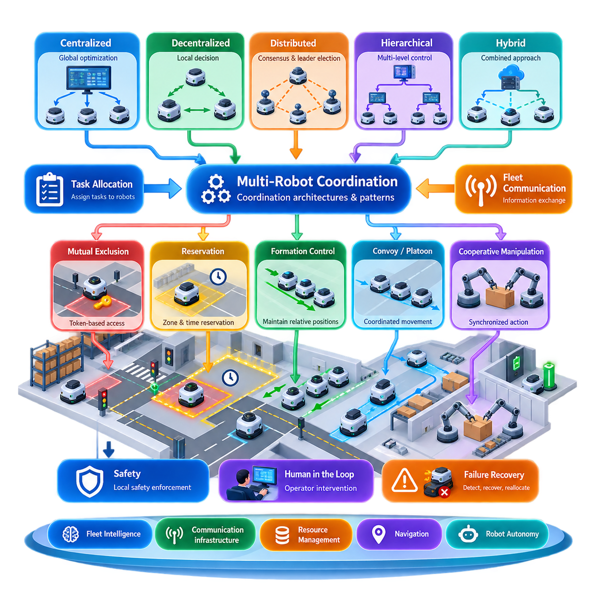
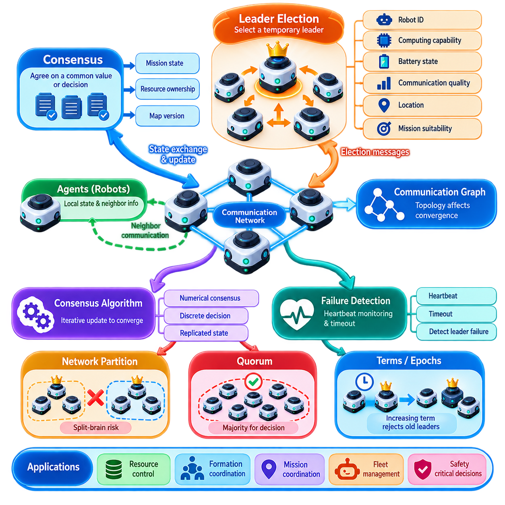
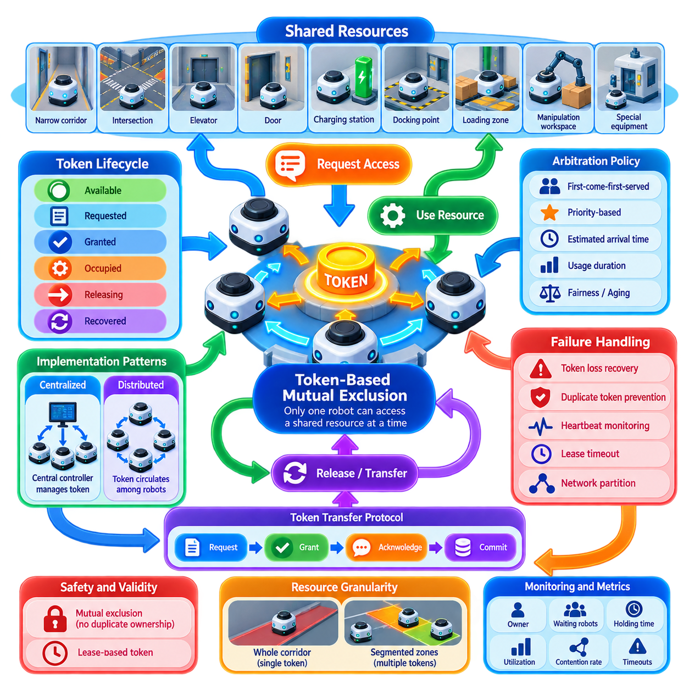
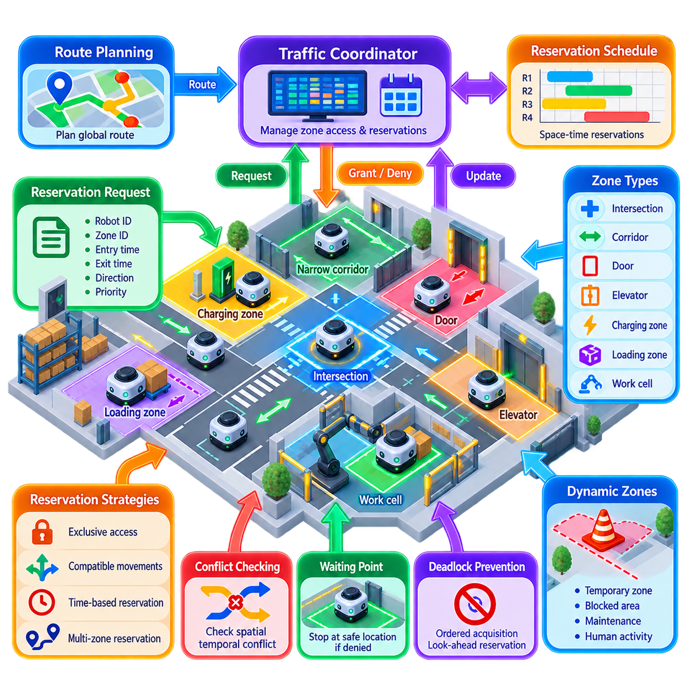
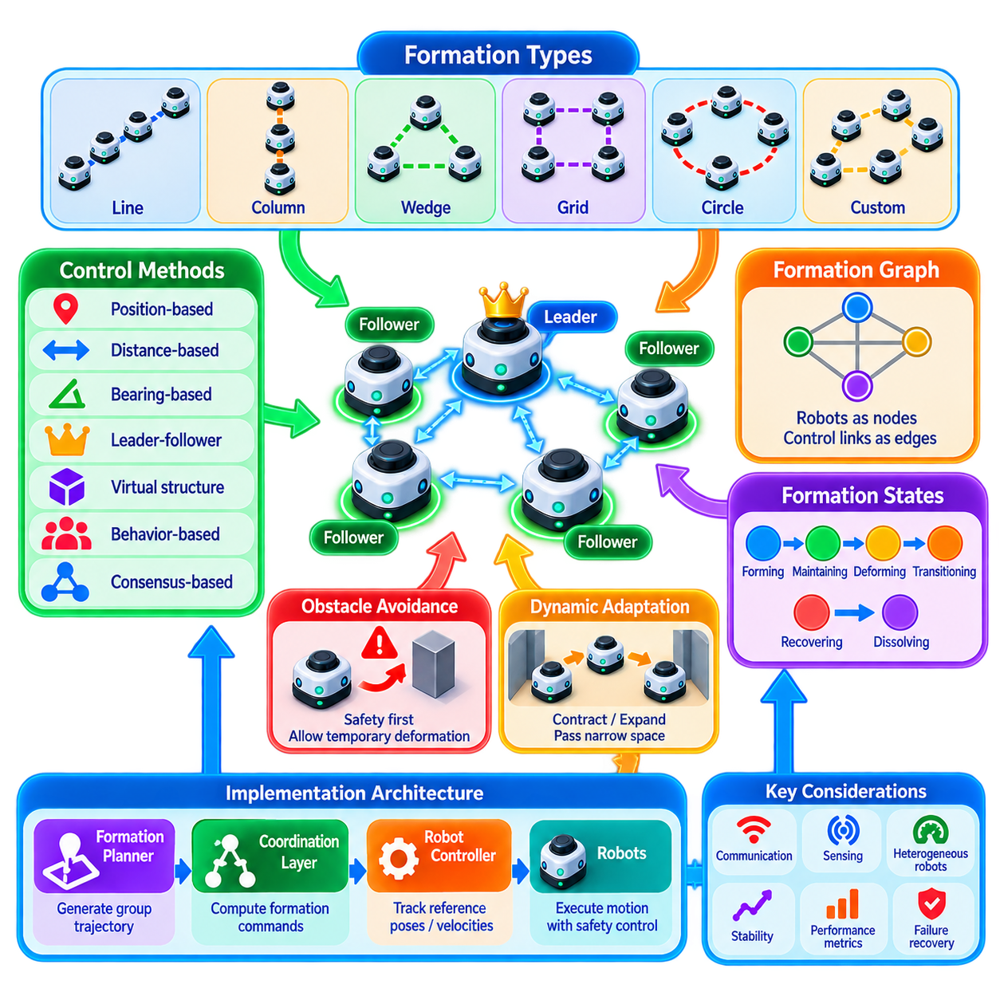
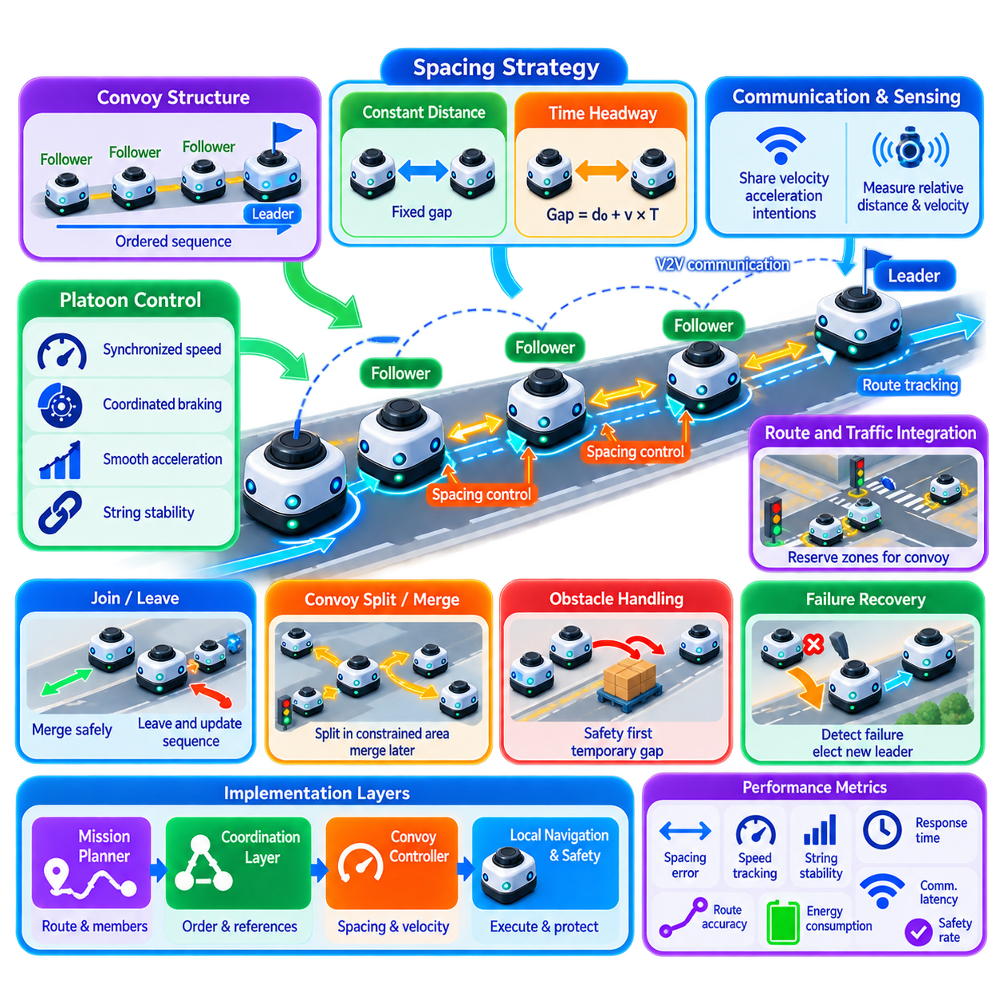
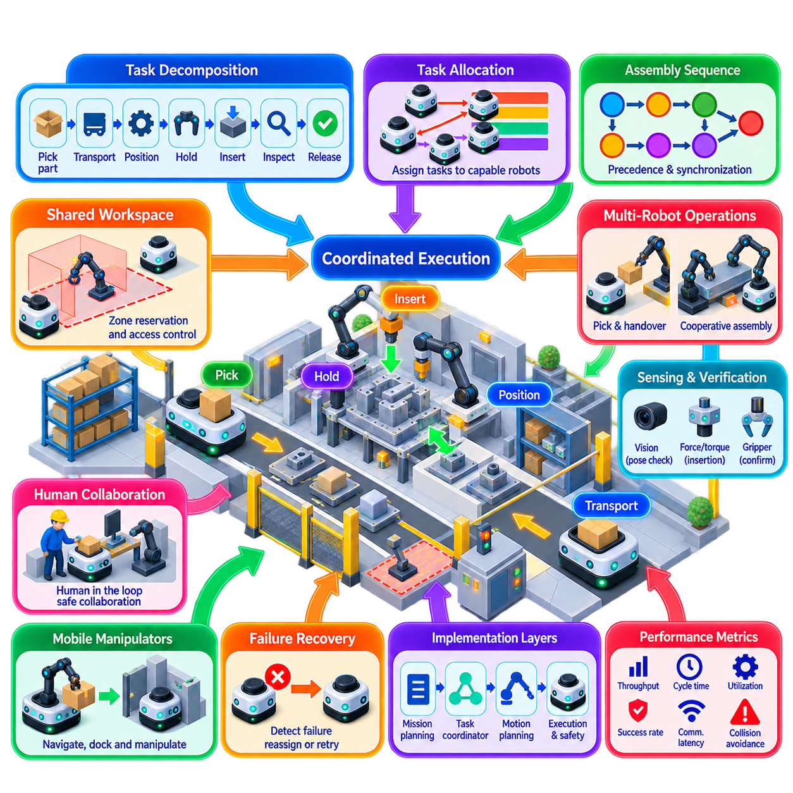
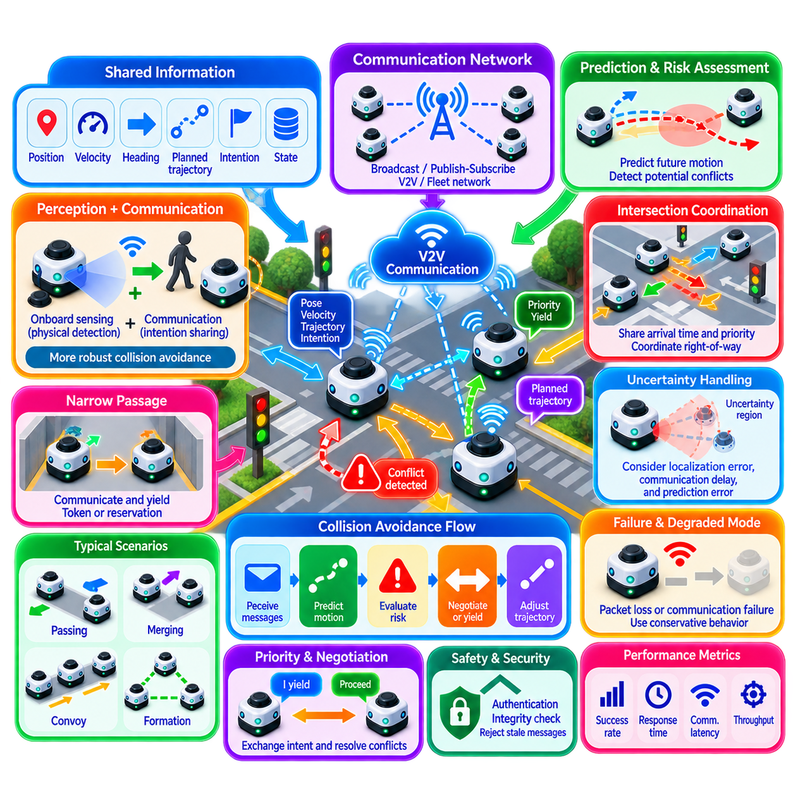
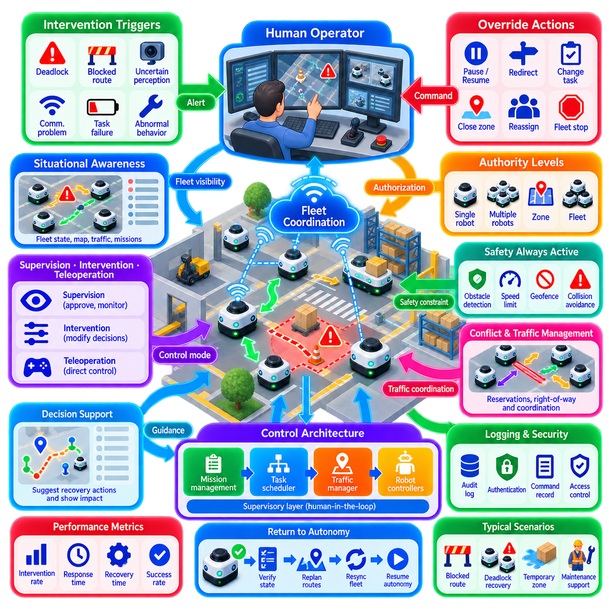

**Volume 16 Multi Robot and Fleet Intelligence**


# 03. Multi Robot Coordination

##  

## 03.01 Multi Robot Coordination Architectures and Patterns

{width="7.268055555555556in" height="7.268055555555556in"}

Multi-robot coordination defines the mechanisms through which multiple autonomous robots operate as a coherent system rather than as isolated machines. While task allocation determines which robot should perform a task, coordination determines how robots execute their assigned activities without creating conflicts, deadlocks, unsafe interactions, or unnecessary delays. It therefore connects individual autonomy with fleet-level operational behavior. :chatgpt-content-reference{index="0"}

A coordination architecture establishes where decisions are made, how information is exchanged, and which authority resolves conflicts. The major architectural patterns are centralized, decentralized, distributed, and hierarchical coordination. These patterns are not merely communication topologies; they define how responsibility for traffic, resources, synchronization, safety constraints, and collective behavior is divided across robots and supervisory systems.

In a centralized architecture, a fleet coordinator maintains a global representation of robot states, missions, routes, and shared resources. Robots report their current state to the coordinator, which evaluates interactions and issues coordination decisions. This model simplifies global optimization because one component can observe the operational system as a whole and resolve competing requests according to fleet-wide priorities.

Centralized coordination is particularly attractive for structured industrial environments such as warehouses, factories, hospitals, and logistics facilities. A central controller can manage intersections, narrow corridors, elevators, loading stations, chargers, and work cells while considering mission priorities. However, increasing fleet size raises computation, communication, and availability requirements, making scalability and fault tolerance essential design concerns.

Decentralized coordination places substantially more decision authority on individual robots. Each robot observes nearby agents, exchanges relevant state information, and determines its behavior according to common coordination rules. Instead of relying continuously on a global controller, robots can negotiate access to resources, adapt their motion, maintain formations, or react to local conflicts using peer-to-peer information and locally executed algorithms.

This pattern can improve resilience because the loss of one coordination node does not necessarily disable the entire fleet. It is also useful when communication with central infrastructure is intermittent or when robots operate across large environments. The difficulty is maintaining globally desirable behavior from local decisions. Incomplete observations, communication delays, inconsistent states, and simultaneous decisions can produce oscillation, congestion, or coordination conflicts.

Distributed coordination combines autonomous decision-making with explicit information sharing among multiple computational participants. Consensus algorithms can establish agreement on shared variables, while leader-election mechanisms dynamically designate a robot or controller to coordinate a particular operation. The chapter structure therefore naturally progresses from architectural patterns toward distributed consensus and leader election as concrete coordination mechanisms. :chatgpt-content-reference{index="1"}

Hierarchical architectures divide coordination into multiple decision levels. A fleet-level supervisor may assign operational objectives and global constraints, while regional controllers coordinate traffic within zones and individual robots execute local navigation and collision avoidance. Such decomposition allows different decisions to operate at appropriate spatial and temporal scales instead of forcing every interaction through either a completely centralized or completely decentralized mechanism.

Hybrid coordination is often practical for production fleets because different operational problems require different degrees of central authority. Global mission scheduling may be centralized, shared-resource arbitration may use distributed reservation, and immediate collision avoidance may remain entirely local. The architecture can therefore preserve fleet-level optimization while allowing robots to respond rapidly to nearby hazards without waiting for a remote decision.

A fundamental coordination pattern is mutual exclusion. When only one robot can safely occupy or use a resource, the system must guarantee exclusive access. A logical token can represent permission to enter an intersection, narrow aisle, elevator, docking station, or manipulation workspace. Only the robot holding the valid token proceeds, while other robots wait or negotiate for subsequent ownership. Token-based mutual exclusion is explicitly developed as a subsequent topic in this chapter. :chatgpt-content-reference{index="2"}

Reservation is a related pattern that introduces space and time into resource allocation. Instead of simply locking a resource, robots reserve zones, route segments, or facilities for predicted intervals. A traffic controller can reject overlapping reservations or shift arrival times to prevent conflicts before robots physically encounter one another. Zone-based traffic control is especially useful where predictable industrial traffic flows make shared areas clearly identifiable.

Coordination may also require robots to preserve geometric relationships rather than merely avoid conflicts. Formation control maintains desired relative positions among robots, while convoy and platoon control coordinates robots moving along common routes. These patterns require continuous state exchange and dynamic adjustment because errors in one robot\'s velocity or trajectory can propagate through the coordinated group. Both appear as dedicated extensions of the chapter architecture. :chatgpt-content-reference{index="3"}

Cooperative manipulation introduces tighter synchronization requirements. Two or more robots participating in assembly, transport, inspection, or pick-and-place operations may need to coordinate poses, timing, task phases, and shared workspace access. Coordination then extends beyond mobile traffic management into synchronized physical action, where a delayed or incorrectly sequenced robot can invalidate the entire operation or create a safety hazard.

Communication and coordination are consequently inseparable. Robots need sufficiently current information about neighboring positions, velocities, intentions, resource ownership, and operational states. Yet a robust architecture cannot assume perfect communication. Messages may be delayed, reordered, duplicated, or lost, so coordination protocols require timestamps, sequence information, timeouts, leases, acknowledgments, and conservative fallback behaviors where appropriate.

Intent sharing is especially important because current position alone does not reveal what another robot will do next. Broadcasting a planned trajectory, target zone, reservation request, or maneuver state allows other robots to anticipate future interactions. This converts coordination from purely reactive collision avoidance into predictive cooperation, reducing unnecessary stopping and enabling smoother traffic in dense fleets.

Safety must remain locally enforceable even when higher-level coordination exists. A fleet controller may authorize a route or reservation, but the robot should still reject motion that violates its immediate safety constraints. This separation prevents stale global information or network failures from directly commanding unsafe behavior. High-level coordination grants operational permission, while onboard safety and motion control retain final responsibility for physically executable actions.

Human intervention forms another layer of the coordination architecture. Operators may need to stop robots, release blocked resources, modify priorities, reroute missions, or recover abnormal situations. Such intervention must itself be coordinated so that a manual command affecting one robot does not invalidate assumptions held by other robots. The chapter therefore includes human-in-the-loop override as part of coordinated fleet operation rather than treating it as an external exception. :chatgpt-content-reference{index="4"}

Failure recovery is equally architectural. A robot can fail while holding a token, occupying a reserved zone, leading a formation, or participating in synchronized work. Coordination mechanisms must detect missing heartbeats or expired leases, invalidate obsolete ownership, reconstruct shared state, and safely redistribute responsibilities. Recovery rules should therefore be designed together with the normal coordination protocol rather than added after deployment.

The appropriate architecture ultimately depends on fleet scale, robot heterogeneity, environment structure, communication quality, safety requirements, and the degree of interaction among missions. No single pattern is universally optimal. Effective systems usually compose several mechanisms, selecting centralized optimization where global knowledge matters, distributed agreement where resilience matters, and local autonomy where response latency and physical safety dominate.

Multi-robot coordination should therefore be understood as a layered contract among fleet intelligence, communication infrastructure, resource management, navigation, and robot-level autonomy. The broader volume places it between robot task allocation and fleet communication, emphasizing this bridging role: tasks first establish responsibility, coordination governs collective execution, and communication provides the information pathways required to sustain that execution across the fleet.

다중 로봇 협업(Multi-Robot Coordination)은 여러 자율 로봇(Autonomous Robot)이 서로 독립된 기계로 동작하는 것이 아니라 하나의 일관된 시스템(Coherent System)으로 운영되도록 하는 메커니즘을 정의한다. 작업 할당(Task Allocation)이 어떤 로봇이 어떤 작업을 수행할지를 결정한다면, 협업(Coordination)은 할당된 작업을 충돌(Conflict), 교착 상태(Deadlock), 위험한 상호작용 또는 불필요한 지연 없이 어떻게 수행할지를 결정한다. 따라서 개별 자율성(Individual Autonomy)과 플릿 수준 운영 행동(Fleet-Level Operational Behavior)을 연결하는 역할을 한다.

협업 아키텍처(Coordination Architecture)는 의사결정이 어디에서 이루어지고, 정보가 어떻게 교환되며, 어떤 권한 주체가 충돌을 해결하는지를 규정한다. 주요 아키텍처 패턴(Architecture Pattern)은 중앙집중형(Centralized), 탈중앙형(Decentralized), 분산형(Distributed), 계층형(Hierarchical) 협업으로 구분할 수 있다. 이러한 패턴은 단순한 통신 토폴로지(Communication Topology)가 아니라 교통, 자원, 동기화, 안전 제약 및 집단 행동에 대한 책임을 로봇과 감독 시스템 사이에서 어떻게 분배할지를 정의한다.

중앙집중형 아키텍처(Centralized Architecture)에서는 플릿 코디네이터(Fleet Coordinator)가 로봇 상태, 미션(Mission), 경로(Route), 공유 자원(Shared Resource)에 대한 전역 표현(Global Representation)을 유지한다. 로봇들은 현재 상태를 코디네이터에 보고하고, 코디네이터는 로봇 간 상호작용을 평가하여 협업 결정을 내린다. 하나의 구성요소가 전체 운영 시스템을 관찰하고 플릿 전체의 우선순위에 따라 경쟁 요청을 해결할 수 있으므로 전역 최적화(Global Optimization)가 상대적으로 용이하다.

중앙집중형 협업(Centralized Coordination)은 창고, 공장, 병원, 물류 시설과 같은 구조화된 산업 환경(Structured Industrial Environment)에 특히 적합하다. 중앙 제어기(Central Controller)는 미션 우선순위를 고려하면서 교차로, 좁은 통로, 엘리베이터, 적재 스테이션, 충전기 및 작업 셀(Work Cell)을 관리할 수 있다. 그러나 플릿 규모가 증가할수록 연산, 통신 및 가용성 요구사항이 높아지므로 확장성(Scalability)과 결함 허용성(Fault Tolerance)이 핵심 설계 요소가 된다.

탈중앙형 협업(Decentralized Coordination)은 개별 로봇에 훨씬 많은 의사결정 권한을 부여한다. 각 로봇은 주변 에이전트(Agent)를 관찰하고 관련 상태 정보를 교환하며 공통 협업 규칙에 따라 자신의 행동을 결정한다. 전역 제어기에 지속적으로 의존하지 않고 로봇들이 자원 사용을 협상하고, 움직임을 조절하며, 대형(Formation)을 유지하거나 로컬 충돌(Local Conflict)에 대응할 수 있다.

이 패턴은 하나의 협업 노드(Coordination Node)가 손실되더라도 전체 플릿이 반드시 정지하는 것은 아니므로 복원력(Resilience)을 향상시킬 수 있다. 중앙 인프라와의 통신이 간헐적이거나 로봇이 넓은 환경에서 운용되는 경우에도 유용하다. 그러나 로컬 의사결정(Local Decision)만으로 전역적으로 바람직한 행동을 유지하는 것은 어렵다. 불완전한 관측, 통신 지연, 일관되지 않은 상태 및 동시 의사결정은 진동(Oscillation), 혼잡(Congestion), 협업 충돌을 발생시킬 수 있다.

분산형 협업(Distributed Coordination)은 자율적인 의사결정과 여러 계산 주체 사이의 명시적인 정보 공유를 결합한다. 합의 알고리즘(Consensus Algorithm)을 통해 공유 변수에 대한 일치를 형성할 수 있으며, 리더 선출(Leader Election) 메커니즘을 통해 특정 작업을 조정할 로봇이나 제어기를 동적으로 지정할 수 있다. 따라서 협업 아키텍처의 기본 개념은 분산 합의(Distributed Consensus)와 리더 선출이라는 구체적인 협업 메커니즘으로 자연스럽게 확장된다.

계층형 아키텍처(Hierarchical Architecture)는 협업 기능을 여러 의사결정 수준으로 나눈다. 플릿 수준 감독기(Fleet-Level Supervisor)가 운영 목표와 전역 제약조건(Global Constraint)을 할당하고, 지역 제어기(Regional Controller)가 각 구역의 교통을 조정하며, 개별 로봇은 로컬 내비게이션(Local Navigation)과 충돌 회피(Collision Avoidance)를 수행할 수 있다. 이를 통해 모든 상호작용을 하나의 중앙 또는 완전한 탈중앙 메커니즘으로 처리하지 않고 각 의사결정을 적절한 공간적·시간적 규모에서 수행할 수 있다.

하이브리드 협업(Hybrid Coordination)은 서로 다른 운영 문제가 서로 다른 수준의 중앙 권한을 필요로 하기 때문에 실제 운영 플릿에서 특히 실용적이다. 전역 미션 스케줄링(Global Mission Scheduling)은 중앙집중식으로 수행하고, 공유 자원의 중재는 분산 예약(Distributed Reservation)을 이용하며, 즉각적인 충돌 회피는 완전히 로컬에서 수행할 수 있다. 이를 통해 플릿 수준 최적화를 유지하면서도 로봇은 원격 의사결정을 기다리지 않고 주변 위험에 신속하게 대응할 수 있다.

협업의 기본 패턴 중 하나는 상호 배제(Mutual Exclusion)이다. 하나의 로봇만 안전하게 점유하거나 사용할 수 있는 자원에서는 시스템이 독점적인 접근(Exclusive Access)을 보장해야 한다. 논리적 토큰(Logical Token)은 교차로, 좁은 통로, 엘리베이터, 도킹 스테이션(Docking Station), 조작 작업공간에 진입할 수 있는 권한을 나타낼 수 있다. 유효한 토큰을 보유한 로봇만 진행하며 다른 로봇은 대기하거나 다음 소유권을 협상한다.

예약(Reservation)은 자원 할당(Resource Allocation)에 공간과 시간의 개념을 추가하는 관련 패턴이다. 단순히 자원을 잠그는 대신 로봇은 특정 시간 구간에 대해 구역, 경로 세그먼트(Route Segment) 또는 시설을 예약할 수 있다. 교통 제어기(Traffic Controller)는 중복되는 예약을 거부하거나 도착 시간을 조정하여 로봇이 실제로 마주치기 전에 충돌을 예방할 수 있다. 구역 기반 교통 제어(Zone-Based Traffic Control)는 공유 영역을 명확하게 정의할 수 있는 산업 환경에서 특히 효과적이다.

협업은 단순히 충돌을 피하는 것을 넘어 로봇들이 특정 기하학적 관계(Geometric Relationship)를 유지하도록 요구할 수도 있다. 대형 제어(Formation Control)는 로봇 간 원하는 상대 위치를 유지하며, 호송 및 플래툰 제어(Convoy and Platoon Control)는 공통 경로를 이동하는 로봇들을 조정한다. 한 로봇의 속도 또는 궤적 오차가 협업 그룹 전체로 전파될 수 있으므로 이러한 패턴에서는 지속적인 상태 교환과 동적 조정(Dynamic Adjustment)이 필요하다.

협동 조작(Cooperative Manipulation)은 더욱 엄격한 동기화(Synchronization)를 요구한다. 조립, 운송, 검사 또는 픽앤플레이스(Pick-and-Place) 작업에 두 대 이상의 로봇이 참여하는 경우 자세(Pose), 타이밍, 작업 단계 및 공유 작업공간 접근을 조정해야 한다. 이 경우 협업은 이동 교통 관리의 범위를 넘어 동기화된 물리적 행동(Synchronized Physical Action)으로 확장되며, 하나의 로봇에서 발생한 지연이나 잘못된 작업 순서가 전체 작업을 무효화하거나 안전 위험을 발생시킬 수 있다.

따라서 통신(Communication)과 협업(Coordination)은 서로 분리하기 어렵다. 로봇은 주변 로봇의 위치, 속도, 의도(Intention), 자원 소유권 및 운영 상태에 대해 충분히 최신의 정보를 확보해야 한다. 그러나 강건한 아키텍처(Robust Architecture)는 완벽한 통신을 전제로 해서는 안 된다. 메시지는 지연되거나 순서가 변경되고, 중복되거나 손실될 수 있으므로 협업 프로토콜에는 타임스탬프(Timestamp), 순서 정보, 타임아웃(Timeout), 리스(Lease), 확인 응답(Acknowledgment), 보수적인 폴백 행동(Fallback Behavior)이 필요하다.

의도 공유(Intent Sharing)는 현재 위치만으로 다른 로봇이 다음에 무엇을 할 것인지 알 수 없다는 점에서 특히 중요하다. 계획된 궤적(Planned Trajectory), 목표 구역, 예약 요청 또는 기동 상태를 공유하면 다른 로봇이 미래의 상호작용을 사전에 예측할 수 있다. 이는 협업을 단순한 반응형 충돌 회피(Reactive Collision Avoidance)에서 예측형 협력(Predictive Cooperation)으로 전환하여 불필요한 정지를 줄이고 고밀도 플릿(Dense Fleet)의 교통 흐름을 더욱 원활하게 한다.

상위 수준의 협업 기능이 존재하더라도 안전(Safety)은 로봇 로컬에서 강제될 수 있어야 한다. 플릿 제어기(Fleet Controller)가 경로나 예약을 승인했더라도 로봇은 즉각적인 안전 제약을 위반하는 움직임을 거부할 수 있어야 한다. 이러한 분리를 통해 오래된 전역 정보나 네트워크 장애가 직접적으로 위험한 행동을 명령하는 것을 방지할 수 있다. 상위 수준 협업은 운영 권한을 제공하고, 온보드 안전(Onboard Safety)과 모션 제어(Motion Control)는 실제 실행 가능한 행동에 대한 최종 책임을 유지한다.

사람의 개입(Human Intervention)은 협업 아키텍처의 또 다른 계층을 형성한다. 운영자는 로봇을 정지시키거나, 차단된 자원을 해제하고, 우선순위를 변경하거나, 미션 경로를 수정하고, 비정상 상황을 복구해야 할 수 있다. 이러한 개입 자체도 협업되어야 하며, 한 로봇에 대한 수동 명령이 다른 로봇들이 유지하고 있는 상태와 가정을 무효화해서는 안 된다. 따라서 휴먼 인 더 루프 오버라이드(Human-in-the-Loop Override)는 외부 예외가 아니라 협업 플릿 운영의 일부로 다루어져야 한다.

장애 복구(Failure Recovery) 역시 아키텍처 수준에서 고려되어야 한다. 로봇은 토큰을 보유하거나 예약 구역을 점유하고, 대형을 이끌거나 동기화 작업에 참여하는 동안 고장날 수 있다. 협업 메커니즘은 하트비트(Heartbeat) 손실이나 리스 만료를 감지하고, 오래된 소유권을 무효화하며, 공유 상태를 재구성하고, 책임을 안전하게 재분배할 수 있어야 한다. 따라서 복구 규칙은 배포 이후 추가되는 기능이 아니라 정상 협업 프로토콜과 함께 설계되어야 한다.

적절한 아키텍처는 궁극적으로 플릿 규모(Fleet Scale), 로봇 이기종성(Robot Heterogeneity), 환경 구조, 통신 품질, 안전 요구사항 및 미션 간 상호작용 수준에 따라 결정된다. 모든 환경에서 최적인 단일 패턴은 존재하지 않는다. 효과적인 시스템은 일반적으로 여러 메커니즘을 결합하여 전역 지식이 중요한 곳에서는 중앙집중형 최적화를, 복원력이 중요한 곳에서는 분산 합의를, 응답 지연과 물리적 안전이 중요한 곳에서는 로컬 자율성(Local Autonomy)을 선택한다.

따라서 다중 로봇 협업(Multi-Robot Coordination)은 플릿 지능(Fleet Intelligence), 통신 인프라(Communication Infrastructure), 자원 관리(Resource Management), 내비게이션(Navigation), 로봇 수준 자율성(Robot-Level Autonomy) 사이에 형성되는 계층화된 계약(Layered Contract)으로 이해할 수 있다. 작업 할당이 먼저 수행 책임을 결정한다면, 협업은 집단 실행을 관리하고, 통신은 전체 플릿에서 이러한 실행을 지속하기 위해 필요한 정보 경로를 제공한다.

##  

## 03.02 Distributed Consensus and Leader Election [w/Code]

{width="7.268055555555556in" height="7.268055555555556in"}

Distributed consensus is the process by which multiple robots or computational nodes establish a sufficiently consistent decision without depending on a permanently centralized authority. In multi-robot systems, consensus may concern a shared mission state, resource ownership, coordination mode, formation reference, map version, or selected coordinator. The objective is not simply communication, but agreement despite asynchronous execution and partial failures.

A distributed robot fleet can be modeled as a network of agents connected by communication links. Each robot maintains local state and receives information from a subset of other robots, often called its neighbors. The resulting communication graph determines which information can propagate through the fleet. Consensus becomes possible when the graph provides sufficient connectivity for relevant states and decisions to reach participating agents.

Consensus algorithms repeatedly combine locally available information so that individual states converge toward a common value or compatible decision. A simple numerical consensus rule updates each robot\'s estimate using its own value and those received from neighboring robots. Repeated exchanges gradually reduce disagreement. More sophisticated protocols extend this principle to discrete decisions, replicated state, distributed coordination, and fault-tolerant agreement.

The distinction between consensus and synchronization is important. Synchronization attempts to align variables such as time, velocity, phase, or motion, whereas consensus establishes agreement about a value, state, or decision. The two mechanisms frequently interact. A robot formation, for example, may require consensus about the desired formation mode while simultaneously synchronizing motion among participating robots.

Consensus performance depends strongly on communication topology. Fully connected networks can distribute information rapidly but require many communication links, while sparse topologies reduce bandwidth requirements at the cost of slower convergence and greater sensitivity to link failures. Dynamic robot fleets complicate this further because connectivity changes as robots move, obstacles block wireless paths, or robots temporarily leave communication range.

Leader election addresses situations in which one participant must temporarily assume a distinguished coordination role. Instead of configuring a permanent central controller, robots execute a protocol that selects one eligible node as leader. The leader may coordinate a mission, serialize access to a shared resource, provide a formation reference, aggregate information, or represent a robot group when communicating with another subsystem.

A leader-election protocol generally requires each participating robot to possess an identity and sufficient information to determine whether another candidate has higher priority. Selection can use a unique robot identifier, computational capability, battery state, communication quality, mission suitability, location, or a composite priority score. The election policy should reflect operational requirements rather than assuming that the robot with the numerically highest identifier is always the best coordinator.

Leader election begins when robots detect that leadership is required or that the existing leader is no longer valid. Candidates exchange election messages and compare their eligibility according to a deterministic rule. When the protocol terminates, participating robots must agree on the same leader for the relevant coordination domain. The result should also carry an election term, epoch, or generation number so that obsolete leadership information can be rejected.

Failure detection is therefore closely connected to leader election. Robots commonly monitor a leader through periodic heartbeat messages or state updates. When several expected heartbeats are missed, followers may suspect that the leader has failed and initiate a new election. The timeout must be selected carefully because an excessively short timeout can interpret temporary network delay as failure, while an excessively long timeout delays recovery from a genuine fault.

Network partitions create one of the most difficult conditions for distributed coordination. If a fleet is divided into disconnected communication groups, each group may incorrectly conclude that the other side has failed. Independent leader elections can then produce multiple leaders, creating a split-brain condition. Systems handling safety-critical resources must prevent two isolated leaders from simultaneously issuing conflicting permissions based on incomplete knowledge.

Quorum-based decision making is one method for reducing this risk. Rather than allowing any reachable subset of robots to make authoritative decisions, a decision requires approval from a defined majority or quorum. Because two strict majorities cannot be completely disjoint within the same membership configuration, quorum mechanisms can preserve stronger consistency. Their limitation is reduced availability when too few participants remain mutually reachable.

Terms and epochs provide temporal ordering for leadership. Every successful election advances a monotonically increasing logical generation, and messages associated with an older generation are considered stale. If an old leader reconnects after a communication failure, it can observe the newer term and relinquish authority rather than continuing to behave as leader. This simple concept is fundamental to preventing outdated coordination state from re-entering active operation.

Distributed consensus must also distinguish safety from liveness. Safety means that the system does not reach mutually contradictory authoritative decisions, such as assigning exclusive ownership of the same resource to two robots. Liveness means that the fleet eventually continues making progress. A conservative protocol may preserve safety during communication failure by stopping affected operations, but this can temporarily sacrifice liveness until sufficient connectivity is restored.

Strong consistency is not necessary for every fleet variable. Safety-critical ownership, leadership, and shared-resource permissions may require strict agreement, whereas telemetry, local obstacle observations, or approximate traffic density can tolerate temporary differences. Practical architectures therefore classify data according to consistency requirements instead of applying an expensive consensus protocol to every state exchanged among robots.

Consensus latency also affects physical behavior. An algorithm that requires several communication rounds may be acceptable for electing a regional coordinator but unsuitable for millisecond-scale collision avoidance. Immediate safety reactions should remain local, while distributed consensus handles decisions whose time horizon permits network interaction. This separation prevents communication latency from becoming part of the robot\'s lowest-level safety loop.

Leader election can also be hierarchical. A large fleet may be divided into zones or operational groups, each electing a local leader. Local leaders can coordinate with a higher-level supervisor or elect a representative among themselves. This reduces communication overhead and limits the scope of failures. A warehouse fleet, outdoor robot team, or multi-floor facility can therefore maintain distributed coordination without requiring every robot to participate in every global decision.

The elected leader should not become an uncontrolled single point of failure. Important state can be replicated among followers, and leadership should be transferable when the current leader becomes unavailable or unsuitable. Planned handover may occur because of low battery, maintenance, communication degradation, or movement outside the relevant zone. Unplanned election handles crashes and abrupt disconnections, while graceful transfer minimizes disruption during predictable changes.

Robot heterogeneity introduces additional considerations. A fleet may contain robots with different processors, sensors, mobility characteristics, communication interfaces, and energy reserves. Leader eligibility can therefore incorporate capability constraints. A robot with reliable network connectivity and sufficient computational resources may be preferred for coordination, while a robot performing a critical physical task may deliberately be excluded from leadership to preserve its computational and communication capacity.

Implementation requires explicit management of message identity, sequence, timeout, membership, and state transitions. Election messages should identify the sender, election term, candidate, and relevant coordination group. Duplicate and delayed messages must not reverse a completed election. State machines are commonly used to represent follower, candidate, and leader roles because they make leadership transitions and exceptional conditions easier to reason about and test.

Testing must include more than the normal case in which every robot communicates correctly. Validation should inject packet loss, variable latency, duplicate messages, robot crashes, delayed restarts, leader failures, temporary partitions, and simultaneous election attempts. The important question is not merely whether a new leader is eventually selected, but whether conflicting authority can arise during the transition and whether the fleet returns to a consistent operational state.

In production multi-robot systems, distributed consensus and leader election should be applied selectively as coordination primitives rather than as universal solutions. Local autonomy remains responsible for immediate motion and safety, while consensus establishes shared decisions that genuinely require agreement. Combined with resource reservation, traffic control, task allocation, and resilient communication, these mechanisms allow a fleet to coordinate without making continuous operation dependent on a single permanent decision point.

분산 합의(Distributed Consensus)는 여러 로봇 또는 연산 노드(Computational Node)가 영구적인 중앙집중식 권한에 의존하지 않고 충분히 일관된 의사결정을 수립하는 과정이다. 다중 로봇 시스템(Multi-Robot System)에서 합의 대상은 공유 미션 상태, 자원 소유권, 협업 모드, 대형 기준, 지도 버전 또는 선택된 코디네이터(Coordinator) 등이 될 수 있다. 목표는 단순한 통신이 아니라 비동기 실행과 부분적인 장애 상황에서도 합의를 달성하는 것이다.

분산 로봇 플릿(Distributed Robot Fleet)은 통신 링크(Communication Link)로 연결된 에이전트(Agent)들의 네트워크로 모델링할 수 있다. 각 로봇은 로컬 상태(Local State)를 유지하면서 일반적으로 이웃(Neighbor)이라고 불리는 일부 다른 로봇으로부터 정보를 수신한다. 이렇게 형성된 통신 그래프(Communication Graph)는 정보가 플릿 내부에서 어떻게 전파될 수 있는지를 결정한다. 관련 상태와 결정이 참여 에이전트들에게 전달될 수 있을 만큼 그래프에 충분한 연결성이 존재해야 합의가 가능하다.

합의 알고리즘(Consensus Algorithm)은 로컬에서 이용할 수 있는 정보를 반복적으로 결합하여 개별 상태가 공통 값 또는 서로 호환되는 결정으로 수렴하도록 한다. 단순한 수치 합의 규칙은 각 로봇이 자신의 값과 이웃 로봇으로부터 수신한 값을 이용하여 추정치를 갱신한다. 이러한 정보 교환을 반복하면 로봇 간 불일치가 점차 감소한다. 보다 정교한 프로토콜은 이러한 원리를 이산적 의사결정, 복제 상태, 분산 협업 및 결함 허용 합의(Fault-Tolerant Agreement)로 확장한다.

합의(Consensus)와 동기화(Synchronization)의 차이를 이해하는 것은 중요하다. 동기화는 시간, 속도, 위상 또는 움직임과 같은 변수를 서로 맞추는 것을 목표로 하지만, 합의는 특정 값, 상태 또는 의사결정에 대해 일치된 결과를 만드는 것이다. 두 메커니즘은 자주 함께 사용된다. 예를 들어 로봇 대형(Formation)은 원하는 대형 모드에 대한 합의와 동시에 참여 로봇 사이의 움직임 동기화를 요구할 수 있다.

합의 성능은 통신 토폴로지(Communication Topology)에 크게 의존한다. 완전 연결 네트워크(Fully Connected Network)는 정보를 빠르게 배포할 수 있지만 많은 통신 링크를 필요로하며, 희소 토폴로지(Sparse Topology)는 대역폭 요구량을 줄이는 대신 수렴 속도가 느려지고 링크 장애에 더욱 민감해질 수 있다. 동적 로봇 플릿에서는 로봇 이동, 장애물에 의한 무선 경로 차단 또는 일시적인 통신 범위 이탈로 연결성이 계속 변화하기 때문에 문제가 더욱 복잡해진다.

리더 선출(Leader Election)은 하나의 참여자가 일시적으로 특별한 협업 역할을 담당해야 하는 상황을 처리한다. 영구적인 중앙 제어기를 설정하는 대신 로봇들은 하나의 적격 노드를 리더(Leader)로 선택하는 프로토콜을 실행한다. 리더는 미션을 조정하거나, 공유 자원 접근 순서를 결정하거나, 대형의 기준을 제공하고, 정보를 집계하거나, 다른 서브시스템과 통신할 때 로봇 그룹을 대표할 수 있다.

리더 선출 프로토콜(Leader-Election Protocol)은 일반적으로 각 참여 로봇이 고유한 식별자(Identity)를 가지고 다른 후보가 더 높은 우선순위를 갖는지를 판단할 수 있는 충분한 정보를 보유하도록 요구한다. 선택 기준에는 고유 로봇 식별자, 연산 성능, 배터리 상태, 통신 품질, 미션 적합성, 위치 또는 복합 우선순위 점수(Composite Priority Score)를 사용할 수 있다. 선출 정책은 단순히 가장 큰 식별자를 가진 로봇을 선택하는 것이 아니라 실제 운영 요구사항을 반영해야 한다.

리더 선출은 로봇들이 리더십(Leadership)이 필요하거나 기존 리더가 더 이상 유효하지 않다고 판단할 때 시작된다. 후보들은 선출 메시지(Election Message)를 교환하고 결정론적 규칙(Deterministic Rule)에 따라 자신의 적격성을 비교한다. 프로토콜이 종료되면 참여 로봇들은 해당 협업 영역에서 동일한 리더에 동의해야 한다. 또한 선출 결과에는 이전 리더십 정보를 거부할 수 있도록 선출 텀(Election Term), 에포크(Epoch) 또는 세대 번호(Generation Number)가 포함되어야 한다.

따라서 장애 감지(Failure Detection)는 리더 선출과 밀접하게 연결된다. 로봇들은 일반적으로 주기적인 하트비트(Heartbeat) 메시지 또는 상태 업데이트를 이용하여 리더를 감시한다. 예상된 하트비트가 여러 차례 수신되지 않으면 팔로워(Follower)는 리더 장애를 의심하고 새로운 선출을 시작할 수 있다. 지나치게 짧은 타임아웃은 일시적인 네트워크 지연을 장애로 오인할 수 있고, 지나치게 긴 타임아웃은 실제 장애에 대한 복구를 지연시키므로 신중하게 설정해야 한다.

네트워크 분할(Network Partition)은 분산 협업에서 가장 어려운 상황 중 하나를 만든다. 플릿이 서로 통신할 수 없는 그룹으로 분리되면 각 그룹은 상대 그룹이 장애 상태라고 잘못 판단할 수 있다. 각각 독립적인 리더 선출이 이루어지면 여러 리더가 동시에 생성되는 스플릿 브레인(Split-Brain) 상태가 발생할 수 있다. 안전 필수 자원(Safety-Critical Resource)을 관리하는 시스템에서는 서로 분리된 두 리더가 불완전한 정보를 기반으로 충돌하는 권한을 동시에 발행하지 못하도록 해야 한다.

정족수 기반 의사결정(Quorum-Based Decision Making)은 이러한 위험을 줄이는 방법 중 하나이다. 통신 가능한 임의의 로봇 집합이 권위 있는 결정을 내리도록 허용하는 대신 정의된 과반수 또는 정족수(Quorum)의 승인을 요구한다. 동일한 구성원 설정에서 두 개의 엄격한 과반수 집합은 완전히 분리될 수 없으므로 정족수 메커니즘은 더 강한 일관성(Consistency)을 유지할 수 있다. 그러나 서로 통신 가능한 참여자가 충분하지 않으면 가용성(Availability)이 감소한다.

텀(Term)과 에포크(Epoch)는 리더십에 시간적 순서(Temporal Ordering)를 부여한다. 성공적인 선출이 이루어질 때마다 단조 증가하는 논리적 세대(Logical Generation)가 증가하고, 이전 세대와 연관된 메시지는 오래된 상태로 간주된다. 통신 장애 이후 이전 리더가 다시 연결되면 새로운 텀을 확인하고 리더 권한을 포기할 수 있다. 이러한 단순한 개념은 오래된 협업 상태가 현재 운영에 다시 진입하는 것을 방지하는 데 핵심적인 역할을 한다.

분산 합의는 안전성(Safety)과 활성성(Liveness)을 구분해야 한다. 안전성은 동일한 자원에 대해 두 로봇에 독점 소유권을 동시에 부여하는 것처럼 시스템이 서로 모순되는 권위 있는 결정을 내리지 않는 것을 의미한다. 활성성은 플릿이 궁극적으로 계속 진행할 수 있음을 의미한다. 보수적인 프로토콜은 통신 장애 동안 관련 작업을 정지하여 안전성을 유지할 수 있지만, 충분한 연결성이 복구될 때까지 일시적으로 활성성을 희생할 수 있다.

모든 플릿 변수에 강한 일관성(Strong Consistency)이 필요한 것은 아니다. 안전 필수 소유권, 리더십 및 공유 자원 접근 권한에는 엄격한 합의가 필요할 수 있지만, 텔레메트리(Telemetry), 로컬 장애물 관측 또는 대략적인 교통 밀도 정보는 일시적인 차이를 허용할 수 있다. 따라서 실용적인 아키텍처는 모든 로봇 상태에 비용이 높은 합의 프로토콜을 적용하는 대신 데이터의 일관성 요구 수준에 따라 상태를 분류한다.

합의 지연(Consensus Latency)은 로봇의 물리적 행동에도 영향을 미친다. 여러 번의 통신 라운드를 필요로 하는 알고리즘은 지역 코디네이터(Regional Coordinator)를 선출하는 데는 적합할 수 있지만 밀리초 단위의 충돌 회피에는 적합하지 않다. 즉각적인 안전 대응은 로컬에서 수행하고, 네트워크 상호작용을 허용할 수 있는 시간 범위의 결정에 분산 합의를 적용해야 한다. 이러한 분리는 통신 지연이 로봇의 최하위 안전 루프(Safety Loop)에 포함되는 것을 방지한다.

리더 선출은 계층형(Hierarchical)으로 구성할 수도 있다. 대규모 플릿을 여러 구역 또는 운영 그룹으로 나누고 각 그룹에서 로컬 리더(Local Leader)를 선출할 수 있다. 로컬 리더들은 상위 수준 감독기와 협업하거나 자신들 사이에서 대표자를 다시 선출할 수 있다. 이를 통해 통신 오버헤드를 줄이고 장애의 영향을 특정 영역으로 제한할 수 있다. 따라서 창고 플릿, 실외 로봇 팀 또는 다층 시설에서도 모든 로봇이 모든 전역 결정에 참여하지 않고 분산 협업을 유지할 수 있다.

선출된 리더가 통제되지 않는 단일 장애점(Single Point of Failure)이 되어서는 안 된다. 중요한 상태는 팔로워 사이에 복제될 수 있으며, 현재 리더가 사용할 수 없거나 역할 수행에 적합하지 않게 되면 리더십을 이전할 수 있어야 한다. 배터리 부족, 유지보수, 통신 품질 저하 또는 관련 구역 이탈 등으로 계획된 인계(Planned Handover)가 발생할 수 있다. 비계획 선출은 충돌이나 갑작스러운 연결 단절에 대응하고, 정상적인 리더 이전(Graceful Transfer)은 예측 가능한 변화에서 운영 중단을 최소화한다.

로봇 이기종성(Robot Heterogeneity)은 추가적인 고려사항을 만든다. 플릿에는 서로 다른 프로세서, 센서, 이동 특성, 통신 인터페이스 및 에너지 잔량을 가진 로봇들이 포함될 수 있다. 따라서 리더 적격성(Leader Eligibility)에 성능 제약을 포함할 수 있다. 안정적인 네트워크 연결과 충분한 연산 자원을 가진 로봇을 협업 리더로 우선 선택할 수 있으며, 중요한 물리 작업을 수행하는 로봇은 연산 및 통신 자원을 보존하기 위해 의도적으로 리더 후보에서 제외할 수도 있다.

구현에서는 메시지 식별(Message Identity), 순서(Sequence), 타임아웃, 구성원 관리(Membership), 상태 전이(State Transition)를 명시적으로 관리해야 한다. 선출 메시지는 송신자, 선출 텀, 후보 및 관련 협업 그룹을 식별할 수 있어야 한다. 중복되거나 지연된 메시지가 이미 완료된 선출 결과를 되돌려서는 안 된다. 팔로워(Follower), 후보(Candidate), 리더(Leader) 역할을 표현하기 위해 상태 머신(State Machine)이 일반적으로 사용되며, 이를 통해 리더십 전이와 예외 상황을 더욱 명확하게 분석하고 시험할 수 있다.

시험(Testing)은 모든 로봇이 정상적으로 통신하는 일반적인 상황만을 포함해서는 안 된다. 패킷 손실(Packet Loss), 가변 지연, 중복 메시지, 로봇 충돌, 지연된 재시작, 리더 장애, 일시적인 네트워크 분할 및 동시 선출 시도 등을 의도적으로 주입하여 검증해야 한다. 중요한 것은 단순히 새로운 리더가 최종적으로 선택되는지가 아니라 전환 과정에서 충돌하는 권한이 발생할 수 있는지, 그리고 플릿이 다시 일관된 운영 상태로 복귀하는지를 확인하는 것이다.

실제 다중 로봇 시스템(Production Multi-Robot System)에서 분산 합의와 리더 선출은 모든 문제에 적용하는 범용 해법이 아니라 선택적으로 사용하는 협업 기본 메커니즘(Coordination Primitive)으로 적용해야 한다. 로컬 자율성(Local Autonomy)은 즉각적인 움직임과 안전을 담당하고, 합의는 실제로 공동의 동의가 필요한 공유 의사결정을 수립한다. 자원 예약, 교통 제어, 작업 할당 및 복원력 있는 통신과 결합하면 이러한 메커니즘은 플릿의 지속적인 운영을 하나의 영구적인 의사결정 지점에 의존하지 않고도 여러 로봇이 체계적으로 협업할 수 있도록 한다.

##  

## 03.03 Token Based Mutual Exclusion for Shared Resources [w/Code]

{width="7.268055555555556in" height="7.268055555555556in"}

Token-based mutual exclusion is a coordination mechanism that ensures only one robot or authorized agent can access a shared resource at a given time. The fundamental idea is simple: possession of a unique logical token represents permission to enter, occupy, or operate the protected resource. Robots without the token must wait, preventing simultaneous access that could cause collisions, interference, inconsistent operations, or unsafe physical interactions.

Shared resources in multi-robot systems include narrow corridors, intersections, elevators, doors, charging stations, docking points, loading zones, manipulation workspaces, and specialized equipment. Unlike ordinary obstacles, these resources cannot always be handled efficiently through local collision avoidance alone. Multiple robots may independently determine that the resource is available, creating a race condition unless access authority is explicitly coordinated.

A token acts as a distributed representation of exclusive ownership. At any valid moment, exactly one participating robot should possess the token associated with a particular resource or resource group. Before entering the protected area, a robot requests or acquires the token. After completing its operation and leaving the resource, it releases or transfers the token so another waiting robot can proceed.

The mutual exclusion property requires that two robots must never simultaneously believe they hold valid authority for the same exclusive resource. This safety invariant is more important than maximizing throughput because violating it can create physical collisions or conflicting commands. The protocol must therefore define token identity, current ownership, validity period, transfer rules, and recovery behavior clearly enough to prevent duplicate ownership.

A centralized token manager is one practical implementation pattern. Robots send acquisition requests to a fleet controller or resource manager, which maintains the authoritative token state and grants access to one requester at a time. This approach simplifies arbitration and monitoring because the controller has a global view of waiting requests, priorities, robot states, and resource occupancy, although controller availability becomes an important system dependency.

A distributed implementation removes the requirement for a permanent central token authority. The token may circulate among participating robots, or robots may collectively determine which agent receives ownership next. Token-ring concepts are one example, although physical robot communication networks do not necessarily need to form a literal ring. The logical token-transfer topology can be independent of the underlying wireless communication topology.

Token acquisition typically begins before the robot physically reaches the shared resource. A robot approaching a narrow passage, for example, can request access while still positioned at a safe waiting point. If the token is available, ownership is granted and the robot proceeds. If another robot already owns it, the requester remains outside the protected region until ownership is transferred, avoiding unnecessary confrontation inside constrained space.

The token lifecycle can be represented by states such as available, requested, granted, occupied, releasing, and recovered. Separating authorization from physical occupancy is important. A robot may hold permission before entering the resource, and it may physically remain inside the resource after communication conditions change. The coordination system should therefore distinguish logical token ownership from verified physical occupancy when determining whether access can safely be reassigned.

Request arbitration determines which waiting robot receives the token next. A simple first-come-first-served policy offers predictable behavior, while priority-based arbitration can favor urgent missions, high-priority payloads, low-battery robots, or safety-related operations. More advanced policies may consider estimated arrival time, expected resource usage duration, downstream congestion, or the cost created by forcing other robots to stop and restart.

Fairness is necessary because aggressive priority rules can cause starvation. A robot repeatedly losing arbitration may remain blocked indefinitely while higher-priority traffic continues. Aging mechanisms can gradually increase the priority of waiting requests, while maximum waiting-time rules can guarantee eventual service. Industrial implementations often balance mission priority with fairness rather than treating either criterion as absolute.

Deadlock becomes possible when robots require multiple shared resources. Robot A may hold one token while waiting for a token held by Robot B, while Robot B simultaneously waits for the resource owned by Robot A. Preventing such circular dependencies may require ordered resource acquisition, atomic reservation of multiple resources, dependency analysis, or a policy requiring robots to release existing tokens before requesting conflicting resources.

Token granularity strongly affects fleet performance. Protecting an entire corridor with one token provides simple and conservative mutual exclusion but may reduce throughput because only one robot can use the corridor at a time. Dividing the corridor into several independently protected segments increases concurrency but also increases protocol complexity. Resource boundaries should therefore reflect physical safety margins, stopping distances, traffic geometry, and operational density.

Token validity should normally be bounded rather than permanent. A lease-based token remains valid for a specified interval and must be renewed if the operation continues. Leases prevent a crashed or disconnected robot from retaining logical ownership forever. However, expiration alone cannot prove that the physical resource is empty, so a token must not automatically be reassigned when doing so could place another robot into an area still occupied by the failed robot.

Heartbeat monitoring can supplement token leases. While holding a token, a robot periodically reports its operational state, position, and resource usage. Missing heartbeats can trigger a suspected-failure state, but recovery should remain conservative. Depending on the application, the system may stop approaching robots, verify occupancy using infrastructure sensors or neighboring robots, request human inspection, or execute a controlled recovery procedure before releasing the resource.

Token loss is a special failure condition in distributed systems. If the logical token disappears because its owner crashes during transfer or communication state becomes inconsistent, the fleet needs a controlled regeneration mechanism. Creating a replacement token without proving that the previous token is invalid risks duplicate ownership. Epoch numbers, generation identifiers, quorum agreement, or authoritative recovery procedures can distinguish a regenerated token from stale copies.

Duplicate tokens represent the opposite failure and can be particularly dangerous. They may result from network partition, software defects, repeated recovery, or restoration of stale state after a robot restarts. Every token should therefore carry a unique resource identifier and a monotonically increasing term, epoch, or generation. Participants can reject ownership information associated with obsolete generations and prevent an old token from becoming valid again.

Network partitions require explicit policy. If robots lose communication with the token authority or with other participants, continuing operation may increase availability but weaken exclusivity guarantees. For safety-critical resources, the preferred behavior is usually fail-safe: robots that cannot establish valid ownership remain outside the protected region. Local collision avoidance remains active, but it should not be interpreted as a replacement for resource authorization.

Token transfer itself should be treated as a transaction. The current owner should not simply assume that a transmitted message means the next robot successfully received ownership. Transfer can use request, grant, acknowledgment, and commit stages so both participants have a consistent understanding of the ownership transition. Sequence numbers and idempotent message handling prevent retransmissions or duplicated packets from creating unintended state transitions.

Physical completion must also be confirmed before token release. Reaching the nominal end of a path does not necessarily prove that the robot has cleared the protected area, especially when localization uncertainty exists. Release conditions can include pose thresholds, zone-exit events, safety sensor confirmation, or occupancy-map verification. Conservative clearance margins prevent the next robot from entering while part of the previous robot still occupies the resource.

Token-based coordination integrates naturally with zone-based traffic management and reservation systems. A zone can be modeled as a resource whose token grants exclusive access, while time-based reservations can determine when a robot is expected to acquire that token. The reservation layer improves traffic planning, whereas the token layer enforces actual runtime ownership. Combining both mechanisms supports predictive scheduling without sacrificing explicit access control.

Observability is essential in production fleets. Operators should be able to determine which robot owns each token, how long it has been held, which robots are waiting, why a request was denied, and whether any token is suspected of being stale. Metrics such as acquisition latency, waiting time, utilization, timeout frequency, recovery count, and contention rate reveal congestion and coordination problems that may not appear as robot hardware faults.

Testing should deliberately exercise simultaneous requests, message loss, duplicated messages, delayed acknowledgments, robot crashes, network partitions, expired leases, localization errors, and failures during ownership transfer. Particular attention should be given to transitions because most dangerous failures occur not while ownership is stable, but while a token is being granted, transferred, released, regenerated, or recovered after abnormal operation.

Token-based mutual exclusion is therefore best understood as a safety-oriented resource ownership protocol rather than merely a software locking technique. When combined with distributed consensus, leader election, traffic reservation, local safety control, and failure recovery, it provides a clear contract for coordinating scarce physical resources. This allows large robot fleets to share constrained infrastructure while preserving exclusivity, predictable behavior, and recoverable operation.

토큰 기반 상호 배제(Token-Based Mutual Exclusion)는 특정 시점에 하나의 로봇 또는 승인된 에이전트(Authorized Agent)만 공유 자원(Shared Resource)에 접근할 수 있도록 보장하는 협업 메커니즘이다. 기본 개념은 단순하다. 고유한 논리 토큰(Logical Token)을 보유하는 것이 보호 대상 자원에 진입하거나 점유하거나 운용할 수 있는 권한을 의미한다. 토큰이 없는 로봇은 대기해야 하므로 동시 접근으로 발생할 수 있는 충돌, 간섭, 일관되지 않은 동작 또는 위험한 물리적 상호작용을 방지할 수 있다.

다중 로봇 시스템(Multi-Robot System)의 공유 자원에는 좁은 통로, 교차로, 엘리베이터, 출입문, 충전 스테이션, 도킹 지점(Docking Point), 적재 구역, 조작 작업공간(Manipulation Workspace), 특수 장비 등이 포함된다. 일반적인 장애물과 달리 이러한 자원은 로컬 충돌 회피(Local Collision Avoidance)만으로 항상 효율적으로 처리할 수 있는 것은 아니다. 여러 로봇이 독립적으로 자원을 사용할 수 있다고 판단하면 접근 권한을 명시적으로 조정하지 않는 한 경쟁 상태(Race Condition)가 발생할 수 있다.

토큰(Token)은 독점 소유권(Exclusive Ownership)을 분산 방식으로 표현한다. 정상적인 상태에서는 특정 자원 또는 자원 그룹과 연관된 토큰을 정확히 하나의 참여 로봇만 보유해야 한다. 보호 영역에 진입하기 전에 로봇은 토큰을 요청하거나 획득한다. 작업을 완료하고 자원 영역을 벗어난 이후에는 다른 대기 로봇이 진행할 수 있도록 토큰을 해제하거나 전달한다.

상호 배제 속성(Mutual Exclusion Property)은 두 로봇이 동일한 독점 자원에 대한 유효한 권한을 동시에 보유하고 있다고 판단해서는 안 된다는 것을 요구한다. 이러한 안전 불변조건(Safety Invariant)은 처리량을 극대화하는 것보다 중요하다. 이를 위반하면 물리적 충돌이나 상충되는 명령이 발생할 수 있기 때문이다. 따라서 프로토콜은 토큰 식별자, 현재 소유권, 유효 기간, 전달 규칙 및 복구 동작을 명확하게 정의하여 중복 소유권을 방지해야 한다.

중앙집중식 토큰 관리자(Centralized Token Manager)는 실용적인 구현 패턴 중 하나이다. 로봇은 플릿 제어기(Fleet Controller) 또는 자원 관리자(Resource Manager)에 획득 요청을 전송하고, 관리자는 권위 있는 토큰 상태를 유지하면서 한 번에 하나의 요청자에게만 접근을 허가한다. 제어기가 대기 요청, 우선순위, 로봇 상태 및 자원 점유 상태를 전역적으로 파악할 수 있어 중재와 모니터링이 단순해지지만, 제어기의 가용성(Availability)이 중요한 시스템 의존성이 된다.

분산형 구현(Distributed Implementation)은 영구적인 중앙 토큰 권한 주체의 필요성을 제거한다. 토큰이 참여 로봇 사이를 순환하거나, 로봇들이 집단적으로 어느 에이전트에게 다음 소유권을 부여할지를 결정할 수 있다. 토큰 링(Token Ring)은 이러한 개념의 한 예이지만, 실제 로봇의 통신 네트워크가 물리적인 링 구조를 형성할 필요는 없다. 논리적인 토큰 전달 토폴로지(Logical Token-Transfer Topology)는 실제 무선 통신 토폴로지와 독립적으로 구성할 수 있다.

토큰 획득(Token Acquisition)은 일반적으로 로봇이 공유 자원에 물리적으로 도착하기 전에 시작된다. 예를 들어 좁은 통로에 접근하는 로봇은 안전한 대기 지점에 있는 동안 접근 권한을 요청할 수 있다. 토큰을 사용할 수 있다면 소유권이 부여되고 로봇은 진행한다. 다른 로봇이 이미 토큰을 보유하고 있다면 요청 로봇은 소유권이 전달될 때까지 보호 영역 밖에서 대기하여 제한된 공간 내부에서 불필요하게 서로 마주치는 상황을 방지한다.

토큰 수명주기(Token Lifecycle)는 사용 가능(Available), 요청됨(Requested), 허가됨(Granted), 점유 중(Occupied), 해제 중(Releasing), 복구됨(Recovered)과 같은 상태로 표현할 수 있다. 권한 부여와 물리적 점유(Physical Occupancy)를 구분하는 것이 중요하다. 로봇은 자원에 진입하기 전에 접근 권한을 보유할 수 있으며, 통신 상태가 변경된 이후에도 물리적으로 자원 내부에 남아 있을 수 있다. 따라서 접근 권한을 안전하게 재할당할 수 있는지를 판단할 때 논리적 토큰 소유권과 확인된 물리적 점유 상태를 구분해야 한다.

요청 중재(Request Arbitration)는 대기 중인 로봇 가운데 어떤 로봇이 다음 토큰을 받을지를 결정한다. 단순한 선착순(First-Come-First-Served) 정책은 예측 가능한 동작을 제공하고, 우선순위 기반 중재(Priority-Based Arbitration)는 긴급 미션, 높은 우선순위의 화물, 배터리가 부족한 로봇 또는 안전 관련 작업을 우선할 수 있다. 더욱 발전된 정책은 예상 도착 시간, 예상 자원 사용 시간, 하류 혼잡(Downstream Congestion), 다른 로봇을 정지하고 다시 출발하게 만드는 비용까지 고려할 수 있다.

공정성(Fairness)도 필요하다. 공격적인 우선순위 정책은 기아 상태(Starvation)를 발생시킬 수 있기 때문이다. 반복적으로 중재에서 밀리는 로봇은 높은 우선순위의 교통이 계속되는 동안 무기한 차단될 수 있다. 에이징 메커니즘(Aging Mechanism)은 대기 요청의 우선순위를 점진적으로 높일 수 있으며, 최대 대기시간 규칙은 궁극적인 서비스 제공을 보장할 수 있다. 산업용 구현에서는 일반적으로 미션 우선순위와 공정성 가운데 하나만 절대적인 기준으로 사용하기보다 두 요소의 균형을 맞춘다.

로봇이 여러 공유 자원을 필요로 할 경우 교착 상태(Deadlock)가 발생할 수 있다. 로봇 A가 하나의 토큰을 보유하면서 로봇 B가 가진 토큰을 기다리고, 동시에 로봇 B가 로봇 A가 보유한 자원을 기다릴 수 있다. 이러한 순환 의존성(Circular Dependency)을 방지하기 위해 순서화된 자원 획득(Ordered Resource Acquisition), 여러 자원의 원자적 예약(Atomic Reservation), 의존성 분석 또는 충돌하는 자원을 요청하기 전에 기존 토큰을 해제하도록 하는 정책이 필요할 수 있다.

토큰 세분성(Token Granularity)은 플릿 성능에 큰 영향을 미친다. 전체 통로를 하나의 토큰으로 보호하면 단순하고 보수적인 상호 배제를 제공하지만 한 번에 하나의 로봇만 통로를 사용할 수 있어 처리량이 감소할 수 있다. 통로를 독립적으로 보호되는 여러 구간으로 나누면 동시성(Concurrency)은 증가하지만 프로토콜의 복잡성도 증가한다. 따라서 자원 경계는 물리적 안전 여유, 정지 거리, 교통 기하 구조 및 운영 밀도를 반영하여 설정해야 한다.

토큰 유효성(Token Validity)은 일반적으로 영구적이 아니라 제한된 형태로 설정해야 한다. 리스 기반 토큰(Lease-Based Token)은 지정된 시간 동안 유효하며 작업이 계속되면 갱신되어야 한다. 리스는 충돌하거나 연결이 끊어진 로봇이 논리적 소유권을 영구적으로 유지하는 것을 방지한다. 그러나 리스 만료만으로 물리적 자원이 비어 있음을 증명할 수 없으므로 고장 난 로봇이 여전히 점유하고 있을 가능성이 있는 영역에 다른 로봇이 진입하게 되는 방식으로 토큰을 자동 재할당해서는 안 된다.

하트비트 모니터링(Heartbeat Monitoring)은 토큰 리스(Token Lease)를 보완할 수 있다. 토큰을 보유하는 동안 로봇은 주기적으로 운영 상태, 위치 및 자원 사용 정보를 보고한다. 하트비트가 누락되면 장애 의심 상태(Suspected-Failure State)를 발생시킬 수 있지만 복구 과정은 보수적으로 수행해야 한다. 응용 분야에 따라 접근 중인 로봇을 정지시키고, 인프라 센서 또는 주변 로봇을 이용해 점유 상태를 확인하거나, 사람의 검사를 요청하거나, 토큰을 해제하기 전에 통제된 복구 절차를 실행할 수 있다.

토큰 손실(Token Loss)은 분산 시스템에서 특별한 장애 조건이다. 토큰 전달 도중 소유자가 고장 나거나 통신 상태가 불일치하여 논리적 토큰이 사라지면 플릿에는 통제된 재생성 메커니즘(Regeneration Mechanism)이 필요하다. 이전 토큰이 무효화되었다는 사실을 확인하지 않고 대체 토큰을 생성하면 중복 소유권이 발생할 수 있다. 에포크 번호(Epoch Number), 세대 식별자(Generation Identifier), 정족수 합의(Quorum Agreement) 또는 권위 있는 복구 절차를 통해 재생성된 토큰과 오래된 토큰을 구분할 수 있다.

중복 토큰(Duplicate Token)은 반대 유형의 장애이며 특히 위험할 수 있다. 네트워크 분할(Network Partition), 소프트웨어 결함, 반복적인 복구 또는 로봇 재시작 이후 오래된 상태가 복원되면서 발생할 수 있다. 따라서 모든 토큰은 고유한 자원 식별자와 단조 증가하는 텀(Term), 에포크(Epoch) 또는 세대(Generation)를 가져야 한다. 참여자는 이전 세대에 속하는 소유권 정보를 거부하여 오래된 토큰이 다시 유효해지는 것을 방지할 수 있다.

네트워크 분할에는 명확한 정책이 필요하다. 로봇이 토큰 권한 주체 또는 다른 참여자와 통신할 수 없을 때 계속 운용하면 가용성은 높아질 수 있지만 독점성 보장은 약화될 수 있다. 안전 필수 자원(Safety-Critical Resource)의 경우 일반적으로 페일 세이프(Fail-Safe) 동작이 선호된다. 유효한 소유권을 확인할 수 없는 로봇은 보호 영역 밖에서 대기한다. 로컬 충돌 회피는 계속 활성화되지만 자원 접근 권한을 대신하는 메커니즘으로 간주해서는 안 된다.

토큰 전달(Token Transfer) 자체는 트랜잭션(Transaction)으로 처리해야 한다. 현재 소유자는 단순히 메시지를 전송했다는 이유만으로 다음 로봇이 소유권을 성공적으로 수신했다고 가정해서는 안 된다. 요청(Request), 허가(Grant), 확인 응답(Acknowledgment), 커밋(Commit) 단계 등을 이용하여 양측 참여자가 소유권 전환에 대해 일관된 상태를 유지하도록 할 수 있다. 순서 번호(Sequence Number)와 멱등성 메시지 처리(Idempotent Message Handling)는 재전송이나 중복 패킷이 의도하지 않은 상태 전이를 발생시키는 것을 방지한다.

토큰을 해제하기 전에 물리적 작업 완료(Physical Completion) 역시 확인해야 한다. 특히 위치추정 불확실성(Localization Uncertainty)이 존재하는 경우 경로의 명목상 종료 지점에 도달했다고 해서 로봇이 보호 영역을 완전히 벗어났다고 단정할 수 없다. 해제 조건에는 자세 임계값(Pose Threshold), 구역 이탈 이벤트(Zone-Exit Event), 안전 센서 확인 또는 점유 지도 검증(Occupancy-Map Verification)을 포함할 수 있다. 보수적인 이탈 여유를 적용하면 이전 로봇의 일부가 자원 영역에 남아 있는 동안 다음 로봇이 진입하는 것을 방지할 수 있다.

토큰 기반 협업(Token-Based Coordination)은 구역 기반 교통 관리(Zone-Based Traffic Management) 및 예약 시스템(Reservation System)과 자연스럽게 통합된다. 특정 구역을 토큰이 독점 접근 권한을 제공하는 자원으로 모델링하고, 시간 기반 예약(Time-Based Reservation)을 통해 로봇이 언제 토큰을 획득할 것으로 예상되는지를 결정할 수 있다. 예약 계층은 교통 계획을 개선하고 토큰 계층은 실제 실행 시점의 소유권을 강제함으로써 예측형 스케줄링과 명시적인 접근 제어를 함께 제공한다.

실제 운영 플릿에서는 관측 가능성(Observability)이 필수적이다. 운영자는 각 토큰을 어떤 로봇이 소유하고 있는지, 얼마나 오랫동안 보유했는지, 어떤 로봇들이 대기하고 있는지, 요청이 거부된 이유가 무엇인지, 오래된 것으로 의심되는 토큰이 존재하는지를 확인할 수 있어야 한다. 획득 지연(Acquisition Latency), 대기시간, 활용률(Utilization), 타임아웃 발생 빈도, 복구 횟수 및 경합률(Contention Rate)과 같은 지표는 로봇 하드웨어 장애로 나타나지 않는 혼잡과 협업 문제를 파악하는 데 도움이 된다.

시험(Testing)에서는 동시 요청, 메시지 손실, 중복 메시지, 지연된 확인 응답, 로봇 고장, 네트워크 분할, 만료된 리스, 위치추정 오류 및 소유권 전달 중 발생하는 장애를 의도적으로 검증해야 한다. 특히 전환 상태(Transition)에 주의를 기울여야 한다. 가장 위험한 장애는 소유권이 안정적으로 유지되는 동안보다 토큰이 허가되고, 전달되고, 해제되고, 재생성되거나 비정상 동작 이후 복구되는 과정에서 발생하는 경우가 많기 때문이다.

따라서 토큰 기반 상호 배제(Token-Based Mutual Exclusion)는 단순한 소프트웨어 잠금 기법(Software Locking Technique)이 아니라 안전 중심의 자원 소유권 프로토콜(Safety-Oriented Resource Ownership Protocol)로 이해하는 것이 적절하다. 분산 합의(Distributed Consensus), 리더 선출(Leader Election), 교통 예약(Traffic Reservation), 로컬 안전 제어(Local Safety Control), 장애 복구(Failure Recovery)와 결합하면 제한된 물리적 자원을 조정하기 위한 명확한 계약을 제공하며, 대규모 로봇 플릿이 독점성, 예측 가능한 동작 및 복구 가능한 운영을 유지하면서 제한된 인프라를 안전하게 공유할 수 있도록 한다.

##  

## 03.04 Zone Based Traffic Control and Reservation [w/Code]

{width="7.268055555555556in" height="7.268055555555556in"}

Zone-based traffic control is a coordination method that divides a shared robot operating environment into logical spatial regions and regulates access to those regions. Instead of allowing every robot to independently resolve traffic interactions only through local collision avoidance, the fleet establishes explicit rules governing when a robot may enter, occupy, traverse, and leave a zone. This creates predictable traffic behavior in dense multi-robot environments.

A zone represents an operationally meaningful portion of physical space rather than merely a geometric map segment. Typical examples include intersections, narrow corridors, doorways, elevators, loading areas, charging areas, work cells, merge points, and high-traffic passages. Zone boundaries should reflect robot dimensions, stopping distance, localization uncertainty, sensor coverage, traffic direction, and required safety margins.

The simplest control model treats a zone as an exclusive resource. Before entering, a robot requests permission from a traffic coordinator or distributed resource manager. If no conflicting robot occupies or owns the zone, access is granted. Otherwise, the requesting robot stops at a designated waiting position. This mechanism extends token-based mutual exclusion from abstract resource ownership to spatial traffic management.

Exclusive zones provide strong safety and simple reasoning but can unnecessarily reduce throughput. A large intersection, for example, may support several non-conflicting trajectories simultaneously. More advanced zone models therefore represent permitted movement combinations, allowing multiple robots to occupy the same logical region when their reserved paths do not geometrically or temporally conflict. Traffic control then becomes a scheduling problem rather than simple locking.

Reservation adds a temporal dimension to zone ownership. Instead of requesting only immediate access, a robot reserves a zone for an expected time interval based on its predicted arrival and traversal duration. A reservation can contain the robot identifier, zone identifier, entry time, expected exit time, direction, trajectory class, priority, and validity period. The controller compares new requests with existing reservations before granting access.

Space-time reservation enables the fleet to predict conflicts before robots physically approach one another. If two robots are expected to reach the same intersection at overlapping times, the scheduler can authorize one robot first and delay the other in advance. Early coordination reduces abrupt braking near conflict points and can produce smoother trajectories, lower energy consumption, and more stable fleet throughput.

A robot may need to reserve several consecutive zones to complete a route safely. Reserving only the next zone maximizes flexibility but can trap a robot after entry if the following zone becomes unavailable. Reserving an entire route avoids this problem but consumes excessive capacity. Practical systems commonly use a rolling reservation horizon in which robots secure a limited sequence of upcoming zones and continuously extend reservations as they progress.

The reservation horizon should reflect robot velocity, braking capability, communication latency, and traffic density. A faster robot requires earlier knowledge that downstream space will remain available because its safe stopping distance is greater. Conversely, reserving zones too far ahead can block other traffic unnecessarily. Dynamic horizons can therefore expand at high speed or under uncertain communication conditions and contract when traffic is slow and predictable.

Waiting points are essential components of zone control. A robot denied entry must stop at a location where it does not obstruct another route or prevent the current zone owner from exiting. Poorly placed waiting positions can transform a correctly functioning reservation protocol into a physical deadlock. Waiting points should therefore be modeled together with zone geometry, traffic direction, clearance, and downstream accessibility.

Deadlock prevention becomes more important when robots reserve multiple zones. Robot A may reserve one zone while waiting for another held by Robot B, while Robot B waits for a resource controlled by Robot A. Traffic systems can prevent circular dependencies through ordered zone acquisition, look-ahead reservation, dependency graphs, atomic multi-zone grants, or policies that prohibit entry unless a safe downstream escape zone is available.

Traffic direction is another useful constraint. Bidirectional corridors provide routing flexibility but create difficult encounters when robots approach from opposite directions. Temporarily assigning a corridor to one direction, using directional time windows, or grouping robots into short batches can increase throughput. The controller can dynamically change direction according to queue length, mission priority, or predicted traffic demand.

Priority influences reservation arbitration when multiple robots request conflicting access. Emergency operations, time-critical missions, loaded robots, low-battery robots approaching chargers, or robots carrying high-priority material may receive preferential treatment. However, permanent priority dominance can cause starvation. Aging, maximum waiting-time limits, or fairness scores can gradually increase the priority of repeatedly delayed robots.

Reservation schedules must tolerate uncertainty because predicted arrival and traversal times are never exact. Localization error, obstacle avoidance, wheel slip, human activity, and temporary stops can shift a robot away from its planned schedule. Time windows therefore require suitable buffers. Excessively large buffers waste capacity, while overly narrow windows cause frequent reservation violations and rescheduling.

A reservation should have a clearly defined lifecycle. It can progress through requested, tentative, confirmed, active, completed, cancelled, expired, or recovery states. A tentative reservation may be used during route negotiation, while a confirmed reservation represents committed access. The active state begins when the robot actually enters the zone, and completion should occur only after physical clearance from the protected boundary has been verified.

The distinction between reservation state and physical occupancy is critical. A reservation may expire while a disabled robot remains inside a zone, so expiration cannot automatically imply that the space is safe for another robot. The system should combine logical reservation information with robot localization, zone-entry and exit events, infrastructure sensors, or neighboring observations before reassigning access after abnormal conditions.

Communication failure requires conservative behavior. If a robot cannot confirm a required reservation, it should normally stop before entering the controlled zone. If communication is lost after entry, the robot may continue toward a predefined safe exit when that behavior is demonstrably safer than stopping inside the resource. Such policies must be determined by zone geometry and safety analysis rather than by a single fleet-wide rule.

Traffic coordination should remain separated from onboard collision avoidance. Reservation authority indicates that a robot is permitted to use a region, but it does not guarantee that the region is physically free of humans, unexpected objects, or localization errors. Onboard perception and safety control must retain the ability to slow or stop the robot even when a valid reservation exists.

Hierarchical zone management can improve scalability in large facilities. Local traffic controllers may manage individual intersections or facility regions, while a higher-level fleet coordinator handles route distribution and global congestion. Robots then interact primarily with controllers relevant to their current region. This reduces the amount of state that every participant must process and limits the propagation of local traffic disturbances.

Dynamic zone definitions can further improve utilization. A fixed map may define permanent critical regions, while temporary zones can be created around maintenance work, human activity, blocked aisles, failed robots, or temporary equipment. The fleet can distribute updated zone constraints and reroute traffic accordingly. Dynamic zones transform traffic management from static intersection locking into adaptive spatial coordination.

Congestion management operates above individual reservations. Even when every reservation is valid, too many robots entering the same region can create queues and reduce overall throughput. The system can estimate zone utilization, queue length, travel delay, and downstream occupancy to apply admission control. Routes may then be redistributed toward less congested areas before severe traffic accumulation occurs.

Zone-based control also supports heterogeneous fleets. Robots with different dimensions, turning radii, velocities, payloads, or safety envelopes may require different occupancy footprints and traversal times. Reservation logic can evaluate these robot-specific constraints rather than assuming identical agents. A large towing robot, for example, may reserve a wider area and longer time interval than a compact AMR using the same intersection.

Observability is important for commissioning and fleet operation. A traffic dashboard should expose zone occupancy, reservation queues, current owners, waiting robots, predicted conflicts, reservation violations, and blocked regions. Metrics such as average waiting time, zone utilization, reservation success rate, queue length, conflict frequency, deadlock recovery count, and traversal delay help identify poorly designed traffic geometry or scheduling policies.

Validation should include dense simultaneous arrivals, opposing traffic, delayed robots, emergency stops, localization drift, packet loss, controller failure, blocked exits, expired reservations, and robot failure inside controlled zones. Simulation and digital twins are particularly valuable because rare congestion and deadlock combinations can be reproduced at fleet scale before deployment in a physical facility.

Zone-based traffic control and reservation therefore provide a structured bridge between route planning and physical multi-robot execution. Route planners determine where robots should travel, while zone coordination determines when conflicting portions of those routes may be used. Combined with token-based mutual exclusion, distributed coordination, local collision avoidance, and failure recovery, reservation mechanisms enable dense robot fleets to share infrastructure safely while maintaining predictable and scalable traffic flow.

구역 기반 교통 제어(Zone-Based Traffic Control)는 공유되는 로봇 운영 환경을 논리적인 공간 영역으로 분할하고 해당 영역에 대한 접근을 제어하는 협업 방식이다. 모든 로봇이 로컬 충돌 회피(Local Collision Avoidance)에만 의존하여 교통 상호작용을 독립적으로 해결하도록 하는 대신, 플릿(Fleet)은 로봇이 언제 구역에 진입하고, 점유하고, 통과하고, 이탈할 수 있는지를 규정하는 명시적인 규칙을 설정한다. 이를 통해 고밀도 다중 로봇 환경에서 예측 가능한 교통 행동을 구현할 수 있다.

구역(Zone)은 단순한 기하학적 지도 구간이 아니라 운영적으로 의미가 있는 물리적 공간의 일부를 나타낸다. 대표적인 예로 교차로, 좁은 통로, 출입구, 엘리베이터, 적재 구역, 충전 구역, 작업 셀(Work Cell), 합류 지점 및 교통량이 많은 통로 등이 있다. 구역 경계는 로봇 크기, 정지 거리, 위치추정 불확실성(Localization Uncertainty), 센서 커버리지, 교통 방향 및 필요한 안전 여유(Safety Margin)를 반영해야 한다.

가장 단순한 제어 모델은 하나의 구역을 독점 자원(Exclusive Resource)으로 취급한다. 로봇은 진입하기 전에 교통 코디네이터(Traffic Coordinator) 또는 분산 자원 관리자(Distributed Resource Manager)에 허가를 요청한다. 충돌 가능성이 있는 다른 로봇이 해당 구역을 점유하거나 소유하지 않는다면 접근이 허가된다. 그렇지 않으면 요청한 로봇은 지정된 대기 위치에서 정지한다. 이러한 메커니즘은 토큰 기반 상호 배제(Token-Based Mutual Exclusion)를 추상적인 자원 소유권에서 공간 교통 관리로 확장한 것이다.

독점 구역(Exclusive Zone)은 강력한 안전성과 단순한 판단 구조를 제공하지만 불필요하게 처리량(Throughput)을 감소시킬 수 있다. 예를 들어 넓은 교차로에서는 서로 충돌하지 않는 여러 궤적을 동시에 허용할 수 있다. 따라서 보다 발전된 구역 모델은 허용 가능한 이동 조합을 표현하여 예약된 경로가 기하학적 또는 시간적으로 충돌하지 않을 경우 여러 로봇이 동일한 논리적 영역을 동시에 점유할 수 있도록 한다. 이 경우 교통 제어는 단순한 잠금이 아니라 스케줄링 문제로 발전한다.

예약(Reservation)은 구역 소유권에 시간적 차원을 추가한다. 로봇은 즉각적인 접근만 요청하는 대신 예상 도착 시간과 통과 시간을 기반으로 특정 시간 구간에 대해 구역을 예약한다. 예약 정보에는 로봇 식별자, 구역 식별자, 진입 시간, 예상 이탈 시간, 이동 방향, 궤적 유형(Trajectory Class), 우선순위 및 유효 기간 등이 포함될 수 있다. 제어기는 새로운 요청을 승인하기 전에 기존 예약과 비교하여 충돌 가능성을 판단한다.

시공간 예약(Space-Time Reservation)을 사용하면 로봇들이 실제로 서로 접근하기 전에 플릿이 충돌을 예측할 수 있다. 두 로봇이 겹치는 시간에 동일한 교차로에 도착할 것으로 예상되면 스케줄러(Scheduler)는 한 로봇을 먼저 승인하고 다른 로봇을 사전에 지연시킬 수 있다. 이러한 조기 협업은 충돌 지점 근처에서 발생하는 급격한 제동을 줄이고 더욱 부드러운 궤적, 낮은 에너지 소비 및 안정적인 플릿 처리량을 제공할 수 있다.

로봇은 하나의 경로를 안전하게 완료하기 위해 연속된 여러 구역을 예약해야 할 수 있다. 바로 다음 구역만 예약하면 유연성은 극대화되지만 로봇이 진입한 이후 다음 구역을 확보하지 못하면 고립될 수 있다. 반대로 전체 경로를 한 번에 예약하면 이러한 문제는 줄어들지만 지나치게 많은 용량을 점유하게 된다. 실제 시스템에서는 일반적으로 제한된 수의 전방 구역을 확보하고 이동하면서 예약을 지속적으로 연장하는 롤링 예약 범위(Rolling Reservation Horizon)를 사용한다.

예약 범위(Reservation Horizon)는 로봇 속도, 제동 성능, 통신 지연 및 교통 밀도를 반영해야 한다. 고속 로봇은 안전 정지 거리가 더 길기 때문에 하류 공간이 계속 사용 가능한지를 더 일찍 확인해야 한다. 반대로 지나치게 먼 구역까지 미리 예약하면 다른 교통을 불필요하게 차단할 수 있다. 따라서 동적 예약 범위(Dynamic Horizon)는 고속 또는 불확실한 통신 환경에서는 확대하고, 교통이 느리고 예측 가능한 경우에는 축소할 수 있다.

대기 지점(Waiting Point)은 구역 제어의 핵심 구성요소이다. 진입이 거부된 로봇은 다른 경로를 방해하거나 현재 구역 소유자의 이탈을 차단하지 않는 위치에서 정지해야 한다. 대기 위치를 잘못 설정하면 정상적으로 동작하는 예약 프로토콜도 물리적 교착 상태(Physical Deadlock)를 만들 수 있다. 따라서 대기 지점은 구역 형상, 교통 방향, 안전 간격 및 하류 접근성과 함께 모델링해야 한다.

로봇이 여러 구역을 예약할 때는 교착 상태 방지(Deadlock Prevention)가 더욱 중요해진다. 로봇 A가 하나의 구역을 예약한 상태에서 로봇 B가 점유한 다른 구역을 기다리고, 동시에 로봇 B가 로봇 A가 제어하는 자원을 기다릴 수 있다. 교통 시스템은 순서화된 구역 획득(Ordered Zone Acquisition), 선행 예약(Look-Ahead Reservation), 의존성 그래프(Dependency Graph), 원자적 다중 구역 허가(Atomic Multi-Zone Grant), 또는 안전한 하류 탈출 구역이 확보되지 않으면 진입을 금지하는 정책을 통해 순환 의존성을 방지할 수 있다.

교통 방향(Traffic Direction)도 유용한 제약조건이다. 양방향 통로는 경로 유연성을 제공하지만 반대 방향에서 접근하는 로봇들이 마주칠 경우 복잡한 상황을 만든다. 통로를 일시적으로 한 방향에 할당하거나, 방향별 시간 창(Time Window)을 사용하거나, 로봇을 작은 그룹으로 묶어 통과시키면 처리량을 향상시킬 수 있다. 제어기는 대기열 길이, 미션 우선순위 또는 예측된 교통 수요에 따라 방향을 동적으로 변경할 수 있다.

여러 로봇이 충돌하는 예약을 요청하면 우선순위(Priority)가 예약 중재에 영향을 미친다. 긴급 작업, 시간 제약이 있는 미션, 적재 상태의 로봇, 충전기로 접근하는 저전력 로봇 또는 높은 우선순위의 자재를 운반하는 로봇에 우선권을 부여할 수 있다. 그러나 지속적인 우선순위 지배는 기아 상태(Starvation)를 발생시킬 수 있다. 에이징(Aging), 최대 대기시간 제한 또는 공정성 점수(Fairness Score)를 이용하여 반복적으로 지연되는 로봇의 우선순위를 점진적으로 높일 수 있다.

예측된 도착 시간과 통과 시간은 완전히 정확할 수 없으므로 예약 일정(Reservation Schedule)은 불확실성을 허용해야 한다. 위치추정 오류, 장애물 회피, 휠 슬립(Wheel Slip), 사람의 활동 및 일시적인 정지는 로봇을 계획된 일정에서 벗어나게 만들 수 있다. 따라서 시간 창에는 적절한 버퍼(Buffer)가 필요하다. 지나치게 큰 버퍼는 용량을 낭비하고, 지나치게 좁은 시간 창은 빈번한 예약 위반과 재스케줄링(Rescheduling)을 발생시킨다.

예약은 명확하게 정의된 수명주기(Reservation Lifecycle)를 가져야 한다. 요청됨(Requested), 임시(Tentative), 확정됨(Confirmed), 활성(Active), 완료됨(Completed), 취소됨(Cancelled), 만료됨(Expired), 복구(Recovery) 등의 상태로 진행될 수 있다. 임시 예약은 경로 협상 중 사용할 수 있으며, 확정 예약은 약속된 접근 권한을 나타낸다. 활성 상태는 로봇이 실제로 구역에 진입하면 시작되고, 보호 경계에서 물리적으로 완전히 벗어난 것이 확인된 이후에만 완료되어야 한다.

예약 상태(Reservation State)와 물리적 점유(Physical Occupancy)의 차이는 매우 중요하다. 고장 난 로봇이 구역 내부에 남아 있는 동안에도 예약 시간이 만료될 수 있으므로 예약 만료가 해당 공간의 안전을 자동으로 의미하지는 않는다. 시스템은 비정상 상황 이후 접근 권한을 재할당하기 전에 논리적 예약 정보와 로봇 위치추정, 구역 진입 및 이탈 이벤트, 인프라 센서 또는 주변 로봇의 관측 정보를 함께 사용해야 한다.

통신 장애(Communication Failure)가 발생하면 보수적인 동작이 필요하다. 로봇이 필요한 예약을 확인할 수 없다면 일반적으로 제어 구역에 진입하기 전에 정지해야 한다. 진입한 이후 통신이 끊어진 경우에는 구역 내부에서 정지하는 것보다 안전하다는 것이 명확하게 입증된 경우 사전에 정의된 안전 출구(Safe Exit)를 향해 계속 이동할 수 있다. 이러한 정책은 하나의 플릿 공통 규칙이 아니라 구역 형상과 안전 분석에 따라 결정되어야 한다.

교통 협업(Traffic Coordination)은 온보드 충돌 회피(Onboard Collision Avoidance)와 분리되어야 한다. 예약 권한은 로봇이 특정 영역을 사용할 수 있도록 허가받았음을 의미하지만, 해당 영역에 사람, 예상하지 못한 물체 또는 위치추정 오류가 없음을 보장하지는 않는다. 따라서 유효한 예약이 존재하더라도 온보드 인지(Onboard Perception)와 안전 제어(Safety Control)는 로봇을 감속하거나 정지시킬 수 있는 권한을 유지해야 한다.

계층형 구역 관리(Hierarchical Zone Management)는 대규모 시설에서 확장성을 향상시킬 수 있다. 로컬 교통 제어기(Local Traffic Controller)가 개별 교차로나 시설 영역을 관리하고, 상위 수준 플릿 코디네이터가 경로 분배와 전역 혼잡을 관리할 수 있다. 로봇은 주로 현재 위치와 관련된 제어기와 상호작용한다. 이를 통해 각 참여자가 처리해야 하는 상태 정보량을 줄이고 로컬 교통 장애가 전체 시스템으로 확산되는 것을 제한할 수 있다.

동적 구역 정의(Dynamic Zone Definition)를 사용하면 활용도를 더욱 향상시킬 수 있다. 고정 지도에는 영구적인 핵심 구역을 정의하고, 유지보수 작업, 사람의 활동, 차단된 통로, 고장 난 로봇 또는 임시 장비 주변에는 임시 구역을 생성할 수 있다. 플릿은 변경된 구역 제약조건을 배포하고 이에 따라 교통 경로를 재설정할 수 있다. 동적 구역은 교통 관리를 정적인 교차로 잠금에서 적응형 공간 협업(Adaptive Spatial Coordination)으로 확장한다.

혼잡 관리(Congestion Management)는 개별 예약보다 상위 수준에서 동작한다. 모든 예약이 유효하더라도 너무 많은 로봇이 동일한 영역으로 진입하면 대기열이 형성되고 전체 처리량이 감소할 수 있다. 시스템은 구역 활용률, 대기열 길이, 이동 지연 및 하류 점유 상태를 추정하여 진입 제어(Admission Control)를 적용할 수 있다. 심각한 교통 누적이 발생하기 전에 경로를 상대적으로 혼잡하지 않은 영역으로 재분배할 수도 있다.

구역 기반 제어는 이기종 플릿(Heterogeneous Fleet)도 지원할 수 있다. 크기, 회전 반경, 속도, 적재량 또는 안전 영역(Safety Envelope)이 서로 다른 로봇은 서로 다른 점유 범위와 통과 시간을 요구할 수 있다. 예약 로직은 모든 로봇을 동일한 에이전트로 가정하지 않고 이러한 로봇별 제약조건을 평가할 수 있다. 예를 들어 대형 견인 로봇은 동일한 교차로를 사용하는 소형 자율이동로봇(AMR)보다 넓은 공간과 긴 시간 구간을 예약할 수 있다.

시운전과 플릿 운영에서는 관측 가능성(Observability)이 중요하다. 교통 대시보드(Traffic Dashboard)는 구역 점유 상태, 예약 대기열, 현재 소유자, 대기 로봇, 예측된 충돌, 예약 위반 및 차단된 영역을 표시할 수 있어야 한다. 평균 대기시간, 구역 활용률, 예약 성공률, 대기열 길이, 충돌 빈도, 교착 상태 복구 횟수 및 통과 지연과 같은 지표는 잘못 설계된 교통 구조나 스케줄링 정책을 식별하는 데 도움이 된다.

검증(Validation)에서는 고밀도 동시 도착, 반대 방향 교통, 지연된 로봇, 비상 정지, 위치추정 드리프트(Localization Drift), 패킷 손실, 제어기 장애, 차단된 출구, 만료된 예약 및 제어 구역 내부에서 발생하는 로봇 장애 등을 포함해야 한다. 시뮬레이션(Simulation)과 디지털 트윈(Digital Twin)은 실제 시설에 배포하기 전에 드물게 발생하는 혼잡 및 교착 상태의 조합을 플릿 규모로 반복 재현할 수 있기 때문에 특히 유용하다.

따라서 구역 기반 교통 제어 및 예약(Zone-Based Traffic Control and Reservation)은 경로 계획(Route Planning)과 실제 다중 로봇 실행(Physical Multi-Robot Execution)을 연결하는 구조화된 메커니즘을 제공한다. 경로 계획기가 로봇이 어디로 이동할지를 결정한다면 구역 협업(Zone Coordination)은 서로 충돌할 수 있는 경로 구간을 언제 사용할 수 있는지를 결정한다. 토큰 기반 상호 배제, 분산 협업, 로컬 충돌 회피 및 장애 복구와 결합하면 예약 메커니즘은 고밀도 로봇 플릿이 안전하고 예측 가능하며 확장 가능한 교통 흐름을 유지하면서 공유 인프라를 사용할 수 있도록 한다.

##  

## 03.05 Formation Control Theory and Implementation [w/Code]

{width="7.268055555555556in" height="7.268055555555556in"}

Formation control enables multiple robots to move while maintaining prescribed spatial relationships as a coordinated group. Unlike traffic coordination, which primarily prevents conflicting occupancy, formation control intentionally constrains relative positions, distances, orientations, or geometric patterns among robots. The objective is to make the group behave as a structured multi-agent system while preserving each robot\'s local motion and safety capabilities.

A formation can be represented by desired relative poses between robots or by a geometric shape defined in a common reference frame. Typical configurations include lines, columns, wedges, grids, circles, and application-specific patterns. The formation may remain fixed during a mission or change dynamically according to corridor width, obstacles, sensing requirements, communication quality, payload geometry, or operational objectives.

The mathematical foundation commonly represents robots as vertices of a graph and coordination relationships as edges. An edge indicates that one robot observes, communicates with, or maintains a geometric constraint relative to another robot. The resulting formation graph defines which relative states are controlled. Graph connectivity is therefore important because insufficient connectivity can prevent the group from maintaining a globally coherent formation.

In position-based formation control, robots attempt to maintain specified relative positions in a global or shared coordinate frame. Each robot computes an error between its current position and the desired formation position, then generates corrective motion that reduces this error. This approach is conceptually straightforward but requires sufficiently consistent localization and coordinate alignment across participating robots.

Distance-based formation control reduces dependence on a common global frame by specifying desired distances between selected robot pairs. Each robot adjusts its motion according to measured or communicated inter-robot distances. If the formation graph contains an appropriate set of constraints, maintaining those distances preserves the desired geometry even when the entire group translates or rotates through the environment.

Bearing-based control uses desired relative directions rather than only distances. Robots regulate the bearings of neighboring robots and can maintain the shape of a formation while allowing its overall scale to change. This is useful when a group must contract to pass through narrow spaces or expand to increase sensing coverage while preserving the basic geometric relationship among members.

Leader-follower control is one of the most intuitive formation architectures. A designated leader follows a mission trajectory while follower robots maintain specified offsets relative to the leader or preceding robots. The architecture simplifies group guidance because global trajectory generation can focus on the leader. However, leader failure, accumulated tracking error, and disturbances propagating through follower chains must be considered.

Virtual-structure control treats the entire formation as if it were a single rigid or deformable object. A virtual reference structure defines desired positions for all members, and the structure itself follows a planned trajectory. Individual robots track assigned points within this structure. This approach produces coherent geometric motion but can become restrictive when local obstacles require individual robots to deviate temporarily from their nominal positions.

Behavior-based formation control combines several local behaviors such as goal seeking, separation, alignment, cohesion, obstacle avoidance, and formation maintenance. Weighted combinations of these behaviors generate robot motion. The method can adapt naturally to changing environments, although interactions among behaviors may produce oscillations or imperfect formation geometry unless priorities, gains, and transition rules are carefully designed.

Consensus-based formation control interprets formation maintenance as agreement among distributed agents. Robots exchange state information with neighbors and iteratively reduce differences relative to desired offsets. Consensus techniques are attractive for decentralized fleets because no permanent central controller is required. Their convergence characteristics depend on communication topology, update rates, delays, and the connectivity of the formation graph.

Formation error is a central implementation variable. It may describe position offset, inter-robot distance error, heading difference, bearing error, or a combination of these quantities. Controllers transform formation errors into velocity, acceleration, steering, or trajectory corrections. Gain selection determines how aggressively robots restore geometry, and excessive gains can create oscillation, actuator saturation, or unstable interactions with lower-level motion controllers.

Formation control should normally operate above the robot\'s low-level control loops. A coordination layer generates desired poses, velocities, or trajectories, while onboard navigation and motion controllers convert those references into physically executable commands. This separation allows different robot platforms to participate in the same formation architecture while preserving platform-specific steering, drivetrain, and dynamic constraints.

Trajectory generation must consider the geometry of the entire group rather than only the leader\'s path. A turn that is feasible for the leader may require followers to travel different radii and velocities. Large formations can sweep a significantly wider area than an individual robot. Curvature, turning radius, acceleration limits, and robot dimensions therefore influence whether a desired formation can physically follow a planned route.

Collision avoidance and formation maintenance can produce competing objectives. A robot may need to leave its desired position temporarily to avoid a human, obstacle, or another vehicle. Safety must take priority over geometric accuracy. Practical controllers therefore permit bounded formation deformation and subsequently guide the robot back toward its assigned relationship when the conflict disappears.

Obstacle-rich environments may require coordinated formation transitions. A wide formation approaching a narrow passage can compress into a line, traverse the constrained region, and expand again afterward. Such transitions should be planned rather than emerging accidentally from collision avoidance. Transition logic specifies the target configuration, assignment of robots to new formation positions, synchronization conditions, and completion criteria.

Assignment becomes important when multiple robots can occupy equivalent formation positions. Selecting positions poorly can force robots to cross one another while changing formation. An assignment algorithm can minimize travel distance, crossing risk, energy consumption, or transition time. Once assignments are established, trajectory coordination should ensure that robots reach their new positions without creating internal collisions.

Communication affects formation quality because robots often depend on neighboring positions, velocities, or intentions. Delay introduces errors between the communicated state and the physical state of a moving robot. Timestamping, prediction, interpolation, and bounded-delay assumptions can reduce this problem. Controllers should tolerate temporary packet loss rather than immediately destabilizing the formation when individual updates are missing.

Sensing can supplement or replace communication. Cameras, LiDAR, radar, ultra-wideband ranging, GNSS, or relative localization methods can estimate neighboring robot states directly. Combining communication with relative sensing provides redundancy: transmitted states support coordination beyond sensor range, while local sensing can verify nearby geometry and continue limited operation during communication degradation.

Formation control for heterogeneous robots requires attention to different velocity limits, acceleration capabilities, turning radii, sensing ranges, and communication performance. The group\'s motion is often constrained by its least agile member. Reference trajectories and formation spacing should therefore be generated using feasible limits for all participants rather than commanding identical dynamics to fundamentally different platforms.

Leader failure requires explicit recovery behavior in leader-follower systems. Followers can stop safely, elect a replacement leader, or transition to another control mode. A new leader should receive or reconstruct the mission trajectory and formation reference before coordinated motion resumes. Dynamic leader selection can also be used proactively when the current leader has low battery, degraded sensing, or poor communication connectivity.

Formation stability describes whether robots return toward the desired geometry after disturbances. Analysis may examine convergence of formation errors, boundedness under disturbances, or asymptotic stability of the collective system. Lyapunov-based methods, graph-theoretic analysis, and control-system stability tools can provide theoretical guarantees, while simulation and physical experiments evaluate behavior under realistic dynamics and communication effects.

Implementation requires clear state management for forming, maintaining, deforming, transitioning, recovering, and dissolving a formation. Robots should agree on formation identity, configuration, member list, reference frame, leader or coordination mode, and current transition state. Versioned formation commands help prevent delayed messages from causing a robot to execute an obsolete configuration after the group has already changed state.

Performance can be measured using average and maximum formation error, convergence time, trajectory tracking error, minimum inter-robot clearance, communication load, energy consumption, and recovery time after disturbances. Mission-level measures such as travel time, sensing coverage, throughput, and task completion rate are also important because extremely accurate formation geometry may provide little value if it significantly reduces operational efficiency.

Validation should include sharp turns, acceleration and braking, narrow passages, dynamic obstacles, communication delay, packet loss, localization drift, member failure, leader replacement, and formation transitions. Simulation enables systematic exploration of large parameter spaces, while field testing reveals drivetrain, sensing, timing, and environmental effects that idealized models may not capture.

Formation control is therefore a layered coordination problem combining graph relationships, distributed information exchange, geometric constraints, trajectory generation, motion control, collision avoidance, and failure recovery. A successful implementation does not merely keep robots at fixed distances; it maintains useful collective geometry while allowing the formation to adapt safely to the environment, robot capabilities, communication conditions, and changing mission requirements.

대형 제어(Formation Control)는 여러 로봇이 정해진 공간적 관계를 유지하면서 하나의 협업 그룹으로 이동할 수 있도록 한다. 주로 충돌하는 공간 점유를 방지하는 교통 협업(Traffic Coordination)과 달리, 대형 제어는 로봇 간 상대 위치, 거리, 방향 또는 기하학적 패턴을 의도적으로 제약한다. 목표는 각 로봇의 로컬 움직임과 안전 기능을 유지하면서 전체 그룹이 구조화된 다중 에이전트 시스템(Multi-Agent System)으로 동작하도록 하는 것이다.

대형(Formation)은 로봇 사이의 원하는 상대 자세(Relative Pose) 또는 공통 기준 좌표계(Common Reference Frame)에서 정의된 기하학적 형상으로 표현할 수 있다. 대표적인 구성에는 직선(Line), 열(Column), 쐐기형(Wedge), 격자(Grid), 원형(Circle) 및 응용 분야별 특수 패턴이 있다. 대형은 미션 동안 고정된 상태를 유지할 수도 있고 통로 폭, 장애물, 센싱 요구사항, 통신 품질, 화물 형상 또는 운영 목표에 따라 동적으로 변경될 수도 있다.

수학적 기반에서는 일반적으로 로봇을 그래프(Graph)의 정점(Vertex)으로 표현하고 협업 관계를 간선(Edge)으로 표현한다. 간선은 하나의 로봇이 다른 로봇을 관측하거나 통신하거나 상대적인 기하학적 제약조건을 유지한다는 것을 의미한다. 이렇게 형성된 대형 그래프(Formation Graph)는 어떤 상대 상태가 제어되는지를 정의한다. 따라서 연결성이 부족하면 그룹 전체가 일관된 대형을 유지하지 못할 수 있으므로 그래프 연결성(Graph Connectivity)이 중요하다.

위치 기반 대형 제어(Position-Based Formation Control)에서는 로봇들이 전역 또는 공유 좌표계에서 지정된 상대 위치를 유지하려고 한다. 각 로봇은 자신의 현재 위치와 원하는 대형 위치 사이의 오차를 계산하고 이 오차를 감소시키는 보정 움직임을 생성한다. 이 방식은 개념적으로 단순하지만 참여하는 로봇 전체에서 충분히 일관된 위치추정(Localization)과 좌표계 정렬(Coordinate Alignment)이 필요하다.

거리 기반 대형 제어(Distance-Based Formation Control)는 선택된 로봇 쌍 사이에 원하는 거리를 지정하여 공통 전역 좌표계에 대한 의존성을 줄인다. 각 로봇은 측정되거나 통신으로 전달된 로봇 간 거리에 따라 움직임을 조절한다. 대형 그래프에 적절한 제약조건이 포함되어 있다면 전체 그룹이 환경을 이동하거나 회전하는 동안에도 이러한 거리를 유지함으로써 원하는 기하학적 형상을 보존할 수 있다.

방위 기반 제어(Bearing-Based Control)는 거리만 사용하는 대신 원하는 상대 방향(Relative Direction)을 이용한다. 로봇은 주변 로봇의 방위(Bearing)를 제어함으로써 대형의 기본적인 형상을 유지하면서 전체 규모를 변화시킬 수 있다. 따라서 기본적인 기하학적 관계를 유지한 상태에서 좁은 공간을 통과하기 위해 그룹을 축소하거나 센싱 범위를 넓히기 위해 대형을 확대해야 하는 경우 유용하다.

리더-팔로워 제어(Leader-Follower Control)는 가장 직관적인 대형 아키텍처 중 하나이다. 지정된 리더(Leader)가 미션 궤적을 추종하고 팔로워(Follower) 로봇은 리더 또는 앞선 로봇에 대해 지정된 상대 오프셋을 유지한다. 전역 궤적 생성(Global Trajectory Generation)을 리더 중심으로 수행할 수 있어 그룹 유도가 단순해지지만 리더 장애, 누적되는 추종 오차 및 팔로워 체인을 따라 전달되는 외란(Disturbance)을 고려해야 한다.

가상 구조 제어(Virtual-Structure Control)는 전체 대형을 하나의 강체(Rigid Body) 또는 변형 가능한 물체(Deformable Object)처럼 취급한다. 가상의 기준 구조가 모든 구성원의 목표 위치를 정의하고 이 구조 자체가 계획된 궤적을 따라 이동한다. 개별 로봇은 구조 내부에서 자신에게 할당된 지점을 추종한다. 일관된 기하학적 움직임을 만들 수 있지만 로컬 장애물 때문에 개별 로봇이 명목 위치에서 일시적으로 벗어나야 할 경우 제약이 커질 수 있다.

행동 기반 대형 제어(Behavior-Based Formation Control)는 목표 추종(Goal Seeking), 분리(Separation), 정렬(Alignment), 응집(Cohesion), 장애물 회피 및 대형 유지와 같은 여러 로컬 행동을 결합한다. 이러한 행동들의 가중 조합을 통해 로봇의 움직임을 생성한다. 변화하는 환경에 자연스럽게 적응할 수 있지만 우선순위, 이득(Gain), 전환 규칙을 신중하게 설계하지 않으면 행동 간 상호작용으로 진동(Oscillation)이나 불완전한 대형 형상이 발생할 수 있다.

합의 기반 대형 제어(Consensus-Based Formation Control)는 대형 유지를 분산 에이전트 사이의 합의 문제로 해석한다. 로봇은 주변 로봇과 상태 정보를 교환하면서 원하는 오프셋에 대한 차이를 반복적으로 감소시킨다. 합의 기법은 영구적인 중앙 제어기가 필요하지 않으므로 탈중앙형 플릿(Decentralized Fleet)에 적합하다. 수렴 특성은 통신 토폴로지, 업데이트 주기, 지연 및 대형 그래프의 연결성에 따라 달라진다.

대형 오차(Formation Error)는 구현에서 핵심적인 변수이다. 위치 오프셋, 로봇 간 거리 오차, 헤딩 차이(Heading Difference), 방위 오차 또는 이러한 요소의 조합으로 표현할 수 있다. 제어기는 대형 오차를 속도, 가속도, 조향 또는 궤적 보정으로 변환한다. 이득 설정에 따라 로봇이 대형을 복원하는 정도가 결정되며 지나치게 높은 이득은 진동, 액추에이터 포화(Actuator Saturation) 또는 하위 수준 모션 제어기와의 불안정한 상호작용을 발생시킬 수 있다.

대형 제어는 일반적으로 로봇의 저수준 제어 루프(Low-Level Control Loop)보다 상위 계층에서 동작해야 한다. 협업 계층(Coordination Layer)이 원하는 자세, 속도 또는 궤적을 생성하고 온보드 내비게이션(Onboard Navigation)과 모션 제어기(Motion Controller)가 이러한 기준값을 물리적으로 실행 가능한 명령으로 변환한다. 이러한 분리를 통해 서로 다른 로봇 플랫폼도 플랫폼별 조향, 구동계 및 동역학 제약을 유지하면서 동일한 대형 아키텍처에 참여할 수 있다.

궤적 생성(Trajectory Generation)은 리더의 경로뿐만 아니라 전체 그룹의 기하학적 구조를 고려해야 한다. 리더에게 실행 가능한 회전이라도 팔로워는 서로 다른 회전 반경과 속도로 이동해야 할 수 있다. 대형의 규모가 커지면 하나의 로봇보다 훨씬 넓은 영역을 차지하면서 이동할 수 있다. 따라서 곡률, 회전 반경, 가속도 제한 및 로봇 크기는 원하는 대형이 계획된 경로를 물리적으로 추종할 수 있는지에 영향을 미친다.

충돌 회피(Collision Avoidance)와 대형 유지는 서로 경쟁하는 목표가 될 수 있다. 로봇은 사람, 장애물 또는 다른 차량을 회피하기 위해 원하는 위치에서 일시적으로 벗어나야 할 수 있다. 안전은 기하학적 정확성보다 우선되어야 한다. 따라서 실제 제어기는 제한된 범위의 대형 변형(Formation Deformation)을 허용하고 충돌 요인이 사라지면 로봇을 다시 할당된 상대 관계로 유도한다.

장애물이 많은 환경에서는 협업된 대형 전환(Formation Transition)이 필요할 수 있다. 넓은 대형이 좁은 통로에 접근하면 직선 형태로 축소하여 제한 구역을 통과한 뒤 다시 확장할 수 있다. 이러한 전환은 충돌 회피의 결과로 우연히 발생하도록 두는 것이 아니라 계획되어야 한다. 전환 로직은 목표 구성, 새로운 대형 위치에 대한 로봇 할당, 동기화 조건 및 완료 기준을 정의한다.

여러 로봇이 동일한 대형 위치를 사용할 수 있는 경우 할당(Assignment)이 중요해진다. 잘못된 위치 선택은 대형 변경 과정에서 로봇들이 서로 경로를 교차하게 만들 수 있다. 할당 알고리즘은 이동 거리, 경로 교차 위험, 에너지 소비 또는 전환 시간을 최소화하도록 설계할 수 있다. 위치 할당이 결정된 이후에는 로봇들이 내부 충돌 없이 새로운 위치에 도달할 수 있도록 궤적을 협업하여 조정해야 한다.

로봇은 주변 로봇의 위치, 속도 또는 의도에 의존하는 경우가 많기 때문에 통신(Communication)은 대형 품질에 영향을 미친다. 지연은 통신으로 전달된 상태와 실제 이동 중인 로봇의 물리적 상태 사이에 오차를 발생시킨다. 타임스탬프(Timestamp), 예측(Prediction), 보간(Interpolation), 제한된 지연 가정(Bounded-Delay Assumption)을 사용하여 이러한 문제를 완화할 수 있다. 개별 업데이트가 누락되더라도 대형이 즉시 불안정해지지 않도록 일시적인 패킷 손실을 허용해야 한다.

센싱(Sensing)은 통신을 보완하거나 일부 상황에서는 대체할 수 있다. 카메라, 라이다(LiDAR), 레이더(Radar), 초광대역 거리 측정(Ultra-Wideband Ranging), 위성항법시스템(GNSS) 또는 상대 위치추정(Relative Localization)을 이용하여 주변 로봇의 상태를 직접 추정할 수 있다. 통신과 상대 센싱을 결합하면 전송된 상태 정보는 센서 범위 밖의 협업을 지원하고 로컬 센싱은 주변의 기하학적 관계를 검증하거나 통신 품질 저하 시 제한적인 운영을 지속할 수 있다.

이기종 로봇(Heterogeneous Robot)의 대형 제어에서는 서로 다른 속도 제한, 가속 능력, 회전 반경, 센싱 범위 및 통신 성능을 고려해야 한다. 그룹의 움직임은 일반적으로 가장 기동성이 낮은 구성원에 의해 제한된다. 따라서 근본적으로 서로 다른 플랫폼에 동일한 동역학을 요구하기보다 모든 참여 로봇이 실행할 수 있는 범위를 기반으로 기준 궤적(Reference Trajectory)과 대형 간격을 생성해야 한다.

리더-팔로워 시스템에서는 리더 장애(Leader Failure)에 대한 명확한 복구 동작이 필요하다. 팔로워는 안전하게 정지하거나 새로운 리더를 선출하거나 다른 제어 모드로 전환할 수 있다. 새로운 리더는 협업 이동을 다시 시작하기 전에 미션 궤적과 대형 기준을 전달받거나 재구성해야 한다. 현재 리더의 배터리가 부족하거나 센싱 성능이 저하되거나 통신 연결성이 나빠지는 경우 동적 리더 선택(Dynamic Leader Selection)을 선제적으로 사용할 수도 있다.

대형 안정성(Formation Stability)은 외란 이후 로봇들이 원하는 기하학적 구조로 다시 복귀하는지를 나타낸다. 분석에서는 대형 오차의 수렴, 외란이 존재할 때의 유계성(Boundedness) 또는 집단 시스템의 점근 안정성(Asymptotic Stability)을 평가할 수 있다. 리아푸노프 기반 기법(Lyapunov-Based Method), 그래프 이론 분석(Graph-Theoretic Analysis), 제어 시스템 안정성 도구를 통해 이론적 보장을 제공할 수 있으며 시뮬레이션과 실제 실험을 통해 현실적인 동역학 및 통신 조건에서 동작을 평가할 수 있다.

구현에서는 대형 형성(Forming), 유지(Maintaining), 변형(Deforming), 전환(Transitioning), 복구(Recovering), 해제(Dissolving)에 대한 명확한 상태 관리가 필요하다. 로봇들은 대형 식별자, 구성, 구성원 목록, 기준 좌표계, 리더 또는 협업 모드 및 현재 전환 상태에 대해 일치된 정보를 유지해야 한다. 버전이 부여된 대형 명령(Versioned Formation Command)을 사용하면 그룹의 상태가 이미 변경된 이후 지연된 메시지 때문에 로봇이 이전 구성을 실행하는 것을 방지할 수 있다.

성능은 평균 및 최대 대형 오차, 수렴 시간, 궤적 추종 오차, 최소 로봇 간 안전거리, 통신 부하, 에너지 소비 및 외란 이후 복구 시간으로 측정할 수 있다. 이동 시간, 센싱 커버리지(Sensing Coverage), 처리량 및 작업 완료율과 같은 미션 수준 지표도 중요하다. 지나치게 정확한 대형 기하학을 유지하는 것이 전체 운영 효율성을 크게 저하시킨다면 실제 시스템에서 제공하는 가치는 제한적일 수 있기 때문이다.

검증(Validation)에서는 급격한 회전, 가속 및 제동, 좁은 통로, 동적 장애물, 통신 지연, 패킷 손실, 위치추정 드리프트(Localization Drift), 구성원 장애, 리더 교체 및 대형 전환 등을 포함해야 한다. 시뮬레이션(Simulation)은 넓은 매개변수 공간을 체계적으로 탐색할 수 있도록 하며, 필드 시험(Field Testing)은 이상화된 모델에서 충분히 반영되지 않을 수 있는 구동계, 센싱, 타이밍 및 실제 환경의 영향을 확인할 수 있도록 한다.

따라서 대형 제어(Formation Control)는 그래프 관계(Graph Relationship), 분산 정보 교환(Distributed Information Exchange), 기하학적 제약조건, 궤적 생성, 모션 제어, 충돌 회피 및 장애 복구를 결합하는 계층화된 협업 문제이다. 성공적인 구현은 단순히 로봇 사이의 고정된 거리를 유지하는 것이 아니라 환경, 로봇 성능, 통신 조건 및 변화하는 미션 요구사항에 안전하게 적응하면서 운영 목적에 유용한 집단 기하학(Collective Geometry)을 유지하는 것이다.

##  

## 03.06 Convoy and Platoon Control for AMR [w/Code]

{width="7.268055555555556in" height="7.268055555555556in"}

Convoy and platoon control enables multiple autonomous mobile robots to travel along a common route as a coordinated moving group while maintaining controlled longitudinal and, when necessary, lateral relationships. Unlike general formation control, which can preserve arbitrary geometric patterns, convoy control primarily emphasizes ordered movement, safe inter-robot spacing, synchronized velocity, and stable propagation of motion commands through a sequence of robots.

A convoy typically consists of a lead robot followed by one or more follower robots arranged in an ordered sequence. The leader determines or receives the primary route and motion reference, while followers reproduce the overall movement while maintaining desired spacing. This structure is useful for material transport, inspection, patrol, logistics, and operations in which several AMRs must traverse the same infrastructure efficiently.

Platooning is closely related to convoy control but generally emphasizes tighter coordination of longitudinal dynamics. Robots exchange velocity, acceleration, braking, and sometimes planned trajectory information to reduce spacing while maintaining safety. Although the concept resembles vehicle platooning, AMR implementations must additionally consider low-speed maneuvering, indoor intersections, narrow passages, docking areas, pedestrians, localization uncertainty, and frequent stop-and-go operation.

The desired inter-robot spacing can be defined using a constant-distance policy. Each follower attempts to maintain a fixed geometric distance from the preceding robot regardless of speed. This provides compact group movement and can be useful in constrained facilities, but short fixed spacing requires accurate sensing and rapid control response because the available stopping margin does not automatically increase as velocity rises.

A constant-time-headway policy instead defines spacing as a function of velocity. The faster the robot moves, the larger the desired separation becomes, providing additional reaction and braking distance. A basic spacing reference can be expressed conceptually as a minimum standstill distance plus robot velocity multiplied by a desired time headway. This approach naturally adapts convoy geometry to changing operating speed.

Follower control requires estimation of relative distance and relative velocity. LiDAR, cameras, radar, ultra-wideband ranging, or other onboard sensors can measure the preceding robot directly, while wireless communication can provide its velocity, acceleration, and control intentions. Combining direct sensing with communicated state is valuable because local sensing verifies the physical relationship while communication provides predictive information before motion changes become visually apparent.

Predecessor-following control uses information primarily from the robot immediately ahead. This architecture is scalable because each robot interacts with only a small number of neighbors. However, errors and disturbances can propagate downstream. If every follower reacts more aggressively than its predecessor, small velocity fluctuations near the leader may grow into increasingly severe acceleration and braking behavior toward the rear of the convoy.

This phenomenon is addressed through string stability. A convoy is string stable when disturbances introduced by one robot do not amplify as they propagate through the ordered group. String stability is therefore different from the stability of an individual robot controller. Every robot may be locally stable while the convoy as a whole still produces growing oscillations, excessive spacing errors, or repeated stop-and-go waves.

Leader-predecessor following can improve collective behavior by allowing followers to use information from both the immediate predecessor and the convoy leader. The predecessor provides local spacing information, while the leader supplies a global motion reference. Cooperative control can extend this further by sharing states from several neighboring robots, improving anticipation and reducing the propagation of disturbances through long convoys.

Communication enables cooperative adaptive behavior but introduces delay, jitter, packet loss, and temporary disconnection. Each message should therefore contain timestamps and sequence information so receivers can distinguish current data from stale updates. Predictive estimation can compensate for bounded delay, while control logic should define how a follower transitions from communication-assisted operation to sensor-only following when network quality deteriorates.

Safety cannot depend exclusively on wireless communication. A follower should retain onboard perception and independent emergency stopping capability even when cooperative messages indicate that continued motion is permitted. If communication fails completely, the robot can increase spacing, reduce velocity, switch to conservative predecessor tracking, or stop according to the operational risk and available sensing capability.

Braking coordination is especially important because emergency deceleration can propagate rapidly through the convoy. A leader initiating an emergency stop can broadcast braking intent immediately, allowing followers to begin decelerating before their local sensors observe the full reduction in relative distance. Nevertheless, each robot must independently verify obstacles and maintain sufficient stopping margin because communication messages may be delayed or unavailable.

Acceleration coordination requires similar care. If all followers attempt to reproduce the leader\'s acceleration simultaneously without considering their own drivetrain capabilities, spacing errors can emerge. Robots may have different masses, payloads, motor limits, tire conditions, or controller dynamics. Reference acceleration should therefore respect the feasible envelope of the convoy rather than assuming identical physical behavior.

Curved paths introduce additional complexity because robots cannot simply reproduce the same instantaneous steering command. Each follower must track the spatial path traversed by the preceding robot or follow an appropriately transformed reference trajectory. Accurate path history can be more useful than current leader pose alone, particularly through corners where direct line-of-sight following could cause followers to cut across the intended route.

Route tracking and convoy spacing should be coordinated but remain conceptually distinct. A path controller regulates lateral or geometric tracking relative to the route, while a longitudinal controller regulates velocity and spacing relative to other robots. Coupling becomes significant on sharp curves, slopes, slippery surfaces, or constrained passages, where lateral tracking errors and velocity changes can affect safe separation.

Convoy initialization requires robots to assemble into the correct sequence before coordinated travel begins. The system must identify the leader, determine follower order, assign convoy identifiers, establish communication relationships, and verify minimum safety spacing. Robots may join from different locations, requiring controlled merging behavior rather than immediately activating normal platoon control.

Joining and leaving should be explicit operational states. A robot entering a convoy needs an assigned insertion position and sufficient space to merge without forcing unsafe braking. A robot leaving should announce its intention so neighboring followers can update predecessor relationships and spacing references. Membership changes should be versioned so delayed communication cannot restore an obsolete convoy topology.

Intersections and shared zones require integration with fleet traffic control. A long convoy may not fit entirely inside a reserved intersection or corridor segment. Allowing only part of the group to enter can separate followers or block cross traffic. The traffic manager may therefore reserve sufficient spatial and temporal capacity for the complete convoy, deliberately split the convoy into subgroups, or temporarily dissolve platoon behavior.

Convoy splitting can be useful when infrastructure cannot accommodate the full group. The fleet coordinator can divide a large convoy into smaller units, assign temporary leaders, establish safe separation between subgroups, and later merge them when conditions permit. Such transitions connect convoy control with leader election, formation management, zone reservation, and multi-robot task coordination.

Obstacle avoidance has higher priority than maintaining ideal spacing. If a follower detects a person or unexpected obstacle, it must slow or stop even when doing so disrupts the convoy. Following robots must react to the resulting change while maintaining safe separation. After the obstacle clears, spacing should be restored gradually rather than using aggressive acceleration that could generate another disturbance wave.

Heterogeneous AMRs require convoy references that account for different maximum velocities, braking distances, turning radii, payloads, and sensing capabilities. The practical convoy speed is usually limited by the least capable member under the current conditions. Dynamic ordering may place robots with stronger sensing or communication capability in strategically important positions, although operational task constraints may restrict such rearrangement.

Leader failure requires a defined recovery procedure. Followers may execute a coordinated stop, elect a new leader, reconstruct the remaining route, and resume operation after validating the new convoy topology. A follower failure can require neighboring robots to increase spacing and reconnect their predecessor-successor relationships. Recovery must avoid interpreting a failed or disconnected robot as an active convoy member.

Implementation is naturally layered. A fleet or mission layer establishes the route and convoy membership, a coordination layer manages ordering and shared motion references, and a convoy controller calculates spacing and velocity commands. Local navigation, drivetrain control, perception, and safety systems execute those references while retaining authority to reject motion that violates immediate physical constraints.

Important performance measures include spacing error, velocity tracking error, minimum separation, convergence time, communication latency, disturbance amplification, braking response, route tracking accuracy, and energy consumption. String-stability metrics are particularly valuable for long convoys because acceptable performance near the leader does not guarantee stable behavior at the rear of the group.

Validation should include acceleration and emergency braking, sharp turns, slopes, payload variation, sensor degradation, packet loss, communication delay, leader failure, follower failure, joining, leaving, convoy splitting, intersection traversal, and dynamic obstacles. Testing should increase convoy length progressively because behaviors that appear stable with two or three robots may become problematic as disturbances propagate through a larger sequence.

Convoy and platoon control for AMRs is therefore a specialized form of multi-robot coordination combining formation relationships, longitudinal control, route tracking, cooperative communication, traffic reservation, and local safety. Effective implementation allows robots to move as an organized transport group while preventing disturbance amplification, adapting spacing to operating conditions, and preserving independent safety authority at every robot.

호송 및 플래툰 제어(Convoy and Platoon Control)는 여러 자율이동로봇(Autonomous Mobile Robot, AMR)이 공통 경로를 따라 협업된 이동 그룹으로 주행하면서 제어된 종방향(Longitudinal) 관계와 필요한 경우 횡방향(Lateral) 관계를 유지하도록 한다. 임의의 기하학적 패턴을 유지할 수 있는 일반적인 대형 제어(Formation Control)와 달리, 호송 제어는 주로 로봇의 이동 순서, 안전한 로봇 간 간격, 동기화된 속도 및 로봇 행렬 전체에서 모션 명령이 안정적으로 전달되는 것에 중점을 둔다.

호송대(Convoy)는 일반적으로 하나의 선두 로봇(Lead Robot)과 순서대로 배치된 하나 이상의 추종 로봇(Follower Robot)으로 구성된다. 리더(Leader)는 주요 경로와 모션 기준(Motion Reference)을 결정하거나 전달받으며, 팔로워는 원하는 간격을 유지하면서 전체적인 움직임을 재현한다. 이러한 구조는 자재 운송, 검사, 순찰, 물류 및 여러 AMR이 동일한 인프라를 효율적으로 통과해야 하는 작업에 유용하다.

플래투닝(Platooning)은 호송 제어와 밀접하게 관련되지만 일반적으로 종방향 동역학(Longitudinal Dynamics)의 더욱 긴밀한 협업을 강조한다. 로봇들은 속도, 가속도, 제동 정보 및 경우에 따라 계획된 궤적을 교환하여 안전성을 유지하면서 간격을 줄인다. 차량 플래투닝과 유사하지만 AMR 구현에서는 저속 기동, 실내 교차로, 좁은 통로, 도킹 영역, 보행자, 위치추정 불확실성 및 빈번한 정지-출발(Stop-and-Go) 운행도 추가로 고려해야 한다.

원하는 로봇 간 간격(Inter-Robot Spacing)은 고정 거리 정책(Constant-Distance Policy)을 이용하여 정의할 수 있다. 각 팔로워는 속도와 관계없이 앞선 로봇과 일정한 기하학적 거리를 유지한다. 이는 밀집된 그룹 이동을 가능하게 하여 제한된 시설에서 유용할 수 있지만, 짧은 고정 간격에서는 속도가 증가하더라도 정지 여유가 자동으로 증가하지 않기 때문에 정확한 센싱과 빠른 제어 응답이 필요하다.

고정 시간 간격 정책(Constant-Time-Headway Policy)은 대신 속도의 함수로 간격을 정의한다. 로봇이 빠르게 이동할수록 원하는 분리 거리가 증가하여 추가적인 반응 및 제동 거리를 제공한다. 기본적인 간격 기준은 개념적으로 최소 정지 간격(Minimum Standstill Distance)에 로봇 속도와 원하는 시간 간격(Time Headway)의 곱을 더한 형태로 표현할 수 있다. 이러한 방식은 변화하는 운행 속도에 따라 호송대의 기하학적 구조를 자연스럽게 조정한다.

팔로워 제어(Follower Control)를 위해서는 상대 거리(Relative Distance)와 상대 속도(Relative Velocity)를 추정해야 한다. 라이다(LiDAR), 카메라, 레이더(Radar), 초광대역 거리 측정(Ultra-Wideband Ranging) 또는 기타 온보드 센서를 이용하여 앞선 로봇을 직접 측정할 수 있으며, 무선 통신을 통해 해당 로봇의 속도, 가속도 및 제어 의도를 전달받을 수 있다. 직접 센싱과 통신 상태를 결합하면 로컬 센싱으로 실제 물리적 관계를 검증하면서 통신을 통해 움직임의 변화가 센서에서 명확하게 관찰되기 전에 예측 정보를 확보할 수 있다.

선행 로봇 추종 제어(Predecessor-Following Control)는 주로 바로 앞의 로봇으로부터 정보를 사용한다. 각 로봇이 소수의 이웃과만 상호작용하기 때문에 이러한 아키텍처는 확장성이 높다. 그러나 오차와 외란(Disturbance)이 후방으로 전달될 수 있다. 각 팔로워가 앞선 로봇보다 더 공격적으로 반응하면 리더 근처에서 발생한 작은 속도 변동이 호송대 후방으로 갈수록 점점 더 큰 가속 및 제동 동작으로 증폭될 수 있다.

이러한 현상은 스트링 안정성(String Stability)을 통해 다룬다. 한 로봇에서 발생한 외란이 순차적인 그룹을 따라 전달되면서 증폭되지 않는 경우 호송대는 스트링 안정성을 가진다. 따라서 스트링 안정성은 개별 로봇 제어기의 안정성과는 다른 개념이다. 모든 로봇이 개별적으로 안정적이더라도 호송대 전체에서는 증가하는 진동, 과도한 간격 오차 또는 반복적인 정지-출발 파동이 발생할 수 있다.

리더-선행 로봇 추종(Leader-Predecessor Following)은 팔로워가 바로 앞선 로봇과 호송대 리더의 정보를 동시에 사용하도록 하여 집단 행동을 개선할 수 있다. 선행 로봇은 로컬 간격 정보를 제공하고 리더는 전역 모션 기준(Global Motion Reference)을 제공한다. 협력 제어(Cooperative Control)는 여러 주변 로봇의 상태를 공유하는 방식으로 더욱 확장될 수 있으며, 이를 통해 움직임을 사전에 예측하고 긴 호송대에서 외란이 전달되는 현상을 줄일 수 있다.

통신은 협력적 적응 행동(Cooperative Adaptive Behavior)을 가능하게 하지만 지연(Delay), 지터(Jitter), 패킷 손실(Packet Loss) 및 일시적인 연결 단절을 발생시킬 수 있다. 따라서 각 메시지에는 타임스탬프(Timestamp)와 순서 정보(Sequence Information)를 포함하여 수신기가 현재 데이터와 오래된 업데이트를 구분할 수 있도록 해야 한다. 예측 추정(Predictive Estimation)은 제한된 지연을 보상할 수 있으며, 통신 품질이 저하될 경우 팔로워가 통신 보조 운행에서 센서 전용 추종으로 어떻게 전환할지를 제어 로직에 정의해야 한다.

안전(Safety)은 무선 통신에만 의존해서는 안 된다. 협력 메시지가 계속 이동할 수 있음을 나타내더라도 팔로워는 온보드 인지(Onboard Perception)와 독립적인 비상 정지 기능을 유지해야 한다. 통신이 완전히 끊어지면 운영 위험과 사용 가능한 센싱 성능에 따라 로봇은 간격을 늘리고, 속도를 낮추고, 보수적인 선행 로봇 추종으로 전환하거나 정지할 수 있다.

비상 감속은 호송대 전체에 빠르게 전달될 수 있으므로 제동 협업(Braking Coordination)은 특히 중요하다. 리더가 비상 정지를 시작하면 제동 의도(Braking Intent)를 즉시 전송하여 팔로워가 로컬 센서로 상대 거리의 전체 감소를 관찰하기 전에 감속을 시작할 수 있다. 그러나 통신 메시지는 지연되거나 수신되지 않을 수 있으므로 각 로봇은 독립적으로 장애물을 확인하고 충분한 정지 여유를 유지해야 한다.

가속 협업(Acceleration Coordination)도 유사한 주의가 필요하다. 모든 팔로워가 자신의 구동 성능을 고려하지 않고 리더의 가속도를 동시에 재현하려고 하면 간격 오차가 발생할 수 있다. 로봇마다 질량, 적재량, 모터 제한, 타이어 상태 또는 제어기 동역학이 다를 수 있다. 따라서 기준 가속도(Reference Acceleration)는 모든 로봇이 동일한 물리적 특성을 가진다고 가정하지 않고 호송대 전체가 실행 가능한 범위를 고려해야 한다.

곡선 경로(Curved Path)에서는 로봇들이 단순히 동일한 순간 조향 명령을 재현할 수 없기 때문에 추가적인 복잡성이 발생한다. 각 팔로워는 앞선 로봇이 지나간 공간 경로를 추종하거나 적절하게 변환된 기준 궤적(Reference Trajectory)을 따라야 한다. 특히 코너에서는 현재 리더 자세만을 이용해 직접 추종하면 팔로워가 계획된 경로의 안쪽을 가로질러 이동할 수 있으므로 정확한 경로 이력(Path History)이 더욱 유용할 수 있다.

경로 추종(Route Tracking)과 호송 간격 제어(Convoy Spacing)는 서로 협업되어야 하지만 개념적으로는 구분되어야 한다. 경로 제어기(Path Controller)는 경로에 대한 횡방향 또는 기하학적 추종을 조절하고, 종방향 제어기(Longitudinal Controller)는 다른 로봇에 대한 속도와 간격을 조절한다. 급격한 곡선, 경사로, 미끄러운 노면 또는 제한된 통로에서는 횡방향 추종 오차와 속도 변화가 안전 간격에 영향을 줄 수 있으므로 두 제어가 강하게 결합된다.

호송 초기화(Convoy Initialization)에서는 협업 이동을 시작하기 전에 로봇들이 올바른 순서로 구성되어야 한다. 시스템은 리더를 식별하고, 팔로워 순서를 결정하며, 호송대 식별자를 할당하고, 통신 관계를 설정하고, 최소 안전 간격을 확인해야 한다. 로봇들이 서로 다른 위치에서 합류할 수도 있으므로 정상적인 플래툰 제어를 즉시 활성화하는 대신 통제된 합류 동작(Merging Behavior)이 필요하다.

합류(Joining)와 이탈(Leaving)은 명시적인 운영 상태로 정의되어야 한다. 호송대에 진입하는 로봇에는 삽입 위치가 할당되어야 하며 안전하지 않은 제동을 유발하지 않고 합류할 수 있는 충분한 공간이 필요하다. 이탈하는 로봇은 주변 팔로워들이 선행-후속 관계와 간격 기준을 갱신할 수 있도록 자신의 의도를 알려야 한다. 구성원 변경에는 버전 정보가 부여되어 지연된 통신으로 인해 이전 호송 토폴로지(Convoy Topology)가 복원되지 않도록 해야 한다.

교차로와 공유 구역에서는 플릿 교통 제어(Fleet Traffic Control)와의 통합이 필요하다. 긴 호송대는 예약된 교차로나 통로 구간 내부에 전체가 들어가지 못할 수 있다. 그룹의 일부만 진입하도록 허용하면 팔로워가 분리되거나 교차 교통을 차단할 수 있다. 따라서 교통 관리자는 전체 호송대에 충분한 공간 및 시간 용량을 예약하거나, 의도적으로 호송대를 하위 그룹으로 분할하거나, 플래툰 동작을 일시적으로 해제할 수 있다.

인프라가 전체 그룹을 수용할 수 없는 경우 호송대 분할(Convoy Splitting)이 유용할 수 있다. 플릿 코디네이터(Fleet Coordinator)는 대규모 호송대를 더 작은 그룹으로 나누고, 임시 리더를 할당하며, 하위 그룹 사이에 안전한 간격을 설정하고, 조건이 허용되면 다시 병합할 수 있다. 이러한 전환은 호송 제어를 리더 선출(Leader Election), 대형 관리(Formation Management), 구역 예약(Zone Reservation) 및 다중 로봇 작업 협업(Multi-Robot Task Coordination)과 연결한다.

장애물 회피(Obstacle Avoidance)는 이상적인 간격 유지보다 높은 우선순위를 가진다. 팔로워가 사람이나 예상하지 못한 장애물을 감지하면 호송대가 흐트러지더라도 감속하거나 정지해야 한다. 뒤따르는 로봇들은 안전 간격을 유지하면서 이러한 변화에 대응해야 한다. 장애물이 제거된 이후에는 또 다른 외란 파동을 발생시킬 수 있는 공격적인 가속 대신 점진적으로 간격을 복원해야 한다.

이기종 자율이동로봇(Heterogeneous AMR)을 사용하는 경우 서로 다른 최대 속도, 제동 거리, 회전 반경, 적재량 및 센싱 성능을 고려하여 호송 기준을 설정해야 한다. 실제 호송 속도는 일반적으로 현재 조건에서 가장 낮은 성능을 가진 구성원에 의해 제한된다. 동적 순서 변경(Dynamic Ordering)을 이용하여 센싱 또는 통신 성능이 우수한 로봇을 전략적으로 중요한 위치에 배치할 수도 있지만 운영 작업의 제약으로 인해 이러한 재배치가 제한될 수 있다.

리더 장애(Leader Failure)에는 정의된 복구 절차가 필요하다. 팔로워들은 협업 정지를 수행하고, 새로운 리더를 선출하며, 남아 있는 경로를 재구성하고, 새로운 호송 토폴로지를 검증한 이후 운행을 재개할 수 있다. 팔로워 장애가 발생하면 주변 로봇이 간격을 증가시키고 선행-후속 관계를 다시 연결해야 할 수 있다. 복구 과정에서는 고장 나거나 연결이 끊어진 로봇을 활성 상태의 호송 구성원으로 잘못 판단하지 않아야 한다.

구현은 자연스럽게 계층형 구조(Layered Architecture)를 가진다. 플릿 또는 미션 계층(Fleet or Mission Layer)은 경로와 호송 구성원을 설정하고, 협업 계층(Coordination Layer)은 순서와 공유 모션 기준을 관리하며, 호송 제어기(Convoy Controller)는 간격 및 속도 명령을 계산한다. 로컬 내비게이션, 구동계 제어, 인지 및 안전 시스템은 이러한 기준을 실행하면서 즉각적인 물리적 제약조건을 위반하는 움직임을 거부할 수 있는 권한을 유지한다.

중요한 성능 지표에는 간격 오차(Spacing Error), 속도 추종 오차, 최소 분리 거리, 수렴 시간, 통신 지연, 외란 증폭(Disturbance Amplification), 제동 응답, 경로 추종 정확도 및 에너지 소비가 포함된다. 스트링 안정성 지표(String-Stability Metric)는 특히 긴 호송대에서 중요하다. 리더 주변에서 양호한 성능을 보인다고 해서 그룹 후방에서도 안정적인 동작이 보장되는 것은 아니기 때문이다.

검증(Validation)에서는 가속과 비상 제동, 급격한 회전, 경사로, 적재량 변화, 센서 성능 저하, 패킷 손실, 통신 지연, 리더 장애, 팔로워 장애, 합류, 이탈, 호송대 분할, 교차로 통과 및 동적 장애물을 포함해야 한다. 호송대 길이는 단계적으로 증가시키면서 시험해야 한다. 두세 대의 로봇에서는 안정적으로 보이는 행동도 더 긴 로봇 행렬을 따라 외란이 전달되면 문제가 발생할 수 있기 때문이다.

따라서 AMR을 위한 호송 및 플래툰 제어(Convoy and Platoon Control for AMR)는 대형 관계(Formation Relationship), 종방향 제어, 경로 추종, 협력 통신(Cooperative Communication), 교통 예약 및 로컬 안전을 결합한 특수한 형태의 다중 로봇 협업(Multi-Robot Coordination)이다. 효과적인 구현은 외란 증폭을 억제하고 운행 조건에 따라 간격을 조절하며 각 로봇의 독립적인 안전 권한을 유지하면서 여러 로봇이 체계적인 운송 그룹으로 이동할 수 있도록 한다.

##  

## 03.07 Coordinated Pick and Place Multi Robot Assembly [w/Code]

{width="7.268055555555556in" height="7.268055555555556in"}

Coordinated pick-and-place in multi-robot assembly extends conventional robotic manipulation from isolated work cells into a synchronized system in which several robots contribute to a common production objective. Robots may retrieve components, transport them between stations, orient parts, hold workpieces, perform insertion, and transfer assemblies. Coordination determines how these actions occur without workspace conflicts, sequencing errors, or unnecessary idle time.

The fundamental problem combines task allocation, motion planning, resource management, and temporal synchronization. A production task must first be decomposed into operations with precedence relationships, such as pick, transport, position, hold, insert, inspect, and release. The coordination system then determines which robot performs each operation, where it occurs, and when execution may begin relative to the progress of other robots.

Assembly precedence is particularly important because many operations cannot be executed independently. A component cannot be inserted before the receiving part is correctly positioned, and a robot cannot release a workpiece until another robot has established a stable grasp or fixture. These dependencies can be represented as a task graph in which nodes describe operations and directed edges define required execution order or synchronization constraints.

Some assembly operations are sequential, while others can proceed concurrently. Increasing parallel execution improves throughput, but only when robots do not compete for the same workspace, fixture, tool, or component. The scheduler must therefore consider both task precedence and resource conflicts. Two operations that are logically independent may still require serialization if their physical trajectories overlap inside a shared manipulation region.

Robot capability influences task assignment. A heterogeneous assembly system may contain manipulators with different payload capacities, reaches, grippers, sensing systems, positioning accuracies, and mobility. An operation should be assigned only to robots capable of satisfying its physical and quality requirements. Assignment can additionally consider execution time, energy use, tool-change cost, travel distance, workload balance, and current robot availability.

Mobile manipulators add another coordination dimension because the manipulation resource itself can move. An AMR may transport a robotic arm to a workstation, position itself within a docking tolerance, stabilize its base, and then execute manipulation. Assembly planning must therefore coordinate navigation, docking, arm motion, and interaction with other robots rather than treating manipulation as an activity performed from a permanently fixed base.

Shared workspaces require explicit access management. When several robots can reach the same assembly area, uncontrolled simultaneous motion may produce collisions even if individual trajectories are valid in isolation. The shared region can be modeled as a protected zone or resource. Robots request ownership before entering, and token-based mutual exclusion or reservation mechanisms can regulate which robot is permitted to occupy the critical workspace.

Exclusive access is not always necessary. Two manipulators can sometimes operate concurrently when their swept volumes remain separated or when coordinated trajectories have been verified as collision-free. This increases utilization but requires more detailed geometric reasoning. The coordination layer must understand not only whether robots share a nominal workspace but whether their predicted motions conflict during overlapping time intervals.

Temporal coordination becomes tighter during cooperative manipulation. One robot may hold a component while another inserts a fastener, connector, or mating part. The supporting robot must reach and maintain the required pose before the second robot begins its operation. Synchronization events, barriers, handshakes, or state transitions can explicitly indicate when prerequisites have been satisfied and when dependent actions are allowed to proceed.

Handover is a common coordinated pick-and-place pattern. The sending robot transports a part to a transfer pose while the receiving robot approaches a compatible grasp configuration. The receiver establishes a secure grasp before the sender releases the object. A reliable handover therefore requires agreement on object identity, transfer pose, grasp state, timing, and release conditions rather than merely commanding two robots to arrive at the same location.

Sensor confirmation improves the reliability of these transitions. Vision can verify object pose and alignment, force-torque sensing can detect contact and insertion conditions, and gripper sensors can confirm successful grasping. Coordination should use these observations as execution conditions. Progressing solely according to nominal timing can propagate an unnoticed pick failure into later assembly operations and potentially create damage or unsafe interaction.

Pose uncertainty is especially important in assembly because small errors can prevent insertion or mating even when collision avoidance remains satisfied. Robots may use visual servoing, force-guided alignment, compliant control, or local pose refinement before completing a placement. The coordination system should distinguish between reaching the nominal operation pose and confirming that the physical assembly condition has actually been achieved.

Cooperative transport requires multiple robots to manipulate or support the same object simultaneously. The robots must maintain compatible motion so that internal forces do not damage the object, grippers, or manipulators. A shared trajectory or object-level reference can define desired object motion, while individual controllers calculate robot-specific motions that preserve grasp constraints and distribute loads appropriately.

In mobile multi-robot assembly, transport and manipulation scheduling should be integrated. A robot carrying a required component must arrive before the assembly operation begins, but arriving excessively early may block the station or consume valuable staging space. Just-in-time coordination aligns material delivery with manipulator availability, reducing congestion and work-in-process while requiring sufficiently accurate predictions of travel and task completion times.

Deadlock can arise when robots simultaneously hold resources required by one another. One robot may occupy an assembly fixture while waiting for a component held by another robot that itself needs access to the occupied area. Resource ordering, atomic multi-resource reservations, dependency analysis, and controlled release policies can prevent these circular waits. Deadlock prevention should be designed into the task scheduler rather than handled only after production stops.

Collision avoidance remains a local safety responsibility even when global scheduling has separated robot operations. Unexpected objects, localization errors, displaced components, or human intervention can invalidate previously collision-free plans. Each robot must retain the ability to slow or stop independently. The coordination system then interprets the interruption, adjusts dependent tasks, and determines whether replanning or resynchronization is required.

Human workers may also participate in collaborative assembly. A human can load parts, inspect results, perform specialized operations, or recover abnormal conditions between robot actions. Human presence changes workspace availability and timing assumptions, so coordination should treat human-dependent operations as explicit workflow states. Safety-rated sensing and control remain separate from productivity-oriented task coordination.

Failure recovery is essential because one failed pick can affect many downstream operations. If a robot fails to grasp a component, the system may retry with an adjusted pose, request another robot, obtain a replacement part, or redirect the assembly sequence. Recovery policies should identify which completed actions remain valid and which dependent operations must be cancelled, repeated, or replanned.

Robot failure can require dynamic reassignment. If another robot has compatible capabilities, unfinished tasks can be transferred without abandoning the entire assembly mission. The scheduler must account for the replacement robot\'s current location, tooling, calibration, payload capability, and access to the relevant workspace. Redundancy therefore depends on functional compatibility rather than simply having additional robots available.

State consistency becomes important when many robots and controllers participate in the same assembly. The system should maintain authoritative information about task status, component location, grasp ownership, fixture state, robot availability, and assembly progress. Versioned commands and transactional state transitions help prevent delayed messages or repeated commands from causing a completed operation to be executed again.

A hierarchical architecture is practical for implementation. A production or mission layer defines assembly objectives and precedence, a task coordinator assigns operations and resources, and motion planners generate collision-aware trajectories. Individual robot controllers execute manipulation and navigation, while perception and safety systems validate physical conditions. Clear interfaces between these layers make failures easier to isolate and recovery easier to manage.

Digital twins and simulation are particularly useful before physical deployment. Multiple robot trajectories can be tested for reachability, collision, cycle time, resource contention, and synchronization behavior. Rare combinations of delays or failures can also be injected systematically. Simulation does not eliminate commissioning, but it reduces the number of coordination problems that must first be discovered around physical machinery.

Performance evaluation should include more than individual robot cycle time. Relevant measures include total assembly cycle time, robot utilization, waiting time, resource contention, handover success rate, pick and placement success, synchronization delay, collision-avoidance interruptions, recovery time, and overall throughput. These metrics reveal whether adding more robots actually increases production or merely creates additional coordination overhead.

Scalability depends on limiting unnecessary global synchronization. Requiring every robot to wait at every operation creates simple logic but poor utilization. Effective systems synchronize only the robots and resources involved in a dependency while allowing unrelated operations to proceed concurrently. Localized coordination reduces communication and scheduling complexity as the number of robots and assembly tasks increases.

Coordinated pick-and-place multi-robot assembly is therefore a layered integration of task graphs, capability-aware assignment, shared-resource management, synchronized manipulation, perception, motion planning, and failure recovery. The objective is not merely to make several robots move simultaneously, but to ensure that their actions combine into one consistent physical process that improves throughput while preserving assembly quality, recoverability, and safety.

다중 로봇 조립(Multi-Robot Assembly)에서의 협업 픽앤플레이스(Coordinated Pick-and-Place)는 기존의 로봇 조작을 독립적인 작업 셀(Isolated Work Cell)에서 여러 로봇이 공동의 생산 목표에 기여하는 동기화된 시스템으로 확장한다. 로봇은 부품을 가져오고, 작업 스테이션 사이에서 운반하며, 부품의 방향을 정렬하고, 작업물을 고정하고, 삽입 작업을 수행하거나 조립품을 전달할 수 있다. 협업(Coordination)은 이러한 작업이 작업공간 충돌, 순서 오류 또는 불필요한 유휴시간 없이 수행되도록 결정한다.

기본적인 문제는 작업 할당(Task Allocation), 모션 계획(Motion Planning), 자원 관리(Resource Management), 시간 동기화(Temporal Synchronization)를 결합하는 것이다. 생산 작업은 먼저 픽업(Pick), 운반(Transport), 위치 결정(Position), 고정(Hold), 삽입(Insert), 검사(Inspect), 해제(Release)와 같이 선후 관계를 가진 작업으로 분해되어야 한다. 이후 협업 시스템은 각 작업을 어떤 로봇이 수행하고, 어디에서 수행하며, 다른 로봇의 진행 상태와 비교하여 언제 실행을 시작할지를 결정한다.

조립 선후 관계(Assembly Precedence)는 많은 작업을 독립적으로 실행할 수 없기 때문에 특히 중요하다. 결합 대상 부품이 올바르게 위치하기 전에 다른 부품을 삽입할 수 없으며, 다른 로봇이 안정적인 파지(Grasp) 또는 고정을 확보하기 전에 작업물을 해제할 수도 없다. 이러한 의존성은 노드(Node)가 작업을 나타내고 방향성 간선(Directed Edge)이 필요한 실행 순서 또는 동기화 제약조건을 정의하는 작업 그래프(Task Graph)로 표현할 수 있다.

일부 조립 작업은 순차적으로 수행되어야 하지만 다른 작업은 동시에 진행할 수 있다. 병렬 실행(Parallel Execution)을 증가시키면 처리량(Throughput)을 향상시킬 수 있지만 로봇들이 동일한 작업공간, 고정구(Fixture), 공구 또는 부품을 두고 경쟁하지 않는 경우에만 효과적이다. 따라서 스케줄러(Scheduler)는 작업 선후 관계와 자원 충돌을 함께 고려해야 한다. 논리적으로 독립적인 두 작업도 물리적 궤적이 공유 조작 영역에서 겹친다면 순차적으로 실행해야 할 수 있다.

로봇의 성능(Capability)은 작업 할당에 영향을 미친다. 이기종 조립 시스템(Heterogeneous Assembly System)에는 서로 다른 가반하중, 작업 반경, 그리퍼(Gripper), 센싱 시스템, 위치 정밀도 및 이동 능력을 가진 매니퓰레이터(Manipulator)가 포함될 수 있다. 작업은 해당 작업의 물리적 요구사항과 품질 요구사항을 만족할 수 있는 로봇에만 할당되어야 한다. 또한 실행 시간, 에너지 사용량, 공구 교환 비용, 이동 거리, 작업 부하 균형 및 현재 로봇 가용성을 고려할 수 있다.

모바일 매니퓰레이터(Mobile Manipulator)는 조작 자원 자체가 이동할 수 있기 때문에 또 다른 협업 차원을 추가한다. 자율이동로봇(AMR)은 로봇팔을 작업 스테이션까지 운반하고, 허용된 도킹 정밀도(Docking Tolerance) 내에서 위치를 맞추며, 베이스를 안정화한 이후 조작 작업을 실행할 수 있다. 따라서 조립 계획에서는 조작을 영구적으로 고정된 베이스에서 수행되는 작업으로 간주하지 않고 내비게이션, 도킹, 로봇팔 움직임 및 다른 로봇과의 상호작용을 함께 조정해야 한다.

공유 작업공간(Shared Workspace)에는 명시적인 접근 관리가 필요하다. 여러 로봇이 동일한 조립 영역에 접근할 수 있는 경우 개별 궤적이 독립적으로는 유효하더라도 제어되지 않은 동시 움직임으로 충돌이 발생할 수 있다. 공유 영역을 보호 구역(Protected Zone) 또는 자원으로 모델링할 수 있다. 로봇은 진입 전에 소유권을 요청하고, 토큰 기반 상호 배제(Token-Based Mutual Exclusion) 또는 예약 메커니즘(Reservation Mechanism)을 이용하여 어떤 로봇이 핵심 작업공간을 점유할 수 있는지를 제어할 수 있다.

독점 접근(Exclusive Access)이 항상 필요한 것은 아니다. 두 매니퓰레이터의 스윕 볼륨(Swept Volume)이 서로 분리되어 있거나 협업된 궤적이 충돌하지 않는 것으로 검증되었다면 동시에 작업할 수 있다. 이는 활용률을 높이지만 더욱 정밀한 기하학적 판단을 요구한다. 협업 계층은 단순히 로봇들이 명목상 동일한 작업공간을 공유하는지만 판단하는 것이 아니라 예상 움직임이 겹치는 시간 구간에서 실제로 충돌하는지도 파악해야 한다.

협동 조작(Cooperative Manipulation)에서는 시간적 협업이 더욱 정밀해진다. 한 로봇이 부품을 고정하는 동안 다른 로봇이 체결 부품, 커넥터 또는 결합 부품을 삽입할 수 있다. 보조 로봇은 두 번째 로봇이 작업을 시작하기 전에 필요한 자세에 도달하고 이를 유지해야 한다. 동기화 이벤트(Synchronization Event), 배리어(Barrier), 핸드셰이크(Handshake) 또는 상태 전이(State Transition)를 이용하여 선행 조건이 충족되었는지와 종속 작업의 실행 가능 여부를 명시적으로 나타낼 수 있다.

핸드오버(Handover)는 대표적인 협업 픽앤플레이스 패턴이다. 전달 로봇(Sender Robot)은 부품을 전달 자세(Transfer Pose)로 운반하고, 수신 로봇(Receiver Robot)은 호환 가능한 파지 구성으로 접근한다. 수신 로봇이 안정적인 파지를 확보한 이후에 전달 로봇이 물체를 해제한다. 따라서 신뢰할 수 있는 핸드오버를 위해서는 단순히 두 로봇을 동일한 위치로 이동시키는 것이 아니라 물체 식별, 전달 자세, 파지 상태, 타이밍 및 해제 조건에 대한 합의가 필요하다.

센서 확인(Sensor Confirmation)은 이러한 전환의 신뢰성을 향상시킨다. 비전(Vision)은 물체 자세와 정렬 상태를 확인하고, 힘-토크 센싱(Force-Torque Sensing)은 접촉 및 삽입 조건을 감지하며, 그리퍼 센서는 성공적인 파지를 확인할 수 있다. 협업 시스템은 이러한 관측 결과를 실행 조건으로 사용해야 한다. 명목상의 시간만을 기준으로 작업을 진행하면 감지되지 않은 픽업 실패가 이후 조립 단계로 전달되어 손상이나 위험한 상호작용을 발생시킬 수 있다.

조립에서는 작은 오차도 충돌 회피 조건을 만족하면서 삽입이나 결합을 실패하게 만들 수 있으므로 자세 불확실성(Pose Uncertainty)이 특히 중요하다. 로봇은 배치를 완료하기 전에 비주얼 서보잉(Visual Servoing), 힘 기반 정렬(Force-Guided Alignment), 컴플라이언트 제어(Compliant Control) 또는 로컬 자세 보정(Local Pose Refinement)을 사용할 수 있다. 협업 시스템은 명목상의 작업 자세에 도달한 것과 실제 물리적 조립 조건이 달성된 것을 구분해야 한다.

협동 운반(Cooperative Transport)은 여러 로봇이 동일한 물체를 동시에 조작하거나 지지해야 한다. 로봇들은 내부 힘(Internal Force)이 물체, 그리퍼 또는 매니퓰레이터를 손상시키지 않도록 서로 호환되는 움직임을 유지해야 한다. 공유 궤적(Shared Trajectory) 또는 물체 수준 기준(Object-Level Reference)을 통해 원하는 물체 움직임을 정의하고, 개별 제어기는 파지 제약조건을 유지하고 하중을 적절히 분배하는 로봇별 움직임을 계산할 수 있다.

모바일 다중 로봇 조립에서는 운송과 조작 스케줄링을 통합해야 한다. 필요한 부품을 운반하는 로봇은 조립 작업이 시작되기 전에 도착해야 하지만 지나치게 일찍 도착하면 작업 스테이션을 차단하거나 중요한 대기 공간을 점유할 수 있다. 적시 협업(Just-in-Time Coordination)은 자재 전달 시점과 매니퓰레이터의 가용성을 맞추어 혼잡과 재공품(Work-in-Process)을 줄일 수 있지만 이동 시간과 작업 완료 시간을 충분히 정확하게 예측해야 한다.

로봇들이 서로 필요한 자원을 동시에 보유하면 교착 상태(Deadlock)가 발생할 수 있다. 하나의 로봇이 조립 고정구를 점유하면서 다른 로봇이 보유한 부품을 기다리고, 해당 로봇은 다시 이미 점유된 영역에 대한 접근을 기다릴 수 있다. 자원 순서화(Resource Ordering), 원자적 다중 자원 예약(Atomic Multi-Resource Reservation), 의존성 분석 및 통제된 해제 정책을 이용하여 이러한 순환 대기를 방지할 수 있다. 교착 상태 방지는 생산이 중단된 이후에만 처리하는 것이 아니라 작업 스케줄러에 처음부터 설계되어야 한다.

전역 스케줄링(Global Scheduling)을 통해 로봇 작업이 분리되어 있더라도 충돌 회피(Collision Avoidance)는 로컬 안전 기능으로 유지되어야 한다. 예상하지 못한 물체, 위치추정 오류, 이동된 부품 또는 사람의 개입으로 인해 이전에 충돌이 없었던 계획이 더 이상 안전하지 않을 수 있다. 각 로봇은 독립적으로 감속하거나 정지할 수 있어야 한다. 협업 시스템은 이러한 중단을 해석하고 종속 작업을 조정하며 재계획(Replanning) 또는 재동기화(Resynchronization)가 필요한지를 결정한다.

사람 작업자(Human Worker)도 협업 조립에 참여할 수 있다. 사람은 부품을 공급하거나 결과를 검사하고, 전문 작업을 수행하거나 로봇 작업 사이에서 비정상 상황을 복구할 수 있다. 사람의 존재는 작업공간의 가용성과 시간 가정을 변화시키므로 협업 시스템은 사람에게 의존하는 작업을 명시적인 워크플로 상태(Workflow State)로 다루어야 한다. 안전 등급 센싱(Safety-Rated Sensing)과 제어는 생산성 중심의 작업 협업과 별도로 유지된다.

하나의 픽업 실패가 여러 후속 작업에 영향을 미칠 수 있으므로 장애 복구(Failure Recovery)는 필수적이다. 로봇이 부품 파지에 실패하면 시스템은 수정된 자세로 다시 시도하거나, 다른 로봇을 요청하거나, 대체 부품을 확보하거나, 조립 순서를 변경할 수 있다. 복구 정책은 이미 완료된 작업 중 어떤 작업이 여전히 유효한지, 어떤 종속 작업을 취소하거나 반복하거나 다시 계획해야 하는지를 판단해야 한다.

로봇 장애(Robot Failure)는 동적 재할당(Dynamic Reassignment)을 요구할 수 있다. 다른 로봇이 호환 가능한 기능을 가지고 있다면 전체 조립 미션을 중단하지 않고 미완료 작업을 이전할 수 있다. 스케줄러는 대체 로봇의 현재 위치, 공구, 캘리브레이션(Calibration), 가반하중 및 관련 작업공간에 대한 접근 가능성을 고려해야 한다. 따라서 중복성(Redundancy)은 단순히 추가 로봇이 존재하는 것이 아니라 기능적 호환성(Functional Compatibility)에 의해 결정된다.

여러 로봇과 제어기가 동일한 조립 작업에 참여하면 상태 일관성(State Consistency)이 중요해진다. 시스템은 작업 상태, 부품 위치, 파지 소유권(Grasp Ownership), 고정구 상태, 로봇 가용성 및 조립 진행 상황에 대한 권위 있는 정보를 유지해야 한다. 버전이 부여된 명령(Versioned Command)과 트랜잭션 기반 상태 전이(Transactional State Transition)는 지연된 메시지나 반복 명령으로 인해 이미 완료된 작업이 다시 실행되는 것을 방지한다.

계층형 아키텍처(Hierarchical Architecture)는 구현에 실용적이다. 생산 또는 미션 계층(Production or Mission Layer)은 조립 목표와 선후 관계를 정의하고, 작업 코디네이터(Task Coordinator)는 작업과 자원을 할당하며, 모션 플래너(Motion Planner)는 충돌을 고려한 궤적을 생성한다. 개별 로봇 제어기는 조작과 내비게이션을 실행하고, 인지 및 안전 시스템은 실제 물리적 조건을 검증한다. 이러한 계층 사이의 명확한 인터페이스는 장애를 격리하고 복구를 관리하기 쉽게 한다.

디지털 트윈(Digital Twin)과 시뮬레이션(Simulation)은 실제 시스템을 배포하기 전에 특히 유용하다. 여러 로봇의 궤적을 대상으로 도달 가능성(Reachability), 충돌, 사이클 타임(Cycle Time), 자원 경합(Resource Contention), 동기화 동작을 시험할 수 있다. 드물게 발생하는 지연이나 장애 조합도 체계적으로 주입할 수 있다. 시뮬레이션이 실제 시운전을 완전히 대체하지는 않지만 물리적 장비에서 처음 발견해야 하는 협업 문제의 수를 줄일 수 있다.

성능 평가는 개별 로봇의 사이클 타임만 포함해서는 안 된다. 전체 조립 사이클 타임, 로봇 활용률, 대기시간, 자원 경합, 핸드오버 성공률, 픽업 및 배치 성공률, 동기화 지연, 충돌 회피로 인한 중단, 복구 시간 및 전체 처리량 등이 관련 지표에 포함된다. 이러한 지표를 통해 로봇을 추가하는 것이 실제로 생산량을 증가시키는지 아니면 단순히 추가적인 협업 오버헤드(Coordination Overhead)를 발생시키는지를 판단할 수 있다.

확장성(Scalability)은 불필요한 전역 동기화를 제한하는 것에 달려 있다. 모든 작업 단계마다 모든 로봇이 대기하도록 하면 논리는 단순해지지만 활용률은 낮아진다. 효과적인 시스템은 특정 의존성에 관련된 로봇과 자원만 동기화하면서 관계없는 작업은 동시에 진행하도록 한다. 이러한 국소화된 협업(Localized Coordination)은 로봇과 조립 작업의 수가 증가할 때 통신 및 스케줄링 복잡성을 줄인다.

따라서 협업 픽앤플레이스 다중 로봇 조립(Coordinated Pick-and-Place Multi-Robot Assembly)은 작업 그래프(Task Graph), 성능 인식 작업 할당(Capability-Aware Assignment), 공유 자원 관리, 동기화 조작(Synchronized Manipulation), 인지, 모션 계획 및 장애 복구를 계층적으로 통합한 시스템이다. 목표는 단순히 여러 로봇을 동시에 움직이는 것이 아니라 각각의 동작을 하나의 일관된 물리적 프로세스로 결합하여 조립 품질, 복구 가능성 및 안전을 유지하면서 전체 처리량을 향상시키는 것이다.

##  

## 03.08 Inter Robot Communication Collision Avoidance [w/Code]

{width="7.268055555555556in" height="7.268055555555556in"}

Inter-robot communication is a fundamental coordination mechanism that allows multiple robots to exchange state, intention, and motion information before physical conflicts occur. In collision avoidance, communication complements onboard perception by providing information that may not yet be directly observable. Robots can share position, velocity, heading, planned trajectory, priority, and operational state to improve collective awareness and coordinate safer motion.

Communication-based collision avoidance should not replace local sensing. Cameras, LiDAR, radar, ultrasonic sensors, and other onboard perception systems remain responsible for detecting physical obstacles and unexpected hazards. Communication provides an additional predictive layer by revealing what neighboring robots intend to do, while perception verifies what is actually occurring in the environment. Combining both mechanisms improves robustness against uncertainty.

Each robot can periodically broadcast a compact state message containing its identifier, timestamp, pose, velocity, acceleration, motion mode, and safety status. Depending on the coordination architecture, messages may also contain a short trajectory prediction or intended maneuver. Neighboring robots use this information to construct a local representation of surrounding robot motion and estimate whether future trajectories may conflict.

Trajectory sharing extends communication beyond current-state exchange. A robot can transmit a sequence of predicted poses or a parameterized trajectory over a finite time horizon. Other robots compare this information with their own planned motion and identify overlapping space-time regions. Detecting conflicts before robots physically approach one another provides more time for smooth speed adjustment, yielding, rerouting, or coordinated reservation.

Collision risk can be evaluated using predicted relative motion. Two robots may be far apart at the current instant but moving toward the same intersection or narrow passage. The coordination system estimates quantities such as time to closest approach, predicted separation distance, time to collision, or overlap between future occupancy regions. These measures allow robots to distinguish harmless proximity from genuinely conflicting motion.

Uncertainty must be included in collision prediction because communicated states are never perfectly current or accurate. Localization error, clock offset, communication delay, actuator response, and prediction error can make the actual robot position differ from the transmitted trajectory. Rather than representing future motion as an exact line, practical systems can use uncertainty envelopes or enlarged occupancy regions that grow with prediction horizon.

Time synchronization improves the interpretation of shared motion data. A pose without a reliable timestamp may already be obsolete when another robot receives it. Robots should therefore use synchronized clocks or sufficiently accurate relative timing and attach timestamps to state and trajectory messages. Receivers can compensate for known communication delay by propagating the received state forward before evaluating collision risk.

Communication latency directly affects the useful prediction horizon. When delay is small and bounded, cooperative avoidance can react to shared intentions with high confidence. When delay increases, transmitted trajectories become progressively less representative of current behavior. Collision avoidance should therefore monitor message age and reduce dependence on communicated information as freshness deteriorates, while increasing reliance on onboard sensing and conservative safety margins.

Packet loss must be treated as a normal operating condition rather than an exceptional event. A robot should not immediately become unsafe because one neighboring state message is missed. Short gaps can be bridged using prediction based on the last valid position, velocity, and acceleration. If updates remain unavailable beyond a defined timeout, the neighbor state should be considered uncertain and the robot should transition toward a more conservative motion policy.

Wireless congestion becomes significant as fleet size increases. Broadcasting high-rate trajectories from every robot to every other robot can consume excessive bandwidth and processing capacity. Communication should therefore be localized according to spatial relevance. Robots primarily need detailed information from nearby agents or robots whose planned routes may intersect, while distant robots can be represented with lower update rates or handled by higher-level fleet coordination.

Publish-subscribe communication is well suited to scalable robot fleets. Robots publish state and intention information while interested neighbors or coordination services subscribe to relevant topics. Spatial filtering, multicast groups, region-based channels, or fleet middleware can reduce unnecessary traffic. Message formats should remain compact and clearly versioned so heterogeneous robots can interpret essential coordination information consistently.

Priority and right-of-way information can be exchanged together with motion state. When two robots predict a conflict, both must reach a compatible decision about which robot proceeds and which yields. Priority may depend on traffic rules, mission urgency, current zone ownership, payload, stopping difficulty, or previously granted reservations. Deterministic arbitration rules reduce the possibility that both robots simultaneously decide to proceed or both wait indefinitely.

Negotiated collision avoidance goes beyond unilateral obstacle avoidance. Robots can exchange proposals describing intended speed changes, yielding maneuvers, or alternative trajectories. A conflict can then be resolved through a short coordination protocol in which one motion plan is accepted and the other is modified. Such negotiation is particularly useful in narrow spaces where independently generated avoidance maneuvers could cause oscillation or mutual blocking.

Reciprocal avoidance distributes responsibility among participating robots. Instead of requiring one robot to perform the entire evasive maneuver, both agents can adjust their velocities or trajectories according to agreed rules. This can produce smoother traffic and reduce excessive deviation. However, reciprocal assumptions are valid only when participating robots are known to support compatible coordination behavior and communication quality is sufficient.

Non-cooperative objects must always be handled separately. Humans, manually driven vehicles, dropped materials, and robots outside the communication system may provide no intention messages. The local perception and safety layer must therefore treat communicated robots as only one category of dynamic obstacle. A valid communication relationship must never cause a robot to ignore contradictory physical sensor observations.

Intersections illustrate the value of communication-assisted avoidance. Robots approaching from different directions can exchange estimated arrival times and intended paths before entering the conflict region. They may then adjust velocity, establish right-of-way, or request a zone reservation. This shifts collision handling from emergency reaction near the intersection toward predictive traffic coordination before physical conflict becomes imminent.

Narrow corridors require different behavior because lateral avoidance may be impossible. Robots approaching from opposite ends can communicate their position, direction, priority, and estimated clearance time. One robot can wait at a safe staging point while the other traverses the corridor. Communication therefore connects local collision avoidance with token-based mutual exclusion and zone-based traffic reservation for constrained infrastructure.

Communication is also useful during overtaking, merging, convoy operation, and formation transitions. A robot can announce that it intends to change lane, merge into a flow, leave a convoy, or move toward a new formation position. Neighboring robots can adapt their motion before the maneuver begins. Intent sharing reduces ambiguity and prevents multiple robots from independently selecting incompatible avoidance actions.

Deadlock can still occur even when collisions are successfully prevented. Two robots may repeatedly yield to each other, or several robots may form a circular waiting pattern. Collision avoidance should therefore distinguish immediate geometric safety from traffic progress. Persistent conflicts can be escalated to a coordination layer that applies priority rules, reservation ordering, rerouting, or centralized deadlock resolution.

Safety-related messages require integrity and identity protection. Incorrect robot identity, corrupted state data, duplicated packets, or unauthorized motion messages can produce unsafe coordination decisions. Communication systems should support authentication, integrity checking, sequence numbers, and rejection of stale information. Cybersecurity measures must be designed without introducing unpredictable delays into time-sensitive safety-related coordination.

Communication failure should lead to a defined degraded mode. Depending on operating speed and sensor capability, a robot may increase separation, reduce velocity, disable cooperative maneuvers, rely on local obstacle avoidance, or stop before entering shared critical zones. The degraded policy should preserve physical safety without requiring immediate fleet-wide shutdown when localized communication problems occur.

The architecture should separate cooperative coordination from safety-certified stopping functions. Communication can improve efficiency, predict conflicts, and coordinate right-of-way, but emergency protective functions should remain independently enforceable when required by the application. This separation prevents a network fault, delayed message, or software coordination error from eliminating the robot\'s final layer of collision protection.

Implementation benefits from a layered structure. The communication layer transports state and intention data, the prediction layer estimates future occupancy, the coordination layer resolves multi-robot conflicts, and the motion layer modifies trajectories or velocities. Local perception and safety supervision continuously verify the physical environment and can override cooperative commands when immediate conditions contradict the shared plan.

Important performance measures include communication latency, jitter, packet delivery rate, message age, trajectory prediction error, minimum separation, conflict-detection time, avoidance success rate, unnecessary stopping frequency, and recovery time after communication loss. Fleet-level measures such as throughput, congestion, average travel time, and deadlock frequency reveal whether cooperative communication improves overall operation rather than merely increasing network traffic.

Validation should deliberately include delayed messages, packet loss, duplicated packets, stale trajectories, clock errors, temporary network partitions, localization drift, simultaneous conflict detection, contradictory sensor observations, and robots entering or leaving communication range. Dense intersections and narrow passages should be tested with increasing fleet size because communication and coordination behavior can change significantly as contention grows.

Inter-robot communication collision avoidance is therefore a predictive coordination layer that connects distributed perception, trajectory intent, conflict detection, negotiation, and motion adaptation. Its value comes from allowing robots to react not only to where neighboring robots are now, but also to where they are likely to move next. Combined with independent onboard sensing, traffic reservation, deterministic arbitration, and fail-safe degraded behavior, it enables safer and more efficient operation of dense multi-robot fleets.

로봇 간 통신(Inter-Robot Communication)은 여러 로봇이 물리적 충돌이 발생하기 전에 상태, 의도 및 움직임 정보를 교환할 수 있도록 하는 기본적인 협업 메커니즘이다. 충돌 회피(Collision Avoidance)에서 통신은 아직 직접 관측되지 않은 정보를 제공함으로써 온보드 인지(Onboard Perception)를 보완한다. 로봇은 위치, 속도, 헤딩(Heading), 계획된 궤적, 우선순위 및 운영 상태를 공유하여 집단 상황 인식(Collective Awareness)을 향상시키고 더욱 안전한 움직임을 협업할 수 있다.

통신 기반 충돌 회피(Communication-Based Collision Avoidance)는 로컬 센싱(Local Sensing)을 대체해서는 안 된다. 카메라, 라이다(LiDAR), 레이더(Radar), 초음파 센서 및 기타 온보드 인지 시스템은 물리적 장애물과 예상하지 못한 위험 요소를 감지하는 역할을 계속 담당한다. 통신은 주변 로봇이 무엇을 하려고 하는지를 알려주는 추가적인 예측 계층(Predictive Layer)을 제공하고, 인지는 실제 환경에서 무엇이 발생하고 있는지를 검증한다. 두 메커니즘을 결합하면 불확실성에 대한 강건성(Robustness)을 향상시킬 수 있다.

각 로봇은 자신의 식별자, 타임스탬프(Timestamp), 자세(Pose), 속도, 가속도, 모션 모드(Motion Mode) 및 안전 상태를 포함하는 간결한 상태 메시지를 주기적으로 브로드캐스트(Broadcast)할 수 있다. 협업 아키텍처에 따라 메시지에는 단기 궤적 예측(Short-Term Trajectory Prediction) 또는 의도된 기동(Intended Maneuver)도 포함될 수 있다. 주변 로봇은 이러한 정보를 이용하여 인접 로봇의 움직임을 로컬하게 표현하고 미래 궤적의 충돌 가능성을 추정한다.

궤적 공유(Trajectory Sharing)는 현재 상태 교환을 넘어 통신의 범위를 확장한다. 로봇은 제한된 시간 범위(Time Horizon)에 대한 예측 자세의 연속 또는 매개변수화된 궤적(Parameterized Trajectory)을 전송할 수 있다. 다른 로봇은 이 정보를 자신의 계획된 움직임과 비교하여 시공간적으로 겹치는 영역을 식별한다. 로봇들이 실제로 서로 가까워지기 전에 충돌을 탐지하면 부드러운 속도 조절, 양보, 경로 변경 또는 협업 예약을 수행할 시간을 더 많이 확보할 수 있다.

충돌 위험(Collision Risk)은 예측된 상대 운동(Relative Motion)을 이용하여 평가할 수 있다. 두 로봇이 현재는 멀리 떨어져 있더라도 동일한 교차로나 좁은 통로를 향해 이동하고 있을 수 있다. 협업 시스템은 최근접 접근 시간(Time to Closest Approach), 예측 분리 거리(Predicted Separation Distance), 충돌 예상 시간(Time to Collision) 또는 미래 점유 영역(Future Occupancy Region)의 중첩과 같은 값을 추정할 수 있다. 이를 통해 단순한 근접 상태와 실제로 충돌 가능성이 있는 움직임을 구분할 수 있다.

통신된 상태는 완전히 최신이거나 정확할 수 없으므로 충돌 예측에는 불확실성(Uncertainty)이 포함되어야 한다. 위치추정 오류(Localization Error), 시계 오프셋(Clock Offset), 통신 지연, 액추에이터 응답 및 예측 오차로 인해 실제 로봇 위치가 전송된 궤적과 달라질 수 있다. 실제 시스템에서는 미래 움직임을 정확한 하나의 선으로 표현하기보다 예측 시간 범위가 증가함에 따라 확대되는 불확실성 영역(Uncertainty Envelope) 또는 확장된 점유 영역을 사용할 수 있다.

시간 동기화(Time Synchronization)는 공유된 움직임 데이터를 정확하게 해석하는 데 도움이 된다. 신뢰할 수 있는 타임스탬프가 없는 자세 정보는 다른 로봇이 수신하는 시점에 이미 오래된 정보일 수 있다. 따라서 로봇들은 동기화된 시계(Synchronized Clock) 또는 충분히 정확한 상대 시간 정보를 사용하고 상태 및 궤적 메시지에 타임스탬프를 포함해야 한다. 수신 측에서는 알려진 통신 지연을 보상하기 위해 수신된 상태를 현재 시점까지 전방 예측한 후 충돌 위험을 평가할 수 있다.

통신 지연(Communication Latency)은 유효한 예측 범위에 직접적인 영향을 준다. 지연이 작고 제한되어 있다면 협력적 충돌 회피(Cooperative Collision Avoidance)는 공유된 의도 정보를 높은 신뢰도로 활용할 수 있다. 지연이 증가하면 전송된 궤적은 현재 동작을 점점 정확하게 반영하지 못하게 된다. 따라서 충돌 회피 시스템은 메시지의 경과 시간(Message Age)을 감시하고 정보의 신선도가 저하될수록 통신 정보에 대한 의존성을 낮추면서 온보드 센싱과 보수적인 안전 여유에 대한 의존성을 높여야 한다.

패킷 손실(Packet Loss)은 예외적인 장애가 아니라 정상적인 운영 조건 중 하나로 취급해야 한다. 주변 로봇의 상태 메시지 하나가 누락되었다고 해서 즉시 안전하지 않은 상태가 되어서는 안 된다. 짧은 정보 공백은 마지막으로 유효했던 위치, 속도 및 가속도를 기반으로 한 예측을 통해 보완할 수 있다. 정의된 타임아웃(Timeout)을 초과하여 업데이트가 수신되지 않으면 해당 로봇의 상태를 불확실한 것으로 간주하고 보다 보수적인 움직임 정책으로 전환해야 한다.

플릿 규모가 증가하면 무선 통신 혼잡(Wireless Congestion)이 중요해진다. 모든 로봇이 높은 주기로 궤적 정보를 모든 다른 로봇에게 브로드캐스트하면 과도한 대역폭과 연산 자원을 소비할 수 있다. 따라서 통신은 공간적 관련성(Spatial Relevance)에 따라 국소화되어야 한다. 로봇은 주로 주변 에이전트 또는 계획된 경로가 교차할 가능성이 있는 로봇의 상세 정보를 필요로 하며, 멀리 떨어진 로봇은 낮은 업데이트 주기로 처리하거나 상위 플릿 협업 계층에서 관리할 수 있다.

발행-구독 통신(Publish-Subscribe Communication)은 확장 가능한 로봇 플릿에 적합하다. 로봇은 상태 및 의도 정보를 발행(Publish)하고 관련된 주변 로봇이나 협업 서비스는 필요한 토픽(Topic)을 구독(Subscribe)한다. 공간 필터링(Spatial Filtering), 멀티캐스트 그룹(Multicast Group), 구역 기반 채널(Region-Based Channel) 또는 플릿 미들웨어(Fleet Middleware)를 이용하여 불필요한 통신을 줄일 수 있다. 메시지 형식은 간결하고 명확하게 버전 관리되어 이기종 로봇들도 핵심 협업 정보를 일관되게 해석할 수 있어야 한다.

우선순위(Priority)와 통행 우선권(Right-of-Way) 정보도 모션 상태와 함께 교환할 수 있다. 두 로봇이 충돌 가능성을 예측한 경우 어느 로봇이 진행하고 어느 로봇이 양보할지에 대해 서로 호환되는 결정을 내려야 한다. 우선순위는 교통 규칙, 미션 긴급도, 현재 구역 소유권, 적재 상태, 정지 난이도 또는 기존에 승인된 예약에 따라 결정될 수 있다. 결정론적 중재 규칙(Deterministic Arbitration Rule)은 두 로봇이 동시에 진행하거나 모두 무기한 대기하는 상황을 줄일 수 있다.

협상 기반 충돌 회피(Negotiated Collision Avoidance)는 일방적인 장애물 회피를 넘어선다. 로봇은 의도된 속도 변경, 양보 기동 또는 대체 궤적을 나타내는 제안 정보를 교환할 수 있다. 이후 짧은 협업 프로토콜을 통해 하나의 모션 계획을 승인하고 다른 계획을 수정하여 충돌을 해결할 수 있다. 이러한 협상은 독립적으로 생성된 회피 기동이 진동(Oscillation)이나 상호 차단을 일으킬 수 있는 좁은 공간에서 특히 유용하다.

상호 회피(Reciprocal Avoidance)는 참여하는 로봇 사이에서 회피 책임을 분산한다. 하나의 로봇이 전체 회피 기동을 수행하도록 하는 대신 양쪽 에이전트가 합의된 규칙에 따라 속도나 궤적을 조절할 수 있다. 이를 통해 더욱 부드러운 교통 흐름을 만들고 과도한 경로 이탈을 줄일 수 있다. 그러나 이러한 상호 회피 가정은 참여 로봇들이 호환 가능한 협업 동작을 지원하고 통신 품질이 충분한 경우에만 유효하다.

비협력 객체(Non-Cooperative Object)는 항상 별도로 처리해야 한다. 사람, 수동 운전 차량, 떨어진 물체 및 통신 시스템에 포함되지 않은 로봇은 의도 정보를 제공하지 않을 수 있다. 따라서 로컬 인지 및 안전 계층(Local Perception and Safety Layer)은 통신 가능한 로봇을 여러 동적 장애물 유형 가운데 하나로만 취급해야 한다. 유효한 통신 관계가 존재한다는 이유로 물리적 센서의 상충되는 관측 결과를 무시해서는 안 된다.

교차로(Intersection)는 통신 보조 충돌 회피의 가치를 잘 보여주는 사례이다. 서로 다른 방향에서 접근하는 로봇들은 충돌 영역에 진입하기 전에 예상 도착 시간과 의도된 경로를 교환할 수 있다. 이후 속도를 조절하거나 통행 우선권을 설정하거나 구역 예약(Zone Reservation)을 요청할 수 있다. 이를 통해 교차로 근처에서 긴급하게 반응하는 방식에서 물리적 충돌이 임박하기 전에 수행되는 예측형 교통 협업(Predictive Traffic Coordination)으로 전환할 수 있다.

좁은 통로(Narrow Corridor)는 횡방향 회피가 불가능할 수 있기 때문에 다른 방식의 동작이 필요하다. 서로 반대편에서 접근하는 로봇들은 위치, 이동 방향, 우선순위 및 예상 통과 시간을 통신할 수 있다. 한 로봇이 안전한 대기 지점에서 기다리는 동안 다른 로봇이 통로를 통과할 수 있다. 따라서 통신은 제한된 인프라에서 로컬 충돌 회피를 토큰 기반 상호 배제(Token-Based Mutual Exclusion) 및 구역 기반 교통 예약(Zone-Based Traffic Reservation)과 연결한다.

통신은 추월(Overtaking), 합류(Merging), 호송 운행(Convoy Operation) 및 대형 전환(Formation Transition)에서도 유용하다. 로봇은 차선을 변경하거나, 교통 흐름에 합류하거나, 호송대에서 이탈하거나, 새로운 대형 위치로 이동하려는 의도를 알릴 수 있다. 주변 로봇들은 실제 기동이 시작되기 전에 자신의 움직임을 조절할 수 있다. 의도 공유(Intent Sharing)는 모호성을 줄이고 여러 로봇이 독립적으로 서로 호환되지 않는 회피 동작을 선택하는 것을 방지한다.

충돌이 성공적으로 방지되더라도 교착 상태(Deadlock)는 발생할 수 있다. 두 로봇이 반복적으로 서로에게 양보하거나 여러 로봇이 순환 대기(Circular Waiting) 패턴을 형성할 수 있다. 따라서 충돌 회피는 즉각적인 기하학적 안전과 교통의 지속적인 진행(Traffic Progress)을 구분해야 한다. 지속적인 충돌 상황은 우선순위 규칙, 예약 순서, 경로 재설정 또는 중앙집중식 교착 상태 해결을 적용하는 상위 협업 계층으로 에스컬레이션(Escalation)할 수 있다.

안전 관련 메시지(Safety-Related Message)에는 무결성(Integrity)과 신원 보호(Identity Protection)가 필요하다. 잘못된 로봇 식별자, 손상된 상태 데이터, 중복 패킷 또는 승인되지 않은 모션 메시지는 위험한 협업 결정을 발생시킬 수 있다. 통신 시스템은 인증(Authentication), 무결성 검사(Integrity Checking), 순서 번호(Sequence Number) 및 오래된 정보의 거부 기능을 지원해야 한다. 사이버보안(Cybersecurity) 대책은 시간에 민감한 안전 관련 협업에 예측할 수 없는 지연을 발생시키지 않도록 설계되어야 한다.

통신 장애(Communication Failure)는 명확하게 정의된 성능 저하 모드(Degraded Mode)로 이어져야 한다. 운행 속도와 센서 성능에 따라 로봇은 분리 거리를 증가시키거나, 속도를 낮추거나, 협력 기동을 비활성화하거나, 로컬 장애물 회피에 의존하거나, 핵심 공유 구역에 진입하기 전에 정지할 수 있다. 성능 저하 정책은 국소적인 통신 문제가 발생할 때 플릿 전체를 즉시 정지시키지 않으면서도 물리적 안전을 유지해야 한다.

아키텍처에서는 협력적 협업(Cooperative Coordination)과 안전 인증 정지 기능(Safety-Certified Stopping Function)을 분리해야 한다. 통신은 효율성을 높이고, 충돌을 예측하고, 통행 우선권을 협업하는 데 활용될 수 있지만 응용 분야에서 요구되는 경우 비상 보호 기능(Emergency Protective Function)은 독립적으로 실행될 수 있어야 한다. 이러한 분리를 통해 네트워크 장애, 지연된 메시지 또는 소프트웨어 협업 오류가 로봇의 최종 충돌 보호 계층을 무력화하는 것을 방지할 수 있다.

구현에서는 계층형 구조(Layered Structure)가 유용하다. 통신 계층(Communication Layer)은 상태 및 의도 데이터를 전달하고, 예측 계층(Prediction Layer)은 미래 점유 영역을 추정하며, 협업 계층(Coordination Layer)은 다중 로봇 충돌을 해결하고, 모션 계층(Motion Layer)은 궤적이나 속도를 수정한다. 로컬 인지와 안전 감독(Safety Supervision)은 실제 물리적 환경을 지속적으로 검증하고 공유된 계획과 즉각적인 환경 조건이 일치하지 않을 경우 협업 명령을 무시하거나 재정의할 수 있다.

중요한 성능 지표에는 통신 지연, 지터, 패킷 전달률(Packet Delivery Rate), 메시지 경과 시간, 궤적 예측 오차, 최소 분리 거리, 충돌 탐지 시간, 회피 성공률, 불필요한 정지 빈도 및 통신 손실 이후의 복구 시간이 포함된다. 플릿 수준에서는 처리량(Throughput), 혼잡도, 평균 이동 시간 및 교착 상태 발생 빈도 등을 평가하여 협력 통신이 단순히 네트워크 트래픽만 증가시키는 것이 아니라 전체 운영 성능을 실제로 향상시키는지를 확인해야 한다.

검증(Validation)에서는 지연된 메시지, 패킷 손실, 중복 패킷, 오래된 궤적, 시계 오류, 일시적인 네트워크 분할(Network Partition), 위치추정 드리프트(Localization Drift), 동시 충돌 탐지, 서로 상충되는 센서 관측 및 통신 범위에 진입하거나 이탈하는 로봇 등을 의도적으로 포함해야 한다. 고밀도 교차로와 좁은 통로에서는 플릿 규모를 점진적으로 증가시키면서 시험해야 한다. 경합이 증가하면 통신 및 협업 동작이 크게 달라질 수 있기 때문이다.

따라서 로봇 간 통신 기반 충돌 회피(Inter-Robot Communication Collision Avoidance)는 분산 인지(Distributed Perception), 궤적 의도(Trajectory Intent), 충돌 탐지, 협상 및 모션 적응(Motion Adaptation)을 연결하는 예측형 협업 계층이다. 핵심 가치는 주변 로봇이 현재 어디에 있는지뿐만 아니라 다음에 어디로 이동할 가능성이 있는지를 기반으로 대응할 수 있게 하는 데 있다. 독립적인 온보드 센싱, 교통 예약, 결정론적 중재 및 페일 세이프 성능 저하 동작(Fail-Safe Degraded Behavior)과 결합하면 고밀도 다중 로봇 플릿을 더욱 안전하고 효율적으로 운영할 수 있다.

##  

## 03.09 Human in the Loop Override in Coordinated Fleet

{width="7.268055555555556in" height="7.268055555555556in"}

Human-in-the-loop override provides a controlled mechanism through which authorized operators can intervene when a coordinated robot fleet encounters situations that autonomous functions cannot safely, reliably, or efficiently resolve. The objective is not to replace fleet autonomy with continuous manual control, but to introduce human judgment at defined decision boundaries while preserving coordination, safety constraints, and consistent fleet state.

A coordinated fleet normally operates through mission planning, task allocation, traffic management, local navigation, and onboard safety functions. Human intervention should therefore enter through an explicit supervisory layer rather than bypassing the architecture. The supervisory interface can request mission changes, approve exceptional actions, pause operations, redirect robots, or initiate controlled recovery while lower-level safety functions remain independently active.

Override authority should be separated into different levels according to operational impact. A low-level intervention may pause or resume a single mission, while a higher-level command may change task priority, close a traffic zone, redirect several robots, or stop an entire fleet. Separating authority prevents routine operator actions from unintentionally affecting unrelated robots and makes permissions easier to manage, audit, and validate.

The system should distinguish supervision, intervention, and direct teleoperation. Supervision allows an operator to observe fleet conditions and approve proposed actions. Intervention modifies autonomous decisions without continuously controlling robot motion. Teleoperation gives the human more direct control over movement and therefore requires stronger communication, situational awareness, access control, and safety mechanisms than ordinary supervisory interaction.

Intervention can be triggered by conditions such as unresolved deadlock, blocked routes, uncertain perception, repeated task failure, localization degradation, communication problems, unexpected human activity, damaged infrastructure, or abnormal robot behavior. The autonomous system should identify situations in which confidence or operational progress falls below defined thresholds and escalate them rather than repeatedly attempting ineffective recovery actions.

Escalation should provide the operator with sufficient context to make a meaningful decision. Simply reporting that a robot has stopped is rarely enough. The interface should identify the affected robot, mission, location, relevant zone, detected problem, attempted recovery actions, nearby robots, current reservations, and available alternatives. Presenting structured context reduces the time required for the operator to reconstruct the situation manually.

Fleet-wide situational awareness is particularly important because an action applied to one robot can affect many others. Moving a blocked robot may release a traffic queue, while manually sending it into a reserved zone may create a new conflict. The human-machine interface should therefore visualize dependencies between robot state, traffic reservations, shared resources, mission priorities, and neighboring fleet activity before an override is executed.

An override should be treated as a coordinated state transition rather than an arbitrary command injection. Before applying a requested action, the system determines which autonomous behaviors must be paused, which reservations must be modified, and which neighboring robots must be informed. After the transition is confirmed, the operator\'s command becomes active. This prevents autonomous and human commands from simultaneously competing for control.

Command ownership is necessary to define who currently has authority over a robot or mission. A robot may be under autonomous fleet control, supervisory hold, assisted recovery, or teleoperation. Ownership transitions should be explicit and mutually exclusive where required. Clear ownership prevents a fleet scheduler from assigning new motion while an operator is manually recovering the same robot.

Safety functions should remain active during human override whenever technically possible. An operator requesting motion should not automatically disable obstacle detection, emergency stopping, speed limits, geofencing, or collision protection. If a specialized maintenance procedure requires a safety constraint to be altered, that change should use a separate authorized process rather than being implicitly included in ordinary override authority.

Teleoperation requires particular attention to latency and communication quality. A remote operator cannot safely control a moving robot if video, sensor feedback, or command transmission becomes excessively delayed or unstable. The system should monitor round-trip delay, packet loss, video freshness, and control connectivity. If communication quality falls below acceptable limits, speed can be reduced or the robot can transition automatically to a safe stop.

Shared control can reduce the burden of direct teleoperation. Instead of commanding individual actuator values, the operator may select a local target, indicate a preferred direction, or approve a short maneuver while onboard navigation generates feasible motion. Local obstacle avoidance and safety supervision remain active. This approach combines human semantic judgment with robot-level motion precision and is often more scalable for fleet recovery.

Human intervention must also respect multi-robot traffic coordination. If an operator directs a robot through an intersection, narrow corridor, elevator, or other shared resource, the action should normally pass through the same reservation and ownership mechanisms used by autonomous robots. An override may change priority or authorize exceptional recovery, but it should not silently invalidate the assumptions used by neighboring robots.

Emergency stop and operational pause should be treated differently. An emergency stop is a safety action intended to remove hazardous motion as rapidly as required, while an operational pause is a coordinated mission-management action. A fleet-wide pause may allow robots to decelerate and stop at appropriate locations, whereas emergency protection may require immediate behavior. Mixing these concepts can create unnecessary operational disruption or inadequate safety response.

Deadlock recovery is a common application for human-in-the-loop intervention. When automatic priority rules, rerouting, or reservation recovery cannot restore traffic flow, the system can present the blocking dependency to an operator. The operator may authorize one robot to reverse, release a reservation, move to a recovery position, or temporarily close a route while the fleet coordinator recalculates traffic around the intervention.

Task-level override can modify mission execution without controlling motion directly. An operator may cancel a task, change its priority, assign it to another robot, postpone an operation, or mark a destination temporarily unavailable. The task scheduler should then recompute affected assignments and dependencies. This maintains architectural consistency while still allowing human judgment to respond to production or operational conditions not represented in the autonomous model.

Zone-level override is useful when the environment changes unexpectedly. An operator can designate a temporary blocked area around spilled material, maintenance activity, damaged infrastructure, or an unsafe human workspace. The fleet treats the resulting restriction as a dynamic zone and reroutes robots accordingly. This is preferable to manually steering every affected robot because one human decision can safely modify behavior across the fleet.

Operator workload becomes a major concern as fleet size increases. A single person cannot continuously monitor every robot in a large deployment. The system should therefore operate by exception, presenting only events that require attention and grouping related alarms when possible. Prioritization based on safety impact, mission criticality, number of affected robots, and recovery urgency helps operators focus on the most important situations.

Automation should continue supporting the operator during an intervention. The system can generate candidate recovery actions, estimate their consequences, identify affected reservations, and highlight safety constraints. The human then selects or approves an appropriate option rather than constructing every recovery procedure from scratch. This form of decision support improves response speed while retaining accountable human authority for exceptional cases.

Multiple operators require explicit coordination. Two operators should not unknowingly issue conflicting commands to the same robot or traffic region. Role-based access control, command locking, ownership indicators, and transfer procedures can define who is authorized to intervene. Higher-impact actions such as fleet-wide stops, safety-zone modifications, or restricted recovery procedures may require elevated permissions or additional confirmation.

Every intervention should be traceable. Logs should record the operator identity, affected robot or fleet scope, reason for intervention, commands issued, timestamps, previous autonomous state, resulting state, and relevant alarms or sensor conditions. Auditability supports incident analysis, operational improvement, cybersecurity investigation, and evaluation of whether repeated human interventions indicate weaknesses in autonomous fleet logic.

Cybersecurity is particularly important because override interfaces intentionally provide authority over physical systems. Authentication, authorization, encrypted communication, session management, command integrity, and protection against replayed or stale commands should be incorporated into the control architecture. Remote access should expose only the privileges required for the operator\'s role rather than unrestricted access to every fleet function.

Returning from human control to autonomy requires an explicit handback procedure. The autonomous system should not simply resume from assumptions that existed before intervention. It should verify robot pose, task state, reservations, local map consistency, payload status, nearby traffic, and communication health. Once the relevant state has been reconciled, control ownership can be transferred back to autonomous fleet management.

Handback may require replanning because the human intervention can leave the robot in a different position or mission state than originally expected. The fleet scheduler may need to regenerate routes, reacquire zones, update task assignments, or cancel obsolete reservations. Explicit resynchronization prevents stale autonomous commands from becoming active immediately after manual recovery.

Performance evaluation should consider intervention frequency, escalation rate, operator response time, recovery duration, teleoperation time, successful handback rate, repeated incident frequency, and number of robots affected per event. A mature autonomous fleet should generally reduce unnecessary human interventions over time while still providing rapid and reliable access to human judgment when exceptional conditions occur.

Validation should include communication degradation, blocked routes, deadlocks, localization failures, repeated task errors, conflicting operator requests, teleoperation disconnects, emergency conditions, and handback after manual movement. Testing should verify not only whether the operator can take control, but whether surrounding robots remain coordinated and whether the fleet returns to a consistent autonomous state afterward.

Human-in-the-loop override is therefore best designed as a governed supervisory capability embedded within coordinated fleet architecture. Humans provide contextual judgment and exceptional decision-making, while automation preserves state consistency, traffic coordination, and scalable execution. By combining explicit authority, safe command transitions, decision support, auditability, and controlled handback, the fleet can retain high autonomy without losing the ability to manage situations beyond its autonomous operating envelope.

휴먼 인 더 루프 오버라이드(Human-in-the-Loop Override)는 협업 로봇 플릿(Coordinated Robot Fleet)이 자율 기능만으로 안전하고 신뢰성 있게 또는 효율적으로 해결하기 어려운 상황에 직면했을 때, 승인된 운영자가 개입할 수 있도록 하는 통제된 메커니즘을 제공한다. 목적은 플릿 자율성을 지속적인 수동 제어로 대체하는 것이 아니라, 협업, 안전 제약조건 및 일관된 플릿 상태를 유지하면서 정의된 의사결정 경계에서 사람의 판단을 도입하는 것이다.

협업 플릿은 일반적으로 미션 계획(Mission Planning), 작업 할당(Task Allocation), 교통 관리(Traffic Management), 로컬 내비게이션(Local Navigation) 및 온보드 안전 기능(Onboard Safety Function)을 통해 운영된다. 따라서 사람의 개입은 아키텍처를 우회하는 방식이 아니라 명시적인 감독 계층(Supervisory Layer)을 통해 이루어져야 한다. 감독 인터페이스는 하위 안전 기능을 독립적으로 유지하면서 미션 변경 요청, 예외적 행동 승인, 운영 일시 정지, 로봇 경로 변경 또는 통제된 복구를 수행할 수 있다.

오버라이드 권한(Override Authority)은 운영에 미치는 영향에 따라 서로 다른 수준으로 구분해야 한다. 낮은 수준의 개입은 하나의 미션을 일시 정지하거나 재개할 수 있으며, 높은 수준의 명령은 작업 우선순위 변경, 교통 구역 폐쇄, 여러 로봇의 경로 변경 또는 전체 플릿 정지를 수행할 수 있다. 권한을 분리하면 일상적인 운영자 조작이 관련 없는 로봇에 의도하지 않은 영향을 주는 것을 방지하고 권한 관리, 감사 및 검증을 용이하게 할 수 있다.

시스템은 감독(Supervision), 개입(Intervention), 직접 원격조작(Direct Teleoperation)을 구분해야 한다. 감독은 운영자가 플릿 상태를 관찰하고 제안된 행동을 승인하도록 한다. 개입은 로봇의 움직임을 지속적으로 직접 제어하지 않으면서 자율 의사결정을 수정한다. 원격조작은 사람에게 더욱 직접적인 이동 제어 권한을 부여하므로 일반적인 감독 개입보다 강력한 통신, 상황 인식(Situational Awareness), 접근 제어 및 안전 메커니즘이 필요하다.

개입은 해결되지 않은 교착 상태(Deadlock), 차단된 경로, 불확실한 인지(Uncertain Perception), 반복적인 작업 실패, 위치추정 성능 저하, 통신 문제, 예상하지 못한 사람의 활동, 손상된 인프라 또는 비정상적인 로봇 동작과 같은 조건에 의해 시작될 수 있다. 자율 시스템은 신뢰도 또는 운영 진행 수준이 정의된 임계값 아래로 떨어지는 상황을 식별하고, 효과가 없는 복구 행동을 반복하기보다 사람에게 에스컬레이션(Escalation)해야 한다.

에스컬레이션은 운영자가 의미 있는 판단을 내릴 수 있도록 충분한 상황 정보를 제공해야 한다. 단순히 로봇이 정지했다고 보고하는 것만으로는 충분하지 않은 경우가 많다. 인터페이스는 영향을 받는 로봇, 미션, 위치, 관련 구역, 감지된 문제, 이미 시도한 복구 행동, 주변 로봇, 현재 예약 및 사용 가능한 대안을 제시해야 한다. 구조화된 상황 정보를 제공하면 운영자가 상황을 처음부터 수동으로 재구성하는 데 필요한 시간을 줄일 수 있다.

하나의 로봇에 적용한 행동이 여러 로봇에 영향을 줄 수 있기 때문에 플릿 전체의 상황 인식(Fleet-Wide Situational Awareness)이 특히 중요하다. 차단된 로봇을 이동시키면 교통 대기열이 해소될 수 있지만, 해당 로봇을 예약된 구역으로 수동 이동시키면 새로운 충돌을 발생시킬 수 있다. 따라서 인간-기계 인터페이스(Human-Machine Interface)는 오버라이드를 실행하기 전에 로봇 상태, 교통 예약, 공유 자원, 미션 우선순위 및 주변 플릿 활동 사이의 의존성을 시각화해야 한다.

오버라이드는 임의적인 명령 삽입(Command Injection)이 아니라 협업된 상태 전이(Coordinated State Transition)로 처리해야 한다. 요청된 행동을 적용하기 전에 시스템은 어떤 자율 동작을 일시 정지해야 하는지, 어떤 예약을 수정해야 하는지, 어떤 주변 로봇에 정보를 전달해야 하는지를 결정한다. 상태 전이가 확인된 이후 운영자의 명령을 활성화함으로써 자율 명령과 사람의 명령이 동시에 제어권을 두고 경쟁하는 것을 방지할 수 있다.

명령 소유권(Command Ownership)은 현재 로봇 또는 미션에 대한 권한을 누가 가지고 있는지를 정의하는 데 필요하다. 로봇은 자율 플릿 제어(Autonomous Fleet Control), 감독 대기(Supervisory Hold), 보조 복구(Assisted Recovery) 또는 원격조작 상태에 있을 수 있다. 필요한 경우 소유권 전이는 명시적이고 상호 배타적이어야 한다. 명확한 소유권은 운영자가 동일한 로봇을 수동 복구하는 동안 플릿 스케줄러가 새로운 이동 명령을 할당하는 것을 방지한다.

기술적으로 가능한 경우 사람의 오버라이드 동안에도 안전 기능(Safety Function)은 계속 활성화되어야 한다. 운영자가 이동을 요청했다고 해서 장애물 감지, 비상 정지, 속도 제한, 지오펜싱(Geofencing) 또는 충돌 보호 기능이 자동으로 비활성화되어서는 안 된다. 특수 유지보수 절차에서 안전 제약조건을 변경해야 한다면 일반적인 오버라이드 권한에 암묵적으로 포함시키는 대신 별도의 승인된 절차를 사용해야 한다.

원격조작(Teleoperation)은 지연과 통신 품질에 특별한 주의가 필요하다. 비디오, 센서 피드백 또는 명령 전송이 과도하게 지연되거나 불안정하면 원격 운영자는 이동 중인 로봇을 안전하게 제어할 수 없다. 시스템은 왕복 지연(Round-Trip Delay), 패킷 손실, 영상 정보의 최신성(Video Freshness) 및 제어 연결 상태를 감시해야 한다. 통신 품질이 허용 가능한 수준 아래로 떨어지면 속도를 낮추거나 로봇을 자동으로 안전 정지 상태로 전환할 수 있다.

공유 제어(Shared Control)는 직접 원격조작의 부담을 줄일 수 있다. 개별 액추에이터 값을 직접 명령하는 대신 운영자가 로컬 목표 지점을 선택하거나 선호하는 이동 방향을 지정하거나 짧은 기동을 승인하면 온보드 내비게이션이 실행 가능한 움직임을 생성할 수 있다. 로컬 장애물 회피와 안전 감독은 계속 활성화된다. 이러한 방식은 사람의 의미론적 판단(Human Semantic Judgment)과 로봇 수준의 모션 정밀도를 결합하며 플릿 복구의 확장성을 향상시킬 수 있다.

사람의 개입도 다중 로봇 교통 협업(Multi-Robot Traffic Coordination)을 준수해야 한다. 운영자가 로봇을 교차로, 좁은 통로, 엘리베이터 또는 다른 공유 자원으로 이동시키는 경우 해당 행동은 일반적으로 자율 로봇과 동일한 예약 및 소유권 메커니즘을 거쳐야 한다. 오버라이드는 우선순위를 변경하거나 예외적인 복구를 승인할 수 있지만 주변 로봇이 사용하는 협업 가정을 암묵적으로 무효화해서는 안 된다.

비상 정지(Emergency Stop)와 운영 일시 정지(Operational Pause)는 서로 다르게 취급해야 한다. 비상 정지는 위험한 움직임을 요구되는 수준으로 신속하게 제거하기 위한 안전 행동이며, 운영 일시 정지는 협업된 미션 관리 행동이다. 플릿 전체 일시 정지는 로봇들이 적절한 위치에서 감속하고 정지하도록 할 수 있지만 비상 보호는 즉각적인 행동을 요구할 수 있다. 두 개념을 혼합하면 불필요한 운영 중단이나 불충분한 안전 대응이 발생할 수 있다.

교착 상태 복구(Deadlock Recovery)는 휴먼 인 더 루프 개입의 대표적인 적용 사례이다. 자동 우선순위 규칙, 경로 재설정 또는 예약 복구를 통해 교통 흐름을 회복할 수 없는 경우 시스템은 차단을 발생시키는 의존 관계를 운영자에게 제시할 수 있다. 운영자는 하나의 로봇이 후진하거나, 예약을 해제하거나, 복구 위치로 이동하거나, 플릿 코디네이터가 개입 주변의 교통을 재계산하는 동안 특정 경로를 일시적으로 폐쇄하도록 승인할 수 있다.

작업 수준 오버라이드(Task-Level Override)는 움직임을 직접 제어하지 않고도 미션 실행을 변경할 수 있다. 운영자는 작업을 취소하거나, 우선순위를 변경하거나, 다른 로봇에 할당하거나, 작업을 연기하거나, 특정 목적지를 일시적으로 사용할 수 없는 상태로 지정할 수 있다. 이후 작업 스케줄러(Task Scheduler)는 영향을 받는 할당과 의존성을 다시 계산해야 한다. 이를 통해 자율 모델에 포함되지 않은 생산 또는 운영 조건에 사람의 판단을 적용하면서 아키텍처의 일관성을 유지할 수 있다.

구역 수준 오버라이드(Zone-Level Override)는 환경이 예상하지 못한 방식으로 변경될 때 유용하다. 운영자는 유출 물질, 유지보수 작업, 손상된 인프라 또는 안전하지 않은 사람의 작업공간 주변을 임시 차단 구역으로 지정할 수 있다. 플릿은 생성된 제한 영역을 동적 구역(Dynamic Zone)으로 취급하고 이에 따라 로봇 경로를 다시 설정한다. 하나의 사람 판단으로 전체 플릿의 행동을 안전하게 변경할 수 있기 때문에 영향을 받는 모든 로봇을 개별적으로 수동 조작하는 것보다 효율적이다.

플릿 규모가 증가하면 운영자 작업 부하(Operator Workload)가 중요한 문제가 된다. 한 명의 운영자가 대규모 플릿의 모든 로봇을 지속적으로 감시할 수는 없다. 따라서 시스템은 예외 기반 운영(Operation by Exception)을 적용하여 사람의 주의가 필요한 이벤트만 제시하고 가능한 경우 관련 경보를 하나로 그룹화해야 한다. 안전 영향, 미션 중요도, 영향을 받는 로봇 수 및 복구 긴급성에 따른 우선순위 지정은 운영자가 가장 중요한 상황에 집중하도록 지원한다.

자동화(Automation)는 사람이 개입하는 동안에도 운영자를 계속 지원해야 한다. 시스템은 후보 복구 행동을 생성하고, 각각의 결과를 추정하며, 영향을 받는 예약을 식별하고, 안전 제약조건을 강조할 수 있다. 운영자는 모든 복구 절차를 처음부터 직접 구성하는 대신 적절한 대안을 선택하거나 승인할 수 있다. 이러한 의사결정 지원(Decision Support)은 예외 상황에 대한 책임 있는 사람의 권한을 유지하면서 대응 속도를 향상시킨다.

여러 운영자가 존재하는 경우 명시적인 협업이 필요하다. 두 운영자가 동일한 로봇이나 교통 영역에 대해 서로 충돌하는 명령을 자신도 모르게 발행해서는 안 된다. 역할 기반 접근 제어(Role-Based Access Control), 명령 잠금(Command Locking), 소유권 표시 및 권한 이전 절차를 통해 누가 개입할 수 있는지를 정의할 수 있다. 플릿 전체 정지, 안전 구역 변경 또는 제한된 복구 절차와 같이 영향이 큰 행동에는 높은 수준의 권한이나 추가 확인이 필요할 수 있다.

모든 개입은 추적 가능(Traceable)해야 한다. 로그(Log)는 운영자 신원, 영향을 받는 로봇 또는 플릿 범위, 개입 이유, 실행된 명령, 타임스탬프, 이전 자율 상태, 결과 상태 및 관련 경보나 센서 조건을 기록해야 한다. 감사 가능성(Auditability)은 사고 분석, 운영 개선, 사이버보안 조사 및 반복적인 사람 개입이 자율 플릿 로직의 약점을 나타내는지 평가하는 데 활용할 수 있다.

오버라이드 인터페이스는 물리적 시스템에 대한 권한을 의도적으로 제공하기 때문에 사이버보안(Cybersecurity)이 특히 중요하다. 인증(Authentication), 권한 부여(Authorization), 암호화 통신(Encrypted Communication), 세션 관리(Session Management), 명령 무결성(Command Integrity) 및 재전송되거나 오래된 명령에 대한 보호 기능을 제어 아키텍처에 포함해야 한다. 원격 접근은 모든 플릿 기능에 대한 무제한 권한이 아니라 운영자의 역할에 필요한 권한만 제공해야 한다.

사람의 제어에서 자율 제어로 복귀하려면 명시적인 제어권 반환 절차(Handback Procedure)가 필요하다. 자율 시스템은 개입 이전에 존재했던 가정을 그대로 사용하여 단순히 운행을 재개해서는 안 된다. 로봇 자세, 작업 상태, 예약, 로컬 지도 일관성, 적재 상태, 주변 교통 및 통신 상태를 검증해야 한다. 관련 상태가 다시 일치된 이후에 제어 소유권을 자율 플릿 관리 시스템으로 반환할 수 있다.

사람의 개입으로 로봇이 원래 예상했던 것과 다른 위치나 미션 상태에 놓일 수 있으므로 제어권 반환 과정에는 재계획(Replanning)이 필요할 수 있다. 플릿 스케줄러는 경로를 다시 생성하고, 구역을 다시 확보하며, 작업 할당을 갱신하거나, 더 이상 유효하지 않은 예약을 취소해야 할 수 있다. 명시적인 재동기화(Resynchronization)는 수동 복구 직후 오래된 자율 명령이 다시 활성화되는 것을 방지한다.

성능 평가에서는 개입 빈도(Intervention Frequency), 에스컬레이션 비율(Escalation Rate), 운영자 응답 시간, 복구 시간, 원격조작 시간, 성공적인 제어권 반환 비율, 반복 사고 빈도 및 이벤트당 영향을 받는 로봇 수 등을 고려해야 한다. 성숙한 자율 플릿은 시간이 지남에 따라 불필요한 사람 개입을 감소시키는 동시에 예외적인 상황에서는 사람의 판단을 신속하고 신뢰성 있게 활용할 수 있어야 한다.

검증(Validation)에서는 통신 성능 저하, 차단된 경로, 교착 상태, 위치추정 장애, 반복적인 작업 오류, 상충되는 운영자 요청, 원격조작 연결 단절, 비상 상황 및 수동 이동 이후의 제어권 반환 등을 포함해야 한다. 시험에서는 운영자가 제어권을 확보할 수 있는지만 확인하는 것이 아니라 주변 로봇들이 계속 협업 상태를 유지하는지, 그리고 개입 이후 플릿 전체가 일관된 자율 상태로 복귀하는지도 검증해야 한다.

따라서 휴먼 인 더 루프 오버라이드(Human-in-the-Loop Override)는 협업 플릿 아키텍처 내부에 포함된 통제된 감독 기능(Governed Supervisory Capability)으로 설계하는 것이 적절하다. 사람은 상황적 판단(Contextual Judgment)과 예외적인 의사결정을 제공하고, 자동화는 상태 일관성, 교통 협업 및 확장 가능한 실행을 유지한다. 명시적인 권한, 안전한 명령 전환, 의사결정 지원, 감사 가능성 및 통제된 제어권 반환을 결합하면 플릿은 높은 수준의 자율성을 유지하면서도 자율 운영 범위(Autonomous Operating Envelope)를 넘어서는 상황을 관리할 수 있다.

##  

## 03.10 Multi Robot Coordination Failure Recovery Design

{width="7.268055555555556in" height="7.268055555555556in"}

Multi-robot coordination failure recovery addresses how a fleet detects, isolates, contains, and recovers from failures without allowing a local problem to propagate into fleet-wide disruption. Failures may originate from individual robots, communication networks, localization, traffic coordination, shared resources, task execution, or supervisory services. Recovery design therefore treats resilience as a system-level coordination property rather than only a robot-level fault-handling function.

A useful recovery architecture begins by distinguishing faults, errors, and failures. A fault is an underlying abnormal condition, such as sensor degradation or network loss; an error is an incorrect internal state caused by that fault; and a failure occurs when the system can no longer provide the expected service. This distinction helps recovery logic respond before a developing fault becomes an operational fleet failure.

Failure detection should combine local robot diagnostics with fleet-level observation. Individual robots can monitor motors, batteries, sensors, localization confidence, controllers, and communication interfaces, while fleet services monitor task progress, heartbeat messages, route execution, traffic reservations, and shared-resource usage. Combining both perspectives improves detection of failures that are difficult to identify from either level alone.

Health information should be represented using explicit operational states rather than a simple healthy-or-failed flag. A robot may be normal, degraded, recovering, unavailable, isolated, or awaiting human intervention. Communication and infrastructure services can use similar state models. Explicit degradation states allow coordination policies to reduce capability gradually instead of treating every abnormal condition as an immediate total failure.

Heartbeat and timeout mechanisms are commonly used to detect missing robots or coordination services. However, a missed message does not necessarily mean that a robot has failed. Wireless interference, congestion, temporary network partitions, or processing delays can produce similar symptoms. Failure detectors should therefore consider message age, repeated loss, local sensing, and service context before declaring a component unavailable.

Once a failure is detected, containment becomes the immediate objective. A malfunctioning robot should not continue occupying shared resources indefinitely or execute stale coordination commands. Depending on the failure, the robot may stop safely, move to a recovery position, release reservations, suspend its task, or announce degraded capability. Containment prevents one uncertain agent from destabilizing otherwise healthy fleet coordination.

Failure isolation determines which component or dependency is responsible for abnormal behavior. A navigation failure may actually originate from localization degradation, map inconsistency, blocked infrastructure, or communication loss. Recovery should avoid repeatedly restarting the wrong subsystem. Diagnostic reasoning can combine event histories, health indicators, dependency graphs, and recent state transitions to narrow the likely source of the problem.

Task recovery begins by determining whether the interrupted task remains valid. Some operations can simply resume from the current state, while others require restart, rollback, or reassignment. A delivery robot that stops during transit may continue after recovery, whereas a partially completed handover or assembly operation may require verification of payload ownership and physical state before execution can safely continue.

Dynamic task reassignment allows another robot to replace a failed fleet member. The replacement should be selected according to capability, location, payload capacity, battery state, tooling, mission priority, and access to required resources. Reassignment should also consider the cost of abandoning the original robot\'s partially completed work, because transferring a task may require retrieving material or reconstructing mission context.

Traffic recovery is necessary when a failed robot physically blocks a route, intersection, docking station, or narrow corridor. Merely marking the robot unavailable does not remove the obstruction. The fleet traffic manager should update the traversability model, invalidate affected routes, establish a temporary blocked zone, and reroute other robots. Recovery planning must therefore represent both logical failure and physical occupancy.

Reservation recovery prevents abandoned locks from producing persistent deadlock. If a robot fails while holding a zone, elevator, charger, workstation, or other shared resource, the coordination system needs rules for releasing or transferring ownership. Leases and bounded reservation lifetimes are useful because ownership can expire safely when renewal stops, reducing dependence on explicit release messages from failed components.

Care is required when automatically releasing reservations because the failed robot may still physically occupy the resource. Logical ownership and physical occupancy are different states. A zone should not become available merely because its communication lease expired if sensors indicate that the robot remains inside. Safe recovery therefore combines reservation state with occupancy verification before allowing another robot to enter.

Communication failures require degraded coordination modes. When peer-to-peer or fleet communication becomes unreliable, robots may reduce speed, increase separation, suspend cooperative maneuvers, complete only locally safe actions, or stop before entering shared critical zones. The appropriate response depends on whether local perception can maintain safety and whether the mission can continue without globally consistent coordination information.

Network partition creates a particularly difficult consistency problem because different groups of robots may continue operating with incomplete knowledge of one another. Recovery policies should define whether isolated groups may continue local missions, which shared resources become unavailable, and how conflicting state updates are reconciled after connectivity returns. Conservative partition behavior reduces the risk of duplicate assignments or incompatible reservations.

Leader-based coordination requires recovery from leader failure. Followers should detect loss of the leader, enter a defined hold or degraded state, and initiate leader replacement only under controlled conditions. A newly elected leader must reconstruct the relevant coordination state before issuing commands. Immediate leadership without state synchronization can create duplicated decisions, obsolete reservations, or inconsistent formation behavior.

Distributed coordination also requires protection against inconsistent membership. Robots may disagree about which agents are active after communication loss or restart. Membership epochs, generation numbers, or versioned fleet views can identify which configuration is current. Commands associated with obsolete membership versions should be rejected so that a recovered robot cannot accidentally reintroduce an outdated coordination state.

State checkpointing supports recovery of coordination services. Task assignments, reservation ownership, mission progress, robot health, and critical workflow states can be stored periodically or transactionally. After a service restart, the system reconstructs its state from validated records rather than assuming an empty fleet. Checkpoints must be sufficiently consistent to avoid recovering mutually incompatible task and resource information.

Idempotent commands are valuable because recovery often involves retransmission. If a robot does not acknowledge a command, the coordinator may be uncertain whether the command was lost or executed successfully. Commands designed to produce the same result when repeated reduce this ambiguity. Unique command identifiers and execution records further prevent duplicated task execution after communication restoration.

Recovery actions should be organized by severity. Minor transient faults may use automatic retry, while persistent faults can trigger local replanning, task reassignment, robot isolation, or fleet-level reconfiguration. Failures affecting safety, uncertain physical state, or repeated unsuccessful recovery should escalate to human supervision. Escalation thresholds prevent endless autonomous retries from consuming time or creating additional hazards.

Retry policies require limits and context. Repeating the same failed action indefinitely is rarely useful. Recovery logic should track retry count, failure reason, environmental changes, and whether each attempt produced meaningful progress. Backoff intervals or alternative strategies can prevent repeated actions from overloading shared resources or causing several robots to enter synchronized failure loops.

Cascading failure prevention is a central design objective. One stopped robot can block a corridor, which delays several missions, increases traffic density elsewhere, consumes staging space, and eventually creates additional deadlocks. Fleet recovery should therefore evaluate the dependency radius of a failure and intervene before secondary effects grow. Local failure containment can significantly improve overall fleet availability.

Recovery should preserve safety before optimizing productivity. A fleet may temporarily accept lower throughput, longer routes, larger spacing, or fewer active robots while operating in degraded mode. Attempting to maintain nominal performance during uncertain conditions can increase recovery complexity and risk. Once system confidence improves, capability can be restored progressively rather than immediately returning to full-speed operation.

Human-in-the-loop recovery becomes important when physical conditions cannot be inferred reliably. An operator may need to verify a dropped payload, manually move a disabled robot, confirm that a corridor is clear, or authorize release of a disputed resource. The fleet should provide structured failure context and candidate recovery actions while maintaining command ownership, safety constraints, and audit records.

Return to service requires more than restarting the failed component. A recovered robot should verify localization, sensors, payload state, communication, task ownership, map consistency, reservations, and surrounding traffic before rejoining coordinated operation. The fleet should also remove temporary restrictions and reconcile any assignments that changed while the robot was unavailable.

Recovery testing should include sensor faults, localization loss, motor faults, low battery, blocked robots, communication delay, packet loss, network partition, coordinator restart, leader failure, reservation inconsistency, task interruption, and simultaneous failures. Fault injection in simulation allows rare combinations to be tested systematically before equivalent scenarios are evaluated on physical robots.

Useful resilience metrics include failure detection time, isolation time, mean time to recovery, task recovery success rate, percentage of automatically recovered incidents, mission disruption, number of robots affected by each failure, reservation cleanup time, and degraded-mode throughput. Measuring secondary impact is important because rapid recovery of one robot may still represent poor fleet resilience if many other robots were unnecessarily disrupted.

Multi-robot coordination failure recovery is therefore a layered resilience process connecting health monitoring, failure detection, containment, diagnosis, task reassignment, traffic reconfiguration, state consistency, degraded operation, and controlled return to service. A robust fleet does not assume that failures can be eliminated; it assumes that failures will occur and structures coordination so that they remain bounded, observable, recoverable, and safe.

다중 로봇 협업 장애 복구(Multi-Robot Coordination Failure Recovery)는 플릿(Fleet)이 장애를 탐지하고, 격리하며, 확산을 억제하고, 복구하는 과정에서 국부적인 문제가 플릿 전체의 운영 중단으로 전파되지 않도록 하는 방법을 다룬다. 장애는 개별 로봇, 통신 네트워크, 위치추정(Localization), 교통 협업(Traffic Coordination), 공유 자원, 작업 실행 또는 감독 서비스에서 발생할 수 있다. 따라서 복구 설계는 회복탄력성(Resilience)을 단순한 로봇 수준의 장애 처리 기능이 아니라 시스템 수준의 협업 특성으로 다룬다.

효과적인 복구 아키텍처(Recovery Architecture)는 결함(Fault), 오류(Error), 장애(Failure)를 구분하는 것에서 시작한다. 결함은 센서 성능 저하나 네트워크 손실과 같은 근본적인 비정상 조건이고, 오류는 이러한 결함으로 인해 발생한 잘못된 내부 상태이며, 장애는 시스템이 더 이상 기대되는 서비스를 제공할 수 없는 상태를 의미한다. 이러한 구분은 진행 중인 결함이 실제 플릿 운영 장애로 발전하기 전에 복구 로직이 대응할 수 있도록 한다.

장애 탐지(Failure Detection)는 로봇의 로컬 진단(Local Diagnostics)과 플릿 수준의 관찰을 결합해야 한다. 개별 로봇은 모터, 배터리, 센서, 위치추정 신뢰도, 제어기 및 통신 인터페이스를 감시할 수 있으며, 플릿 서비스는 작업 진행 상태, 하트비트 메시지(Heartbeat Message), 경로 실행, 교통 예약 및 공유 자원 사용 상태를 감시한다. 두 관점을 결합하면 어느 한 수준만으로는 식별하기 어려운 장애를 더욱 효과적으로 탐지할 수 있다.

상태 정보(Health Information)는 단순한 정상 또는 장애 플래그가 아니라 명시적인 운영 상태로 표현해야 한다. 로봇은 정상(Normal), 성능 저하(Degraded), 복구 중(Recovering), 사용 불가(Unavailable), 격리(Isolated) 또는 사람 개입 대기(Awaiting Human Intervention) 상태가 될 수 있다. 통신 및 인프라 서비스에도 유사한 상태 모델을 적용할 수 있다. 명시적인 성능 저하 상태를 사용하면 모든 이상 상태를 즉시 완전 장애로 처리하지 않고 협업 정책을 통해 기능을 단계적으로 제한할 수 있다.

하트비트(Heartbeat)와 타임아웃(Timeout) 메커니즘은 응답하지 않는 로봇이나 협업 서비스를 탐지하는 데 일반적으로 사용된다. 그러나 하나의 메시지가 누락되었다고 해서 반드시 로봇에 장애가 발생한 것은 아니다. 무선 간섭, 혼잡, 일시적인 네트워크 분할(Network Partition) 또는 처리 지연도 유사한 현상을 발생시킬 수 있다. 따라서 장애 탐지기는 구성요소를 사용 불가 상태로 선언하기 전에 메시지 경과 시간, 반복적인 손실, 로컬 센싱 및 서비스 상황을 함께 고려해야 한다.

장애가 탐지되면 즉각적인 목표는 장애 억제(Containment)가 된다. 오작동하는 로봇이 공유 자원을 무기한 점유하거나 오래된 협업 명령을 계속 실행해서는 안 된다. 장애 유형에 따라 로봇은 안전하게 정지하거나, 복구 위치로 이동하거나, 예약을 해제하거나, 작업을 중단하거나, 성능 저하 상태를 알릴 수 있다. 장애 억제는 불확실한 하나의 에이전트가 정상적인 플릿 협업 전체를 불안정하게 만드는 것을 방지한다.

장애 격리(Failure Isolation)는 비정상적인 동작의 원인이 되는 구성요소나 의존성을 식별한다. 내비게이션 장애는 실제로 위치추정 성능 저하, 지도 불일치(Map Inconsistency), 차단된 인프라 또는 통신 손실에서 발생할 수 있다. 복구 시스템은 잘못된 하위 시스템을 반복적으로 재시작하지 않아야 한다. 진단 추론(Diagnostic Reasoning)은 이벤트 이력, 상태 지표, 의존성 그래프(Dependency Graph) 및 최근 상태 전이를 결합하여 문제의 가능성이 높은 원인을 좁힐 수 있다.

작업 복구(Task Recovery)는 중단된 작업이 여전히 유효한지를 판단하는 것에서 시작한다. 일부 작업은 현재 상태에서 단순히 재개할 수 있지만 다른 작업은 재시작(Restart), 롤백(Rollback) 또는 재할당(Reassignment)이 필요하다. 운송 중 정지한 배송 로봇은 복구 후 계속 이동할 수 있지만, 부분적으로 완료된 핸드오버(Handover)나 조립 작업은 안전하게 작업을 계속하기 전에 적재물 소유권과 실제 물리적 상태를 확인해야 할 수 있다.

동적 작업 재할당(Dynamic Task Reassignment)을 사용하면 다른 로봇이 장애가 발생한 플릿 구성원을 대신할 수 있다. 대체 로봇은 기능, 현재 위치, 가반하중, 배터리 상태, 공구, 미션 우선순위 및 필요한 자원에 대한 접근 가능성을 기반으로 선택해야 한다. 작업을 이전하려면 자재를 다시 회수하거나 미션 상황을 재구성해야 할 수 있으므로 원래 로봇이 부분적으로 완료한 작업을 포기하는 비용도 고려해야 한다.

장애가 발생한 로봇이 경로, 교차로, 도킹 스테이션(Docking Station) 또는 좁은 통로를 물리적으로 차단하는 경우 교통 복구(Traffic Recovery)가 필요하다. 단순히 해당 로봇을 사용 불가 상태로 표시한다고 해서 물리적 장애물이 제거되는 것은 아니다. 플릿 교통 관리자(Fleet Traffic Manager)는 주행 가능성 모델을 갱신하고, 영향을 받는 경로를 무효화하며, 임시 차단 구역을 설정하고, 다른 로봇의 경로를 재설정해야 한다. 따라서 복구 계획에서는 논리적 장애와 물리적 점유를 모두 표현해야 한다.

예약 복구(Reservation Recovery)는 해제되지 않은 잠금으로 인해 지속적인 교착 상태(Deadlock)가 발생하는 것을 방지한다. 로봇이 구역, 엘리베이터, 충전기, 작업 스테이션 또는 기타 공유 자원을 점유한 상태에서 장애가 발생하면 협업 시스템에는 소유권을 해제하거나 이전하기 위한 규칙이 필요하다. 임대 방식(Lease)과 제한된 예약 유효시간(Bounded Reservation Lifetime)을 사용하면 갱신이 중단될 경우 소유권이 안전하게 만료될 수 있으므로 장애 구성요소의 명시적인 해제 메시지에 대한 의존성을 줄일 수 있다.

그러나 장애가 발생한 로봇이 여전히 물리적으로 자원을 점유하고 있을 수 있으므로 예약을 자동으로 해제할 때는 주의해야 한다. 논리적 소유권(Logical Ownership)과 물리적 점유(Physical Occupancy)는 서로 다른 상태이다. 통신 임대가 만료되었다는 이유만으로 센서에서 로봇이 여전히 구역 내부에 있는 것으로 확인되는 공간을 사용 가능한 상태로 전환해서는 안 된다. 따라서 안전한 복구는 다른 로봇의 진입을 허용하기 전에 예약 상태와 실제 점유 확인을 결합해야 한다.

통신 장애(Communication Failure)에는 성능 저하 협업 모드(Degraded Coordination Mode)가 필요하다. 로봇 간 또는 플릿과의 통신이 불안정해지면 로봇은 속도를 낮추고, 분리 거리를 증가시키고, 협력 기동(Cooperative Maneuver)을 중단하고, 로컬에서 안전한 작업만 완료하거나, 공유 핵심 구역에 진입하기 전에 정지할 수 있다. 적절한 대응은 로컬 인지 기능으로 안전을 유지할 수 있는지와 전역적으로 일관된 협업 정보 없이 미션을 계속할 수 있는지에 따라 결정된다.

네트워크 분할(Network Partition)은 서로 다른 로봇 그룹이 상대 그룹에 대한 불완전한 정보를 가진 상태로 계속 운영될 수 있기 때문에 특히 어려운 상태 일관성 문제를 발생시킨다. 복구 정책은 격리된 그룹이 로컬 미션을 계속 수행할 수 있는지, 어떤 공유 자원을 사용할 수 없게 할 것인지, 연결 복구 이후 서로 충돌하는 상태 갱신을 어떻게 조정할 것인지를 정의해야 한다. 보수적인 네트워크 분할 동작은 중복 작업 할당이나 서로 충돌하는 예약의 위험을 줄인다.

리더 기반 협업(Leader-Based Coordination)에서는 리더 장애(Leader Failure)에 대한 복구가 필요하다. 팔로워는 리더의 연결 상실을 감지하고 정의된 대기 상태 또는 성능 저하 상태로 진입한 뒤 통제된 조건에서만 리더 교체를 시작해야 한다. 새롭게 선출된 리더는 명령을 발행하기 전에 관련 협업 상태를 재구성해야 한다. 상태 동기화 없이 즉시 리더 권한을 부여하면 중복된 의사결정, 오래된 예약 또는 일관되지 않은 대형 동작이 발생할 수 있다.

분산 협업(Distributed Coordination)에서도 일관되지 않은 구성원 상태로부터 시스템을 보호해야 한다. 통신 손실이나 재시작 이후 어떤 에이전트가 활성 상태인지에 대해 로봇 간 판단이 달라질 수 있다. 구성원 에포크(Membership Epoch), 세대 번호(Generation Number) 또는 버전이 부여된 플릿 뷰(Versioned Fleet View)를 이용하여 현재 유효한 구성을 식별할 수 있다. 이전 구성원 버전에 연결된 명령을 거부함으로써 복구된 로봇이 오래된 협업 상태를 실수로 다시 도입하는 것을 방지할 수 있다.

상태 체크포인팅(State Checkpointing)은 협업 서비스의 복구를 지원한다. 작업 할당, 예약 소유권, 미션 진행 상태, 로봇 상태 및 핵심 워크플로 상태를 주기적으로 또는 트랜잭션 방식으로 저장할 수 있다. 서비스가 재시작된 이후 시스템은 플릿이 비어 있다고 가정하는 대신 검증된 기록을 이용하여 상태를 재구성한다. 체크포인트는 서로 충돌하는 작업 및 자원 정보가 복구되지 않도록 충분한 일관성을 유지해야 한다.

멱등 명령(Idempotent Command)은 복구 과정에서 재전송이 자주 발생하기 때문에 유용하다. 로봇이 명령에 대한 확인 응답을 보내지 않으면 코디네이터는 명령이 손실된 것인지 아니면 성공적으로 실행되었지만 응답만 손실된 것인지 판단하기 어려울 수 있다. 반복 실행해도 동일한 결과를 생성하도록 명령을 설계하면 이러한 모호성을 줄일 수 있다. 고유 명령 식별자(Unique Command Identifier)와 실행 기록을 함께 사용하면 통신 복구 이후 작업이 중복 실행되는 것도 방지할 수 있다.

복구 행동은 장애 심각도(Severity)에 따라 구성해야 한다. 경미한 일시적 결함은 자동 재시도(Automatic Retry)를 사용할 수 있지만 지속적인 결함은 로컬 재계획(Local Replanning), 작업 재할당, 로봇 격리 또는 플릿 수준 재구성(Fleet-Level Reconfiguration)을 유발할 수 있다. 안전에 영향을 미치거나 물리적 상태가 불확실하거나 반복적인 복구가 실패한 장애는 사람의 감독(Human Supervision)으로 에스컬레이션해야 한다. 에스컬레이션 임계값은 끝없는 자동 재시도가 시간과 자원을 소비하거나 추가적인 위험을 발생시키는 것을 방지한다.

재시도 정책(Retry Policy)에는 제한과 상황 정보가 필요하다. 동일하게 실패한 행동을 무한히 반복하는 것은 일반적으로 효과적이지 않다. 복구 로직은 재시도 횟수, 장애 원인, 환경 변화 및 각 시도에서 의미 있는 진행이 있었는지를 추적해야 한다. 백오프 간격(Backoff Interval) 또는 대체 전략을 사용하면 반복적인 행동이 공유 자원에 과도한 부하를 주거나 여러 로봇이 동시에 반복적인 장애 루프에 진입하는 것을 방지할 수 있다.

연쇄 장애 방지(Cascading Failure Prevention)는 핵심적인 설계 목표이다. 하나의 정지된 로봇이 통로를 차단하면 여러 미션이 지연되고, 다른 영역의 교통 밀도가 증가하며, 대기 공간을 소모하고, 결국 추가적인 교착 상태를 발생시킬 수 있다. 따라서 플릿 복구 시스템은 장애의 의존성 영향 범위(Dependency Radius)를 평가하고 2차 영향이 확대되기 전에 개입해야 한다. 국부적인 장애 억제는 전체 플릿 가용성(Fleet Availability)을 크게 향상시킬 수 있다.

복구 과정에서는 생산성을 최적화하기 전에 안전을 보존해야 한다. 플릿은 성능 저하 모드로 운영되는 동안 일시적으로 낮은 처리량, 더 긴 경로, 더 넓은 로봇 간 간격 또는 더 적은 수의 활성 로봇을 허용할 수 있다. 불확실한 조건에서 정상 성능을 유지하려고 하면 복구 복잡성과 위험이 증가할 수 있다. 시스템 신뢰도가 향상되면 즉시 최고 성능으로 복귀하기보다 단계적으로 기능을 복원할 수 있다.

물리적 상태를 신뢰성 있게 추론할 수 없는 경우 휴먼 인 더 루프 복구(Human-in-the-Loop Recovery)가 중요해진다. 운영자는 떨어진 적재물을 확인하고, 작동 불가능한 로봇을 수동으로 이동시키며, 통로가 비어 있는지를 확인하거나, 소유권에 문제가 있는 자원의 해제를 승인해야 할 수 있다. 플릿은 명령 소유권, 안전 제약조건 및 감사 기록을 유지하면서 구조화된 장애 상황 정보와 후보 복구 행동을 운영자에게 제공해야 한다.

서비스 복귀(Return to Service)는 장애가 발생했던 구성요소를 단순히 재시작하는 것 이상을 요구한다. 복구된 로봇은 협업 운영에 다시 참여하기 전에 위치추정, 센서, 적재 상태, 통신, 작업 소유권, 지도 일관성, 예약 및 주변 교통 상태를 확인해야 한다. 또한 플릿은 로봇이 사용 불가 상태였던 동안 변경된 작업 할당을 조정하고 임시 제한 사항을 제거해야 한다.

복구 시험(Recovery Testing)에는 센서 결함, 위치추정 손실, 모터 장애, 배터리 부족, 차단된 로봇, 통신 지연, 패킷 손실, 네트워크 분할, 코디네이터 재시작, 리더 장애, 예약 불일치, 작업 중단 및 동시 다중 장애를 포함해야 한다. 시뮬레이션에서의 결함 주입(Fault Injection)을 통해 드물게 발생하는 장애 조합을 체계적으로 시험한 이후 실제 로봇에서도 이에 대응하는 시나리오를 평가할 수 있다.

유용한 회복탄력성 지표(Resilience Metric)에는 장애 탐지 시간, 격리 시간, 평균 복구 시간(Mean Time to Recovery), 작업 복구 성공률, 자동 복구된 장애의 비율, 미션 중단 정도, 장애당 영향을 받은 로봇 수, 예약 정리 시간 및 성능 저하 모드에서의 처리량이 포함된다. 하나의 로봇을 빠르게 복구했더라도 불필요하게 많은 다른 로봇의 운영이 중단되었다면 플릿 전체의 회복탄력성은 낮을 수 있으므로 2차 영향도 함께 측정하는 것이 중요하다.

따라서 다중 로봇 협업 장애 복구(Multi-Robot Coordination Failure Recovery)는 상태 모니터링(Health Monitoring), 장애 탐지, 장애 억제, 진단, 작업 재할당, 교통 재구성, 상태 일관성, 성능 저하 운영 및 통제된 서비스 복귀를 연결하는 계층화된 회복탄력성 프로세스이다. 강건한 플릿(Robust Fleet)은 장애를 완전히 제거할 수 있다고 가정하지 않는다. 대신 장애가 발생할 것이라고 가정하고, 그 영향이 제한되고 관찰 가능하며 복구 가능하고 안전한 상태로 유지되도록 전체 협업 구조를 설계한다.
