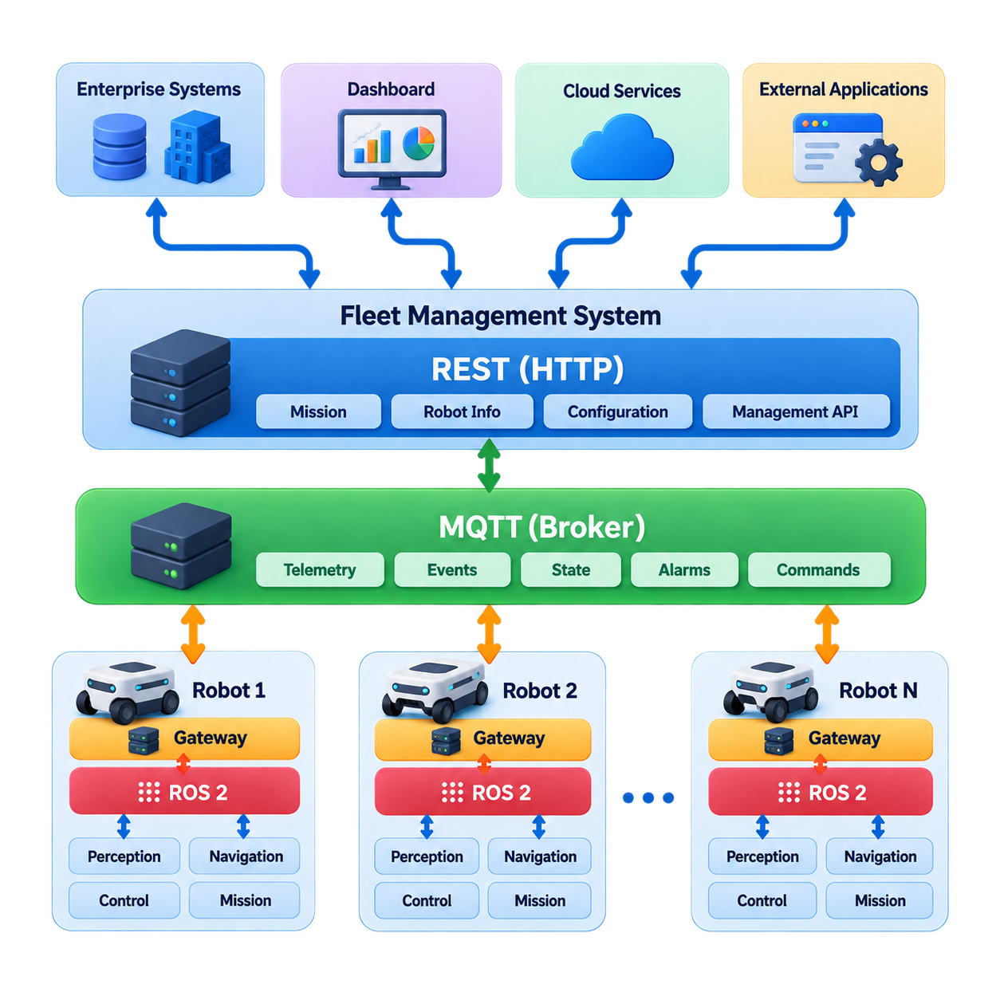
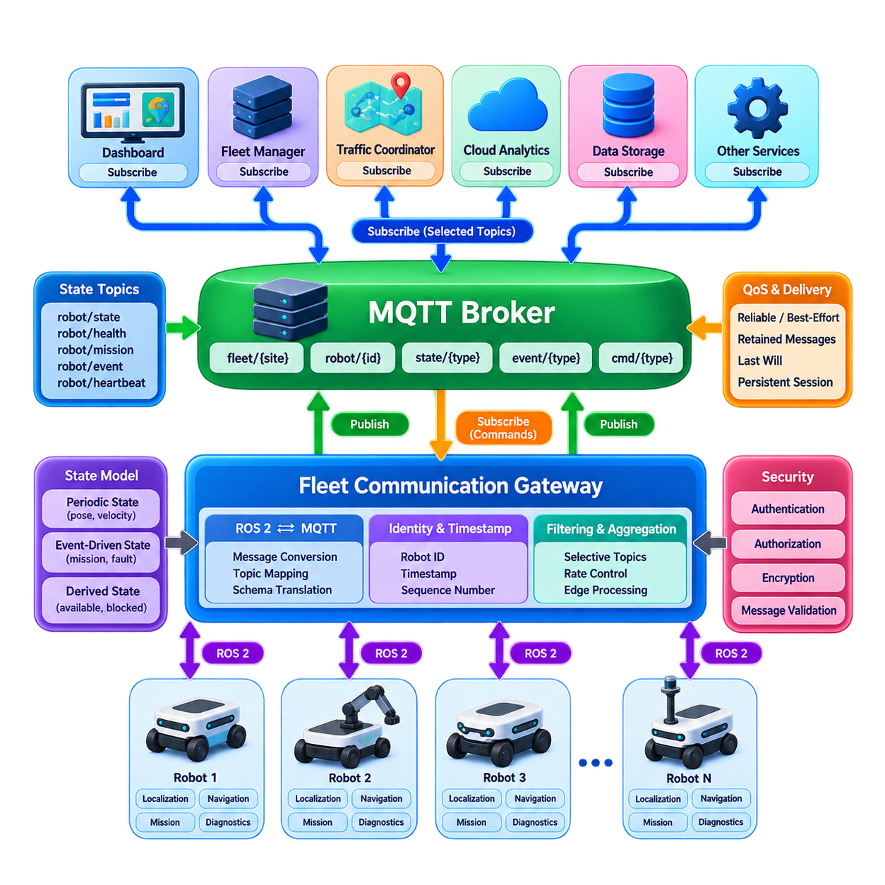
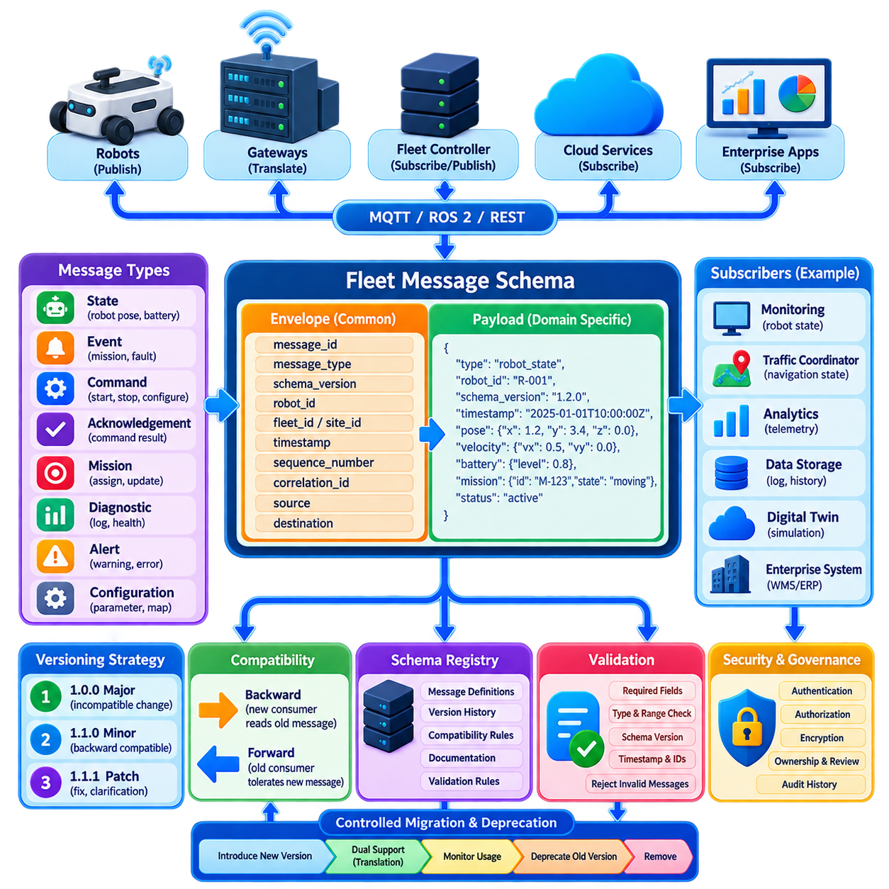
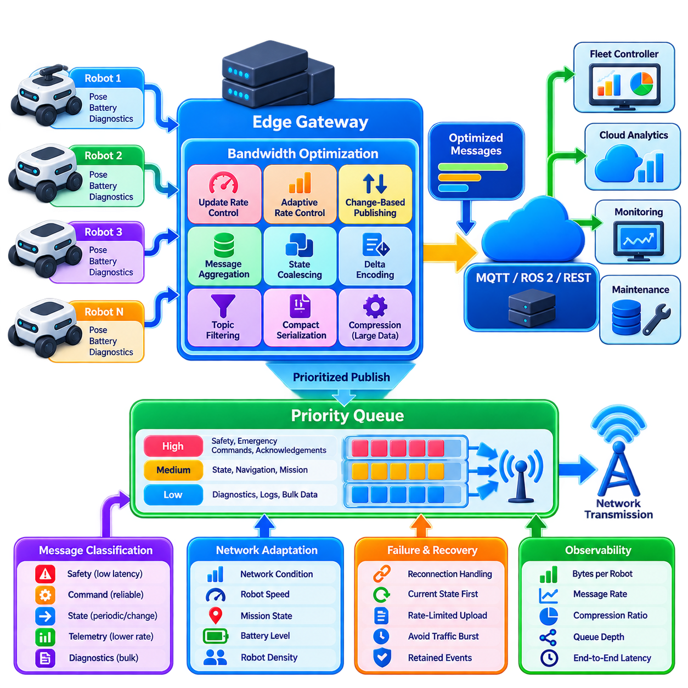
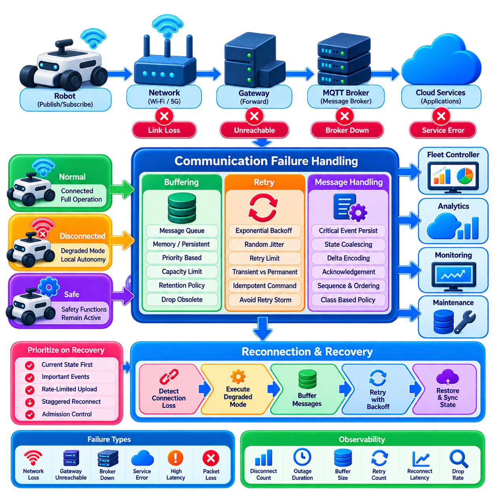
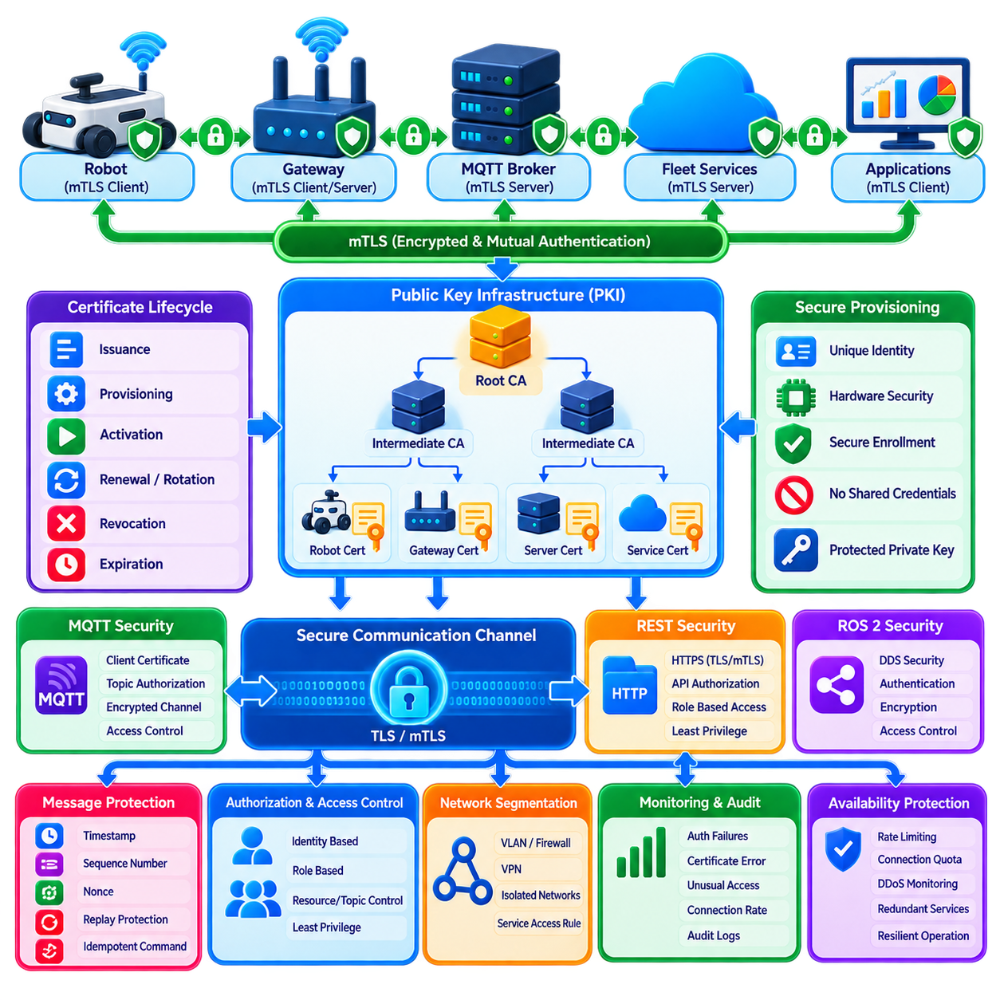
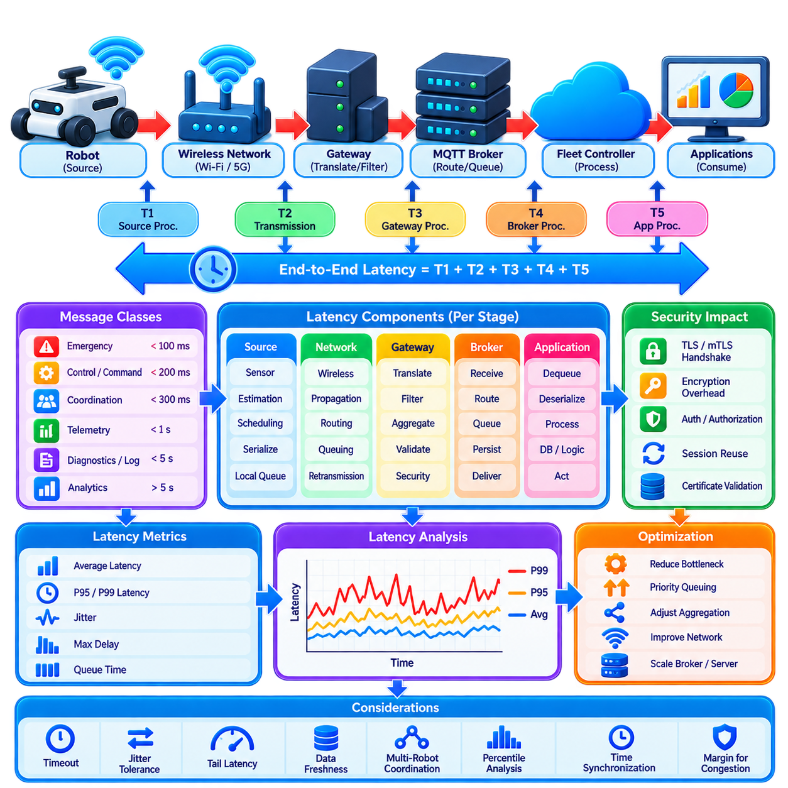
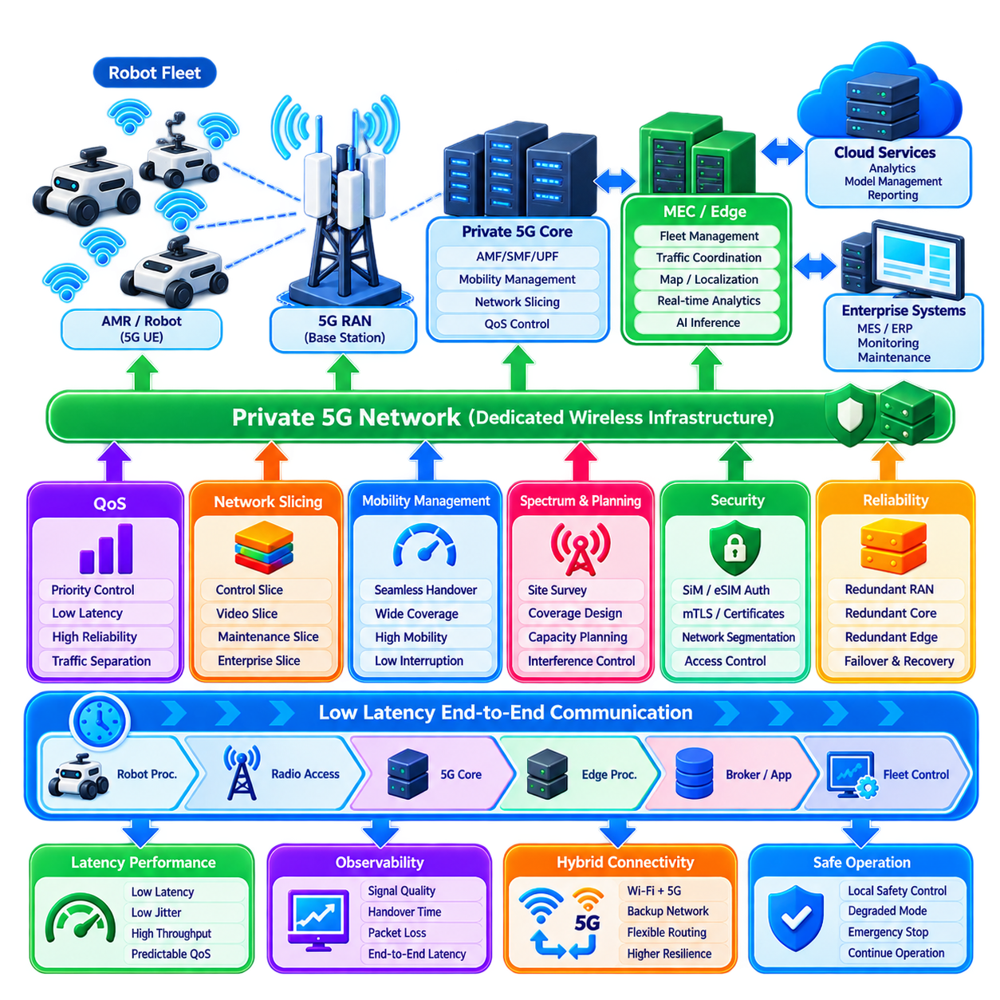
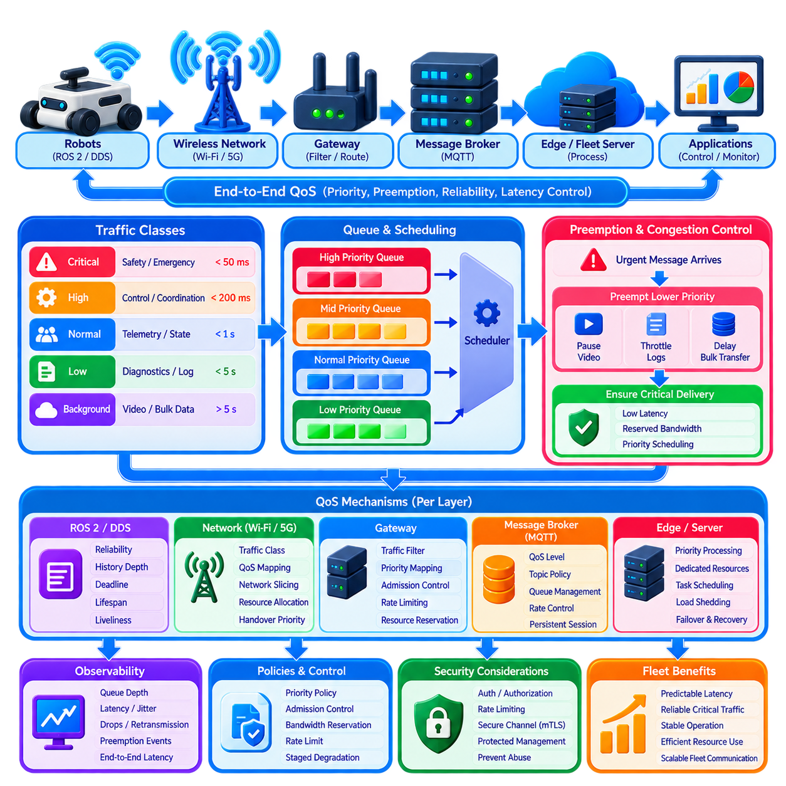
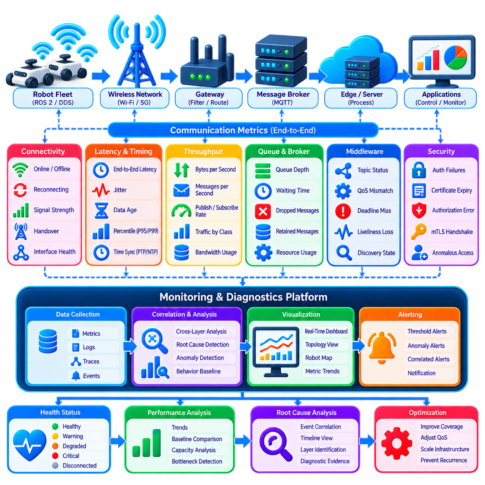

**Volume 16 Multi Robot and Fleet Intelligence**

# 04. Fleet Communication

## 04.01 Fleet Communication Protocol Stack MQTT ROS2 REST

{width="7.268055555555556in" height="7.268055555555556in"}

플릿 통신 아키텍처(Fleet Communication Architecture)는 근본적으로 서로 다른 여러 유형의 통신 패턴(Traffic Pattern)을 동시에 지원해야 한다. 로봇은 상태(State), 명령(Command), 미션 이벤트(Mission Event), 진단 정보(Diagnostics), 운영 데이터(Operational Data)를 지속적으로 교환하며, 동시에 플릿 서버(Fleet Server)는 대시보드(Dashboard), 기업 시스템(Enterprise System), 클라우드 서비스(Cloud Service)와 통신한다. 하나의 프로토콜(Protocol)만으로 이러한 요구사항을 모두 효율적으로 충족하기는 어렵다. 따라서 실제 플릿 시스템(Fleet System)은 ROS 2, MQTT, REST가 서로 다른 통신 역할을 담당하는 계층형 프로토콜 스택(Layered Protocol Stack)을 사용한다.

ROS 2는 주로 로봇 내부와 긴밀하게 결합된 로봇 시스템(Robotic System) 사이의 통신에 적합하다. 발행-구독 모델(Publish-Subscribe Model), 서비스(Service), 액션(Action)을 이용하여 인지(Perception), 위치추정(Localization), 내비게이션(Navigation), 제어(Control), 미션 구성요소(Mission Component)가 데이터 생산자와 소비자 사이의 직접적인 의존성 없이 구조화된 데이터를 교환할 수 있다. ROS 2 통신은 일반적으로 DDS를 통해 구현되며, 서비스 품질(Quality of Service, QoS) 정책을 이용해 신뢰성(Reliability), 지속성(Durability), 이력(History), 마감시간(Deadline), 메시지 전달 특성을 제어할 수 있다.

플릿 내부에서 ROS 2는 네트워크가 통제되고 예측 가능한 경우 로봇과 인접 컴퓨팅 인프라(Computing Infrastructure)를 연결하는 데에도 사용할 수 있다. 로봇 위치 자세(Pose), 속도(Velocity), 내비게이션 상태(Navigation State), 센서 기반 정보(Sensor-Derived Information), 지역 협조 메시지(Local Coordination Message)를 비교적 낮은 소프트웨어 통합 부담으로 교환할 수 있다. 그러나 대규모 ROS 2 그래프(Graph)를 공장 전체나 클라우드 네트워크에 그대로 노출하면 디스커버리(Discovery), 대역폭(Bandwidth), 보안(Security), 확장성(Scalability) 문제가 발생할 수 있다. 따라서 플릿 아키텍처에서는 모든 로봇을 하나의 제한 없는 미들웨어 도메인(Middleware Domain)으로 구성하기보다 명확한 통신 경계(Communication Boundary)를 정의하는 것이 일반적이다.

MQTT는 비동기 플릿 메시징(Asynchronous Fleet Messaging)을 위한 상호 보완적인 통신 계층을 제공한다. 노드(Node)가 서로를 직접 탐색하는 대신 발행자(Publisher)는 브로커(Broker)가 관리하는 토픽(Topic)으로 메시지를 전송하고, 구독자(Subscriber)는 자신에게 필요한 토픽만 수신한다. 예를 들어 로봇은 사이트(Site), 플릿(Fleet), 로봇(Robot), 메시지 범주(Message Category)를 나타내는 계층적 토픽 구조(Hierarchical Topic Structure)를 통해 운영 상태를 발행할 수 있다. 플릿 서비스는 모든 로봇과 직접 연결을 유지하지 않고도 해당 계층에서 필요한 부분만 선택적으로 구독할 수 있다.

이러한 브로커 중심 아키텍처(Broker-Centered Architecture)는 텔레메트리(Telemetry), 상태 정보(Health Information), 미션 이벤트(Mission Event), 경보(Alarm), 배터리 상태(Battery State)와 같은 플릿 전체 데이터를 처리하는 데 특히 유용하다. MQTT는 설정 가능한 서비스 품질(Quality of Service, QoS) 수준, 유지 메시지(Retained Message), 영속 세션(Persistent Session), 라스트 윌(Last Will) 메커니즘도 제공하므로 간헐적으로 연결이 불안정해질 수 있는 무선 네트워크 환경에서 유용하다. 이러한 특성으로 MQTT는 로봇 측 시스템, 플릿 관리 서비스(Fleet Management Service), 엣지 인프라(Edge Infrastructure), 클라우드 플랫폼(Cloud Platform)을 연결하는 비동기 브리지(Asynchronous Bridge)에 적합하다.

REST는 이와 다른 역할을 수행한다. REST는 일반적으로 HTTP 엔드포인트(Endpoint)를 통해 상태를 표현할 수 있는 자원(Resource)에 대한 요청-응답(Request-Response) 작업에 사용된다. 플릿 관리 시스템(Fleet Management System)은 미션 생성, 로봇 정보 조회, 이력 기록 검색, 구성 관리(Configuration Management), WMS·MES·ERP 및 외부 애플리케이션(Application) 연계를 위한 인터페이스를 제공할 수 있다. REST는 기업용 소프트웨어(Enterprise Software)에서 폭넓게 지원되므로 로봇 특화 인프라와 기존 정보 시스템(Information System)을 연결하는 실용적인 경계 역할을 한다.

REST는 일반적으로 고주파 로봇 텔레메트리(High-Frequency Robot Telemetry)나 시간 결정성이 중요한 제어 루프(Time-Critical Control Loop)를 전달하는 용도로 사용해서는 안 된다. 반복적인 HTTP 요청은 빠르게 변화하는 데이터에 불필요한 오버헤드(Overhead)를 발생시키며 지속적인 이벤트 전달에도 자연스럽지 않다. 대신 REST는 미션 요청, 로봇 등록, 플릿 상태 스냅샷(Fleet Snapshot) 조회, 구성 변경, 보고서 검색과 같은 상대적으로 거친 단위(Coarse-Grained)의 작업에 효과적이다. 비동기 상태 변화는 MQTT 또는 다른 이벤트 지향 채널(Event-Oriented Channel)을 통해 전달할 수 있다.

따라서 효과적인 플릿 아키텍처는 의미적 요구사항(Semantic Requirement)과 시간적 요구사항(Temporal Requirement)에 따라 통신을 분리한다. ROS 2는 긴밀하게 결합된 로봇 실행과 실시간 지향 데이터 교환(Real-Time-Oriented Data Exchange)을 담당하고, MQTT는 플릿 경계를 넘는 비동기 운영 이벤트와 텔레메트리를 전달하며, REST는 외부에서 접근할 수 있는 관리 API(Management API)를 제공한다. 이들 프로토콜은 서로 경쟁하는 대안이 아니다. 각각 통신 계층 구조(Communication Hierarchy)의 서로 다른 위치를 담당하며 동일한 로봇 및 플릿 관리 시스템 안에서 함께 사용할 수 있다.

창고 관리 시스템(Warehouse Management System, WMS)으로부터 운송 미션을 받는 자율이동로봇(Autonomous Mobile Robot, AMR)을 예로 들 수 있다. WMS는 REST API를 통해 플릿 관리자(Fleet Manager)에 미션을 제출할 수 있다. 플릿 관리자는 미션을 검증하고 할당한 후 MQTT 또는 전용 플릿 메시징 인터페이스를 통해 해당 운영 명령을 전달한다. 선택된 로봇 내부에서는 게이트웨이(Gateway)가 이 플릿 수준 명령을 내비게이션과 미션 실행 노드가 처리할 수 있는 ROS 2 액션(Action)으로 변환한다. 이후 실행 상태는 반대 경로를 통해 상위 시스템으로 전달된다.

이러한 변환 계층(Translation Layer)은 중요한 아키텍처 구성요소이다. 외부 시스템은 ROS 2 토픽, 노드 이름 또는 내부 메시지 정의에 대한 상세한 지식을 가질 필요가 없어야 하며, 로봇 소프트웨어 역시 기업 시스템의 API 형식에 직접 의존해서는 안 된다. 플릿 통신 게이트웨이(Fleet Communication Gateway)는 이러한 영역을 격리한다. 메시지 스키마(Message Schema)를 변환하고, 식별자(Identity)를 매핑하며, 명령을 검증하고, 권한 부여 규칙(Authorization Rule)을 적용하면서 동기 요청, 비동기 이벤트, 로봇 고유 통신 의미체계(Robot-Native Communication Semantics) 사이를 변환한다.

통신 설계에서는 제어 평면 트래픽(Control-Plane Traffic)과 데이터 평면 트래픽(Data-Plane Traffic)도 구분해야 한다. 미션 명령, 긴급 운영 알림, 예약(Reservation), 로봇 상태 전환(State Transition)은 예측 가능한 전달과 명확한 확인응답(Acknowledgement) 의미체계를 요구한다. 반면 진단 로그(Diagnostic Log), 이력 텔레메트리(Historical Telemetry), 이미지, 분석 데이터(Analytics Data)는 서로 다른 지연시간과 신뢰성 특성을 허용할 수 있다. 이러한 트래픽 클래스를 분리하면 대용량 데이터 전송이 플릿 협조와 운영 안전에 필요한 메시지를 방해하는 것을 방지할 수 있다.

메시지 식별(Message Identity)과 시간 정보(Timing) 역시 중요하다. 플릿 메시지에는 일반적으로 로봇 식별자(Robot Identifier), 메시지 유형(Message Type), 타임스탬프(Timestamp), 시퀀스 또는 상관 식별자(Correlation Identifier), 스키마 버전(Schema Version), 페이로드(Payload)가 포함되어야 한다. 명령은 플릿 관리자가 메시지의 수신, 승인, 거부 또는 실행 여부를 판단할 수 있도록 확인응답과 추적성(Traceability)을 지원해야 한다. 특히 멱등성 명령 설계(Idempotent Command Design)는 통신 중단 이후 재전송된 동일 명령이 물리적 작업을 의도치 않게 두 번 실행하는 것을 방지한다는 점에서 중요하다.

프로토콜 스택(Protocol Stack)은 일시적인 연결 단절(Temporary Disconnection)에도 대응해야 한다. 자율 로봇은 플릿 서버 또는 클라우드와의 통신이 끊어졌다는 이유만으로 즉시 안전한 로컬 운영(Local Operation)을 상실해서는 안 된다. 로봇 측 ROS 2 구성요소는 필수적인 내비게이션과 안전 기능을 계속 수행하고, 통신 게이트웨이는 적절한 송신 이벤트를 버퍼링(Buffering)하면서 연결 상태를 보고할 수 있다. 연결이 복구되면 더 이상 운영상 유효하지 않은 명령을 무조건 재생하지 않고 선택된 상태와 이벤트만 동기화(Synchronization)할 수 있어야 한다.

보안(Security)은 하나의 프로토콜에 맡기는 것이 아니라 모든 통신 경계에 적용해야 한다. 로봇 식별(Robot Identity), 인증(Authentication), 권한 부여(Authorization), 암호화 전송(Encrypted Transport), 인증서 관리(Certificate Management), 토픽 또는 API 접근 제어(Access Control), 명령 검증(Command Validation)이 전체 스택에 필요하다. ROS 2/DDS 보안 메커니즘은 미들웨어 통신을 보호하고, MQTT는 TLS와 인증된 브로커 세션을 사용할 수 있으며, REST 인터페이스는 일반적으로 HTTPS와 토큰 또는 인증서 기반 인증을 함께 사용한다. 플릿 게이트웨이는 중요한 정책 집행 지점(Policy Enforcement Point)이 된다.

확장성(Scalability)이 증가하면 통신 문제도 크게 달라진다. 10대의 로봇에서는 광범위한 상태 정보 배포가 가능할 수 있지만 수백 대 또는 수천 대의 로봇에서는 비효율적일 수 있다. 대규모 플릿에는 선택적 구독(Selective Subscription), 계층적 토픽 구조, 제어된 ROS 2 디스커버리 도메인(Discovery Domain), 메시지 집계(Message Aggregation), 전송률 제한(Rate Limiting), 세밀하게 정의된 업데이트 주기(Update Frequency)가 필요하다. 따라서 플릿 통신은 모든 참여자가 다른 모든 로봇의 모든 상태 정보를 필요로 한다고 가정하기보다 정보의 관련성(Information Relevance)에 따라 확장되도록 설계해야 한다.

여기에서 설명한 아키텍처는 이후 플릿 통신 엔지니어링(Fleet Communication Engineering)을 위한 기반도 제공한다. 실시간 상태 브로드캐스팅(Real-Time State Broadcasting), 메시지 스키마 버전 관리(Message Schema Versioning), 대역폭 최적화(Bandwidth Optimization), 버퍼링 및 재시도(Buffering and Retry), 보안 인증(Secure Authentication), 지연시간 예산(Latency Budgeting), 네트워크 기술(Network Technology), QoS 정책, 통신 모니터링 및 진단(Communication Monitoring and Diagnostics)은 프로토콜의 역할이 명확하게 구분된 이후 각각 독립적인 설계 문제로 다룰 수 있다.

궁극적으로 MQTT, ROS 2, REST는 플릿 통신 패브릭(Fleet Communication Fabric)을 구성하는 상호 보완적인 계층으로 이해해야 한다. ROS 2는 로봇 지능과 실행 구성요소를 연결하고, MQTT는 분산된 플릿 인프라 전반에서 확장 가능한 이벤트 지향 통신(Event-Oriented Communication)을 제공하며, REST는 외부 시스템에 안정적인 관리 인터페이스를 제공한다. 잘 설계된 프로토콜 스택은 이러한 경계를 명확히 유지하면서 각 계층 사이에 통제된 게이트웨이를 제공함으로써 로봇 자율성(Robot Autonomy), 플릿 협조(Fleet Coordination), 기업 시스템 통합(Enterprise Integration), 클라우드 서비스가 전체 시스템을 분절시키지 않고 독립적으로 발전할 수 있도록 한다.

## 04.02 Real Time State Broadcast and Subscription Design [w/Code]

{width="7.268055555555556in" height="7.268055555555556in"}

실시간 상태 브로드캐스팅(Real-Time State Broadcasting)은 플릿 관리 시스템(Fleet Management System)이 분산된 로봇들의 운영 상태를 지속적으로 최신 상태로 유지할 수 있도록 하는 통신 메커니즘(Communication Mechanism)이다. 각 로봇은 위치 자세(Pose), 속도(Velocity), 내비게이션 모드(Navigation Mode), 배터리 수준(Battery Level), 미션 진행 상태(Mission Progress), 안전 상태(Safety State), 연결 상태(Connectivity), 고장 상태(Fault Condition)와 같이 지속적으로 변화하는 정보를 생성한다. 이러한 값을 반복적으로 요청하는 대신, 구독자(Subscriber)는 관련 상태가 변경되거나 정의된 발행 주기(Publication Interval)에 도달할 때마다 업데이트를 수신한다.

발행-구독 아키텍처(Publish-Subscribe Architecture)는 상태 생산자(State Producer)와 상태 소비자(State Consumer)를 분리한다. 로봇은 운영 정보의 발행자(Publisher) 역할을 수행하고, 플릿 관리자(Fleet Manager), 교통 조정기(Traffic Coordinator), 모니터링 서비스(Monitoring Service), 대시보드(Dashboard), 디지털 트윈(Digital Twin), 분석 애플리케이션(Analytics Application)은 구독자가 된다. 발행자는 어떤 시스템이 자신의 데이터를 사용하는지 알 필요가 없다. 이러한 느슨한 결합(Loose Coupling)을 통해 모든 로봇에서 실행되는 소프트웨어를 변경하지 않고도 새로운 모니터링 또는 최적화 서비스를 추가할 수 있다.

상태 정보(State Information)는 시간적 특성(Temporal Characteristics)과 운영 중요도(Operational Importance)에 따라 분류해야 한다. 로봇 위치 자세와 이동 상태(Motion State)는 초당 여러 차례의 업데이트가 필요할 수 있지만, 배터리 상태, 온도, 미션 진행 상황, 진단 정보(Diagnostic Information)는 상대적으로 낮은 주기로 전송할 수 있다. 안전 이벤트(Safety Event), 비상 정지(Emergency Stop), 위치추정 실패(Localization Failure), 치명적 고장(Critical Fault)은 다음 주기적 브로드캐스트를 기다리지 않고 일반적으로 즉시 배포되어야 한다.

실용적인 상태 모델(State Model)은 주기적 상태(Periodic State), 이벤트 기반 상태(Event-Driven State), 파생 플릿 상태(Derived Fleet State)를 구분한다. 주기적 메시지는 위치와 속도처럼 지속적으로 변화하는 변수를 나타낸다. 이벤트 기반 메시지는 미션 시작, 작업 완료, 충전 시작, 고장 발생과 같은 불연속적인 상태 전환(Discrete Transition)을 나타낸다. 파생 상태는 여러 관측 정보를 결합하여 플릿 서비스가 생성하며, 예를 들어 로봇이 사용 가능, 지연, 차단, 연결 끊김 또는 유지보수 필요 상태인지 판단할 수 있다.

ROS 2는 로봇 내부와 통제된 로봇 네트워크에서 상태를 교환하기 위한 기본 발행-구독 통신(Publish-Subscribe Communication)을 제공한다. 토픽(Topic)은 위치추정(Localization), 오도메트리(Odometry), 내비게이션 상태, 진단 정보 또는 미션 실행 상태를 표현할 수 있으며, 서비스 품질(Quality of Service, QoS) 정책은 신뢰성과 전달 동작을 정의한다. 고주파 데이터에서는 오래된 샘플을 재전송하는 것보다 최신 샘플이 더 중요할 경우 최선형 전달(Best-Effort Delivery)을 사용할 수 있으며, 중요한 상태 전환에는 신뢰성 있는 전달(Reliable Delivery)이 필요할 수 있다.

플릿 전체 통신(Fleet-Wide Communication)에서는 일반적으로 ROS 2 도메인과 MQTT 같은 외부 메시징 인프라(External Messaging Infrastructure) 사이에 게이트웨이(Gateway)를 배치한다. 게이트웨이는 선택된 ROS 2 토픽을 구독하고, 내부 메시지를 플릿 수준 스키마(Fleet-Level Schema)로 변환하며, 로봇 식별 정보와 시간 정보를 추가한 후 계층형 MQTT 토픽(Hierarchical MQTT Topic)을 통해 발행한다. 수신되는 플릿 명령은 반대 경로를 통해 전달되고 로봇에 적합한 ROS 2 메시지, 서비스(Service), 액션(Action)으로 변환될 수 있다.

플릿 규모가 증가할수록 토픽 구성(Topic Organization)은 더욱 중요해진다. 계층형 명명 구조(Hierarchical Naming Structure)는 사이트(Site), 플릿(Fleet), 로봇(Robot), 하위 시스템(Subsystem), 메시지 범주(Message Category)를 표현할 수 있다. 이를 통해 구독자는 서로 다른 범위의 정보를 선택할 수 있다. 모니터링 서비스는 모든 로봇의 상태 정보를 구독할 수 있는 반면, 교통 관리자(Traffic Manager)는 특정 구역에서 운행하는 로봇의 위치추정 및 내비게이션 정보만 수신할 수 있다. 이를 통해 관련 없는 데이터의 불필요한 배포를 방지할 수 있다.

구독 설계(Subscription Design)는 각각의 소비자가 자신의 기능 수행에 필요한 정보만 수신한다는 원칙을 따라야 한다. 모든 상태 메시지를 모든 서비스에 브로드캐스트하는 방식은 소규모 배치에서는 단순해 보일 수 있지만, 로봇 수가 증가하면 과도한 네트워크 트래픽(Network Traffic)과 처리 오버헤드(Processing Overhead)를 발생시킨다. 선택적 구독(Selective Subscription), 필터링(Filtering), 토픽 분할(Topic Partitioning), 설정 가능한 업데이트 주기(Configurable Update Rate)를 통해 운영 요구사항에 맞추어 통신 부하를 확장할 수 있다.

업데이트 주기(Update Frequency)는 정보의 최신성(Freshness)과 대역폭 소비(Bandwidth Consumption) 사이의 균형을 고려해야 한다. 발행 주기를 높이면 플릿 서비스에서 사용할 수 있는 정보의 경과 시간(Data Age)은 감소하지만, 무선 통신량, 브로커 부하(Broker Workload), 직렬화 비용(Serialization Cost), 구독자 처리량은 증가한다. 따라서 효과적인 설계에서는 상태 클래스(State Class)에 따라 서로 다른 전송 주기를 지정한다. 이동 관련 데이터는 상대적으로 높은 주기를 사용할 수 있지만, 상태 텔레메트리(Health Telemetry)와 환경 측정값(Environmental Measurement)은 더 느린 주기적 업데이트를 사용할 수 있다.

변화 기반 발행(Change-Based Publication)을 적용하면 불필요한 트래픽을 추가로 줄일 수 있다. 모든 필드를 고정 주기로 브로드캐스트하는 대신 특정 값이 정의된 임계값(Threshold) 이상 변화할 때 로봇이 데이터를 발행할 수 있다. 위치는 의미 있는 이동이 발생했을 때, 배터리 상태는 지정된 비율만큼 변화했을 때, 운영 모드(Operational Mode)는 상태 전환이 발생할 때 전송할 수 있다. 다만 운영 상태에 변화가 없더라도 로봇이 연결되어 있음을 확인하기 위한 주기적 하트비트 메시지(Heartbeat Message)는 유지해야 한다.

모든 실시간 상태 메시지(Real-Time State Message)에는 메시지가 어디에서 생성되었으며 언제 유효했는지를 판단하기 위한 충분한 컨텍스트(Context)가 필요하다. 일반적인 메타데이터(Metadata)에는 로봇 식별자(Robot Identifier), 타임스탬프(Timestamp), 시퀀스 번호(Sequence Number), 메시지 유형(Message Type), 스키마 버전(Schema Version), 상태 페이로드(State Payload)가 포함된다. 시퀀스 번호는 누락되거나 순서가 변경된 메시지를 식별하는 데 도움이 되며, 타임스탬프는 구독자가 데이터의 경과 시간을 평가할 수 있도록 한다. 여러 로봇의 상태를 비교할 때에는 로봇과 서버 전체의 일관된 시간 동기화(Time Synchronization)가 특히 중요하다.

구독자는 오래된 정보(Stale Information)를 어떻게 처리할 것인지도 정의해야 한다. 플릿 관리자는 마지막으로 수신한 상태가 무기한 유효하다고 가정해서는 안 된다. 중요한 상태 클래스마다 만료 임계값(Expiration Threshold) 또는 유효시간(Time-to-Live, TTL)을 설정할 수 있다. 해당 임계시간을 초과하여 업데이트가 중단되면 로봇 상태를 연결됨(Connected)에서 불확실(Uncertain) 또는 오프라인(Offline)으로 전환할 수 있다. 교통 조정에서는 오래된 로봇 위치나 내비게이션 상태를 기반으로 안전에 민감한 결정을 내려서는 안 된다.

상태 일관성(State Consistency)을 확보하기 위해 모든 구독자가 모든 중간 업데이트를 반드시 관찰해야 하는 것은 아니다. 빠르게 변화하는 변수의 경우 완전한 메시지 이력(Message History)보다 최신의 유효한 상태가 더 중요할 수 있다. 따라서 처리 속도가 느린 구독자는 이미 대체된 샘플(Superseded Sample)을 폐기하고 가장 최신 상태를 처리할 수 있다. 반면 미션 상태 전환, 고장 이벤트, 명령 확인응답(Command Acknowledgement)은 하나의 상태 전환 누락이 잘못된 운영 상태 해석을 유발할 수 있으므로 순서가 보장되고 신뢰성 있는 처리가 필요할 수 있다.

네트워크 중단(Network Interruption)에 대해서는 명확한 복구 전략(Recovery Strategy)이 필요하다. 연결이 끊어지면 로봇은 필수적인 로컬 자율성(Local Autonomy)을 유지해야 하며, 플릿 시스템은 해당 로봇의 원격 상태(Remote State)를 오래된 상태(Stale State)로 표시해야 한다. 연결이 복구되면 로봇은 더 이상 의미가 없는 모든 주기적 업데이트를 무차별적으로 재생하는 대신 현재의 권위 있는 상태(Current Authoritative State)를 먼저 전송해야 한다. 이후 중요한 버퍼링 이벤트(Buffered Event)는 각 메시지 클래스에 정의된 보존 및 순서 정책(Retention and Ordering Policy)에 따라 전달할 수 있다.

대규모 플릿(Large-Scale Fleet)은 집계(Aggregation)와 지역 분산(Regional Distribution)을 통해 효율성을 높일 수 있다. 모든 원시 로봇 상태(Raw Robot State)를 중앙 서버로 직접 전송하는 대신 엣지 게이트웨이(Edge Gateway)가 여러 로봇의 정보를 수집하고, 스키마를 정규화(Normalization)하며, 중복 업데이트를 필터링하고, 필요한 플릿 수준 정보만 전달할 수 있다. 사이트 수준 브로커(Site-Level Broker) 또는 지역 플릿 서비스(Regional Fleet Service)를 이용하여 통신 도메인을 추가로 분할하면 네트워크 혼잡을 줄이고 중앙 메시징 인프라가 불필요한 병목(Bottleneck)이 되는 것을 방지할 수 있다.

실시간 상태 통신(Real-Time State Communication)은 관측 가능성(Observability)도 지원해야 한다. 시스템은 발행 주기, 종단 간 지연시간(End-to-End Latency), 메시지 손실(Dropped Message), 재연결 이벤트(Reconnect Event), 큐 깊이(Queue Depth), 구독자 지연(Subscriber Lag), 오래된 상태 지속시간(Stale-State Duration), 브로커 상태(Broker Health)를 측정해야 한다. 이러한 지표는 통신 장애와 로봇 장애를 구분하는 데 도움이 된다. 예를 들어 위치 값이 변하지 않는 현상은 의도적으로 정지한 로봇, 위치추정 문제, 발행자 정지 또는 네트워크 중단을 의미할 수 있으며, 통신 계층은 이들을 구별할 수 있는 근거를 제공해야 한다.

보안 요구사항(Security Requirement)은 발행자와 구독자 모두에 적용된다. 로봇은 플릿 상태를 발행하기 전에 인증(Authentication)을 수행해야 하며, 구독자는 자신의 운영 역할(Operational Role)에 대해 허가된 토픽만 수신해야 한다. 암호화(Encryption)는 전송 중 상태 정보를 보호하고, 메시지 검증(Message Validation)은 잘못 구성되거나 권한이 없는 데이터가 플릿 의사결정 과정에 들어가는 것을 방지한다. 중요한 상태 전환에는 더욱 강력한 무결성 보호(Integrity Protection)와 향후 사고 분석을 위한 감사 가능 기록(Auditable Record)이 추가로 필요할 수 있다.

따라서 전체 설계는 로컬 ROS 2 상태 교환(Local ROS 2 State Exchange), 게이트웨이 기반 변환(Gateway-Based Translation), 확장 가능한 발행-구독 메시징(Scalable Publish-Subscribe Messaging), 선택적 구독, 차등화된 QoS(Differentiated QoS), 동기화된 타임스탬프(Synchronized Timestamp), 오래된 상태 감지(Stale-State Detection), 복원력 있는 재연결 동작(Resilient Reconnection Behavior)을 결합한다. 이러한 아키텍처를 통해 플릿 제어기(Fleet Controller)는 모든 구성요소가 모든 메시지를 처리하도록 강제하지 않으면서도 적시에 운영 상황을 파악할 수 있다. 또한 메시지 스키마 관리(Message Schema Management), 대역폭 최적화(Bandwidth Optimization), 장애 복구(Failure Recovery), 지연시간 제어(Latency Control), QoS 우선순위화(QoS Prioritization), 플릿 규모 진단(Fleet-Scale Diagnostics)에 필요한 통신 기반을 제공한다.

## 04.03 Fleet Message Schema and Versioning Strategy [w/Code]

{width="7.268055555555556in" height="7.268055555555556in"}

플릿 메시지 스키마(Fleet Message Schema)는 로봇, 플릿 제어기(Fleet Controller), 게이트웨이(Gateway), 클라우드 서비스(Cloud Service), 기업 애플리케이션(Enterprise Application)이 운영 정보를 교환하기 위한 공통 구조를 정의한다. 안정적인 스키마가 없으면 각 하위 시스템이 식별자, 타임스탬프, 상태, 명령 또는 오류를 서로 다르게 해석하여 취약한 점대점 통합(Point-to-Point Integration)이 발생할 수 있다. 따라서 스키마는 플릿 정보의 의미를 이를 전달하는 전송 프로토콜(Transport Protocol)로부터 분리하는 통신 계약(Communication Contract)의 역할을 한다.

실용적인 플릿 메시지(Fleet Message)는 일반적으로 엔벌로프(Envelope)와 페이로드(Payload)로 구성된다. 엔벌로프에는 메시지를 식별하고, 라우팅하고, 검증하며, 해석하는 데 필요한 정보가 포함되고, 페이로드에는 도메인별 데이터(Domain-Specific Data)가 포함된다. 일반적인 엔벌로프 필드에는 메시지 식별자(Message Identifier), 메시지 유형(Message Type), 스키마 버전(Schema Version), 로봇 식별자(Robot Identifier), 플릿 또는 사이트 식별자, 타임스탬프(Timestamp), 시퀀스 번호(Sequence Number), 상관 식별자(Correlation Identifier), 송신원(Source), 목적지(Destination)가 포함된다. 이러한 구조는 페이로드 형식이 크게 달라지는 경우에도 일관되게 유지된다.

메시지 유형(Message Type)은 구현 세부사항보다는 명확한 운영 의미체계(Operational Semantics)를 표현해야 한다. 플릿에서는 상태(State), 이벤트(Event), 명령(Command), 확인응답(Acknowledgement), 미션(Mission), 진단(Diagnostic), 경보(Alert), 구성(Configuration) 등의 메시지 계열을 정의할 수 있다. 각 계열은 로봇 위치 자세(Pose), 배터리 상태, 미션 할당, 내비게이션 상태, 충전 요청, 고장 또는 유지보수 정보 등을 위한 특화된 페이로드를 포함할 수 있다. 명확한 의미적 경계(Semantic Boundary)는 하나의 범용 메시지 구조에 서로 관련 없는 선택적 필드가 과도하게 포함되는 것을 방지한다.

분산 시스템(Distributed System)은 여러 독립적인 구성요소에서 생성된 정보를 서로 연결해야 하므로 식별자(Identifier)의 일관성이 특히 중요하다. 로봇 ID는 로봇의 전체 수명주기(Lifecycle) 동안 안정적으로 유지되어야 하며, 메시지 ID는 개별 전송을 구분한다. 상관 ID(Correlation ID)는 명령과 해당 확인응답처럼 서로 연관된 상호작용을 연결한다. 미션, 작업(Task), 지도(Map), 구역(Zone), 사이트(Site) 식별자 역시 문서화된 명명 규칙(Naming Rule)과 고유성 규칙(Uniqueness Rule)을 따라야 플릿 서비스 전체에서 데이터를 안전하게 결합할 수 있다.

시간 표현(Time Representation)도 마찬가지로 중요하다. 관측이나 이벤트를 나타내는 모든 메시지는 단순히 서버가 메시지를 수신한 시간이 아니라 해당 정보가 실제로 유효해진 시점을 식별해야 한다. 표준화된 타임스탬프와 동기화된 시계(Synchronized Clock)를 사용하면 플릿 서비스가 이벤트의 순서를 결정하고, 통신 지연을 추정하며, 오래된 정보(Stale Information)를 감지하고, 사고 상황을 재구성할 수 있다. 시퀀스 번호는 통신 스트림 내에서 누락, 중복 또는 순서가 변경된 메시지를 식별함으로써 타임스탬프를 보완할 수 있다.

페이로드(Payload)는 모호한 해석을 방지할 수 있을 정도로 명확하게 정의되는 동시에 확장 가능해야 한다. 데이터 형식(Data Type), 단위(Unit), 좌표계(Coordinate Frame), 열거형 값(Enumerated Value), 필수 필드(Required Field), 선택적 필드(Optional Field), 유효 범위(Valid Range)를 명시적으로 문서화해야 한다. 예를 들어 속도 필드는 미터/초(m/s)를 사용하는지와 어떤 좌표계를 기준으로 하는지를 명확히 정의해야 한다. 이러한 의미적 정밀성(Semantic Precision)은 서로 다른 플랫폼이나 공급업체의 로봇이 동일한 플릿에 참여할 때 특히 중요해진다.

스키마 직렬화(Schema Serialization)는 높은 가독성과 폭넓은 상호운용성(Interoperability)을 위해 JSON과 같은 형식을 사용할 수 있으며, 대역폭과 처리 효율성이 더욱 중요한 경우 프로토콜 버퍼(Protocol Buffers)와 같은 바이너리 표현(Binary Representation)을 사용할 수 있다. 논리적인 플릿 스키마(Logical Fleet Schema)는 가능한 한 직렬화 방식과 개념적으로 독립되어야 한다. 이러한 분리를 통해 MQTT, REST, ROS 2 게이트웨이, 데이터 파이프라인(Data Pipeline), 저장 시스템(Storage System)에서 동일한 운영 의미를 유지하면서 각각의 전송 기술마다 도메인 모델을 다시 정의하는 것을 방지할 수 있다.

배치된 로봇과 플릿 서비스가 서로 독립적으로 발전하기 시작하면 버전 관리(Versioning)가 필요해진다. 로봇은 수년 동안 운영될 수 있는 반면 서버 소프트웨어는 빈번하게 변경될 수 있으며, 대규모 플릿의 모든 시스템을 항상 동시에 업그레이드할 수도 없다. 따라서 통신 아키텍처는 여러 소프트웨어 및 스키마 버전이 동시에 존재할 수 있다고 가정해야 한다. 메시지는 자신의 스키마 버전을 명시적으로 선언하여 수신자가 전달된 구조와 의미체계를 이해할 수 있는지 판단할 수 있도록 해야 한다.

하위 호환성(Backward Compatibility)은 새로운 소비자(Consumer)가 이전 발행자(Publisher)가 생성한 메시지를 계속 해석할 수 있음을 의미한다. 상위 호환성(Forward Compatibility)은 변경 사항이 기존 소비자가 필요로 하는 정보에 영향을 주지 않는 경우 이전 소비자가 새로운 메시지를 허용할 수 있음을 의미한다. 새로운 필드를 선택적으로 추가하고, 기존 필드의 의미를 유지하며, 적절한 기본값(Default Value)을 정의하고, 수신자가 알 수 없는 필드를 발견했을 때 전체 메시지를 불필요하게 거부하지 않도록 설계하면 이러한 호환성을 유지하기 쉬워진다.

호환성을 깨뜨리는 변경(Breaking Change)은 더욱 강력하게 통제해야 한다. 필수 필드의 이름을 변경하거나 삭제하는 것, 단위를 변경하는 것, 좌표 규칙(Coordinate Convention)을 수정하는 것, 열거형 값을 재사용하는 것 또는 기존 필드의 의미를 변경하는 것은 감지하기 어려운 위험한 동작을 발생시킬 수 있다. 이러한 변경에는 일반적으로 새로운 메이저 스키마 버전(Major Schema Version)이나 새로운 메시지 유형을 생성해야 한다. 기존 정의는 전체 플릿에서 즉시 교체하기보다 통제된 마이그레이션 기간(Migration Period) 동안 유지되어야 한다.

의미적 버전 관리(Semantic Versioning) 방식은 메이저(Major), 마이너(Minor), 패치(Patch) 수준의 변경을 구분할 수 있다. 메이저 버전은 호환되지 않는 변경을 나타내고, 마이너 버전은 하위 호환성을 유지하는 확장을 추가하며, 패치 버전은 예상 동작을 변경하지 않으면서 정의를 명확히 하거나 수정한다. 정확히 어떤 번호 체계를 사용하는가보다 이를 일관되게 적용하는 것이 더 중요하다. 버전 변경은 배포 시점의 개별 개발자 판단이 아니라 문서화된 호환성 규칙(Compatibility Rule)에 따라 관리되어야 한다.

스키마 진화(Schema Evolution)에서는 열거형(Enumeration)도 신중하게 고려해야 한다. 새로운 로봇 상태, 고장 범주 또는 미션 유형을 추가하는 것은 기술적으로 메시지 구조를 그대로 유지할 수 있지만, 고정된 값 집합을 가정하는 소프트웨어를 손상시킬 수 있다. 따라서 소비자는 미래의 모든 열거형 값을 이미 알고 있다고 가정하기보다 알 수 없음(Unknown) 또는 지원되지 않음(Unsupported)을 처리할 수 있는 경로를 구현해야 한다. 이를 통해 새로운 발행자와 이전 플릿 애플리케이션이 보다 안전하게 공존할 수 있다.

스키마 레지스트리(Schema Registry)는 메시지 정의와 호환성 정책(Compatibility Policy)을 관리하는 권위 있는 기준 정보원(Authoritative Source)의 역할을 할 수 있다. 각 메시지 유형에 대한 버전, 소유권 정보(Ownership Information), 문서, 검증 규칙(Validation Rule), 수명주기 상태(Lifecycle Status)를 저장할 수 있다. 개발 및 지속적 통합(Continuous Integration, CI) 파이프라인에서는 배포 전에 제안된 스키마 변경을 이전 버전과 비교하여 검증할 수 있다. 이를 통해 직렬화된 메시지가 구문적으로 유효하다는 이유만으로 호환되지 않는 변경이 로봇에 배포되는 것을 방지할 수 있다.

검증(Validation)은 통신 경계(Communication Boundary)에서 수행되어야 한다. 플릿 게이트웨이 또는 메시지 브로커 통합 계층(Message Broker Integration Layer)은 데이터를 의사결정 서비스로 전달하기 전에 필수 필드, 지원 버전, 식별자, 타임스탬프, 유효 범위, 페이로드 구조를 검증할 수 있다. 유효하지 않은 메시지는 조용히 해석해서는 안 되며 진단 정보(Diagnostic Information)와 함께 거부하거나 격리해야 한다. 특히 잘못된 값이 최종적으로 물리적인 로봇 이동이나 미션 실행에 영향을 줄 수 있으므로 명령 메시지에 대한 검증은 매우 중요하다.

마이그레이션(Migration)은 단순한 소프트웨어 변경이 아니라 운영 프로세스(Operational Process)로 다루어야 한다. 플릿 업그레이드 과정에서 이전 로봇과 새로운 로봇이 함께 운영되는 동안 게이트웨이가 서로 다른 스키마 버전을 변환해야 할 수 있다. 이중 발행(Dual Publishing)을 통해 두 가지 표현을 일시적으로 동시에 제공할 수도 있지만, 이는 대역폭과 복잡성을 증가시킨다. 호환성 어댑터(Compatibility Adapter)는 명확한 종료 기준(Retirement Criteria)을 가져야 하며, 과도기적 메커니즘이 영구적인 아키텍처 의존성으로 남지 않도록 해야 한다.

따라서 사용 중단(Deprecation)은 명시적이고 측정 가능해야 한다. 특정 필드 또는 메시지 버전을 먼저 사용 중단 예정(Deprecated)으로 표시한 후, 이를 계속 사용하는 발행자와 소비자를 모니터링할 수 있다. 제거는 더 이상 어떤 필수 시스템도 해당 정의에 의존하지 않는다는 것이 텔레메트리(Telemetry)를 통해 확인된 이후에만 수행해야 한다. 이러한 접근은 소프트웨어 버전, 유지보수 일정(Maintenance Window), 네트워크 상태, 하드웨어 세대가 사이트마다 서로 다를 수 있는 지리적으로 분산된 플릿에서 특히 중요하다.

보안(Security)과 거버넌스(Governance) 역시 스키마 설계의 일부이다. 메시지 정의에서는 신뢰할 수 있는 식별 메타데이터(Trusted Identity Metadata)와 애플리케이션 페이로드를 구분하고, 어떤 구성요소가 특정 명령이나 상태 유형을 생성할 권한을 갖는지 정의해야 한다. 스키마에 쉽게 추가할 수 있다는 이유만으로 민감한 정보를 포함해서는 안 된다. 소유권(Ownership), 검토 책임(Review Responsibility), 변경 승인(Change Approval), 감사 이력(Audit History)을 명확히 관리하면 조직 및 공급업체 경계를 넘어 발생할 수 있는 통제되지 않은 메시지 변경을 방지하는 데 도움이 된다.

테스트(Testing)는 단순한 직렬화와 역직렬화(Deserialization)를 넘어야 한다. 생산자(Producer)와 소비자는 지원되는 여러 버전 조합에 대해 테스트해야 하며, 선택적 필드 누락, 알 수 없는 필드, 알 수 없는 열거형 값, 순서가 변경된 전달, 중복 메시지, 유효하지 않은 페이로드와 같은 상황도 포함해야 한다. 실제 플릿에서 기록된 트래픽과 시뮬레이션 환경(Simulation Environment)은 새로운 소프트웨어가 물리적 로봇에 적용되기 전에 대표적인 호환성 테스트를 제공할 수 있다. 계약 테스트(Contract Testing)는 독립적으로 개발되는 플릿 서비스 사이에서 특히 유용하다.

잘 설계된 플릿 메시지 전략(Fleet Message Strategy)은 안정적인 엔벌로프, 정확한 페이로드 의미체계, 명시적인 식별자와 시간 정보, 호환성을 고려한 버전 관리, 자동화된 검증, 통제된 마이그레이션, 수명주기 거버넌스를 결합한다. 목적은 스키마의 변경 자체를 방지하는 것이 아니라 모든 로봇과 서비스를 동시에 교체하지 않고도 안전하게 진화할 수 있도록 하는 것이다. 이러한 기반을 통해 이기종 플릿(Heterogeneous Fleet)과 장기간 운영되는 로봇 시스템(Long-Lived Robotic System)은 소프트웨어 아키텍처가 지속적으로 발전하는 동안에도 신뢰할 수 있는 정보를 안정적으로 교환할 수 있다.

## 04.04 Bandwidth Optimization Message Aggregation [w/Code]

{width="7.268055555555556in" height="7.268055555555556in"}

대역폭 최적화(Bandwidth Optimization)는 로봇 수, 센서 복잡도(Sensor Complexity), 텔레메트리 주기(Telemetry Frequency), 연결된 서비스의 수가 증가함에 따라 네트워크 트래픽이 빠르게 증가하기 때문에 플릿 통신(Fleet Communication)의 핵심 요구사항이다. 10대의 로봇에서는 효율적으로 동작하는 통신 설계라도 수백 대의 로봇이 동시에 운영되면 무선 인프라(Wireless Infrastructure)에 과부하를 발생시킬 수 있다. 따라서 최적화의 목적은 플릿 의사결정에 필요한 최신성(Freshness), 신뢰성(Reliability), 의미적 완전성(Semantic Completeness)을 유지하면서 불필요한 전송을 줄이는 것이다.

플릿 트래픽(Fleet Traffic)은 먼저 운영 중요도(Operational Importance)와 시간 민감도(Temporal Sensitivity)에 따라 분류해야 한다. 안전 이벤트(Safety Event), 비상 상황(Emergency Condition), 교통 예약(Traffic Reservation), 미션 명령(Mission Command), 중요 확인응답(Critical Acknowledgement)은 낮은 지연시간과 예측 가능한 전달이 필요하다. 로봇 위치 자세(Pose), 속도(Velocity), 배터리 상태, 진단 정보(Diagnostics), 로그(Log), 환경 텔레메트리(Environmental Telemetry)는 서로 다른 업데이트 주기를 허용할 수 있다. 모든 메시지를 동일하게 긴급한 것으로 처리하면 대역폭이 낭비되고 대용량 백그라운드 데이터가 운영상 중요한 통신을 방해할 수 있다.

업데이트 주기 제어(Update-Rate Control)는 가장 단순한 최적화 방법 중 하나이다. 서로 다른 상태 변수는 변화 속도가 다르기 때문에 동일한 발행 주기(Publication Frequency)를 요구하지 않는다. 이동 정보(Motion Information)는 상대적으로 빈번한 업데이트가 필요할 수 있지만 배터리 온도나 구성요소 상태(Component Health)는 천천히 변화할 수 있다. 발행 주기는 모든 로봇에 대해 전역적으로 고정하기보다 메시지 클래스(Message Class), 운영 모드(Operating Mode), 로봇 속도, 미션 상태 또는 네트워크 상태에 따라 설정할 수 있다.

적응형 전송률 제어(Adaptive Rate Control)는 통신 주기를 동적으로 변경함으로써 이러한 개념을 확장한다. 이동 중인 로봇은 위치추정 상태(Localization State)를 자주 발행할 수 있지만 주차 또는 충전 중인 로봇은 업데이트 주기를 낮출 수 있다. 로봇이 혼잡한 교차 구역에 진입하면 내비게이션 및 예약 정보의 업데이트 빈도를 일시적으로 높일 수 있다. 사용 가능한 대역폭이 감소하면 중요하지 않은 텔레메트리를 제한하면서 제어 및 안전 관련 메시지에는 필요한 통신 특성을 유지할 수 있다.

변화 기반 발행(Change-Based Publishing)은 새로운 정보가 거의 없는 전송을 제거한다. 동일한 배터리 값, 운영 모드 또는 정지 상태의 위치 자세를 주기적으로 계속 전송하는 대신 값이 정의된 임계값(Threshold)을 초과하여 변화할 때만 발행할 수 있다. 임계값은 각 변수의 물리적 의미를 반영해야 한다. 위치, 방향(Heading), 배터리 비율, 온도, 속도는 동일한 수치 임계값이 동일한 운영적 중요성을 의미하지 않으므로 서로 다른 기준이 필요하다.

주기적 하트비트(Periodic Heartbeat)는 변화 기반 발행을 보완해야 한다. 상태가 변화하지 않는 로봇이라도 통신 채널과 소프트웨어가 정상적으로 동작하고 있음을 알려야 한다. 하트비트 메시지(Heartbeat Message)는 전체 상태 메시지보다 훨씬 작고 낮은 빈도로 전송할 수 있다. 구독자(Subscriber)는 이를 이용하여 상태가 변하지 않은 정상적인 로봇과 마지막 상태만 플릿 시스템에 남아 있는 연결이 끊어진 로봇을 구분할 수 있다.

메시지 집계(Message Aggregation)는 여러 개의 작은 업데이트를 더 적은 수의 네트워크 전송으로 결합한다. 배터리, 위치추정 품질(Localization Quality), 미션 진행 상태, 온도, 진단 상태를 각각 독립적으로 전송하는 대신 게이트웨이(Gateway)가 짧은 집계 구간(Aggregation Window) 동안 업데이트를 수집하여 통합된 플릿 상태 메시지를 구성할 수 있다. 이를 통해 반복되는 프로토콜 헤더(Protocol Header), 연결 오버헤드(Connection Overhead), 브로커 처리량(Broker Processing), 패킷 수준 비효율성을 줄일 수 있으며, 특히 개별 페이로드가 작은 경우 효과적이다.

집계 구간(Aggregation Window)은 대역폭 효율성과 지연시간 사이에 상충관계(Trade-Off)가 존재하므로 신중하게 선택해야 한다. 수집 간격이 길수록 더 많은 메시지를 결합하여 네트워크 효율성을 향상시킬 수 있지만, 배치(Batch)에 먼저 들어온 정보의 전달이 지연된다. 따라서 중요 이벤트(Critical Event)는 집계를 우회하여 즉시 전송해야 한다. 집계는 허용 가능한 지연시간이 명확하고 각각의 업데이트가 독립적인 실시간 처리를 요구하지 않는 텔레메트리에 가장 적합하다.

공간적 집계(Spatial Aggregation)는 대규모 분산 플릿에서 유용하다. 엣지 게이트웨이(Edge Gateway)는 동일한 건물, 구역, 생산 영역 또는 사이트에서 운영되는 로봇들의 데이터를 수집할 수 있다. 게이트웨이는 메시지 스키마(Message Schema)를 정규화하고, 중복 정보를 제거하며, 요약값을 계산하고, 플릿 전체에 필요한 데이터만 중앙 인프라로 전달할 수 있다. 이러한 계층형 통신 모델(Hierarchical Communication Model)은 높은 업데이트 주기가 필요한 세부적인 로컬 통신은 유지하면서 광역 네트워크 트래픽을 줄인다.

시간적 집계(Temporal Aggregation)는 일정 시간 동안 수집된 측정값을 결합한다. 고주파 측정값은 분석 서비스로 전송하기 전에 최소값, 최대값, 평균값, 분산(Variance), 개수(Count) 또는 대표 샘플(Representative Sample)로 변환할 수 있다. 예를 들어 원시 구성요소 온도 측정값은 로컬 보호 기능을 위해 필요할 수 있지만 클라우드 모니터링 시스템은 더 긴 시간 구간에 대한 요약값만 필요할 수 있다. 따라서 집계 방식은 하위 소비자(Downstream Consumer)의 목적을 반영해야 한다.

상태 병합(State Coalescing)은 빠르게 변화하는 변수에 적용할 수 있는 또 다른 최적화 방법이다. 구독자가 처리하기 전에 여러 업데이트가 누적되면 중간 값은 더 이상 유용하지 않을 수 있다. 게이트웨이나 브로커(Broker)는 위치 자세, 속도 또는 배터리 비율과 같은 변수에 대해 가장 최신의 유효한 상태만 유지할 수 있다. 반면 이벤트 메시지(Event Message)는 각각의 미션 전환, 경보 또는 고장 발생이 독립적인 운영 의미를 가질 수 있으므로 일반적으로 동일한 방식으로 병합해서는 안 된다.

델타 인코딩(Delta Encoding)은 연속된 메시지의 대부분 필드가 변하지 않을 때 페이로드 크기를 줄일 수 있다. 전체 로봇 상태를 매번 전송하는 대신 발행자는 알려진 기준 상태(Baseline)에 비해 변경된 필드만 전송한다. 주기적인 전체 상태 메시지(Full-State Message)를 이용하면 동기화를 다시 확립하고 델타 메시지가 손실되었을 때 오류가 계속 전파되는 것을 제한할 수 있다. 이 방식은 상태 모델에 많은 필드가 포함되어 있지만 각 업데이트 주기마다 일부 필드만 변경되는 경우 특히 유용하다.

직렬화 형식(Serialization Format)도 대역폭 효율성에 영향을 준다. 사람이 읽을 수 있는 JSON은 개발, 디버깅(Debugging), 통합(Integration)을 단순화하지만 모든 메시지에 필드 이름과 텍스트 표현을 포함한다. 압축된 바이너리 형식(Compact Binary Format)은 대용량 플릿 트래픽에서 페이로드 크기와 직렬화 오버헤드를 줄일 수 있다. 적절한 방식은 로봇 수, 메시지 주기, 컴퓨팅 자원, 상호운용성 요구사항, 로컬 통신인지 제한된 무선 링크 또는 광역 네트워크를 사용하는지에 따라 달라진다.

압축(Compression)은 대용량 메시지를 추가로 줄일 수 있지만 무조건 적용해서는 안 된다. 작은 메시지는 압축 오버헤드가 포함되면 오히려 크기가 증가하거나 불필요한 CPU 시간을 소비할 수 있다. 압축은 로그, 지도 조각(Map Fragment), 구조화된 텔레메트리 배치(Structured Telemetry Batch) 또는 충분히 큰 페이로드에 더 유용하다. 이미지, 비디오, 다수의 센서 스트림은 일반적인 메시지 압축보다 미디어 특화 압축(Media-Specific Compression) 전략이 필요하다.

토픽 및 구독 필터링(Topic and Subscription Filtering)은 필요하지 않은 소비자에게 데이터가 전달되는 것을 방지한다. 교통 조정기(Traffic Coordinator)는 위치와 내비게이션 상태는 필요하지만 세부적인 모터 진단 정보는 필요하지 않을 수 있으며, 유지보수 서비스(Maintenance Service)는 구성요소 상태가 필요하지만 고주파 위치추정 업데이트는 필요하지 않을 수 있다. 계층형 토픽(Hierarchical Topic), 콘텐츠 필터링(Content Filtering), 지리적 필터링(Geographic Filtering), 역할 기반 구독(Role-Based Subscription)을 통해 네트워크 트래픽과 하위 처리 부하를 동시에 줄일 수 있다.

통신 용량이 일시적으로 부족할 때에는 우선순위 기반 큐 관리(Priority-Aware Queue Management)가 필요하다. 높은 우선순위의 명령, 안전, 협조 메시지는 낮은 우선순위의 분석 또는 진단 트래픽보다 먼저 전송되어야 한다. 또한 무제한 버퍼링은 대역폭 문제를 메모리 및 지연시간 문제로 바꿀 뿐이므로 큐(Queue)에는 명확한 제한이 필요하다. 데이터가 이미 오래되어 운영적 가치가 사라졌다면 낮은 우선순위의 오래된 상태를 뒤늦게 전달하는 것보다 폐기하는 것이 더 적절할 수 있다.

네트워크 최적화(Network Optimization)는 의미적 정확성(Semantic Correctness)을 유지해야 한다. 반복 메시지를 제거하는 것은 소비자가 각각의 발생에 의존하지 않는 경우에만 안전하며, 이벤트를 집계하는 것도 순서와 개별 의미를 복구할 수 있는 경우에만 안전하다. 따라서 최적화 규칙은 모든 트래픽에 일괄적으로 적용하는 것이 아니라 메시지 클래스에 따라 정의해야 한다. 상태, 명령, 이벤트, 확인응답, 진단, 대용량 데이터(Bulk Data)는 서로 다른 보존(Retention), 집계, 손실 정책을 필요로 한다.

대역폭 관리(Bandwidth Management)는 장애와 재연결(Reconnection) 상황도 고려해야 한다. 연결이 끊어진 로봇은 상당한 양의 텔레메트리를 버퍼에 축적할 수 있으며, 연결이 복구되면 대규모 트래픽이 한꺼번에 발생할 수 있다. 복구 로직(Recovery Logic)은 모든 오래된 주기적 업데이트를 재생하는 대신 현재의 권위 있는 상태(Current Authoritative State)와 중요한 보존 이벤트(Retained Event)를 우선적으로 처리해야 한다. 과거 진단 데이터나 로그의 업로드는 운영 통신이 안정된 이후 전송률을 제한하거나 별도로 예약하여 대규모 플릿에서 재연결 폭주(Reconnection Storm)를 방지할 수 있다.

관측 가능성(Observability)은 최적화가 실제로 효과적인지를 판단하기 위해 필수적이다. 플릿 통신 인프라는 로봇당 전송 바이트(Bytes per Robot), 메시지 전송률(Message Rate), 페이로드 크기, 압축률(Compression Ratio), 집계 효율(Aggregation Efficiency), 큐 깊이(Queue Depth), 메시지 손실, 재전송(Retransmission), 브로커 처리량(Broker Throughput), 무선 네트워크 사용률(Wireless Utilization), 종단 간 지연시간(End-to-End Latency)을 측정해야 한다. 전체 트래픽 감소가 중요 통신 경로의 성능 저하를 숨기지 않도록 이러한 측정값은 메시지 클래스별로 구분해야 한다.

최적화 정책(Optimization Policy)은 궁극적으로 상황 인식형(Context-Aware)으로 발전할 수 있다. 로봇 밀도(Robot Density), 미션 긴급도(Mission Urgency), 무선 신호 품질(Wireless Signal Quality), 사용 가능한 네트워크 용량, 배터리 상태, 사이트 혼잡도(Site Congestion)가 통신 동작에 영향을 줄 수 있다. 플릿 제어기 또는 엣지 게이트웨이는 중요 트래픽의 최소 요구사항을 유지하면서 대역폭 예산(Bandwidth Budget)을 동적으로 할당하고 발행 주기를 조정할 수 있다. 이를 통해 대역폭 관리는 정적인 설정 문제가 아니라 적응형 플릿 자원 관리(Adaptive Fleet Resource Management) 기능으로 발전한다.

효과적인 플릿 대역폭 전략(Fleet Bandwidth Strategy)은 차등화된 업데이트 주기(Differentiated Update Rate), 변화 기반 발행, 하트비트, 메시지 집계, 상태 병합, 필터링, 압축된 직렬화(Compact Serialization), 선택적 압축(Selective Compression), 우선순위 큐(Priority Queue), 통제된 복구 동작(Controlled Recovery Behavior)을 결합한다. 목적은 단순히 전송되는 바이트 수를 최소화하는 것이 아니라 네트워크 용량의 각 단위가 전달하는 운영적 가치(Operational Value)를 극대화하면서 안전, 협조, 미션 핵심 정보(Mission-Critical Information)가 적시에 신뢰성 있게 전달되도록 보장하는 것이다.

## 04.05 Communication Failure Handling Buffering Retry [w/Code]

{width="7.268055555555556in" height="7.268055555555556in"}

대규모 로봇 플릿(Robot Fleet)에서는 무선 링크(Wireless Link), 네트워크 인프라(Network Infrastructure), 브로커(Broker), 게이트웨이(Gateway), 애플리케이션 서비스(Application Service)가 일시적으로 사용할 수 없는 상태가 될 수 있으므로 통신 장애(Communication Failure)는 피할 수 없다. 따라서 견고한 플릿 아키텍처(Fleet Architecture)는 연결 단절(Disconnection)을 예외적인 사건이 아니라 정상적인 운영 조건 중 하나로 취급해야 한다. 장애 처리는 로봇 안전을 유지하고, 필수적인 로컬 자율성(Local Autonomy)을 보존하며, 중요한 메시지를 보호하고, 연결 복구 이후 분산 상태(Distributed State)를 예측 가능한 방식으로 복원해야 한다.

장애는 여러 계층에서 발생할 수 있으므로 복구 동작을 선택하기 전에 장애 유형을 구분해야 한다. 로봇이 Wi-Fi 또는 5G 연결을 상실할 수 있고, 게이트웨이에 접근할 수 없거나, DNS 또는 라우팅(Routing)에 장애가 발생하거나, MQTT 브로커가 재시작되거나, 플릿 서비스가 응답을 중단할 수 있다. 패킷 손실(Packet Loss)과 과도한 지연시간도 연결 자체는 존재하지만 운영 통신에는 더 이상 적합하지 않은 부분 장애(Partial Failure)를 발생시킬 수 있다.

연결 상태 모니터링(Connectivity Monitoring)은 일반적으로 전송 계층 상태(Transport Status)와 애플리케이션 수준 상태 신호(Application-Level Health Signal)를 결합한다. TCP 세션이나 MQTT 연결은 기본적인 연결 상태를 나타낼 수 있으며, 하트비트 메시지(Heartbeat Message)는 원격 애플리케이션이 실제로 정상 동작하는지를 확인한다. 타임아웃(Timeout)은 메시지 중요도와 예상 업데이트 주기에 따라 정의해야 한다. 고주파 로봇 상태 메시지가 누락되면 몇 초 안에 장애로 판단할 수 있지만, 저주파 진단 스트림(Diagnostic Stream)에는 다른 타임아웃 임계값이 필요하다.

통신이 끊어지면 로봇은 즉시 제어 불능 상태가 되는 대신 사전에 정의된 성능 저하 운영 모드(Degraded Operating Mode)로 전환해야 한다. 안전 기능, 장애물 회피(Obstacle Avoidance), 위치추정(Localization), 제동(Braking) 및 기타 필수 기능은 가능한 한 로컬에서 계속 실행되어야 한다. 진행 중인 미션을 계속 수행할 수 있는지는 애플리케이션과 안전 정책(Safety Policy)에 따라 달라진다. 플릿 협조(Fleet Coordination), 공유 자원 예약(Shared-Resource Reservation), 원격 승인(Remote Authorization)이 필요한 작업은 통신이 복구될 때까지 안전한 상태에서 정지해야 할 수 있다.

버퍼링(Buffering)을 사용하면 일시적인 연결 단절 동안 생성된 메시지를 보관하여 나중에 전달할 수 있다. 그러나 모든 메시지를 버퍼링할 필요는 없다. 중요 이벤트(Critical Event), 미션 상태 전환(Mission Transition), 고장(Fault), 확인응답(Acknowledgement), 감사 정보(Audit Information)는 지속적인 보관이 필요할 수 있지만, 고주파 위치 자세(Pose)나 속도 업데이트는 빠르게 오래된 정보가 된다. 따라서 버퍼링 정책(Buffering Policy)은 메시지 클래스(Message Class)에 따라 보존 기간, 최대 용량, 영속성 요구사항(Persistence Requirement), 오버플로 동작(Overflow Behavior)을 정의해야 한다.

메모리 큐(Memory Queue)는 짧은 통신 중단에 대해 빠른 버퍼링을 제공하지만 로봇이나 게이트웨이가 재시작되면 데이터가 사라진다. 영속 큐(Persistent Queue)는 선택된 메시지를 영구 저장장치(Durable Storage)에 저장하므로 프로세스 또는 전원 장애 이후에도 유지되어야 하는 운영 이벤트에 더 적합하다. 영속성(Persistence)은 저장장치 쓰기, 수명주기 관리(Lifecycle Management), 복구 복잡성을 증가시키므로 정보 손실이 운영 정확성, 추적성(Traceability), 유지보수 또는 규제 요구사항에 영향을 주는 경우에 사용하는 것이 적절하다.

버퍼(Buffer)는 항상 명확한 용량 제한(Capacity Limit)을 가져야 한다. 무제한 큐(Unlimited Queue)는 장시간의 통신 장애 동안 메모리 또는 저장공간을 소모하여 결국 로봇 자체를 불안정하게 만들 수 있다. 용량 한계에 도달하면 시스템에는 결정론적인 제거 정책(Deterministic Eviction Policy)이 필요하다. 오래된 주기적 텔레메트리는 폐기할 수 있지만 중요 고장이나 미션 이벤트에는 보호된 저장공간이 필요할 수 있다. 우선순위 기반 큐(Priority-Based Queue)는 대량의 낮은 가치 데이터가 운영상 중요한 메시지를 밀어내는 것을 방지한다.

재시도 메커니즘(Retry Mechanism)은 일시적으로 전달에 실패한 메시지나 요청을 다시 전송한다. 그러나 즉각적인 반복 재시도는 이미 성능이 저하된 네트워크나 복구 중인 서버에 추가적인 과부하를 발생시킬 수 있으므로 위험하다. 일반적인 전략은 지수 백오프(Exponential Backoff)를 사용하여 연속된 재시도 사이의 간격을 점진적으로 증가시키는 것이다. 여기에 무작위 지터(Random Jitter)를 추가하면 공통 네트워크 장애 이후 수백 대의 로봇이 정확히 같은 시점에 재연결하는 것을 방지하여 동기화된 재시도 폭주(Retry Storm)를 줄일 수 있다.

재시도에는 명확한 제한과 실패 상태(Failure State)도 정의해야 한다. 일부 작업은 정해진 횟수만큼 재시도할 수 있으며, 지속적인 연결 복구는 낮은 빈도로 무기한 계속할 수도 있다. 재시도 정책(Retry Policy)은 일시적 장애(Transient Failure)와 영구적 오류(Permanent Error)를 구분해야 한다. 인증 거부(Authentication Rejection), 유효하지 않은 명령, 지원되지 않는 스키마 버전(Schema Version), 권한 부여 실패(Authorization Failure)는 일시적인 패킷 손실과 동일한 방식으로 반복해서 재시도해서는 안 된다.

명령 재시도(Command Retry)는 통신 불확실성으로 인해 물리적 동작이 중복 실행될 수 있으므로 특히 주의해야 한다. 송신자가 명령을 전송한 후 확인응답을 받지 못하면 로봇이 실제로 해당 동작을 수행했는지를 즉시 알 수 없다. 따라서 명령에는 고유 식별자(Unique Identifier)를 포함하고 가능한 경우 멱등 처리(Idempotent Processing)를 지원해야 한다. 동일한 명령 식별자를 다시 수신한 로봇은 물리적 동작을 두 번째로 실행하는 대신 이전 실행 결과를 반환할 수 있다.

확인응답 설계(Acknowledgement Design)는 메시지 수신과 실제 작업 완료를 구분해야 한다. 로봇은 명령에 따른 미션이 실제로 완료되기 전에 해당 명령을 수신하고 검증했다는 사실을 먼저 확인할 수 있다. 이후 상태 또는 완료 이벤트(Completion Event)를 통해 실행 진행 상황과 최종 결과를 보고할 수 있다. 승인됨(Accepted), 실행 중(Executing), 완료됨(Completed), 거부됨(Rejected), 실패함(Failed)을 구분하면 플릿 제어기(Fleet Controller)가 네트워크 전달 성공을 물리적 작업의 성공적인 완료로 잘못 해석하는 것을 방지할 수 있다.

재연결(Reconnection) 이후의 복구는 통신 중단 동안 축적된 모든 정보를 무조건 재생하는 대신 현재의 운영적 사실(Current Operational Truth)을 우선해야 한다. 로봇은 먼저 현재 위치 자세, 미션 상태, 안전 상태, 배터리 수준 및 기타 권위 있는 상태(Authoritative State)를 발행할 수 있다. 이후 중요한 버퍼링 이벤트를 순서대로 전달할 수 있다. 오래된 주기적 텔레메트리는 과거 위치를 재생하여 구독자를 혼란스럽게 하고 대역폭만 소비할 수 있으므로 일반적으로 폐기하는 것이 적절하다.

버퍼링된 이벤트가 상태 전환(State Transition)을 나타내는 경우 메시지 순서(Ordering)가 중요해진다. 미션 시작 이벤트 이후에 미션 완료 이벤트가 발생했다면 이를 반대 순서로 처리해서는 안 된다. 시퀀스 번호(Sequence Number), 타임스탬프(Timestamp), 메시지 식별자(Message Identifier), 영속 큐의 순서를 이용하여 올바른 이벤트 순서를 복원할 수 있다. 또한 재연결된 네트워크에서는 현재 운영 상태와 더 이상 관련이 없는 보존 정보가 전달될 수 있으므로 소비자는 중복 메시지 또는 예상보다 오래된 메시지를 감지해야 한다.

상태 조정(State Reconciliation)은 통신 복구 이후 로봇 로컬 상태와 플릿 서버 상태 사이의 차이를 해결한다. 통신 중단 동안 로봇은 로컬 동작을 완료하거나, 안전상의 이유로 정지하거나, 배터리 상태가 변경되거나, 다른 운영 모드로 전환되었을 수 있다. 플릿 제어기는 이전에 저장해 둔 가정으로 로봇 상태를 단순히 덮어써서는 안 된다. 복구 프로토콜(Recovery Protocol)은 권위 있는 필드(Authoritative Field)를 정의하고 명확한 소유권 규칙(Ownership Rule)에 따라 미션, 작업, 예약 및 로봇 상태를 조정해야 한다.

공유 자원(Shared Resource)은 추가적인 복구 문제를 발생시킨다. 연결이 끊어진 로봇이 좁은 통로, 엘리베이터, 도킹 스테이션(Docking Station), 충전 지점(Charging Point)에 대한 예약을 가지고 있었을 수 있다. 플릿 인프라는 사용되지 않는 예약이 운영을 무기한 차단하지 않도록 리스(Lease) 또는 타임아웃 메커니즘을 사용해야 한다. 반대로 로봇 역시 플릿 제어기가 명시적으로 확인하지 않는 한 통신 단절 이전에 획득한 예약이 재연결 이후에도 유효하다고 가정해서는 안 된다.

브로커 및 게이트웨이 이중화(Broker and Gateway Redundancy)는 인프라 장애의 영향을 줄일 수 있다. 로봇은 이중화된 네트워크 경로(Redundant Network Path), 여러 액세스 포인트(Access Point), 클러스터형 MQTT 브로커(Clustered MQTT Broker), 복제된 플릿 서비스(Replicated Fleet Service)를 통해 연결할 수 있다. 그러나 이중화가 자동으로 연속성을 보장하는 것은 아니므로 장애조치(Failover)는 신중하게 시험해야 한다. 통신이 한 인프라 인스턴스에서 다른 인스턴스로 전환될 때 세션 상태, 구독, 유지 메시지(Retained Message), 인증 컨텍스트(Authentication Context), 메시지 순서가 충분히 일관되게 유지되어야 한다.

복구 트래픽(Recovery Traffic) 자체에도 대역폭 제어(Bandwidth Control)가 필요하다. 수백 대의 로봇이 동시에 재연결되면 각각 상태 스냅샷(State Snapshot), 버퍼링 이벤트, 로그, 진단 정보, 구독 요청을 한꺼번에 전송하려 할 수 있다. 분산된 재연결 지연(Staggered Reconnect Delay), 지터, 우선순위 큐, 전송률이 제한된 백로그 업로드(Rate-Limited Backlog Upload), 승인 제어(Admission Control)를 사용하면 이러한 재연결 폭주(Reconnection Storm)를 방지할 수 있다. 과거 진단 정보나 대용량 데이터보다 안전 정보와 현재 상태에 우선적으로 대역폭을 할당해야 한다.

관측 가능성(Observability)은 통신 장애를 진단하기 위해 필수적이다. 유용한 지표에는 연결 단절 빈도(Disconnect Frequency), 장애 지속시간(Outage Duration), 재시도 횟수(Retry Count), 재연결 지연시간(Reconnect Latency), 버퍼 점유율(Buffer Occupancy), 폐기된 메시지, 중복 감지(Duplicate Detection), 확인응답 타임아웃(Acknowledgement Timeout), 백로그 크기(Backlog Size), 복구 완료시간(Recovery Completion Time)이 포함된다. 로그는 연결됨(Connected), 성능 저하(Degraded), 연결 끊김(Disconnected), 재연결 중(Reconnecting), 동기화됨(Synchronized) 상태 사이의 전환을 기록하여 운영자가 네트워크 불안정과 애플리케이션 또는 로봇 장애를 구분할 수 있도록 해야 한다.

장애 처리는 실제 현장 사고가 발생하기를 기다리는 것이 아니라 의도적인 장애 주입(Fault Injection)을 통해 검증해야 한다. 테스트에서는 무선 링크를 차단하고, 브로커를 재시작하며, 패킷을 지연시키고, 패킷 손실을 발생시키며, 큐를 고갈시키고, 메시지를 중복시키거나, 미션 수행 중 로봇 연결을 차단할 수 있다. 대규모 시뮬레이션(Large-Scale Simulation)을 통해 여러 로봇의 동시 복구도 평가할 수 있다. 이러한 시험은 실제 배포 전에 재시도 폭주, 잘못된 타임아웃 가정, 메시지 순서 결함, 지속적인 연결에 대한 위험한 의존성을 발견하는 데 도움이 된다.

복원력 있는 플릿 통신 아키텍처(Resilient Fleet Communication Architecture)는 연결 상태 감지(Connectivity Detection), 성능 저하 상태에서의 로컬 운영, 제한된 버퍼링(Bounded Buffering), 중요 이벤트를 위한 영속 저장(Persistent Storage), 통제된 재시도(Controlled Retry), 지수 백오프, 지터, 멱등 명령(Idempotent Command), 확인응답, 상태 조정, 우선순위 기반 복구(Prioritized Recovery)를 결합한다. 목표는 통신 장애가 절대로 발생하지 않도록 보장하는 것이 아니라, 장애가 발생하더라도 로봇 안전이나 플릿 일관성(Fleet Consistency)을 손상시키지 않으면서 장애의 영향을 제한하고, 관측 가능하며, 복구 가능한 상태를 유지하도록 하는 것이다.

## 04.06 Secure Fleet Communication mTLS Auth [w/Code]

{width="7.268055555555556in" height="7.268055555555556in"}

안전한 플릿 통신(Secure Fleet Communication)은 로봇, 게이트웨이(Gateway), 브로커(Broker), 플릿 제어기(Fleet Controller), 엣지 서버(Edge Server), 클라우드 서비스(Cloud Service) 사이에서 정보가 이동하는 동안 명령(Command), 텔레메트리(Telemetry), 미션 데이터(Mission Data), 로봇 식별정보(Robot Identity), 운영 상태(Operational State)를 보호해야 한다. 암호화(Encryption)만으로는 충분하지 않으며, 플릿은 누가 통신하고 있는지와 각 참여자가 무엇을 수행할 권한이 있는지도 검증해야 한다. 따라서 견고한 아키텍처는 암호화된 전송, 강력한 인증(Authentication), 권한 부여(Authorization), 자격증명 관리(Credential Management), 지속적인 보안 모니터링(Security Monitoring)을 결합한다.

상호 전송 계층 보안(Mutual Transport Layer Security), 일반적으로 mTLS라고 부르는 방식은 통신하는 양쪽 엔드포인트(Endpoint)가 서로를 인증하도록 요구함으로써 일반적인 TLS를 확장한다. 일반적인 HTTPS에서는 클라이언트(Client)가 서버 인증서(Server Certificate)를 검증하지만, mTLS에서는 서버 역시 클라이언트가 제시한 인증서를 검증한다. 이러한 양방향 검증(Bidirectional Verification)은 로봇과 인프라 서비스 모두 운영 정보를 교환하기 전에 신뢰할 수 있는 식별정보를 확립해야 하는 로봇 플릿에서 특히 유용하다.

각 로봇에는 플릿 전체에서 공유하는 공통 자격증명(Common Fleet Credential)이 아니라 고유한 암호학적 식별정보(Cryptographic Identity)를 부여해야 한다. 장치 인증서(Device Certificate)는 로봇 식별정보를 공개키(Public Key)와 연결할 수 있으며, 이에 대응하는 개인키(Private Key)는 로봇 내부에서 보호된다. 게이트웨이, 브로커, 플릿 서버 및 기타 신뢰할 수 있는 서비스도 동일한 방식의 식별정보를 사용할 수 있다. 고유한 자격증명을 사용하면 하나의 장치가 침해되더라도 플릿 전체의 인증 정보를 교체하지 않고 해당 장치만 개별적으로 격리할 수 있다.

공개키 기반구조(Public Key Infrastructure, PKI)는 인증서를 발급하고 검증하는 데 필요한 신뢰 프레임워크(Trust Framework)를 제공한다. 인증기관(Certificate Authority, CA)은 승인된 플릿 개체(Fleet Entity)의 인증서에 서명하여 검증 가능한 신뢰 체인(Chain of Trust)을 생성한다. 실제 운영 아키텍처에서는 가장 민감한 루트 키(Root Key)를 강력하게 보호하기 위해 루트 인증기관(Root CA)과 중간 인증기관(Intermediate CA)을 분리할 수 있다. 인증서 정책(Certificate Policy)은 어떤 식별정보가 로봇, 게이트웨이, 서버, 운영자, 소프트웨어 서비스를 나타낼 수 있는지 정의해야 한다.

안전한 프로비저닝(Secure Provisioning)은 로봇이 운영 네트워크에 참여하기 전부터 시작된다. 자격증명은 통제된 제조(Manufacturing), 커미셔닝(Commissioning) 또는 등록(Enrollment) 과정을 통해 설치하거나 생성하는 것이 바람직하다. 개인키는 소스 코드(Source Code), 구성 저장소(Configuration Repository), 공유 파일 또는 수동으로 복사되는 비밀번호를 통해 배포해서는 안 된다. 신뢰 플랫폼 모듈(Trusted Platform Module, TPM), 보안 요소(Secure Element), 보호된 키 저장소(Protected Key Store)와 같은 하드웨어 기반 저장방식은 운영체제가 침해되었을 때 개인키가 추출될 위험을 줄일 수 있다.

로봇이 mTLS를 통해 MQTT 브로커에 연결하면 TLS 핸드셰이크(TLS Handshake)가 암호화된 채널을 설정하고 양쪽의 식별정보를 검증한다. 로봇은 자신이 승인된 브로커와 통신하고 있는지를 검증하고, 브로커는 로봇 인증서를 신뢰할 수 있는 인증서 체인(Trusted Certificate Chain)에 대해 검증한다. 인증에 성공한 이후에만 브로커가 로봇의 세션(Session) 생성을 허용하고 할당된 권한 부여 정책(Authorization Policy)에 따라 플릿 토픽(Fleet Topic)을 사용할 수 있도록 해야 한다.

인증(Authentication)과 권한 부여(Authorization)는 서로 다른 개념으로 유지해야 한다. 인증은 어떤 로봇이나 서비스가 통신하고 있는지를 확인하며, 권한 부여는 인증된 식별정보가 어떤 자원에 접근할 수 있는지를 결정한다. 순찰 로봇(Patrol Robot), 충전 스테이션(Charging Station), 분석 서비스(Analytics Service), 플릿 제어기는 모두 유효한 인증서를 보유할 수 있지만 서로 매우 다른 권한이 필요하다. 따라서 하나의 인증된 구성요소가 침해되더라도 전체 통신 환경에 대한 무제한 접근 권한이 자동으로 부여되어서는 안 된다.

MQTT 권한 부여는 특정 식별정보가 어떤 토픽을 발행(Publish)하거나 구독(Subscribe)할 수 있는지를 제한할 수 있다. 로봇은 자신의 상태와 이벤트를 발행하고 자신에게 전달되는 명령 토픽만 구독하도록 허용할 수 있다. 일반적으로 다른 로봇을 대신하여 상태를 발행하거나 관련 없는 명령 채널을 구독할 수 있어서는 안 된다. 토픽 수준 접근 제어(Topic-Level Access Control)는 횡적 이동(Lateral Movement)을 제한하고 자격증명이 침해되었을 때 발생할 수 있는 운영상의 영향을 줄인다.

REST 인터페이스(REST Interface)에도 유사한 보호가 필요하다. HTTPS는 통신을 암호화하고, 클라이언트 인증서(Client Certificate), 서명된 토큰(Signed Token) 또는 신중하게 통제된 인증 메커니즘의 조합을 통해 호출자를 식별할 수 있다. API 권한 부여(API Authorization)는 역할(Role)과 자원(Resource)에 따라 작업을 제한해야 한다. 모니터링 애플리케이션은 플릿 상태를 읽을 수 있지만 미션 생성, 로봇 구성 변경 또는 이동 관련 명령 발행 권한은 갖지 않도록 할 수 있다. 최소 권한 원칙(Least Privilege)은 모든 외부 인터페이스에 일관되게 적용해야 한다.

ROS 2 통신 역시 보안과 관련된 경계를 넘어 메시지가 전달되는 경우 보호가 필요하다. DDS 보안(DDS Security) 메커니즘은 ROS 2 환경에서 인증, 암호화, 접근 제어(Access Control), 메시지 무결성(Message Integrity)을 제공할 수 있다. 발견된 모든 노드(Node)를 신뢰한다고 가정하는 대신 보안 도메인(Security Domain)을 의도적으로 설계해야 한다. 게이트웨이는 로봇 내부의 ROS 2 통신과 플릿 전체의 MQTT, REST 또는 기업 네트워크(Enterprise Network) 사이에 추가적인 격리(Isolation)를 제공할 수 있다.

인증서는 유효기간이 제한되어 있으므로 수명주기 관리(Lifecycle Management)가 필요하다. 플릿 인프라는 인증서의 발급(Issuance), 활성화(Activation), 만료(Expiration), 갱신(Renewal), 교체(Rotation), 폐기(Revocation), 대체(Replacement)를 추적해야 한다. 짧은 인증서 유효기간은 탈취된 자격증명이 사용될 수 있는 기간을 줄이지만 자동 갱신에 대한 운영 요구사항을 증가시킨다. 대규모 플릿에서는 수백 대 또는 수천 대 로봇의 인증서를 만료 전에 기술자가 수동으로 교체하는 방식에 의존할 수 없다.

로봇이 도난당하거나, 폐기되거나, 침해되거나, 다른 신뢰 도메인(Trust Domain)으로 이전되는 경우 인증서 폐기(Revocation)가 필요하다. 인프라는 이전에는 유효했던 자격증명을 더 이상 허용하지 않을 수 있어야 한다. 인증서 폐기 목록(Certificate Revocation List, CRL), 온라인 상태 확인 메커니즘(Online Status Mechanism), 단기 인증서(Short-Lived Certificate), 중앙 관리형 권한 부여 정책 등이 이러한 과정에 활용될 수 있다. 보안 담당자가 침해된 식별정보를 실제로 얼마나 빠르게 차단할 수 있는지 확인할 수 있도록 폐기 절차를 시험해야 한다.

자격증명 교체(Credential Rotation)는 간헐적인 연결 상태(Intermittent Connectivity)를 고려해야 한다. 로봇이 갱신 기간의 일부 동안 오프라인 상태일 수 있으며, 인증서가 만료되면 새로운 인증서를 얻는 데 필요한 연결 자체가 차단될 수 있다. 따라서 플릿 아키텍처에는 신중하게 설계된 중복 유효 기간(Overlap Period), 안전한 등록 경로(Secure Enrollment Path), 복구 절차(Recovery Procedure)가 필요하다. 전체 플릿의 인증서를 동시에 변경하여 운영이 중단되는 단일 시점을 만들지 않도록 교체 절차를 설계해야 한다.

안전한 통신에는 메시지 수준의 재전송 공격(Replay)과 중복(Duplication)에 대한 보호도 필요하다. 암호화는 수동적인 관찰자가 트래픽 내용을 읽는 것을 방지하지만, 과거의 유효한 명령이 부적절한 상황에서 다시 사용되지 않는다는 것을 그 자체로 보장하지는 않는다. 메시지 식별자(Message Identifier), 타임스탬프(Timestamp), 시퀀스 번호(Sequence Number), 명령 만료시간(Command Expiration Time), 논스(Nonce), 멱등 처리(Idempotent Processing)를 이용하여 반복되거나 오래된 명령을 탐지할 수 있다. 민감한 작업에는 실행 전에 더욱 강력한 최신성 검증(Freshness Validation)이 필요할 수 있다.

명령 권한 부여(Command Authorization)는 식별정보뿐만 아니라 운영 컨텍스트(Operational Context)도 고려해야 한다. 유효한 플릿 서비스가 일반적으로 내비게이션 명령을 발행할 권한을 가지고 있더라도, 해당 명령이 만료된 미션, 유효하지 않은 지도, 승인되지 않은 구역 또는 오래된 예약을 참조한다면 여전히 안전하지 않을 수 있다. 로봇 측 검증(Robot-Side Validation)은 중요한 최종 보안 경계(Security Boundary)를 제공한다. 네트워크 인증이 로컬 안전 검사(Local Safety Check)와 명령 타당성 검증(Command Plausibility Verification)을 대체해서는 안 된다.

네트워크 분할(Network Segmentation)은 공격의 확산을 추가로 제한한다. 로봇 네트워크, 관리 시스템(Management System), 기업 애플리케이션, 개발 환경(Development Environment), 퍼블릭 클라우드 인터페이스(Public Cloud Interface)가 자동으로 제한 없는 연결을 공유해서는 안 된다. 방화벽(Firewall), VLAN, VPN, 게이트웨이 정책, 서비스별 접근 규칙(Service-Specific Access Rule)을 통해 통신 경로를 제한할 수 있다. 목적은 광범위하게 접근 가능한 로봇 네트워크를 만드는 것이 아니라 정상적인 플릿 운영에 필요한 인터페이스만 노출하는 것이다.

제로 트러스트(Zero Trust) 원칙은 네트워크 위치만으로 신뢰를 결정해서는 안 되기 때문에 분산 플릿 아키텍처에 유용하다. 내부 무선 네트워크에 연결된 장치도 플릿 서비스에 접근하기 전에 인증해야 한다. 식별정보, 권한 부여 정책, 장치 상태(Device Status), 통신 컨텍스트를 물리적인 네트워크 위치와 독립적으로 평가할 수 있다. 이는 로봇이 여러 건물, 사이트, 엣지 시스템, 클라우드 환경에 걸쳐 운영될수록 더욱 중요해진다.

보안 모니터링(Security Monitoring)은 인증 실패(Authentication Failure), 인증서 오류(Certificate Error), 비정상적인 토픽 접근, 반복적인 권한 부여 거부, 비정상적인 연결 빈도, 예상하지 못한 식별정보 변경, 의심스러운 명령 패턴(Suspicious Command Pattern)을 관찰해야 한다. 이러한 이벤트는 로봇 및 네트워크 로그와 연계하여 운영자가 구성 오류와 잠재적인 공격을 구분할 수 있도록 해야 한다. 보안 텔레메트리(Security Telemetry) 자체에도 플릿 아키텍처와 운영 동작에 대한 상세한 정보가 포함될 수 있으므로 이를 보호해야 한다.

가용성(Availability) 역시 보안 요구사항이다. 과도한 인증 요청, 반복되는 TLS 핸드셰이크, 연결 폭주(Connection Storm), 악성 트래픽은 비인가 접근이 성공적으로 차단되더라도 브로커와 게이트웨이의 자원을 소모할 수 있다. 전송률 제한(Rate Limiting), 연결 할당량(Connection Quota), 자원 격리(Resource Isolation), 이중화 서비스(Redundant Service), 서비스 거부 공격 모니터링(Denial-of-Service Monitoring)은 플릿 운영의 지속성을 유지하는 데 도움이 된다. 따라서 보안 제어는 기밀성(Confidentiality)과 무결성(Integrity)을 보호하면서 취약한 가용성 의존성을 만들어내지 않아야 한다.

궁극적으로 안전한 플릿 통신은 식별정보(Identity)를 아키텍처의 핵심 속성으로 다루어야 한다. mTLS는 상호 인증된 암호화 채널(Mutually Authenticated Encrypted Channel)을 구축하고, PKI는 신뢰를 관리하며, 권한 부여는 각 식별정보가 필요한 자원에만 접근하도록 제한하고, 안전한 키 저장(Secure Key Storage)은 자격증명을 보호하며, 수명주기 프로세스는 수년에 걸친 운영 기간 동안 이러한 신뢰를 유지한다. 네트워크 분할, 재전송 공격 방지(Replay Protection), 모니터링, 로컬 명령 검증과 결합하면 이러한 메커니즘은 이기종 및 대규모 로봇 플릿을 안전하게 지원할 수 있는 통신 패브릭(Communication Fabric)을 구성한다.

## 04.07 Fleet Communication Latency Budget Analysis

{width="7.268055555555556in" height="7.268055555555556in"}

플릿 통신 지연시간 예산 분석(Fleet Communication Latency Budget Analysis)은 로봇, 무선 네트워크(Wireless Network), 게이트웨이(Gateway), 브로커(Broker), 플릿 제어기(Fleet Controller), 외부 서비스 사이에서 정보가 이동할 때 허용할 수 있는 종단 간 지연시간(End-to-End Latency)을 정의한다. 목표는 모든 지연을 개별적으로 최소화하는 것이 아니라 각 통신 단계에 측정 가능한 지연시간 허용량(Latency Allowance)을 배분하여 안전, 협조, 미션 실행, 모니터링, 분석이 서로 다른 시간 요구사항을 충족하도록 하는 것이다.

지연시간 요구사항(Latency Requirement)은 모든 플릿 정보가 동일한 긴급성을 가지지 않기 때문에 메시지 분류(Message Classification)에서 시작한다. 비상 알림(Emergency Notification), 충돌 관련 협조(Collision-Related Coordination), 공유 자원 예약(Shared-Resource Reservation), 시간 민감형 명령(Time-Sensitive Command)은 배터리 텔레메트리, 진단 정보, 로그 또는 이력 분석보다 훨씬 엄격한 응답시간이 필요하다. 따라서 의미 있는 지연시간 예산은 각 메시지 클래스에 목표 종단 간 지연시간, 허용 가능한 지터(Jitter), 타임아웃 임계값(Timeout Threshold), 성능 저하 정책(Degradation Policy)을 연결해야 한다.

종단 간 지연시간은 정보가 송신원(Source)에서 사용 가능해지는 순간부터 의도된 소비자(Consumer)가 실제로 이를 사용할 수 있는 시점까지 측정해야 한다. 로봇 상태 메시지의 경우 이 경로에는 로컬 메시지 생성, 직렬화(Serialization), 운영체제 큐(Operating-System Queue), 무선 전송, 네트워크 라우팅(Network Routing), 게이트웨이 처리, 브로커 전달, 구독자 큐(Subscriber Queue), 역직렬화(Deserialization), 애플리케이션 처리가 포함될 수 있다. 따라서 네트워크 왕복시간(Round-Trip Time)만 측정하면 통신 경로의 다른 부분에서 발생하는 상당한 지연을 놓칠 수 있다.

유용한 개념 모델(Conceptual Model)은 전체 지연시간을 송신원 처리(Source Processing), 로컬 큐잉(Local Queuing), 전송(Transmission), 전파(Propagation), 네트워크 라우팅, 게이트웨이 처리, 브로커 처리, 목적지 큐잉(Destination Queuing), 애플리케이션 처리 지연의 합으로 표현한다. TLS 세션 설정이나 암호화 처리(Cryptographic Processing)와 같은 추가적인 보안 작업도 지연에 영향을 줄 수 있다. 동일한 종단 간 지연도 서로 다른 아키텍처 병목(Architectural Bottleneck)에서 발생할 수 있으므로 가능한 경우 각 구성요소를 개별적으로 측정해야 한다.

송신원 측 지연(Source-Side Latency)은 패킷이 네트워크에 진입하기 전부터 시작된다. 센서 샘플링(Sensor Sampling), 상태 추정(State Estimation), 애플리케이션 스케줄링(Application Scheduling), 메시지 구성, 직렬화, 미들웨어 큐(Middleware Queue)는 모두 정보 전달을 지연시킬 수 있다. 예를 들어 로봇이 위치추정 정보를 10 Hz로 발행하면 업데이트 사이에 이미 약 100 ms의 샘플링 간격이 존재할 수 있다. 정보가 송신원에서 너무 느리게 생성되거나 발행되어 최신성을 잃었다면 네트워크 성능을 높이더라도 이를 복구할 수 없다.

큐잉 지연(Queuing Latency)은 변동성이 매우 크며 로컬 플릿 네트워크에서는 물리적인 전파 지연보다 더 중요해질 수 있다. 메시지는 ROS 2 미들웨어, 게이트웨이 큐, 운영체제 버퍼, 무선 액세스 포인트(Wireless Access Point), MQTT 브로커 또는 구독자 애플리케이션 내부에서 대기할 수 있다. 혼잡이 발생하면 이러한 큐가 증가하면서 지연시간이 급격하게 상승한다. 따라서 우선순위 기반 스케줄링(Priority-Aware Scheduling)과 제한된 큐(Bounded Queue)는 낮은 가치의 대용량 트래픽이 운영 메시지를 지연시키는 것을 방지하는 데 중요하다.

무선 접속(Wireless Access)은 또 다른 가변 지연 요소를 발생시킨다. Wi-Fi, 사설 5G(Private 5G), 공용 셀룰러 네트워크(Public Cellular Network) 및 기타 무선 기술은 서로 다른 스케줄링, 경쟁(Contention), 재전송(Retransmission), 커버리지(Coverage), 핸드오버(Handover) 특성을 가진다. 평균 지연시간이 낮더라도 일시적인 간섭이나 혼잡으로 큰 꼬리 지연(Tail Latency)이 발생할 수 있다. 따라서 플릿 엔지니어링에서는 평균 지연시간에만 의존하지 않고 95번째, 99번째 또는 그 이상의 백분위수(Percentile) 동작을 평가해야 한다.

게이트웨이 지연(Gateway Latency)에는 프로토콜 변환(Protocol Translation), 스키마 변환(Schema Conversion), 필터링(Filtering), 집계(Aggregation), 검증(Validation), 보안 정책 적용(Security Enforcement), 라우팅이 포함된다. 이러한 작업은 로봇 영역과 플릿 영역을 격리하는 데 유용하지만 추가되는 모든 처리 단계는 지연시간 예산의 일부를 소비한다. 특히 집계 구간(Aggregation Window)은 대역폭 효율을 높이기 위해 의도적으로 메시지를 지연시키므로 주의해야 한다. 중요 트래픽은 시간 요구사항이 설정된 집계 간격보다 엄격한 경우 배치 처리(Batching)를 우회해야 한다.

메시지 브로커(Message Broker)는 메시지를 수신하고 검증하며 라우팅하고, 유지(Retention)하고, 구독자에게 전달하는 과정에서 처리 및 큐잉 지연을 발생시킨다. 브로커 지연시간은 메시지 전송률(Message Rate), 페이로드 크기(Payload Size), 구독 수, 영속성 설정(Persistence Setting), 서비스 품질(Quality of Service, QoS), 저장장치 성능, 클러스터 아키텍처(Cluster Architecture)에 따라 달라진다. 신뢰성 있는 전달은 추가적인 확인응답이나 영속 저장 작업을 요구할 수 있으므로 가장 낮은 지연시간과 가장 강력한 전달 보장을 항상 동시에 달성할 수 있는 것은 아니다.

보안 메커니즘(Security Mechanism)도 지연시간 예산에 포함해야 한다. 새로운 TLS 또는 mTLS 연결을 설정할 때에는 여러 차례의 통신 교환과 암호화 연산이 필요할 수 있지만, 이미 설정된 보안 세션(Secure Session)은 일반적으로 메시지당 훨씬 적은 추가 지연을 발생시킨다. 따라서 지속 연결(Persistent Connection)과 세션 재사용(Session Reuse)은 반복적으로 발생하는 지연을 줄이는 데 도움이 된다. 인증(Authentication)과 권한 부여(Authorization)는 강력하게 유지하되 고주파 메시지마다 불필요하게 비용이 큰 연산을 반복하지 않도록 구현해야 한다.

목적지의 애플리케이션 처리(Application Processing) 역시 네트워크 전달 이후에 수행되더라도 종단 간 지연시간의 일부이다. 플릿 제어기가 로봇 상태를 빠르게 수신하더라도 이벤트 루프(Event Loop), 데이터베이스(Database), 최적화 엔진(Optimization Engine), 구독자 큐가 과부하 상태라면 늦게 처리될 수 있다. 따라서 통신 모니터링에서는 메시지 도착시간(Message Arrival Time)과 애플리케이션 소비시간(Application Consumption Time)을 구분해야 한다. 그렇지 않으면 서버 측 처리 혼잡이 네트워크 문제로 잘못 판단될 수 있다.

지터(Jitter)는 지연시간의 변동을 의미하며 평균값만큼 중요할 수 있다. 제어 또는 협조 서비스는 일반적으로 20 ms에 도착하지만 간헐적으로 500 ms가 걸리는 메시지보다 안정적으로 80 ms의 지연을 가지는 통신을 더 잘 처리할 수 있다. 높은 지터는 예측, 동기화(Synchronization), 타임아웃 설정, 다중 로봇 협조(Multi-Robot Coordination)를 어렵게 만든다. 따라서 지연시간 예산은 하나의 최대 목표값만 지정하기보다 예상 지연시간과 허용 가능한 변동을 함께 정의해야 한다.

플릿 규모가 증가할수록 꼬리 지연(Tail Latency)은 더욱 중요해진다. 수백 대의 로봇이 지속적으로 메시지를 교환한다면 심각한 지연이 발생할 확률이 작더라도 플릿 어딘가에서는 빈번하게 발생할 수 있다. 메시지의 99%가 목표값을 만족하는 설계도 장시간 운영되는 작업 교대(Operating Shift) 동안에는 많은 지연 메시지를 발생시킬 수 있다. 따라서 플릿 검증에서는 로봇, 메시지 클래스, 네트워크 영역(Network Region), 운영 조건별로 지연시간 분포(Latency Distribution)를 분석해야 한다.

타임아웃 값(Timeout Value)은 임의의 상수가 아니라 현실적인 지연시간 분포를 기반으로 결정해야 한다. 타임아웃이 지나치게 짧으면 정상적이지만 지연된 통신을 장애로 판단하여 불필요한 재시도와 재연결을 발생시킨다. 반대로 너무 길면 실제 장애의 감지가 늦어진다. 메시지 주기, 예상 지터, 재전송 동작, 네트워크 핸드오버, 브로커 처리, 애플리케이션 응답시간을 모두 타임아웃 설정에 반영해야 한다.

다중 로봇 협조는 지연시간이 여러 로봇에 동시에 영향을 주기 때문에 특별한 주의가 필요하다. 교통 관리(Traffic Management)는 충돌을 방지하기 위해 로봇 위치, 속도, 경로 의도(Route Intention), 예약 상태(Reservation State)를 사용할 수 있다. 한 로봇의 정보가 다른 로봇보다 상당히 오래되었다면 플릿 제어기는 시간적으로 일관되지 않은 상황 정보를 기반으로 동작하게 된다. 따라서 메시지에는 타임스탬프와 데이터 경과시간(Data Age) 검사를 포함하여 협조 알고리즘이 오래된 관측값을 거부하거나 보정할 수 있도록 해야 한다.

지연시간(Latency)과 데이터 최신성(Data Freshness)은 서로 관련되어 있지만 동일한 개념은 아니다. 메시지가 네트워크를 몇 밀리초 만에 통과하더라도 발행되기 전에 오래 대기했거나 느린 센서 업데이트에서 생성되었다면 이미 오래된 정보를 나타낼 수 있다. 반대로 최근에 생성된 메시지는 네트워크 지연을 경험하더라도 여전히 운영상 유용할 수 있다. 플릿 시스템은 의사결정에 실제로 제공되는 정보의 최신성을 이해하기 위해 전송 지연뿐만 아니라 소비자 측 정보 경과시간(Information Age)도 측정해야 한다.

지연시간 예산에는 비정상이지만 예상 가능한 운영 조건을 위한 여유(Margin)를 확보해야 한다. 정상 운영 중에 전체 시간 허용량을 모두 사용하는 시스템은 일시적인 혼잡, 로밍(Roaming), 재전송, CPU 부하, 브로커 장애조치(Broker Failover), 보안 처리 등에 대응할 여유가 없다. 엔지니어링 여유(Engineering Margin)를 확보하면 개별 통신 단계가 명목값(Nominal Value)보다 일시적으로 느려지더라도 플릿이 운영 요구사항을 계속 충족할 수 있다.

따라서 서로 다른 통신 경로에는 서로 다른 지연시간 예산이 필요할 수 있다. 로봇 내부 ROS 2 통신은 엄격한 로컬 시간 요구사항을 적용할 수 있고, 로봇-엣지 통신(Robot-to-Edge Communication)은 무선 및 게이트웨이에 더 큰 허용량을 부여할 수 있으며, 클라우드 분석(Cloud Analytics)은 훨씬 큰 지연을 허용할 수 있다. 안전이 중요한 물리적 제어(Safety-Critical Physical Control)는 공유 또는 광역 네트워크에서 지연시간을 결정론적으로 보장할 수 없는 원격 통신에 의존하기보다 일반적으로 로컬에서 유지해야 한다.

지연시간 최적화(Latency Optimization)는 모든 구성요소를 무차별적으로 빠르게 만드는 것이 아니라 지연의 지배적인 원인(Dominant Contributor)을 대상으로 해야 한다. 무선 경쟁이 대부분의 꼬리 지연을 발생시킨다면 JSON 직렬화 시간을 줄이는 것은 운영상 큰 효과가 없을 수 있다. 구독자 큐가 주요 병목이라면 네트워크 대역폭만 증가시켜도 문제가 해결되지 않는다. 단계별 타임스탬프(Per-Stage Timestamp), 분산 추적(Distributed Tracing), 큐 지표(Queue Metric), 동기화된 시계(Synchronized Clock)를 사용하면 지연시간 예산이 실제로 어디에서 소비되는지 파악할 수 있다.

따라서 시간 동기화(Time Synchronization)는 정확한 단방향 지연시간(One-Way Latency) 측정을 위한 전제조건이다. 로봇, 게이트웨이, 브로커, 엣지 서버, 플릿 제어기는 통신 단계 사이의 타임스탬프를 비교할 수 있도록 충분히 정렬된 시계를 가져야 한다. 통제된 네트워크에서는 정밀 시간 프로토콜(Precision Time Protocol, PTP)을 통해 정밀한 동기화를 제공할 수 있으며, 다른 환경에서는 필요에 따라 네트워크 시간 프로토콜(Network Time Protocol, NTP) 또는 위성항법시스템 기반 시간(GNSS-Derived Timing)을 사용할 수 있다. 시계 오프셋(Clock Offset)과 드리프트(Drift) 역시 통신 지연으로 잘못 판단될 수 있으므로 모니터링해야 한다.

관측 가능성(Observability)은 각 중요 메시지 클래스에 대해 평균 지연시간, 백분위 지연시간(Percentile Latency), 최대 관측 지연(Maximum Observed Delay), 지터, 큐 체류시간(Queue Residence Time), 재전송 횟수, 처리시간, 데이터 경과시간, 타임아웃 이벤트를 추적해야 한다. 대시보드(Dashboard)는 이러한 측정값을 할당된 지연시간 예산과 비교하여 한계에 접근하는 단계를 식별할 수 있다. 장기간의 추세(Historical Trend)도 중요하며, 점진적인 지연 증가가 플릿 부하 증가, 무선 혼잡 또는 인프라 포화(Infrastructure Saturation)를 나타낼 수 있기 때문이다.

시험(Testing)은 유휴 네트워크에서 단일 로봇만 평가하는 것이 아니라 현실적인 플릿 부하를 재현해야 한다. 검증에는 다수의 동시 발행자(Simultaneous Publisher), 밀집된 무선 환경, 많은 구독자, 브로커 영속성, 암호화, 핸드오버, 패킷 손실, 장애조치(Failover), 백그라운드 데이터 전송을 포함해야 한다. 시뮬레이션(Simulation)과 통제된 장애 주입(Fault Injection)을 이용하면 실제 플릿 운영에서 예상되는 조건을 통신 시스템이 경험할 때에도 지연시간 여유가 충분한지 확인할 수 있다.

효과적인 플릿 지연시간 예산(Fleet Latency Budget)은 궁극적으로 통신 엔지니어링(Communication Engineering)을 운영 요구사항(Operational Requirement)과 연결한다. 각 메시지 클래스에 시간 목표(Timing Objective)를 할당하고, 이 목표를 전체 통신 경로의 각 단계로 분해하며, 모든 단계를 계측(Instrumentation)하고, 측정된 지연시간 분포를 할당된 한계와 비교해야 한다. 이러한 접근은 지연시간을 모호한 네트워크 성능 문제가 아니라 예측 가능하고 확장 가능하며 복원력 있는 다중 로봇 플릿 운영(Multi-Robot Fleet Operation)을 지원하는 정량적 시스템 설계 파라미터(Quantitative System-Design Parameter)로 전환한다.

## 04.08 5G Private Network for Fleet Low Latency [w/Code]

{width="7.268055555555556in" height="7.268055555555556in"}

사설 5G 네트워크(Private 5G Network)는 공장, 창고, 항만, 캠퍼스, 물류센터 및 대규모 실외 시설에서 운영되는 로봇 플릿(Robot Fleet)을 위한 전용 무선 통신 인프라(Dedicated Wireless Communication Infrastructure)를 제공한다. 공용 셀룰러 인프라(Public Cellular Infrastructure)에 전적으로 의존하는 통신과 달리, 사설 네트워크는 해당 사이트의 커버리지(Coverage), 용량(Capacity), 보안(Security), 이동성(Mobility), 지연시간(Latency) 요구사항을 중심으로 설계할 수 있다. 따라서 다수의 이동 로봇이 운영 데이터를 지속적으로 교환해야 하는 환경에서 사설 5G는 특히 중요한 의미를 가진다.

사설 5G의 주요 장점은 단순히 더 높은 최대 대역폭(Peak Bandwidth)을 제공하는 것에 있지 않다. 플릿 애플리케이션(Fleet Application)은 예측 가능한 통신 동작(Predictable Communication Behavior), 제어 가능한 무선 자원(Controlled Radio Resource), 이동성 지원(Mobility Support), 트래픽 우선순위화(Traffic Prioritization), 로컬 엣지 컴퓨팅(Local Edge Computing)과의 통합을 활용할 수 있다. 로봇 플릿에는 내비게이션 트래픽, 텔레메트리(Telemetry), 미션 명령(Mission Command), 비디오, 진단 정보(Diagnostics), 유지보수 데이터가 포함될 수 있으며 각각의 요구사항은 매우 다르다. 사설 인프라는 이러한 트래픽 클래스를 운영 중요도에 따라 관리할 수 있도록 한다.

일반적인 아키텍처에서는 로봇이 5G 사용자 장비(User Equipment, UE)를 통해 기지국(Base Station)과 관련 무선 구성요소로 이루어진 무선 접속망(Radio Access Network, RAN)에 연결된다. 이후 트래픽은 5G 코어(5G Core)를 통과하여 플릿 서버, 엣지 애플리케이션(Edge Application), 기업 시스템(Enterprise System) 또는 외부 클라우드 서비스로 전달된다. 저지연 운영(Low-Latency Operation)을 위해 가장 중요한 플릿 서비스는 모든 메시지를 지리적으로 멀리 떨어진 퍼블릭 클라우드(Public Cloud)로 전달하는 대신 로컬 사이트 내부에 배치할 수 있다.

따라서 다중 접속 엣지 컴퓨팅(Multi-Access Edge Computing, MEC)은 저지연 플릿 아키텍처의 주요 구성요소이다. 플릿 관리(Fleet Management), 교통 조정(Traffic Coordination), 지도 서비스(Map Service), 텔레메트리 처리, 선택적인 AI 추론(AI Inference) 기능을 무선 네트워크와 가까운 위치에 있는 서버에서 실행할 수 있다. 통신 경로를 단축하면 전송 지연(Transport Delay)과 외부 네트워크에 대한 의존성을 줄일 수 있다. 클라우드 시스템은 이력 분석(Historical Analytics), 모델 관리(Model Management), 보고(Reporting), 기타 지연 허용형 기능(Delay-Tolerant Function)을 계속 담당할 수 있다.

지연시간은 무선 인터페이스(Radio Interface)만의 특성이 아니라 종단 간 속성(End-to-End Property)으로 다루어야 한다. 센서 처리, 로봇 미들웨어(Robot Middleware), 무선 스케줄링(Radio Scheduling), 재전송(Retransmission), 5G 코어 처리, 엣지 라우팅(Edge Routing), 메시지 브로커(Message Broker), 애플리케이션 큐(Application Queue), 플릿 제어 연산 모두 지연시간 예산(Latency Budget)의 일부를 소비한다. 메시지가 게이트웨이, 브로커, 데이터베이스 또는 과부하된 플릿 애플리케이션에서 훨씬 더 오래 대기한다면 낮은 무선 접속 지연만으로 얻을 수 있는 효과는 제한적이다.

5G 서비스 품질(Quality of Service, QoS) 메커니즘을 이용하면 트래픽 요구사항에 따라 차등화된 처리(Differentiated Treatment)를 적용할 수 있다. 플릿 협조(Fleet Coordination) 및 운영 명령은 일반적인 진단 데이터나 대용량 로그 업로드보다 높은 우선순위를 부여할 수 있다. 트래픽 클래스마다 서로 다른 지연시간, 신뢰성(Reliability), 처리량(Throughput) 요구사항을 연결할 수 있다. 이러한 분리는 비디오나 소프트웨어 배포처럼 대용량 데이터를 사용하는 서비스가 시간에 민감한 로봇 협조에 필요한 자원을 소모하는 것을 방지하는 데 도움이 된다.

네트워크 슬라이싱(Network Slicing)은 공유 인프라 위에서 논리적으로 분리된 네트워크 환경(Logically Separated Network Environment)을 생성함으로써 이러한 개념을 확장한다. 사이트에서는 운영 및 보안 요구사항에 따라 로봇 제어 트래픽, 비디오 모니터링, 유지보수 서비스, 기업 네트워크 연결을 분리할 수 있다. 네트워크 슬라이싱을 애플리케이션 수준 권한 부여(Application-Level Authorization)나 안전 아키텍처(Safety Architecture)의 대체 수단으로 간주해서는 안 되지만, 복잡한 산업용 통신 환경에서 유용한 자원 격리(Resource Isolation)와 정책 분리(Policy Separation)를 제공할 수 있다.

이동성 관리(Mobility Management)는 자율이동로봇(Autonomous Mobile Robot, AMR)과 실외 자율주행 로봇이 무선 커버리지 영역 사이를 지속적으로 이동하기 때문에 특히 중요하다. 핸드오버(Handover)는 플릿 협조를 방해하는 통신 공백 없이 이루어져야 한다. 따라서 커버리지 설계에서는 로봇 이동 경로, 속도, 장애물, 건축 자재, 랙(Rack), 기계 설비, 차량, 지형, 무선 전파 특성이 크게 변화하는 영역을 고려해야 한다. 고정된 사용자를 위해 설계된 네트워크가 이동 로봇에서도 자동으로 우수한 성능을 제공한다고 가정해서는 안 된다.

무선망 계획(Radio Planning)은 이론적인 최대 커버리지보다 실제 운영 지도(Operational Map)를 기준으로 시작해야 한다. 로봇 경로, 교차로, 엘리베이터, 충전 스테이션(Charging Station), 적재 구역(Loading Area), 좁은 통로, 실내외 전환 구역, 고밀도 운영 구역에는 서로 다른 수준의 통신 성능이 필요할 수 있다. 사이트 조사(Site Survey)와 전파 모델링(Propagation Modeling)을 통해 대규모 배포 전에 기지국 배치, 안테나 구성(Antenna Configuration), 주파수 사용(Spectrum Use), 간섭 조건(Interference Condition), 이중화 요구사항(Redundancy Requirement)을 결정할 수 있다.

플릿 밀도(Fleet Density) 역시 네트워크 설계에 영향을 준다. 수백 대의 로봇은 위치 자세(Pose), 상태 정보, 미션 정보, 센서 정보를 지속적으로 전송하므로 집중적인 업링크 트래픽(Uplink Traffic)을 생성할 수 있다. 일반적인 사용자 네트워크는 다운로드 중심의 다운링크(Downlink) 사용을 강조하는 경우가 많지만, 로봇 플릿은 상당하고 예측 가능한 업링크 용량이 필요할 수 있다. 따라서 용량 계획(Capacity Planning)은 평균 데이터 사용량에만 의존하지 않고 로봇들의 동시 통신과 최악 조건(Worst-Case Operational Condition)을 모델링해야 한다.

운영 중단이 큰 영향을 미치는 환경에서 신뢰성(Reliability)을 확보하려면 통신 경로와 인프라의 이중화(Redundancy)가 필요하다. 중요 사이트에서는 중첩 무선 커버리지(Overlapping Radio Coverage), 이중화된 코어 구성요소(Redundant Core Component), 복제된 엣지 서버(Duplicated Edge Server), 안정적인 전원(Resilient Power), 대체 네트워크 경로(Alternative Network Path)를 사용할 수 있다. 그러나 이중화는 실제 장애조치(Failover) 시나리오를 통해 검증해야 한다. 세션 이동(Session Migration), 라우팅, 인증 또는 애플리케이션 복구가 플릿이 허용할 수 있는 시간보다 오래 걸린다면 단순히 두 번째 구성요소가 존재하는 것만으로는 충분한 보호를 제공하지 못한다.

매우 신뢰성 높은 사설 5G 네트워크를 사용하더라도 안전 필수 제어(Safety-Critical Control)를 원격 연결에만 의존해서는 안 된다. 비상 정지(Emergency Stop), 충돌 회피(Collision Avoidance), 기본적인 모션 제어(Motion Control), 즉각적인 장애물 대응은 가능한 경우 로봇 내부에서 로컬로 실행할 수 있어야 한다. 네트워크는 플릿 수준 협조와 감독 제어(Supervisory Control)를 지원하지만, 연결이 끊어졌을 때 로봇의 기본 안전 기능이 사라지는 것이 아니라 정의된 성능 저하 상태(Degraded State) 또는 안전 운영 상태(Safe Operating State)로 전환되어야 한다.

사설 5G는 Wi-Fi 및 다른 무선 기술을 항상 대체하기보다 함께 사용할 수 있다. Wi-Fi는 높은 처리량이 필요한 로컬 접속, 유지보수, 커미셔닝(Commissioning) 또는 이동성 요구가 중간 수준인 시설에서 계속 효과적으로 활용할 수 있다. 5G는 관리형 핸드오버(Managed Handover), 광범위한 커버리지, 트래픽 차등화 또는 제어 가능한 셀룰러 이동성이 필요한 이동 로봇에 사용할 수 있다. 하이브리드 아키텍처(Hybrid Architecture)는 애플리케이션 요구사항에 따라 통신 경로를 할당하고 추가적인 복원력(Resilience)을 제공할 수 있다.

이중 연결 전략(Dual-Connectivity Strategy)을 통해 플릿 가용성(Fleet Availability)을 더욱 향상시킬 수 있다. 로봇은 사설 5G를 기본 운영 네트워크로 사용하면서 특정 백업 기능을 위해 Wi-Fi 또는 공용 셀룰러 연결을 유지할 수 있다. 전환 정책(Switching Policy)은 어떤 트래픽이 네트워크 사이에서 이동할 수 있는지, 세션을 어떻게 복구하는지, 서로 다른 도메인에서 보안 자격증명(Security Credential)이 계속 유효한지를 정의해야 한다. 통제되지 않은 자동 전환은 일관되지 않은 라우팅, 중복 세션(Duplicate Session), 예측하기 어려운 지연시간을 발생시킬 수 있다.

보안(Security)은 강력한 장치 식별정보(Device Identity)와 네트워크 인증(Network Authentication)에서 시작하지만 플릿 아키텍처 전체로 확장되어야 한다. SIM 또는 eSIM 기반 가입자 식별정보(Subscriber Identity)를 통해 네트워크 접속을 제어할 수 있으며, mTLS, 애플리케이션 인증서(Application Certificate), 토큰(Token), 역할 기반 권한 부여(Role-Based Authorization)를 이용하여 셀룰러 계층 위의 플릿 서비스를 보호할 수 있다. 네트워크 인증만으로 로봇이 임의의 명령을 발행하거나 관련 없는 플릿 자원에 접근하도록 허용해서는 안 된다. 통신 보안은 계층적으로 유지되어야 한다.

네트워크 분할(Network Segmentation)은 로봇 통신을 사무용 IT, 게스트 장치(Guest Device), 개발 시스템, 카메라 및 기타 운영기술(Operational Technology, OT)로부터 격리할 수 있다. 방화벽(Firewall), 라우팅 정책(Routing Policy), 사설 주소 체계(Private Addressing), 애플리케이션 게이트웨이(Application Gateway), 접근 제어 규칙(Access-Control Rule)을 통해 통신 경로를 제한할 수 있다. 5G 식별정보와 애플리케이션 식별정보를 결합하면 네트워크에 접속할 수 있는 권한과 특정 로봇, 토픽(Topic), API, 미션 서비스 또는 운영 기능을 사용할 수 있는 권한을 더욱 명확하게 분리할 수 있다.

통신 지연시간이 낮더라도 시간 동기화(Time Synchronization)는 여전히 중요하다. 다중 로봇 협조(Multi-Robot Coordination), 센서 융합(Sensor Fusion), 분산 이벤트 재구성(Distributed Event Reconstruction), 지연시간 측정, 동기화된 로깅(Synchronized Logging)은 일관된 타임스탬프(Timestamp)에 의존한다. 사이트 요구사항에 따라 정밀 시간 프로토콜(Precision Time Protocol, PTP), 위성항법시스템 기반 시간(GNSS-Derived Timing) 또는 다른 동기화 메커니즘을 통합할 수 있다. 정확한 시간 정보는 엔지니어가 무선 지연과 애플리케이션 처리 지연을 구분하고 플릿 정보의 실제 경과시간(Data Age)을 판단할 수 있도록 한다.

관측 가능성(Observability)은 셀룰러 네트워크와 로봇 애플리케이션 계층 모두를 포함해야 한다. 유용한 측정값에는 신호 품질(Signal Quality), 처리량, 패킷 손실(Packet Loss), 재전송, 핸드오버 지속시간(Handover Duration), 무선 자원 사용률(Radio Utilization), 세션 실패(Session Failure), 엣지 처리 지연(Edge-Processing Delay), 브로커 지연(Broker Latency), 애플리케이션 큐 대기시간(Application Queue Time), 종단 간 메시지 경과시간(End-to-End Message Age)이 포함된다. 로봇 장애처럼 보이는 플릿 증상이 실제로는 커버리지 저하나 네트워크 혼잡에서 발생할 수 있으므로 이러한 지표를 서로 연계하여 분석하는 것이 중요하다.

따라서 사설 5G 배포(Private 5G Deployment)는 현실적인 플릿 워크로드(Fleet Workload)를 사용하여 검증해야 한다. 시험에는 고밀도 로봇 운영, 동시 업링크 트래픽, 비디오 스트림, 핸드오버, 약한 신호 영역, 간섭, 엣지 서버 부하, 브로커 혼잡, 코어 네트워크 장애조치(Core-Network Failover), 외부 연결 상실 등을 포함해야 한다. 인프라가 지속적인 산업 운영을 지원할 수 있는지를 판단할 때 이상적인 실험실 평균값보다 백분위 지연시간(Percentile Latency)과 최악 조건 지연시간(Worst-Case Latency)이 더 중요한 의미를 가진다.

경제적 타당성(Economic Justification) 역시 무선 장비 비용만으로 평가해서는 안 된다. 사설 5G에는 주파수 자원(Spectrum), 기지국, 코어 인프라(Core Infrastructure), 엣지 컴퓨팅, 설치, 통합, 보안, 모니터링, 유지보수, 전문 운영 역량(Specialized Operational Skill)이 필요하다. 사설 5G의 가치는 예측 가능한 이동성, 넓은 커버리지, 높은 장치 밀도(Device Density), 네트워크 제어(Network Control), 서비스 차등화(Service Differentiation)가 단순한 무선 대안과 비교하여 로봇 가용성과 생산성을 실질적으로 향상시키는 환경에서 가장 크게 나타난다.

잘 설계된 사설 5G 플릿 아키텍처(Private 5G Fleet Architecture)는 계획된 무선 커버리지(Planned Radio Coverage), 제어 가능한 주파수 자원(Controlled Spectrum Resource), QoS, 이동성 관리, 로컬 5G 코어 기능(Local 5G Core Function), 엣지 컴퓨팅, 복원력 있는 인프라(Resilient Infrastructure), 계층형 보안(Layered Security), 정밀 시간 동기화(Precise Timing), 종단 간 관측 가능성(End-to-End Observability)을 결합한다. 목표는 단순히 로봇에 더 빠른 무선 링크를 제공하는 것이 아니라 대규모 자율 로봇 플릿의 운영 요구사항에 맞추어 지연시간, 용량, 신뢰성, 보안을 체계적으로 설계하고 관리할 수 있는 통신 환경을 구축하는 것이다.

## 04.09 Fleet Communication QoS Priority and Preemption

{width="7.268055555555556in" height="7.268055555555556in"}

플릿 통신 서비스 품질(Fleet Communication Quality of Service, QoS)은 서로 다른 운영 중요도를 가진 메시지 사이에서 제한된 네트워크, 브로커(Broker), 게이트웨이(Gateway), 처리 자원(Processing Resource)을 어떻게 할당할 것인지를 정의한다. 다중 로봇 시스템(Multi-Robot System)에서는 비상 이벤트, 협조 메시지, 미션 명령, 텔레메트리(Telemetry), 진단 정보(Diagnostics), 비디오, 대용량 데이터(Bulk Data)가 동일한 조건으로 경쟁해서는 안 된다. 따라서 QoS는 우선순위(Priority), 신뢰성(Reliability), 지연시간 제어(Latency Control), 자원 예약(Resource Reservation), 혼잡 처리(Congestion Handling), 예측 가능한 성능 저하(Predictable Degradation)를 위한 메커니즘을 제공한다.

우선순위(Priority)는 운영상 결과(Operational Consequence)에 따라 통신을 분류하는 것에서 시작한다. 안전 관련 경보(Safety-Related Alert)와 비상 상태 변화(Emergency State Change)는 일반적으로 가장 높은 우선순위가 필요하며, 그다음으로 시간 민감형 협조(Time-Sensitive Coordination), 교통 예약(Traffic Reservation), 명령 확인응답(Command Acknowledgement), 미션 제어(Mission Control)가 이어진다. 일반적인 로봇 상태, 상태 텔레메트리(Health Telemetry), 진단 정보, 로그, 소프트웨어 업데이트, 이력 데이터는 점진적으로 낮은 우선순위를 부여할 수 있다. 이러한 분류는 단순한 메시지 빈도나 페이로드 크기가 아니라 운영 위험(Operational Risk)을 반영해야 한다.

실용적인 우선순위 모델(Priority Model)은 플릿 전체에서 일관되게 관리할 수 있을 정도로 단순하게 유지해야 한다. 지나치게 많은 우선순위 단계는 구성을 어렵게 하고 모든 하위 시스템이 자신의 트래픽을 중요 트래픽으로 주장하게 만들 수 있다. 중요(Critical), 높음(High), 일반(Normal), 백그라운드(Background)와 같은 제한된 단계만으로도 필요한 동작을 표현할 수 있다. 각 클래스에는 지연시간 목표, 큐 정책(Queue Policy), 전달 신뢰성, 재시도 동작(Retry Behavior), 대역폭 할당(Bandwidth Allocation), 허용 가능한 손실 특성을 정의할 수 있다.

우선순위는 하나의 구성요소에서만 적용하는 것이 아니라 전체 통신 경로(Communication Path)에 걸쳐 유지되어야 한다. 높은 우선순위의 로봇 메시지라도 낮은 우선순위의 무선 큐(Wireless Queue)에 들어가거나, 게이트웨이에서 대용량 트래픽 뒤에 대기하거나, 브로커 구독자 큐(Subscriber Queue)에서 차단된다면 실질적인 효과가 없다. 따라서 로봇 미들웨어(Robot Middleware), 운영체제 네트워킹, 무선 인프라, 게이트웨이, 메시지 브로커(Message Broker), 엣지 서버(Edge Server), 플릿 애플리케이션은 기술적으로 가능한 범위에서 서로 호환되는 트래픽 처리 방식을 구현해야 한다.

선점(Preemption)은 긴급한 통신이 현재 낮은 우선순위 트래픽이 사용하고 있는 자원을 확보할 수 있도록 함으로써 우선순위 개념을 확장한다. 혼잡 상황에서 중요한 안전 또는 협조 메시지가 발생하면 백그라운드 텔레메트리, 로그 업로드, 지도 전송(Map Transfer), 비디오 트래픽을 지연시키거나, 제한하거나, 일시적으로 중단할 수 있다. 목적은 낮은 우선순위 통신을 영구적으로 폐기하는 것이 아니라 자원이 부족한 상황에서도 운영상 중요한 정보가 요구되는 시간 조건을 충족하도록 하는 것이다.

선점 정책(Preemption Policy)은 어떤 자원을 어떤 조건에서 중단할 수 있는지를 정확하게 정의해야 한다. 네트워크 대역폭을 재할당할 수 있고, 큐에 있는 메시지의 순서를 변경할 수 있으며, 백그라운드 전송을 일시 중지하고 중요 구독자를 위한 처리 용량을 예약할 수 있다. 그러나 이미 물리적인 로봇 동작을 시작한 작업은 네트워크 패킷처럼 안전하게 선점할 수 있다고 가정할 수 없다. 따라서 통신 우선순위(Communication Priority)와 물리적 작업 선점(Physical Task Preemption)은 서로 구분되는 아키텍처 개념으로 유지해야 한다.

큐 설계(Queue Design)는 QoS 구현의 핵심이다. 서로 다른 트래픽 클래스별로 별도의 큐를 유지하면 대량의 진단 메시지가 명령이나 협조 트래픽을 차단하는 것을 방지할 수 있다. 엄격 우선순위 스케줄링(Strict-Priority Scheduling)은 항상 가장 높은 우선순위 큐를 먼저 처리하고, 가중치 기반 스케줄링(Weighted Scheduling)은 각 클래스에 제어된 용량을 할당한다. 하이브리드 방식(Hybrid Approach)을 사용하면 중요 메시지를 즉시 처리하면서 낮은 우선순위 트래픽에도 최소한의 대역폭을 보장할 수 있다.

엄격 우선순위(Strict Priority)는 기아 상태(Starvation)에 대한 보호가 필요하다. 높은 우선순위 트래픽이 지속적으로 발생하면 낮은 우선순위 큐가 전혀 처리되지 않아 로그, 유지보수 데이터 또는 중요하지 않은 텔레메트리가 무기한 축적될 수 있다. 전송률 제한(Rate Limit), 가중 공정 스케줄링(Weighted Fair Scheduling), 최소 서비스 보장(Minimum Service Guarantee), 최대 버스트 허용량(Maximum Burst Allowance)을 적용하면 중요 트래픽의 응답성을 유지하면서 백그라운드 기능도 계속 진행할 수 있다. 따라서 QoS 설계에서는 긴급성과 장기적인 자원 공정성(Resource Fairness)의 균형을 고려해야 한다.

승인 제어(Admission Control)는 큐가 불안정해지기 전에 과부하를 방지할 수 있다. 사용 가능한 용량이 기존의 중요 요구사항을 충족하기에 부족하면 게이트웨이, 브로커 또는 네트워크 제어기가 새로운 트래픽 흐름(Traffic Flow)을 제한할 수 있다. 예를 들어 로봇 밀도가 높은 기간에는 추가적인 비디오 스트림이나 대용량 업로드를 거부하거나 연기할 수 있다. 모든 트래픽을 받아들인 후 심각한 혼잡에서 복구하려는 방식보다 기존 운영 트래픽을 보호하는 방식이 일반적으로 더 예측 가능하다.

대역폭 예약(Bandwidth Reservation)은 예측 가능한 통신 동작을 위한 또 다른 메커니즘을 제공한다. 통신 용량의 일부를 명령, 안전 또는 협조 트래픽을 위해 보호하면 낮은 우선순위 서비스가 상당한 부하를 발생시키더라도 이러한 메시지를 계속 전달할 수 있다. 예약 용량은 평균 사용률이 아니라 현실적인 최악 조건의 플릿 동작(Worst-Case Fleet Behavior)을 기반으로 결정해야 한다. 지나친 예약은 자원을 낭비하지만, 부족한 예약은 실제 혼잡 상황에서 충분한 보호를 제공하지 못한다.

QoS는 지연시간과 신뢰성을 모두 고려해야 하며, 이 두 목표 사이에는 상충관계(Trade-Off)가 존재할 수 있다. 손실된 메시지를 재전송하면 전달 확률은 높아지지만 시간과 대역폭을 추가로 소비한다. 빠르게 변화하는 위치 정보에서는 오래된 샘플을 신뢰성 있게 전달하는 것보다 가장 최신 업데이트가 더 유용할 수 있다. 반면 미션 명령, 안전 상태 전환 또는 확인응답은 신뢰성 있고 순서가 보장된 전달이 필요할 수 있다. 따라서 각 메시지 클래스에는 고유한 지연시간-신뢰성 절충(Latency-versus-Reliability Trade-Off)을 정의해야 한다.

ROS 2와 DDS는 차등화된 로봇 통신을 지원할 수 있는 설정 가능한 QoS 정책(Configurable QoS Policy)을 제공한다. 신뢰성(Reliability), 이력 깊이(History Depth), 내구성(Durability), 데드라인(Deadline), 수명(Lifespan), 활성 상태(Liveliness)를 각 토픽의 의미에 따라 선택할 수 있다. 고주파 센서 또는 상태 스트림에는 얕은 이력과 최선형 전달(Best-Effort Delivery)을 사용할 수 있으며, 중요한 상태 전환에는 신뢰성 있는 통신을 사용할 수 있다. 모든 ROS 2 토픽에 동일한 기본값을 적용하기보다 의미에 따라 QoS 설정을 의도적으로 선택해야 한다.

MQTT는 QoS 수준(QoS Level)을 통해 또 다른 전달 의미체계(Delivery Semantics)를 제공한다. 서로 다른 메시지 클래스는 운영 역할에 적합한 전달 보장을 선택할 수 있지만 MQTT QoS를 플릿 전체의 트래픽 우선순위화와 동일하게 해석해서는 안 된다. 전달 보장만으로 네트워크 스케줄링, 지연시간, 큐 우선순위 또는 애플리케이션 중요도가 결정되는 것은 아니다. 브로커 구성, 토픽 정책(Topic Policy), 큐 관리, 하위 네트워크 QoS가 MQTT 전달 동작과 함께 작동해야 한다.

사설 5G 네트워크(Private 5G Network)는 셀룰러 QoS 메커니즘과 제어 가능한 무선 자원 할당(Controlled Radio-Resource Allocation)을 통해 트래픽 차등화를 제공할 수 있다. 로봇 협조 트래픽은 비디오, 유지보수 또는 백그라운드 데이터와 다른 방식으로 처리할 수 있으며, 엣지 컴퓨팅(Edge Computing)을 통해 시간에 민감한 플릿 서비스까지의 경로를 단축할 수 있다. 네트워크 슬라이싱(Network Slicing)은 추가적인 논리적 분리(Logical Separation)를 제공할 수 있다. 이러한 메커니즘은 네트워크 트래픽 클래스가 플릿의 애플리케이션 수준 우선순위 모델과 일관되게 대응할 때 가장 효과적이다.

Wi-Fi 환경에서도 차등화된 트래픽 처리를 지원할 수 있지만 실제 성능은 액세스 포인트(Access Point) 구성, 무선 환경, 경쟁(Contention), 클라이언트 동작, 네트워크 설계에 따라 달라진다. 애플리케이션 우선순위를 네트워크 수준의 트래픽 클래스로 매핑하면 처리 성능을 개선할 수 있지만, 무선 QoS만으로 결정론적인 애플리케이션 지연시간을 보장할 수는 없다. 종단 간 동작에는 로봇 처리, 게이트웨이 큐, 브로커 부하, 구독자 스케줄링, 플릿 제어기 실행시간까지 포함해야 한다.

우선순위 역전(Priority Inversion)은 높은 우선순위 작업이 낮은 우선순위 처리에서 점유한 자원에 의존할 때 발생할 수 있다. 예를 들어 긴급 명령이 백그라운드 작업이 사용 중인 공유 게이트웨이 잠금(Shared Gateway Lock), 데이터베이스 트랜잭션(Database Transaction), 네트워크 큐 또는 애플리케이션 작업자(Application Worker)를 기다릴 수 있다. 패킷 우선순위만 모니터링해서는 이러한 상태를 발견할 수 없다. 따라서 시스템 설계에서는 공유 의존성(Shared Dependency)을 식별하고 제한된 처리, 전용 자원 또는 스케줄링 메커니즘을 통해 우선순위 역전을 제한해야 한다.

메시지 경과시간(Message Aging)은 우선순위만으로 데이터의 유용성을 결정할 수 없기 때문에 큐 처리 결정에 반영해야 한다. 고주파 상태 업데이트가 지나치게 오래 대기했다면 소비자에게 도착할 시점에는 이미 오래된 정보가 될 수 있다. 수명 제한(Lifespan Limit)을 사용하면 오래된 상태 메시지가 대역폭과 처리 자원을 소비하지 않도록 폐기할 수 있다. 이벤트와 명령 메시지는 운영 의미가 더 오랫동안 중요하게 유지될 수 있으므로 서로 다른 만료 정책(Expiration Policy)이 필요하다.

혼잡 관리(Congestion Management)는 서비스를 무작위로 저하시키는 것이 아니라 의도적으로 단계화하여 성능을 낮춰야 한다. 중간 수준의 부하에서는 중요하지 않은 텔레메트리의 업데이트 주기를 낮출 수 있다. 부하가 더 증가하면 비디오 품질, 진단 정보 또는 대용량 전송을 제한할 수 있다. 통신 용량이 심각하게 부족해지면 중요 제어, 안전, 협조, 하트비트(Heartbeat), 필수 상태 트래픽만 완전하게 유지할 수 있다. 이러한 단계적 성능 저하(Staged Degradation)는 사용 가능한 자원이 감소할 때 가장 가치 있는 통신을 보존한다.

QoS 정책은 재연결(Reconnect) 및 복구 트래픽(Recovery Traffic)도 고려해야 한다. 장애 이후 다수의 로봇이 현재 상태, 버퍼링된 이벤트(Buffered Event), 진단 정보, 과거 로그를 동시에 전송하려 할 수 있다. 복구 트래픽이 현재 진행 중인 운영 통신을 압도해서는 안 된다. 현재의 권위 있는 상태(Current Authoritative State)와 중요한 보존 이벤트에는 높은 우선순위를 부여할 수 있으며, 오래된 진단 정보와 대용량 백로그 업로드(Backlog Upload)는 전송률을 제한하고 충분한 여유 용량이 확보되었을 때만 전송할 수 있다.

보안 관련 트래픽(Security-Related Traffic)도 신중하게 분류해야 한다. 인증(Authentication) 교환, 인증서 갱신(Certificate Renewal), 권한 부여 결정(Authorization Decision), 보안 경보(Security Alert)는 플릿 가용성과 신뢰에 직접적인 영향을 미칠 수 있다. 그러나 보안 메커니즘이 서비스 거부 공격(Denial of Service)에 악용될 수 있는 통제되지 않은 고우선순위 경로를 만들어서는 안 된다. 전송률 제한, 인증된 승인(Authenticated Admission), 자원 할당량(Resource Quota), 보호된 관리 채널(Protected Management Channel)을 통해 보안 작업에 필요한 자원을 제공하면서 혼잡의 원인이 되지 않도록 해야 한다.

관측 가능성(Observability)은 QoS 정책이 의도한 대로 동작하는지를 검증하기 위해 필요하다. 측정 지표에는 우선순위별 큐 깊이(Queue Depth), 메시지 대기시간(Message Waiting Time), 메시지 폐기(Drop), 선점 이벤트(Preemption Event), 대역폭 사용량, 데드라인 미준수(Deadline Miss), 재전송, 기아 지속시간(Starvation Duration), 트래픽 클래스별 종단 간 지연시간(End-to-End Latency)이 포함되어야 한다. 이러한 측정값을 설정된 서비스 목표(Service Objective)와 비교하면 중요 트래픽이 단순히 높은 우선순위라는 표시만 갖는 것이 아니라 실제 혼잡 상황에서 더 나은 처리를 받는지 확인할 수 있다.

QoS 검증(QoS Validation)은 의도적으로 자원 경쟁(Resource Contention)을 발생시키면서 수행해야 한다. 시험에서는 고밀도 로봇 운영, 동시 명령, 텔레메트리 폭주(Telemetry Burst), 비디오 트래픽, 소프트웨어 전송, 브로커 과부하, 무선 간섭, 재연결 폭주(Reconnection Storm)를 조합할 수 있다. 엔지니어는 낮은 우선순위 서비스가 정책에 따라 성능 저하를 겪는 동안에도 중요 메시지가 지연시간과 신뢰성 목표를 계속 만족하는지 검증해야 한다. 장애 주입(Fault Injection)과 대규모 시뮬레이션(Large-Scale Simulation)은 기아 상태, 우선순위 역전, 잘못된 큐 설정을 발견하는 데 유용하다.

성숙한 플릿 QoS 아키텍처(Fleet QoS Architecture)는 애플리케이션 의미체계(Application Semantics)를 로봇에서 플릿 제어기까지 이어지는 통신 자원 관리(Communication-Resource Management)와 연결한다. 메시지 클래스는 운영 중요도를 정의하고, 우선순위는 스케줄링을 제어하며, 선점은 긴급 트래픽을 보호하고, 승인 제어는 과부하를 방지하며, 단계적 성능 저하는 자원이 부족한 상황에서도 필수 서비스를 유지한다. 관측 가능성과 현실적인 시험을 이러한 메커니즘과 결합하면 네트워크와 컴퓨팅 자원이 제한되는 상황에서도 대규모 로봇 플릿이 예측 가능한 통신 동작을 유지할 수 있다.

## 04.10 Fleet Communication Monitoring and Diagnostics [w/Code]

{width="7.268055555555556in" height="7.268055555555556in"}

플릿 통신 모니터링 및 진단(Fleet Communication Monitoring and Diagnostics)은 로봇, 무선 네트워크(Wireless Network), 게이트웨이(Gateway), 브로커(Broker), 엣지 서비스(Edge Service), 플릿 애플리케이션(Fleet Application)이 정보를 올바르게 교환하고 있는지를 지속적으로 관찰할 수 있도록 한다. 통신 문제는 로봇 자체가 정상인 경우에도 내비게이션 지연, 로봇 상태 누락, 명령 실패 또는 일관되지 않은 협조 동작으로 나타날 수 있다. 따라서 모니터링은 네트워크 연결을 단순한 연결 또는 비연결 상태로 취급하기보다 전체 통신 경로를 관찰해야 한다.

유용한 모니터링 아키텍처(Monitoring Architecture)는 인프라 지표(Infrastructure Metric), 메시지 수준 텔레메트리(Message-Level Telemetry), 애플리케이션 상태(Application Health), 로봇 측 관측(Robot-Side Observation)을 결합한다. 무선 신호 품질만으로는 메시지가 브로커 내부에서 지연되는지를 확인할 수 없으며, 브로커 통계만으로는 특정 로봇 경로에서 발생하는 무선 커버리지 문제를 식별할 수 없다. 여러 계층에서 수집한 측정값을 연계하면 성능 저하가 로봇, 무선 링크, 네트워크, 게이트웨이, 미들웨어(Middleware), 서버 또는 애플리케이션 중 어디에서 발생하는지를 판단할 수 있다.

연결 상태(Connectivity State)는 가장 기본적인 진단 신호이다. 각 로봇은 기본 및 백업 통신 인터페이스가 연결됨(Connected), 성능 저하(Degraded), 재연결 중(Reconnecting), 사용 불가(Unavailable) 중 어떤 상태인지를 제공해야 한다. 하트비트(Heartbeat)와 활성 상태(Liveliness) 메커니즘은 기본 네트워크 연결이 설정된 이후에도 애플리케이션이 실제로 응답하고 있는지를 확인할 수 있다. 전송 계층 연결(Transport Connectivity)과 애플리케이션 활성 상태를 함께 모니터링하면 기술적으로는 연결되어 있지만 실제로는 기능하지 않는 서비스를 정상 상태로 잘못 판단하는 것을 방지할 수 있다.

지연시간 모니터링(Latency Monitoring)은 중요한 메시지가 이동하는 전체 경로를 측정해야 한다. 타임스탬프(Timestamp)를 사용하여 메시지 생성, 전송, 게이트웨이 수신, 브로커 처리, 구독자 전달(Subscriber Delivery), 애플리케이션 소비(Application Consumption) 시점을 기록할 수 있다. 이러한 측정값을 통해 지연이 어느 단계에서 누적되는지와 네트워크 또는 처리 과정 중 어디에서 문제가 발생하는지를 확인할 수 있다. 간헐적인 꼬리 지연(Tail Latency)이 다중 로봇 협조(Multi-Robot Coordination)를 크게 방해할 수 있으므로 평균 지연시간뿐만 아니라 백분위수(Percentile)와 최대값도 함께 측정해야 한다.

지터(Jitter)와 데이터 경과시간(Data Age)은 지연시간만으로는 알 수 없는 추가적인 정보를 제공한다. 로봇이 일반적으로 상태 메시지를 빠르게 전달하더라도 혼잡, 무선 간섭(Wireless Interference), 핸드오버(Handover), 처리 부하로 인해 간헐적으로 큰 시간 변동이 발생할 수 있다. 또한 소비자는 정보가 의사결정에 사용 가능한 상태가 되었을 때 해당 정보가 얼마나 오래된 것인지를 판단해야 한다. 데이터 경과시간 모니터링은 최종 네트워크 전송 자체가 빠르게 보이더라도 오래된 정보(Stale Information)를 탐지할 수 있도록 한다.

패킷 손실(Packet Loss), 재전송(Retransmission), 중복 메시지(Duplicate Message)는 통신 품질을 파악하는 데 도움이 된다. 재전송이 증가하면 무선 간섭, 약한 커버리지, 과부하된 인프라 또는 불안정한 라우팅(Routing)을 나타낼 수 있다. 중복 메시지는 재시도 및 복구 메커니즘에서 발생할 수 있으며, 누락된 시퀀스 번호(Sequence Number)는 메시지 손실이나 예상하지 못한 필터링을 나타낼 수 있다. 메시지 식별자(Message Identifier)와 시퀀스 카운터(Sequence Counter)를 사용하면 저수준 네트워크 통계에만 의존하지 않고 이러한 상태를 측정할 수 있다.

처리량(Throughput)과 메시지 전송률(Message Rate) 모니터링은 통신 용량이 어떻게 사용되고 있는지를 보여준다. 측정 항목에는 초당 바이트(Bytes per Second), 초당 메시지(Messages per Second), 페이로드 크기(Payload Size), 발행 주기(Publish Rate), 구독 주기(Subscription Rate), 메시지 클래스별 트래픽 분포가 포함되어야 한다. 진단 정보, 비디오 또는 로깅 트래픽이 갑자기 증가하면 미션 핵심 통신(Mission-Critical Communication)에 필요한 자원을 소비할 수 있다. 로봇별 및 서비스별 측정을 통해 혼잡이 전체 플릿에 영향을 주기 전에 비정상적인 데이터 발생원을 식별할 수 있다.

큐 모니터링(Queue Monitoring)은 혼잡이 완전한 메시지 손실보다 먼저 큐 체류시간(Queue Residence Time)의 증가로 나타나는 경우가 많기 때문에 특히 중요하다. 로봇 미들웨어, 게이트웨이, 브로커, 구독자 애플리케이션, 운영체제 네트워킹에는 모두 큐가 존재할 수 있다. 유용한 지표에는 큐 깊이(Queue Depth), 대기시간(Waiting Time), 오버플로 횟수(Overflow Count), 폐기된 메시지(Dropped Message), 우선순위 분포(Priority Distribution)가 포함된다. 큐가 지속적으로 증가한다면 일반적으로 유입되는 트래픽이 하위 처리 용량(Downstream Processing Capacity)을 초과하고 있음을 의미한다.

무선 통신 진단(Wireless Diagnostics)은 신호 및 이동성 정보(Mobility Information)를 플릿 동작과 함께 분석해야 한다. 신호 강도(Signal Strength), 신호 품질(Signal Quality), 채널 사용률(Channel Utilization), 재전송률, 셀 또는 액세스 포인트(Access Point) 연결 상태, 핸드오버 이벤트, 연결 실패를 로봇 위치와 연계할 수 있다. 이러한 측정값을 실제 운영 환경에 매핑하면 커버리지 음영지역(Coverage Hole), 간섭 구역(Interference Zone), 과부하된 액세스 포인트 또는 이동 로봇이 반복적으로 통신 성능 저하를 경험하는 위치를 파악할 수 있다.

게이트웨이 모니터링(Gateway Monitoring)은 프로토콜 변환(Protocol Translation), 필터링(Filtering), 집계(Aggregation), 라우팅, 보안 처리(Security Processing), CPU 부하, 메모리 사용량, 큐 사용률, 연결 상태를 관찰해야 한다. 다수의 로봇이 동일한 장치 또는 서비스에 의존할 수 있으므로 게이트웨이는 쉽게 드러나지 않는 병목(Hidden Bottleneck)이 될 수 있다. 인터페이스별 및 프로토콜별 지표를 이용하면 문제가 ROS 2 트래픽, MQTT 전달, REST 통신, 보안 처리 또는 하위 네트워크 중 어디에서 발생하는지를 판단할 수 있다.

메시지 브로커 진단(Message Broker Diagnostics)에는 활성 연결(Active Connection), 구독 수(Subscription Count), 발행 및 전달률(Publish and Delivery Rate), 큐 깊이, 유지 메시지(Retained Message), 확인응답 지연(Acknowledgement Delay), 영속 저장장치 지연(Persistent-Storage Latency), 폐기 메시지, 자원 사용률이 포함되어야 한다. 브로커 클러스터(Broker Cluster)는 노드 상태(Node Health), 복제 상태(Replication Status), 장애조치 이벤트(Failover Event), 부하 분산(Load Distribution)도 제공해야 한다. 과부하된 브로커는 실행 상태를 유지하면서도 플릿 운영에 필요한 속도로 메시지를 전달하지 못할 수 있으므로 프로세스 실행 여부만 확인하는 것으로는 충분하지 않다.

ROS 2 및 DDS 통신은 가능한 경우 토픽(Topic) 및 참여자(Participant) 수준에서 모니터링해야 한다. 토픽 발행 주기(Topic Publication Frequency), 구독자 가용성(Subscriber Availability), 데드라인 미준수(Deadline Miss), 활성 상태 손실(Liveliness Loss), 호환되지 않는 QoS 설정(Incompatible QoS Setting), 디스커버리 동작(Discovery Behavior), 메시지 경과시간 등을 통해 미들웨어 수준 문제를 파악할 수 있다. 개별 로봇 애플리케이션은 정상으로 보이지만 구성, 디스커버리 또는 QoS 불일치로 노드 사이의 통신이 불안정해지는 경우 이러한 진단 정보가 특히 유용하다.

MQTT 모니터링(MQTT Monitoring)은 전송 연결 상태와 애플리케이션 전달 동작(Application Delivery Behavior)을 구분해야 한다. 세션 생성(Session Creation), 재연결 빈도(Reconnect Frequency), 구독 실패(Subscription Failure), 확인응답 시간, QoS 관련 재전송, 토픽 트래픽(Topic Traffic), 권한 부여 오류(Authorization Error)를 통해 브로커 통신 상태를 분석할 수 있다. 반복적으로 재연결하는 로봇은 대부분의 시간 동안 온라인으로 표시될 수 있지만 불안정한 세션은 명령 지연, 메시지 중복, 과도한 인증 부하(Authentication Load)를 발생시킬 수 있다.

보안 진단(Security Diagnostics) 역시 통신 모니터링의 한 부분을 구성한다. 인증 실패(Authentication Failure), 인증서 만료(Certificate Expiration), mTLS 핸드셰이크 오류(mTLS Handshake Error), 권한 부여 거부(Authorization Denial), 예상하지 못한 토픽 접근, 비정상적인 연결 빈도, 반복적으로 거부되는 요청을 기록해야 한다. 구성 오류가 공격처럼 보일 수 있고 침해된 자격증명(Compromised Credential)이 처음에는 비정상적이지만 기술적으로 유효한 통신 동작으로 나타날 수 있으므로 보안 이벤트를 운영 텔레메트리와 연계하여 분석해야 한다.

분산 진단(Distributed Diagnostics)은 신뢰할 수 있는 타임스탬프에 의존하므로 시간 동기화 상태(Time Synchronization Health)도 모니터링해야 한다. 시계 오프셋(Clock Offset), 동기화 소스(Synchronization Source), PTP 상태, NTP 상태, 드리프트(Drift), 동기화 손실(Synchronization Loss)을 로봇과 인프라 전체에서 관찰할 수 있어야 한다. 시계가 충분히 정렬되어 있지 않으면 단방향 지연시간 측정과 이벤트 재구성(Event Reconstruction)의 신뢰성이 떨어지며, 분산된 플릿 구성요소에서 발생한 장애의 실제 순서를 판단하기 어려워진다.

진단 로그(Diagnostic Log)는 자유 형식 텍스트(Free-Form Text)에만 의존하기보다 구조화된 정보(Structured Information)를 사용해야 한다. 이벤트에는 타임스탬프, 로봇 또는 서비스 식별정보, 통신 인터페이스, 메시지 클래스, 심각도(Severity), 연결 상태, 오류 코드(Error Code), 시퀀스 식별자, 관련 네트워크 컨텍스트(Network Context)를 포함할 수 있다. 구조화된 로그(Structured Log)를 사용하면 수백 대의 로봇에서 수집되는 정보를 자동으로 필터링하고 상호 연계할 수 있으며, 개별 로봇 로그 파일을 수동으로 검토하는 것보다 반복적인 통신 패턴을 쉽게 발견할 수 있다.

분산 추적(Distributed Tracing)은 개별 처리 단계를 하나의 종단 간 트랜잭션(End-to-End Transaction)으로 연결할 수 있다. 명령 또는 중요 이벤트를 따라 전달되는 추적 식별자(Trace Identifier)를 사용하면 엔지니어가 플릿 애플리케이션에서 브로커와 게이트웨이를 거쳐 로봇까지 전달되고 다시 확인응답 또는 완료 메시지로 돌아오는 전체 과정을 추적할 수 있다. 개별 구성요소는 정상으로 보이지만 전체 트랜잭션에서 예상하지 못한 지연이나 실패가 발생하는 경우 이러한 접근법이 특히 유용하다.

상태 정보(Health State)는 상세한 측정값을 운영상 의미 있는 상태로 요약해야 한다. 수천 개의 원시 지표(Raw Metric)를 운영자에게 직접 노출하기보다 정의된 임계값(Threshold)과 지속 조건(Persistence Rule)에 따라 통신 상태를 정상(Healthy), 경고(Warning), 성능 저하(Degraded), 위험(Critical), 연결 끊김(Disconnected) 등으로 분류할 수 있다. 대시보드(Dashboard)가 과도한 경보 없이 의미 있는 정보를 제공할 수 있도록 짧은 일시적 이상과 지속적인 성능 저하를 구분해야 한다.

경보(Alerting)는 개별 지표가 임계값을 벗어날 때마다 발생시키기보다 운영 영향(Operational Impact)을 기준으로 설정해야 한다. 짧은 지연시간 증가는 개입이 필요하지 않을 수 있지만 여러 로봇에 영향을 주는 지속적인 명령 지연은 즉각적인 대응이 필요할 수 있다. 경보 정책(Alert Policy)은 지연시간, 손실, 큐 깊이, 연결 상태, 영향을 받는 로봇 수, 지리적 집중도(Geographic Concentration)를 결합할 수 있다. 상관관계 기반 경보(Correlated Alert)는 동일한 네트워크 또는 인프라 장애에서 발생한 여러 증상을 하나로 묶어 경보 폭주(Alert Storm)를 줄일 수 있다.

기준선 분석(Baseline Analysis)은 고정된 임계값만으로 발견하기 어려운 점진적인 성능 저하를 식별하는 데 도움이 된다. 정상적인 지연시간, 처리량, 재연결 빈도, 무선 품질, 브로커 사용률을 사이트, 작업 교대(Shift), 로봇 유형, 운영 구역별로 특성화할 수 있다. 이러한 기준선에서 벗어나는 변화는 실제 운영 한계를 초과하기 전에 간섭 증가, 용량 포화(Capacity Saturation), 하드웨어 고장 또는 소프트웨어 회귀(Software Regression)를 나타낼 수 있다. 따라서 장기 추세(Historical Trend)는 실시간 경보를 보완한다.

진단 시스템은 장애 주변의 충분한 컨텍스트를 보존하여 근본 원인 분석(Root-Cause Analysis)을 지원해야 한다. 통신 사고가 발생하면 엔지니어는 최근 네트워크 지표, 로봇 상태, 큐 통계, 브로커 이벤트, 게이트웨이 로그, 토폴로지 정보(Topology Information), 구성 버전(Configuration Version)을 확인해야 할 수 있다. 사고 발생 시점을 중심으로 동기화된 진단 구간(Synchronized Diagnostic Window)을 확보하면 이벤트 발생 순서를 재구성할 수 있다. 이러한 정보가 없으면 통신 장애가 발생했다는 사실은 알 수 있어도 그 원인을 설명하기 어려울 수 있다.

플릿 규모의 모니터링(Fleet-Scale Monitoring) 자체도 확장성(Scalability)을 고려하여 설계해야 한다. 수백 또는 수천 대의 로봇에서 지나치게 많은 고주파 지표를 수집하면 상당한 네트워크 및 저장장치 부하를 발생시킬 수 있다. 따라서 모니터링 데이터에는 적절한 샘플링(Sampling), 집계(Aggregation), 보존(Retention), 우선순위화(Prioritization)를 적용해야 한다. 중요한 상태 지표는 높은 주기로 유지하면서 상세 진단 정보는 비정상 상태가 감지되거나 특정 문제를 분석할 때 적응적으로 수집할 수 있다.

통신 진단은 통제된 장애 주입(Controlled Failure Injection)을 통해 검증해야 한다. 엔지니어는 패킷 손실, 지연시간 증가, 무선 연결 단절, 브로커 과부하, 게이트웨이 재시작, 인증서 오류, 큐 포화(Queue Saturation), 시간 동기화 장애를 의도적으로 발생시켜 모니터링 시스템이 각각의 상태를 올바르게 감지하고 분류하는지를 확인할 수 있다. 목표는 장애를 관찰할 수 있는지만 확인하는 것이 아니라 영향을 받은 계층을 식별하고 복구 방향을 결정할 수 있을 만큼 충분한 진단 증거(Diagnostic Evidence)가 제공되는지를 검증하는 것이다.

성숙한 플릿 통신 모니터링 아키텍처(Fleet Communication Monitoring Architecture)는 연결 상태, 지연시간, 지터, 데이터 경과시간, 손실, 처리량, 큐, 무선 상태(Wireless Health), 미들웨어 상태(Middleware Status), 브로커 동작, 보안 이벤트, 시간 무결성(Timing Integrity), 로그, 추적(Tracing), 플릿 전체 상관관계(Fleet-Wide Correlation)를 통합한다. 이러한 신호를 의미 있는 상태 정보, 경보, 추세, 근본 원인 증거로 변환함으로써 통신 성능을 측정하고 진단할 수 있도록 하며, 신뢰성 있고 확장 가능한 다중 로봇 플릿 운영(Multi-Robot Fleet Operation)을 지원한다.
