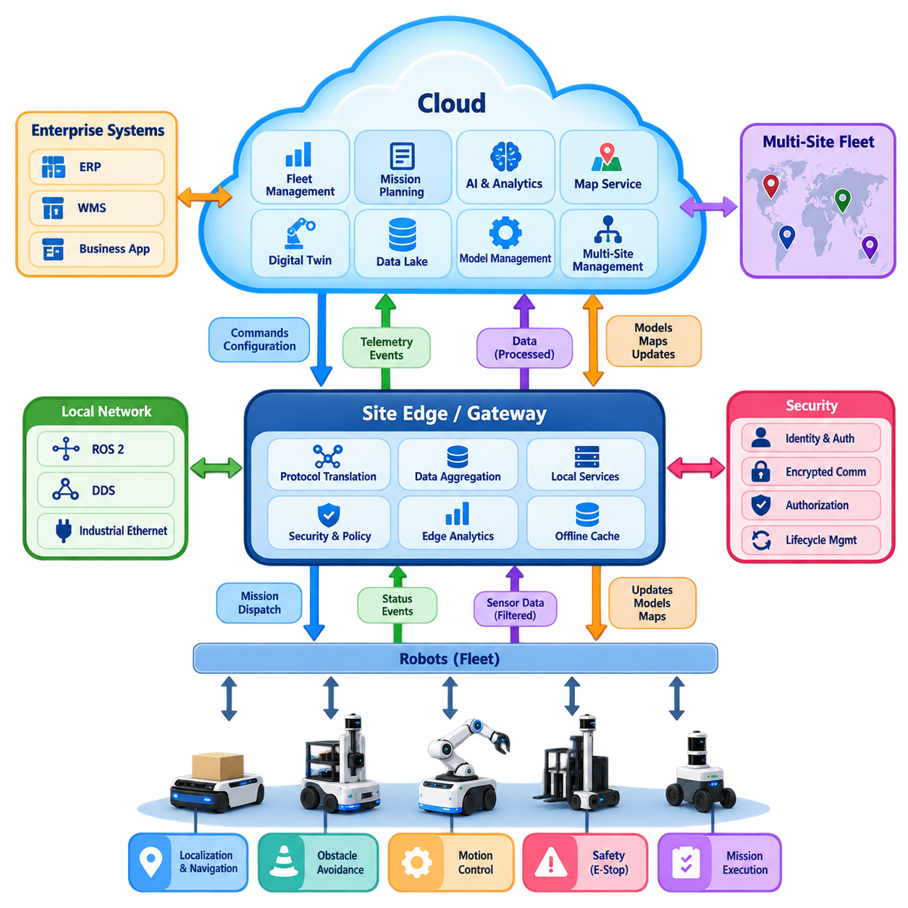
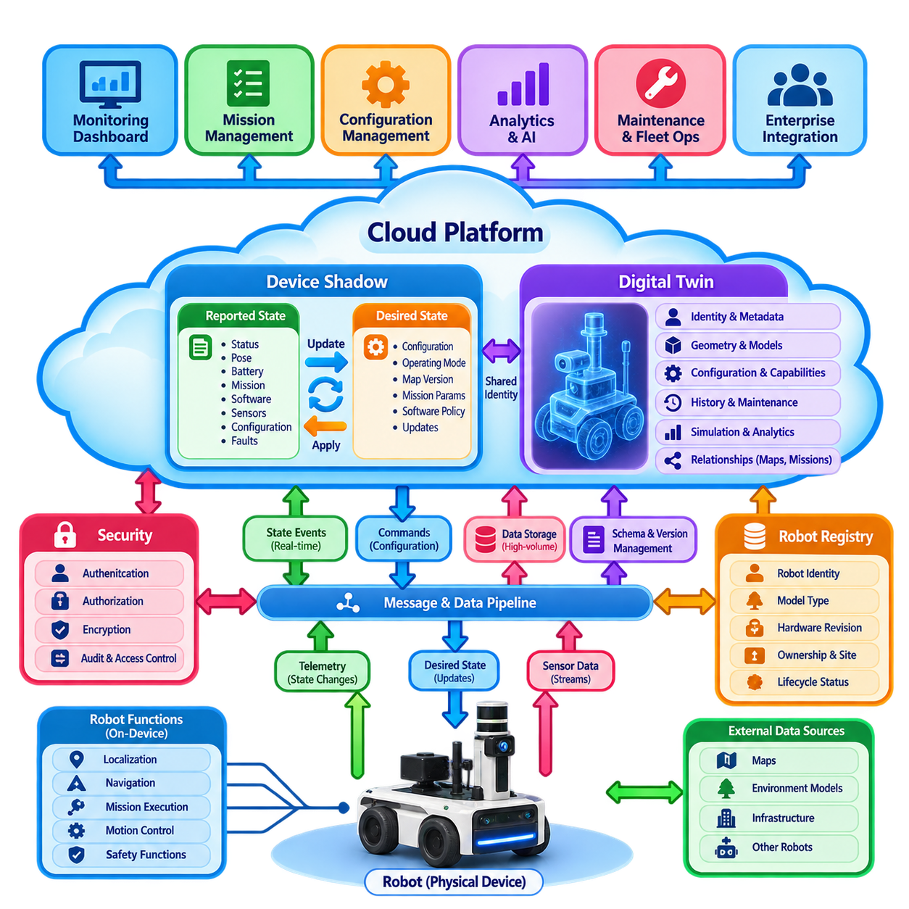
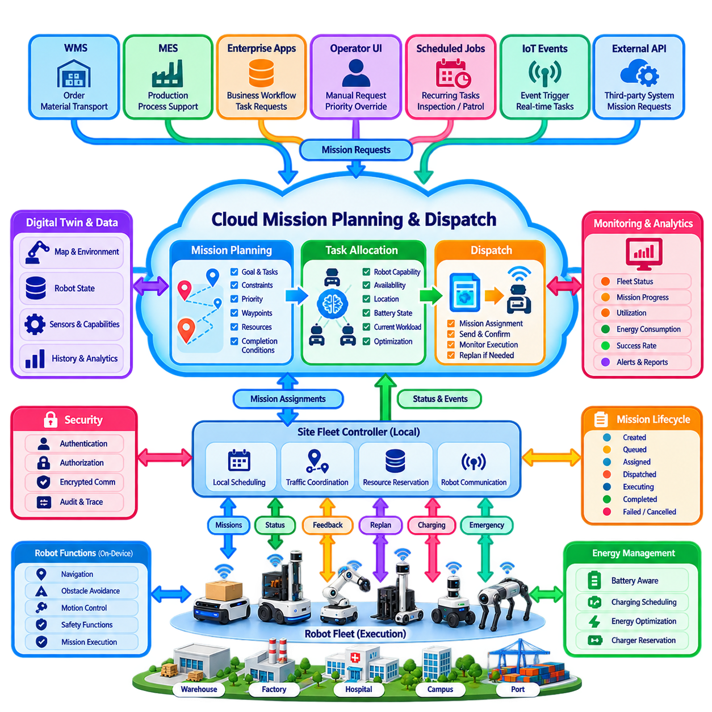
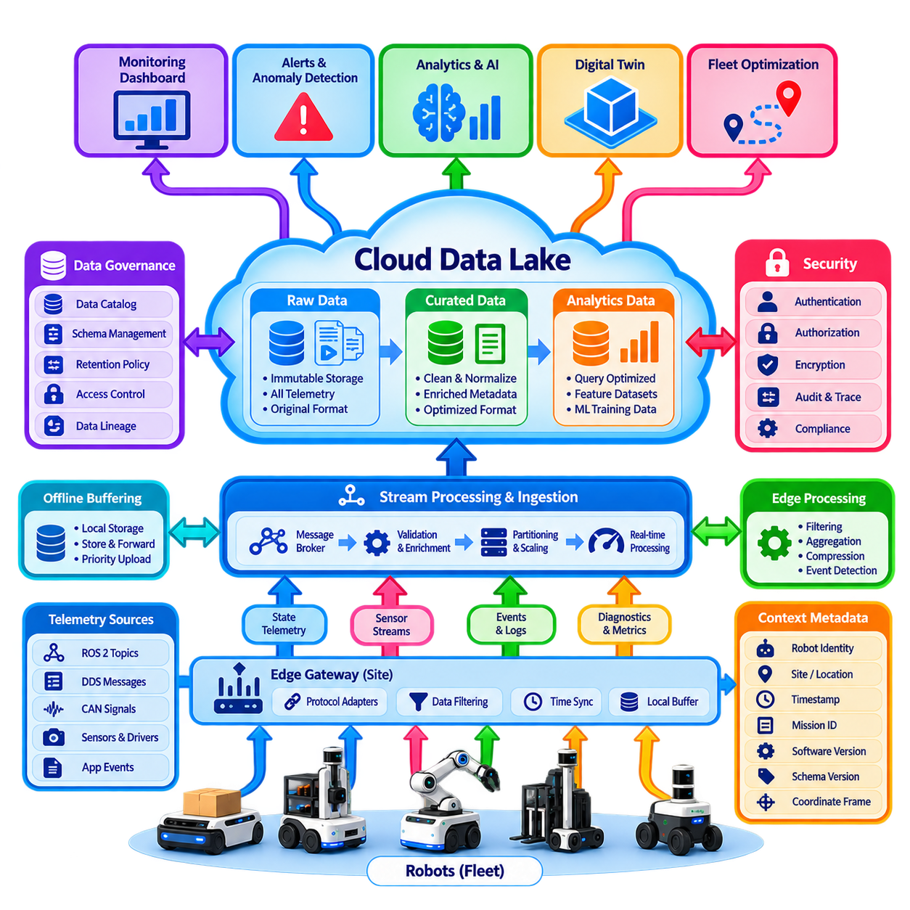
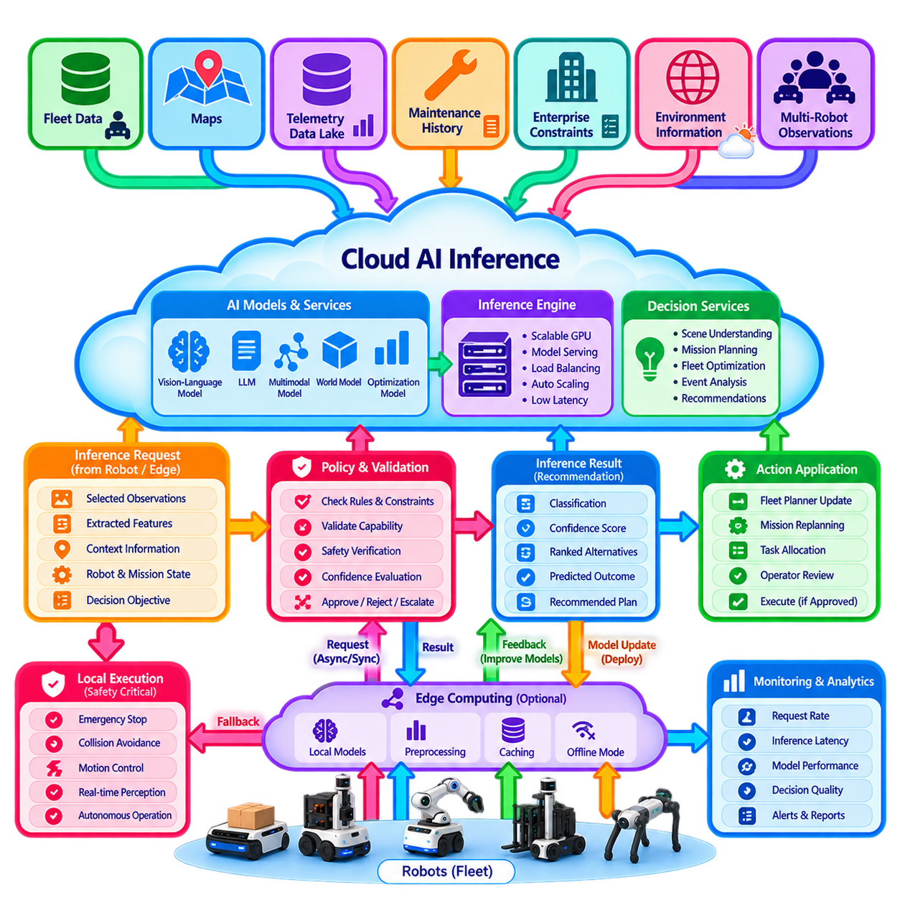
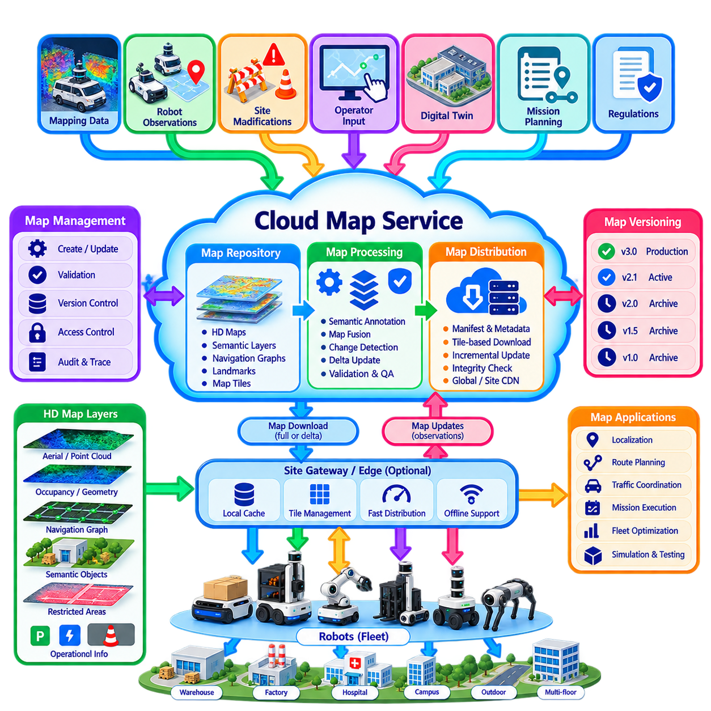
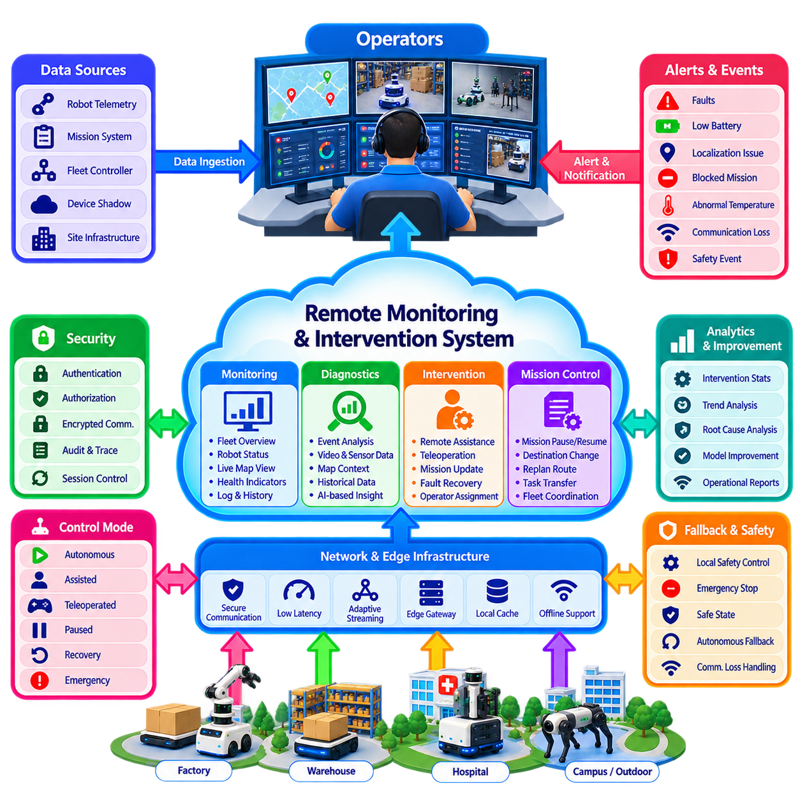
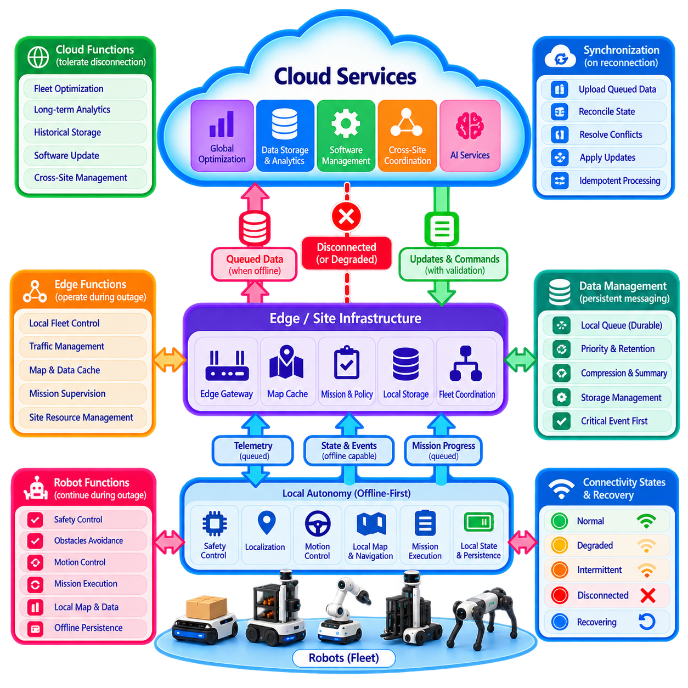
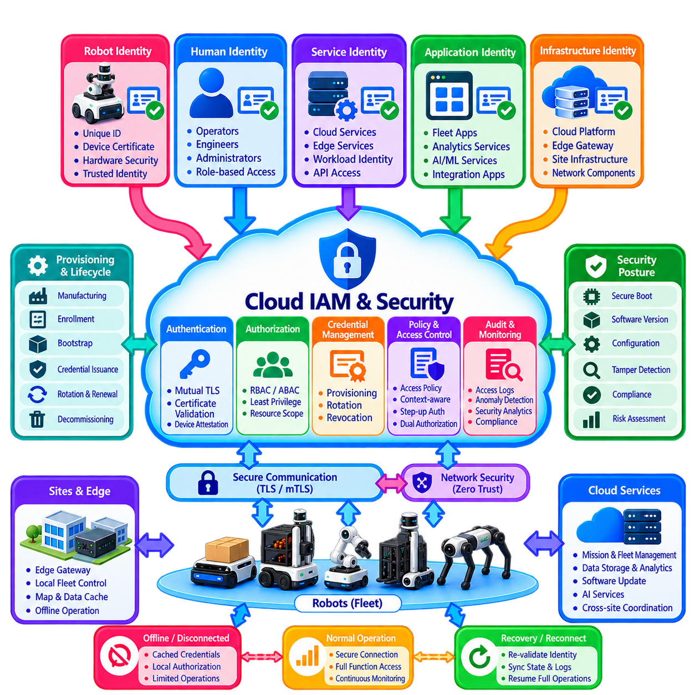
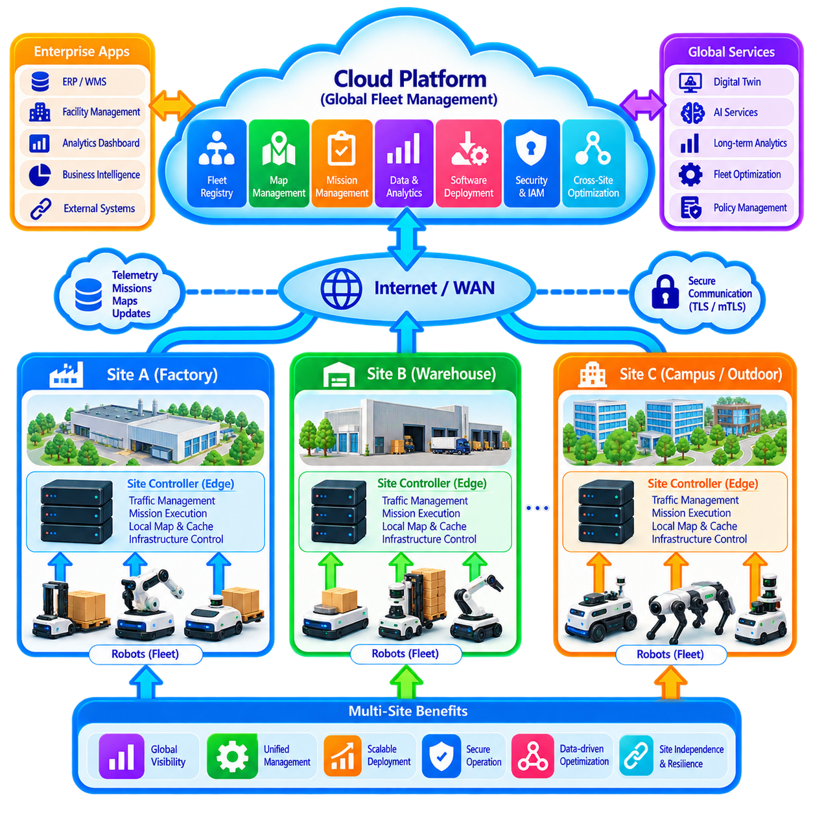

**Volume 16 Multi Robot and Fleet Intelligence**

# 05. Robot Cloud Integration

## 05.01 Robot Cloud Integration Architecture Patterns

{width="7.268055555555556in" height="7.268055555555556in"}

로봇-클라우드 통합(Robot-Cloud Integration)은 물리적 환경에서 작동하는 자율 로봇(Autonomous Robot)을 로봇 외부의 확장 가능한 컴퓨팅(Computing), 저장소(Storage), 협업(Coordination), 관리 서비스(Management Service)와 연결한다. 다중 로봇 플릿(Multi-Robot Fleet)에서 클라우드(Cloud)는 단순한 원격 컴퓨터가 아니라, 플릿 수준 정보를 유지하고 임무와 설정을 배포하며 운영 데이터를 통합하고 각 로봇에 개별적으로 탑재하기 비효율적인 계산 자원을 제공하는 공유 서비스 계층(Shared Service Layer)이 된다.

기본적인 아키텍처 원칙은 안전 중요 기능(Safety-Critical Function)과 지연시간 중요 기능(Latency-Critical Function)을 클라우드 의존 서비스(Cloud-Dependent Service)로부터 분리하는 것이다. 위치추정(Localization), 장애물 회피(Obstacle Avoidance), 비상 정지(Emergency Stop), 저수준 모션 제어(Low-Level Motion Control), 기본적인 임무 지속 기능은 일반적으로 로봇 또는 인접한 엣지 인프라(Edge Infrastructure)에 유지된다. 반면 클라우드는 플릿 분석(Fleet Analytics), 이력 데이터 처리, 전역 최적화(Global Optimization), 모델 관리(Model Management), 장기 저장 및 사이트 간 협업과 같이 더 긴 비결정적 지연시간을 허용할 수 있는 기능을 담당한다.

가장 단순한 통합 패턴은 직접 로봇-클라우드 아키텍처(Direct Robot-to-Cloud Architecture)이다. 각 로봇은 클라우드 엔드포인트(Cloud Endpoint)와 보안 연결을 설정하고 텔레메트리(Telemetry), 명령(Command), 설정(Configuration), 진단 정보(Diagnostic Information), 운영 이벤트(Operational Event)를 교환한다. 이 패턴은 소규모 플릿에서는 이해하고 배포하기 쉽지만 로봇 수가 증가할수록 복잡성이 커진다. 수백 개의 독립적인 연결을 관리하려면 확장 가능한 신원 관리(Identity Management), 메시지 라우팅(Message Routing), 연결 감시(Connection Supervision), 대역폭 제어(Bandwidth Control), 간헐적인 통신 장애 처리 메커니즘이 필요하다.

게이트웨이 기반 아키텍처(Gateway-Based Architecture)는 로봇과 클라우드 서비스 사이에 중간 엣지 또는 사이트 게이트웨이(Site Gateway)를 배치한다. 로봇은 ROS 2, DDS, 산업용 이더넷(Industrial Ethernet), 독자 인터페이스(Proprietary Interface) 등을 이용하여 로컬에서 통신하고, 게이트웨이는 선택된 정보를 클라우드용 프로토콜(Cloud-Facing Protocol)로 변환한다. 게이트웨이는 텔레메트리를 통합하고 고대역폭 센서 스트림을 필터링하며 명령을 캐싱하고 보안 정책을 적용하며 광역망(WAN) 장애 중에도 임시 서비스를 유지할 수 있다. 이는 공장, 창고, 병원, 항만처럼 인터넷 연결과 독립적으로 로컬 운영을 지속해야 하는 환경에서 특히 유용하다.

계층형 엣지-클라우드 아키텍처(Hierarchical Edge-Cloud Architecture)는 계산 기능을 로봇, 사이트, 클라우드 계층에 분산함으로써 게이트웨이 개념을 확장한다. 개별 로봇은 즉각적인 인지(Perception)와 제어(Control)를 수행하고, 엣지 클러스터(Edge Cluster)는 사이트 수준의 활동을 조정하며, 클라우드 서비스는 조직 전체 수준의 기능을 수행한다. 따라서 의사결정은 지연시간, 계산 비용, 통신 대역폭, 안전 요구사항, 정보의 지리적 범위에 따라 적절한 위치에 배치될 수 있다. 이러한 구조는 단일 현장에서 여러 시설에 분산된 대규모 플릿으로 확장하기 위한 자연스러운 기반을 제공한다.

이벤트 기반 통합(Event-Driven Integration)은 로봇이 지속적으로 상태 변화와 운영 이벤트를 생성하기 때문에 대규모 로봇 플릿에서 특히 효과적이다. 로봇은 서로 강하게 결합된 서비스를 계속 호출하는 대신 임무 시작(Mission Started), 웨이포인트 도달(Waypoint Reached), 배터리 부족(Battery Low), 위치추정 성능 저하(Localization Degraded), 충전 시작(Charging Initiated), 작업 완료(Task Completed)와 같은 이벤트를 발행한다. 클라우드 애플리케이션은 필요한 이벤트만 구독(Subscribe)하여 비동기적으로 처리한다. 이를 통해 로봇 소프트웨어와 백엔드 애플리케이션의 직접적인 의존성을 줄이면서 분석, 모니터링, 워크플로 엔진(Workflow Engine), 플릿 서비스를 독립적으로 발전시킬 수 있다.

명시적인 결과가 필요한 작업에는 요청-응답 인터페이스(Request-Response Interface)를 사용하는 보완적 패턴이 적용된다. REST 또는 gRPC 서비스는 로봇 등록(Robot Registration), 설정 검색(Configuration Retrieval), 지도 요청(Map Request), 임무 제출(Mission Submission), 소프트웨어 메타데이터(Software Metadata), 관리 작업에 적합하며, 비동기 메시징(Asynchronous Messaging)은 지속적인 텔레메트리와 이벤트 처리에 활용할 수 있다. 따라서 실제 운영 아키텍처는 하나의 통신 방식에 의존하지 않고 각 데이터 흐름의 의미와 시간 요구조건에 따라 동기식 API(Synchronous API), 메시지 브로커(Message Broker), 스트리밍 파이프라인(Streaming Pipeline), 로컬 로봇 미들웨어(Local Robot Middleware)를 조합한다.

디지털 섀도 패턴(Digital Shadow Pattern)은 각 로봇의 운영 상태를 나타내는 클라우드 측 표현을 유지한다. 모든 애플리케이션이 물리적 로봇을 직접 조회하는 대신 연결 상태(Connectivity), 위치(Pose), 배터리 상태(Battery State), 소프트웨어 버전(Software Version), 현재 임무(Current Mission), 상태 건전성(Health Condition), 설정(Configuration) 등의 속성을 포함하는 동기화된 표현에 접근한다. 또한 목표 상태(Desired State)를 기록하여 간헐적으로 연결되는 로봇이 다시 온라인 상태가 되었을 때 설정 변경 사항을 전달할 수 있다. 이는 애플리케이션 가용성을 지속적인 로봇 연결로부터 분리하고 플릿 규모 관리를 위한 일관된 인터페이스를 제공한다.

데이터 이동(Data Movement)은 운영 텔레메트리(Operational Telemetry)와 대용량 센서 정보(High-Volume Sensor Information)를 구분해야 한다. 로봇 위치, 배터리 상태, 오류, 임무 진행 상황, 온도, 활용률과 같은 데이터는 지속적으로 전송할 수 있을 만큼 작지만 원시 카메라, LiDAR, 레이더(Radar), 오디오 스트림(Audio Stream)은 네트워크와 클라우드 저장소에 과도한 부하를 줄 수 있다. 따라서 엣지 필터링(Edge Filtering), 압축(Compression), 이벤트 기반 기록(Event-Triggered Recording), 메타데이터 추출(Metadata Extraction), 선택적 업로드(Selective Upload)가 필수적인 아키텍처 메커니즘이 된다. 클라우드 통합은 로봇이 생성한 모든 데이터를 동일하게 취급하는 것이 아니라 운영 가치에 따라 정보를 이동시켜야 한다.

클라우드 기반 임무 관리(Cloud-Based Mission Management)는 또 다른 중요한 패턴이다. 비즈니스 시스템(Business System)은 작업 요구사항을 클라우드 또는 플릿 서비스에 제출하고, 해당 서비스는 로봇의 기능, 가용성, 위치, 배터리 상태, 사이트 제약조건에 따라 이를 로봇 수준의 임무로 변환한다. 할당된 임무는 실행을 위해 로봇 또는 로컬 플릿 컨트롤러(Local Fleet Controller)로 전달된다. 이러한 역할 분리는 기업 시스템이 주문과 목표를 중심으로 판단하도록 하면서 로봇은 물리적으로 실행 가능한 동작을 담당하게 하여 비즈니스 오케스트레이션(Business Orchestration)과 실시간 자율성(Real-Time Autonomy) 사이의 명확한 경계를 형성한다.

복원력 있는 아키텍처(Resilient Architecture)는 통신 장애가 반드시 발생할 수 있다는 것을 전제로 설계된다. 따라서 명령과 이벤트에는 식별자(Identifier), 타임스탬프(Timestamp), 확인 정책(Acknowledgement Policy), 만료 규칙(Expiration Rule), 재시도(Retry), 중복 탐지(Duplicate Detection), 영구 로컬 큐(Persistent Local Queue)가 필요하다. 로봇은 클라우드 연결이 끊어졌을 때 정의된 성능 저하 모드(Degraded Mode)로 진입할 수 있도록 충분한 임무 문맥과 환경 정보를 유지해야 한다. 통신이 복구되면 동기화 과정은 대기 중인 모든 메시지를 무조건 재전송하는 대신 로컬 실행 이력과 클라우드 상태를 조정해야 한다.

보안(Security)은 클라우드 연결이 로컬 시설을 넘어 로봇의 공격 표면(Attack Surface)을 확대하기 때문에 통합 아키텍처에 내재되어야 한다. 각 로봇에는 고유한 기계 신원(Machine Identity), 인증된 통신(Authenticated Communication), 권한 부여 정책(Authorization Policy), 보호된 자격 증명(Protected Credential), 암호화 전송(Encrypted Transport)이 필요하다. 클라우드 서비스는 텔레메트리 발행, 임무 명령, 설정 변경, 원격 개입(Remote Intervention), 소프트웨어 배포에 대한 권한을 구분해야 한다. 로봇이 설치되고 사이트 간 이동되거나 정비, 교체, 폐기될 때 신원 수명주기 관리(Identity Lifecycle Management)는 더욱 중요해진다.

다중 사이트 운영(Multi-Site Operation)은 또 다른 아키텍처 차원을 추가한다. 글로벌 클라우드 계층(Global Cloud Layer)은 플릿 전체의 신원, 소프트웨어 버전, 분석, AI 모델, 운영 정책, 통합 성능 정보를 관리할 수 있으며 각 사이트는 광역망 의존성을 허용할 수 없는 임무를 위해 로컬 제어 계층(Local Control Plane)을 유지한다. 사이트 격리(Site Isolation)는 장애 전파를 제한하고 외부 통신 장애 중에도 독립적인 운영을 가능하게 한다. 동시에 표준화된 인터페이스를 통해 중앙 서비스는 지리적으로 분산된 플릿의 활용률, 신뢰성, 에너지 소비, 임무 성능을 비교할 수 있다.

따라서 클라우드 통합(Cloud Integration)은 로봇 지능(Robot Intelligence)을 원격 서버로 이전하는 것이 아니라 책임을 적절하게 분산하는 구조로 설계되어야 한다. 로봇 자율성(Robot Autonomy)은 즉각적인 물리적 운영을 보호하고, 엣지 인프라(Edge Infrastructure)는 저지연 협업과 복원력을 제공하며, 클라우드 인프라(Cloud Infrastructure)는 확장 가능한 계산, 데이터 영속성(Persistence), 전역 가시성(Global Visibility), 플릿 간 지능(Cross-Fleet Intelligence)을 제공한다. 효과적인 아키텍처는 지연시간, 안전성, 대역폭, 가용성, 일관성, 보안, 운영 범위를 기준으로 각각의 의사결정과 데이터가 어디에 위치해야 하는지를 명확하게 결정한다.

이러한 계층형 접근 방식(Layered Approach)은 향후 클라우드 AI 추론(Cloud AI Inference), 공유 지도 서비스(Shared Map Service), 원격 개입, 플릿 디지털 트윈(Fleet Digital Twin), 분산 학습(Distributed Learning), AI 기반 플릿 최적화(AI-Based Fleet Optimization)와 같은 기능을 도입하기 위한 기반도 제공한다. 이러한 기능들은 서로 독립된 기능이라기보다 통신(Communication), 분산 지능(Distributed Intelligence), 운영(Operations), 최적화(Optimization), 디지털 트윈 기능을 연결하는 공통 인프라 위에서 작동한다. 따라서 로봇-클라우드 통합은 이들 기능을 대체하는 것이 아니라 대규모 다중 로봇 시스템이 하나의 일관된 지능형 운영 체계로 동작하도록 연결하는 핵심 기반 계층으로 이해해야 한다.

## 05.02 Robot Device Shadow and Twin Management [w/Code]

{width="7.268055555555556in" height="7.268055555555556in"}

로봇 디바이스 섀도(Robot Device Shadow)는 물리적 로봇의 운영 상태(Operational State)를 로봇 외부, 일반적으로 클라우드(Cloud) 또는 플릿 플랫폼(Fleet Platform)에 지속적으로 유지하는 소프트웨어 표현(Software Representation)이다. 이를 통해 물리적 장치가 일시적으로 연결되지 않은 상황에서도 애플리케이션은 로봇의 가장 최근 상태를 확인할 수 있다. 플릿 아키텍처(Fleet Architecture)에서 섀도는 로봇의 연결 상태와 관리 애플리케이션, 임무 서비스, 대시보드, 분석 시스템 및 기업 시스템 연동을 분리하는 추상화 계층(Abstraction Layer)이 된다.

섀도 모델(Shadow Model)은 일반적으로 보고 상태(Reported State)와 목표 상태(Desired State)를 구분한다. 보고 상태는 운전 모드(Operating Mode), 위치(Pose), 배터리 수준(Battery Level), 임무 상태(Mission Status), 소프트웨어 버전(Software Version), 센서 건전성(Sensor Health), 설정(Configuration), 고장 상태(Fault Condition) 등 로봇이 현재 사실이라고 판단하는 정보를 나타낸다. 목표 상태는 새로운 설정, 운전 모드, 지도 버전, 임무 파라미터 또는 소프트웨어 정책처럼 관리 시스템이 로봇에 기대하는 상태를 의미한다. 두 상태의 차이는 상태 동기화(State Synchronization)의 목표가 된다.

따라서 상태 동기화(State Synchronization)는 단순한 데이터 복제가 아니다. 플랫폼은 새롭게 수신한 값이 이전에 저장된 정보보다 최신이며 신뢰할 수 있는지를 판단해야 한다. 각 상태 업데이트에는 타임스탬프(Timestamp), 시퀀스 번호(Sequence Number), 소스 식별자(Source Identifier), 스키마 버전(Schema Version), 리비전 카운터(Revision Counter) 등이 필요할 수 있다. 이러한 메커니즘은 지연되거나 중복된 네트워크 메시지가 최신 정보를 덮어쓰는 것을 방지하고, 표시된 상태가 현재 텔레메트리인지 과거의 최종 확인 상태인지 판단할 수 있도록 한다.

로봇이 온라인(Online) 상태일 때에는 선택된 상태 변화를 주기적으로 또는 이벤트 기반(Event-Based)으로 섀도 서비스에 발행한다. 클라우드는 보고 상태를 갱신하고 관련 변경 사항을 이벤트(Event), 구독(Subscription), API 등을 통해 플릿 애플리케이션에 전달한다. 운영자 또는 클라우드 서비스가 목표 상태를 변경하면 해당 변경 사항은 로봇으로 전달된다. 로봇은 요청된 설정을 적용한 후 결과 상태를 다시 보고하며, 이를 통해 플랫폼은 목표 상태와 보고 상태가 일치하는지를 확인할 수 있다.

디바이스 섀도(Device Shadow)는 통신이 간헐적인 환경에서 특히 유용하다. 클라우드 애플리케이션은 로봇이 오프라인(Offline) 상태인 동안에도 즉각적인 연결 없이 목표 상태를 변경할 수 있다. 플랫폼은 요청을 지속적으로 보관하고 로봇이 다시 연결되면 대기 중인 변경 사항을 전달한다. 반대로 로봇에 연결할 수 없는 상황에서도 애플리케이션은 마지막으로 보고된 상태를 확인할 수 있다. 따라서 오래된 정보가 실시간 로봇 텔레메트리로 오인되지 않도록 연결 상태(Connectivity Status), 최종 업데이트 시간(Last-Update Time), 상태 최신성(State Freshness)을 명시적으로 표현해야 한다.

디지털 트윈(Digital Twin)은 이러한 표현을 단순한 상태 캐시(State Cache) 이상으로 확장한다. 디바이스 섀도가 주로 운영 상태와 동기화를 유지한다면, 로봇 디지털 트윈(Robot Digital Twin)은 신원(Identity), 설정, 형상(Geometry), 기능(Capability), 유지보수 이력(Maintenance History), 임무 이력(Mission History), 성능 특성, 소프트웨어 구성, 센서 구성 및 행동 모델(Behavioral Model)을 결합할 수 있다. 또한 시뮬레이션(Simulation), 진단(Diagnostics), 예지정비(Predictive Maintenance), 최적화(Optimization), 가상 시나리오 분석(What-If Analysis)을 지원하여 물리적 로봇보다 풍부한 계산적 대응체(Computational Counterpart)를 구성할 수 있다.

따라서 섀도(Shadow)와 트윈(Twin)은 동일한 플랫폼에서 구현되더라도 개념적으로 구분해야 한다. 섀도는 로봇이 연결되어 있는지, 어떤 임무를 수행하고 있는지, 마지막으로 보고한 배터리 수준이 얼마인지, 현재 설정이 목표 설정과 일치하는지와 같은 질문에 답한다. 반면 트윈은 예상 행동(Expected Behavior), 성능 저하 추세(Degradation Trend), 유지보수 요구사항, 과거 성능, 시뮬레이션된 반응, 그리고 지도, 인프라, 임무 및 다른 로봇과의 관계에 대한 보다 광범위한 정보를 제공할 수 있다.

확장 가능한 플릿 구현(Scalable Fleet Implementation)은 일반적으로 모든 로봇에 하나의 논리적 섀도 또는 트윈 신원(Logical Shadow or Twin Identity)을 유지한다. 로봇 레지스트리(Robot Registry)는 이 표현을 변경되지 않는 식별자(Immutable Identifier), 모델 유형(Model Type), 하드웨어 리비전(Hardware Revision), 인증서(Certificate), 소유권(Ownership), 사이트 할당(Site Assignment), 수명주기 상태(Lifecycle Status)와 연결한다. 동적인 운영 속성은 상대적으로 정적인 메타데이터와 독립적으로 갱신된다. 신원 및 메타데이터를 빠르게 변화하는 텔레메트리와 분리하면 불필요한 쓰기 작업을 줄이고 접근 패턴에 따라 서로 다른 저장 기술을 선택할 수 있다.

모든 센서 값이 디바이스 섀도에 포함되어야 하는 것은 아니다. 고주파 카메라 프레임(Camera Frame), LiDAR 포인트 클라우드(Point Cloud), 모터 파형(Motor Waveform), 원시 진단 스트림(Raw Diagnostic Stream)은 일반적으로 전용 스트리밍 또는 저장 파이프라인을 통해 처리해야 한다. 섀도에는 협업과 관리에 필요한 간결한 상태 변수(Compact State Variable)를 저장하고, 세부 데이터는 다른 저장소에 보관된 데이터셋을 참조하도록 구성할 수 있다. 이러한 구분은 섀도 서비스가 대용량 텔레메트리 데이터베이스로 변하는 것을 방지하고 예측 가능한 상태 동기화 성능을 유지한다.

로봇 소프트웨어는 플릿 수명주기(Fleet Lifecycle) 동안 지속적으로 발전하기 때문에 상태 스키마(State Schema)는 명시적인 거버넌스(Governance)를 필요로 한다. 새로운 펌웨어(Firmware)는 기존 로봇이 이해하지 못하는 속성을 추가할 수 있으며, 레거시 로봇(Legacy Robot)은 더 이상 권장되지 않는 필드를 계속 보고할 수 있다. 스키마 버전 관리(Schema Versioning), 선택적 속성(Optional Attribute), 호환성 규칙(Compatibility Rule), 검증(Validation), 마이그레이션 전략(Migration Strategy)을 통해 여러 세대의 로봇을 동시에 운영할 수 있다. 플릿 서비스는 모든 로봇이 동일한 기능을 제공한다고 가정해서는 안 되며 로봇 유형, 소프트웨어 버전, 선언된 기능 집합에 따라 상태를 해석해야 한다.

여러 주체가 동일한 목표 상태를 변경할 수 있는 경우 충돌 해결(Conflict Resolution)이 중요해진다. 운영자 대시보드(Operator Dashboard), 임무 계획기(Mission Planner), 유지보수 시스템(Maintenance System), 자동화된 정책 엔진(Automated Policy Engine), 기업 애플리케이션(Enterprise Application)이 동시에 변경을 요청할 수 있다. 아키텍처는 단순히 가장 최근의 메시지에 의존하기보다 각 속성의 소유권(Ownership)과 우선순위(Precedence)를 정의해야 한다. 리비전 검사(Revision Check), 조건부 업데이트(Conditional Update), 명령 권한(Command Authority), 리스(Lease), 정책 기반 중재(Policy-Based Arbitration)를 통해 여러 애플리케이션이 서로의 설정을 반복적으로 덮어쓰는 현상을 방지할 수 있다.

안전 중요 명령(Safety-Critical Command)은 일반적인 섀도 속성보다 강력한 방식으로 처리해야 한다. 비상 정지(Emergency Stop), 직접 모션 명령(Direct Motion Command), 안전 기능 변경(Safety-Function Modification) 및 기타 시간 중요 작업(Time-Critical Operation)은 최종적 일관성에 기반한 섀도 동기화(Eventual Shadow Synchronization)에 의존해서는 안 된다. 이러한 기능에는 명시적인 확인(Acknowledgement), 타임아웃(Timeout), 권한(Authority), 안전 메커니즘을 갖춘 전용 인증 제어 경로(Dedicated Authenticated Control Path)가 필요하다. 섀도는 결과 상태 또는 요청된 운전 모드를 기록할 수 있지만 결정론적 실시간 제어 채널(Deterministic Real-Time Control Channel)과 동일하게 취급해서는 안 된다.

트윈 관리(Twin Management)는 물리적 자산(Physical Asset)의 수명주기와도 동기화되어야 한다. 로봇이 최초 도입(Commissioning)될 때 디지털 신원(Digital Identity)과 초기 트윈이 생성되고 올바른 하드웨어 및 소프트웨어 구성과 연결된다. 부품 교체(Component Replacement), 센서 교정(Sensor Calibration), 펌웨어 업그레이드(Firmware Upgrade), 지도 변경(Map Change), 유지보수 작업에 따라 디지털 표현도 지속적으로 갱신된다. 로봇이 다른 사이트로 이동하거나 퇴역 또는 폐기될 경우 활성 인증정보와 제어 관계를 변경해야 하며, 과거 기록은 데이터 보존 정책(Retention Policy)에 따라 유지되어야 한다.

보안(Security)은 섀도가 물리적 장비에 대한 논리적 제어 인터페이스(Logical Control Interface)를 제공하기 때문에 필수적이다. 로봇은 상태를 보고하기 전에 인증(Authentication)을 거쳐야 하며 애플리케이션도 속성을 읽거나 변경하기 전에 권한 부여(Authorization)를 받아야 한다. 권한은 관찰(Observation), 설정(Configuration), 제어(Control)를 구분해야 한다. 암호화(Encryption), 인증서 기반 로봇 신원(Certificate-Based Robot Identity), 감사 로그(Audit Log), 리비전 이력(Revision History), 최소 권한 접근 정책(Least-Privilege Access Policy)은 추적 가능성을 제공하고 침해된 애플리케이션이 공유 클라우드 서비스를 통해 전체 플릿을 조작할 가능성을 줄인다.

플릿 규모(Fleet Scale)에서 섀도와 트윈은 독립적인 JSON 문서의 집합이 아니라 분산 상태 관리 시스템(Distributed State-Management System)이 된다. 수백 또는 수천 대의 로봇이 연결 상태, 배터리, 임무, 건전성, 설정 속성을 동시에 갱신할 수 있다. 백엔드(Backend)는 필요한 경우 의미 있는 순서를 보존하면서 파티셔닝(Partitioning), 비동기 처리(Asynchronous Processing), 구독 팬아웃(Subscription Fan-Out), 캐싱(Caching), 영속성(Persistence), 장애 복구(Failure Recovery)를 지원해야 한다. 애플리케이션은 모든 로봇을 반복적으로 폴링(Polling)하는 대신 상태 변화를 증분 방식(Incremental Processing)으로 소비하는 것이 바람직하다.

결과적으로 섀도-트윈 결합 아키텍처(Combined Shadow-and-Twin Architecture)는 물리적 로봇과 그 소프트웨어 표현 사이에 제어 가능한 관계를 구축한다. 디바이스 섀도(Device Shadow)는 현재 운영 상태와 목표 운영 상태의 복원력 있는 동기화를 제공하고, 디지털 트윈(Digital Twin)은 여기에 이력적, 구조적, 분석적, 예측적 문맥을 추가한다. 두 기술을 결합하면 간헐적으로 연결되는 로봇을 일관되게 관리할 수 있으며, 클라우드 임무 계획(Cloud Mission Planning), 원격 모니터링(Remote Monitoring), 유지보수 분석(Maintenance Analytics), 시뮬레이션(Simulation), 플릿 수준 지능(Fleet-Wide Intelligence)을 구현하기 위한 기반을 제공한다.

## 05.03 Cloud Based Mission Planning and Dispatch [w/Code]

{width="7.268055555555556in" height="7.268055555555556in"}

클라우드 기반 임무 계획 및 디스패치(Cloud-Based Mission Planning and Dispatch)는 운영 목표를 실행 가능한 로봇 임무(Robot Mission)로 변환하고 이를 적절한 로봇에 할당하는 플릿 수준 협업 계층(Fleet-Level Coordination Layer)을 제공한다. 각 로봇이 기업 시스템의 요청을 독립적으로 해석하도록 하는 대신 클라우드는 주문, 로봇 가용성, 사이트 상황, 우선순위, 자원 제약조건을 보다 광범위하게 파악한다. 이를 통해 개별 로봇의 동작만 최적화하는 것이 아니라 전체 플릿 상태를 고려한 의사결정이 가능해진다.

임무(Mission)는 저수준 모터 명령(Low-Level Motor Command)의 연속이 아니라 구조화된 운영 목표(Structured Operational Objective)를 의미한다. 임무에는 위치 간 자재 운송, 지정된 자산 검사, 특정 구역 순찰, 센서 데이터 수집, 물품 배송, 생산 공정 지원 등의 작업이 포함될 수 있다. 클라우드는 임무 목표, 제약조건, 우선순위, 요구 기능, 위치, 마감시간, 완료 조건을 정의하며, 로봇은 이러한 요구사항을 로컬 환경에서 실행 가능한 내비게이션(Navigation) 및 제어 동작(Control Action)으로 변환하는 책임을 담당한다.

임무 요청(Mission Request)은 다양한 시스템에서 생성될 수 있다. 창고 관리 시스템(Warehouse Management System), 제조 실행 시스템(Manufacturing Execution System), 기업 애플리케이션(Enterprise Application), 운영자 대시보드(Operator Dashboard), 예약된 워크플로(Scheduled Workflow), 사물인터넷 이벤트(IoT Event), 외부 API 등이 모두 작업을 생성할 수 있다. 클라우드 임무 서비스(Cloud Mission Service)는 이러한 요청을 공통 임무 표현(Common Mission Representation)으로 정규화하여 로봇별 차이가 기업 애플리케이션까지 확산되지 않도록 한다. 이러한 추상화는 비즈니스 수준의 작업 정의와 이기종 로봇 플랫폼 사이에 안정적인 경계를 형성한다.

디스패치(Dispatch)를 수행하기 전에 계획기(Planner)는 현재 플릿 상태를 평가한다. 관련 정보에는 로봇 가용성, 위치, 배터리 상태, 적재 용량, 탑재 센서, 조작 기능(Manipulation Capability), 현재 작업 부하, 유지보수 상태, 소프트웨어 호환성, 연결 상태 등이 포함된다. 제한 구역, 충전소 점유 상태, 교통 상황, 지도 버전, 자원 예약(Resource Reservation)과 같은 환경 정보도 할당에 영향을 줄 수 있다. 실행 가능한 임무는 로봇의 기능 요구사항과 운영 제약조건을 모두 만족해야 한다.

임무 계획(Mission Planning)과 작업 할당(Task Allocation)은 밀접하게 관련되어 있지만 논리적으로 구분하는 것이 바람직하다. 계획은 무엇을 수행해야 하는지를 결정하며 하나의 비즈니스 요청을 작업, 의존관계, 웨이포인트(Waypoint), 자원 요구사항, 실행 조건으로 분해할 수 있다. 할당은 어떤 로봇 또는 로봇 그룹이 해당 작업을 수행할 것인지를 결정한다. 이후 디스패치는 생성된 할당 결과를 선택된 실행 대상에 전달하고 임무가 수락, 시작, 진행, 완료, 거부 또는 중단되었는지를 감독한다.

디스패치 워크플로(Dispatch Workflow)는 명령을 일회성 메시지로 취급하는 대신 명시적인 임무 수명주기(Mission Lifecycle)를 사용해야 한다. 일반적인 상태에는 생성(Created), 검증(Validated), 대기(Queued), 할당(Assigned), 디스패치(Dispatched), 수락(Accepted), 실행(Executing), 일시정지(Paused), 완료(Completed), 실패(Failed), 취소(Cancelled), 만료(Expired)가 포함된다. 상태 전이는 추적 가능성을 제공하고, 클라우드 서비스가 자원을 기다리는 임무와 전송되었지만 아직 확인되지 않은 임무를 구분할 수 있게 한다. 이는 수백 개의 임무와 로봇이 동시에 운영되는 환경에서 특히 중요하다.

디스패치 신뢰성(Dispatch Reliability)을 확보하려면 모든 임무와 할당에 안정적인 식별자(Stable Identifier)와 리비전 정보(Revision Information)가 포함되어야 한다. 네트워크 지연으로 인해 확인 메시지나 상태 이벤트가 순서와 다르게 도착할 수 있으며, 재시도 과정에서 중복 메시지가 생성될 수 있다. 멱등 처리(Idempotent Processing)를 사용하면 동일한 디스패치 요청이 여러 번 수신되어도 임무가 반복 실행되지 않는다. 시퀀스 번호, 타임스탬프, 확인 상태, 만료 시간, 리비전 검사는 클라우드 계획기, 로컬 플릿 컨트롤러(Local Fleet Controller), 로봇 사이의 일관성을 유지하는 데 도움을 준다.

직접적인 클라우드 제어(Direct Cloud Control)보다는 계층형 아키텍처(Hierarchical Architecture)가 적합한 경우가 많다. 클라우드는 여러 사이트의 작업을 최적화하고 임무 할당을 생성하며, 사이트 수준 플릿 컨트롤러는 로컬 스케줄링, 교통 협업, 자원 예약, 로봇 통신을 담당할 수 있다. 이후 로봇은 내비게이션, 인지(Perception), 장애물 회피, 모션 제어(Motion Control)를 로컬에서 수행한다. 이러한 역할 분담은 장기적인 최적화를 클라우드에서 수행하면서 물리적 환경과 가까운 위치에서 결정론적이고 저지연의 동작을 유지할 수 있게 한다.

임무 계획은 여러 최적화 목표(Optimization Objective)를 포함할 수 있다. 시스템은 이동 거리, 임무 완료 시간, 에너지 소비, 혼잡, 충전 중단, 운영 비용을 최소화하면서 처리량(Throughput)과 로봇 활용률(Utilization)을 최대화하려 할 수 있다. 실제 환경에서는 이러한 목표가 서로 충돌하는 경우가 많다. 가장 가까운 로봇을 선택하면 이동 시간을 줄일 수 있지만 배터리가 거의 소진된 로봇에 장거리 임무를 할당할 수 있으며, 활용률을 지나치게 높이면 혼잡을 발생시키거나 긴급 작업에 필요한 예비 용량을 제거할 수 있다.

따라서 우선순위 관리(Priority Management)는 디스패치의 핵심 요소이다. 일반 운송, 생산 중요 작업, 안전 검사, 긴급 배송, 복구 작업, 운영자 요청 임무에는 서로 다른 서비스 수준(Service Level)이 필요할 수 있다. 스케줄러(Scheduler)는 우선순위 등급과 마감시간, 대기시간, 자원 가용성, 선점 정책(Preemption Policy)을 결합할 수 있다. 그러나 통제되지 않은 선점은 플릿 운영을 불안정하게 만들 수 있으므로 어떤 임무를 중단할 수 있는지, 부분적으로 실행된 작업을 어떻게 안전하게 재개하거나 재할당할 것인지를 명확하게 정의해야 한다.

배터리 인지형 디스패치(Battery-Aware Dispatch)는 임무 스케줄링과 에너지 관리(Energy Management)를 통합한다. 계획기는 로봇이 임무를 수행하고 적절한 안전 여유(Safety Reserve)를 유지할 수 있는 충분한 에너지를 보유하고 있는지를 추정한다. 충전(Charging) 자체를 하나의 스케줄된 작업으로 취급하여 수요가 낮은 시간에 로봇을 충전하고 배터리가 임계 수준에 도달할 때까지 기다리지 않도록 할 수 있다. 플릿 규모에서는 이러한 협업을 통해 여러 로봇이 동시에 충전기를 요청하는 상황을 방지하고 비효율적인 충전 동기화로 인한 플릿 가용 용량 감소를 줄일 수 있다.

물리적 운영은 최초 계획대로 정확하게 진행되는 경우가 드물기 때문에 동적 재계획(Dynamic Replanning)이 필요하다. 로봇이 차단되거나 배터리가 예상보다 빠르게 소모될 수 있으며 목적지를 사용할 수 없거나 엘리베이터 또는 문이 고장날 수도 있고 긴급 임무가 갑자기 발생할 수도 있다. 클라우드 계획기는 중요한 상태 변화를 지속적으로 평가하고 기존 할당이 여전히 유효한지를 판단해야 한다. 재계획은 이미 안전하게 실행 중인 작업을 불필요하게 방해하지 않으면서 우선순위를 변경하고 대기 중인 작업을 재할당하며 대체 자원을 선택하거나 향후 임무 구조를 조정할 수 있다.

클라우드 연결이 끊어졌다고 해서 물리적 운영이 즉시 중단되어서는 안 된다. 임무가 수락된 이후에는 로봇 또는 로컬 플릿 컨트롤러가 사전에 정의된 오프라인 정책(Offline Policy)에 따라 작업을 계속할 수 있도록 충분한 임무 문맥(Mission Context)을 유지해야 한다. 새로운 클라우드 할당은 일시적으로 버퍼링(Buffering)할 수 있으며 완료된 임무와 상태 변화는 연결이 복구될 때까지 로컬에 저장할 수 있다. 재연결 후에는 추가 명령을 전달하기 전에 실제 실행 이력과 클라우드 기록을 동기화하여 중복되거나 상충되는 임무가 발생하는 것을 방지해야 한다.

임무 실행에는 명확한 권한 경계(Authority Boundary)가 필요하다. 클라우드 서비스는 일반적인 임무 디스패치 경로를 통해 임의의 저수준 모션 명령을 직접 전달해서는 안 된다. 안전 중요 제어(Safety-Critical Control), 비상 정지, 충돌 회피, 위치추정, 즉각적인 궤적 실행(Trajectory Execution)은 로컬 로봇 또는 사이트 시스템에서 유지되어야 한다. 클라우드는 목표와 제약조건을 전달하고 로컬 자율 시스템(Local Autonomy)이 물리적으로 안전한 실행 방법을 결정한다. 이러한 경계는 예측하기 어려운 네트워크 지연이 로봇의 실시간 안전 루프(Real-Time Safety Loop)에 포함되는 것을 방지한다.

보안(Security)은 승인되지 않은 임무 할당이 물리적 장비에 직접 영향을 줄 수 있기 때문에 임무 생성과 디스패치를 모두 보호해야 한다. 로봇과 서비스의 신원은 인증(Authentication)되어야 하며, 권한 부여 정책(Authorization Policy)은 어떤 애플리케이션이나 운영자가 임무를 생성, 변경, 취소, 우선순위 지정 또는 디스패치할 수 있는지를 결정해야 한다. 임무 기록에는 생성 출처, 리비전, 승인, 할당, 실행 이력이 보존되어야 한다. 서명된 명령(Signed Command), 암호화 통신(Encrypted Communication), 감사 로그(Audit Log), 최소 권한 정책(Least-Privilege Policy)은 영향도가 높은 플릿 운영을 추가적으로 보호한다.

관측 가능성(Observability)은 계획 및 디스패치 루프를 완성한다. 클라우드는 임무 수락, 진행 상황, 대기시간, 실행시간, 실패 원인, 에너지 소비, 재할당, 완료 정보를 수집한다. 이러한 기록은 운영 대시보드와 처리량, 활용률, 임무 성공률(Mission Success Rate), 큐 지연시간(Queue Latency), 이동 효율성(Travel Efficiency), 마감시간 준수율(Deadline Compliance)과 같은 지표를 지원한다. 축적된 과거 임무 데이터는 이후 스케줄링 규칙, 용량 계획(Capacity Planning), 시뮬레이션 모델, AI 기반 최적화 정책을 개선하는 데 활용할 수 있다.

궁극적으로 클라우드 기반 임무 계획 및 디스패치(Cloud-Based Mission Planning and Dispatch)는 비즈니스 의도(Business Intent)에서 물리적 실행(Physical Execution)으로 이어지는 계층 구조를 확립한다. 기업 시스템은 달성해야 할 목표를 정의하고, 클라우드 서비스는 목표를 협업된 플릿 임무로 변환하며, 디스패치 메커니즘은 실행 가능한 작업을 할당하고, 사이트 컨트롤러는 로컬 자원을 관리하며, 로봇은 실시간 자율 동작을 수행한다. 이러한 계층들이 명확한 상태 정보를 교환하고 분명한 권한 경계를 유지하면 통신 장애, 동적 환경, 이기종 로봇, 변화하는 운영 수요에 대응하면서도 플릿을 안정적으로 확장할 수 있다.

## 05.04 Telemetry Streaming to Cloud Data Lake [w/Code]

{width="7.268055555555556in" height="7.268055555555556in"}

클라우드 데이터 레이크(Cloud Data Lake)로의 텔레메트리 스트리밍(Telemetry Streaming)은 대규모 로봇 플릿을 관찰하고 분석하며 지속적으로 개선하기 위한 데이터 기반을 제공한다. 각 로봇은 자신의 상태, 임무, 움직임, 에너지 소비, 센서, 소프트웨어, 고장 및 환경과의 상호작용을 설명하는 운영 정보를 지속적으로 생성한다. 스트리밍 아키텍처(Streaming Architecture)는 로봇 실행 기능을 분석 애플리케이션과 직접 결합하지 않으면서 로봇과 사이트 인프라에서 선택된 정보를 확장 가능한 클라우드 저장소로 전달한다.

로봇 텔레메트리(Robot Telemetry)는 다양한 데이터 전송률, 형식 및 시간 요구조건이 결합된다는 점에서 일반적인 기업 데이터와 다르다. 저속 신호에는 배터리 상태, 운전 모드, 온도, 임무 상태, 건전성 지표 등이 포함될 수 있으며, 위치추정(Localization)과 모션 데이터(Motion Data)는 초당 여러 번 생성될 수 있다. 카메라, LiDAR, 레이더(Radar), 마이크 및 기타 센서는 메가바이트에서 기가바이트 규모의 원시 데이터를 생성할 수 있다. 따라서 아키텍처는 연속적인 상태 텔레메트리와 고대역폭 센서 스트림을 구분해야 한다.

텔레메트리 수집(Telemetry Collection)은 일반적으로 관련 소프트웨어 구성요소와 하드웨어 인터페이스를 구독하는 데이터 수집 계층(Data Acquisition Layer)에서 시작된다. ROS 2 토픽(Topic), DDS 메시지, CAN 신호, 진단 인터페이스(Diagnostic Interface), 애플리케이션 이벤트, 센서 드라이버 등이 모두 텔레메트리 소스가 될 수 있다. 모든 내부 신호를 전송하는 대신 텔레메트리 에이전트(Telemetry Agent)는 승인된 데이터를 선택하고 문맥 메타데이터(Contextual Metadata)를 추가하며 타임스탬프를 적용하고 정보를 후속 처리에 적합한 스키마(Schema)로 변환한다.

엣지 처리(Edge Processing)는 대역폭과 클라우드 비용을 제어하기 위해 필수적이다. 로봇 또는 사이트 게이트웨이(Site Gateway)는 불필요한 샘플을 필터링하고 일정 시간 구간의 측정값을 집계하며 통계적 요약값을 계산하고 페이로드(Payload)를 압축하며 전송 전에 이벤트를 탐지할 수 있다. 예를 들어 고주파 진동 측정값은 정상 운전 중 통계적 특징(Statistical Feature)으로 요약하고 비정상 동작이 탐지되었을 때만 원시 샘플을 보존할 수 있다. 이를 통해 무차별적인 데이터 수집을 가치 중심 텔레메트리 수집(Value-Oriented Telemetry Acquisition)으로 전환할 수 있다.

시간 동기화(Time Synchronization)는 플릿 분석에서 서로 다른 센서, 컴퓨터 및 로봇이 생성한 정보를 결합하는 경우가 많기 때문에 특히 중요하다. 각각의 텔레메트리 레코드(Telemetry Record)는 클라우드 도착 시간에만 의존하지 않고 의미 있는 이벤트 타임스탬프(Event Timestamp)를 포함해야 한다. NTP 또는 PTP와 같은 메커니즘을 이용한 클록 동기화(Clock Synchronization)는 시간적 일관성을 향상시킬 수 있으며, 시퀀스 번호(Sequence Number)는 누락되거나 순서가 변경된 메시지를 탐지하는 데 활용할 수 있다. 정확한 시간 정보는 임무 실행, 고장, 교통 상호작용 및 다중 센서 이벤트를 재구성할 수 있게 한다.

텔레메트리 메시지(Telemetry Message)는 로봇을 벗어난 이후에도 데이터를 해석할 수 있도록 충분한 문맥 정보를 포함해야 한다. 일반적인 메타데이터에는 로봇 식별정보, 사이트, 타임스탬프, 소프트웨어 버전, 임무 식별자, 메시지 유형, 스키마 버전, 좌표계(Coordinate Frame), 품질 지표(Quality Indicator)가 포함된다. 센서별 데이터에는 추가적으로 보정(Calibration) 또는 설정 참조정보가 포함될 수 있다. 이러한 문맥 메타데이터를 통해 수개월 전에 수집된 데이터도 익명의 측정값이 아니라 당시의 정확한 로봇 구성과 운영 환경에 연결할 수 있다.

스트리밍 전송(Streaming Transport)은 클라우드 처리가 로봇 동작을 차단하지 않도록 일반적으로 비동기 방식(Asynchronous)으로 구성된다. 로봇 또는 게이트웨이는 텔레메트리를 메시지 브로커(Message Broker), 이벤트 스트리밍 플랫폼(Event-Streaming Platform) 또는 관리형 수집 서비스(Managed Ingestion Service)에 발행하고, 독립적인 소비자(Consumer)가 후속 스트림을 처리한다. 로봇, 사이트, 메시지 종류 또는 안정적인 키를 기준으로 파티셔닝(Partitioning)하면 플릿 규모의 병렬 처리가 가능하다. 버퍼링(Buffering)과 역압(Backpressure) 메커니즘은 일시적인 클라우드 처리 지연이 로봇 제어 소프트웨어까지 직접 전파되는 것을 방지한다.

네트워크 연결이 항상 유지된다고 가정해서는 안 된다. 따라서 오프라인 우선 텔레메트리 파이프라인(Offline-First Telemetry Pipeline)은 즉시 전송할 수 없는 데이터를 위한 로컬 영구 버퍼(Local Persistent Buffer)를 유지한다. 연결이 복구되면 버퍼링된 레코드는 우선순위, 데이터의 생성 시점 및 사용 가능한 대역폭에 따라 업로드할 수 있다. 중요한 고장 이벤트는 일반 텔레메트리보다 먼저 전송할 수 있으며 오래된 고주파 샘플은 보존 정책(Retention Policy)에 따라 요약하거나 폐기할 수 있다. 이를 통해 로봇 운영을 보호하면서 중요한 증거 데이터를 보존할 수 있다.

클라우드 수집 계층(Cloud Ingestion Layer)은 수신된 레코드를 장기 저장소에 기록하기 전에 검증한다. 인증(Authentication)은 데이터를 전송한 로봇 또는 게이트웨이의 신원을 확인하고, 스키마 검증(Schema Validation)은 메시지 구조를 검사하며, 무결성 제어(Integrity Control)는 손상된 페이로드를 식별한다. 처리 서비스는 사이트 메타데이터, 로봇 모델 정보, 임무 문맥 또는 환경 속성을 레코드에 추가할 수 있다. 유효하지 않은 레코드는 운영 데이터셋에 그대로 유입되어 후속 분석을 오염시키지 않도록 별도의 격리 경로(Quarantine Path)로 분리하는 것이 바람직하다.

클라우드 데이터 레이크(Cloud Data Lake)는 여러 처리 단계의 데이터를 보존하면서 확장 가능한 객체 저장소(Object Storage)에 텔레메트리를 저장한다. 원시 데이터(Raw Data)는 변경 불가능한 랜딩 영역(Immutable Landing Area)에 보관하고, 정제 및 정규화된 정보는 큐레이션 계층(Curated Layer)에 저장하며, 애플리케이션에서 바로 사용할 수 있는 데이터셋은 분석 또는 머신러닝을 위해 구성할 수 있다. 이러한 분리를 통해 처리 파이프라인을 재현하고 원본 증거를 이용하여 고장을 조사하며 로봇으로부터 데이터를 다시 수집하지 않고도 새로운 파생 데이터셋(Derived Dataset)을 생성할 수 있다.

데이터 구성(Data Organization)은 활용성에 큰 영향을 미친다. 텔레메트리는 사이트, 로봇, 날짜, 임무, 센서 유형 또는 데이터 클래스에 따라 파티셔닝할 수 있지만 지나친 파티셔닝은 많은 수의 작은 파일을 생성하여 질의 효율성을 저하시킬 수 있다. 열 지향 형식(Columnar Format)은 구조화된 분석 텔레메트리에 유용하며, 대용량 바이너리 센서 데이터(Binary Sensor Artifact)는 검색 가능한 메타데이터와 함께 별도의 특화된 파일로 유지할 수 있다. 저장소 설계는 로봇 내부의 디렉터리 구조를 그대로 복제하기보다 실제 데이터 접근 패턴을 반영해야 한다.

핫·웜·콜드 데이터 계층(Hot, Warm, and Cold Data Tier)을 활용하면 과거 데이터의 가치를 유지하면서 저장 비용을 절감할 수 있다. 최근 운영 텔레메트리는 대시보드와 사고 조사에 즉시 사용할 수 있도록 유지하고, 중간 단계 데이터는 주기적인 분석과 모델 개발을 지원하며, 오래된 원시 데이터셋은 비용이 낮은 아카이브 저장소(Archival Storage)로 이동할 수 있다. 안전 사고, 유지보수 증거, AI 학습 데이터, 일반 텔레메트리, 임시 디버깅 정보는 서로 다른 운영 가치를 가지므로 데이터 유형에 따라 서로 다른 보존 기간을 적용해야 한다.

실시간 스트림 처리(Real-Time Stream Processing)는 장기 데이터 레이크를 보완한다. 선택된 텔레메트리는 영구 저장되기 전에 대시보드, 경보 엔진(Alert Engine), 이상 탐지기(Anomaly Detector), 디지털 트윈(Digital Twin), 플릿 최적화 서비스(Fleet Optimization Service)로 전달될 수 있다. 배터리 온도 상승, 반복적인 위치추정 실패, 비정상적인 모터 전류, 임무 지연 등은 즉각적인 운영 조치를 발생시킬 수 있다. 동일한 이벤트는 이후 신뢰성 분석, 예지정비(Predictive Maintenance), 모델 학습을 위한 과거 데이터셋의 일부가 될 수 있다.

고대역폭 인지 데이터(High-Bandwidth Perception Data)는 지속적인 클라우드 업로드보다 선택적인 수집이 필요하다. 원시 카메라 영상이나 LiDAR 포인트 클라우드는 로컬에 저장하고 고장, 비정상적인 환경 조건, 운영자 주석(Operator Annotation), AI 불확실성 이벤트(AI Uncertainty Event)가 발생했을 때만 업로드할 수 있다. 이벤트 기반 캡처(Event-Triggered Capture)는 이벤트 발생 전후의 일정 시간 구간을 보존하여 중요한 진단 문맥을 제공한다. 데이터셋 샘플링 정책(Dataset Sampling Policy)을 이용하면 향후 인지 시스템 및 피지컬 AI(Physical AI) 모델 개선에 필요한 다양한 상황을 의도적으로 수집할 수도 있다.

여러 로봇과 사이트에서 텔레메트리가 지속적으로 축적되면 데이터 거버넌스(Data Governance)의 중요성이 더욱 커진다. 플랫폼은 스키마 소유권(Schema Ownership), 데이터셋 계보(Dataset Lineage), 보존 규칙, 접근 권한, 데이터 분류 및 처리 이력을 관리해야 한다. 스키마 진화(Schema Evolution)는 과거 데이터와의 호환성을 훼손하지 않으면서 여러 세대의 로봇 소프트웨어를 지원해야 한다. 데이터 카탈로그(Data Catalog)는 어떤 데이터셋이 존재하고 어떻게 생성되었으며 어떤 로봇에서 수집되었고 분석, 디버깅, 시뮬레이션 또는 머신러닝에 적합한지를 제공할 수 있다.

보안(Security)은 텔레메트리의 수집, 전송, 처리, 저장 전 과정에서 데이터를 보호해야 한다. 로봇 신원은 인증되어야 하고 통신은 암호화되어야 하며 서비스와 사용자 역할에 따라 접근이 제어되어야 한다. 클라우드 권한은 데이터 수집(Ingestion), 운영 모니터링, 분석, 모델 개발, 관리 접근을 구분하는 것이 바람직하다. 감사 기록(Audit Record)은 민감한 데이터셋에 대한 추적 가능성을 제공하며 저장 데이터 암호화(Encryption at Rest)와 수명주기 정책(Lifecycle Policy)은 승인되지 않은 접근 또는 의도하지 않은 장기 보존으로 발생할 수 있는 영향을 줄인다.

플릿 텔레메트리(Fleet Telemetry)는 임무, 유지보수, 지도, 소프트웨어 버전, 디지털 트윈과 연결될 때 특히 높은 가치를 갖는다. 이 경우 하나의 고장을 단순한 오류 코드로 분석하는 것이 아니라 로봇 구성, 환경 조건, 이전 임무, 배터리 동작, 최근 소프트웨어 변경 사항과 연계하여 분석할 수 있다. 이러한 문맥적 연결(Contextual Linkage)은 데이터 레이크를 수동적인 저장소에서 근본 원인 분석(Root-Cause Analysis)과 플릿 전체 학습(Fleet-Wide Learning)을 지원하는 운영 지식 기반(Operational Knowledge Base)으로 변화시킨다.

따라서 전체 아키텍처는 물리적 운영(Physical Operation)에서 플릿 지능(Fleet Intelligence)으로 이어지는 연속적인 데이터 루프(Data Loop)를 형성한다. 로봇은 관측 데이터를 생성하고, 엣지 시스템은 이를 필터링하고 문맥 정보를 추가하며, 스트리밍 인프라는 데이터를 안정적으로 전송하고, 클라우드 서비스는 이를 검증하고 보강하며, 데이터 레이크는 다양한 시간 범위에 걸쳐 데이터를 보존한다. 이후 분석과 AI는 축적된 플릿 경험을 유지보수 인사이트(Maintenance Insight), 운영 정책, 개선된 모델 및 최적화 전략으로 변환하고 이를 다시 로봇에 배포함으로써 지속적인 개선 순환 구조를 완성한다.

## 05.05 Cloud AI Inference for Complex Decisions [w/Code]

{width="7.268055555555556in" height="7.268055555555556in"}

클라우드 AI 추론(Cloud AI Inference)은 선택된 AI 모델과 의사결정 서비스를 확장 가능한 원격 인프라에서 실행함으로써 개별 로봇의 연산 성능과 메모리 한계를 넘어 로봇 지능을 확장한다. 이는 대규모 모델, 광범위한 문맥 데이터(Contextual Data), 플릿 전체 지식(Fleet-Wide Knowledge)이 필요한 복잡하고 즉각적이지 않은 의사결정에 특히 유용하다. 목적은 모든 로봇 지능을 클라우드로 이전하는 것이 아니라 지연시간, 안전성, 계산 요구량, 정보 범위를 가장 적절하게 균형화할 수 있는 위치에 각각의 추론 기능을 배치하는 것이다.

기본적인 아키텍처 원칙은 클라우드 추론(Cloud Inference)을 안전 중요 실시간 제어 루프(Safety-Critical Real-Time Control Loop)의 일부로 사용해서는 안 된다는 것이다. 비상 정지(Emergency Stop), 충돌 회피(Collision Avoidance), 안정화(Stabilization), 저수준 모션 제어(Low-Level Motion Control), 즉각적인 장애물 대응은 외부 통신이 불가능한 경우에도 로컬에서 계속 수행되어야 한다. 클라우드 AI는 의미론적 추론(Semantic Reasoning), 임무 최적화, 장기 계획(Long-Horizon Planning), 플릿 수준 의사결정, 복잡한 장면 해석 등 네트워크 및 처리 지연의 변동을 허용할 수 있는 기능에 더 적합하다.

추론 워크플로(Inference Workflow)는 일반적으로 로봇 또는 엣지 시스템(Edge System)이 로컬 의사결정 능력을 넘어서는 문제를 식별하면서 시작된다. 로봇은 제한 없이 원시 센서 스트림을 전송하는 대신 선택된 관측 정보, 추출된 특징(Extracted Feature), 환경 문맥, 로봇 상태, 임무 정보, 신뢰도 값(Confidence Value), 명확하게 정의된 의사결정 목표를 포함하는 추론 요청(Inference Request)을 구성할 수 있다. 이를 통해 대역폭을 줄이면서 클라우드 모델이 운영 상황을 추론하는 데 필요한 충분한 정보를 제공할 수 있다.

클라우드 추론은 단일 로봇이 확보하기 어려운 정보를 결합할 수 있다. 의사결정 서비스(Decision Service)는 플릿 상태, 과거 임무, 지도, 디지털 트윈(Digital Twin), 유지보수 기록, 환경 정보, 기업 운영 제약조건, 다른 로봇의 관측 정보에 접근할 수 있다. 예를 들어 로봇이 판단하기 어려운 차단 경로를 발견했을 경우 다른 로봇이 최근 동일한 지역을 관측했거나 시설 시스템에서 임시 제한구역을 보고했다는 정보를 활용할 수 있다. 따라서 클라우드 지능(Cloud Intelligence)은 계산 능력뿐만 아니라 광범위한 문맥 정보도 제공한다.

대규모 AI 모델(Large AI Model)은 클라우드 추론을 활용하는 주요 이유 중 하나이다. 비전-언어 모델(Vision-Language Model), 멀티모달 파운데이션 모델(Multimodal Foundation Model), 대규모 언어 모델(Large Language Model), 월드 모델(World Model), 계산량이 많은 최적화 네트워크는 모든 로봇에 경제적으로 탑재하기 어려운 메모리와 가속기 자원을 요구할 수 있다. 중앙 집중형 GPU 인프라는 여러 로봇이 이러한 기능을 공유 서비스(Shared Service) 형태로 사용할 수 있게 하며, 모델 인스턴스(Model Instance)를 수요에 따라 확장하고 로봇 하드웨어를 교체하지 않고도 업그레이드할 수 있게 한다.

복잡한 장면 해석(Complex Scene Interpretation)은 대표적인 적용 분야이다. 로컬 인지(Local Perception)는 객체, 사람, 장애물, 주행 가능 영역을 실시간으로 탐지하고, 불확실하거나 비정상적인 관측 결과는 보다 강력한 클라우드 모델로 에스컬레이션(Escalation)할 수 있다. 클라우드는 이미지, 의미론적 설명, 지도, 임무 문맥, 과거 사례를 결합하여 상황을 분류하거나 적절한 행동을 추천할 수 있다. 이러한 계층형 접근 방식(Hierarchical Approach)은 추가적인 추론이 실질적인 운영 가치를 제공하는 상황에 고비용 추론 자원을 집중할 수 있게 한다.

임무 수준 추론(Mission-Level Reasoning)은 또 다른 중요한 활용 사례이다. 클라우드 AI 서비스는 전체 플릿에 걸쳐 대체 가능한 임무 순서, 자원 제약조건, 로봇 기능, 배터리 상태, 마감시간, 혼잡도, 운영 우선순위를 평가할 수 있다. 하나의 로봇이 수행할 다음 동작만 결정하는 것이 아니라 보다 긴 시간 범위와 상호작용하는 여러 자원을 고려하여 추론할 수 있다. 이때 AI 모델의 출력은 즉각적인 물리적 제어 명령이 아니라 플릿 계획기(Fleet Planner)에 제공되는 권고안(Recommendation)으로 활용할 수 있다.

아키텍처는 추론 결과(Inference Result)와 실행 명령(Executable Command)을 구분해야 한다. 모델은 분류 결과, 신뢰도 점수(Confidence Score), 우선순위가 지정된 대안, 예측 결과, 의미론적 해석 또는 추천 계획을 반환할 수 있다. 이후 정책 또는 오케스트레이션 계층(Policy or Orchestration Layer)이 운영 규칙, 로봇 기능, 권한, 안전 제약조건을 기준으로 결과를 검증한 후 실제 행동으로 변환한다. 이러한 분리는 확률적 AI 출력(Probabilistic AI Output)이 결정론적 제어(Deterministic Control)와 플릿 관리 메커니즘을 우회하는 것을 방지한다.

따라서 신뢰도(Confidence)와 불확실성(Uncertainty)은 클라우드 AI 통합의 핵심 요소이다. 모델은 단순히 의사결정 결과만 반환하는 것이 아니라 사용 가능한 증거가 해당 결과를 어느 정도 뒷받침하는지를 함께 나타내야 한다. 신뢰도 임계값(Confidence Threshold), 불확실성 추정(Uncertainty Estimation), 분포 외 탐지(Out-of-Distribution Detection), 일관성 검사(Consistency Check), 규칙 기반 검증(Rule-Based Validation)을 통해 추론 결과를 자동으로 수락할지, 다른 모델에서 추가 처리할지, 로컬 자율 시스템으로 반환할지 또는 운영자의 검토를 위해 에스컬레이션할지를 결정할 수 있다.

각 추론 서비스(Inference Service)에는 명확한 지연시간 예산(Latency Budget)이 정의되어야 한다. 전체 응답시간에는 데이터 수집, 전처리(Preprocessing), 네트워크 업링크(Network Uplink), 대기열 처리(Queueing), 모델 실행, 후처리(Post-Processing), 정책 검증, 다운링크(Downlink), 로봇 측 적용 시간이 포함된다. 모델 자체가 수십 밀리초 내에 실행되더라도 네트워크 또는 대기열 지연이 지배적이면 전체 응답시간은 허용 범위를 초과할 수 있다. 따라서 의사결정은 안전 및 운영 측면에서 허용 가능한 최대 지연시간을 기준으로 분류해야 한다.

즉각적인 응답이 필요하지 않은 의사결정에는 비동기 추론(Asynchronous Inference)이 더 적합한 경우가 많다. 로봇은 요청을 제출한 후 안전한 로컬 동작을 계속 수행하고 이후 이벤트 또는 메시지 채널을 통해 결과를 수신할 수 있다. 동기식 추론(Synchronous Inference)은 로봇이 제한된 시간 동안 안전하게 대기할 수 있는 경우에 적합하지만 모든 요청에는 타임아웃(Timeout)과 대체 동작(Fallback Behavior)이 정의되어야 한다. 클라우드 결과가 지연되거나 사용할 수 없거나 유효하지 않거나 현재 상황과 일치하지 않을 경우 로봇이 어떤 행동을 수행할지 명확해야 한다.

연결 상태를 고려한 운영(Connectivity-Aware Operation)을 위해서는 로컬 대체 정책(Local Fallback Policy)이 필요하다. 클라우드 추론을 사용할 수 없는 경우 로봇은 더 작은 엣지 모델(Edge Model)을 사용하거나 결정론적 규칙을 적용하고 중요하지 않은 작업을 연기하거나 운영자 지원을 요청하거나 정의된 성능 저하 운전 모드(Degraded Operating Mode)로 진입할 수 있다. 대체 동작은 단순히 무한 재시도를 수행하는 것이 아니라 불확실성으로 인해 발생할 수 있는 결과의 심각도에 따라 결정되어야 한다. 클라우드 AI는 사용 가능한 경우 자율성을 향상시켜야 하지만 네트워크 단절을 통제되지 않은 운영 장애로 변화시켜서는 안 된다.

물리적 환경은 모델이 정보를 처리하는 동안에도 변화할 수 있으므로 추론 요청에는 정보 최신성 관리(Freshness Management)가 필요하다. 모든 요청에는 타임스탬프, 로봇 상태, 임무 식별자, 관련 문맥 버전이 포함되어야 한다. 결과가 반환되면 수신 시스템은 해당 추론이 생성될 당시의 가정이 현재에도 유효한지를 확인해야 한다. 몇 초 전에 관측된 장애물을 기반으로 생성된 권고안은 로봇이나 주변 객체가 이동한 이후에는 더 이상 적용할 수 없을 수 있다.

플릿 규모 추론(Fleet-Scale Inference)은 자원 스케줄링(Resource Scheduling) 문제를 발생시킨다. 수백 대의 로봇이 동시에 GPU 집약적인 처리를 요청하면 대기열과 가변적인 지연시간이 발생할 수 있다. 클라우드 플랫폼은 임무 중요도, 서비스 등급(Service Class), 마감시간, 모델 크기, 예상 계산 비용에 따라 요청의 우선순위를 지정할 수 있다. 동적 배칭(Dynamic Batching)은 호환 가능한 작업에 대한 가속기 활용률을 향상시키고 자동 확장(Autoscaling)은 최대 수요 시 추론 용량을 추가할 수 있다. 승인 제어(Admission Control)는 과도한 부하로 인해 모든 서비스의 성능이 저하되는 것을 방지한다.

추론 서비스와 함께 모델 관리(Model Management)도 수행되어야 한다. 각 요청과 결과는 모델 식별자, 모델 버전, 입력 스키마, 설정, 관련 전처리 버전과 연결되어야 한다. 이를 통해 운영 과정에서 이루어진 의사결정을 이후에 재현하고 조사할 수 있다. 카나리 배포(Canary Deployment), 단계적 롤아웃(Staged Rollout), A/B 평가(A/B Evaluation), 롤백(Rollback), 성능 모니터링을 활용하면 새로운 모델을 전체 플릿의 추론 동작에 한 번에 적용하는 대신 점진적으로 도입할 수 있다.

관측 가능성(Observability)은 계산 성능과 의사결정 품질을 모두 측정해야 한다. 인프라 지표에는 요청률(Request Rate), 대기열 깊이(Queue Depth), 가속기 활용률(Accelerator Utilization), 추론 지연시간, 타임아웃 발생 빈도, 서비스 가용성이 포함된다. AI 관련 지표에는 신뢰도 분포, 거부율(Rejection Rate), 로컬 모델과의 불일치, 운영자 재정의(Operator Override), 후속 임무 결과, 데이터 분포 변화가 포함될 수 있다. 이러한 측정값을 결합하면 기술적으로 사용 가능한 모델이 실제 플릿 운영을 개선하고 있는지를 평가할 수 있다.

보안(Security)은 추론 서비스가 물리적 동작에 영향을 줄 수 있기 때문에 특히 중요하다. 로봇과 클라우드 서비스는 상호 인증해야 하며 요청과 응답은 변조로부터 보호되어야 하고 권한 부여 정책은 각 로봇이 호출할 수 있는 모델과 의사결정 서비스를 제한해야 한다. 민감한 센서 데이터에는 데이터 최소화(Data Minimization), 암호화, 보존 기간 제한, 사이트별 접근 정책이 필요할 수 있다. 또한 중요한 의사결정의 감사 가능성(Auditability)을 유지하기 위해 추론 결과를 기록해야 한다.

클라우드 추론은 텔레메트리 및 데이터 레이크 파이프라인(Telemetry and Data-Lake Pipeline)과 연결될 때 더욱 강력해진다. 어려운 사례, 낮은 신뢰도의 예측, 운영자의 수정, 임무 실패, 비정상적인 환경 관측을 학습 증거(Learning Evidence)로 저장할 수 있다. 이러한 데이터셋은 오프라인 평가, 모델 재학습, 시뮬레이션, 회귀 테스트(Regression Testing)를 지원한다. 검증된 모델 개선 결과를 다시 클라우드 또는 엣지 추론 서비스에 배포함으로써 플릿 운영과 AI 개발 사이에 지속적인 학습 루프(Continuous Learning Loop)를 구축할 수 있다.

결과적으로 전체 아키텍처는 클라우드가 로봇을 직접 제어하는 구조가 아니라 계층형 지능 시스템(Hierarchical Intelligence System)을 형성한다. 온디바이스 지능(On-Device Intelligence)은 즉각적인 물리적 동작을 보호하고, 엣지 컴퓨팅(Edge Computing)은 저지연 추론과 복원력(Resilience)을 제공하며, 클라우드 AI는 대규모 모델, 전역 문맥(Global Context), 공유 가속 자원(Shared Acceleration), 장기적 추론(Long-Horizon Reasoning)을 제공한다. 정책 및 검증 계층(Policy and Validation Layer)은 강력한 확률적 모델이 안전 중요 물리 제어에 직접적인 권한을 갖지 않으면서 의사결정에 기여하도록 이들 계층을 연결한다.

따라서 복잡한 의사결정을 위한 클라우드 AI 추론(Cloud AI Inference for Complex Decisions)은 계산 규모와 전역 지식이 실제로 추론 품질을 향상시키는 경우 가장 큰 가치를 제공한다. 성공적인 시스템은 모든 의사결정을 대규모 원격 모델로 보내는 것이 아니라 어떤 의사결정을 에스컬레이션해야 하는지를 적절하게 선택하고, 지연시간과 불확실성을 관리하며, 반환된 결과를 검증하고, 로컬 자율성(Local Autonomy)을 유지해야 한다. 이러한 구조를 적절하게 설계하면 클라우드 AI는 로봇 플릿이 더욱 강력한 AI의 이점을 활용하면서도 복원력, 관측 가능성, 보안성 및 운영 안전성을 유지할 수 있도록 하는 공유 지능 계층(Shared Intelligence Layer)이 된다.

## 05.06 Cloud Map Service HD Map Distribution [w/Code]

{width="7.268055555555556in" height="7.268055555555556in"}

클라우드 지도 서비스(Cloud Map Service)는 자율 로봇 플릿(Autonomous Robot Fleet)에 필요한 지도를 생성, 저장, 버전 관리, 검증 및 배포하기 위한 중앙 집중형 메커니즘을 제공한다. 각 로봇이 독립적인 지도 파일을 관리하는 대신 플릿은 통제된 지도 저장소(Map Repository)를 공통 단일 진실 공급원(Single Source of Truth)으로 사용한다. 로봇과 사이트 컨트롤러는 자신의 위치, 임무, 소프트웨어 구성 및 운영 역할에 적합한 지도 콘텐츠를 가져와 대규모 이기종 환경에서도 일관된 내비게이션(Navigation)을 수행할 수 있다.

자율 로봇에서 지도(Map)는 단순한 환경의 기하학적 표현(Geometric Representation) 이상의 의미를 갖는다. 지도에는 점유 정보(Occupancy Information), 포인트 클라우드(Point Cloud), 차선 또는 경로 네트워크, 랜드마크(Landmark), 의미론적 영역(Semantic Region), 속도 제한, 제한 구역, 도킹 위치, 충전소, 엘리베이터, 출입문, 교차로, 선호 경로 및 기타 운영 제약조건이 포함될 수 있다. HD 지도(HD Map)는 정확한 위치추정(Localization), 경로 계획(Route Planning), 교통 협업(Traffic Coordination), 임무 실행을 지원할 수 있을 정도로 상세한 기하학적 및 의미론적 정보를 결합한다.

클라우드 지도 서비스는 지도 저장(Map Storage)과 실시간 내비게이션(Real-Time Navigation)을 분리해야 한다. 위치추정, 장애물 회피, 궤적 생성(Trajectory Generation), 즉각적인 모션 의사결정은 지속적인 클라우드 연결에 의존할 수 없기 때문에 로봇 또는 로컬 엣지 시스템(Local Edge System)에 유지되어야 한다. 클라우드는 권위 있는 지도 자산(Authoritative Map Asset)과 그 수명주기를 관리하고 로봇은 로컬 실행에 필요한 정보를 다운로드하여 캐싱한다. 이러한 분리는 중앙 집중형 거버넌스(Centralized Governance)와 복원력 있는 자율 운행을 결합한다.

지도 데이터는 일반적으로 지리적 범위와 기능적 목적에 따라 계층적으로 구성된다. 전역 표현(Global Representation)은 사이트와 대규모 운영 구역을 식별할 수 있으며, 사이트 지도(Site Map)는 건물, 도로, 층, 야드 또는 생산 구역을 표현한다. 보다 상세한 계층에서는 내비게이션 그래프(Navigation Graph), 의미론적 객체(Semantic Object), 위치추정 랜드마크, 제한 영역 또는 로봇별 운영 정보를 표현할 수 있다. 계층형 구성(Layered Organization)을 통해 로봇은 전체 지도 데이터베이스를 다운로드하는 대신 자신의 임무와 관련된 정보만 가져올 수 있다.

물리적 환경과 운영 규칙은 시간이 지나면서 변화하기 때문에 지도 버전 관리(Map Version Management)가 필수적이다. 게시되는 모든 지도에는 고유 식별자, 버전, 생성 시간, 좌표 참조(Coordinate Reference), 호환성 정보, 수명주기 상태가 포함되어야 한다. 초안 지도(Draft Map)는 운영용으로 승격되기 전에 생성 및 검증할 수 있으며, 이전 버전은 롤백(Rollback)과 사고 조사(Incident Investigation)를 위해 유지할 수 있다. 로봇은 현재 사용 중인 지도 버전을 보고하여 플릿 서비스가 일관되지 않은 배포 상태를 탐지할 수 있도록 해야 한다.

지도 배포(Map Distribution)는 통제되지 않은 파일 복사가 아니라 명시적인 지도 매니페스트(Map Manifest)를 기반으로 수행해야 한다. 매니페스트는 필요한 파일, 계층, 버전, 의존성, 체크섬(Checksum), 크기, 좌표계(Coordinate Frame), 호환성 요구사항을 기술할 수 있다. 다운로드된 지도를 활성화하기 전에 로봇은 무결성을 검증하고 필요한 모든 구성요소가 존재하는지를 확인한다. 이를 통해 불완전한 전송이나 서로 일치하지 않는 지도 계층이 내비게이션 시스템에 유입되어 일관되지 않은 동작을 발생시키는 것을 방지할 수 있다.

대규모 HD 지도는 전체 데이터셋을 반복적으로 전송하면 대역폭을 낭비하고 배포 시간을 증가시키므로 효율적인 배포 전략이 필요하다. 지도는 지리적 타일(Geographic Tile), 논리적 영역, 층, 경로 또는 의미론적 계층으로 분할할 수 있다. 로봇은 현재 운행 영역에 필요한 부분만 다운로드하고 인접 영역에 진입하기 전에 관련 데이터를 미리 가져올 수 있다. 자주 사용되는 콘텐츠는 사이트 게이트웨이(Site Gateway) 또는 엣지 서버(Edge Server)에 캐싱하여 여러 로봇이 동일한 지도를 사용할 때 반복적인 광역망(WAN) 트래픽을 줄일 수 있다.

증분 업데이트 메커니즘(Incremental Update Mechanism)은 통신 부하를 더욱 줄일 수 있다. 제한 구역, 차선 속성, 의미론적 객체 또는 특정 지역의 기하학적 정보만 변경된 경우 전체 지도를 교체하는 대신 변경분(Delta)을 배포할 수 있다. 로봇은 알려진 기준 버전(Base Version)에 업데이트를 적용한 후 결과 지도 상태를 검증한다. 변경분 배포(Delta Distribution)는 전체 지도 교체에 상당한 대역폭이 필요한 대규모 실외 지도, 다층 시설 및 지리적으로 분산된 플릿에서 특히 유용하다.

지도 활성화(Map Activation)는 통제된 운영 전환(Controlled Operational Transition)으로 취급해야 한다. 새 지도가 다운로드되었다고 해서 반드시 즉시 활성화해야 하는 것은 아니며, 로봇이 이전 버전을 사용하여 이미 임무를 수행하고 있을 수 있기 때문이다. 플릿 시스템은 임무 완료, 지정된 구역 도착, 로봇 재시작 또는 운영자 승인과 같은 안전한 활성화 시점(Safe Activation Point)을 정의할 수 있다. 조정된 활성화는 서로 상호작용하는 로봇들이 동일한 환경에서 호환되지 않는 교통 규칙이나 내비게이션 그래프를 갑자기 사용하는 것을 방지한다.

클라우드 지도 서비스는 좌표계(Coordinate Frame)와 지리공간 참조(Geospatial Reference)도 일관되게 관리해야 한다. 실내 로봇은 건물 랜드마크에 연결된 로컬 직교좌표계(Local Cartesian Frame)를 사용할 수 있으며, 실외 로봇은 GNSS 기준 좌표를 사용할 수 있다. 다층 시설에서는 층, 건물, 사이트, 로봇 좌표계 사이의 추가적인 변환이 필요하다. 따라서 좌표계, 원점(Origin), 변환(Transformation), 보정 참조(Calibration Reference)를 설명하는 메타데이터는 여러 로봇과 애플리케이션이 공간 정보를 공유할 때 지도 형상 자체만큼 중요하다.

의미론적 지도 정보(Semantic Map Information)는 기하학적 정보 이상의 운영적 의미를 제공한다. 복도는 일방통행 구역으로 지정할 수 있고 출입문에는 폭과 접근 제약조건을 포함할 수 있으며 특정 구역에는 속도 제한을 정의할 수 있다. 충전소에는 호환 가능한 로봇 유형을 기술할 수 있다. 다른 영역에는 사람 우선 구역, 위험 지역, 임시 공사 구역, 검사 지점 또는 적재 위치를 정의할 수 있다. 플릿 계획기(Fleet Planner)는 이러한 의미 정보를 사용하여 단순히 기하학적으로 이동 가능한 경로가 아니라 운영 정책을 만족하는 경로를 생성할 수 있다.

동적 정보(Dynamic Information)는 일반적으로 비교적 안정적인 HD 지도와 구분해야 한다. 임시 장애물, 이동하는 사람, 단기적인 혼잡, 사용 중인 도킹 스테이션, 빠르게 변화하는 교통 상황은 실시간 상태 서비스(Real-Time State Service) 또는 로컬 인지(Local Perception)를 통해 표현하는 것이 적합하다. 그러나 로봇이 탐지한 지속적인 환경 변화는 지도 업데이트 후보가 될 수 있다. 정적(Static), 준정적(Semi-Static), 동적 정보를 분리하면 현재 상황에 대한 인식을 유지하면서 불필요하게 빈번한 지도 개정을 방지할 수 있다.

로봇은 관측 정보를 클라우드 지도 파이프라인(Cloud Map Pipeline)으로 다시 제공할 수도 있다. 위치추정 잔차(Localization Residual), 새롭게 탐지된 구조물, 반복적인 경로 차단, 변경된 랜드마크, 운영자 주석(Operator Annotation)은 현재 지도가 실제 환경을 더 이상 정확하게 반영하지 못하고 있음을 나타낼 수 있다. 이러한 관측 결과가 운영 지도를 자동으로 변경해서는 안 된다. 대신 증거를 통합하고 검토 및 검증한 후 통제된 게시 이전에 후보 개정판(Candidate Revision)으로 변환하는 지도 변경 워크플로(Map-Change Workflow)에 입력할 수 있다.

지도 오류는 물리적인 내비게이션에 직접 영향을 줄 수 있기 때문에 검증(Validation)이 매우 중요하다. 자동화된 검사는 단절된 경로, 중첩된 제한 구역, 잘못된 좌표, 누락된 의존성, 일관되지 않은 차선 방향, 호환되지 않는 의미론적 속성을 탐지할 수 있다. 시뮬레이션(Simulation)을 통해 배포 전에 대표적인 경로와 임무를 시험할 수 있으며, 단계적 롤아웃(Staged Rollout)을 통해 새로운 지도를 제한된 로봇 그룹에 먼저 적용할 수 있다. 이후 운영 텔레메트리는 위치추정 품질, 경로 성공률, 예상하지 못한 내비게이션 동작에 대한 검증 자료를 제공한다.

오프라인 운영(Offline Operation)을 위해 로봇은 로컬에서 사용할 수 있는 지도 캐시(Local Map Cache)를 유지해야 한다. 클라우드 연결이 끊어져도 활성 임무는 정의된 정책에 따라 검증된 로컬 지도를 사용하여 계속 수행할 수 있어야 한다. 로봇은 선택적인 지도 업데이트를 통신 복구 시점까지 연기할 수 있으며, 중요한 운영 변경의 경우 임무 제한 또는 운영자 개입이 필요할 수 있다. 캐시된 지도에는 버전, 유효성, 만료 정책(Expiration Policy), 현재 설치된 내비게이션 소프트웨어와의 호환성을 판단할 수 있는 충분한 메타데이터가 포함되어야 한다.

악의적이거나 의도하지 않은 지도 변경은 로봇의 경로를 변경하거나 운영 제한을 수정할 수 있으므로 보안(Security)은 지도 공급망(Map Supply Chain)을 보호해야 한다. 로봇은 지도 서비스를 인증해야 하며 지도 패키지는 무결성 검사(Integrity Check) 또는 디지털 서명(Digital Signature)으로 보호되어야 한다. 접근 제어(Access Control)는 민감한 지도 콘텐츠를 생성, 승인, 게시 또는 가져올 수 있는 사용자를 제한해야 한다. 감사 로그(Audit Log)는 지도 개정, 승인, 다운로드, 활성화 이벤트를 기록하여 이후 내비게이션 동작을 정확한 지도 구성과 연결하여 추적할 수 있도록 해야 한다.

다중 사이트 플릿(Multi-Site Fleet)은 전역적으로 관리되는 지도 거버넌스(Map Governance)와 사이트별 지도 콘텐츠를 분리함으로써 이점을 얻을 수 있다. 클라우드 플랫폼은 공통 스키마, 버전 관리 규칙, 검증 워크플로, 로봇 호환성 정보, 배포 정책을 관리하고 개별 사이트는 자신의 로컬 형상과 운영 의미정보를 관리할 수 있다. 이를 통해 서로 관련 없는 모든 사이트를 하나의 거대한 공간 데이터셋으로 통합하지 않으면서도 수백 개 시설이 일관된 지도 수명주기(Map Lifecycle)를 따를 수 있다.

지도 서비스는 디지털 트윈(Digital Twin), 임무 계획(Mission Planning), 텔레메트리(Telemetry), 플릿 최적화(Fleet Optimization)와도 자연스럽게 연결된다. 디지털 트윈은 내비게이션에서 사용하는 것과 동일한 공간 객체를 참조할 수 있으며, 임무 계획기는 구역과 자원을 기반으로 판단하고, 텔레메트리는 정확한 지도 위치와 연결할 수 있다. 과거 경로 성능을 분석하면 혼잡 구간이나 신뢰성이 낮은 영역을 발견할 수 있으며, 이를 바탕으로 운영자와 계획기는 축적된 플릿 경험에 따라 지도 의미정보, 선호 경로 또는 운영 정책을 개선할 수 있다.

따라서 클라우드 HD 지도 배포(Cloud HD Map Distribution)는 물리적 환경과 자율 로봇 플릿 사이에 통제된 공간 지식 파이프라인(Spatial Knowledge Pipeline)을 형성한다. 클라우드는 권위 있는 지도 버전을 관리하고, 엣지 인프라는 배포와 캐싱을 가속하며, 로봇은 실시간 자율 운행을 위해 검증된 로컬 사본을 유지한다. 버전 관리, 계층형 표현, 증분 업데이트, 검증, 안전한 배포 및 현장 운영 피드백을 결합함으로써 지도 서비스는 지리적으로 분산된 로봇들이 일관된 공간 지식을 기반으로 운행하면서도 네트워크 장애와 환경 변화에 대한 복원력(Resilience)을 유지할 수 있도록 한다.

## 05.07 Remote Monitoring and Intervention System [w/Code]

{width="7.268055555555556in" height="7.268055555555556in"}

원격 모니터링 및 개입 시스템(Remote Monitoring and Intervention System)은 정상적인 자율 기능이 상황을 안전하거나 효율적으로 해결할 수 없을 때 운영자가 자율 로봇을 지원할 수 있도록 플릿 수준 가시성(Fleet-Level Visibility)과 통제된 개입 메커니즘(Controlled Intervention Mechanism)을 제공한다. 목적은 모든 로봇을 지속적으로 수동 감독하는 것이 아니라 로봇은 자율적으로 작업하고 운영자는 고장, 불확실성, 차단된 임무, 안전 이벤트 및 인간의 판단이 필요한 상황에 집중하는 예외 기반 운영(Exception-Based Operation)을 구현하는 것이다.

모니터링 계층(Monitoring Layer)은 텔레메트리(Telemetry), 디바이스 섀도(Device Shadow), 임무 서비스(Mission Service), 플릿 컨트롤러(Fleet Controller), 사이트 인프라(Site Infrastructure)로부터 로봇 상태를 지속적으로 통합한다. 운영자는 연결 상태, 운전 모드, 위치(Pose), 배터리 상태, 임무 진행 상황, 위치추정 품질(Localization Quality), 안전 상태, 고장 및 소프트웨어 상태를 간결하게 파악할 수 있어야 한다. 플릿 전체 요약 정보는 비정상적인 로봇을 신속하게 식별하고 필요한 경우에만 운영자가 세부 정보를 단계적으로 확인할 수 있도록 해야 한다.

원격 운영 센터(Remote Operations Center)는 여러 건물, 캠퍼스, 공장, 창고 또는 실외 사이트에 분산된 로봇을 감독할 수 있다. 따라서 계층형 보기(Hierarchical View)가 중요하다. 운영자는 조직 또는 사이트 수준의 상태에서 시작하여 특정 플릿으로 이동하고 이후 개별 로봇을 상세하게 확인할 수 있다. 지리 지도, 시설 지도, 임무 오버레이(Mission Overlay), 경보 및 건전성 지표(Health Indicator)는 모든 로봇 인터페이스에 직접 접근하지 않고도 공간적·운영적 문맥을 제공한다.

모니터링 정보는 실시간 상태(Live State)와 마지막 확인 상태(Last-Known State)를 구분해야 한다. 통신이 끊어진 로봇도 최신성(Freshness)이 명확하게 표시되지 않으면 이전 위치에 계속 존재하는 것처럼 보일 수 있다. 따라서 연결 상태, 마지막 텔레메트리 타임스탬프, 메시지 지연시간, 데이터 경과시간(Data Age)을 중요 정보와 함께 표시해야 한다. 이를 통해 운영자가 오래된 정보를 현재 상태로 잘못 해석하는 것을 방지하고 원격 개입이 가능한지 또는 로컬 자율 대체 동작(Local Autonomous Fallback Behavior)을 유지해야 하는지를 판단할 수 있다.

경보 관리(Alert Management)는 대규모 텔레메트리 데이터를 운영자가 실제로 대응할 수 있는 정보로 변환한다. 배터리 이상, 위치추정 성능 저하, 반복적인 경로 실패, 차단된 임무, 센서 고장, 통신 단절, 비정상 온도, 안전 이벤트, 임무 마감시간 위험 등이 경보를 발생시킬 수 있다. 심각도(Severity), 지속시간(Persistence), 운영 영향도(Operational Impact), 신뢰도(Confidence)를 기반으로 우선순위를 결정하여 대규모 플릿 운영 중 수많은 저가치 알림으로 운영자가 과부하되는 것을 방지해야 한다.

개입 워크플로(Intervention Workflow)는 즉각적인 수동 제어보다 진단(Diagnosis)에서 시작해야 한다. 운영자는 대응 방법을 결정하기 전에 로봇 상태, 최근 이벤트, 임무 이력, 지도 문맥, 센서 건전성, 관련 이미지 또는 영상을 확인할 수 있다. 많은 경우 개입은 로봇을 직접 운전하는 것이 아니라 경보 확인, 임무 단계 재시도, 목적지 변경, 복구 가능한 고장 해제, 다른 로봇 할당 또는 현장 지원 요청만으로 이루어질 수 있다.

원격 지원(Remote Assistance)과 원격 제어(Remote Control)는 서로 다른 수준의 권한으로 취급해야 한다. 원격 지원은 대체 경로 선택, 통과 승인, 객체 식별, 임무 수정, 복구 동작 확인과 같은 고수준 지침을 제공한다. 반면 원격 제어 또는 원격 조작(Teleoperation)은 운영자가 로봇의 움직임에 보다 직접적인 영향을 미친다. 시스템은 가능한 한 자율성을 유지하면서 문제를 해결할 수 있는 최소 침습적 개입(Least Intrusive Intervention)을 우선적으로 사용해야 한다.

원격 조작(Teleoperation)은 일반적인 모니터링보다 훨씬 강력한 통신 및 안전 메커니즘을 필요로 한다. 영상, 로봇 상태, 제어 명령, 확인 응답(Acknowledgement)은 충분히 예측 가능한 지연시간과 품질로 전달되어야 한다. 네트워크 지연(Network Delay), 지터(Jitter), 패킷 손실(Packet Loss), 대역폭 저하는 운영자의 제어 성능에 직접 영향을 미칠 수 있다. 따라서 시스템은 통신 품질을 지속적으로 평가하고 조건이 정의된 안전 운용 범위(Safe Operating Envelope)를 벗어나면 원격 주행을 제한하거나 종료해야 한다.

원격 조작 중에도 로봇은 로컬 안전 권한(Local Safety Authority)을 유지해야 한다. 원격 조향 명령은 속도 제한, 충돌 회피, 비상 정지, 지오펜싱(Geofencing), 액추에이터 제약조건(Actuator Constraint)을 적용하는 온보드 안전 기능(Onboard Safety Function)을 통과해야 한다. 운영자는 일반적인 원격 인터페이스를 통해 인증되거나 안전 중요 보호 기능을 우회할 수 없어야 한다. 이를 통해 인간은 의도(Intent)를 제공하고 로컬 시스템은 즉각적인 물리적 안전을 보장하는 공유 제어 아키텍처(Shared-Control Architecture)가 형성된다.

개입 권한(Intervention Authority)은 명확한 모드와 상태 전환을 통해 관리해야 한다. 로봇은 자율(Autonomous), 지원(Assisted), 원격 조작(Teleoperated), 일시정지(Paused), 복구(Recovery), 비상(Emergency) 상태로 운용될 수 있으며 각 모드에서 누가 명령 권한(Command Authority)을 가지는지 명확한 규칙이 정의되어야 한다. 자율 모드에서 원격 제어로 전환할 때에는 인증, 권한 부여, 상태 검증, 확인 과정이 필요하다. 다시 자율 모드로 제어권을 반환할 때에도 로봇이 안전한 자율 운행을 계속하기에 적절한 위치와 설정 상태에 있는지를 확인해야 한다.

영상 및 센서 스트리밍(Video and Sensor Streaming)은 모든 로봇에서 지속적으로 전송하는 것이 아니라 운영 필요성에 따라 활성화해야 한다. 일반적인 플릿 모니터링은 간결한 텔레메트리를 사용할 수 있으며, 사고나 이상 상황에 대한 심층 조사가 필요한 경우 상세 카메라 영상, 포인트 클라우드(Point Cloud), 오디오 또는 진단 추적 데이터(Diagnostic Trace)를 요청할 수 있다. 적응형 비트레이트(Adaptive Bitrate), 선택적 센서 활성화, 엣지 압축(Edge Compression), 관심 영역 스트리밍(Region-of-Interest Streaming)을 통해 효과적인 개입에 필요한 정보를 유지하면서 네트워크 부하를 줄일 수 있다.

다중 로봇 플릿(Multi-Robot Fleet)에서는 운영자 작업 부하 관리(Operator Workload Management)가 필요하다. 모니터링 대시보드가 수백 대의 장치를 표시할 수 있더라도 한 명의 원격 운영자가 여러 로봇에 대해 동시에 상세한 개입을 수행할 수는 없다. 따라서 개입 요청은 안전 심각도, 임무 중요도, 대기시간, 사용 가능한 로컬 복구 방법, 예상 운영자 작업량을 기준으로 우선순위 큐(Priority Queue)에 입력되어야 한다. 시스템은 일상적인 문제를 자동으로 해결하고 인간의 판단이 가치를 제공하는 상황에 운영자의 주의를 집중할 수 있다.

운영자-로봇 할당(Operator-to-Robot Assignment) 자체도 하나의 스케줄링 문제(Scheduling Problem)가 될 수 있다. 서로 다른 로봇, 사이트, 개입 유형에는 전문적인 교육이나 권한이 필요할 수 있다. 시스템은 운영자 가용성, 자격(Certification), 언어, 사이트 책임, 로봇 유형, 사고 유형에 따라 요청을 라우팅할 수 있다. 에스컬레이션 규칙(Escalation Rule)을 이용하면 이미 수집된 진단 문맥을 잃지 않으면서 해결되지 않은 문제를 전문가, 유지보수팀, 현장 인력 또는 엔지니어링 지원팀으로 전달할 수 있다.

원격 개입(Remote Intervention)은 독립적인 콘솔로 동작하는 것이 아니라 임무 관리(Mission Management)와 통합되어야 한다. 운영자가 목적지를 변경하거나 실행을 일시정지하고 대체 경로를 선택하거나 작업을 다른 로봇으로 이전하는 경우 임무 서비스는 그에 따른 상태 전환을 기록하고 전파해야 한다. 이를 통해 클라우드 계획기(Cloud Planner), 로컬 플릿 컨트롤러(Local Fleet Controller), 운영자 인터페이스가 로봇이 수행해야 할 작업에 대해 서로 상충되는 상태를 유지하는 것을 방지할 수 있다.

원격 동작은 물리적 자산과 사람에게 영향을 줄 수 있으므로 기록(Recording)과 감사 가능성(Auditability)이 필수적이다. 개입 세션에는 운영자 신원, 로봇 신원, 타임스탬프, 명령, 모드 전환, 임무 변경, 경보, 확인 응답 및 관련 시스템 상태가 기록되어야 한다. 필요한 경우 선택된 영상 또는 센서 증거를 사고 기록과 연결할 수 있다. 이러한 기록은 안전 조사, 운영 개선, 교육, 책임 추적 및 비정상적인 이벤트의 재구성을 지원한다.

사이버보안(Cybersecurity)은 원격 개입 인터페이스가 영향력이 큰 제어 접점(Control Surface)이기 때문에 원격 운영을 보호해야 한다. 강력한 운영자 인증, 역할 기반 권한 부여(Role-Based Authorization), 암호화 통신, 장치 신원(Device Identity), 세션 관리(Session Management), 명령 무결성(Command Integrity), 감사 로깅(Audit Logging)이 기본적으로 요구된다. 위험도가 높은 작업에는 추가 확인 또는 이중 승인(Dual Authorization)을 적용할 수 있다. 접근 권한은 최소 권한 원칙(Least-Privilege Principle)을 따라야 하며 모니터링 권한이 자동으로 설정 변경 또는 원격 조작 권한을 부여해서는 안 된다.

원격 운영(Remote Operation)은 클라우드 또는 광역망(WAN) 장애 상황에서도 복원력(Resilience)을 유지해야 한다. 원격 운영 센터를 사용할 수 없게 되면 로봇은 안전한 로컬 동작을 계속해야 하며 가능한 경우 사이트 컨트롤러가 필수적인 협업 기능을 유지해야 한다. 활성화된 개입 세션은 통신이 끊어질 경우 제어된 정지(Controlled Stop), 자율 복구(Autonomous Recovery), 안전 상태(Safe State) 전환 등 어떤 동작을 수행할지 정의해야 한다. 적절한 대체 동작은 로봇 유형, 환경, 임무 및 운영 위험에 따라 달라진다.

디지털 트윈(Digital Twin)과 과거 텔레메트리(Historical Telemetry)는 현재 경보 이상의 문맥을 제공하여 개입 품질을 향상시킬 수 있다. 운영자는 현재 모터 전류, 위치추정 불확실성(Localization Uncertainty), 배터리 동작 또는 센서 건전성을 동일한 로봇이나 전체 플릿의 과거 패턴과 비교할 수 있다. 유지보수 기록과 최근 소프트웨어 변경 사항도 가능한 원인을 좁히는 데 활용할 수 있다. 이를 통해 원격 모니터링은 단순한 시각화에서 축적된 플릿 지식을 활용하는 진단 환경(Diagnostic Environment)으로 발전한다.

개입 결과(Intervention Outcome)는 지속적인 플릿 개선(Continuous Fleet Improvement)에 반영되어야 한다. 반복적으로 발생하는 운영자 개입은 내비게이션, 인지, 지도, 임무 정책, 인프라 인터페이스 또는 복구 로직의 약점을 나타낼 수 있다. 동일한 인간의 판단이 반복적으로 필요한 사례는 자동 복구 규칙(Automated Recovery Rule) 또는 AI 학습 데이터(AI Training Data)의 후보가 될 수 있다. 개입 빈도, 해결 시간, 운영자 작업 부하, 문제 재발률, 자율 복구 성공률을 측정하면 자율성 수준을 체계적으로 향상시키기 위한 근거를 확보할 수 있다.

성숙한 원격 모니터링 및 개입 아키텍처(Remote Monitoring and Intervention Architecture)는 자율성을 원격 주행으로 대체하는 것이 아니라 자율 플릿 운영 위에 감독형 인간 계층(Supervisory Human Layer)을 구축한다. 로봇은 실시간 인지와 제어를 담당하고, 사이트 시스템은 로컬 운영을 조정하며, 클라우드 서비스는 플릿 가시성과 임무 문맥을 제공하고, 운영자는 자동화 시스템이 해결할 수 없는 상황에 선택적으로 개입한다. 명확한 권한, 안전한 통신, 로컬 안전 기능, 충분한 진단 문맥 및 구조화된 피드백을 결합함으로써 인간의 전문성을 점점 더 대규모화되는 자율 로봇 플릿 전체에 효과적으로 확장할 수 있다.

## 05.08 Offline First Resilient Cloud Integration [w/Code]

{width="7.268055555555556in" height="7.268055555555556in"}

오프라인 우선 복원형 클라우드 통합(Offline-First Resilient Cloud Integration)은 클라우드 연결을 사용할 수 없거나 불안정하거나 심각하게 저하된 상황에서도 로봇이 필수적인 운영을 계속할 수 있도록 설계하는 아키텍처 접근 방식이다. 클라우드는 협업, 분석, 저장 및 최적화 기능을 향상시키지만 즉각적인 물리적 자율성(Physical Autonomy)을 위한 필수 전제조건으로 취급하지 않는다. 이러한 원칙은 일시적인 네트워크 장애가 자동으로 로봇 장애로 이어지는 것을 방지하고 로컬과 원격 시스템 사이의 명확한 책임 경계를 설정한다.

아키텍처는 연결 의존성(Connectivity Dependency)에 따라 기능을 분류하는 것에서 시작한다. 안전 제어(Safety Control), 위치추정(Localization), 장애물 회피(Obstacle Avoidance), 모션 제어(Motion Control), 필수 임무 실행(Essential Mission Execution)은 일반적으로 로봇 내부에 유지된다. 사이트 수준의 교통 협업, 자원 관리 및 플릿 스케줄링(Fleet Scheduling)은 로컬 엣지 인프라(Local Edge Infrastructure)에서 수행할 수 있다. 클라우드 서비스는 일시적인 연결 단절을 허용할 수 있는 전역 최적화(Global Optimization), 장기 분석, 소프트웨어 관리, 이력 저장 및 사이트 간 협업을 담당한다.

오프라인 우선 운영(Offline-First Operation)을 위해서는 로봇이 원격 서비스를 지속적으로 조회하지 않고도 의미 있는 작업을 계속할 수 있도록 충분한 로컬 상태(Local State)를 유지해야 한다. 여기에는 활성 임무 정의, 관련 지도, 내비게이션 그래프(Navigation Graph), 설정, 안전 정책, 로봇 신원, 인증 정보 및 최근 필요한 운영 데이터가 포함될 수 있다. 로컬 영속성(Local Persistence)은 로봇을 단순한 클라우드 클라이언트에서 통신 장애 중에도 통제된 운영을 유지할 수 있는 자율 실행 노드(Autonomous Execution Node)로 전환한다.

사이트 엣지 계층(Site Edge Layer)은 이러한 복원력(Resilience)을 여러 로봇으로 확장할 수 있다. 엣지 게이트웨이(Edge Gateway) 또는 로컬 플릿 컨트롤러(Local Fleet Controller)는 지도, 임무, 설정, 장치 상태 및 운영 정책을 캐싱하면서 로컬 로봇 간 통신과 인프라 협업을 유지할 수 있다. 클라우드와 연결되는 광역망(WAN)이 끊어지더라도 로봇은 로컬 네트워크를 통해 사이트 컨트롤러와 계속 통신할 수 있다. 이를 통해 교통 관리, 충전기 할당, 임무 감독 및 기타 사이트 중요 기능을 계속 사용할 수 있다.

영속 메시징(Persistent Messaging)은 복원력 있는 통합을 위한 기본 메커니즘이다. 클라우드에 전달할 수 없는 텔레메트리(Telemetry), 임무 이벤트, 진단 기록, 확인 응답(Acknowledgement) 및 기타 송신 정보는 폐기하는 대신 내구성 있는 로컬 큐(Durable Local Queue)에 기록해야 한다. 연결이 복구되면 저장된 메시지를 우선순위와 생성 시점에 따라 전송할 수 있다. 중요한 안전 또는 고장 이벤트는 먼저 업로드하고 일반적인 고주파 텔레메트리는 정책에 따라 요약, 압축 또는 만료시킬 수 있다.

클라우드에서 로봇으로 전달되는 통신에도 유사한 보호 메커니즘이 필요하다. 명령, 설정 업데이트, 지도 개정(Map Revision), 임무 할당에는 고유 식별자, 타임스탬프, 리비전(Revision), 만료 시간 및 확인 요구사항이 포함되어야 한다. 장시간 연결이 끊어진 후 다시 연결된 로봇은 오프라인 기간 동안 누적된 모든 메시지를 무조건 실행해서는 안 된다. 만료되거나 새로운 명령으로 대체된 지시는 거부하고, 여전히 유효한 요청은 현재 로봇의 물리적 상태 및 운영 상태와 조정(Reconciliation)해야 한다.

멱등성(Idempotency)은 불확실한 메시지 전달로 인해 재시도가 빈번하게 발생할 수 있는 재연결 과정에서 특히 중요하다. 클라우드가 동일한 임무 할당을 여러 번 전송하더라도 로봇은 요청 식별자를 인식하여 동일한 임무를 반복 실행하지 않아야 한다. 동일한 원칙은 설정 변경, 확인 응답 및 상태 업데이트에도 적용된다. 멱등 인터페이스(Idempotent Interface)는 통신 재시도를 안전하게 만들고 네트워크 장애 복구 과정에서 중복된 물리적 동작이 발생할 위험을 줄인다.

재연결 이후의 상태 동기화(State Synchronization)는 단순히 대기 중인 메시지를 업로드하는 것보다 복잡하다. 연결이 끊어진 동안 로봇은 임무를 완료하거나 위치를 변경하고 에너지를 소비하거나 고장을 경험하거나 다른 운전 모드로 전환했을 수 있다. 동시에 클라우드 측 애플리케이션은 목표 상태(Desired State)를 변경하거나 작업을 재할당했을 수 있다. 따라서 조정 과정에서는 어떤 정보가 우선되어야 하는지를 결정하기 전에 로컬 실제 상태(Local Actual State), 클라우드 목표 상태, 리비전 이력, 타임스탬프 및 권한 규칙(Authority Rule)을 비교해야 한다.

충돌 해결 정책(Conflict Resolution Policy)은 장애가 발생하기 전에 정의되어야 한다. 일부 속성은 클라우드 권한(Cloud Authority)을 따를 수 있지만 다른 속성은 로봇이 보고한 물리적 사실을 유지해야 한다. 예를 들어 향후 임무의 우선순위는 클라우드가 권한을 가질 수 있지만 실제 위치(Pose), 배터리 상태, 완료된 작업 및 로컬에서 탐지된 고장에 대해서는 로봇이 권위 있는 정보원(Authoritative Source)이 된다. 명시적인 소유권 정의는 일반적인 최종 쓰기 우선(Last-Write-Wins) 방식이 오래된 원격 가정으로 물리적으로 유효한 정보를 덮어쓰는 것을 방지한다.

시스템은 연결 상태를 단순히 온라인과 오프라인으로만 구분하지 않고 여러 단계로 구분해야 한다. 정상(Normal), 성능 저하(Degraded), 간헐적 연결(Intermittent), 연결 해제(Disconnected), 복구(Recovering) 모드에 따라 서로 다른 운영 정책을 적용할 수 있다. 연결 품질이 저하되면 로봇은 중요하지 않은 텔레메트리를 줄이거나 클라우드 의존 기능을 비활성화하면서 임무를 계속 수행할 수 있다. 완전히 연결이 끊어진 동안에는 로컬 기능에 전적으로 의존하고, 복구 모드에서는 동기화와 일관성 검사가 완료될 때까지 새로운 임무 할당을 일시적으로 제한할 수 있다.

임무 정책(Mission Policy)은 통신 장애 동안 어느 정도의 자율성을 유지할 것인지를 결정한다. 로봇은 이미 수락한 임무를 완료하거나 검증된 로컬 지도 범위 내에서 작업을 계속하거나 안전한 위치로 복귀하거나 사전에 정의된 반복 작업을 수행하도록 허용될 수 있다. 반면 일부 임무는 클라우드 승인 또는 외부 자원을 필요로 하므로 일시 중단해야 할 수 있다. 허용되는 동작은 임무 위험도, 환경, 사용 가능한 로컬 정보 및 최신 전역 지식 없이 운용할 때 발생할 수 있는 결과를 기준으로 결정해야 한다.

캐시된 정보를 오프라인에서 사용할 때에는 데이터 최신성(Data Freshness)이 매우 중요하다. 지도, 자격 증명(Credential), 설정, 안전 정책, 임무 파라미터 및 의미론적 정보에는 버전과 유효성 정보가 포함되어야 한다. 일부 데이터는 새로운 데이터로 교체될 때까지 계속 사용할 수 있지만 다른 데이터는 정의된 시간이 지나면 만료되어야 한다. 로봇은 로컬에서 사용할 수 있다는 이유만으로 해당 정보를 자동으로 신뢰하는 것이 아니라 캐시된 정보가 여전히 운영에 적합한지를 판단할 수 있어야 한다.

장기간 연결이 끊어지면 로컬 디스크가 가득 찰 수 있으므로 저장소 관리(Storage Management)가 필요하다. 오프라인 버퍼(Offline Buffer)는 저장 용량 제한(Quota), 우선순위, 압축, 집계 및 보존 정책을 적용해야 한다. 중요한 사고 기록과 임무 증거에는 보호된 저장 공간을 할당하고 중복된 텔레메트리는 우선적으로 다운샘플링(Downsampling)하거나 삭제할 수 있다. 저장 공간 부족(Storage Pressure) 자체도 관측 가능한 시스템 상태로 취급하여 로컬 자원이 완전히 소진되기 전에 로봇이 데이터 수집 방식을 조정할 수 있도록 해야 한다.

대역폭 인지형 복구(Bandwidth-Aware Recovery)는 재연결이 또 다른 장애를 발생시키는 것을 방지한다. 사이트 장애 이후 여러 로봇이 동시에 다시 연결되는 경우 제한 없는 동기화는 광역망, 클라우드 수집 서비스 또는 로컬 네트워크에 과부하를 발생시킬 수 있다. 따라서 업로드는 우선순위를 적용하고 전송률을 제한하며 필요에 따라 시간적으로 분산해야 한다. 현재 상태와 중요 이벤트를 먼저 동기화하고 이후 임무 이력과 운영 텔레메트리를 전송하며, 대용량 센서 데이터셋은 충분한 대역폭이 확보되었을 때 나중에 전송할 수 있다.

로컬 대체 기능(Local Fallback)은 클라우드 AI 및 최적화 서비스에도 적용되어야 한다. 대규모 원격 모델이나 전역 계획기(Global Planner)에 접근할 수 없는 경우 로봇은 소형 로컬 모델(Local Model), 결정론적 규칙(Deterministic Rule), 이전에 검증된 계획 또는 엣지에서 호스팅되는 서비스를 사용할 수 있다. 이러한 대체 기능은 성능이나 기능 측면에서 제한적일 수 있지만 동작은 예측 가능해야 한다. 복원력은 모든 클라우드 기능을 로컬에서 동일하게 재현하는 것이 아니라 알려진 운영 가능 범위(Known Operational Envelope)를 유지하는 것을 의미한다.

오프라인 운영 중에도 보안 요구사항(Security Requirement)은 계속 적용되어야 한다. 캐시된 자격 증명, 임무 데이터, 지도 및 설정은 로컬에서 보호되어야 하며 재연결 시에는 동기화를 시작하기 전에 인증되고 암호화된 통신을 다시 확립해야 한다. 장시간 연결이 끊어진 동안 자격 증명이 만료될 수 있으며 이는 보안과 가용성 사이의 어려운 균형을 발생시킨다. 아키텍처는 연결이 불편하다는 이유로 인증을 우회하는 대신 운영 위험도에 적합한 갱신(Renewal), 유예 기간(Grace Period), 복구 및 폐기(Revocation) 정책을 정의해야 한다.

관측 가능성(Observability)은 복원력 메커니즘 자체의 동작도 포함해야 한다. 유용한 지표에는 연결 해제 지속시간, 큐 깊이(Queue Depth), 폐기되거나 요약된 레코드, 로컬 저장 공간 사용량, 재시도 횟수, 동기화 지연시간, 조정 충돌(Reconciliation Conflict), 정상 운영으로 복귀하는 데 필요한 시간이 포함된다. 이러한 측정값을 통해 오프라인 설계가 실제 환경에서 제대로 작동하는지 확인하고 네트워크 장애 상황에서만 나타나는 숨겨진 클라우드 의존성(Hidden Cloud Dependency)을 발견할 수 있다.

복원력은 아키텍처 다이어그램만으로 가정해서는 안 되며 의도적인 장애 시험(Fault Testing)을 통해 검증해야 한다. 엔지니어는 광역망 연결을 차단하거나 지연 및 패킷 손실을 발생시키고 게이트웨이를 재시작하거나 클라우드 서비스를 사용할 수 없도록 만들고 로컬 큐를 포화시키거나 여러 로봇을 동시에 재연결할 수 있다. 시험에서는 안전한 임무 동작, 영속성, 중복 방지, 충돌 해결, 동기화 순서 및 복구 과정을 검증해야 한다. 반복적인 결함 주입(Fault Injection)은 정상적인 연결 상태에서는 드러나지 않는 시스템 의존성을 발견하는 데 도움이 된다.

견고한 배포(Robust Deployment)는 완전한 인터넷 단절 이외의 장애도 고려해야 한다. DNS 장애, 만료된 인증서, 접근할 수 없는 인증 서비스, 일부 API 장애, 메시지 브로커(Message Broker) 중단, 높은 지연시간, 비대칭 연결(Asymmetric Connectivity), 클라우드 리전 장애(Cloud-Region Failure)는 각각 서로 다른 증상을 발생시킬 수 있다. 단순한 연결 해제 상태만을 고려한 설계는 중요한 장애 유형을 처리하지 못한다. 의존성 격리(Dependency Isolation), 로컬 캐싱, 제한된 재시도(Bounded Retry), 회로 차단기(Circuit Breaker), 명시적인 성능 저하 모드를 통해 이러한 부분 장애를 격리할 수 있다.

오프라인 우선 통합(Offline-First Integration)은 궁극적으로 로봇과 클라우드 사이의 관계를 변화시킨다. 로봇과 사이트 시스템은 안전하고 유용한 물리적 운영을 유지할 책임을 가지며, 클라우드는 연결이 허용되는 경우 확장 가능한 지능, 플릿 전체 협업, 축적된 지식 및 관리 기능을 제공한다. 동기화(Synchronization)는 모든 동작에 필요한 지속적인 의존성이 아니라 독립적으로 기능하는 시스템 사이에서 이루어지는 통제된 정보 교환(Controlled Exchange)이 된다.

결과적으로 이러한 아키텍처는 기능의 갑작스러운 상실 대신 점진적 성능 저하(Graceful Degradation)를 제공한다. 정상적인 연결 상태에서는 로봇이 클라우드 계획, 공유 데이터, AI 서비스 및 전역 최적화의 이점을 활용한다. 통신 장애 중에는 정의된 로컬 운영 가능 범위 내에서 작업을 계속하고 중요한 상태를 보존하며 이벤트를 기록한다. 연결이 복구되면 통제된 조정 과정을 통해 일관된 플릿 상태를 복원한다. 이러한 자율성, 영속성(Persistence), 동기화, 대체 기능 및 복구의 결합이 복원력 있는 클라우드 통합 로봇 플릿(Resilient Cloud-Integrated Robot Fleet)의 기반을 형성한다.

## 05.09 Cloud Integration Security IAM Robot Identity

{width="7.268055555555556in" height="7.268055555555556in"}

자율 로봇의 클라우드 통합 보안(Cloud Integration Security)은 모든 로봇, 서비스, 운영자, 애플리케이션 및 인프라 구성요소가 시스템에 참여하기 전에 검증 가능한 신원(Verifiable Identity)을 가져야 한다는 기본 원칙에서 시작한다. 클라우드 서비스에 연결된 로봇은 단순한 네트워크 엔드포인트(Network Endpoint)가 아니라 현실 세계를 감지하고 행동할 수 있는 물리적 사이버-물리 자산(Cyber-Physical Asset)이다. 따라서 신원 및 접근 관리(Identity and Access Management, IAM)는 단순한 관리 기능이 아니라 핵심 아키텍처 계층(Core Architectural Layer)이 된다.

로봇 신원(Robot Identity)은 전체 운영 수명주기 동안 고유하고 지속적이며 암호학적으로 검증 가능해야 한다. 각 로봇에는 하드웨어 유형, 소유권, 사이트, 플릿, 소프트웨어 구성 및 보안 자격 증명(Security Credential)과 연결된 전역 고유 장치 식별자(Globally Unique Device Identifier)를 할당할 수 있다. 사람이 읽을 수 있는 이름은 로봇이 사이트나 운영 그룹 사이를 이동하면서 변경될 수 있지만, 기본 암호학적 신원(Cryptographic Identity)은 통제된 상태로 유지되어 클라우드 서비스가 어떤 물리적 장치와 통신하고 있는지를 신뢰성 있게 판단할 수 있어야 한다.

암호학적 자격 증명(Cryptographic Credential)은 단순한 식별자보다 강력한 신원 보증(Identity Assurance)을 제공한다. 로봇은 신뢰 플랫폼 모듈(Trusted Platform Module, TPM), 하드웨어 보안 모듈(Hardware Security Module, HSM), 보안 요소(Secure Element) 또는 기타 보호된 자격 증명 저장소에 장치 인증서(Device Certificate)와 개인키(Private Key)를 보관할 수 있다. 연결을 설정할 때 로봇은 개인키 자체를 전송하지 않고 해당 키를 보유하고 있음을 증명한다. 클라우드는 관련 인증서 체인(Certificate Chain)을 검증하고 텔레메트리, 임무, 설정 요청 또는 기타 상호작용을 허용하기 전에 장치의 신뢰 여부를 판단한다.

상호 인증(Mutual Authentication)은 일반적으로 로봇과 클라우드 사이의 통신을 보호해야 한다. 전송 계층 보안(Transport Layer Security, TLS)은 로봇이 클라우드 엔드포인트를 인증할 수 있게 하며, 상호 TLS(Mutual TLS, mTLS)는 추가적으로 클라우드가 로봇을 인증할 수 있게 한다. 이를 통해 로봇이 승인되지 않은 서비스에 연결되는 것을 방지하고 공격자가 복사한 장치 식별자만으로 정상 로봇을 사칭하는 것을 차단할 수 있다. 인증(Authentication)은 신원을 확립하고, 이후의 권한 부여(Authorization)는 인증된 주체가 어떤 작업을 수행할 수 있는지를 결정한다.

신원 및 접근 관리(IAM)는 로봇, 사용자, 서비스를 하나의 구분되지 않은 권한 모델에 배치하는 대신 서로 다른 주체 유형(Principal Type)을 구분해야 한다. 로봇 신원은 물리적 장치를 나타내고, 워크로드 신원(Workload Identity)은 클라우드 또는 엣지 소프트웨어 서비스를 나타내며, 인간 신원(Human Identity)은 운영자, 엔지니어, 관리자 및 유지보수 인력을 나타낸다. 이들 주체는 모두 동일한 플릿 플랫폼에 접근할 수 있지만 각각 서로 다른 수명주기, 인증, 권한 및 감사(Auditing) 요구사항을 갖는다.

권한 부여는 최소 권한 원칙(Principle of Least Privilege)을 따라야 한다. 텔레메트리를 발행하고 임무를 수신하기만 하면 되는 로봇에는 플릿 정책을 수정하거나 다른 로봇에 접근하거나 클라우드 자원을 관리할 권한을 자동으로 부여해서는 안 된다. 마찬가지로 분석 서비스(Analytics Service)는 과거 텔레메트리에 대한 읽기 권한은 필요할 수 있지만 임무를 디스패치할 권한은 필요하지 않을 수 있다. 세분화된 권한은 자격 증명이 침해되었을 때의 영향을 줄이고 의도하지 않은 작업이 전체 플릿으로 확산되는 것을 방지한다.

역할 기반 접근 제어(Role-Based Access Control, RBAC)는 플릿 운영자, 유지보수 엔지니어, 사이트 관리자, 보안 감사자 또는 로봇 서비스와 같은 운영 역할에 따라 권한을 할당하여 권한 관리를 단순화할 수 있다. 속성 기반 접근 제어(Attribute-Based Access Control, ABAC)는 사이트, 로봇 유형, 임무, 조직, 환경, 시간 또는 보안 상태(Security Posture) 등의 문맥 정보를 이용하여 추가적인 규칙을 적용할 수 있다. 역할과 속성 정보를 결합하면 운영자가 승인된 사이트에 할당된 로봇에 대해서만 개입할 수 있도록 하는 것과 같은 정책을 구현할 수 있다.

클라우드 권한 부여(Cloud Authorization)는 자원 계층(Resource Hierarchy)도 고려해야 한다. 하나의 조직에는 지역, 사이트, 플릿, 로봇 그룹, 개별 로봇, 지도, 임무, 데이터셋 및 애플리케이션이 포함될 수 있다. 상위 수준에서 권한을 상속하면 관리를 단순화할 수 있지만 경계가 적절하게 설계되지 않으면 광범위한 권한 상속으로 위험이 증가할 수 있다. 따라서 민감한 작업에는 명시적인 범위 지정(Explicit Scoping)을 적용하여 특정 사이트나 로봇 그룹에 대한 접근 권한이 전체 글로벌 배포 환경에 대한 권한으로 의도하지 않게 확장되지 않도록 해야 한다.

로봇 프로비저닝(Robot Provisioning)은 정상 운영이 시작되기 전에 신뢰할 수 있는 신원을 설정한다. 제조, 시운전(Commissioning) 또는 사이트 등록 과정에서 로봇은 초기 신원을 부여받고 운영 자격 증명을 안전하게 설정한다. 부트스트랩 자격 증명(Bootstrap Credential)은 로봇이 최종 소유권이나 사이트 문맥에 연결되기 전에 존재할 수 있으므로 제한된 목적과 유효기간을 가져야 한다. 등록이 성공적으로 완료되면 로봇은 검증된 장치 레코드와 승인된 운영 역할에 연결된 운영용 자격 증명(Production Credential)을 발급받을 수 있다.

장기간 유지되는 비밀정보는 보안 노출 위험을 증가시키므로 자격 증명 순환(Credential Rotation)이 필요하다. 인증서, 토큰, 키 및 서비스 자격 증명에는 정의된 유효기간과 갱신 메커니즘이 있어야 한다. 순환은 로봇 운영을 불필요하게 중단하지 않으면서 수행되어야 하며, 침해된 자격 증명은 정상 만료 시점 이전에도 폐기(Revocation)할 수 있어야 한다. 수백 또는 수천 대의 로봇에서 자격 증명을 수동으로 교체하면 운영 위험이 증가하고 지나치게 긴 자격 증명 수명을 사용하게 될 가능성이 있으므로 플릿 규모의 자동화가 중요하다.

오프라인 우선 운영(Offline-First Operation)은 추가적인 신원 관리 문제를 발생시킨다. 로봇은 인증서나 권한 정보가 오래될 정도로 장기간 연결이 끊어질 수 있다. 따라서 로컬 시스템에는 캐시된 자격 증명, 만료, 유예 기간(Grace Period), 제한된 오프라인 권한에 대한 명확한 정책이 필요하다. 오프라인 가용성을 확보한다는 이유로 인증을 완전히 비활성화해서는 안 된다. 대신 로봇은 사전에 정의된 로컬 신뢰 범위(Local Trust Envelope) 안에서 계속 동작하고 안전한 연결이 복구되면 클라우드 권한을 다시 검증해야 한다.

서비스 간 신원(Service-to-Service Identity)은 로봇 신원만큼 중요하다. 임무 계획기(Mission Planner), 텔레메트리 파이프라인(Telemetry Pipeline), 지도 서비스(Map Service), 디지털 트윈(Digital Twin), AI 추론 시스템(AI Inference System), 원격 운영 서비스 및 소프트웨어 배포 구성요소는 공유 애플리케이션 비밀정보 대신 각각 전용 워크로드 신원(Dedicated Workload Identity)을 사용하여 인증해야 한다. 분석 프로세스가 침해되더라도 동일한 클라우드 환경에서 실행된다는 이유만으로 임무 제어 권한까지 자동으로 획득해서는 안 된다.

제로 트러스트(Zero Trust) 원칙은 로봇-클라우드 통합에 유용한 보안 모델을 제공한다. 요청이 로봇 VLAN, 사이트 네트워크, VPN, 엣지 서버 또는 클라우드 서브넷에서 발생했다는 네트워크 위치만으로 신뢰를 부여해서는 안 된다. 각각의 요청은 인증된 신원, 권한 정책, 장치 또는 워크로드 문맥, 요청 대상 자원을 기준으로 평가해야 한다. 이를 통해 하나의 로봇, 게이트웨이, 사용자 계정 또는 클라우드 워크로드가 침해되더라도 수평 이동(Lateral Movement)을 제한할 수 있다.

특권 작업(Privileged Operation)은 일반적인 텔레메트리 접근보다 강력한 제어를 필요로 한다. 원격 제어, 비상 정책 변경, 소프트웨어 배포, 자격 증명 관리, 지도 게시, 안전 관련 설정 및 플릿 전체 임무 변경에는 강화 인증(Step-Up Authentication), 승인 워크플로(Approval Workflow), 단기 권한(Short-Lived Privilege) 또는 이중 승인(Dual Authorization)을 적용할 수 있다. 일반 모니터링 권한과 영향력이 큰 제어 권한을 분리하면 침해된 운영자 세션이 즉시 물리적 플릿 동작에 영향을 줄 가능성을 줄일 수 있다.

로봇 신원은 장치 보안 상태(Device Security Posture)와도 연결되어야 한다. 인증은 어떤 로봇이 통신하고 있는지를 증명하지만 해당 로봇이 계속 신뢰할 수 있는 상태인지를 반드시 증명하는 것은 아니다. 클라우드 서비스는 민감한 권한을 부여하기 전에 소프트웨어 버전, 보안 부팅(Secure Boot) 상태, 인증서 상태, 설정 준수 여부(Configuration Compliance), 변조 탐지(Tampering Detection) 또는 기타 증명 정보(Attestation Evidence)를 고려할 수 있다. 오래되거나 침해된 소프트웨어 상태의 로봇은 제한된 텔레메트리 접근은 유지하면서 고위험 작업 권한은 상실하도록 구성할 수 있다.

비밀정보(Secret)는 일반적인 설정 데이터로 취급해서는 안 된다. 개인키, API 자격 증명, 등록 토큰(Enrollment Token), 복구 비밀정보는 보호된 저장소와 통제된 접근 절차가 필요하다. 소스 코드, 컨테이너 이미지, 설정 저장소 또는 암호화되지 않은 로봇 파일에 포함된 비밀정보는 순환하기 어렵고 노출되기 쉽다. 하드웨어 기반 키 저장소(Hardware-Backed Key Storage)와 중앙 집중형 비밀정보 관리(Centralized Secrets Management)를 사용하면 불필요한 비밀정보 배포를 줄이면서 자동화된 자격 증명 수명주기 관리를 지원할 수 있다.

감사 가능성(Auditability)은 IAM 의사결정과 운영 책임성(Operational Accountability)을 연결한다. 인증 시도, 권한 부여 결정, 자격 증명 발급 및 폐기, 역할 변경, 특권 명령, 원격 개입, 정책 변경은 신원, 시간, 자원, 작업 및 결과를 포함하는 보안 기록(Security Record)을 생성해야 한다. 이러한 기록을 통해 조사자는 비정상적인 로봇 동작이 자율 운행의 결과인지, 승인된 인간의 작업인지, 침해된 자격 증명 때문인지 또는 승인되지 않은 요청으로 발생했는지를 재구성할 수 있다.

모니터링(Monitoring)은 성공적인 접근을 기록하는 것뿐만 아니라 신원과 관련된 이상 징후(Identity-Related Anomaly)를 식별해야 한다. 반복적인 인증 실패, 예상하지 못한 사이트에서의 접근, 비정상적인 인증서 사용, 특이한 서비스 간 호출, 급격한 권한 변경 또는 하나의 신원이 예상보다 많은 로봇을 제어하는 현상은 침해 가능성을 나타낼 수 있다. 보안 분석(Security Analytics)은 IAM 이벤트를 로봇 텔레메트리, 임무 이력, 네트워크 활동 및 소프트웨어 변경 정보와 연계하여 개별 보안 로그보다 강력한 증거를 제공할 수 있다.

사고 대응(Incident Response)은 전체 플릿을 중단하지 않으면서 침해된 신원을 격리할 수 있어야 한다. 단일 로봇 인증서를 폐기하거나 운영자 계정을 정지하고 워크로드 신원의 권한을 제한하거나 사이트 게이트웨이를 격리하면서 영향을 받지 않은 시스템은 계속 운영할 수 있어야 한다. 따라서 신원과 권한의 세분화(Segmentation)는 보안과 복원력을 동시에 향상시킨다. 하나의 비밀정보가 침해되었을 때 모든 배포 로봇의 자격 증명을 긴급하게 교체해야 하는 상황을 방지하기 위해 플릿 전체에서 공유하는 자격 증명은 피해야 한다.

전체 보안 아키텍처(Security Architecture)는 물리적 로봇 하드웨어에서 엣지 인프라를 거쳐 클라우드 서비스와 인간 운영자까지 이어지는 신뢰 체인(Chain of Trust)을 형성한다. 로봇 신원은 어떤 물리적 장치가 통신하고 있는지를 정의하고, 인증은 해당 신원을 검증하며, 권한 부여는 허용되는 작업을 제한하고, 자격 증명 관리는 시간의 흐름에 따라 신뢰를 유지하며, 감사 기능은 중요한 활동을 기록한다. 이러한 메커니즘은 텔레메트리, 임무 디스패치, 지도, AI 서비스, 소프트웨어 업데이트 및 원격 개입 전반에서 일관되게 적용되어야 한다.

따라서 클라우드 통합 보안(Cloud Integration Security)은 하나의 API 게이트웨이에 인증 기능을 추가하는 것만으로 달성할 수 없다. 머신 및 인간 신원의 수명주기 관리, 하드웨어로 보호되는 자격 증명, 상호 인증, 최소 권한 기반 권한 부여, 통제된 프로비저닝, 자동화된 순환, 폐기, 워크로드 신원, 보안 상태 평가 및 감사 가능한 특권 작업을 함께 구성해야 한다. 이러한 메커니즘을 결합함으로써 클라우드 연결과 중앙 집중형 관리가 물리적 시스템으로 진입하는 통제되지 않은 경로가 되는 것을 방지하면서 클라우드 연결형 로봇 플릿(Cloud-Connected Robot Fleet)을 안전하게 확장할 수 있다.

## 05.10 Multi Site Fleet Cloud Integration Case

{width="7.268055555555556in" height="7.268055555555556in"}

다중 사이트 플릿 클라우드 통합 아키텍처(Multi-Site Fleet Cloud Integration Architecture)는 지리적으로 분리된 여러 시설에서 운영되는 자율 로봇을 조정하면서도 각 사이트가 독립적으로 운영될 수 있는 능력을 유지하도록 설계된다. 클라우드는 플릿 가시성(Fleet Visibility), 신원, 소프트웨어, 데이터, 지도, 정책 및 최적화를 위한 전역 관리 계층(Global Management Plane)을 제공하고, 사이트 수준 시스템은 로컬 실행(Local Execution)을 관리한다. 이러한 분리는 모든 물리적 운영이 지속적인 광역 네트워크 연결에 의존하지 않으면서 중앙 집중형 거버넌스(Centralized Governance)를 구현할 수 있게 한다.

공장, 창고, 물류센터, 캠퍼스 및 실외 시설에 걸쳐 로봇 플릿을 운영하는 기업을 고려할 수 있다. 각 사이트에는 서로 다른 로봇 모델, 지도, 인프라 인터페이스, 네트워크 환경 및 운영 프로세스가 존재할 수 있다. 공통 클라우드 플랫폼(Common Cloud Platform)은 이러한 차이점 위에 표준화된 통합 계층(Standardized Integration Layer)을 제공하여 기업 애플리케이션이 일관된 API, 임무 모델(Mission Model), 보안 정책, 텔레메트리 스키마(Telemetry Schema), 수명주기 메커니즘을 통해 각 사이트와 상호작용할 수 있도록 한다.

각 사이트에는 즉각적인 운영 협업을 담당하는 로컬 플릿 제어 계층(Local Fleet-Control Layer)이 존재한다. 로봇은 온보드에서 위치추정(Localization), 인지(Perception), 장애물 회피(Obstacle Avoidance), 모션 제어(Motion Control), 안전 기능을 수행하고, 사이트 컨트롤러(Site Controller)는 교통, 임무, 충전 자원, 엘리베이터, 출입문 및 공유 인프라를 조정한다. 클라우드는 더 높은 수준에서 여러 사이트를 감독하지만 개별 로봇의 실시간 모션 제어 루프(Real-Time Motion-Control Loop)에는 직접 참여하지 않는다.

클라우드는 로봇, 사이트, 기능, 소유권, 소프트웨어 버전, 운영 상태 및 수명주기 정보를 기술하는 전역 플릿 레지스트리(Global Fleet Registry)를 유지한다. 각 로봇은 자신이 할당된 조직 및 사이트와 연결된 영구 신원(Persistent Identity)을 갖는다. 장비가 다른 사이트로 이동하면 사이트 소속은 변경될 수 있지만 기본 신원과 과거 기록은 계속 추적할 수 있어야 한다. 이러한 레지스트리는 플릿 전체의 자산 관리, 보안, 설정 및 운영 보고를 위한 기반을 제공한다.

임무 통합(Mission Integration)은 전역 의도(Global Intent)와 로컬 실행(Local Execution)으로 구분된다. 기업 시스템은 클라우드 API를 통해 운송, 검사, 순찰, 배송 또는 생산 지원 요청을 생성할 수 있다. 클라우드는 적절한 사이트를 식별하고 표준화된 임무 목표(Normalized Mission Objective)를 해당 로컬 플릿 컨트롤러로 전달한다. 이후 사이트 시스템은 로봇을 선택하고 로컬 자원을 예약하며 교통 충돌을 해결하고 전역 플랫폼에서는 확인하기 어려운 현장 조건에 따라 임무 실행을 감독한다.

클라우드 기반 최적화(Cloud-Based Optimization)는 모든 로컬 움직임을 직접 제어하지 않고도 사이트 간 수요와 용량을 비교할 수 있다. 과거 처리량(Throughput), 로봇 활용률, 충전 동작, 임무 대기량(Mission Backlog), 고장률 및 유지보수 상태를 분석하면 특정 시설의 자원이 부족한 반면 다른 시설에는 여유 용량이 존재하는지를 파악할 수 있다. 이러한 인사이트(Insight)는 인력 계획, 로봇 재배치, 유지보수 일정, 인프라 투자 및 장기적인 플릿 확장 의사결정을 지원한다.

지도 관리(Map Management) 역시 유사한 전역-로컬 분리(Global-Local Separation)를 따른다. 클라우드는 공통 스키마, 버전 관리, 검증, 승인 워크플로(Approval Workflow), 배포 메커니즘을 제공하고 각 사이트는 자체적인 기하학적 및 의미론적 지도 콘텐츠를 유지한다. 로봇은 자신의 운행 영역에 적합한 검증된 지도 패키지를 다운로드하여 로컬에 캐싱한다. 지도 개정(Map Revision)은 사이트별로 시험하고 활성화할 수 있으므로 한 시설의 변경이 관련 없는 다른 사이트의 배포에 불필요한 영향을 주는 것을 방지할 수 있다.

모든 사이트의 텔레메트리(Telemetry)는 공통 스키마와 문맥 메타데이터(Contextual Metadata)를 사용하여 공유 클라우드 데이터 플랫폼(Shared Cloud Data Platform)으로 스트리밍된다. 로봇 신원, 사이트, 임무, 소프트웨어 버전, 타임스탬프 및 메시지 유형을 통해 서로 다른 배포 환경에서 생성된 레코드를 일관되게 해석할 수 있다. 고주파 센서 데이터는 로컬에서 필터링하거나 요약하고, 운영 이벤트 및 선택된 데이터셋은 분석, 진단, AI 개발 및 플릿 전체 비교를 위해 클라우드 저장소로 전송할 수 있다.

중앙 집중형 데이터 레이크(Centralized Data Lake)는 여러 환경에서 축적된 운영 경험을 결합함으로써 가치를 창출한다. 한 사이트에서는 드물게 나타나는 내비게이션 장애도 수십 개의 배포 환경에서 유사한 이벤트가 관찰되면 통계적으로 중요한 문제가 될 수 있다. 유지보수 경향, 배터리 성능 저하, 센서 고장, 임무 지연 및 소프트웨어 회귀(Software Regression)를 전체 로봇 집단에 걸쳐 분석할 수 있다. 따라서 다중 사이트 데이터(Multi-Site Data)는 각 시설이 독립된 데이터 사일로(Data Silo)로 운영될 경우 발견하기 어려운 학습 기회를 제공한다.

소프트웨어 및 설정 관리(Software and Configuration Management) 역시 중앙 집중형 제어의 이점을 얻을 수 있다. 클라우드는 승인된 소프트웨어 릴리스, 설정 기준선(Configuration Baseline), 호환성 규칙 및 배포 그룹(Deployment Group)을 관리할 수 있다. 새로운 소프트웨어는 먼저 시험 플릿 또는 선택된 사이트에 배포한 후 점진적으로 다른 시설로 확대할 수 있다. 카나리 배포(Canary Deployment)와 단계적 롤아웃(Staged Rollout)은 위험을 줄이고, 운영 문제가 발생하면 롤백(Rollback)을 통해 영향을 받은 사이트를 이전에 검증된 버전으로 복원할 수 있다.

사이트별 차이(Site-Specific Difference)는 표준화를 통해 감추는 것이 아니라 명시적으로 유지해야 한다. 창고에서는 좁은 통로를 위한 교통 정책이 필요할 수 있고, 실외 순찰 사이트에서는 GNSS, 기상 정보 및 더 넓은 안전 구역에 의존할 수 있다. 따라서 클라우드 정책 모델(Cloud Policy Model)은 상속(Inheritance)과 재정의(Override)를 지원해야 한다. 기업 전체의 보안 및 수명주기 요구사항은 공통으로 유지하면서 운영 파라미터는 사이트, 로봇 유형, 환경 또는 임무에 따라 특화할 수 있다.

신원 및 접근 관리(Identity and Access Management, IAM)는 전체 배포 환경에 걸쳐 신뢰 경계(Trust Boundary)를 설정한다. 로봇, 사이트 게이트웨이, 클라우드 워크로드, 애플리케이션 및 인간 운영자는 서로 구분된 인증 신원(Authenticated Identity)을 사용한다. 권한 부여(Authorization)는 조직, 지역, 사이트, 플릿, 로봇 또는 서비스 단위로 범위를 제한할 수 있다. 한 시설에 배정된 유지보수 엔지니어가 다른 사이트의 로봇까지 자동으로 제어할 수 있어서는 안 되며, 중앙 보안 관리자는 보다 광범위한 감사 또는 정책 관리 책임을 가질 수 있다.

원격 모니터링(Remote Monitoring)은 모든 로봇을 지속적으로 감독하지 않으면서 기업 운영자에게 전역 가시성(Global Visibility)을 제공한다. 전역 대시보드(Global Dashboard)는 사이트 가용성, 로봇 건전성, 임무 성능, 연결 상태, 사고 및 소프트웨어 상태를 요약할 수 있다. 운영자는 조직 수준에서 사이트로, 다시 개별 로봇으로 단계적으로 상세 정보를 확인할 수 있다. 원격 개입(Remote Intervention)은 예외 기반으로 수행하며, 가능한 경우 로컬 자율 시스템과 현장 인력이 일상적인 물리적 운영을 담당한다.

광역망 연결(WAN Connectivity)은 보장된 제어 채널이 아니라 신뢰할 수 없는 의존성(Unreliable Dependency)으로 취급한다. 사이트에서 클라우드 연결이 끊어지더라도 이미 수락된 임무, 로컬 지도, 로봇 협업, 충전 관리 및 안전 기능은 사전에 정의된 오프라인 정책(Offline Policy)에 따라 계속 수행된다. 텔레메트리와 임무 이벤트는 영속적인 로컬 큐(Persistent Local Queue)에 기록된다. 사이트의 필수 운영을 중단하지 않으면서 사이트 간 분석이나 중앙 집중형 최적화와 같은 클라우드 의존 기능만 일시적으로 사용할 수 없게 할 수 있다.

연결이 복구되면 동기화(Synchronization)는 통제된 순서에 따라 수행된다. 사이트는 먼저 인증된 통신을 다시 설정하고 현재 로봇 및 임무 상태를 보고한다. 일반적인 과거 텔레메트리를 업로드하기 전에 중요 이벤트와 운영 변경 사항을 조정(Reconciliation)한다. 연결 중단 동안 클라우드에 누적된 명령은 실행 전에 리비전(Revision), 유효성 및 만료 여부를 확인한다. 멱등 인터페이스(Idempotent Interface)는 반복적으로 전송된 메시지가 중복 임무나 설정 변경을 발생시키는 것을 방지한다.

연결이 끊어진 동안 클라우드와 사이트 시스템 모두 상태를 변경할 수 있기 때문에 충돌 해결(Conflict Resolution)이 중요하다. 사이트는 완료된 임무, 실제 로봇 위치, 고장 및 에너지 소비와 같은 물리적 사실에 대한 권위 있는 정보원(Authoritative Source)이 된다. 반면 클라우드는 향후 정책, 승인된 소프트웨어 또는 기업 운영 우선순위에 대한 권한을 유지할 수 있다. 명시적인 소유권 규칙(Ownership Rule)과 리비전 이력을 사용하면 동기화 과정에서 유효한 로컬 현실이 오래된 전역 가정으로 대체되는 것을 방지할 수 있다.

다중 사이트 복원력(Multi-Site Resilience)은 장애 격리(Failure Isolation)도 필요로 한다. 한 사이트에 영향을 주는 소프트웨어 문제, 네트워크 장애, 보안 사고 또는 서비스 과부하가 모든 시설로 자동 확산되어서는 안 된다. 사이트는 신원, 네트워크, 배포 그룹 및 운영 정책을 기준으로 분리할 수 있다. 클라우드 서비스 역시 워크로드를 격리하고 할당량(Quota)을 적용하여 특정 시설의 비정상적인 텔레메트리 또는 요청량이 다른 플릿에 필요한 자원을 고갈시키지 않도록 해야 한다.

보안 모니터링(Security Monitoring)은 전역적인 관점에서 이점을 얻을 수 있다. 인증 실패, 비정상적인 원격 제어 활동, 예상하지 못한 소프트웨어 버전, 비정상적인 서비스 접근 또는 의심스러운 로봇 동작을 여러 사이트에 걸쳐 연계하여 분석할 수 있다. 동시에 사고 격리(Containment)는 세분화되어야 한다. 침해된 로봇 신원, 게이트웨이, 사용자 계정 또는 개별 사이트만 제한하고 관련 없는 운영은 계속 유지함으로써 사고 대응이 진행되는 동안에도 플릿 가용성을 보존할 수 있다.

디지털 트윈(Digital Twin)은 서로 다른 물리적 구현 위에서 로봇과 사이트를 일관된 방식으로 표현한다. 전역 트윈 모델(Global Twin Model)은 각 로봇을 설정, 임무 이력, 유지보수 기록, 소프트웨어 상태, 지도 참조 및 운영 지표와 연결할 수 있다. 사이트별 정보도 동일한 신원 구조와 연결되므로 기업 애플리케이션은 모든 로봇이나 시설이 동일한 하드웨어 또는 기능을 제공한다고 가정하지 않고도 성능을 비교할 수 있다.

클라우드 AI 서비스(Cloud AI Service)는 안전 중요 제어(Safety-Critical Control) 외부에 유지하면서 다중 사이트 경험을 활용할 수 있다. AI 모델은 플릿 텔레메트리를 분석하고 반복되는 고장을 식별하며 유지보수 필요성을 예측하고 임무 정책을 최적화하거나 비정상적인 운영 이벤트를 평가할 수 있다. 결합된 데이터에서 도출된 개선 사항은 중앙에서 검증한 후 적합한 사이트에 선택적으로 배포할 수 있다. 클라우드 AI 서비스를 사용할 수 없는 경우에도 로컬 대체 모델(Local Fallback Model)과 결정론적 정책(Deterministic Policy)을 통해 운영을 유지할 수 있다.

결과적으로 전체 아키텍처는 하나의 중앙 집중형 로봇 컨트롤러가 아니라 책임의 계층 구조(Hierarchy of Responsibility)를 형성한다. 로봇은 즉각적인 물리적 자율성과 안전을 담당하고, 사이트 시스템은 로컬 협업 및 자원 관리를 담당하며, 클라우드는 전역 거버넌스, 데이터 통합, 수명주기 관리, 사이트 간 가시성 및 장기 최적화(Long-Horizon Optimization)를 담당한다. 기업 애플리케이션은 개별 로봇을 직접 제어하는 대신 표준화된 인터페이스를 통해 이러한 계층 구조와 상호작용한다.

따라서 성공적인 다중 사이트 통합 사례(Multi-Site Integration Case)는 전역 일관성(Global Consistency)과 로컬 독립성(Local Independence)을 결합한다. 공통 신원, 텔레메트리, 임무, 지도, 소프트웨어, 보안 및 데이터 관리 메커니즘은 기업 전체의 플릿 플랫폼(Enterprise-Wide Fleet Platform)을 구성하고, 로컬 컨트롤러는 사이트별 실행과 복원력을 유지한다. 이러한 균형을 통해 조직은 클라우드를 단일 운영 의존점(Single Operational Dependency)으로 만들거나 모든 시설을 동일한 물리적 아키텍처로 강제하지 않으면서 단일 로봇 배포에서 지리적으로 분산된 대규모 플릿으로 확장할 수 있다.
