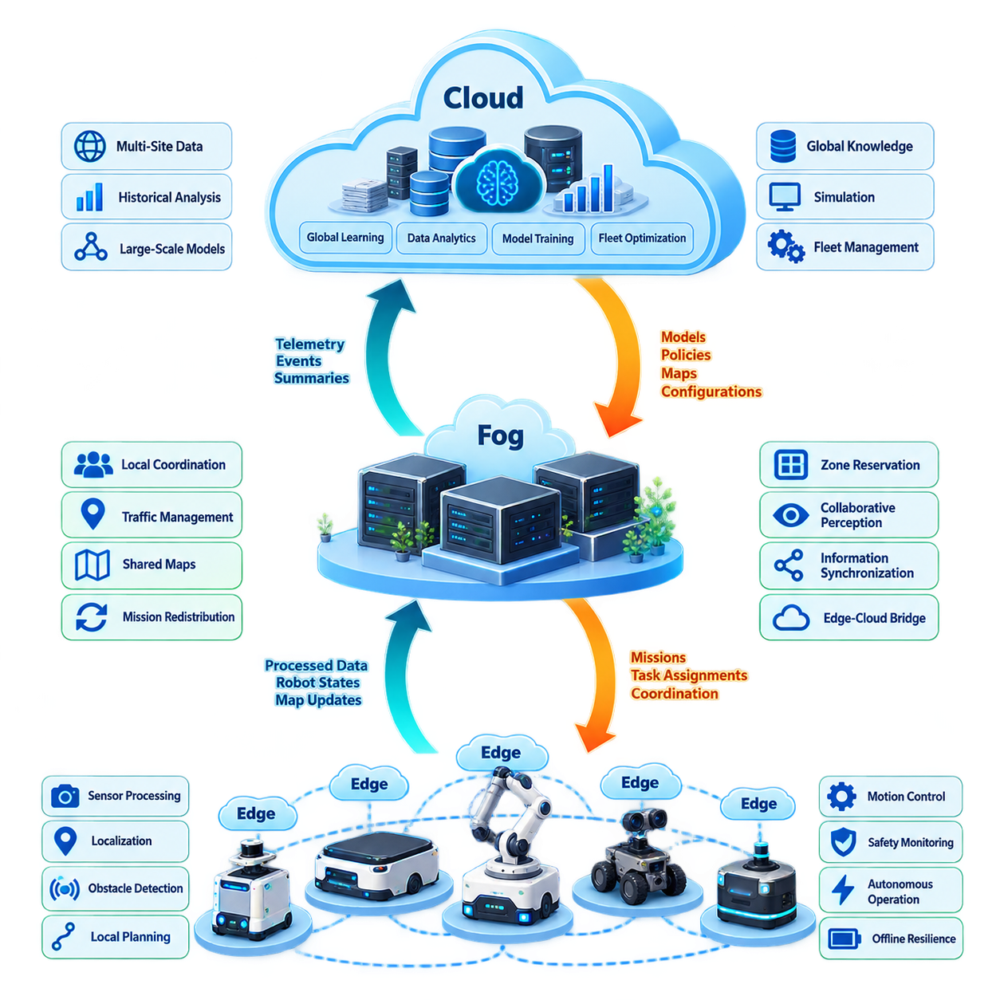
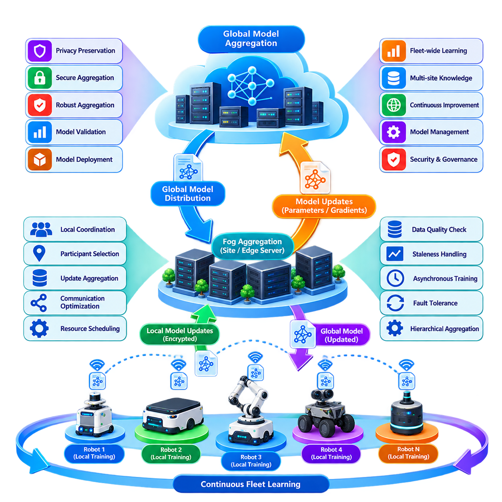
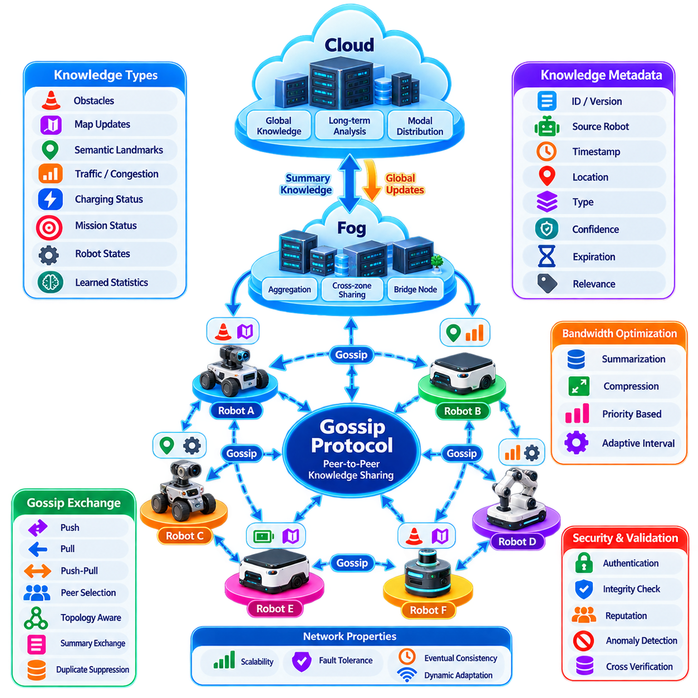
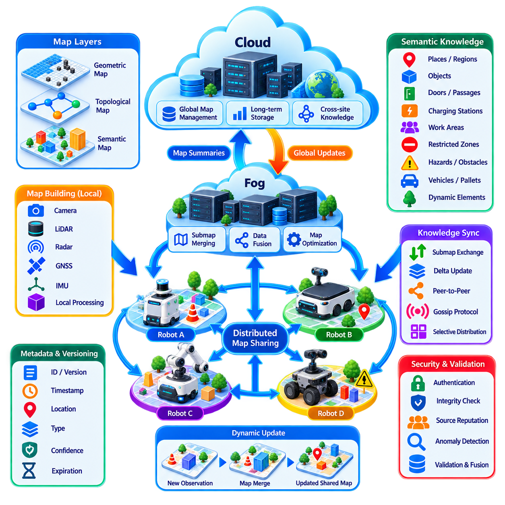
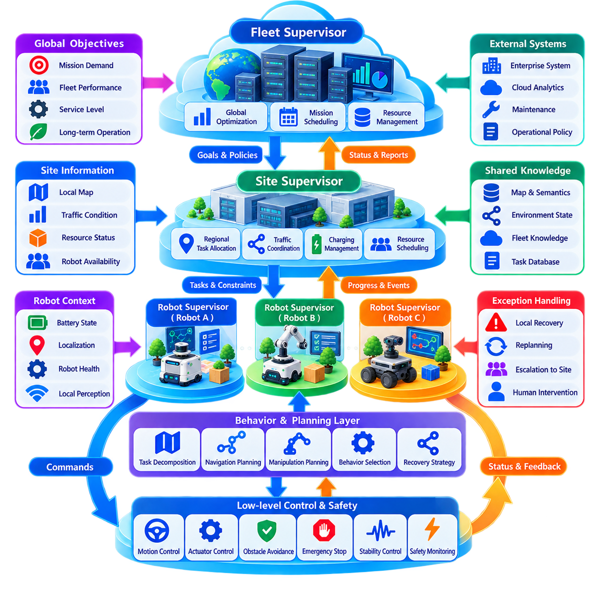
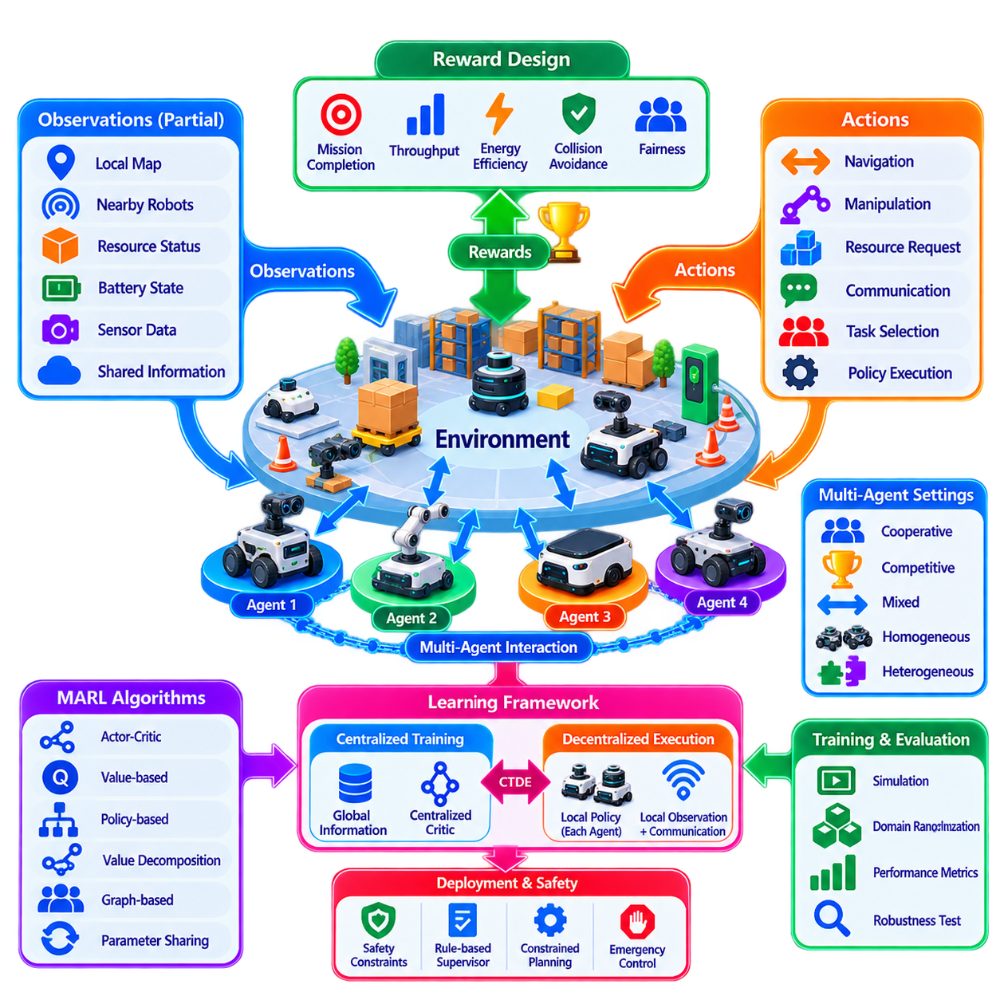
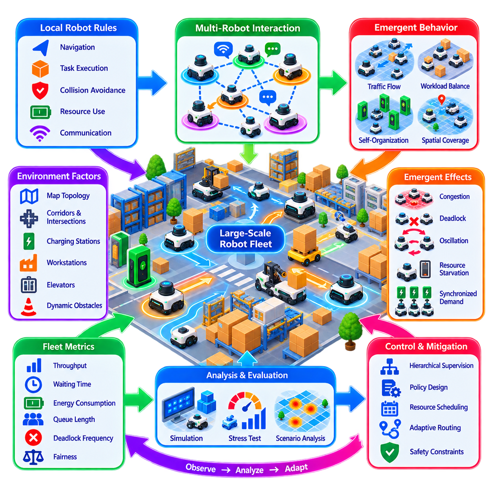
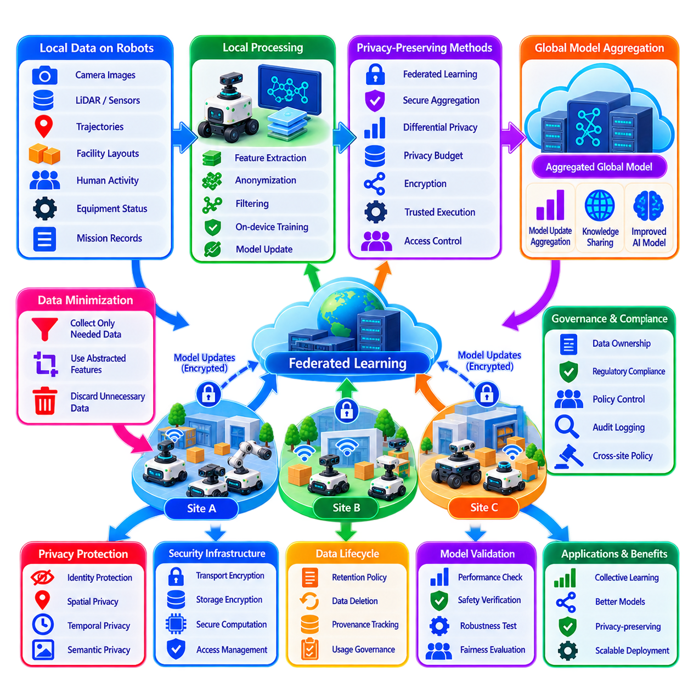
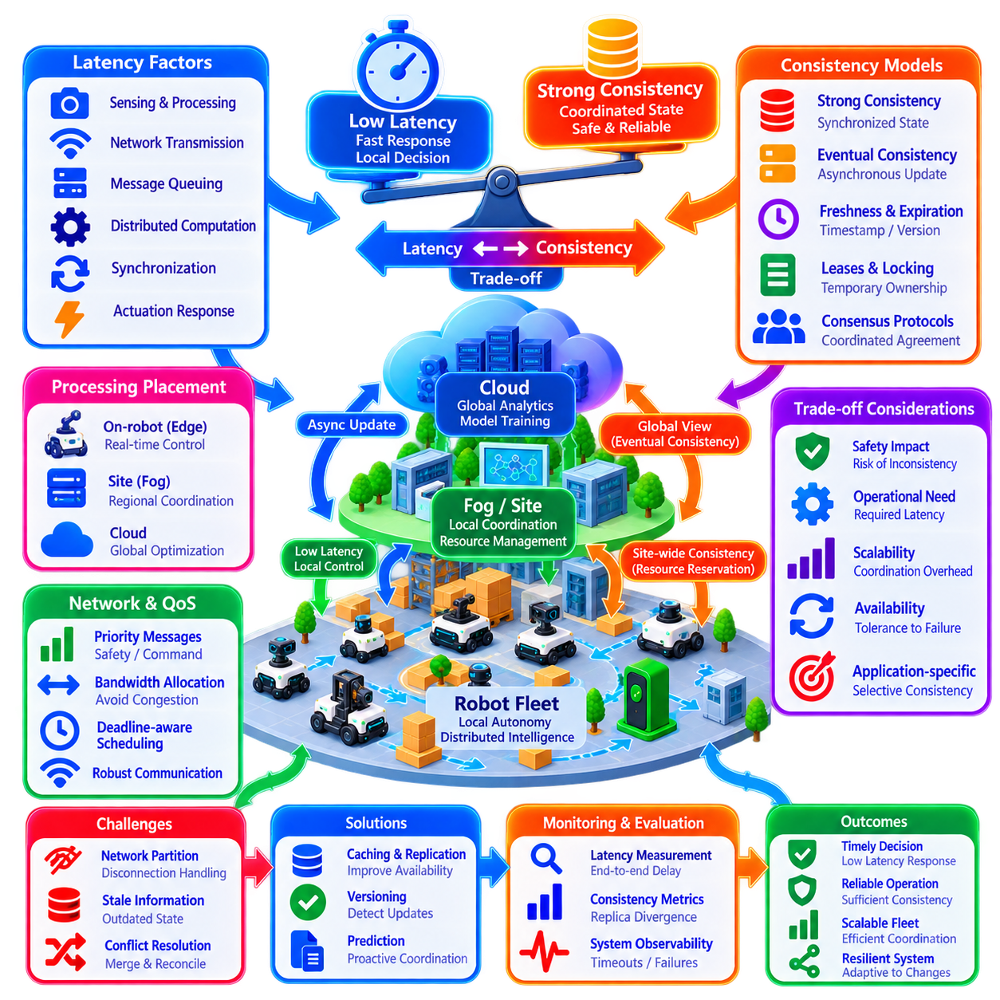
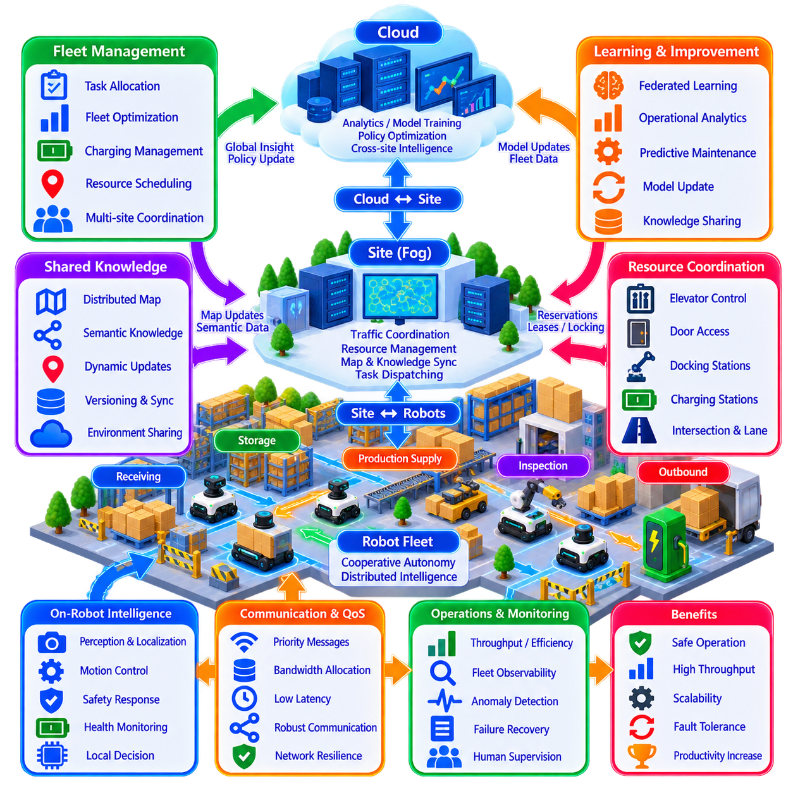

**Volume 16 Multi Robot and Fleet Intelligence**


# 06. Distributed Intelligence

##  

## 06.01 Distributed Intelligence Architecture Edge Fog Cloud

{width="7.268055555555556in" height="7.268055555555556in"}

Distributed intelligence in a robot fleet is an architectural approach in which perception, reasoning, learning, and decision-making are placed across multiple computational layers rather than concentrated in a single fleet server. In the structure of multi-robot intelligence, this architecture forms a bridge between robot-cloud integration and more advanced mechanisms such as federated learning, knowledge sharing, hierarchical decision-making, and multi-agent learning. :chatgpt-content-reference{index="0"}

The fundamental objective is to execute each computation at the location that best matches its latency, bandwidth, reliability, privacy, and computational requirements. A robot must retain enough intelligence to operate safely when disconnected, while nearby infrastructure can coordinate groups of robots and cloud systems can perform computation that benefits from large-scale data, powerful accelerators, or information collected across multiple sites.

The edge layer consists primarily of computation located directly on individual robots or immediately attached controllers. It processes sensors, localization, obstacle detection, local planning, motion control, safety monitoring, and other functions requiring deterministic or near-real-time responses. Because these functions interact directly with physical motion, sending every decision to a remote server would introduce unacceptable communication dependencies and potentially dangerous latency.

Edge intelligence also provides operational autonomy. An AMR should continue navigating, avoiding obstacles, executing safe-stop behavior, and maintaining essential mission state even when communication with higher layers becomes unstable. The edge therefore represents more than a low-latency inference device. It is the minimum autonomous intelligence boundary that allows each robot to remain a functional physical agent rather than becoming a remotely controlled endpoint.

The fog layer introduces computational resources positioned between individual robots and centralized cloud infrastructure. A fog node may reside in a factory server room, warehouse control cabinet, private 5G infrastructure, industrial edge server, or site-level computing cluster. Its physical proximity to robots allows it to aggregate information and perform coordination tasks without requiring every interaction to traverse a wide-area network.

Fog intelligence is particularly valuable for decisions whose scope exceeds one robot but still requires relatively fast responses. Examples include local fleet traffic coordination, shared-map updates, zone reservation, mission redistribution, congestion management, collaborative perception, and synchronization of information among nearby robots. The fog layer therefore transforms isolated edge agents into a coordinated local collective while maintaining lower latency than cloud-centered architectures.

The cloud layer provides the broadest computational and information scope. It can aggregate telemetry from many robots, fleets, facilities, and geographic regions while supporting large-scale storage, historical analysis, model training, simulation, fleet optimization, and global knowledge management. Cloud intelligence is therefore suited to processes where computational scale and information breadth are more important than millisecond-level reaction time.

The three layers should not be interpreted as rigid hardware categories. Edge, fog, and cloud describe logical responsibility boundaries that may be implemented differently depending on deployment scale. A powerful on-premise GPU server can perform fog functions for one facility while simultaneously interacting with cloud services. Likewise, a robot equipped with substantial AI compute may execute functions that would otherwise be assigned to a site-level server.

A useful architectural principle is to assign intelligence according to decision horizon. Immediate physical reactions belong close to the robot. Decisions involving several robots or a local operating area belong primarily at the fog level. Decisions requiring fleet-wide history, cross-site knowledge, large models, or extensive optimization naturally migrate toward the cloud. This creates a hierarchy of increasingly broad spatial and temporal reasoning.

Data moves upward through the hierarchy in progressively more abstract forms. Raw cameras, LiDAR measurements, motor states, and local observations are usually processed at the edge. The fog layer can receive object tracks, semantic events, robot states, map changes, and operational summaries. The cloud can receive compressed telemetry, learned representations, performance statistics, incidents, and selected datasets rather than continuously ingesting every raw sensor stream.

Commands and knowledge flow in the opposite direction. Cloud systems may distribute models, policies, maps, configuration parameters, or fleet-wide objectives. Fog systems translate broader objectives into site-level coordination and resource decisions. Individual robots finally transform assigned missions and contextual information into trajectories, actuator commands, and physical actions. Intelligence therefore circulates bidirectionally rather than following a simple client-server pattern.

Communication failures must be treated as normal operating conditions rather than exceptional events. When cloud connectivity disappears, the fog layer should preserve critical site operations whenever possible. If the fog layer also becomes unavailable, individual robots should degrade gracefully into locally executable behaviors. Mission continuation, controlled stopping, local navigation, buffered telemetry, and later state reconciliation are important mechanisms for preserving operational resilience.

Consistency requirements also vary across layers. Motor control and safety states may demand tightly controlled local timing, whereas fleet analytics can tolerate delayed synchronization. Shared maps, mission ownership, traffic reservations, and distributed task states occupy an intermediate category where stale information can cause conflicts. Distributed intelligence therefore requires explicit decisions about which data demands strong consistency and which information can use eventual consistency.

Latency budgets should consequently be defined by function rather than by network alone. A cloud connection with excellent average latency does not justify placing collision avoidance remotely because jitter, outages, and routing variability remain possible. Conversely, forcing every optimization algorithm onto a robot wastes limited edge resources. Architecture quality depends on matching computational placement to the maximum tolerable delay and failure characteristics of each function.

Resource management becomes another central concern because intelligence competes for CPU, GPU, memory, storage, network bandwidth, and electrical power. Edge nodes prioritize safety-critical and mission-critical workloads, while fog nodes can dynamically allocate larger inference or optimization jobs across local accelerators. Cloud infrastructure provides elastic resources for training, simulation, historical processing, and computationally expensive fleet-wide analysis.

Distributed intelligence also creates a natural foundation for collaborative learning. Robots can collect experience locally, site infrastructure can aggregate or filter knowledge, and cloud systems can build broader models from distributed operational experience. The chapter structure extends this foundation into federated learning, gossip-based knowledge exchange, distributed semantic maps, hierarchical decisions, and multi-agent reinforcement learning. :chatgpt-content-reference{index="1"}

Security boundaries should follow the computational hierarchy. A robot should authenticate commands received from supervisory infrastructure, fog nodes should verify participating robots, and cloud services should enforce fleet and site identities. Sensitive raw data can remain at the edge when unnecessary elsewhere, while only features, events, gradients, or sanitized summaries are transmitted upward. Distribution can therefore improve privacy, but only when trust boundaries are explicitly designed.

Observability must span all layers because failures in distributed intelligence rarely belong to a single component. Operators need to reconstruct which robot generated an observation, which fog service transformed it, which policy or model influenced a decision, and which command ultimately reached the physical system. Common timestamps, trace identifiers, synchronized logs, model versions, and mission identifiers make cross-layer diagnosis possible.

Scalability is one of the strongest motivations for this architecture. A centralized controller may work well for a small fleet but can become a communication, computation, or availability bottleneck as robot count grows. Hierarchical distribution allows local groups to process much of their own information while higher layers operate on aggregated states. The software tree explicitly positions distributed intelligence within a larger fleet architecture intended to support multi-robot systems. :chatgpt-content-reference{index="2"}

The resulting system should not be viewed as three independent computers connected by networking. It is a coordinated intelligence continuum in which responsibilities migrate according to urgency, locality, computational cost, connectivity, and operational risk. Edge intelligence protects immediate physical autonomy, fog intelligence enables local collective behavior, and cloud intelligence provides global learning, optimization, and long-term knowledge.

A mature implementation therefore seeks the smallest safe dependency on each higher layer while still exploiting its capabilities. Robots remain independently safe, local fleets remain operational during external network disruption, and cloud services enhance rather than define basic survivability. This principle separates resilient distributed robotic intelligence from architectures that merely relocate conventional centralized software across several machines.

Ultimately, edge-fog-cloud architecture provides the computational foundation for increasingly intelligent robot fleets. It enables individual robots to react locally, groups of robots to reason collectively, and organizations to learn globally from accumulated experience. When latency, consistency, autonomy, security, and resource allocation are designed together, distributed intelligence becomes a mechanism for transforming a collection of autonomous robots into a scalable and resilient fleet-wide intelligence system.

로봇 플릿(Robot Fleet)의 분산 지능(Distributed Intelligence)은 지각(Perception), 추론(Reasoning), 학습(Learning), 의사결정(Decision-Making)을 하나의 플릿 서버(Fleet Server)에 집중시키지 않고 여러 컴퓨팅 계층(Computational Layer)에 분산 배치하는 아키텍처 접근 방식이다. 다중 로봇 지능(Multi-Robot Intelligence)의 구조에서 이 아키텍처는 로봇-클라우드 통합(Robot-Cloud Integration)과 연합 학습(Federated Learning), 지식 공유(Knowledge Sharing), 계층적 의사결정(Hierarchical Decision-Making), 다중 에이전트 학습(Multi-Agent Learning)과 같은 고급 메커니즘을 연결하는 기반 역할을 한다.

분산 지능의 기본적인 목표는 각 연산을 지연시간(Latency), 대역폭(Bandwidth), 신뢰성(Reliability), 개인정보 보호(Privacy), 연산 요구사항(Computational Requirements)에 가장 적합한 위치에서 실행하는 것이다. 로봇은 연결이 끊어진 상황에서도 안전하게 동작할 수 있는 충분한 지능을 유지해야 하며, 인접한 인프라는 여러 로봇을 조정하고 클라우드 시스템(Cloud System)은 대규모 데이터와 강력한 가속기 또는 여러 사이트에서 수집된 정보를 활용하는 연산을 수행할 수 있어야 한다.

엣지 계층(Edge Layer)은 주로 개별 로봇 또는 로봇에 직접 연결된 컨트롤러(Controller)에 위치하는 컴퓨팅으로 구성된다. 이 계층은 센서 처리(Sensor Processing), 위치추정(Localization), 장애물 감지(Obstacle Detection), 지역 경로계획(Local Planning), 모션 제어(Motion Control), 안전 모니터링(Safety Monitoring)과 같이 결정론적(Deterministic) 또는 준실시간(Near-Real-Time) 응답이 필요한 기능을 처리한다. 이러한 기능은 물리적 움직임과 직접 상호작용하므로 모든 결정을 원격 서버로 전송하면 허용하기 어려운 통신 의존성과 잠재적으로 위험한 지연시간이 발생할 수 있다.

엣지 지능(Edge Intelligence)은 또한 운용 자율성(Operational Autonomy)을 제공한다. 자율이동로봇(AMR)은 상위 계층과의 통신이 불안정해지더라도 계속해서 주행하고, 장애물을 회피하며, 안전 정지(Safe-Stop) 동작을 수행하고, 필수적인 임무 상태(Mission State)를 유지해야 한다. 따라서 엣지는 단순한 저지연 추론 장치(Low-Latency Inference Device)를 넘어 각 로봇이 원격 제어 단말이 아닌 독립적인 물리 에이전트(Physical Agent)로 기능하도록 보장하는 최소 자율 지능 경계(Minimum Autonomous Intelligence Boundary)를 의미한다.

포그 계층(Fog Layer)은 개별 로봇과 중앙집중형 클라우드 인프라(Centralized Cloud Infrastructure) 사이에 배치되는 컴퓨팅 자원을 의미한다. 포그 노드(Fog Node)는 공장 서버실, 창고 제어 캐비닛, 프라이빗 5G(Private 5G) 인프라, 산업용 엣지 서버(Industrial Edge Server), 사이트 수준 컴퓨팅 클러스터(Site-Level Computing Cluster) 등에 위치할 수 있다. 로봇과 물리적으로 가까운 위치에 있기 때문에 광역 네트워크(Wide-Area Network)를 거치지 않고 정보를 집계하고 조정 작업을 수행할 수 있다.

포그 지능(Fog Intelligence)은 하나의 로봇 범위를 넘어가면서도 비교적 빠른 응답이 필요한 의사결정에서 특히 유용하다. 대표적인 예로 지역 플릿 교통 조정(Local Fleet Traffic Coordination), 공유 지도 업데이트(Shared-Map Update), 구역 예약(Zone Reservation), 임무 재분배(Mission Redistribution), 혼잡 관리(Congestion Management), 협력 지각(Collaborative Perception), 인접 로봇 간 정보 동기화(Information Synchronization)가 있다. 따라서 포그 계층은 클라우드 중심 아키텍처보다 낮은 지연시간을 유지하면서 개별 엣지 에이전트를 조정된 지역 집단(Local Collective)으로 전환한다.

클라우드 계층(Cloud Layer)은 가장 광범위한 연산 및 정보 범위를 제공한다. 여러 로봇, 플릿, 시설, 지리적 지역으로부터 텔레메트리(Telemetry)를 통합하고 대규모 저장, 과거 데이터 분석(Historical Analysis), 모델 학습(Model Training), 시뮬레이션(Simulation), 플릿 최적화(Fleet Optimization), 글로벌 지식 관리(Global Knowledge Management)를 지원할 수 있다. 따라서 클라우드 지능(Cloud Intelligence)은 밀리초 수준의 반응시간보다 연산 규모와 정보의 범위가 중요한 작업에 적합하다.

이 세 계층은 고정된 하드웨어 범주로 해석해서는 안 된다. 엣지(Edge), 포그(Fog), 클라우드(Cloud)는 논리적인 책임 경계(Logical Responsibility Boundary)를 의미하며 실제 구현 방식은 배포 규모에 따라 달라질 수 있다. 강력한 온프레미스 GPU 서버(On-Premise GPU Server)는 하나의 시설에서 포그 기능을 수행하면서 동시에 클라우드 서비스와 상호작용할 수 있다. 마찬가지로 높은 AI 연산 능력을 가진 로봇은 일반적으로 사이트 수준 서버에 할당되는 일부 기능까지 자체적으로 실행할 수 있다.

유용한 아키텍처 원칙은 의사결정 시간 범위(Decision Horizon)에 따라 지능을 배치하는 것이다. 즉각적인 물리적 반응은 로봇 가까이에 위치해야 한다. 여러 로봇이나 특정 지역의 운영 영역과 관련된 결정은 주로 포그 수준에 배치된다. 플릿 전체의 이력, 사이트 간 지식(Cross-Site Knowledge), 대규모 모델(Large Model), 광범위한 최적화가 필요한 결정은 자연스럽게 클라우드 방향으로 이동한다. 이를 통해 공간적·시간적 추론 범위가 점차 확대되는 지능 계층 구조가 형성된다.

데이터는 계층 구조를 따라 위쪽으로 이동하면서 점차 추상화된 형태로 변환된다. 원시 카메라 영상, 라이다(LiDAR) 측정값, 모터 상태, 지역 관측 정보는 일반적으로 엣지에서 처리된다. 포그 계층은 객체 추적(Object Track), 의미론적 이벤트(Semantic Event), 로봇 상태, 지도 변화, 운용 요약 정보를 전달받을 수 있다. 클라우드는 모든 원시 센서 스트림을 지속적으로 수집하기보다는 압축된 텔레메트리, 학습된 표현(Learned Representation), 성능 통계, 사고 정보, 선별된 데이터셋을 전달받을 수 있다.

명령과 지식은 반대 방향으로 흐른다. 클라우드 시스템은 모델(Model), 정책(Policy), 지도(Map), 설정 파라미터(Configuration Parameter), 플릿 전체 목표(Fleet-Wide Objective)를 배포할 수 있다. 포그 시스템은 이러한 상위 목표를 사이트 수준의 조정 및 자원 의사결정으로 변환한다. 최종적으로 개별 로봇은 할당된 임무와 상황 정보를 궤적(Trajectory), 액추에이터 명령(Actuator Command), 물리적 행동(Physical Action)으로 변환한다. 따라서 지능은 단순한 클라이언트-서버(Client-Server) 구조가 아니라 양방향으로 순환한다.

통신 장애(Communication Failure)는 예외적인 사건이 아니라 정상적인 운용 조건의 하나로 취급해야 한다. 클라우드 연결이 사라지는 경우 포그 계층은 가능한 범위에서 핵심 사이트 운영을 유지해야 한다. 포그 계층까지 사용할 수 없게 되면 개별 로봇은 자체적으로 실행할 수 있는 지역 행동(Local Behavior)으로 점진적으로 성능을 저하시켜야 한다. 임무 지속, 제어된 정지(Controlled Stop), 지역 주행(Local Navigation), 텔레메트리 버퍼링(Telemetry Buffering), 이후 상태 조정(State Reconciliation)은 운용 회복탄력성(Operational Resilience)을 유지하기 위한 중요한 메커니즘이다.

일관성 요구사항(Consistency Requirement) 역시 계층마다 다르다. 모터 제어와 안전 상태는 엄격하게 통제된 지역 타이밍을 요구할 수 있지만 플릿 분석(Fleet Analytics)은 지연된 동기화를 허용할 수 있다. 공유 지도, 임무 소유권(Mission Ownership), 교통 예약(Traffic Reservation), 분산 작업 상태(Distributed Task State)는 오래된 정보가 충돌을 일으킬 수 있는 중간 범주에 속한다. 따라서 분산 지능에서는 어떤 데이터에 강한 일관성(Strong Consistency)이 필요하고 어떤 정보에 최종적 일관성(Eventual Consistency)을 적용할 수 있는지 명확하게 정의해야 한다.

이에 따라 지연시간 예산(Latency Budget)은 네트워크 자체가 아니라 기능별로 정의되어야 한다. 평균 지연시간이 매우 우수한 클라우드 연결이 존재하더라도 지터(Jitter), 통신 단절, 라우팅 변동성이 발생할 수 있기 때문에 충돌 회피(Collision Avoidance)를 원격에 배치하는 것은 적절하지 않다. 반대로 모든 최적화 알고리즘을 로봇에 탑재하면 제한된 엣지 자원을 낭비하게 된다. 아키텍처의 품질은 각 기능에서 허용 가능한 최대 지연시간과 장애 특성에 연산 위치를 얼마나 적절하게 대응시키는가에 달려 있다.

지능이 CPU, GPU, 메모리, 저장장치, 네트워크 대역폭, 전력과 경쟁하기 때문에 자원 관리(Resource Management) 역시 핵심적인 문제가 된다. 엣지 노드는 안전 핵심(Safety-Critical) 및 임무 핵심(Mission-Critical) 워크로드를 우선 처리하고, 포그 노드는 지역 가속기(Local Accelerator)를 활용하여 더 큰 추론 또는 최적화 작업을 동적으로 할당할 수 있다. 클라우드 인프라는 학습, 시뮬레이션, 과거 데이터 처리, 연산 집약적인 플릿 전체 분석을 위한 탄력적인 자원을 제공한다.

분산 지능은 협력 학습(Collaborative Learning)을 위한 자연스러운 기반도 제공한다. 로봇은 현장에서 경험을 수집하고, 사이트 인프라는 지식을 집계하거나 필터링하며, 클라우드 시스템은 분산된 운용 경험으로부터 더욱 광범위한 모델을 구축할 수 있다. 이러한 기반은 연합 학습(Federated Learning), 가십 기반 지식 교환(Gossip-Based Knowledge Exchange), 분산 의미 지도(Distributed Semantic Map), 계층적 의사결정(Hierarchical Decision-Making), 다중 에이전트 강화학습(Multi-Agent Reinforcement Learning)과 같은 기술로 확장될 수 있다.

보안 경계(Security Boundary)는 컴퓨팅 계층 구조를 따라 설계되어야 한다. 로봇은 감독 인프라(Supervisory Infrastructure)에서 수신한 명령을 인증해야 하고, 포그 노드는 참여 로봇의 신원을 검증해야 하며, 클라우드 서비스는 플릿 및 사이트의 신원(Identity)을 관리해야 한다. 불필요한 민감 원시 데이터는 엣지에 유지하고 특징(Feature), 이벤트(Event), 그래디언트(Gradient), 비식별화된 요약 정보(Sanitized Summary)만 상위 계층으로 전송할 수 있다. 따라서 명확한 신뢰 경계(Trust Boundary)를 설계한다면 분산 구조는 개인정보 보호 능력을 향상시킬 수 있다.

관측 가능성(Observability)은 모든 계층에 걸쳐 확보되어야 한다. 분산 지능에서 발생하는 장애는 하나의 구성요소만으로 설명하기 어려운 경우가 많기 때문이다. 운영자는 어떤 로봇이 관측 정보를 생성했는지, 어떤 포그 서비스가 이를 변환했는지, 어떤 정책이나 모델이 의사결정에 영향을 주었는지, 그리고 어떤 명령이 최종적으로 물리 시스템에 전달되었는지를 재구성할 수 있어야 한다. 공통 타임스탬프(Common Timestamp), 추적 식별자(Trace Identifier), 동기화 로그(Synchronized Log), 모델 버전(Model Version), 임무 식별자(Mission Identifier)는 계층 간 진단을 가능하게 한다.

확장성(Scalability)은 이러한 아키텍처를 도입하는 가장 강력한 이유 중 하나이다. 중앙집중형 컨트롤러(Centralized Controller)는 소규모 플릿에서는 효과적으로 동작할 수 있지만 로봇 수가 증가하면 통신, 연산 또는 가용성(Availability)의 병목이 될 수 있다. 계층적 분산(Hierarchical Distribution)을 적용하면 지역 그룹이 상당한 양의 정보를 자체적으로 처리하고 상위 계층은 집계된 상태(Aggregated State)를 중심으로 동작할 수 있으므로 대규모 다중 로봇 시스템으로 확장하기가 쉬워진다.

결과적으로 이러한 시스템은 네트워크로 연결된 세 개의 독립적인 컴퓨터로 이해해서는 안 된다. 이는 긴급성(Urgency), 지역성(Locality), 연산 비용(Computational Cost), 연결성(Connectivity), 운용 위험(Operational Risk)에 따라 책임이 이동하는 연속적인 지능 체계(Intelligence Continuum)이다. 엣지 지능은 즉각적인 물리적 자율성을 보호하고, 포그 지능은 지역 집단 행동(Local Collective Behavior)을 가능하게 하며, 클라우드 지능은 글로벌 학습(Global Learning), 최적화, 장기적인 지식 축적을 담당한다.

성숙한 구현에서는 각 상위 계층에 대한 안전한 의존성을 가능한 한 최소화하면서 동시에 상위 계층의 능력을 최대한 활용해야 한다. 개별 로봇은 독립적으로 안전한 상태를 유지하고, 지역 플릿은 외부 네트워크가 중단되어도 운영을 지속하며, 클라우드 서비스는 시스템의 기본적인 생존 가능성(Survivability)을 결정하는 것이 아니라 이를 향상시키는 역할을 담당해야 한다. 이러한 원칙은 회복탄력적인 분산 로봇 지능(Resilient Distributed Robotic Intelligence)을 단순히 기존 중앙집중형 소프트웨어를 여러 컴퓨터에 나누어 배치한 구조와 구분한다.

궁극적으로 엣지-포그-클라우드 아키텍처(Edge-Fog-Cloud Architecture)는 점점 더 지능화되는 로봇 플릿을 위한 연산 기반을 제공한다. 개별 로봇은 현장에서 즉각적으로 반응하고, 여러 로봇으로 구성된 그룹은 집단적으로 추론하며, 조직 전체는 축적된 경험으로부터 글로벌하게 학습할 수 있다. 지연시간, 일관성, 자율성, 보안, 자원 할당을 통합적으로 설계하면 분산 지능은 독립적인 자율 로봇의 집합을 확장 가능하고 회복탄력적인 플릿 수준 지능(Fleet-Wide Intelligence)으로 전환하는 핵심 메커니즘이 된다.

##  

## 06.02 Federated Learning for Robot Fleet [w/Code]

{width="7.268055555555556in" height="7.268055555555556in"}

Federated learning enables a robot fleet to improve shared artificial intelligence models without requiring every robot to upload its raw operational data to a centralized training repository. Each robot or local site trains a model using observations collected during operation, while only model parameters, gradients, or compact updates are exchanged with an aggregation service. This approach extends distributed intelligence from distributed execution toward distributed learning.

In a conventional centralized learning pipeline, sensor recordings, trajectories, events, and labels collected by robots are transferred to a central data center where model training occurs. This architecture simplifies training management but can generate substantial network traffic, storage requirements, privacy concerns, and data-governance complexity. Federated learning moves part of the training process toward the robots or local edge infrastructure while preserving fleet-wide collaboration.

A typical federated learning cycle begins when a global model is distributed from a fleet learning server to selected participating robots. Each robot trains or fine-tunes the model using its locally stored dataset for a defined number of iterations. The resulting local model update is transmitted to an aggregation node, which combines updates from multiple participants and produces an improved global model for the next training round.

Federated Averaging, commonly known as FedAvg, represents the fundamental aggregation mechanism. Instead of simply selecting one robot\'s model, the server combines parameters from participating models, typically weighting their contribution according to the amount of local training data. Repeating this local-training and global-aggregation process allows knowledge obtained by many robots to influence a common model without directly centralizing their underlying datasets.

Robot fleets present a particularly suitable environment for federated learning because individual robots repeatedly encounter different operating conditions. Robots may observe different illumination, floor materials, weather, obstacles, human behaviors, payloads, equipment layouts, or sensor characteristics. Local learning captures these experiences, while aggregation attempts to transform diverse observations into knowledge that can improve performance across the broader fleet.

However, robot data is rarely independent and identically distributed. One warehouse robot may primarily observe narrow aisles, another may operate around loading docks, and an outdoor robot may experience rain, shadows, slopes, or vegetation. This non-IID data distribution is one of the central challenges of fleet federated learning because locally optimized models can move in different directions and make global convergence slower or unstable.

Fleet heterogeneity also exists at the hardware and software levels. Robots may use different processors, GPU capabilities, sensors, firmware versions, battery capacities, and network connections. Federated learning therefore cannot assume that every robot participates equally in every training round. Participant selection should consider computational availability, communication quality, charging state, operational workload, model compatibility, and the relevance of locally available data.

The edge-fog-cloud hierarchy provides a practical deployment structure for federated learning. Individual robots can perform lightweight local training at the edge, while a site-level fog server aggregates updates from nearby robots. The cloud can subsequently aggregate knowledge across multiple facilities or geographic regions. Hierarchical aggregation reduces wide-area communication while preserving the ability to construct models representing experience from a much larger fleet.

Training workloads must remain subordinate to safe robot operation. Localization, perception, planning, control, and safety processes require predictable computational resources, whereas federated training can normally be delayed or interrupted. Local training may therefore be scheduled during charging, waiting periods, maintenance windows, or periods of low GPU utilization. Resource-aware scheduling prevents learning workloads from degrading real-time robotic functions.

Communication efficiency becomes increasingly important as model size and fleet scale increase. Repeatedly transmitting complete neural network parameters from hundreds of robots can consume significant bandwidth. Gradient compression, parameter sparsification, quantization, selective layer updates, reduced communication frequency, and local training over multiple epochs can decrease network requirements. The architecture must balance communication reduction against model accuracy and convergence speed.

Asynchronous federated learning can be valuable when robots cannot participate simultaneously. Instead of waiting for every selected robot to complete local training, an aggregation service can accept updates whenever participants become available. This improves utilization in operational fleets but introduces stale-update problems because some robots may train against older global models. Version tracking and staleness-aware aggregation therefore become important parts of the learning architecture.

Failure tolerance is essential because robots may disconnect, leave service, exhaust their batteries, or become occupied with higher-priority missions during a training round. The global learning process should continue when some participants fail to return updates. Participation thresholds, deadlines, retry policies, checkpointing, and partial aggregation prevent individual robot failures from blocking fleet-wide learning and distinguish production federated systems from idealized laboratory experiments.

Federated learning improves data locality but does not automatically guarantee privacy. Model updates can potentially reveal information about local training data, particularly when sensitive observations are involved. Secure aggregation can prevent the central server from inspecting individual robot updates, while differential privacy can reduce information leakage by adding controlled noise. These techniques introduce additional computational and accuracy trade-offs that must be evaluated for each application.

Security is equally important because a compromised participant can submit malicious or manipulated updates. Model poisoning, backdoor insertion, corrupted gradients, and identity spoofing can influence the shared fleet model. Robot authentication, signed updates, secure communication, anomaly detection, update validation, robust aggregation, and participant reputation mechanisms can reduce these risks. Learning infrastructure must therefore be treated as part of the fleet security boundary.

Not every local update should automatically influence the global model. A robot operating with a damaged camera, incorrectly calibrated LiDAR, unusual software configuration, or corrupted dataset may produce statistically valid but operationally harmful updates. Quality gates can evaluate local dataset characteristics, validation metrics, update magnitude, sensor health, and software configuration before an update becomes eligible for aggregation.

Model personalization addresses situations where a single global model cannot optimally serve every robot. A fleet can maintain a common backbone containing broadly useful knowledge while allowing selected layers, parameters, or calibration components to remain locally adapted. This approach is useful when robots share fundamental tasks but operate under substantially different environmental conditions, hardware configurations, or mission profiles.

Federated learning can support several fleet intelligence functions. Perception models can improve from distributed environmental observations, anomaly detectors can learn patterns from many machines, battery models can incorporate different duty cycles, and navigation-related models can benefit from diverse operating conditions. The most appropriate targets are functions that gain from fleet experience while still allowing meaningful local training and controlled validation.

Validation must remain separate from aggregation. An updated global model should not be deployed automatically merely because the federated optimization objective improved. Candidate models should be evaluated against representative validation datasets, simulation scenarios, regression tests, safety constraints, and potentially shadow-mode operation. Only models satisfying predefined acceptance criteria should progress toward staged deployment across the operational fleet.

Model lifecycle management consequently becomes tightly connected to federated learning. Every global and local model should have identifiable versions, training configurations, participating robot sets, aggregation history, validation results, and deployment status. If performance deteriorates after deployment, operators must be able to determine which training round introduced the change and restore a previously validated model through controlled rollback.

The complete learning loop therefore extends beyond local training and parameter averaging. Operational robots generate experience, local systems curate appropriate training data, edge nodes compute updates, fog or cloud infrastructure aggregates distributed knowledge, validation systems evaluate candidate models, and deployment services return approved intelligence to the fleet. New operational experience then begins another cycle, creating a continuous fleet learning process.

At large scale, federated learning changes the fleet from a collection of robots consuming centrally developed models into a distributed knowledge-producing system. Each robot becomes both an autonomous physical agent and a contributor to collective intelligence. The architectural objective is not simply to decentralize training, but to combine local experience, global knowledge, operational resilience, privacy, security, and controlled deployment into a sustainable learning system.

When properly engineered, federated learning allows fleet intelligence to improve while raw operational data remains primarily close to where it was generated. Edge robots contribute local experience, fog infrastructure coordinates site-level learning, and cloud systems integrate knowledge across the broader organization. This creates a scalable foundation for continuously improving robot fleets in which learning itself becomes a distributed capability of the overall multi-robot system.

연합 학습(Federated Learning)은 모든 로봇이 원시 운용 데이터(Raw Operational Data)를 중앙집중형 학습 저장소(Centralized Training Repository)에 업로드하지 않고도 로봇 플릿(Robot Fleet)이 공유 인공지능 모델(Shared Artificial Intelligence Model)을 개선할 수 있도록 한다. 각 로봇 또는 지역 사이트(Local Site)는 운용 중 수집한 관측 데이터를 이용해 모델을 학습하며, 모델 파라미터(Model Parameter), 그래디언트(Gradient), 또는 압축된 업데이트(Compact Update)만 집계 서비스(Aggregation Service)와 교환한다. 이러한 접근 방식은 분산 지능(Distributed Intelligence)을 분산 실행(Distributed Execution)에서 분산 학습(Distributed Learning)으로 확장한다.

기존의 중앙집중형 학습 파이프라인(Centralized Learning Pipeline)에서는 로봇이 수집한 센서 기록(Sensor Recording), 궤적(Trajectory), 이벤트(Event), 레이블(Label)을 중앙 데이터센터(Central Data Center)로 전송하여 모델 학습을 수행한다. 이러한 아키텍처는 학습 관리를 단순화하지만 상당한 네트워크 트래픽, 저장공간 요구사항, 개인정보 보호 문제, 데이터 거버넌스(Data Governance)의 복잡성을 발생시킬 수 있다. 연합 학습은 플릿 전체의 협력을 유지하면서 학습 과정의 일부를 로봇 또는 지역 엣지 인프라(Local Edge Infrastructure)로 이동시킨다.

일반적인 연합 학습 주기(Federated Learning Cycle)는 글로벌 모델(Global Model)을 플릿 학습 서버(Fleet Learning Server)에서 선택된 참여 로봇으로 배포하면서 시작된다. 각 로봇은 로컬에 저장된 데이터셋(Local Dataset)을 이용하여 정해진 횟수만큼 모델을 학습하거나 미세조정(Fine-Tuning)한다. 이후 생성된 로컬 모델 업데이트(Local Model Update)는 집계 노드(Aggregation Node)로 전송되고, 집계 노드는 여러 참여자의 업데이트를 결합하여 다음 학습 라운드(Training Round)에 사용할 개선된 글로벌 모델을 생성한다.

일반적으로 페드애버리지(FedAvg)라고 부르는 연합 평균화(Federated Averaging)는 기본적인 집계 메커니즘(Aggregation Mechanism)을 나타낸다. 서버는 특정 로봇 하나의 모델을 선택하는 대신 여러 참여 모델의 파라미터를 결합하며, 일반적으로 각 로봇이 보유한 로컬 학습 데이터의 양에 따라 기여도를 가중한다. 이러한 로컬 학습(Local Training)과 글로벌 집계(Global Aggregation)를 반복하면 개별 데이터셋을 직접 중앙으로 수집하지 않고도 여러 로봇이 획득한 지식을 공통 모델(Common Model)에 반영할 수 있다.

로봇 플릿은 개별 로봇이 서로 다른 운용 조건을 반복적으로 경험하기 때문에 연합 학습에 특히 적합한 환경을 제공한다. 로봇마다 서로 다른 조명, 바닥 재질, 날씨, 장애물, 사람의 행동, 적재물(Payload), 장비 배치, 센서 특성을 관측할 수 있다. 로컬 학습은 이러한 경험을 포착하고, 집계 과정은 다양한 관측 경험을 보다 광범위한 플릿의 성능 향상에 활용할 수 있는 지식으로 변환하려고 한다.

그러나 로봇 데이터는 독립적이고 동일한 분포(Independent and Identically Distributed)를 따르는 경우가 드물다. 한 창고 로봇은 주로 좁은 통로를 관측하고, 다른 로봇은 하역장(Loading Dock) 주변에서 동작하며, 실외 로봇은 비, 그림자, 경사면, 식생 등을 경험할 수 있다. 이러한 비독립·비동일분포 데이터(Non-IID Data)는 로컬에서 최적화된 모델들이 서로 다른 방향으로 이동하여 글로벌 수렴(Global Convergence)을 느리게 하거나 불안정하게 만들 수 있기 때문에 플릿 연합 학습의 핵심적인 과제 중 하나이다.

플릿 이질성(Fleet Heterogeneity)은 하드웨어와 소프트웨어 수준에서도 존재한다. 로봇마다 서로 다른 프로세서, GPU 성능, 센서, 펌웨어 버전, 배터리 용량, 네트워크 연결을 사용할 수 있다. 따라서 연합 학습에서는 모든 로봇이 모든 학습 라운드에 동일하게 참여한다고 가정할 수 없다. 참여자 선택(Participant Selection)은 연산 자원의 가용성, 통신 품질, 충전 상태, 운용 작업 부하(Operational Workload), 모델 호환성(Model Compatibility), 로컬 데이터의 관련성을 고려해야 한다.

엣지-포그-클라우드 계층 구조(Edge-Fog-Cloud Hierarchy)는 연합 학습을 위한 실용적인 배포 구조를 제공한다. 개별 로봇은 엣지에서 경량 로컬 학습(Lightweight Local Training)을 수행하고, 사이트 수준의 포그 서버(Fog Server)는 인접한 로봇들의 업데이트를 집계할 수 있다. 이후 클라우드는 여러 시설 또는 지리적 지역의 지식을 다시 통합할 수 있다. 계층적 집계(Hierarchical Aggregation)는 광역 통신량을 줄이면서 훨씬 큰 플릿의 경험을 반영하는 모델을 구축할 수 있게 한다.

학습 워크로드(Training Workload)는 항상 로봇의 안전한 운용보다 낮은 우선순위를 가져야 한다. 위치추정(Localization), 지각(Perception), 경로계획(Planning), 제어(Control), 안전 프로세스(Safety Process)는 예측 가능한 연산 자원을 필요로 하지만 연합 학습은 일반적으로 지연하거나 중단할 수 있다. 따라서 로컬 학습은 충전 중, 대기 시간, 유지보수 시간대(Maintenance Window), 또는 GPU 사용률이 낮은 시간에 수행할 수 있다. 자원 인식 스케줄링(Resource-Aware Scheduling)은 학습 워크로드가 실시간 로봇 기능을 저하시키는 것을 방지한다.

모델 크기와 플릿 규모가 증가할수록 통신 효율성(Communication Efficiency)은 더욱 중요해진다. 수백 대의 로봇이 전체 신경망 파라미터(Neural Network Parameter)를 반복적으로 전송하면 상당한 대역폭을 소비할 수 있다. 그래디언트 압축(Gradient Compression), 파라미터 희소화(Parameter Sparsification), 양자화(Quantization), 선택적 계층 업데이트(Selective Layer Update), 통신 빈도 감소, 여러 에포크(Epoch)에 걸친 로컬 학습을 이용하면 네트워크 요구량을 줄일 수 있다. 아키텍처는 통신량 감소와 모델 정확도 및 수렴 속도 사이의 균형을 고려해야 한다.

비동기 연합 학습(Asynchronous Federated Learning)은 모든 로봇이 동시에 참여할 수 없는 경우 유용하다. 선택된 모든 로봇이 로컬 학습을 완료할 때까지 기다리는 대신 집계 서비스는 참여 로봇이 사용 가능한 시점마다 업데이트를 수신할 수 있다. 이는 실제 운용 플릿의 자원 활용도를 향상시키지만 일부 로봇이 이전 글로벌 모델을 기반으로 학습하면서 오래된 업데이트(Stale Update) 문제가 발생할 수 있다. 따라서 모델 버전 추적(Version Tracking)과 업데이트 노후도를 고려한 집계(Staleness-Aware Aggregation)가 중요한 요소가 된다.

로봇은 학습 라운드 중에 연결이 끊어지거나, 운용에서 제외되거나, 배터리가 부족해지거나, 더 높은 우선순위의 임무를 수행할 수 있으므로 장애 허용성(Failure Tolerance)이 필수적이다. 일부 참여자가 업데이트를 반환하지 않더라도 글로벌 학습 과정은 계속 진행되어야 한다. 참여 임계값(Participation Threshold), 마감시간(Deadline), 재시도 정책(Retry Policy), 체크포인팅(Checkpointing), 부분 집계(Partial Aggregation)는 개별 로봇의 장애가 플릿 전체 학습을 차단하지 않도록 하며 실제 운용 연합 학습 시스템과 이상적인 실험실 환경을 구분하는 요소가 된다.

연합 학습은 데이터 지역성(Data Locality)을 향상시키지만 개인정보 보호(Privacy)를 자동으로 보장하는 것은 아니다. 특히 민감한 관측 정보가 포함된 경우 모델 업데이트를 통해 로컬 학습 데이터의 일부 정보가 노출될 가능성이 있다. 보안 집계(Secure Aggregation)는 중앙 서버가 개별 로봇의 업데이트를 직접 확인하지 못하도록 할 수 있으며, 차등 개인정보 보호(Differential Privacy)는 제어된 노이즈(Controlled Noise)를 추가하여 정보 유출을 줄일 수 있다. 이러한 기술은 추가적인 연산 비용과 정확도 사이의 절충관계(Trade-Off)를 발생시키므로 응용 분야별로 평가해야 한다.

손상된 참여자가 악의적이거나 조작된 업데이트를 제출할 수 있기 때문에 보안(Security) 역시 중요하다. 모델 포이즈닝(Model Poisoning), 백도어 삽입(Backdoor Insertion), 손상된 그래디언트(Corrupted Gradient), 신원 위조(Identity Spoofing)는 공유 플릿 모델에 영향을 줄 수 있다. 로봇 인증(Robot Authentication), 서명된 업데이트(Signed Update), 보안 통신(Secure Communication), 이상 탐지(Anomaly Detection), 업데이트 검증(Update Validation), 강건한 집계(Robust Aggregation), 참여자 평판 메커니즘(Participant Reputation Mechanism)을 통해 이러한 위험을 줄일 수 있다. 따라서 학습 인프라는 플릿 보안 경계(Fleet Security Boundary)의 일부로 취급해야 한다.

모든 로컬 업데이트가 자동으로 글로벌 모델에 영향을 주도록 해서는 안 된다. 손상된 카메라, 잘못 보정된 라이다(LiDAR), 비정상적인 소프트웨어 설정, 손상된 데이터셋을 사용하는 로봇은 통계적으로는 유효하지만 운용 측면에서는 해로운 업데이트를 생성할 수 있다. 품질 게이트(Quality Gate)는 로컬 데이터셋의 특성, 검증 지표(Validation Metric), 업데이트 크기(Update Magnitude), 센서 상태(Sensor Health), 소프트웨어 구성을 평가한 후 해당 업데이트가 집계에 참여할 수 있는지 결정할 수 있다.

모델 개인화(Model Personalization)는 하나의 글로벌 모델이 모든 로봇에 최적의 성능을 제공할 수 없는 상황을 해결한다. 플릿은 광범위하게 활용할 수 있는 지식을 포함한 공통 백본(Common Backbone)을 유지하면서 특정 계층, 파라미터, 보정 구성요소(Calibration Component)를 각 로봇의 환경에 맞게 유지할 수 있다. 이러한 접근 방식은 로봇들이 기본적인 작업을 공유하지만 운용 환경, 하드웨어 구성 또는 임무 프로파일(Mission Profile)이 상당히 다른 경우 유용하다.

연합 학습은 다양한 플릿 지능(Fleet Intelligence) 기능을 지원할 수 있다. 지각 모델(Perception Model)은 분산된 환경 관측으로부터 개선될 수 있고, 이상 탐지기(Anomaly Detector)는 여러 장비에서 수집된 패턴을 학습할 수 있으며, 배터리 모델(Battery Model)은 서로 다른 듀티 사이클(Duty Cycle)을 반영할 수 있다. 또한 주행 관련 모델은 다양한 운용 조건으로부터 이점을 얻을 수 있다. 가장 적합한 대상은 플릿 경험을 통해 성능을 개선하면서 의미 있는 로컬 학습과 통제된 검증이 가능한 기능이다.

검증(Validation)은 집계(Aggregation)와 분리되어야 한다. 연합 최적화 목표(Federated Optimization Objective)가 향상되었다는 이유만으로 업데이트된 글로벌 모델을 자동으로 배포해서는 안 된다. 후보 모델(Candidate Model)은 대표적인 검증 데이터셋, 시뮬레이션 시나리오, 회귀 테스트(Regression Test), 안전 제약조건(Safety Constraint), 필요에 따라 섀도 모드 운용(Shadow-Mode Operation)을 통해 평가되어야 한다. 사전에 정의된 승인 기준(Acceptance Criteria)을 충족한 모델만 실제 운용 플릿에 단계적으로 배포되어야 한다.

따라서 모델 생명주기 관리(Model Lifecycle Management)는 연합 학습과 밀접하게 연결된다. 모든 글로벌 및 로컬 모델은 식별 가능한 버전, 학습 설정(Training Configuration), 참여 로봇 집합, 집계 이력(Aggregation History), 검증 결과, 배포 상태(Deployment Status)를 가져야 한다. 배포 이후 성능이 저하되는 경우 운영자는 어떤 학습 라운드에서 변화가 발생했는지 확인하고 통제된 롤백(Controlled Rollback)을 통해 이전에 검증된 모델로 복원할 수 있어야 한다.

완전한 학습 루프(Learning Loop)는 단순한 로컬 학습과 파라미터 평균화를 넘어선다. 운용 중인 로봇이 경험을 생성하고, 로컬 시스템은 적절한 학습 데이터를 선별하며, 엣지 노드는 업데이트를 계산한다. 포그 또는 클라우드 인프라는 분산된 지식을 집계하고, 검증 시스템은 후보 모델을 평가하며, 배포 서비스(Deployment Service)는 승인된 지능을 다시 플릿에 전달한다. 이후 새로운 운용 경험이 다음 주기를 시작하면서 지속적인 플릿 학습 과정(Continuous Fleet Learning Process)이 형성된다.

대규모 환경에서 연합 학습은 플릿을 중앙에서 개발된 모델을 단순히 사용하는 로봇들의 집합에서 분산형 지식 생산 시스템(Distributed Knowledge-Producing System)으로 변화시킨다. 각각의 로봇은 자율적인 물리 에이전트(Autonomous Physical Agent)이면서 동시에 집단 지능(Collective Intelligence)에 기여하는 구성원이 된다. 아키텍처의 목표는 단순히 학습을 분산시키는 것이 아니라 지역 경험(Local Experience), 글로벌 지식(Global Knowledge), 운용 회복탄력성(Operational Resilience), 개인정보 보호, 보안, 통제된 배포를 지속 가능한 학습 시스템(Sustainable Learning System)으로 통합하는 것이다.

적절하게 설계된 연합 학습은 원시 운용 데이터를 주로 데이터가 생성된 위치 가까이에 유지하면서 플릿 지능을 지속적으로 향상시킬 수 있도록 한다. 엣지 로봇(Edge Robot)은 지역 경험을 제공하고, 포그 인프라(Fog Infrastructure)는 사이트 수준의 학습을 조정하며, 클라우드 시스템(Cloud System)은 조직 전체의 지식을 통합한다. 이를 통해 학습 자체가 전체 다중 로봇 시스템(Multi-Robot System)의 분산 능력(Distributed Capability)이 되는 지속적으로 발전하는 로봇 플릿을 위한 확장 가능한 기반을 구축할 수 있다.

##  

## 06.03 Gossip Protocol Based Fleet Knowledge Sharing [w/Code]

{width="7.268055555555556in" height="7.268055555555556in"}

In a large robot fleet, useful knowledge is continuously generated at many locations rather than at a single central server. Each robot observes obstacles, traffic conditions, environmental changes, localization uncertainty, mission outcomes, equipment states, and other operational events. Gossip protocol-based knowledge sharing provides a decentralized mechanism through which this locally generated information can gradually propagate across the fleet without requiring every robot to communicate directly with a central coordinator.

A gossip protocol is inspired by the way information spreads through repeated peer-to-peer exchanges. At each communication opportunity, a robot selects one or more neighboring peers and exchanges a portion of its current knowledge. Those peers subsequently communicate with other robots, causing information to spread throughout the network over multiple rounds. The process is probabilistic rather than centrally scheduled, yet sufficiently repeated exchanges can distribute information to a large fraction of the fleet.

This approach differs fundamentally from centralized publish-subscribe or database synchronization architectures. In a centralized system, robots transmit information to an authoritative service that stores and redistributes it. Gossip-based systems allow knowledge to move directly among participants, reducing dependence on a single communication path or central service. The resulting architecture is naturally compatible with distributed intelligence in which robots must continue cooperating despite intermittent infrastructure connectivity.

Fleet knowledge can contain many different forms of information. Robots may exchange recently detected obstacles, blocked passages, map changes, semantic landmarks, congestion estimates, charging-station availability, localization confidence, mission status, fault observations, or learned operational statistics. Gossip should normally distribute compact knowledge representations rather than continuous raw sensor streams, because unnecessary replication of camera or LiDAR data would rapidly consume communication and storage resources.

Knowledge items therefore require structured metadata. A shared observation can include its origin robot, creation time, spatial location, knowledge type, confidence, version, expiration time, and unique identifier. This metadata allows receiving robots to determine whether an item is new, duplicated, stale, conflicting, or irrelevant to their current mission. Without explicit provenance and temporal information, decentralized knowledge propagation can easily transform outdated observations into misleading fleet-wide information.

A simple gossip cycle consists of peer discovery, peer selection, knowledge comparison, exchange, and local state update. A robot first identifies reachable peers through the available fleet communication network. It then selects a subset of those peers and determines which knowledge differs between them. Missing or newer items are exchanged, validated, and incorporated into the receiving robot\'s local knowledge store before another gossip cycle begins.

Push, pull, and push-pull mechanisms represent common exchange patterns. In push gossip, a robot proactively sends selected knowledge to another robot. In pull gossip, a robot requests information that it does not currently possess. Push-pull combines both operations during the same interaction and can accelerate convergence because each communication session resolves differences in both directions. The appropriate method depends on bandwidth, knowledge size, network topology, and update frequency.

Random peer selection provides simplicity and resilience, but robot fleets can benefit from topology-aware selection. A robot may prioritize nearby peers, robots operating in adjacent zones, members of the same mission group, or peers possessing different knowledge versions. Communication quality, network cost, physical distance, mission relevance, and previous exchange history can also influence peer selection. This transforms purely random gossip into an operationally aware knowledge dissemination mechanism.

The major advantage of gossip is graceful scalability. If every robot attempted to communicate every update to every other robot, communication complexity would increase rapidly as fleet size grew. Gossip limits each robot to a relatively small number of peer exchanges while still allowing information to propagate through repeated interactions. A fleet containing hundreds or thousands of agents can therefore disseminate knowledge without constructing a fully connected communication topology.

Gossip protocols are also naturally tolerant of failures. A robot that temporarily disconnects does not necessarily prevent information from reaching other participants because multiple propagation paths exist. When the disconnected robot returns, subsequent exchanges can synchronize knowledge that it missed. There is no requirement for every participant to remain continuously reachable, making the approach attractive for outdoor fleets, multi-building operations, temporary network partitions, and mobile ad hoc environments.

This resilience comes with an important trade-off: gossip generally provides eventual rather than immediate consistency. Two robots may temporarily hold different versions of the fleet\'s knowledge while information propagates. Such behavior is acceptable for many observations and statistical summaries but inappropriate for some safety-critical decisions. Emergency stops, exclusive resource ownership, or immediate collision avoidance should not depend solely on probabilistic gossip propagation.

Knowledge freshness must therefore be managed explicitly. Time-to-live values can remove observations after their operational relevance expires, while timestamps and sequence numbers help distinguish recent information from older copies. A temporary obstacle observation may remain useful for only seconds or minutes, whereas a persistent semantic landmark may remain valid much longer. Expiration policy should consequently depend on the meaning and expected lifetime of each knowledge category.

Duplicate suppression is equally important because the same information can arrive through many propagation paths. Unique knowledge identifiers, version vectors, sequence counters, hashes, or compact membership summaries can help robots recognize information they already possess. Without duplicate detection, gossip traffic can become dominated by repeated retransmission of unchanged knowledge, reducing the scalability advantages that motivated the decentralized architecture.

Conflicting knowledge is unavoidable in real robot fleets. Two robots may report different states for the same passage, object, map region, or charging station because they observed it at different times or with different sensors. Conflict resolution can consider timestamp, confidence, sensor reliability, observation frequency, source reputation, or spatial proximity. Some conflicts should be preserved as multiple hypotheses rather than immediately forcing one observation to become globally authoritative.

Bandwidth optimization becomes important when knowledge grows faster than available communication capacity. Robots can exchange summaries of their local knowledge before transferring complete items, allowing peers to identify only missing or changed information. Batching, compression, priority queues, delta updates, probabilistic filters, and adaptive gossip intervals can further reduce network traffic. High-value operational knowledge can propagate quickly while low-priority historical information spreads more slowly.

The edge-fog-cloud architecture can complement rather than replace gossip communication. Robots can gossip directly within a local operating region, while fog nodes participate as high-capacity peers that aggregate or relay knowledge between groups. Cloud services can periodically receive summarized fleet knowledge for long-term analysis and distribute globally relevant information back toward sites. This creates a hybrid architecture combining decentralized propagation with hierarchical infrastructure.

Network partitions illustrate the value of this design. Suppose two groups of robots temporarily lose connectivity with each other while continuing to operate locally. Each group can continue exchanging knowledge internally rather than stopping because a central server is unreachable. When connectivity is restored, bridge nodes or returning robots propagate the accumulated differences, allowing the separated knowledge states to gradually converge without requiring a complete fleet restart.

Security remains essential because decentralized propagation increases the number of potential information sources. A compromised robot could inject false obstacles, fabricated faults, corrupted map updates, or misleading operational statistics that spread through the fleet. Robot identity, message authentication, digital signatures, authorization rules, integrity checks, and trust policies are therefore necessary to determine whether received knowledge should be accepted, rejected, quarantined, or assigned reduced confidence.

Knowledge validation should also use physical and semantic plausibility. If one robot reports that a permanent wall disappeared while neighboring robots repeatedly observe it, the fleet should not blindly propagate the anomalous claim as truth. Cross-observation verification, confidence accumulation, source diversity, temporal consistency, and local sensor confirmation can help distinguish meaningful environmental changes from sensor errors or malicious information.

Observability is required to understand how knowledge propagates through the fleet. Operators should be able to identify where an item originated, which peers forwarded it, how long propagation required, which versions currently exist, and whether some fleet regions remain unsynchronized. Metrics such as dissemination latency, convergence ratio, duplicate traffic, peer availability, message loss, and knowledge age make gossip behavior measurable rather than treating it as an invisible background process.

Gossip parameters can be adapted dynamically to operational conditions. During stable operation, robots may exchange information at relatively low frequency. When a significant map change, fault pattern, or environmental hazard appears, the dissemination rate can temporarily increase. Similarly, congested networks can reduce fan-out or prioritize only critical knowledge. Adaptive behavior allows communication cost to follow the actual information value and urgency of fleet events.

Gossip-based knowledge sharing also provides a foundation for more advanced collective intelligence. Distributed semantic maps, decentralized anomaly knowledge, collaborative learning statistics, robot capability information, and local policy experience can propagate through the same conceptual mechanism. Combined with federated learning, robots can exchange both operational knowledge and learning-related metadata while preserving a distributed architecture rather than depending entirely on centralized intelligence.

The central design principle is that not all fleet knowledge requires a single authoritative path. Information that benefits from broad dissemination but tolerates temporary inconsistency can spread effectively through repeated local interactions. Critical commands and strongly consistent resource decisions can remain under dedicated coordination mechanisms, while gossip handles decentralized awareness and knowledge diffusion. Separating these information classes prevents probabilistic communication from being used where deterministic guarantees are necessary.

When properly engineered, gossip protocols allow a robot fleet to behave as a distributed knowledge network. Each robot contributes observations, receives information from peers, evaluates relevance and trustworthiness, and forwards useful knowledge to other participants. Through many small local exchanges, information can eventually reach a large population of robots, producing fleet-wide situational awareness without requiring every interaction to pass through a central server.

The resulting architecture improves scalability, resilience, and autonomy while accepting controlled temporary inconsistency as an architectural trade-off. Combined with metadata management, duplicate suppression, conflict resolution, security, adaptive communication, and edge-fog-cloud integration, gossip-based sharing transforms locally acquired robot experience into distributed fleet knowledge and provides an important communication foundation for increasingly decentralized multi-robot intelligence.

대규모 로봇 플릿(Robot Fleet)에서는 유용한 지식(Knowledge)이 하나의 중앙 서버(Central Server)에서 생성되는 것이 아니라 여러 위치에서 지속적으로 생성된다. 각 로봇은 장애물, 교통 상황, 환경 변화, 위치추정 불확실성(Localization Uncertainty), 임무 결과, 장비 상태 및 기타 운용 이벤트(Operational Event)를 관측한다. 가십 프로토콜 기반 지식 공유(Gossip Protocol-Based Knowledge Sharing)는 모든 로봇이 중앙 조정기(Central Coordinator)와 직접 통신하지 않고도 이러한 지역적으로 생성된 정보를 플릿 전체에 점진적으로 전파할 수 있는 분산형 메커니즘(Decentralized Mechanism)을 제공한다.

가십 프로토콜(Gossip Protocol)은 반복적인 피어 투 피어 교환(Peer-to-Peer Exchange)을 통해 정보가 확산되는 방식에서 착안한 것이다. 각 통신 기회마다 로봇은 하나 이상의 인접 피어(Neighboring Peer)를 선택하여 현재 보유한 지식의 일부를 교환한다. 이후 해당 피어들은 다른 로봇들과 다시 통신하면서 여러 라운드에 걸쳐 정보가 네트워크 전체로 확산된다. 이 과정은 중앙에서 스케줄링되지 않는 확률적(Probabilistic) 방식이지만 충분한 반복 교환을 통해 정보를 플릿의 상당 부분에 전달할 수 있다.

이러한 접근 방식은 중앙집중형 발행-구독(Centralized Publish-Subscribe) 또는 데이터베이스 동기화(Database Synchronization) 아키텍처와 근본적으로 다르다. 중앙집중형 시스템에서는 로봇이 정보를 권위 있는 서비스(Authoritative Service)에 전송하고 해당 서비스가 이를 저장하고 다시 배포한다. 가십 기반 시스템에서는 지식이 참여자 사이에서 직접 이동할 수 있으므로 단일 통신 경로나 중앙 서비스에 대한 의존성을 줄일 수 있다. 이러한 구조는 인프라 연결이 간헐적으로 끊어지는 상황에서도 로봇이 협력을 지속해야 하는 분산 지능(Distributed Intelligence)에 자연스럽게 적합하다.

플릿 지식(Fleet Knowledge)은 다양한 형태의 정보를 포함할 수 있다. 로봇은 최근 감지된 장애물, 차단된 통로, 지도 변화, 의미론적 랜드마크(Semantic Landmark), 혼잡도 추정치, 충전소 가용성, 위치추정 신뢰도(Localization Confidence), 임무 상태, 고장 관측 정보 또는 학습된 운용 통계를 교환할 수 있다. 카메라나 라이다(LiDAR)의 원시 데이터를 불필요하게 복제하면 통신 및 저장 자원을 빠르게 소모하므로 가십은 일반적으로 연속적인 원시 센서 스트림보다 압축된 지식 표현(Compact Knowledge Representation)을 배포해야 한다.

따라서 지식 항목(Knowledge Item)에는 구조화된 메타데이터(Structured Metadata)가 필요하다. 공유 관측 정보에는 원본 로봇(Origin Robot), 생성 시간, 공간 위치, 지식 유형, 신뢰도, 버전, 만료 시간(Expiration Time), 고유 식별자(Unique Identifier) 등이 포함될 수 있다. 이러한 메타데이터를 통해 수신 로봇은 해당 정보가 새로운 것인지, 중복된 것인지, 오래된 것인지, 충돌하는 것인지 또는 현재 임무와 관련이 없는지를 판단할 수 있다. 명확한 출처 정보(Provenance)와 시간 정보가 없으면 분산형 지식 전파 과정에서 오래된 관측 정보가 잘못된 플릿 전체 정보로 변할 수 있다.

단순한 가십 주기(Gossip Cycle)는 피어 탐색(Peer Discovery), 피어 선택(Peer Selection), 지식 비교(Knowledge Comparison), 교환(Exchange), 로컬 상태 업데이트(Local State Update)로 구성된다. 로봇은 먼저 사용 가능한 플릿 통신 네트워크를 통해 접근 가능한 피어를 식별한다. 이후 피어의 일부를 선택하고 서로 보유한 지식 가운데 어떤 부분이 다른지 판단한다. 누락되었거나 더 새로운 항목을 교환하고 검증하여 수신 로봇의 로컬 지식 저장소(Local Knowledge Store)에 통합한 후 다음 가십 주기를 시작한다.

푸시(Push), 풀(Pull), 푸시-풀(Push-Pull)은 일반적인 교환 방식이다. 푸시 가십(Push Gossip)에서는 로봇이 선택한 지식을 다른 로봇에 능동적으로 전송한다. 풀 가십(Pull Gossip)에서는 로봇이 현재 보유하지 않은 정보를 요청한다. 푸시-풀 방식은 하나의 상호작용에서 두 동작을 결합하며 각 통신 세션에서 양방향의 지식 차이를 해결할 수 있기 때문에 수렴(Convergence)을 가속할 수 있다. 적절한 방식은 대역폭, 지식 크기, 네트워크 토폴로지(Network Topology), 업데이트 빈도에 따라 결정된다.

무작위 피어 선택(Random Peer Selection)은 단순성과 회복탄력성(Resilience)을 제공하지만 로봇 플릿에서는 토폴로지 인식 선택(Topology-Aware Selection)을 활용할 수 있다. 로봇은 인접 피어, 주변 구역에서 운용되는 로봇, 동일한 임무 그룹의 구성원 또는 서로 다른 지식 버전을 가진 피어를 우선적으로 선택할 수 있다. 통신 품질, 네트워크 비용, 물리적 거리, 임무 관련성, 이전 교환 이력도 피어 선택에 영향을 줄 수 있다. 이를 통해 순수한 무작위 가십을 운용 상황을 인식하는 지식 전파 메커니즘으로 발전시킬 수 있다.

가십의 주요 장점은 자연스러운 확장성(Scalability)이다. 모든 로봇이 모든 업데이트를 다른 모든 로봇에 직접 전달하려고 하면 플릿 규모가 증가함에 따라 통신 복잡도가 빠르게 증가한다. 가십은 각 로봇이 상대적으로 적은 수의 피어와만 정보를 교환하도록 제한하면서도 반복적인 상호작용을 통해 정보가 전체 네트워크로 확산될 수 있도록 한다. 따라서 수백 또는 수천 개의 에이전트(Agent)로 구성된 플릿에서도 완전 연결형 통신 토폴로지(Fully Connected Communication Topology)를 구축하지 않고 지식을 배포할 수 있다.

가십 프로토콜은 본질적으로 장애 허용성(Fault Tolerance)도 높다. 특정 로봇의 연결이 일시적으로 끊어져도 여러 개의 전파 경로가 존재하기 때문에 정보가 다른 참여자에게 전달되는 과정이 반드시 중단되는 것은 아니다. 연결이 끊겼던 로봇이 다시 네트워크에 참여하면 이후의 교환을 통해 누락된 지식을 동기화할 수 있다. 모든 참여자가 지속적으로 연결될 필요가 없기 때문에 실외 플릿, 다중 건물 운용, 일시적인 네트워크 분할(Network Partition), 모바일 애드혹 환경(Mobile Ad Hoc Environment)에 적합하다.

그러나 이러한 회복탄력성에는 중요한 절충관계(Trade-Off)가 존재한다. 가십은 일반적으로 즉각적인 일관성(Immediate Consistency)이 아니라 최종적 일관성(Eventual Consistency)을 제공한다. 정보가 전파되는 동안 두 로봇이 서로 다른 버전의 플릿 지식을 보유할 수 있다. 이러한 특성은 많은 관측 정보나 통계 요약에서는 허용될 수 있지만 일부 안전 핵심 의사결정(Safety-Critical Decision)에는 적합하지 않다. 비상 정지(Emergency Stop), 배타적 자원 소유권(Exclusive Resource Ownership), 즉각적인 충돌 회피(Immediate Collision Avoidance)는 확률적 가십 전파에만 의존해서는 안 된다.

따라서 지식 최신성(Knowledge Freshness)을 명시적으로 관리해야 한다. 유효시간(Time-to-Live)은 운용 관련성이 사라진 관측 정보를 제거할 수 있으며, 타임스탬프(Timestamp)와 시퀀스 번호(Sequence Number)는 최신 정보와 오래된 복사본을 구분하는 데 사용된다. 일시적인 장애물 관측은 몇 초 또는 몇 분 동안만 유효할 수 있지만 지속적인 의미론적 랜드마크는 훨씬 오랫동안 유효할 수 있다. 따라서 만료 정책(Expiration Policy)은 각 지식 범주의 의미와 예상 수명에 따라 결정해야 한다.

동일한 정보가 여러 전파 경로를 통해 도착할 수 있기 때문에 중복 억제(Duplicate Suppression) 역시 중요하다. 고유 지식 식별자, 버전 벡터(Version Vector), 시퀀스 카운터(Sequence Counter), 해시(Hash), 압축된 멤버십 요약(Compact Membership Summary)을 사용하면 로봇이 이미 보유한 정보를 식별할 수 있다. 중복 탐지가 없으면 가십 트래픽이 변경되지 않은 지식의 반복적인 재전송으로 채워져 분산형 아키텍처가 제공하는 확장성의 장점이 감소할 수 있다.

실제 로봇 플릿에서는 지식 충돌(Conflicting Knowledge)을 피할 수 없다. 두 로봇이 서로 다른 시간이나 서로 다른 센서를 사용하여 동일한 통로, 객체, 지도 영역 또는 충전소를 관측하면 서로 다른 상태를 보고할 수 있다. 충돌 해결(Conflict Resolution)에서는 타임스탬프, 신뢰도, 센서 신뢰성(Sensor Reliability), 관측 빈도, 출처 평판(Source Reputation), 공간적 근접성(Spatial Proximity)을 고려할 수 있다. 일부 충돌은 하나의 관측 정보를 즉시 전역의 권위 있는 정보로 결정하기보다 여러 가설(Multiple Hypotheses)로 유지하는 것이 적절할 수 있다.

지식의 증가 속도가 사용 가능한 통신 용량보다 빨라지면 대역폭 최적화(Bandwidth Optimization)가 중요해진다. 로봇은 전체 지식 항목을 전송하기 전에 로컬 지식의 요약 정보를 교환하여 피어가 누락되거나 변경된 정보만 식별하도록 할 수 있다. 배칭(Batching), 압축(Compression), 우선순위 큐(Priority Queue), 델타 업데이트(Delta Update), 확률적 필터(Probabilistic Filter), 적응형 가십 주기(Adaptive Gossip Interval)를 이용하면 네트워크 트래픽을 추가로 줄일 수 있다. 가치가 높은 운용 지식은 빠르게 전파하고 우선순위가 낮은 과거 정보는 천천히 확산시킬 수 있다.

엣지-포그-클라우드 아키텍처(Edge-Fog-Cloud Architecture)는 가십 통신을 대체하는 것이 아니라 보완할 수 있다. 로봇들은 지역 운용 영역에서 직접 가십을 수행하고, 포그 노드(Fog Node)는 그룹 사이의 지식을 집계하거나 중계하는 고성능 피어(High-Capacity Peer)로 참여할 수 있다. 클라우드 서비스(Cloud Service)는 플릿 지식의 요약 정보를 주기적으로 받아 장기 분석을 수행하고 전역적으로 관련된 정보를 다시 각 사이트에 배포할 수 있다. 이를 통해 분산형 전파와 계층형 인프라를 결합한 하이브리드 아키텍처(Hybrid Architecture)를 구축할 수 있다.

네트워크 분할(Network Partition)은 이러한 설계의 가치를 잘 보여준다. 두 로봇 그룹 사이의 연결이 일시적으로 끊어졌지만 각 그룹 내부에서는 계속 운용할 수 있다고 가정할 수 있다. 각 그룹은 중앙 서버에 접근할 수 없다는 이유로 동작을 중단하는 대신 내부적으로 지식을 계속 교환할 수 있다. 연결이 복구되면 브리지 노드(Bridge Node) 또는 복귀한 로봇이 그동안 축적된 차이를 전파하여 전체 플릿을 다시 시작하지 않고도 분리되어 있던 지식 상태가 점진적으로 수렴하도록 할 수 있다.

분산형 전파는 잠재적인 정보 출처의 수를 증가시키기 때문에 보안(Security)이 필수적이다. 침해된 로봇(Compromised Robot)은 거짓 장애물, 조작된 고장 정보, 손상된 지도 업데이트 또는 잘못된 운용 통계를 플릿에 주입할 수 있으며 이러한 정보가 전체 플릿으로 확산될 수 있다. 따라서 로봇 신원(Robot Identity), 메시지 인증(Message Authentication), 디지털 서명(Digital Signature), 권한 부여 규칙(Authorization Rule), 무결성 검사(Integrity Check), 신뢰 정책(Trust Policy)을 통해 수신된 지식을 수락, 거부, 격리(Quarantine) 또는 낮은 신뢰도로 처리할지를 결정해야 한다.

지식 검증(Knowledge Validation)에는 물리적 및 의미론적 타당성(Physical and Semantic Plausibility)도 활용해야 한다. 하나의 로봇이 영구적인 벽이 사라졌다고 보고했지만 주변 로봇들이 반복적으로 해당 벽을 관측한다면 플릿은 이러한 비정상적인 주장을 사실로 간주하여 무조건 전파해서는 안 된다. 교차 관측 검증(Cross-Observation Verification), 신뢰도 누적(Confidence Accumulation), 출처 다양성(Source Diversity), 시간적 일관성(Temporal Consistency), 로컬 센서 확인을 활용하면 실제 환경 변화와 센서 오류 또는 악의적인 정보를 구분하는 데 도움이 된다.

지식이 플릿 전체에 어떻게 전파되는지를 이해하기 위해 관측 가능성(Observability)이 필요하다. 운영자는 특정 지식 항목이 어디에서 생성되었는지, 어떤 피어가 이를 전달했는지, 전파에 얼마나 많은 시간이 필요했는지, 현재 어떤 버전이 존재하는지, 일부 플릿 영역이 아직 동기화되지 않았는지를 파악할 수 있어야 한다. 전파 지연시간(Dissemination Latency), 수렴 비율(Convergence Ratio), 중복 트래픽(Duplicate Traffic), 피어 가용성(Peer Availability), 메시지 손실(Message Loss), 지식 수명(Knowledge Age)과 같은 지표를 사용하면 가십 동작을 측정 가능한 시스템 특성으로 관리할 수 있다.

가십 파라미터(Gossip Parameter)는 운용 조건에 따라 동적으로 조정할 수 있다. 안정적인 운용 중에는 로봇이 상대적으로 낮은 빈도로 정보를 교환할 수 있다. 중요한 지도 변화, 고장 패턴 또는 환경 위험이 발생하면 전파 속도를 일시적으로 증가시킬 수 있다. 마찬가지로 네트워크가 혼잡할 경우 팬아웃(Fan-Out)을 줄이거나 중요한 지식만 우선적으로 전달할 수 있다. 이러한 적응형 동작(Adaptive Behavior)을 통해 통신 비용을 플릿 이벤트의 실제 정보 가치와 긴급성에 맞출 수 있다.

가십 기반 지식 공유는 더욱 발전된 집단 지능(Collective Intelligence)을 위한 기반도 제공한다. 분산 의미 지도(Distributed Semantic Map), 분산형 이상 지식(Decentralized Anomaly Knowledge), 협력 학습 통계(Collaborative Learning Statistics), 로봇 능력 정보(Robot Capability Information), 로컬 정책 경험(Local Policy Experience)을 동일한 개념적 메커니즘을 통해 전파할 수 있다. 연합 학습(Federated Learning)과 결합하면 로봇은 중앙집중형 지능에 전적으로 의존하지 않으면서 운용 지식과 학습 관련 메타데이터를 함께 교환할 수 있다.

핵심 설계 원칙은 모든 플릿 지식이 하나의 권위 있는 경로(Authoritative Path)를 필요로 하는 것은 아니라는 점이다. 광범위한 전파가 필요하지만 일시적인 불일치를 허용할 수 있는 정보는 반복적인 지역 상호작용을 통해 효과적으로 확산될 수 있다. 반면 중요한 명령과 강한 일관성(Strong Consistency)이 필요한 자원 의사결정은 전용 조정 메커니즘(Dedicated Coordination Mechanism)을 유지하고, 가십은 분산 상황 인식(Decentralized Awareness)과 지식 확산(Knowledge Diffusion)을 담당하도록 할 수 있다. 이러한 정보 유형의 분리는 결정론적 보장(Deterministic Guarantee)이 필요한 영역에 확률적 통신을 잘못 사용하는 것을 방지한다.

적절하게 설계된 가십 프로토콜은 로봇 플릿이 분산형 지식 네트워크(Distributed Knowledge Network)로 동작할 수 있도록 한다. 각 로봇은 관측 정보를 제공하고, 피어로부터 정보를 수신하며, 정보의 관련성과 신뢰성을 평가하고, 유용한 지식을 다른 참여자에게 전달한다. 수많은 소규모 지역 교환을 통해 정보는 결국 많은 로봇에게 전달될 수 있으며, 모든 상호작용이 중앙 서버를 통과하지 않고도 플릿 전체 상황 인식(Fleet-Wide Situational Awareness)을 형성할 수 있다.

결과적으로 이러한 아키텍처는 통제된 일시적 불일치(Controlled Temporary Inconsistency)를 아키텍처적 절충관계로 받아들이면서 확장성, 회복탄력성, 자율성(Autonomy)을 향상시킨다. 메타데이터 관리(Metadata Management), 중복 억제, 충돌 해결, 보안, 적응형 통신, 엣지-포그-클라우드 통합과 결합된 가십 기반 공유는 개별 로봇이 획득한 지역 경험을 분산된 플릿 지식(Distributed Fleet Knowledge)으로 전환하며, 점점 더 분산화되는 다중 로봇 지능(Multi-Robot Intelligence)을 위한 중요한 통신 기반을 제공한다.

##  

## 06.04 Distributed Map and Semantic Knowledge Sharing [w/Code]

{width="7.268055555555556in" height="7.268055555555556in"}

Distributed map and semantic knowledge sharing allows multiple robots to construct, update, and use a common representation of their operating environment without requiring every robot to independently observe the entire workspace. Each robot contributes locally acquired geometric, topological, and semantic information to a distributed knowledge system, enabling the fleet to transform individual observations into a progressively richer collective understanding of space.

A conventional autonomous robot typically maintains maps for localization and navigation using information collected from its own sensors. In a multi-robot fleet, however, this approach duplicates exploration effort and limits situational awareness to locations personally visited by each robot. Distributed mapping allows observations acquired by one robot to become useful to other robots, reducing redundant exploration while extending the effective perception range of the entire fleet.

The shared representation can contain several complementary map layers. Geometric maps describe physical structure using occupancy grids, point clouds, meshes, or other spatial representations. Topological maps describe connectivity among meaningful locations, while semantic maps associate spatial regions and objects with concepts such as corridor, charging station, door, workstation, restricted zone, pallet, vehicle, or temporary obstacle.

Semantic knowledge extends mapping beyond geometry by describing what environmental elements mean and how robots should interact with them. Knowing that a region is physically traversable is different from knowing that it is a pedestrian zone, hazardous area, loading bay, or one-way passage. By combining geometric structure with semantic attributes, robots can make mission and navigation decisions based on operational context rather than distance and collision constraints alone.

Each robot first builds or updates a local map from its onboard sensors and localization system. Cameras, LiDAR, radar, depth sensors, GNSS, IMUs, and other sensing modalities may contribute observations depending on the robot platform and environment. Local processing converts raw measurements into map features, landmarks, occupancy information, detected objects, semantic labels, or environmental events before selected information is shared with other participants.

Sharing raw sensor data continuously is usually impractical because high-resolution cameras and 3D LiDAR can generate large data volumes. Distributed systems therefore benefit from exchanging compact map changes, extracted features, semantic observations, submaps, object tracks, or selected keyframes. The objective is to communicate information that changes collective knowledge rather than repeatedly transmitting measurements that other robots already possess.

Coordinate-frame alignment is fundamental because observations from different robots must refer to a compatible spatial reference. Robots may maintain independent local frames until overlapping observations, shared landmarks, GNSS references, fiducials, or map-matching algorithms establish transformations between them. Incorrect frame alignment can create duplicated structures, shifted obstacles, or inconsistent semantic locations even when each robot\'s local map is individually accurate.

Submap-based sharing provides a practical approach for scalable distributed mapping. Instead of continuously merging every sensor measurement into one monolithic global map, each robot can generate locally consistent submaps containing geometry, poses, landmarks, and semantic information. These submaps can be exchanged and connected through relative transformations, allowing global knowledge to evolve while preserving the provenance of locally generated information.

Map merging requires detection of overlapping regions between independently generated maps. Feature matching, scan matching, place recognition, loop-closure techniques, or semantic landmarks can identify candidate correspondences. Once a reliable relationship is found, relative poses can be estimated and the map graph can be optimized. Poor correspondences must be rejected because an incorrect merge can distort the shared map and subsequently affect many robots.

Distributed pose-graph optimization becomes important when map relationships span multiple robots. Nodes can represent robot poses, keyframes, or submaps, while edges represent odometry, observations, loop closures, or inter-robot constraints. Optimization seeks a globally consistent configuration that satisfies these relationships as well as possible. The computation can occur on robots, fog infrastructure, or a combination of distributed participants depending on available resources.

Semantic observations require their own fusion strategy because different robots may assign different labels or confidence values to the same object or region. One robot may classify an object as a pallet while another identifies it only as an unknown obstacle. Semantic fusion can combine class probability, observation confidence, sensor quality, temporal persistence, and agreement among independent robots rather than simply accepting the most recent label.

Temporal information is particularly important because many operational environments are dynamic. Walls and permanent infrastructure may remain stable for years, while pallets, vehicles, people, temporary barriers, and construction zones can change within minutes. Shared knowledge should therefore distinguish static, semi-static, and dynamic information so that robots do not treat outdated temporary observations as permanent properties of the environment.

Version management allows robots to determine whether their local map state is synchronized with the broader fleet. Map tiles, submaps, semantic objects, or knowledge regions can carry identifiers, timestamps, revision numbers, and source information. Robots can then request only missing or newer versions rather than downloading complete maps repeatedly. Delta-based synchronization substantially reduces communication cost in large environments where most map regions remain unchanged.

Conflicting map information should not automatically be resolved by overwriting older data. A disagreement may indicate environmental change, localization error, sensor degradation, or an incorrect association between map elements. Conflict resolution can consider observation recency, source confidence, number of confirming robots, localization quality, and persistence over time. Significant conflicts may remain as hypotheses until additional observations establish sufficient evidence.

The edge-fog-cloud hierarchy provides a useful architecture for distributed map management. Individual robots maintain local maps and immediate obstacle information at the edge. Fog infrastructure can merge site-level submaps, perform computationally expensive optimization, and distribute relevant regional updates. Cloud systems can maintain long-term maps, cross-site semantic knowledge, historical versions, and large-scale analytics without becoming necessary for immediate navigation safety.

Knowledge distribution should be spatially and operationally selective. A robot working in one warehouse zone does not necessarily require every detailed update from a distant facility. Map information can be partitioned by geographic region, floor, building, mission area, or semantic relevance. Robots subscribe to knowledge associated with their current location and expected route, reducing memory consumption, processing load, and unnecessary network traffic.

Peer-to-peer and gossip mechanisms can complement hierarchical map servers. Nearby robots can directly exchange recent obstacle observations or semantic changes, allowing useful information to propagate even when central connectivity is degraded. Fog nodes can subsequently reconcile these local updates with the authoritative site map. This hybrid approach combines rapid decentralized awareness with controlled long-term map consistency.

Network interruption should not prevent basic navigation. Each robot must retain enough locally cached map information to continue safe operation when disconnected from other fleet components. Newly observed changes can be stored locally and synchronized when communication returns. If multiple disconnected groups independently modify shared knowledge, reconnection requires controlled reconciliation rather than blindly replacing one group\'s state with another.

Map quality must be represented explicitly. Geometric uncertainty, localization covariance, semantic confidence, observation age, sensor source, and validation status provide important context for consumers of shared knowledge. A navigation planner can treat a recently confirmed obstacle differently from an uncertain historical observation. Knowledge quality metadata therefore becomes part of the map rather than merely diagnostic information stored elsewhere.

Security is important because shared maps directly influence physical robot behavior. A malicious or corrupted participant could inject false obstacles, remove restricted zones, modify charging-station locations, or create incorrect semantic labels. Robot authentication, message integrity, authorization, signed map updates, provenance tracking, anomaly detection, and validation rules help prevent untrusted information from becoming accepted fleet knowledge.

Privacy may also affect semantic mapping, particularly when cameras observe people, workplaces, or sensitive operational areas. Robots can share derived semantic information instead of raw imagery when detailed visual data is unnecessary. Local processing can transform sensor observations into object categories, occupancy states, anonymized features, or statistical summaries before distribution, reducing exposure while preserving operational value.

Distributed map sharing becomes especially powerful when connected to fleet task allocation and coordination. A newly discovered blocked corridor can influence route planning for robots that have never visited that location. A detected charging-station failure can modify battery-aware scheduling, while a newly identified restricted zone can immediately affect mission assignment. Shared spatial knowledge therefore becomes an input to fleet-wide decision-making rather than merely a navigation resource.

Observability is necessary to diagnose failures in a distributed mapping system. Operators should be able to identify which robot generated a map change, when it was observed, which transformation placed it in the global frame, which participants confirmed it, and which map version currently contains it. Map merge errors can otherwise propagate silently and appear later as localization, planning, or traffic-management failures.

Performance should be evaluated using more than geometric map accuracy. Relevant metrics include inter-robot map alignment error, semantic classification accuracy, update propagation latency, map convergence time, communication bandwidth, stale-information ratio, merge success rate, conflict frequency, and storage growth. These measures reveal whether collective mapping remains useful as fleet size and environmental complexity increase.

A mature system therefore treats the shared map as a distributed knowledge structure rather than a static file. Geometry, semantics, confidence, provenance, temporal validity, versions, and operational rules evolve as robots observe the environment. Different participants may temporarily hold different subsets or revisions, while synchronization and validation mechanisms progressively move the fleet toward a sufficiently consistent shared understanding.

Ultimately, distributed map and semantic knowledge sharing extends the perception capability of each robot beyond its own sensors and travel history. Local observations become collective spatial intelligence, allowing robots to benefit from experiences acquired by other fleet members. When combined with robust localization, semantic fusion, versioning, security, selective synchronization, and edge-fog-cloud processing, the shared map becomes a continuously evolving foundation for coordinated multi-robot autonomy.

분산 지도 및 의미 지식 공유(Distributed Map and Semantic Knowledge Sharing)는 모든 로봇이 전체 작업 공간을 독립적으로 관측하지 않고도 여러 로봇이 공통된 운용 환경 표현(Common Representation)을 구축하고 갱신하며 활용할 수 있도록 한다. 각 로봇은 지역적으로 획득한 기하학적(Geometric), 위상학적(Topological), 의미론적(Semantic) 정보를 분산 지식 시스템(Distributed Knowledge System)에 제공하며, 이를 통해 개별 관측 정보를 점진적으로 풍부해지는 집단적 공간 이해(Collective Understanding of Space)로 발전시킬 수 있다.

일반적인 자율 로봇(Autonomous Robot)은 자체 센서에서 수집한 정보를 사용하여 위치추정(Localization)과 주행(Navigation)을 위한 지도를 유지한다. 그러나 다중 로봇 플릿(Multi-Robot Fleet)에서 이러한 방식은 탐색 작업을 중복시키고 각 로봇이 직접 방문한 영역으로 상황 인식(Situational Awareness)을 제한한다. 분산 매핑(Distributed Mapping)을 사용하면 한 로봇이 획득한 관측 정보를 다른 로봇도 활용할 수 있으므로 중복 탐색을 줄이면서 전체 플릿의 실질적인 지각 범위(Effective Perception Range)를 확장할 수 있다.

공유 표현(Shared Representation)은 서로 보완적인 여러 지도 계층(Map Layer)을 포함할 수 있다. 기하 지도(Geometric Map)는 점유 격자(Occupancy Grid), 포인트 클라우드(Point Cloud), 메시(Mesh) 또는 기타 공간 표현을 사용하여 물리적 구조를 나타낸다. 위상 지도(Topological Map)는 의미 있는 위치 사이의 연결 관계를 표현하며, 의미 지도(Semantic Map)는 공간 영역과 객체에 복도, 충전소, 문, 작업대, 제한 구역, 팔레트, 차량 또는 임시 장애물과 같은 개념을 연결한다.

의미 지식(Semantic Knowledge)은 환경 요소가 무엇을 의미하고 로봇이 해당 요소와 어떻게 상호작용해야 하는지를 표현함으로써 매핑을 단순한 기하학적 표현 이상으로 확장한다. 특정 영역이 물리적으로 통행 가능하다는 사실과 그 영역이 보행자 구역, 위험 지역, 하역장 또는 일방통행 구역이라는 사실을 아는 것은 서로 다르다. 기하 구조와 의미 속성(Semantic Attribute)을 결합하면 로봇은 거리와 충돌 제약조건뿐 아니라 운용 맥락(Operational Context)을 기반으로 임무와 주행에 관한 의사결정을 수행할 수 있다.

각 로봇은 먼저 탑재 센서(Onboard Sensor)와 위치추정 시스템을 사용하여 로컬 지도(Local Map)를 구축하거나 갱신한다. 로봇 플랫폼과 환경에 따라 카메라, 라이다(LiDAR), 레이더(Radar), 깊이 센서(Depth Sensor), 위성항법시스템(GNSS), 관성측정장치(IMU) 및 기타 센서가 관측에 사용될 수 있다. 로컬 처리(Local Processing)는 선택된 정보를 다른 참여자와 공유하기 전에 원시 측정값을 지도 특징(Map Feature), 랜드마크(Landmark), 점유 정보, 검출 객체, 의미 레이블(Semantic Label) 또는 환경 이벤트로 변환한다.

고해상도 카메라와 3차원 라이다(3D LiDAR)는 많은 양의 데이터를 생성할 수 있으므로 원시 센서 데이터를 지속적으로 공유하는 것은 일반적으로 비효율적이다. 따라서 분산 시스템에서는 압축된 지도 변화(Compact Map Change), 추출 특징(Extracted Feature), 의미 관측(Semantic Observation), 서브맵(Submap), 객체 추적(Object Track) 또는 선택된 키프레임(Keyframe)을 교환하는 것이 효과적이다. 목적은 다른 로봇이 이미 보유한 측정값을 반복적으로 전송하는 것이 아니라 집단 지식(Collective Knowledge)을 변화시키는 정보를 전달하는 것이다.

서로 다른 로봇의 관측 정보는 호환 가능한 공간 기준(Spatial Reference)을 사용해야 하므로 좌표 프레임 정렬(Coordinate-Frame Alignment)은 핵심 요소이다. 로봇들은 중첩 관측(Overlapping Observation), 공유 랜드마크(Shared Landmark), GNSS 기준, 피듀셜(Fiducial), 지도 정합 알고리즘(Map-Matching Algorithm)을 통해 서로 간의 변환 관계를 설정할 때까지 독립적인 로컬 프레임(Local Frame)을 유지할 수 있다. 프레임 정렬이 잘못되면 각 로봇의 로컬 지도가 개별적으로 정확하더라도 구조물이 중복되거나 장애물의 위치가 이동하고 의미 위치가 불일치할 수 있다.

서브맵 기반 공유(Submap-Based Sharing)는 확장 가능한 분산 매핑을 위한 실용적인 방법을 제공한다. 모든 센서 측정값을 하나의 거대한 글로벌 지도(Global Map)에 지속적으로 병합하는 대신 각 로봇은 기하 정보, 자세(Pose), 랜드마크 및 의미 정보를 포함하는 지역적으로 일관된 서브맵을 생성할 수 있다. 이러한 서브맵은 상대 변환(Relative Transformation)을 통해 교환되고 연결될 수 있으므로 지역적으로 생성된 정보의 출처(Provenance)를 유지하면서 글로벌 지식을 지속적으로 발전시킬 수 있다.

지도 병합(Map Merging)을 수행하려면 독립적으로 생성된 지도 사이에서 중첩 영역(Overlapping Region)을 탐지해야 한다. 특징 정합(Feature Matching), 스캔 정합(Scan Matching), 장소 인식(Place Recognition), 루프 폐쇄(Loop Closure) 기법 또는 의미 랜드마크를 이용하여 후보 대응 관계(Candidate Correspondence)를 식별할 수 있다. 신뢰할 수 있는 관계가 발견되면 상대 자세(Relative Pose)를 추정하고 지도 그래프(Map Graph)를 최적화할 수 있다. 잘못된 대응 관계는 공유 지도를 왜곡하고 이후 여러 로봇에 영향을 줄 수 있으므로 반드시 제거해야 한다.

지도 관계가 여러 로봇에 걸쳐 형성되면 분산 자세 그래프 최적화(Distributed Pose-Graph Optimization)가 중요해진다. 노드(Node)는 로봇 자세, 키프레임 또는 서브맵을 나타낼 수 있으며, 에지(Edge)는 오도메트리(Odometry), 관측, 루프 폐쇄 또는 로봇 간 제약조건(Inter-Robot Constraint)을 나타낸다. 최적화는 이러한 관계를 최대한 만족시키는 전역적으로 일관된 구성(Global Consistent Configuration)을 찾는다. 사용 가능한 자원에 따라 로봇, 포그 인프라(Fog Infrastructure) 또는 여러 분산 참여자의 조합에서 연산을 수행할 수 있다.

서로 다른 로봇이 동일한 객체나 영역에 대해 서로 다른 레이블 또는 신뢰도를 부여할 수 있으므로 의미 관측(Semantic Observation)에는 별도의 융합 전략(Fusion Strategy)이 필요하다. 하나의 로봇은 특정 객체를 팔레트로 분류하고 다른 로봇은 이를 단순히 알 수 없는 장애물로 판단할 수 있다. 의미 융합(Semantic Fusion)은 가장 최근의 레이블을 단순히 채택하기보다 클래스 확률(Class Probability), 관측 신뢰도, 센서 품질, 시간적 지속성(Temporal Persistence), 독립적인 로봇 사이의 일치도를 결합할 수 있다.

많은 운용 환경이 동적으로 변화하기 때문에 시간 정보(Temporal Information)는 특히 중요하다. 벽과 영구 인프라는 수년 동안 유지될 수 있지만 팔레트, 차량, 사람, 임시 장벽, 공사 구역은 몇 분 이내에도 변경될 수 있다. 따라서 공유 지식은 정적(Static), 준정적(Semi-Static), 동적(Dynamic) 정보를 구분해야 하며, 이를 통해 로봇이 오래된 임시 관측 정보를 환경의 영구적인 속성으로 잘못 판단하지 않도록 해야 한다.

버전 관리(Version Management)를 통해 로봇은 자신의 로컬 지도 상태가 전체 플릿과 동기화되어 있는지를 판단할 수 있다. 지도 타일(Map Tile), 서브맵, 의미 객체 또는 지식 영역(Knowledge Region)은 식별자, 타임스탬프(Timestamp), 개정 번호(Revision Number), 출처 정보를 포함할 수 있다. 이를 통해 로봇은 전체 지도를 반복적으로 다운로드하지 않고 누락되었거나 더 새로운 버전만 요청할 수 있다. 델타 기반 동기화(Delta-Based Synchronization)는 대부분의 지도 영역이 변경되지 않는 대규모 환경에서 통신 비용을 크게 줄인다.

충돌하는 지도 정보(Conflicting Map Information)를 단순히 기존 데이터에 덮어쓰는 방식으로 해결해서는 안 된다. 정보 불일치는 환경 변화, 위치추정 오류, 센서 성능 저하 또는 지도 요소 사이의 잘못된 연관 관계를 의미할 수 있다. 충돌 해결(Conflict Resolution)에서는 관측 최신성, 출처 신뢰도, 확인한 로봇 수, 위치추정 품질, 시간적 지속성을 고려할 수 있다. 중요한 충돌은 추가 관측을 통해 충분한 증거가 확보될 때까지 여러 가설(Hypothesis)로 유지할 수도 있다.

엣지-포그-클라우드 계층 구조(Edge-Fog-Cloud Hierarchy)는 분산 지도 관리를 위한 유용한 아키텍처를 제공한다. 개별 로봇은 엣지(Edge)에서 로컬 지도와 즉각적인 장애물 정보를 유지한다. 포그 인프라는 사이트 수준의 서브맵을 병합하고 연산 비용이 높은 최적화를 수행하며 관련 지역 업데이트를 배포할 수 있다. 클라우드 시스템(Cloud System)은 즉각적인 주행 안전에 필수적인 요소가 되지 않으면서 장기 지도(Long-Term Map), 사이트 간 의미 지식(Cross-Site Semantic Knowledge), 과거 버전 및 대규모 분석을 관리할 수 있다.

지식 배포(Knowledge Distribution)는 공간적·운용적으로 선택적이어야 한다. 특정 창고 구역에서 작업하는 로봇이 멀리 떨어진 시설의 모든 상세 업데이트를 받을 필요는 없다. 지도 정보는 지리적 영역, 층(Floor), 건물, 임무 영역 또는 의미적 관련성(Semantic Relevance)에 따라 분할할 수 있다. 로봇은 현재 위치와 예상 경로에 관련된 지식을 구독함으로써 메모리 사용량, 처리 부하 및 불필요한 네트워크 트래픽을 줄일 수 있다.

피어 투 피어(Peer-to-Peer) 및 가십 메커니즘(Gossip Mechanism)은 계층형 지도 서버(Hierarchical Map Server)를 보완할 수 있다. 인접 로봇들은 최근의 장애물 관측 또는 의미 변화를 직접 교환하여 중앙 연결이 불안정한 상황에서도 유용한 정보를 전파할 수 있다. 이후 포그 노드(Fog Node)는 이러한 로컬 업데이트를 권위 있는 사이트 지도(Authoritative Site Map)와 조정할 수 있다. 이러한 하이브리드 접근 방식(Hybrid Approach)은 빠른 분산 상황 인식과 통제된 장기 지도 일관성을 결합한다.

네트워크 중단(Network Interruption)이 기본적인 주행을 방해해서는 안 된다. 각 로봇은 다른 플릿 구성요소와 연결이 끊어진 상황에서도 안전한 운용을 지속할 수 있도록 충분한 로컬 캐시 지도(Local Cached Map)를 유지해야 한다. 새롭게 관측된 변화는 로컬에 저장한 후 통신이 복구되면 동기화할 수 있다. 연결이 끊어진 여러 그룹이 공유 지식을 독립적으로 수정한 경우 재연결 시 한 그룹의 상태를 다른 그룹에 단순히 덮어쓰는 것이 아니라 통제된 조정(Controlled Reconciliation)을 수행해야 한다.

지도 품질(Map Quality)은 명시적으로 표현되어야 한다. 기하학적 불확실성(Geometric Uncertainty), 위치추정 공분산(Localization Covariance), 의미 신뢰도(Semantic Confidence), 관측 경과 시간(Observation Age), 센서 출처, 검증 상태(Validation Status)는 공유 지식을 사용하는 시스템에 중요한 맥락을 제공한다. 주행 계획기(Navigation Planner)는 최근 확인된 장애물과 불확실한 과거 관측을 서로 다르게 처리할 수 있다. 따라서 지식 품질 메타데이터(Knowledge Quality Metadata)는 별도의 진단 정보가 아니라 지도 자체의 일부가 된다.

공유 지도는 로봇의 물리적 행동에 직접 영향을 주기 때문에 보안(Security)이 중요하다. 악의적이거나 손상된 참여자는 거짓 장애물을 삽입하거나 제한 구역을 제거하고, 충전소 위치를 변경하거나 잘못된 의미 레이블을 생성할 수 있다. 로봇 인증(Robot Authentication), 메시지 무결성(Message Integrity), 권한 부여(Authorization), 서명된 지도 업데이트(Signed Map Update), 출처 추적(Provenance Tracking), 이상 탐지(Anomaly Detection), 검증 규칙을 통해 신뢰할 수 없는 정보가 플릿 지식으로 수용되는 것을 방지해야 한다.

특히 카메라가 사람, 작업장 또는 민감한 운용 영역을 관측하는 경우 개인정보 보호(Privacy)도 의미 매핑에 영향을 줄 수 있다. 상세한 시각 데이터가 필요하지 않다면 로봇은 원시 영상 대신 가공된 의미 정보(Derived Semantic Information)를 공유할 수 있다. 로컬 처리를 통해 센서 관측을 객체 범주(Object Category), 점유 상태(Occupancy State), 익명화된 특징(Anonymized Feature), 통계 요약으로 변환한 후 배포하면 운용 가치를 유지하면서 데이터 노출을 줄일 수 있다.

분산 지도 공유는 플릿 작업 할당(Fleet Task Allocation) 및 조정(Coordination)과 연결될 때 더욱 강력해진다. 새롭게 발견된 차단 통로(Blocked Corridor)는 해당 위치를 한 번도 방문하지 않은 로봇의 경로계획에도 영향을 줄 수 있다. 충전소 고장이 감지되면 배터리 인식 스케줄링(Battery-Aware Scheduling)을 변경할 수 있으며, 새롭게 지정된 제한 구역은 임무 할당에 즉시 영향을 줄 수 있다. 따라서 공유 공간 지식(Shared Spatial Knowledge)은 단순한 주행 자원을 넘어 플릿 전체 의사결정(Fleet-Wide Decision-Making)의 입력 정보가 된다.

분산 매핑 시스템의 장애를 진단하려면 관측 가능성(Observability)이 필요하다. 운영자는 어떤 로봇이 지도 변경을 생성했는지, 언제 관측했는지, 어떤 변환(Transformation)을 통해 글로벌 프레임(Global Frame)에 배치되었는지, 어떤 참여자가 이를 확인했는지, 현재 어느 지도 버전에 포함되어 있는지를 파악할 수 있어야 한다. 그렇지 않으면 지도 병합 오류(Map Merge Error)가 조용히 전파되어 나중에 위치추정, 경로계획 또는 교통 관리 장애로 나타날 수 있다.

성능은 단순한 기하학적 지도 정확도만으로 평가해서는 안 된다. 로봇 간 지도 정렬 오차(Inter-Robot Map Alignment Error), 의미 분류 정확도(Semantic Classification Accuracy), 업데이트 전파 지연시간(Update Propagation Latency), 지도 수렴 시간(Map Convergence Time), 통신 대역폭, 오래된 정보 비율(Stale-Information Ratio), 병합 성공률(Merge Success Rate), 충돌 발생 빈도(Conflict Frequency), 저장공간 증가량(Storage Growth)과 같은 지표도 중요하다. 이러한 지표를 통해 플릿 규모와 환경 복잡성이 증가하더라도 집단 매핑이 실질적인 가치를 유지하는지를 평가할 수 있다.

성숙한 시스템은 공유 지도를 정적인 파일이 아니라 분산 지식 구조(Distributed Knowledge Structure)로 취급한다. 기하 정보, 의미 정보, 신뢰도, 출처, 시간적 유효성(Temporal Validity), 버전, 운용 규칙은 로봇이 환경을 관측함에 따라 지속적으로 변화한다. 서로 다른 참여자는 일시적으로 서로 다른 부분집합 또는 개정 버전을 보유할 수 있으며, 동기화와 검증 메커니즘을 통해 플릿은 충분히 일관된 공유 환경 이해(Shared Environmental Understanding)를 향해 점진적으로 수렴한다.

궁극적으로 분산 지도 및 의미 지식 공유는 각 로봇의 지각 능력을 자체 센서와 이동 이력의 범위를 넘어 확장한다. 지역 관측(Local Observation)은 집단 공간 지능(Collective Spatial Intelligence)으로 전환되며, 로봇은 다른 플릿 구성원이 획득한 경험을 활용할 수 있다. 강건한 위치추정(Robust Localization), 의미 융합, 버전 관리, 보안, 선택적 동기화(Selective Synchronization), 엣지-포그-클라우드 처리와 결합하면 공유 지도는 조정된 다중 로봇 자율성(Coordinated Multi-Robot Autonomy)을 위한 지속적으로 진화하는 핵심 기반이 된다.

##  

## 06.05 Hierarchical Decision Making Robot Supervisor [w/Code]

{width="7.268055555555556in" height="7.268055555555556in"}

Hierarchical decision-making organizes robot intelligence into multiple levels so that decisions are made at the appropriate spatial, temporal, and operational scope. Instead of allowing one controller to determine every action, responsibilities are divided among fleet-level supervisors, site or group coordinators, individual robot supervisors, and low-level control systems. This structure allows strategic objectives and immediate physical reactions to coexist without forcing them into the same decision cycle.

At the highest level, a fleet supervisor interprets organizational objectives and converts them into operational priorities. It can consider mission demand, robot availability, workload distribution, charging requirements, maintenance status, traffic conditions, and service-level constraints. Its decisions typically operate over minutes or hours rather than milliseconds and influence groups of robots rather than individual actuator commands.

A site or group supervisor occupies the intermediate level between global fleet management and individual robots. It coordinates robots operating within a warehouse, production area, outdoor zone, or mission group. Responsibilities can include regional task allocation, traffic coordination, resource reservation, congestion mitigation, charging coordination, and recovery from local disruptions. This level converts broad fleet objectives into decisions that reflect current site conditions.

The robot supervisor represents the local decision authority responsible for transforming assigned missions into executable robot behaviors. It interprets task goals, evaluates local context, selects navigation or manipulation behaviors, monitors execution, and handles recoverable failures. The supervisor does not normally generate motor currents or steering commands directly; instead, it coordinates lower-level functional modules that perform planning, control, perception, and safety operations.

Below the supervisor, behavior and planning layers determine how a mission should be executed. A delivery task, for example, can be decomposed into navigation to a pickup location, docking, payload acquisition, route traversal, destination approach, unloading, and mission completion. Each behavior can invoke specialized planners and controllers while the supervisor monitors whether expected preconditions, progress criteria, and completion conditions remain satisfied.

The lowest decision level contains time-critical control and safety functions. Motion controllers, actuator loops, obstacle avoidance, emergency stopping, stability control, and other physical reactions must operate with short and predictable latency. These functions should remain locally executable even if higher-level supervisors become temporarily unavailable. Hierarchy therefore separates slower strategic reasoning from fast physical control while preserving clear relationships between them.

Decision authority flows downward through goals, constraints, policies, and task assignments rather than through continuous low-level commands. A fleet supervisor may specify which mission a robot should perform, while the robot determines the detailed trajectory required to execute it. This principle preserves local autonomy and reduces communication requirements because higher levels communicate intent rather than attempting to micromanage every physical action.

Information flows upward in increasingly abstract forms. Low-level controllers report execution status, faults, and safety events to the robot supervisor. Robot supervisors summarize mission progress, localization confidence, battery state, resource usage, and operational conditions for site-level coordination. Higher levels receive fleet states and performance indicators rather than every raw sensor measurement, reducing processing and communication load.

A robot supervisor can be implemented using finite-state machines, behavior trees, hierarchical state machines, rule engines, task planners, or combinations of these mechanisms. Behavior trees are particularly useful when complex missions require explicit sequencing, fallback behavior, retries, and recovery logic. State machines provide predictable transitions, while planning methods can dynamically generate action sequences when the environment or mission cannot be completely predefined.

Supervisory decision-making should explicitly distinguish goals from constraints. A goal describes the desired operational result, such as transporting material to a workstation, while constraints define conditions that must remain satisfied, such as restricted zones, battery limits, payload capability, traffic rules, or safety requirements. A robot can therefore adapt its execution strategy while remaining inside boundaries established by higher-level coordination.

Authority boundaries become important when different hierarchy levels produce conflicting objectives. A global optimizer may prefer a route that maximizes fleet throughput, while a local robot detects conditions that make the route temporarily unsafe. Physical safety must override productivity optimization. Clear precedence rules ensure that emergency and local safety constraints dominate mission execution, while mission-level decisions remain subordinate to fleet-wide policies where no safety conflict exists.

Exception handling is one of the most important responsibilities of the robot supervisor. A mission rarely proceeds exactly as planned in an industrial environment. Paths may become blocked, docking may fail, payload detection may be uncertain, localization quality may deteriorate, or another robot may occupy a required resource. The supervisor should classify failures and select an appropriate response rather than immediately escalating every abnormal condition to a human operator.

Recoverable failures can often be handled locally. The robot may retry an action, select an alternative route, re-localize, wait for a temporary obstacle, or request another resource. If local recovery fails, the problem can be escalated to a site supervisor, which may reassign the mission or coordinate other robots. Only conditions requiring operational judgment, authorization, or unresolved safety decisions need to progress toward human supervision.

This escalation structure improves fleet scalability because human operators do not need to intervene in every minor exception. Local autonomy absorbs routine disturbances, intermediate supervisors handle multi-robot conflicts, and humans concentrate on situations that exceed predefined autonomous capabilities. The hierarchy therefore acts as an exception-filtering mechanism as well as a decision architecture.

Hierarchical decision-making must also remain resilient to communication failures. If connectivity with the fleet supervisor is lost, a site supervisor may continue managing already assigned operations using cached policies and local state. If site coordination becomes unavailable, individual robots should retain sufficient authority to complete safe actions or enter controlled fallback states. Loss of a higher layer should degrade optimization capability before it degrades fundamental safety.

The edge-fog-cloud architecture maps naturally onto this hierarchy, although the two concepts are not identical. Robot-level supervision and physical control are commonly placed at the edge, site coordination can execute on fog infrastructure, and global optimization or long-term planning can operate in cloud or centralized systems. Decision hierarchy describes responsibility, while edge-fog-cloud architecture describes computational placement; separating these concepts allows flexible deployment.

Shared knowledge is necessary because supervisors make decisions at different scopes. Robot supervisors require local maps, sensor-derived context, and immediate resource states, while site supervisors need aggregated traffic, mission, and availability information. Fleet supervisors require broader operational summaries and historical trends. Distributed maps, semantic knowledge, and fleet communication mechanisms provide the information substrate that connects these levels.

Consistency requirements depend on the decision being made. Exclusive access to a narrow corridor or docking station may require strongly coordinated ownership, while performance statistics can tolerate delayed updates. Hierarchical systems should therefore avoid treating all information identically. Safety-critical resource states, mission ownership, and command authority require stronger guarantees than analytics or slowly changing operational knowledge.

Decision latency must similarly match hierarchical scope. A motor controller may operate in milliseconds, a local planner in tens or hundreds of milliseconds, a robot supervisor over seconds, and fleet optimization over substantially longer intervals. Attempting to execute all decisions at one frequency either wastes computational resources or introduces unacceptable delay. Multi-rate decision-making is therefore an inherent characteristic of effective robot supervision.

Resource awareness should influence supervisory decisions. A robot may technically be capable of accepting a mission but have insufficient battery reserve, degraded sensors, limited compute availability, or a pending maintenance requirement. Supervisors should reason about capability and health rather than treating robots as interchangeable task executors. This is especially important in heterogeneous fleets containing different mobility platforms, manipulators, sensors, or payload capacities.

Policy enforcement provides another important hierarchical function. Operational rules such as speed limits, restricted zones, charging thresholds, human-interaction requirements, or mission priorities can be distributed from higher levels and enforced locally. Robots can adapt their detailed behavior while remaining compliant with fleet policy. Versioned policies also allow operators to identify which rules governed a particular decision during later analysis.

Security requires explicit command authority throughout the hierarchy. A robot must determine whether an instruction originated from an authorized supervisor, whether the command is valid for its current operational state, and whether executing it violates local safety constraints. Authentication, authorization, command signing, freshness checks, and audit logging prevent compromised or stale supervisory messages from directly controlling physical behavior.

Observability is essential because a hierarchical system can otherwise make failures difficult to explain. Logs should capture the active mission, supervisor state, selected behavior, decision inputs, policy version, recovery attempts, escalation events, and final outcome. A traceable decision chain allows engineers to reconstruct why a fleet supervisor assigned a mission, why a robot selected a particular behavior, and why a local safety layer modified or rejected that behavior.

Simulation and digital twins can validate supervisory logic before deployment. Large combinations of missions, traffic conditions, robot failures, communication outages, and resource conflicts can be generated to test whether the hierarchy responds appropriately. Testing should include not only successful execution but also degraded modes, contradictory commands, delayed information, supervisor failures, and transitions between autonomous recovery and human intervention.

A mature hierarchical architecture therefore does not create a rigid chain in which every decision requires approval from the level above. Instead, each level receives a defined scope of authority and operates autonomously inside that boundary. Higher levels establish objectives and constraints, while lower levels determine increasingly detailed actions. Escalation occurs when a decision exceeds local authority, available knowledge, or recovery capability.

Ultimately, hierarchical decision-making allows a large robot fleet to combine centralized strategic coordination with distributed local autonomy. Fleet supervisors optimize collective objectives, intermediate supervisors coordinate groups and resources, robot supervisors manage mission execution and recovery, and low-level systems protect immediate physical behavior. Properly designed authority, information flow, fallback behavior, and escalation transform this hierarchy into a scalable supervisory foundation for resilient multi-robot intelligence.

계층적 의사결정(Hierarchical Decision-Making)은 의사결정이 적절한 공간적, 시간적, 운용적 범위에서 이루어지도록 로봇 지능(Robot Intelligence)을 여러 계층으로 구성한다. 하나의 컨트롤러가 모든 행동을 결정하도록 하는 대신 플릿 수준 감독기(Fleet-Level Supervisor), 사이트 또는 그룹 조정기(Site or Group Coordinator), 개별 로봇 감독기(Robot Supervisor), 저수준 제어 시스템(Low-Level Control System)으로 책임을 분할한다. 이러한 구조를 통해 전략적 목표와 즉각적인 물리적 반응을 동일한 의사결정 주기에 강제로 포함하지 않고 함께 운용할 수 있다.

최상위 수준에서 플릿 감독기(Fleet Supervisor)는 조직의 목표를 해석하고 이를 운용 우선순위(Operational Priority)로 변환한다. 임무 수요, 로봇 가용성, 작업 부하 분배, 충전 요구사항, 유지보수 상태, 교통 상황, 서비스 수준 제약조건(Service-Level Constraint) 등을 고려할 수 있다. 이러한 의사결정은 일반적으로 밀리초가 아닌 수분 또는 수시간 단위로 이루어지며, 개별 액추에이터 명령이 아니라 여러 로봇 그룹에 영향을 준다.

사이트 또는 그룹 감독기(Site or Group Supervisor)는 글로벌 플릿 관리(Global Fleet Management)와 개별 로봇 사이의 중간 계층을 담당한다. 창고, 생산 구역, 실외 영역 또는 임무 그룹에서 운용되는 로봇들을 조정한다. 지역 작업 할당(Regional Task Allocation), 교통 조정, 자원 예약(Resource Reservation), 혼잡 완화, 충전 조정, 지역적 장애 복구 등을 담당할 수 있다. 이 계층은 광범위한 플릿 목표를 현재 사이트 상황을 반영한 의사결정으로 변환한다.

로봇 감독기(Robot Supervisor)는 할당된 임무를 실행 가능한 로봇 행동으로 변환하는 로컬 의사결정 권한(Local Decision Authority)을 담당한다. 작업 목표를 해석하고, 로컬 상황을 평가하며, 주행 또는 조작 행동을 선택하고, 실행 상태를 모니터링하며, 복구 가능한 장애를 처리한다. 감독기는 일반적으로 모터 전류나 조향 명령을 직접 생성하지 않고 경로계획, 제어, 지각, 안전 기능을 수행하는 하위 기능 모듈을 조정한다.

감독기 아래의 행동 및 계획 계층(Behavior and Planning Layer)은 임무를 어떻게 수행할 것인지를 결정한다. 예를 들어 배송 작업은 픽업 위치로 이동, 도킹(Docking), 적재물 획득, 경로 주행, 목적지 접근, 하역, 임무 완료 과정으로 분해할 수 있다. 각 행동은 전문화된 계획기(Planner)와 제어기를 호출할 수 있으며, 감독기는 예상 선행조건(Precondition), 진행 기준(Progress Criteria), 완료 조건(Completion Condition)이 충족되는지를 지속적으로 모니터링한다.

가장 낮은 의사결정 계층에는 시간적으로 중요한 제어 및 안전 기능이 위치한다. 모션 제어기(Motion Controller), 액추에이터 루프(Actuator Loop), 장애물 회피, 비상 정지(Emergency Stop), 안정성 제어(Stability Control)와 기타 물리적 반응은 짧고 예측 가능한 지연시간으로 동작해야 한다. 이러한 기능은 상위 감독기를 일시적으로 사용할 수 없는 경우에도 로컬에서 실행할 수 있어야 한다. 따라서 계층 구조는 느린 전략적 추론과 빠른 물리적 제어를 분리하면서 이들 사이의 명확한 관계를 유지한다.

의사결정 권한(Decision Authority)은 연속적인 저수준 명령이 아니라 목표, 제약조건, 정책(Policy), 작업 할당을 통해 하위 계층으로 전달된다. 플릿 감독기는 어떤 로봇이 어떤 임무를 수행해야 하는지를 지정할 수 있지만 실제 임무 수행에 필요한 세부 궤적(Trajectory)은 로봇이 결정한다. 이러한 원칙은 상위 계층이 모든 물리적 행동을 세부적으로 제어하지 않고 의도(Intent)를 전달하도록 함으로써 로컬 자율성을 보존하고 통신 요구량을 줄인다.

정보는 상위 계층으로 이동하면서 점점 더 추상화된 형태로 변환된다. 저수준 제어기는 실행 상태, 고장, 안전 이벤트를 로봇 감독기에 보고한다. 로봇 감독기는 임무 진행 상황, 위치추정 신뢰도(Localization Confidence), 배터리 상태, 자원 사용량, 운용 조건을 요약하여 사이트 수준 조정 계층에 전달한다. 상위 계층은 모든 원시 센서 측정값이 아니라 플릿 상태와 성능 지표를 수신함으로써 처리 및 통신 부하를 줄인다.

로봇 감독기는 유한 상태 기계(Finite-State Machine), 행동 트리(Behavior Tree), 계층적 상태 기계(Hierarchical State Machine), 규칙 엔진(Rule Engine), 작업 계획기(Task Planner) 또는 이들의 조합으로 구현할 수 있다. 행동 트리는 복잡한 임무에 명시적인 순서 제어, 대체 행동(Fallback Behavior), 재시도, 복구 로직이 필요한 경우 특히 유용하다. 상태 기계는 예측 가능한 상태 전이를 제공하며, 계획 기법은 환경이나 임무를 완전히 사전 정의하기 어려운 경우 동적으로 행동 순서를 생성할 수 있다.

감독 의사결정(Supervisory Decision-Making)은 목표와 제약조건을 명확하게 구분해야 한다. 목표는 자재를 작업대로 운송하는 것과 같이 원하는 운용 결과를 나타내며, 제약조건은 제한 구역, 배터리 한계, 적재 능력, 교통 규칙 또는 안전 요구사항과 같이 반드시 만족해야 하는 조건을 정의한다. 따라서 로봇은 상위 조정 계층이 설정한 경계를 준수하면서 실행 전략을 상황에 맞게 변경할 수 있다.

서로 다른 계층이 충돌하는 목표를 생성하는 경우 권한 경계(Authority Boundary)가 중요해진다. 글로벌 최적화기(Global Optimizer)는 플릿 처리량을 최대화하는 경로를 선호할 수 있지만 로컬 로봇은 해당 경로를 일시적으로 위험하게 만드는 조건을 감지할 수 있다. 물리적 안전은 생산성 최적화보다 우선해야 한다. 명확한 우선순위 규칙(Precedence Rule)을 통해 비상 상황과 로컬 안전 제약조건이 임무 실행보다 우선하도록 하고, 안전 충돌이 없는 경우에는 임무 수준 의사결정이 플릿 전체 정책을 따르도록 해야 한다.

예외 처리(Exception Handling)는 로봇 감독기의 가장 중요한 책임 가운데 하나이다. 산업 환경에서는 임무가 항상 계획대로 진행되는 것은 아니다. 경로가 차단되거나 도킹이 실패할 수 있고, 적재물 검출이 불확실하거나 위치추정 품질이 저하될 수 있으며, 다른 로봇이 필요한 자원을 점유할 수도 있다. 감독기는 모든 비정상 상태를 즉시 사람에게 전달하기보다 장애를 분류하고 적절한 대응 방법을 선택해야 한다.

복구 가능한 장애(Recoverable Failure)는 대부분 로컬에서 처리할 수 있다. 로봇은 행동을 재시도하거나 대체 경로를 선택하고, 재위치추정(Re-Localization)을 수행하거나, 일시적인 장애물이 제거될 때까지 기다리거나, 다른 자원을 요청할 수 있다. 로컬 복구에 실패하면 문제를 사이트 감독기로 에스컬레이션(Escalation)하여 임무를 재할당하거나 다른 로봇과 조정할 수 있다. 운용 판단, 승인 또는 해결되지 않은 안전 의사결정이 필요한 경우에만 사람의 감독(Human Supervision) 단계로 전달할 필요가 있다.

이러한 에스컬레이션 구조는 사람이 모든 사소한 예외 상황에 개입할 필요를 줄여 플릿 확장성(Fleet Scalability)을 향상시킨다. 로컬 자율성(Local Autonomy)은 일상적인 장애를 처리하고, 중간 감독기는 다중 로봇 충돌을 해결하며, 사람은 사전에 정의된 자율 기능의 범위를 초과하는 상황에 집중할 수 있다. 따라서 계층 구조는 의사결정 아키텍처인 동시에 예외 필터링 메커니즘(Exception-Filtering Mechanism)으로 작동한다.

계층적 의사결정은 통신 장애(Communication Failure)에 대해서도 회복탄력성(Resilience)을 유지해야 한다. 플릿 감독기와의 연결이 끊어진 경우 사이트 감독기는 캐시된 정책(Cached Policy)과 로컬 상태를 사용하여 이미 할당된 운용을 계속 관리할 수 있다. 사이트 조정 기능까지 사용할 수 없게 되면 개별 로봇은 안전한 행동을 완료하거나 통제된 대체 상태(Controlled Fallback State)로 전환할 수 있는 충분한 권한을 유지해야 한다. 상위 계층의 상실은 기본적인 안전보다 먼저 최적화 능력을 저하시켜야 한다.

엣지-포그-클라우드 아키텍처(Edge-Fog-Cloud Architecture)는 이 계층 구조와 자연스럽게 대응되지만 두 개념이 동일한 것은 아니다. 로봇 수준 감독과 물리적 제어는 일반적으로 엣지(Edge)에 배치되고, 사이트 조정은 포그 인프라(Fog Infrastructure)에서 실행할 수 있으며, 글로벌 최적화 또는 장기 계획은 클라우드나 중앙집중형 시스템에서 수행할 수 있다. 의사결정 계층 구조는 책임(Responsibility)을 정의하고 엣지-포그-클라우드 아키텍처는 연산 위치(Computational Placement)를 정의하므로 두 개념을 분리하면 유연한 배포가 가능하다.

감독기들은 서로 다른 범위에서 의사결정을 수행하기 때문에 공유 지식(Shared Knowledge)이 필요하다. 로봇 감독기는 로컬 지도, 센서 기반 상황 정보, 즉각적인 자원 상태를 필요로 하며, 사이트 감독기는 집계된 교통, 임무, 가용성 정보를 필요로 한다. 플릿 감독기는 더욱 광범위한 운용 요약과 과거 추세(Historical Trend)를 필요로 한다. 분산 지도(Distributed Map), 의미 지식(Semantic Knowledge), 플릿 통신 메커니즘(Fleet Communication Mechanism)은 이러한 계층을 연결하는 정보 기반을 제공한다.

일관성 요구사항(Consistency Requirement)은 수행되는 의사결정에 따라 달라진다. 좁은 통로나 도킹 스테이션에 대한 배타적 접근은 강하게 조정된 소유권(Strongly Coordinated Ownership)을 요구할 수 있지만 성능 통계는 지연된 업데이트를 허용할 수 있다. 따라서 계층형 시스템은 모든 정보를 동일하게 취급해서는 안 된다. 안전 핵심 자원 상태, 임무 소유권, 명령 권한은 분석 정보나 느리게 변화하는 운용 지식보다 더 강력한 보장을 필요로 한다.

의사결정 지연시간(Decision Latency)도 계층의 범위에 맞아야 한다. 모터 제어기는 밀리초 단위로, 로컬 계획기는 수십 또는 수백 밀리초 단위로, 로봇 감독기는 수초 단위로 동작할 수 있으며, 플릿 최적화는 이보다 훨씬 긴 주기로 수행될 수 있다. 모든 의사결정을 하나의 주기로 실행하려고 하면 연산 자원을 낭비하거나 허용할 수 없는 지연이 발생한다. 따라서 다중 주기 의사결정(Multi-Rate Decision-Making)은 효과적인 로봇 감독 시스템의 본질적인 특성이다.

자원 인식(Resource Awareness)은 감독 의사결정에 반영되어야 한다. 로봇이 기술적으로 특정 임무를 수행할 수 있더라도 배터리 잔량이 부족하거나 센서 성능이 저하되었거나 사용 가능한 연산 자원이 제한되었거나 유지보수 예정 상태일 수 있다. 감독기는 로봇을 서로 동일한 작업 실행기로 취급하지 않고 능력(Capability)과 상태(Health)를 함께 고려해야 한다. 이는 서로 다른 이동 플랫폼, 매니퓰레이터(Manipulator), 센서 또는 적재 능력을 포함하는 이기종 플릿(Heterogeneous Fleet)에서 특히 중요하다.

정책 집행(Policy Enforcement)은 또 다른 중요한 계층적 기능이다. 속도 제한, 제한 구역, 충전 임계값(Charging Threshold), 인간 상호작용 요구사항, 임무 우선순위와 같은 운용 규칙은 상위 계층에서 배포하고 로컬에서 집행할 수 있다. 로봇은 플릿 정책을 준수하면서 세부 행동을 상황에 맞게 조정할 수 있다. 버전 관리된 정책(Versioned Policy)을 사용하면 이후 분석에서 특정 의사결정에 어떤 규칙이 적용되었는지도 확인할 수 있다.

보안(Security)을 위해서는 전체 계층에 걸쳐 명확한 명령 권한(Command Authority)이 필요하다. 로봇은 명령이 승인된 감독기로부터 생성되었는지, 현재 운용 상태에서 해당 명령이 유효한지, 명령 실행이 로컬 안전 제약조건을 위반하지 않는지를 판단해야 한다. 인증(Authentication), 권한 부여(Authorization), 명령 서명(Command Signing), 최신성 검사(Freshness Check), 감사 로그(Audit Logging)를 통해 침해되었거나 오래된 감독 메시지가 물리적 행동을 직접 제어하는 것을 방지할 수 있다.

계층형 시스템에서는 장애 원인을 설명하기 어려울 수 있으므로 관측 가능성(Observability)이 필수적이다. 로그에는 활성 임무(Active Mission), 감독기 상태, 선택된 행동, 의사결정 입력, 정책 버전, 복구 시도, 에스컬레이션 이벤트, 최종 결과를 기록해야 한다. 추적 가능한 의사결정 체인(Traceable Decision Chain)을 통해 엔지니어는 플릿 감독기가 특정 임무를 할당한 이유, 로봇이 특정 행동을 선택한 이유, 로컬 안전 계층이 해당 행동을 수정하거나 거부한 이유를 재구성할 수 있다.

시뮬레이션(Simulation)과 디지털 트윈(Digital Twin)은 배포 전에 감독 로직(Supervisory Logic)을 검증하는 데 활용할 수 있다. 다양한 임무 조합, 교통 상황, 로봇 고장, 통신 단절, 자원 충돌을 생성하여 계층 구조가 적절하게 대응하는지를 시험할 수 있다. 테스트는 정상적인 임무 수행뿐 아니라 성능 저하 모드(Degraded Mode), 상충하는 명령, 지연된 정보, 감독기 장애, 자율 복구와 사람 개입 사이의 전환까지 포함해야 한다.

성숙한 계층형 아키텍처(Hierarchical Architecture)는 모든 의사결정이 바로 위 계층의 승인을 받아야 하는 경직된 명령 체계를 의미하지 않는다. 대신 각 계층에는 명확하게 정의된 권한 범위(Scope of Authority)가 부여되고 해당 경계 안에서 자율적으로 동작한다. 상위 계층은 목표와 제약조건을 설정하고 하위 계층은 점점 더 구체적인 행동을 결정한다. 의사결정이 로컬 권한, 사용 가능한 지식 또는 복구 능력의 범위를 넘어서는 경우에만 상위 계층으로 에스컬레이션된다.

궁극적으로 계층적 의사결정은 대규모 로봇 플릿이 중앙집중형 전략 조정(Centralized Strategic Coordination)과 분산형 로컬 자율성(Distributed Local Autonomy)을 결합할 수 있도록 한다. 플릿 감독기는 집단 목표를 최적화하고, 중간 감독기는 로봇 그룹과 자원을 조정하며, 로봇 감독기는 임무 실행과 복구를 관리하고, 저수준 시스템은 즉각적인 물리적 행동을 보호한다. 적절하게 설계된 권한, 정보 흐름, 대체 동작(Fallback Behavior), 에스컬레이션 체계는 이러한 계층 구조를 회복탄력적인 다중 로봇 지능(Resilient Multi-Robot Intelligence)을 위한 확장 가능한 감독 기반으로 전환한다.

##  

## 06.06 Multi Agent Reinforcement Learning MARL Intro [w/Code]

{width="7.268055555555556in" height="7.268055555555556in"}

Multi-Agent Reinforcement Learning (MARL) extends reinforcement learning from a single autonomous agent to environments in which multiple agents learn and act simultaneously. In robot fleets, each robot can be modeled as an agent that observes part of the environment, selects actions according to a policy, receives rewards, and adapts its behavior through experience. The important difference is that the environment now includes other learning robots whose decisions continuously influence one another.

In single-agent reinforcement learning, the agent commonly assumes that changes in the environment result from its actions and external dynamics. MARL breaks this assumption because other agents also change their policies during learning. From the perspective of one robot, the behavior of neighboring robots may therefore appear non-stationary. This interaction makes learning substantially more complex but also creates opportunities for cooperation, coordination, competition, and collective adaptation.

A MARL problem can be represented using multiple agents, a shared or partially shared environment, observations, actions, transition dynamics, and reward functions. At each time step, every robot receives an observation based on its sensors and available fleet information. The robots then choose actions, the environment transitions to a new state according to their joint actions, and rewards provide feedback about individual and collective performance.

Partial observability is a natural characteristic of multi-robot systems. A robot usually cannot observe the complete state of a warehouse, factory, outdoor site, or distributed fleet. It sees nearby obstacles, local traffic, mission status, battery state, and selected information communicated by other agents. MARL must therefore learn useful behavior from incomplete observations while exploiting communication or shared knowledge when these mechanisms are available.

The reward function defines what the agents are encouraged to learn. A fleet reward can represent mission completion, throughput, travel efficiency, energy consumption, collision avoidance, congestion reduction, charging efficiency, or balanced workload. Poorly designed rewards can produce unintended behavior even when numerical training performance improves. Reward engineering is consequently a central architectural task rather than merely a mathematical implementation detail.

Cooperative MARL assumes that agents work toward a common objective. Robots may share a global reward based on fleet throughput or jointly receive benefits when missions are completed efficiently. This formulation is suitable for warehouse AMRs, coordinated inspection robots, collaborative transport systems, and other fleets where the performance of the group is more important than maximizing the short-term benefit of an individual robot.

Competitive MARL addresses environments in which agents have opposing objectives, while mixed cooperative-competitive settings contain both shared and conflicting interests. Industrial robot fleets are usually dominated by cooperation, but competition can still appear indirectly when robots request the same corridor, charging station, workstation, communication channel, or other limited resource. Learning must account for these interactions without allowing competition to compromise safety or operational policy.

One major architectural distinction is centralized versus decentralized learning and execution. Fully centralized policies can theoretically use the state of the entire fleet, but their observation and action spaces grow rapidly as robot count increases. Fully decentralized agents scale more naturally but may have insufficient information to coordinate effectively. MARL architectures therefore often seek a balance between centralized information during learning and decentralized autonomy during operation.

Centralized Training with Decentralized Execution (CTDE) is a widely used MARL principle for this purpose. During training, a centralized critic or training process can access information from multiple agents, including global states or joint actions. During deployment, each robot executes its own policy using locally available observations and permitted communication. This allows training to exploit global information without making operational robots continuously dependent on a central decision server.

The actor-critic framework maps naturally onto CTDE. Individual actors determine the actions of robots, while one or more critics estimate the quality of actions using broader information available during training. Algorithms based on this principle can learn coordinated behavior while preserving decentralized execution. The exact algorithm should be selected according to whether actions are discrete or continuous, whether agents are homogeneous, and how strongly they interact.

Value-based MARL provides another family of approaches. In cooperative environments, a global team value can be decomposed into contributions associated with individual agents. Methods based on value decomposition attempt to make decentralized action selection consistent with a useful joint objective. This is attractive for fleet coordination because each robot can execute locally while training encourages actions that collectively improve system performance.

Policy-based and actor-critic MARL approaches are particularly useful when robot actions are continuous or complex. Navigation velocity, acceleration, resource bidding, task preferences, formation parameters, and coordination decisions may not fit simple discrete action spaces. Learned policies can map observations directly to action distributions, while critics and reward signals guide improvement through repeated simulated or recorded interaction.

Communication can itself become part of the learning problem. Agents may exchange positions, intentions, task states, map changes, learned messages, or compressed latent representations. Instead of defining every communication rule manually, some MARL systems learn when to communicate, which peers to contact, and what information to transmit. However, learned communication must still respect bandwidth, latency, security, and failure constraints present in real robot networks.

Scalability is a major challenge because the joint state and action space can increase dramatically with the number of robots. A policy that performs well with five robots may not generalize to fifty or five hundred. Parameter sharing, local observations, neighborhood-based interaction, graph representations, attention mechanisms, hierarchical policies, and mean-field approximations can reduce dependence on exact fleet size and improve scalability.

Homogeneous fleets can often share policy parameters because robots possess similar sensors, dynamics, and capabilities. Each robot executes the same learned policy using different observations, reducing the number of models that must be trained. Heterogeneous fleets require additional representations of robot capabilities because a wheeled AMR, manipulator-equipped robot, inspection platform, and heavy transport robot cannot necessarily interpret identical actions or mission roles.

Graph-based representations are particularly suitable for multi-robot interaction. Robots can be represented as nodes, while communication links, spatial proximity, task relationships, or resource conflicts form edges. Graph neural networks can process this relational structure and generate representations that adapt as robots enter, leave, or move through the fleet. This provides a flexible mechanism for learning coordination without assuming a permanently fixed topology.

Credit assignment presents another fundamental MARL problem. When a fleet receives a shared reward, it may be difficult to determine which robot actions contributed to success or failure. If throughput improves after many simultaneous decisions, an individual robot receives little direct information about the quality of its own action. Counterfactual reasoning, shaped rewards, local auxiliary rewards, and value decomposition can provide more informative learning signals.

Exploration becomes more difficult in multi-agent environments because several robots may simultaneously test unfamiliar actions. Uncontrolled exploration on physical systems can create congestion, inefficient behavior, equipment damage, or safety risks. MARL training for robot fleets should therefore rely heavily on simulation, digital twins, recorded operational data, constrained exploration, and carefully controlled real-world fine-tuning rather than unrestricted trial-and-error learning.

Simulation also enables large numbers of parallel experiences to be generated faster than real-world operation. Different traffic densities, robot failures, mission patterns, sensor uncertainty, communication delays, charging constraints, and environmental changes can be randomized during training. Domain randomization and scenario diversity help prevent policies from overfitting to one idealized fleet configuration and improve their ability to operate under real deployment variability.

Safety constraints must remain separate from learned optimization objectives. A MARL policy may recommend a behavior that appears efficient according to its reward but violates collision margins, restricted zones, speed limits, or other operational requirements. Deterministic safety layers, rule-based supervisors, constrained planners, and emergency controllers should therefore remain capable of rejecting or modifying learned actions before they reach physical actuators.

Hierarchical decision-making can integrate MARL without allowing learned policies to control the entire robotic stack. MARL may optimize task allocation, traffic negotiation, formation behavior, resource selection, or other coordination decisions, while robot supervisors enforce policies and local safety constraints. Lower-level motion controllers then execute validated commands. This creates a controlled boundary between adaptive collective intelligence and deterministic robot operation.

Training stability remains challenging because every learning agent changes the environment experienced by other agents. Experience collected under earlier policies may become less representative as the fleet evolves. Replay buffers, target networks, centralized critics, opponent or teammate modeling, synchronized policy updates, and carefully controlled learning rates can reduce instability, but MARL convergence remains more difficult than comparable single-agent learning.

Evaluation must examine collective behavior rather than only average reward. Relevant fleet metrics include mission throughput, completion time, travel distance, energy consumption, congestion, deadlock frequency, collision or near-miss events, resource utilization, fairness, recovery performance, and communication load. Policies should also be tested under fleet sizes, layouts, traffic patterns, and failure conditions that were not encountered directly during training.

Deployment should normally proceed through staged validation. Candidate policies can first be evaluated offline, followed by simulation, digital-twin testing, shadow operation, limited robot trials, and progressively larger fleet deployment. Model and policy versions should remain traceable, and rollback mechanisms should allow the system to restore a previously validated policy if operational performance deteriorates after deployment.

MARL also connects naturally with the broader distributed intelligence architecture. Federated learning can support distributed improvement of models, gossip protocols can propagate selected knowledge, distributed semantic maps can provide shared environmental context, and hierarchical supervisors can constrain learned decisions. MARL then contributes adaptive coordination policies that use this distributed information to improve collective behavior through experience.

The objective of MARL in robot fleets is therefore not to replace conventional fleet management, planning, or safety systems with unrestricted learned behavior. Its value lies in learning coordination strategies for problems where interactions among many robots make manually designed rules increasingly difficult to optimize. Properly bounded MARL can complement deterministic engineering by adapting decisions to complex traffic, resource, mission, and environmental conditions.

Ultimately, Multi-Agent Reinforcement Learning provides a framework in which a robot fleet can learn not only how individual robots should act, but how their actions should interact. Through cooperative rewards, centralized training, decentralized execution, scalable representations, simulation-based learning, and supervisory safety constraints, MARL can transform distributed robotic agents into an adaptive collective system while preserving the reliability required for real-world multi-robot operation.

다중 에이전트 강화학습(Multi-Agent Reinforcement Learning, MARL)은 단일 자율 에이전트(Single Autonomous Agent)를 대상으로 하는 강화학습(Reinforcement Learning)을 여러 에이전트가 동시에 학습하고 행동하는 환경으로 확장한다. 로봇 플릿(Robot Fleet)에서는 각 로봇을 환경의 일부를 관측하고, 정책(Policy)에 따라 행동을 선택하며, 보상(Reward)을 받고, 경험을 통해 행동을 적응시키는 에이전트로 모델링할 수 있다. 중요한 차이점은 이제 환경에 다른 학습 로봇들이 포함되며, 이들의 의사결정이 지속적으로 서로에게 영향을 준다는 것이다.

단일 에이전트 강화학습(Single-Agent Reinforcement Learning)에서는 일반적으로 환경의 변화가 자신의 행동과 외부 동역학(External Dynamics)에 의해 발생한다고 가정한다. MARL에서는 다른 에이전트들도 학습 과정에서 정책을 변경하기 때문에 이러한 가정이 성립하지 않는다. 따라서 하나의 로봇 관점에서 주변 로봇의 행동은 비정상성(Non-Stationarity)을 갖는 것처럼 보일 수 있다. 이러한 상호작용은 학습을 훨씬 복잡하게 만들지만 협력(Cooperation), 조정(Coordination), 경쟁(Competition), 집단 적응(Collective Adaptation)의 가능성을 제공한다.

MARL 문제는 여러 에이전트, 공유되거나 부분적으로 공유되는 환경, 관측(Observation), 행동(Action), 상태 전이 동역학(Transition Dynamics), 보상 함수(Reward Function)를 이용하여 표현할 수 있다. 각 시간 단계(Time Step)에서 모든 로봇은 센서와 사용 가능한 플릿 정보를 기반으로 관측값을 획득한다. 이후 로봇들이 행동을 선택하면 이들의 결합 행동(Joint Action)에 따라 환경이 새로운 상태로 전이되고, 보상은 개별 및 집단 성능에 대한 피드백을 제공한다.

부분 관측 가능성(Partial Observability)은 다중 로봇 시스템(Multi-Robot System)의 자연스러운 특성이다. 하나의 로봇은 일반적으로 창고, 공장, 실외 사이트 또는 분산 플릿의 전체 상태를 관측할 수 없다. 주변 장애물, 지역 교통, 임무 상태, 배터리 상태와 다른 에이전트가 전달한 일부 정보만 확인할 수 있다. 따라서 MARL은 불완전한 관측으로부터 유용한 행동을 학습하면서 통신 또는 공유 지식(Shared Knowledge)을 사용할 수 있는 경우 이를 효과적으로 활용해야 한다.

보상 함수(Reward Function)는 에이전트가 무엇을 학습하도록 유도할 것인지를 정의한다. 플릿 보상(Fleet Reward)은 임무 완료, 처리량(Throughput), 이동 효율성, 에너지 소비, 충돌 회피, 혼잡 감소, 충전 효율성 또는 균형 잡힌 작업 부하를 표현할 수 있다. 잘못 설계된 보상은 수치적인 학습 성능이 향상되더라도 의도하지 않은 행동을 발생시킬 수 있다. 따라서 보상 설계(Reward Engineering)는 단순한 수학적 구현 세부사항이 아니라 핵심적인 아키텍처 설계 과제이다.

협력형 MARL(Cooperative MARL)은 에이전트들이 공통 목표를 향해 협력한다고 가정한다. 로봇들은 플릿 처리량을 기반으로 하는 글로벌 보상(Global Reward)을 공유하거나 임무가 효율적으로 완료될 때 공동으로 보상을 받을 수 있다. 이러한 구성은 개별 로봇의 단기적인 이익을 최대화하는 것보다 그룹 전체의 성능이 중요한 창고 자율이동로봇(AMR), 협력 검사 로봇, 협업 운송 시스템 및 기타 플릿에 적합하다.

경쟁형 MARL(Competitive MARL)은 에이전트들이 서로 대립되는 목표를 갖는 환경을 다루며, 협력-경쟁 혼합 환경(Mixed Cooperative-Competitive Setting)은 공유된 이익과 충돌하는 이익을 모두 포함한다. 산업용 로봇 플릿은 일반적으로 협력이 중심이지만 여러 로봇이 동일한 통로, 충전소, 작업대, 통신 채널 또는 기타 제한된 자원을 요청하는 경우 간접적인 경쟁이 발생할 수 있다. 학습은 이러한 상호작용을 고려하면서도 경쟁이 안전이나 운용 정책을 훼손하지 않도록 해야 한다.

주요 아키텍처적 구분 중 하나는 중앙집중형(Centralized)과 분산형(Decentralized) 학습 및 실행이다. 완전 중앙집중형 정책은 이론적으로 전체 플릿 상태를 사용할 수 있지만 로봇 수가 증가함에 따라 관측 공간(Observation Space)과 행동 공간(Action Space)이 빠르게 증가한다. 완전 분산형 에이전트는 자연스럽게 확장할 수 있지만 효과적인 조정을 위한 정보가 부족할 수 있다. 따라서 MARL 아키텍처는 학습 중 중앙집중형 정보와 운용 중 분산형 자율성 사이에서 균형을 추구하는 경우가 많다.

분산 실행을 위한 중앙집중형 학습(Centralized Training with Decentralized Execution, CTDE)은 이러한 목적을 위해 널리 사용되는 MARL 원칙이다. 학습 중에는 중앙집중형 크리틱(Centralized Critic) 또는 학습 프로세스가 글로벌 상태(Global State)나 결합 행동을 포함하여 여러 에이전트의 정보에 접근할 수 있다. 배포 이후에는 각 로봇이 로컬에서 사용할 수 있는 관측 정보와 허용된 통신을 이용하여 자체 정책을 실행한다. 이를 통해 학습에서는 글로벌 정보를 활용하면서 실제 운용 로봇이 중앙 의사결정 서버에 지속적으로 의존하지 않도록 할 수 있다.

액터-크리틱 프레임워크(Actor-Critic Framework)는 CTDE 구조와 자연스럽게 결합된다. 개별 액터(Actor)는 로봇의 행동을 결정하고, 하나 이상의 크리틱(Critic)은 학습 중 사용할 수 있는 보다 광범위한 정보를 기반으로 행동의 가치를 평가한다. 이러한 원리를 기반으로 하는 알고리즘은 분산 실행을 유지하면서 조정된 행동을 학습할 수 있다. 구체적인 알고리즘은 행동이 이산형(Discrete)인지 연속형(Continuous)인지, 에이전트가 동종(Homogeneous)인지, 그리고 에이전트 사이의 상호작용이 얼마나 강한지에 따라 선택해야 한다.

가치 기반 MARL(Value-Based MARL)은 또 다른 접근 방법을 제공한다. 협력 환경에서는 글로벌 팀 가치(Global Team Value)를 개별 에이전트와 관련된 기여도로 분해할 수 있다. 가치 분해(Value Decomposition) 기반 방법은 분산형 행동 선택이 유용한 공동 목표(Joint Objective)와 일관성을 갖도록 한다. 각 로봇이 로컬에서 행동을 실행하면서도 학습 과정에서는 전체 시스템의 성능을 향상시키는 행동을 장려할 수 있기 때문에 플릿 조정에 적합하다.

정책 기반(Policy-Based) 및 액터-크리틱 기반 MARL은 로봇의 행동이 연속적이거나 복잡한 경우 특히 유용하다. 주행 속도, 가속도, 자원 입찰(Resource Bidding), 작업 선호도, 대형 제어 파라미터(Formation Parameter), 조정 의사결정은 단순한 이산 행동 공간으로 표현하기 어려울 수 있다. 학습된 정책은 관측 정보를 행동 분포(Action Distribution)로 직접 변환하고, 크리틱과 보상 신호는 반복적인 시뮬레이션 또는 기록된 상호작용을 통해 정책 개선을 유도할 수 있다.

통신(Communication) 자체도 학습 문제의 일부가 될 수 있다. 에이전트는 위치, 의도(Intent), 작업 상태, 지도 변화, 학습된 메시지(Learned Message), 압축된 잠재 표현(Compressed Latent Representation)을 교환할 수 있다. 모든 통신 규칙을 수동으로 정의하는 대신 일부 MARL 시스템은 언제 통신할지, 어떤 피어(Peer)와 통신할지, 어떤 정보를 전송할지를 학습한다. 그러나 학습된 통신도 실제 로봇 네트워크의 대역폭, 지연시간, 보안 및 장애 제약조건을 준수해야 한다.

로봇 수가 증가하면 결합 상태 및 행동 공간(Joint State and Action Space)이 급격히 증가할 수 있기 때문에 확장성(Scalability)은 중요한 과제이다. 5대의 로봇에서 효과적인 정책이 50대 또는 500대의 로봇에서도 일반화된다는 보장은 없다. 파라미터 공유(Parameter Sharing), 로컬 관측, 이웃 기반 상호작용(Neighborhood-Based Interaction), 그래프 표현(Graph Representation), 어텐션 메커니즘(Attention Mechanism), 계층적 정책(Hierarchical Policy), 평균장 근사(Mean-Field Approximation)를 사용하면 특정 플릿 규모에 대한 의존성을 줄이고 확장성을 향상시킬 수 있다.

동종 플릿(Homogeneous Fleet)은 로봇들이 유사한 센서, 동역학, 능력을 가지므로 정책 파라미터를 공유할 수 있는 경우가 많다. 각 로봇은 서로 다른 관측 정보를 사용하면서 동일한 학습 정책을 실행하므로 학습해야 할 모델의 수를 줄일 수 있다. 이기종 플릿(Heterogeneous Fleet)은 로봇 능력에 대한 추가적인 표현이 필요하다. 휠 기반 AMR, 매니퓰레이터 장착 로봇, 검사 플랫폼, 중량물 운송 로봇은 동일한 행동이나 임무 역할을 동일한 방식으로 해석할 수 없기 때문이다.

그래프 기반 표현(Graph-Based Representation)은 다중 로봇 상호작용에 특히 적합하다. 로봇을 노드(Node)로 표현하고 통신 링크, 공간적 근접성, 작업 관계 또는 자원 충돌을 에지(Edge)로 나타낼 수 있다. 그래프 신경망(Graph Neural Network, GNN)은 이러한 관계 구조를 처리하여 로봇이 플릿에 진입하거나 이탈하고 이동하더라도 적응할 수 있는 표현을 생성한다. 이를 통해 영구적으로 고정된 토폴로지를 가정하지 않고도 조정 행동을 학습할 수 있다.

기여도 할당(Credit Assignment)은 또 다른 근본적인 MARL 문제이다. 플릿이 공유 보상을 받는 경우 어떤 로봇의 행동이 성공 또는 실패에 기여했는지를 판단하기 어려울 수 있다. 많은 로봇이 동시에 의사결정을 수행한 후 처리량이 향상되었다면 개별 로봇은 자신의 행동 품질에 대한 직접적인 정보를 거의 얻지 못한다. 반사실적 추론(Counterfactual Reasoning), 보상 형성(Shaped Reward), 로컬 보조 보상(Local Auxiliary Reward), 가치 분해를 통해 보다 유용한 학습 신호를 제공할 수 있다.

다중 에이전트 환경에서는 여러 로봇이 동시에 익숙하지 않은 행동을 시험할 수 있기 때문에 탐색(Exploration)이 더욱 어려워진다. 물리 시스템에서 통제되지 않은 탐색은 혼잡, 비효율적인 행동, 장비 손상 또는 안전 위험을 발생시킬 수 있다. 따라서 로봇 플릿을 위한 MARL 학습은 제한 없는 시행착오 학습보다 시뮬레이션, 디지털 트윈(Digital Twin), 기록된 운용 데이터, 제약된 탐색(Constrained Exploration), 신중하게 통제된 실제 환경 미세조정(Real-World Fine-Tuning)을 적극적으로 활용해야 한다.

시뮬레이션은 실제 운용보다 빠르게 대량의 병렬 경험(Parallel Experience)을 생성할 수 있도록 한다. 다양한 교통 밀도, 로봇 장애, 임무 패턴, 센서 불확실성, 통신 지연, 충전 제약조건, 환경 변화를 학습 과정에서 무작위화할 수 있다. 도메인 무작위화(Domain Randomization)와 시나리오 다양성(Scenario Diversity)은 정책이 하나의 이상적인 플릿 구성에 과적합(Overfitting)되는 것을 방지하고 실제 배포 환경의 다양한 변화에 대응하는 능력을 향상시킨다.

안전 제약조건(Safety Constraint)은 학습된 최적화 목표와 분리되어 유지되어야 한다. MARL 정책은 보상 관점에서는 효율적으로 보이는 행동을 추천하더라도 충돌 여유거리, 제한 구역, 속도 제한 또는 기타 운용 요구사항을 위반할 수 있다. 따라서 결정론적 안전 계층(Deterministic Safety Layer), 규칙 기반 감독기(Rule-Based Supervisor), 제약 기반 계획기(Constrained Planner), 비상 제어기(Emergency Controller)는 학습된 행동이 실제 액추에이터에 전달되기 전에 이를 거부하거나 수정할 수 있어야 한다.

계층적 의사결정(Hierarchical Decision-Making)은 학습된 정책이 전체 로봇 스택을 직접 제어하도록 하지 않으면서 MARL을 통합할 수 있다. MARL은 작업 할당, 교통 협상(Traffic Negotiation), 대형 행동(Formation Behavior), 자원 선택 또는 기타 조정 의사결정을 최적화할 수 있으며, 로봇 감독기(Robot Supervisor)는 정책과 로컬 안전 제약조건을 집행한다. 이후 저수준 모션 제어기가 검증된 명령을 실행한다. 이를 통해 적응형 집단 지능과 결정론적 로봇 운용 사이에 통제된 경계를 형성할 수 있다.

모든 학습 에이전트가 다른 에이전트가 경험하는 환경을 지속적으로 변화시키기 때문에 학습 안정성(Training Stability)은 여전히 어려운 문제이다. 이전 정책에서 수집한 경험은 플릿 정책이 변화하면서 현재 상황을 충분히 대표하지 못할 수 있다. 재현 버퍼(Replay Buffer), 타깃 네트워크(Target Network), 중앙집중형 크리틱, 상대 또는 팀원 모델링(Opponent or Teammate Modeling), 동기화된 정책 업데이트(Synchronized Policy Update), 신중하게 제어된 학습률을 통해 불안정성을 줄일 수 있지만 MARL의 수렴은 일반적으로 단일 에이전트 학습보다 어렵다.

평가(Evaluation)는 평균 보상만이 아니라 집단 행동(Collective Behavior)을 평가해야 한다. 주요 플릿 지표에는 임무 처리량, 완료 시간, 이동 거리, 에너지 소비, 혼잡, 교착상태 발생 빈도(Deadlock Frequency), 충돌 또는 근접 사고(Near-Miss Event), 자원 활용률, 공정성(Fairness), 복구 성능, 통신 부하가 포함된다. 또한 학습 과정에서 직접 경험하지 않았던 플릿 규모, 레이아웃, 교통 패턴, 장애 조건에서도 정책을 시험해야 한다.

배포(Deployment)는 일반적으로 단계적인 검증 절차를 따라야 한다. 후보 정책(Candidate Policy)은 먼저 오프라인에서 평가한 후 시뮬레이션, 디지털 트윈 시험, 섀도 운용(Shadow Operation), 제한된 로봇 시험, 점진적으로 확대되는 플릿 배포를 거칠 수 있다. 모델 및 정책 버전은 추적 가능해야 하며, 실제 배포 이후 운용 성능이 저하될 경우 이전에 검증된 정책으로 복원할 수 있는 롤백(Rollback) 메커니즘을 유지해야 한다.

MARL은 보다 광범위한 분산 지능 아키텍처(Distributed Intelligence Architecture)와도 자연스럽게 연결된다. 연합 학습(Federated Learning)은 모델의 분산 개선을 지원하고, 가십 프로토콜(Gossip Protocol)은 선택된 지식을 전파하며, 분산 의미 지도(Distributed Semantic Map)는 공유 환경 맥락을 제공하고, 계층적 감독기(Hierarchical Supervisor)는 학습된 의사결정을 제한할 수 있다. MARL은 이러한 분산 정보를 활용하여 경험을 통해 집단 행동을 개선하는 적응형 조정 정책(Adaptive Coordination Policy)을 제공한다.

따라서 로봇 플릿에서 MARL의 목표는 기존의 플릿 관리, 경로계획 또는 안전 시스템을 제한 없는 학습 행동으로 대체하는 것이 아니다. MARL의 가치는 많은 로봇 사이의 상호작용으로 인해 사람이 설계한 규칙만으로 최적화하기 점점 어려워지는 문제에 대한 조정 전략을 학습하는 데 있다. 적절하게 제한된 MARL은 복잡한 교통, 자원, 임무 및 환경 조건에 의사결정을 적응시킴으로써 결정론적 엔지니어링(Deterministic Engineering)을 보완할 수 있다.

궁극적으로 다중 에이전트 강화학습(Multi-Agent Reinforcement Learning)은 로봇 플릿이 개별 로봇이 어떻게 행동해야 하는지만이 아니라 각 로봇의 행동이 서로 어떻게 상호작용해야 하는지를 학습할 수 있는 프레임워크를 제공한다. 협력 보상(Cooperative Reward), 중앙집중형 학습, 분산 실행, 확장 가능한 표현, 시뮬레이션 기반 학습, 감독형 안전 제약조건(Supervisory Safety Constraint)을 결합하면 MARL은 실제 다중 로봇 운용에 필요한 신뢰성을 유지하면서 분산된 로봇 에이전트들을 적응형 집단 시스템(Adaptive Collective System)으로 발전시킬 수 있다.

##  

## 06.07 Emergent Behavior in Large Scale Robot Fleets

{width="7.268055555555556in" height="7.268055555555556in"}

Emergent behavior in large-scale robot fleets refers to collective patterns that arise from interactions among many robots even though those patterns are not explicitly commanded by a central controller. Each robot may follow relatively simple local rules for navigation, task execution, resource use, communication, or collision avoidance, while the combined behavior of hundreds or thousands of agents produces complex fleet-level dynamics that cannot always be predicted from individual rules alone.

Emergence is especially important as fleet size increases because interactions grow faster than an operator\'s ability to reason about every robot individually. A routing rule that works efficiently for ten robots may create congestion when hundreds use the same corridor. Similarly, individually rational charging decisions may cause many robots to approach charging stations simultaneously. Large-scale operation therefore introduces system behaviors that become visible only at the collective level.

Emergent behavior is not inherently beneficial or harmful. Positive emergence can produce adaptive traffic flow, spontaneous workload balancing, efficient spatial coverage, cooperative exploration, or resilient redistribution after robot failures. Negative emergence can create congestion waves, deadlocks, oscillating task assignments, resource starvation, unstable formations, synchronized charging demand, or repeated competition for the same operational resources.

Local interaction is one of the primary mechanisms through which emergence develops. Robots continuously respond to nearby agents, obstacles, resource states, shared maps, traffic reservations, and communicated intentions. A small behavioral adjustment by one robot changes the environment perceived by neighboring robots, causing them to react in turn. Repeated across the fleet, these feedback loops can amplify small local events into large-scale patterns.

Feedback can be reinforcing or balancing. Reinforcing feedback strengthens an emerging pattern, such as robots repeatedly selecting a route because it initially appears faster, eventually producing congestion on that route. Balancing feedback counteracts excessive concentration, for example when increasing congestion cost causes robots to select alternative paths. Designing appropriate feedback mechanisms is therefore essential for shaping desirable fleet-level behavior.

Density strongly influences collective dynamics. At low robot density, agents can often operate with limited interaction, and simple decentralized rules may perform well. As density increases, robots encounter one another more frequently, compete for shared resources, and create dependencies among routes and schedules. Beyond certain thresholds, small changes in traffic demand can cause sudden transitions from smooth operation to severe congestion or deadlock.

Spatial structure also determines how emergent patterns develop. Narrow corridors, intersections, elevators, docking stations, charging areas, loading zones, and shared work cells create interaction bottlenecks. Even when the overall facility has sufficient capacity, local geometric constraints can concentrate many robots into small regions. Fleet analysis must therefore examine the relationship between robot behavior and environmental topology rather than relying only on average fleet utilization.

Temporal synchronization can create another class of emergence. Robots may begin missions, recharge batteries, perform maintenance, or request shared resources at similar times because they operate under identical policies or schedules. Such synchronization can produce periodic demand peaks that were never explicitly programmed. Introducing randomized timing, staggered schedules, adaptive thresholds, or predictive coordination can reduce harmful synchronization.

Task allocation can also generate emergent workload patterns. If every robot prefers the nearest task, some areas may become overserved while distant tasks accumulate. If task priorities change rapidly, robots may repeatedly abandon or exchange assignments, creating oscillation rather than productive work. Allocation mechanisms therefore require hysteresis, commitment rules, switching costs, or other stabilizing mechanisms that prevent excessive reaction to short-term changes.

Traffic systems provide particularly visible examples of emergent fleet behavior. Local collision avoidance can keep individual robots physically separated while still producing global gridlock. Robots may mutually yield, block intersections, or form queues whose movement propagates backward through the facility. Avoiding collision is therefore not equivalent to maintaining traffic flow; fleet-level coordination must consider throughput, queue formation, and network-wide movement.

Resource contention can generate similar effects. Charging stations, elevators, narrow passages, manipulators, workstations, communication channels, and loading equipment may support only limited simultaneous access. Without appropriate reservation or scheduling mechanisms, many locally reasonable requests can collectively produce starvation or inefficient waiting. Emergent resource behavior should consequently be analyzed as a system-level property rather than an isolated scheduling problem.

Communication topology influences how rapidly collective behavior forms. Robots that communicate only with nearby peers create locally propagated patterns, while centralized or broadcast communication can synchronize large portions of the fleet rapidly. Gossip protocols and distributed knowledge sharing provide resilience but introduce propagation delay and temporary inconsistency. These characteristics can themselves influence emergent coordination, particularly when robots act on different versions of shared knowledge.

Heterogeneous fleets introduce additional complexity because different robots possess different speeds, payload capacities, sensors, maneuverability, energy characteristics, and mission capabilities. A slow heavy transport robot can influence the movement of many smaller AMRs, while specialized inspection robots may require temporary access to regions normally dominated by logistics traffic. Emergence therefore depends not only on agent count but also on the diversity of agent capabilities and roles.

Multi-Agent Reinforcement Learning can intentionally exploit emergence by allowing collective strategies to develop through interaction and reward. Cooperative rewards may encourage agents to discover traffic conventions, resource-sharing strategies, or workload distributions that were not manually specified. However, learned emergence can also produce unexpected shortcuts or fragile conventions, making simulation, interpretability, constraints, and supervisory validation essential before deployment.

Emergent behavior is closely related to self-organization, but the concepts are not identical. Emergence describes global patterns arising from local interactions, whereas self-organization emphasizes the process by which ordered structures form without detailed centralized control. A robot fleet may exhibit emergent congestion without useful organization, while deliberately designed local rules can encourage self-organized formations, coverage patterns, or distributed task specialization.

Large-scale simulation is one of the most important tools for studying emergence because many behaviors appear only beyond particular fleet sizes or operating densities. Digital environments can evaluate hundreds or thousands of robots under different layouts, task distributions, communication failures, charging demands, and traffic policies. Parameter sweeps can reveal critical thresholds that would be difficult, expensive, or unsafe to discover experimentally with physical robots.

Simulation should examine distributions and extreme conditions rather than only average performance. A fleet may achieve acceptable average throughput while occasionally entering severe deadlock states. Rare combinations of robot failures, network delays, traffic peaks, and resource shortages can trigger disproportionately large disruptions. Stress testing and Monte Carlo simulation help expose these low-probability but operationally significant collective behaviors.

Metrics for emergence should capture both efficiency and stability. Throughput, mission completion time, travel distance, waiting time, energy consumption, congestion, queue length, deadlock frequency, resource utilization, workload fairness, and recovery time provide complementary views. Spatial and temporal correlation measures can additionally reveal clustering, synchronization, oscillation, or wave-like patterns that ordinary average metrics may conceal.

Observability becomes more difficult as fleet size grows because operators cannot inspect every robot trajectory manually. Fleet monitoring systems should aggregate local events into higher-level indicators such as congestion heatmaps, resource pressure, queue growth, abnormal synchronization, task imbalance, and interaction density. Detecting changes in these collective indicators can provide early warning before local disturbances evolve into fleet-wide instability.

Control of emergent behavior should generally avoid excessive centralized micromanagement. Central control can become computationally expensive and fragile at large scale, while purely local behavior may lack global awareness. Hierarchical supervision provides a practical compromise: local robots handle immediate interactions, regional supervisors regulate congestion and resources, and fleet-level systems adjust policies, priorities, or capacity according to broader operational conditions.

Policy design can shape emergence by modifying the incentives and constraints experienced by individual robots. Congestion-aware routing costs, reservation rules, minimum task commitment periods, adaptive charging thresholds, fairness penalties, and dynamic resource pricing can change local decisions without specifying every trajectory. The objective is to create local rules whose collective consequences remain stable and beneficial over a wide range of operating conditions.

Safety must remain protected independently of beneficial emergent behavior. A fleet may learn efficient informal conventions, but those conventions cannot replace deterministic collision protection, restricted-zone enforcement, emergency stopping, or verified resource interlocks. Emergent optimization should operate inside a safety envelope established by validated control and supervisory mechanisms so that unexpected collective patterns cannot bypass physical protection.

Resilience can itself emerge when robots possess sufficient local autonomy and distributed knowledge. If one robot fails, neighboring agents may reroute, tasks may be reassigned, and traffic patterns may reorganize without requiring complete fleet replanning. Distributed intelligence can therefore enable graceful adaptation to disturbances, provided that local responses do not amplify the original failure into congestion, oscillation, or cascading resource shortages.

Cascading effects deserve particular attention in large fleets. A blocked corridor may redirect traffic toward another route, increasing congestion there and delaying missions. Delayed robots may reach charging thresholds simultaneously, increasing charger demand and further reducing fleet availability. What begins as a local disturbance can consequently propagate across navigation, scheduling, energy management, and task allocation through interconnected feedback loops.

The engineering objective is therefore not to eliminate emergence, which becomes increasingly unavoidable as fleet complexity grows, but to understand, constrain, and exploit it. Designers should identify interaction mechanisms, critical density thresholds, feedback loops, synchronization risks, and resource bottlenecks before deployment. Simulation and operational telemetry can then verify whether observed collective behavior remains inside acceptable performance and safety boundaries.

Ultimately, emergent behavior reveals that a large robot fleet is more than the sum of its individual robots. Local decisions interact through shared space, resources, communication, tasks, and learned policies to create fleet-level dynamics that no single agent explicitly commands. By combining distributed intelligence, hierarchical supervision, MARL, simulation, observability, and deterministic safety constraints, these dynamics can be guided toward scalable, adaptive, and resilient collective robotic operation.

대규모 로봇 플릿의 창발적 행동(Emergent Behavior in Large-Scale Robot Fleets)은 중앙 제어기(Central Controller)가 명시적으로 명령하지 않았음에도 많은 로봇 사이의 상호작용을 통해 나타나는 집단적 패턴(Collective Pattern)을 의미한다. 각 로봇은 주행, 작업 실행, 자원 사용, 통신 또는 충돌 회피를 위한 비교적 단순한 로컬 규칙(Local Rule)을 따를 수 있지만, 수백 또는 수천 개 에이전트의 행동이 결합되면 개별 규칙만으로는 항상 예측하기 어려운 복잡한 플릿 수준 동역학(Fleet-Level Dynamics)이 형성된다.

플릿 규모가 증가할수록 상호작용은 운영자가 모든 로봇을 개별적으로 분석할 수 있는 능력보다 빠르게 증가하기 때문에 창발(Emergence)은 특히 중요해진다. 10대의 로봇에서는 효율적으로 동작하는 경로 선택 규칙이 수백 대의 로봇이 동일한 통로를 이용하면 혼잡을 발생시킬 수 있다. 마찬가지로 개별적으로는 합리적인 충전 의사결정이 많은 로봇을 동시에 충전소로 이동하게 만들 수 있다. 따라서 대규모 운용에서는 집단 수준에서만 드러나는 시스템 행동(System Behavior)이 발생한다.

창발적 행동은 본질적으로 유익하거나 해로운 것으로 한정되지 않는다. 긍정적 창발(Positive Emergence)은 적응형 교통 흐름(Adaptive Traffic Flow), 자발적인 작업 부하 균형(Workload Balancing), 효율적인 공간 커버리지(Spatial Coverage), 협력 탐색(Cooperative Exploration), 로봇 장애 이후의 회복탄력적인 재분배를 만들어낼 수 있다. 반면 부정적 창발(Negative Emergence)은 혼잡 파동(Congestion Wave), 교착상태(Deadlock), 진동하는 작업 할당(Oscillating Task Assignment), 자원 기아(Resource Starvation), 불안정한 대형, 동기화된 충전 수요 또는 동일한 운용 자원을 둘러싼 반복적인 경쟁을 발생시킬 수 있다.

로컬 상호작용(Local Interaction)은 창발이 발생하는 주요 메커니즘 가운데 하나이다. 로봇은 주변 에이전트, 장애물, 자원 상태, 공유 지도(Shared Map), 교통 예약(Traffic Reservation), 전달된 의도(Communicated Intention)에 지속적으로 반응한다. 한 로봇의 작은 행동 변화는 주변 로봇이 인식하는 환경을 변화시키고, 다시 주변 로봇의 반응을 유발한다. 이러한 피드백 루프(Feedback Loop)가 플릿 전체에서 반복되면 작은 지역 이벤트가 대규모 패턴으로 증폭될 수 있다.

피드백(Feedback)은 강화형(Reinforcing) 또는 균형형(Balancing)으로 작용할 수 있다. 강화 피드백(Reinforcing Feedback)은 처음에는 더 빠르게 보이는 경로를 로봇들이 반복적으로 선택하여 결국 해당 경로에 혼잡을 발생시키는 것처럼 창발하는 패턴을 강화한다. 균형 피드백(Balancing Feedback)은 혼잡 비용 증가에 따라 로봇이 대체 경로를 선택하도록 하는 것처럼 과도한 집중을 억제한다. 따라서 바람직한 플릿 수준 행동을 형성하기 위해서는 적절한 피드백 메커니즘을 설계하는 것이 중요하다.

밀도(Density)는 집단 동역학(Collective Dynamics)에 강한 영향을 미친다. 로봇 밀도가 낮을 때에는 에이전트들이 제한된 상호작용만으로 운용할 수 있으며 단순한 분산형 규칙(Decentralized Rule)도 효과적으로 동작할 수 있다. 밀도가 증가하면 로봇 간의 조우가 빈번해지고 공유 자원을 놓고 경쟁하며 경로와 일정 사이에 의존성이 형성된다. 특정 임계값을 넘으면 교통 수요의 작은 변화만으로도 원활한 운용 상태가 심각한 혼잡 또는 교착상태로 급격히 전환될 수 있다.

공간 구조(Spatial Structure) 역시 창발 패턴이 형성되는 방식을 결정한다. 좁은 통로, 교차로, 엘리베이터, 도킹 스테이션(Docking Station), 충전 구역, 적재 구역, 공유 작업 셀(Shared Work Cell)은 상호작용 병목지점(Interaction Bottleneck)을 형성한다. 전체 시설이 충분한 처리 용량을 갖추고 있더라도 지역적인 기하 제약조건(Local Geometric Constraint)이 많은 로봇을 작은 영역에 집중시킬 수 있다. 따라서 플릿 분석은 평균 플릿 활용률뿐 아니라 로봇 행동과 환경 토폴로지(Environmental Topology)의 관계를 함께 검토해야 한다.

시간적 동기화(Temporal Synchronization)는 또 다른 형태의 창발을 발생시킬 수 있다. 동일한 정책이나 일정으로 운용되는 로봇들은 비슷한 시간에 임무를 시작하거나 배터리를 충전하고, 유지보수를 수행하거나 공유 자원을 요청할 수 있다. 이러한 동기화는 명시적으로 프로그래밍하지 않은 주기적인 수요 피크(Demand Peak)를 발생시킬 수 있다. 무작위화된 타이밍(Randomized Timing), 시차 일정(Staggered Schedule), 적응형 임계값(Adaptive Threshold), 예측형 조정(Predictive Coordination)을 도입하면 유해한 동기화를 줄일 수 있다.

작업 할당(Task Allocation) 역시 창발적인 작업 부하 패턴을 생성할 수 있다. 모든 로봇이 가장 가까운 작업을 선호하면 일부 영역에는 로봇이 과도하게 집중되는 반면 먼 지역의 작업은 누적될 수 있다. 작업 우선순위가 빠르게 변화하면 로봇이 반복적으로 작업을 포기하거나 서로 교환하여 생산적인 작업 대신 진동(Oscillation)이 발생할 수 있다. 따라서 작업 할당 메커니즘에는 단기적인 변화에 과도하게 반응하는 것을 방지하기 위한 히스테리시스(Hysteresis), 작업 유지 규칙(Commitment Rule), 전환 비용(Switching Cost) 또는 기타 안정화 메커니즘이 필요하다.

교통 시스템(Traffic System)은 창발적인 플릿 행동이 특히 명확하게 나타나는 사례이다. 로컬 충돌 회피(Local Collision Avoidance)는 개별 로봇 사이의 물리적 간격을 유지할 수 있지만 전체적인 교통 정체(Gridlock)를 방지하지는 못할 수 있다. 로봇들이 서로 양보하거나 교차로를 차단하고, 이동이 시설의 반대 방향으로 전파되는 대기열(Queue)을 형성할 수도 있다. 따라서 충돌을 방지하는 것과 원활한 교통 흐름을 유지하는 것은 동일하지 않으며, 플릿 수준 조정은 처리량, 대기열 형성, 네트워크 전체의 이동을 함께 고려해야 한다.

자원 경합(Resource Contention)에서도 유사한 현상이 발생할 수 있다. 충전소, 엘리베이터, 좁은 통로, 매니퓰레이터(Manipulator), 작업대, 통신 채널, 적재 장비는 동시에 사용할 수 있는 로봇의 수가 제한될 수 있다. 적절한 예약 또는 스케줄링 메커니즘이 없다면 개별적으로 합리적인 다수의 요청이 집단적으로 자원 기아나 비효율적인 대기를 발생시킬 수 있다. 따라서 창발적 자원 행동(Emergent Resource Behavior)은 개별 스케줄링 문제가 아니라 시스템 수준 속성(System-Level Property)으로 분석해야 한다.

통신 토폴로지(Communication Topology)는 집단 행동이 형성되는 속도에 영향을 준다. 주변 피어(Peer)와만 통신하는 로봇은 지역적으로 전파되는 패턴을 생성하는 반면 중앙집중형 또는 브로드캐스트 통신(Broadcast Communication)은 플릿의 많은 부분을 빠르게 동기화할 수 있다. 가십 프로토콜(Gossip Protocol)과 분산 지식 공유(Distributed Knowledge Sharing)는 회복탄력성을 제공하지만 전파 지연(Propagation Delay)과 일시적인 불일치(Temporary Inconsistency)를 발생시킨다. 특히 로봇이 서로 다른 버전의 공유 지식을 기반으로 행동하는 경우 이러한 특성 자체가 창발적 조정에 영향을 줄 수 있다.

이기종 플릿(Heterogeneous Fleet)은 로봇마다 속도, 적재 능력, 센서, 기동성, 에너지 특성, 임무 능력이 다르기 때문에 추가적인 복잡성을 발생시킨다. 느린 중량물 운송 로봇 하나가 다수의 소형 자율이동로봇(AMR)의 움직임에 영향을 줄 수 있으며, 특수 검사 로봇은 일반적으로 물류 로봇이 주로 사용하는 영역에 일시적인 접근 권한을 요구할 수 있다. 따라서 창발은 단순히 에이전트 수뿐 아니라 에이전트 능력과 역할의 다양성에도 영향을 받는다.

다중 에이전트 강화학습(Multi-Agent Reinforcement Learning, MARL)은 상호작용과 보상을 통해 집단 전략이 형성되도록 함으로써 창발을 의도적으로 활용할 수 있다. 협력 보상(Cooperative Reward)은 에이전트들이 사람이 직접 지정하지 않은 교통 규칙, 자원 공유 전략 또는 작업 부하 분배 방식을 발견하도록 유도할 수 있다. 그러나 학습된 창발(Learned Emergence)은 예상하지 못한 지름길이나 취약한 관행을 만들어낼 수도 있으므로 실제 배포 전 시뮬레이션, 해석 가능성(Interpretability), 제약조건, 감독 검증(Supervisory Validation)이 필수적이다.

창발적 행동은 자기조직화(Self-Organization)와 밀접한 관련이 있지만 두 개념은 동일하지 않다. 창발은 로컬 상호작용에서 발생하는 글로벌 패턴(Global Pattern)을 의미하고, 자기조직화는 상세한 중앙 제어 없이 질서 있는 구조가 형성되는 과정에 초점을 둔다. 로봇 플릿은 유용한 조직화 없이 창발적인 혼잡을 보일 수도 있으며, 의도적으로 설계된 로컬 규칙을 통해 자기조직화된 대형, 커버리지 패턴 또는 분산 작업 전문화(Distributed Task Specialization)를 유도할 수도 있다.

대규모 시뮬레이션(Large-Scale Simulation)은 특정 플릿 규모나 운용 밀도 이상에서만 나타나는 행동이 많기 때문에 창발을 연구하는 가장 중요한 도구 가운데 하나이다. 디지털 환경에서 다양한 레이아웃, 작업 분포, 통신 장애, 충전 수요, 교통 정책을 적용하여 수백 또는 수천 대의 로봇을 평가할 수 있다. 파라미터 스윕(Parameter Sweep)을 사용하면 실제 로봇을 이용한 실험으로 발견하기에는 어렵거나 비용이 많이 들거나 위험한 임계 조건(Critical Threshold)을 확인할 수 있다.

시뮬레이션은 평균 성능뿐 아니라 분포(Distribution)와 극단 조건(Extreme Condition)을 함께 분석해야 한다. 플릿이 평균적으로는 적절한 처리량을 달성하면서도 드물게 심각한 교착상태에 진입할 수 있다. 로봇 장애, 네트워크 지연, 교통 수요 피크, 자원 부족이 드물게 결합하면 불균형적으로 큰 장애를 발생시킬 수 있다. 스트레스 테스트(Stress Testing)와 몬테카를로 시뮬레이션(Monte Carlo Simulation)은 발생 확률은 낮지만 운용상 중요한 이러한 집단 행동을 발견하는 데 도움이 된다.

창발을 평가하는 지표(Metric)는 효율성과 안정성을 모두 포착해야 한다. 처리량, 임무 완료 시간, 이동 거리, 대기 시간, 에너지 소비, 혼잡, 대기열 길이, 교착상태 빈도, 자원 활용률, 작업 부하 공정성(Workload Fairness), 복구 시간은 서로 보완적인 관점을 제공한다. 공간 및 시간 상관관계 지표(Spatial and Temporal Correlation Measure)를 추가하면 일반적인 평균 지표에서는 드러나지 않는 군집화(Clustering), 동기화, 진동 또는 파동 형태의 패턴을 발견할 수 있다.

플릿 규모가 커질수록 운영자가 모든 로봇의 궤적을 직접 확인할 수 없기 때문에 관측 가능성(Observability)은 더욱 어려워진다. 플릿 모니터링 시스템(Fleet Monitoring System)은 로컬 이벤트를 혼잡 히트맵(Congestion Heatmap), 자원 압력(Resource Pressure), 대기열 증가, 비정상 동기화, 작업 불균형, 상호작용 밀도(Interaction Density)와 같은 상위 수준 지표로 집계해야 한다. 이러한 집단 지표의 변화를 탐지하면 지역적 장애가 플릿 전체의 불안정성으로 발전하기 전에 조기 경고를 제공할 수 있다.

창발적 행동의 제어는 일반적으로 과도한 중앙집중형 세부 제어(Centralized Micromanagement)를 피해야 한다. 중앙 제어는 대규모 환경에서 연산 비용이 높아지고 취약해질 수 있으며, 완전히 로컬화된 행동은 글로벌 상황 인식이 부족할 수 있다. 계층적 감독(Hierarchical Supervision)은 실용적인 절충안을 제공한다. 로컬 로봇은 즉각적인 상호작용을 처리하고, 지역 감독기는 혼잡과 자원을 조정하며, 플릿 수준 시스템은 광범위한 운용 상황에 따라 정책, 우선순위 또는 용량을 조정한다.

정책 설계(Policy Design)는 개별 로봇이 경험하는 인센티브(Incentive)와 제약조건을 변경함으로써 창발의 방향을 조정할 수 있다. 혼잡 인식 경로 비용(Congestion-Aware Routing Cost), 예약 규칙, 최소 작업 유지 기간, 적응형 충전 임계값, 공정성 페널티(Fairness Penalty), 동적 자원 가격(Dynamic Resource Pricing)은 모든 궤적을 직접 지정하지 않고도 로컬 의사결정을 변화시킬 수 있다. 목표는 다양한 운용 조건에서 집단적 결과가 안정적이고 유익하게 유지되는 로컬 규칙을 설계하는 것이다.

안전(Safety)은 유익한 창발적 행동과 독립적으로 보호되어야 한다. 플릿이 효율적인 비공식적 관행을 학습하더라도 이러한 관행이 결정론적 충돌 보호(Deterministic Collision Protection), 제한 구역 집행, 비상 정지, 검증된 자원 인터록(Resource Interlock)을 대체해서는 안 된다. 창발적 최적화(Emergent Optimization)는 검증된 제어 및 감독 메커니즘이 설정한 안전 영역(Safety Envelope) 안에서 동작해야 하며, 이를 통해 예상하지 못한 집단 패턴이 물리적 보호 기능을 우회하지 못하도록 해야 한다.

로봇이 충분한 로컬 자율성(Local Autonomy)과 분산 지식(Distributed Knowledge)을 보유하면 회복탄력성(Resilience) 자체가 창발할 수 있다. 하나의 로봇이 고장 나면 주변 에이전트들이 경로를 변경하고, 작업을 재할당하며, 전체 플릿을 완전히 다시 계획하지 않고도 교통 패턴을 재구성할 수 있다. 따라서 분산 지능(Distributed Intelligence)은 장애에 대한 점진적인 적응(Graceful Adaptation)을 가능하게 하지만, 로컬 반응이 원래의 장애를 혼잡, 진동 또는 연쇄적인 자원 부족으로 증폭시키지 않도록 해야 한다.

대규모 플릿에서는 연쇄 효과(Cascading Effect)에 특별한 주의가 필요하다. 하나의 차단된 통로가 교통을 다른 경로로 우회시키면 해당 경로의 혼잡이 증가하고 임무가 지연될 수 있다. 지연된 로봇들이 동시에 충전 임계값에 도달하면 충전기 수요가 증가하고 플릿 가용성이 더욱 감소할 수 있다. 따라서 지역적 장애로 시작된 문제가 서로 연결된 피드백 루프를 통해 주행, 스케줄링, 에너지 관리, 작업 할당 전체로 확산될 수 있다.

따라서 공학적 목표는 플릿 복잡성이 증가함에 따라 점점 피하기 어려워지는 창발 자체를 제거하는 것이 아니라 이를 이해하고, 제한하고, 활용하는 것이다. 설계자는 배포 전에 상호작용 메커니즘, 임계 밀도(Critical Density), 피드백 루프, 동기화 위험, 자원 병목지점을 식별해야 한다. 이후 시뮬레이션과 운용 텔레메트리(Operational Telemetry)를 통해 관측된 집단 행동이 허용 가능한 성능 및 안전 경계 안에 유지되는지를 검증할 수 있다.

궁극적으로 창발적 행동은 대규모 로봇 플릿이 단순히 개별 로봇을 합한 것 이상의 시스템이라는 사실을 보여준다. 로컬 의사결정은 공유 공간, 자원, 통신, 작업, 학습된 정책을 통해 상호작용하면서 어떤 단일 에이전트도 명시적으로 명령하지 않은 플릿 수준 동역학을 만들어낸다. 분산 지능, 계층적 감독, 다중 에이전트 강화학습(MARL), 시뮬레이션, 관측 가능성, 결정론적 안전 제약조건을 결합하면 이러한 동역학을 확장 가능하고 적응적이며 회복탄력적인 집단 로봇 운용(Collective Robotic Operation)으로 유도할 수 있다.

##  

## 06.08 Privacy Preserving Fleet Learning [w/Code]

{width="7.268055555555556in" height="7.268055555555556in"}

Privacy-preserving fleet learning enables groups of robots to improve shared artificial intelligence models while limiting unnecessary exposure of sensitive operational data. Robot fleets may collect camera images, LiDAR measurements, trajectories, facility layouts, human activity, equipment states, and mission records. A privacy-aware architecture treats these observations as protected assets and minimizes how much raw information leaves the robot or operational site.

The privacy challenge becomes more significant when fleets operate across factories, hospitals, warehouses, public spaces, customer facilities, or geographically distributed sites. Data generated by robots may reveal people, production processes, infrastructure, asset locations, customer activities, or proprietary operating procedures. Fleet learning must therefore balance collective model improvement with requirements for confidentiality, data ownership, regulatory compliance, and operational security.

A fundamental principle is data minimization. Robots should collect, retain, and transmit only the information required for the intended learning objective. If a navigation model requires geometric features rather than identifiable imagery, the system can extract those features locally and discard or restrict the original images. Reducing unnecessary data at the source decreases both privacy exposure and communication and storage requirements.

Local processing provides the first privacy boundary. Sensor streams can be converted on the robot into features, embeddings, labels, statistics, gradients, or model updates before information is transmitted outside the platform. Edge computing therefore supports privacy not only by reducing latency but also by allowing sensitive raw observations to remain close to the location where they were generated.

Federated Learning is a major mechanism for privacy-preserving fleet intelligence. Instead of uploading complete local datasets to a centralized training server, participating robots or site-level edge systems train models using their own data. They then transmit model updates for aggregation into a shared global model. The resulting architecture allows knowledge to move across the fleet while much of the underlying operational data remains locally stored.

Federated learning alone, however, does not guarantee privacy. Model parameters and gradients can sometimes reveal information about the training examples that produced them. An attacker or overly privileged aggregation service may attempt to infer properties of local datasets from transmitted updates. Privacy-preserving fleet learning must therefore protect both raw data and the intermediate information generated during distributed training.

Secure Aggregation addresses part of this problem by preventing the aggregation server from directly inspecting individual participant updates. Cryptographic mechanisms allow updates from multiple robots to be combined so that the server obtains an aggregate result while individual contributions remain concealed. This reduces the amount of information exposed to the central learning infrastructure and limits trust placed in a single aggregation component.

Differential Privacy provides another protection mechanism by introducing carefully controlled randomness into data, statistics, gradients, or model updates. The objective is to reduce the ability to determine whether a particular observation contributed to the learned result. Privacy parameters control the trade-off between information protection and model utility, requiring system designers to determine how much accuracy can be sacrificed for stronger privacy guarantees.

A privacy budget provides a formal way to manage cumulative exposure under differential privacy. Repeated training rounds can gradually consume privacy protection because each update reveals some statistical information. Fleet learning systems should therefore track privacy expenditure over time rather than evaluating each training round independently. Participation may need to stop or change when a robot, user group, dataset, or site approaches its permitted privacy budget.

Noise must be introduced carefully because excessive perturbation can degrade model performance, while insufficient noise provides weak protection. Large fleets can sometimes benefit from aggregation because information from many participants can preserve useful population-level patterns even when individual contributions are protected. The appropriate mechanism depends on fleet size, model sensitivity, training frequency, and the operational consequences of reduced accuracy.

Data anonymization and pseudonymization can further reduce exposure when information must leave the robot. Direct identifiers can be removed or replaced, and unnecessary metadata can be excluded before transmission. However, anonymization should not be treated as absolute protection because trajectories, locations, timestamps, visual features, or combinations of seemingly harmless attributes may still allow individuals or facilities to be reidentified.

Spatial privacy is particularly relevant to mobile robots because movement data can reveal facility layouts and operational patterns. Detailed trajectories may identify restricted areas, production workflows, frequently visited assets, or human routines. Fleet learning pipelines can reduce this risk through spatial aggregation, resolution reduction, region-based statistics, selective retention, or local extraction of navigation knowledge without exporting complete trajectory histories.

Temporal information can create similar privacy concerns. Precise timestamps may reveal work schedules, production cycles, maintenance events, or occupancy patterns. Depending on the learning objective, systems can aggregate events into time windows, remove unnecessary temporal precision, or separate operational identifiers from learning records. Privacy engineering should therefore examine combinations of spatial, temporal, semantic, and identity information rather than individual fields in isolation.

Semantic perception requires special consideration because robots may recognize people, vehicles, equipment, documents, screens, products, or activities. A privacy-preserving perception pipeline can perform detection locally and share only operationally relevant semantic results. For example, a fleet coordination system may need to know that a region is occupied without receiving an image containing identifiable people.

Access control remains necessary even when privacy-enhancing learning techniques are used. Robots, fog nodes, cloud services, developers, operators, and external partners should receive only the permissions required for their roles. Authentication, authorization, least-privilege access, encryption, key management, audit logging, and controlled interfaces provide the security foundation upon which privacy-preserving learning mechanisms operate.

Encryption protects data while it moves between robots and infrastructure and while it is stored. Transport encryption reduces exposure to network interception, while encrypted storage protects retained datasets, checkpoints, and model artifacts. More advanced cryptographic methods, including homomorphic computation or secure multi-party computation, can support selected computations on protected information, although their computational cost may limit real-time robotic applications.

Trusted execution environments can provide an additional isolation boundary for sensitive aggregation or learning workloads. Selected computations can execute inside protected hardware regions designed to restrict access from other software components. Such mechanisms can complement secure aggregation and encryption, particularly when organizations need stronger separation between infrastructure operators and confidential learning data.

Privacy policy should follow the complete data lifecycle. Information is created by sensors, processed locally, possibly retained, transformed into learning artifacts, transmitted, aggregated, used for model development, archived, and eventually deleted. Privacy controls that protect only network transmission are insufficient if raw datasets remain indefinitely stored or if old model artifacts preserve information beyond their intended retention period.

Data retention policies should therefore define how long each category of information remains available and under what conditions it is deleted. Raw sensor data may require shorter retention than derived statistics or validated model updates. Retention duration should reflect operational need, legal requirements, debugging requirements, privacy risk, and the possibility that stored data may become more revealing when combined with future datasets.

Provenance and governance are necessary for determining where training information originated and whether it can legally and operationally be used. A model update can carry metadata describing its source category, consent or authorization state, processing policy, software version, and permitted purpose without exposing unnecessary underlying data. Governance mechanisms prevent data collected for one purpose from silently being reused for unrelated learning activities.

Cross-site fleet learning introduces additional governance challenges. Different factories, customers, countries, or organizations may impose different rules regarding data movement and model training. A hierarchical architecture can keep raw data inside each site while exchanging approved model updates or aggregated knowledge. Policy-aware aggregation can exclude participants whose data-use conditions are incompatible with a particular global learning objective.

Privacy and security must be distinguished even though they overlap. Security protects systems and information from unauthorized access, modification, or disruption, while privacy controls how legitimate systems collect, use, combine, retain, and disclose information. A fleet can be technically secure yet still violate privacy principles by collecting excessive data or retaining information longer than necessary.

Privacy protection must also be balanced against safety and traceability. Removing too much operational information can make incidents difficult to investigate or prevent engineers from validating safety-critical models. The objective should therefore be controlled availability rather than indiscriminate deletion. Safety logs, learning records, and diagnostic evidence can use different retention periods, access permissions, and levels of detail according to their purposes.

Model validation should determine whether privacy mechanisms have degraded operational performance beyond acceptable limits. Candidate models should be evaluated for perception accuracy, navigation performance, anomaly detection quality, robustness, fairness, and safety-related behavior after privacy transformations are applied. Privacy guarantees are valuable only when the resulting model remains sufficiently reliable for its intended robotic function.

Privacy-aware observability should monitor the learning infrastructure without recreating the sensitive dataset that the architecture is intended to protect. Operators need information about participant status, training progress, privacy budget consumption, aggregation success, policy violations, and model performance. Monitoring should therefore rely on carefully selected metadata and aggregate metrics rather than unrestricted access to raw robot observations.

Simulation and synthetic data can reduce dependence on privacy-sensitive real-world datasets. Digital twins can generate navigation, traffic, manipulation, and failure scenarios without recording actual people or customer operations. Synthetic data cannot replace every real observation, but it can reduce the volume of sensitive information required for model development and support testing before limited real-world fine-tuning.

A mature architecture combines several mechanisms rather than relying on a single privacy technology. Local processing minimizes raw-data movement, federated learning distributes training, secure aggregation hides individual updates, differential privacy limits inference, encryption protects communication and storage, and governance controls permitted use. These layers collectively provide defense in depth for distributed fleet intelligence.

Ultimately, privacy-preserving fleet learning allows robot fleets to learn collectively without assuming that collective intelligence requires unrestricted central collection of operational data. By keeping sensitive information near its source, sharing only necessary learning artifacts, controlling cumulative information exposure, and enforcing lifecycle governance, distributed robotic systems can improve from fleet-wide experience while maintaining stronger boundaries around people, facilities, customers, and proprietary operations.

개인정보 보호형 플릿 학습(Privacy-Preserving Fleet Learning)은 민감한 운용 데이터(Sensitive Operational Data)의 불필요한 노출을 제한하면서 여러 로봇이 공유 인공지능 모델(Shared Artificial Intelligence Model)을 개선할 수 있도록 한다. 로봇 플릿(Robot Fleet)은 카메라 영상, 라이다(LiDAR) 측정값, 이동 궤적, 시설 배치, 사람의 활동, 장비 상태, 임무 기록 등을 수집할 수 있다. 개인정보 보호를 고려한 아키텍처는 이러한 관측 정보를 보호 자산(Protected Asset)으로 취급하고 원시 정보가 로봇이나 운용 사이트 외부로 이동하는 것을 최소화한다.

플릿이 공장, 병원, 창고, 공공장소, 고객 시설 또는 지리적으로 분산된 사이트에서 운용될 경우 개인정보 보호 문제(Privacy Challenge)는 더욱 중요해진다. 로봇이 생성한 데이터에는 사람, 생산 공정, 인프라, 자산 위치, 고객 활동 또는 독점적인 운용 절차(Proprietary Operating Procedure)가 드러날 수 있다. 따라서 플릿 학습은 집단적인 모델 개선과 기밀성(Confidentiality), 데이터 소유권(Data Ownership), 규제 준수(Regulatory Compliance), 운용 보안(Operational Security) 요구사항 사이에서 균형을 유지해야 한다.

기본적인 원칙은 데이터 최소화(Data Minimization)이다. 로봇은 의도된 학습 목표에 필요한 정보만 수집하고 보관하며 전송해야 한다. 주행 모델이 식별 가능한 영상이 아니라 기하학적 특징(Geometric Feature)을 필요로 한다면 시스템은 해당 특징을 로컬에서 추출하고 원본 영상을 삭제하거나 접근을 제한할 수 있다. 데이터 생성 단계에서 불필요한 정보를 줄이면 개인정보 노출뿐 아니라 통신 및 저장공간 요구량도 감소한다.

로컬 처리(Local Processing)는 첫 번째 개인정보 보호 경계(Privacy Boundary)를 제공한다. 센서 스트림은 로봇 외부로 정보를 전송하기 전에 로봇 내부에서 특징(Feature), 임베딩(Embedding), 레이블(Label), 통계, 그래디언트(Gradient) 또는 모델 업데이트(Model Update)로 변환할 수 있다. 따라서 엣지 컴퓨팅(Edge Computing)은 지연시간을 줄이는 것뿐 아니라 민감한 원시 관측 정보를 데이터가 생성된 위치 가까이에 유지함으로써 개인정보 보호에도 기여한다.

연합 학습(Federated Learning)은 개인정보 보호형 플릿 지능(Privacy-Preserving Fleet Intelligence)을 구현하기 위한 주요 메커니즘이다. 참여 로봇 또는 사이트 수준의 엣지 시스템은 전체 로컬 데이터셋을 중앙 학습 서버에 업로드하는 대신 자체 데이터를 사용하여 모델을 학습한다. 이후 모델 업데이트를 전송하여 공유 글로벌 모델(Global Model)로 집계한다. 이러한 아키텍처는 기반이 되는 운용 데이터의 상당 부분을 로컬에 유지하면서 지식이 플릿 전체로 이동할 수 있도록 한다.

그러나 연합 학습 자체만으로 개인정보 보호가 보장되는 것은 아니다. 모델 파라미터(Model Parameter)와 그래디언트는 경우에 따라 해당 정보를 생성한 학습 샘플에 관한 정보를 노출할 수 있다. 공격자 또는 과도한 권한을 가진 집계 서비스(Aggregation Service)가 전송된 업데이트를 이용하여 로컬 데이터셋의 특성을 추론하려고 시도할 수 있다. 따라서 개인정보 보호형 플릿 학습은 원시 데이터뿐 아니라 분산 학습 과정에서 생성되는 중간 정보(Intermediate Information)도 보호해야 한다.

보안 집계(Secure Aggregation)는 집계 서버가 개별 참여자의 업데이트를 직접 확인하지 못하도록 하여 이러한 문제의 일부를 해결한다. 암호학적 메커니즘(Cryptographic Mechanism)을 이용하면 여러 로봇의 업데이트를 결합하여 서버가 집계 결과만 획득하고 개별 기여 내용은 숨길 수 있다. 이를 통해 중앙 학습 인프라에 노출되는 정보량을 줄이고 단일 집계 구성요소에 요구되는 신뢰 수준도 낮출 수 있다.

차등 개인정보 보호(Differential Privacy)는 데이터, 통계, 그래디언트 또는 모델 업데이트에 신중하게 제어된 무작위성(Randomness)을 추가하는 또 다른 보호 메커니즘이다. 목적은 특정 관측 정보가 학습 결과에 기여했는지를 판별하기 어렵게 만드는 것이다. 개인정보 보호 파라미터(Privacy Parameter)는 정보 보호와 모델 유용성(Model Utility) 사이의 절충관계를 제어하므로 시스템 설계자는 더 강력한 개인정보 보호를 위해 어느 정도의 정확도 감소를 허용할 것인지 결정해야 한다.

개인정보 보호 예산(Privacy Budget)은 차등 개인정보 보호에서 누적되는 정보 노출을 공식적으로 관리하는 방법을 제공한다. 반복적인 학습 라운드(Training Round)는 각 업데이트가 일정한 통계 정보를 노출하기 때문에 개인정보 보호 수준을 점진적으로 소모할 수 있다. 따라서 플릿 학습 시스템은 각 학습 라운드를 독립적으로 평가하지 않고 시간에 따른 개인정보 보호 지출(Privacy Expenditure)을 추적해야 한다. 로봇, 사용자 그룹, 데이터셋 또는 사이트가 허용된 개인정보 보호 예산에 접근하면 학습 참여를 중단하거나 변경해야 할 수 있다.

과도한 교란(Perturbation)은 모델 성능을 저하시킬 수 있고 너무 적은 노이즈(Noise)는 약한 보호만 제공하므로 노이즈는 신중하게 추가해야 한다. 대규모 플릿에서는 많은 참여자의 정보를 집계함으로써 개별 기여 정보를 보호하면서도 유용한 집단 수준 패턴(Population-Level Pattern)을 유지할 수 있는 경우가 있다. 적절한 메커니즘은 플릿 규모, 모델 민감도(Model Sensitivity), 학습 빈도, 정확도 저하가 운용에 미치는 영향에 따라 결정된다.

데이터 익명화(Data Anonymization)와 가명화(Pseudonymization)는 정보가 로봇 외부로 이동해야 하는 경우 노출 위험을 추가로 줄일 수 있다. 직접 식별자(Direct Identifier)는 제거하거나 다른 값으로 대체할 수 있으며 불필요한 메타데이터(Metadata)는 전송 전에 제외할 수 있다. 그러나 이동 궤적, 위치, 타임스탬프(Timestamp), 시각 특징 또는 겉보기에는 무해한 여러 속성의 조합을 이용해 개인이나 시설을 재식별(Reidentification)할 가능성이 있으므로 익명화를 절대적인 보호 수단으로 간주해서는 안 된다.

이동 데이터는 시설 배치와 운용 패턴을 노출할 수 있기 때문에 공간 개인정보 보호(Spatial Privacy)는 이동 로봇에서 특히 중요하다. 상세한 이동 궤적은 제한 구역, 생산 작업 흐름, 빈번하게 방문하는 자산 또는 사람의 활동 패턴을 드러낼 수 있다. 플릿 학습 파이프라인은 공간 집계(Spatial Aggregation), 해상도 감소, 영역 기반 통계, 선택적 보존 또는 전체 궤적 이력을 외부로 전송하지 않는 로컬 주행 지식 추출을 통해 이러한 위험을 줄일 수 있다.

시간 정보(Temporal Information) 역시 유사한 개인정보 보호 문제를 발생시킬 수 있다. 정밀한 타임스탬프는 작업 일정, 생산 주기, 유지보수 이벤트 또는 점유 패턴(Occupancy Pattern)을 노출할 수 있다. 학습 목표에 따라 시스템은 이벤트를 일정한 시간 구간으로 집계하거나 불필요한 시간 정밀도를 제거하고 운용 식별자와 학습 기록을 분리할 수 있다. 따라서 개인정보 보호 엔지니어링(Privacy Engineering)은 개별 데이터 필드만이 아니라 공간, 시간, 의미 및 신원 정보의 조합을 함께 검토해야 한다.

의미 지각(Semantic Perception)은 로봇이 사람, 차량, 장비, 문서, 화면, 제품 또는 활동을 인식할 수 있기 때문에 특별한 고려가 필요하다. 개인정보 보호형 지각 파이프라인(Privacy-Preserving Perception Pipeline)은 탐지를 로컬에서 수행하고 운용에 필요한 의미 결과만 공유할 수 있다. 예를 들어 플릿 조정 시스템은 식별 가능한 사람이 포함된 영상을 수신하지 않고도 특정 영역이 점유되어 있다는 정보만 필요할 수 있다.

개인정보 보호 강화 학습 기술을 사용하는 경우에도 접근 제어(Access Control)는 필요하다. 로봇, 포그 노드(Fog Node), 클라우드 서비스, 개발자, 운영자, 외부 파트너는 각 역할에 필요한 권한만 부여받아야 한다. 인증(Authentication), 권한 부여(Authorization), 최소 권한 접근(Least-Privilege Access), 암호화(Encryption), 키 관리(Key Management), 감사 로그(Audit Logging), 통제된 인터페이스는 개인정보 보호형 학습 메커니즘이 동작하는 보안 기반을 제공한다.

암호화는 로봇과 인프라 사이에서 이동하는 데이터와 저장된 데이터를 보호한다. 전송 암호화(Transport Encryption)는 네트워크 도청에 의한 노출을 줄이고 저장 암호화(Encrypted Storage)는 보관된 데이터셋, 체크포인트(Checkpoint), 모델 산출물(Model Artifact)을 보호한다. 동형 연산(Homomorphic Computation)이나 안전한 다자간 연산(Secure Multi-Party Computation)을 포함하는 고급 암호학적 방법은 보호된 정보에 대한 특정 연산을 지원할 수 있지만 연산 비용 때문에 실시간 로봇 응용에서는 사용이 제한될 수 있다.

신뢰 실행 환경(Trusted Execution Environment)은 민감한 집계 또는 학습 워크로드를 위한 추가적인 격리 경계(Isolation Boundary)를 제공할 수 있다. 선택된 연산을 다른 소프트웨어 구성요소의 접근을 제한하도록 설계된 보호된 하드웨어 영역에서 실행할 수 있다. 이러한 메커니즘은 특히 조직이 인프라 운영자와 기밀 학습 데이터 사이에 더 강력한 분리를 요구하는 경우 보안 집계 및 암호화를 보완할 수 있다.

개인정보 보호 정책(Privacy Policy)은 전체 데이터 생명주기(Data Lifecycle)를 따라야 한다. 정보는 센서에서 생성되고 로컬에서 처리되며 필요에 따라 보관되고 학습 산출물로 변환된 후 전송, 집계, 모델 개발에 사용되고 보관된 뒤 최종적으로 삭제된다. 네트워크 전송만 보호하는 개인정보 보호 제어는 원시 데이터셋이 무기한 저장되거나 오래된 모델 산출물이 의도된 보존 기간 이후까지 정보를 유지한다면 충분하지 않다.

따라서 데이터 보존 정책(Data Retention Policy)은 각 정보 범주를 얼마나 오랫동안 사용할 수 있으며 어떤 조건에서 삭제해야 하는지를 정의해야 한다. 원시 센서 데이터는 파생 통계(Derived Statistics) 또는 검증된 모델 업데이트보다 짧은 보존 기간이 필요할 수 있다. 보존 기간은 운용 필요성, 법적 요구사항, 디버깅 요구사항, 개인정보 보호 위험, 저장된 데이터가 미래의 데이터셋과 결합될 경우 더 많은 정보를 노출할 가능성을 반영해야 한다.

출처 추적(Provenance)과 거버넌스(Governance)는 학습 정보가 어디에서 생성되었으며 법적·운용적으로 사용할 수 있는지를 판단하는 데 필요하다. 모델 업데이트에는 불필요한 기반 데이터를 노출하지 않으면서 출처 범주, 동의 또는 승인 상태, 처리 정책, 소프트웨어 버전, 허용된 사용 목적을 설명하는 메타데이터를 포함할 수 있다. 거버넌스 메커니즘은 특정 목적으로 수집된 데이터가 관련 없는 학습 활동에 암묵적으로 재사용되는 것을 방지한다.

사이트 간 플릿 학습(Cross-Site Fleet Learning)은 추가적인 거버넌스 문제를 발생시킨다. 서로 다른 공장, 고객, 국가 또는 조직은 데이터 이동과 모델 학습에 서로 다른 규칙을 적용할 수 있다. 계층형 아키텍처(Hierarchical Architecture)는 원시 데이터를 각 사이트 내부에 유지하면서 승인된 모델 업데이트 또는 집계 지식(Aggregated Knowledge)만 교환할 수 있다. 정책 인식 집계(Policy-Aware Aggregation)는 특정 글로벌 학습 목표와 데이터 사용 조건이 호환되지 않는 참여자를 제외할 수 있다.

개인정보 보호(Privacy)와 보안(Security)은 서로 중첩되는 부분이 있지만 구분되어야 한다. 보안은 시스템과 정보를 무단 접근, 변경 또는 장애로부터 보호하는 반면 개인정보 보호는 정당한 시스템이 정보를 어떻게 수집하고, 사용하고, 결합하고, 보관하며, 공개하는지를 통제한다. 따라서 플릿이 기술적으로 안전하게 보호되어 있더라도 과도한 데이터를 수집하거나 필요한 기간보다 오래 정보를 보관한다면 개인정보 보호 원칙을 위반할 수 있다.

개인정보 보호는 안전(Safety) 및 추적 가능성(Traceability)과도 균형을 유지해야 한다. 운용 정보를 지나치게 제거하면 사고 조사가 어려워지거나 엔지니어가 안전 핵심 모델(Safety-Critical Model)을 검증하지 못할 수 있다. 따라서 목표는 무차별적인 삭제가 아니라 통제된 가용성(Controlled Availability)이어야 한다. 안전 로그, 학습 기록, 진단 증거(Diagnostic Evidence)는 각각의 목적에 따라 서로 다른 보존 기간, 접근 권한, 상세 수준을 적용할 수 있다.

모델 검증(Model Validation)은 개인정보 보호 메커니즘이 운용 성능을 허용 가능한 수준 이상으로 저하시켰는지를 확인해야 한다. 후보 모델(Candidate Model)은 개인정보 보호 변환이 적용된 이후 지각 정확도, 주행 성능, 이상 탐지 품질, 강건성(Robustness), 공정성(Fairness), 안전 관련 행동을 평가해야 한다. 개인정보 보호 보장은 그 결과로 생성된 모델이 의도된 로봇 기능을 수행하기에 충분한 신뢰성을 유지할 때 실질적인 가치를 갖는다.

개인정보 보호 인식 관측 가능성(Privacy-Aware Observability)은 보호하려는 민감한 데이터셋을 다시 만들어내지 않으면서 학습 인프라를 모니터링해야 한다. 운영자는 참여자 상태, 학습 진행 상황, 개인정보 보호 예산 소비, 집계 성공 여부, 정책 위반, 모델 성능에 관한 정보를 필요로 한다. 따라서 모니터링은 원시 로봇 관측 정보에 대한 무제한 접근 대신 신중하게 선택된 메타데이터와 집계 지표(Aggregate Metric)를 활용해야 한다.

시뮬레이션(Simulation)과 합성 데이터(Synthetic Data)는 개인정보에 민감한 실제 데이터셋에 대한 의존성을 줄일 수 있다. 디지털 트윈(Digital Twin)은 실제 사람이나 고객의 운용 상황을 기록하지 않고도 주행, 교통, 조작, 장애 시나리오를 생성할 수 있다. 합성 데이터가 모든 실제 관측을 대체할 수는 없지만 모델 개발에 필요한 민감한 정보의 양을 줄이고 제한적인 실제 환경 미세조정(Real-World Fine-Tuning)을 수행하기 전에 시험을 지원할 수 있다.

성숙한 아키텍처는 하나의 개인정보 보호 기술에만 의존하지 않고 여러 메커니즘을 결합한다. 로컬 처리는 원시 데이터 이동을 최소화하고, 연합 학습은 학습을 분산시키며, 보안 집계는 개별 업데이트를 숨기고, 차등 개인정보 보호는 정보 추론을 제한한다. 암호화는 통신과 저장 데이터를 보호하고 거버넌스는 허용된 사용 범위를 통제한다. 이러한 계층들은 함께 분산 플릿 지능(Distributed Fleet Intelligence)을 위한 심층 방어(Defense in Depth)를 제공한다.

궁극적으로 개인정보 보호형 플릿 학습은 집단 지능(Collective Intelligence)을 구현하기 위해 운용 데이터를 제한 없이 중앙에 수집해야 한다는 가정 없이도 로봇 플릿이 공동으로 학습할 수 있도록 한다. 민감한 정보를 생성 위치 가까이에 유지하고 필요한 학습 산출물만 공유하며 누적되는 정보 노출을 통제하고 전체 생명주기 거버넌스(Lifecycle Governance)를 적용함으로써 분산 로봇 시스템은 사람, 시설, 고객 및 독점적 운용 정보에 대한 강력한 보호 경계를 유지하면서 플릿 전체의 경험으로부터 지속적으로 발전할 수 있다.

##  

## 06.09 Distributed Intelligence Latency and Consistency Trade

{width="7.268055555555556in" height="7.268055555555556in"}

Distributed intelligence in robot fleets requires continuous decisions about where information should be processed, how quickly it must propagate, and how consistently different robots must perceive shared system state. Low latency favors local and asynchronous decisions, while strong consistency often requires coordination, synchronization, or confirmation among multiple participants. These objectives can conflict, making latency--consistency trade-offs a fundamental architectural concern in large-scale multi-robot systems.

Latency represents the time between an event and the moment when relevant components can respond to it. In a robot fleet, latency may include sensor processing, network transmission, message queuing, distributed computation, synchronization, and actuator response. Different functions tolerate very different delays. Emergency braking may require millisecond-scale reactions, while fleet optimization, analytics, or long-term model updates can tolerate seconds, minutes, or longer.

Consistency describes the degree to which distributed participants agree on shared information. Robots may maintain copies of maps, task states, resource reservations, traffic conditions, semantic knowledge, policies, or learned models. Strong consistency attempts to ensure that participants observe a coordinated state before proceeding, whereas weaker consistency allows temporary differences among replicas in exchange for faster response, greater availability, and reduced communication overhead.

Strong consistency is valuable when conflicting decisions could create unsafe or operationally invalid states. Exclusive access to an elevator, narrow corridor, docking station, manipulator, or charging connector may require a clearly defined owner. Two robots must not simultaneously believe that they hold the same exclusive reservation. Consensus, locking, leases, transactional updates, or authoritative coordination can therefore be justified for selected shared resources.

However, enforcing strong consistency everywhere can significantly increase latency and reduce system availability. A robot may need to wait for acknowledgments from remote nodes before acting, and network degradation can delay otherwise safe operations. Large fleets also increase coordination traffic and synchronization cost. Distributed intelligence should therefore apply strong consistency selectively rather than treating every shared variable as requiring immediate global agreement.

Eventual consistency is appropriate when temporary disagreement is acceptable and replicas can converge later. Examples include fleet statistics, historical performance records, noncritical semantic annotations, map metadata, diagnostic information, or learned knowledge that does not directly control immediate physical motion. Robots can continue operating with locally available information while updates propagate asynchronously through the fleet.

The choice between strong and eventual consistency should depend on the operational consequence of disagreement. If inconsistent information can cause collision, duplicate resource ownership, contradictory commands, or violation of a safety constraint, stronger coordination is appropriate. If inconsistency merely produces temporarily suboptimal routing, delayed analytics, or slightly outdated knowledge, lower-latency asynchronous mechanisms may provide better overall performance.

Edge computing reduces latency by placing decision-making close to the physical robot. Collision avoidance, local trajectory control, obstacle response, localization, and immediate safety monitoring should generally remain executable without waiting for remote infrastructure. Local autonomy establishes a critical architectural rule: network consensus should not be placed in the direct control path of physical reactions that must occur within deterministic time limits.

Fog or site-level computing provides an intermediate coordination layer. A local server can maintain traffic reservations, shared maps, regional task states, and resource ownership for robots operating within the same facility. Because network distance is smaller than communication with a remote cloud, stronger coordination can often be achieved with acceptable latency. This makes fog infrastructure useful for decisions requiring site-wide consistency without global synchronization.

Cloud systems are better suited to functions whose value comes from global visibility rather than immediate response. Cross-site analytics, historical optimization, model training, long-term planning, software distribution, and fleet-wide policy management can operate at longer timescales. Attempting to move safety-critical control into the cloud introduces dependence on wide-area network latency and availability that may be unacceptable for physical robotic systems.

Hierarchical consistency follows naturally from edge-fog-cloud distribution. A robot can maintain strongly consistent local control state, a site can maintain coordinated regional resource state, and cloud infrastructure can maintain eventually consistent global summaries. Instead of demanding one consistency model for the entire fleet, each information domain can use the level of coordination appropriate to its operational scope.

Data freshness is related to consistency but should be treated separately. Two robots may hold internally valid information while one copy is significantly older than the other. Timestamps, sequence numbers, version identifiers, leases, expiration times, and freshness thresholds allow robots to determine whether information remains suitable for a decision. Safety-critical information may require strict expiration, while slowly changing knowledge can remain valid much longer.

Stale information can be especially dangerous when the environment changes rapidly. A corridor reported as clear several seconds earlier may now contain a person, vehicle, or obstacle. Distributed systems should therefore avoid assuming that globally shared state replaces local perception. Shared knowledge can guide planning, but immediate physical safety should continue to depend on current onboard sensing and locally validated environmental information.

Network partitions expose the latency--consistency trade-off directly. When communication between fleet components is interrupted, a system can either stop operations that require coordinated state or allow participants to continue using local information. The correct response depends on the function. Exclusive shared resources may require conservative blocking, while independent navigation in previously validated areas may safely continue under local autonomy.

Availability becomes increasingly important as fleet scale grows. If every decision requires communication with a single authoritative server, server or network failure can disable the entire fleet. Distributed architectures can improve availability by caching policies, maps, mission context, and resource information locally. However, cached state introduces the possibility of divergence, so fallback operation must define exactly which decisions remain authorized during disconnection.

Leases provide a practical mechanism for balancing consistency and availability. A robot may receive temporary ownership of a resource for a defined period. During the valid lease, it can act without repeatedly contacting the coordinator. When the lease expires, ownership must be renewed or released. This reduces coordination latency while preventing indefinite reliance on stale resource assignments after communication failure.

Versioning is similarly important for distributed maps, policies, models, and mission data. Each update can carry a monotonically increasing version, logical timestamp, or revision identifier. Participants can detect outdated information and request missing changes rather than transferring complete state repeatedly. Version-aware synchronization also makes reconciliation more controlled when robots reconnect after operating independently.

Conflict resolution becomes necessary whenever asynchronous updates are allowed. Two robots may modify related map elements, semantic labels, task states, or learned information before synchronization occurs. Resolution policies can use timestamps, authority levels, confidence values, provenance, operational priority, or application-specific merge rules. Safety-critical conflicts should not be resolved through arbitrary last-write-wins behavior when physical consequences are possible.

Consensus protocols can provide strong agreement for selected distributed decisions, but they introduce communication and computational overhead. Their use should therefore be limited to information whose correctness genuinely requires agreement among multiple nodes. A fleet does not need distributed consensus for every sensor observation or trajectory sample. Excessive consensus can transform a resilient distributed architecture into a latency-sensitive centralized dependency.

Communication Quality of Service (QoS) can help preserve appropriate latency for different information classes. Emergency events, safety state, command authority, and critical resource coordination should receive higher priority than logs, analytics, map history, or background model updates. Deadline-aware scheduling, message prioritization, bounded queues, and bandwidth allocation prevent low-priority traffic from delaying information required for timely decisions.

Adaptive consistency can further improve fleet performance. The required coordination level does not always need to remain fixed. When robot density is low, local decisions may be sufficient, while congested intersections may require stronger regional coordination. Similarly, degraded communication can trigger more conservative local policies. The system can therefore adjust consistency mechanisms according to risk, traffic density, connectivity, and mission criticality.

Prediction can reduce the apparent cost of distributed latency. Robots can communicate intended trajectories, expected resource usage, or future task transitions before those events occur. Neighboring agents and supervisors can reserve resources or detect conflicts proactively rather than waiting for completed actions. Predictive coordination does not eliminate communication delay, but it provides additional time for distributed participants to reach compatible decisions.

Clock synchronization also affects distributed consistency. Timestamps from unsynchronized robots can make event ordering, sensor fusion, reservation validity, and conflict analysis unreliable. Precision Time Protocol (PTP), GNSS-derived time, or other synchronization mechanisms can provide a common temporal reference. The required synchronization accuracy should match the application rather than imposing unnecessarily expensive timing precision on every component.

Observability is essential for diagnosing latency and consistency failures. Monitoring should capture end-to-end message delay, synchronization time, queue depth, update age, replica divergence, timeout frequency, retransmission, lease expiration, consensus delay, and network partition events. Without these measurements, operators may observe unstable robot behavior without being able to determine whether the root cause lies in planning, communication, or stale distributed state.

Simulation and digital twins should test distributed intelligence under realistic communication conditions rather than ideal networks. Variable latency, packet loss, bandwidth limitation, jitter, node failures, partitions, delayed synchronization, and burst traffic can reveal behaviors that remain hidden during normal testing. Large-scale simulation is especially valuable for determining how coordination overhead changes as robot count and interaction density increase.

Performance evaluation should combine communication metrics with operational outcomes. Lower network latency is not useful if it requires excessive infrastructure, and stronger consistency is not valuable if it unnecessarily reduces fleet throughput. Relevant measures include decision latency, update propagation time, stale-state ratio, synchronization overhead, resource-conflict frequency, mission throughput, recovery time, network utilization, and safety-related intervention frequency.

A mature distributed architecture classifies information according to required latency, consistency, freshness, availability, and authority. Safety control remains local and deterministic, shared physical resources use coordinated ownership, operational knowledge can use bounded or eventual consistency, and long-term analytics can tolerate asynchronous convergence. This classification prevents one distributed-system mechanism from being applied indiscriminately to every fleet function.

Ultimately, latency and consistency should be treated as engineering resources rather than absolute objectives. The fastest system is not necessarily the safest, and the most strongly synchronized system is not necessarily the most scalable or resilient. By combining local autonomy, hierarchical coordination, selective strong consistency, asynchronous knowledge sharing, versioning, QoS, and carefully designed fallback behavior, robot fleets can maintain timely decisions while preserving sufficient agreement for reliable large-scale distributed intelligence.

로봇 플릿의 분산 지능(Distributed Intelligence)은 정보를 어디에서 처리할 것인지, 얼마나 빠르게 전파해야 하는지, 서로 다른 로봇이 공유 시스템 상태(Shared System State)를 어느 수준까지 일관되게 인식해야 하는지에 대한 지속적인 의사결정을 요구한다. 낮은 지연시간(Low Latency)은 로컬 및 비동기식 의사결정을 선호하는 반면, 강한 일관성(Strong Consistency)은 여러 참여자 사이의 조정, 동기화 또는 확인을 요구하는 경우가 많다. 이러한 목표는 서로 충돌할 수 있으므로 지연시간-일관성 절충(Latency--Consistency Trade-Off)은 대규모 다중 로봇 시스템의 핵심적인 아키텍처 설계 요소가 된다.

지연시간(Latency)은 이벤트가 발생한 시점부터 관련 구성요소가 이에 대응할 수 있는 시점까지 걸리는 시간을 의미한다. 로봇 플릿에서 지연시간에는 센서 처리, 네트워크 전송, 메시지 큐잉(Message Queuing), 분산 연산, 동기화, 액추에이터 응답이 포함될 수 있다. 기능에 따라 허용할 수 있는 지연은 크게 다르다. 비상 제동(Emergency Braking)은 밀리초 단위의 반응이 필요할 수 있지만, 플릿 최적화, 분석 또는 장기 모델 업데이트는 수초, 수분 또는 그 이상의 지연을 허용할 수 있다.

일관성(Consistency)은 분산된 참여자들이 공유 정보에 대해 어느 정도 동일한 상태에 합의하는지를 나타낸다. 로봇들은 지도, 작업 상태, 자원 예약, 교통 상황, 의미 지식(Semantic Knowledge), 정책 또는 학습 모델의 복사본을 유지할 수 있다. 강한 일관성은 참여자들이 작업을 진행하기 전에 조정된 상태를 관측하도록 하는 반면, 약한 일관성(Weaker Consistency)은 더 빠른 응답, 높은 가용성(Availability), 낮은 통신 오버헤드(Communication Overhead)를 얻기 위해 복제본 사이의 일시적인 차이를 허용한다.

강한 일관성은 서로 충돌하는 의사결정이 안전하지 않거나 운용적으로 유효하지 않은 상태를 만들 수 있는 경우 유용하다. 엘리베이터, 좁은 통로, 도킹 스테이션(Docking Station), 매니퓰레이터(Manipulator), 충전 커넥터에 대한 배타적 접근(Exclusive Access)은 명확하게 정의된 소유자(Owner)를 요구할 수 있다. 두 로봇이 동일한 배타적 예약을 동시에 보유하고 있다고 판단해서는 안 된다. 따라서 선택된 공유 자원에 대해서는 합의(Consensus), 잠금(Locking), 임대권(Lease), 트랜잭션 업데이트(Transactional Update) 또는 권위 있는 조정(Authoritative Coordination)이 필요할 수 있다.

그러나 모든 영역에서 강한 일관성을 강제하면 지연시간이 크게 증가하고 시스템 가용성이 감소할 수 있다. 로봇은 행동하기 전에 원격 노드의 응답 확인(Acknowledgment)을 기다려야 할 수 있으며, 네트워크 성능 저하는 원래 안전하게 수행할 수 있는 작업까지 지연시킬 수 있다. 또한 플릿 규모가 증가하면 조정 트래픽과 동기화 비용도 증가한다. 따라서 분산 지능에서는 모든 공유 변수가 즉각적인 글로벌 합의를 필요로 한다고 간주하지 않고 강한 일관성을 선택적으로 적용해야 한다.

최종적 일관성(Eventual Consistency)은 일시적인 불일치를 허용할 수 있고 복제본들이 이후에 수렴할 수 있는 경우 적합하다. 플릿 통계, 과거 성능 기록, 비핵심 의미 주석(Noncritical Semantic Annotation), 지도 메타데이터(Map Metadata), 진단 정보 또는 즉각적인 물리적 움직임을 직접 제어하지 않는 학습 지식 등이 이에 해당한다. 로봇은 로컬에서 사용할 수 있는 정보를 이용하여 계속 운용하면서 업데이트를 플릿 전체에 비동기식(Asynchronous)으로 전파할 수 있다.

강한 일관성과 최종적 일관성 사이의 선택은 정보 불일치가 초래할 수 있는 운용상의 결과를 기준으로 해야 한다. 불일치한 정보가 충돌, 중복된 자원 소유권, 상충하는 명령 또는 안전 제약조건 위반을 일으킬 수 있다면 더욱 강한 조정이 적절하다. 반면 불일치로 인해 일시적으로 최적이 아닌 경로 선택, 분석 지연 또는 약간 오래된 지식만 발생한다면 낮은 지연시간의 비동기식 메커니즘이 전체적으로 더 나은 성능을 제공할 수 있다.

엣지 컴퓨팅(Edge Computing)은 의사결정을 물리적인 로봇 가까이에 배치함으로써 지연시간을 줄인다. 충돌 회피, 로컬 궤적 제어(Local Trajectory Control), 장애물 대응, 위치추정(Localization), 즉각적인 안전 모니터링은 일반적으로 원격 인프라의 응답을 기다리지 않고 실행할 수 있어야 한다. 로컬 자율성(Local Autonomy)은 중요한 아키텍처 원칙을 형성한다. 결정론적 시간 한계(Deterministic Time Limit) 내에 수행해야 하는 물리적 반응의 직접적인 제어 경로에 네트워크 합의를 배치해서는 안 된다.

포그 또는 사이트 수준 컴퓨팅(Fog or Site-Level Computing)은 중간 조정 계층(Intermediate Coordination Layer)을 제공한다. 로컬 서버는 동일한 시설에서 운용되는 로봇의 교통 예약, 공유 지도, 지역 작업 상태, 자원 소유권을 관리할 수 있다. 원격 클라우드와의 통신보다 네트워크 거리가 짧기 때문에 허용 가능한 지연시간을 유지하면서 더욱 강력한 조정을 수행할 수 있다. 따라서 포그 인프라(Fog Infrastructure)는 글로벌 동기화 없이 사이트 전체의 일관성이 필요한 의사결정에 유용하다.

클라우드 시스템(Cloud System)은 즉각적인 응답보다 글로벌 가시성(Global Visibility)의 가치가 중요한 기능에 더 적합하다. 사이트 간 분석, 과거 데이터 기반 최적화, 모델 학습, 장기 계획, 소프트웨어 배포, 플릿 전체 정책 관리는 더 긴 시간 단위로 동작할 수 있다. 안전 핵심 제어(Safety-Critical Control)를 클라우드로 이동시키면 물리적 로봇 시스템에서 허용하기 어려운 광역 네트워크(Wide-Area Network)의 지연시간과 가용성에 의존하게 될 수 있다.

계층적 일관성(Hierarchical Consistency)은 엣지-포그-클라우드 분산 구조(Edge-Fog-Cloud Distribution)에서 자연스럽게 형성된다. 로봇은 강하게 일관된 로컬 제어 상태를 유지할 수 있고, 사이트는 조정된 지역 자원 상태를 유지할 수 있으며, 클라우드 인프라는 최종적으로 일관된 글로벌 요약(Global Summary)을 유지할 수 있다. 전체 플릿에 하나의 일관성 모델을 요구하는 대신 각 정보 도메인(Information Domain)에 해당 운용 범위에 적합한 조정 수준을 적용할 수 있다.

데이터 최신성(Data Freshness)은 일관성과 관련되어 있지만 별도로 다루어야 한다. 두 로봇이 내부적으로 유효한 정보를 가지고 있더라도 한쪽 복사본이 다른 쪽보다 상당히 오래되었을 수 있다. 타임스탬프(Timestamp), 시퀀스 번호(Sequence Number), 버전 식별자(Version Identifier), 임대권, 만료 시간(Expiration Time), 최신성 임계값(Freshness Threshold)을 사용하면 로봇은 해당 정보가 현재 의사결정에 여전히 적합한지 판단할 수 있다. 안전 핵심 정보는 엄격한 만료 기준을 요구할 수 있지만 천천히 변화하는 지식은 훨씬 오랫동안 유효할 수 있다.

환경이 빠르게 변화하는 경우 오래된 정보(Stale Information)는 특히 위험할 수 있다. 몇 초 전에 통행 가능하다고 보고된 통로에 현재 사람, 차량 또는 장애물이 존재할 수 있다. 따라서 분산 시스템은 글로벌 공유 상태가 로컬 지각(Local Perception)을 대체한다고 가정해서는 안 된다. 공유 지식은 계획을 지원할 수 있지만 즉각적인 물리적 안전은 현재의 온보드 센싱(Onboard Sensing)과 로컬에서 검증된 환경 정보에 계속 의존해야 한다.

네트워크 파티션(Network Partition)은 지연시간과 일관성의 절충관계를 직접적으로 드러낸다. 플릿 구성요소 사이의 통신이 중단되면 시스템은 조정된 상태를 요구하는 작업을 중지하거나 참여자들이 로컬 정보를 사용하여 계속 운용하도록 할 수 있다. 올바른 대응은 기능에 따라 달라진다. 배타적 공유 자원은 보수적인 차단(Conservative Blocking)이 필요할 수 있지만, 이전에 검증된 영역에서의 독립적인 주행은 로컬 자율성 아래에서 안전하게 지속할 수 있다.

플릿 규모가 증가할수록 가용성(Availability)은 더욱 중요해진다. 모든 의사결정이 하나의 권위 있는 서버(Authoritative Server)와의 통신을 요구한다면 서버 또는 네트워크 장애가 전체 플릿을 정지시킬 수 있다. 분산 아키텍처는 정책, 지도, 임무 맥락(Mission Context), 자원 정보를 로컬에 캐시함으로써 가용성을 향상시킬 수 있다. 그러나 캐시된 상태는 상태 발산(State Divergence)의 가능성을 만들기 때문에 연결이 끊어진 동안 어떤 의사결정을 계속 허용할 것인지 대체 운용(Fallback Operation) 규칙을 명확히 정의해야 한다.

임대권(Lease)은 일관성과 가용성 사이의 균형을 유지하기 위한 실용적인 메커니즘이다. 로봇은 정의된 시간 동안 특정 자원에 대한 임시 소유권(Temporary Ownership)을 받을 수 있다. 유효한 임대 기간에는 조정기(Coordinator)에 반복적으로 접속하지 않고 해당 자원을 사용할 수 있다. 임대 기간이 만료되면 소유권을 갱신하거나 반환해야 한다. 이를 통해 조정 지연을 줄이면서 통신 장애 이후 오래된 자원 할당에 무기한 의존하는 것을 방지할 수 있다.

버전 관리(Versioning)는 분산 지도, 정책, 모델 및 임무 데이터에서도 중요하다. 각 업데이트에는 단조 증가 버전(Monotonically Increasing Version), 논리적 타임스탬프(Logical Timestamp) 또는 개정 식별자(Revision Identifier)를 포함할 수 있다. 참여자는 오래된 정보를 탐지하고 전체 상태를 반복적으로 전송하는 대신 누락된 변경사항만 요청할 수 있다. 버전 인식 동기화(Version-Aware Synchronization)는 로봇이 독립적으로 운용한 후 다시 연결되는 경우에도 보다 통제된 상태 조정(Reconciliation)을 가능하게 한다.

비동기식 업데이트를 허용하는 경우 충돌 해결(Conflict Resolution)이 필요하다. 두 로봇은 동기화가 이루어지기 전에 서로 관련된 지도 요소, 의미 레이블, 작업 상태 또는 학습 정보를 각각 수정할 수 있다. 해결 정책은 타임스탬프, 권한 수준(Authority Level), 신뢰도(Confidence Value), 출처(Provenance), 운용 우선순위 또는 응용 분야별 병합 규칙(Application-Specific Merge Rule)을 사용할 수 있다. 물리적 결과가 발생할 수 있는 안전 핵심 충돌은 임의적인 최종 쓰기 우선(Last-Write-Wins) 방식으로 해결해서는 안 된다.

합의 프로토콜(Consensus Protocol)은 선택된 분산 의사결정에 강한 합의를 제공할 수 있지만 통신 및 연산 오버헤드를 발생시킨다. 따라서 여러 노드 사이의 합의가 실제로 정확성을 위해 필요한 정보에 한정하여 사용해야 한다. 모든 센서 관측이나 궤적 샘플에 분산 합의를 적용할 필요는 없다. 과도한 합의는 회복탄력적인 분산 아키텍처를 지연시간에 민감한 중앙집중형 의존 구조로 변화시킬 수 있다.

통신 서비스 품질(Quality of Service, QoS)은 서로 다른 정보 등급에 적절한 지연시간을 유지하는 데 도움을 줄 수 있다. 비상 이벤트, 안전 상태, 명령 권한(Command Authority), 핵심 자원 조정은 로그, 분석 정보, 지도 이력 또는 백그라운드 모델 업데이트보다 높은 우선순위를 가져야 한다. 데드라인 인식 스케줄링(Deadline-Aware Scheduling), 메시지 우선순위 지정, 제한된 큐(Bounded Queue), 대역폭 할당(Bandwidth Allocation)을 통해 낮은 우선순위의 트래픽이 적시에 필요한 정보 전달을 지연시키는 것을 방지할 수 있다.

적응형 일관성(Adaptive Consistency)은 플릿 성능을 더욱 향상시킬 수 있다. 필요한 조정 수준을 항상 고정할 필요는 없다. 로봇 밀도가 낮을 때에는 로컬 의사결정만으로 충분할 수 있지만 혼잡한 교차로에서는 더 강력한 지역 조정이 필요할 수 있다. 마찬가지로 통신 성능이 저하되면 보다 보수적인 로컬 정책을 활성화할 수 있다. 따라서 시스템은 위험 수준, 교통 밀도, 연결 상태, 임무 중요도(Mission Criticality)에 따라 일관성 메커니즘을 조정할 수 있다.

예측(Prediction)은 분산 지연으로 발생하는 실질적인 비용을 줄일 수 있다. 로봇은 이벤트가 실제로 발생하기 전에 예정된 궤적(Intended Trajectory), 예상 자원 사용량 또는 향후 작업 상태 전이를 전달할 수 있다. 주변 에이전트와 감독기(Supervisor)는 행동 완료를 기다리지 않고 자원을 미리 예약하거나 충돌 가능성을 사전에 탐지할 수 있다. 예측형 조정(Predictive Coordination)은 통신 지연 자체를 제거하지는 않지만 분산 참여자들이 서로 호환되는 의사결정에 도달할 수 있는 추가 시간을 제공한다.

시계 동기화(Clock Synchronization)도 분산 일관성에 영향을 준다. 동기화되지 않은 로봇에서 생성된 타임스탬프는 이벤트 순서(Event Ordering), 센서 융합(Sensor Fusion), 예약 유효성, 충돌 분석의 신뢰성을 떨어뜨릴 수 있다. 정밀 시간 프로토콜(Precision Time Protocol, PTP), 위성항법시스템 기반 시간(GNSS-Derived Time) 또는 기타 동기화 메커니즘을 통해 공통 시간 기준(Common Temporal Reference)을 제공할 수 있다. 필요한 동기화 정확도는 모든 구성요소에 불필요하게 높은 시간 정밀도를 요구하지 않고 응용 분야의 요구사항에 맞추어야 한다.

지연시간 및 일관성 장애를 진단하려면 관측 가능성(Observability)이 필수적이다. 모니터링 시스템은 종단 간 메시지 지연(End-to-End Message Delay), 동기화 시간, 큐 깊이(Queue Depth), 업데이트 경과 시간(Update Age), 복제본 발산(Replica Divergence), 타임아웃 빈도, 재전송, 임대권 만료, 합의 지연, 네트워크 파티션 이벤트를 기록해야 한다. 이러한 측정이 없으면 운영자는 불안정한 로봇 행동을 관찰하더라도 근본 원인이 계획, 통신 또는 오래된 분산 상태 중 어디에 있는지 판단하기 어렵다.

시뮬레이션(Simulation)과 디지털 트윈(Digital Twin)은 이상적인 네트워크가 아니라 현실적인 통신 조건에서 분산 지능을 시험해야 한다. 가변 지연시간, 패킷 손실(Packet Loss), 대역폭 제한, 지터(Jitter), 노드 장애, 네트워크 파티션, 지연된 동기화, 버스트 트래픽(Burst Traffic)을 적용하면 정상적인 시험에서는 드러나지 않는 행동을 확인할 수 있다. 특히 대규모 시뮬레이션은 로봇 수와 상호작용 밀도가 증가함에 따라 조정 오버헤드가 어떻게 변화하는지를 파악하는 데 유용하다.

성능 평가는 통신 지표와 운용 결과를 함께 고려해야 한다. 과도한 인프라를 요구한다면 낮은 네트워크 지연시간 자체가 반드시 유용한 것은 아니며, 플릿 처리량을 불필요하게 감소시킨다면 강한 일관성도 가치가 떨어진다. 주요 평가 지표에는 의사결정 지연시간(Decision Latency), 업데이트 전파 시간(Update Propagation Time), 오래된 상태 비율(Stale-State Ratio), 동기화 오버헤드, 자원 충돌 빈도, 임무 처리량, 복구 시간, 네트워크 활용률(Network Utilization), 안전 관련 개입 빈도가 포함된다.

성숙한 분산 아키텍처(Distributed Architecture)는 정보를 필요한 지연시간, 일관성, 최신성, 가용성 및 권한(Authority)에 따라 분류한다. 안전 제어는 로컬에서 결정론적으로 유지하고, 공유 물리 자원은 조정된 소유권(Coordinated Ownership)을 사용하며, 운용 지식은 제한된 일관성(Bounded Consistency) 또는 최종적 일관성을 사용할 수 있다. 장기 분석은 비동기식 수렴(Asynchronous Convergence)을 허용할 수 있다. 이러한 분류를 통해 하나의 분산 시스템 메커니즘을 모든 플릿 기능에 무차별적으로 적용하는 것을 방지할 수 있다.

궁극적으로 지연시간과 일관성은 절대적인 목표가 아니라 공학적 자원(Engineering Resource)으로 다루어야 한다. 가장 빠른 시스템이 반드시 가장 안전한 것은 아니며, 가장 강하게 동기화된 시스템이 반드시 가장 확장 가능하거나 회복탄력적인 것도 아니다. 로컬 자율성, 계층적 조정(Hierarchical Coordination), 선택적 강한 일관성(Selective Strong Consistency), 비동기식 지식 공유, 버전 관리, 서비스 품질(QoS), 신중하게 설계된 대체 동작(Fallback Behavior)을 결합하면 로봇 플릿은 대규모 분산 지능에 필요한 충분한 합의를 유지하면서도 적시에 의사결정을 수행할 수 있다.

##  

## 06.10 Distributed Intelligence Production Case

{width="7.268055555555556in" height="7.268055555555556in"}

Distributed intelligence in a production robot fleet transforms autonomy from an isolated capability of individual machines into a coordinated operational system. A production deployment may contain mobile robots, manipulators, inspection platforms, charging infrastructure, site servers, and cloud services. Intelligence is distributed according to response time, information scope, computational demand, and operational authority rather than concentrated in one central controller.

Consider a large manufacturing and logistics facility operating hundreds of autonomous mobile robots across receiving, storage, production supply, inspection, and outbound areas. Robots continuously execute transport and inspection missions while sharing corridors, intersections, elevators, charging stations, and work cells. The production objective is not simply to make every robot autonomous, but to maximize safe and reliable facility-level throughput under continuously changing conditions.

Each robot forms the edge layer of the distributed architecture. Onboard computing performs localization, perception, obstacle detection, trajectory generation, motion control, health monitoring, and immediate safety responses. These functions remain operational even when communication with higher-level infrastructure is temporarily degraded. Local autonomy prevents network latency or central-server failure from becoming a direct dependency for basic physical safety.

Robot supervisors convert assigned missions into executable behaviors. A transport mission may involve navigation to a pickup point, docking, payload verification, route execution, destination alignment, unloading, and completion reporting. The supervisor monitors progress and handles routine exceptions such as temporary obstacles, failed docking attempts, localization uncertainty, or minor route changes before requesting assistance from higher coordination layers.

At the site level, fog infrastructure maintains a broader operational view. It receives summarized states from robots and coordinates traffic, task distribution, shared resources, charging demand, map updates, and regional congestion. Because this infrastructure is physically and logically closer to the robots than remote cloud services, it can support site-wide decisions requiring relatively low latency and stronger consistency.

Cloud infrastructure provides long-term and cross-site intelligence rather than immediate motion control. Historical fleet data can support capacity analysis, predictive maintenance, model training, policy optimization, software management, and comparison among multiple facilities. Production continues locally if cloud connectivity is interrupted because the cloud improves fleet intelligence without becoming a mandatory component of real-time safety or basic mission execution.

A distributed map provides a common spatial foundation for the fleet. Individual robots contribute observations of obstacles, blocked passages, changed work areas, and semantic objects. Site infrastructure merges validated updates and redistributes relevant information to robots operating nearby. A robot can therefore benefit from environmental changes detected by another robot without independently visiting the same location.

Semantic knowledge makes the shared map operationally meaningful. A location can be identified not only as free or occupied space but as a loading zone, pedestrian crossing, restricted area, charging station, inspection point, or temporary construction region. Robots use these semantics to adapt route selection and mission behavior while site supervisors use them to enforce facility policies and resource constraints.

Task allocation is distributed between global objectives and local execution capability. The fleet manager considers mission priority, robot position, battery state, payload capability, health, traffic, and workload. Robots can reject or renegotiate assignments that violate local constraints or current capability. This prevents global optimization from treating robots as identical resources when their physical states or operational roles differ.

Traffic coordination illustrates why distributed intelligence is necessary in production. Individual collision avoidance can prevent direct contact but cannot guarantee efficient fleet flow. Site-level coordination manages intersections, narrow corridors, queues, and route reservations, while robots retain immediate obstacle avoidance authority. Local safety and regional traffic optimization therefore operate simultaneously at different decision levels.

Shared resources require stronger coordination than ordinary environmental knowledge. Elevators, automated doors, docking stations, charging connectors, and narrow passages may permit only one robot or a limited number of robots at a time. Reservations, leases, or authoritative ownership prevent conflicting access, while local controllers verify that physical conditions remain safe before entering or using the resource.

Charging management becomes increasingly important as fleet size grows. If robots independently begin charging at identical battery thresholds, synchronized demand can reduce available fleet capacity. Site intelligence can predict energy requirements, stagger charging schedules, reserve chargers, and consider future mission demand. Individual robots still enforce minimum battery safety limits, creating cooperation between fleet optimization and local energy protection.

Communication uses differentiated Quality of Service rather than treating all messages equally. Emergency states, safety information, resource ownership, and critical commands receive higher priority than logs, historical map data, analytics, or background learning updates. This protects time-sensitive coordination when wireless bandwidth becomes congested and prevents noncritical information from interfering with production-critical communication.

Production networks inevitably experience packet loss, variable latency, temporary disconnection, and infrastructure failures. Robots therefore cache required maps, policies, mission context, and recent resource information. During disconnection they continue only operations authorized by fallback rules. Actions requiring current shared ownership may be blocked, while independent navigation and safe completion of already validated actions can continue locally.

Consistency requirements vary across information classes. A charging connector reservation may require strong agreement, whereas a semantic map annotation can tolerate asynchronous propagation. Historical utilization statistics can converge much later without affecting current operation. Classifying information according to latency, freshness, consistency, availability, and authority avoids imposing expensive synchronization on every distributed data exchange.

A practical production system also uses versioning and timestamps extensively. Maps, policies, mission definitions, models, and configuration data carry identifiable revisions. Robots can detect whether locally cached information is outdated and request only required changes. When disconnected robots return to the network, version-aware synchronization allows updates to be reconciled without replacing valid information blindly.

Federated learning can extend the architecture from distributed operation to distributed improvement. Robots or site servers train selected models using locally generated data and exchange model updates instead of transferring complete raw datasets. Fleet experience can therefore improve perception, anomaly detection, or operational prediction while reducing the movement of potentially sensitive production data.

Privacy-preserving mechanisms become relevant when robots observe workers, customer facilities, proprietary processes, or restricted infrastructure. Local processing can convert raw sensor data into features, semantic labels, statistics, or model updates before sharing. Secure aggregation, encryption, access control, retention policies, and data governance provide additional boundaries around information used for fleet-wide learning.

Multi-Agent Reinforcement Learning can be introduced selectively for coordination problems that are difficult to optimize manually. Simulation-trained policies may assist task allocation, traffic negotiation, resource selection, or congestion avoidance. Learned decisions remain bounded by robot supervisors, facility policies, and deterministic safety layers. Production deployment therefore uses MARL as an optimization mechanism rather than as an unrestricted replacement for engineered control.

Emergent behavior must be monitored because large fleets can develop system-level patterns that are invisible at the individual robot level. Congestion waves, synchronized charging, task oscillation, queue growth, and resource starvation may appear even when every robot behaves correctly according to local rules. Fleet observability therefore includes collective indicators in addition to individual robot diagnostics.

Operational telemetry provides the evidence required to understand these effects. The system records mission throughput, completion time, waiting time, traffic density, resource utilization, battery state, communication delay, stale information, recovery attempts, fault frequency, and safety interventions. These measurements connect distributed-computing performance with actual production outcomes rather than evaluating network or AI metrics in isolation.

Failure recovery follows hierarchical escalation. A robot first attempts local recovery through replanning, retry, re-localization, or temporary waiting. If the problem involves multiple robots or shared resources, the site supervisor coordinates recovery or task reassignment. Human operators become involved when autonomous recovery exceeds defined authority, safety limits, or confidence thresholds, reducing unnecessary manual intervention.

A production deployment should degrade gracefully rather than fail as a single centralized system. Loss of cloud connectivity removes global analytics before affecting site operation. Failure of a site coordinator reduces regional optimization while robots retain safe local behavior. Individual robot failures trigger task redistribution rather than fleet shutdown. Distributed authority therefore limits the propagation of failures across architectural layers.

Digital twins and simulation are essential before changes reach the operational fleet. New traffic policies, task-allocation strategies, communication settings, software versions, and learned models can be evaluated under high robot density, network degradation, charger shortages, blocked routes, and equipment failures. Production rollout can then proceed gradually from simulation to shadow testing, limited deployment, and fleet-wide release.

The architecture also requires explicit rollback and configuration control. Every deployed policy, model, map, and software component should have a traceable version and compatibility state. If a new coordination policy reduces throughput or creates unstable behavior, operators must be able to restore a validated configuration rapidly. Distributed intelligence therefore depends as much on disciplined lifecycle engineering as on sophisticated algorithms.

The most important production principle is that intelligence should be placed where its information and timing requirements can be satisfied reliably. Immediate physical reactions belong on the robot, regional coordination belongs close to the site, and computationally intensive long-term intelligence can operate centrally or in the cloud. Shared knowledge connects these layers without forcing every decision through the same infrastructure.

A successful production case is therefore measured not by how decentralized or intelligent the architecture appears, but by operational outcomes. The fleet should maintain safety, throughput, availability, predictable recovery, scalable communication, and manageable human supervision as robot count increases. Distributed intelligence becomes valuable when additional robots increase productive capacity without causing coordination complexity to grow beyond operational control.

Ultimately, production-grade distributed intelligence combines local autonomy, site-level coordination, cloud-scale learning, shared semantic knowledge, selective consistency, resilient communication, hierarchical recovery, and deterministic safety. These mechanisms allow hundreds or thousands of robots to behave as a coordinated operational system while preserving the local independence required for real-time physical control, fault tolerance, and scalable multi-robot production.

생산 로봇 플릿(Production Robot Fleet)의 분산 지능(Distributed Intelligence)은 자율성을 개별 기계의 독립적인 기능에서 조정된 운용 시스템(Coordinated Operational System)으로 전환한다. 실제 생산 환경에는 이동 로봇(Mobile Robot), 매니퓰레이터(Manipulator), 검사 플랫폼(Inspection Platform), 충전 인프라, 사이트 서버(Site Server), 클라우드 서비스(Cloud Service)가 포함될 수 있다. 지능은 하나의 중앙 제어기에 집중되는 것이 아니라 응답시간, 정보 범위, 연산 요구량, 운용 권한(Operational Authority)에 따라 분산된다.

수백 대의 자율이동로봇(Autonomous Mobile Robot)이 입고, 보관, 생산 공급, 검사, 출하 영역에서 운용되는 대규모 제조 및 물류 시설을 고려할 수 있다. 로봇들은 통로, 교차로, 엘리베이터, 충전소, 작업 셀(Work Cell)을 공유하면서 운송 및 검사 임무를 지속적으로 수행한다. 생산 시스템의 목표는 단순히 모든 로봇을 자율화하는 것이 아니라 지속적으로 변화하는 조건에서 안전하고 신뢰할 수 있는 시설 수준 처리량(Facility-Level Throughput)을 극대화하는 것이다.

각 로봇은 분산 아키텍처의 엣지 계층(Edge Layer)을 구성한다. 온보드 컴퓨팅(Onboard Computing)은 위치추정(Localization), 지각(Perception), 장애물 탐지, 궤적 생성(Trajectory Generation), 모션 제어, 상태 모니터링(Health Monitoring), 즉각적인 안전 대응을 수행한다. 이러한 기능은 상위 인프라와의 통신이 일시적으로 저하되어도 계속 동작한다. 로컬 자율성(Local Autonomy)은 네트워크 지연이나 중앙 서버 장애가 기본적인 물리적 안전의 직접적인 의존 요소가 되는 것을 방지한다.

로봇 감독기(Robot Supervisor)는 할당된 임무를 실행 가능한 행동으로 변환한다. 운송 임무에는 픽업 지점까지의 주행, 도킹(Docking), 적재물 확인, 경로 주행, 목적지 정렬, 하역, 완료 보고가 포함될 수 있다. 감독기는 진행 상태를 모니터링하면서 일시적인 장애물, 도킹 실패, 위치추정 불확실성 또는 경미한 경로 변경과 같은 일반적인 예외 상황을 상위 조정 계층에 지원을 요청하기 전에 자체적으로 처리한다.

사이트 수준에서는 포그 인프라(Fog Infrastructure)가 보다 넓은 운용 상황을 관리한다. 포그 인프라는 로봇으로부터 요약된 상태 정보를 수신하여 교통, 작업 분배, 공유 자원, 충전 수요, 지도 업데이트, 지역 혼잡을 조정한다. 이러한 인프라는 원격 클라우드 서비스보다 물리적·논리적으로 로봇에 가까이 위치하므로 비교적 낮은 지연시간과 강한 일관성(Strong Consistency)이 필요한 사이트 전체 의사결정을 지원할 수 있다.

클라우드 인프라(Cloud Infrastructure)는 즉각적인 모션 제어가 아니라 장기적이고 사이트 간에 적용되는 지능을 제공한다. 과거 플릿 데이터는 용량 분석(Capacity Analysis), 예지 정비(Predictive Maintenance), 모델 학습, 정책 최적화, 소프트웨어 관리, 여러 시설 간 비교에 활용할 수 있다. 클라우드 연결이 중단되더라도 생산은 로컬에서 계속되며, 클라우드는 실시간 안전이나 기본 임무 수행의 필수 구성요소가 되지 않으면서 플릿 지능을 향상시킨다.

분산 지도(Distributed Map)는 플릿을 위한 공통 공간 기반(Common Spatial Foundation)을 제공한다. 개별 로봇은 장애물, 차단된 통로, 변경된 작업 영역, 의미 객체(Semantic Object)에 대한 관측 정보를 제공한다. 사이트 인프라는 검증된 업데이트를 병합하고 관련 정보를 인접 영역에서 운용되는 로봇에 다시 배포한다. 따라서 하나의 로봇은 동일한 장소를 직접 방문하지 않고도 다른 로봇이 감지한 환경 변화의 정보를 활용할 수 있다.

의미 지식(Semantic Knowledge)은 공유 지도에 운용상의 의미를 부여한다. 특정 위치는 단순히 비어 있거나 점유된 공간으로 표현되는 것이 아니라 적재 구역, 보행자 횡단 구역, 제한 구역, 충전소, 검사 지점 또는 임시 공사 구역으로 식별될 수 있다. 로봇은 이러한 의미 정보를 사용하여 경로 선택과 임무 행동을 조정하고, 사이트 감독기(Site Supervisor)는 이를 이용하여 시설 정책과 자원 제약조건을 적용한다.

작업 할당(Task Allocation)은 글로벌 목표(Global Objective)와 로컬 실행 능력(Local Execution Capability) 사이에 분산된다. 플릿 관리자(Fleet Manager)는 임무 우선순위, 로봇 위치, 배터리 상태, 적재 능력, 로봇 상태, 교통 상황, 작업 부하를 고려한다. 로봇은 로컬 제약조건이나 현재 능력을 위반하는 작업 할당을 거부하거나 재협상할 수 있다. 이를 통해 글로벌 최적화 시스템이 물리적 상태나 운용 역할이 서로 다른 로봇을 동일한 자원으로 취급하는 것을 방지할 수 있다.

교통 조정(Traffic Coordination)은 생산 환경에서 분산 지능이 필요한 이유를 잘 보여준다. 개별 충돌 회피(Individual Collision Avoidance)는 직접적인 접촉을 방지할 수 있지만 효율적인 플릿 흐름(Fleet Flow)을 보장하지는 못한다. 사이트 수준의 조정 시스템은 교차로, 좁은 통로, 대기열, 경로 예약(Route Reservation)을 관리하는 반면 로봇은 즉각적인 장애물 회피 권한을 유지한다. 따라서 로컬 안전과 지역 교통 최적화가 서로 다른 의사결정 계층에서 동시에 수행된다.

공유 자원(Shared Resource)은 일반적인 환경 지식보다 강한 조정을 요구한다. 엘리베이터, 자동문, 도킹 스테이션, 충전 커넥터, 좁은 통로는 한 번에 하나 또는 제한된 수의 로봇만 사용할 수 있다. 예약(Reservation), 임대권(Lease) 또는 권위 있는 소유권(Authoritative Ownership)을 이용하여 충돌하는 접근을 방지하고, 로컬 제어기는 해당 자원에 진입하거나 사용하기 전에 실제 물리적 조건이 안전한지를 검증한다.

플릿 규모가 증가할수록 충전 관리(Charging Management)의 중요성도 커진다. 모든 로봇이 동일한 배터리 임계값에서 독립적으로 충전을 시작하면 동기화된 충전 수요(Synchronized Charging Demand)가 발생하여 가용 플릿 용량이 감소할 수 있다. 사이트 지능은 에너지 요구량을 예측하고, 충전 일정을 분산하며, 충전기를 예약하고, 향후 임무 수요를 고려할 수 있다. 개별 로봇은 최소 배터리 안전 한계를 계속 적용하여 플릿 최적화와 로컬 에너지 보호가 함께 작동하도록 한다.

통신에는 모든 메시지를 동일하게 처리하는 대신 차등화된 서비스 품질(Quality of Service, QoS)을 적용한다. 비상 상태, 안전 정보, 자원 소유권, 핵심 명령은 로그, 과거 지도 데이터, 분석 정보 또는 백그라운드 학습 업데이트보다 높은 우선순위를 갖는다. 이를 통해 무선 대역폭이 혼잡한 상황에서도 시간에 민감한 조정 기능을 보호하고 중요하지 않은 정보가 생산 핵심 통신(Production-Critical Communication)을 방해하는 것을 방지한다.

생산 네트워크에서는 패킷 손실(Packet Loss), 가변적인 지연시간, 일시적인 연결 단절, 인프라 장애가 불가피하게 발생한다. 따라서 로봇은 필요한 지도, 정책, 임무 맥락(Mission Context), 최근 자원 정보를 캐시(Cache)한다. 연결이 끊어진 동안에는 대체 운용 규칙(Fallback Rule)이 허용하는 작업만 계속 수행한다. 현재의 공유 소유권이 필요한 행동은 차단할 수 있지만 독립적인 주행과 이미 검증된 안전한 행동의 완료는 로컬에서 계속할 수 있다.

일관성 요구사항(Consistency Requirement)은 정보 종류에 따라 달라진다. 충전 커넥터 예약에는 강한 합의가 필요할 수 있지만 의미 지도 주석(Semantic Map Annotation)은 비동기식 전파를 허용할 수 있다. 과거의 활용률 통계는 현재 운용에 영향을 주지 않으므로 훨씬 늦게 수렴해도 된다. 정보를 지연시간, 최신성(Freshness), 일관성, 가용성, 권한에 따라 분류하면 모든 분산 데이터 교환에 비용이 높은 동기화를 적용하는 것을 방지할 수 있다.

실용적인 생산 시스템에서는 버전 관리(Versioning)와 타임스탬프(Timestamp)도 광범위하게 사용한다. 지도, 정책, 임무 정의, 모델, 구성 데이터(Configuration Data)는 식별 가능한 개정 버전(Revision)을 갖는다. 로봇은 로컬에 캐시된 정보가 오래되었는지 탐지하고 필요한 변경사항만 요청할 수 있다. 연결이 끊겼던 로봇이 네트워크에 복귀하면 버전 인식 동기화(Version-Aware Synchronization)를 통해 유효한 정보를 무조건 덮어쓰지 않고 업데이트를 조정할 수 있다.

연합 학습(Federated Learning)은 분산 운용에서 분산 개선(Distributed Improvement)으로 아키텍처를 확장할 수 있다. 로봇 또는 사이트 서버는 로컬에서 생성된 데이터를 이용하여 선택된 모델을 학습하고 전체 원시 데이터셋 대신 모델 업데이트를 교환한다. 이를 통해 잠재적으로 민감한 생산 데이터의 이동을 줄이면서 플릿의 경험을 활용하여 지각, 이상 탐지(Anomaly Detection), 운용 예측 모델을 개선할 수 있다.

로봇이 작업자, 고객 시설, 독점적인 공정 또는 제한된 인프라를 관측하는 경우 개인정보 보호형 메커니즘(Privacy-Preserving Mechanism)이 중요해진다. 로컬 처리를 통해 원시 센서 데이터를 공유하기 전에 특징, 의미 레이블, 통계 또는 모델 업데이트로 변환할 수 있다. 보안 집계(Secure Aggregation), 암호화(Encryption), 접근 제어(Access Control), 보존 정책(Retention Policy), 데이터 거버넌스(Data Governance)는 플릿 전체 학습에 사용되는 정보에 추가적인 보호 경계를 제공한다.

다중 에이전트 강화학습(Multi-Agent Reinforcement Learning, MARL)은 수작업으로 최적화하기 어려운 조정 문제에 선택적으로 도입할 수 있다. 시뮬레이션으로 학습된 정책은 작업 할당, 교통 협상(Traffic Negotiation), 자원 선택 또는 혼잡 회피를 지원할 수 있다. 학습된 의사결정은 로봇 감독기, 시설 정책, 결정론적 안전 계층(Deterministic Safety Layer)에 의해 제한된다. 따라서 생산 환경에서는 MARL을 기존 공학적 제어를 제한 없이 대체하는 수단이 아니라 최적화 메커니즘으로 사용한다.

대규모 플릿에서는 개별 로봇 수준에서 보이지 않는 시스템 수준 패턴이 발생할 수 있으므로 창발적 행동(Emergent Behavior)을 모니터링해야 한다. 혼잡 파동(Congestion Wave), 동기화된 충전, 작업 진동(Task Oscillation), 대기열 증가, 자원 기아(Resource Starvation)는 모든 로봇이 로컬 규칙에 따라 올바르게 행동하더라도 발생할 수 있다. 따라서 플릿 관측 가능성(Fleet Observability)은 개별 로봇 진단뿐 아니라 집단 수준 지표(Collective Indicator)도 포함해야 한다.

운용 텔레메트리(Operational Telemetry)는 이러한 현상을 이해하는 데 필요한 근거를 제공한다. 시스템은 임무 처리량, 완료 시간, 대기 시간, 교통 밀도, 자원 활용률, 배터리 상태, 통신 지연, 오래된 정보(Stale Information), 복구 시도, 장애 빈도, 안전 개입을 기록한다. 이러한 측정값은 네트워크 또는 인공지능 지표를 독립적으로 평가하는 대신 분산 컴퓨팅 성능을 실제 생산 결과와 연결한다.

장애 복구(Failure Recovery)는 계층적 에스컬레이션(Hierarchical Escalation)을 따른다. 로봇은 먼저 재계획(Replanning), 재시도, 재위치추정(Re-Localization), 일시적인 대기를 통해 로컬 복구를 시도한다. 문제가 여러 로봇 또는 공유 자원과 관련된 경우 사이트 감독기가 복구 또는 작업 재할당을 조정한다. 자율 복구가 정의된 권한, 안전 한계 또는 신뢰도 임계값을 초과하는 경우 사람 운영자가 개입함으로써 불필요한 수동 개입을 줄인다.

생산 시스템은 하나의 중앙집중형 시스템처럼 전체가 동시에 실패하는 것이 아니라 단계적으로 성능이 저하되는 우아한 성능 저하(Graceful Degradation)를 지원해야 한다. 클라우드 연결이 상실되면 사이트 운용보다 먼저 글로벌 분석 기능이 중단된다. 사이트 조정기가 고장 나면 지역 최적화 능력이 감소하지만 로봇은 안전한 로컬 행동을 유지한다. 개별 로봇 장애는 전체 플릿 정지가 아니라 작업 재분배를 유발한다. 따라서 분산된 권한은 아키텍처 계층 사이에서 장애가 확산되는 것을 제한한다.

디지털 트윈(Digital Twin)과 시뮬레이션(Simulation)은 변경사항을 실제 운용 플릿에 적용하기 전에 반드시 활용해야 하는 중요한 수단이다. 새로운 교통 정책, 작업 할당 전략, 통신 설정, 소프트웨어 버전, 학습 모델을 높은 로봇 밀도, 네트워크 성능 저하, 충전기 부족, 차단된 경로, 장비 장애 조건에서 평가할 수 있다. 이후 실제 생산 배포는 시뮬레이션, 섀도 테스트(Shadow Testing), 제한적 배포, 플릿 전체 배포 순으로 점진적으로 진행할 수 있다.

아키텍처에는 명확한 롤백(Rollback)과 구성 관리(Configuration Control)도 필요하다. 배포된 모든 정책, 모델, 지도, 소프트웨어 구성요소에는 추적 가능한 버전과 호환성 상태(Compatibility State)가 있어야 한다. 새로운 조정 정책이 처리량을 감소시키거나 불안정한 행동을 발생시키는 경우 운영자는 검증된 구성으로 신속하게 복원할 수 있어야 한다. 따라서 분산 지능은 정교한 알고리즘뿐 아니라 체계적인 생명주기 엔지니어링(Lifecycle Engineering)에도 크게 의존한다.

생산 환경에서 가장 중요한 원칙은 지능을 해당 정보 및 시간 요구사항을 신뢰성 있게 충족할 수 있는 위치에 배치하는 것이다. 즉각적인 물리적 반응은 로봇에 배치하고, 지역 조정은 사이트 가까이에서 수행하며, 연산 집약적인 장기 지능은 중앙 시스템이나 클라우드에서 수행할 수 있다. 공유 지식(Shared Knowledge)은 모든 의사결정을 동일한 인프라를 거치도록 강제하지 않으면서 이러한 계층을 연결한다.

따라서 성공적인 생산 적용 사례(Production Case)는 아키텍처가 얼마나 분산되어 있거나 지능적으로 보이는지가 아니라 실제 운용 결과로 평가해야 한다. 로봇 수가 증가하더라도 플릿은 안전, 처리량, 가용성, 예측 가능한 복구, 확장 가능한 통신, 관리 가능한 사람의 감독(Human Supervision)을 유지해야 한다. 추가되는 로봇이 생산 능력을 증가시키면서도 조정 복잡성이 운용 통제 범위를 넘어서지 않을 때 분산 지능은 실질적인 가치를 갖는다.

궁극적으로 생산 수준의 분산 지능(Production-Grade Distributed Intelligence)은 로컬 자율성, 사이트 수준 조정, 클라우드 규모 학습(Cloud-Scale Learning), 공유 의미 지식(Shared Semantic Knowledge), 선택적 일관성(Selective Consistency), 회복탄력적인 통신(Resilient Communication), 계층적 복구, 결정론적 안전을 결합한다. 이러한 메커니즘을 통해 수백 또는 수천 대의 로봇은 하나의 조정된 운용 시스템처럼 행동하면서도 실시간 물리 제어, 장애 허용(Fault Tolerance), 확장 가능한 다중 로봇 생산에 필요한 로컬 독립성을 유지할 수 있다.
