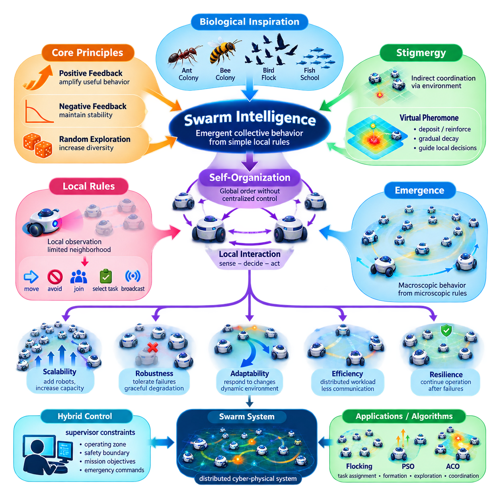
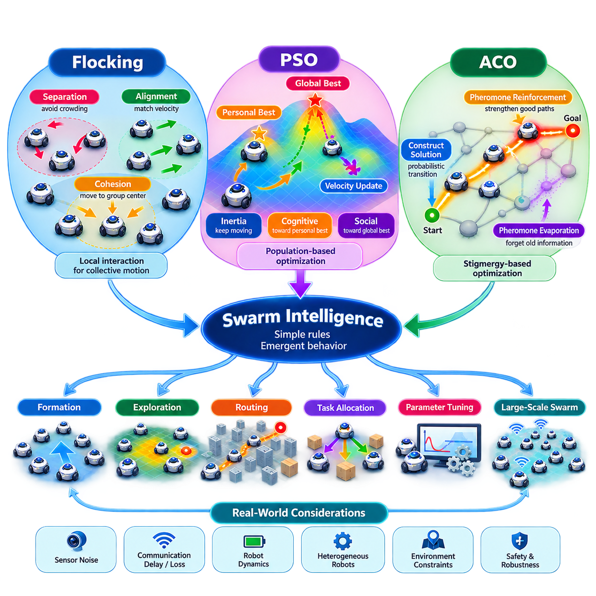
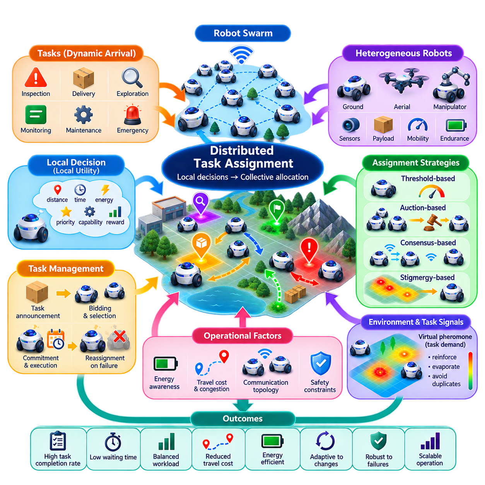
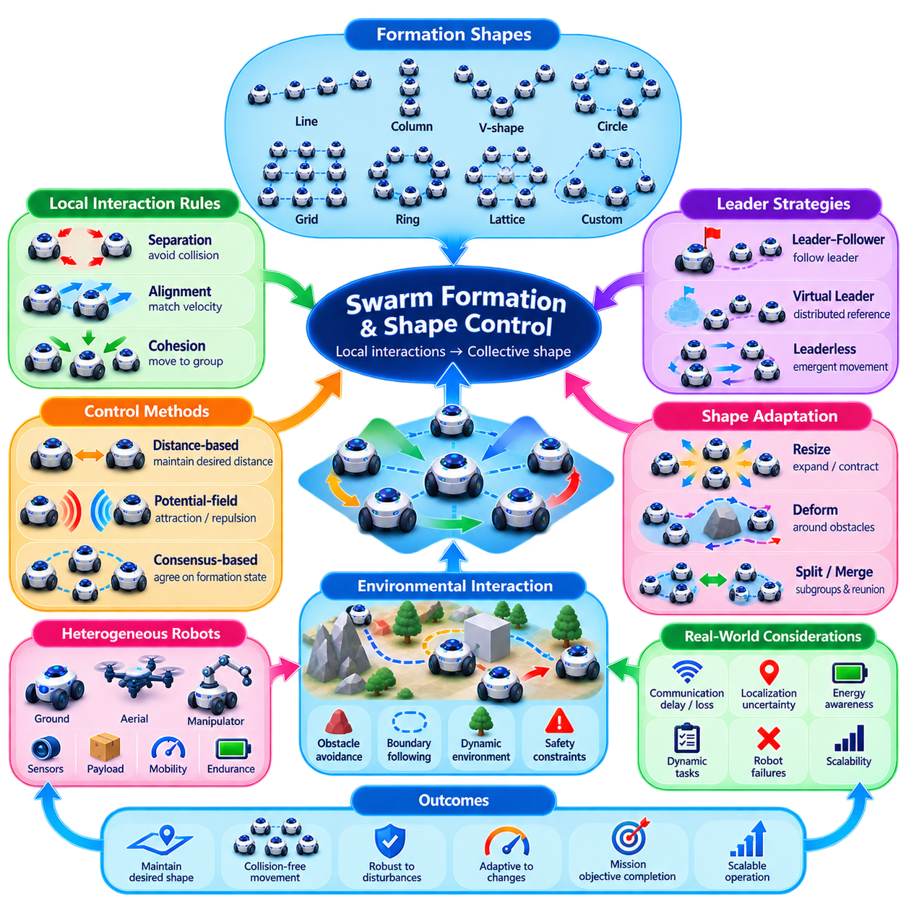
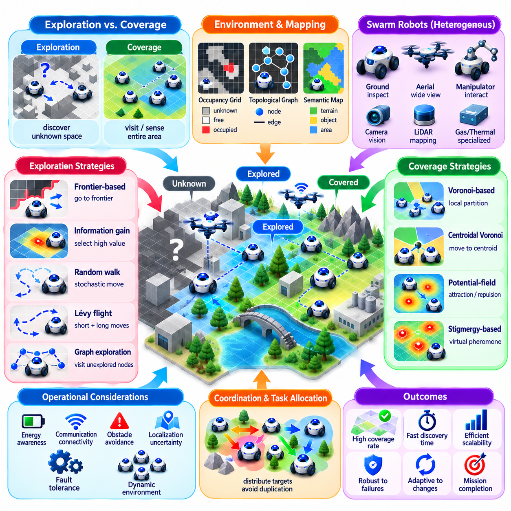
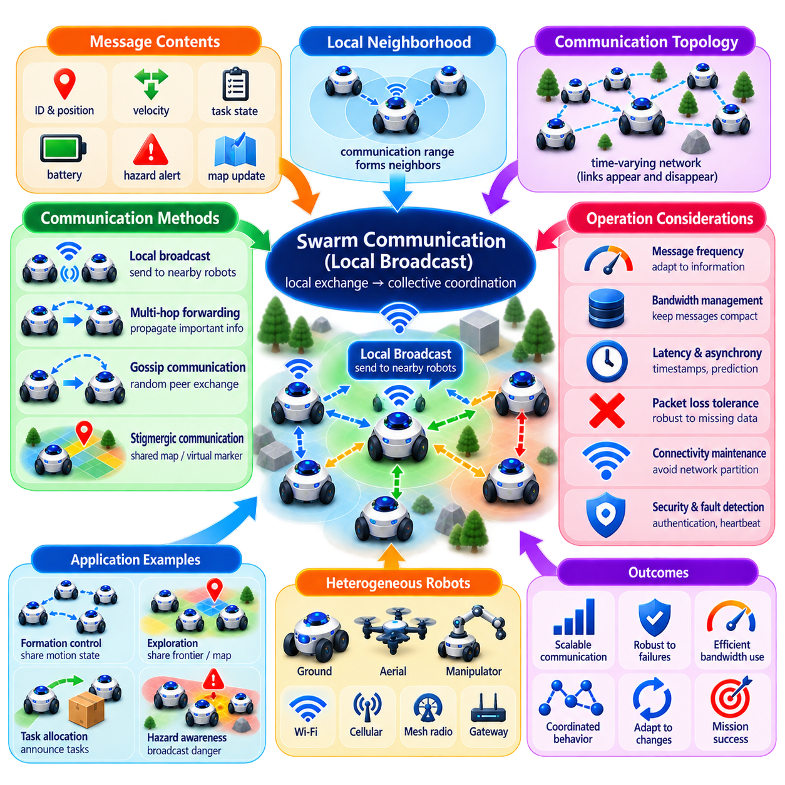
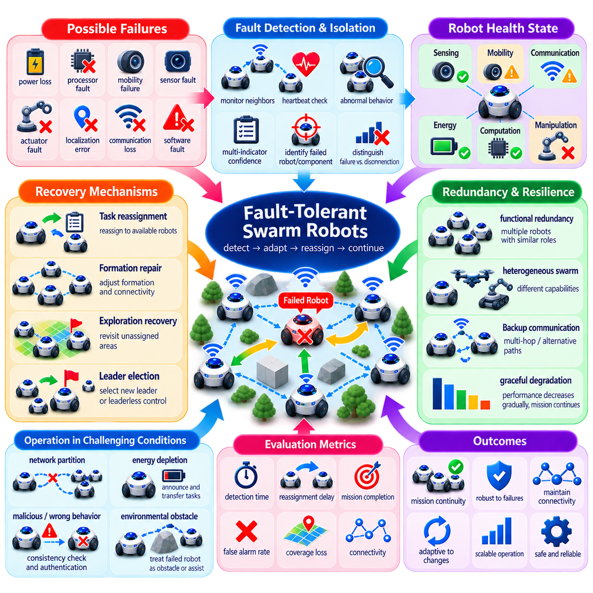
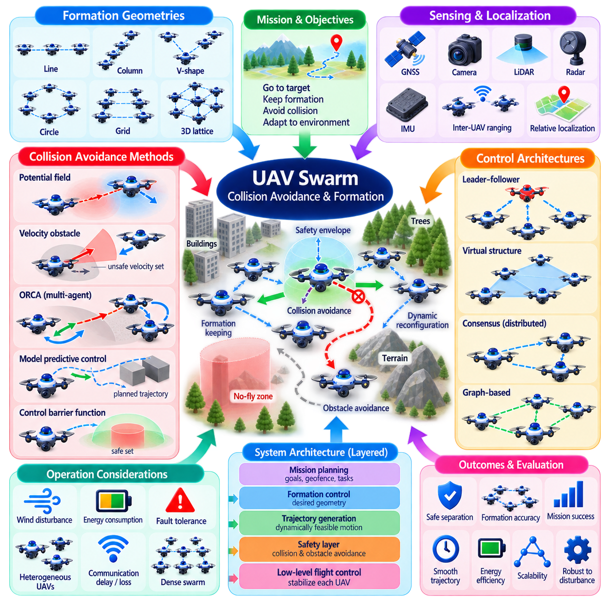
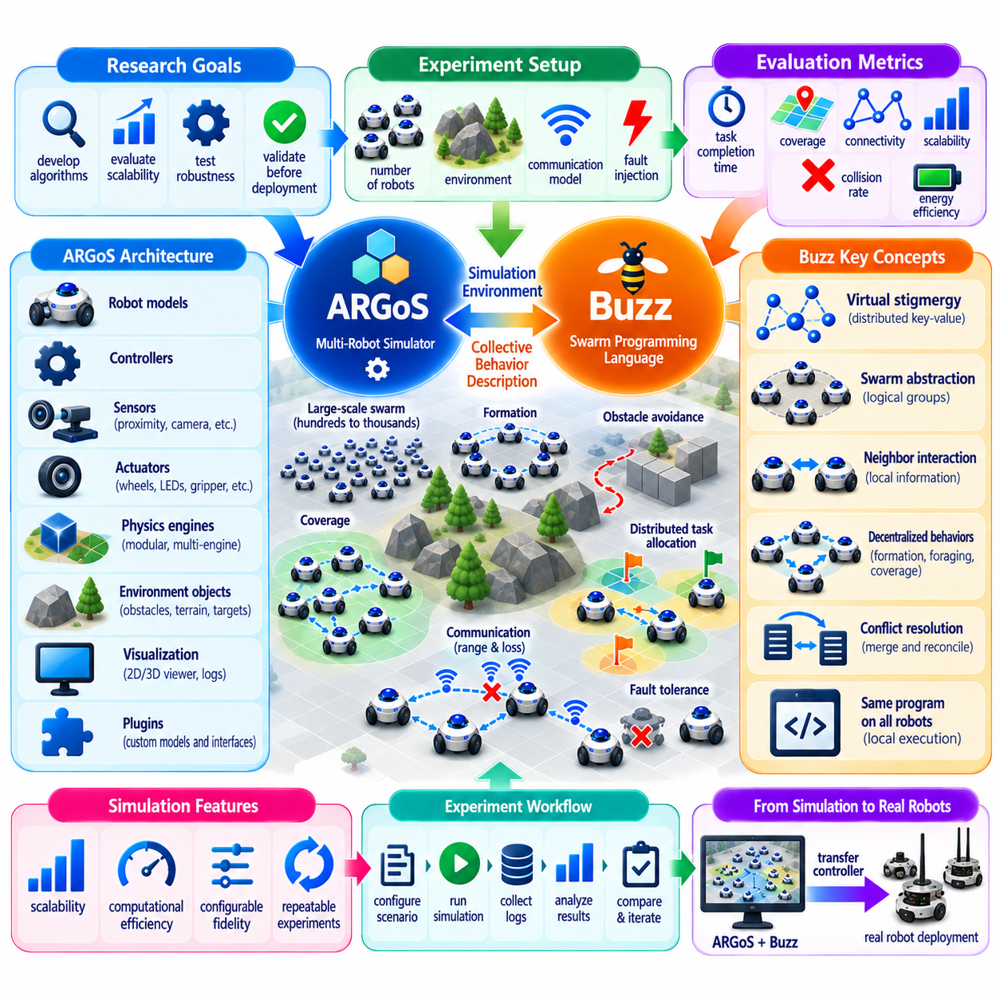
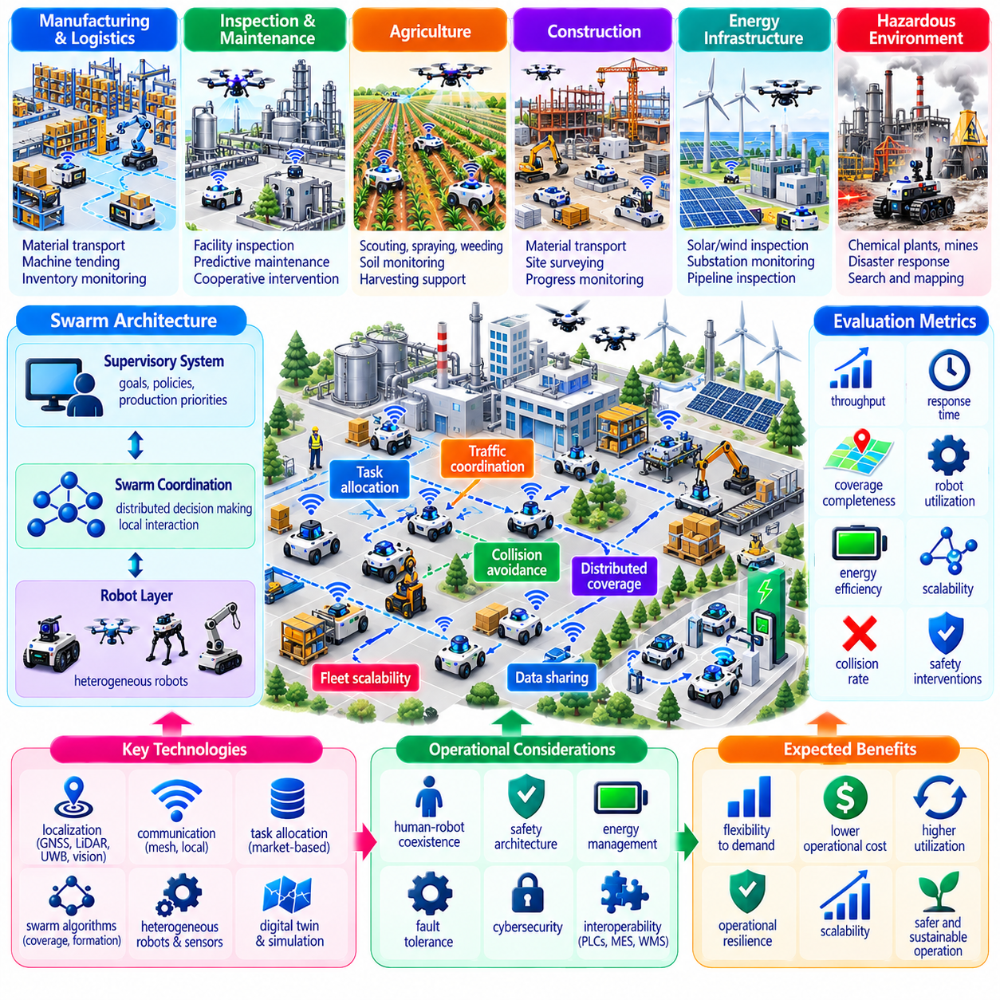

**Volume 16 Multi Robot and Fleet Intelligence**

# 07. Swarm Robotics

## 07.01 Swarm Intelligence Principles Stigmergy Self Organization

{width="7.268055555555556in" height="7.268055555555556in"}

Swarm intelligence describes a form of collective problem solving in which many relatively simple robots produce coordinated behavior through local sensing, interaction, and adaptation rather than continuous centralized control. In swarm robotics, intelligence therefore does not reside exclusively in a supervisor or individual robot. It emerges from repeated interactions among robots, their neighbors, and the physical environment.

This principle distinguishes a swarm from a conventional centrally managed fleet. A fleet management system may maintain global knowledge, assign explicit missions, calculate routes, and resolve conflicts from a central service. A swarm instead emphasizes distributed decision making, local rules, redundancy, and collective adaptation. Individual robots may possess limited information, yet the population can still generate useful global behavior through repeated local interactions. :chatgpt-content-reference{index="0"}

The biological inspiration comes from systems such as ant colonies, bee colonies, bird flocks, fish schools, and social insects. Individual organisms generally do not maintain a complete representation of the collective state. They respond to nearby organisms, environmental conditions, and locally available signals. Repetition of these interactions across a large population produces structures such as trails, formations, resource allocation patterns, and coordinated movement.

Self-organization is the process through which global order develops without requiring a controller to explicitly specify every interaction. Three mechanisms are especially important: positive feedback amplifies useful behaviors, negative feedback prevents uncontrolled amplification, and random exploration introduces diversity. Together, these mechanisms allow a swarm to discover solutions while remaining responsive to changing environmental conditions.

Positive feedback can strengthen successful collective decisions. If robots searching a large area discover a productive region, information associated with that region can increase the probability that additional robots will investigate it. However, unlimited reinforcement could concentrate the entire swarm around one solution. Negative feedback, resource limits, congestion effects, signal decay, or explicit inhibition therefore help maintain stability and distribute activity.

Randomness also serves a functional purpose. A completely deterministic swarm may repeatedly converge on locally attractive but globally inefficient behaviors. Small stochastic variations in exploration, direction selection, task choice, or communication can prevent premature convergence. Swarm design therefore often balances exploitation of known opportunities with exploration of alternatives, producing adaptability without requiring centralized optimization.

Stigmergy is a particularly important mechanism of indirect coordination. Instead of communicating directly with every other robot, an agent modifies some shared representation of the environment, and other agents respond to that modification. The environment effectively becomes part of the coordination mechanism. Biological pheromone trails are the classical example, but robotic stigmergy can be implemented using digital markers, maps, occupancy information, shared task states, or virtual pheromones.

A virtual pheromone system may associate numerical values with locations, resources, hazards, or tasks. Robots deposit or reinforce values as they operate, while those values gradually decay over time. Other robots use the resulting field as one input to local decisions. Reinforcement preserves information that remains useful, whereas evaporation removes stale information and allows the swarm to adapt when routes, obstacles, workloads, or environmental conditions change.

Stigmergy can reduce communication requirements because coordination does not necessarily depend on continuous robot-to-robot negotiation. A robot may only need access to nearby environmental markers or a locally synchronized representation. This characteristic is valuable when network connectivity is intermittent, bandwidth is constrained, or the number of robots makes global all-to-all communication expensive. Direct communication and stigmergic coordination can also coexist.

Local interaction is another foundation of swarm behavior. Each robot commonly observes only a neighborhood defined by sensing range, communication range, topology, or operational relevance. Its control policy maps local observations into actions such as moving, avoiding neighbors, joining a formation, selecting a task, or broadcasting information. Global behavior then emerges from thousands of these local perception-action cycles occurring concurrently.

Emergence does not mean that swarm behavior is mysterious or uncontrolled. It means that macroscopic behavior is produced by interactions among simpler microscopic rules rather than being commanded explicitly at every step. Engineers must therefore design and validate local rules with their collective consequences in mind. A rule that appears reasonable for one robot can generate congestion, oscillation, deadlock, fragmentation, or unstable feedback when replicated across hundreds of robots.

Scalability is one of the major motivations for swarm architectures. Centralized systems can encounter computational, communication, and coordination bottlenecks as population size increases. A well-designed swarm distributes much of this workload among its members. Adding robots can increase sensing coverage, parallelism, and operational capacity without requiring every coordination function to grow proportionally at a central controller.

Robustness arises from a related property: redundancy. If collective behavior depends on contributions from many interchangeable robots rather than a small number of critical units, failure of individual members may degrade performance gradually instead of causing complete mission failure. The remaining robots can redistribute tasks, close spatial gaps, rebuild communication neighborhoods, or continue exploration. This makes graceful degradation a central swarm-design objective.

Swarm systems nevertheless require limits on autonomy. Purely local rules cannot automatically guarantee safety, mission priority, regulatory compliance, or globally optimal resource utilization. Industrial implementations may therefore combine swarm intelligence with supervisory constraints. A higher layer can define operating zones, safety boundaries, mission objectives, charging policies, or emergency commands while robots retain distributed authority over lower-level collective decisions.

This creates an important distinction between control and constraint. A supervisor does not necessarily determine every robot trajectory or task. Instead, it can establish an admissible operating envelope within which self-organizing behavior occurs. Such hybrid architecture preserves much of the swarm\'s scalability and resilience while providing the observability, governance, and deterministic intervention mechanisms required by industrial robot operations.

Communication topology strongly influences collective behavior. Local broadcast supports neighborhood awareness without requiring a complete global communication graph. Information can propagate through repeated peer interactions, allowing knowledge to spread across the swarm even when two distant robots never communicate directly. The volume structure therefore naturally connects swarm principles with later treatment of local broadcast communication, distributed task assignment, formation control, and fault tolerance. :chatgpt-content-reference{index="1"}

The spatial distribution of robots is equally important because communication, sensing, and physical motion are coupled. A robot can simultaneously act as a mobile sensor, computational agent, communication participant, and physical actuator. Consequently, changing the position of one robot may alter sensing coverage, network connectivity, collision risk, and information propagation. Swarm coordination must therefore consider information topology and physical topology together.

Swarm behavior can be understood through several levels of observation. At the individual level, engineers examine sensing, local state, control rules, and communication. At the neighborhood level, they study interaction patterns and information propagation. At the population level, they evaluate coverage, convergence, throughput, robustness, and stability. Successful design requires connecting these levels rather than judging the swarm solely from individual robot performance.

A central engineering challenge is predicting whether desired global behavior will reliably emerge from local rules. Simulation is especially valuable because collective phenomena may appear only at larger population sizes or under particular densities, communication losses, delays, and failure patterns. Parameters that perform well with ten robots may produce congestion or unstable interactions with hundreds. Swarm evaluation must therefore examine scaling behavior rather than only nominal operation.

Metrics should reflect collective objectives. Depending on the application, useful measures include task completion rate, area coverage, convergence time, communication overhead, energy consumption, collision frequency, spatial dispersion, resilience after robot failures, and recovery time. These metrics expose trade-offs between rapid convergence and exploration, dense cooperation and congestion, communication richness and bandwidth consumption, or redundancy and operational efficiency.

Industrial swarm robotics is consequently not simply the deployment of many identical robots. It is an architectural approach in which local autonomy, decentralized interaction, self-organization, redundancy, and emergent collective behavior are deliberately engineered. The swarm becomes a distributed cyber-physical system whose useful intelligence arises from relationships among robots as much as from the capabilities of any single robot.

Within multi-robot and fleet intelligence, swarm robotics therefore complements rather than replaces conventional fleet management. Centralized fleet systems are effective when global scheduling, deterministic coordination, and enterprise integration dominate. Swarm mechanisms become attractive when scale, uncertain environments, distributed exploration, resilience, or communication constraints make local adaptation valuable. Hybrid systems can selectively combine both approaches.

These principles establish the conceptual foundation for subsequent swarm algorithms. Flocking converts local attraction, alignment, and separation into coordinated motion; particle swarm optimization uses distributed candidate solutions to search an objective space; ant-colony methods formalize reinforcement and evaporation mechanisms inspired by stigmergy. Distributed task assignment, formation control, exploration, communication, and fault tolerance extend the same local-to-global philosophy into practical robotic functions.

Ultimately, swarm intelligence shifts the engineering question from "How should a central controller command every robot?" to "What local information, interaction rules, feedback mechanisms, and constraints will cause the population to produce the required global behavior?" That shift is the essence of self-organizing robotics and provides the conceptual bridge from conventional multi-robot coordination toward scalable, adaptive, and resilient robot collectives.

## 07.02 Swarm Behavior Algorithms Flocking PSO ACO [w/Code]

{width="7.268055555555556in" height="7.268055555555556in"}

Flocking algorithms reproduce coordinated group motion through simple local interaction rules rather than centralized trajectory commands. The classical formulation is based on separation, alignment, and cohesion. Separation prevents robots from approaching neighbors too closely, alignment encourages similar velocity or heading, and cohesion attracts robots toward the local group center. Their combination produces organized collective motion from decentralized decisions.

Each robot normally evaluates only neighbors inside a sensing or communication radius. For robot \\(i\\), the resulting control action can be interpreted as a weighted combination of separation, alignment, cohesion, obstacle avoidance, and mission-directed motion. Changing these weights changes collective behavior significantly. Excessive cohesion may create congestion, while excessive separation can fragment the swarm and weak alignment may produce unstable or disordered movement.

Neighborhood definition is therefore as important as the flocking equations themselves. Metric neighborhoods include robots within a specified physical distance, while topological neighborhoods may consider a fixed number of nearest neighbors. Communication connectivity, sensing limitations, occlusion, packet loss, and robot dynamics affect which neighbors are actually observable. Practical flocking controllers must operate correctly even when neighborhood membership continuously changes during motion.

Separation is commonly implemented using a repulsive vector whose magnitude increases as inter-robot distance decreases. This creates a distributed collision-avoidance tendency without requiring a central traffic controller. However, separation alone does not guarantee collision-free operation because real robots have finite braking distance, actuator limits, localization uncertainty, and communication delay. Safety-critical systems therefore require dedicated collision avoidance and motion constraints in addition to flocking rules.

Alignment attempts to reduce differences between the velocity or heading of neighboring robots. A robot estimates the average motion of its local neighbors and adjusts its own velocity toward that value. Repeated across the swarm, this process can produce coherent movement in a common direction. The rate of convergence depends on interaction topology, update frequency, controller gains, communication quality, and the dynamic capabilities of individual robots.

Cohesion provides the attractive component that keeps the swarm from dispersing indefinitely. A robot estimates a local center based on neighboring positions and moves toward it while respecting separation constraints. The resulting balance between attraction and repulsion can maintain a desired density. In practical robots, cohesion may also be modified by mission goals, restricted zones, communication connectivity requirements, or heterogeneous capabilities.

Flocking becomes more useful when combined with environmental objectives. Goal attraction can guide the swarm toward a destination, obstacle fields can deform the formation around hazards, and boundary forces can keep robots inside permitted regions. Local rules can also incorporate energy state, payload, terrain suitability, or communication quality. The resulting controller preserves decentralized behavior while embedding operational constraints required by real missions.

Particle Swarm Optimization (PSO) applies swarm principles to numerical optimization rather than directly reproducing physical flocking. Each particle represents a candidate solution in a search space and maintains a position and velocity. During iterative optimization, particles modify their motion according to their own best-known solution and information about successful solutions discovered by other particles, allowing the population to explore an objective function collectively.

A standard PSO update combines three influences. Inertia preserves part of the particle\'s previous velocity, the cognitive component attracts it toward its personal best position, and the social component attracts it toward a neighborhood or global best position. Random coefficients introduce stochastic exploration. The balance among these terms determines whether the swarm searches broadly or converges rapidly around promising regions.

The inertia weight is particularly useful for controlling the exploration-exploitation trade-off. Higher inertia can encourage particles to continue exploring distant regions, whereas lower inertia promotes local refinement and convergence. Cognitive and social coefficients determine the relative influence of individual experience and collective knowledge. Poor parameter selection can cause oscillation, premature convergence, excessive dispersion, or slow optimization.

PSO can support robotic problems in which decisions can be represented as optimization variables. Examples include parameter tuning, formation configuration, route-related optimization, resource allocation, sensor placement, or mission planning. In such applications, the particles are not necessarily physical robots. They may exist entirely inside an optimization process whose resulting solution is later transferred to a robot or fleet controller.

Distributed PSO can also map computational particles or candidate solutions onto multiple robots. Each robot can evaluate candidate decisions using local measurements and exchange selected fitness information with neighboring robots. Local-best PSO reduces dependence on a single globally shared solution and can improve distributed operation, although convergence behavior becomes dependent on communication topology and information propagation through the swarm.

Ant Colony Optimization (ACO) is inspired by the indirect coordination observed in ants searching for efficient paths. Artificial ants construct candidate solutions and deposit virtual pheromone on components associated with successful solutions. Future ants are more likely to select components with stronger pheromone values, creating positive feedback. Pheromone evaporation simultaneously weakens old information and prevents early decisions from dominating the search permanently.

In path-planning formulations, an artificial ant moves between nodes of a graph according to transition probabilities influenced by pheromone intensity and heuristic information such as distance or estimated cost. After candidate paths are evaluated, pheromone associated with better paths is reinforced. Repeated iterations gradually increase the probability of selecting high-quality routes while still permitting alternative paths to be explored.

Pheromone evaporation is essential to ACO because reinforcement without decay can lock the colony onto an early, suboptimal solution. The evaporation rate controls how rapidly historical information loses influence. Rapid evaporation improves responsiveness but can discard useful knowledge, while slow evaporation preserves experience but can reduce adaptability. Effective ACO therefore balances memory, exploration, reinforcement, and forgetting.

ACO is naturally connected to stigmergy because coordination occurs through a shared information structure rather than continuous direct negotiation among all agents. In robotic implementations, virtual pheromone can be stored in graph edges, grid cells, semantic map regions, or distributed map structures. Robots can reinforce successful routes, exploration targets, resource locations, or task opportunities while allowing outdated information to decay.

Flocking, PSO, and ACO represent different interpretations of swarm intelligence. Flocking primarily generates coordinated physical motion through local geometric interactions. PSO performs population-based search using personal and collective experience. ACO performs constructive optimization through probabilistic decisions and stigmergic reinforcement. They should therefore not be treated as interchangeable algorithms even though all exploit decentralized or population-level interaction principles.

These approaches can also be combined. Flocking may control real-time robot motion while PSO optimizes controller parameters or formation configurations. ACO may determine promising routes or task sequences while local flocking maintains safe collective movement along those routes. A supervisory layer can impose mission boundaries and safety constraints without calculating every local interaction, producing a hybrid architecture suitable for larger robot populations.

Communication requirements differ among the algorithms. Flocking generally requires frequent local state information because neighboring positions and velocities change continuously. Distributed PSO exchanges candidate quality and best-known states at a slower optimization timescale. ACO can rely heavily on persistent virtual pheromone information. System designers can exploit these differences to partition computation and communication according to latency, bandwidth, and reliability requirements.

Real robots introduce conditions that ideal swarm simulations often simplify. Sensor noise, localization drift, communication delay, packet loss, actuator saturation, heterogeneous mobility, battery limitations, and asynchronous update rates can alter collective dynamics. A controller stable under perfect synchronous updates may oscillate or fragment under realistic delays. Algorithm evaluation must therefore include degraded communication and physical robot constraints rather than only nominal simulation conditions.

Scalability must also be measured empirically. An algorithm described as decentralized can still create hidden global bottlenecks if every robot publishes state to every other robot or accesses one centralized pheromone database. Efficient implementations restrict information exchange to relevant neighborhoods, partition shared maps, use local caching, and avoid unnecessary global synchronization. Computational complexity and network traffic should be evaluated as swarm population increases.

Performance evaluation should consider both individual and collective outcomes. Flocking can be assessed through collision rate, velocity agreement, formation cohesion, dispersion, convergence time, and mission progress. PSO is commonly evaluated using solution quality, convergence speed, robustness across repeated trials, and computational cost. ACO evaluation can examine path quality, convergence, pheromone diversity, adaptation after environmental changes, and communication overhead.

No single swarm algorithm is universally optimal. Flocking is attractive when coordinated movement and local responsiveness dominate the problem. PSO is useful when the problem can be represented as a continuous or parameterized optimization space. ACO is particularly suitable for graph-based routing, sequencing, and problems where persistent stigmergic information is useful. Application structure should determine the algorithm rather than biological analogy alone.

For industrial swarm robotics, these algorithms should be viewed as components within a larger autonomy architecture. Safety monitors, localization, communication management, mission supervision, fault detection, charging logic, and fleet interfaces remain necessary. Swarm algorithms provide decentralized coordination and optimization mechanisms, while higher-level systems define operational objectives and constraints. This separation allows emergent behavior to coexist with predictable industrial governance.

Flocking, PSO, and ACO ultimately demonstrate how relatively compact local rules can generate sophisticated population-level behavior. Flocking transforms neighbor interactions into coherent motion, PSO transforms distributed experience into collective optimization, and ACO transforms indirect environmental information into adaptive search. Together they provide foundational algorithmic patterns for distributed task assignment, formation, exploration, routing, and large-scale swarm coordination.

## 07.03 Distributed Task Assignment in Swarms [w/Code]

{width="7.268055555555556in" height="7.268055555555556in"}

Distributed task assignment in robot swarms determines how many autonomous robots select, exchange, and execute tasks without relying on a continuously available central dispatcher. Instead of maintaining one global assignment matrix, each robot makes decisions from local observations, neighboring messages, task urgency, capability, distance, energy state, and current workload. Collective allocation emerges from repeated local decisions and interactions across the swarm.

This approach differs from conventional centralized multi-robot task allocation because complete global knowledge is not assumed. A robot may know only tasks detected locally or announced by nearby peers, while distant parts of the swarm maintain different information. The assignment mechanism must therefore tolerate partial knowledge, asynchronous updates, communication delay, and temporary disagreement while still guiding the population toward useful global task coverage.

A distributed task-assignment problem can be represented by robots \\(R=\\{r_1,\\ldots,r_n\\}\\) and tasks \\(T=\\{t_1,\\ldots,t_m\\}\\). Each robot estimates a local utility or cost for candidate tasks using factors such as travel distance, execution time, energy consumption, task priority, required capability, and expected reward. Assignment then attempts to maximize collective utility or minimize total operational cost under local information constraints.

Local utility functions are critical because they translate mission objectives into individual robot decisions. A nearby task may have low travel cost but limited strategic value, while a distant emergency task may deserve higher priority. Utility can therefore combine multiple normalized factors with configurable weights. In heterogeneous swarms, feasibility must be checked before utility because robots may differ in payload, sensors, mobility, manipulators, endurance, or environmental access.

One simple distributed strategy is threshold-based response. Each robot maintains response thresholds associated with task types and becomes more likely to accept a task when the perceived task stimulus exceeds its threshold. Robots with lower thresholds for particular tasks naturally specialize, while increasing task demand recruits additional robots. This mechanism can generate flexible division of labor without explicitly assigning every robot from a central controller.

Threshold mechanisms can adapt over time. Successful execution of a task type may reduce a robot\'s corresponding threshold, increasing the probability that it accepts similar tasks later. Lack of participation may gradually increase or normalize the threshold. Such adaptation can create emergent specialization, but excessive reinforcement can produce rigid roles. Designers therefore need mechanisms that preserve flexibility when workload, robot availability, or environmental conditions change.

Market-inspired distributed assignment provides another approach. Robots compute bids representing the cost or utility of performing an announced task, and neighboring robots compare those bids to select a winner. Auctions may be performed locally rather than by a central auctioneer, with information propagated through peer communication. Repeated bidding can allocate newly arriving tasks while allowing robots to reconsider assignments when better candidates become available.

Consensus-based allocation extends this idea by allowing robots to construct local task bundles and exchange information about preferred assignments. Through repeated communication, conflicting claims can be resolved and neighboring robots can converge toward compatible allocations. Consensus does not necessarily require every robot to communicate directly with every other robot; information can propagate across a connected communication graph through successive neighborhood exchanges.

Swarm task assignment may also use stigmergic mechanisms. Tasks, regions, or resources can carry virtual markers representing demand, urgency, congestion, or recent service activity. Robots observe these markers and select actions according to local values. Successful service can reduce task demand markers, while unserved tasks can accumulate stronger attraction. This allows the shared environment or digital map to participate directly in distributed coordination.

Virtual pheromone mechanisms are especially useful for spatial tasks such as exploration, inspection, cleaning, surveillance, and resource collection. Robots may be attracted toward high-demand regions while being repelled from recently serviced areas. Marker evaporation removes obsolete information, enabling the swarm to adapt when new tasks appear or priorities change. Excessively slow evaporation can preserve stale assignments, while rapid evaporation may cause unstable switching.

Distributed assignment must explicitly manage duplicate selection. If several robots independently observe the same high-value task, they may all attempt to execute it, wasting resources. Local reservation messages, temporary ownership tokens, winner announcements, commitment timers, or task-state markers can reduce duplication. For tasks requiring multiple robots, the same mechanisms can instead control recruitment until the required team size has been reached.

Commitment is important because continuously recalculating utility can cause robots to switch tasks repeatedly. A robot may abandon one assignment whenever a slightly better opportunity appears, producing oscillation and reducing useful work. Hysteresis, minimum commitment periods, switching penalties, or progress-aware utility can stabilize decisions. The system must balance stability against responsiveness so that robots can still abandon obsolete or impossible assignments when necessary.

Dynamic task arrival is a defining feature of practical swarm operation. New inspection requests, detected hazards, transport jobs, exploration targets, or failures may appear while robots are already working. Distributed algorithms should incorporate new tasks incrementally rather than recomputing the entire swarm schedule. Local announcements and neighborhood propagation allow urgent information to spread while robots unaffected by the new task continue their existing missions.

Task priorities introduce additional complexity. Emergency tasks may need to preempt ordinary work, while low-priority tasks can wait for nearby idle robots. Priority should therefore influence utility, bidding, recruitment, and switching rules. However, aggressive preemption can destabilize the swarm if high-priority events arrive frequently. Priority aging, bounded preemption, and mission-specific reservation policies can help preserve both responsiveness and completion stability.

Energy awareness is equally important. A robot with the highest task utility may not be the best choice if its remaining battery cannot support travel, execution, and safe return to a charger. Distributed utility calculations can incorporate state of charge, predicted energy consumption, charger distance, and charging congestion. Robots approaching an energy threshold can reduce their bidding activity or temporarily classify charging as a high-priority internal task.

Communication topology strongly affects assignment quality. Dense information exchange can improve awareness but increases bandwidth and processing requirements. Sparse local communication scales better but slows the propagation of task and assignment information. Gossip, local broadcast, neighbor tables, and periodic summaries can spread relevant state without requiring global synchronization. The appropriate topology depends on swarm size, robot density, task dynamics, and network reliability.

Temporary communication partitions must not stop the entire swarm. Robots inside disconnected subgroups should continue assigning locally observable tasks using the information available to them. When connectivity returns, assignment states can be reconciled using timestamps, task versions, ownership leases, or deterministic conflict rules. This partition-tolerant behavior is an important advantage of distributed architectures operating in large or communication-constrained environments.

Robot failures require similar reassignment mechanisms. If a robot stops reporting progress, its task should eventually become available to other robots. Heartbeats, lease expiration, progress timeouts, or local observation can detect abandoned assignments. Recovery must avoid immediate duplication when communication alone is unreliable, so task ownership is often treated as time-limited rather than permanent. The swarm can then redistribute unfinished work without global replanning.

Heterogeneous swarms require capability-aware assignment. Aerial robots may inspect elevated structures, ground robots may transport payloads, and robots carrying thermal cameras or manipulators may perform specialized tasks. Task descriptions should therefore include capability requirements, and robots should advertise compact capability profiles. Allocation occurs only among feasible candidates, while cooperative tasks may recruit complementary robots to form temporary mission teams.

Spatial coordination and task allocation are tightly coupled. Selecting the theoretically best task is insufficient if many robots choose routes through the same narrow corridor or operational zone. Assignment cost can incorporate predicted congestion, travel conflicts, and regional robot density. Local traffic information can therefore influence bidding or utility so that task allocation distributes not only workload but also physical movement across the environment.

Distributed assignment operates at a different timescale from low-level swarm motion. Task selection may update every few seconds or when important events occur, whereas collision avoidance and flocking can run much faster. Separating these layers prevents assignment messages from becoming part of time-critical motion control. A robot can select a task through distributed allocation while a local navigation or flocking controller determines how to reach it safely.

Industrial implementations can combine swarm assignment with supervisory constraints. A fleet or mission layer may define task classes, safety zones, deadlines, resource limits, or prohibited assignments while leaving individual task selection decentralized. The supervisor therefore establishes the admissible decision space rather than continuously assigning every robot. This hybrid structure provides operational governance while retaining scalability and local resilience.

Performance must be evaluated at the collective level. Relevant measures include task completion rate, average waiting time, travel distance, energy consumption, workload balance, assignment convergence time, communication overhead, duplicate execution, switching frequency, and recovery after failures. Fairness may also matter when repeated local optimization causes particular robots to receive disproportionate workloads and experience accelerated battery or mechanical degradation.

Scalability testing should increase both robot population and task arrival rate. An algorithm that performs well with twenty robots may suffer message storms, slow convergence, excessive contention, or unstable switching with hundreds. Simulation should therefore evaluate communication loss, delayed messages, robot failures, heterogeneous capabilities, changing task density, and spatial bottlenecks before deployment. Large-scale behavior is itself part of the algorithm\'s performance.

Distributed task assignment ultimately converts local estimates, peer interactions, and environmental signals into population-level division of labor. Threshold responses provide simple self-organized specialization, auctions and consensus provide explicit distributed competition and agreement, and stigmergic mechanisms coordinate through shared task signals. Combined with commitment, failure recovery, energy awareness, and capability constraints, these mechanisms allow a swarm to allocate work adaptively without depending on a single central decision point.

## 07.04 Swarm Formation and Shape Control [w/Code]

{width="7.268055555555556in" height="7.268055555555556in"}

Swarm formation and shape control enables a population of robots to organize itself into desired spatial patterns while preserving decentralized decision making. Instead of commanding every robot to follow a predefined global trajectory, formation behavior is produced through local position, distance, orientation, and neighborhood relationships. The objective is to maintain a useful collective geometry while the swarm moves, adapts, and responds to environmental changes.

A formation can be described by relative relationships rather than absolute coordinates. Robots may be required to maintain desired distances from selected neighbors, preserve angular relationships, occupy positions on a geometric boundary, or maintain a specified density within an area. This relative representation supports distributed control because each robot can calculate its action using locally measurable quantities without requiring complete knowledge of the entire swarm.

Common swarm formations include lines, columns, circles, lattices, wedges, rings, grids, and dynamically deformable shapes. Different geometries serve different operational purposes. A line may support corridor inspection, a grid can provide systematic area coverage, a ring can surround a target, and a wedge may support coordinated movement. Shape selection should therefore reflect sensing coverage, mobility, communication, safety, and mission requirements.

Distance-based formation control defines desired inter-robot distances on a communication or sensing graph. Each robot compares measured distances with desired values and generates corrective motion to reduce the error. When neighboring robots perform the same operation concurrently, the overall formation can converge toward the intended geometry. This approach is attractive because distance can often be estimated directly from localization, ranging, or relative perception.

Potential-field methods provide another intuitive mechanism. Neighboring robots generate attractive forces when they are too far apart and repulsive forces when they become too close. The equilibrium between these virtual forces establishes the desired spacing. Additional fields can represent obstacles, mission goals, restricted regions, or environmental boundaries, allowing formation maintenance and environmental interaction to be incorporated into a common distributed control framework.

Consensus-based formation control uses information exchange among neighboring robots to reduce disagreement in variables such as position offsets, velocity, heading, or formation state. Each robot repeatedly adjusts its state according to differences from its neighbors. If the interaction graph satisfies appropriate connectivity conditions, local updates can produce coherent global motion. Consensus can therefore synchronize formation behavior without requiring continuous centralized coordination.

Leader-follower control introduces limited hierarchy into formation behavior. One or more leader robots define motion references, while followers maintain prescribed relative relationships with leaders or neighboring followers. This simplifies global guidance but can create dependence on leader availability. Multi-leader, virtual-leader, or leader-election mechanisms can reduce this vulnerability while retaining a clear reference for collective movement.

Leaderless formations remove a persistent central reference and instead derive movement from distributed interactions. Mission direction may emerge through consensus, environmental gradients, temporary local leaders, or shared goal information. Such formations can offer improved resilience because failure of one robot does not eliminate the swarm\'s primary motion reference. However, achieving coordinated translation and rotation can require stronger agreement mechanisms among participants.

Graph theory provides a useful mathematical representation of formation structure. Robots are represented as vertices and relevant interaction relationships as edges. The graph determines which robots exchange information or constrain relative geometry. Connectivity is critical because a fragmented interaction graph can divide the swarm into independent subgroups. Formation control therefore often considers both geometric shape and preservation of communication connectivity.

Rigidity is another important concept. A formation is rigid when its geometric shape cannot be continuously deformed without changing specified inter-robot distances. Rigidity theory helps determine whether a selected set of distance constraints is sufficient to preserve the desired geometry. Too few constraints allow unwanted deformation, while excessive constraints can increase communication and control complexity. Practical designs seek enough structure for stability without unnecessary coupling.

Shape control extends formation control beyond maintaining fixed relative positions. The swarm may need to expand, contract, rotate, split, merge, or deform around obstacles while preserving a higher-level geometric objective. A circular formation, for example, may temporarily become elliptical when passing through a narrow region and then recover its original shape. This requires the desired formation itself to become a dynamic control variable.

Shape representations can use explicit target positions, geometric primitives, density fields, signed-distance functions, virtual structures, or implicit boundaries. Explicit positions are convenient for small formations but can become restrictive at large scale. Field-based representations allow individual robots to occupy any suitable position consistent with the desired collective shape, providing greater flexibility when robots fail, join the swarm, or exchange positions.

Virtual-structure methods treat the entire formation as if it were a single geometric object. Desired robot positions are defined relative to a virtual reference frame, and translation, rotation, or scaling of that frame moves the whole formation. This can produce accurate shapes, but a purely centralized virtual structure may reduce swarm autonomy. Distributed implementations replicate or estimate the virtual reference using local communication and consensus.

Behavior-based shape control combines multiple local behaviors such as separation, cohesion, alignment, goal attraction, obstacle avoidance, and boundary following. Weighted combinations of these behaviors allow the swarm to maintain approximate shape while remaining reactive. Unlike rigid geometric controllers, behavior-based methods can tolerate disturbances and changing membership, although they may provide less precise geometric guarantees.

Formation resizing is necessary when environmental space changes. Robots approaching a narrow passage may reduce lateral spacing, change from a wide grid into a column, and later restore the original arrangement. Transition control should avoid sudden target changes that cause crossing trajectories or congestion. Smooth interpolation, staged transitions, local reconfiguration, and temporary role reassignment can reduce instability during shape transformation.

Obstacle avoidance must be integrated carefully because individual avoidance actions can destroy formation coherence. A robot that independently detours around an obstacle may break communication links or create large spacing errors. Formation-aware avoidance considers both obstacle risk and neighbor relationships. The swarm can deform collectively, route around different sides of an obstacle, or temporarily relax shape constraints while preserving connectivity and safety.

Collision avoidance operates at a higher safety priority than nominal formation accuracy. Desired geometry should never force robots into unsafe configurations when localization errors, unexpected obstacles, or dynamic agents are present. Safety layers can impose minimum separation, velocity limits, emergency braking, or collision-free control constraints. After the disturbance disappears, the formation controller can gradually restore the desired geometry.

Communication delay and packet loss can significantly affect formation stability. Neighbor positions or velocities received through the network may already be outdated when used by a controller. Prediction, timestamping, bounded-delay design, local sensing, and asynchronous algorithms can reduce dependence on perfectly synchronized communication. A robust formation controller should degrade gradually rather than collapse when some communication links become unreliable.

Localization uncertainty introduces similar challenges. Absolute GNSS or map-based localization may not always be available or sufficiently precise, especially indoors or in obstructed environments. Relative localization using cameras, LiDAR, ranging radios, or neighboring observations can support formation control. Hybrid methods can combine global anchors with accurate local relative measurements so that overall navigation and internal formation geometry remain consistent.

Heterogeneous swarms require formation rules that account for different robot sizes, speeds, turning radii, sensing ranges, and mobility constraints. Aerial and ground robots cannot necessarily maintain identical geometric relationships. Desired spacing and role assignment may therefore depend on robot type. Capability-aware formations can place specialized sensors at advantageous locations while faster or more maneuverable robots occupy dynamically demanding positions.

Membership changes are unavoidable in large swarms. Robots may join, leave, fail, recharge, or become temporarily unavailable. A scalable formation should reconfigure without requiring complete reconstruction. Local vacancy filling, neighbor reassignment, graph repair, density redistribution, and role transfer allow the swarm to preserve its overall shape despite changing population size. This property directly contributes to fault tolerance and operational continuity.

Formation splitting and merging are important for missions involving multiple regions. A swarm can divide into subgroups to inspect separate areas and later recombine into a larger formation. Distributed identifiers, temporary group objectives, boundary conditions, and rendezvous rules can coordinate these transitions. The control system must prevent ambiguous membership and conflicting attraction forces when groups separate or approach one another.

Energy state can also influence formation geometry. Robots with low battery may move toward peripheral positions that allow easier departure for charging, while fully charged robots replace them without disrupting the mission. In sensing applications, high-energy robots may occupy positions requiring greater motion or communication responsibility. Formation control can therefore interact with distributed task assignment and energy-aware fleet management.

The formation controller and navigation system should operate as coordinated layers. Mission planning determines where the swarm should travel, formation control determines the desired collective geometry, and local motion control generates feasible robot trajectories. Collision avoidance and safety constraints can override nominal commands when necessary. This layered architecture prevents geometric objectives from being confused with low-level vehicle dynamics.

Performance evaluation should measure more than visual similarity to the desired shape. Useful metrics include formation error, inter-robot distance error, convergence time, connectivity, collision rate, energy consumption, communication overhead, deformation during obstacle avoidance, and recovery time after disturbances. For dynamic shapes, transition smoothness and the ability to maintain mission coverage during reconfiguration are also important.

Large-scale evaluation must test density and population effects. Control rules that work with ten robots may create oscillations, communication congestion, or excessive repulsive forces with hundreds. Simulation should examine robot failures, delayed communication, sensor noise, moving obstacles, narrow passages, heterogeneous dynamics, and changing membership. Scalability depends on maintaining local computational and communication requirements as the population grows.

Industrial swarm formation should generally operate inside supervisory constraints rather than as unrestricted emergent motion. A mission layer can define permitted zones, minimum safety distances, maximum density, target shapes, and emergency behaviors while local controllers determine how individual robots satisfy those requirements. This hybrid approach combines distributed adaptability with the predictability and safety governance required in real deployments.

Swarm formation and shape control ultimately transform local geometric relationships into coordinated spatial organization. Distance control, potential fields, consensus, graph rigidity, virtual structures, and behavior-based methods provide complementary mechanisms for constructing and maintaining collective geometry. When combined with obstacle avoidance, connectivity preservation, dynamic reconfiguration, fault tolerance, and safety constraints, they enable robot swarms to move as adaptable spatial systems rather than as independently controlled machines.

## 07.05 Swarm Exploration and Coverage Algorithms [w/Code]

{width="7.268055555555556in" height="7.268055555555556in"}

Swarm exploration and coverage algorithms coordinate multiple robots so that an unknown or partially known environment can be observed efficiently without requiring a central planner to control every movement. Exploration focuses on discovering previously unknown space, while coverage focuses on ensuring that a required region is sufficiently visited or sensed. In practice, swarm systems often combine both objectives as robots progressively construct knowledge while distributing themselves across the environment.

The fundamental advantage of swarm exploration is parallelism. Instead of one robot sequentially visiting every region, many robots can investigate different locations simultaneously. However, simply increasing the number of robots does not guarantee efficiency. Without coordination, robots may repeatedly visit the same areas, compete for narrow passages, lose communication connectivity, or leave difficult regions unexplored. Effective algorithms therefore balance spatial dispersion with information sharing and safety.

Exploration can be represented using occupancy grids, topological graphs, semantic maps, or continuous spatial models. Each robot distinguishes known free space, occupied space, and unexplored space according to its sensors and mapping process. As observations accumulate, local maps can be exchanged or merged with information from neighboring robots. The resulting knowledge may remain distributed rather than being continuously synchronized into one global map.

Frontier-based exploration is one of the most widely applicable approaches. A frontier represents a boundary between known free space and unexplored space. Robots detect candidate frontiers from their current maps and select destinations according to distance, expected information gain, accessibility, congestion, or mission priority. When different robots select different frontiers, the swarm naturally distributes exploration effort across multiple unknown regions.

A simple frontier assignment based only on nearest distance can create inefficient clustering because several robots may choose the same attractive frontier. Distributed frontier allocation therefore introduces penalties for destinations already selected by neighbors or for regions containing high robot density. Utility functions can combine travel cost and expected information gain while reducing the value of duplicated exploration, encouraging robots to spread across useful targets.

Information gain provides a more explicit measure of exploration value. A candidate viewpoint is valuable when sensing from that location is expected to reduce uncertainty about a large portion of the environment. Robots can estimate information gain from unknown cells, map entropy, expected visibility, semantic importance, or sensor geometry. Combining information gain with travel cost prevents the swarm from selecting distant targets whose additional knowledge does not justify the required motion.

Coverage differs from exploration because the environment may already be known while the objective is to observe, inspect, clean, patrol, spray, scan, or service the entire required region. Coverage algorithms attempt to minimize missed areas and unnecessary overlap while respecting robot motion and sensing constraints. Depending on the application, complete geometric coverage or sufficient sensing coverage may be required rather than physically traversing every point.

Voronoi-based coverage provides a natural distributed strategy. Each robot considers nearby robots and partitions the environment into a local Voronoi region containing locations closer to itself than to other robots. The robot then moves toward a representative point such as the centroid of its region. Repeated updates redistribute robots across space and can produce approximately balanced sensing responsibility without requiring explicit assignment of every location.

Centroidal Voronoi tessellation extends this idea by weighting regions according to importance, risk, probability of target occurrence, or sensing demand. High-priority areas can attract greater robot density while low-priority areas receive fewer resources. As environmental information changes, the density function can be updated and the swarm redistributed. This allows coverage to adapt dynamically rather than remaining uniformly distributed across the entire workspace.

Potential-field coverage uses virtual attraction toward insufficiently explored regions and repulsion from nearby robots or recently visited areas. Attractive fields encourage robots to move toward information gaps, while repulsive fields reduce redundant coverage and collisions. Environmental boundaries and obstacles introduce additional constraints. The method is computationally simple and highly local, although poor field design can create local minima or oscillatory behavior.

Stigmergic coverage provides another decentralized mechanism. Robots deposit virtual pheromone or digital markers representing recently visited locations. Other robots prefer regions with weaker markers, naturally directing the swarm toward less frequently covered space. Marker evaporation allows previously visited regions to become attractive again after sufficient time, which is particularly useful for persistent surveillance, patrol, environmental monitoring, and repeated inspection missions.

The evaporation rate determines the temporal memory of the coverage system. Slow evaporation preserves long-term knowledge and discourages repeated visits, but it may prevent timely revisiting of regions that require periodic observation. Fast evaporation increases responsiveness but can create excessive overlap. Application requirements should therefore determine how quickly spatial information loses value and how often each region must be revisited.

Random-walk exploration is one of the simplest swarm approaches. Robots select movement directions using stochastic rules while avoiding obstacles and neighboring robots. Pure random walks are generally inefficient in structured environments, but biased random walks can incorporate environmental gradients, frontier information, pheromone values, or target likelihood. Their simplicity and limited communication requirements can make them useful when mapping and network infrastructure are unreliable.

Lévy-flight-inspired strategies use a distribution containing many short movements and occasional long movements. This can help robots search beyond locally saturated regions and reduce repeated exploration in some sparse environments. However, physical robots cannot instantaneously execute arbitrary long displacements, so practical implementations translate the concept into feasible navigation goals while maintaining collision avoidance, boundaries, and vehicle dynamic constraints.

Distributed graph exploration is useful when an environment can be represented as nodes and edges, such as corridors, road networks, tunnels, industrial aisles, or connected rooms. Robots select unexplored nodes or edges and exchange visitation states with neighbors. Local reservation or ownership mechanisms reduce duplicated traversal. Graph-based methods can also incorporate edge cost, risk, accessibility, and communication quality into exploration decisions.

Multi-robot exploration must manage communication connectivity explicitly when map sharing or remote supervision is important. Aggressive dispersion increases exploration speed but can disconnect robots from one another. Connectivity-aware algorithms penalize movements that would break required communication links or assign some robots as temporary relays. The swarm can therefore trade maximum spatial expansion for a connected information network when the mission requires it.

Communication does not always need to be continuously connected. Delay-tolerant exploration allows robots to operate independently during temporary network partitions and exchange accumulated maps or observations when contact is restored. Encounter-based data exchange, store-and-forward communication, and opportunistic synchronization are useful in underground, indoor, disaster, or large outdoor environments where reliable infrastructure cannot be assumed.

Map consistency becomes challenging when multiple robots observe overlapping regions using uncertain localization. Directly merging maps without considering coordinate-frame uncertainty can introduce duplicated structures or geometric distortion. Relative localization, loop closure, shared landmarks, GNSS anchors, or inter-robot observations can align local maps. Exploration performance therefore depends not only on target selection but also on the reliability of distributed mapping and localization.

Obstacle avoidance and exploration should operate at different control levels. An exploration algorithm may select a frontier, Voronoi centroid, or low-pheromone region as a destination, while a local navigation layer generates a safe trajectory toward it. Collision avoidance can override the nominal exploration command when necessary. This separation prevents global exploration objectives from directly controlling safety-critical vehicle motion.

Heterogeneous robot swarms can improve exploration by combining complementary sensing and mobility capabilities. UAVs can rapidly survey large or elevated regions, ground robots can inspect surfaces and confined areas, and robots carrying thermal, gas, acoustic, or specialized sensors can investigate particular targets. Distributed assignment can match exploration opportunities to robot capabilities while still coordinating spatial coverage across the complete team.

Energy constraints strongly influence exploration range. A robot should not select a distant frontier if its remaining battery cannot support travel, sensing, and safe return to a charger or recovery point. Energy-aware utility functions can reduce the attractiveness of expensive destinations as battery decreases. Charging itself can be treated as a distributed task so that too many robots do not leave the exploration mission simultaneously.

Fault tolerance is particularly important because exploration often occurs in uncertain environments. If one robot fails, its assigned region or frontier should eventually become available to other robots. Time-limited reservations, heartbeat monitoring, local map evidence, or task leases can trigger reassignment. Because the environment knowledge is distributed among multiple robots, the loss of one member should degrade exploration capacity rather than destroy the mission state.

Dynamic environments require previously explored regions to be reconsidered. Doors can open or close, obstacles can move, hazards can appear, and accessibility can change. Maps should therefore distinguish persistent structure from transient observations. Frontier and coverage utilities can include observation age so that old regions gradually regain priority, allowing the swarm to maintain current environmental knowledge rather than treating exploration as a one-time process.

Exploration and coverage objectives can conflict. Rapid frontier expansion favors moving robots toward the boundary of known space, while uniform coverage may require distributing them throughout already known regions. Hybrid strategies can divide the swarm into exploration and coverage roles or continuously adjust each robot\'s utility according to mission progress. Role allocation may change dynamically as unknown space decreases and monitoring requirements become dominant.

Performance evaluation should consider explored area over time, coverage percentage, overlap ratio, information gain, travel distance, energy consumption, communication overhead, map quality, collision rate, and time to reach required coverage. Persistent missions additionally require revisit interval and age-of-information metrics. Evaluation should distinguish fast initial discovery from the ability to maintain useful coverage over long operational periods.

Scalability must be tested by increasing both environment size and robot population. Adding robots initially improves exploration speed, but eventually congestion, communication traffic, duplicated observations, and limited frontier availability reduce the benefit. Effective swarm algorithms keep decision making local and avoid global all-to-all synchronization. The useful question is therefore not simply how many robots can be added, but how efficiently additional robots contribute new information.

Industrial deployments generally combine decentralized exploration with supervisory constraints. A mission layer can define permitted zones, prohibited regions, minimum communication requirements, safety boundaries, inspection priorities, and completion criteria. Individual robots then determine how to distribute themselves and select local targets within those constraints. This hybrid structure retains swarm adaptability while providing the governance required for practical autonomous operation.

Swarm exploration and coverage ultimately transform many local sensing and motion decisions into coordinated environmental knowledge acquisition. Frontier selection drives discovery, Voronoi methods distribute spatial responsibility, potential fields regulate dispersion, and stigmergic markers reduce redundant visitation. Combined with mapping, communication, energy management, fault recovery, and safety layers, these mechanisms allow robot swarms to explore and monitor large environments efficiently, adaptively, and resiliently.

## 07.06 Swarm Communication Local Broadcast [w/Code]

{width="7.268055555555556in" height="7.268055555555556in"}

Swarm communication provides the information exchange mechanism that allows many autonomous robots to coordinate without requiring every robot to maintain continuous communication with every other member. Local broadcast is particularly suitable for swarm robotics because each robot transmits relevant state or event information only within a limited neighborhood. Collective knowledge then propagates through repeated peer-to-peer interactions across the swarm.

Unlike centralized fleet communication, local broadcast does not assume that all robot messages must pass through a central server. A robot can announce its position, velocity, task state, detected hazards, local map updates, or coordination intentions directly to nearby peers. Neighboring robots use this information for immediate decisions and may subsequently propagate selected information farther through the network.

Communication range naturally defines a dynamic neighborhood around each robot. As robots move, communication links appear and disappear, continuously changing the network topology. The swarm communication graph is therefore time-varying rather than fixed. Algorithms must remain functional even when each robot has only temporary access to a subset of the population and when different robots maintain different local views of the collective state.

Local broadcast supports scalability because communication cost does not necessarily grow with the total swarm population. If each robot communicates only with nearby neighbors, a swarm of hundreds of robots does not require every member to exchange messages with hundreds of peers. The relevant communication load depends more strongly on local robot density, message frequency, packet size, and communication radius than on total population size.

Broadcast messages should remain compact because wireless bandwidth is shared among nearby robots. Typical messages may contain robot identifiers, timestamps, position or pose estimates, velocity, task status, battery state, local hazards, reservation information, or selected map changes. Sending complete internal state at high frequency creates unnecessary traffic. Swarm communication therefore benefits from exchanging only information required for local coordination.

Message frequency should reflect the dynamics of the information being transmitted. Motion-related states may require relatively frequent updates, while capability descriptions, mission roles, or static configuration data can be transmitted much less often. Event-driven communication can further reduce network load by sending messages when meaningful changes occur rather than at a constant maximum rate. Different information classes can therefore operate at different communication timescales.

Neighborhood discovery allows robots to determine which peers are currently reachable. Periodic beacon or heartbeat messages can advertise identity, state, and communication availability. A robot maintains a neighbor table containing recently observed peers and removes entries when messages have not been received within a specified timeout. This local membership mechanism allows the swarm topology to adapt continuously as robots move, fail, or reconnect.

Local broadcast is closely related to consensus algorithms. Robots repeatedly exchange estimates with their neighbors and update local values according to received information. Position offsets, velocity, heading, task decisions, environmental measurements, or shared variables can gradually converge across connected portions of the swarm. Global agreement can therefore emerge from local exchanges without requiring a single node to collect and redistribute every state.

Information propagation beyond immediate neighbors can use controlled multi-hop forwarding. A robot receiving an important message may retransmit it so that information travels across successive neighborhoods. Uncontrolled rebroadcasting, however, can create a broadcast storm in dense swarms. Hop limits, sequence numbers, duplicate suppression, forwarding probability, relevance filtering, and geographic scope can constrain propagation while preserving useful dissemination.

Gossip communication offers a probabilistic alternative. Instead of forwarding information to every neighbor, robots periodically exchange selected state with one or several peers. Repeated interactions gradually spread information through the population. Gossip protocols tolerate changing topology and partial connectivity well, although information propagation may be slower than deterministic flooding. They are useful when scalability and robustness are more important than immediate global synchronization.

Stigmergic communication can reduce direct messaging even further. Robots may write information into a shared digital map, virtual pheromone field, task marker, or environmental state representation. Other robots observe this information when they enter the relevant region. Communication then becomes partly indirect and spatially contextual. This is especially useful for exploration, coverage, task allocation, and traffic management in large environments.

Swarm communication must tolerate packet loss because wireless links are inherently imperfect. Interference, obstacles, multipath propagation, robot orientation, network congestion, and competing traffic can cause messages to disappear. Algorithms should not assume that every broadcast reaches every neighbor. Redundant periodic updates, local prediction, sequence numbers, timeout rules, and state estimation allow coordination to continue despite occasional losses.

Latency also affects collective behavior. A robot acting on delayed position or velocity information may react to a neighbor that has already moved significantly. This can destabilize formation control or increase collision risk. Messages should therefore include timestamps, and control algorithms should distinguish recent data from stale data. Prediction or extrapolation can compensate for bounded delays, but safety-critical collision avoidance should not depend exclusively on network communication.

Asynchronous operation is fundamental because robots rarely execute communication and control cycles at exactly the same instant. Each robot may have a different processor load, sensing frequency, network delay, or clock offset. Distributed algorithms should therefore operate on the latest available information rather than requiring strict lockstep synchronization. Time synchronization remains useful, but the swarm should continue functioning when perfect synchronization is unavailable.

Clock synchronization becomes important when timestamps from multiple robots must be compared accurately. Technologies such as network time synchronization or Precision Time Protocol can provide common timing references where infrastructure permits. In less structured environments, approximate synchronization may be sufficient for task coordination while local sensor fusion requires tighter timing. Communication architecture should therefore match synchronization precision to application requirements.

Connectivity preservation is important when coordination depends on multi-hop information flow. Robots that disperse too aggressively may divide the communication graph into disconnected components. Connectivity-aware motion can penalize trajectories that would break essential links, while selected robots can temporarily serve as communication relays. The swarm can therefore balance spatial coverage against the need to maintain an information path across the team.

Permanent connectivity is not always necessary. Delay-tolerant swarm communication allows disconnected groups to continue operating independently and synchronize information when contact is restored. Robots can store messages, maps, task updates, or observations and forward them opportunistically during later encounters. This store-and-forward approach is useful in tunnels, underground facilities, disaster sites, large warehouses, and outdoor environments with intermittent coverage.

Communication partitions create conflicting local knowledge. Two disconnected subgroups may independently assign the same task, modify different versions of a map, or make incompatible decisions. When they reconnect, the system needs reconciliation rules based on timestamps, version numbers, ownership leases, confidence values, or deterministic priorities. Partition tolerance therefore requires both message transport mechanisms and application-level conflict resolution.

Bandwidth allocation becomes increasingly important as robot density grows. Motion coordination, safety alerts, map updates, sensor data, diagnostics, and mission commands may compete for the same wireless channel. Priority classes can ensure that urgent control or safety information receives precedence over bulk map transfers or noncritical telemetry. Rate limiting and adaptive publishing can further prevent low-value traffic from degrading swarm coordination.

Raw sensor streams should generally not be broadcast continuously throughout the swarm. Cameras, LiDAR, depth sensors, and other high-bandwidth devices can rapidly saturate wireless networks. Robots can instead process sensor data locally and exchange compact features, detected objects, map changes, semantic events, or compressed summaries. This edge processing principle keeps communication focused on information that contributes directly to collective decisions.

Communication quality itself can become an input to swarm behavior. Robots can estimate signal strength, packet delivery ratio, latency, or neighbor stability and incorporate these values into navigation or task decisions. A robot may avoid entering a region where connectivity is expected to fail, or the swarm may reposition relay robots to restore network quality. Communication is therefore not only infrastructure but also part of the collective state.

Heterogeneous swarms may contain robots using different communication technologies or bandwidth capabilities. Ground robots, aerial vehicles, manipulators, and fixed infrastructure nodes may use Wi-Fi, cellular links, mesh radios, or specialized low-rate channels. Gateway robots can bridge network segments when necessary. Communication protocols should expose common semantic messages even when the underlying physical links differ.

Security becomes important because local broadcast increases the number of communication participants and possible attack surfaces. Robots should authenticate critical messages and reject unauthorized commands or obviously invalid state announcements. Integrity protection, access control, secure identity, and anomaly detection can reduce the risk of malicious or corrupted information influencing collective behavior. Security mechanisms must remain efficient enough for distributed operation.

Fault detection can also use communication behavior. Missing heartbeats may indicate robot failure, network isolation, or power loss. Neighboring robots can mark the affected robot as temporarily unavailable and trigger task reassignment, formation repair, or search procedures. Because communication failure does not always imply physical failure, decisions should use timeouts, multiple observations, and confidence levels rather than immediate permanent removal.

Local broadcast integrates naturally with distributed task assignment. Robots can announce available tasks, bids, commitments, completions, and cancellations to nearby peers. Information spreads only as far as operationally necessary, reducing dependence on a global dispatcher. Similar communication supports formation control by exchanging neighbor motion states and exploration by sharing frontier, map, or visitation information.

Performance evaluation should include packet delivery ratio, end-to-end latency, neighbor discovery time, message overhead, channel utilization, information propagation time, connectivity, and recovery after network partitions. Application-level effects are equally important. A network with moderate packet loss may still be acceptable if task allocation, formation, and exploration remain stable. Communication should therefore be evaluated together with collective behavior.

Scalability testing must increase robot density as well as total population. Even a local protocol can experience severe congestion when many robots occupy the same physical region and share one wireless channel. Simulations and field tests should examine message collisions, broadcast storms, interference, delayed updates, topology changes, and network partitions. Adaptive message rates and relevance filtering become increasingly important at high density.

Industrial implementations can combine local swarm communication with supervisory infrastructure. Nearby robots may exchange time-critical coordination information directly, while gateways or access points provide mission updates, logging, remote monitoring, and enterprise integration. If infrastructure connectivity is temporarily lost, local coordination can continue. This hybrid architecture separates immediate swarm interaction from higher-level fleet and operational communication.

Swarm communication through local broadcast ultimately transforms many short-range information exchanges into collective coordination. Neighborhood discovery establishes who can interact, local messages support immediate decisions, multi-hop or gossip mechanisms propagate selected knowledge, and delay-tolerant methods preserve operation through disconnections. Combined with bandwidth management, security, fault handling, and local autonomy, these mechanisms provide a scalable communication foundation for resilient robot swarms.

## 07.07 Fault Tolerance in Swarm Robots [w/Code]

{width="7.268055555555556in" height="7.268055555555556in"}

Fault tolerance in swarm robots is the ability of a multi-robot collective to continue performing its mission when individual robots, communication links, sensors, actuators, or computational components fail. Unlike conventional systems that depend heavily on a small number of critical units, swarm architectures distribute functionality across many agents. This redundancy allows failures to reduce collective capacity gradually rather than causing immediate mission collapse.

The fundamental principle is that no single robot should represent an unavoidable single point of failure. Individual robots may contribute sensing, mobility, communication, computation, or task execution, but essential swarm functions should remain recoverable when some members disappear. Distributed decision making, redundant capabilities, local interaction, and dynamic reassignment therefore become structural mechanisms for resilience rather than optional recovery features.

Failures can occur at several levels. A robot may experience complete power loss, processor failure, mobility degradation, sensor malfunction, actuator damage, localization errors, communication isolation, or software faults. Partial failures are particularly challenging because the robot may remain operational while producing degraded or incorrect behavior. Fault-tolerant swarms must therefore distinguish complete loss from reduced capability and potentially unsafe behavior.

Fault detection begins with observable evidence. Neighboring robots can monitor heartbeat messages, expected motion, task progress, sensor consistency, communication activity, or behavioral responses. Missing heartbeats may indicate failure or temporary disconnection, while repeated inability to follow commanded motion may indicate mobility degradation. Because observations are uncertain, fault detection should use timeouts, confidence levels, and multiple indicators rather than relying on a single event.

Distributed fault detection avoids dependence on one central health monitor. Each robot evaluates nearby peers using locally available information and may exchange fault observations with neighbors. Agreement among several robots can increase confidence that a failure is genuine. This approach is particularly useful when communication with supervisory infrastructure is unavailable, although inconsistent local observations must be reconciled carefully to prevent false failure declarations.

Failure detection and failure isolation are different processes. Detection determines that abnormal behavior exists, while isolation identifies the affected robot, subsystem, or capability. A robot with a failed camera may still provide mobility or communication services, whereas a robot with steering failure may no longer be safe for movement. Capability-level isolation allows the swarm to preserve useful functions instead of removing every partially degraded robot completely.

Health state can therefore be represented as a dynamic capability profile rather than a simple healthy-or-failed flag. A robot may advertise available sensing, mobility, manipulation, communication, energy, and localization capabilities together with confidence or degradation levels. Distributed task allocation can then avoid assigning tasks that require unavailable functions while continuing to use the robot for missions it can still perform safely.

Task reassignment is one of the most important swarm recovery mechanisms. When a robot fails during execution, its unfinished task should become available to suitable neighbors. Task leases, ownership timers, progress monitoring, and completion acknowledgments can prevent tasks from remaining permanently locked to failed robots. Reassignment should consider capability, distance, energy, workload, and task priority rather than simply selecting the nearest surviving robot.

Redundancy provides the physical basis for many fault-tolerant behaviors. If multiple robots can perform similar functions, loss of one member can be compensated by another. However, redundancy does not require every robot to be identical. Heterogeneous swarms can provide functional redundancy through overlapping capabilities, such as multiple sensing modalities, alternative communication paths, or different robot types capable of completing the same mission objective.

Communication failures require special treatment because loss of contact does not necessarily mean robot failure. A robot may be physically healthy but temporarily separated by obstacles, interference, range limitations, or network congestion. The swarm should distinguish communication uncertainty from confirmed physical failure. Temporary ownership leases and delayed reconciliation help prevent duplicate recovery actions when disconnected robots continue operating independently.

Network partitions may divide the swarm into multiple groups that cannot communicate with each other. Each subgroup should continue performing locally feasible tasks rather than waiting indefinitely for global connectivity. When communication is restored, task states, maps, observations, and robot health information must be reconciled. Version numbers, timestamps, deterministic conflict rules, and confidence values can support consistent recovery after partitioned operation.

Formation control requires explicit recovery when robots disappear. The loss of one robot may create a geometric gap or break an important communication edge. Neighboring robots can close the vacancy, redistribute spacing, change formation topology, or elect replacement roles. Graph repair mechanisms can preserve connectivity while the formation adapts. The objective is not necessarily to reproduce the exact original geometry but to maintain mission-relevant structure.

Exploration and coverage systems can recover similarly. If a robot assigned to a region fails, its unexplored frontier or coverage area should gradually regain priority. Virtual pheromone decay, task expiration, map evidence, or local observation can make abandoned regions attractive to surviving robots. Because environmental knowledge is distributed, map information should be replicated sufficiently so that the failure of one robot does not erase critical mission knowledge.

Leader-based swarm architectures introduce a specific vulnerability because failure of a leader can disrupt collective motion or coordination. Leader election allows another robot to assume the role when the current leader becomes unavailable. Multi-leader or virtual-leader approaches reduce dependence on a single physical agent. Leaderless consensus architectures can provide even greater resilience when mission requirements allow collective references to emerge without persistent hierarchy.

Energy depletion should also be treated as a predictable form of availability loss. Robots approaching critical battery levels can announce reduced availability before leaving for charging. Their tasks or formation positions can then be transferred gradually rather than after abrupt shutdown. Predictive energy management converts some potential failures into planned transitions, reducing disruption and allowing the swarm to maintain required population density.

Graceful degradation is a central design objective. A swarm should not be evaluated only by whether it survives a failure, but by how its performance changes as failures accumulate. Loss of several robots may increase completion time, reduce sensing density, or decrease communication redundancy while the mission remains feasible. The system should degrade progressively until a clearly defined minimum operational capability can no longer be maintained.

Critical-mass analysis helps determine this boundary. Certain missions require a minimum number of functioning robots, communication relays, sensing units, or specialized capabilities. Below this threshold, continuing the mission may become unsafe or ineffective. Fault-tolerant control should therefore include mission-level conditions for degraded operation, regrouping, retreat, safe shutdown, or requesting additional resources instead of assuming that operation must always continue.

Byzantine or incorrect behavior is more difficult than simple robot loss. A malfunctioning robot may continue transmitting plausible but incorrect position, task, or sensor information. Neighbor comparison, consistency checking, physical plausibility tests, reputation mechanisms, and redundant observations can help identify contradictory behavior. Safety-critical decisions should avoid depending on unverified information from a single peer whenever practical.

Cybersecurity and fault tolerance are closely related because malicious behavior can resemble technical failure. Spoofed identities, falsified state messages, unauthorized commands, or manipulated map information can disrupt collective behavior. Authentication, message integrity, secure identity, access control, and anomaly detection help distinguish trusted coordination from corrupted inputs. Recovery mechanisms should consider both accidental faults and adversarial disturbances.

Local autonomy is essential during supervisory failure. If a cloud service, fleet server, gateway, or access point becomes unavailable, nearby robots should retain enough onboard intelligence to maintain safety and continue permitted local behaviors. Supervisory infrastructure can provide mission optimization and monitoring, but immediate collision avoidance, basic coordination, and safe-state transitions should not depend exclusively on remote connectivity.

Software faults can be contained through modular architecture. Navigation, task allocation, perception, communication, and safety functions can be separated so that failure of one component does not necessarily corrupt the entire robot. Watchdogs, process restart, health monitoring, fallback controllers, and safe operating modes can restore limited functionality. Swarm-level recovery complements these robot-level mechanisms rather than replacing them.

Recovery behavior must avoid cascading failures. When one robot fails, excessive redistribution of tasks can overload neighboring robots, increase traffic congestion, exhaust batteries, or saturate communication channels. Recovery therefore requires load-aware reassignment and bounded reactions. The objective is to restore useful collective function without creating secondary failures through aggressive compensation.

Spatial risk also influences recovery. A failed robot may physically block a corridor, intersection, charging station, or work area. Other robots must treat the immobilized platform as an obstacle and may need to reroute tasks or modify formations. In some applications, capable robots may assist, tow, inspect, or recover the failed unit, but such actions should be explicitly supported by mission and safety logic.

Fault tolerance can be strengthened through adaptive role allocation. Robots performing critical communication, sensing, or coordination roles can have designated backups or dynamically selected substitutes. Roles may migrate according to energy, location, connectivity, and health state. This prevents long-lived specialization from turning a distributed swarm into a system that secretly depends on a few indispensable robots.

Performance evaluation should include mission completion under failure rather than only nominal efficiency. Useful measures include detection time, isolation accuracy, false alarm rate, reassignment delay, recovery time, connectivity preservation, task completion rate, coverage loss, communication overhead, and performance degradation as robot failures increase. Recovery quality should also be measured under simultaneous and correlated failures rather than only isolated single faults.

Fault injection is therefore important during validation. Simulations and physical experiments can intentionally remove robots, disable sensors, degrade localization, introduce packet loss, partition networks, reduce battery capacity, or create actuator faults. Testing should examine failures at different mission stages and robot densities. A swarm that performs well only under nominal conditions has not demonstrated meaningful operational resilience.

Large-scale fault tolerance depends on keeping recovery mechanisms local whenever possible. If every failure triggers complete global replanning, centralized diagnosis, and network-wide synchronization, scalability advantages are lost. Local detection, neighborhood repair, distributed reassignment, and selective information propagation allow most disturbances to remain geographically and computationally contained while higher-level systems receive summarized status.

Industrial deployments benefit from combining decentralized recovery with supervisory governance. Local robots can detect failures, maintain safety, repair formations, and reassign urgent tasks, while a fleet or mission layer records events, adjusts priorities, dispatches maintenance, and determines whether degraded operation remains acceptable. This hybrid architecture preserves swarm resilience while providing traceability and operational control.

Fault tolerance in swarm robots ultimately emerges from redundancy, decentralization, local observation, adaptive reassignment, and graceful degradation. The swarm should expect individual members and communication links to become unavailable rather than treating every failure as an exceptional event. By combining robot-level health management with collective recovery, a swarm can preserve useful mission capability even when its composition, connectivity, and available resources change unexpectedly.

## 07.08 UAV Swarm Collision Avoidance Formation [w/Code]

{width="7.268055555555556in" height="7.268055555555556in"}

Unmanned aerial vehicle swarm collision avoidance and formation control must coordinate many flying robots in three-dimensional space while maintaining safe separation, mission geometry, and collective motion. Unlike ground robots, UAVs can move vertically as well as horizontally, creating additional maneuvering freedom but also increasing interaction complexity. The control system must continuously balance formation objectives with collision risk, vehicle dynamics, sensing uncertainty, and environmental constraints.

A UAV swarm can represent formation geometry through desired relative positions, inter-vehicle distances, bearings, or graph relationships. Common configurations include line, column, V-shaped, circular, grid, layered, and three-dimensional lattice formations. The appropriate geometry depends on sensing coverage, aerodynamic interaction, communication range, mission direction, and obstacle distribution. Formation control should therefore support dynamic reconfiguration rather than assuming one permanent shape.

Collision avoidance has a higher priority than nominal formation accuracy. When two UAVs approach an unsafe separation distance, the avoidance controller must temporarily override or modify the formation command. After the conflict disappears, the vehicles can gradually return to their desired relative positions. This priority structure prevents a geometric formation objective from forcing aircraft into unsafe trajectories when disturbances, localization errors, or unexpected maneuvers occur.

Safety regions are commonly defined around each UAV to represent minimum allowable separation. These regions can account for vehicle dimensions, velocity, braking or deceleration capability, localization uncertainty, communication latency, and aerodynamic effects. A faster UAV may require a larger forward safety margin than a hovering vehicle. Safety envelopes can therefore become velocity-dependent and direction-dependent rather than remaining simple fixed-radius spheres.

Potential-field methods provide an intuitive distributed mechanism for UAV collision avoidance. Neighboring UAVs generate repulsive effects when separation becomes too small, while formation targets or mission goals generate attractive effects. Obstacles can introduce additional repulsive fields. The resulting vector guides each vehicle toward safe motion while preserving approximate formation, although poorly designed fields can create local minima, oscillation, or conflicting control commands.

Velocity-obstacle methods reason directly about future collision possibilities. Relative position and velocity between two UAVs define a set of velocities that would lead to collision within a specified prediction horizon. The vehicle selects a velocity outside this unsafe region while remaining as close as possible to its desired formation velocity. Reciprocal formulations allow both UAVs to share avoidance responsibility rather than assuming that only one vehicle must maneuver.

Optimal Reciprocal Collision Avoidance can extend this principle to multiple interacting vehicles. Each UAV considers velocity constraints generated by nearby agents and selects a feasible motion that avoids predicted conflicts. This approach can provide smooth decentralized behavior in moderately dense swarms, but practical UAV implementation must consider acceleration limits, flight dynamics, sensing errors, and delayed neighbor information rather than assuming instantaneous velocity changes.

Model Predictive Control provides a more explicit way to incorporate UAV dynamics and future motion. Each vehicle predicts its trajectory over a finite horizon and optimizes control inputs while satisfying formation, collision, velocity, acceleration, and environmental constraints. Distributed Model Predictive Control allows individual UAVs to solve local optimization problems using predicted neighbor trajectories, reducing reliance on a single centralized trajectory optimizer.

The computational cost of predictive control increases as the number of nearby UAVs and constraints grows. A scalable swarm should therefore restrict optimization to relevant local neighbors rather than considering every member of the population. Neighbor selection can use distance, predicted conflict probability, communication topology, or formation relationships. This preserves local computational complexity even when the total swarm contains a large number of vehicles.

Control Barrier Functions provide another mechanism for enforcing safety constraints. A barrier function represents a safe set defined by minimum separation or obstacle clearance, and the controller modifies nominal formation commands when necessary to keep the system inside that set. This creates a useful separation between performance control and safety control: the formation controller generates preferred motion while the safety layer minimally modifies it to preserve collision-free operation.

Formation control itself can use leader-follower, virtual-structure, consensus, behavior-based, or graph-based methods. In leader-follower control, selected UAVs provide motion references while followers maintain relative offsets. Virtual structures treat the formation as a single geometric object. Consensus approaches coordinate position, velocity, or heading through local information exchange, while graph-based methods explicitly define which relative relationships must be maintained.

Leader-based UAV formations simplify mission guidance but create potential vulnerability if the leader fails or loses communication. Multi-leader architectures, virtual leaders, or distributed leader election can improve resilience. Leaderless consensus can further reduce dependence on specific vehicles by allowing collective direction to emerge from neighboring interactions. The appropriate architecture depends on mission predictability, communication reliability, and required formation precision.

Three-dimensional formation control introduces altitude as an additional coordination variable. UAVs can use vertical separation to resolve conflicts that would be difficult in two-dimensional motion. Temporary altitude layers may allow vehicles to pass safely before returning to their assigned formation levels. However, unrestricted vertical avoidance can increase energy consumption, interfere with sensing objectives, or violate altitude constraints, so vertical maneuvers must remain mission-aware.

Formation transitions require special collision management. Changing from a line to a grid, circle, or compact three-dimensional arrangement can cause UAV trajectories to cross even when both initial and final formations are safe. Transition planning should therefore consider intermediate trajectories rather than only target positions. Assignment algorithms can match UAVs to new formation slots in ways that minimize crossing, travel distance, and conflict probability.

Obstacle avoidance must be coordinated with formation preservation. Buildings, trees, industrial structures, terrain, or moving objects can force the swarm to deform. A rigid formation may be impossible to maintain through narrow spaces. The swarm can compress spacing, change topology, divide temporarily into subgroups, or follow different obstacle bypass paths before merging again. Formation flexibility is therefore essential for operation in cluttered environments.

Sensing for collision avoidance can combine GNSS, inertial measurement units, cameras, LiDAR, radar, ultra-wideband ranging, or inter-UAV relative localization. No single sensor is universally reliable. GNSS may degrade near structures, cameras depend on visibility, and radio ranging may suffer interference. Multi-sensor fusion can provide more robust relative state estimates and reduce the probability that a single sensing failure creates unsafe swarm behavior.

Relative localization is particularly important because collision avoidance depends directly on the position and motion of nearby UAVs. Even when absolute global localization contains several centimeters or more of error, accurate relative ranging and bearing measurements can maintain safe spacing. Combining global navigation references with local relative sensing allows the swarm to preserve mission-level positioning while maintaining tighter internal geometric consistency.

Communication supports formation coordination by sharing position, velocity, planned motion, formation state, and intent. Local broadcast is generally more scalable than all-to-all communication because each UAV primarily needs information about nearby vehicles and relevant formation neighbors. Message rates should reflect flight dynamics, while timestamps and sequence numbers help controllers distinguish current state information from delayed or duplicated packets.

Collision avoidance should not depend exclusively on communication. Packet loss, interference, network partitions, or delayed messages can make peer state unavailable at critical moments. UAVs should retain onboard sensing and local avoidance capability sufficient to maintain minimum safety even when communication quality degrades. Network information can improve prediction and coordination, but immediate physical safety should remain locally enforceable.

Communication delay must be included in safety margins. A neighbor position received several hundred milliseconds earlier may no longer represent the current geometry of a fast-moving swarm. Controllers can extrapolate neighbor states using velocity and acceleration estimates, while safety envelopes can expand as information becomes older. Stale information should eventually be discarded rather than treated as an accurate representation of current motion.

Wind and aerodynamic disturbances create challenges unique to aerial swarms. Gusts can displace UAVs from their desired formation positions and produce unexpected closing velocities. Downwash from nearby rotors can also affect flight stability when vehicles operate too closely or at unfavorable vertical offsets. Formation spacing should therefore reflect not only geometric collision distance but also aerodynamic interaction and environmental disturbance levels.

Energy consumption influences formation and avoidance decisions. Repeated acceleration, braking, climbing, and lateral maneuvering can reduce flight endurance. Collision avoidance algorithms should therefore prefer smooth, minimally disruptive trajectories when multiple safe alternatives exist. Formation geometry can also distribute aerodynamic or sensing responsibilities so that energy-intensive positions are rotated among UAVs rather than assigned permanently to the same vehicles.

Heterogeneous UAV swarms require capability-aware formation rules. Vehicles may differ in size, maximum speed, acceleration, endurance, sensing range, payload, and maneuverability. A uniform minimum separation or control gain may therefore be inappropriate. Larger or less agile UAVs may require greater safety margins, while faster vehicles may occupy positions where rapid reconfiguration is required. Formation roles should reflect these differences.

Fault tolerance is essential because failure of one UAV can rapidly affect neighboring vehicles. A vehicle experiencing propulsion, localization, communication, or battery problems should announce degraded capability when possible and leave the formation through a safe trajectory. Neighboring UAVs can expand spacing, repair the formation graph, redistribute positions, or elect replacement roles. A failing vehicle must not become an uncontrolled collision hazard.

Emergency behavior requires deterministic priority over normal swarm objectives. Loss of control, critically low battery, severe localization uncertainty, or imminent collision may trigger hover, controlled descent, return-to-home, emergency separation, or landing depending on the environment and vehicle state. Neighboring UAVs should recognize these emergency states and create clearance rather than continuing to enforce nominal formation relationships.

Dense swarms require careful scalability analysis. As local vehicle density increases, each UAV may face multiple simultaneous collision constraints, making feasible motion increasingly difficult. Excessively dense formations can produce oscillation, deadlock, or cascading avoidance maneuvers. Minimum spacing, local density limits, adaptive formation expansion, and traffic-like directional rules can preserve maneuverability before the swarm reaches an unsafe geometric configuration.

Performance evaluation should measure both formation quality and safety. Useful metrics include minimum inter-UAV distance, number of collision or near-collision events, formation error, convergence time, trajectory smoothness, avoidance maneuver frequency, energy consumption, communication overhead, and recovery time after disturbances. Formation accuracy alone is insufficient if it is achieved by operating with inadequate safety margins.

Validation should include conditions beyond nominal simulation. Wind disturbances, GNSS degradation, sensor noise, communication latency, packet loss, moving obstacles, UAV failures, rapid formation transitions, and dense traffic should be introduced systematically. Monte Carlo simulation can expose rare interactions, while hardware-in-the-loop and progressively larger flight tests can verify whether assumptions remain valid under real vehicle dynamics and communication behavior.

A layered architecture is particularly suitable for UAV swarms. Mission planning defines collective objectives, formation control determines desired relative geometry, trajectory generation creates dynamically feasible motion, and a safety layer enforces collision and obstacle constraints. Low-level flight controllers stabilize individual aircraft. Separating these responsibilities prevents high-level swarm algorithms from directly compromising fundamental flight safety.

Supervisory systems can impose operational boundaries without continuously controlling each UAV. Geofences, altitude limits, minimum separation, permitted formation types, emergency procedures, and mission priorities can be defined centrally, while local UAV controllers determine detailed coordination. This hybrid structure combines distributed responsiveness with predictable governance and allows local safety behavior to continue if supervisory connectivity is temporarily lost.

UAV swarm collision avoidance and formation control ultimately require formation objectives and safety constraints to operate as complementary layers rather than competing commands. Local sensing, predictive collision avoidance, distributed formation control, communication, dynamic reconfiguration, and fault recovery together enable many aircraft to move coherently in three-dimensional space. The result is a swarm that preserves useful collective geometry while continuously adapting its motion to maintain safe separation and mission continuity.

## 07.09 Swarm Simulation ARGoS Buzz Platform [w/Code]

{width="7.268055555555556in" height="7.268055555555556in"}

Swarm robotics simulation provides a controlled environment for developing and validating collective behaviors before algorithms are deployed on physical robots. Because swarm performance emerges from interactions among many agents, evaluating only one or two robots is insufficient. Simulation allows researchers to increase population size, modify environments, introduce communication constraints, inject failures, and repeat experiments under reproducible conditions without the cost and risk of operating large physical fleets.

ARGoS is a multi-robot simulator designed specifically for large-scale robot experiments. Its architecture emphasizes computational efficiency, modularity, and scalability, allowing simulations containing hundreds or potentially thousands of robots depending on model complexity and available computing resources. Rather than maximizing physical realism for every component, ARGoS allows different levels of abstraction to be selected according to the experimental objective.

The simulator organizes an experiment through robot entities, controllers, sensors, actuators, physics engines, visualization components, and environmental objects. Robot controllers receive simulated sensor information and generate actuator commands in a loop similar to a physical robotic system. This separation enables collective algorithms to be developed independently from many simulator internals and supports later migration toward real robot controllers.

A major feature of ARGoS is its modular physics architecture. Different regions or robot types can use appropriate physics engines instead of forcing the entire experiment to use one computationally expensive model. Simple motion models may be sufficient for high-level swarm coordination, while more detailed dynamics can be used where physical interaction matters. This allows simulation fidelity to be allocated according to experimental requirements.

ARGoS supports common robotic sensing concepts such as proximity sensing, range-and-bearing communication, positioning, cameras, light sensing, and other robot-specific interfaces through plugins. Actuator interfaces similarly represent wheels, LEDs, grippers, communication devices, or other mechanisms. The plugin architecture allows researchers to extend the simulator with custom robot models, sensors, actuators, and control components when existing models are insufficient.

Scalability is particularly important because swarm behavior may change as population size increases. An algorithm that works with ten robots may experience congestion, communication overload, oscillation, or task duplication with hundreds of robots. ARGoS enables population scaling while collecting quantitative data such as task completion time, coverage, communication activity, spatial distribution, collisions, and collective convergence.

Buzz complements swarm simulation by providing a programming language and runtime designed for robot swarms. Instead of writing separate low-level coordination logic for each platform, Buzz provides abstractions for expressing collective behaviors directly. Programs describe how robots exchange information, organize into groups, manage shared knowledge, and execute local behaviors while preserving decentralized execution across individual agents.

A fundamental Buzz abstraction is the virtual stigmergy. Virtual stigmergy provides a distributed key-value structure through which robots can share information indirectly. A robot can write a value associated with a key, while other robots receive and propagate that information through local communication. Conflict resolution mechanisms determine how different values are reconciled, enabling distributed shared state without requiring a continuously available central database.

Virtual stigmergy is useful for distributed task information, discovered targets, environmental observations, mission states, or collective estimates. Because information propagates through robot interactions, each robot may temporarily hold a different view of the shared state. Algorithms must therefore tolerate eventual rather than instantaneous consistency. This behavior reflects practical swarm networks in which communication is local, delayed, intermittent, and imperfect.

Buzz also provides swarm abstractions that allow robots to be dynamically organized into logical groups. A robot can join or leave a swarm according to local conditions, capability, task assignment, spatial location, or mission phase. Behaviors can then be applied to selected groups rather than the entire population. Nested or overlapping logical organization enables complex collective behavior to be expressed without introducing a centralized group manager.

Neighbor interaction is another central concept. Robots can access information about nearby peers and execute operations based on local neighborhood state. Formation, flocking, collision avoidance, consensus, and distributed task allocation can therefore be expressed using the same local-interaction principle found in physical swarms. The global behavior emerges from repeated execution of these rules by individual robots rather than from global trajectory computation.

The combination of ARGoS and Buzz separates the simulation environment from the swarm behavior description. ARGoS provides robots, physics, sensing, actuation, communication models, and the environment, while Buzz expresses decentralized collective logic. This separation is useful because the same swarm behavior can be evaluated under different environmental configurations, robot populations, communication assumptions, and failure scenarios without redesigning the conceptual algorithm.

A typical experiment begins by defining the environment, robot type, population, initial distribution, controller, sensors, communication parameters, and experimental duration. Robots may be positioned randomly or according to predefined arrangements. The simulation then executes repeated sensing, control, communication, and motion cycles while logging relevant metrics. Multiple runs with different random seeds help distinguish consistent collective behavior from accidental outcomes.

Communication modeling is critical in swarm simulation. Assuming perfect global communication can produce algorithms that fail immediately on physical robots. Communication range, packet loss, interference, latency, bandwidth limitations, and neighborhood changes should therefore be represented at an appropriate level. Local range-and-bearing communication is particularly useful for evaluating algorithms designed around nearby peer interaction rather than centralized networking.

Simulation should also include sensor and localization uncertainty. Perfect position measurements, exact obstacle detection, and noise-free ranging can hide weaknesses in formation or coordination algorithms. Noise models, limited sensing range, occlusion, localization drift, and delayed observations can expose sensitivity before physical deployment. The required realism depends on whether the experiment evaluates conceptual swarm behavior or implementation readiness.

Fault injection is another major advantage of simulation. Individual robots can be disabled, communication links removed, sensors degraded, batteries approximated as depleted, or controllers intentionally disturbed. Researchers can then observe whether tasks are reassigned, formations recover, coverage remains acceptable, and communication graphs reconnect. Large numbers of failure scenarios can be evaluated more safely and rapidly than with physical robots.

Swarm experiments should evaluate both individual and collective metrics. Individual metrics may include distance traveled, energy estimate, communication load, task count, or idle time. Collective metrics can include mission completion time, coverage percentage, convergence, throughput, connectivity, spatial uniformity, collision frequency, and resilience to failures. The most useful measurements depend on the collective behavior being studied.

Visualization helps developers understand emergent behavior that may be difficult to interpret from numerical metrics alone. Robot trajectories, formation geometry, task regions, communication links, virtual pheromone values, or target states can reveal clustering, deadlocks, oscillations, and inefficient motion. However, visual inspection should complement rather than replace quantitative evaluation because apparently organized motion may still perform poorly according to mission objectives.

Large experiments often require headless execution without real-time visualization. Removing graphical rendering allows computational resources to focus on physics and controller execution and enables many experiments to run automatically. Parameter sweeps can vary population size, communication radius, control gains, failure rates, or environmental density. Results can then be statistically compared across repeated runs instead of relying on one visually successful demonstration.

Reproducibility requires careful management of configuration files, controller versions, random seeds, simulator versions, robot models, and experimental parameters. A small change in communication range or initial distribution may significantly affect emergent swarm behavior. Experiments should therefore record enough metadata to reproduce results. Automated experiment scripts can generate configurations, execute simulations, collect logs, and summarize performance consistently.

Simulation fidelity should be increased progressively rather than maximized from the beginning. Early algorithm development can use simplified kinematics and idealized sensing to evaluate fundamental collective logic quickly. Later stages can introduce communication loss, localization error, realistic dynamics, sensor noise, energy constraints, and environmental complexity. This staged approach avoids spending excessive computation on physical details before the swarm algorithm itself is stable.

The simulation-to-reality gap remains a major concern. Physical robots experience wheel slip, aerodynamic disturbances, sensor calibration errors, processor timing variation, wireless interference, mechanical tolerances, and unexpected environmental conditions that simulation may not represent accurately. Algorithms that depend on exact timing or perfect measurements are therefore risky. Robust swarm control should tolerate uncertainty rather than attempting to reproduce simulation trajectories exactly.

Hardware-in-the-loop testing can reduce this gap by combining simulated swarm members with real controllers, computers, communication devices, or physical robots. A small number of real robots can interact with simulated agents, allowing software and network behavior to be examined before a complete swarm is available. Progressive transition from pure simulation to mixed experiments and finally physical deployment reduces integration risk.

Real robot interfaces should preserve similar controller abstractions wherever practical. If sensor observations, neighbor information, actuator commands, and swarm communication use consistent interfaces, behavior developed in simulation can be transferred with fewer structural changes. Platform-specific adaptation can then remain in hardware drivers and middleware rather than being embedded throughout the collective algorithm.

ARGoS and Buzz are particularly valuable for studying decentralized systems because they encourage developers to reason about local information rather than assume global knowledge. Each robot should make decisions from its sensors, neighbor communication, local memory, and distributed shared information. Supervisory information can still be introduced when required, but the simulation can explicitly test what happens when central infrastructure becomes unavailable.

Heterogeneous swarm experiments can represent multiple robot types with different sensors, mobility characteristics, communication ranges, or capabilities. Logical groups in Buzz can organize these robots according to function, while ARGoS models their physical behavior. Researchers can evaluate whether aerial scouts, ground robots, relay agents, or specialized sensing units cooperate effectively and whether the collective remains functional when particular capabilities are lost.

Scenario complexity should increase together with swarm maturity. Initial tests may use open environments and static targets, followed by obstacles, narrow passages, dynamic targets, communication shadows, moving hazards, and partial failures. Final validation scenarios should combine multiple disturbances rather than testing each challenge independently. Collective systems often fail because several individually manageable problems interact unexpectedly.

Performance scaling should be measured as population grows from small experiments toward operational swarm sizes. Ideally, mission performance improves substantially when additional robots are introduced while computation and communication per robot remain bounded. Eventually, congestion or resource contention may produce diminishing returns. Simulation helps identify this saturation point and determine whether coordination rules need adaptation for different population densities.

ARGoS and Buzz should be viewed as components of a broader swarm engineering workflow rather than as substitutes for physical validation. Simulation supports rapid algorithm development, controlled experiments, scalability studies, fault injection, and statistical evaluation. Physical testing verifies sensing, communication, dynamics, timing, safety, and environmental assumptions. The strongest development process repeatedly moves between simulation results and real-world observations.

A mature swarm simulation platform therefore connects behavior design, experiment automation, quantitative evaluation, and deployment preparation. ARGoS supplies a scalable multi-robot environment, while Buzz provides swarm-oriented abstractions such as neighbor interaction, logical groups, and virtual stigmergy. Together they enable decentralized algorithms to be evaluated across population sizes, network conditions, environmental complexity, and failure scenarios before expensive large-scale robot experiments are attempted.

## 07.10 Industrial Swarm Robotics Use Case Analysis

{width="7.268055555555556in" height="7.268055555555556in"}

Industrial swarm robotics applies decentralized multi-robot coordination to production, logistics, inspection, maintenance, agriculture, construction, energy, and other operational environments where many autonomous machines must cooperate at scale. The industrial value of a swarm does not come simply from increasing robot count. It comes from distributing work, adapting to changing demand, eliminating single points of operational failure, and allowing capacity to scale incrementally.

A useful industrial swarm architecture differs from a conventional centrally dispatched fleet. A fleet management system may assign every mission and maintain global optimization, while a swarm allows individual robots or local groups to make selected decisions using nearby information. Industrial implementations often combine both models: supervisory systems establish objectives, safety policies, and production priorities, while decentralized coordination manages local execution.

Warehouse and factory material transport represents one of the most practical swarm use cases. Large populations of AMRs can move components, pallets, totes, tools, and finished products between storage, production, inspection, and shipping areas. Instead of assigning permanent routes, robots dynamically select tasks and paths according to demand, congestion, battery state, distance, and local traffic conditions. This allows material flow to adapt continuously to production changes.

Distributed task allocation is particularly valuable when transport demand changes rapidly. Robots can advertise availability, evaluate nearby requests, exchange bids, or use market-inspired allocation mechanisms to determine assignments. If one robot becomes unavailable, its unfinished work can return automatically to the task pool. This reduces dependence on manually configured robot-to-station relationships and supports flexible manufacturing with changing product mixes.

Traffic coordination becomes increasingly important as robot density rises. Centralized route planning can provide global optimization, but large populations may generate computational and communication bottlenecks. Local swarm rules can complement global planning by resolving immediate interactions at intersections, narrow passages, loading areas, and charging zones. Robots can negotiate priority, reserve short path segments, or modify velocity according to local congestion.

Swarm robotics can also support distributed machine tending. Multiple mobile robots carrying manipulators may serve CNC machines, inspection stations, additive manufacturing equipment, or assembly cells. Rather than dedicating one robot permanently to each machine, a shared population can respond to machine readiness, processing completion, material availability, and tool requirements. The same robotic resource can therefore serve several production processes across a facility.

Industrial inspection is another strong application because large facilities contain many assets that must be observed repeatedly. Ground robots, UAVs, climbing robots, or specialized inspection platforms can divide pipelines, tanks, electrical equipment, structural elements, warehouse racks, or production machinery among themselves. Distributed coverage algorithms reduce duplicated inspection while ensuring that required regions are revisited according to risk and maintenance schedules.

Heterogeneous swarms are especially useful for inspection because different platforms provide complementary capabilities. UAVs can inspect elevated structures, ground robots can carry heavier sensors, and small robots can enter constrained spaces. Thermal cameras, acoustic sensors, gas detectors, LiDAR, visual cameras, and vibration sensors can be distributed across different agents. Task allocation then matches inspection requirements with available sensing and mobility capabilities.

Maintenance operations can extend inspection into cooperative intervention. A sensing robot may identify an abnormal condition and publish its location and severity to nearby agents or a supervisory system. Another robot carrying tools, replacement components, or manipulation capability can then respond. This separates detection from intervention and allows expensive specialized equipment to be shared across a larger population rather than installed on every robot.

Cleaning is naturally compatible with swarm coverage. Multiple autonomous cleaning robots can divide large factories, airports, hospitals, shopping facilities, warehouses, or logistics centers into dynamically changing work regions. Voronoi partitioning, virtual pheromones, or coverage maps can reduce repeated cleaning while identifying neglected areas. Robots can redistribute themselves when zones become unavailable, heavily contaminated, crowded, or temporarily prioritized.

Agricultural applications extend swarm concepts into large outdoor environments. Small autonomous machines can perform scouting, spraying, weeding, seeding, harvesting support, soil measurement, or crop monitoring in parallel. A swarm of smaller machines may reduce soil compaction compared with one very large vehicle and can provide operational redundancy. Local coordination can divide fields while GNSS, vision, and environmental sensing guide individual operations.

Construction sites provide a more difficult but potentially valuable environment for industrial swarms. Robots can transport materials, survey progress, scan structures, mark locations, inspect safety conditions, or support repetitive construction processes. Because the environment changes continuously, static maps and fixed workflows are insufficient. Swarm members must update shared spatial knowledge and redistribute work as access routes, obstacles, and construction stages change.

Energy infrastructure offers another important use case. Distributed robots can inspect solar farms, wind facilities, substations, pipelines, storage facilities, and utility corridors. Large geographic areas make sequential inspection expensive, while parallel robotic coverage can shorten inspection cycles. When communication infrastructure is limited, local autonomy and delay-tolerant data exchange allow robots to continue working and synchronize observations when connectivity becomes available.

Hazardous industrial environments provide a particularly strong justification for swarm deployment. Chemical facilities, mines, disaster zones, high-temperature areas, radiation environments, or contaminated spaces may expose human workers to unacceptable risk. Multiple robots can distribute sensing and exploration tasks, maintain communication relays, map hazards, and provide redundant observations. Losing one inexpensive robot does not necessarily terminate the entire mission.

Search and mapping inside industrial incidents can use heterogeneous swarm roles. Some robots can explore unknown regions, others can maintain communication connectivity, and specialized units can detect gas, heat, radiation, structural instability, or trapped personnel. Distributed frontier assignment prevents unnecessary duplication, while dynamic role allocation allows the swarm to respond when hazards, blocked routes, or failed robots change the operational situation.

Inventory monitoring is another scalable application. Mobile robots equipped with cameras, RFID readers, barcode scanners, or depth sensors can patrol storage areas and continuously update inventory information. Instead of performing large periodic inventory counts, a swarm can collect information incrementally during normal operation. Coverage scheduling can prioritize high-turnover locations, uncertain records, or areas where inventory discrepancies occur frequently.

Industrial swarm deployment must account for human workers. Robots may operate around forklifts, technicians, production operators, visitors, and manually controlled equipment. Swarm efficiency cannot override human safety. Local collision avoidance, speed reduction, protective zones, right-of-way rules, and supervisory safety policies must constrain collective behavior. Human-aware coordination becomes increasingly important as robot density increases.

Safety architecture should separate collective optimization from safety-critical control. Swarm algorithms may decide task allocation, formation, coverage, or traffic strategy, but certified or independently validated safety functions should enforce speed, separation, emergency stopping, and restricted zones. A failure in collective intelligence should therefore reduce productivity rather than remove fundamental protection. This separation is essential for practical industrial acceptance.

Communication architecture must also reflect industrial conditions. Metal structures, machinery, electromagnetic interference, network congestion, and moving obstacles can produce unreliable wireless links. Swarms should not assume permanent global connectivity. Local broadcast, mesh communication, store-and-forward mechanisms, and onboard autonomy can preserve operation during temporary communication degradation while plant infrastructure provides higher-level coordination when available.

Localization requirements vary substantially by task. Material transport may tolerate centimeter-level navigation in open aisles, while docking, manipulation, charging, or precision inspection may require much tighter relative positioning. Industrial swarms can combine global localization such as LiDAR maps or GNSS with local fiducials, visual markers, UWB, machine vision, or relative sensing. Precision should be allocated according to the operation rather than uniformly across the facility.

Energy management becomes a collective scheduling problem when many robots share charging resources. If all robots respond independently to similar battery thresholds, they may arrive at charging stations simultaneously and reduce operational capacity. Swarm-aware charging can stagger charging times, reserve chargers, exchange battery state, and maintain a minimum active population. Robots with sufficient energy can temporarily absorb work from charging members.

Fault tolerance provides one of the strongest operational advantages of swarm systems. When an individual robot fails, nearby robots can redistribute its tasks, repair coverage gaps, or reroute around the immobilized platform. The objective is graceful degradation rather than perfect preservation of nominal performance. Maintenance personnel can remove failed units while the remaining swarm continues operating at reduced but useful capacity.

However, redundancy does not automatically guarantee resilience. If all robots depend on one wireless access point, central database, map server, or scheduler, failure of that infrastructure can stop the entire swarm. Industrial architecture must therefore identify hidden single points of failure. Critical state may require replication, local caching, distributed recovery rules, redundant networking, or fallback operation when supervisory services become unavailable.

Cybersecurity becomes increasingly important as the number of autonomous nodes grows. Each robot, gateway, wireless link, update mechanism, and management interface can become part of the attack surface. Authentication, secure identity, message integrity, access control, software signing, network segmentation, and anomaly monitoring should be incorporated from the architecture stage. Compromised information must not be allowed to propagate unchecked through collective decision mechanisms.

Interoperability is another major industrial challenge. Facilities may contain robots from different vendors together with PLCs, manufacturing execution systems, warehouse management systems, elevators, automatic doors, machines, and safety systems. A swarm layer should therefore separate collective semantics from vendor-specific interfaces. Standardized task, state, map, traffic, and capability representations can reduce integration cost and prevent coordination logic from becoming tightly coupled to one platform.

Digital twins and simulation can support deployment planning before large robot populations are purchased. Facility geometry, traffic patterns, task demand, charging locations, communication coverage, and robot failures can be modeled to estimate required population size and identify bottlenecks. Swarm simulation is particularly valuable because congestion and emergent behavior may appear only when robot density approaches realistic operational levels.

Economic evaluation should compare swarm deployment with conventional automation, not merely demonstrate technical feasibility. Relevant measures include throughput, labor reduction, asset utilization, installation cost, maintenance effort, energy consumption, downtime, scalability, and the cost of production interruptions. Swarms are most attractive where workload varies, coverage areas are large, fixed automation is expensive, or operational continuity has high economic value.

A phased deployment strategy reduces industrial risk. Initial operation can begin with a small robot population and limited autonomous coordination while supervisory systems retain strong control. As localization, communication, task allocation, safety, and recovery behavior are validated, more decentralized functions and additional robots can be introduced. This allows operational evidence to accumulate before the swarm assumes greater responsibility.

Key performance indicators should evaluate collective performance rather than only individual robot capability. Useful measures include task throughput, average response time, coverage completeness, traffic delay, robot utilization, charging availability, failure recovery time, communication overhead, safety interventions, and performance as robots are added or removed. Scalability should be demonstrated by maintaining useful marginal productivity as population increases.

The strongest industrial swarm use cases are therefore those in which parallelism, flexibility, redundancy, and spatial distribution provide measurable advantages. Large-area inspection, dynamic logistics, distributed cleaning, hazardous exploration, agriculture, infrastructure monitoring, and flexible production can benefit substantially. Applications requiring only one fixed repetitive operation may gain little from swarm complexity and may be better served by conventional automation.

Industrial swarm robotics ultimately represents a transition from controlling individual machines toward managing distributed physical capability. Supervisory systems define objectives, constraints, and governance, while robots coordinate tasks, movement, sensing, energy, and recovery through local and distributed mechanisms. When combined with robust communication, safety architecture, interoperability, simulation, cybersecurity, and measurable operational economics, swarm robotics can become a practical foundation for scalable autonomous industrial systems.
