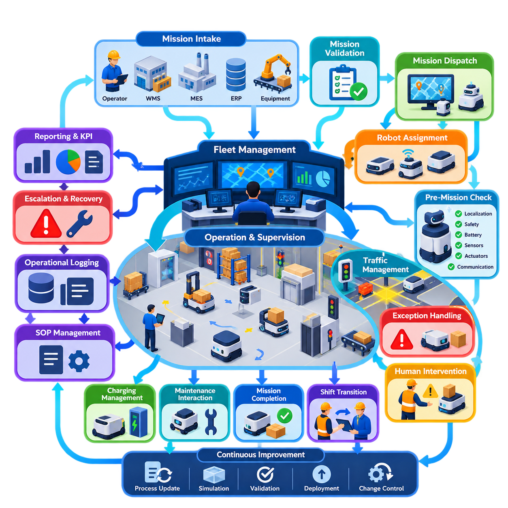
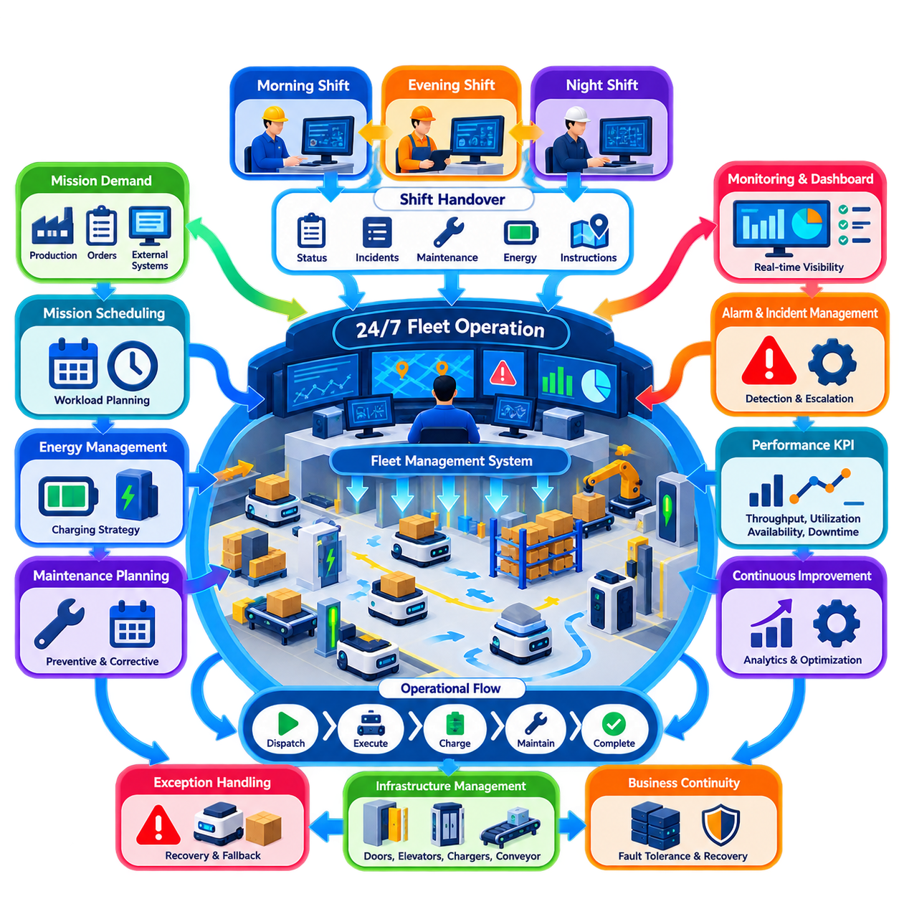
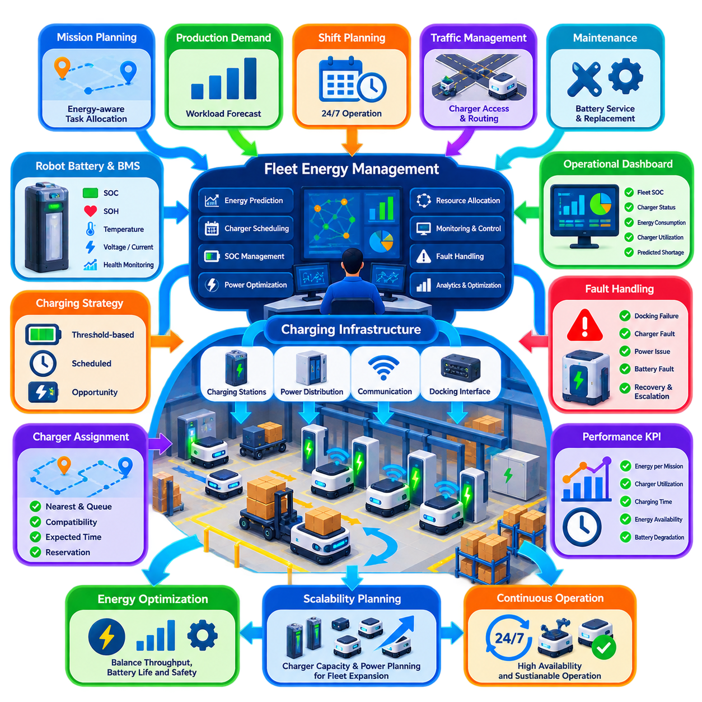
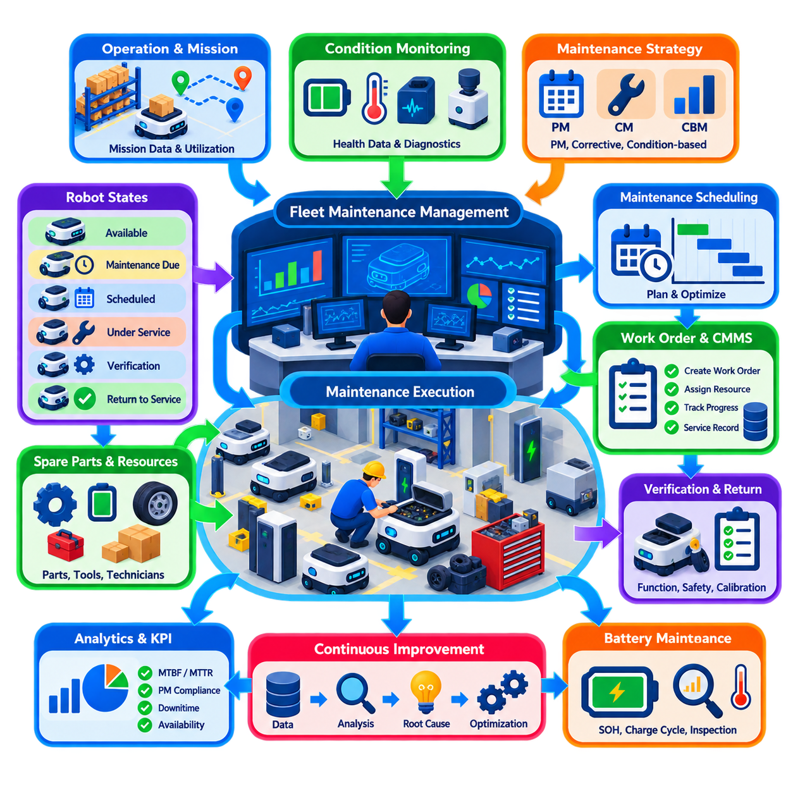
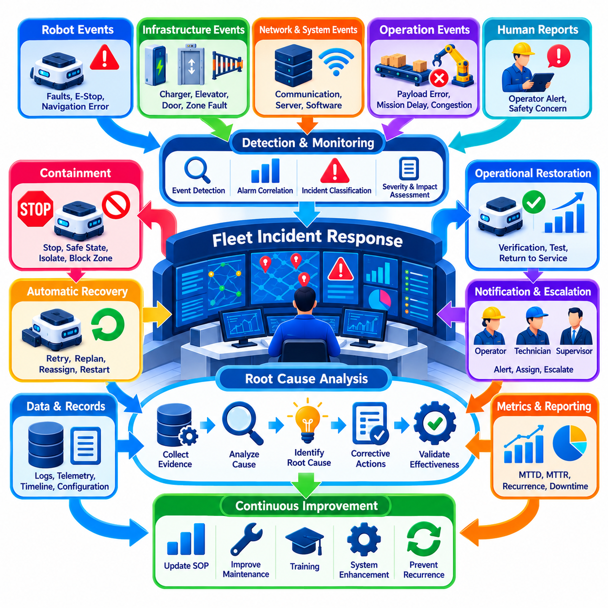
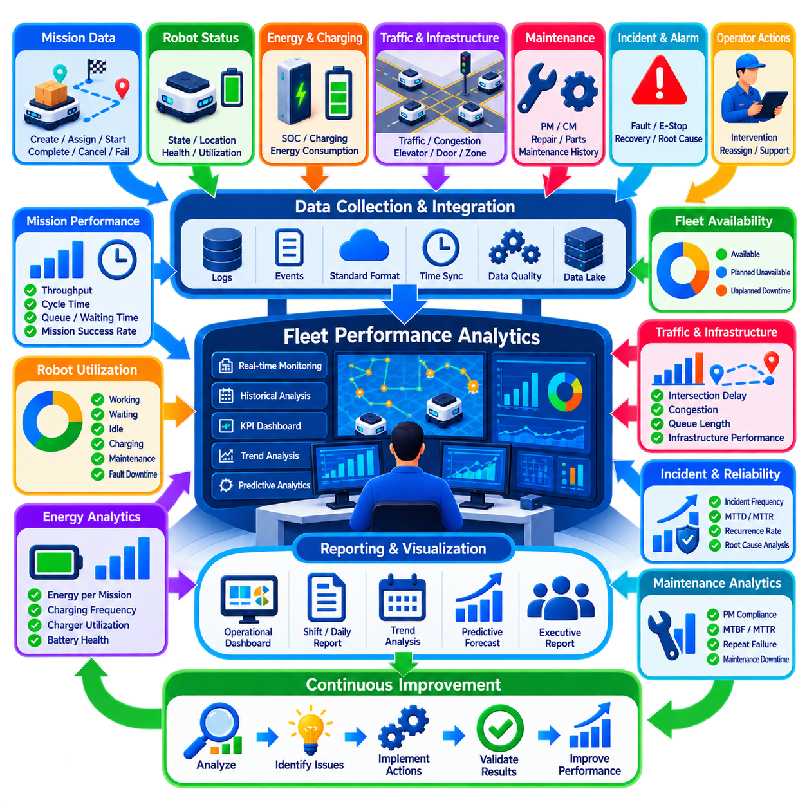
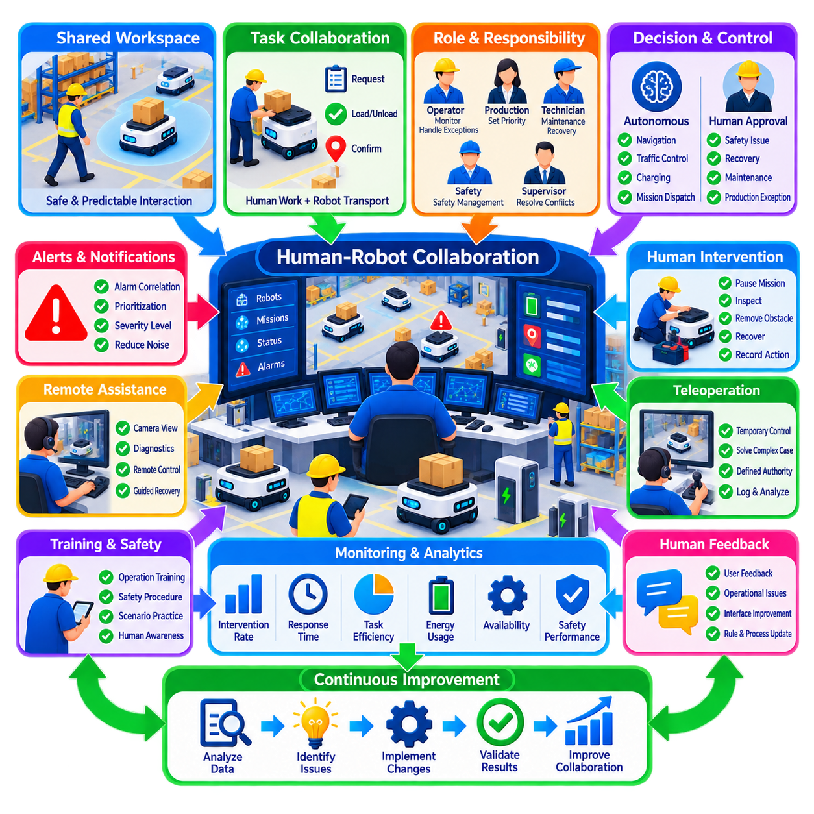
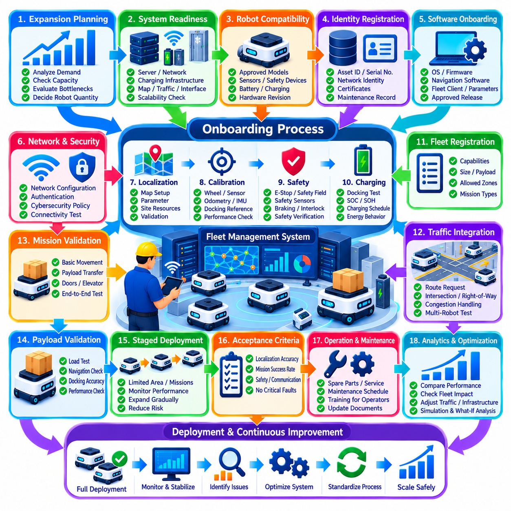
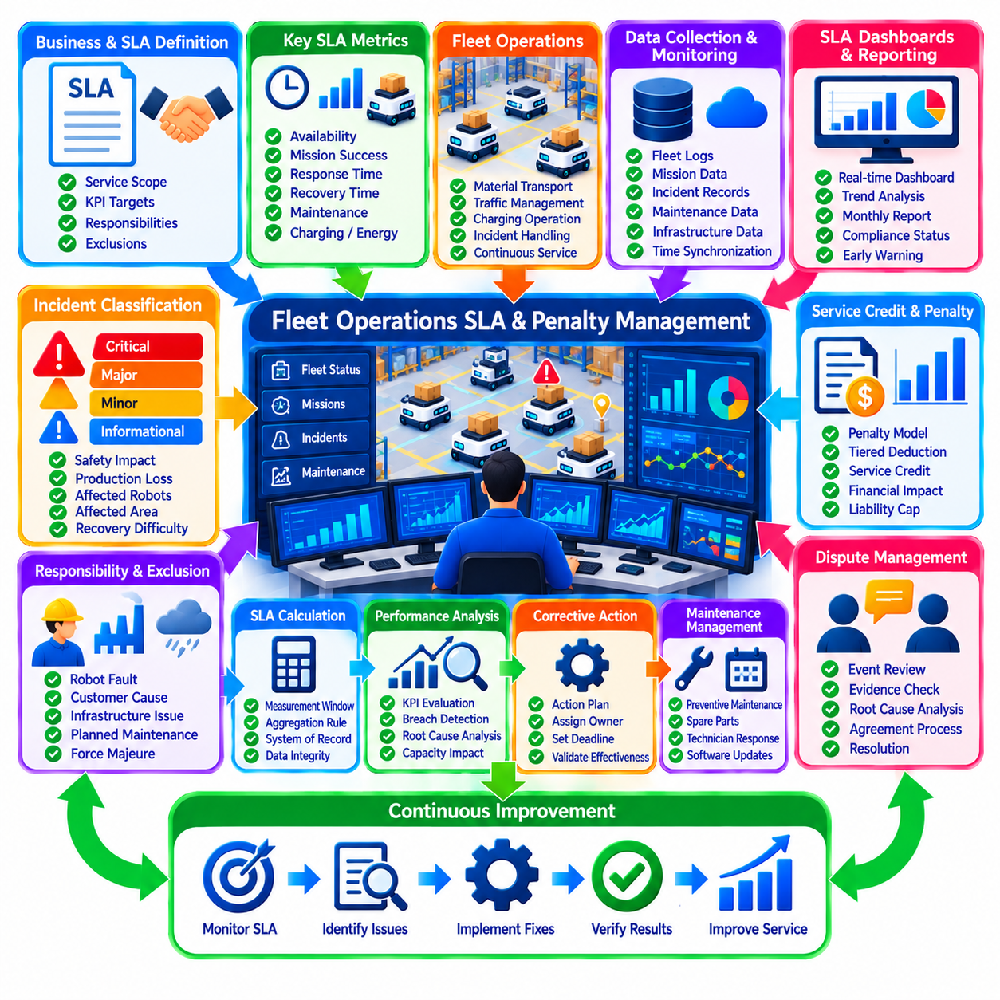
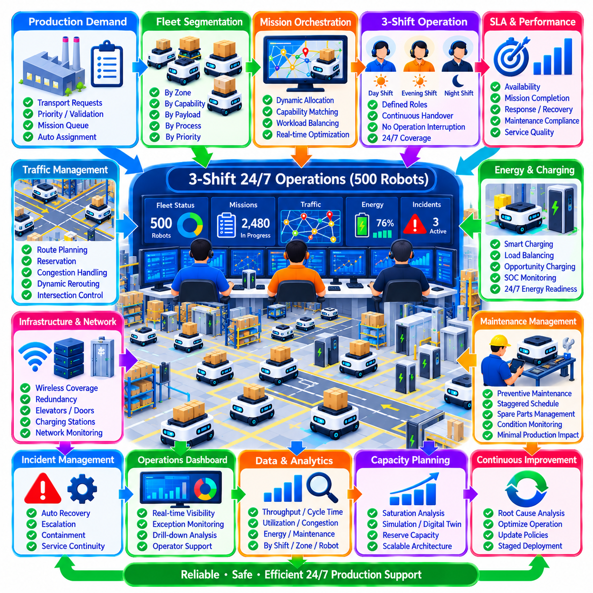

**Volume 16 Multi Robot and Fleet Intelligence**

# 08. Industrial Fleet Operations

## 08.01 Industrial Fleet Operation Processes SOP Design

{width="7.268055555555556in" height="7.268055555555556in"}

Industrial fleet operations transform autonomous robots from individual machines into a dependable production resource. The operating process must define how missions enter the fleet, how robots are assigned, how traffic is coordinated, how exceptions are handled, and how completed work is confirmed. A Standard Operating Procedure, or SOP, converts these activities into repeatable rules that operators, robots, fleet software, and connected production systems can execute consistently.

An effective SOP begins with a clearly defined operational boundary. The organization must specify which robot types, work zones, mission categories, infrastructure interfaces, and human roles are covered by each procedure. In a heterogeneous fleet, different AMRs may have different payloads, sensors, charging requirements, or access permissions. The SOP therefore establishes common fleet-level rules while preserving robot-specific constraints through configuration and capability profiles.

Mission intake is normally the first operational stage. Transportation or service requests may originate from operators, warehouse management systems, manufacturing execution systems, enterprise applications, or automated production equipment. Each request should contain sufficient information to identify the source, destination, priority, payload requirements, timing constraints, and completion criteria. The fleet system validates these parameters before the request becomes an executable mission.

After validation, mission dispatch converts business demand into robot activity. The fleet manager evaluates available robots according to capability, location, battery state, workload, maintenance condition, traffic conditions, and mission priority. Assignment rules should prevent a robot from receiving work that violates physical or operational constraints. Dynamic reassignment may be permitted when conditions change, but the SOP must define when reassignment is safe and how partially completed missions are handled.

Pre-mission readiness checks provide an important barrier against avoidable operational failures. A robot may be considered available only when localization confidence, safety devices, communication status, battery state, sensors, actuators, and required payload interfaces satisfy defined thresholds. Infrastructure dependencies such as automatic doors, elevators, conveyors, docking stations, or production machines should also be verified when they are essential to mission completion.

Once a mission begins, fleet operation becomes a continuous process of execution and supervision. The robot performs local navigation and obstacle avoidance while fleet-level services coordinate shared resources, traffic priorities, restricted zones, and mission sequencing. Operational status should distinguish meaningful states such as assigned, traveling, waiting, docking, loading, unloading, charging, blocked, paused, faulted, and completed rather than representing every robot simply as active or inactive.

Traffic management requires explicit operating rules because locally safe robots can still produce globally inefficient behavior. Intersections, narrow aisles, doors, elevators, loading areas, and shared docking stations can become contention points. Fleet SOPs should define reservation, right-of-way, waiting, priority, timeout, and deadlock-recovery behavior. These rules must remain predictable enough that operators can understand why a robot is waiting and determine whether intervention is necessary.

Exception handling is therefore as important as normal operation. Common exceptions include blocked paths, localization degradation, communication loss, payload problems, docking failures, depleted batteries, unavailable infrastructure, and emergency stops. Each exception should map to a controlled response such as retry, reroute, wait, reassignment, safe stop, operator assistance, or maintenance escalation. Unlimited automatic retries should be avoided because they can hide persistent faults and consume fleet capacity.

Human intervention must have clearly defined authority boundaries. Operators need procedures for pausing robots, releasing traffic zones, recovering missions, moving equipment manually, acknowledging alarms, and returning recovered robots to autonomous service. Manual actions should not silently invalidate fleet state. When an operator changes a robot or mission outside normal automation, the fleet management system should record the action and reconcile the physical condition with its digital operational state.

Charging is integrated into normal fleet operation rather than treated as a separate maintenance activity. Dispatch logic should prevent robots from beginning missions they cannot reliably complete with the available energy reserve. The operating process can use opportunity charging, scheduled charging, or threshold-based charging according to workload characteristics. Charging decisions must also consider charger availability and anticipated demand so that many robots do not become unavailable simultaneously.

Shift transitions require formal state transfer, especially in continuous industrial operations. The incoming team should receive information about fleet availability, active missions, disabled robots, temporary zone restrictions, unresolved alarms, maintenance activities, infrastructure failures, and unusual production conditions. Digital handover records reduce dependence on informal verbal communication and create traceability when an operational problem extends across multiple shifts.

Maintenance interaction should also be represented explicitly within the fleet state model. A robot removed for inspection or preventive maintenance must not remain dispatchable simply because it is connected to the network. The SOP should define transitions from operational service to maintenance isolation, maintenance execution, functional verification, and return to service. This prevents scheduling systems from assigning missions to equipment that is physically unavailable or not yet validated.

Mission completion requires more than reaching a destination. Completion criteria may include successful docking, payload transfer, machine handshake, barcode confirmation, door closure, inspection result, or acknowledgment from an external system. Only after the required conditions are verified should the fleet manager close the mission and report completion upstream. This approach prevents physical execution failures from being hidden behind software-level arrival events.

Operational logging provides the evidence needed for troubleshooting and continuous improvement. Mission transitions, robot states, traffic reservations, alarms, operator actions, charging events, communication failures, and recovery operations should be time-stamped and correlated through persistent identifiers. Logs should allow engineers to reconstruct what happened before an incident without requiring continuous manual observation of the fleet.

SOP design should define escalation according to operational impact rather than treating every alarm equally. A temporary obstacle may require automatic recovery, while repeated localization loss may require technical investigation. A safety-system fault should immediately remove the affected robot from autonomous operation. Escalation paths should identify responsible roles, response expectations, communication channels, and the conditions required before normal service can resume.

Fleet KPIs provide feedback on whether operating procedures are effective. Useful measures include mission throughput, mission completion time, robot utilization, availability, charging occupancy, blocked time, intervention frequency, recovery time, and failure recurrence. Metrics should be interpreted together because optimizing one variable in isolation can degrade the overall system. High utilization, for example, may be undesirable if it produces congestion and reduces total throughput.

SOPs should therefore be treated as controlled operational assets rather than static documents. Every procedure requires ownership, revision history, approval status, deployment date, and change control. Updates to fleet software, maps, robot hardware, production layouts, interfaces, or safety policies may require corresponding SOP revisions. Operators should always be able to determine which procedure version applies to the currently deployed fleet configuration.

Validation should occur before a revised SOP becomes production practice. Normal missions, peak-load conditions, communication interruptions, blocked routes, robot faults, infrastructure failures, emergency responses, and recovery sequences can be tested through simulation, staging environments, or controlled field trials. The objective is not merely to prove successful nominal operation, but to confirm that abnormal situations converge toward safe and understandable states.

At scale, industrial fleet operation becomes a coordinated cyber-physical process involving robots, fleet management, charging infrastructure, production equipment, enterprise systems, maintenance personnel, and human operators. Well-designed SOPs establish the contract connecting these elements. They define who or what makes each decision, which state transitions are permitted, how failures are contained, and how operational truth is communicated across the system.

The ultimate objective is predictable production rather than maximum robot motion. A mature fleet may deliberately keep some robots idle, reserve energy capacity, restrict traffic, or temporarily reduce dispatch rates when those actions protect system-level throughput and resilience. Industrial fleet SOP design therefore turns autonomous mobility into governed operational capability, allowing increasingly large robot populations to function as a measurable, recoverable, and continuously improvable production system.

## 08.02 Fleet Shift Management and 24/7 Operation

{width="7.268055555555556in" height="7.268055555555556in"}

Continuous industrial robot fleet operation requires a management structure that treats time as an operational resource. A fleet expected to operate twenty-four hours a day cannot depend on individual operators, informal knowledge, or daily restart procedures. Shift management must maintain continuity of missions, robot availability, infrastructure status, safety controls, maintenance activities, and production priorities while responsibility transfers between operating teams.

A 24/7 operating model normally divides the day into defined shifts while maintaining one continuous fleet state. Robots and missions should not be restarted merely because personnel change. The fleet management system must preserve active missions, queued work, traffic reservations, charging schedules, alarms, maintenance restrictions, and temporary operating rules across shift boundaries. Human responsibility changes, but the operational state of the automated system remains persistent.

Each shift requires clearly assigned operational roles. A shift supervisor typically maintains overall responsibility for production continuity and major decisions, while fleet operators monitor missions, alarms, congestion, and robot status. Maintenance personnel address hardware or infrastructure faults, and production personnel coordinate changing workload requirements. The exact organization may vary, but responsibility for every operational event must remain identifiable throughout the entire day.

Shift preparation begins before responsibility is formally transferred. The incoming team should review fleet availability, mission backlog, expected production demand, charging conditions, disabled robots, temporary route restrictions, unresolved incidents, and scheduled maintenance. Significant changes in maps, software versions, production layouts, or operating policies must also be communicated. This creates situational awareness before the incoming operators assume control.

The shift handover is a controlled transfer of operational authority rather than a simple exchange of verbal information. Important information should be recorded in a structured digital handover log so that critical conditions are not lost between teams. Active incidents, manually paused robots, degraded sensors, blocked areas, unavailable chargers, abnormal battery behavior, infrastructure problems, and temporary operating instructions require explicit acknowledgment by the incoming shift.

Fleet state should be classified according to operational significance. Robots may be available, assigned, executing, waiting, charging, recovering, maintenance-isolated, or unavailable. Infrastructure such as chargers, elevators, doors, conveyors, and communication networks should have corresponding availability states. A shift supervisor can then determine actual operational capacity instead of relying only on the number of robots that appear connected to the fleet network.

Mission continuity is particularly important during shift changes. A robot already transporting material should normally complete its mission without interruption unless safety or production conditions require otherwise. Mission ownership should therefore belong to the fleet system rather than to an individual operator. When human intervention is necessary, the handover record should identify who initiated the action, why it was required, and what conditions remain before autonomous operation can continue.

Workload changes significantly across a twenty-four-hour period. Production peaks may require maximum fleet availability, while lower-demand periods can provide opportunities for charging, preventive maintenance, software deployment, map verification, or infrastructure inspection. Shift planning should therefore coordinate robot capacity with anticipated demand rather than applying the same dispatch policy continuously. The objective is to preserve sufficient capacity for both current and upcoming workload.

Energy management becomes a fleet-wide scheduling problem in continuous operation. Charging too many robots simultaneously can reduce transport capacity, while delaying charging can create widespread low-battery conditions during peak demand. Fleet operations should distribute charging according to battery state, predicted workload, mission requirements, charger availability, and reserve capacity. Opportunity charging can be especially valuable when short idle periods occur naturally between missions.

Maintenance must also be integrated into shift planning. Robots requiring preventive inspection, cleaning, wheel service, sensor checks, or battery maintenance should be removed from dispatch in a controlled sequence. Maintenance windows should preferably coincide with periods of lower operational demand. Once maintenance is completed, the robot should pass defined functional and safety checks before its state changes from maintenance-isolated to available for autonomous missions.

Night and low-staffing shifts require particular attention because fewer personnel may be available for physical intervention. The fleet should therefore have stronger automatic recovery behavior, clear escalation paths, and predefined rules for situations that cannot safely wait until the next shift. Remote support may supplement local operators, but procedures must distinguish actions that can be performed remotely from those requiring physical inspection or safety verification.

Incident management must remain consistent regardless of shift. Communication loss, localization failure, blocked traffic, payload problems, charging faults, emergency stops, or infrastructure failures should trigger standardized responses rather than operator-dependent improvisation. The operating procedure should define automatic recovery limits, escalation thresholds, responsible personnel, and conditions for removing a robot or zone from service when repeated recovery attempts fail.

A 24/7 fleet must also manage degraded operation rather than assuming that every component is always available. If several robots, chargers, or routes become unavailable, the fleet may continue operating at reduced capacity. The shift supervisor should understand the minimum resources required to sustain critical missions and when nonessential work must be delayed. Graceful degradation allows production to continue safely instead of converting every partial failure into a complete shutdown.

Staffing and automation levels should be designed together. Increasing fleet size does not necessarily require operators to increase proportionally if monitoring, diagnostics, exception classification, and recovery workflows are well automated. However, automation should reduce routine workload rather than obscure operational conditions. Operators need concise information that identifies exceptions requiring attention instead of being overwhelmed by continuous low-value notifications from hundreds of robots.

Alarm management is therefore essential for effective shift operation. Events should be classified by severity, operational impact, and required response time. Informational events may simply be logged, while warnings require observation and critical alarms demand immediate action. Alarm suppression and correlation can prevent repeated messages from one root failure from overwhelming operators, but safety-related events must remain visible and subject to appropriate acknowledgment procedures.

Operational dashboards should present both immediate fleet state and shift-level performance. Operators need visibility into active missions, unavailable robots, blocked areas, charging queues, unresolved alarms, and infrastructure health. Supervisors additionally require throughput, utilization, intervention frequency, downtime, mission delay, recovery time, and backlog trends. These indicators help distinguish isolated robot problems from systemic deterioration affecting the entire fleet.

Shift performance should not be evaluated solely by the number of completed missions. A team could temporarily increase throughput by postponing maintenance, exhausting batteries, or leaving unresolved faults for the next shift. Effective performance measurement must therefore include production output together with fleet health, incident closure, energy readiness, safety compliance, and quality of handover. This discourages optimization of one shift at the expense of subsequent operations.

Data logging provides continuity beyond human memory. Robot state transitions, mission events, alarms, manual interventions, charging sessions, maintenance actions, infrastructure failures, and shift acknowledgments should be timestamped and retained. When an incident develops gradually across several shifts, historical records allow engineers to reconstruct its progression and determine whether earlier warning signs were present but overlooked.

Software and configuration changes require special control in continuous fleets because there may be no convenient global shutdown window. Updates can be deployed progressively to selected robots while the remainder of the fleet continues operating. The shift procedure should identify which robots received a new version, which remain on the previous configuration, what validation has been completed, and how rollback will occur if abnormal behavior appears during production.

Business continuity planning should address events that exceed ordinary robot-level recovery. Network outages, fleet server failures, power interruptions, charger failures, database problems, or facility emergencies can affect many robots simultaneously. Procedures should establish safe robot behavior, degraded operating modes, system restoration priorities, state reconciliation, and controlled restart sequences so that recovery does not create duplicated missions or conflicting commands.

Continuous improvement connects individual shifts into a learning operational organization. Repeated congestion, frequent manual interventions, recurring charging conflicts, or similar faults across multiple shifts indicate that the underlying process requires modification. Shift records and fleet analytics can reveal these patterns, allowing operating rules, layouts, maintenance intervals, dispatch policies, and SOPs to be systematically improved rather than repeatedly treating identical symptoms.

The mature 24/7 fleet therefore operates as a persistent cyber-physical production system rather than a collection of robots supervised separately during each shift. Robots, infrastructure, software, maintenance, production systems, and human teams share one continuously maintained operational state. Effective shift management preserves this state while transferring responsibility, ensuring that automation remains safe, traceable, recoverable, and productive throughout uninterrupted industrial operation.

## 08.03 Charging Infrastructure and Energy Management [w/Code]

{width="7.268055555555556in" height="7.268055555555556in"}

Charging infrastructure is a fundamental operational subsystem of an industrial robot fleet because energy availability directly determines how many robots can perform productive missions at any moment. In large fleets, charging cannot be treated as an isolated battery-maintenance activity. It must be coordinated with task allocation, traffic management, shift planning, maintenance, production demand, and fleet-wide availability to sustain continuous operation.

An industrial charging architecture typically includes robot batteries, onboard battery management systems, charging interfaces, charging stations, power distribution equipment, communication interfaces, and fleet-level energy management software. The fleet management system must understand the operational state of these components so that charging becomes a schedulable resource. A charger should therefore be represented similarly to other shared infrastructure such as elevators or loading stations.

Battery state of charge, commonly represented as SOC, provides the basic indication of remaining energy but is not sufficient for intelligent fleet management. The system should also consider battery state of health, temperature, voltage, current, charging history, estimated remaining runtime, and expected mission consumption. Combining these variables provides a more realistic assessment of whether a robot can safely accept and complete another mission before charging becomes necessary.

Energy-aware mission planning begins before a task is assigned. The fleet manager should estimate the energy required to travel to the pickup location, execute the mission, reach the destination, and retain sufficient reserve energy to reach an available charger afterward. A robot with apparently adequate SOC may therefore be rejected for a mission if the predicted energy margin becomes too small under payload, distance, traffic, environmental, or battery-health conditions.

Charging thresholds commonly define different operational regions rather than one simple recharge point. A robot above a normal operating threshold can remain available for unrestricted dispatch, while a lower SOC may restrict it to shorter missions. Reaching a charging threshold can trigger charger assignment, and a critical threshold can prohibit normal missions entirely. Safety reserve energy should remain available for controlled movement, recovery, or reaching a safe stopping location.

Charging strategies depend strongly on workload patterns. Threshold-based charging sends robots to chargers when SOC falls below a defined level, while scheduled charging uses planned periods of low demand. Opportunity charging uses short idle intervals between missions to replenish energy without removing robots for long charging sessions. Large fleets frequently combine these approaches dynamically according to predicted workload and current fleet energy distribution.

Charger assignment is itself a resource-allocation problem. Selecting the physically nearest charger may not produce the shortest total charging delay if that charger has a queue or lies inside a congested area. The fleet manager should consider travel distance, charger compatibility, queue length, charging power, expected completion time, traffic conditions, and future mission demand. Reservation mechanisms can prevent multiple robots from simultaneously attempting to occupy the same charger.

Charging stations must be integrated into fleet traffic management. Robots approaching, docking with, leaving, or waiting near chargers can create congestion if charging areas are poorly designed. Dedicated approach paths, waiting positions, docking zones, and departure rules reduce conflicts. Charger locations should ideally avoid major intersections and high-throughput transportation corridors while remaining accessible from the operational areas they serve.

Automatic docking requires reliable mechanical, electrical, localization, and communication integration. The robot must accurately approach the charger, establish electrical contact or wireless alignment, verify that charging has begun, and monitor the session for abnormal conditions. Failed docking should trigger a limited recovery sequence such as repositioning and retrying. Repeated failures should escalate to another charger or human intervention instead of producing indefinite retry cycles.

The battery management system provides critical information for safe energy operation. It monitors cell voltage, pack current, temperature, SOC, and protective conditions while controlling charging and discharging limits. Fleet software should consume relevant battery status without replacing safety functions implemented within the battery system. If the battery reports an unsafe temperature, abnormal voltage, or protective fault, mission scheduling must respect the resulting operational restriction.

State of health introduces a long-term dimension to fleet energy management. Two robots reporting the same SOC may have different usable energy because their batteries have aged differently. Historical charging cycles, capacity estimates, internal resistance, temperature exposure, and discharge behavior can reveal degradation. Energy prediction models should therefore be periodically adjusted so that aging batteries do not create increasingly inaccurate mission-range estimates.

Charging infrastructure capacity must be sized according to fleet demand rather than simply assigning one charger to every robot. A fleet can often operate with substantially fewer chargers because robots charge at different times, but insufficient capacity creates queues and reduces availability. Capacity planning should evaluate fleet size, average energy consumption, charger power, charging duration, utilization profile, shift patterns, reserve requirements, and peak production demand.

Electrical infrastructure can become a system-level constraint when many high-power chargers operate simultaneously. The facility must account for total connected load, distribution capacity, circuit protection, thermal conditions, and peak demand. Fleet energy management can reduce power peaks by staggering charging sessions, limiting simultaneous charging power, or prioritizing robots according to operational urgency while maintaining sufficient energy for production.

Dynamic power allocation becomes valuable when chargers or facility power systems support controllable charging rates. Robots needed soon for critical missions may receive higher charging priority, while robots with longer idle windows can charge more slowly. This transforms energy management from a simple charger assignment problem into coordinated optimization of robot availability, electrical demand, battery condition, and expected production workload.

Continuous 24/7 operation requires fleet-level energy reserves. If too many robots approach low SOC simultaneously, the fleet can experience an energy collapse in which transportation capacity falls rapidly as robots leave service for charging. Energy management should therefore monitor the distribution of SOC across the entire fleet rather than only individual robots. Charging decisions should maintain a balanced population of mission-ready, charging, and reserve robots.

Shift planning provides another important input to charging control. Energy can be accumulated before anticipated production peaks, while low-demand periods can be used for longer charging sessions or battery-related maintenance. The handover between shifts should communicate unusual charging conditions, unavailable chargers, battery faults, robots operating with degraded capacity, and temporary energy policies so that energy management remains continuous across personnel changes.

Fault handling must address both robot-side and infrastructure-side charging failures. Possible problems include failed docking, damaged contacts, charger communication loss, overtemperature, abnormal current, power interruption, battery protection events, or charger unavailability. The fleet system should distinguish recoverable faults from conditions requiring isolation and maintenance. A failed charger should immediately be removed from scheduling so that additional robots are not unnecessarily dispatched toward it.

Energy monitoring should be integrated with operational dashboards and fleet analytics. Operators need visibility into robot SOC distribution, active charging sessions, charger occupancy, charging queues, unavailable stations, battery warnings, and predicted energy shortages. Supervisors additionally benefit from metrics such as energy consumed per mission, charger utilization, average charging time, charging-related downtime, peak electrical demand, and battery degradation trends.

Historical fleet data enables predictive energy management. Mission distance, payload, travel speed, waiting time, environmental conditions, and traffic patterns can be correlated with actual energy consumption. Prediction models can then estimate future battery demand more accurately than fixed SOC thresholds alone. Forecasting expected workload also allows the system to begin charging selected robots before demand increases rather than reacting after batteries become depleted.

Energy optimization must not compromise operational safety or battery protection. Aggressive reduction of charging time, excessive discharge depth, or repeated high-power charging may increase short-term availability while accelerating degradation or thermal stress. Fleet policies should therefore balance throughput, battery lifetime, charging efficiency, reserve capacity, and safety. The optimal policy minimizes lifecycle operational cost rather than simply maximizing immediate robot utilization.

Charging infrastructure should also be designed for expansion. Adding robots without increasing charging capacity, electrical supply, network connectivity, or physical docking space can create a hidden scalability bottleneck. Fleet expansion planning should therefore evaluate energy infrastructure together with robot acquisition. Simulation or digital-twin analysis can estimate whether existing chargers and power capacity can support larger fleets under realistic mission and shift profiles.

A mature energy management system ultimately coordinates robot missions and electrical resources as one integrated operational process. Batteries become measurable energy assets, chargers become shared fleet resources, and charging becomes a dynamically scheduled activity rather than an interruption to production. By combining energy prediction, charger scheduling, infrastructure monitoring, battery health, and workload forecasting, industrial fleets can maintain high availability while supporting safe and sustainable 24/7 operation.

## 08.04 Robot Maintenance Scheduling and PM Integration

{width="7.268055555555556in" height="7.268055555555556in"}

Robot maintenance scheduling is a core element of industrial fleet operations because fleet availability depends not only on how robots are dispatched but also on how reliably their mechanical, electrical, sensing, computing, and energy systems remain operational. Maintenance must therefore be treated as part of fleet capacity planning rather than as an external activity performed only after failures occur. Effective scheduling balances production demand, equipment health, service resources, and operational risk.

Maintenance strategies generally combine corrective maintenance with preventive and condition-based approaches. Corrective maintenance responds after a fault has occurred, while preventive maintenance, commonly abbreviated as PM, performs inspections and component service according to predefined intervals. Condition-based maintenance uses measured equipment health to adjust these intervals. Industrial fleets typically require a coordinated combination because not every component exhibits the same degradation pattern or operational consequence.

Preventive maintenance intervals can be defined using calendar time, operating hours, traveled distance, mission count, charging cycles, actuator cycles, or other usage indicators. A wheel assembly may require inspection according to distance traveled, while a battery may be evaluated using charge cycles and state of health. Sensors may require periodic cleaning or calibration, and safety devices may require scheduled functional tests regardless of robot utilization.

The fleet management system should maintain a maintenance state for every robot in addition to normal mission states. Typical states include available, maintenance-due, maintenance-scheduled, maintenance-isolated, under-service, verification, and return-to-service. Once a robot enters maintenance isolation, task allocation must treat it as unavailable even if the robot remains powered and connected. This prevents new missions from being assigned while technicians are working on the equipment.

Maintenance scheduling must account for production workload. Removing many robots simultaneously for PM can reduce fleet capacity below the level required to sustain operations. The scheduler should therefore distribute maintenance windows across shifts and coordinate them with expected demand. Low-demand periods are particularly useful for planned service, but postponement should remain bounded so that production pressure does not indefinitely defer maintenance that protects reliability or safety.

Fleet capacity planning should include a maintenance reserve. If a facility requires ninety robots to satisfy peak demand, operating a fleet of exactly ninety units leaves no capacity for scheduled maintenance or unexpected failures. Spare operational capacity allows selected robots to be removed without interrupting critical missions. The appropriate reserve depends on fleet reliability, repair duration, workload variability, service strategy, and required production availability.

PM integration requires accurate maintenance records. Each robot should have a traceable history containing inspections, repairs, component replacements, firmware or configuration changes, calibration activities, fault codes, technician actions, and return-to-service results. Component-level history is particularly valuable because major subsystems such as batteries, wheels, motors, LiDARs, cameras, computers, and safety sensors can have different replacement dates and lifecycle characteristics.

Maintenance work orders provide the operational connection between fleet management and maintenance management. When a PM threshold approaches, the system can create or request a work order containing robot identity, required tasks, due criteria, current operating hours, relevant health information, and recommended service window. Integration with a computerized maintenance management system or enterprise asset management platform allows robot service to follow the same controlled processes used for other industrial assets.

Maintenance priority should reflect both technical condition and operational criticality. A minor cosmetic issue may wait for a convenient service window, while degradation of steering, braking, safety sensing, battery protection, or localization hardware may require immediate removal from service. Priority rules should therefore combine fault severity, remaining useful life, safety impact, mission criticality, redundancy, and the availability of replacement robots.

Condition monitoring can make maintenance scheduling more responsive than fixed intervals alone. Motor current, temperature, vibration, battery behavior, wheel slip, localization quality, sensor contamination, communication errors, and computing health can reveal emerging degradation. Trends are often more informative than individual measurements because gradual changes can indicate wear before a hard fault occurs. Fleet analytics can convert these trends into maintenance recommendations.

Predictive maintenance extends condition monitoring by estimating future failure risk or remaining useful life. Historical telemetry, fault records, maintenance outcomes, and operating conditions can be used to identify patterns associated with component degradation. Predictions should support maintenance decisions rather than automatically override safety requirements. A component with an acceptable predicted lifetime may still require mandatory inspection if specified by the approved maintenance procedure.

Maintenance scheduling also requires coordination of technicians, tools, spare parts, and service bays. A robot arriving for maintenance provides little operational benefit if the required replacement component or qualified technician is unavailable. The scheduling process should therefore confirm resource readiness before removing equipment from productive service whenever possible. This reduces maintenance waiting time and improves the effective availability of the fleet.

Physical movement into and out of maintenance areas must be controlled. A robot scheduled for service may finish its current mission, travel autonomously to a designated maintenance staging area, and then transition into a non-dispatchable state. Depending on the service activity, autonomous motion may subsequently be disabled. After work is completed, controlled procedures should return the robot to an area where functional verification can occur without interfering with production traffic.

Return-to-service is a distinct maintenance stage rather than an administrative status change. The robot should complete required inspections, diagnostics, safety checks, localization verification, communication tests, charging checks, and controlled motion tests appropriate to the work performed. Components that were replaced or calibrated may require additional validation. Only after successful verification should the fleet system restore the robot to the available state.

Software and firmware maintenance must be coordinated with physical maintenance because modern robots are cyber-physical assets. A robot receiving hardware service may also require firmware updates, calibration parameters, configuration changes, or software validation. Maintenance records should capture the resulting configuration so that fleet operators know which hardware and software baseline is deployed. Uncontrolled configuration differences can create difficult-to-diagnose fleet behavior.

Battery maintenance deserves special attention because battery degradation directly affects mission range and fleet availability. PM processes can evaluate state of health, charging behavior, temperature history, cell imbalance, connector condition, and abnormal discharge characteristics. Robots with degraded batteries may remain usable for restricted missions, but fleet scheduling should reflect their reduced energy capacity rather than treating all robots as energetically equivalent.

Safety-related maintenance requires stricter governance. Emergency stops, safety LiDARs, bumpers, braking systems, protective fields, warning devices, and other safety functions must be tested according to defined procedures. Failed safety verification should prevent return to autonomous service. Maintenance completion should not be based solely on whether the robot can move; the required safety functions must also operate correctly under the validated configuration.

Maintenance KPIs help determine whether the strategy is improving fleet reliability. Useful indicators include planned versus unplanned maintenance ratio, PM compliance, mean time between failures, mean time to repair, maintenance-related downtime, repeat failure rate, spare-part consumption, and return-to-service success. These metrics should be analyzed together with fleet availability and production throughput so that maintenance effectiveness is evaluated from an operational perspective.

Repeated failures after maintenance require root-cause investigation rather than repeated component replacement. A motor failure may result from excessive payload, alignment problems, thermal conditions, control parameters, or environmental contamination rather than the motor itself. Linking mission history, telemetry, maintenance records, and failure events allows engineering teams to distinguish component defects from systemic operational causes and improve the maintenance program accordingly.

Large fleets benefit from maintenance load balancing. If many robots entered service at the same time, fixed PM intervals can cause large groups to become due simultaneously. Maintenance schedules can be staggered within allowable limits to distribute workload across technicians and service facilities. This prevents maintenance peaks from creating temporary fleet shortages and enables more stable spare-parts consumption and labor planning.

Digital twins and simulation can further support maintenance planning by evaluating the operational consequences of removing robots from service. Before scheduling a major maintenance campaign, planners can estimate whether remaining robots can satisfy mission demand and identify shifts with sufficient capacity. What-if analysis can compare alternative maintenance sequences, reserve levels, charger availability, and expected failures without experimenting directly on the production fleet.

A mature maintenance process closes the loop between operation, diagnosis, service, and engineering improvement. Operational telemetry identifies degradation, scheduling selects an appropriate service window, maintenance restores the asset, verification confirms readiness, and subsequent operation provides evidence about whether the intervention was effective. This continuous feedback transforms PM from a calendar-driven checklist into an integrated fleet reliability process.

Ultimately, maintenance scheduling and PM integration protect the productive capacity of the entire fleet. Robots are deliberately removed from service before manageable degradation becomes disruptive failure, while maintenance timing is coordinated to preserve production continuity. By integrating health data, work orders, maintenance resources, fleet scheduling, validation, and lifecycle records, industrial fleets can achieve higher availability, safer operation, predictable maintenance demand, and sustainable 24/7 performance.

## 08.05 Fleet Incident Response and Root Cause Analysis

{width="7.268055555555556in" height="7.268055555555556in"}

Fleet incident response is the disciplined process of detecting abnormal events, protecting people and equipment, restoring operations, and learning from failures across an industrial robot fleet. An incident may involve one robot, shared infrastructure, communication networks, fleet software, or several interacting systems. Effective response therefore requires fleet-level coordination rather than treating every event as an isolated robot fault.

An incident begins when monitored behavior deviates from expected operational conditions. Examples include localization loss, repeated navigation failure, unexpected emergency stops, communication interruption, payload transfer failure, charging faults, excessive congestion, sensor degradation, or abnormal mission delays. Detection may originate from robot diagnostics, fleet monitoring, infrastructure systems, operators, or automated anomaly-detection functions.

Incident classification establishes the urgency and scope of the response. Minor events may temporarily reduce performance without threatening safety or production, while major incidents can disable critical routes or multiple robots. Safety-critical events require immediate protective action. Classification should consider personnel risk, equipment damage, production impact, affected fleet size, recoverability, recurrence, and whether the event can propagate to other robots or infrastructure.

The first response objective is containment rather than immediate diagnosis. Affected robots may need to stop, enter a safe state, release or retain traffic reservations, or be isolated from further dispatch. If an infrastructure component is involved, the corresponding zone, charger, elevator, door, or interface may also need to be removed from service. Containment prevents a local abnormal condition from becoming a fleet-wide operational disruption.

Fleet-level containment requires awareness of dependencies. Closing a narrow corridor may force many robots onto alternative routes, while disabling an elevator may disconnect entire operating areas. The fleet manager should therefore recalculate mission feasibility after containment actions and determine whether tasks must be rerouted, delayed, reassigned, or canceled. Critical production missions may receive priority while nonessential work is temporarily suspended.

Operators require clear incident information rather than an uncontrolled stream of alarms. The monitoring system should correlate related events and present the probable affected robot, location, subsystem, mission, severity, and time sequence. A single communication failure, for example, may generate many secondary mission and navigation alarms. Alarm correlation helps operators identify the primary event instead of responding independently to every symptom.

Incident response procedures should define escalation thresholds and authority. Some events can be resolved automatically through retry, replanning, localization recovery, or reassignment. Others require a fleet operator, maintenance technician, safety responsible person, IT engineer, or production supervisor. The procedure must identify when automated recovery should stop and when responsibility must transfer to a human role with appropriate decision authority.

Automatic recovery should be bounded and observable. A robot may retry docking, re-establish communication, select another route, or restart a non-safety service within approved limits. Repeated unsuccessful recovery attempts should increase incident severity rather than continue indefinitely. The fleet system should record each attempt so that operators can distinguish a newly detected failure from a robot that has already failed the same recovery sequence multiple times.

Safe recovery requires verification of the physical state before normal missions resume. A software restart may clear an alarm without correcting a displaced payload, contaminated sensor, damaged wheel, blocked path, or unsafe environment. Depending on the incident, recovery may therefore require remote diagnostics, camera inspection, physical inspection, functional testing, or maintenance. Clearing an alarm should never automatically imply that the underlying condition has disappeared.

Operational restoration can be performed progressively. A recovered robot may first enter a verification state, complete localization checks, safety diagnostics, communication tests, controlled motion, or a short validation mission before returning to unrestricted dispatch. Similarly, an affected zone can be reopened gradually. Progressive restoration reduces the probability that incomplete recovery immediately reintroduces the same failure into production.

Incident logging must preserve sufficient evidence for later analysis. Relevant information includes timestamps, robot and mission identifiers, software versions, map versions, battery status, localization confidence, sensor health, network state, traffic reservations, operator actions, fault codes, and recovery attempts. High-value telemetry surrounding the event should be retained so that engineers can reconstruct conditions before, during, and after the incident.

Time synchronization is especially important for root cause analysis in distributed fleets. Robot logs, fleet servers, network equipment, chargers, production systems, and infrastructure controllers may each record part of the same event. If their clocks are inconsistent, the apparent sequence of events can be misleading. Reliable time synchronization allows evidence from multiple systems to be aligned into one chronological incident timeline.

Root cause analysis begins after the immediate operational risk is controlled. Its objective is to determine why the incident occurred rather than merely identifying which alarm appeared first. A navigation failure may result from sensor contamination, map inconsistency, localization software, environmental change, network delay, wheel slip, or an interaction among several factors. The visible fault is therefore not necessarily the root cause.

A useful analysis separates symptoms, contributing factors, and root causes. Repeated emergency stops may be the symptom, congestion near a narrow doorway may be a contributing factor, and an incorrect traffic reservation policy may be the underlying systemic cause. This distinction prevents organizations from repeatedly replacing components or resetting robots while leaving the process, configuration, or architectural weakness unchanged.

Structured methods such as the Five Whys, fault-tree analysis, event-sequence analysis, and cause-and-effect analysis can support investigation. The selected method should match incident complexity rather than becoming a documentation exercise. Simple failures may require only a short causal chain, while fleet-wide incidents involving software, infrastructure, communication, and human decisions may require a detailed timeline and multiple interacting causal branches.

Evidence-based analysis is essential. Engineers should compare hypotheses against logs, telemetry, configuration history, maintenance records, mission history, and physical inspection results. Assumptions should be clearly separated from verified facts. When evidence is incomplete, the investigation should document uncertainty rather than forcing a convenient explanation. Reproduction through simulation, test environments, or controlled field trials can provide additional evidence.

Configuration changes deserve particular attention because fleet incidents can emerge after software updates, map modifications, parameter changes, network reconfiguration, or infrastructure maintenance. The investigation should determine what changed before the event and whether affected robots shared a common version or configuration. Comparing failed robots with unaffected units can help isolate variables associated with the incident.

Human actions should be analyzed as part of the operating system rather than treated automatically as individual error. If an operator selected an incorrect recovery action, investigators should examine interface design, alarm clarity, training, workload, procedures, and available information. Root cause analysis should identify conditions that made the error possible and improve the system so that similar mistakes become less likely.

Corrective actions must address the identified causes at the appropriate level. Actions may include component replacement, sensor cleaning, software correction, parameter modification, map updates, traffic-rule changes, maintenance revisions, operator training, infrastructure redesign, or additional monitoring. Each action should have an owner, implementation status, validation method, and completion criteria so that the investigation produces measurable operational change.

Corrective action validation closes the technical investigation. After a modification is implemented, the organization should confirm that the original failure no longer occurs and that the change has not introduced new operational problems. Simulation, regression testing, staged deployment, monitored production operation, or targeted field testing may be used depending on risk. High-impact changes should be introduced progressively with rollback capability.

Fleet-wide applicability must also be evaluated. A failure discovered on one robot may indicate a design, software, maintenance, or configuration weakness affecting hundreds of similar units. Incident response should therefore determine whether other robots require inspection, software updates, parameter corrections, or temporary operating restrictions. This converts local incident handling into proactive fleet risk reduction.

Incident metrics provide insight into operational maturity. Useful measures include incident frequency, severity distribution, mean time to detect, mean time to acknowledge, mean time to recover, recurrence rate, affected mission count, and production downtime. Trends are more valuable than isolated values because declining recovery time combined with persistent recurrence may indicate efficient response but inadequate elimination of underlying causes.

Lessons learned should feed directly into fleet operations. Confirmed findings can update SOPs, maintenance intervals, monitoring thresholds, training materials, simulation scenarios, dispatch policies, and system requirements. Significant incidents may also become regression tests so that future software or configuration changes are automatically checked against previously observed failure mechanisms before deployment.

A mature incident-management process forms a closed learning loop from detection through containment, recovery, investigation, correction, validation, and prevention. The objective is not simply to restore robots as quickly as possible, but to preserve evidence and improve the system after each meaningful failure. This approach transforms operational incidents from recurring disruptions into structured inputs for engineering and reliability improvement.

Ultimately, fleet incident response and root cause analysis protect both production continuity and long-term system reliability. Rapid containment limits immediate impact, controlled recovery restores useful capacity, and evidence-driven investigation identifies the mechanisms that produced the failure. By connecting operational response with engineering improvement, an industrial fleet becomes progressively safer, more resilient, and more predictable throughout continuous 24/7 operation.

## 08.06 Fleet Performance Analytics and Reporting [w/Code]

{width="7.268055555555556in" height="7.268055555555556in"}

Fleet performance analytics transforms continuous operational data into measurable evidence about how effectively a robot fleet supports industrial production. Individual robot status alone cannot reveal whether the overall system is productive, resilient, or efficiently utilized. Fleet analytics therefore combines mission, robot, traffic, energy, maintenance, incident, and infrastructure data to evaluate performance at robot, shift, zone, site, and fleet levels.

A reliable analytics process begins with consistent data collection. Fleet management systems should record mission creation, assignment, start, completion, cancellation, waiting, and failure events together with robot state transitions. Battery information, charging sessions, localization quality, traffic reservations, alarms, maintenance activities, operator interventions, and infrastructure states provide additional context required to explain why operational performance changes over time.

Data quality directly affects the credibility of fleet reports. Events should use consistent identifiers, timestamps, state definitions, and measurement units across robots and connected systems. Duplicate events, missing records, inconsistent clocks, or different interpretations of operational states can produce misleading KPIs. Time synchronization and standardized event schemas are therefore foundational requirements for trustworthy fleet-wide analysis.

Mission throughput is one of the most visible operational indicators, but it should not be interpreted independently. Throughput can be measured as completed missions per hour, shift, or day and segmented by mission type, production area, or robot group. Increasing mission counts may indicate improved performance, but the same result could arise from shorter tasks or changing production demand. Context is essential when comparing periods.

Mission cycle time provides another important perspective. It can be decomposed into queue time, assignment delay, travel time, waiting time, docking time, payload handling time, and completion confirmation. This decomposition helps identify where delays actually occur. A high total cycle time may result from robot navigation, but it can also originate from congested intersections, unavailable machines, elevators, operators, or external production processes.

Robot utilization measures how fleet capacity is being used. Useful state categories include productive motion, productive waiting, idle availability, charging, maintenance, blocked time, recovery, and fault downtime. A high utilization percentage is not automatically desirable because operating every robot continuously can increase congestion and eliminate reserve capacity. Analytics should distinguish productive utilization from activity that consumes time without creating production value.

Fleet availability describes the proportion of assets capable of accepting missions when required. Availability can be reduced by maintenance, faults, charging, safety isolation, software problems, or infrastructure dependencies. Reporting should distinguish planned unavailability from unexpected downtime because they require different corrective strategies. A fleet with significant planned maintenance may still be healthy, while frequent unplanned losses can indicate declining reliability.

Traffic analytics reveals system-level effects that are difficult to observe from individual robot logs. Useful measurements include intersection waiting time, blocked duration, route occupancy, queue length, deadlock events, rerouting frequency, and congestion by zone. Heat maps and temporal trends can identify recurring bottlenecks. These findings can support route redesign, traffic-policy changes, infrastructure modifications, or adjustments to fleet size.

Energy analytics connects battery behavior with operational productivity. Reports can include energy consumed per mission, distance per unit of energy, charging frequency, charging duration, charger utilization, SOC distribution, and battery health trends. Comparing energy consumption across payloads, routes, robots, and shifts can reveal abnormal behavior. Increasing energy per mission may indicate mechanical degradation, battery aging, route inefficiency, or changing operational conditions.

Maintenance analytics should connect equipment reliability with production impact. Common indicators include preventive maintenance compliance, planned versus unplanned maintenance, mean time between failures, mean time to repair, repeat failure rate, and maintenance-related downtime. Component-level analysis can identify recurring problems in batteries, wheels, motors, sensors, computers, or communication devices and support more effective preventive or predictive maintenance strategies.

Incident analytics provides insight into fleet resilience. Metrics such as incident frequency, severity, mean time to detect, mean time to acknowledge, mean time to recover, recurrence rate, and affected mission count reveal how effectively abnormal events are controlled. Incident data should also be classified by subsystem and root cause so that organizations can distinguish random isolated failures from recurring systemic weaknesses.

Operator intervention is an important measure of autonomy quality. A fleet may appear productive while requiring frequent manual recovery, mission reassignment, map correction, docking assistance, or traffic intervention. Intervention frequency, intervention duration, reason category, and affected robot should therefore be monitored. Declining intervention rates while throughput remains stable generally indicate that autonomous operation is becoming more mature and scalable.

Infrastructure performance must be included because robots depend on resources beyond themselves. Chargers, automatic doors, elevators, conveyors, docking stations, wireless networks, and production interfaces can become hidden causes of fleet delay. Analytics should measure their availability, response time, queue effects, failure frequency, and contribution to mission delay. This prevents robot performance from being blamed for problems originating elsewhere in the facility.

Shift-level reporting helps identify differences in workload and operating practices. Day, evening, and night shifts may experience different production demand, staffing levels, maintenance activities, charging behavior, and intervention frequency. Comparing shifts can reveal whether performance differences result from external demand or operational procedures. Shift reports should therefore combine production output with fleet health, unresolved incidents, maintenance status, and energy readiness.

Performance baselines are necessary for meaningful comparison. A KPI becomes more useful when current performance can be compared with historical averages, target values, design expectations, or similar operating zones. Baselines should account for changes in fleet size, mission mix, production volume, layout, software versions, and operating hours. Otherwise, apparent improvement or deterioration may simply reflect changing operating conditions.

Dashboards should separate real-time operational awareness from analytical reporting. Operators require immediate visibility into active missions, unavailable robots, congestion, alarms, charging queues, and infrastructure faults. Supervisors need shift and daily performance trends, while engineering teams require deeper historical analysis. Executive reporting should focus on production contribution, availability, reliability, capacity, risk, and major improvement opportunities rather than detailed robot telemetry.

KPI design must avoid encouraging undesirable behavior. If operators are evaluated only on mission throughput, they may postpone maintenance or overuse available robots. If utilization is the primary metric, unnecessary robot movement may appear beneficial. Balanced reporting should combine throughput, cycle time, availability, reliability, energy efficiency, intervention, safety, and maintenance indicators so that local optimization does not degrade overall fleet performance.

Statistical analysis can distinguish normal variability from meaningful performance changes. Moving averages, percentile distributions, control limits, and trend analysis can reveal gradual degradation that simple daily averages may hide. Percentiles are especially useful for mission cycle time because a small number of severe delays may have significant production consequences even when average performance remains acceptable.

Fleet analytics becomes more powerful when data from different domains is correlated. A rise in mission delay may coincide with increasing traffic congestion, reduced charger availability, battery degradation, or software changes. Correlation does not by itself establish causality, but it helps engineers identify relationships that deserve investigation. Combining operational data with incident and maintenance records supports more evidence-based root cause analysis.

Predictive analytics extends reporting from describing past performance toward anticipating future conditions. Historical workload can support mission-demand forecasts, battery data can indicate future charging requirements, and health trends can estimate maintenance needs. Forecasting can also identify periods when fleet capacity may become insufficient. These predictions allow operations teams to act before performance falls below production requirements.

Reports should preserve traceability from high-level KPIs to underlying evidence. A supervisor observing reduced availability should be able to determine which robots, faults, maintenance events, or charging conditions contributed to the change. Drill-down analysis prevents dashboards from becoming collections of unexplained numbers. Each important metric should have a clear definition, data source, calculation method, reporting period, and responsible owner.

Automated reporting improves consistency in continuous operations. Shift summaries, daily reports, weekly reliability reviews, and monthly performance reports can be generated from the same validated data model. Automated distribution reduces manual spreadsheet work and ensures that teams evaluate consistent information. Human interpretation remains necessary, particularly when operational changes or unusual events affect the meaning of the reported values.

Analytics should ultimately produce operational actions rather than merely attractive dashboards. Persistent congestion can lead to route changes, high intervention rates can trigger autonomy improvements, repeated component failures can modify maintenance intervals, and charging bottlenecks can justify infrastructure expansion. Each significant analytical finding should therefore be connected to an improvement action, responsible owner, target outcome, and subsequent verification.

Continuous improvement closes the performance-management loop. After operational changes are implemented, the same analytics framework should determine whether the expected benefit was achieved. Before-and-after comparisons, controlled trials, or staged deployments can measure the effect of revised dispatch policies, maps, software, maintenance procedures, or infrastructure. Unsuccessful changes can be corrected or rolled back using measurable evidence.

A mature fleet analytics system becomes a shared operational intelligence layer connecting robots, operators, maintenance, engineering, production management, and business leadership. It transforms millions of low-level events into understandable indicators of capacity, efficiency, reliability, and risk. By combining real-time monitoring, historical reporting, diagnostic analysis, and prediction, fleet performance analytics enables industrial robot systems to become measurable, scalable, and continuously improvable production assets.

## 08.07 Human Robot Collaboration in Fleet Operations

{width="7.268055555555556in" height="7.268055555555556in"}

Human-robot collaboration in fleet operations defines how people and autonomous robots share responsibilities within a common industrial workflow. The objective is not to remove humans from every operational decision, but to allocate work according to the strengths of each participant. Robots provide repeatable transportation and continuous execution, while people contribute judgment, flexibility, exception handling, supervision, and physical intervention when automation reaches its limits.

Fleet-level collaboration differs from interaction with a single robot because one operator may supervise dozens or hundreds of autonomous machines simultaneously. Human attention therefore becomes a limited fleet resource that must be managed carefully. The fleet management system should automate routine mission execution and present operators primarily with conditions requiring judgment, authorization, recovery, or coordination rather than demanding continuous supervision of normal robot movement.

Clear responsibility boundaries are fundamental to safe collaboration. The system should define which decisions are performed autonomously, which require human approval, and which must remain under direct human control. Normal navigation, traffic coordination, charging, and routine mission assignment can often be automated, while unusual safety conditions, physical recovery, maintenance isolation, production exceptions, or uncertain environmental situations may require human authority.

Operational roles should also be distinguished according to responsibility. Fleet operators monitor missions and exceptions, production personnel define work priorities, maintenance technicians restore equipment, safety personnel manage safety-related conditions, and supervisors resolve broader production conflicts. Role-based access control can ensure that each person can perform only authorized actions, reducing the risk of conflicting commands or inappropriate recovery procedures.

Human-machine interfaces must convert complex fleet behavior into understandable operational information. Operators need to see robot identity, location, mission, state, alarms, traffic conditions, battery status, and relevant infrastructure without being overwhelmed by unnecessary detail. Interfaces should emphasize abnormal conditions and explain why a robot is waiting, stopped, rerouted, charging, or unavailable so that human decisions are based on meaningful context.

Alarm design is especially important when large fleets are supervised by small teams. Hundreds of robots can generate thousands of low-level events, but only a small fraction may require human action. Alarm correlation, prioritization, suppression of redundant messages, and severity classification help preserve operator attention. Safety-critical events must remain highly visible, while informational events can be logged without continuously interrupting the operator.

Collaboration begins before intervention becomes necessary. Production workers may request transport, define destinations, confirm payload readiness, or interact with robots at pickup and delivery stations. The interface should minimize ambiguity by clearly indicating when a robot is approaching, waiting for material, ready for transfer, or authorized to depart. Visual indicators, displays, sounds, or workstation interfaces can communicate these states according to the industrial environment.

Shared workspaces require predictable robot behavior. Workers should be able to understand where robots are likely to travel, when they will yield, and how they respond to obstacles or human presence. Excessively aggressive motion reduces perceived safety, while unnecessarily conservative behavior can damage productivity. Fleet policies should therefore balance speed, separation, right-of-way, waiting behavior, and local traffic rules according to workspace risk and production requirements.

Human intervention should follow controlled procedures rather than improvisation. When a robot becomes blocked or faulted, the operator may pause a mission, establish a safe condition, inspect the situation, move an obstruction, initiate recovery, or request maintenance. The fleet system should record these actions and maintain consistency between the robot\'s physical state and its digital state so that autonomous dispatch does not resume under incorrect assumptions.

Manual movement of robots requires particular care. Physically pushing, towing, or driving a robot can invalidate localization, traffic reservations, mission status, or docking assumptions. Procedures should therefore define when manual movement is permitted and how the robot is re-localized and reconciled with the fleet system afterward. A robot should return to autonomous service only after its physical position and operational state have been verified.

Remote assistance can reduce the need for technicians to travel to every stopped robot. Cameras, diagnostic information, maps, telemetry, and remote control functions may allow an operator to understand an incident and perform approved recovery actions from a control station. However, remote assistance must have defined authority and safety limits. Situations involving uncertain physical conditions or safety functions may still require local inspection.

Teleoperation can serve as a temporary bridge when autonomous navigation cannot safely resolve an unusual situation. It should not become a hidden substitute for inadequate autonomy. Frequent teleoperation at the same location or for the same failure mode indicates a systemic issue requiring engineering improvement. Fleet analytics should therefore record when teleoperation occurs, why it was required, how long it lasted, and whether similar interventions recur.

Trust is an important factor in effective human-robot collaboration. Operators need sufficient confidence that robots will behave predictably, but excessive trust can lead to inadequate supervision during abnormal conditions. Interfaces should communicate uncertainty when localization, perception, communication, or system health becomes degraded. Appropriate transparency allows people to understand both what the automation is doing and when its confidence or capability has become limited.

Explainability improves operational decision making. When a robot stops, operators benefit from information such as blocked route, safety field activation, unavailable destination, low battery, traffic reservation, or localization degradation rather than a generic stopped status. The system does not need to expose every internal algorithm, but it should provide an operational explanation that enables personnel to select the correct next action.

Collaborative fleet operations must also consider human workload. A single operator may handle normal supervision effectively but become overloaded when several incidents occur simultaneously. Fleet systems should prioritize events according to safety and production impact and support escalation to additional personnel when necessary. Workload indicators can help supervisors determine whether staffing, automation, or operating procedures need adjustment during high-demand periods.

Shift changes introduce another collaboration boundary. Incoming personnel must understand active missions, unusual robot behavior, unresolved incidents, temporary restrictions, maintenance conditions, and degraded infrastructure. Structured digital handover reduces dependence on memory and verbal communication. Human collaboration therefore extends not only between people and robots but also between different human teams sharing responsibility for the same continuously operating fleet.

Training should combine robot knowledge with fleet-level operational understanding. Personnel need to know how robots perceive their environment, how traffic management works, what safety systems can and cannot do, how missions are assigned, and how recovery procedures affect other robots. Scenario-based exercises involving blocked routes, communication loss, emergency stops, payload problems, or charging failures can prepare operators for abnormal conditions.

Safety training should emphasize that autonomous capability does not eliminate human responsibility around industrial equipment. Workers need clear procedures for approaching stopped robots, entering restricted areas, using emergency stops, handling payloads, and performing maintenance isolation. Unauthorized attempts to bypass protective functions or manually override safety behavior should be prevented through both technical controls and operating procedures.

Collaboration quality can be measured through operational data. Useful indicators include intervention frequency, response time, recovery duration, teleoperation usage, alarm acknowledgment time, manual mission reassignment, operator workload, and repeated assistance at specific locations. These measures can identify where automation works effectively and where human effort is compensating for weaknesses in navigation, infrastructure, interfaces, or operating rules.

Human feedback is also a valuable source of fleet improvement. Operators frequently observe recurring behaviors that are difficult to detect from numerical KPIs alone, such as confusing robot intentions, inconvenient waiting positions, poor alarm wording, or inefficient interaction sequences. Structured feedback mechanisms can convert these observations into engineering changes, interface improvements, revised traffic rules, or updated standard operating procedures.

As fleet autonomy improves, the human role shifts from direct control toward supervisory control and exception management. Operators spend less time issuing individual commands and more time managing priorities, resolving unusual conditions, monitoring system health, and coordinating production. This transition allows one person to supervise larger fleets, but only when automation, interfaces, diagnostics, and recovery mechanisms are sufficiently mature.

The most effective collaboration architecture therefore keeps humans strategically involved without making them operational bottlenecks. Routine actions are automated, uncertain situations are surfaced with relevant context, safety-critical decisions follow controlled authority, and interventions become traceable data. Human expertise is applied where judgment adds value, while robots handle repetitive execution at scale.

Ultimately, human-robot collaboration in fleet operations is a shared-control system connecting autonomous machines, fleet software, infrastructure, operators, technicians, supervisors, and production workers. Successful collaboration depends on predictable behavior, clear authority, usable interfaces, controlled intervention, appropriate trust, and continuous learning. These principles enable industrial fleets to scale while remaining safe, understandable, resilient, and productive in continuous operation.

## 08.08 Fleet Expansion Onboarding New Robots Process

{width="7.268055555555556in" height="7.268055555555556in"}

Fleet expansion is not simply the act of placing additional robots into an operating facility. Every new robot must become a trusted member of the existing fleet with known hardware, software, safety, communication, localization, energy, and operational characteristics. A structured onboarding process ensures that fleet capacity can increase without introducing configuration inconsistency, traffic instability, safety gaps, or unexpected maintenance burdens.

Expansion planning should begin with a capacity requirement rather than a robot purchase decision. Historical throughput, mission queues, utilization, congestion, charging demand, downtime, and projected production growth should be analyzed to determine whether additional robots are actually required. In some facilities, improving dispatch policies or eliminating traffic bottlenecks may provide more capacity than simply increasing the number of robots operating in the same space.

Before new robots arrive, the fleet architecture should be checked for scalability. Fleet servers, wireless networks, map services, traffic managers, charging infrastructure, elevators, doors, docking stations, maintenance areas, and production interfaces all have practical capacity limits. Adding robots can shift the bottleneck from vehicle availability to shared infrastructure, so expansion should evaluate the complete operating system rather than robot quantity alone.

Robot compatibility must be established before onboarding. The new unit should be checked against approved hardware revisions, sensor configurations, safety devices, battery systems, charging interfaces, computing platforms, network interfaces, and mechanical dimensions. Even robots belonging to the same product family may contain component revisions that affect calibration, maintenance, spare parts, software compatibility, or operational behavior.

Each robot requires a unique digital identity within the fleet. Asset identifiers, network identities, certificates, robot names, serial numbers, hardware revisions, and maintenance records should be registered in controlled systems. Identity must remain consistent across fleet management, maintenance, cybersecurity, analytics, and production platforms so that telemetry, incidents, work orders, and mission histories can always be traced to the correct physical asset.

Software onboarding should use a controlled baseline rather than manually configuring each robot independently. Operating system versions, robot firmware, navigation software, safety-related configuration, fleet clients, communication middleware, maps, parameters, and application packages should correspond to an approved release. Configuration management prevents apparently identical robots from developing subtle differences that later produce difficult-to-reproduce operational failures.

Network onboarding establishes secure and reliable communication with the fleet infrastructure. The robot must receive approved network configuration, authentication credentials, certificates, access permissions, and communication policies. Connectivity should be validated throughout the intended operating area rather than only near the commissioning station. Roaming behavior, latency, packet loss, bandwidth, and recovery after temporary disconnection should be verified under realistic movement conditions.

Cybersecurity controls should be applied before production access is granted. Default passwords, unnecessary services, unused ports, development accounts, and temporary commissioning credentials should be removed or disabled according to policy. The robot should be registered with monitoring and update systems, and its permitted communication paths should follow the principle of least privilege so that fleet expansion does not silently expand the facility\'s attack surface.

Localization commissioning ensures that the new robot can correctly interpret the shared operating environment. Required maps, reference frames, localization parameters, fiducials, reflectors, or other site-specific resources must be installed and validated. Tests should cover representative production areas, narrow passages, open spaces, intersections, docking approaches, and locations where environmental geometry or sensor visibility makes localization more difficult.

Calibration should be completed before fleet performance is compared with existing robots. Wheel parameters, steering geometry, odometry, IMU alignment, LiDAR orientation, cameras, safety sensors, docking references, and payload-related settings may require verification. Small calibration errors can accumulate into navigation, docking, or localization problems, so commissioning should confirm that the new robot behaves within the same accepted tolerance as established fleet members.

Safety commissioning must remain independent from ordinary functional testing. Emergency stops, protective fields, safety LiDARs, bumpers, speed limits, braking behavior, warning devices, safety controllers, and relevant interlocks should be tested according to approved procedures. A robot that can navigate and complete missions is not automatically ready for production. Failed safety verification must prevent progression to autonomous fleet operation.

Charging integration should confirm both physical compatibility and fleet-level energy behavior. The new robot should dock reliably, establish charging correctly, report battery information, respond to charging assignments, and leave the charger according to fleet commands. Battery state of charge, state of health, temperature, charging limits, and expected operating duration should also be validated so that energy scheduling can treat the new unit consistently.

Fleet registration connects the commissioned robot to mission allocation and traffic management. The system should recognize its capabilities, dimensions, payload limits, speed constraints, permitted zones, charging compatibility, and mission types. Capability-based registration becomes especially important in heterogeneous fleets because not every robot can safely or efficiently execute every mission even when all units share the same fleet management environment.

Traffic integration should initially be tested under controlled conditions. The new robot must correctly request routes, respect reservations, yield according to policy, respond to blocked paths, and interact predictably with existing robots. Tests should include intersections, narrow aisles, merging traffic, waiting positions, rerouting, and congestion recovery. A robot that performs well alone may behave differently when operating within dense multi-robot traffic.

Mission validation should progress from simple tests toward representative production workflows. Initial missions can verify basic movement and destination handling before introducing payload transfer, automated doors, elevators, conveyors, docking stations, or production equipment. Complex end-to-end missions should then confirm that all external interfaces work correctly and that mission states remain synchronized between the robot, fleet manager, and production systems.

Payload validation is necessary because vehicle behavior can change significantly under load. Acceleration, braking, steering, localization, energy consumption, docking accuracy, and stopping distance should be evaluated across representative payload conditions. Payload interfaces should also confirm secure loading, presence detection, transfer status, and abnormal-condition handling where applicable. Commissioning only with an empty robot can hide production-relevant performance limitations.

A staged deployment reduces the risk of introducing multiple unverified robots simultaneously. One or a small number of units can first operate in a restricted area or limited mission set while telemetry and operator observations are closely monitored. After stable performance is demonstrated, operational scope can expand progressively. This approach separates onboarding problems from fleet-scale effects and provides opportunities for correction before full deployment.

Acceptance criteria should be defined before commissioning begins. Requirements may include localization accuracy, docking success, mission completion rate, communication reliability, safety verification, charging performance, traffic compliance, recovery behavior, and absence of unresolved critical faults. Objective acceptance criteria prevent production pressure from turning an incomplete commissioning process into an informal approval based only on whether the robot appears to operate.

Operational personnel should be informed whenever fleet composition changes. Operators need to know whether new robots have different capabilities, restrictions, payload limits, maintenance requirements, or recovery procedures. Maintenance teams require updated spare-parts and service information, while production teams may need revised mission rules. Structured communication prevents assumptions based on older fleet configurations from creating operational errors.

Maintenance onboarding should establish the lifecycle record from the first day of service. Initial inspection results, component serial numbers, battery condition, firmware versions, calibration data, warranty information, and preventive maintenance schedules should be recorded. Spare parts, diagnostic tools, service documentation, and technician capability should also be reviewed so that increased fleet size does not create a maintenance support gap after deployment.

Fleet analytics should distinguish newly onboarded robots during the stabilization period. Their mission completion, intervention frequency, energy consumption, localization quality, charging behavior, faults, and traffic delays can be compared with established robots. Significant deviations may reveal commissioning errors, component variation, environmental sensitivity, or software inconsistencies before they become normalized as ordinary fleet behavior.

Expansion can alter system performance even when every new robot functions correctly. Additional vehicles increase route occupancy, intersection demand, charging queues, wireless traffic, and competition for shared infrastructure. Performance should therefore be evaluated again at fleet level after deployment. Throughput should increase as expected without disproportionate growth in congestion, waiting time, intervention, incidents, or energy-related downtime.

If fleet performance deteriorates after expansion, robot count should not automatically be considered the only cause. Traffic policies, route topology, charger placement, task allocation, infrastructure capacity, and production synchronization may require adjustment for the larger operating population. Simulation and digital twins can support what-if analysis before further expansion and identify the point at which additional robots provide diminishing or negative returns.

Standardized onboarding enables repeatable fleet growth across multiple deployment waves. Checklists, configuration templates, automated provisioning, validation scripts, acceptance tests, and digital records reduce dependence on individual commissioning experience. The same process can later support replacement robots, repaired units, hardware revisions, or additional sites, creating a controlled lifecycle path from initial registration through production operation.

The onboarding process should conclude only after technical acceptance and operational stabilization are both achieved. A robot may pass commissioning tests yet reveal issues during realistic production loading. A defined observation period allows the organization to confirm reliability, operator interaction, maintenance readiness, traffic behavior, and production contribution before the unit is treated as a fully established member of the fleet.

Ultimately, fleet expansion is a controlled systems-integration process rather than a simple increase in robot quantity. Successful onboarding connects each new robot to identity, configuration, networking, cybersecurity, localization, safety, charging, traffic, missions, maintenance, analytics, and production workflows. By validating both individual robots and fleet-wide effects, industrial operations can scale from small deployments to large autonomous fleets without sacrificing safety, reliability, manageability, or productivity.

## 08.09 Fleet Operations SLA and Penalty Management

{width="7.268055555555556in" height="7.268055555555556in"}

Service Level Agreements define measurable expectations for how an industrial robot fleet must support production. An SLA converts operational requirements into explicit commitments concerning availability, mission execution, response, recovery, maintenance, and service quality. Without clearly defined service levels, customers and fleet operators may evaluate the same event differently, creating disputes even when the technical condition of the fleet is understood.

Fleet SLAs should be designed around business outcomes rather than robot specifications alone. A robot may satisfy its individual performance specification while the overall material-flow service fails because of congestion, unavailable infrastructure, delayed recovery, or insufficient capacity. SLA design should therefore connect technical fleet behavior with the production service that the customer actually receives.

The service scope must be defined before performance targets are established. The agreement should identify covered robots, operating zones, mission types, infrastructure, interfaces, operating hours, support responsibilities, and excluded conditions. Ambiguous boundaries make penalty management difficult because responsibility for failures involving doors, elevators, conveyors, wireless networks, production equipment, or customer systems may not be clear.

Fleet availability is a common SLA indicator, but its calculation requires precise definitions. The agreement should specify what constitutes available time, unavailable time, planned maintenance, customer-caused downtime, external infrastructure failure, and force majeure conditions. Availability measured over a month can hide severe short-duration production interruptions, so additional indicators may be required for operationally critical environments.

Mission completion performance can measure whether transportation requests are successfully executed within agreed conditions. Metrics may include mission success rate, completion time, pickup response time, delivery time, or percentage of missions completed within a defined service window. Targets should reflect mission distance, payload type, traffic conditions, and external process dependencies rather than assuming that every mission has identical characteristics.

Response-time SLAs define how quickly abnormal conditions are recognized and addressed. Separate targets may be established for incident detection, acknowledgment, remote response, technician dispatch, and arrival at the affected site. These measurements should begin and end at clearly defined events so that response performance can be calculated automatically rather than reconstructed manually after an incident.

Recovery-time commitments describe how quickly service must return after a disruption. Mean time to recover can be useful for trend analysis, but contractual SLAs may require maximum restoration times for specific severity levels. A critical fleet-wide outage should normally have a different recovery target from a single nonessential robot failure when sufficient reserve capacity remains available.

Incident severity classification is essential because not every fault has the same operational consequence. A minor alarm may have no production impact, while a blocked critical route can interrupt an entire manufacturing process. Severity should therefore consider safety, production loss, number of affected robots, affected area, service degradation, recoverability, and the availability of alternative operating paths.

Maintenance commitments can also form part of the SLA. Preventive maintenance completion, scheduled service windows, spare-parts availability, technician response, software maintenance, and corrective repair may be subject to agreed targets. Planned maintenance should be coordinated with production requirements so that necessary reliability work does not unintentionally become an SLA violation.

Energy and charging performance may require service-level management in continuously operating fleets. Insufficient charger availability, poor charging schedules, or unexpected battery degradation can reduce effective fleet capacity even when robots remain technically functional. Agreements may therefore include minimum operational capacity, charger availability, energy readiness, or limits on service degradation caused by energy management.

SLA monitoring requires an authoritative data source. Fleet management systems, robot logs, maintenance platforms, incident systems, infrastructure controllers, and production systems may all contain relevant evidence. The organization should define which system acts as the system of record for each metric. Otherwise, different timestamps or event definitions can produce conflicting calculations during a contractual dispute.

Time synchronization and data integrity are fundamental to credible SLA measurement. Mission creation, robot assignment, failure detection, acknowledgment, recovery, and service restoration may be recorded by different systems. Consistent timestamps allow these events to be reconstructed accurately. SLA evidence should also be retained according to an agreed period so that historical performance and disputed events can be reviewed.

Dashboards can provide continuous visibility into current SLA status. Operators may monitor immediate risks such as unavailable robots, delayed missions, unresolved critical incidents, and capacity degradation. Managers can review daily or weekly trends, while contractual reports can summarize monthly compliance. Early-warning indicators are particularly useful because they allow corrective action before a service-level threshold is actually breached.

SLA targets should include measurement windows and aggregation rules. A target of 99.5 percent availability has different operational meaning when calculated per robot, per site, per production zone, or across the complete fleet. Similarly, averaging performance across many robots can conceal failure of a critical subset. The calculation method should therefore match the production dependency that the SLA is intended to protect.

Service credits and penalties provide financial consequences when agreed performance is not achieved. Penalties may be calculated as fixed amounts, percentages of service fees, tiered deductions, or credits linked to the degree and duration of the breach. The mechanism should be understandable in advance so that both parties can estimate financial exposure from measured operational performance.

Penalty structures should encourage service improvement rather than create disproportionate punishment. A small deviation should not automatically generate the same consequence as a prolonged production-critical outage. Tiered penalty models can associate higher deductions with increasing severity, duration, or repeated violations. Caps may also be established to limit total liability within a defined contractual period.

Repeated SLA breaches deserve different treatment from isolated failures. A single exceptional incident may be resolved through corrective action, while recurring violations indicate a systemic reliability, capacity, maintenance, or operational problem. Agreements can therefore include escalation rules that trigger formal root cause analysis, corrective action plans, management review, or additional improvement obligations after repeated breaches.

Responsibility attribution is central to fair penalty management. A mission delay caused by a robot fault differs from one caused by a customer-blocked aisle, unavailable production equipment, wireless infrastructure outside the provider\'s scope, or an emergency shutdown initiated by the facility. Each SLA event should therefore be classified according to cause and contractual responsibility before penalties are calculated.

Exclusions must be explicit and evidence based. Planned shutdowns, approved maintenance windows, customer-requested operational changes, unsafe environmental conditions, external utility failures, or events outside the agreed service boundary may be excluded from SLA calculations. Exclusion rules should not become a mechanism for hiding poor performance, so every excluded interval should have a traceable reason and supporting evidence.

Dispute management should be designed into the SLA process rather than handled informally after disagreement occurs. Both parties should have access to agreed performance records, event timelines, classifications, and calculation rules. A defined review process can address disputed downtime, severity, responsibility, or exclusions. Transparent evidence reduces the likelihood that technical incidents become prolonged commercial conflicts.

SLA reporting should connect high-level compliance values with underlying operational evidence. A monthly report may show availability, mission performance, response, recovery, incidents, maintenance compliance, exclusions, and penalties. Significant breaches should be traceable to individual events and corrective actions. This allows management to understand not only whether the SLA was missed, but also why it was missed.

Root cause analysis should follow major or repeated service-level failures. The objective is not merely to determine whether a penalty applies but to prevent recurrence. Fleet logs, maintenance history, software changes, traffic conditions, infrastructure status, and operator actions can be combined to identify underlying causes. Corrective actions should have owners, deadlines, validation criteria, and follow-up measurements.

Capacity planning is closely connected to SLA management. A fleet operating near maximum utilization may satisfy targets during normal demand but fail rapidly when a robot enters maintenance or production volume increases. SLA design should therefore consider reserve capacity, redundancy, charger availability, traffic saturation, and expected demand variation rather than assuming ideal operating conditions.

Service levels may need to evolve as the fleet changes. Expansion, new mission types, layout modifications, software upgrades, infrastructure changes, or production growth can alter achievable performance. Periodic SLA reviews allow targets and calculation rules to remain aligned with actual operating conditions. Changes should be controlled so that historical comparisons and contractual accountability remain meaningful.

Automation can reduce the administrative burden of penalty management. Validated event data can automatically calculate availability, mission compliance, response times, exclusions, and preliminary service credits. Automated calculations should remain auditable, allowing responsible personnel to inspect the underlying events and formulas. Human review remains important for complex responsibility attribution and exceptional conditions.

A mature SLA process creates a closed loop between measurement, commercial accountability, and engineering improvement. Operational performance generates SLA metrics, deviations trigger investigation, confirmed breaches produce contractual consequences, and root causes generate corrective actions. Subsequent performance then verifies whether those actions were effective. This prevents SLA management from becoming only a monthly financial calculation.

Ultimately, fleet operations SLA and penalty management establishes a shared definition of acceptable service between fleet providers, operators, and industrial customers. Clear scope, measurable KPIs, trustworthy data, fair exclusions, proportional penalties, traceable responsibility, and structured improvement processes convert technical fleet performance into manageable service commitments. When properly designed, the SLA protects production continuity while encouraging continuous improvement in reliability, responsiveness, capacity, and operational quality.

## 08.10 Large Scale Fleet Ops 3 Shift 500 Robot Case

{width="7.268055555555556in" height="7.268055555555556in"}

Large-scale fleet operation with 500 autonomous robots across three shifts requires a fundamentally different operating model from a small or medium deployment. At this scale, individual robot supervision is no longer practical. The fleet must be managed as a distributed production system in which mission orchestration, traffic control, charging, maintenance, incident response, human supervision, and infrastructure availability operate as coordinated services.

A three-shift model enables continuous 24-hour operation while distributing human responsibility across day, evening, and night teams. Each shift requires defined roles for fleet supervision, production coordination, maintenance response, safety escalation, and infrastructure support. Shift boundaries must not interrupt autonomous operations, so responsibility transfers through structured digital handover while robots continue executing missions and charging schedules.

The 500-robot population should be organized logically rather than treated as one undifferentiated resource pool. Robots can be grouped by operating zone, mission capability, payload class, production process, or service priority. Logical segmentation reduces scheduling complexity and allows local operational problems to be contained. The fleet manager can still coordinate resources globally when capacity must be transferred between zones.

Mission orchestration begins with production demand entering the fleet management system. Transport requests are prioritized, validated, queued, and assigned according to robot capability, location, workload, battery state, traffic conditions, and service requirements. With hundreds of simultaneous missions, static nearest-robot assignment becomes inefficient. Dynamic allocation must continuously reconsider fleet conditions while avoiding excessive reassignment that destabilizes operations.

Traffic management becomes one of the dominant constraints at this scale. Five hundred robots can create substantial interaction at intersections, narrow aisles, docking areas, elevators, charging zones, and production stations. Route planning must therefore consider network-wide congestion rather than shortest distance alone. Reservations, directional rules, dynamic rerouting, queue management, and controlled waiting positions are required to maintain predictable flow.

Fleet throughput does not increase linearly with robot count. As more robots share the same physical space, traffic interactions and infrastructure competition increase until additional vehicles provide little or even negative productivity. Capacity planning must therefore identify saturation points for major corridors, intersections, stations, elevators, and production interfaces. Simulation and digital twins can evaluate these limits before operational policies or fleet size are changed.

Charging must be coordinated as a fleet-level energy process. Sending many robots to chargers simultaneously can remove a large portion of transport capacity and create charging queues. Energy management should distribute charging sessions across shifts, use opportunity charging where appropriate, monitor fleet-wide state-of-charge distribution, and preserve sufficient energy reserve for expected production peaks and abnormal operating conditions.

The three-shift schedule provides opportunities for differentiated energy strategies. High-demand periods may prioritize mission execution and short charging sessions, while lower-demand periods can restore fleet energy more aggressively. Charging policies should nevertheless avoid creating artificial shift boundaries in robot availability. The objective is to maintain a stable population of mission-ready robots throughout the entire 24-hour operating cycle.

Maintenance scheduling must also protect productive capacity. Preventive maintenance for hundreds of robots cannot be allowed to accumulate at the same time, particularly when robots were commissioned in large batches. Maintenance intervals should be staggered within approved limits, and robots should be distributed across planned service windows. Maintenance reserve capacity allows selected units to leave operation without causing immediate production shortages.

A 500-robot fleet requires component-level lifecycle management. Batteries, wheels, motors, sensors, computers, safety devices, and other assemblies may experience different degradation patterns even among identical robots. Maintenance records, telemetry, operating hours, distance, charging cycles, and fault histories should therefore be connected to each physical asset. Condition monitoring can identify degradation before failures become fleet-level disruptions.

Incident management must prioritize containment and service continuity. A single robot failure is normally manageable, but failures involving shared infrastructure can affect dozens of robots simultaneously. Blocked corridors, network outages, unavailable elevators, charging failures, or fleet-server problems require coordinated response. Incident severity should therefore reflect the number of affected robots, production impact, safety consequence, and availability of alternative operating paths.

Automatic recovery is essential because manually resolving every minor exception would overwhelm three-shift operating teams. Robots should be capable of bounded retries, rerouting, localization recovery, mission reassignment, and alternative charger selection where approved. Repeated unsuccessful recovery must trigger escalation. Automation should reduce routine operator workload without hiding persistent problems that require engineering or maintenance intervention.

Human operators should supervise exceptions rather than continuously watch individual robots. Dashboards must aggregate fleet conditions into meaningful information such as mission backlog, unavailable capacity, congestion, energy readiness, critical incidents, maintenance status, and infrastructure health. Operators should be able to drill down from fleet-level indicators to specific robots and events when investigation or intervention becomes necessary.

Shift handover becomes a critical operational control point. The outgoing team should transfer unresolved incidents, degraded robots, unavailable infrastructure, temporary traffic restrictions, maintenance activities, abnormal charging conditions, and production priorities to the incoming team. Digital handover records provide continuity and traceability, preventing important conditions from being lost through informal verbal communication.

Production capacity should be measured using effective fleet capacity rather than the nominal count of 500 robots. Robots under maintenance, charging, fault isolation, verification, or restricted operation do not contribute equally to mission execution. Management should continuously understand how many robots are mission-ready, how many are temporarily unavailable, and whether available capacity can satisfy the forecast workload with an appropriate operational reserve.

Infrastructure redundancy becomes increasingly important as fleet scale grows. A single network component, charger cluster, elevator, gateway, or fleet service should not unnecessarily become a point of failure for hundreds of robots. Critical services may require redundant servers, communication paths, power supplies, and recovery mechanisms. Degraded-mode operation should allow essential production to continue when full functionality cannot immediately be restored.

Network performance must support dense robot communication without becoming an invisible bottleneck. Five hundred robots continuously exchange status, mission, traffic, diagnostic, and localization-related information with fleet services. Wireless coverage, roaming, latency, packet loss, bandwidth, and network segmentation should be monitored across operating zones. Communication problems must be correlated with robot behavior so that network failures are not mistaken for navigation faults.

Fleet software architecture must also scale beyond a single centralized process that handles every decision. Central services can maintain global coordination, while distributed or zone-level functions reduce unnecessary communication and isolate local problems. The architecture should preserve consistent mission and traffic state while preventing failure in one operational area from unnecessarily disrupting the complete 500-robot fleet.

Performance analytics provides the evidence required to manage such a large system. Important indicators include mission throughput, cycle time, queue length, robot utilization, availability, charging behavior, traffic delay, maintenance downtime, incident frequency, operator intervention, and infrastructure performance. Metrics should be analyzed by shift, zone, mission type, robot group, and time period because fleet-wide averages can conceal local degradation.

Congestion analytics deserves particular attention. Heat maps, intersection waiting times, route occupancy, blocked durations, and rerouting frequency can identify locations where the physical layout or traffic policy limits performance. If additional robots repeatedly increase waiting rather than throughput, operational improvement should focus on route topology, dispatch logic, station capacity, or production synchronization rather than simply adding more vehicles.

Three-shift staffing should be based on exception workload and service requirements rather than robot count alone. Mature automation may allow a relatively small team to supervise hundreds of robots during stable operation, but maintenance events, infrastructure failures, or production changes can rapidly increase human workload. Escalation procedures should provide additional technical, safety, IT, or management support when predefined thresholds are exceeded.

Service-level management provides common operational expectations across all three shifts. Availability, mission completion, response time, recovery time, maintenance compliance, and infrastructure readiness can be monitored against defined targets. Consistent measurement prevents each shift from applying different interpretations of acceptable performance and provides objective evidence for operational reviews, customer reporting, and continuous improvement.

Root cause analysis should follow significant or recurring disruptions. With 500 robots, a small systemic defect can generate hundreds of repeated symptoms and large operational losses. Logs, synchronized telemetry, software versions, maintenance records, traffic conditions, and infrastructure events should be correlated to distinguish individual robot faults from common-mode problems. Corrective actions must then be validated across the affected fleet population.

Expansion and configuration management require strict control. Adding robots, modifying maps, changing traffic rules, updating software, or replacing hardware can influence the entire operating system. Changes should therefore use approved baselines, staged deployment, regression testing, rollback capability, and post-deployment monitoring. A configuration inconsistency affecting only a small percentage of 500 robots can still create substantial daily operational disruption.

Continuous improvement should connect analytics directly to operational changes. Persistent congestion can trigger route redesign, repeated interventions can drive autonomy improvements, battery trends can modify charging strategy, and failure patterns can change preventive maintenance intervals. Improvements should be introduced in controlled stages and evaluated using before-and-after performance data rather than relying solely on subjective observations.

Ultimately, a three-shift 500-robot operation functions as an autonomous production infrastructure rather than a collection of individual mobile robots. Reliable operation depends on coordinated mission control, scalable traffic management, energy balancing, maintenance planning, automated recovery, infrastructure resilience, structured human supervision, and evidence-based improvement. When these mechanisms operate as one integrated system, a large fleet can sustain predictable, safe, and efficient 24/7 industrial service.
