**Volume 16 Multi Robot and Fleet Intelligence**

# 09. AI Optimized Fleets

## 09.01 AI Optimization Opportunities in Fleet Management

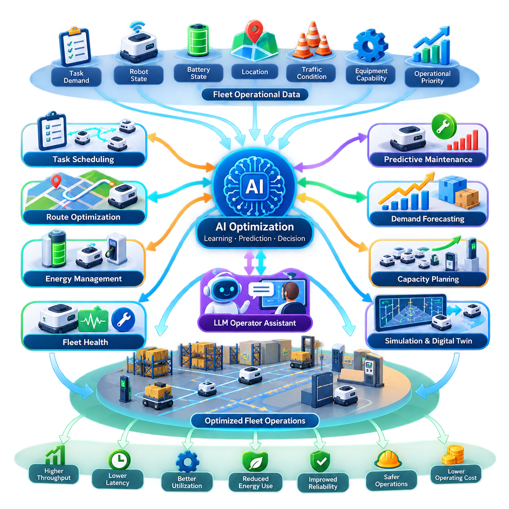{width="7.268055555555556in" height="7.268055555555556in"}

AI optimization in fleet management extends conventional rule-based dispatching by using operational data to continuously improve decisions across the entire robot population. Rather than optimizing each robot independently, an AI-enabled fleet system considers task demand, robot availability, location, battery state, traffic conditions, equipment capabilities, and operational priorities as interconnected variables within a shared decision process.

The opportunity becomes increasingly important as fleets grow from tens to hundreds or thousands of robots. The surrounding architecture already includes task allocation, multi-robot coordination, fleet communication, distributed intelligence, and industrial operations, while AI-optimized fleets introduce learning and predictive decision mechanisms above these capabilities. 08_Robotics_Software_Tree The objective is therefore not simply greater autonomy, but improved fleet-wide performance under changing conditions.

Task scheduling is one of the most direct optimization opportunities. Traditional schedulers commonly apply fixed priorities, nearest-robot selection, queues, or predefined cost functions. AI models can instead estimate the future consequences of an assignment, considering expected travel time, congestion, task deadlines, battery consumption, downstream workload, and robot specialization before committing resources. This enables scheduling decisions to reflect system-level effects rather than immediate local efficiency.

Reinforcement learning provides another mechanism for fleet-wide scheduling because a policy can learn sequential decisions whose consequences emerge over time. A reward function may represent throughput, task lateness, travel distance, energy consumption, congestion, or idle time. The chapter structure therefore progresses naturally from general AI optimization opportunities toward deep reinforcement learning for fleet-wide task scheduling. Volume_16_Multi_Robot_and_Fleet...

Route optimization offers similar opportunities because the shortest geometric route is not necessarily the best operational route. A path may pass through an area predicted to become congested, interfere with higher-priority traffic, or create future contention at elevators, doors, intersections, loading stations, and narrow aisles. AI can combine historical traffic patterns with current fleet states to estimate future congestion and modify route costs before bottlenecks become severe.

Energy management can also move from threshold-based charging toward predictive optimization. Instead of sending every robot to charge when its battery reaches a fixed state-of-charge limit, an intelligent system can estimate future workload, expected energy consumption, charger availability, queue duration, battery condition, and operational priorities. Charging can then be scheduled as part of fleet resource allocation, reducing simultaneous charging peaks while maintaining sufficient operational capacity.

Fleet health represents another high-value AI application. Robots continuously produce telemetry describing motors, batteries, temperatures, controllers, sensors, localization quality, communication performance, and mission execution. Machine-learning models can identify patterns that differ from normal operating behavior and detect gradual degradation before a conventional alarm threshold is crossed. This transforms fleet monitoring from reactive fault reporting toward condition-aware operational management.

Predictive maintenance becomes particularly valuable when health information is connected to scheduling. A robot showing early degradation does not necessarily require immediate removal from service, but the fleet manager may reduce its workload, prevent assignment to critical missions, or schedule maintenance during a low-demand period. AI therefore allows maintenance state to become another optimization variable alongside location, capability, battery condition, workload, and mission priority.

Demand forecasting creates a further optimization layer by estimating future task volumes before orders actually arrive. Historical mission records can reveal temporal, spatial, seasonal, and process-related demand patterns. Forecasts can support proactive robot positioning, charger scheduling, shift planning, and capacity allocation. Instead of reacting after queues form, the fleet can redistribute available resources toward locations where demand is expected to emerge.

Capacity planning applies the same principle over longer horizons. AI models can analyze utilization, queue lengths, mission completion rates, traffic delays, charging demand, downtime, and demand forecasts to estimate whether additional robots or infrastructure are required. Importantly, fleet capacity is not determined only by robot count. Chargers, intersections, elevators, workstations, communication resources, and human interaction points may become limiting resources before the robots themselves.

Simulation provides a safe environment for evaluating these optimization strategies before deployment. Candidate dispatch policies, routing strategies, charging rules, and capacity configurations can be tested against representative workloads and disturbances. Simulation can also generate experience for reinforcement-learning policies and evaluate rare operational conditions that would be expensive or unsafe to reproduce repeatedly in a physical facility. The volume subsequently connects this approach to fleet digital twins and what-if simulation. Volume_16_Multi_Robot_and_Fleet...

AI optimization does not require every decision to be delegated to a learned model. Production fleets generally benefit from hybrid decision architectures in which deterministic safety constraints, traffic rules, resource reservations, and operational policies define permissible behavior while optimization models select among valid alternatives. This separation allows AI to improve efficiency without replacing mechanisms whose behavior must remain predictable, auditable, or safety constrained.

Large language models introduce a different optimization opportunity at the human interface. Rather than directly controlling safety-critical motion, an LLM-based fleet assistant can interpret operational questions, summarize incidents, retrieve maintenance information, explain fleet KPIs, correlate alarms, and help operators investigate abnormal behavior. The source structure explicitly places an LLM-based fleet operator assistant alongside scheduling, routing, battery, health, simulation, and forecasting functions. Volume_16_Multi_Robot_and_Fleet...

Effective AI optimization depends heavily on fleet data quality. Mission timestamps, robot states, route histories, charging events, failures, traffic conditions, intervention records, and maintenance outcomes must be synchronized and represented consistently. Missing events or inconsistent identifiers can cause optimization models to learn misleading relationships. Consequently, telemetry architecture, fleet-state management, communication reliability, and operational data governance become prerequisites for dependable AI optimization.

Optimization objectives must also reflect actual business priorities. Maximizing throughput alone can increase energy consumption, congestion, maintenance burden, or equipment wear, while minimizing travel distance may degrade task responsiveness. Practical fleet intelligence therefore requires multi-objective optimization in which throughput, latency, utilization, energy, reliability, safety constraints, service levels, and operating cost are balanced according to the requirements of the deployment.

AI models themselves introduce operational risks such as distribution shift, unstable policies, prediction errors, and degradation when facility layouts or workloads change. Fleet systems consequently require model monitoring, version control, validation criteria, fallback strategies, and controlled deployment processes. This requirement is reflected in the chapter sequence, which treats AI model governance as an explicit topic rather than assuming that an optimized model can be deployed indefinitely without supervision. Volume_16_Multi_Robot_and_Fleet...

The ultimate opportunity is a transition from a fleet that merely executes commands to one that continuously anticipates operational conditions and allocates resources accordingly. Scheduling, routing, charging, maintenance, anomaly detection, operator assistance, simulation, forecasting, and capacity planning can become interconnected optimization loops. When these functions share reliable fleet state and remain bounded by operational and safety constraints, AI becomes a fleet-level intelligence layer that improves decisions across the complete robotic system.

## 09.02 Deep RL for Fleet Wide Task Scheduling [w/Code]

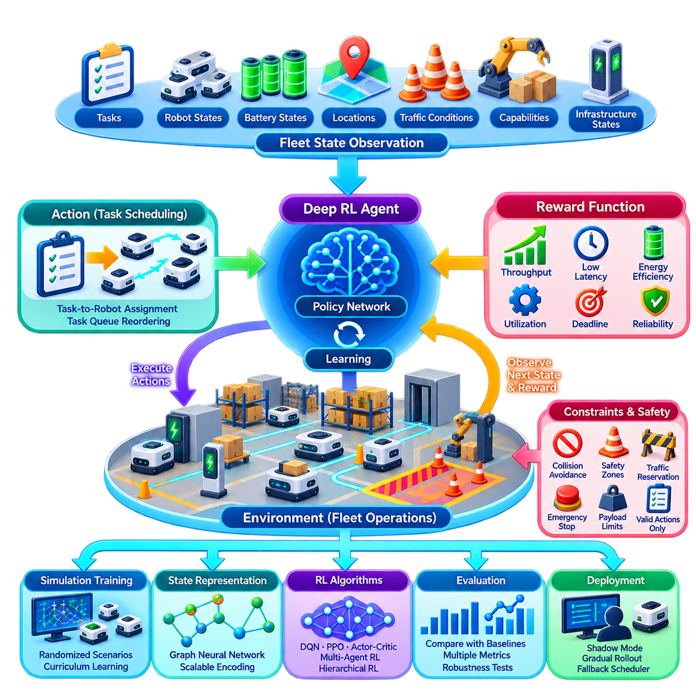{width="7.268055555555556in" height="7.268055555555556in"}

Deep reinforcement learning (Deep RL) provides a framework for fleet-wide task scheduling in which assignment decisions are learned through repeated interaction with a dynamic multi-robot environment. Instead of applying a fixed dispatch rule, the scheduling policy observes the current fleet state, selects task-to-robot assignments, receives operational feedback, and gradually learns decisions that improve long-term fleet performance.

The scheduling problem can be represented as a sequential decision process because each assignment influences later fleet conditions. Sending the nearest robot to a task may appear optimal at the current moment but can create congestion, battery shortages, or poor spatial distribution several minutes later. Deep RL addresses this temporal dependency by optimizing cumulative reward rather than evaluating each assignment as an isolated event.

A fleet scheduling state typically describes active and waiting tasks together with robot positions, availability, battery state, payload capability, current missions, expected completion times, and relevant traffic conditions. Infrastructure states such as charger occupancy, workstation queues, elevator availability, or restricted zones may also be included. The challenge is to encode this large operational state into a representation that a neural policy can process efficiently.

The action space defines the scheduling decisions available to the learning agent. A basic action may assign one waiting task to one available robot, while more advanced formulations can select multiple assignments, reorder task queues, reserve resources, or temporarily defer work. As fleet size increases, the number of possible robot-task combinations grows rapidly, making action-space design one of the central engineering challenges of fleet-wide Deep RL.

Reward design determines what behavior the scheduler learns. Positive rewards can represent completed missions, high throughput, balanced utilization, and on-time delivery, while penalties can represent task delay, excessive travel, congestion, energy consumption, charging queues, or operational conflicts. A useful reward should represent fleet-level objectives rather than encourage individual robots to optimize their own performance at the expense of the overall system.

Multi-objective scheduling is therefore particularly important in industrial fleets. Maximum throughput alone can produce aggressive dispatching that increases traffic or battery consumption, while minimum travel distance can leave urgent tasks waiting. The reward function can combine throughput, latency, utilization, energy efficiency, deadline compliance, reliability, and service-level requirements using weights or constrained optimization mechanisms appropriate to the operational environment.

Value-based methods can be applied when the scheduling action space is sufficiently discrete. A deep Q-network estimates the long-term value associated with candidate scheduling actions and selects actions expected to produce higher cumulative rewards. However, direct enumeration becomes difficult when hundreds of robots and tasks are involved, so practical systems often require action masking, hierarchical decomposition, candidate filtering, or structured representations of feasible assignments.

Policy-gradient and actor-critic methods provide greater flexibility for complex scheduling problems. The actor generates scheduling decisions while the critic estimates their expected long-term value, allowing the policy to improve through repeated simulation experience. Algorithms such as PPO can be useful when stable policy updates are required, although algorithm selection should depend on state representation, action structure, fleet scale, and operational constraints rather than on a single preferred method.

Fleet scheduling can also be formulated as a multi-agent reinforcement learning problem in which robots or local fleet controllers act as interacting agents. Individual agents may optimize local decisions while sharing information or rewards associated with fleet-wide objectives. Centralized training with decentralized execution can exploit global information during training while allowing robots or regional controllers to make decisions with more limited observations during operation.

A hierarchical architecture can reduce complexity further. A high-level policy may allocate tasks among zones, robot groups, or capability classes, while lower-level schedulers determine specific robot assignments. This decomposition is especially useful for heterogeneous fleets containing AMRs, mobile manipulators, towing robots, inspection robots, or other platforms with different capabilities, because the global policy does not need to evaluate every robot-task pair simultaneously.

Graph-based representations are well suited to fleet scheduling because robots, tasks, stations, chargers, and traffic resources naturally form relationships rather than a simple fixed-length vector. Graph neural networks can encode proximity, compatibility, connectivity, and resource dependencies while supporting different numbers of robots and tasks. Such representations can improve scalability and make learned scheduling policies less dependent on a single fixed fleet configuration.

Training should normally occur primarily in simulation rather than through uncontrolled exploration in an operating facility. The simulator can generate task arrivals, traffic patterns, charging events, robot failures, workstation delays, and communication disturbances while the policy explores alternative scheduling strategies. Large numbers of episodes can therefore be collected without interrupting production or exposing physical robots and personnel to unnecessary learning-related risk.

Training scenarios should cover more than nominal operation. Randomized task demand, robot availability, travel time, battery consumption, congestion, temporary resource failures, and processing delays help prevent the policy from memorizing one operating condition. Curriculum learning can begin with smaller fleets and simpler workloads before progressively introducing larger robot populations, heterogeneous capabilities, dynamic traffic, and disturbances.

A critical production requirement is the separation between optimization and safety. Deep RL should not be permitted to bypass collision avoidance, safety zones, traffic reservations, emergency stops, payload restrictions, or other deterministic constraints. Invalid actions can be removed through action masking or rejected by a supervisory layer, allowing the learned scheduler to optimize only within the operational envelope established by verified fleet rules.

Evaluation must compare the learned policy against meaningful scheduling baselines such as nearest-robot dispatch, FIFO, greedy assignment, auction-based allocation, or optimization-based methods. Relevant measurements include throughput, mean and tail task latency, travel distance, robot utilization, energy consumption, charger waiting time, congestion, deadline violations, and recovery under disturbances. Performance should be evaluated across multiple workload levels rather than a single favorable scenario.

Deployment should proceed through controlled stages. A trained policy can first operate in offline replay, then in a digital twin or shadow mode where its recommendations are compared with the production scheduler without controlling robots. After sufficient validation, limited tasks or zones can be enabled under supervision. A deterministic fallback scheduler should remain available whenever model confidence, system state, or operational conditions fall outside validated boundaries.

Deep RL becomes most valuable when scheduling is treated as a continuous fleet optimization loop rather than a one-time assignment algorithm. Operational telemetry provides updated state information, the policy selects feasible assignments, execution produces new fleet conditions, and resulting performance becomes evidence for evaluation and future retraining. In this architecture, learning complements conventional fleet control by providing predictive, adaptive scheduling while deterministic mechanisms preserve safety and operational reliability.

## 09.03 AI Based Route Optimization in Dynamic Environment [w/Code]

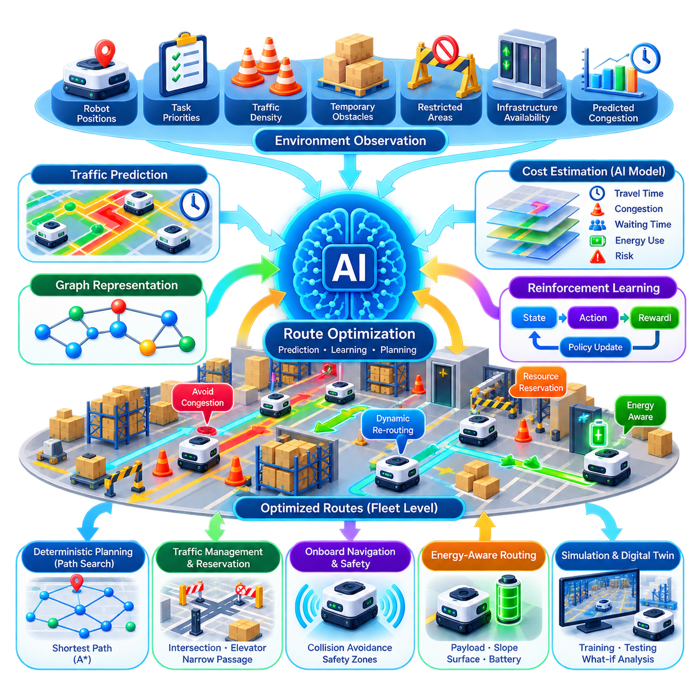{width="7.268055555555556in" height="7.268055555555556in"}

AI-based route optimization in a dynamic environment extends conventional path planning by continuously adapting fleet movement to changing operational conditions. Instead of selecting a route only from geometric distance or a static map, the optimization system considers robot positions, task priorities, traffic density, temporary obstacles, restricted areas, infrastructure availability, and predicted future congestion to determine routes that improve overall fleet performance.

A dynamic environment differs fundamentally from a static planning problem because the cost of a route changes while robots are executing their missions. Human workers may enter aisles, pallets can temporarily block passages, elevators may become unavailable, and other robots can create queues at intersections or workstations. Route optimization must therefore operate as a repeated decision process in which environmental observations continuously update the estimated cost of future movement.

Traditional shortest-path algorithms remain useful as a deterministic planning foundation, but their cost models can be augmented by AI. Instead of assigning each map edge a fixed distance or travel-time value, a learned model can estimate traversal time, congestion probability, waiting time, energy consumption, or operational risk from historical and real-time data. The planner can then search over dynamically predicted costs rather than relying exclusively on static geometry.

The route optimization state may combine topological or metric maps with fleet telemetry. Relevant information includes robot location, velocity, planned trajectory, mission destination, battery condition, payload, nearby traffic, reservation states, and observed obstacles. Infrastructure information such as doors, elevators, charging stations, narrow corridors, loading zones, and human-controlled areas can also influence route selection because these resources introduce time-dependent constraints.

Traffic prediction is particularly important in large robot fleets. A corridor that is currently empty may become congested when several robots scheduled elsewhere begin moving toward the same intersection. Machine-learning models can use recent trajectories, task assignments, historical traffic patterns, and workstation demand to estimate near-future traffic density. The route planner can then redirect selected robots before congestion actually develops instead of reacting only after queues appear.

Route optimization should distinguish individual travel efficiency from fleet-wide efficiency. If every robot independently chooses its shortest route, many robots may converge on the same corridor and collectively create a bottleneck. A fleet-aware optimizer can deliberately assign slightly longer routes to some robots when doing so reduces interference and improves total throughput. This converts routing from an isolated navigation problem into a coordinated resource-allocation problem.

Reinforcement learning can model routing as a sequential decision process in which an agent learns route-selection behavior from operational outcomes. The state describes current and predicted fleet conditions, actions represent route or waypoint choices, and the reward can incorporate travel time, task delay, congestion, energy use, and mission completion. Long-term reward encourages the policy to consider how one routing decision influences later traffic rather than minimizing only immediate distance.

Graph neural networks are suitable for representing dynamic fleet routing because industrial environments can naturally be modeled as graphs. Nodes may represent intersections, workstations, elevators, charging locations, or zones, while edges represent traversable connections. Dynamic features such as occupancy, predicted delay, reservation status, and blockage probability can be attached to nodes and edges, allowing learned models to reason about changing relationships across the transportation network.

Multi-agent approaches become relevant when many robots simultaneously make routing decisions. Each robot may act as an agent with local observations while a centralized or hierarchical component provides shared traffic information and fleet-level objectives. Centralized training with decentralized execution can exploit global fleet information during learning while allowing individual robots to continue operating with local information when communication bandwidth or connectivity is limited.

AI-based routing should normally operate above deterministic local collision avoidance. The optimization layer selects strategic routes, corridors, or waypoints, while onboard navigation handles immediate obstacle avoidance and motion control. This separation is important because an AI-generated route must never override safety scanners, emergency-stop logic, speed limits, protected zones, or verified collision-avoidance mechanisms required for physical robot operation.

Route reservations can further constrain AI decisions in narrow passages and high-contention areas. Before entering an intersection, elevator, doorway, or single-lane corridor, a robot may need authorization from a traffic-management component. AI can optimize when and where reservations should be requested, but the reservation mechanism can remain deterministic. This hybrid structure combines adaptive optimization with predictable mutual exclusion and traffic safety.

Energy-aware routing becomes important when travel cost depends on more than distance. Payload mass, floor slope, surface condition, acceleration frequency, congestion, and battery health can change the energy required to traverse a route. A learned energy model can estimate expected consumption for alternative paths and allow the fleet manager to balance travel time against remaining battery capacity, charging availability, and the robot\'s subsequent mission schedule.

Uncertainty must also be represented because predicted traffic and travel times are never exact. A route that appears optimal according to its average predicted time may be undesirable if its delay variance is extremely high. Risk-aware optimization can therefore consider confidence intervals, blockage probability, or worst-case delay in addition to expected cost. Critical missions may favor predictable routes, while lower-priority missions can tolerate more aggressive optimization.

Simulation and digital twins provide an effective environment for training and evaluating dynamic routing policies. Thousands of traffic situations can be generated by varying task arrivals, robot density, obstacle locations, workstation delays, infrastructure failures, and human activity. Policies can be exposed to severe congestion and rare disturbances without disrupting a production facility, while identical scenarios allow direct comparison between conventional and AI-based routing methods.

Evaluation should measure more than the average travel time of individual robots. Important fleet-level metrics include mission completion time, throughput, queue length, intersection waiting time, total travel distance, energy consumption, congestion duration, deadlock frequency, and deadline compliance. Performance should also be examined as robot density increases because a routing strategy that performs well with twenty robots may behave very differently when hundreds share the same infrastructure.

Production deployment requires continuous monitoring of both predictions and routing outcomes. Predicted travel times can be compared with actual traversal times, while congestion forecasts can be evaluated against observed traffic. Persistent prediction errors may indicate changes in layout, workload, robot behavior, or infrastructure. Such drift should trigger model evaluation or retraining rather than allowing an increasingly inaccurate routing model to remain silently active.

A practical architecture therefore combines AI prediction, optimization, conventional graph planning, deterministic traffic management, and onboard navigation. AI estimates future route costs and identifies advantageous fleet-level decisions, conventional planners maintain reliable path-search capability, and safety mechanisms enforce physical constraints. A fallback route planner should remain available whenever model confidence or operating conditions fall outside validated boundaries.

The resulting system transforms route planning from a reactive shortest-path function into a predictive fleet coordination mechanism. By anticipating congestion, adapting route costs, considering energy and infrastructure constraints, and coordinating decisions across multiple robots, AI-based optimization can reduce unnecessary waiting and improve resource utilization. Its greatest value emerges when adaptive intelligence is integrated with deterministic planning and safety rather than used as an unrestricted replacement for them.

## 09.04 Predictive Battery Management and Charging [w/Code]

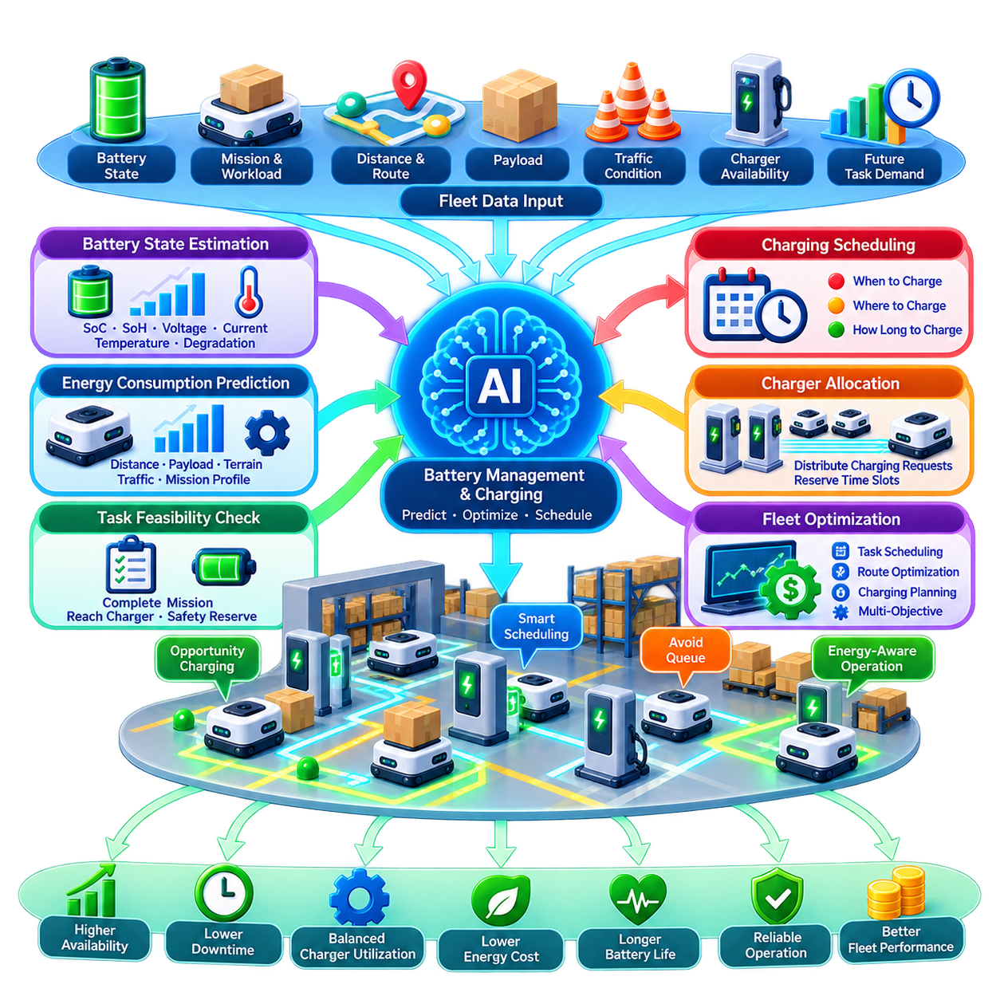{width="7.268055555555556in" height="7.268055555555556in"}

Predictive battery management extends conventional threshold-based charging by estimating how much energy each robot will require before future missions are assigned. Instead of waiting until state of charge reaches a fixed minimum, the fleet system evaluates battery condition, workload, mission distance, payload, traffic, charger availability, and expected idle periods to determine when, where, and how long each robot should charge.

The objective is not simply to keep every battery at a high state of charge. Excessive charging can reduce productive time, create queues at charging stations, increase infrastructure demand, and accelerate battery aging under unfavorable operating conditions. Predictive management therefore treats stored energy, charging capacity, robot availability, and future task demand as interconnected fleet resources that must be optimized together.

Battery state estimation forms the foundation of this process. State of charge, state of health, voltage, current, temperature, charge and discharge history, cycle count, and internal resistance indicators can be combined to characterize the condition of each battery. Because direct measurements contain uncertainty, estimation methods and learned models can refine the usable energy estimate and identify batteries whose behavior is gradually diverging from the fleet population.

Energy consumption prediction estimates how much battery capacity a robot will use during an upcoming mission. Travel distance alone is insufficient because payload mass, acceleration frequency, floor slope, surface resistance, turning, congestion, auxiliary computers, sensors, manipulators, and environmental temperature can alter consumption. Historical telemetry allows a model to learn these relationships and generate mission-specific energy estimates.

Remaining useful energy can then be connected to mission feasibility. Before assigning a task, the fleet scheduler can estimate whether a robot has sufficient energy to complete the mission, reach a charger afterward, and preserve a required safety reserve. This avoids situations in which a robot accepts a task based on its current state of charge but later requires an unplanned charging interruption before completing the operational sequence.

Charging decisions should also consider future task demand. During periods of low predicted workload, robots can opportunistically charge even when their batteries have not reached a conventional low threshold. Conversely, when demand is expected to increase sharply, selected robots may charge earlier so that sufficient fleet capacity is available during the peak period. Charging therefore becomes a predictive scheduling problem rather than a purely reactive maintenance action.

Charger availability introduces an additional resource-allocation problem. If many robots independently decide to charge at similar battery levels, they may arrive at the same charging stations simultaneously and create long queues. A fleet-level optimizer can distribute charging requests across locations and time windows, reserve charger access, and select robots according to urgency, predicted demand, battery condition, and expected charging duration.

The charging schedule can be coordinated with task scheduling so that productive work and energy replenishment are optimized together. A robot finishing a mission near a charger may receive a short charging opportunity before its next assignment, while another robot with sufficient energy continues working. Such opportunity charging can reduce unnecessary travel and make use of naturally occurring idle periods without removing too many robots from service simultaneously.

Route planning and battery management are also strongly coupled. The energy required to reach a task depends on the selected route, while the feasible route may depend on remaining battery capacity. Congestion can increase travel time and energy consumption, and a detour may sometimes provide a more predictable energy profile. An integrated optimizer can therefore evaluate task assignment, route selection, and charging requirements as related decisions rather than separate functions.

Battery aging should be considered alongside short-term operational efficiency. Frequent high-power charging, deep discharge, high temperature, and unfavorable state-of-charge ranges can influence long-term battery degradation. A predictive system can incorporate state-of-health estimates and degradation costs into charging decisions, allowing the fleet operator to balance immediate robot availability against battery lifetime, replacement cost, and long-term reliability.

Machine-learning models can identify abnormal battery behavior before a conventional fault threshold is reached. A battery that charges more slowly, heats more rapidly, exhibits unusual voltage behavior, or consumes energy faster than comparable robots may indicate degradation or an emerging electrical problem. Anomaly detection can flag these patterns and allow maintenance planning before the battery causes mission interruption or unexpected robot downtime.

Fleet-wide optimization becomes especially important when robots have different battery capacities, payload duties, charging rates, or mission profiles. A heterogeneous fleet cannot always use a single state-of-charge threshold or identical charging rule. The optimizer can maintain robot-specific energy models and determine charging strategies according to each platform\'s characteristics while still coordinating all robots against common operational demand and charger constraints.

Forecasting provides the link between battery intelligence and fleet capacity planning. Historical task volumes, shift patterns, production schedules, and seasonal variations can be used to predict future robot demand. The fleet manager can estimate how many robots must remain operational, how many can charge simultaneously, and whether existing charging infrastructure is sufficient for expected workload. This helps prevent charging capacity from becoming a hidden fleet bottleneck.

Simulation and digital twins provide a safe environment for evaluating predictive charging policies. Different battery capacities, charger quantities, charger locations, task loads, traffic conditions, and charging strategies can be tested before physical deployment. Long-duration simulation can also reveal effects that are difficult to observe in short field trials, including repeated charging queues, utilization imbalance, energy shortages, and accumulated battery degradation.

Optimization objectives should reflect operational priorities rather than minimizing a single energy metric. Relevant measures include task throughput, robot availability, charging waiting time, energy consumption, peak electrical demand, missed missions, battery degradation, charger utilization, and maintenance cost. Multi-objective optimization allows the system to trade these factors according to production requirements and service-level constraints.

Safety constraints must remain independent of AI optimization. Battery-management systems, temperature protection, current limits, minimum and maximum voltage thresholds, charger interlocks, emergency shutdown functions, and manufacturer-defined operating limits should remain authoritative. AI may recommend charging timing or resource allocation, but it should not override electrical protection mechanisms or validated battery safety boundaries.

Production deployment requires continuous comparison between predicted and actual battery behavior. Predicted energy consumption should be checked against mission results, predicted charging duration against actual charging time, and state-of-health estimates against maintenance evidence. Persistent errors may indicate battery aging, sensor drift, environmental changes, altered payload patterns, or model degradation and should trigger recalibration or model retraining.

A practical predictive battery architecture therefore connects fleet telemetry, battery-state estimation, energy forecasting, demand prediction, task scheduling, route optimization, charger reservation, and maintenance information. These components form a continuous decision loop in which the system anticipates energy requirements instead of reacting only after batteries become depleted. Deterministic battery protection remains underneath this intelligence layer as the final safety authority.

The resulting fleet can use charging as an active operational resource rather than unavoidable downtime. Robots can charge during advantageous windows, avoid unnecessary charger queues, preserve energy reserves for critical missions, and distribute battery usage more evenly across the fleet. Predictive battery management ultimately improves availability and energy efficiency while supporting longer battery life, more stable fleet capacity, and more reliable continuous operation.

## 09.05 AI Anomaly Detection for Fleet Health Monitor [w/Code]

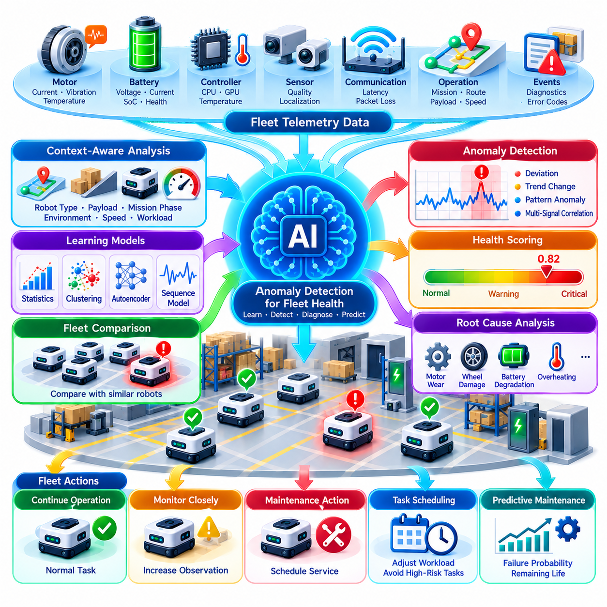{width="7.268055555555556in" height="7.268055555555556in"}

AI-based anomaly detection for fleet health monitoring transforms robot maintenance from threshold-driven fault reporting into continuous condition assessment. Instead of waiting for a motor temperature, battery voltage, communication latency, or controller error to exceed a fixed limit, AI models learn normal operating patterns from fleet telemetry and identify subtle deviations that may indicate degradation, abnormal operation, or an emerging failure.

A fleet health monitor receives heterogeneous data from many subsystems. Typical signals include motor current, torque, temperature, vibration, battery voltage and current, state of charge, controller status, CPU and GPU utilization, sensor quality, localization confidence, network latency, mission duration, charging behavior, and diagnostic events. Combining these signals provides a more complete representation of robot health than evaluating individual measurements independently.

The fundamental challenge is defining normal behavior because operating conditions continuously change. A heavily loaded robot climbing a slope may legitimately consume more current than an unloaded robot on a flat surface, while high computational utilization may be normal during perception-intensive missions. An effective anomaly detector therefore considers operational context such as robot type, payload, mission phase, environment, speed, workload, and historical behavior.

Statistical methods provide a useful baseline for anomaly detection. Moving averages, standard deviations, control limits, correlations, and change-point detection can identify signals that deviate from established distributions. These approaches are computationally efficient and interpretable, but fixed statistical assumptions may become insufficient when robot behavior is nonlinear, highly multidimensional, or strongly dependent on changing operating conditions.

Machine-learning approaches can learn more complex relationships across fleet telemetry. Isolation-based methods, clustering, one-class classifiers, and density estimation can distinguish unusual observations from normal operating regions without requiring examples of every possible failure. This is particularly valuable in robot fleets because actual failure events are relatively rare, while large volumes of normal operational data are continuously generated.

Autoencoders provide another practical unsupervised approach. A neural network is trained to reconstruct telemetry representing normal robot behavior, and observations that produce unusually large reconstruction errors can be treated as potential anomalies. Multivariate autoencoders can capture relationships among temperature, current, vibration, battery behavior, computational load, and mission conditions that would be difficult to represent with independent thresholds.

Temporal information is essential because many failures develop gradually rather than appearing as isolated abnormal samples. Sequence models can analyze telemetry over time and detect changes in trends, periodic patterns, or dependencies between signals. A slowly increasing motor current combined with rising temperature and declining travel efficiency may provide stronger evidence of mechanical degradation than any individual measurement crossing a predefined alarm threshold.

Fleet-scale data enables peer comparison in addition to historical comparison. Robots of the same model performing similar missions can establish a reference population, allowing the system to identify a unit whose energy consumption, temperature, vibration, localization failures, or mission completion time differs consistently from its peers. This relative analysis is useful when absolute measurements remain inside nominal engineering limits but one robot is beginning to degrade.

Anomaly scores should represent severity rather than only a binary normal-or-fault decision. A continuous score can describe how far current behavior differs from an expected operating region, allowing the fleet manager to apply different responses. Low-level deviations may simply be logged, moderate anomalies can trigger closer observation or diagnostic checks, and persistent high-severity anomalies can create maintenance actions or restrict mission assignment.

An anomaly does not automatically identify its root cause. A rise in motor current may result from drivetrain friction, excessive payload, floor conditions, wheel damage, or control problems. The health-monitoring architecture should therefore correlate anomaly evidence across multiple signals and operating contexts before generating diagnostic hypotheses. Combining anomaly detection with event history, maintenance records, and fault codes can improve troubleshooting accuracy.

Health information becomes more valuable when connected to fleet scheduling. A robot showing early degradation may continue performing low-risk missions while being excluded from urgent, long-distance, or high-payload tasks. The scheduler can gradually reduce its workload and reserve a maintenance window during periods of lower demand. This approach converts anomaly detection from a passive monitoring function into an input for fleet-level operational optimization.

Predictive maintenance can build on accumulated anomaly trends. Repeated increases in anomaly score, degradation rate, operating hours, and maintenance history can be used to estimate the probability of failure or remaining useful life. Rather than servicing every robot at identical fixed intervals, maintenance resources can be directed toward robots with stronger evidence of degradation while healthy units remain available for productive work.

False alarms are a major operational concern. An overly sensitive model can generate frequent warnings caused by legitimate workload changes, sensor noise, temporary communication problems, or unusual but safe missions. Excessive alerts reduce operator trust and may overwhelm maintenance personnel. Thresholds, persistence rules, contextual filtering, confidence estimates, and alert aggregation should therefore be designed together with the anomaly model.

Missed anomalies present the opposite risk and may lead to unexpected downtime or unsafe degradation. Evaluation must therefore consider precision, recall, false-positive rate, detection delay, and the operational cost associated with different errors. For critical subsystems, earlier detection may justify a higher false-alarm rate, while lower-criticality components may require stronger evidence before generating maintenance actions.

Fleet health models must also handle heterogeneous robots. Different platforms may use different motors, batteries, sensors, payload systems, or computational hardware, producing telemetry with different normal ranges and dynamics. A practical system can maintain platform-specific models while sharing common representations or fleet-level knowledge where appropriate. Robot configuration and software version should also be recorded because updates can change expected behavior.

Simulation, fault injection, and historical replay can support model development when real failure data is limited. Sensor drift, communication degradation, battery aging, overheating, localization instability, and actuator deterioration can be introduced into controlled test scenarios. These methods do not perfectly reproduce physical failures, but they help evaluate detection sensitivity and system responses before anomaly models influence production fleet operations.

Production monitoring must detect changes in the anomaly detector itself. New payloads, altered routes, seasonal temperature changes, software updates, component replacements, or modified mission patterns can shift the normal data distribution. Model drift monitoring should distinguish genuine equipment degradation from changes in operating context and trigger recalibration or retraining when the learned baseline no longer represents current fleet behavior.

Safety-critical protection should remain independent of learned anomaly detection. Emergency stops, overcurrent protection, thermal shutdown, battery protection, safety scanners, and certified fault responses must continue to operate through deterministic mechanisms. AI anomaly detection provides earlier awareness and richer health interpretation, but it should complement rather than replace hardware protection and validated safety logic.

A practical fleet health architecture therefore connects robot telemetry, contextual data, anomaly models, health scoring, alert management, diagnostic analysis, maintenance systems, and fleet scheduling. Raw signals are converted into health evidence, persistent deviations become actionable alerts, and confirmed degradation influences maintenance and mission allocation. Feedback from inspections and repairs can then improve future detection models.

The resulting system changes fleet health management from reactive failure handling into continuous, data-driven supervision. By identifying weak signals before conventional alarms activate, comparing robots against their own history and their peers, and linking health information to scheduling and maintenance, AI anomaly detection can reduce unexpected downtime, improve maintenance efficiency, and support more reliable operation of large robotic fleets.

## 09.06 LLM Based Fleet Operator Assistant [w/Code]

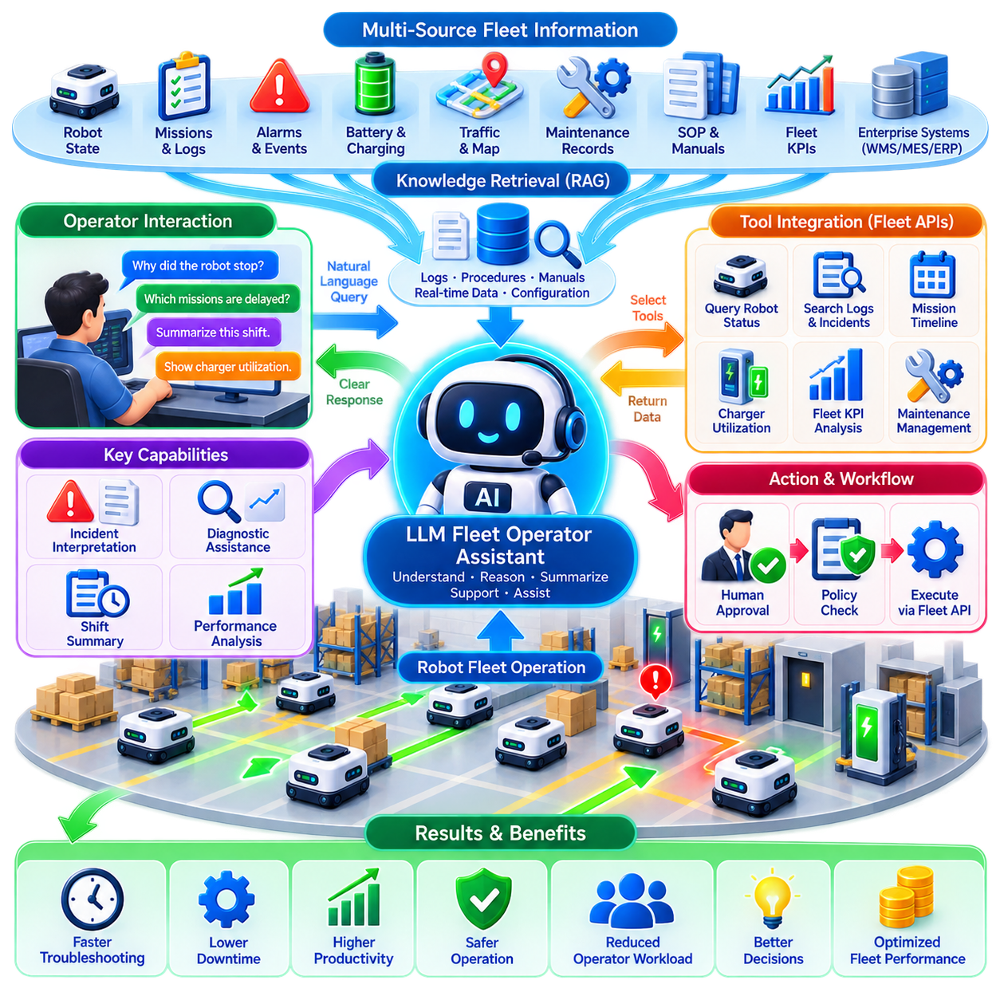{width="7.268055555555556in" height="7.268055555555556in"}

An LLM-based fleet operator assistant provides a natural-language interface between human operators and the increasingly complex data, alarms, missions, and control services of a robot fleet. Rather than forcing operators to navigate multiple dashboards and diagnostic tools, the assistant can interpret questions such as why a robot stopped, which missions are delayed, or what changed during a shift, then organize relevant fleet information into an understandable operational response.

The assistant should be positioned as an intelligence and decision-support layer rather than as an unrestricted robot controller. Fleet management systems already contain deterministic mechanisms for task allocation, traffic management, mission execution, safety, and recovery. The LLM adds semantic interpretation, information retrieval, reasoning support, summarization, and operator interaction while leaving safety-critical motion and verified control functions under authoritative deterministic systems.

Its information environment can include robot state, mission history, alarms, battery telemetry, maintenance records, traffic conditions, charging status, communication diagnostics, maps, operating procedures, and fleet KPIs. Enterprise deployments may additionally connect WMS, MES, ERP, ticketing, and maintenance systems. The assistant must therefore understand relationships across multiple operational domains rather than treating each data source as an isolated database.

Retrieval-augmented generation can ground operator responses in trusted fleet information. Instead of relying only on knowledge embedded in the language model, the assistant retrieves relevant telemetry, procedures, logs, manuals, incident records, and configuration data before producing an answer. This architecture reduces unsupported responses and allows explanations to reference current robot conditions, fleet events, and organization-specific operating procedures.

Tool integration allows the assistant to move beyond passive question answering. Structured interfaces can provide functions for querying robot status, searching incidents, retrieving mission timelines, checking charger utilization, comparing fleet KPIs, or opening maintenance records. The LLM interprets the operator\'s intent and selects appropriate tools, while the underlying services remain responsible for executing validated queries and returning authoritative operational data.

A major application is alarm and incident interpretation. Large fleets can generate numerous simultaneous warnings, many of which are correlated consequences of the same underlying event. The assistant can group related alarms by robot, location, time, or subsystem and construct a concise incident narrative. For example, communication loss, mission timeout, and traffic blockage events may be correlated to help the operator understand the likely sequence rather than examining alerts individually.

Natural-language diagnostic assistance can shorten troubleshooting time. An operator may ask why a particular robot repeatedly fails missions near one workstation, and the assistant can examine mission logs, localization confidence, network quality, traffic events, and previous maintenance history. The resulting response should distinguish observed evidence from hypotheses so that operators understand which conclusions are directly supported by fleet data and which require additional inspection.

Shift handover is another valuable use case because important operational context is often distributed across dashboards, alarms, maintenance notes, and informal communication. The assistant can summarize completed missions, unresolved incidents, robots removed from service, abnormal battery behavior, charging constraints, delayed work, and maintenance actions. This creates a structured operational briefing that helps the next shift understand fleet condition without manually reconstructing the previous several hours.

Fleet performance analysis can also become conversational. Operators can ask which robots had the highest idle time, why throughput declined, where congestion increased, or whether charger waiting time changed after a scheduling update. The assistant can translate these questions into structured data queries, compare relevant time periods, and explain the results in operational language while preserving access to the underlying metrics used to support the conclusion.

An LLM assistant can support standard operating procedures by retrieving the correct procedure for an observed event and presenting the relevant steps in context. If a robot repeatedly reports localization degradation, for example, the assistant can identify the applicable diagnostic procedure and combine it with current telemetry. It should not invent repair instructions when approved procedures are unavailable, particularly for electrical, mechanical, or safety-critical maintenance activities.

Human approval becomes essential when the assistant is connected to actions. Read-only functions such as querying status or summarizing logs can generally be performed with lower risk, while commands that alter missions, disable robots, change priorities, initiate recovery, or modify fleet configuration require stronger controls. High-impact actions should pass through authorization, confirmation, policy checks, and existing fleet-management interfaces rather than being executed directly from unconstrained generated text.

A useful architecture separates conversational reasoning from executable commands. The LLM may determine that a robot should be inspected or removed from demanding assignments, but a structured action layer converts approved intentions into predefined API requests. Parameter validation, access control, robot identity verification, command signing, and execution feedback can then be applied before any operational change reaches the fleet.

Role-based access control should determine what information and actions each user can access. A fleet operator may inspect missions and acknowledge alerts, while a maintenance engineer can access detailed diagnostics and service history, and an administrator may modify system configuration. The assistant should inherit these permissions rather than creating a new authorization path that bypasses existing fleet security policies.

Conversation context must also be handled carefully. References such as "that robot," "the previous alarm," or "the delayed mission" require the assistant to maintain enough session context to resolve operator intent. However, robot identifiers, timestamps, mission IDs, and requested actions should be explicitly confirmed when ambiguity could affect operations. Natural conversation should improve usability without sacrificing precise identification of physical assets and commands.

Hallucination is a particularly important risk because fluent language can make uncertain conclusions appear authoritative. Responses should therefore indicate unavailable data, conflicting evidence, confidence limitations, and assumptions. When the assistant cannot determine why a failure occurred, it should state that the evidence is insufficient and recommend the next validated diagnostic query instead of fabricating a plausible explanation.

Observability is required for the assistant itself. Operator questions, retrieved evidence, tool calls, generated recommendations, approvals, commands, and execution results should be logged with appropriate security and privacy controls. These records support incident investigation, quality evaluation, model improvement, and governance. They also allow organizations to determine whether the assistant is reducing operator workload or merely adding another interface.

Evaluation should include more than conventional language-model quality. Operational measures can include answer accuracy, evidence grounding, incident triage time, diagnostic resolution time, unnecessary alert reduction, tool-selection accuracy, operator acceptance, and the frequency of unsafe or unsupported recommendations. Test scenarios should include ambiguous requests, missing telemetry, contradictory evidence, communication failures, and unusual fleet states.

The assistant can also support predictive fleet operations by connecting with anomaly detection, battery prediction, scheduling, and digital-twin services. Instead of simply reporting that a robot has an elevated health anomaly score, it can explain the affected subsystem, summarize supporting evidence, identify scheduled missions, and show possible operational consequences. This creates a human-facing interpretation layer across multiple AI optimization services.

A production implementation should therefore combine an LLM, retrieval services, fleet APIs, operational databases, authorization mechanisms, audit logging, and human approval workflows. The language model provides semantic reasoning and interaction, while deterministic services remain the source of truth for robot states and executable operations. This separation makes the assistant useful without assigning unrestricted authority to a probabilistic model.

The resulting system changes fleet supervision from dashboard-centered monitoring toward conversational operational intelligence. Operators can investigate incidents, understand fleet performance, retrieve procedures, summarize shifts, and coordinate maintenance through natural language while retaining structured evidence and controlled execution paths. Properly governed, the LLM becomes an operator copilot that reduces information overload and accelerates decisions without replacing human responsibility or established fleet safety controls.

## 09.07 Simulation Based Fleet Policy Optimization [w/Code]

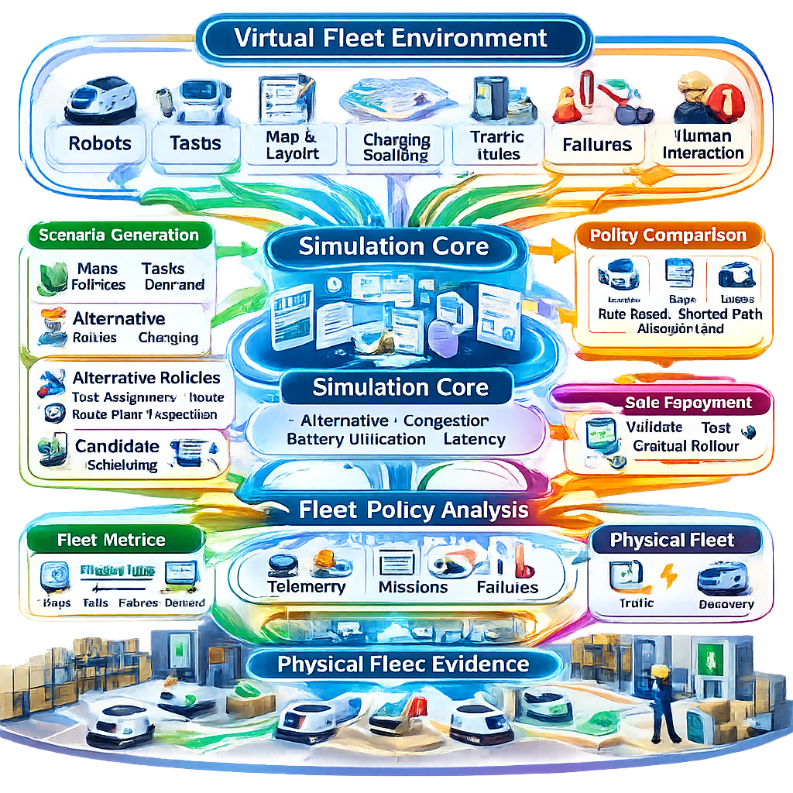{width="7.268055555555556in" height="7.268055555555556in"}

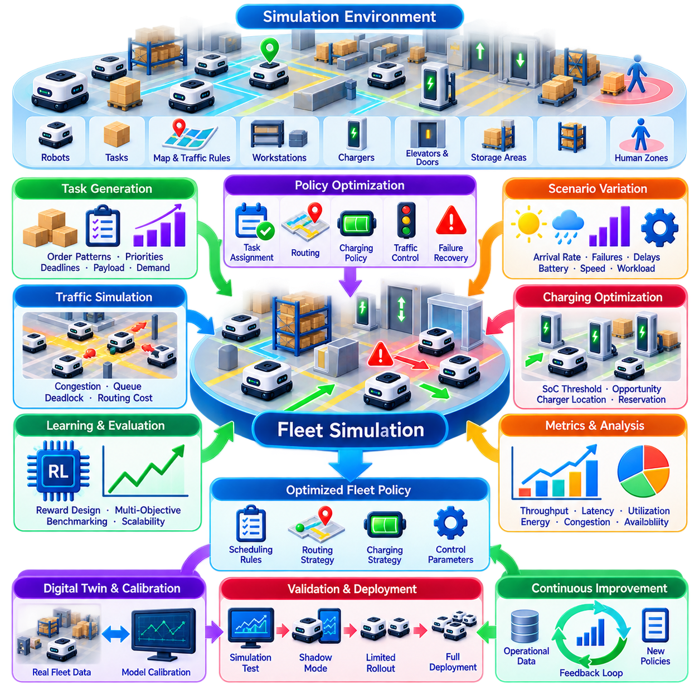{width="7.268055555555556in" height="7.268055555555556in"}

Simulation-based fleet policy optimization provides a controlled environment for designing, testing, and improving decision policies before they are introduced into a physical robot fleet. Instead of experimenting directly with production robots, engineers can reproduce fleet operations virtually, evaluate alternative scheduling, routing, charging, and recovery strategies, and measure their consequences across thousands of repeatable operational scenarios.

A fleet simulation represents the major elements that determine system behavior, including robots, tasks, maps, traffic rules, workstations, chargers, elevators, doors, storage areas, and human interaction zones. Each robot can be modeled with motion characteristics, payload capability, battery behavior, mission state, and failure conditions, allowing the simulator to reproduce interactions that emerge when many autonomous systems share the same operational environment.

Policy optimization focuses on the decision rules governing fleet behavior rather than only the physical motion of individual robots. A policy may determine which robot receives a task, which route should be selected, when charging should occur, how traffic conflicts are resolved, or how the fleet responds to failures. Simulation makes it possible to compare these policies under identical conditions and identify strategies that improve overall system performance.

Task-generation models are essential because fleet performance depends strongly on workload characteristics. Simulated missions can represent periodic production requests, random warehouse orders, priority deliveries, inspection tasks, or sudden demand peaks. Arrival rates, deadlines, pickup and delivery locations, payload requirements, and service times can be varied systematically to determine whether a policy remains effective as operational demand changes.

Traffic simulation reveals interactions that are difficult to predict from isolated robot tests. Hundreds of individually reasonable routes may collectively create congestion at intersections, narrow corridors, elevators, or workstations. By reproducing these interactions virtually, engineers can measure queue formation, waiting time, deadlock probability, and traffic density while evaluating alternative routing costs, reservation rules, and congestion-control strategies.

Charging policies can also be optimized through simulation. Different state-of-charge thresholds, opportunity-charging strategies, charger locations, reservation mechanisms, and charging priorities can be tested against changing workload. Long-duration experiments can reveal whether a policy creates synchronized charging queues, insufficient fleet availability, excessive energy reserves, or uneven battery utilization that may not be visible during short physical trials.

Discrete-event simulation is particularly useful for modeling fleet-level operational processes. Instead of calculating every physical detail continuously, the simulator advances through meaningful events such as task arrival, robot assignment, mission completion, charger entry, equipment failure, or workstation release. This approach can evaluate long operational periods efficiently when the primary objective is fleet throughput, utilization, waiting time, and resource capacity.

Higher-fidelity simulation becomes important when navigation behavior or physical interaction significantly influences policy performance. Robot acceleration, turning radius, localization uncertainty, obstacle avoidance, sensor limitations, and realistic travel times can be modeled when necessary. The required fidelity should be selected according to the optimization question, because unnecessary physical detail can dramatically increase computational cost without improving fleet-level conclusions.

Reinforcement learning can use simulation as an experience-generation environment. An agent repeatedly observes fleet states, selects scheduling or routing actions, and receives rewards based on resulting performance. Millions of interactions can be generated faster and more safely than through physical operation. This enables exploration of policies that would be impractical to learn directly in a working factory, warehouse, hospital, or logistics facility.

Reward functions can represent throughput, task latency, robot utilization, travel distance, energy consumption, congestion, charger waiting time, deadline violations, or recovery performance. Multi-objective rewards are often necessary because improving one metric can degrade another. Simulation allows reward weights and policy behavior to be examined before deployment, helping engineers identify unintended optimization strategies or undesirable operational tradeoffs.

Scenario randomization improves policy robustness by preventing optimization for only one nominal environment. Robot speed, task arrival rate, processing time, battery consumption, communication delay, obstacle location, workstation availability, and failure frequency can be varied across simulation episodes. A policy that performs well across these variations is more likely to remain effective when real operating conditions differ from the assumptions used during development.

Rare and disruptive events are particularly valuable simulation targets. Robot failures, blocked corridors, charger outages, elevator faults, communication loss, sudden workload surges, and emergency zone closures may occur too infrequently for sufficient physical testing. Simulation can reproduce these conditions repeatedly and evaluate whether fleet policies redistribute tasks, reroute traffic, preserve critical capacity, and recover without cascading failures.

Policy comparison requires consistent benchmarks. Rule-based dispatching, nearest-robot assignment, FIFO scheduling, conventional shortest-path routing, fixed charging thresholds, and optimization-based algorithms can serve as reference strategies. Candidate AI policies should be evaluated using identical maps, workloads, random seeds, and disturbance scenarios so that improvements are attributable to the policy rather than differences in test conditions.

Important fleet-level metrics include throughput, mean and tail task latency, robot utilization, total travel distance, congestion duration, queue length, charger utilization, energy consumption, missed deadlines, failure recovery time, and operational availability. Scalability should also be measured by increasing the number of robots and tasks because a policy that performs effectively with dozens of robots may become unstable or computationally expensive at larger fleet sizes.

A digital twin can extend simulation by synchronizing the virtual model with information from the physical fleet. Real telemetry, mission history, traffic measurements, battery behavior, and infrastructure status can be used to calibrate simulation parameters. The resulting model can support what-if analysis in which operators examine how proposed scheduling rules, additional robots, new chargers, or layout modifications could influence future fleet performance before physical changes are made.

Simulation accuracy must be continuously validated because an optimized policy is only as useful as the environment in which it was evaluated. Predicted travel times, queue lengths, energy consumption, task completion rates, and failure responses should be compared with physical fleet measurements. Significant discrepancies indicate a simulation-to-reality gap and should lead to model calibration rather than unquestioned deployment of simulation results.

Deployment should progress from simulation toward increasingly realistic validation stages. A policy can first be evaluated through offline experiments, then through digital-twin or shadow-mode operation using live fleet data without controlling robots. Limited zones, selected missions, or a small robot subset can subsequently be enabled under supervision before broader rollout. A validated fallback policy should remain available throughout this transition.

Simulation results should also become part of fleet policy governance. Policy versions, training conditions, scenario sets, parameter configurations, performance metrics, safety constraints, and approval results should be recorded so that deployed behavior can be reproduced and audited. When layouts, workloads, robot software, or infrastructure change significantly, previously validated policies may require renewed simulation and qualification.

The resulting workflow creates a continuous optimization loop between the physical fleet and its virtual representation. Operational data calibrates the simulator, simulation explores alternative policies, candidate strategies are evaluated against standardized scenarios, and validated improvements are gradually deployed to real robots. New production evidence then returns to the simulation environment, supporting further refinement as fleet conditions evolve.

Simulation-based fleet policy optimization therefore provides more than a virtual testing environment. It becomes an engineering framework for exploring complex fleet behavior, learning adaptive policies, evaluating rare failures, performing capacity analysis, and reducing deployment risk. By combining repeatable simulation, digital-twin calibration, systematic benchmarking, and controlled rollout, fleet intelligence can evolve without turning the production environment itself into an uncontrolled experiment.

## 09.08 AI Based Fleet Capacity Planning and Forecasting [w/Code]

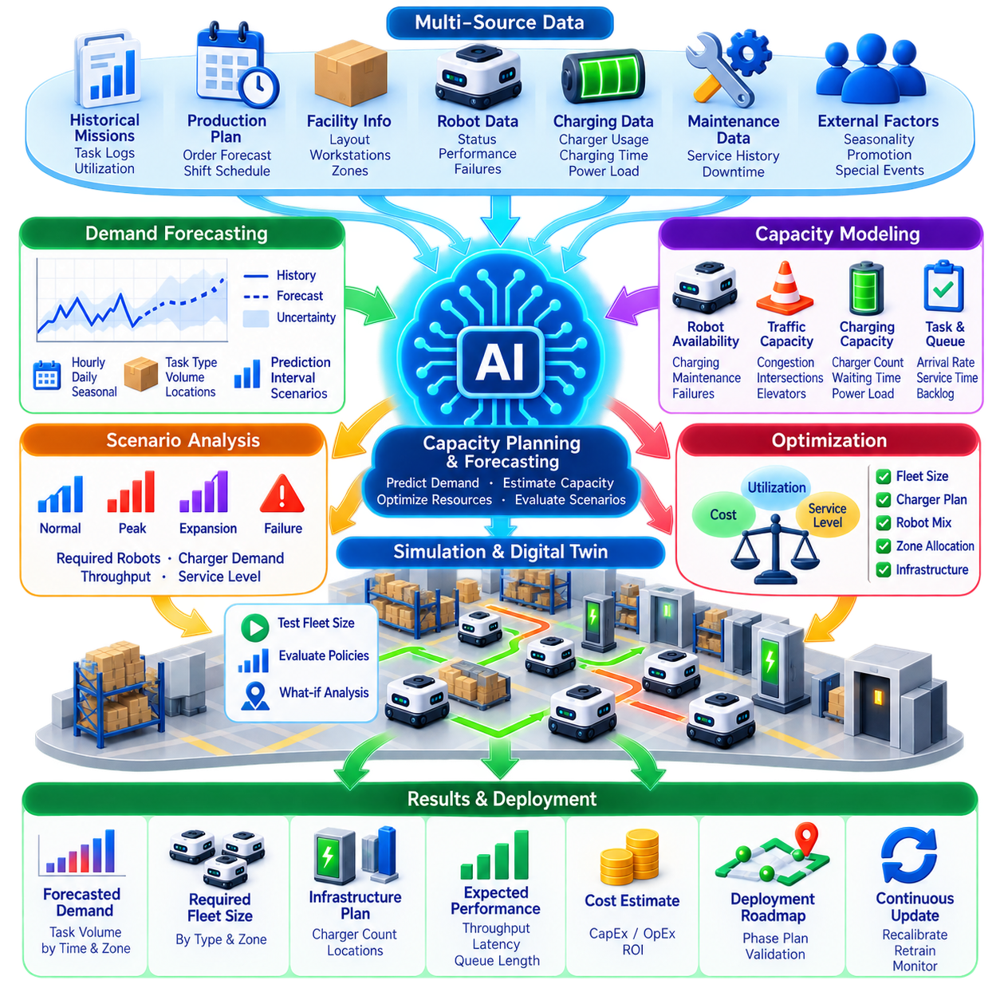{width="7.268055555555556in" height="7.268055555555556in"}

AI-based fleet capacity planning and forecasting determines how many robots and supporting resources will be required to satisfy future operational demand while maintaining service levels, reliability, and cost efficiency. Instead of sizing a fleet from historical averages or fixed utilization targets, AI models can forecast workload and evaluate how robot availability, traffic, charging, infrastructure, and maintenance constraints influence effective capacity.

Fleet capacity is not equivalent to the number of robots installed at a facility. Effective capacity depends on how many robots are actually available for productive missions after accounting for charging, maintenance, failures, traffic delays, empty travel, workstation waiting, and operational restrictions. A nominal fleet of one hundred robots may therefore provide substantially less than one hundred robots of continuously usable capacity.

Demand forecasting forms the first analytical layer. Historical task records can reveal hourly, daily, weekly, seasonal, and production-related patterns in mission demand. Forecasting models can estimate future order volumes, transport requests, inspection missions, replenishment tasks, or material movements and convert these forecasts into expected robot workload across different locations, shifts, and operational periods.

External operational information can improve forecast quality. Production schedules, warehouse order plans, shift calendars, planned maintenance, promotions, seasonal demand, and known facility events may explain workload changes that cannot be inferred from robot telemetry alone. Combining these variables with historical mission data allows the forecasting system to distinguish recurring patterns from unusual events and anticipated changes in demand.

Forecast uncertainty must be represented because future workload cannot be predicted perfectly. Capacity planning based only on a single expected demand value may produce a fleet that performs efficiently under normal conditions but becomes overloaded during peaks. Prediction intervals, probability distributions, or scenario ranges can represent uncertainty and help planners determine how much reserve capacity is required for acceptable service reliability.

Robot utilization provides an important capacity indicator, but extremely high utilization is not always desirable. A fleet operating continuously near maximum utilization may have little ability to absorb urgent missions, traffic disruptions, charging requirements, or equipment failures. Capacity planning should therefore identify an operating region that balances productive utilization with sufficient reserve capacity rather than treating one hundred percent utilization as the objective.

Queue behavior provides another important signal because capacity shortages often appear as growing task backlogs before individual robots reach obvious limits. AI models can analyze task arrival rates, service times, queue lengths, waiting times, and robot availability to identify when demand approaches sustainable fleet capacity. Persistent queue growth may indicate insufficient robots, poor task allocation, infrastructure bottlenecks, or an imbalance between fleet resources and workstation throughput.

Traffic congestion can reduce capacity even when sufficient robots are theoretically available. Adding more robots to an already congested facility may increase interference, waiting time, and deadlock risk rather than improving throughput. Capacity models should therefore include traffic density, intersection utilization, narrow corridors, elevators, doors, and shared zones so that fleet expansion decisions reflect the physical transportation capacity of the environment.

Charging infrastructure creates another capacity constraint. Increasing robot count without adding sufficient charging capacity can create charger queues and reduce operational availability. Forecasting models can estimate simultaneous charging demand, charger utilization, expected waiting time, and peak electrical load. These results help determine whether future growth requires additional chargers, higher charging power, different charger locations, or revised charging policies.

Maintenance and reliability must also be incorporated into available-capacity estimates. Robots periodically leave service for preventive maintenance, corrective repair, software updates, inspection, or unexpected failures. Historical reliability data and predictive health models can estimate expected downtime and availability by robot type. Capacity planning can then include realistic operational availability rather than assuming that every installed robot remains continuously productive.

Heterogeneous fleets require capability-aware capacity planning. AMRs, towing robots, mobile manipulators, inspection robots, and specialized platforms cannot always substitute for one another. Demand must therefore be forecast by task class and matched against robots with the required payload, sensors, manipulation capability, environmental rating, or navigation characteristics. A fleet can have sufficient total robot count while still lacking capacity for a critical task category.

Spatial demand is as important as total demand. A facility may have enough robots overall but experience shortages in one production zone while robots remain underutilized elsewhere. Spatial-temporal forecasting can predict where and when missions are likely to occur, allowing planners to evaluate robot distribution, staging areas, charging locations, and zone-specific capacity. This supports proactive positioning as well as long-term infrastructure planning.

AI forecasting can operate across multiple planning horizons. Short-term forecasts covering minutes or hours can support robot repositioning, charging, and dynamic staffing decisions. Daily or weekly forecasts can support shift planning and maintenance scheduling, while monthly or annual forecasts can guide fleet expansion, infrastructure investment, and procurement. Different horizons may require different models, features, and uncertainty assumptions.

Scenario analysis converts forecasts into capacity decisions. Planners can evaluate normal demand, seasonal peaks, accelerated production, robot failures, charger outages, or facility expansion as alternative scenarios. For each scenario, the system can estimate required robot count, utilization, queue length, throughput, charger demand, and service-level performance. This provides a more informative basis for investment decisions than selecting fleet size from a single demand estimate.

Simulation and digital twins are particularly valuable when analytical relationships become too complex for direct calculation. Forecast demand can be injected into a virtual facility containing realistic robots, traffic rules, chargers, workstations, and failure behavior. Candidate fleet sizes and infrastructure configurations can then be tested repeatedly to determine whether they satisfy throughput and latency requirements under both expected and adverse operating conditions.

Marginal capacity analysis helps determine whether adding another robot will actually improve performance. Early fleet expansion may produce nearly proportional throughput gains, but the benefit eventually decreases as traffic, charging, workstation, or infrastructure constraints dominate. AI-supported analysis can identify this saturation region and prevent unnecessary robot purchases when investment in chargers, layout changes, or workstation capacity would provide greater improvement.

Cost should be evaluated together with operational performance. Additional robots increase capital expenditure, maintenance, batteries, charging equipment, network demand, software licenses, and support requirements. Insufficient capacity, however, creates delayed missions, reduced production, overtime, and service-level violations. Capacity planning therefore becomes a multi-objective problem that balances investment cost, operating cost, utilization, resilience, and required service performance.

Forecast models require continuous validation after deployment. Predicted task volumes should be compared with actual demand, while predicted utilization, queue lengths, charger demand, and robot availability should be compared with operational results. Persistent forecast errors can indicate changing production patterns, new customer behavior, altered layouts, or model drift and should trigger recalibration or retraining rather than remaining hidden inside planning assumptions.

A practical architecture connects historical fleet data, enterprise demand signals, forecasting models, robot availability estimates, health prediction, charging models, traffic analysis, simulation, and financial information. Forecast demand becomes a workload scenario, capacity models estimate required resources, and simulation verifies whether the proposed configuration can achieve operational targets. Planning results can then be translated into deployment, procurement, or infrastructure decisions.

The resulting system transforms fleet capacity planning from periodic spreadsheet-based sizing into a continuous predictive management process. AI can anticipate workload changes, identify emerging capacity constraints, quantify uncertainty, and distinguish whether additional robots or supporting infrastructure are actually required. This enables organizations to expand robotic fleets according to measured operational need rather than reacting only after congestion, queues, or service failures appear.

## 09.09 AI Model Governance in Fleet Decision Systems

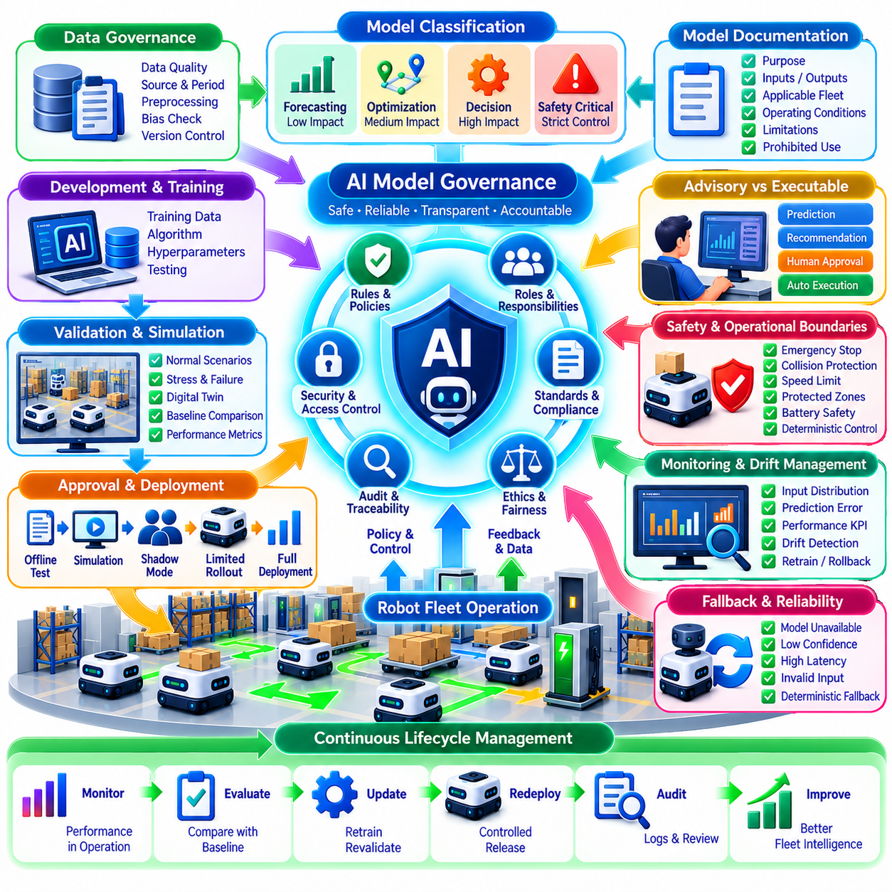{width="7.268055555555556in" height="7.268055555555556in"}

AI model governance in fleet decision systems establishes the rules, responsibilities, controls, and evidence required to use artificial intelligence safely and reliably in operational robot fleets. As AI becomes involved in task scheduling, routing, charging, anomaly detection, forecasting, and operator assistance, governance ensures that learned models remain bounded by defined operational authority rather than becoming uncontrolled decision makers.

Governance begins by classifying models according to their operational impact. A forecasting model that predicts future workload has different consequences from a policy that changes robot routes or task assignments. Models can therefore be categorized by decision criticality, autonomy level, affected assets, and potential operational consequences, allowing stronger validation and approval requirements to be applied as decision authority increases.

Clear separation between advisory and executable intelligence is essential. Some models provide predictions, anomaly scores, recommendations, or explanations that humans or deterministic systems evaluate before acting. Other models may directly influence scheduling or optimization decisions. Governance should explicitly define which outputs are informational, which require human approval, and which may automatically enter an operational control workflow.

Safety-critical authority should remain outside unconstrained learned models. Emergency stops, collision protection, speed limits, protected zones, battery safety limits, and certified motion controls should continue to operate through deterministic and validated mechanisms. AI can optimize decisions within this established operational envelope, but governance must prevent a learned policy from overriding physical safety constraints or authoritative protection functions.

Every production model should have a documented purpose and operating boundary. The documentation should identify intended inputs, outputs, supported robot types, applicable facilities, expected operating conditions, known limitations, performance targets, and prohibited uses. A model validated for one warehouse layout, robot platform, or workload should not automatically be assumed suitable for another environment without additional evaluation.

Data governance is closely connected to model governance because model behavior depends on the information used for training and inference. Training datasets should record their origin, time period, robot configuration, software version, operating environment, preprocessing methods, and quality checks. Missing values, sensor failures, biased operational coverage, or incorrectly synchronized telemetry can produce models that appear accurate during development but fail under production conditions.

Model versioning provides traceability between development and fleet behavior. Each deployed model should have a unique version associated with its training data, code, hyperparameters, evaluation results, configuration, and approval status. When an operational decision is investigated later, engineers should be able to determine exactly which model version generated the prediction or recommendation and which supporting software and data were active.

Validation should evaluate models under both nominal and adverse conditions. A scheduling model should be tested under normal workload as well as congestion, robot failures, charger shortages, and demand peaks. An anomaly detector should be evaluated against sensor noise, unusual missions, and equipment degradation. Testing only average operating conditions can hide weaknesses that become significant during precisely the situations where intelligent assistance is most valuable.

Simulation and digital twins provide an important governance environment for model qualification. Candidate models can be exposed to standardized scenarios, rare failures, extreme workloads, infrastructure outages, and unusual traffic patterns without affecting production robots. Repeating identical scenarios across model versions provides objective evidence about whether a proposed update improves performance or introduces regressions.

Baseline comparison is necessary to determine whether AI provides measurable value. Candidate models should be compared against existing deterministic rules, conventional optimization methods, or previously approved model versions. Evaluation can include throughput, task latency, energy consumption, congestion, prediction error, false alarms, recovery time, and computational cost. Improvement in one metric should not conceal unacceptable degradation in another.

Acceptance criteria should be defined before deployment rather than selected after observing test results. Required accuracy, maximum latency, allowed failure rate, robustness thresholds, resource consumption, and operational KPIs can form a release gate. Safety and policy constraints should be treated as mandatory requirements, while optimization metrics may allow controlled tradeoffs according to business objectives.

Deployment governance should use progressive release stages. A new model can first run in offline replay, then in simulation, followed by shadow mode using live fleet data without influencing decisions. After successful evaluation, deployment can proceed to a limited robot group, zone, or mission type before broader activation. This staged approach limits the operational consequences of unexpected model behavior.

Human oversight becomes increasingly important as model authority increases. Operators should understand when AI is influencing a decision, what information supports the recommendation, and how to reject or escalate questionable outputs. High-impact actions may require explicit approval, while lower-risk optimization can operate automatically within predefined limits. Governance should define these boundaries consistently rather than relying on informal operator judgment.

Runtime monitoring is required because successful pre-deployment validation does not guarantee permanent reliability. Input distributions, prediction errors, anomaly rates, decision patterns, latency, resource utilization, and operational outcomes should be continuously monitored. Changes in robot hardware, software, layout, workload, environment, or human behavior can gradually move production conditions beyond the model\'s validated operating region.

Model drift should trigger a defined response rather than merely generate a statistical warning. Depending on severity, the system may increase monitoring, restrict model authority, revert to a previously approved version, activate a deterministic fallback, or initiate retraining and requalification. The response should consider both the magnitude of the drift and the operational importance of the decisions influenced by the affected model.

Fallback behavior is a fundamental governance requirement for operational fleet intelligence. If a model becomes unavailable, exceeds latency limits, receives invalid input, produces low-confidence results, or encounters an unsupported operating condition, the fleet should transition to a known safe alternative. Conventional scheduling, routing, charging, or alarm logic can provide degraded but predictable operation until the intelligent service is restored.

Auditability connects model decisions to operational accountability. Important predictions, recommendations, model inputs, model versions, operator approvals, automated actions, and resulting fleet outcomes should be logged. These records allow engineers to reconstruct incidents, investigate unexpected behavior, compare model performance over time, and determine whether failures originated from the model, data pipeline, integration layer, or surrounding fleet system.

Change management should treat model updates as controlled operational changes rather than ordinary software replacements. Retraining with new data, changing model architecture, modifying reward functions, adjusting thresholds, or adding input features can alter fleet behavior. Significant changes should therefore trigger appropriate regression testing, simulation, documentation updates, approval, and controlled redeployment.

Governance also requires clear organizational ownership. Model developers may be responsible for training and technical evaluation, fleet engineers for integration, safety teams for operational constraints, cybersecurity teams for access and integrity, and operations personnel for production monitoring. A defined model owner should coordinate these responsibilities and ensure that unresolved issues have an accountable decision path.

A practical governance architecture connects the model registry, dataset records, evaluation results, simulation evidence, deployment controls, runtime monitoring, audit logs, approval workflows, and fallback mechanisms. Together these components create a lifecycle from model development and qualification through deployment, observation, update, and retirement. Governance therefore becomes an engineering system rather than a collection of documentation requirements.

The resulting framework allows AI to increase fleet intelligence without weakening operational control. Models can evolve as new data, algorithms, and robot capabilities become available, while traceability, validation, monitoring, human oversight, and deterministic safety boundaries remain intact. Effective governance makes every important AI decision attributable, testable, reversible, and constrained within a clearly defined operational authority.

## 09.10 AI Fleet Optimization Production ROI Case

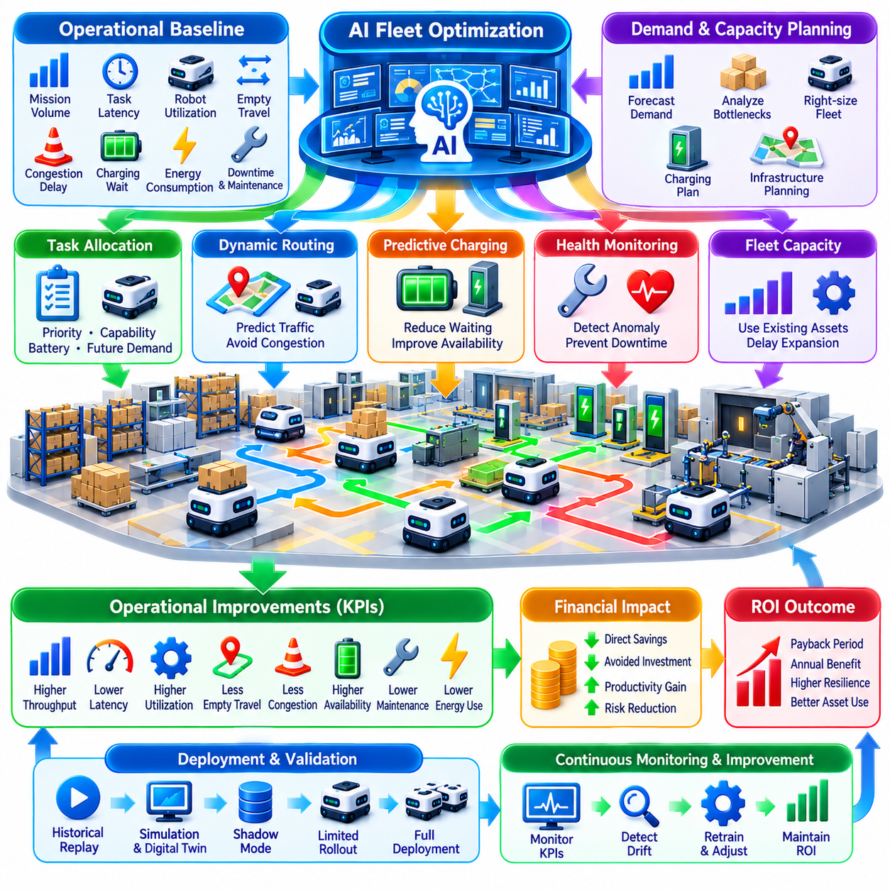{width="7.268055555555556in" height="7.268055555555556in"}

AI fleet optimization creates measurable production value when intelligent scheduling, routing, charging, health monitoring, and capacity planning are integrated into a single operational framework. The business case should not be based on the theoretical capability of individual AI models, but on whether the complete fleet can move more material, complete more missions, reduce waiting, and maintain higher availability with the same or lower operating resources.

A production ROI case begins with an operational baseline. Before AI optimization is introduced, the organization should measure mission volume, throughput, task latency, robot utilization, empty travel, congestion delay, charger waiting time, energy consumption, downtime, maintenance effort, and operator workload. Without this baseline, later improvements may be visible but cannot be reliably converted into financial value or attributed to the optimization system.

Consider a representative production site operating a medium-to-large AMR fleet across multiple work zones. Robots transport materials between storage, production, inspection, and outbound areas while sharing intersections, narrow corridors, charging stations, and workstations. Conventional dispatching may use nearest-robot assignment, fixed route costs, static charging thresholds, and manually configured traffic rules that perform adequately at moderate demand but lose efficiency during peaks.

The first optimization opportunity is task allocation. AI-based scheduling can evaluate robot location, mission priority, predicted completion time, battery condition, payload capability, traffic, and future demand simultaneously. Instead of assigning every task to the nearest available robot, the system selects assignments that improve fleet-wide performance. This can reduce empty travel, prevent workload concentration, and preserve strategically located robots for expected high-priority missions.

Dynamic route optimization provides a second source of value. Static shortest paths can cause many robots to converge on the same corridors and intersections, creating queues that reduce effective fleet capacity. Predictive traffic models can estimate near-future congestion and adjust route costs before bottlenecks form. Slightly longer routes for selected robots may therefore reduce total waiting time and increase overall mission throughput without purchasing additional vehicles.

Predictive charging improves availability by treating chargers and robot energy as shared operational resources. Robots can charge during naturally occurring idle periods, avoid synchronized charger queues, and prepare for forecast demand peaks. The objective is not to maximize every battery\'s state of charge, but to maintain sufficient energy across the fleet while minimizing the number of robots removed from productive operation at the same time.

Fleet health intelligence contributes ROI by reducing unexpected downtime. Anomaly detection can identify changes in motor current, temperature, vibration, battery behavior, localization performance, or mission duration before conventional fault thresholds are reached. Maintenance can then be scheduled during lower-demand periods, while robots showing early degradation can be assigned less demanding work until inspection. Avoided production interruptions can represent significant economic value.

Capacity forecasting prevents unnecessary capital expenditure. When throughput becomes insufficient, the intuitive response may be to purchase additional robots. AI analysis may instead reveal that congestion, charger shortages, poor task distribution, workstation queues, or maintenance availability are the actual limiting factors. Improving software policies or selected infrastructure can therefore release hidden capacity from the existing fleet before additional robots are purchased.

A production evaluation should introduce optimization progressively rather than changing all fleet behavior simultaneously. Scheduling, routing, charging, and health functions can first be evaluated through historical replay and simulation, followed by shadow-mode operation using live data. Limited zones or robot groups can then receive optimized policies while the remaining fleet provides a comparison baseline, making operational improvements easier to measure and risks easier to contain.

The financial model should translate technical KPIs into economic outcomes. Increased throughput can represent additional production capacity, reduced task latency can decrease process waiting, higher robot availability can reduce reserve fleet requirements, and lower empty travel can reduce energy and component wear. Reduced downtime, fewer emergency maintenance events, lower operator intervention, and deferred robot purchases can each be represented as annualized savings or avoided costs.

For example, assume optimization increases effective fleet productivity without changing the installed robot count. If more missions can be completed per hour while traffic waiting and charging downtime decline, the facility obtains additional capacity from assets it already owns. The economic benefit can be estimated from the value of additional production or from the cost of robots and infrastructure that would otherwise have been required to achieve the same throughput increase.

ROI calculations should include the full cost of the AI system. Initial expenses may include software development, simulation and digital-twin integration, computing infrastructure, fleet API integration, data engineering, model validation, cybersecurity, and operator training. Recurring costs may include inference computing, software maintenance, monitoring, retraining, model governance, technical support, and periodic requalification when fleet configuration or operating conditions change.

A useful financial evaluation separates direct savings from avoided investment and productivity gains. Direct savings include reduced energy, maintenance labor, emergency repair, and operator intervention. Avoided investment includes robots, chargers, or facility modifications that are no longer immediately required. Productivity gains represent additional missions or production volume enabled by better utilization. Keeping these categories separate makes the ROI argument easier to audit.

Payback period provides an intuitive measure for production management. If annual verified benefits exceed the recurring operating cost of the optimization platform, the remaining benefit can recover the initial implementation investment. The payback period should be calculated using conservative, measured improvements rather than optimistic laboratory results. Sensitivity analysis can show how the business case changes if throughput gains, maintenance savings, or deployment costs differ from expectations.

ROI should also account for resilience, even though resilience is harder to monetize. Intelligent redistribution of tasks after robot failures, predictive response to congestion, charger outages, or demand peaks, and deterministic fallback mechanisms can reduce the probability that local disturbances become production-wide disruptions. Historical downtime cost and service-level penalties can provide practical estimates of the financial value associated with improved operational resilience.

Simulation and digital twins strengthen the ROI case by testing proposed improvements before capital is committed. Different robot counts, charger configurations, layouts, scheduling policies, and demand scenarios can be compared using the same workload. The organization can determine whether a proposed investment solves the actual bottleneck and estimate its expected performance contribution before purchasing equipment or modifying the production environment.

Production measurement must continue after deployment because optimization value can change over time. Workload, layout, robot software, battery condition, and production processes evolve, potentially reducing the effectiveness of previously optimized policies. Continuous monitoring should compare current KPIs with the original baseline and approved targets, while model drift or declining benefits should trigger analysis, recalibration, retraining, or policy adjustment.

Governance is also part of ROI protection. A model that improves throughput but introduces unstable decisions, excessive risk, or unexplained operational behavior can create costs greater than its efficiency gains. Model versioning, validation, staged deployment, audit logs, runtime monitoring, human oversight, and deterministic fallback therefore protect both operational safety and the financial value expected from AI optimization.

The strongest production business case emerges when benefits accumulate across multiple fleet functions. Better scheduling reduces empty movement, improved routing reduces congestion, predictive charging increases availability, anomaly detection reduces downtime, and capacity forecasting prevents unnecessary expansion. These improvements reinforce one another because each function releases a different portion of capacity that would otherwise be lost through operational inefficiency.

The resulting ROI framework connects operational evidence directly to investment decisions. Baseline measurements establish current performance, AI optimization changes selected fleet behaviors, controlled deployment verifies technical improvement, and financial models convert verified KPI changes into annual benefits. Investment cost, recurring cost, avoided capital expenditure, productivity gains, risk reduction, and payback can then be evaluated using traceable production evidence.

AI fleet optimization therefore creates value not by adding intelligence for its own sake, but by converting existing fleet assets into more productive and predictable operational capacity. When optimization is validated against real production KPIs and deployed under controlled governance, organizations can improve throughput, availability, energy efficiency, maintenance performance, and resilience while delaying unnecessary expansion. The most credible ROI case is consequently one built from measured operational improvement rather than assumed AI capability.
