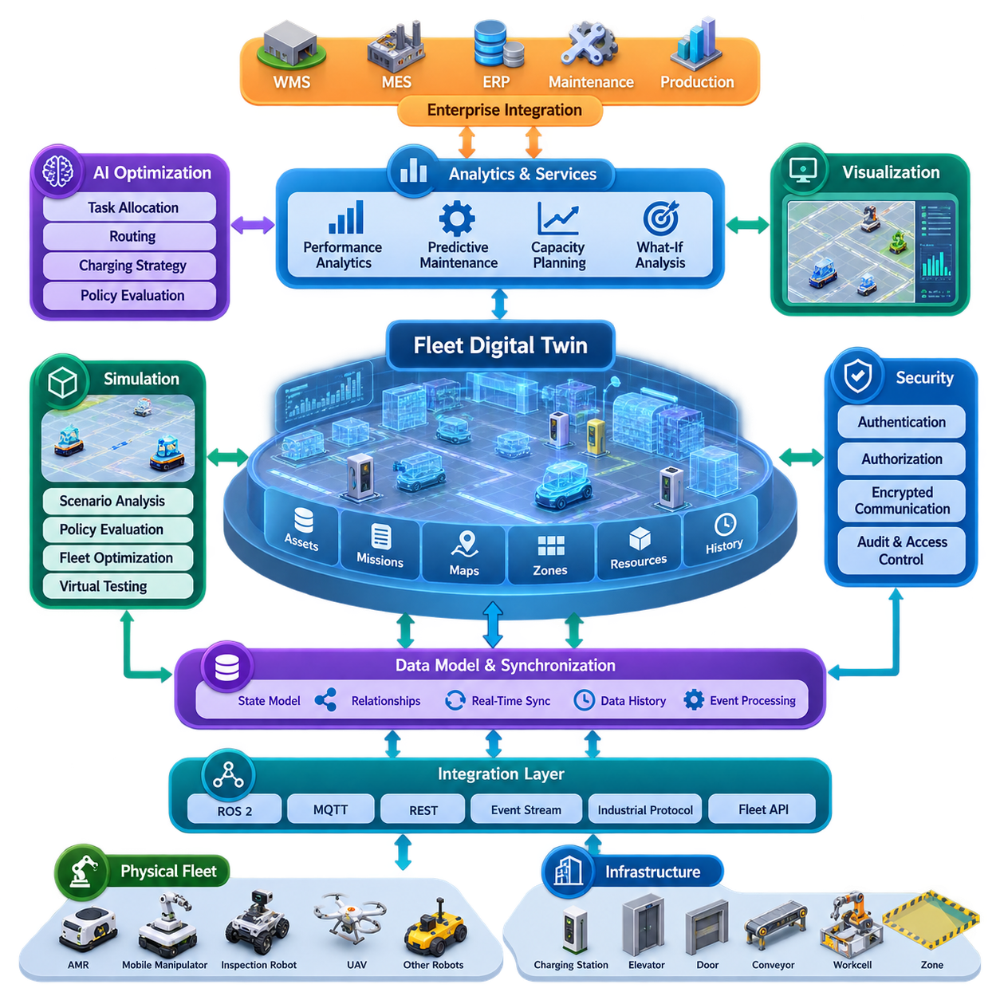
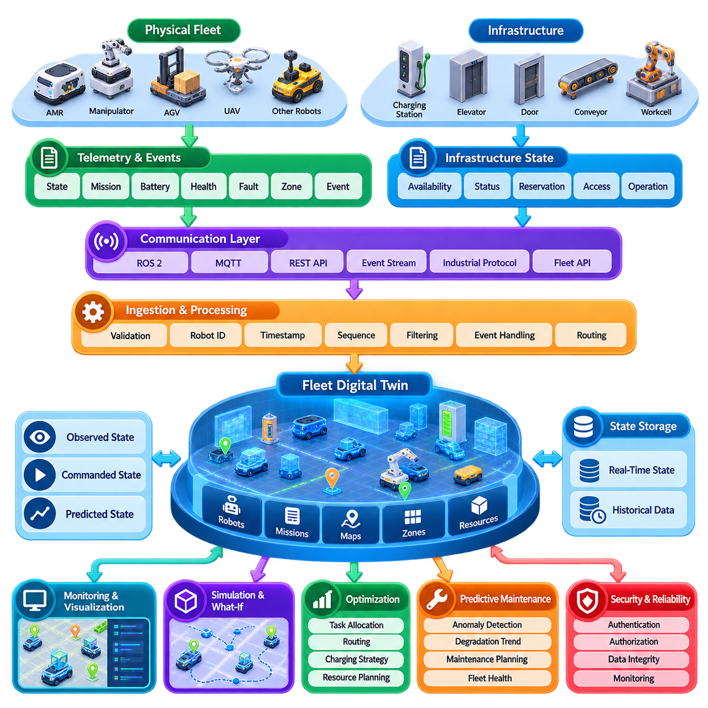
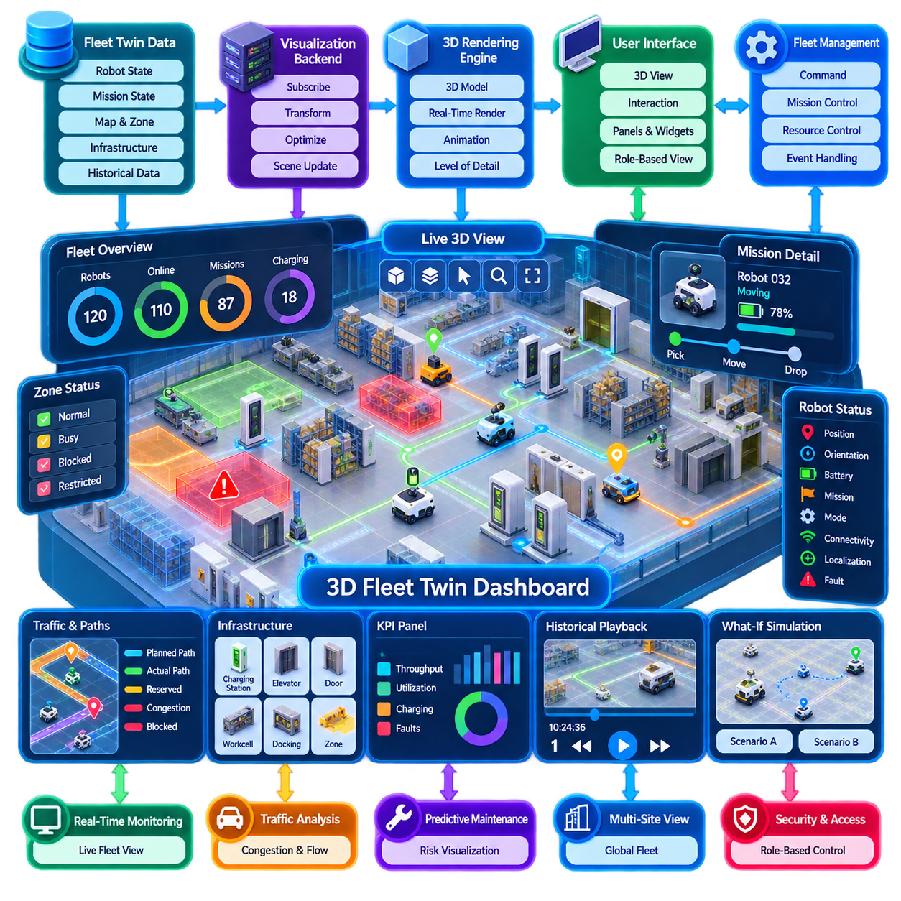
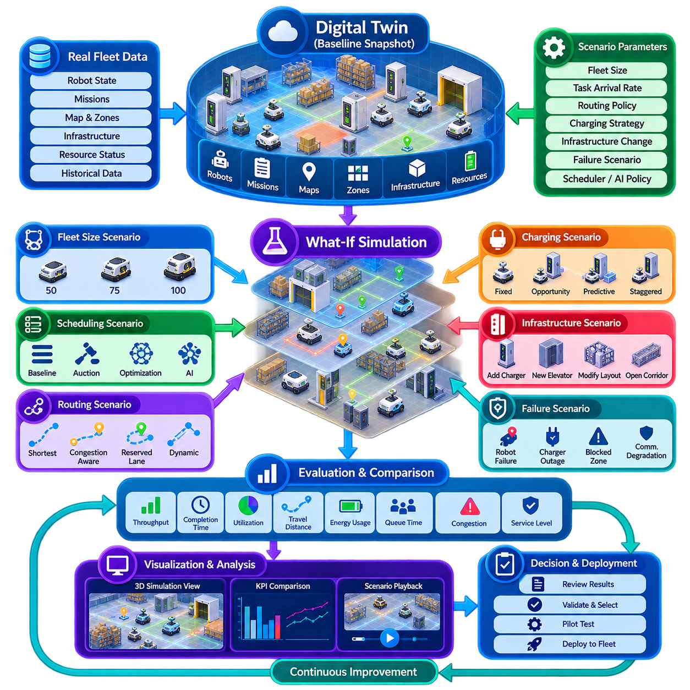
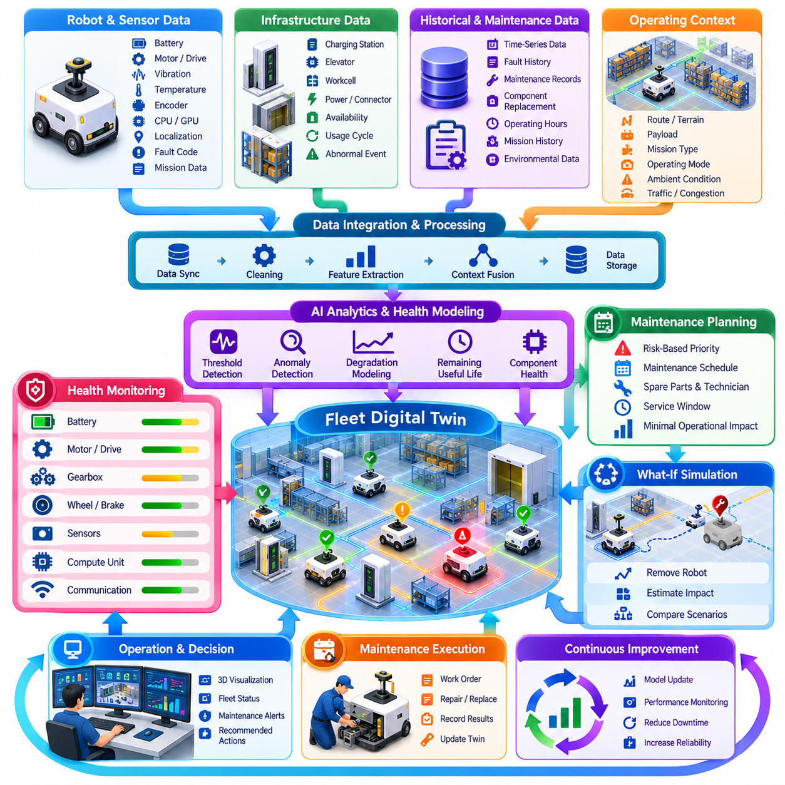
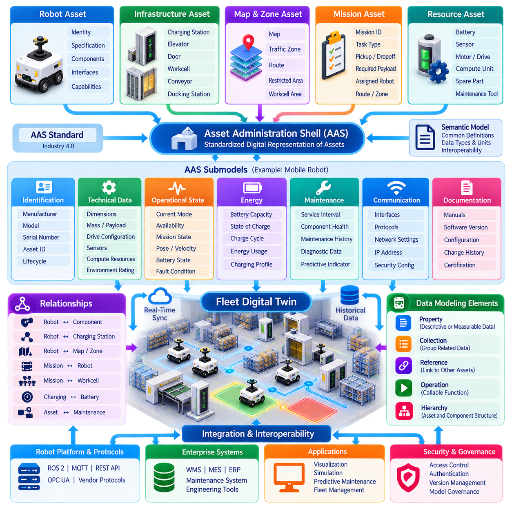
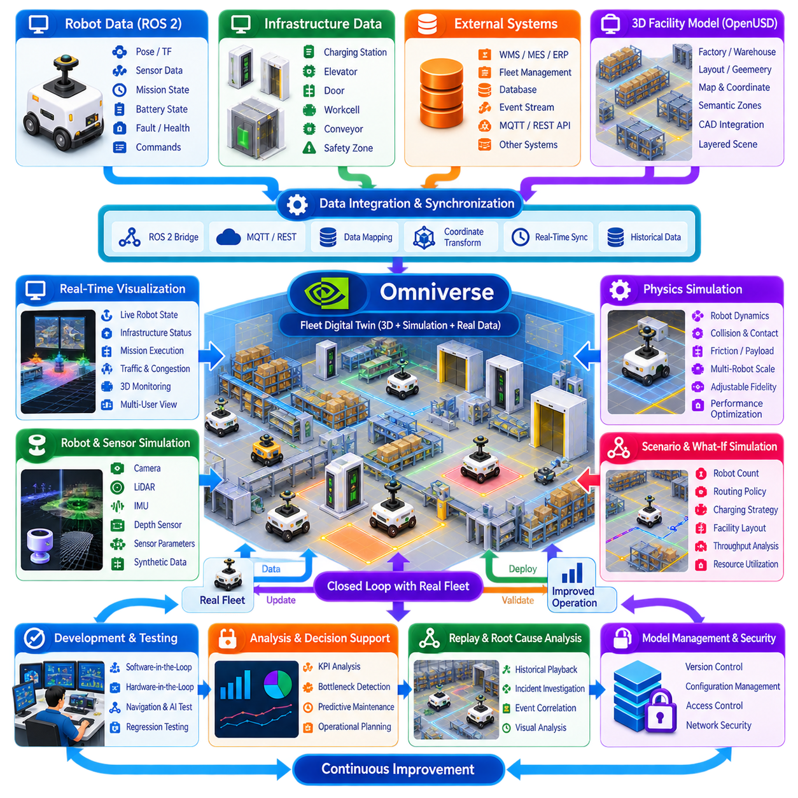
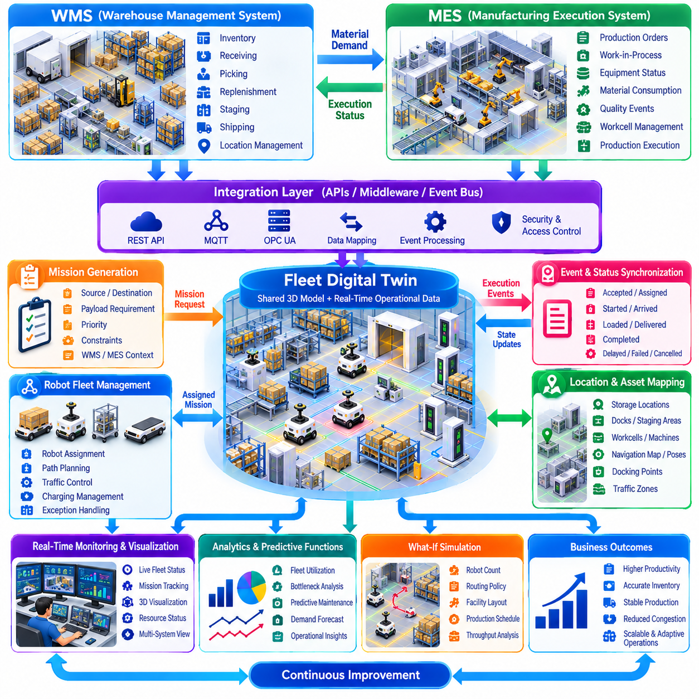
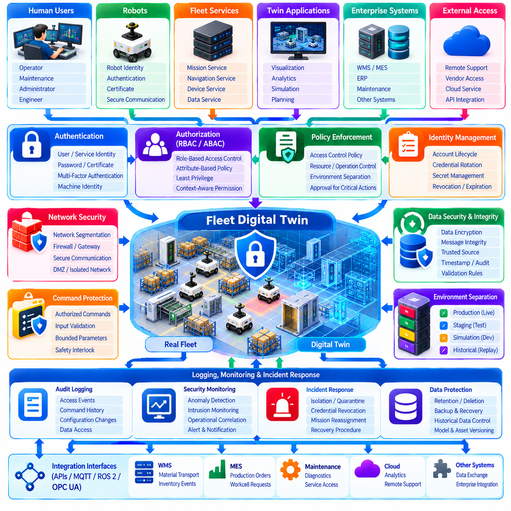
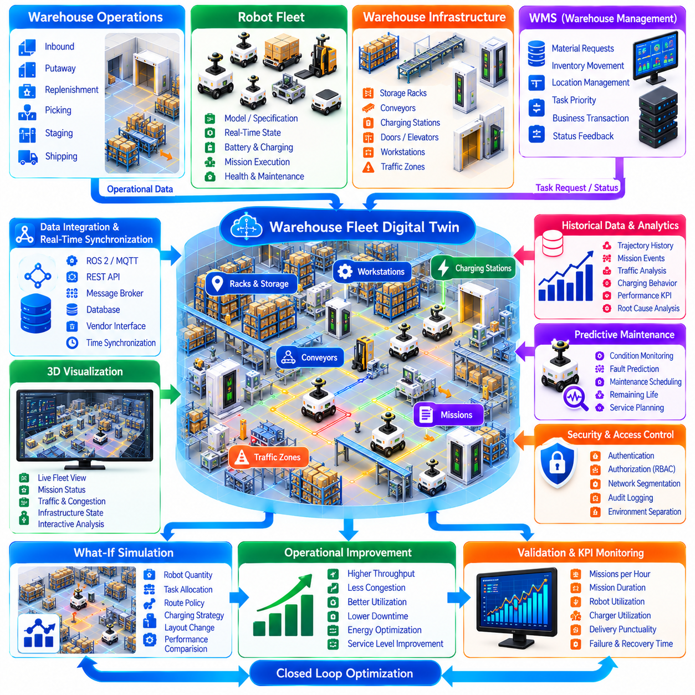

**Volume 16 Multi Robot and Fleet Intelligence**

# 10. Fleet Digital Twin

## 10.01 Fleet Digital Twin Architecture and Value Proposition

{width="7.268055555555556in" height="7.268055555555556in"}

플릿 디지털 트윈(Fleet Digital Twin)은 다중 로봇 운영 시스템(Multi-Robot Operational System)을 지속적으로 동기화하여 가상으로 표현한 것이다. 정적인 시뮬레이션 모델(Simulation Model)과 달리 물리적 로봇(Physical Robot), 인프라(Infrastructure), 미션(Mission), 지도(Map), 운영 자원(Operational Resource)과 지속적인 관계를 유지한다. 디지털 트윈은 실시간 플릿 활동을 관찰하고 분석하며 시뮬레이션하고 운영 의사결정에 활용할 수 있는 계산 모델(Computational Model)로 변환한다.

보다 광범위한 다중 로봇 아키텍처(Multi-Robot Architecture)에서 플릿 디지털 트윈은 플릿 관리(Fleet Management), 분산 지능(Distributed Intelligence), AI 최적화(AI Optimization), 산업 운영(Industrial Operations)을 연결하는 가교 역할을 한다. 이러한 위치는 디지털 트윈을 단순한 시각화 기술(Visualization Technology)이 아니라 실시간 동기화(Real-Time Synchronization), 시뮬레이션(Simulation), 예지 정비(Predictive Maintenance), 기업 시스템 통합(Enterprise Integration), 보안(Security)과 연결되는 운영 지능 계층(Operational Intelligence Layer)으로 정의한다는 점에서 중요하다.

아키텍처는 일반적으로 물리적 플릿 계층(Physical Fleet Layer)에서 시작한다. 각각의 AMR, 모바일 매니퓰레이터(Mobile Manipulator), 검사 로봇(Inspection Robot), UAV 또는 기타 자율 플랫폼(Autonomous Platform)은 위치 및 자세(Pose), 속도(Velocity), 배터리 상태(Battery Condition), 미션 진행 상태(Mission Progress), 운영 모드(Operating Mode), 센서 상태(Sensor Health), 고장(Fault), 자원 활용도(Resource Utilization)를 나타내는 상태 정보를 생성한다. 충전소(Charging Station), 엘리베이터(Elevator), 도어(Door), 컨베이어(Conveyor), 작업 셀(Workcell), 교통 구역(Traffic Zone) 역시 디지털 트윈 내의 객체로 표현될 수 있다.

통합 계층(Integration Layer)은 이러한 정보를 물리적 환경(Physical Environment)에서 디지털 표현(Digital Representation)으로 전달한다. ROS 2, MQTT, REST 인터페이스(REST Interface), 이벤트 스트림(Event Stream), 산업용 프로토콜(Industrial Protocol), 플릿 API(Fleet API)는 정보마다 요구되는 시간 특성과 신뢰성이 다르기 때문에 함께 사용될 수 있다. 고주파 로봇 상태(High-Frequency Robot State)는 스트리밍 통신(Streaming Communication)을 사용할 수 있으며, 설정 정보, 이력 기록, 미션 트랜잭션(Mission Transaction), 기업 데이터(Enterprise Data)는 비동기 방식이나 요청-응답 방식(Request-Response)을 사용할 수 있다.

연결 계층 위에는 트윈 상태 및 데이터 모델(Twin State and Data Model)이 위치한다. 이 계층은 로봇, 미션, 배터리, 지도, 구역, 스테이션, 페이로드(Payload), 운영 자원에 대한 디지털 식별자(Digital Identity)와 관계를 유지한다. 따라서 유용한 플릿 트윈(Fleet Twin)은 개별 장비만 표현해서는 안 된다. 로봇과 공유 환경 간의 관계를 모델링하여 혼잡(Congestion), 자원 경합(Resource Contention), 충전 수요(Charging Demand), 미션 의존성(Mission Dependency)과 같은 플릿 수준의 동작을 이해할 수 있어야 한다.

동기화(Synchronization)는 물리적 상태와 디지털 상태를 일치시키는 메커니즘이다. 로봇이 이동하고, 미션을 수행하고, 특정 구역에 진입하고, 배터리를 충전하거나 고장을 보고하면 텔레메트리(Telemetry)와 운영 이벤트(Operational Event)가 디지털 트윈을 갱신한다. 명령과 계획 결정은 통제된 인터페이스를 통해 반대 방향으로 전달될 수도 있다. 따라서 타임스탬프(Timestamp), 순서 관리(Ordering), 상태 버전 관리(State-Version Management), 통신 장애 처리(Communication-Loss Handling), 상태 조정(Reconciliation)은 단순한 구현 세부사항이 아니라 핵심적인 아키텍처 요소이다.

플릿 디지털 트윈은 과거의 운영 맥락(Historical Context)도 유지해야 한다. 현재 로봇 위치만으로는 제한적인 운영 지능만 얻을 수 있지만, 이동 궤적(Trajectory), 미션, 충전 사이클(Charging Cycle), 알람(Alarm), 유지보수 작업(Maintenance Action), 활용도(Utilization)를 시간적으로 연계하여 기록하면 보다 심층적인 분석이 가능하다. 실시간 상태와 과거 상태를 결합하면 일시적인 이상과 지속적인 성능 저하를 구별할 수 있으며 플릿 성능 분석(Fleet Performance Analytics)의 기반을 제공한다.

시뮬레이션(Simulation)은 아키텍처에 또 다른 차원을 추가한다. 동기화된 디지털 트윈은 실제 플릿 상태에서 파생된 통제된 가상 시나리오(Virtual Scenario)를 생성하고, 생산 환경에 영향을 주기 전에 대안적인 스케줄링(Scheduling), 경로 계획(Routing), 충전(Charging), 자원 할당(Resource Allocation) 정책을 평가할 수 있다. 이를 통해 로봇 수, 레이아웃(Layout), 작업 부하(Workload), 운영 정책이 변경될 때 처리량(Throughput), 혼잡, 활용도, 서비스 수준(Service Level)이 어떻게 변하는지를 평가하는 가상 시나리오 분석(What-If Analysis)이 가능해진다.

이러한 접근 방식은 대규모 플릿(Large-Scale Fleet)에서 특히 중요하다. 개별 로봇의 국부 최적화(Local Optimization)가 반드시 전체 시스템 최적화(System-Level Optimization)를 의미하지 않기 때문이다. 로봇 수를 늘리면 혼잡이 증가할 수 있고, 충전이 제대로 조정되지 않으면 에너지 병목(Energy Bottleneck)이 발생할 수 있으며, 개별적으로 효율적인 경로들이 공유 통로를 놓고 경쟁할 수도 있다. 플릿 트윈은 이러한 상호작용을 공통 모델(Common Model)에서 드러내고 실제 운영 변경 전에 시스템 전체에 미치는 영향을 평가할 수 있는 환경을 제공한다.

예지 정비(Predictive Maintenance)는 또 다른 주요 가치 제안(Value Proposition)이다. 모터 전류(Motor Current), 배터리 거동(Battery Behavior), 온도(Temperature), 진동 지표(Vibration Indicator), 고장 이력(Fault History), 미션 부하(Mission Load), 운영 시간(Operating Hours)을 각각의 디지털 자산(Digital Asset)과 연계할 수 있다. 분석 모델(Analytical Model)이나 AI 모델(AI Model)은 이를 이용하여 비정상적인 동작과 성능 저하 추세를 추정할 수 있다. 이에 따라 유지보수 계획은 고정된 일정이나 고장 후 수리에서 플릿 가용성(Fleet Availability)과 연계된 상태 기반 개입(Condition-Aware Intervention)으로 발전할 수 있다.

플릿 트윈은 용량 계획(Capacity Planning)도 지원한다. 과거 작업 부하와 시뮬레이션된 미래 수요를 결합하여 기존 플릿이 예상되는 미션과 서비스 수준 요구사항(Service-Level Requirement)을 충족할 수 있는지 평가할 수 있다. 평균 사이클 시간(Average Cycle Time)만으로 플릿 규모를 추정하는 대신 혼잡, 충전 가용성(Charging Availability), 교통 충돌(Traffic Conflict), 가동 중단 시간(Downtime), 작업 부하 피크(Workload Peak), 이기종 로봇 역량(Heterogeneous Robot Capability)을 동일한 운영 표현 안에서 분석할 수 있다.

시각화(Visualization)는 유용하지만 디지털 트윈 자체와 혼동해서는 안 된다. 2D 또는 3D 대시보드(Dashboard)는 기본적으로 동기화된 모델에 접근하기 위한 인간-시스템 인터페이스(Human Interface)이다. 아키텍처의 실질적인 가치는 시각화 뒤에 존재하는 지속적인 상태(Persistent State), 관계(Relationship), 데이터 이력(Data History), 시뮬레이션 기능(Simulation Capability), 분석 서비스(Analytical Service)에 있다. 이러한 구분은 디지털 트윈 프로젝트가 운영 지능은 부족하면서 시각적으로만 인상적인 모니터링 시스템(Monitoring System)이 되는 것을 방지한다.

기업 시스템 통합(Enterprise Integration)은 디지털 트윈을 로봇 운영 영역을 넘어 확장한다. WMS, MES, ERP, 유지보수 시스템(Maintenance System), 생산 스케줄링(Production Scheduling)과 연결하면 로봇 활동을 비즈니스 및 제조 환경의 맥락에서 해석할 수 있다. 플릿 트윈은 실시간 동기화, 시각화, 시뮬레이션, 예지 정비, 데이터 모델링(Data Modeling)을 기반으로 기업 시스템과 연결되며, 이를 통해 로봇 운영과 상위 생산 및 물류 시스템 사이의 통합된 운영 아키텍처를 구성한다.

디지털 트윈은 AI 기반 플릿 최적화(AI-Based Fleet Optimization)를 위한 안전한 평가 환경도 제공할 수 있다. 후보 작업 할당 정책(Task-Allocation Policy), 경로 계획 알고리즘(Routing Algorithm), 충전 전략(Charging Strategy), 학습 기반 제어기(Learned Controller)를 실제 운영 상태를 대표하는 환경에서 평가한 후 제한적으로 배포할 수 있다. 이후 실제 플릿 경험을 이용해 모델과 시뮬레이션 가정을 다시 갱신함으로써 물리적 운영, 디지털 표현, 분석, 검증, 배포 사이에 폐쇄형 개선 사이클(Closed Improvement Cycle)을 구축할 수 있다.

확장성(Scalability)을 확보하려면 디지털 트윈을 하나의 거대한 단일 시뮬레이션(Monolithic Simulation)으로 구성하기보다 여러 서비스(Service)로 분리해야 한다. 로봇 상태 수집(Robot-State Ingestion), 자산 모델(Asset Model), 이벤트 처리(Event Processing), 시계열 저장소(Time-Series Storage), 공간 정보(Spatial Information), 시뮬레이션, 분석, 시각화, 기업 시스템 인터페이스를 독립적으로 확장할 수 있다. 엣지 시스템(Edge System)은 지연시간에 민감한 운영 상태를 관리하고, 온프레미스(On-Premise) 또는 클라우드(Cloud)는 이력 분석, 대규모 시뮬레이션, 최적화, 장기 저장을 수행할 수 있다.

신뢰성(Reliability) 역시 중요하다. 동기화는 항상 완벽할 수 없기 때문이다. 로봇은 일시적으로 통신이 끊길 수 있고, 메시지가 늦게 도착할 수도 있으며, 서로 다른 서브시스템(Subsystem)이 미션 또는 자원 상태에 대해 서로 다른 정보를 가질 수도 있다. 따라서 실제 운영 아키텍처에는 명확한 기준 정보(Source of Truth), 타임스탬프, 시퀀스 식별자(Sequence Identifier), 오래된 상태 감지(Stale-State Detection), 버퍼링(Buffering), 복구 절차(Recovery Procedure), 신뢰도 지표(Confidence Indicator)가 필요하며, 불확실한 디지털 정보가 검증된 물리적 현실로 오인되지 않도록 해야 한다.

보안 경계(Security Boundary)는 플릿 디지털 트윈 전체를 보호해야 한다. 디지털 트윈은 방대한 운영 정보를 집약하고 향후 물리적 동작에 영향을 줄 수도 있기 때문이다. 인증(Authentication), 권한 부여(Authorization), 암호화 통신(Encrypted Communication), 로봇 신원(Robot Identity), 역할 기반 접근 제어(Role-Based Access Control), 감사 추적(Audit Trail), 관찰 인터페이스와 명령 인터페이스의 분리(Separation of Observation and Command Interfaces)는 손상된 디지털 트윈 서비스가 물리적 플릿에 접근하는 경로가 될 위험을 줄인다.

따라서 플릿 디지털 트윈의 궁극적인 가치 제안은 로봇 플릿의 가상 복제본(Virtual Copy)을 만드는 데 있지 않다. 핵심은 조직이 현재의 동작을 이해하고, 과거의 사건을 재구성하며, 미래의 시나리오를 평가하고, 발생 가능한 문제를 예측하며, 플릿 전체의 의사결정을 최적화할 수 있는 지속적으로 갱신되는 운영 모델(Operational Model)을 구축하는 것이다. 디지털 트윈은 플릿 텔레메트리를 수동적인 모니터링 데이터에서 능동적인 엔지니어링 및 운영 지능 자원(Engineering and Operational Intelligence Resource)으로 전환한다.

효과적으로 구현된 아키텍처는 폐쇄형 디지털-물리 수명주기(Closed Digital-Physical Lifecycle)를 형성한다. 물리적 로봇이 경험을 생성하고, 디지털 트윈이 그 경험을 동기화된 상태로 구성하며, 분석과 시뮬레이션이 상태를 예측으로 변환하고, 검증된 의사결정이 통제된 관리 시스템을 통해 다시 플릿 운영에 반영된다. 이를 통해 플릿 디지털 트윈은 단순한 시각화 스택(Visualization Stack)의 구성요소가 아니라 확장 가능한 다중 로봇 지능(Scalable Multi-Robot Intelligence)을 구현하기 위한 핵심 기반으로 기능한다.

## 10.02 Real Time Fleet Twin State Synchronization [w/Code]

{width="7.268055555555556in" height="7.268055555555556in"}

실시간 플릿 트윈 상태 동기화(Real-Time Fleet Twin State Synchronization)는 운영 조건이 변화하는 동안 로봇 플릿(Robot Fleet)의 디지털 표현(Digital Representation)을 실제 물리적 플릿(Physical Fleet)과 지속적으로 일치시키는 과정이다. 각 로봇은 위치 및 자세(Pose), 속도(Velocity), 미션 상태(Mission State), 배터리 수준(Battery Level), 운영 모드(Operating Mode), 페이로드(Payload), 고장(Fault), 서브시스템 상태(Subsystem Health)에 관한 정보를 지속적으로 생성한다. 동기화는 이렇게 분산된 관측 정보를 특정 시점의 전체 플릿을 나타내는 일관된 디지털 상태(Coherent Digital State)로 변환한다.

동기화 아키텍처(Synchronization Architecture)는 일반적으로 물리적 로봇(Physical Robot), 통신 인프라(Communication Infrastructure), 상태 수집 서비스(State Ingestion Service), 이벤트 처리(Event Processing), 트윈 상태 저장소(Twin State Storage), 플릿 애플리케이션(Fleet Application)에 걸쳐 구성된다. 로봇 제어기(Robot Controller)는 안전 필수 로컬 제어(Safety-Critical Local Control)를 담당하고, 디지털 트윈(Digital Twin)은 로봇과 공유 자원의 운영 표현(Operational Representation)을 유지한다. 이러한 분리는 디지털 트윈이 하드 실시간 모션 제어(Hard Real-Time Motion Control)에 직접 포함되는 것을 방지하면서 플릿 감독, 최적화, 시뮬레이션, 분석을 지원할 수 있게 한다.

상태 정보(State Information)는 갱신 특성(Update Characteristics)에 따라 구분할 수 있다. 로봇의 위치 및 자세, 속도, 이동 상태(Motion Status)는 초당 여러 번 변경될 수 있지만, 배터리 상태, 미션 진행 상태, 페이로드 상태, 지도 버전(Map Version), 유지보수 상태(Maintenance Condition)는 일반적으로 더 낮은 갱신 주기를 요구한다. 로봇 유형, 크기, 기능, 펌웨어 버전(Firmware Version), 설정(Configuration)과 같이 정적이거나 느리게 변하는 속성은 변경이 발생할 때만 동기화하여 불필요한 네트워크 및 처리 부하를 줄일 수 있다.

동기화 파이프라인(Synchronization Pipeline)은 로봇 측 소프트웨어가 텔레메트리(Telemetry)와 운영 이벤트(Operational Event)를 발행하면서 시작된다. ROS 2, MQTT, 이벤트 스트리밍 시스템(Event Streaming System), REST API 또는 플릿 전용 인터페이스(Fleet-Specific Interface)는 지연시간(Latency), 신뢰성(Reliability), 확장성(Scalability) 요구사항에 따라 이러한 메시지를 전달할 수 있다. 수집 서비스(Ingestion Service)는 메시지 형식을 검증하고, 메시지를 생성한 로봇을 식별하며, 시간 및 시퀀스 정보(Sequence Information)를 추가한 후 승인된 데이터를 적절한 상태 처리 컴포넌트(State-Processing Component)로 전달한다.

시간(Time)은 동기화에서 가장 중요한 요소 중 하나이다. 각각의 상태 갱신(State Update)은 서버가 정보를 수신한 시간에만 의존하지 않고 실제 물리적 관측이 언제 발생했는지를 판단할 수 있는 충분한 시간 정보를 포함해야 한다. 그렇지 않으면 네트워크 지연(Network Delay), 버퍼링(Buffering), 재전송(Retransmission), 일시적인 연결 단절로 인해 오래된 정보가 새로운 상태를 덮어쓸 수 있다. 따라서 타임스탬프 관리(Timestamp Management)와 시계 동기화(Clock Synchronization)는 플릿 트윈의 충실도(Fidelity)에 직접적인 영향을 미친다.

시퀀스 번호(Sequence Number)와 상태 버전(State Version)은 갱신 순서를 유지하기 위한 또 다른 메커니즘을 제공한다. 메시지가 순서대로 도착하지 않는 경우 동기화 서비스는 해당 갱신을 적용할 것인지, 버퍼에 저장할 것인지, 병합할 것인지 또는 폐기할 것인지를 결정할 수 있다. 여러 서비스가 서로 연관된 객체를 수정하는 경우 버전 정보는 특히 중요하며, 유효한 상태가 일관되지 않은 정보로 조용히 대체되는 대신 충돌하는 갱신(Conflicting Update)을 감지할 수 있게 한다.

모든 로봇 상태에 동일한 일관성 모델(Consistency Model)이 필요한 것은 아니다. 안전 필수 동작(Safety-Critical Action)은 결정론적 로봇 또는 안전 제어기(Deterministic Robot or Safety Controller)의 권한 아래 유지되어야 하지만, 플릿 모니터링(Fleet Monitoring)은 약간 지연된 정보를 허용할 수 있다. 미션 할당(Mission Allocation)과 교통 관리(Traffic Management)는 좁은 통로, 엘리베이터, 작업 셀, 충전소와 같은 공유 자원에 대해 더욱 강한 일관성(Strong Consistency)을 요구할 수 있다. 따라서 동기화 설계는 오래되거나 충돌하는 데이터가 운영에 미치는 영향에 따라 적절한 일관성 요구사항을 적용해야 한다.

이벤트 기반 동기화(Event-Driven Synchronization)는 불연속적인 운영 상태 변화에 특히 효과적이다. 미션 시작(mission_started), 미션 완료(mission_completed), 충전 시작(charging_started), 고장 감지(fault_detected), 구역 진입(zone_entered), 비상 정지(emergency_stop)와 같은 이벤트는 모든 로봇을 지속적으로 폴링(Polling)하지 않고도 트윈 상태를 즉시 갱신할 수 있다. 주기적인 상태 스냅샷(State Snapshot)을 이러한 이벤트와 함께 사용하면 복구 체크포인트(Recovery Checkpoint)를 제공하고 이벤트 이력과 실제 로봇의 현재 상태 사이의 불일치를 탐지할 수 있다.

플릿 트윈은 관측 상태(Observed State), 명령 상태(Commanded State), 예측 상태(Predicted State)를 구분해야 한다. 관측 상태는 센서와 제어기가 실제 물리적 로봇에 대해 보고하는 정보를 의미한다. 명령 상태는 플릿 시스템이 로봇에게 수행하도록 요구한 내용을 나타내며, 예측 상태는 다음에 발생할 것으로 예상되는 상태를 나타낸다. 이러한 상태를 분리하면 전달된 명령이 이미 완료된 물리적 동작으로 잘못 해석되는 것을 방지하고, 기대 상태와 실제 상태 사이의 편차를 체계적으로 탐지할 수 있다.

상태 동기화(State Synchronization)는 개별 로봇을 넘어 확장된다. 충전소(Charging Station)는 가용성과 충전 상태를 보고할 수 있고, 엘리베이터(Elevator)는 층 및 예약 상태(Reservation State)를 제공할 수 있으며, 도어(Door)는 접근 가능 여부를 나타내고, 작업 셀(Workcell)은 작업 준비 상태를 보고할 수 있다. 교통 구역(Traffic Zone), 도킹 위치(Docking Location), 컨베이어(Conveyor), 공유 장비(Shared Equipment)도 동기화된 표현을 가질 수 있다. 따라서 플릿 트윈은 단순한 로봇 복제본의 집합이 아니라 전체 운영 환경의 디지털 상태 모델(Digital State Model)이 된다.

연결 장애(Connectivity Failure)는 예외적인 상황이 아니라 정상적인 운영 조건의 일부로 취급해야 한다. 통신이 중단되면 로봇의 자율 기능(Robot Autonomy)은 허용된 운영 범위 내에서 계속 동작해야 하며, 디지털 트윈은 해당 상태를 오래된 상태(Stale State) 또는 불확실한 상태(Uncertain State)로 표시해야 한다. 로봇 측 버퍼링(Robot-Side Buffering)을 통해 중요한 이벤트를 보존할 수 있으며, 연결이 복구되면 시스템은 갱신 정보를 재생(Replay)하거나 조정(Reconcile)하여 일시적인 네트워크 장애가 플릿 이력을 영구적으로 손상시키지 않도록 할 수 있다.

상태 조정(Reconciliation)은 물리적 상태와 디지털 상태가 서로 달라진 이후 이를 어떻게 복구할 것인지를 결정한다. 시스템은 어떤 정보가 현재 트윈 상태가 되어야 하는지를 결정하기 전에 타임스탬프, 시퀀스 번호, 상태 버전, 미션 식별자(Mission Identifier), 권한 있는 정보원(Authoritative Source)을 비교할 수 있다. 일부 상황에서는 로봇이 물리적 상태에 대한 기준 정보원이 되고, 플릿 관리자(Fleet Manager)는 미션 할당에 대한 기준 정보원이 될 수 있다. 명확한 상태 소유권 규칙(State Ownership Rule)은 모호한 충돌 해결을 방지한다.

플릿 규모가 수십 대에서 수백 대 또는 수천 대의 로봇으로 증가함에 따라 확장성(Scalability)은 더욱 중요해진다. 모든 센서 값을 최대 주기로 중앙 집중식 디지털 트윈(Centralized Digital Twin)에 전송하는 것은 비효율적이며 일반적으로 필요하지도 않다. 엣지 집계(Edge Aggregation), 필터링(Filtering), 이벤트 기반 보고(Event-Based Reporting), 적응형 갱신 주기(Adaptive Update Rate), 델타 인코딩(Delta Encoding), 계층형 동기화(Hierarchical Synchronization)를 사용하면 운영 의사결정에 필요한 정보를 유지하면서 대역폭과 서버 부하를 줄일 수 있다.

디지털 트윈은 과거의 상태 전이(Historical State Transition)도 보존해야 한다. 시계열 데이터베이스(Time-Series Database)는 배터리 수준, 온도, 속도, 활용도, 위치추정 신뢰도(Localization Confidence)와 같은 연속 변수를 저장할 수 있으며, 이벤트 저장소(Event Store)는 미션, 고장, 충전 이벤트, 유지보수 작업, 운영 상태 전이를 기록한다. 이러한 기록을 함께 활용하면 운영자는 과거 특정 시점의 플릿 상태를 재구성할 수 있으며 근본 원인 분석(Root-Cause Analysis), 성능 평가(Performance Evaluation), 예측 모델(Predictive Model)을 위한 데이터를 확보할 수 있다.

실시간 동기화(Real-Time Synchronization)를 통해 모니터링 애플리케이션(Monitoring Application)은 단순히 로봇의 대략적인 위치만 표시하는 수준을 넘어설 수 있다. 운영자는 공통된 운영 맥락에서 미션 실행, 충전 활동, 자원 예약(Resource Reservation), 교통 상태, 고장, 인프라 상태를 관찰할 수 있다. 시각화 시스템(Visualization System)은 상태의 최신성(State Freshness)과 불확실성(Uncertainty)도 함께 전달하여 지연된 정보가 최근 검증된 물리적 상태와 명확하게 구별되도록 해야 한다.

동기화는 가상 시나리오 시뮬레이션(What-If Simulation)을 위한 기반도 제공한다. 일관된 운영 플릿의 스냅샷을 사용하면 실제 로봇 위치, 미션, 배터리 상태, 자원 상태, 환경 제약조건(Environmental Constraint)을 기반으로 가상 시나리오를 초기화할 수 있다. 이후 생산 운영을 방해하지 않고 대안적인 스케줄링, 경로 계획, 충전 또는 교통 관리 정책(Traffic-Management Policy)을 실제와 유사한 초기 조건에서 평가할 수 있다.

예지 정비(Predictive Maintenance) 역시 동일한 동기화 데이터 인프라(Synchronized Data Infrastructure)의 이점을 활용한다. 과거 운영 상태를 통해 부품 상태(Component Condition)를 작업 부하, 환경, 미션 패턴(Mission Pattern), 고장 이벤트와 연계할 수 있다. AI 또는 통계 모델(Statistical Model)은 예상 동작에서 벗어난 편차를 식별하고 성능 저하 추세(Degradation Trend)를 추정할 수 있다. 이러한 예측 결과는 해당 트윈 자산(Twin Asset)에 연결되어 유지보수 및 미션 계획 의사결정에 활용될 수 있다.

잘못된 상태 정보(False State Information)는 잘못된 플릿 의사결정을 발생시킬 수 있기 때문에 보안(Security)은 동기화 경로(Synchronization Path)에 통합되어야 한다. 로봇 신원(Robot Identity), 메시지 인증(Message Authentication), 암호화 통신(Encrypted Communication), 권한 부여(Authorization), 무결성 검증(Integrity Validation), 감사 로그(Audit Logging)를 통해 상태 갱신이 신뢰할 수 있는 출처에서 생성되었는지 확인할 수 있다. 양방향 동기화(Bidirectional Synchronization)는 최종적으로 실제 로봇 동작에 영향을 미칠 수 있으므로 명령 인터페이스(Command Interface)는 관측 인터페이스(Observation Interface)보다 더욱 엄격하게 통제되어야 한다.

실제 운영 환경(Production Environment)의 구현에서는 동기화 품질(Synchronization Quality) 자체도 모니터링해야 한다. 주요 지표에는 종단 간 상태 지연시간(End-to-End State Latency), 메시지 손실(Message Loss), 갱신 주기(Update Frequency), 오래된 상태 지속시간(Stale-State Duration), 상태 조정 빈도(Reconciliation Frequency), 시계 오프셋(Clock Offset), 큐 깊이(Queue Depth), 상태 불일치(State Divergence)가 포함된다. 이를 통해 운영자는 단순히 네트워크가 연결되어 있다는 사실만으로 동기화 품질을 가정하지 않고, 각 애플리케이션이 요구하는 수준으로 디지털 트윈과 물리적 현실이 정렬되어 있는지를 판단할 수 있다.

핵심 설계 목표(Central Design Objective)는 모든 물리적 변수를 완벽하고 순간적으로 복제하는 것이 아니다. 이러한 목표는 과도한 대역폭, 계산 비용(Computational Cost), 아키텍처 복잡성(Architectural Complexity)을 발생시킬 수 있다. 실제 목표는 애플리케이션 인지형 동기화(Application-Aware Synchronization)를 구현하는 것이며, 각 상태의 운영 중요도에 따라 적절한 지연시간, 일관성, 신뢰성, 이력 충실도(Historical Fidelity)를 적용해야 한다.

이러한 메커니즘이 함께 작동하면 플릿 디지털 트윈은 신뢰할 수 있는 실시간 운영 모델(Real-Time Operational Model)이 된다. 물리적 로봇과 인프라가 관측 정보를 생성하고, 동기화 서비스가 이를 일관된 디지털 상태로 변환하며, 애플리케이션이 해당 상태를 분석하고 시뮬레이션한 후 통제된 의사결정을 플릿 관리 인터페이스(Fleet Management Interface)를 통해 다시 전달할 수 있다. 이러한 폐쇄형 정보 루프(Closed Information Loop)는 확장 가능한 플릿 시각화, 최적화, 예지 정비, 시뮬레이션 및 더욱 지능적인 다중 로봇 운영(Intelligent Multi-Robot Operations)을 구현하기 위한 기반을 제공한다.

## 10.03 Fleet Twin 3D Visualization Dashboard [w/Code]

{width="7.268055555555556in" height="7.268055555555556in"}

플릿 트윈 3D 시각화 대시보드(Fleet Twin 3D Visualization Dashboard)는 다중 로봇 플릿(Multi-Robot Fleet)의 현재 상태와 과거 상태를 이해하기 위한 대화형 공간 인터페이스(Interactive Spatial Interface)를 제공한다. 로봇 텔레메트리(Robot Telemetry)를 단순히 표, 차트 또는 상태 목록으로 표시하는 대신, 대시보드는 로봇, 인프라, 미션, 교통 구역(Traffic Zone), 운영 이벤트(Operational Event)를 실제 시설의 가상 표현(Virtual Representation) 안에 배치한다. 이러한 공간적 맥락(Spatial Context)을 통해 운영자는 이벤트가 어디에서 발생하고 주변 운영 상황과 어떻게 연관되는지를 이해할 수 있다.

대시보드는 디지털 트윈(Digital Twin) 자체가 아니라 기반이 되는 플릿 트윈 상태 모델(Fleet Twin State Model)에 연결된 시각화 계층(Visualization Layer)이다. 디지털 트윈은 로봇, 미션, 지도, 구역, 자원 및 과거 상태에 대한 동기화된 표현을 유지하며, 3D 대시보드는 선택된 정보를 시각 객체(Visual Object)와 운영자 인터페이스(Operator Interface)로 변환한다. 시각화와 권위 있는 상태 모델(Authoritative State Model)을 분리하면 렌더링 요구사항(Rendering Requirement)이 플릿 제어, 동기화 및 데이터 관리를 방해하는 것을 방지할 수 있다.

일반적인 아키텍처는 트윈 데이터 서비스(Twin Data Service), 시각화 백엔드(Visualization Backend), 3D 렌더링 엔진(3D Rendering Engine), 사용자 인터페이스(User Interface), 플릿 관리 통합 계층(Fleet-Management Integration Layer)으로 구성된다. 실시간 로봇 상태는 동기화 인프라에서 트윈 데이터베이스(Twin Database) 또는 상태 서비스(State Service)로 전달된다. 시각화 백엔드는 관련 상태 변화(State Change)를 구독하고, 운영 좌표를 시각화 좌표계(Visualization Coordinate System)로 변환하며, 전체 월드 모델(World Model)을 반복적으로 전송하는 대신 압축된 장면 갱신(Scene Update) 정보를 대시보드 클라이언트에 전달한다.

가상 환경(Virtual Environment)은 그래픽 사실성(Graphical Realism)을 극대화하기보다는 운영상 의미 있는 형상(Operationally Meaningful Geometry)을 재현해야 한다. 바닥, 통로, 랙(Rack), 작업 셀(Workcell), 충전소(Charging Station), 엘리베이터(Elevator), 도어(Door), 도킹 지점(Docking Point), 제한 구역(Restricted Zone), 교통 교차점(Traffic Intersection)은 플릿 동작에 대한 중요도에 따라 표현된다. CAD, BIM, 점유 지도(Occupancy Map), 시맨틱 지도(Semantic Map) 또는 수동으로 구축한 모델을 형상 데이터로 사용할 수 있지만, 플릿 위치추정 좌표계(Fleet Localization Frame)와의 좌표 정렬(Coordinate Alignment)이 필수적이다.

각 로봇은 해당 디지털 식별자(Digital Identity)와 연결된 3D 모델로 표현된다. 시각 객체는 위치(Position), 방향(Orientation), 운영 모드(Operating Mode), 미션 상태(Mission State), 배터리 상태(Battery Condition), 연결 상태(Connectivity), 위치추정 신뢰도(Localization Confidence), 고장 상태(Fault Status)를 반영할 수 있다. 시각적 표시(Visual Indicator)는 운영자가 세부 패널을 열지 않고도 비정상 상태를 파악할 수 있도록 해야 한다. 또한 대규모 시설에서 수백 대의 로봇이 동시에 표시되더라도 전체 표현을 쉽게 이해할 수 있어야 한다.

실시간 애니메이션(Real-Time Animation)을 구현하려면 갱신 주기(Update Frequency)를 신중하게 관리해야 한다. 로봇 위치추정 정보는 대시보드가 의미 있는 움직임을 렌더링하는 데 필요한 주기보다 더 높은 빈도로 수신될 수 있다. 따라서 시각화 서비스는 수신된 위치 및 자세(Pose) 사이를 보간(Interpolation)하고, 작은 네트워크 지터(Network Jitter)를 완화하며, 최신 권위 상태(Authoritative State)를 유지하면서 렌더링 갱신 빈도를 제한할 수 있다. 이를 통해 시각적 움직임이 불연속적이거나 불안정해 보이지 않으면서 대역폭과 처리 부하를 줄일 수 있다.

상태 최신성(State Freshness)은 명확하게 표현되어야 한다. 시각적으로 부드럽게 움직이는 로봇 모델이 실제보다 높은 신뢰감을 줄 수 있기 때문이다. 통신이 지연되거나 중단되면 대시보드는 최근 검증된 위치와 오래되었거나 불확실한 상태(Stale or Uncertain State)를 구별해야 한다. 타임스탬프 경과 시간(Timestamp Age), 연결 상태 표시, 경고 기호, 투명도 변화 또는 상태 주석(Status Annotation)을 통해 표시된 위치가 더 이상 로봇의 현재 물리적 위치를 나타내지 않을 가능성이 있음을 운영자에게 알려야 한다.

미션 시각화(Mission Visualization)는 로봇의 이동에 운영상의 의미를 추가한다. 대시보드는 할당된 목적지, 계획 경로(Planned Path), 미션 단계(Mission Stage), 픽업 및 배송 위치(Pickup and Delivery Location), 도킹 목표(Docking Target), 예상 완료 진행률(Estimated Completion Progress)을 표시할 수 있다. 계획된 궤적(Planned Trajectory)과 실제 움직임을 비교하면 수치형 텔레메트리만으로는 파악하기 어려운 경로 이탈(Route Deviation), 혼잡(Congestion), 위치추정 문제(Localization Problem), 통로 차단(Blocked Passage), 비효율적인 스케줄링 동작을 식별할 수 있다.

공유 자원 시각화(Shared-Resource Visualization)는 플릿 환경에서 동일하게 중요하다. 충전소, 엘리베이터, 좁은 통로, 작업 셀, 도킹 위치 및 통제 구역(Controlled Zone)은 가용성(Availability), 예약 상태(Reservation), 점유 상태(Occupancy), 대기열 상태(Queue State)를 표시할 수 있다. 이를 통해 운영자는 로봇이 어디에 위치하는지뿐만 아니라 왜 대기하고 있는지도 확인할 수 있다. 이러한 기능은 대시보드를 단순한 위치 확인 도구에서 플릿 전체의 운영 의존성(Operational Dependency)을 이해하기 위한 인터페이스로 확장한다.

교통 시각화(Traffic Visualization)는 활성 경로(Active Route), 예약된 구간(Reserved Segment), 방향 제약조건(Directional Constraint), 혼잡도(Congestion Intensity), 차단 영역(Blocked Area), 충돌 회피 상호작용(Collision-Avoidance Interaction)을 표현할 수 있다. 많은 로봇이 공유 공간을 놓고 경쟁하는 경우 공간적 시각화는 반복적으로 발생하는 병목(Bottleneck)이나 비효율적인 교통 정책(Traffic Policy)과 같은 시스템 수준의 패턴을 발견하는 데 도움을 준다. 과거 교통 오버레이(Historical Traffic Overlay)를 활용하면 특정 교대 시간이나 작업 부하 조건에서 지속적으로 지연이 누적되는 영역도 식별할 수 있다.

잘 설계된 대시보드는 3D 장면(3D Scene)과 간결한 운영 패널(Operational Panel)을 결합한다. 플릿 가용성(Fleet Availability), 미션 처리량(Mission Throughput), 활용도(Utilization), 충전 수요(Charging Demand), 고장 건수(Fault Count), 통신 품질(Communication Quality) 및 기타 핵심 성과 지표(Key Performance Indicator)를 공간 모델과 함께 표시할 수 있다. 로봇이나 인프라 객체를 선택하면 메인 장면을 복잡하게 만들지 않으면서 관련 정보를 확인할 수 있어 운영자는 플릿 수준 상황 인식(Fleet-Level Awareness)에서 개별 자산 수준 진단(Asset-Level Diagnosis)으로 자연스럽게 이동할 수 있다.

과거 재생(Historical Playback)은 시각화를 지속적인 디지털 트윈(Persistent Digital Twin)과 연결할 때 얻을 수 있는 주요 장점이다. 운영자는 과거 특정 시점을 선택하여 로봇 위치, 미션, 자원 상태, 경보(Alarm), 교통 상태를 재구성할 수 있다. 재생 기능은 서로 독립적인 로그와 데이터베이스 기록을 수작업으로 조합하지 않고 이벤트가 실제로 발생한 공간적 순서(Spatial Sequence)에 따라 조사할 수 있기 때문에 사고 조사(Incident Investigation)와 근본 원인 분석(Root-Cause Analysis)을 지원한다.

동일한 시각화 환경은 시뮬레이션 상태(Simulated State)를 실제 운영 상태(Live Operational State)와 명확하게 분리할 경우 가상 시나리오 시뮬레이션(What-If Simulation)을 지원할 수 있다. 현재 플릿의 스냅샷(Snapshot)을 이용하여 가상 시나리오를 초기화한 후 대안적인 작업 할당(Task Assignment), 경로, 충전 정책(Charging Policy), 로봇 수량을 평가할 수 있다. 명확하게 구분된 시각화 모드(Visual Mode)를 사용하여 운영자가 시뮬레이션 로봇이나 예측 궤적(Predicted Trajectory)을 검증된 실제 플릿 정보와 혼동하지 않도록 해야 한다.

예측 정보(Predictive Information)도 3D 인터페이스에 투영할 수 있다. 배터리 성능 저하(Battery Degradation), 비정상적인 모터 동작(Abnormal Motor Behavior), 위치추정 불확실성(Localization Uncertainty), 예측 유지보수 위험(Predicted Maintenance Risk)이 증가하는 로봇을 시각적으로 강조하고 진단 정보(Diagnostic Information)와 연결할 수 있다. 미래 혼잡 또는 충전 수요도 예측 오버레이(Forecast Overlay)로 표시할 수 있으며, 이를 통해 대시보드는 설명형 모니터링 인터페이스(Descriptive Monitoring Interface)에서 예측형 운영 의사결정 지원 시스템(Predictive Operational Decision-Support System)으로 발전할 수 있다.

대규모 플릿(Large-Scale Fleet)에는 세부 수준(Level of Detail)과 정보 필터링(Information Filtering) 전략이 필요하다. 수백 또는 수천 대 로봇의 모든 센서, 경로, 라벨, 과거 이동 궤적을 렌더링하면 시각적 혼잡(Visual Clutter)과 과도한 계산 부하가 발생한다. 인터페이스는 멀리 있는 로봇을 집계하고, 우선순위가 낮은 정보를 숨기며, 선택한 자산에 대해서만 세부 정보를 표시하고, 카메라 위치(Camera Position), 운영자 역할(Operator Role), 현재 운영 상황에 따라 장면 복잡도(Scene Complexity)를 동적으로 조절할 수 있다.

다중 사이트 운영(Multi-Site Operation)은 또 다른 시각화 계층을 요구한다. 글로벌 대시보드(Global Dashboard)는 먼저 여러 사이트의 시설, 플릿 가용성, 사고, 작업 부하 요약을 표시할 수 있다. 이후 운영자는 특정 시설, 구역, 로봇 또는 미션으로 단계적으로 이동할 수 있다. 이러한 계층형 탐색(Hierarchical Navigation)을 통해 하나의 디지털 트윈 플랫폼이 별도의 시각화 시스템 없이 기업 수준의 플릿 감독(Enterprise-Level Fleet Supervision)과 상세한 지역 운영 분석(Local Operational Analysis)을 모두 지원할 수 있다.

대시보드는 민감한 운영 정보를 노출할 수 있고 명령 기능(Command Function)을 제공할 수도 있으므로 접근 제어(Access Control)가 필요하다. 운영자, 유지보수 엔지니어(Maintenance Engineer), 감독자(Supervisor), 관리자(Administrator), 외부 서비스 인력은 각 역할에 적합한 화면과 기능을 제공받아야 한다. 관찰 기능(Observation Function)은 미션 취소, 로봇 복구(Robot Recovery), 구역 폐쇄(Zone Closure), 원격 개입(Remote Intervention)과 같은 동작 기능과 분리되어야 하며, 권한이 필요한 작업은 인증되고 기록되어야 한다.

성능 모니터링(Performance Monitoring)은 시각화 파이프라인(Visualization Pipeline) 자체도 포함해야 한다. 프레임 속도(Frame Rate), 장면 갱신 지연시간(Scene-Update Latency), 상태 경과 시간(State Age), 네트워크 지연, 렌더링 부하(Rendering Load), 누락된 갱신(Dropped Update), 클라이언트 연결 상태(Client Connectivity)를 통해 표시되는 장면이 운영상 신뢰할 수 있는지를 판단할 수 있다. 오래된 정보를 보여주는 시각적으로 화려한 대시보드는 단순한 인터페이스보다 더 위험할 수 있으므로 동기화 품질(Synchronization Quality)은 지속적으로 확인하고 측정할 수 있어야 한다.

따라서 가장 효과적인 3D 플릿 대시보드는 시각적 복잡성(Visual Complexity)이 아니라 운영 이해도(Operational Comprehension)를 중심으로 설계된다. 목적은 동기화된 디지털 트윈 상태를 공간 상황 인식(Spatial Awareness)으로 변환하고, 로봇과 인프라 사이의 관계를 보여주며, 비정상 상태를 드러내고, 과거 및 예측 정보에 직관적으로 접근할 수 있도록 하는 것이다. 그래픽은 운영자가 플릿을 이해하고 관리하는 능력을 향상시킬 때에만 실질적인 가치를 가진다.

실시간 동기화(Real-Time Synchronization), 과거 데이터 저장(Historical Storage), 시뮬레이션(Simulation), 분석(Analytics), 플릿 관리 서비스(Fleet-Management Service)와 통합되면 3D 시각화 대시보드는 전체 플릿 디지털 트윈에 접근하기 위한 인간 중심 인터페이스(Human-Facing Interface)가 된다. 이는 실제 물리적 운영과 디지털 표현을 연결하고, 운영자가 하나의 통합 운영 환경(Unified Operational Environment)에서 현재 상태 모니터링, 사고 조사, 시뮬레이션, 예측 및 의사결정 지원(Decision Support) 사이를 자유롭게 이동할 수 있도록 한다.

## 10.04 What If Fleet Simulation Using Digital Twin [w/Code]

{width="7.268055555555556in" height="7.268055555555556in"}

가상 시나리오 플릿 시뮬레이션(What-If Fleet Simulation)은 디지털 트윈(Digital Twin)을 활용하여 가상의 운영 변경 사항을 실제 로봇 플릿(Physical Robot Fleet)에 적용하기 전에 평가하는 방법이다. 로봇, 미션, 지도, 교통 구역(Traffic Zone), 인프라, 배터리 상태, 자원 상태를 동기화한 스냅샷(Snapshot)이 가상 실험(Virtual Experiment)의 초기 조건이 된다. 엔지니어는 나머지 운영 환경을 유지하면서 선택한 변수만 변경하여 서로 다른 플릿 전략을 통제된 조건에서 비교할 수 있다.

가장 중요한 장점은 실험(Experimentation)과 실제 운영(Production)을 분리할 수 있다는 것이다. 작업 할당(Task Allocation), 경로 계획(Routing), 충전, 교통 제어(Traffic Control), 플릿 규모, 시설 구성의 변경은 분석적으로 예측하기 어려운 복잡한 상호작용을 발생시킬 수 있다. 이러한 변경을 실제 운영 플릿에서 직접 시험하면 생산 중단이나 안전 및 성능 위험이 발생할 수 있다. 디지털 트윈 시뮬레이션(Digital-Twin Simulation)은 실제 배포 전에 이러한 결과를 탐색할 수 있는 격리된 환경을 제공한다.

시뮬레이션 시나리오(Simulation Scenario)는 실제 물리적 플릿에서 생성된 기준 상태(Baseline)로 시작한다. 로봇 위치, 활성 미션(Active Mission), 배터리 상태, 충전소 가용성(Charging-Station Availability), 구역 예약(Zone Reservation), 작업 셀 상태(Workcell Condition), 작업 부하(Workload)를 특정 시점에 수집한다. 이 기준 상태는 대안 시나리오를 비교하기 위한 참조 사례(Reference Case)가 되며, 시뮬레이션 결과가 임의의 합성 가정이 아니라 현실적인 운영 조건과 연결되도록 한다.

시나리오 매개변수(Scenario Parameter)는 의도적으로 변경할 요소를 정의한다. 엔지니어는 로봇 수를 증가 또는 감소시키고, 작업 도착률(Task Arrival Rate)을 변경하거나, 경로 비용(Route Cost)을 조정하고, 통로를 폐쇄하거나, 충전 용량을 감소시키고, 장비 가동 중단(Equipment Downtime)을 추가하거나, 스케줄링 정책(Scheduling Policy)을 변경할 수 있다. 통제된 비교가 필요한 경우 선택된 변수만 기준 상태와 다르게 설정해야 하며, 이를 통해 관측된 성능 변화가 실제로 제안된 변경에 의해 발생했는지를 판단할 수 있다.

플릿 규모 시뮬레이션(Fleet-Size Simulation)은 용량 계획(Capacity Planning)에 특히 유용하다. 로봇을 추가한다고 해서 처리량(Throughput)이 반드시 비례하여 증가하는 것은 아니다. 추가된 로봇은 통로, 교차로, 엘리베이터, 충전기, 작업 셀을 공유하면서 서로 경쟁하기 때문이다. 디지털 트윈은 동일한 작업 부하에서 50대, 75대, 100대와 같은 구성을 평가하고, 혼잡(Congestion)과 자원 경합(Resource Contention)이 지배적인 요인이 되어 추가 로봇의 효과가 감소하기 시작하는 지점을 식별할 수 있다.

작업 할당 전략(Task-Allocation Strategy) 역시 동일한 운영 조건에서 비교할 수 있다. 동일한 미션과 시설 제약조건을 사용하면서 기준 스케줄러(Baseline Scheduler)를 경매 기반(Auction-Based), 최적화 기반(Optimization-Based), 휴리스틱 기반(Heuristic-Based), AI 기반(AI-Based) 정책과 비교할 수 있다. 미션 완료 시간, 대기열 길이(Queue Length), 로봇 활용도(Robot Utilization), 이동 거리, 유휴 시간(Idle Time), 서비스 목표 미달과 같은 지표를 통해 새로운 스케줄링 정책이 플릿 전체에 의미 있는 개선을 제공하는지를 정량적으로 평가할 수 있다.

경로 계획 실험(Route-Planning Experiment)은 내비게이션 정책(Navigation Policy)이 시스템 전체의 교통 흐름에 어떤 영향을 주는지를 평가한다. 최단 경로 전략(Shortest-Path Strategy)은 개별 로봇에는 효율적으로 보이지만 동일한 통로에 교통량을 반복적으로 집중시킬 수 있다. 대안 시뮬레이션에서는 혼잡 인지 비용(Congestion-Aware Cost), 단방향 차선(Directional Lane), 예약 경로(Reserved Path), 동적 재경로 설정(Dynamic Rerouting), 구역 기반 교통 제어(Zone-Based Traffic Control)를 적용할 수 있다. 결과적으로 나타나는 교통 분포를 통해 개별 경로 효율성이 전체 플릿 성능 향상으로 이어지는지를 판단할 수 있다.

충전 전략(Charging Strategy)은 또 다른 중요한 가상 시나리오 평가 요소이다. 시뮬레이션을 통해 고정 배터리 임계값(Fixed Battery Threshold), 기회 충전(Opportunity Charging), 예측 충전(Predictive Charging), 분산 충전(Staggered Charging), 작업 부하 인지형 충전(Workload-Aware Charging) 정책을 비교할 수 있다. 디지털 트윈은 충전기 가용성, 대기열 형성, 충전 시간, 배터리 소비량, 미션 수요를 함께 모델링하여 충전 혼잡이나 과도한 배터리 방전 없이 충분한 플릿 가용성(Fleet Availability)을 유지할 수 있는 전략을 평가한다.

인프라 변경(Infrastructure Modification)은 실제 물리적 투자 전에 시험할 수 있다. 엔지니어는 가상으로 충전소를 추가하거나, 도킹 지점(Docking Point)을 이동하고, 랙 배치(Rack Layout)를 변경하거나, 엘리베이터를 추가하고, 작업 셀을 수정하거나, 대체 교통 통로를 개방할 수 있다. 시뮬레이션은 이러한 변경이 로봇 이동, 대기 시간, 혼잡, 처리량, 자원 활용도에 미치는 영향을 추정한다. 이를 통해 장비를 구매하거나 설치하기 전에 시설 투자 의사결정을 운영 데이터에 기반하여 수행할 수 있다.

고장 시나리오(Failure Scenario)는 생산 환경에서 안전하게 시험하기 어려운 장애 조건을 평가할 수 있기 때문에 특히 유용하다. 디지털 트윈은 로봇 고장, 충전기 장애, 통로 차단, 엘리베이터 사용 불가, 통신 성능 저하(Communication Degradation), 작업 셀 가동 중단을 시뮬레이션할 수 있다. 이후 재경로 설정, 작업 재할당(Task Reassignment), 대기열 증가, 복구 시간(Recovery Time), 서비스 성능 저하(Service Degradation)를 관찰하여 플릿 제어기(Fleet Controller)의 대응 능력을 평가하고 운영 회복탄력성(Operational Resilience)을 검증할 수 있다.

시뮬레이션 충실도(Simulation Fidelity)는 평가하려는 의사결정의 수준에 맞아야 한다. 전략적 플릿 용량 분석에는 정확한 미션 흐름과 자원 제약조건이 필요하지만 상세한 모터 동역학(Motor Dynamics)은 필요하지 않을 수 있다. 교통 최적화에는 실제적인 로봇 크기, 가속도 제한, 교차로 동작, 내비게이션 규칙이 필요하다. 에너지 분석에는 신뢰할 수 있는 배터리 및 충전 모델이 필요하다. 불필요한 물리적 세부사항을 추가하면 운영 의사결정의 품질을 반드시 향상시키지는 않으면서 계산 비용만 증가할 수 있다.

시간 가속(Time Acceleration)은 가상 플릿 실험의 주요 장점 중 하나이다. 시뮬레이션 모델이 허용하는 경우 수 시간, 수일 또는 수주의 운영을 실제 시간보다 빠르게 평가할 수 있다. 이를 통해 실제 시설에서는 장기간의 관찰이 필요한 드문 혼잡 패턴, 충전 사이클(Charging Cycle), 작업 부하 피크(Workload Peak), 고장 조합을 분석할 수 있다. 또한 여러 후보 시나리오를 반복적으로 실행하여 통계적으로 비교할 수 있다.

플릿 운영에는 불확실성이 존재하므로 확률적 시뮬레이션(Stochastic Simulation)이 중요하다. 미션 도착 시간, 작업 지속시간(Task Duration), 인간과의 상호작용(Human Interaction), 교통 방해, 장비 고장, 위치추정 지연(Localization Delay)은 실행마다 달라질 수 있다. 하나의 결정론적 시뮬레이션 결과에 의존하는 대신 동일한 시나리오를 통제된 무작위 변화(Random Variation)와 함께 반복 실행할 수 있다. 이를 통해 성능 분포(Performance Distribution)를 생성하고 평균 동작, 최악 조건, 변동성(Variability), 운영 목표 위반 확률을 분석할 수 있다.

평가 계층(Evaluation Layer)은 시뮬레이션 결과를 의사결정 지표(Decision Metric)로 변환한다. 일반적인 지표에는 처리량, 미션 완료 시간, 활용도, 이동 거리, 에너지 소비량(Energy Consumption), 충전기 점유율(Charger Occupancy), 대기 시간, 혼잡, 고장 복구 시간, 서비스 수준 준수(Service-Level Compliance)가 포함된다. 이러한 지표를 기준 상태와 비교하면 단순히 시뮬레이션된 로봇 움직임을 시각적으로 관찰하는 것보다 개선 효과와 상충관계(Tradeoff)를 정량적으로 평가할 수 있다.

디지털 트윈은 민감도 분석(Sensitivity Analysis)도 가능하게 한다. 작업 부하, 로봇 수, 충전 용량, 고장률(Failure Rate), 내비게이션 속도와 같은 개별 매개변수를 정의된 범위에서 변화시키면서 다른 가정을 일정하게 유지할 수 있다. 그 결과 생성되는 응답 곡선(Response Curve)을 통해 어떤 변수가 플릿 성능에 가장 큰 영향을 주는지를 확인할 수 있다. 이를 통해 엔지니어는 중요한 설계 매개변수와 최적화 효과가 실질적으로 작은 요소를 구별할 수 있다.

AI 기반 플릿 정책(AI-Based Fleet Policy)은 실제 배포 전에 시뮬레이션 환경을 검증 계층(Validation Layer)으로 활용할 수 있다. 작업 할당 모델(Task-Allocation Model), 강화학습 정책(Reinforcement-Learning Policy), 예측 충전 알고리즘(Predictive Charging Algorithm), 혼잡 인지형 경로 계획 시스템(Congestion-Aware Routing System)을 다양한 운영 시나리오에서 시험할 수 있다. 실제 플릿 의사결정 권한을 부여하기 전에 정상 조건, 최대 부하(Peak Load), 성능 저하 조건(Degraded Condition), 비정상 조건에서 기존 기준 정책과 비교하여 동작을 검증해야 한다.

과거 플릿 데이터(Historical Fleet Data)는 시뮬레이션의 신뢰성을 향상시킨다. 실제 미션 분포, 이동 시간, 충전 동작, 고장 이력, 혼잡 패턴, 자원 활용도를 사용하여 모델 매개변수를 보정(Calibration)할 수 있다. 이후 시뮬레이션 출력을 알려진 과거 운영 기간과 비교하여 가상 플릿이 실제 환경의 주요 동작을 재현하는지를 확인할 수 있다. 설명되지 않는 큰 차이가 존재한다면 의사결정에 결과를 사용하기 전에 모델을 추가로 보정해야 한다.

시나리오 관리(Scenario Management)는 재현성(Reproducibility)을 보장해야 한다. 각 실험은 기준 트윈 스냅샷(Baseline Twin Snapshot), 지도 및 모델 버전, 로봇 구성, 작업 부하, 정책, 매개변수 변경 사항, 난수 시드(Random Seed), 시뮬레이션 소프트웨어 버전을 기록해야 한다. 이러한 정보가 없는 결과는 재현하거나 비교하기 어렵다. 버전 관리된 시나리오(Versioned Scenario)를 사용하면 알고리즘이나 시설 모델이 변경된 이후에도 이전 실험을 반복하여 기존 결론이 여전히 유효한지 확인할 수 있다.

시각화(Visualization)는 두 시나리오가 서로 다른 수치 결과를 생성하는 원인을 운영자가 이해하도록 지원한다. 3D 플릿 트윈(3D Fleet Twin)은 시뮬레이션된 로봇 이동, 대기열, 혼잡 구역, 충전 활동, 차단된 자원, 미션 진행 상황을 핵심 성과 지표(KPI) 추세와 함께 표시할 수 있다. 특히 실제 상태(Live State)와 시뮬레이션 상태(Simulated State)는 명확하게 시각적으로 구분되어야 하며, 동일한 대시보드에서 함께 표시되는 경우 가상 동작을 실제 운영 플릿 정보로 혼동하지 않도록 해야 한다.

시뮬레이션 결과가 자동으로 실제 운영 명령(Production Command)이 되어서는 안 된다. 가정(Assumption)을 검토하고, 모델 충실도를 검증하며, 후보 시나리오를 비교하고, 실제 배포 범위(Deployment Boundary)를 정의하기 위한 거버넌스 프로세스(Governance Process)가 필요하다. 유망한 정책은 디지털 트윈 시뮬레이션에서 소프트웨어 인 더 루프(Software-in-the-Loop), 하드웨어 인 더 루프(Hardware-in-the-Loop), 제한된 파일럿 운영(Limited Pilot Operation)을 거쳐 최종적으로 더 넓은 플릿에 배포할 수 있다. 이러한 단계적 접근 방식은 가상 성능과 실제 운영 신뢰성 사이의 차이를 줄인다.

따라서 가상 시나리오 플릿 시뮬레이션의 가장 큰 가치는 운영 변경을 시행착오(Trial-and-Error) 방식에서 증거 기반 엔지니어링(Evidence-Based Engineering) 방식으로 전환하는 데 있다. 로봇 추가, 경로 변경, 충전기 설치 또는 새로운 AI 정책 배포가 성능을 향상시킬 것인지 단순히 추측하는 대신, 조직은 통제된 가상 실험을 구성하고 실제 자원을 투입하기 전에 예상되는 결과를 정량적으로 평가할 수 있다.

실시간 동기화(Real-Time Synchronization), 과거 데이터(Historical Data), 3D 시각화(3D Visualization), 분석(Analytics), 플릿 관리(Fleet Management)와 결합하면 가상 시나리오 시뮬레이션은 폐쇄형 개선 사이클(Closed Improvement Cycle)을 형성한다. 실제 플릿은 운영 증거를 제공하고, 디지털 트윈은 현실적인 조건을 재구성하며, 시뮬레이션은 대안을 평가하고, 검증된 변경 사항은 실제 환경에 배포된다. 이후 실제 운영 성능은 다시 모델 개선을 위한 새로운 증거가 된다. 이러한 순환 구조를 통해 생산 중단과 배포 위험을 줄이면서 플릿 지능(Fleet Intelligence)과 운영 정책을 지속적으로 발전시킬 수 있다.

## 10.05 Predictive Maintenance via Fleet Twin [w/Code]

{width="7.268055555555556in" height="7.268055555555556in"}

플릿 디지털 트윈(Fleet Digital Twin)을 활용한 예지 정비(Predictive Maintenance)는 유지보수를 고정된 일정이나 고장 후 대응 방식에서 상태 인지형(Condition-Aware) 및 위험 기반(Risk-Based) 운영 역량으로 전환한다. 디지털 트윈은 각각의 물리적 로봇을 운영 이력, 부품 상태(Component Condition), 미션 작업 부하(Mission Workload), 환경 노출(Environmental Exposure), 고장 및 유지보수 기록과 지속적으로 연결한다. 이를 통해 고장이 플릿 운영을 중단시키기 전에 성능 저하를 추정할 수 있는 지속적인 엔지니어링 맥락(Persistent Engineering Context)을 구축한다.

이 접근 방식은 동기화된 플릿 데이터(Synchronized Fleet Data)에서 시작한다. 로봇 제어기와 임베디드 센서(Embedded Sensor)는 배터리 전압, 전류, 온도, 모터 전류, 구동 상태, 진동, 엔코더 동작, CPU 및 GPU 온도, 통신 품질, 위치추정 신뢰도(Localization Confidence), 운영 시간, 고장 코드(Fault Code), 미션 통계를 제공한다. 충전소와 같은 인프라도 충전 전력, 커넥터 상태, 충전 사이클 시간, 가용성 및 비정상 이벤트 정보를 제공할 수 있다.

원시 측정값(Raw Measurement)은 운영 맥락(Operating Context)과 함께 해석할 때 훨씬 더 유용해진다. 가속하거나 경사를 주행할 때 높은 모터 전류는 정상일 수 있지만, 무부하 주행에서 동일한 전류가 발생하면 비정상적인 저항이나 구동계 성능 저하를 의미할 수 있다. 따라서 플릿 트윈은 상태 신호를 로봇 속도, 페이로드(Payload), 경로, 지형, 미션 유형, 주변 환경 조건, 운영 모드와 결합하여 유지보수 알고리즘이 해당 동작이 발생한 조건 안에서 상태를 평가하도록 한다.

예지 정비는 단일 측정값보다 변화 추세(Trend)에 크게 의존하므로 과거 상태(Historical State)가 필수적이다. 디지털 트윈은 온도, 에너지 소비, 진동, 전류, 충전 동작, 위치추정 품질, 고장 발생 빈도 및 기타 상태 지표(Health Indicator)를 나타내는 시계열 데이터(Time-Series Data)를 저장한다. 유지보수 이벤트와 부품 교체 기록도 동일한 자산 이력(Asset History)에 연결되어 이전 고장이 발생하기 전에 측정 가능한 성능 저하가 어떻게 진행되었는지를 분석할 수 있다.

건전성 모델(Health Model)은 이러한 관측 데이터를 해석 가능한 상태 지표로 변환한다. 각 로봇은 배터리, 모터, 기어박스, 휠, 브레이크, 센서, 컴퓨팅 장치, 통신 모듈 및 기타 핵심 서브시스템에 대한 건전성 상태(Health State)를 유지할 수 있다. 장비를 단순히 정상 또는 고장으로 구분하는 대신 디지털 트윈은 정상(Normal), 성능 저하(Degrading), 경고(Warning), 위험(Critical), 사용 불가(Unavailable)와 같은 단계적 상태를 표현하고 신뢰도와 근거 정보를 연결할 수 있다.

이상 탐지(Anomaly Detection)는 예측 지능(Predictive Intelligence)의 초기 계층을 제공한다. 통계적 임계값(Statistical Threshold), 추세 모델(Trend Model), 머신러닝 알고리즘(Machine-Learning Algorithm) 또는 하이브리드 방식(Hybrid Approach)을 사용하여 개별 로봇의 과거 기준 상태나 유사한 조건에서 운영되는 다른 로봇과 다른 동작을 식별할 수 있다. 특히 수십 또는 수백 대의 유사한 로봇으로 구성된 플릿은 정상 패턴에서 점차 벗어나는 로봇을 식별할 수 있는 자연스러운 비교 집단(Reference Population)을 제공한다.

고급 AI를 사용할 수 있는 경우에도 임계값 기반 탐지(Threshold-Based Detection)는 여전히 중요하다. 배터리 온도 한계, 과도한 모터 전류, 반복되는 통신 재설정, 증가하는 위치추정 오류 또는 비정상적인 충전 시간은 명확하고 설명 가능한 유지보수 트리거(Maintenance Trigger)를 제공할 수 있다. 보다 정교한 모델은 이러한 계층 위에서 개별적으로는 정상 범위에 있지만 결합될 경우 초기 성능 저하를 나타내는 여러 약한 신호(Weak Signal)를 식별할 수 있다.

잔여 유효 수명 추정(Remaining Useful Life Estimation)은 상태 모니터링(Condition Monitoring)을 유지보수 계획으로 확장한다. 충분한 과거 성능 저하 및 고장 데이터가 존재하면 모델은 부품이 허용할 수 없는 상태에 도달하기 전까지 얼마나 더 운용될 수 있는지를 추정할 수 있다. 작업 부하, 환경, 유지보수 품질, 향후 미션 할당이 성능 저하 속도에 큰 영향을 미칠 수 있으므로 이러한 추정값은 정확한 고장 날짜가 아니라 불확실성을 포함한 예측(Uncertain Prediction)으로 표현해야 한다.

배터리 예지 정비(Battery Predictive Maintenance)는 배터리 상태가 미션 수행 능력과 충전 동작에 직접적인 영향을 미치기 때문에 모바일 로봇 플릿에서 특히 중요하다. 디지털 트윈은 충전 상태(State of Charge), 추정 건전성 상태(State of Health), 사이클 횟수(Cycle Count), 온도 노출, 충·방전 속도, 에너지 효율, 충전 시간을 추적할 수 있다. 이를 통해 점진적인 용량 감소나 내부 저항 증가를 집중적인 일일 운용으로 인한 일시적인 낮은 충전 상태와 구분할 수 있다.

구동 시스템 모니터링(Drive-System Monitoring)은 모터 전류, 요구 토크(Commanded Torque), 속도, 휠 속도, 진동, 온도, 에너지 소비량을 결합할 수 있다. 유사한 움직임을 유지하는 데 필요한 전류가 점진적으로 증가하면 베어링 저항, 휠 손상, 정렬 문제, 브레이크 끌림(Brake Drag), 구동계 마모(Drivetrain Wear)를 나타낼 수 있다. 동일한 페이로드 및 경로 조건에서 측정값을 비교하면 운영 조건 차이가 기계적 고장으로 잘못 분류되는 것을 방지할 수 있다.

센서 및 위치추정 상태(Sensor and Localization Health) 역시 유지보수 변수로 취급할 수 있다. 증가하는 LiDAR 데이터 누락(LiDAR Dropout), 카메라 오류, IMU 불안정성, 엔코더 불일치, GNSS 성능 저하, 반복적인 위치추정 복구 이벤트는 오염, 정렬 불량, 커넥터 문제, 보정 드리프트(Calibration Drift), 하드웨어 열화를 의미할 수 있다. 디지털 트윈은 이러한 증상을 환경 조건 및 이전 정비 작업과 연계하여 진단을 지원할 수 있다.

예지 정비는 예측 결과를 독립적인 경보로 표시하는 것보다 플릿 운영(Fleet Operations)과 통합할 때 더 큰 가치를 제공한다. 중간 수준의 성능 저하가 있는 로봇은 계획된 유휴 시간 동안 유지보수를 예약하면서 위험이 낮은 미션을 계속 수행할 수 있다. 위험 임계값에 접근하는 로봇은 고부하 미션에서 제외하고 유지보수 구역으로 이동시키거나 다른 가용 로봇으로 대체하면서 플릿 스케줄러(Fleet Scheduler)가 작업 부하를 재분배할 수 있다.

따라서 유지보수 우선순위(Maintenance Priority)는 고장 확률뿐만 아니라 운영 결과(Operational Consequence)도 고려해야 한다. 여유 로봇이 존재하는 환경에서는 중간 수준의 고장 위험이 즉각적인 영향을 거의 주지 않을 수 있지만, 핵심 작업 셀을 담당하는 특수 로봇에서 동일한 위험이 발생하면 생산에 심각한 영향을 줄 수 있다. 플릿 트윈 분석은 부품 건전성, 미션 중요도(Mission Criticality), 가용 중복성(Available Redundancy), 예비 용량(Spare Capacity), 유지보수 시간, 서비스 수준 요구사항을 결합하여 위험 인지형 유지보수 우선순위(Risk-Aware Maintenance Priority)를 생성할 수 있다.

가상 시나리오 시뮬레이션(What-If Simulation)은 유지보수 결정을 실행하기 전에 평가함으로써 이러한 프로세스를 강화한다. 디지털 트윈은 하나 이상의 로봇을 운영에서 제외하는 상황을 시뮬레이션하고 처리량, 혼잡, 미션 지연, 충전 수요, 활용도의 변화를 추정할 수 있다. 유지보수 계획 담당자는 여러 정비 시간대(Service Window)를 비교하여 전체 플릿 성능에 가장 적은 영향을 주면서 로봇을 운영에서 제외할 수 있는 시점을 결정할 수 있다.

디지털 트윈은 고장 발생 이후의 근본 원인 분석(Root-Cause Analysis)도 지원할 수 있다. 엔지니어는 사고 이전의 로봇 과거 상태를 재구성하고 온도, 전류, 진동, 배터리 동작, 고장 이벤트, 미션 부하, 환경 노출의 변화를 조사할 수 있다. 이러한 변화 과정을 유사한 정상 로봇과 비교하면 부품 열화(Component Degradation)를 소프트웨어 문제, 비정상적인 작업 부하, 인프라 상호작용 또는 환경적 원인과 구별하는 데 도움이 된다.

모델 품질(Model Quality)은 유지보수 데이터 품질(Maintenance Data Quality)에 크게 의존한다. 작업 지시서(Work Order)는 해당 로봇, 서브시스템, 관찰된 증상, 진단 결과, 수리 작업, 교체 부품, 정비 시간, 정비 후 상태를 식별할 수 있어야 한다. 일관된 유지보수 레이블(Maintenance Label)이 없으면 AI 모델은 이상을 탐지할 수 있더라도 이를 실제 고장 모드(Failure Mode)와 연결하기 어렵다. 따라서 유지보수 관리 시스템(Maintenance-Management System)과의 통합은 예측과 실제 정비 사이의 중요한 정보 격차를 해소한다.

예측 성능(Prediction Performance) 자체도 모니터링해야 한다. 오탐(False Positive)이 많으면 불필요한 유지보수가 발생하여 플릿 가용성이 감소할 수 있고, 미탐(False Negative)은 경고 없이 고장이 발생하도록 만들 수 있다. 유용한 평가 지표에는 탐지 선행 시간(Detection Lead Time), 정밀도(Precision), 재현율(Recall), 오경보율(False-Alarm Rate), 고장 미탐률(Missed-Failure Rate), 예측 신뢰도(Prediction Confidence), 절감된 유지보수 비용(Maintenance Cost Avoided)이 포함된다. 각 부품은 안전성, 비용 및 운영 중요도에 따라 서로 다른 임계값을 요구할 수 있다.

플릿의 동작은 시간에 따라 변화하기 때문에 모델 드리프트(Model Drift)도 고려해야 한다. 소프트웨어 업데이트, 새로운 경로, 서로 다른 페이로드, 계절별 온도 변화, 배터리 교체, 기계적 변경, 미션 프로파일 변화는 정상적인 운영 패턴을 변화시킬 수 있다. 따라서 정상적인 운영 변화가 지속적으로 성능 저하로 잘못 판단되지 않도록 예측 모델을 주기적으로 평가하고 재보정(Recalibration)해야 한다.

유지보수 결정은 신뢰할 수 있는 상태 데이터에 의존하므로 사이버보안(Cybersecurity)과 데이터 무결성(Data Integrity)이 필수적이다. 로봇 신원(Robot Identity), 인증된 텔레메트리(Authenticated Telemetry), 접근 제어(Access Control), 타임스탬프 무결성(Timestamp Integrity), 안전한 저장소(Secure Storage), 감사 기록(Audit Record)을 통해 손상되거나 조작된 정보가 잘못된 유지보수 작업을 발생시키는 것을 방지할 수 있다. 건전성 임계값, 예측 모델, 유지보수 정책의 변경 사항도 버전 관리되고 추적 가능해야 한다.

플릿 규모에서는 예지 정비 자체가 추가적인 최적화 문제(Optimization Problem)를 형성한다. 유지보수 역량, 예비 부품(Spare Parts), 기술자(Technician), 정비 공간(Service Bay), 로봇 가용성, 생산 수요는 모두 제한된 자원이다. 플릿 트윈은 예측된 건전성 상태를 이러한 제약조건과 결합하여 각각의 로봇을 독립적으로 처리하는 대신 조정된 유지보수 일정(Coordinated Maintenance Schedule)을 생성할 수 있다. 이를 통해 여러 로봇의 동시 가동 중단을 줄이고 시설 운영에 필요한 플릿 용량을 유지할 수 있다.

핵심 목표는 모든 고장을 확실하게 예측하는 것이 아니다. 실용적인 예지 정비 시스템은 동기화된 상태 데이터, 과거 증거(Historical Evidence), 플릿 전체 비교(Fleet-Wide Comparison), 이상 탐지, 열화 모델링(Degradation Modeling), 운영 맥락을 결합하여 불확실성을 점진적으로 줄인다. 이렇게 생성된 예측은 절대적인 자동 진단이 아니라 의사결정 지원(Decision Support)으로 활용되며, 엔지니어와 플릿 관리 시스템이 위험 수준에 비례하는 적절한 대응을 선택할 수 있도록 한다.

예지 정비가 실시간 동기화(Real-Time Synchronization), 과거 데이터 저장(Historical Storage), 시뮬레이션(Simulation), 시각화(Visualization), 플릿 스케줄링(Fleet Scheduling)과 통합되면 디지털 트윈은 폐쇄형 유지보수 지능 루프(Closed Maintenance Intelligence Loop)를 구축한다. 실제 로봇이 상태 증거를 생성하고, 디지털 트윈이 성능 저하를 탐지하고 예측하며, 운영 도구가 적절한 유지보수 시점을 평가하고, 실제 정비가 수행된 후 그 결과가 다시 과거 모델에 반영된다. 시간이 지남에 따라 이러한 순환 구조는 신뢰성(Reliability), 가용성(Availability), 유지보수 효율성(Maintenance Efficiency), 플릿 수준의 운영 회복탄력성(Fleet-Level Operational Resilience)을 지속적으로 향상시킬 수 있다.

## 10.06 Fleet Twin Data Model and AAS Standard [w/Code]

{width="7.268055555555556in" height="7.268055555555556in"}

플릿 트윈 데이터 모델(Fleet Twin Data Model)은 디지털 트윈 환경(Digital Twin Environment)에서 로봇, 인프라, 미션, 자원, 운영 상태 및 엔지니어링 정보가 어떻게 표현되고 서로 연결되는지를 정의한다. 구조화된 모델이 없다면 텔레메트리(Telemetry)는 서로 연결되지 않은 변수들의 집합에 머물게 된다. 표준화된 의미론적 표현(Standardized Semantic Representation)은 이러한 값을 속성, 관계, 수명주기 정보(Lifecycle Information), 기계 판독 가능한 의미(Machine-Readable Meaning)를 가진 식별 가능한 자산(Identifiable Asset)으로 변환하여 여러 시스템에서 공유할 수 있도록 한다.

데이터 모델은 자산 식별 정보(Asset Identity)와 빠르게 변화하는 운영 상태(Operational State)를 분리해야 한다. 로봇은 제조사, 모델, 일련번호, 크기, 페이로드 용량(Payload Capacity), 운동학 유형(Kinematic Type), 인터페이스, 설치된 부품과 같이 비교적 안정적인 속성을 가진다. 동시에 위치 및 자세(Pose), 속도, 배터리 상태, 미션 상태, 위치추정 신뢰도(Localization Confidence), 고장 및 건전성 지표(Health Indicator)와 같은 동적 정보를 생성한다. 이러한 정보 유형을 분리하면 일관성과 수명주기 관리(Lifecycle Management)를 향상시킬 수 있다.

플릿 모델링(Fleet Modeling)은 개별 로봇을 넘어 확장된다. 충전소, 엘리베이터, 도어, 컨베이어, 도킹 스테이션(Docking Station), 작업 셀(Workcell), 지도, 교통 구역(Traffic Zone), 배터리, 센서, 유지보수 자원도 모두 디지털 자산(Digital Asset)이 될 수 있다. 미션과 운영 프로세스(Operational Process)는 이러한 자산 사이의 관계를 형성한다. 결과적으로 데이터 모델은 단순한 기계의 집합이 아니라 물리적 자원과 논리적 활동(Logical Activity)을 함께 해석할 수 있는 연결된 운영 시스템(Connected Operational System)을 표현한다.

따라서 유용한 플릿 트윈 모델에는 전역적으로 또는 조직 내에서 고유한 식별자(Unique Identifier)가 필요하다. 각각의 로봇, 부품, 스테이션, 지도, 미션 및 관련 자원은 현재 이를 사용하는 소프트웨어 애플리케이션과 독립적으로 식별될 수 있어야 한다. 안정적인 식별 정보(Stable Identity)를 사용하면 소프트웨어 플랫폼이나 통신 인터페이스가 변경되더라도 과거 기록, 유지보수 작업, 설정 변경, 텔레메트리 및 기업 시스템 트랜잭션(Enterprise Transaction)을 올바른 자산과 지속적으로 연결할 수 있다.

자산 관리 셸(Asset Administration Shell), 일반적으로 AAS라고 부르는 표준은 인더스트리 4.0(Industry 4.0) 환경에서 산업 자산을 표현하기 위한 표준화된 접근 방식을 제공한다. AAS는 특정 자산과 연결된 구조화된 디지털 표현(Structured Digital Representation)으로 기능하며 자산 정보를 기계 판독 가능한 요소로 구성한다. 하나의 범용 로봇 데이터베이스 스키마를 정의하는 대신, 자산의 서로 다른 측면을 상호운용 가능한 정보 구조(Interoperable Information Structure)로 구성할 수 있는 프레임워크를 제공한다.

AAS는 일반적으로 정보를 서브모델(Submodel)을 통해 구성한다. 모바일 로봇의 경우 식별 정보, 기술 사양(Technical Specification), 운영 상태, 통신 인터페이스, 에너지 특성(Energy Characteristic), 유지보수 정보, 문서 및 기타 엔지니어링 요소를 각각 별도의 서브모델로 표현할 수 있다. 이러한 모듈형 구성(Modular Organization)을 사용하면 서로 다른 애플리케이션이 동일한 기본 자산 식별 정보를 참조하면서도 자신의 목적에 필요한 정보만 선택적으로 사용할 수 있다.

기술 데이터 서브모델(Technical-Data Submodel)은 로봇 크기, 질량, 최대 페이로드, 속도 제한, 구동 구성(Drive Configuration), 배터리 용량, 센서 구성, 컴퓨팅 자원, 환경 등급(Environmental Rating)을 표현할 수 있다. 운영 상태 서브모델(Operational-State Submodel)은 현재 모드, 가용성, 미션 상태, 위치 및 자세, 배터리 상태, 고장 상태를 제공할 수 있다. 유지보수 중심 서브모델은 정비 주기, 부품 상태, 유지보수 이력, 진단 정보 및 예측 건전성 지표(Predictive Health Indicator)를 포함할 수 있다.

의미론적 일관성(Semantic Consistency)은 표준화된 데이터 모델을 사용하는 주요 이유 중 하나이다. 두 시스템이 동일한 개념에 대해 서로 다른 이름, 단위 또는 데이터 구조를 사용할 수 있다. 하나의 애플리케이션은 배터리 백분율(Battery Percentage)을 사용하고, 다른 시스템은 충전 상태(State of Charge)를 사용하며, 또 다른 시스템은 잔여 에너지(Remaining Energy)를 사용할 수 있다. 의미론적 식별자(Semantic Identifier), 표준화된 정의, 데이터 유형, 단위를 사용하면 단순히 변수 이름을 비교하는 것이 아니라 해당 정보가 동일한 엔지니어링 의미를 나타내는지를 시스템이 판단할 수 있다.

속성(Property)은 자산과 관련된 설명 정보 또는 측정 정보를 표현하며, 컬렉션(Collection)과 구조화된 요소(Structured Element)를 사용하여 관련 정보를 하나의 그룹으로 구성할 수 있다. 참조(Reference)는 하나의 요소를 다른 자산 또는 정보 객체와 연결하며, 필요한 경우 오퍼레이션(Operation)은 호출 가능한 기능(Callable Function)을 표현할 수 있다. 이러한 메커니즘을 사용하면 모든 서브시스템을 하나의 거대한 애플리케이션 전용 데이터베이스에 강제로 통합하지 않고도 개별 속성과 자산 간 관계를 표현할 수 있다.

AAS 기반 모델링(AAS-Based Modeling)은 부품 계층 구조(Component Hierarchy)도 지원할 수 있다. 하나의 로봇은 배터리, 모터, 드라이브, LiDAR, 카메라, 컴퓨팅 모듈, 통신 장치 및 기타 교체 가능한 부품을 포함하거나 참조하는 자산으로 표현될 수 있다. 부품 수준 식별 정보(Component-Level Identity)는 열화 이력(Degradation History)과 교체 기록을 로봇 수준에서만 저장하지 않고 실제 물리적 부품 단위로 추적할 수 있기 때문에 예지 정비(Predictive Maintenance)에 특히 유용하다.

플릿 수준의 관계(Fleet-Level Relationship)를 표현하려면 개별 자산 설명보다 상위에 추가적인 논리 계층(Logical Layer)이 필요하다. 미션은 할당된 로봇, 픽업 위치, 목적지, 필요한 페이로드 역량, 교통 구역, 작업 셀을 참조할 수 있다. 충전 이벤트(Charging Event)는 로봇, 배터리, 충전소, 시작 시간, 에너지 전달량(Energy Transfer), 충전 후 배터리 상태를 연결할 수 있다. 이러한 관계를 통해 디지털 트윈은 서로 분리된 자산 기록만 저장하는 것이 아니라 전체 운영 맥락(Operational Context)을 재구성할 수 있다.

데이터 모델은 현재 상태(Current State)와 과거 이벤트(Historical Event)도 구분해야 한다. 현재 상태는 로봇이 지금 어디에 있는지 또는 충전기가 현재 사용 가능한지와 같은 질문에 답하며, 과거 데이터는 그러한 상태가 어떻게 형성되었는지를 설명한다. 따라서 시계열 데이터베이스(Time-Series Database)와 이벤트 저장소(Event Store)는 AAS 표현과 분리된 상태로 유지하면서 디지털 트윈 아키텍처를 통해 참조될 수 있다. 표준화된 모델은 모든 전문 데이터 저장 기술을 대체하는 것이 아니라 의미론적 구조(Semantic Organization)를 제공한다.

실시간 동기화(Real-Time Synchronization)는 또 다른 모델링 요구사항을 발생시킨다. 중요한 동적 정보에는 타임스탬프(Timestamp), 상태 품질(State Quality), 데이터 출처(Source), 최신성(Freshness)이 함께 포함되어야 한다. 몇 초 전에 수신된 위치 및 자세 정보는 방금 검증된 위치 정보와 동일하게 해석할 수 없다. 마찬가지로 예측된 배터리 상태를 실제 측정 상태와 혼동해서는 안 된다. 메타데이터(Metadata)를 사용하여 관측값(Observed Value), 명령값(Commanded Value), 계산값(Calculated Value), 예측값(Predicted Value)을 구분하고 각각의 신뢰도를 나타낼 수 있다.

로봇 하드웨어, 소프트웨어, 지도, 설정 및 의미론적 모델은 지속적으로 변화하므로 버전 관리(Version Management)가 필요하다. 플릿 트윈은 특정 시점에 어떤 설정 및 데이터 모델 버전이 적용되었는지를 식별할 수 있어야 한다. 이를 통해 엔지니어는 과거 운영 조건을 재구성할 수 있으며, 분석 시스템이 서로 호환되지 않는 설정에서 생성된 정보를 잘못 비교하는 것을 방지할 수 있다. 따라서 AAS 서브모델과 관련 엔지니어링 산출물(Engineering Artifact)도 통제된 수명주기 관리에 포함되어야 한다.

상호운용성(Interoperability)은 이기종 플릿(Heterogeneous Fleet)에서 특히 중요하다. 서로 다른 제조사의 로봇은 독자적인 API와 서로 다른 내부 상태 구조를 제공할 수 있지만, 플릿 애플리케이션은 가용성, 위치 및 자세, 미션 상태, 배터리 상태, 고장 상태와 같은 공통 개념을 필요로 한다. 어댑터 서비스(Adapter Service)는 제조사별 정보를 정규화된 트윈 모델(Normalized Twin Model)로 매핑할 수 있으며, 특수 기능을 유지해야 하는 경우 제조사별 확장 정보(Vendor-Specific Extension)를 함께 보존할 수 있다.

AAS는 플릿 통신 표준이나 로봇 미들웨어(Robot Middleware)를 대체하지 않는다. ROS 2, MQTT, REST API, OPC UA, 이벤트 스트림(Event Stream), 제조사 전용 프로토콜(Vendor Protocol)은 계속해서 운영 데이터를 전송할 수 있다. AAS 중심 모델은 이러한 통신을 통해 전달되는 정보가 무엇을 의미하며 어떤 자산에 속하는지를 설명하는 의미론적 계층(Semantic Layer)을 제공한다. 따라서 통신과 의미론적 표현은 서로 다른 문제를 해결하지만 상호보완적인 상호운용성 메커니즘이다.

기업 시스템 통합(Enterprise Integration) 역시 동일한 표준화된 식별 정보와 의미론의 이점을 얻는다. WMS, MES, ERP, 유지보수 관리 시스템(Maintenance-Management System), 엔지니어링 도구는 서로 독립적인 로봇 정보 사본을 유지하는 대신 일관된 자산 식별자와 선택된 서브모델을 참조할 수 있다. 유지보수 시스템은 건전성 및 정비 데이터를 사용하고, MES는 가용성과 생산 관련 상태를 사용할 수 있으므로 제조사별 로봇 변수를 시스템마다 반복적으로 해석하는 작업을 줄일 수 있다.

보안(Security)과 접근 제어(Access Control)는 네트워크 수준뿐만 아니라 정보 모델 수준에서도 고려해야 한다. 모든 애플리케이션이 모든 서브모델이나 오퍼레이션에 접근할 필요는 없다. 기술 문서는 비교적 광범위하게 읽을 수 있도록 허용할 수 있지만, 유지보수 기록, 보안 설정, 명령 오퍼레이션(Command Operation), 독점 매개변수(Proprietary Parameter)는 더욱 강력한 권한 관리가 필요하다. 따라서 표준화된 정보 교환에는 자산 식별, 인증(Authentication), 권한(Permission), 감사 가능성(Auditability)이 함께 적용되어야 한다.

플릿 규모가 확대될수록 모델 거버넌스(Model Governance)는 더욱 중요해진다. 명명 규칙(Naming Convention), 의미론적 식별자, 단위, 필수 속성(Mandatory Property), 확장 규칙(Extension Rule), 버전 정책, 검증 절차(Validation Procedure)를 중앙에서 정의해야 한다. 거버넌스가 없다면 서로 다른 팀이 동일한 표준을 사용한다고 주장하면서도 호환되지 않는 의미를 생성할 수 있다. 재사용 가능한 서브모델 템플릿(Reusable Submodel Template)은 로봇 제품군, 시설, 프로젝트 및 공급업체 전반에서 일관성을 유지하는 데 도움을 준다.

검증(Validation)은 데이터 구조뿐만 아니라 의미도 확인해야 한다. 구문적으로 유효한 모델(Syntactically Valid Model)이라도 잘못된 단위, 누락된 식별자, 오래된 참조 또는 의미론적으로 일관되지 않은 값을 포함할 수 있다. 따라서 자동화된 스키마 검증(Schema Validation)에 필수 필드, 허용 범위, 참조 무결성(Reference Integrity), 버전 호환성(Version Compatibility), 자산 간 관계를 확인하는 엔지니어링 규칙을 결합할 수 있다. 고품질 디지털 트윈은 정확한 텔레메트리만큼 신뢰할 수 있는 데이터 모델에 의존한다.

AAS 중심 플릿 데이터 모델(AAS-Oriented Fleet Data Model)의 핵심 가치는 단순히 산업 표준을 준수하는 데 있지 않다. 실제 가치는 물리적 자산과 이를 둘러싼 소프트웨어 생태계(Software Ecosystem) 사이에 지속 가능한 의미론적 계약(Semantic Contract)을 구축하는 데 있다. 로봇 제조사, 플릿 관리자, 디지털 트윈 서비스, 유지보수 애플리케이션, 시뮬레이션 도구, 기업 시스템은 반복적인 독점 매핑(Proprietary Mapping) 대신 안정적인 식별 정보와 명확하게 정의된 의미를 통해 정보를 교환할 수 있다.

실시간 동기화, 과거 데이터 저장, 시각화, 시뮬레이션, 예지 정비와 통합되면 표준화된 데이터 모델은 플릿 디지털 트윈의 의미론적 백본(Semantic Backbone)이 된다. 물리적 자산이 데이터를 생성하고, 통신 시스템이 이를 전달하며, 디지털 트윈이 식별 정보와 관계를 중심으로 데이터를 구성하고, 애플리케이션이 이를 일관되게 해석한다. 이러한 기반은 플릿 전체 수명주기(Fleet Lifecycle)에 필요한 엔지니어링 의미를 유지하면서 확장 가능한 상호운용성(Scalable Interoperability)을 구현할 수 있도록 한다.

## 10.07 Omniverse Based Fleet Digital Twin [w/Code]

{width="7.268055555555556in" height="7.268055555555556in"}

Omniverse 기반 플릿 디지털 트윈(Omniverse-Based Fleet Digital Twin)은 물리적 시설, 자율 로봇, 인프라, 운영 데이터 및 시뮬레이션 모델을 하나의 공유된 3D 환경(Shared 3D Environment)에서 함께 표현할 수 있도록 한다. 플릿 애플리케이션에서 핵심 가치는 단순한 사실적 렌더링(Photorealistic Rendering)이 아니라 공간 모델(Spatial Model)을 로봇 동작, 동기화된 운영 상태(Synchronized Operational State), 물리 시뮬레이션(Physics Simulation), 엔지니어링 워크플로(Engineering Workflow)와 연결하여 통합된 디지털 환경에서 활용할 수 있다는 데 있다.

아키텍처는 운영 시설의 디지털 표현(Digital Representation)에서 시작한다. 공장 바닥, 창고, 통로, 랙(Rack), 작업 셀(Workcell), 충전소, 엘리베이터, 도어, 안전 구역(Safety Zone), 도킹 영역(Docking Area)을 공간 자산(Spatial Asset)으로 표현할 수 있다. 로봇 모델은 동일한 좌표 프레임(Coordinate Framework) 안에 배치되므로 로봇의 이동과 상호작용을 추상적인 지도나 텔레메트리 표만으로 분석하는 것이 아니라 실제 시설 형상과 연계하여 평가할 수 있다.

범용 장면 기술(Universal Scene Description), 일반적으로 OpenUSD라고 하는 기술은 이러한 복잡한 3D 환경을 구성하는 중요한 기반을 제공한다. 장면 정보(Scene Information)는 하나의 거대한 단일 모델로 관리하는 대신 여러 자산과 계층(Layer)을 조합하여 구성할 수 있다. 따라서 시설 형상, 로봇 모델, 의미론적 정보(Semantic Information), 시뮬레이션 속성(Simulation Property), 운영 주석(Operational Annotation)을 독립적으로 발전시키면서 엔지니어링, 시뮬레이션, 시각화 애플리케이션에서 사용하는 공통 장면(Common Scene)에 함께 반영할 수 있다.

플릿 디지털 트윈은 이러한 장면 표현(Scene Representation)을 실제 로봇 상태와 연결해야 한다. 로봇의 위치 및 자세(Pose), 속도, 미션 상태, 배터리 상태, 운영 모드, 위치추정 품질(Localization Quality), 고장 정보를 통합 서비스(Integration Service)를 통해 수신하여 해당 가상 자산(Virtual Asset)에 매핑할 수 있다. 충전기 가용성, 도어 상태, 엘리베이터 상태, 작업 셀 준비 상태, 제한 구역 활성화와 같은 인프라 상태도 동일한 환경에서 동기화할 수 있다.

ROS 2는 로봇 소프트웨어와 시뮬레이션 환경을 연결하는 중요한 수단을 제공할 수 있다. 로봇 토픽(Topic), 좌표 변환(Transform), 센서 정보, 명령, 내비게이션 관련 데이터를 통합 컴포넌트를 통해 교환할 수 있으며, 플릿 서비스는 상위 수준의 미션 및 자원 상태를 관리한다. 인프라, 생산 시스템 또는 플릿 관리 애플리케이션에서 정보가 생성되는 경우 MQTT, REST API, 이벤트 스트림(Event Stream), 데이터베이스 또는 기업 시스템 인터페이스(Enterprise Interface)를 ROS 2와 함께 사용할 수 있다.

3D 환경, 로봇 위치추정 지도, CAD 모델, 시설 기준 좌표계(Facility Reference Frame)는 서로 다른 엔지니어링 프로세스에서 생성될 수 있으므로 좌표계 관리(Coordinate-System Management)가 필수적이다. 실용적인 디지털 트윈은 월드(World), 시설(Facility), 지도(Map), 로봇(Robot), 센서(Sensor), 시뮬레이션(Simulation) 좌표계 사이의 변환을 명확하게 정의해야 한다. 잘못된 좌표 정렬은 시각적으로는 그럴듯하지만 운영상 잘못된 결과를 만들 수 있으며, 특히 도킹, 교통 여유 공간(Traffic Clearance), 센서 가시성(Sensor Visibility), 인프라 상호작용을 평가할 때 문제가 될 수 있다.

물리 시뮬레이션(Physics Simulation)은 디지털 트윈을 단순한 시각화 이상으로 확장한다. 로봇 질량, 충돌 형상(Collision Geometry), 휠 동작, 마찰(Friction), 가속도 제한, 페이로드 영향, 접촉 상호작용(Contact Interaction)을 애플리케이션에서 요구하는 충실도(Fidelity)에 맞게 모델링할 수 있다. 특정 검증 작업에는 상세한 물리 모델이 유용하지만, 대규모 플릿 분석에서는 많은 로봇과 긴 운영 시간을 빠르게 시뮬레이션하기 위해 단순화된 로봇 동역학(Simplified Robot Dynamics)을 사용할 수 있다.

센서 시뮬레이션(Sensor Simulation)은 또 다른 중요한 기능을 제공한다. 가상 카메라, LiDAR, 깊이 센서(Depth Sensor), IMU 및 기타 인지 장치(Perception Device)는 로봇에 장착된 위치에서 시뮬레이션 환경을 관측할 수 있다. 이러한 출력은 인지 개발(Perception Development), 위치추정 시험(Localization Testing), 내비게이션 검증(Navigation Validation), 합성 데이터 생성(Synthetic-Data Generation)을 지원할 수 있다. 센서 매개변수와 환경 조건은 측정 가능한 검증 가치 없이 시각적 복잡성만 높이는 것이 아니라 엔지니어링 목표에 따라 선택해야 한다.

플릿 애플리케이션에서는 환경이 형상뿐만 아니라 교통 및 미션 의미론(Traffic and Mission Semantics)도 표현해야 한다. 경로, 교통 구역, 속도 제한, 제한 영역, 도킹 위치, 충전 자원, 엘리베이터, 작업 셀에 운영 의미(Operational Meaning)를 부여할 수 있다. 플릿 관리 알고리즘은 작업 할당(Task Allocation), 경로 계획(Path Planning), 자원 예약(Resource Reservation), 혼잡 제어(Congestion Control)를 평가할 수 있으며, 3D 환경은 이러한 의사결정이 수행되는 물리적·공간적 제약조건을 제공한다.

가상 시나리오 시뮬레이션(What-If Simulation)은 이러한 아키텍처의 자연스러운 확장이다. 엔지니어는 실제 플릿 스냅샷(Real Fleet Snapshot)을 이용하여 가상 환경을 초기화한 다음 로봇 수, 작업 부하, 경로 정책(Routing Policy), 충전 전략, 인프라 가용성 또는 시설 레이아웃을 변경할 수 있다. 실제 생산 운영을 방해하지 않고 대안 시나리오를 실행하여 처리량(Throughput), 미션 완료 시간, 혼잡, 활용도(Utilization), 에너지 수요, 자원 경합(Resource Contention)을 통제된 조건에서 비교할 수 있다.

대규모 시뮬레이션(Large-Scale Simulation)은 충실도와 계산 성능(Computational Performance) 사이의 균형을 필요로 한다. 수백 대의 로봇을 상세한 센서와 고주파 물리 시뮬레이션으로 렌더링하면 상당한 GPU 및 CPU 자원을 소비할 수 있다. 따라서 아키텍처는 서로 다른 충실도 수준(Fidelity Level)을 지원해야 하며, 필요한 영역에서는 상세한 센서 또는 접촉 시뮬레이션을 사용하면서 플릿 수준의 교통, 스케줄링, 자원 분석이 주목적인 로봇에는 단순화된 표현을 적용할 수 있어야 한다.

합성 데이터 생성(Synthetic Data Generation)은 드물거나 위험한 상황의 실제 데이터를 수집하기 어려운 경우 물리적 플릿 데이터를 보완할 수 있다. 조명, 객체 배치, 로봇 위치, 환경 외관(Environmental Appearance), 운영 조건을 다양하게 변경하여 인지 또는 모니터링 알고리즘을 위한 데이터셋을 생성할 수 있다. 그러나 시각적 다양성이 시뮬레이션된 센서 분포가 실제 배포 환경을 정확하게 나타낸다는 것을 보장하지는 않으므로 합성 데이터는 실제 관측 데이터와 비교하여 검증해야 한다.

과거 재생(Historical Playback)은 저장된 플릿 데이터를 사용하여 이전 운영 상태를 3D 환경에서 재구성할 수 있도록 한다. 로봇 이동 궤적, 미션, 충전 이벤트, 인프라 상태, 고장, 교통 상황을 공간적으로 재생할 수 있다. 엔지니어는 다양한 시점과 관점에서 사고를 조사하고 물리적 움직임을 텔레메트리 및 이벤트와 연계할 수 있으므로 공간적 맥락 없이 개별 로그만 조사하는 방식보다 효과적인 근본 원인 분석(Root-Cause Analysis)이 가능하다.

예측 정보(Predictive Information)도 디지털 환경 안에서 직접 표현할 수 있다. 배터리 열화(Battery Degradation), 구동계 이상(Drivetrain Anomaly), 위치추정 불안정성(Localization Instability), 유지보수 위험(Maintenance Risk)이 예측된 로봇을 현재 미션 및 주변 교통 상황과 함께 시각적으로 식별할 수 있다. 예상 혼잡, 충전기 수요 또는 자원 충돌(Resource Conflict)도 장면에 투영할 수 있으며, 이를 통해 디지털 트윈을 단순한 설명적 표현에서 예측형 의사결정 지원 환경(Predictive Decision-Support Environment)으로 확장할 수 있다.

Omniverse 기반 환경은 내비게이션, 플릿 관리 또는 AI 소프트웨어가 실제 물리적 플랫폼 대신 시뮬레이션된 로봇과 상호작용하도록 함으로써 소프트웨어 인 더 루프 시험(Software-in-the-Loop Testing)을 지원할 수 있다. 후보 알고리즘을 현장에 배포하기 전에 통제된 시나리오에서 반복적으로 평가할 수 있다. 특히 동일한 지도, 작업 부하, 초기 조건, 외란(Disturbance)을 소프트웨어 변경 후에도 반복 재현할 수 있으므로 회귀 시험(Regression Testing)에 유용하다.

동일한 환경은 선택된 물리적 제어기 또는 컴퓨팅 플랫폼이 시뮬레이션된 로봇, 센서 또는 인프라와 상호작용하는 하드웨어 인 더 루프(Hardware-in-the-Loop) 워크플로에도 활용할 수 있다. 이를 통해 완전한 물리적 시설을 구축하지 않고도 실제 운영 하드웨어 및 소프트웨어 스택의 일부를 시험할 수 있다. 시험 결과의 실제 검증 범위를 정확히 해석할 수 있도록 시뮬레이션된 구성요소와 실제 구성요소 사이의 경계를 명확하게 정의해야 한다.

다중 사용자 엔지니어링 워크플로(Multi-User Engineering Workflow)는 공유 장면 아키텍처(Shared Scene Architecture)의 또 다른 장점이다. 시설 엔지니어, 로봇 개발자, 시뮬레이션 엔지니어, 플릿 소프트웨어 팀, 운영 담당자는 동일한 디지털 환경의 서로 다른 영역을 활용할 수 있다. 계층화된 장면 구성(Layered Scene Composition)은 각 팀이 독립적인 시설 모델을 별도로 유지할 필요를 줄여 CAD, 시뮬레이션, 시각화, 로봇 개발 환경 사이의 불일치를 감소시킨다.

디지털 환경은 실제 물리적 시설과 함께 지속적으로 변화하므로 버전 관리(Version Control)와 구성 관리(Configuration Management)가 필수적이다. 로봇 모델, 지도, 충돌 형상, 센서 구성, 인프라 레이아웃, 의미론적 구역(Semantic Zone), 소프트웨어 인터페이스는 식별 가능한 버전과 연결되어야 한다. 특정 실험에 사용된 정확한 장면, 로봇 구성, 알고리즘, 매개변수, 작업 부하를 재구성할 수 있을 때에만 시뮬레이션 결과가 의미를 가진다.

디지털 트윈이 실제 운영 시스템과 연결될 경우 보안 경계(Security Boundary)도 필요하다. 시각화 또는 시뮬레이션 환경이 실제 로봇을 제어할 수 있는 무제한 권한을 자동으로 가져서는 안 된다. 읽기 전용 텔레메트리(Read-Only Telemetry), 시뮬레이션 제어(Simulation Control), 시험 명령(Test Command), 실제 운영 명령(Production Command)은 명확한 인터페이스와 권한을 통해 분리해야 한다. 인증(Authentication), 권한 부여(Authorization), 감사 기록(Audit Record), 네트워크 분할(Network Segmentation)을 통해 디지털 트윈이 의도하지 않은 제어 경로가 되는 위험을 줄일 수 있다.

검증(Validation)은 Omniverse 기반 디지털 트윈이 단순히 시각적으로 인상적인 환경이 아니라 실제 엔지니어링에 유용한지를 결정한다. 로봇 이동 시간, 가속 동작, 에너지 사용량, 센서 특성, 교통 상호작용, 도킹 성능, 자원 대기 시간을 실제 물리적 측정값과 비교할 수 있다. 시뮬레이션과 현실 사이의 차이를 정량화하고, 디지털 트윈이 지원해야 하는 의사결정 목적에 맞추어 모델 매개변수를 보정(Calibration)해야 한다.

따라서 가장 효과적인 아키텍처는 Omniverse를 보다 광범위한 플릿 디지털 트윈 시스템의 하나의 구성요소로 다룬다. 실시간 동기화 서비스(Real-Time Synchronization Service)는 운영 상태를 유지하고, 데이터베이스는 과거 정보를 보존하며, 플릿 관리 시스템은 미션과 자원을 제어하고, 분석 시스템은 예측을 생성하며, 3D 시뮬레이션 환경은 공간 표현과 실험 기능을 제공한다. 이러한 역할 사이의 명확한 경계는 확장성을 향상시키고 불필요한 결합(Coupling)을 방지한다.

이러한 요소들이 통합되면 Omniverse 기반 플릿 디지털 트윈은 다중 로봇 시스템(Multi-Robot System)을 위한 가상 엔지니어링 및 운영 실험실(Virtual Engineering and Operational Laboratory)이 된다. 실제 플릿 데이터는 환경을 초기화하고 보정하며, 시뮬레이션은 다양한 미래 대안을 탐색하고, AI 및 플릿 알고리즘은 실제 배포 전에 검증될 수 있다. 이후 실제 운영 결과가 새로운 증거로 다시 반영되는 폐쇄형 디지털-물리 순환(Closed Digital-Physical Cycle)을 통해 더욱 안전한 개발, 빠른 최적화, 확장 가능한 플릿 지능(Scalable Fleet Intelligence)을 지원할 수 있다.

## 10.08 Fleet Twin Integration with WMS MES [w/Code]

{width="7.268055555555556in" height="7.268055555555556in"}

플릿 트윈과 WMS 및 MES의 통합(Fleet Twin Integration with WMS and MES)은 미션, 자재, 장비, 위치 및 운영 상태에 대한 공유된 디지털 표현(Shared Digital Representation)을 통해 자율 로봇 운영을 창고 및 제조 워크플로와 연결한다. 로봇을 독립적인 운송 장치로 취급하는 대신, 이러한 통합은 플릿을 보다 광범위한 실행 프로세스(Execution Process)의 일부로 구성한다. 따라서 자재 수요, 생산 이벤트, 재고 이동 및 로봇 가용성을 하나의 운영 시스템(Operational System)의 구성요소로 통합하여 조정할 수 있다.

창고 관리 시스템(Warehouse Management System, WMS)은 주로 재고, 보관 위치, 입고, 피킹(Picking), 보충(Replenishment), 스테이징(Staging), 출하 작업을 관리한다. 제조 실행 시스템(Manufacturing Execution System, MES)은 생산 오더, 재공품(Work-in-Process), 장비 상태, 자재 소비, 품질 이벤트 및 제조 실행을 관리한다. 플릿 디지털 트윈(Fleet Digital Twin)은 이러한 비즈니스 및 생산 요구사항을 로봇이 실행할 수 있는 운송 및 서비스 미션으로 변환하는 중간 운영 맥락(Intermediate Operational Context)을 제공한다.

통합 아키텍처(Integration Architecture)는 명확한 책임 경계(Responsibility Boundary)를 유지해야 한다. WMS 또는 MES는 어떤 자재 또는 생산 작업이 필요한지를 결정하고, 플릿 관리 시스템(Fleet-Management System)은 어떤 로봇이 운송 작업을 수행하고 어떤 방식으로 이동할지를 결정한다. 디지털 트윈은 각 원천 시스템(Source System)의 권한을 대체하지 않으면서 로봇, 미션, 위치, 자원, 자재 이동 및 실행 진행 상태에 대한 공통 표현(Common Representation)을 제공하여 이러한 영역 사이의 상태를 동기화한다.

일반적인 워크플로는 WMS가 창고에서 스테이징 영역으로 팔레트를 운송하는 것과 같은 이동 요구사항(Movement Requirement)을 생성하면서 시작된다. 이 요청은 출발지, 목적지, 페이로드 요구사항(Payload Requirement), 우선순위 및 관련 제약조건을 포함하는 플릿 미션(Fleet Mission)으로 변환된다. 플릿 관리자는 적절한 로봇을 할당하며, 디지털 트윈은 원래의 창고 작업, 물리적 페이로드, 할당된 로봇, 경로, 목적지 및 결과적인 실행 상태 사이의 관계를 기록한다.

MES 기반 미션(MES-Driven Mission)도 유사한 방식으로 처리되지만 일반적으로 생산 일정(Production Timing)과 더욱 직접적으로 연결된다. 작업 셀(Workcell)은 생산 순서에 따라 부품, 빈 컨테이너, 공구 또는 완제품 반출을 요청할 수 있다. 통합 계층(Integration Layer)은 생산 오더와 작업 셀의 맥락을 유지하면서 이러한 요구를 물류 미션(Logistics Mission)으로 변환한다. 이후 미션 완료 결과를 MES에 다시 전달하여 검증된 자재 가용성(Material Availability)을 기반으로 후속 제조 작업이 진행되도록 할 수 있다.

기업 시스템은 단순한 미션 전송 이상의 정보를 필요로 하므로 양방향 동기화(Bidirectional Synchronization)가 필수적이다. WMS와 MES는 접수됨(Accepted), 할당됨(Assigned), 시작됨(Started), 도착함(Arrived), 적재됨(Loaded), 배송됨(Delivered), 완료됨(Completed), 지연됨(Delayed), 실패함(Failed), 취소됨(Cancelled)과 같은 의미 있는 실행 이벤트를 전달받아야 한다. 플릿 트윈은 로봇별 이벤트를 비즈니스 관점의 상태(Business-Relevant State)로 정규화하여 상위 시스템이 개별 로봇 제조사나 내비게이션 소프트웨어의 세부사항을 알지 못하더라도 실행 진행 상태를 이해할 수 있도록 한다.

디지털 트윈은 위치(Location)에 대한 공유 모델도 제공한다. WMS는 보관 위치, 도크(Dock), 스테이징 영역, 재고 구역을 식별할 수 있고, MES는 생산 라인, 기계, 작업 셀, 공정 스테이션(Process Station)을 식별한다. 반면 로봇 내비게이션 시스템은 지도, 위치 및 자세(Pose), 도킹 지점(Docking Point), 교통 구역(Traffic Zone)을 사용한다. 통합을 위해서는 이러한 논리적 비즈니스 위치와 실제 내비게이션 좌표 사이의 매핑을 통제하여 기업 시스템에서 지정한 목적지가 실제로 로봇이 접근할 수 있는 유효한 위치와 대응되도록 해야 한다.

자재 식별 정보(Material Identity)는 실행 과정 전체에서 로봇 미션과 연결되어 있어야 한다. 팔레트, 토트(Tote), 랙(Rack), 컨테이너, 부품 또는 완제품은 바코드, RFID, 비전(Vision) 또는 기업 시스템 식별자를 통해 식별될 수 있다. 디지털 트윈은 페이로드를 할당된 미션 및 운송 로봇과 연결하여 무엇이 이동하고 있는지, 어디에서 출발했는지, 어느 목적지로 이동하는지, 어떤 생산 또는 창고 요청에 의해 수행되는지, 현재 어느 실행 단계에 있는지를 추적할 수 있도록 한다.

자원 상태(Resource State)는 또 다른 중요한 통합 요소이다. 미션 수행을 위해 작업 스테이션이 준비되어 있거나, 도크를 사용할 수 있거나, 컨베이어가 자재를 받을 수 있거나, 엘리베이터에 접근할 수 있거나, 버퍼 위치(Buffer Location)에 여유 공간이 있어야 할 수 있다. 디지털 트윈은 미션을 배차하기 전에 이러한 상태를 로봇 가용성과 결합할 수 있다. 이를 통해 페이로드를 받을 수 없는 목적지에 로봇이 도착하는 상황을 방지하고 불필요한 대기, 차단 및 혼잡을 줄일 수 있다.

이벤트 기반 통합(Event-Driven Integration)은 일반적으로 연결된 모든 시스템을 반복적으로 폴링(Polling)하는 방식보다 확장성이 높다. WMS와 MES는 새로운 작업, 취소, 우선순위 변경, 생산 이벤트 또는 자원 상태 변경을 발행하고, 플릿 서비스는 미션 및 로봇 이벤트를 발행할 수 있다. 메시지 브로커(Message Broker), REST API, MQTT, OPC UA 또는 기업 미들웨어(Enterprise Middleware)를 시스템 요구사항에 따라 이러한 정보 교환에 사용할 수 있다. 서로 다른 프로토콜을 사용하는 경우에도 디지털 트윈은 이벤트 사이의 의미론적 관계(Semantic Relationship)를 유지한다.

작업 우선순위(Task Priority)는 시스템 경계를 넘어 조정되어야 한다. WMS는 긴급 보충 작업을 높은 우선순위로 설정할 수 있으며, MES는 생산 중단을 초래할 수 있는 라인사이드 자재 요청(Line-Side Material Request)을 생성할 수 있다. 플릿 관리자는 운영 규칙에 따라 이러한 요구를 비교할 수 있는 정규화된 우선순위 모델(Normalized Priority Model)이 필요하다. 디지털 트윈은 원래의 우선순위와 비즈니스 맥락을 보존하면서 플릿 스케줄러(Fleet Scheduler)에 작업 순서 결정과 자원 할당을 위한 일관된 정보를 제공할 수 있다.

생산 환경에서는 필연적으로 장애가 발생하기 때문에 정상적인 미션 처리보다 예외 처리(Exception Handling)가 더욱 중요할 수 있다. 로봇이 사용 불가능해지거나, 목적지가 차단되거나, 페이로드가 감지되지 않거나, 작업 셀이 예기치 않게 정지할 수 있다. 통합 아키텍처는 이러한 상태를 관련 시스템에 전달하고 미션을 대기시킬 것인지, 재시도할 것인지, 재경로 설정(Rerouting)할 것인지, 재할당할 것인지, 페이로드를 반환할 것인지 또는 작업자의 개입이 필요한지를 결정할 수 있어야 한다.

신뢰성이 완벽하지 않은 네트워크에서 시스템들이 미션 요청을 교환하는 경우 멱등성(Idempotency)과 트랜잭션 식별 정보(Transaction Identity)가 필요하다. 재전송으로 인해 중복 로봇 미션이나 중복 자재 이동이 생성되어서는 안 된다. 따라서 각각의 비즈니스 요청과 플릿 미션에는 안정적인 식별자와 실행 상태가 포함되어야 한다. 통합 서비스는 반복된 메시지를 식별하고 트랜잭션 관계를 유지하여 통신 장애 이후 복구 과정에서 창고 또는 생산 기록이 손상되지 않도록 할 수 있다.

플릿 트윈은 물리적 이동과 디지털 확인(Digital Confirmation)을 연결하여 재고 정확성(Inventory Accuracy)을 향상시킬 수도 있다. WMS는 로봇이 검증된 위치에서 픽업 또는 배송을 확인한 이후에만 논리적인 재고 이동을 수행하도록 구성할 수 있다. 센서 증거(Sensor Evidence), 도킹 확인(Docking Confirmation), 바코드 또는 RFID 식별, 미션 이벤트를 활용하여 이러한 트랜잭션의 신뢰성을 높일 수 있다. 목적은 로봇 시스템이 재고 관리 권한을 대체하는 것이 아니라 창고 트랜잭션을 뒷받침하는 신뢰할 수 있는 물리적 증거를 제공하는 것이다.

MES 통합 역시 실제 물리적 실행 증거(Physical Execution Evidence)를 통해 이점을 얻을 수 있다. 생산 시스템은 제조 작업을 시작하기 전에 자재가 실제로 도착했다는 확인이 필요할 수 있다. 단순히 운송을 요청했다는 명령 정보에 의존하는 대신, 디지털 트윈은 검증된 도착, 도킹, 페이로드 전달(Payload Transfer), 미션 완료 상태를 제공할 수 있다. 명령된 작업(Commanded Activity)과 관측된 물리적 완료(Observed Physical Completion)를 구분하면 물류와 제조 실행 사이의 동기화 오류를 줄일 수 있다.

과거 통합 데이터(Historical Integration Data)는 운영 분석(Operational Analytics)을 위한 중요한 기반을 제공한다. 미션 요청을 생산 오더, 재고 이동, 로봇 활용도, 교통 혼잡, 작업 셀 대기, 배송 지연과 연계할 수 있다. 이를 통해 엔지니어는 각각의 시스템을 독립적으로 조사하는 대신 생산 중단의 원인이 자재 가용성, 플릿 용량, 교통 정책, 충전 동작, 인프라 제약조건 또는 스케줄링 결정 중 어디에서 발생했는지를 분석할 수 있다.

동일한 정보는 가상 시나리오 시뮬레이션(What-If Simulation)도 지원한다. 과거 WMS 주문 패턴 또는 MES 생산 일정을 플릿 디지털 트윈에서 재생하여 서로 다른 로봇 수량, 작업 할당 전략, 충전 정책, 시설 레이아웃 또는 교통 규칙을 평가할 수 있다. 이를 통해 실제 장비나 운영 정책을 변경하기 전에 로봇 플릿이 향후 창고 처리량 또는 생산량을 지원할 수 있는지를 추정할 수 있다.

예측 기능(Predictive Function)은 통합을 단순한 사후 대응형 실행(Reactive Execution) 이상으로 확장할 수 있다. 예상되는 창고 수요 또는 생산 일정은 미래의 운송 작업 부하를 예측할 수 있도록 하며, 플릿 시스템은 실제 미션이 생성되기 전에 로봇을 준비하거나, 충전 계획을 조정하거나, 유휴 로봇을 재배치하거나, 필요한 플릿 용량을 사전에 확보할 수 있다. 또한 예측된 로봇 건전성(Predicted Robot Health)을 작업 할당에 반영하여 유지보수 임계값에 접근하는 로봇이 고장 발생 시 생산에 영향을 줄 수 있는 핵심 미션에 할당되지 않도록 할 수 있다.

표준화된 의미론(Standardized Semantics)은 이기종 환경(Heterogeneous Environment)의 통합 복잡성을 줄여준다. 로봇 모델, 페이로드 유형, 위치, 미션 상태, 자원 상태 및 기업 시스템 식별자는 인터페이스 전체에서 일관된 정의를 가져야 한다. 자산 관리 셸(Asset Administration Shell, AAS)의 개념이나 기타 구조화된 정보 모델(Structured Information Model)을 사용하여 의미론적 구조를 제공할 수 있으며, 어댑터(Adapter)는 WMS, MES, 로봇 및 인프라별 표현을 공통 플릿 트윈 모델(Common Fleet Twin Model)로 변환할 수 있다.

보안(Security)은 운영 정보와 제어 경로(Control Pathway)를 모두 보호해야 한다. WMS와 MES 인터페이스에는 생산 오더, 재고 정보, 시설 구조, 운영 우선순위가 포함될 수 있으며, 플릿 인터페이스는 실제 로봇 동작에 영향을 줄 수 있다. 인증(Authentication), 권한 부여(Authorization), 암호화 통신(Encrypted Communication), 네트워크 분할(Network Segmentation), 감사 로깅(Audit Logging), 통제된 API 권한을 적용하여 승인되지 않은 시스템이 미션을 생성하거나 실행 상태를 변경하는 것을 방지해야 한다.

전체 워크플로가 올바르게 동작하는지를 판단하기 위해 통합 관측성(Integration Observability)이 필요하다. 주요 측정 항목에는 메시지 지연시간(Message Latency), 실패한 트랜잭션, 중복 요청, 미션 생성 지연(Mission-Creation Delay), 배차 지연(Dispatch Delay), 배송 시간, 이벤트 동기화 지연(Event Synchronization Lag), 인터페이스 가용성, 해결되지 않은 예외가 포함된다. 로봇이 물리적으로 미션을 성공적으로 수행했더라도 완료 확인이 WMS 또는 MES에 전달되지 않는다면 기업 시스템 수준에서는 데이터 불일치가 발생할 수 있다.

따라서 시스템 소유권(System Ownership)과 복구 규칙(Recovery Rule)을 명확하게 정의해야 한다. WMS는 창고 재고와 창고 작업에 대한 권한을 유지하고, MES는 제조 실행에 대한 권한을 가지며, 플릿 관리 시스템은 로봇 미션 실행 및 교통 제어에 대한 권한을 가진다. 디지털 트윈은 이러한 상태를 서로 연계하지만 권한 있는 정보를 임의로 덮어써서는 안 된다. 장애가 발생한 후에는 트랜잭션 식별자와 실행 증거를 비교하는 조정 절차(Reconciliation Procedure)를 거쳐 동기화된 운영을 복구해야 한다.

WMS 및 MES 통합의 핵심 가치는 엔드투엔드 운영 가시성(End-to-End Operational Visibility)을 구축하는 데 있다. 하나의 생산 또는 창고 요청을 비즈니스 요구(Business Intent)에서 시작하여 플릿 할당, 실제 물리적 운송, 자원 상호작용, 페이로드 배송 및 기업 시스템 확인까지 추적할 수 있다. 디지털 트윈은 이러한 단계 사이의 관계를 유지함으로써 운영자가 단순히 로봇이 어디에 있는지를 확인하는 것을 넘어 로봇의 활동이 자재 흐름(Material Flow)과 생산 목표에 어떻게 기여하는지를 이해할 수 있도록 한다.

이러한 통합이 실시간 동기화(Real-Time Synchronization), 3D 시각화(3D Visualization), 과거 데이터 분석(Historical Analytics), 시뮬레이션(Simulation), 예지 정비(Predictive Maintenance)와 결합되면 플릿 트윈은 기업 실행 시스템(Enterprise Execution)과 자율적인 물리적 이동(Autonomous Physical Movement) 사이의 조정 계층(Coordination Layer)이 된다. WMS와 MES가 운영 수요를 표현하고, 플릿 시스템이 이를 로봇 활동으로 변환하며, 실제 플릿이 실행 증거를 생성하고, 디지털 트윈이 전체 순환 과정을 연결한다. 이러한 아키텍처를 통해 더욱 확장 가능하고 추적 가능하며 적응적인 자율 물류(Adaptive Autonomous Logistics)를 구현할 수 있다.

## 10.09 Fleet Twin Security and Access Control

{width="7.268055555555556in" height="7.268055555555556in"}

플릿 트윈 보안 및 접근 제어(Fleet Twin Security and Access Control)는 로봇, 인프라, 미션, 운영 데이터, 시뮬레이션 환경 및 제어 인터페이스에 대한 디지털 표현(Digital Representation)을 승인되지 않은 열람이나 조작으로부터 보호한다. 플릿 디지털 트윈(Fleet Digital Twin)은 정보기술(Information Technology)과 실제 로봇 운영을 연결하기 때문에 보안 장애(Security Failure)는 데이터 기밀성뿐만 아니라 미션 실행, 생산 연속성(Production Continuity), 장비 안전 및 자율 로봇의 동작에도 영향을 줄 수 있다.

보안 아키텍처(Security Architecture)는 관찰(Observation)과 제어(Control)를 명확하게 분리하는 것에서 시작해야 한다. 많은 애플리케이션은 로봇을 직접 제어할 권한 없이도 로봇 위치, 배터리 상태, 미션 상태, 교통 정보 또는 과거 데이터가 필요하다. 따라서 읽기 전용 텔레메트리 인터페이스(Read-Only Telemetry Interface)는 미션 배차(Mission Dispatch), 원격 개입(Remote Intervention), 설정 변경(Configuration Change), 안전 관련 기능 및 실제 물리적 동작에 영향을 줄 수 있는 기타 기능과 분리되어야 한다.

신원(Identity)은 접근 제어의 기반이다. 운영자, 로봇, 플릿 서비스, 디지털 트윈 애플리케이션, 유지보수 도구, 시뮬레이션 시스템 및 기업 플랫폼(Enterprise Platform)은 각각 식별 가능한 자격 증명(Credential)을 가져야 한다. 인증(Authentication)은 접근 권한을 부여하기 전에 해당 주체가 자신이 주장하는 신원과 일치하는지를 검증한다. 대부분의 플릿 트윈 트랜잭션이 사람의 직접적인 세션보다 서비스 간에 자동으로 수행되기 때문에 기계 신원(Machine Identity)은 특히 중요하다.

역할 기반 접근 제어(Role-Based Access Control, RBAC)는 운영 책임에 따라 권한을 구성할 수 있다. 운영자는 로봇을 모니터링하고 승인된 미션을 관리할 수 있으며, 유지보수 엔지니어는 진단 및 정비 기능에 접근할 수 있다. 플릿 관리자는 설정을 변경할 수 있는 반면, 시뮬레이션 엔지니어는 실제 운영 제어 권한 없이 과거 데이터를 사용할 수 있다. 각 역할은 합법적인 업무 수행에 필요한 권한만 제공하고 광범위한 기본 접근 권한을 피해야 한다.

속성 기반 정책(Attribute-Based Policy)은 권한 부여가 운영 상황에 따라 달라지는 경우 역할 기반 접근 제어를 보완할 수 있다. 접근 권한은 시설, 로봇 그룹, 교대조(Shift), 네트워크 구역(Network Zone), 미션 유형, 자산 소유권 또는 현재 운영 상태에 따라 달라질 수 있다. 예를 들어 유지보수 계약자는 승인된 정비 기간 동안 선택된 로봇에 대해서만 진단 접근 권한을 받을 수 있다. 역할과 상황별 속성을 결합하면 하나의 전역 권한 수준보다 세밀한 접근 제어가 가능하다.

최소 권한 원칙(Principle of Least Privilege)은 모든 사용자, 서비스 및 기계 신원에 적용되어야 한다. 시각화 대시보드는 일반적으로 로봇 펌웨어를 변경할 권한이 필요하지 않으며, 분석 서비스(Analytics Service)는 미션을 배차할 권한이 필요하지 않다. 각 구성요소의 권한을 필요한 최소 범위로 제한하면 자격 증명 탈취, 소프트웨어 결함, 설정 오류 또는 연결된 애플리케이션 사이의 의도하지 않은 상호작용으로 인해 발생할 수 있는 영향을 줄일 수 있다.

네트워크 분할(Network Segmentation)은 또 다른 보안 경계를 제공한다. 로봇 네트워크, 플릿 제어 서비스, 디지털 트윈 데이터베이스, 시뮬레이션 환경, 기업 시스템 및 외부 인터페이스를 하나의 제한 없는 네트워크 영역에 배치해서는 안 된다. 네트워크 분할, 통제된 게이트웨이(Controlled Gateway), 방화벽(Firewall), 정책 시행 지점(Policy Enforcement Point)을 통해 통신 경로를 제한하여 시각화 클라이언트나 기업 애플리케이션이 침해되더라도 로봇 제어 인터페이스가 즉시 노출되지 않도록 할 수 있다.

통신 채널(Communication Channel)은 필요한 경우 기밀성(Confidentiality)과 무결성(Integrity)을 제공해야 한다. 암호화(Encryption)는 민감한 플릿 정보의 도청을 방지하고, 메시지 인증(Message Authentication)은 승인되지 않은 변경을 탐지하는 데 도움을 준다. 서비스 API, 메시지 브로커(Message Broker), 로봇 연결 및 기업 인터페이스에는 보안 프로토콜과 인증서 기반 신뢰(Certificate-Based Trust)를 적용할 수 있다. 전송 보안(Transport Security)은 애플리케이션 수준의 권한 부여와 함께 사용해야 하며 접근 제어를 대신하는 수단으로 간주해서는 안 된다.

잘못된 트윈 상태는 잘못된 운영 의사결정으로 이어질 수 있으므로 데이터 무결성(Data Integrity)은 특히 중요하다. 조작된 로봇 위치 및 자세(Pose), 배터리 상태, 자원 가용성, 미션 상태 또는 유지보수 정보는 경로 계획, 작업 할당, 충전 또는 정비 계획에 영향을 줄 수 있다. 따라서 중요한 상태 갱신에는 신뢰할 수 있는 데이터 출처(Source Identity), 타임스탬프(Timestamp), 시퀀스 정보(Sequence Information), 검증 규칙(Validation Rule), 감사 기록(Audit Record)을 포함하여 의심스럽거나 일관되지 않은 상태 변경을 조사할 수 있도록 해야 한다.

명령 무결성(Command Integrity)은 명령이 실제 물리적 자산에 직접 영향을 줄 수 있기 때문에 더욱 강력한 보호가 필요하다. 미션 생성, 취소, 구역 폐쇄(Zone Closure), 원격 복구(Remote Recovery), 설정 변경 및 소프트웨어 배포는 승인된 서비스나 사용자만 수행할 수 있어야 한다. 민감한 작업은 디지털 환경에서 실제 운영 플릿으로 전달되기 전에 추가 승인, 강화된 인증, 제한된 매개변수(Bounded Parameter) 또는 독립적인 검증(Independent Validation)을 요구할 수 있다.

디지털 트윈은 실제 운영 인터페이스(Live Production Interface)와 시뮬레이션 인터페이스(Simulation Interface)를 구분해야 한다. 가상 시나리오 시뮬레이션(What-If Simulation), 과거 재생(Historical Playback), 소프트웨어 인 더 루프 시험(Software-in-the-Loop Testing), 개발 도구는 실제 플릿 명령과 유사한 명령을 생성할 수 있다. 명확한 환경 분리(Environment Separation)를 통해 시뮬레이션 명령이 실제 로봇에 전달되는 것을 방지해야 한다. 운영(Production), 스테이징(Staging), 시험(Test), 시뮬레이션 시스템은 자격 증명, 엔드포인트(Endpoint), 권한 및 데이터 흐름 경계를 명확하게 분리해야 한다.

플릿 트윈은 다양한 외부 시스템과 통합되므로 API 보안(API Security)이 매우 중요하다. REST API, MQTT 브로커, ROS 2 브리지(ROS 2 Bridge), OPC UA 인터페이스, WMS, MES, 유지보수 시스템 및 클라우드 서비스가 모두 디지털 트윈과 정보를 교환할 수 있다. 각 인터페이스는 인증, 권한 부여, 입력 검증(Input Validation), 전송량 제어(Rate Control), 오류 처리(Error Handling), 로깅(Logging)을 적용해야 한다. 외부에 노출되는 API는 해당 사용자가 실제로 필요로 하는 데이터와 기능만 제공해야 한다.

입력 검증은 악의적인 공격뿐만 아니라 실수로 인한 데이터 손상으로부터 디지털 트윈을 보호한다. 미션 요청은 유효한 위치, 페이로드 제약조건, 로봇 역량, 우선순위 및 허용된 작업인지 검증해야 한다. 설정값은 엔지니어링 한계(Engineering Limit) 내에 있어야 하며, 잘못 구성된 메시지가 제어 서비스로 전달되어서는 안 된다. 구문적으로 올바른 요청이라도 안전하지 않거나 운영상 실행할 수 없는 명령일 수 있으므로 의미론적 검증(Semantic Validation)도 중요하다.

비밀번호, API 키, 인증서 및 암호화 자격 증명(Cryptographic Credential)과 같은 비밀 정보(Secret)는 애플리케이션 코드나 여러 로봇에 배포되는 설정 파일에 직접 포함해서는 안 된다. 중앙 집중식 비밀 정보 관리(Centralized Secret Management), 자격 증명 순환(Credential Rotation), 만료 정책(Expiration Policy), 폐기 메커니즘(Revocation Mechanism)을 통해 장기적인 노출 위험을 줄일 수 있다. 로봇과 서비스의 자격 증명은 전체 소프트웨어를 다시 배포하거나 플릿 전체에 통제되지 않은 수동 변경을 수행하지 않고도 교체할 수 있어야 한다.

감사 가능성(Auditability)은 누가 또는 무엇이 언제 디지털 트윈을 변경했는지에 대한 증거를 제공한다. 보안 로그(Security Log)는 인증 이벤트, 권한 실패, 미션 명령, 설정 변경, 관리자 작업, 모델 변경 및 중요한 데이터 접근 이벤트를 기록해야 한다. 이러한 기록을 로봇 텔레메트리와 플릿 이벤트에 연계하면 비정상적인 물리적 동작이 장비 고장, 소프트웨어 로직, 운영자 작업 또는 승인되지 않은 접근 중 어떤 원인으로 발생했는지를 조사할 수 있다.

과거 데이터(Historical Data)는 실제 로봇을 직접 제어할 수 없더라도 보호가 필요하다. 플릿 이력에는 시설 레이아웃, 생산 패턴, 로봇 활용도, 교통 동작, 고장 이벤트, 재고 이동 또는 운영 용량과 같은 민감한 정보가 포함될 수 있다. 따라서 접근 정책은 실시간 텔레메트리뿐만 아니라 과거 데이터베이스, 시뮬레이션 데이터셋, 외부로 내보낸 보고서 및 백업에도 적용되어야 한다. 데이터 보존 및 삭제 규칙(Retention and Deletion Rule)은 운영, 법률 및 보안 요구사항을 반영해야 한다.

디지털 트윈 모델과 엔지니어링 자산(Engineering Asset) 역시 통제된 접근이 필요하다. CAD 모델, 지도, OpenUSD 장면(OpenUSD Scene), 로봇 설정, 의미론적 구역(Semantic Zone), 보정 데이터(Calibration Data), 소프트웨어 버전에는 독점 정보 또는 보안상 민감한 정보가 포함될 수 있다. 버전 저장소(Version Repository)는 이러한 자산을 누가 변경했는지 식별하고 승인된 버전을 보존하며, 검토되지 않은 모델이 실제 운영 환경으로 직접 승격되는 것을 방지해야 한다.

WMS, MES, ERP 및 유지보수 시스템과의 통합은 명확하게 관리되어야 하는 신뢰 관계(Trust Relationship)를 형성한다. 기업 시스템은 자재 운송을 요청할 권한을 가질 수 있지만 자동으로 무제한의 로봇 제어 권한까지 가져서는 안 된다. 통합 게이트웨이(Integration Gateway)는 승인된 비즈니스 요청을 제한된 플릿 작업(Bounded Fleet Operation)으로 변환하면서 상위 시스템이 플릿 안전, 교통 및 미션 관리 정책을 우회하지 못하도록 해야 한다.

가용성(Availability) 역시 중요한 보안 목표이다. 인증 서버, 메시지 브로커, 데이터베이스, 동기화 서비스 및 디지털 트윈 게이트웨이는 플릿 운영의 핵심 의존 요소가 될 수 있다. 이중화(Redundancy), 장애 조치(Failover), 전송량 제한(Rate Limiting), 자원 모니터링(Resource Monitoring), 백업 전략, 단계적 성능 저하(Graceful Degradation)를 통해 사이버 사고나 인프라 장애가 불필요한 플릿 전체 중단으로 이어지는 것을 방지할 수 있다. 상위 서비스가 사용할 수 없는 상황에서도 로봇의 로컬 안전 기능(Local Robot Safety)은 계속 동작해야 한다.

모니터링(Monitoring)은 일반적인 사이버 이벤트뿐만 아니라 운영 이상(Operational Anomaly)도 탐지해야 한다. 반복되는 인증 실패, 비정상적인 API 사용, 예상하지 못한 명령 빈도, 비정상적인 설정 변경, 물리적으로 불가능한 로봇 상태 전이(Impossible Robot-State Transition), 알려지지 않은 장치의 통신은 시스템 침해를 나타낼 수 있다. 사이버 이벤트를 운영 텔레메트리와 분리하여 분석하는 대신 실제 플릿 동작과 연계하면 보안 모니터링의 효과를 높일 수 있다.

사고 대응 절차(Incident Response Procedure)는 플릿 전체를 불필요하게 정지시키지 않으면서 침해된 신원, 로봇, 서비스 또는 인터페이스를 격리하는 방법을 정의해야 한다. 자격 증명을 폐기하고, 네트워크 세그먼트를 격리(Quarantine)하고, 미션을 재할당하고, 영향을 받은 로봇을 제한 모드(Restricted Mode)로 전환하며, 신뢰할 수 있는 설정을 복원해야 할 수 있다. 디지털 트윈은 동기화된 운영, 보안, 설정 및 과거 증거를 보존하여 사고 조사를 지원할 수 있다.

보안 정책(Security Policy)은 플릿 수명주기(Fleet Lifecycle)에 따라 지속적으로 발전해야 한다. 새로운 로봇 모델, 소프트웨어 업데이트, 추가 시설, 클라우드 연결, AI 서비스, 외부 계약자 및 기업 시스템 통합은 공격 표면(Attack Surface)을 지속적으로 변화시킨다. 따라서 접근 권한과 신뢰 관계를 주기적으로 검토하고 더 이상 사용하지 않는 계정, 인증서, 인터페이스 및 권한을 계속 누적시키는 대신 제거해야 한다.

보안 거버넌스(Security Governance)는 신원, 역할, 권한, 인증서, 인터페이스, 로그, 사고 대응 및 설정 승인에 대한 책임 주체를 정의해야 한다. 서로 다른 팀이 공통된 거버넌스 없이 독립적으로 접근 규칙을 생성하면 기술적 보안 통제가 일관성을 잃게 된다. 표준 역할 템플릿(Standard Role Template), 인터페이스 정책, 승인 워크플로(Approval Workflow), 보안 기준선(Security Baseline)을 통해 플릿이 여러 로봇 제품군과 다수 시설로 확대되더라도 일관된 보호 수준을 유지할 수 있다.

목표는 디지털 트윈을 모든 연결 시스템으로부터 완전히 격리하는 것이 아니다. 시스템 통합 자체가 디지털 트윈의 운영 가치를 만드는 중요한 요소이기 때문이다. 핵심 목표는 모든 신원, 데이터 흐름, 명령 경로 및 권한이 명확한 목적과 제한된 권한(Bounded Authority)을 갖는 통제된 연결성(Controlled Connectivity)을 구축하는 것이다. 보안 아키텍처는 필요한 곳으로 정보가 이동할 수 있도록 하면서 불필요한 신뢰가 전체 플릿 생태계로 확산되는 것을 방지해야 한다.

신원 관리(Identity Management), 최소 권한, 네트워크 분할, 안전한 통신, 검증, 감사(Auditing), 모니터링 및 사고 대응이 통합되면 플릿 디지털 트윈은 디지털 지능(Digital Intelligence)과 물리적 운영(Physical Operations) 사이의 통제된 신뢰 계층(Controlled Trust Layer)이 된다. 이러한 기반을 통해 시각화, 분석, 시뮬레이션, 예지 정비, WMS/MES 통합 및 자율 플릿 최적화(Autonomous Fleet Optimization)를 확장하면서도 연결된 모든 애플리케이션에 실제 로봇 플릿에 대한 무제한의 영향력을 부여하지 않을 수 있다.

## 10.10 Warehouse Fleet Digital Twin Implementation Case

{width="7.268055555555556in" height="7.268055555555556in"}

창고 플릿 디지털 트윈 구현(Warehouse Fleet Digital Twin Implementation)은 실제 로봇 플릿(Physical Robot Fleet)을 지속적으로 갱신되는 창고의 디지털 표현(Digital Representation)과 연결하는 것에서 시작한다. 디지털 트윈은 로봇 상태, 미션, 지도, 교통 구역(Traffic Zone), 충전 자원, 작업 스테이션, 보관 영역, 컨베이어, 도어 및 운영 이벤트를 통합한다. 목적은 단순히 로봇을 시각화하는 것이 아니라 자율 운송이 전체 창고 프로세스와 어떻게 상호작용하는지를 반영하는 엔지니어링 및 운영 모델(Engineering and Operational Model)을 구축하는 것이다.

구현은 명확하게 정의된 운영 범위(Operational Scope)에서 시작해야 한다. 실용적인 초기 구축은 처음부터 전체 창고를 모델링하기보다 입고 운송(Inbound Transport), 팔레트 이동, 보충(Replenishment), 피킹 지원(Picking Support), 스테이징(Staging), 완제품 이송 중 특정 영역을 대상으로 할 수 있다. 선택된 프로세스에는 미션 지연 감소, 처리량(Throughput) 증가, 혼잡 감소, 로봇 활용도 향상 또는 충전 관련 가동 중단 감소와 같이 측정 가능한 운영 목표가 설정되어야 한다.

실제 창고는 먼저 구조화된 공간 환경(Structured Spatial Environment)으로 표현되어야 한다. 내비게이션 지도는 통로, 교차로, 보관 구역, 픽업 및 하역 지점, 충전소, 제한 구역, 엘리베이터, 컨베이어 및 작업 셀(Workcell)과 연결된다. WMS에서 사용하는 논리적 창고 위치(Logical Warehouse Location)를 로봇이 실제 접근할 수 있는 물리적 좌표에 매핑하여, 팔레트를 스테이징 구역으로 이동시키는 것과 같은 비즈니스 요청이 자율 내비게이션 환경의 유효한 목적지와 대응되도록 한다.

각 로봇은 비교적 안정적인 사양과 지속적으로 변화하는 운영 상태를 포함하는 식별 가능한 디지털 자산(Identifiable Digital Asset)으로 표현된다. 디지털 트윈은 로봇 모델, 크기, 페이로드 용량(Payload Capacity), 배터리 특성, 센서 구성, 소프트웨어 버전 및 유지보수 정보와 함께 위치 및 자세(Pose), 속도, 미션 상태, 배터리 수준, 위치추정 신뢰도(Localization Confidence), 고장 상태 및 가용성을 관리할 수 있다. 안정적인 식별 정보(Stable Identity)를 통해 과거 동작을 올바른 실제 로봇과 지속적으로 연결할 수 있다.

실시간 동기화(Real-Time Synchronization)는 실제 플릿 운영과 디지털 환경을 연결한다. 로봇 텔레메트리(Telemetry), 플릿 관리 이벤트, 충전기 상태, 인프라 상태 및 창고 작업 정보는 ROS 2, MQTT, REST API, 메시지 브로커(Message Broker), 데이터베이스 또는 제조사 인터페이스를 통해 수집된다. 타임스탬프(Timestamp)와 데이터 출처 정보를 유지하여 모든 수신 상태가 현재 현실을 나타낸다고 가정하지 않고 최신 관측 정보와 오래되거나 지연된 정보를 구분할 수 있도록 한다.

플릿 관리 시스템(Fleet-Management System)은 로봇 할당, 미션 실행, 교통 조정 및 운영 복구에 대한 책임을 계속 유지한다. 디지털 트윈이 이러한 제어 권한(Control Authority)을 대체할 필요는 없다. 대신 플릿 상태를 관찰하고 운영 맥락과 연결하면서 시각화, 분석, 시뮬레이션, 예측 및 의사결정 지원(Decision Support)을 제공한다. 이러한 경계를 유지하면 디지털 트윈이 불필요하게 복잡한 실시간 제어기가 되는 것을 방지하고 기존 로봇 플랫폼과의 통합을 단순화할 수 있다.

WMS 통합(WMS Integration)은 창고 수요와 자율 운송 사이의 연결을 구축한다. 출발지, 목적지, 페이로드, 우선순위 및 비즈니스 트랜잭션 식별 정보(Business Transaction Identity)를 포함하는 자재 이동 요청은 플릿 미션(Fleet Mission)으로 변환된다. 이후 할당된 로봇과 실행 이벤트가 원래의 창고 요청과 연결된다. 따라서 픽업, 운송, 도착, 배송, 완료, 지연 또는 실패를 WMS 트랜잭션에서 실제 로봇 실행까지 추적할 수 있다.

자재 식별 정보(Material Identity)는 팔레트 식별자, 바코드, RFID 태그, 컨테이너, 토트(Tote), 랙(Rack) 또는 기타 창고 추적 메커니즘을 사용하여 미션과 연결할 수 있다. 디지털 트윈은 운송 중 어떤 페이로드가 어떤 로봇 및 목적지와 연결되어 있는지를 기록한다. 이러한 관계를 통해 운영자는 로봇 궤적과 재고 트랜잭션을 서로 독립적인 데이터셋으로 취급하는 대신 운송되는 창고 객체와 로봇 이동을 함께 분석할 수 있으므로 추적성(Traceability)을 향상시킬 수 있다.

3D 시각화 계층(3D Visualization Layer)은 플릿 운영에 대한 공간적 이해(Spatial Understanding)를 제공한다. 로봇을 랙, 교통 차선, 충전소, 작업 스테이션, 제한 구역 및 창고 인프라와 함께 표시할 수 있다. 미션 상태, 배터리 상태, 고장, 대기 중인 로봇 및 혼잡 정보를 장면(Scene)에 중첩하여 표시할 수도 있다. 목적은 장식적인 렌더링이 아니라 운영 상황의 해석이므로 시각 정보는 운영자가 지연이나 충돌이 발생하는 원인을 이해할 수 있도록 구성되어야 한다.

과거 데이터 저장(Historical Data Storage)은 실시간 디지털 트윈을 분석 시스템(Analytical System)으로 확장한다. 로봇 이동 궤적, 미션 이벤트, 배터리 동작, 충전 활동, 교통 상태, 고장, 인프라 상태 및 창고 요청을 일관된 타임스탬프와 식별자와 함께 저장한다. 엔지니어는 이전 교대조(Shift)의 운영을 재구성하여 언제 혼잡이 발생했는지, 배송 시간이 증가한 이유가 무엇인지, 충전이 플릿 용량을 감소시켰는지 또는 어떤 운영 조건이 반복적인 미션 실패에 선행했는지를 분석할 수 있다.

교통 분석(Traffic Analysis)은 가장 가치 있는 창고 적용 분야 중 하나이다. 좁은 통로, 교차로, 공유 작업 스테이션 및 사용 빈도가 높은 스테이징 영역은 개별 로봇이 유효한 경로를 따라 이동하더라도 혼잡을 발생시킬 수 있다. 디지털 트윈은 대기 시간, 교차로 활용도(Intersection Utilization), 대기열 길이(Queue Length), 경로 사용 빈도(Route Frequency), 교통 밀도(Traffic Density)를 계산할 수 있다. 이러한 관측을 통해 평균 미션 시간이나 로봇 활용도만으로는 쉽게 파악하기 어려운 병목 구간(Bottleneck)을 식별할 수 있다.

에너지 관리가 가용 플릿 용량에 직접적인 영향을 주기 때문에 충전 동작(Charging Behavior)도 포함되어야 한다. 디지털 트윈은 배터리 상태, 충전 시간, 충전기 점유율(Charger Occupancy), 대기열 형성, 에너지 소비량 및 미션 수요를 모니터링할 수 있다. 운영자는 로봇이 지나치게 일찍 충전하는지, 너무 많은 로봇이 동시에 운영에서 제외되는지 또는 추가 충전기 설치가 단순히 인프라 비용만 증가시키는 것이 아니라 실제 처리량을 향상시킬 수 있는지를 판단할 수 있다.

가상 시나리오 시뮬레이션(What-If Simulation)은 디지털 트윈 구현을 모니터링에서 최적화(Optimization) 단계로 확장한다. 동기화된 창고 상태 또는 과거 작업 부하를 사용하여 가상 시나리오를 초기화하고 로봇 수량, 작업 할당(Task Allocation), 경로, 교통 규칙, 충전 전략 또는 인프라 레이아웃을 변경할 수 있다. 실제 운영 환경에 변경 사항을 적용하기 전에 처리량, 미션 완료 시간, 활용도, 혼잡, 대기 시간, 에너지 소비 및 서비스 수준 성능(Service-Level Performance)을 기준으로 후보 구성을 비교할 수 있다.

예를 들어 창고 관리자는 증가하는 주문량에 대응하기 위해 로봇 플릿을 30대에서 40대로 확대하는 방안을 고려할 수 있다. 그러나 시뮬레이션 결과 주요 교차로와 두 개의 적재 스테이션(Loading Station)이 포화되어 처리량이 소폭만 증가하는 것으로 나타날 수 있다. 디지털 트윈은 추가 로봇을 구매하기 전에 교통 방향 변경, 스테이징 지점 재배치, 작업 할당 조정 또는 병목 작업 스테이션의 용량 확대와 같은 대안을 시험할 수 있다.

예지 정비(Predictive Maintenance)는 동일한 디지털 기반을 활용할 수 있다. 모터 전류, 진동, 배터리 상태, 온도, 고장 빈도, 위치추정 품질, 충전 동작 및 운영 시간을 개별 로봇의 과거 이력과 연결할 수 있다. 점진적인 성능 저하를 보이는 로봇을 완전한 고장이 발생하기 전에 식별할 수 있으며, 플릿 디지털 트윈을 통해 나머지 로봇이 요구되는 창고 작업 부하를 유지할 수 있는지를 평가하면서 수요가 낮은 시간대에 유지보수를 계획할 수 있다.

이러한 구현은 사고 재구성(Incident Reconstruction)도 지원할 수 있다. 특정 교차로 근처에서 로봇이 반복적으로 정지한다면 엔지니어는 로봇의 궤적을 위치추정 신뢰도, 교통 예약(Traffic Reservation), 주변 로봇, 미션 상태, 통신 이벤트 및 인프라 상태와 함께 재생할 수 있다. 이러한 공간적·시간적 재구성(Spatial and Temporal Reconstruction)은 공통된 시간축 없이 내비게이션, 플릿 및 창고 로그를 각각 독립적으로 검토하는 것보다 근본 원인 분석(Root-Cause Analysis)을 위한 강력한 기반을 제공한다.

구현 규모가 확대될수록 데이터 모델링(Data Modeling)은 더욱 중요해진다. 로봇, 충전기, 위치, 페이로드, 미션, 작업 스테이션 및 인프라 자원은 안정적인 식별자와 명확하게 정의된 관계를 가져야 한다. 자산 관리 셸(Asset Administration Shell, AAS) 개념과 같은 표준화된 의미론적 모델(Standardized Semantic Model)을 사용하여 자산 정보를 구성할 수 있으며, 제조사별 어댑터(Vendor-Specific Adapter)를 통해 독점적인 로봇 및 인프라 데이터를 창고 디지털 트윈이 사용하는 정규화된 표현(Normalized Representation)으로 변환할 수 있다.

보안(Security)은 통합이 완료된 이후 추가하는 기능이 아니라 구현 초기부터 설계되어야 한다. 시각화 사용자, 운영자, 유지보수 엔지니어, 로봇, 서비스 및 기업 시스템에는 서로 다른 신원과 권한이 필요하다. 읽기 전용 모니터링(Read-Only Monitoring)은 미션 제어 및 설정 변경과 분리되어야 한다. 네트워크 분할(Network Segmentation), 인증(Authentication), 권한 부여(Authorization), 암호화 통신, 로깅 및 감사 추적(Audit Trail)을 통해 창고 정보와 실제 물리적 명령 경로를 모두 보호해야 한다.

실제 운영 환경과 시뮬레이션 환경도 명확하게 분리되어야 한다. 가상 창고 실험은 시뮬레이션 미션, 경로 제한, 로봇 고장 또는 인프라 변경을 생성할 수 있으며 이러한 정보가 실수로 실제 플릿에 전달되어서는 안 된다. 별도의 자격 증명(Credential), 인터페이스, 권한 및 제어 경계를 사용하면 동일한 디지털 자산과 알고리즘을 엔지니어링 실험에 활용하면서 실제 창고 운영을 보호할 수 있다.

구현은 처음부터 완전한 충실도(Complete Fidelity)를 목표로 하기보다 단계적으로 진행해야 한다. 초기 단계에서는 로봇 위치 및 자세, 미션 상태, 배터리 상태 및 주요 창고 자원을 동기화할 수 있다. 이후 과거 데이터 저장과 핵심 성과 지표 분석(KPI Analysis)을 추가하고, 다음 단계에서 WMS 통합, 3D 시각화, 시뮬레이션, 예지 정비 및 고급 최적화를 확장할 수 있다. 각각의 추가 기능은 입증된 가치 없이 모델 복잡성만 증가시키는 것이 아니라 측정 가능한 운영 문제를 해결해야 한다.

각 단계에서는 검증(Validation)이 필요하다. 디지털 로봇 위치를 실제 운영과 비교하고, 미션 이벤트를 플릿 기록과 비교하며, 자재 이동을 WMS 트랜잭션과 비교하고, 시뮬레이션된 이동 시간 및 대기 시간을 실제 창고 측정값과 비교해야 한다. 차이를 정량화하고 의도된 활용 목적에 따라 보정해야 한다. 시각적으로 정확한 창고 디지털 트윈이라도 시간, 교통, 자원 또는 운영 동작이 현실과 일치하지 않는다면 충분하지 않다.

운영 핵심 성과 지표(Operational KPI)는 구현 가치를 평가하는 데 필요한 근거를 제공한다. 주요 지표에는 시간당 미션 수(Missions per Hour), 평균 및 백분위 미션 수행 시간(Percentile Mission Duration), 로봇 활용도, 유휴 시간, 혼잡 지연(Congestion Delay), 충전기 활용도, 에너지 소비, 실패 미션, 복구 시간, 자재 배송 정시성(Material-Delivery Punctuality), 플릿 가용성(Fleet Availability)이 포함된다. 운영 변경 전후의 이러한 지표를 비교하면 디지털 트윈의 권고 사항이 실제 창고 운영을 얼마나 개선했는지를 정량적으로 확인할 수 있다.

성숙한 창고 플릿 디지털 트윈은 폐쇄형 개선 루프(Closed Improvement Loop)를 구축한다. WMS가 물류 수요(Logistics Demand)를 생성하고, 플릿 관리 시스템이 로봇 미션을 실행하며, 실제 로봇과 인프라가 운영 증거(Operational Evidence)를 생성하고, 디지털 트윈이 그 결과 상태를 동기화하고 분석한다. 과거 정보는 시뮬레이션과 예측 모델을 보정하고, 후보 개선안을 가상 환경에서 평가하며, 검증된 변경 사항은 다시 실제 운영 환경에 적용된다.

이 구현 사례에서 디지털 트윈은 단순한 창고의 그래픽 복제본(Graphical Copy)을 넘어선다. 창고 수요, 자율 로봇, 인프라, 과거 운영 증거, 시뮬레이션, 유지보수 및 최적화를 연결하는 공유 운영 지능 계층(Shared Operational Intelligence Layer)으로 기능한다. 디지털 의사결정과 실제 물리적 결과 사이의 관계를 지속적으로 유지함으로써 창고 운영은 사후 대응형 플릿 감독(Reactive Fleet Supervision)에서 측정 가능하고 증거 기반이며 지속적으로 최적화되는 자율 물류(Continuously Optimized Autonomous Logistics)로 발전할 수 있다.
