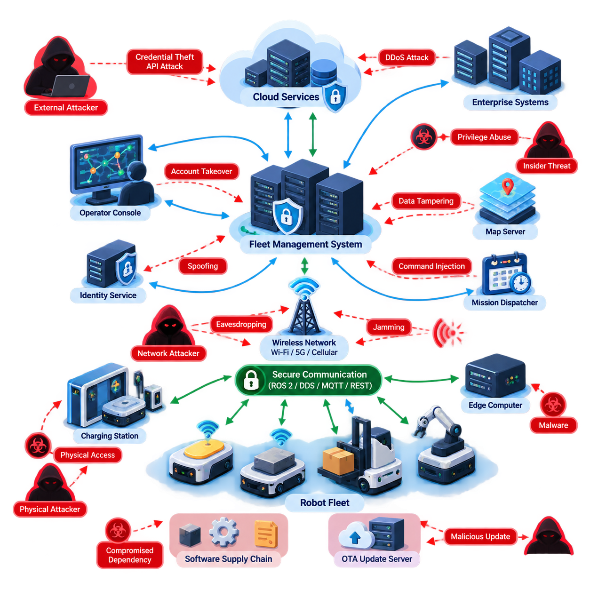
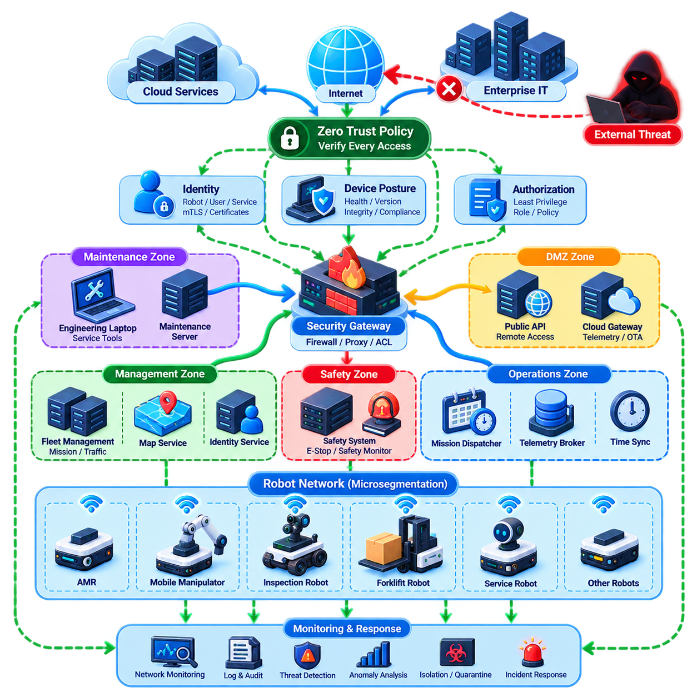
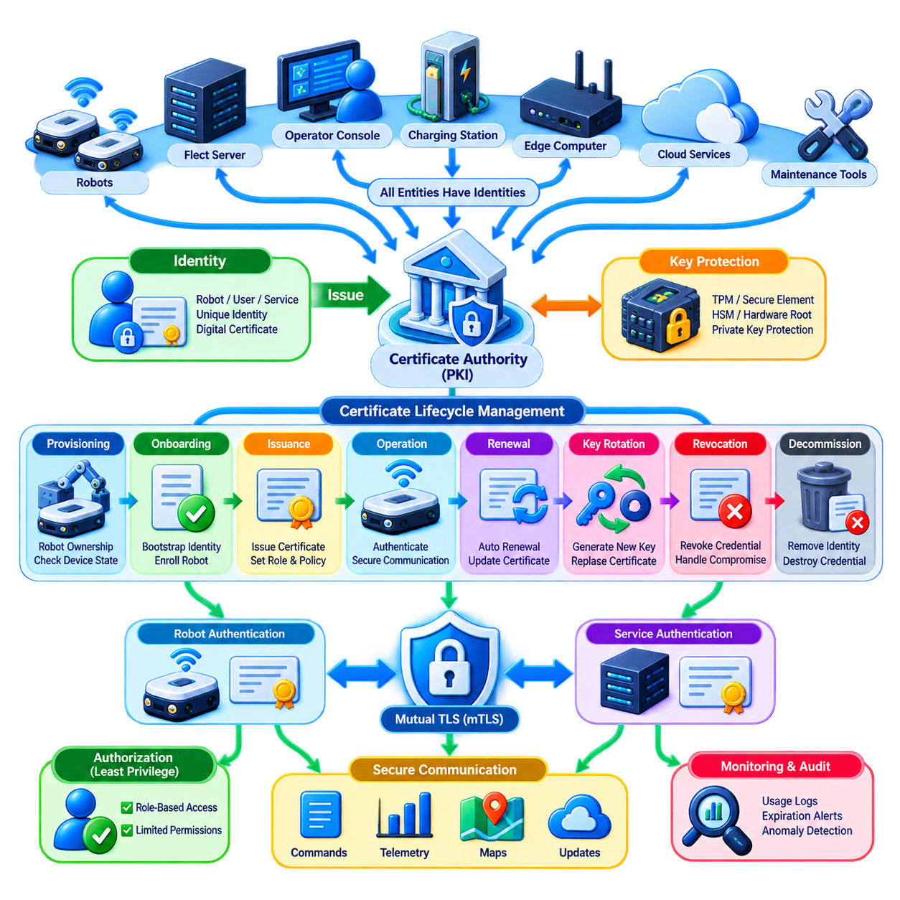
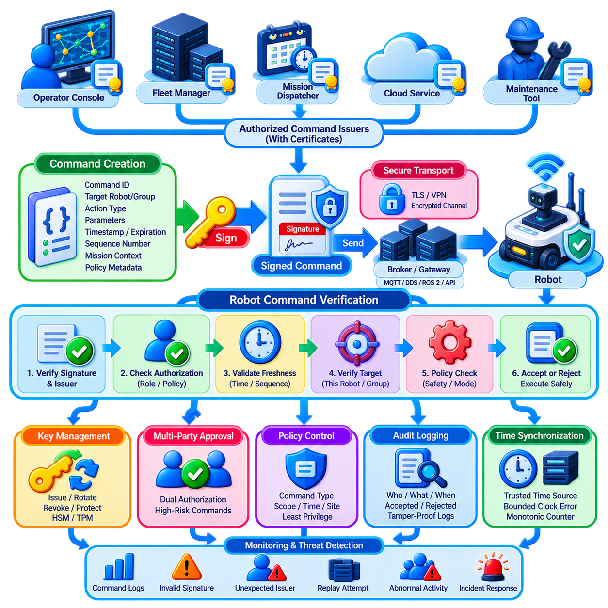
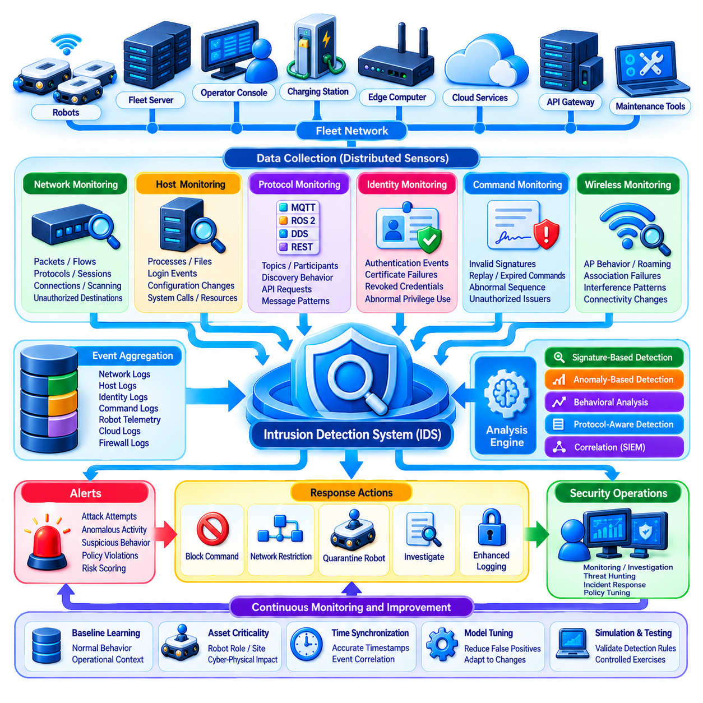
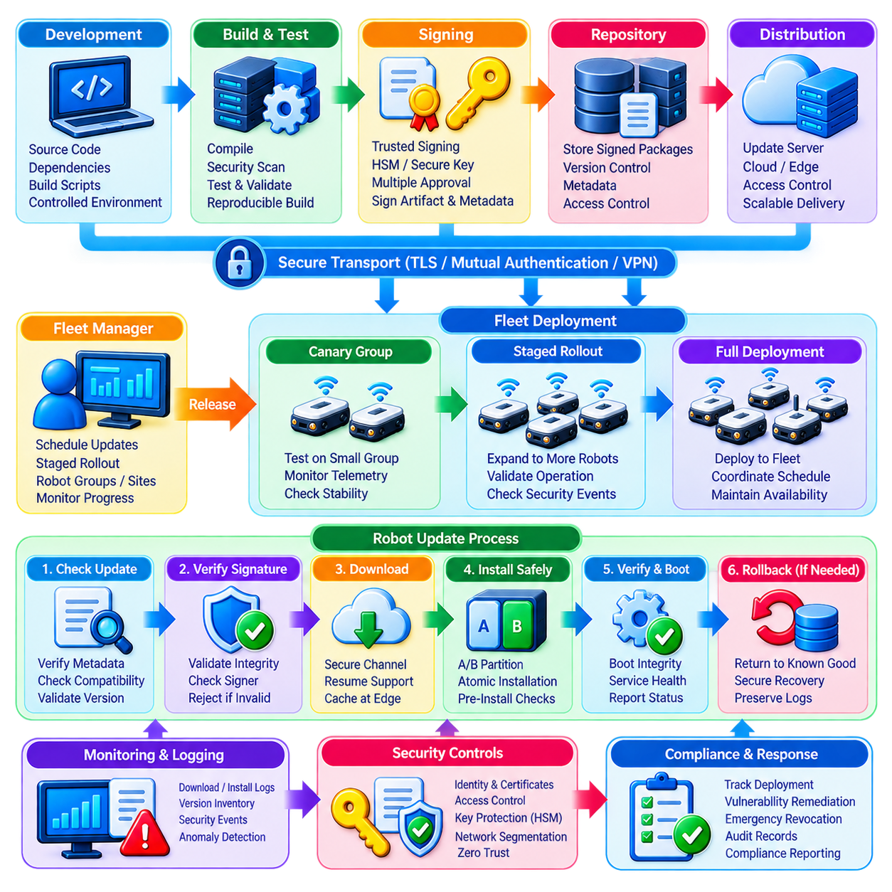
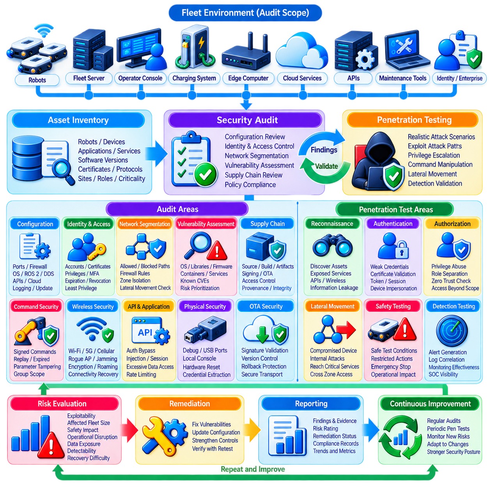
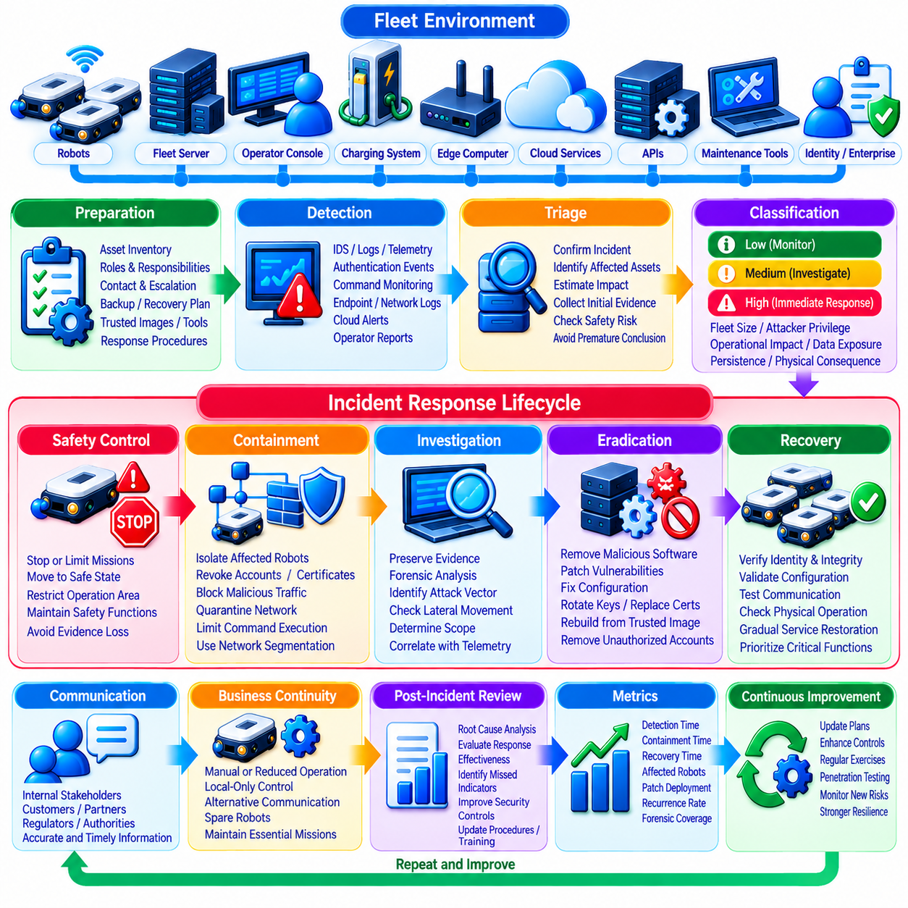
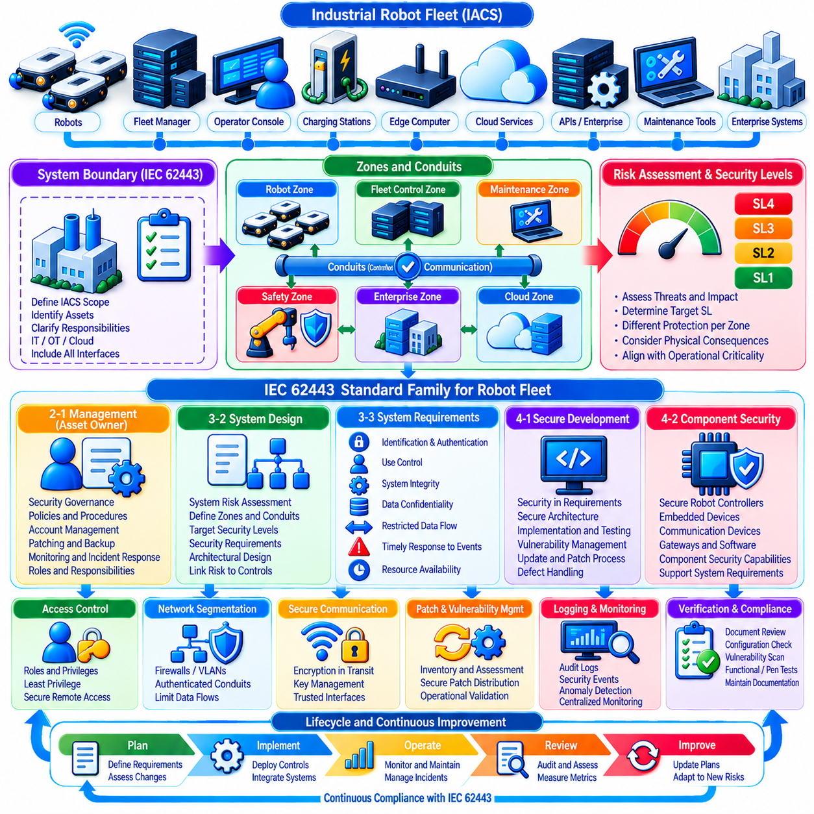
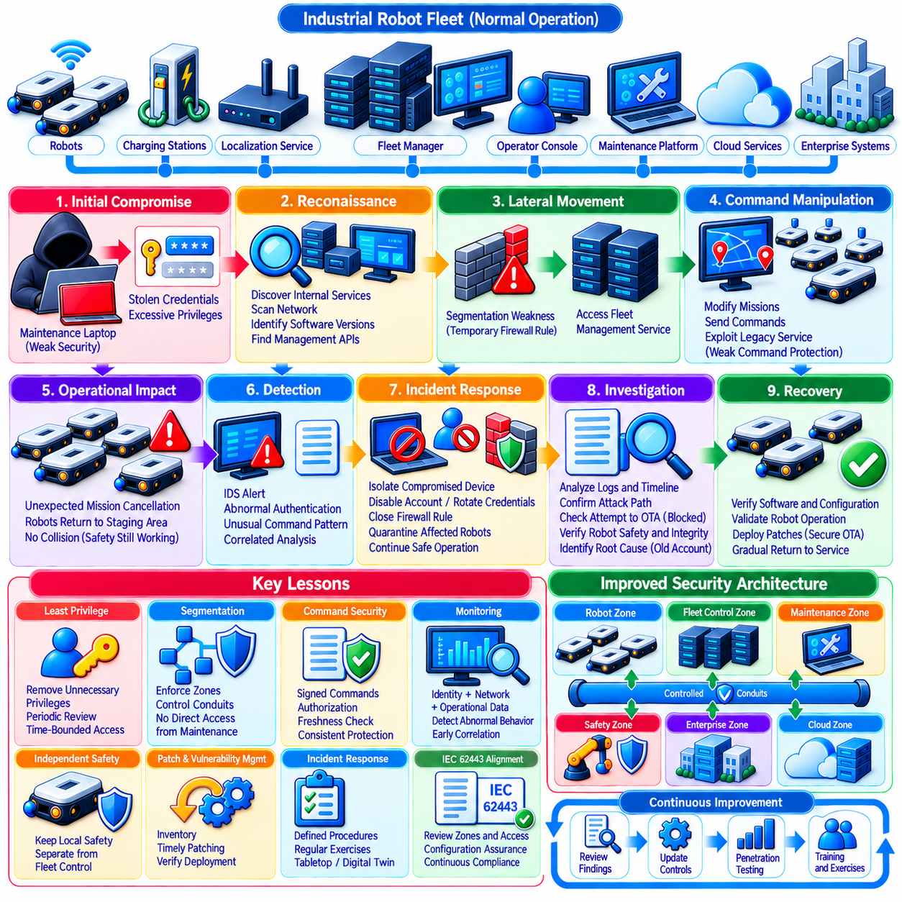

**Volume 16 Multi Robot and Fleet Intelligence**

# 11. Fleet Cybersecurity

## 11.01 Fleet Cybersecurity Threat Landscape and Attack Vectors

{width="7.268055555555556in" height="7.268055555555556in"}

Fleet cybersecurity begins with the recognition that a robot fleet is not simply a collection of autonomous machines. It is a distributed cyber-physical system connecting robots, fleet managers, edge computers, cloud services, wireless networks, operator consoles, charging stations, enterprise applications, and maintenance tools. Each connection expands operational capability while simultaneously creating another potential security boundary.

The threat landscape therefore extends far beyond attacks against an individual robot. A compromised fleet management system may influence hundreds of robots at once, while a compromised robot can become an entry point into broader operational infrastructure. Security analysis must consider both directions of propagation: attacks moving from enterprise or cloud systems toward robots, and attacks originating at field devices and moving toward centralized services.

Fleet architectures create particularly attractive targets because centralized services often possess high operational authority. Mission dispatchers, traffic managers, map servers, identity services, and remote intervention platforms can issue commands or distribute information across many machines. An attacker who compromises one of these trusted components may obtain significantly greater leverage than an attacker who compromises a single endpoint.

Robot communication channels form another major attack surface. Fleet systems commonly exchange telemetry, missions, localization data, maps, health information, and control messages through technologies such as ROS 2, DDS, MQTT, REST APIs, WebSockets, and proprietary protocols. The surrounding volume explicitly treats secure communication, cloud integration, and distributed intelligence as interconnected fleet concerns. Volume_16_Multi_Robot_and_Fleet...

Eavesdropping is one fundamental threat when communications are insufficiently protected. An adversary observing network traffic may reconstruct robot locations, operating schedules, mission assignments, facility topology, or equipment status. Even when control messages cannot immediately be modified, accumulated telemetry can reveal operational patterns that support later attacks against production, logistics, or physical security processes.

Message manipulation creates a more direct cyber-physical risk. An attacker positioned between communicating components may attempt to alter destinations, priorities, velocities, reservations, charging commands, or mission parameters. Replay attacks can be equally dangerous because previously valid commands may be retransmitted at inappropriate times. Authentication, integrity protection, freshness verification, and authorization must therefore be treated separately rather than assuming encryption alone provides complete protection.

Spoofing attacks target the trust relationships on which coordinated fleets depend. A malicious device may impersonate a legitimate robot, fleet server, operator terminal, charging station, or software service. If robot identity is weakly managed, an unauthorized endpoint could inject fabricated telemetry or request missions. This explains why robot identity and certificate lifecycle management belong directly beside network security in a fleet cybersecurity architecture. Volume_16_Multi_Robot_and_Fleet...

Availability attacks can be especially disruptive in large fleets. Denial-of-service traffic, wireless interference, exhausted message brokers, overloaded APIs, or deliberately generated requests may degrade communication even without gaining administrative privileges. The operational consequence can include delayed missions, traffic congestion, robots entering safe-stop states, charging disruption, or loss of fleet-wide coordination. Cybersecurity must therefore protect service continuity as well as confidentiality.

Wireless connectivity introduces additional exposure because AMRs and other mobile robots cannot rely exclusively on physically protected wired networks. Wi-Fi, private 5G, cellular connectivity, and local radio links may cross different trust domains as robots move through facilities or outdoor environments. Rogue access points, credential theft, jamming, insecure roaming configurations, and unauthorized devices must be considered as part of the fleet threat model.

Cloud-connected fleets expand the attack surface further through APIs, identity and access management, remote dashboards, data pipelines, and externally reachable services. Compromise of cloud credentials can provide access to telemetry or management functions without requiring physical proximity to a robot. Conversely, excessive dependence on cloud connectivity can create operational vulnerabilities when connectivity, authentication infrastructure, or cloud services become unavailable.

Software supply chains constitute another important attack vector. Robot fleets depend on operating systems, middleware, container images, drivers, AI libraries, third-party packages, firmware, and vendor applications. Malicious or vulnerable dependencies can enter the deployment pipeline before robots reach the field. Security must consequently extend into software provenance, dependency management, build systems, artifact signing, and controlled deployment rather than beginning only after installation.

Over-the-air updates deserve particular attention because OTA infrastructure intentionally possesses the authority to modify deployed systems. If update servers, signing credentials, repositories, or deployment mechanisms are compromised, an attacker could distribute malicious software across an entire fleet. Secure boot, cryptographic signing, version control, rollback protection, staged deployment, and recovery procedures transform OTA from a potential fleet-wide attack amplifier into a controlled security mechanism.

Physical access creates threats that conventional enterprise cybersecurity can underestimate. Robots operate in warehouses, hospitals, factories, ports, farms, and public or semi-public spaces where attackers may reach service ports, storage devices, network connectors, debug interfaces, or removable media. Physical possession of a robot can enable credential extraction, firmware modification, hardware replacement, or direct connection to trusted internal networks.

Fleet management interfaces also face conventional application-layer threats. Weak passwords, excessive privileges, exposed APIs, insecure session management, injection vulnerabilities, and poorly protected administrative functions can allow unauthorized control. Because operator interfaces may possess mission-level authority, role-based access control should distinguish monitoring, dispatch, maintenance, engineering, security administration, and emergency intervention rather than assigning broad privileges to every authenticated user.

Insider threats require similar attention. Employees, contractors, integrators, and maintenance personnel may legitimately possess access that would be difficult for an external attacker to obtain. Malicious actions are only one concern; configuration mistakes, accidental credential exposure, unauthorized software installation, or incorrect maintenance procedures can produce comparable consequences. Least privilege, auditability, separation of duties, and controlled service access reduce this class of risk.

Cybersecurity becomes more complex when AI contributes to fleet decisions. Manipulated sensor observations, corrupted training data, falsified fleet telemetry, adversarial inputs, or compromised models can influence anomaly detection, routing, scheduling, perception, and predictive maintenance. The surrounding architecture explicitly places AI optimization and model governance before fleet cybersecurity, emphasizing that intelligent fleet decisions introduce their own governance and trust requirements. Volume_16_Multi_Robot_and_Fleet...

A useful threat model therefore follows the complete command and data path rather than examining isolated devices. Assets include robot identities, mission commands, maps, credentials, software images, telemetry, AI models, operational databases, safety parameters, and fleet configuration. Trust boundaries appear wherever information crosses between robots, edge infrastructure, fleet servers, cloud platforms, enterprise systems, external vendors, or human operators.

Attack impact should likewise be evaluated in cyber-physical terms. Traditional consequences such as data theft and service interruption remain important, but robotic fleets add unsafe motion, blocked aisles, incorrect deliveries, coordinated traffic failures, production interruption, damaged equipment, and loss of human trust. A vulnerability with modest information-security impact may therefore become critical when it influences physical behavior or fleet-wide orchestration.

The defining cybersecurity challenge is ultimately scale. A fleet containing hundreds or thousands of robots produces thousands of identities, communication sessions, software versions, certificates, logs, and operational states. Manual security practices that work for a prototype become unsustainable at production scale. Security mechanisms must therefore be fleet-native: automated, centrally observable, policy-driven, resilient to partial failures, and capable of isolating compromised components without unnecessarily stopping the entire operation.

For this reason, fleet cybersecurity should be designed as a layered operational capability rather than a single defensive product. Network segmentation and zero trust limit lateral movement; strong robot identities establish trust; signed commands protect control authority; intrusion detection identifies abnormal activity; secure OTA closes vulnerabilities; auditing exposes weaknesses; and incident-response procedures restore operation after compromise. These elements correspond directly to the subsequent cybersecurity topics defined in the volume structure. Volume_16_Multi_Robot_and_Fleet...

The broader robotics software structure also separates fleet cybersecurity from the dedicated Robot Cybersecurity volume, which covers network security, ROS 2 and DDS security, edge AI security, cloud and fleet security, OTA security, testing, incident response, Physical AI security, and compliance. This separation indicates an important architectural distinction: robot cybersecurity protects individual robotic platforms and their technology stack, while fleet cybersecurity concentrates on the shared trust relationships and systemic risks created when many robots operate as one coordinated system. 08_Robotics_Software_Tree

## 11.02 Fleet Network Segmentation and Zero Trust Design [w/Code]

{width="7.268055555555556in" height="7.268055555555556in"}

Network segmentation is a foundational security mechanism for robot fleets because a large fleet combines devices and services with very different trust levels, privileges, and operational roles. Robots, fleet servers, operator consoles, charging systems, edge computers, cloud gateways, maintenance devices, and enterprise applications should not share one unrestricted network. Segmentation limits which components can communicate and reduces the impact of a compromised endpoint.

Traditional flat networks create dangerous conditions because successful compromise of one device can provide opportunities for lateral movement across the entire fleet infrastructure. A vulnerable maintenance laptop, robot, wireless endpoint, or application server may become a bridge toward mission-control systems. Segmentation divides the environment into controlled security zones so that compromise of one component does not automatically provide access to every other fleet resource.

A practical fleet architecture can separate robot operational networks, fleet management services, safety-related systems, engineering and maintenance networks, enterprise IT, cloud connectivity, and external access into distinct zones. Communication between these zones passes through controlled enforcement points. Firewalls, gateways, access-control policies, and application proxies determine which identities, protocols, ports, services, and data flows are permitted across each boundary.

Segmentation should reflect operational function rather than simply physical network topology. Two robots connected to the same wireless infrastructure do not necessarily require unrestricted peer-to-peer communication. A robot may need access to a mission dispatcher, map service, time synchronization source, and telemetry broker while having no legitimate reason to communicate directly with administrative databases or unrelated robots. Policies should therefore follow required communication relationships.

Virtual LANs can provide an initial logical separation between groups of devices, but VLAN separation alone should not be treated as complete security. Routing and security controls between segments determine whether separation actually restricts attacks. Industrial fleet designs may combine VLANs, firewall zones, software-defined networking, private wireless network policies, VPNs, secure gateways, and host-level filtering to create multiple mutually reinforcing boundaries.

Large heterogeneous fleets may require further segmentation according to robot class or operational responsibility. Warehouse AMRs, mobile manipulators, inspection robots, autonomous forklifts, and service robots can possess different software stacks and risk profiles. Separating these groups prevents vulnerabilities associated with one platform family from immediately exposing every other platform and allows security policies to reflect their actual operational requirements.

Microsegmentation extends this principle from broad network zones toward individual workloads, services, robots, or application groups. Instead of assuming that everything inside a robot network is trusted, communication can be permitted only between explicitly authorized endpoints. A telemetry service may accept robot status messages while refusing mission commands, whereas a mission dispatcher may communicate through a narrowly defined authenticated interface.

Zero Trust strengthens segmentation by rejecting the assumption that network location establishes trust. A device does not become trustworthy simply because it is connected to an internal Ethernet network, authenticated Wi-Fi infrastructure, private 5G network, or corporate VPN. Every access request should instead be evaluated according to identity, authorization, device condition, requested resource, operational context, and security policy.

Robot identity is consequently central to Zero Trust fleet design. Each robot should possess a unique cryptographically verifiable identity rather than relying only on an IP address, hostname, shared password, or network location. Servers, operator consoles, gateways, and services require identities as well. Mutual authentication allows both communicating parties to verify that the other endpoint is an authorized participant before exchanging sensitive fleet information.

Identity should also be separated from authorization. Authentication answers whether a robot or user is genuinely who it claims to be, while authorization determines what that identity is permitted to do. A legitimate inspection robot may be authorized to upload telemetry and retrieve maps but not modify fleet policies. Similarly, a maintenance engineer may diagnose selected robots without receiving authority to dispatch missions across the entire fleet.

Least-privilege access is particularly important because fleet services frequently possess powerful capabilities. Mission dispatch, traffic coordination, map distribution, OTA management, remote intervention, and identity administration can affect many robots simultaneously. Permissions should therefore be constrained by function, resource, robot group, site, and operation whenever practical. Broad administrative credentials substantially increase the potential impact of credential compromise.

Zero Trust policies should consider device posture as well as identity. A robot presenting a valid certificate may still be unsafe if its software is outdated, secure boot validation has failed, required security agents are disabled, or unexpected configuration changes have occurred. Access decisions can therefore incorporate firmware version, software integrity, certificate state, vulnerability status, and other evidence describing the security condition of the endpoint.

Communication between fleet components should use authenticated and encrypted channels where appropriate. Mutual TLS can protect many client-server and service-to-service interactions by combining confidentiality, integrity, and mutual certificate authentication. ROS 2 and DDS deployments can use security mechanisms appropriate to their middleware architecture, while MQTT, REST, and other application interfaces should apply equivalent authentication and transport protections.

Segmentation must also address wireless mobility. Robots may roam between access points, cells, buildings, production zones, or outdoor operating areas while maintaining active missions. Security policy should follow the robot identity rather than disappearing when its network attachment changes. Private 5G, enterprise Wi-Fi, and other mobile infrastructures should therefore preserve controlled connectivity while supporting handover and operational continuity.

North-south and east-west traffic require different security considerations. North-south traffic connects robot environments with fleet servers, enterprise systems, cloud platforms, or external services, while east-west traffic occurs among robots and internal workloads. Traditional perimeter defenses concentrate heavily on north-south traffic, but compromised robots can exploit unrestricted east-west connectivity. Microsegmentation is particularly valuable for limiting this lateral movement.

Maintenance access requires a dedicated trust boundary because diagnostic tools often need privileges unavailable during normal robot operation. Engineering laptops, vendor service systems, debug interfaces, and remote support connections should not receive permanent unrestricted access to production networks. Controlled maintenance gateways, temporary authorization, multifactor authentication, session logging, and time-limited privileges can reduce the risk associated with privileged service operations.

Cloud integration creates another boundary that should be explicitly segmented from real-time robot control. Telemetry upload, analytics, model distribution, fleet dashboards, and remote services may legitimately communicate with cloud infrastructure, but cloud connectivity should not automatically expose safety-critical or low-level control networks. Edge gateways can mediate communication and enforce policies while allowing robots to retain essential autonomous functions during cloud disconnection.

Segmentation must preserve safety and operational availability rather than blocking necessary communication indiscriminately. An excessively restrictive rule can interrupt localization, traffic coordination, charging, map distribution, or emergency operations. Fleet security engineering therefore requires a verified communication matrix describing which components communicate, in which direction, using which protocol, under what identity, and for what operational purpose.

Monitoring is essential because segmentation controls also provide valuable observation points. Firewalls, gateways, identity systems, wireless controllers, and service proxies can generate records showing attempted connections, denied requests, authentication failures, unexpected protocol use, and unusual traffic patterns. Centralized analysis of these events can reveal reconnaissance, lateral movement, compromised credentials, or malfunctioning devices before fleet-wide disruption occurs.

Zero Trust should also assume that compromise can occur despite preventive controls. When suspicious behavior is detected, the architecture should support rapid isolation of an affected robot, service, account, or network segment. Quarantine should preserve diagnostic visibility while preventing unauthorized commands or lateral movement. This enables security teams to contain incidents without unnecessarily shutting down hundreds of unaffected robots.

Scalability becomes critical when fleets grow from tens to hundreds or thousands of robots. Manually configuring firewall rules for individual devices eventually becomes impractical and error-prone. Policies should therefore be defined through identities, roles, robot classes, sites, security groups, and machine-readable rules. Automated onboarding can assign new robots to appropriate security domains while certificate and configuration management maintain consistent controls throughout their lifecycle.

A mature architecture combines macro-segmentation, microsegmentation, strong identity, least privilege, continuous verification, encrypted communication, monitoring, and automated isolation. None of these controls is sufficient alone. Together they transform the fleet network from a trusted internal environment into a collection of explicitly controlled relationships in which every communication path has a defined purpose and security policy.

The resulting design follows a simple principle: compromise of one robot should not imply compromise of the fleet. A compromised endpoint should encounter restricted communication paths, limited privileges, authenticated boundaries, monitored behavior, and mechanisms capable of isolating it. Network segmentation limits where an attacker can move, while Zero Trust limits what any identity can do, creating complementary defensive layers for large-scale robot fleet operations.

## 11.03 Robot Identity and Certificate Lifecycle Management [w/Code]

{width="7.268055555555556in" height="7.268055555555556in"}

Robot identity is the foundation of trustworthy communication in a fleet because every command, telemetry message, software update, and service request must be associated with a verifiable entity. An IP address, hostname, serial number, or shared password is insufficient for establishing trust. Each robot should possess a unique cryptographic identity that can be authenticated independently of its current network location.

A fleet identity architecture extends beyond robots themselves. Fleet management servers, mission dispatchers, telemetry brokers, map services, edge computers, charging stations, operator consoles, maintenance tools, cloud gateways, and software services also require identities. When every participating entity has an independently verifiable identity, authorization policies can be expressed according to roles and operational relationships rather than relying on implicit network trust.

Public Key Infrastructure, or PKI, provides a practical foundation for managing these identities at fleet scale. A robot can possess a private key and an associated digital certificate containing its public key and identity information. A trusted Certificate Authority issues or signs the certificate, allowing other fleet components to verify that the presented identity belongs to an approved participant within the operational security domain.

The private key is the most sensitive element of this identity because possession of the key enables an entity to prove its identity cryptographically. Keys should therefore be generated, stored, and used in ways that minimize extraction risk. Hardware-backed mechanisms such as TPMs, secure elements, hardware security modules, or protected execution environments can provide stronger protection than storing long-term private keys as ordinary software files.

Identity provisioning begins during robot onboarding. A newly manufactured, purchased, or commissioned robot should not automatically receive unrestricted access simply because it is connected to the fleet network. The onboarding process should verify device ownership, hardware or manufacturing identity where available, approved software state, fleet assignment, operational role, and security policy before issuing production credentials.

Bootstrap identity is especially important during initial enrollment. Before a robot receives its normal operational certificate, the fleet must establish why it should trust the device requesting enrollment. This trust may originate from manufacturer-installed credentials, hardware roots of trust, controlled provisioning stations, one-time enrollment secrets, or manually verified commissioning procedures. Weak bootstrap mechanisms can undermine an otherwise strong PKI architecture.

Certificate issuance transforms an approved robot identity into an operational credential. The Certificate Authority can issue certificates containing information such as robot identity, fleet domain, site association, service role, validity period, and cryptographic parameters. Certificates should contain only information required for authentication and policy decisions because unnecessary identity information increases complexity and can expose operational details.

Mutual TLS, or mTLS, is a common mechanism for using certificates in fleet communication. Unlike conventional TLS where only the server may be authenticated, mTLS allows both endpoints to present and verify certificates. A robot can verify that it is communicating with an authorized fleet service while the service simultaneously verifies the robot, creating bidirectional authentication before mission or telemetry information is exchanged.

Certificate authentication should remain distinct from authorization. A valid certificate proves that an entity possesses an accepted identity credential, but it does not imply unlimited access. A delivery AMR may be allowed to publish telemetry and receive missions while being prohibited from modifying maps, security policies, or other robots. Authorization systems should translate authenticated identity into narrowly defined permissions according to operational roles.

Certificate lifetime is an important security design parameter. Certificates that remain valid for many years reduce administrative activity but increase exposure when credentials are stolen or devices disappear. Shorter-lived certificates reduce this window but require reliable renewal infrastructure. Fleet architectures must balance operational availability, connectivity conditions, certificate rotation frequency, and the consequences of credential compromise.

Renewal should occur before certificate expiration and preferably without manual intervention. A robot can authenticate using its current credential, demonstrate an acceptable security state, generate or activate a new key where required, and obtain a replacement certificate. Automated renewal becomes essential when hundreds or thousands of robots are deployed because manual certificate replacement quickly becomes operationally impractical.

Key rotation complements certificate renewal by limiting the duration for which a cryptographic key remains useful. Reissuing a certificate around the same private key does not provide the same protection as periodically replacing the key itself. Rotation policies may consider device capability, operational criticality, cryptographic standards, detected incidents, and organizational security requirements when determining when new key pairs should be created.

Certificate revocation addresses credentials that must become invalid before their scheduled expiration. Revocation may be necessary when a robot is stolen, decommissioned, transferred, compromised, or suspected of exposing its private key. It may also be required when an operator account, server, gateway, or maintenance device loses authorization. Fleet services need a reliable mechanism for learning that previously trusted credentials must no longer be accepted.

Revocation checking can be challenging in robotic environments where connectivity is intermittent. Certificate Revocation Lists, online status services, short-lived certificates, or locally synchronized trust information provide different approaches. The architecture should avoid making every safety-relevant robot action dependent on continuous Internet access while still ensuring that revoked identities cannot remain trusted indefinitely during extended offline operation.

Certificate expiration must also be treated as an operational event rather than merely an administrative issue. If a large group of robots receives certificates with identical expiration times, simultaneous failures or renewal storms can occur. Renewal schedules should therefore be distributed over time, monitored centrally, and supported by alerts for certificates approaching expiration. Security credential health becomes part of overall fleet health management.

Trust anchors require particularly strong protection because compromise of a root or intermediate Certificate Authority can undermine identities across the fleet. Root keys should be tightly protected and used infrequently, while intermediate authorities can be assigned to specific environments, sites, device classes, or operational domains. Hierarchical PKI designs reduce the exposure of the highest-level trust anchors and provide manageable administrative boundaries.

Multi-site fleets may require trust relationships between factories, warehouses, ports, hospitals, outdoor facilities, or regional cloud systems. A common root of trust can provide organizational consistency, while subordinate authorities separate operational domains. Cross-domain communication should be explicitly authorized so that a valid certificate issued for one site does not automatically provide unrestricted access to resources at another site.

Identity lifecycle management must follow the complete robot lifecycle. A robot progresses through manufacturing or acquisition, provisioning, onboarding, operation, maintenance, software upgrades, reassignment, repair, temporary suspension, and eventual decommissioning. Identity state should change with these transitions. Credentials belonging to retired or removed robots must be revoked or destroyed rather than remaining valid after the physical device leaves service.

Maintenance introduces additional identity challenges because technicians and service tools may temporarily require elevated access. Permanent shared maintenance credentials should be avoided. Technician identities, maintenance devices, and service applications should be authenticated independently, with privileges limited by robot, function, location, and time. Temporary certificates or short-lived access credentials can reduce exposure after maintenance work has been completed.

Certificate management should integrate with fleet monitoring and security auditing. The fleet should maintain visibility into certificate ownership, issuance, expiration, renewal, revocation, failed authentication, unusual certificate usage, and trust-chain errors. Sudden authentication failures across many robots may indicate configuration problems, certificate infrastructure failure, or active attack and should therefore generate actionable security events.

Automation is essential at production scale. A certificate management platform should support automated enrollment, issuance, distribution, renewal, rotation, revocation, inventory, and compliance reporting. These processes should integrate with robot registries and fleet lifecycle systems so that security identity follows operational state. Adding a robot to the fleet should establish its security credentials, while removing it should terminate its trust relationships.

A resilient identity architecture must also anticipate infrastructure failures. Robots should behave predictably if certificate authorities, status services, or network connections become temporarily unavailable. Existing valid credentials may continue supporting authorized local operation according to defined policies, while issuance or privileged changes can be restricted until trust services recover. Security mechanisms should fail safely without unnecessarily disabling the entire fleet.

Ultimately, robot identity and certificate lifecycle management convert fleet trust from an informal network assumption into a controlled cryptographic system. Every robot and service receives a verifiable identity, every identity receives limited authority, and every credential has a managed beginning and end. When provisioning, authentication, renewal, rotation, revocation, monitoring, and decommissioning operate as one lifecycle, large robot fleets can maintain scalable trust without depending on permanent network location or shared secrets.

## 11.04 Fleet Command Authentication and Signing [w/Code]

{width="7.268055555555556in" height="7.268055555555556in"}

Fleet command authentication ensures that a robot executes instructions only when they originate from an authorized entity and satisfy the security policy of the fleet. Commands such as mission assignment, navigation goals, traffic reservations, charging requests, remote intervention, configuration changes, and emergency actions can directly influence physical behavior. Their authenticity therefore requires stronger protection than ordinary informational messages.

Transport encryption alone does not prove that an individual command was legitimately created. TLS or another secure channel protects communication between endpoints, but commands may pass through brokers, gateways, queues, databases, or intermediate services before reaching a robot. Command-level authentication adds protection to the instruction itself, allowing the receiver to evaluate its origin and integrity independently of the transport path.

Digital signatures provide a practical mechanism for protecting fleet commands. The authorized command issuer calculates a cryptographic digest of the command and signs the relevant data with its private key. The receiving robot or service verifies the signature using the corresponding public key. Successful verification demonstrates that protected command content has not been modified and that it was signed by an entity possessing the authorized private key.

The signed data must include more than the requested action. A robust command envelope can contain the command identifier, issuer identity, target robot or group, action type, parameters, timestamp, sequence number, expiration time, mission context, and policy-related metadata. Signing these fields prevents an attacker from changing the destination, parameters, timing, or operational scope while leaving the apparent command type unchanged.

Authentication and authorization remain separate decisions. A cryptographically valid signature proves that a known entity signed the command, but it does not automatically mean that the signer is permitted to issue that command. The robot must also determine whether the authenticated issuer has authority for the requested action, target, operating mode, site, and time. This prevents valid but overprivileged identities from controlling unrelated resources.

Replay protection is essential because an attacker may capture a correctly signed command and transmit it again later without modifying the signature. A previously legitimate navigation, charging, restart, or actuator command can become dangerous when executed at the wrong time. Timestamps, expiration windows, unique nonces, monotonic counters, sequence numbers, or transaction identifiers can allow receivers to reject previously processed or stale commands.

Time-based validation requires trustworthy time synchronization. If robots and fleet services disagree significantly about time, legitimate commands may be rejected or expired commands may remain acceptable. Fleet architectures can therefore combine authenticated time sources, bounded clock-error policies, monotonic counters, and sequence validation. Safety-critical functions should not depend on a single fragile external time service when alternative freshness mechanisms are possible.

Command signing keys require strong protection because compromise of an authorized issuer key can allow an attacker to generate commands that appear legitimate. High-authority keys used by fleet controllers, safety administrators, OTA services, or remote intervention systems should receive stronger protection than ordinary application credentials. TPMs, secure elements, HSMs, protected key stores, and tightly controlled signing services can reduce key extraction risk.

Different command classes should have different authorization requirements. Routine telemetry configuration or low-risk mission updates may follow normal authenticated workflows, while commands affecting safety parameters, firmware, fleet-wide configuration, or emergency overrides may require elevated assurance. Policy can require stronger credentials, additional approval, restricted interfaces, or multiple authorized parties before particularly sensitive operations are accepted.

Multi-party approval can reduce the danger associated with a single compromised administrator. A high-impact command may require signatures or approvals from two independent roles before execution. For example, modifying a fleet-wide safety policy could require both an engineering authority and a security authority. Such controls should be reserved for operations where additional assurance justifies the increased operational complexity and latency.

Command brokers and middleware require careful trust design. MQTT brokers, DDS infrastructure, ROS 2 components, API gateways, and message queues may route instructions between command issuers and robots. Ideally, intermediaries should not gain the ability to silently alter signed command content. End-to-end signing allows the final recipient to verify the original issuer even when the message travels through multiple infrastructure components.

Fleet commands may also target groups rather than individual robots. A dispatcher could issue a command to all robots within a site, mission, zone, or operational class. Group commands increase efficiency but also amplify risk because a single instruction can affect many machines. The signed command should therefore clearly identify its target scope, and each receiving robot should independently verify that it belongs to the authorized target group.

Delegation is another important consideration in distributed fleets. A central fleet manager may authorize a local edge controller to issue commands during normal operation or cloud disconnection. Delegated authority should be explicit and limited by command type, robot group, site, duration, and operational context. The edge controller should not automatically inherit every privilege possessed by the central system merely because it acts on its behalf.

Offline operation requires local verification capability. A robot should not need continuous cloud connectivity simply to determine whether a signed command is authentic. Required public keys, certificate chains, authorization policies, revocation information, and verification logic can be maintained locally within defined validity periods. This allows essential fleet operations to continue securely when external connectivity is degraded or temporarily unavailable.

Emergency commands require special design because they combine high authority with strict latency requirements. Emergency stop or safety-related intervention must not be delayed by unnecessarily complex remote authorization chains. The architecture should distinguish safety mechanisms from ordinary mission control and provide deterministic, protected paths appropriate to the system safety design while preventing unauthorized remote actors from abusing emergency interfaces.

Command rejection must lead to predictable behavior. If signature verification fails, the issuer is unauthorized, the command has expired, the sequence is invalid, or required policy conditions are not satisfied, the robot should reject the instruction and preserve a safe operational state. Rejection should generate sufficient diagnostic information for security monitoring without exposing sensitive cryptographic material or enabling attackers to infer unnecessary internal details.

Auditability is a major advantage of authenticated and signed commands. Fleet systems can record who issued a command, which robot received it, when it was created, whether its signature was valid, which authorization policy was applied, and whether execution was accepted or rejected. These records support incident investigation, operational debugging, accountability, compliance assessment, and reconstruction of events following unexpected robot behavior.

Audit logs themselves require integrity protection. If an attacker can alter command records after compromising a system, investigators may be unable to distinguish legitimate operations from malicious activity. Append-oriented logging, signed records, protected centralized storage, trusted timestamps, and controlled retention policies can improve forensic reliability. Important command events can also be correlated with robot telemetry and network security observations.

Key and certificate lifecycle management directly affects command authentication. Signing keys must be issued, rotated, revoked, and retired according to the identity lifecycle of robots, services, operators, and fleet controllers. A command signed by a revoked or expired credential should not retain unlimited authority simply because its mathematical signature remains valid. Verification must therefore consider credential status as well as cryptographic correctness.

Cryptographic agility is important for long-lived robotic systems. Fleets may operate for many years while algorithms, key lengths, certificates, and security standards evolve. Command formats should identify approved cryptographic algorithms and versions without allowing attackers to force insecure downgrade paths. A controlled migration mechanism enables stronger algorithms to be introduced without simultaneously replacing every robot and fleet service.

Performance must be considered when large fleets generate high command rates. Signature creation and verification consume computation and may add latency, particularly on constrained embedded processors. Architecture can optimize verification paths, use suitable modern cryptographic algorithms, distinguish high-value commands from high-volume telemetry, and avoid unnecessary repeated operations while preserving required security properties.

Command authentication should also integrate with network segmentation and Zero Trust principles. A signed command arriving through an unauthorized network path should not automatically bypass network policy, and network access alone should never replace command verification. Identity, network policy, command signature, authorization, freshness, device state, and operational context together provide stronger assurance than any single control.

Monitoring systems can use command verification events as security signals. Repeated invalid signatures, unexpected issuers, expired commands, abnormal sequence numbers, commands targeting unusual robot groups, or sudden increases in privileged actions may indicate attack or configuration failure. Correlating these events across the fleet enables detection of coordinated attempts that may appear insignificant when examining only one robot.

A mature fleet command security architecture therefore establishes a verifiable chain from command creation to physical execution. The issuer is authenticated, the complete command context is signed, authorization is checked, freshness is verified, credentials are validated, and the result is audited before or alongside execution. This transforms commands from trusted network messages into independently verifiable security objects.

The central principle is that physical action must never depend solely on where a message came from on the network. A robot should be able to determine who issued an instruction, whether that entity is authorized, whether the command was modified, whether it is still valid, and whether it applies to the current robot and operational context. Command authentication and signing thereby provide a critical security boundary between digital fleet intelligence and physical robot behavior.

## 11.05 Intrusion Detection System for Fleet Network [w/Code]

{width="7.268055555555556in" height="7.268055555555556in"}

An Intrusion Detection System, or IDS, provides continuous security visibility across a robot fleet by observing network traffic, device behavior, authentication events, and service interactions for evidence of malicious or abnormal activity. Preventive controls such as firewalls, segmentation, encryption, and authentication reduce attack opportunities, but an IDS addresses the possibility that an attacker has bypassed those controls or compromised a trusted component.

Fleet networks create distinctive monitoring requirements because they combine conventional IT traffic with operational robot communication. Mission commands, telemetry streams, localization updates, map transfers, charging requests, ROS 2 and DDS messages, MQTT topics, REST APIs, and remote maintenance sessions may coexist on the same infrastructure. Effective intrusion detection must understand both network behavior and the operational meaning of robot communications.

A fleet IDS can collect observations from multiple locations rather than relying on a single network sensor. Strategic monitoring points include robot network segments, wireless gateways, fleet management servers, edge computers, cloud gateways, API gateways, maintenance zones, and connections to enterprise systems. Distributed sensors provide visibility into attacks that might otherwise remain hidden inside segmented or geographically distributed environments.

Network-based intrusion detection analyzes packets, flows, sessions, protocols, and communication relationships without necessarily modifying the monitored endpoints. It can identify suspicious connection attempts, unexpected ports, unusual protocol combinations, scanning behavior, excessive traffic, malformed messages, and communication with unauthorized destinations. Network monitoring is particularly valuable for detecting lateral movement between compromised fleet components.

Host-based intrusion detection complements network monitoring by observing activity inside robots, edge computers, and servers. Relevant signals can include processes, file modifications, login events, privilege changes, system calls, configuration changes, software integrity, and resource consumption. Host visibility can reveal malicious activity that is encrypted on the network or occurs locally without producing easily recognizable external traffic.

Signature-based detection compares observed activity with known attack patterns, indicators, rules, or previously identified malicious behavior. It is effective for recognizing known exploits, scanning tools, malware traffic, or prohibited protocol sequences with relatively clear evidence. However, signature detection alone cannot reliably identify new attack techniques, compromised legitimate credentials, or subtle manipulation that does not match an existing rule.

Anomaly-based detection addresses this limitation by learning or defining what normal fleet behavior looks like and identifying significant deviations. Robot fleets are well suited to behavioral modeling because many communication relationships are repetitive and operationally constrained. A robot that normally contacts only a mission server, telemetry broker, map service, and time source should attract attention if it suddenly scans unrelated devices or contacts an unknown external host.

Behavioral baselines can incorporate communication frequency, message rate, packet size, destination patterns, authentication behavior, command types, mission states, operating hours, and robot roles. Baselines should distinguish legitimate variation from suspicious deviation. A charging robot, an active transport AMR, and a maintenance-mode robot naturally exhibit different traffic patterns, so detection models should consider operational context rather than applying one static threshold to every device.

Protocol-aware detection improves accuracy by interpreting application-level semantics. An IDS that understands MQTT can examine topic usage and publishing behavior, while ROS 2 and DDS monitoring can observe unexpected participants, topics, discovery behavior, or communication relationships. REST and API monitoring can detect unusual endpoints, request rates, authentication failures, or privileged operations inconsistent with the identity making the request.

Identity events provide another valuable detection source. Repeated certificate failures, revoked credentials, authentication attempts from unexpected devices, unusual account locations, abnormal privilege use, or one identity appearing simultaneously from incompatible endpoints can indicate compromise. Integrating PKI and Zero Trust telemetry with intrusion detection allows the IDS to evaluate not only network addresses but also the identities participating in communication.

Signed command verification produces especially meaningful fleet-specific security signals. Invalid signatures, replayed commands, expired timestamps, abnormal sequence numbers, unauthorized command issuers, or commands targeting unexpected robot groups can reveal attempts to manipulate physical operations. Correlating command security events with network and host observations provides stronger evidence than analyzing each signal independently.

Wireless monitoring is important because mobile robots frequently rely on Wi-Fi, private 5G, cellular networks, or other radio technologies. Detection mechanisms can monitor abnormal association behavior, repeated authentication failures, unexpected access points, unusual roaming events, interference patterns, and connectivity changes. Some radio disruptions may originate from environmental conditions rather than attacks, requiring correlation with operational and RF information.

Centralized security analytics can combine events generated across the distributed fleet. A Security Information and Event Management platform, or equivalent analytics layer, can aggregate IDS alerts, firewall logs, robot events, authentication records, command verification results, cloud logs, and fleet management data. Correlation helps reveal coordinated attacks whose individual events appear harmless when examined on a single robot.

Time synchronization is essential for meaningful correlation. If robots, gateways, servers, and cloud services record events using inconsistent clocks, reconstructing an intrusion becomes difficult. Fleet security infrastructure should maintain sufficiently accurate and trustworthy timestamps while accounting for robots that temporarily operate offline. Event records should preserve both local context and synchronization information where necessary.

Detection severity should reflect cyber-physical impact rather than only conventional network risk. An unusual connection to a low-value diagnostic service may deserve limited attention, while suspicious traffic affecting mission dispatch, traffic coordination, safety configuration, remote control, or OTA infrastructure can require immediate escalation. Fleet IDS policies should therefore incorporate asset criticality and potential physical consequences into alert prioritization.

False positives are a significant operational concern. Robot fleets experience software deployments, map updates, maintenance operations, shift changes, charging cycles, network handovers, and changing mission loads that can produce legitimate behavioral changes. Excessive alerts cause operator fatigue and reduce confidence in the detection system. Detection rules and anomaly models should therefore be validated against realistic fleet operations and continuously tuned.

Machine learning can support anomaly detection when large volumes of fleet telemetry make manual rule construction difficult. Models may identify unusual communication sequences, traffic distributions, device behavior, or combinations of weak signals. However, AI-based detection should not be treated as an unquestionable security authority. Explainability, baseline drift, training-data quality, adversarial manipulation, and model performance must be monitored throughout deployment.

Detection must connect to response mechanisms to provide operational value. Depending on severity, an alert may trigger enhanced logging, operator notification, credential verification, rate limiting, network restriction, command blocking, or isolation of a suspicious robot. Automated responses should be carefully constrained because an incorrect security decision that disconnects critical robots can itself cause operational or safety problems.

Quarantine is particularly useful in segmented fleet architectures. A suspicious robot can be moved into a restricted security state where normal mission participation is disabled while diagnostic communication remains available. This limits lateral movement and unauthorized command activity without immediately powering down the machine. After investigation and remediation, the robot can be reauthenticated and returned to its normal operational segment.

IDS deployment must remain resilient because attackers may deliberately target the monitoring infrastructure. Sensors, log collectors, analytics servers, and alert channels require authentication, access control, integrity protection, and resource isolation. Critical security records should be transmitted or stored in ways that make silent deletion difficult. A compromised robot should not be able to erase the centralized evidence needed to investigate its behavior.

Fleet-scale operation requires automated sensor deployment, policy distribution, configuration management, and health monitoring. Security teams need to know whether every expected robot and network segment is being observed and whether detection agents are functioning correctly. Missing telemetry from a normally active robot can itself be a security signal, particularly if monitoring disappears immediately before unusual operational behavior.

Detection policies should evolve with the fleet. New robot types, protocols, applications, cloud services, software versions, and operational workflows change what constitutes normal behavior. Security validation should therefore accompany fleet expansion and software deployment. Simulation, digital twins, test networks, and controlled attack exercises can help evaluate detection rules before they are introduced into production environments.

A mature fleet IDS combines signature detection, anomaly analysis, protocol awareness, identity monitoring, command verification, host telemetry, and network observations. No individual method provides complete coverage. Correlation across these layers enables the system to distinguish isolated technical anomalies from coordinated malicious activity and provides security teams with enough context to determine the appropriate operational response.

The fundamental objective is not merely to detect malicious packets but to recognize when the trust assumptions of the fleet are being violated. Effective intrusion detection determines whether robots are communicating with expected entities, using approved protocols, performing authorized actions, and behaving consistently with their operational roles. By connecting cyber events with physical fleet context, the IDS becomes a central component of continuous fleet security and incident response.

## 11.06 Secure OTA Update for Fleet Security Patches [w/Code]

{width="7.268055555555556in" height="7.268055555555556in"}

Secure Over-the-Air update is a critical fleet capability because robots require continuous correction of software vulnerabilities, middleware defects, firmware weaknesses, configuration errors, and security-policy issues after deployment. OTA allows these corrections to reach distributed robots without physical servicing, but the same mechanism possesses exceptional authority. If compromised, an update system can distribute malicious code across an entire fleet.

A secure OTA architecture therefore treats the update pipeline as part of the fleet security boundary rather than as a simple software distribution service. Protection must extend from source code and build environments through artifact repositories, signing infrastructure, distribution servers, edge gateways, robot download agents, installation mechanisms, and post-update verification. Trust must be preserved across every stage of this chain.

The software supply chain is the first security concern. Attackers may attempt to modify source repositories, dependencies, build scripts, container images, firmware packages, or generated binaries before an update reaches the fleet. Controlled development environments, authenticated repositories, dependency verification, reproducible or traceable builds, access control, and software provenance records help establish confidence that an update corresponds to an approved software release.

Digital signing provides the central mechanism for proving update authenticity and integrity. After an approved software artifact is generated, a trusted signing authority calculates a cryptographic digest and signs the release metadata or package using a protected private key. Robots verify the signature before installation. Any unauthorized modification to the protected artifact causes verification to fail, preventing altered packages from being accepted as legitimate updates.

Signing keys require stronger protection than ordinary development credentials because compromise could enable an attacker to create apparently legitimate fleet software. Production signing keys should be isolated from routine developer workstations and protected using hardware security modules, secure signing services, strict role separation, and auditable access controls. High-impact releases may additionally require multiple approvals before the signing operation is permitted.

Update metadata should describe more than a package filename and version. It can identify the software component, robot platform, hardware revision, operating environment, dependency requirements, release version, cryptographic hash, installation conditions, validity period, and rollback policy. Signing this metadata prevents an attacker from substituting a valid package for the wrong robot model or manipulating compatibility information during distribution.

Secure transport protects the update while it moves through fleet infrastructure. TLS, mutually authenticated channels, VPNs, or equivalent mechanisms can protect communication between repositories, cloud services, edge gateways, and robots. Transport security complements rather than replaces artifact signing. A robot should reject an invalid package even when it arrives through a trusted encrypted connection because transport infrastructure itself may become compromised.

Robot identity and certificate management support controlled OTA authorization. The update service should know which robots are permitted to retrieve a particular release, while each robot should authenticate the update infrastructure before accepting data. Certificates and fleet identities can associate updates with specific sites, robot classes, hardware generations, or security domains, preventing unrestricted package distribution to unrelated devices.

Version control is essential because attackers may attempt a rollback attack by installing an older but correctly signed release containing known vulnerabilities. Robots should maintain trusted version state and reject unauthorized downgrade attempts. Controlled rollback may still be necessary when a new release fails, but it should follow explicit policy and return only to an approved recovery version rather than allowing arbitrary historical software to be installed.

Secure boot extends OTA trust into the startup process. Verifying an update during download is insufficient if modified software can later execute during boot. A hardware or firmware root of trust can verify bootloaders, operating-system components, firmware, and other critical software before execution. This creates a chain of trust from the device root through installed software and reduces the opportunity for persistent modification.

Atomic installation mechanisms can protect robots from incomplete updates caused by power loss, network interruption, storage errors, or installation failure. A/B partitions or equivalent transactional approaches allow a robot to install a new image separately from the currently working version. After verification, the robot activates the new version. If startup or health checks fail, the system can return to a known-good image according to controlled recovery policy.

Fleet-wide updates should normally be staged rather than deployed simultaneously to every robot. A release can first be installed on development or test systems, followed by a small canary group of production robots. Operational telemetry, security events, resource usage, mission performance, and failure indicators can then be evaluated before expanding deployment. Staging limits the impact of defects that were not detected during pre-release testing.

Deployment waves can reflect robot type, site, operational importance, shift schedule, battery state, connectivity, or mission availability. Robots performing critical tasks should not be updated indiscriminately while active. The fleet manager can coordinate installation windows so that sufficient operational capacity remains available. Security patch urgency must therefore be balanced with physical operations, availability requirements, and safe robot state.

Critical vulnerabilities may require accelerated deployment. In such cases, fleet operators need mechanisms to identify affected software versions, determine which robots are exposed, prioritize high-risk devices, and track remediation progress. A fleet software inventory and Software Bill of Materials can support this process by connecting disclosed vulnerabilities with deployed components rather than requiring manual inspection of every robot.

Update download and installation should be separate authorization stages when appropriate. A robot may safely download a package in advance while continuing its mission, but installation may require docking, sufficient battery capacity, a maintenance window, or confirmation that the robot is in a safe state. Separating these stages improves operational flexibility while preserving deterministic control over when executable software changes.

Post-installation verification determines whether the update actually produced a healthy system. Robots can report software versions, integrity measurements, boot status, service health, security-agent state, communication capability, and diagnostic results. Fleet management should not consider an update successful merely because a package was transferred. Successful deployment requires evidence that the robot restarted correctly and returned to an approved operational state.

Rollback and recovery mechanisms must be carefully secured. Automatic rollback can restore service after a failed release, but attackers should not be able to deliberately trigger failure and force robots onto vulnerable software. Recovery images should therefore be signed, version controlled, integrity protected, and limited to approved configurations. Recovery procedures should preserve logs and diagnostic evidence needed to understand why installation failed.

Offline and intermittently connected robots create additional challenges. Updates may be cached at trusted edge infrastructure and delivered when connectivity becomes available. Robots should be able to verify packages locally using stored trust anchors and signed metadata without requiring continuous cloud access. Expiration policies and revocation information must still prevent obsolete or compromised updates from remaining indefinitely acceptable.

Update infrastructure itself requires network segmentation and Zero Trust controls. Build systems, signing services, repositories, deployment servers, edge caches, and robot update agents should not share unrestricted trust. Each component should authenticate independently and receive only the permissions required for its role. Compromise of a distribution server, for example, should not automatically provide access to production signing keys.

Monitoring provides visibility throughout the OTA lifecycle. Security systems can track package creation, signing operations, publication, download requests, signature failures, installation attempts, rollback events, unexpected version changes, and robots that repeatedly fail updates. Abnormal patterns such as unauthorized signing attempts or large numbers of unexpected downgrade requests may indicate an attack against the update infrastructure.

Audit records should establish who approved a release, what software was signed, which key was used, when deployment began, which robots received the package, and whether installation succeeded. These records support incident response, compliance, root-cause analysis, and software provenance. Logs associated with signing and release authorization deserve particularly strong integrity protection because they document high-authority security actions.

Emergency revocation becomes necessary when an update package, signing certificate, or release is discovered to be compromised. Fleet infrastructure should be able to stop further distribution, mark affected artifacts as untrusted, revoke compromised credentials, identify robots that received the release, and initiate controlled remediation. Rapid fleet inventory and deployment visibility substantially reduce the time required to contain such incidents.

OTA security must also account for heterogeneous fleets. Different robots may use different processors, operating systems, firmware, middleware versions, sensors, and hardware revisions. Update policies must therefore validate compatibility before installation. A correctly signed package can still cause operational failure if installed on an incompatible platform, making configuration and compatibility management part of secure deployment rather than merely software maintenance.

Scalability requires automation because manually tracking patches across hundreds or thousands of robots is unsustainable. Fleet systems should automate update eligibility, scheduling, staged rollout, verification, failure detection, retry policy, compliance reporting, and exception handling. Operators should retain control over high-impact decisions while routine security maintenance proceeds consistently according to defined policy.

A mature secure OTA system consequently establishes an end-to-end chain of trust from software creation to verified fleet operation. Approved code is built in a controlled environment, artifacts are identified and signed, distribution is authenticated, robots verify integrity and authorization, deployment occurs in controlled stages, and post-update health is confirmed. Failures trigger protected recovery rather than uncontrolled downgrade.

The central security principle is that no robot should execute an update merely because software was delivered to it. The robot must establish what the package is, who authorized it, whether it has been modified, whether it applies to the device, whether its version is permitted, and whether installation can occur safely. Secure OTA transforms fleet patching from remote file delivery into a controlled lifecycle for maintaining trustworthy robot software at scale.

## 11.07 Fleet Security Audit and Penetration Testing

{width="7.268055555555556in" height="7.268055555555556in"}

Fleet security auditing and penetration testing provide systematic methods for determining whether cybersecurity controls operate as intended under realistic conditions. Security architecture may appear complete on paper while configuration errors, excessive privileges, exposed services, outdated software, weak credentials, or unexpected trust relationships remain in production. Auditing identifies these weaknesses, while penetration testing actively evaluates whether they can be exploited.

A security audit begins by establishing the scope of the fleet environment. Robots are only one part of the assessment. Fleet management servers, edge computers, operator consoles, wireless infrastructure, charging systems, cloud services, APIs, maintenance tools, identity systems, OTA infrastructure, and enterprise interfaces can all influence fleet security. The audit boundary should therefore follow actual command, data, identity, and software paths.

Asset inventory provides the foundation for meaningful assessment. Security teams need to know which robots, computers, network devices, services, applications, certificates, software versions, communication protocols, and external dependencies exist. Unknown assets create unmanaged attack surfaces. Inventory information should also identify robot class, site, operational role, criticality, ownership, and software state so that findings can be evaluated in their operational context.

Configuration auditing examines whether deployed systems follow approved security baselines. Reviews may cover open ports, firewall rules, network segmentation, wireless settings, operating-system configuration, ROS 2 or DDS security, API exposure, cloud permissions, logging, secure boot, update policies, and service accounts. Small deviations from an approved baseline can create unexpected paths between otherwise well-protected security zones.

Identity and access controls require dedicated review because excessive authority can amplify a compromise. Auditors should examine robot certificates, user accounts, service identities, administrative roles, shared credentials, authentication methods, certificate expiration, revocation procedures, and privileged maintenance access. The objective is to confirm that every identity is necessary, traceable, strongly authenticated, and limited according to least-privilege principles.

Network segmentation should be validated through actual connectivity testing rather than documentation alone. A diagram may show robot, enterprise, cloud, maintenance, and safety networks as separate zones, but routing rules or firewall exceptions can silently reconnect them. Testing should verify permitted and prohibited communication paths and determine whether a compromised endpoint could move laterally toward higher-value fleet services.

Vulnerability assessment identifies known weaknesses in operating systems, libraries, middleware, firmware, web applications, containers, and network services. Automated scanners can accelerate discovery, but robotic systems require careful interpretation because embedded components may respond poorly to aggressive probes. Results should be correlated with software inventories and operational criticality rather than treating every vulnerability score as an equivalent fleet risk.

Software supply-chain auditing extends the assessment into development and deployment infrastructure. Source repositories, dependency management, build pipelines, container registries, artifact repositories, signing systems, and OTA services can become high-value attack targets. Auditors should verify provenance, access controls, artifact integrity, signing-key protection, release approval, version control, rollback protection, and traceability from approved source to deployed robot software.

Penetration testing moves beyond inspection by attempting controlled exploitation of identified attack surfaces. Testers may begin from realistic positions such as an untrusted wireless client, compromised maintenance laptop, malicious internal account, exposed API, or physically accessible robot. The objective is not simply to demonstrate individual vulnerabilities but to determine how far an attacker could progress through the fleet architecture.

Reconnaissance evaluates what an attacker can discover before gaining privileged access. Testers may identify reachable hosts, exposed services, wireless networks, API endpoints, robot middleware participants, software versions, certificate information, or management interfaces. Excessive information exposure can significantly reduce the effort required for later attacks, even when the exposed data does not immediately provide direct control.

Authentication testing evaluates whether unauthorized users or devices can impersonate legitimate fleet participants. Weak passwords, shared secrets, improperly validated certificates, insecure enrollment, exposed tokens, session weaknesses, or poorly protected service credentials can provide entry points. Tests should also determine whether authentication controls remain effective across robots, cloud services, maintenance interfaces, and machine-to-machine communication.

Authorization testing begins after obtaining a legitimate or intentionally limited identity. The tester determines whether that identity can perform actions beyond its intended role. A telemetry account should not dispatch missions, a maintenance technician should not modify fleet-wide security policy, and one robot should not gain administrative authority over another. Such testing directly evaluates least privilege and Zero Trust enforcement.

Command-security testing focuses on the boundary between cyber access and physical behavior. Testers can evaluate whether commands require valid authentication and signatures, whether parameters can be modified in transit, whether replayed or expired commands are rejected, and whether group commands enforce target scope. Tests should be performed under controlled conditions because successful exploitation may cause actual robot movement.

Wireless penetration testing evaluates Wi-Fi, private 5G, cellular gateways, and other radio-based connectivity used by mobile robots. The assessment can examine authentication, encryption, roaming behavior, network isolation, rogue access-point resistance, and connectivity recovery. Jamming or disruptive radio testing requires particularly careful planning because interference can affect safety, production, and systems outside the intended test scope.

API and application testing examines fleet dashboards, web services, mobile applications, cloud interfaces, and machine-to-machine APIs. Authentication bypass, broken authorization, injection weaknesses, insecure session handling, exposed secrets, excessive data access, and insufficient rate controls can provide paths into fleet operations. High-authority APIs deserve special attention because one successful compromise may affect many robots simultaneously.

Physical security testing can examine accessible ports, debug interfaces, removable storage, maintenance connectors, local consoles, and hardware reset mechanisms. A tester with controlled physical access may determine whether credentials can be extracted, secure boot bypassed, software modified, or trusted network access obtained. Physical tests should avoid destructive procedures unless explicitly authorized and supported by suitable test hardware.

OTA penetration testing evaluates whether malicious, modified, incompatible, or obsolete software can be introduced into the fleet. Testing can verify digital signatures, certificate validation, version enforcement, rollback protection, update authorization, secure transport, A/B recovery, and post-installation validation. Compromise of OTA infrastructure represents a particularly severe scenario because one malicious release can potentially affect the entire fleet.

Intrusion detection and monitoring should be evaluated during penetration testing rather than assessed only as configuration items. A useful test asks not only whether an attack succeeds, but whether security systems observe it. Scanning, invalid authentication, suspicious lateral movement, command manipulation, privilege escalation, or unauthorized update attempts should generate meaningful events that can be correlated and investigated.

Fleet penetration testing must incorporate cyber-physical safety constraints. Conventional enterprise testing can tolerate temporary application failure more easily than robotic environments can tolerate unexpected motion or loss of coordination. Test plans should define prohibited actions, safe operating areas, emergency-stop procedures, test windows, rollback mechanisms, responsible personnel, and criteria for immediately terminating an exercise.

A dedicated test environment, simulation platform, or digital twin can support aggressive testing before production systems are involved. Attack scenarios can be reproduced without endangering personnel or interrupting operations, while realistic robot software and network configurations remain available for evaluation. Production testing is still valuable because laboratory environments rarely reproduce every configuration, dependency, and operational interaction found in the field.

Findings should be prioritized according to cyber-physical risk rather than technical severity alone. A moderate software vulnerability that enables unauthorized robot motion may require faster remediation than a higher-scoring vulnerability on an isolated low-value service. Risk evaluation should consider exploitability, affected fleet size, privilege gained, safety consequences, operational disruption, data exposure, detectability, and recovery difficulty.

Remediation verification is necessary because closing a ticket does not prove that a vulnerability has been eliminated. After corrective action, security teams should retest the affected control and relevant attack path. A firewall change may close one route while exposing another, and an authentication fix may introduce operational failures. Regression testing confirms that security improvements work without damaging required fleet functions.

Audit and penetration-test evidence should be preserved for traceability. Scope definitions, configurations reviewed, tools used, test cases, timestamps, findings, evidence, risk decisions, remediation actions, and retest results form an important security record. These records support compliance assessments, incident investigations, engineering improvement, customer assurance, and comparison of security posture across fleet versions and sites.

Security assessment should be continuous rather than treated as a one-time activity before deployment. New robots, software releases, cloud services, network changes, certificates, vulnerabilities, and operational workflows continuously modify the attack surface. Automated configuration checks and vulnerability monitoring can operate frequently, while deeper penetration tests can be scheduled around major releases, architectural changes, or significant risk events.

A mature fleet security program connects auditing, penetration testing, intrusion detection, OTA security, identity management, segmentation, and incident response into one improvement cycle. Audit findings reveal control gaps, penetration testing demonstrates exploitable paths, monitoring determines whether attacks are visible, remediation closes weaknesses, and retesting verifies the result. Each assessment therefore improves both preventive and detective controls.

The ultimate objective is not to prove that a robot fleet is impossible to attack. Such a claim is unrealistic for a complex distributed cyber-physical system. The objective is to establish evidence that attack surfaces are understood, trust boundaries are enforced, weaknesses are discovered before adversaries exploit them, successful intrusions are detectable and containable, and the fleet can recover while preserving safe physical operation.

## 11.08 Incident Response Plan for Fleet Cyber Attack

{width="7.268055555555556in" height="7.268055555555556in"}

A fleet cyber incident response plan defines how an organization detects, contains, investigates, eradicates, and recovers from attacks that affect connected robots and their supporting infrastructure. Unlike conventional IT incidents, a fleet attack may immediately influence physical movement, mission execution, charging, traffic coordination, or human safety. Response procedures must therefore coordinate cybersecurity actions with operational and safety controls.

Incident response begins before an attack occurs. Fleet operators should identify critical assets, trust boundaries, communication paths, robot classes, software dependencies, administrative roles, and recovery priorities in advance. Contact information, escalation paths, emergency procedures, backup configurations, trusted software images, certificates, diagnostic tools, and recovery credentials should be prepared before they are needed during a high-pressure incident.

Roles and responsibilities must be clearly assigned because cyber-physical incidents involve multiple disciplines. Security teams investigate malicious activity, fleet operators manage robot missions, network teams control connectivity, software engineers analyze affected components, safety personnel evaluate physical risk, and management coordinates business decisions. Defined authority prevents confusion over who may isolate robots, revoke credentials, suspend services, or authorize recovery.

Incident classification helps determine the appropriate response level. A single failed authentication attempt may require monitoring, while compromised administrative credentials, malicious fleet commands, unauthorized OTA packages, coordinated robot failures, or intrusion into safety-related services demand immediate escalation. Classification should consider affected fleet size, attacker privilege, operational disruption, data exposure, persistence, and potential physical consequences.

Detection can originate from intrusion detection systems, robot telemetry, authentication services, command verification, endpoint monitoring, firewall logs, cloud platforms, operator reports, or unusual physical behavior. Repeated certificate failures, unexpected network connections, abnormal command sequences, unexplained configuration changes, unusual software versions, or simultaneous robot anomalies may indicate a coordinated attack rather than an isolated technical fault.

Initial triage determines whether the event represents a security incident and estimates its immediate impact. Responders should identify affected robots, accounts, services, network segments, sites, software versions, and operational functions while preserving available evidence. Triage must proceed quickly, but premature assumptions should be avoided because equipment failure, network instability, configuration mistakes, and malicious activity can produce similar symptoms.

Safety takes priority when cyber activity can influence physical behavior. Robots exhibiting unexpected motion, unreliable localization, unauthorized commands, or loss of coordination may need to enter a controlled safe state. Depending on system design, this can involve stopping missions, reducing operating capability, restricting zones, returning robots to designated areas, or activating established safety mechanisms without destroying evidence unnecessarily.

Containment limits the attacker\'s ability to expand through the fleet. A suspicious robot can be moved into a quarantine network, compromised accounts can be disabled, certificates can be revoked, malicious communication paths can be blocked, and affected services can be isolated. Containment should be sufficiently targeted to stop propagation while preserving essential fleet functions whenever continued operation can remain safe.

Network segmentation provides valuable containment boundaries during an incident. Robot groups, maintenance systems, enterprise networks, cloud services, OTA infrastructure, and safety-related components should already be separated so that responders can restrict individual zones rather than disconnecting the entire environment. Predefined isolation policies make emergency containment faster and reduce improvised configuration changes during an attack.

Identity containment is equally important because stolen credentials may remain useful even after an infected endpoint is disconnected. Compromised certificates, API tokens, user sessions, service accounts, and signing credentials should be identified and invalidated according to their risk. Responders must also determine whether the attacker created new accounts, modified privileges, or established alternative credentials that could provide persistent access.

Command security provides another containment layer. Fleet systems may temporarily restrict privileged commands, require stronger approval, block suspicious issuers, or limit command execution to locally trusted controllers. Robots should continue rejecting invalid signatures, replayed instructions, expired commands, and unauthorized targets during an incident. Emergency restrictions must be designed beforehand so that they do not unintentionally disable required safety functions.

Evidence preservation should begin as early as possible. Relevant information may include network captures, robot logs, authentication events, command histories, certificate records, process information, software hashes, OTA activity, cloud logs, configuration snapshots, and operator actions. Evidence should be timestamped, integrity protected, and copied to trusted storage so that compromised devices cannot silently modify the records needed for investigation.

Forensic analysis reconstructs how the incident occurred and how far the attacker progressed. Investigators attempt to determine the initial access vector, exploited vulnerability, compromised identity, affected systems, lateral movement, privilege escalation, persistence mechanisms, executed commands, modified software, and possible data extraction. Correlating cyber evidence with robot telemetry helps connect digital actions to physical fleet behavior.

Scope determination is particularly important in large fleets because an attack detected on one robot may represent a broader compromise. Responders should search for common indicators across robot models, sites, network segments, software versions, certificates, and cloud services. Fleet-wide inventory and centralized telemetry allow security teams to determine whether an indicator is isolated or appears repeatedly across hundreds of devices.

Eradication removes the attacker\'s foothold rather than merely suppressing visible symptoms. Actions may include deleting malicious software, closing vulnerable services, patching exploited components, correcting configurations, rotating keys, replacing compromised certificates, rebuilding systems from trusted images, and removing unauthorized accounts. Systems whose integrity cannot be confidently established should be reconstructed rather than simply returned to service.

OTA infrastructure can accelerate fleet-wide remediation when used securely. Once a corrected release is prepared, signed, tested, and approved, patches can be distributed through controlled deployment waves. High-risk robots may receive urgent updates first, followed by broader rollout after health verification. If the OTA infrastructure itself was compromised, however, its trust chain must be restored before it can safely distribute recovery software.

Recovery should restore services gradually rather than reconnecting every affected system simultaneously. Rebuilt robots and services should undergo identity verification, software integrity checks, configuration validation, vulnerability assessment, and communication testing before returning to production. Small recovery groups can be observed first so that hidden persistence or incomplete remediation does not immediately reintroduce risk across the entire fleet.

Robot recovery must include physical operational validation in addition to cybersecurity checks. Localization, navigation, obstacle avoidance, mission execution, charging, communication, safety functions, and coordination with other robots may need verification before normal operation resumes. A technically clean computer does not guarantee that the complete cyber-physical robot system is ready for safe production use.

Recovery priorities should reflect business and safety requirements. Critical safety functions and essential operational services may need restoration before analytics, historical reporting, or nonessential applications. Fleet architectures should define minimum viable operation so that a reduced but trusted group of robots can continue essential missions while other systems remain isolated, investigated, or rebuilt.

Communication is an important part of incident management. Internal stakeholders need accurate information about affected systems, operational restrictions, recovery progress, and required actions. Customers, partners, suppliers, regulators, or authorities may also require notification depending on contractual and legal obligations. Communication should be coordinated so that technical facts are verified before conclusions are presented as established findings.

Decision logging preserves accountability during rapidly evolving incidents. Important actions such as isolating a site, revoking certificates, disabling OTA services, stopping robot groups, restoring backups, or reconnecting systems should record who authorized the decision, when it occurred, why it was taken, and what result followed. This history supports later investigation and helps evaluate whether response procedures worked as intended.

Business continuity planning should be integrated with cyber incident response. A fleet may require manual operations, reduced automation, local-only control, alternative communication channels, spare robots, or temporary suspension of noncritical missions while security restoration proceeds. Designing these degraded operating modes beforehand prevents the organization from choosing between uncontrolled cyber risk and complete operational shutdown.

Post-incident review converts the event into security improvement. Teams should examine the root cause, detection delay, containment effectiveness, decision quality, communication, recovery time, missed indicators, and controls that failed or succeeded. Findings can drive changes to segmentation, identity management, IDS rules, command authentication, OTA security, monitoring, backup strategy, training, and penetration-testing scenarios.

Incident response exercises should be conducted before a real emergency. Tabletop exercises can test communication and decision authority, while simulation environments and digital twins can reproduce technical attack scenarios without endangering production robots. More advanced exercises can combine security teams, operators, engineers, and safety personnel to evaluate the complete response process under realistic time pressure.

Metrics help determine whether response capability is improving. Organizations can measure detection time, triage time, containment time, number of affected robots, credential revocation speed, recovery time, patch deployment progress, recurrence rates, and percentage of systems with adequate forensic evidence. Metrics should emphasize reduced cyber-physical impact rather than merely the number of alerts processed.

A mature fleet incident response capability forms a continuous cycle of preparation, detection, triage, safety control, containment, investigation, eradication, recovery, and improvement. Identity management, segmentation, intrusion detection, command signing, secure OTA, auditing, and penetration testing provide supporting controls throughout this cycle. Response planning connects these individual mechanisms into coordinated operational action.

The ultimate objective is cyber resilience rather than the unrealistic expectation that every intrusion can be prevented. A secure fleet should recognize abnormal activity early, prevent compromise from spreading freely, preserve safe robot behavior, maintain trustworthy evidence, remove attacker persistence, restore verified systems, and learn from each event. Incident response therefore becomes the mechanism that allows a robot fleet to remain controllable and recoverable even when preventive security controls fail.

## 11.09 IEC 62443 Compliance for Industrial Robot Fleet

{width="7.268055555555556in" height="7.268055555555556in"}

IEC 62443 provides a cybersecurity framework for industrial automation and control systems and can be applied to industrial robot fleets that combine mobile robots, fleet managers, edge computers, wireless networks, cloud connections, maintenance tools, and enterprise interfaces. Its value is not limited to individual devices. It establishes a systematic approach for managing security across system architecture, product development, integration, operation, and maintenance.

For a robot fleet, IEC 62443 compliance begins by defining the industrial automation and control system boundary. Robots, fleet management servers, charging stations, wireless infrastructure, localization services, operator consoles, maintenance systems, edge platforms, and relevant cloud or enterprise interfaces must be considered according to their role. A clear system boundary prevents security responsibilities from becoming fragmented between robot, IT, OT, and cloud teams.

The zone and conduit concept is especially relevant to fleet architecture. Assets with similar security requirements can be grouped into zones, while controlled communication paths between those zones become conduits. Robot networks, fleet-control services, maintenance environments, enterprise systems, safety-related components, and external cloud services may therefore be separated into distinct security zones rather than operating within one broadly trusted network.

Segmentation should reflect operational function and cyber risk. A maintenance laptop should not automatically receive the same access as a fleet controller, and a robot responsible for ordinary material transport should not require unrestricted communication with enterprise applications. Firewalls, VLANs, gateways, access-control policies, and authenticated service interfaces can enforce conduit rules so that communication occurs only when required by defined operational relationships.

IEC 62443 uses security levels to express different degrees of resistance against threats. Security requirements should therefore be derived from risk rather than applied identically to every fleet component. A diagnostic service with limited operational influence may require different protection from mission dispatch, OTA signing, privileged administration, or safety-related control. Risk assessment connects potential attack consequences with appropriate security requirements.

Security Level concepts should be interpreted carefully within the applicable IEC 62443 context. Organizations may identify target security requirements for zones and conduits and evaluate whether implemented capabilities satisfy those objectives. For robot fleets, the process should consider attacker capability, motivation, available resources, system exposure, physical consequences, and operational criticality rather than treating a numerical level as a simple product quality score.

IEC 62443-2-1 addresses cybersecurity management for asset owners and is relevant to organizations operating industrial robot fleets. Fleet security requires governance for risk assessment, security policies, account management, patching, backup, incident response, access control, monitoring, and personnel responsibilities. Technical mechanisms alone cannot provide compliance if operational processes fail to maintain those mechanisms throughout the fleet lifecycle.

Supplier and service-provider relationships also require governance because robot fleets frequently depend on robot manufacturers, integrators, wireless providers, cloud platforms, software vendors, maintenance contractors, and component suppliers. Security responsibilities should be documented so that vulnerability reporting, patch delivery, remote access, incident notification, configuration ownership, and end-of-support obligations do not remain ambiguous between participating organizations.

IEC 62443-3-2 provides a system-oriented approach to security risk assessment and system design. For a fleet deployment, this includes identifying the system under consideration, partitioning it into zones and conduits, assessing cyber risk, establishing target security levels, and documenting security requirements. The resulting architecture connects risk analysis directly with segmentation, access control, monitoring, communication protection, and other engineering decisions.

IEC 62443-3-3 defines system security requirements and security levels that can guide technical controls within the fleet. Relevant areas include identification and authentication control, use control, system integrity, data confidentiality, restricted data flow, timely response to events, and resource availability. These foundational requirements provide a structured way to examine whether fleet architecture addresses major categories of cybersecurity protection.

Identification and authentication control requires users, devices, and software processes to establish trustworthy identities before receiving access. Robot certificates, operator accounts, service identities, maintenance credentials, and machine-to-machine authentication can support this requirement. Shared or anonymous credentials should be minimized because they weaken accountability and make it difficult to determine which entity performed a sensitive fleet action.

Use control determines what an authenticated identity is permitted to do. Role-based or policy-based authorization can restrict mission dispatch, configuration changes, map management, maintenance functions, OTA approval, security administration, and emergency operations. Least privilege is particularly important in robot fleets because a compromised high-authority account can potentially influence many physical machines rather than only exposing information.

System integrity requires protection against unauthorized modification of software, firmware, configuration, commands, and critical data. Secure boot, signed software, command authentication, integrity monitoring, controlled configuration management, and secure OTA updates can contribute to this objective. Robots should reject unauthorized modifications and provide evidence when critical integrity checks fail rather than silently continuing operation with uncertain software state.

Data confidentiality protects information whose unauthorized disclosure creates security or business risk. Fleet traffic may contain maps, facility layouts, production information, robot positions, credentials, diagnostics, mission data, or operational patterns. Encryption in transit and, where appropriate, at rest should be combined with access control and key management. Confidentiality requirements should reflect actual information sensitivity rather than indiscriminate encryption alone.

Restricted data flow aligns directly with zones, conduits, and network segmentation. Communication between robot, maintenance, enterprise, cloud, and management environments should be limited to explicitly required flows. Network location alone should not create implicit trust. Firewalls, authenticated gateways, Zero Trust principles, protocol restrictions, and service-level authorization can reinforce the architectural boundaries defined during security risk assessment.

Timely response to events requires the fleet to detect, record, communicate, and respond to cybersecurity-relevant activity. IDS alerts, authentication failures, command verification errors, configuration changes, OTA events, privilege use, and abnormal robot behavior can feed centralized monitoring. Incident response procedures should connect cyber alerts with operational actions such as robot quarantine, credential revocation, command restriction, or controlled safe-state transition.

Resource availability is particularly important for cyber-physical fleets because loss of communication or computing resources can interrupt physical operations. Denial-of-service resistance, network redundancy, resource monitoring, rate limiting, backup services, local autonomy, and degraded operating modes can improve resilience. Security controls themselves should not introduce single points of failure that unnecessarily disable safe fleet operation during infrastructure disruption.

IEC 62443-4-1 focuses on secure product development lifecycle requirements and is particularly relevant to organizations developing robot platforms, fleet software, gateways, or embedded components. Security should be integrated into requirements, architecture, implementation, verification, vulnerability management, update processes, and defect handling. Product security therefore becomes an engineering lifecycle activity rather than a final penetration test performed immediately before release.

IEC 62443-4-2 addresses technical security requirements for IACS components. Robot controllers, embedded computers, communication devices, gateways, and software components may need to provide capabilities that support the security requirements of the complete system. Component-level security is important, but a compliant or secure component does not automatically make the complete fleet secure because system integration and operational configuration remain critical.

Patch and vulnerability management must continue after deployment. Fleet operators need an inventory of deployed software and firmware, mechanisms for evaluating disclosed vulnerabilities, defined remediation priorities, secure patch distribution, and evidence that updates were successfully installed. Security patches should be tested for operational compatibility because an update that improves cybersecurity but disrupts navigation or fleet coordination can create another form of unacceptable risk.

Remote access deserves strict control because industrial fleets often require vendor diagnostics and maintenance. Remote sessions should use authenticated identities, limited privileges, approved communication paths, logging, and preferably time-bounded authorization. Permanent uncontrolled vendor access conflicts with the principle of minimizing unnecessary trust. Emergency or maintenance access should be distinguishable from normal operational communication and reviewable after use.

Logging and auditability provide evidence that security controls are operating as intended. Authentication activity, administrative changes, software updates, command events, security alerts, configuration modifications, and important network events should be recorded with trustworthy timestamps. Logs should be protected against unauthorized alteration and retained according to operational and compliance needs so that incidents and control failures can be reconstructed.

Compliance requires documentation as well as implementation. Risk assessments, system boundaries, zone and conduit diagrams, security requirements, access policies, asset inventories, configuration baselines, vulnerability records, patch histories, test evidence, incident procedures, and change records provide traceability. Documentation should represent the deployed fleet rather than an idealized reference architecture that no longer matches production configuration.

Verification can combine document review, configuration assessment, vulnerability scanning, functional security testing, and controlled penetration testing. Tests should demonstrate that authentication, authorization, segmentation, integrity protection, monitoring, recovery, and other required controls actually function under realistic conditions. Because robots are cyber-physical systems, test plans must also protect personnel, equipment, and production operations from unintended physical consequences.

IEC 62443 compliance should be maintained as the fleet evolves. Adding new robot types, sites, cloud services, communication technologies, software versions, or maintenance interfaces can change zones, conduits, risk assumptions, and security requirements. Change management should therefore trigger appropriate cybersecurity review rather than assuming that an architecture assessed at initial deployment remains valid indefinitely.

A mature IEC 62443-oriented fleet program connects governance, risk assessment, architecture, product security, operational controls, monitoring, incident response, patching, auditing, and continuous improvement. The standard family provides a common structure through which robot manufacturers, system integrators, asset owners, and service providers can define responsibilities and evaluate security without relying solely on isolated technical countermeasures.

The central objective is not to attach an IEC 62443 label to individual robots, but to establish defensible cybersecurity throughout the industrial fleet lifecycle. When zones and conduits, risk-based security requirements, secure development, component capabilities, operational governance, monitoring, maintenance, and verification are coordinated, an industrial robot fleet can evolve from a collection of connected machines into a systematically protected cyber-physical automation system.

## 11.10 Fleet Cybersecurity Breach Case and Lessons

{width="7.268055555555556in" height="7.268055555555556in"}

A fleet cybersecurity breach is best understood as a cyber-physical incident rather than a conventional information-system compromise. In a representative industrial robot fleet, an attacker may begin with a weakly protected maintenance endpoint, stolen credential, exposed remote service, or vulnerable software component. What initially appears to be a limited IT intrusion can become operationally significant once the attacker reaches systems that control robot missions, identities, updates, or network communication.

Consider a representative fleet operating dozens or hundreds of autonomous mobile robots across an industrial facility. Robots communicate with fleet managers, localization services, charging systems, edge servers, operator consoles, and maintenance platforms through segmented wired and wireless networks. Cloud services may support analytics and software distribution, while enterprise systems provide production orders. This interconnected architecture creates efficiency, but also creates multiple trust boundaries that must be protected.

The incident begins when an attacker compromises a maintenance laptop used for robot diagnostics. The device has legitimate access to a maintenance network and contains credentials for several engineering services. Because maintenance access was designed primarily for convenience, the account possesses broader privileges than required. The attacker therefore enters through an apparently trusted endpoint rather than attempting to directly compromise a hardened robot controller.

Initial reconnaissance reveals internal addresses, fleet services, software versions, robot middleware interfaces, and management APIs. The attacker does not immediately disrupt operations. Instead, low-volume scanning and normal-looking authenticated requests are used to map communication relationships. This behavior demonstrates an important security lesson: possession of valid credentials can allow malicious activity to resemble legitimate maintenance traffic unless identity behavior and operational context are monitored.

A segmentation weakness then allows the compromised maintenance environment to communicate with a fleet management service that should have been accessible only through a controlled gateway. A temporary firewall exception created during earlier troubleshooting was never removed. The network architecture therefore appears segmented in documentation but contains an unintended conduit in production. This single configuration deviation becomes the bridge from local compromise to fleet-level control infrastructure.

The attacker uses the exposed management interface to obtain information about robot groups, missions, charging schedules, and software versions. Authorization controls authenticate the compromised engineering identity but do not sufficiently restrict its capabilities. The account can access functions unrelated to routine maintenance. This illustrates the difference between authentication and authorization: confirming who an entity is does not establish that every requested operation should be permitted.

Attempts are then made to modify mission parameters and issue commands to a small group of robots. Some commands fail because command signatures and sequence validation are enforced, but an older service accepts authenticated requests without end-to-end command signing. The inconsistent security model creates a path around stronger controls. Fleet security is therefore determined by the weakest trusted command path rather than by the strongest mechanism deployed elsewhere.

Operators first notice the incident as an operational anomaly rather than a cybersecurity alert. Several robots receive unexpected mission cancellations and repeatedly return to staging areas. No collision occurs because local obstacle avoidance and safety controllers continue operating independently. The separation between fleet-level mission control and local safety functions limits physical consequences, demonstrating why cyber compromise should not automatically disable independent safety mechanisms.

At approximately the same time, the intrusion detection system identifies unusual communication between the maintenance zone and fleet-control services. Authentication logs show the engineering identity being used outside its normal maintenance window, while command monitoring detects abnormal request patterns. Individually, these events appear moderate in severity. Correlation across identity, network, command, and operational telemetry reveals that they represent one coordinated incident.

The security team initiates the fleet incident response plan. The affected maintenance device is isolated, the compromised account is disabled, its active sessions are terminated, and associated credentials are rotated. Firewall rules are changed to close the unintended conduit. Robots affected by suspicious commands are temporarily moved into a restricted operational state while unaffected robots continue essential missions under controlled fleet operation.

Containment succeeds because the architecture already supports security zones and selective quarantine. Responders do not need to disconnect the complete robot network or stop the entire facility. The maintenance zone can be isolated while fleet-control and safety-related services remain available. This demonstrates the operational value of segmentation: its purpose is not only to prevent intrusion, but also to provide manageable containment boundaries after preventive controls fail.

Forensic investigation shows that the attacker attempted to reach the OTA update infrastructure but could not access the production signing service. Distribution servers and signing systems use separate identities and network zones, and signing keys are protected independently. The attacker can reach software metadata but cannot create a valid production package. Strong separation of duties therefore prevents an ordinary infrastructure compromise from becoming a fleet-wide malicious software deployment.

Investigators also discover that the compromised credentials had remained active longer than required. The maintenance account was created for an earlier commissioning activity and gradually accumulated additional permissions. No periodic privilege review had identified this privilege creep. The breach demonstrates that credential lifecycle management is not merely an administrative process. Old accounts and unnecessary privileges can become long-lived attack paths into cyber-physical infrastructure.

Centralized logs allow the response team to reconstruct the incident timeline. Authentication events, firewall records, management API calls, command histories, robot telemetry, IDS alerts, and operator actions are correlated using synchronized timestamps. This evidence identifies the initial compromised endpoint, the lateral movement path, the commands attempted, and the robots affected. Without centralized and integrity-protected logging, distinguishing malicious activity from ordinary robot faults would have been considerably more difficult.

The investigation confirms that local robot safety systems were not modified and that secure boot measurements remained valid. Affected robots are nevertheless removed from normal operation until software integrity, configuration, certificates, mission behavior, localization, navigation, and communication are verified. Cybersecurity recovery alone is considered insufficient. The complete cyber-physical operating state must be validated before a robot is returned to production.

Remediation begins with removal of the obsolete firewall exception and redesign of maintenance access through an authenticated gateway. Maintenance accounts receive narrower role-based permissions and time-bounded authorization. Administrative functions are separated from diagnostic functions, and privileged sessions require stronger authentication. Network policy is updated so that maintenance endpoints cannot directly access fleet-control services merely because they are connected to an internal network.

The fleet operator also standardizes command protection. Legacy services that relied only on authenticated transport are migrated toward consistent command authentication, authorization, freshness checking, and signing where required by risk. Robots and services verify command issuer, target scope, validity period, and sequence information before execution. This reduces the possibility that one weaker management interface can bypass protections implemented in newer fleet components.

Detection rules are revised using evidence from the incident. Communication from maintenance zones to unexpected services, abnormal use of privileged identities, unusual mission cancellation patterns, repeated authorization failures, and unexpected command destinations receive higher correlation weight. The objective is not simply to generate more alerts. Monitoring is improved so that combinations of weak signals can reveal coordinated attacks earlier without overwhelming operators with isolated warnings.

The organization performs a new IEC 62443-oriented review of zones, conduits, identities, access policies, and security requirements. Documentation is compared directly with deployed configurations rather than assumed to represent the current environment. Temporary firewall rules, undocumented interfaces, inherited permissions, remote maintenance paths, and external dependencies receive particular attention. Compliance is treated as continuous configuration assurance rather than a one-time documentation exercise.

Penetration testing is expanded to reproduce the attack chain in a controlled environment. Testers begin from a compromised maintenance endpoint and attempt discovery, credential misuse, lateral movement, command manipulation, privilege escalation, and access to OTA infrastructure. The exercise verifies both preventive controls and detection capability. A control is considered stronger when exploitation is blocked, but also when attempted exploitation produces timely and actionable security evidence.

Secure OTA mechanisms become an important part of remediation. Corrected configurations and software patches are signed, tested, deployed to a small canary group, and then distributed through controlled fleet waves. Post-update verification confirms software version, integrity state, service health, and operational behavior. Deployment records provide evidence that affected robots have received the required corrections rather than assuming remediation from package delivery alone.

The breach also changes organizational procedures. Maintenance access now requires explicit ownership, expiration dates, periodic review, and documented justification. Security teams, robot engineers, IT personnel, OT operators, and safety personnel share defined incident responsibilities. Tabletop exercises and digital-twin simulations are introduced so that containment decisions, robot isolation, credential revocation, and recovery procedures can be practiced before another real incident occurs.

One major lesson is that trusted internal access must never be interpreted as unlimited trust. Maintenance devices, engineering accounts, internal networks, and authenticated services can all become compromised. Zero Trust principles require continuous verification of identity, authorization, device state, communication path, and operational context. Internal location can contribute to policy decisions, but it should not independently authorize high-impact fleet actions.

A second lesson is that cyber-physical resilience depends on layered independence. In this case, compromise of fleet mission management does not automatically compromise local safety control, software signing, secure boot, or every robot network segment. Independent protection layers prevent one failure from becoming complete fleet compromise. Architectural diversity of trust boundaries can therefore reduce both attack propagation and physical consequences.

A third lesson is that detection must understand robot operations. Conventional network indicators alone may classify authenticated API traffic as legitimate, while fleet-aware monitoring recognizes that an engineering account cancelling missions outside a maintenance window is abnormal. Combining cybersecurity telemetry with mission state, robot role, command semantics, and physical behavior transforms monitoring from generic network surveillance into cyber-physical intrusion detection.

The most important outcome of a breach investigation is not the discovery of one vulnerable laptop or firewall rule, but the identification of systemic assumptions that allowed the attack chain to develop. Excessive trust, privilege accumulation, inconsistent command protection, configuration drift, and incomplete monitoring are architectural problems. Correcting only the initial vulnerability leaves the organization exposed to a different attack using the same underlying weaknesses.

A mature fleet security program therefore converts breach experience into continuous improvement. Architecture, segmentation, identity management, command security, IDS rules, OTA protection, logging, incident response, penetration testing, and compliance processes are updated together. The objective is not to guarantee that another intrusion will never occur, but to ensure that future compromise is harder to achieve, easier to detect, more limited in scope, and faster to recover from.

The central lesson is that industrial robot fleet cybersecurity must preserve control of physical operations even when part of the digital infrastructure becomes untrustworthy. Strong boundaries, least privilege, independent safety, signed commands, protected updates, centralized monitoring, evidence preservation, and rehearsed recovery create this capability. A breach then becomes not only a security failure, but also a measurable test of whether the fleet architecture can contain damage and restore trusted operation.
