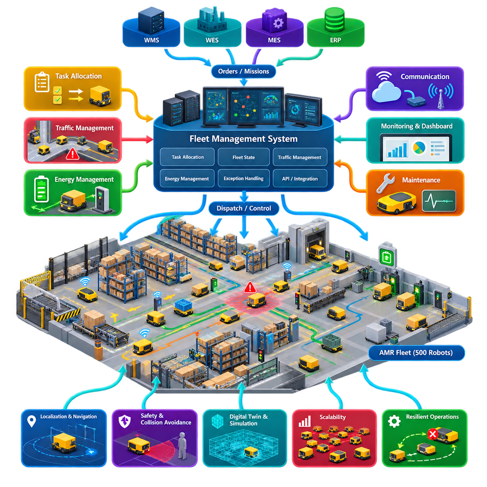
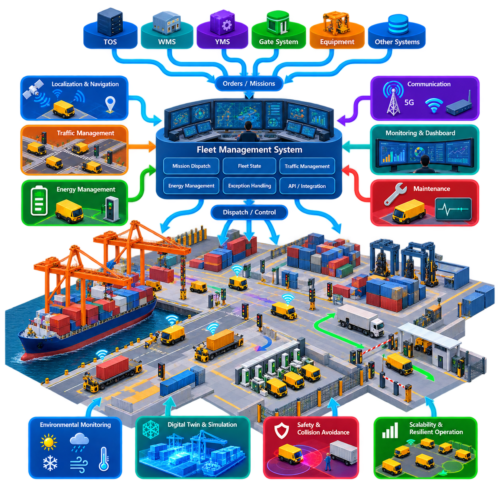
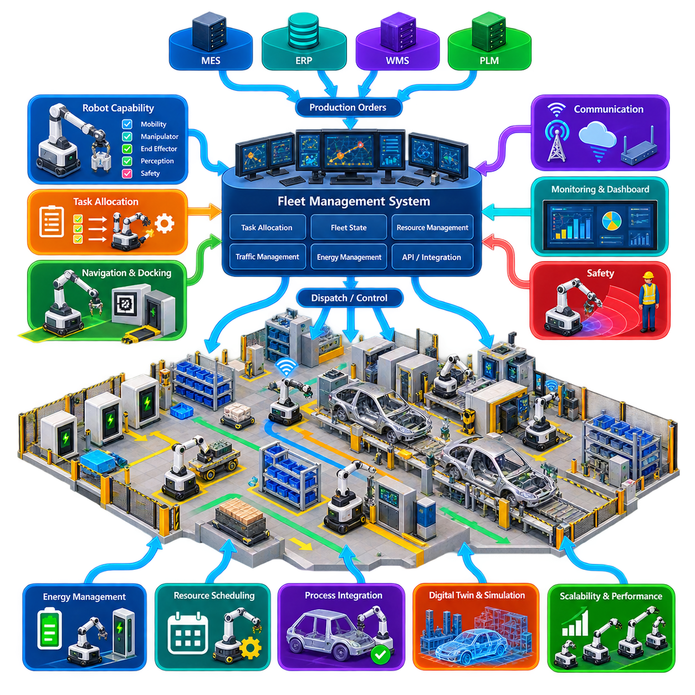
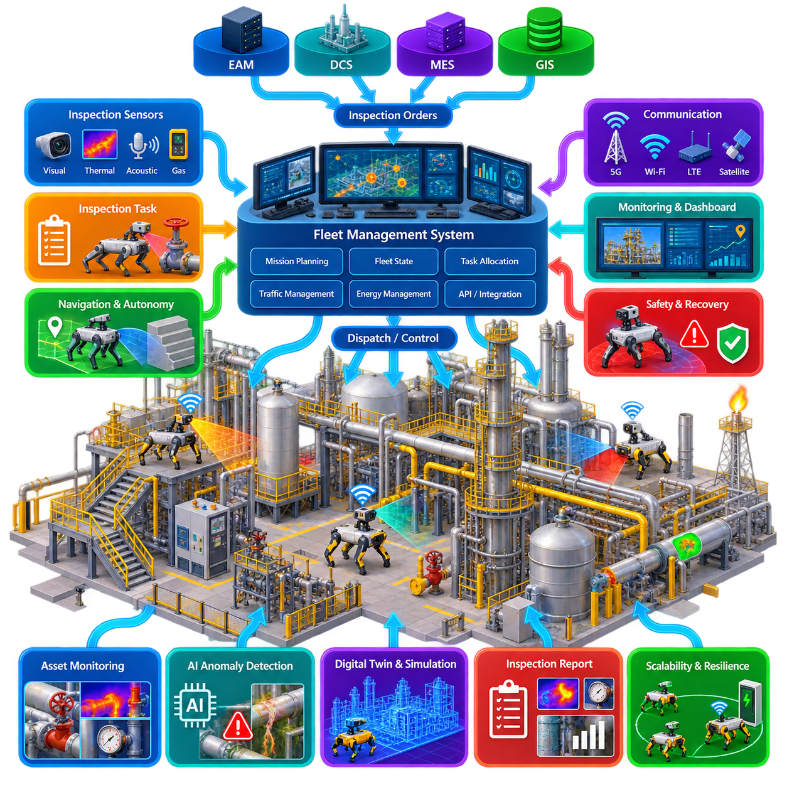
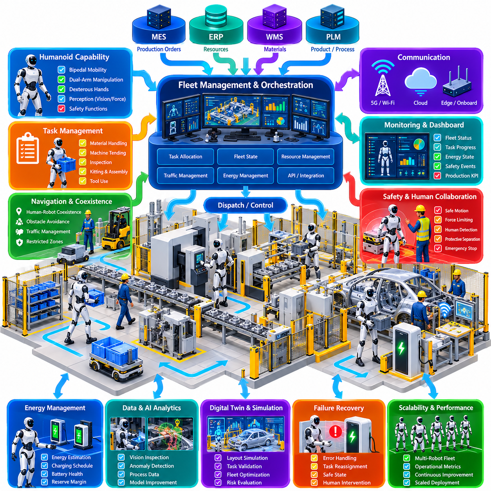
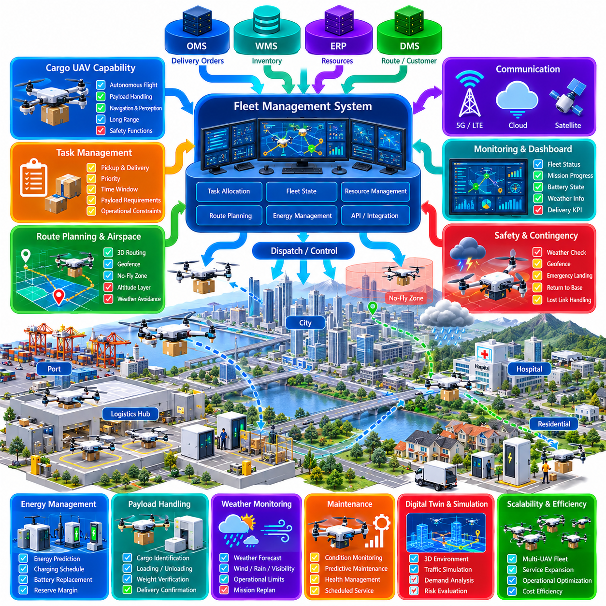
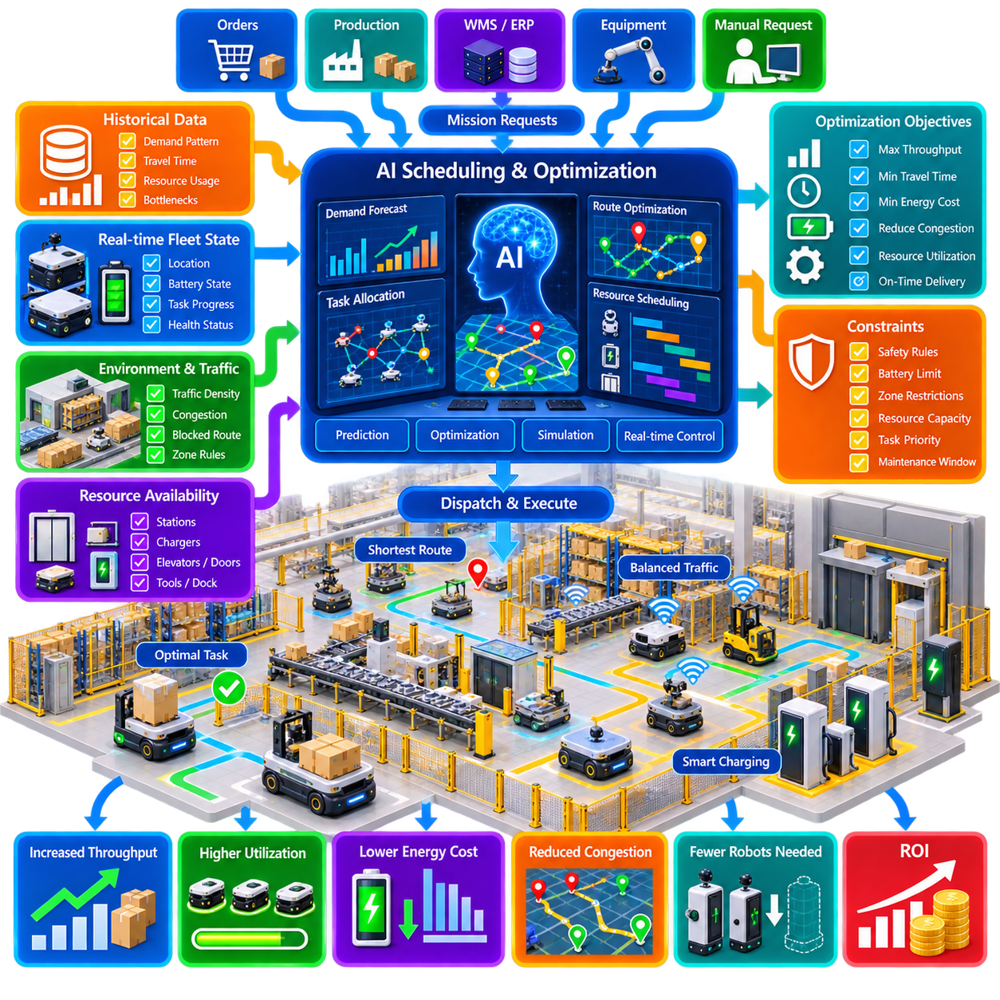
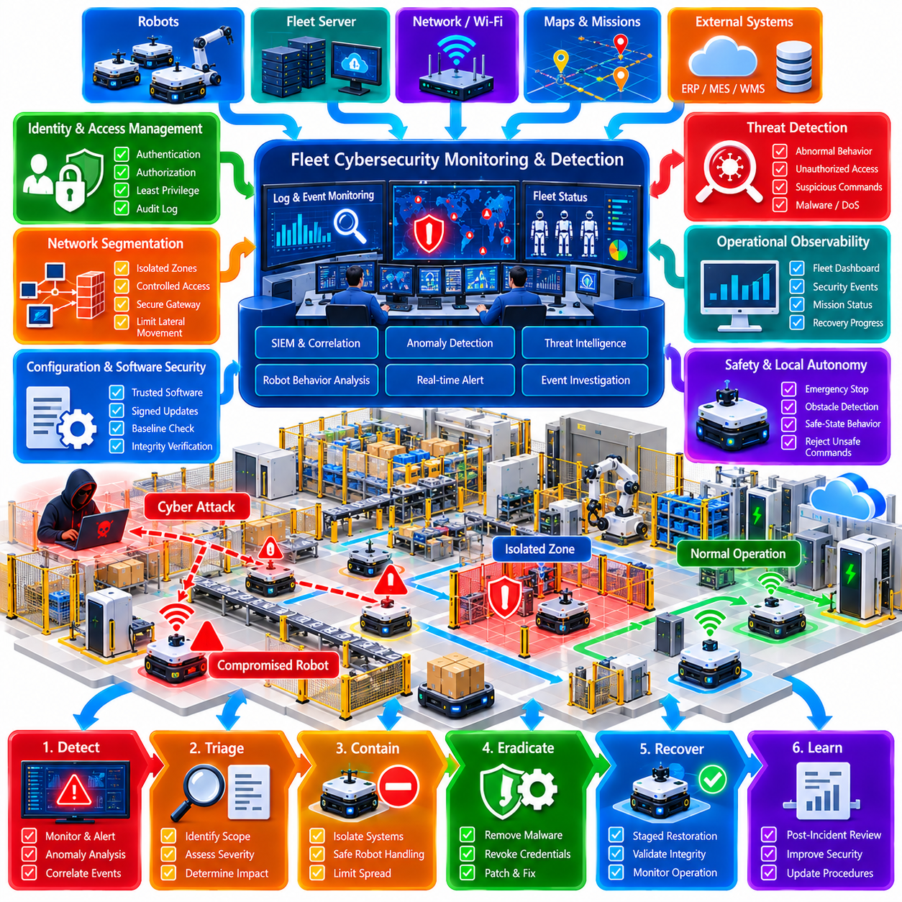
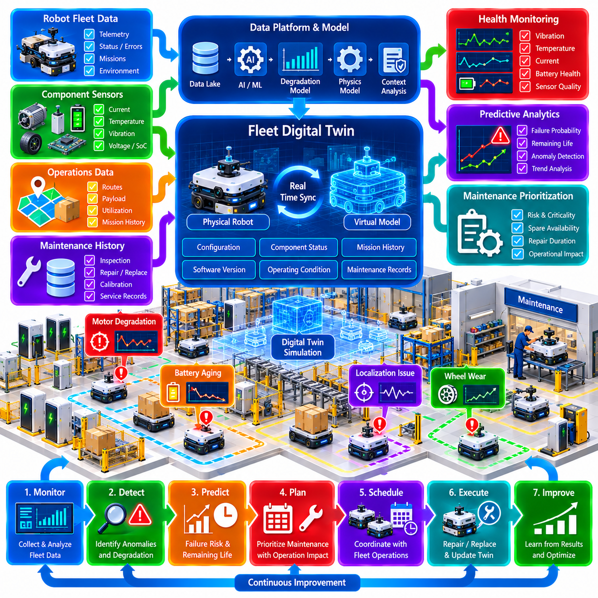
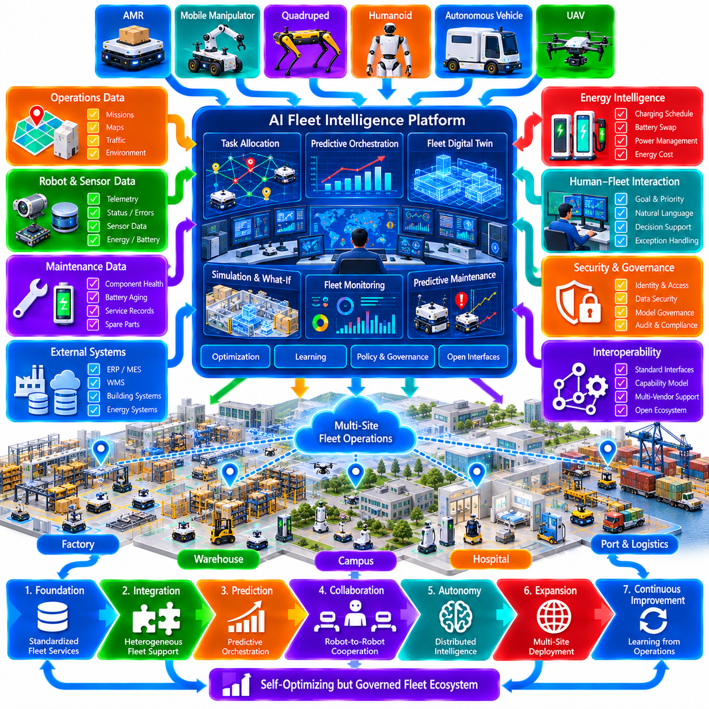

**Volume 16 Multi Robot and Fleet Intelligence**


# 12. Fleet Case Studies

##  

## 12.01 Indoor AMR Warehouse 500 Robot Fleet Case

{width="7.268055555555556in" height="7.268055555555556in"}

A 500-robot indoor AMR warehouse represents a transition from individual robot automation to a large-scale cyber-physical logistics system. At this scale, performance is determined less by the navigation capability of each robot than by how effectively missions, traffic, energy, infrastructure, and operational exceptions are coordinated across the entire fleet.

The warehouse fleet management system acts as the operational control layer between enterprise logistics systems and autonomous robots. Orders originating from WMS, WES, MES, or ERP applications are converted into transport missions and decomposed into executable robot tasks. The fleet manager continuously maintains robot state, mission state, zone occupancy, resource availability, and operational priorities.

Task allocation becomes a dynamic optimization problem because hundreds of robots compete for missions while their locations, battery levels, payload states, capabilities, and route conditions continuously change. Assignment based only on shortest distance often creates congestion or poor utilization. Production systems therefore combine travel cost, task priority, expected completion time, battery reserve, traffic conditions, and future workload.

Traffic management is one of the dominant scalability challenges. A warehouse may contain narrow aisles, intersections, elevators, doors, conveyors, workstations, charging areas, and transfer points that cannot safely accept unlimited simultaneous traffic. Zone reservations and resource locking are therefore used to prevent conflicting movements before robots enter constrained areas, consistent with the volume\'s coordination framework.

Routing must consider fleet-wide traffic rather than treating other AMRs simply as moving obstacles. If hundreds of robots independently select geometrically optimal paths, many may converge on the same corridors and create persistent congestion. The fleet layer can distribute traffic among alternative routes, impose directional rules, reserve critical segments, and dynamically modify route costs according to measured congestion.

Communication architecture must remain stable when hundreds of robots continuously publish position, state, alarms, mission progress, battery information, and diagnostic telemetry. High-frequency local control data should remain onboard, while fleet communication carries only information required for coordination and supervision. Message priority, QoS, aggregation, buffering, retry policies, and communication monitoring become essential at this scale.

Energy management cannot be implemented as a simple rule that sends every robot to charge below a fixed battery threshold. If many AMRs reach the threshold simultaneously, charging stations become congested and productive fleet capacity falls sharply. A 500-robot operation therefore coordinates charging with predicted workload, battery state, charger occupancy, mission priority, and expected idle periods so that charging demand is distributed over time.

Operational resilience requires the fleet to tolerate individual failures without allowing them to propagate into warehouse-wide disruption. A robot reporting localization loss, blocked motion, hardware faults, or communication failure should be isolated from new assignments while its active mission is recovered. Tasks can be reassigned, routes recalculated, affected zones restricted, and human intervention requested according to predefined recovery procedures.

A practical architecture separates safety-critical autonomy from centralized optimization. Each AMR retains local localization, obstacle detection, motion planning, emergency stopping, and safe-state behavior, while fleet services coordinate missions and shared resources. Consequently, temporary loss of the fleet server or network does not immediately convert robots into uncontrolled devices; they can stop safely or execute explicitly permitted offline behavior.

Observability becomes as important as dispatching because operators cannot manually inspect hundreds of robots. Fleet dashboards should summarize throughput, utilization, queue length, mission latency, traffic density, charging demand, fault frequency, communication health, and robot availability. Operators need hierarchical views that move from warehouse-level KPIs to zones, missions, individual robots, and detailed event histories.

The operating organization must also scale with the technology. Twenty-four-hour warehouse operation requires standardized shift handovers, incident classification, maintenance scheduling, escalation procedures, spare-unit policies, and recovery responsibilities. The source structure explicitly treats three-shift 500-robot operation as a large-scale fleet operations case, emphasizing that operational processes are integral to fleet engineering.

Maintenance strategy should use fleet telemetry to move from purely reactive repair toward condition-based and predictive maintenance. Repeated motor-current anomalies, wheel slip, localization degradation, battery deterioration, sensor contamination, abnormal charging behavior, or increasing mission completion time can reveal emerging problems. Maintenance can then be scheduled during low-demand periods before degradation produces operational stoppages.

A fleet digital twin can further improve planning by maintaining a synchronized representation of robots, missions, infrastructure, traffic, and operational resources. Historical and real-time data can be replayed to evaluate layout modifications, charger placement, routing policies, workload peaks, or proposed fleet expansions before deployment. The volume specifically connects fleet twins with what-if simulation and warehouse implementation.

Scaling should therefore be performed progressively rather than by deploying 500 robots as one commissioning step. Smaller groups validate navigation, communication, traffic rules, charging behavior, interfaces, and recovery procedures before increasingly dense fleet configurations are introduced. Load testing must reproduce peak order arrival rates and failure conditions, because successful operation of tens of robots does not guarantee stable behavior at hundreds.

The principal lesson from a 500-AMR warehouse is that large-scale autonomy is fundamentally a systems-engineering problem. Reliable robots are necessary, but warehouse performance emerges from task allocation, coordinated navigation, communication, energy management, observability, maintenance, cybersecurity, and disciplined operations working as one system. The objective is therefore not maximum activity per robot, but predictable fleet-wide throughput with bounded congestion, recoverable failures, and sustained availability.

500대 규모의 실내 자율이동로봇(AMR) 창고는 개별 로봇 자동화(Individual Robot Automation)에서 대규모 사이버 물리 물류 시스템(Cyber-Physical Logistics System)으로 전환되는 단계를 의미한다. 이 규모에서는 각 로봇의 내비게이션(Navigation) 성능 자체보다 전체 플릿(Fleet)의 미션(Mission), 교통, 에너지, 인프라 및 운영 예외 상황을 얼마나 효과적으로 조정하는지가 전체 성능을 결정한다.

창고 플릿 관리 시스템(Fleet Management System, FMS)은 기업 물류 시스템(Enterprise Logistics System)과 자율 로봇 사이의 운영 제어 계층(Operational Control Layer)으로 동작한다. 창고관리시스템(WMS), 창고실행시스템(WES), 제조실행시스템(MES), 전사적자원관리(ERP)에서 발생한 주문은 운송 미션(Transport Mission)으로 변환되고, 다시 로봇이 실행할 수 있는 작업(Task)으로 분해된다. 플릿 관리자는 로봇 상태, 미션 상태, 구역 점유 상태 및 자원 가용성을 지속적으로 관리한다.

작업 할당(Task Allocation)은 수백 대의 로봇이 미션을 놓고 경쟁하면서 위치, 배터리 수준, 적재 상태, 로봇 능력 및 경로 조건이 계속 변화하기 때문에 동적 최적화 문제(Dynamic Optimization Problem)가 된다. 단순히 최단거리만을 기준으로 작업을 배정하면 혼잡이나 낮은 활용률이 발생할 수 있다. 따라서 실제 운영 시스템에서는 이동 비용, 작업 우선순위, 예상 완료 시간, 배터리 잔량, 교통 상황 및 미래 작업량을 함께 고려한다.

교통 관리(Traffic Management)는 대규모 확장에서 가장 중요한 문제 가운데 하나이다. 창고에는 좁은 통로, 교차로, 엘리베이터, 문, 컨베이어, 작업 스테이션, 충전 구역 및 이송 지점과 같이 무제한의 동시 교통을 안전하게 수용할 수 없는 공간이 존재한다. 따라서 제한 구역에 로봇이 진입하기 전에 충돌 이동을 방지하기 위한 구역 예약(Zone Reservation)과 자원 잠금(Resource Locking)을 적용한다.

경로 계획(Routing)은 다른 AMR을 단순히 움직이는 장애물(Moving Obstacle)로 취급하는 것이 아니라 플릿 전체의 교통 상황을 고려해야 한다. 수백 대의 로봇이 각각 기하학적으로 최적인 경로를 독립적으로 선택하면 동일한 통로로 집중되어 지속적인 혼잡이 발생할 수 있다. 플릿 계층은 대체 경로로 교통량을 분산하고, 일방통행 규칙을 적용하며, 중요 구간을 예약하고, 측정된 혼잡도에 따라 경로 비용(Route Cost)을 동적으로 변경할 수 있다.

통신 아키텍처(Communication Architecture)는 수백 대의 로봇이 위치, 상태, 경보, 미션 진행 상황, 배터리 정보 및 진단 텔레메트리(Telemetry)를 지속적으로 전송하더라도 안정적으로 동작해야 한다. 고주파수 로컬 제어 데이터(Local Control Data)는 로봇 내부에서 처리하고, 플릿 통신에는 조정과 감독에 필요한 정보만 전달하는 것이 적절하다. 메시지 우선순위, 서비스 품질(QoS), 집계, 버퍼링(Buffering), 재시도 정책 및 통신 모니터링이 필수적이다.

에너지 관리(Energy Management)는 모든 로봇이 고정된 배터리 임계값 이하에서 충전소로 이동하도록 하는 단순한 규칙으로 구현할 수 없다. 다수의 AMR이 동시에 임계값에 도달하면 충전소가 혼잡해지고 실제 작업이 가능한 플릿 용량이 급격하게 감소한다. 따라서 500대 규모의 운영에서는 예상 작업량, 배터리 상태, 충전기 점유율, 미션 우선순위 및 예상 유휴 시간을 기반으로 충전을 조정하여 충전 수요를 시간적으로 분산해야 한다.

운영 복원력(Operational Resilience)을 확보하려면 개별 로봇의 장애가 창고 전체의 운영 중단으로 확산되지 않도록 해야 한다. 로봇에서 위치 추정(Localization) 손실, 이동 차단, 하드웨어 장애 또는 통신 장애가 발생하면 새로운 작업 할당에서 해당 로봇을 격리하면서 기존 미션을 복구해야 한다. 작업 재할당, 경로 재계산, 영향 구역 제한 및 작업자 개입 요청을 사전에 정의된 복구 절차(Recovery Procedure)에 따라 수행할 수 있다.

실용적인 아키텍처는 안전 필수 자율성(Safety-Critical Autonomy)과 중앙집중식 최적화(Centralized Optimization)를 분리한다. 각 AMR은 자체적으로 위치 추정, 장애물 감지, 모션 계획(Motion Planning), 비상 정지 및 안전 상태 동작을 유지하고, 플릿 서비스는 미션과 공유 자원을 조정한다. 따라서 플릿 서버 또는 네트워크가 일시적으로 중단되더라도 로봇이 즉시 통제 불가능한 상태가 되는 것이 아니라 안전하게 정지하거나 명시적으로 허용된 오프라인 동작(Offline Behavior)을 수행할 수 있다.

수백 대의 로봇을 작업자가 직접 점검할 수 없기 때문에 관측 가능성(Observability)은 작업 배차(Dispatching)만큼 중요하다. 플릿 대시보드(Fleet Dashboard)는 처리량(Throughput), 활용률(Utilization), 대기열 길이, 미션 지연 시간, 교통 밀도, 충전 수요, 장애 빈도, 통신 상태 및 로봇 가용성을 종합적으로 표시해야 한다. 작업자는 창고 전체 핵심성과지표(KPI)에서 구역, 미션, 개별 로봇 및 상세 이벤트 이력으로 단계적으로 접근할 수 있어야 한다.

운영 조직(Operating Organization) 역시 기술 시스템과 함께 확장되어야 한다. 24시간 창고 운영에는 표준화된 교대 인수인계(Shift Handover), 사고 분류, 유지보수 일정, 에스컬레이션 절차(Escalation Procedure), 예비 로봇 정책 및 복구 책임 체계가 필요하다. 따라서 3교대 500대 로봇 운영은 단순한 로봇 기술 문제가 아니라 운영 프로세스 자체가 플릿 엔지니어링(Fleet Engineering)의 핵심 요소가 되는 대규모 운영 문제이다.

유지보수 전략(Maintenance Strategy)은 플릿 텔레메트리를 활용하여 단순한 사후 수리(Reactive Maintenance)에서 상태 기반 유지보수(Condition-Based Maintenance)와 예측 유지보수(Predictive Maintenance)로 발전해야 한다. 반복적인 모터 전류 이상, 휠 슬립(Wheel Slip), 위치 추정 성능 저하, 배터리 열화, 센서 오염, 비정상적인 충전 동작 또는 미션 완료 시간 증가를 통해 잠재적인 문제를 조기에 발견할 수 있다.

플릿 디지털 트윈(Fleet Digital Twin)은 로봇, 미션, 인프라, 교통 및 운영 자원의 동기화된 표현을 유지함으로써 운영 계획을 더욱 개선할 수 있다. 과거 및 실시간 데이터를 재생하여 실제 배치 전에 레이아웃 변경, 충전기 위치, 경로 정책, 작업량 피크 또는 플릿 증설 계획을 평가할 수 있다. 또한 가상 시나리오 분석(What-If Simulation)을 통해 운영 정책의 변경이 전체 처리량과 혼잡에 미치는 영향을 사전에 검증할 수 있다.

따라서 500대의 로봇을 한 번의 시운전 단계에서 동시에 투입하기보다 점진적으로 확장(Progressive Scaling)해야 한다. 소규모 로봇 그룹에서 내비게이션, 통신, 교통 규칙, 충전 동작, 시스템 인터페이스 및 장애 복구 절차를 검증한 후 점차 높은 밀도의 플릿 구성을 도입해야 한다. 부하 시험(Load Testing)은 최대 주문 유입률과 장애 상황까지 재현해야 하며, 수십 대에서의 성공적인 운영이 수백 대 규모의 안정성을 자동으로 보장하지는 않는다.

500대 규모 AMR 창고 사례가 보여주는 핵심 교훈은 대규모 자율성(Large-Scale Autonomy)이 본질적으로 시스템 엔지니어링(Systems Engineering) 문제라는 점이다. 신뢰성 높은 개별 로봇은 필수적이지만, 실제 창고 성능은 작업 할당, 협조 내비게이션(Coordinated Navigation), 통신, 에너지 관리, 관측 가능성, 유지보수, 사이버보안(Cybersecurity) 및 체계적인 운영이 하나의 시스템으로 작동할 때 만들어진다. 따라서 목표는 개별 로봇의 최대 활동량이 아니라, 제한된 혼잡과 복구 가능한 장애 및 지속적인 가용성을 기반으로 예측 가능한 플릿 전체 처리량을 확보하는 것이다.

##  

## 12.02 Outdoor AMR Port Logistics Fleet Operation Case

{width="7.268055555555556in" height="7.268055555555556in"}

An outdoor AMR fleet operating in a port logistics environment extends fleet intelligence beyond the relatively structured conditions of indoor warehouses. Robots must transport containers, pallets, equipment, inspection payloads, or other cargo across large outdoor areas while interacting with trucks, cranes, terminal vehicles, workers, gates, and changing infrastructure. Fleet operation therefore combines autonomous driving with industrial logistics coordination.

The fleet management system serves as the supervisory layer connecting port logistics applications with autonomous mobile robots. Transport requests are converted into missions containing pickup points, destinations, cargo information, priorities, time constraints, and permitted operating zones. The system continuously evaluates robot availability, location, payload capability, battery state, route conditions, and operational restrictions before assigning each mission.

Outdoor localization requires greater redundancy than typical indoor operation because port environments contain large open spaces, repetitive container structures, temporary obstacles, and changing visual features. GNSS and RTK can provide global positioning, while LiDAR, cameras, IMU, wheel odometry, and local maps support continuous localization. Sensor fusion allows robots to maintain operational continuity when individual positioning sources become degraded or temporarily unavailable.

Port traffic management must coordinate AMRs with both autonomous and manually operated vehicles. Unlike a closed robotic aisle, roads may contain trucks, forklifts, terminal tractors, maintenance vehicles, and pedestrians with different speeds and behaviors. Fleet routing therefore considers road direction, intersection priority, restricted areas, speed zones, temporary closures, and dynamic congestion while local autonomy handles immediate collision avoidance.

Shared intersections and narrow passages are critical fleet resources because simultaneous access by multiple robots can produce deadlock or unsafe encounters. Reservation-based traffic control can allocate these resources before entry, while time windows and priorities regulate conflicting missions. When congestion increases, the fleet manager can modify route costs, redirect robots, delay lower-priority missions, or temporarily control admission into saturated zones.

Environmental uncertainty strongly influences outdoor fleet performance. Rain, fog, dust, glare, darkness, wet pavement, strong wind, and temperature variation can reduce sensor reliability or vehicle traction. Fleet operation should therefore incorporate environmental status into mission decisions. Robots may reduce speed, increase safety margins, avoid specific zones, or suspend selected missions when environmental conditions exceed validated operating limits.

Communication coverage is another major design consideration because a port may span several square kilometers and contain containers, buildings, cranes, and metallic structures that create radio shadowing and multipath effects. Private 5G, industrial Wi-Fi, LTE, or hybrid communication can connect robots with fleet services. Communication quality should be monitored continuously so that mission behavior can adapt when bandwidth, latency, or connectivity deteriorates.

Loss of communication must not immediately compromise vehicle safety. Safety-critical perception, localization, obstacle avoidance, motion control, and emergency stopping remain onboard the AMR, while fleet-level systems provide mission coordination and optimization. If connectivity is lost, the robot can complete an explicitly permitted local maneuver, move to a designated safe location, or stop safely until fleet communication is restored.

Energy management becomes particularly important when outdoor AMRs travel long distances or carry heavy payloads. Energy consumption depends on mission distance, vehicle mass, payload, speed, gradients, temperature, auxiliary equipment, and waiting time. Fleet scheduling can estimate mission energy requirements before dispatch and reserve sufficient battery capacity for safe completion, recovery movement, and travel to an available charging station.

Charging infrastructure must be treated as a shared fleet resource rather than an independent robot function. If many vehicles charge simultaneously during high-demand periods, logistics capacity decreases. Predictive charging strategies distribute charging sessions according to expected workload, battery condition, charger availability, and operational priority. Opportunity charging during planned idle periods can further increase effective fleet availability.

Port operations also require close integration with external equipment and infrastructure. AMRs may exchange state information with gates, cranes, loading stations, weighing systems, container handling equipment, security systems, or terminal operating systems. A mission should not simply send a robot to a coordinate; it should synchronize robot arrival with cargo readiness, equipment availability, access authorization, and downstream process capacity.

Fleet observability provides operators with a unified view of robots and logistics processes across the terminal. Dashboards can display robot positions, active missions, route congestion, charging state, communication quality, alarms, blocked zones, and equipment availability. Historical telemetry enables analysis of throughput, utilization, waiting time, empty travel, energy consumption, failure frequency, and mission completion performance.

Failure recovery must prevent one disabled robot from creating a larger logistics interruption. A stopped AMR can block a lane, intersection, loading area, or transfer point used by many other vehicles. The fleet system should identify the affected region, restrict access, reroute approaching robots, reassign unfinished missions, and request recovery assistance. The objective is controlled degradation rather than fleet-wide stoppage.

Maintenance planning benefits from the continuous collection of vehicle and environmental telemetry. Abnormal motor current, steering deviation, wheel slip, vibration, brake behavior, battery degradation, sensor contamination, localization instability, or repeated communication failures can indicate emerging problems. Condition-based maintenance can remove a robot from service during a suitable operational window before the problem becomes a mission-critical failure.

A digital twin can reproduce the port layout, roads, operating zones, charging stations, fleet states, and logistics flows. Historical traffic and mission data can be replayed to evaluate routing rules, charging infrastructure, fleet size, intersection policies, or changes in terminal layout. Simulation also provides a safer environment for testing peak traffic, communication failures, blocked roads, robot faults, and emergency operating procedures.

Scalability should be validated progressively because outdoor fleet behavior changes as robot density increases. Early deployment can begin with limited routes and mission types before expanding into additional terminal zones and mixed-traffic operations. Each stage should validate localization coverage, network performance, traffic control, energy consumption, safety behavior, recovery procedures, and integration with port logistics systems under realistic workload conditions.

The central lesson from an outdoor port AMR fleet is that successful deployment requires integration of autonomous driving, fleet coordination, logistics orchestration, communication, infrastructure, energy, safety, and operational procedures. Individual vehicle intelligence remains essential, but system-level intelligence determines whether hundreds of autonomous missions can coexist reliably with people, conventional vehicles, and continuously changing port operations.

항만 물류 환경에서 운영되는 실외 자율이동로봇(AMR) 플릿은 비교적 구조화된 실내 창고 환경을 넘어 플릿 지능(Fleet Intelligence)을 확장하는 사례이다. 로봇은 대규모 실외 공간에서 컨테이너, 팔레트, 장비, 검사 탑재체 또는 기타 화물을 운송하면서 트럭, 크레인, 터미널 차량, 작업자, 게이트 및 지속적으로 변화하는 인프라와 상호작용해야 한다. 따라서 플릿 운영은 자율주행(Autonomous Driving)과 산업 물류 조정(Industrial Logistics Coordination)을 결합해야 한다.

플릿 관리 시스템(Fleet Management System)은 항만 물류 애플리케이션(Port Logistics Application)과 자율이동로봇을 연결하는 상위 감독 계층(Supervisory Layer)으로 동작한다. 운송 요청은 픽업 지점, 목적지, 화물 정보, 우선순위, 시간 제약 및 허용 운행 구역을 포함하는 미션(Mission)으로 변환된다. 시스템은 각 미션을 할당하기 전에 로봇 가용성, 위치, 적재 능력, 배터리 상태, 경로 조건 및 운영 제한 사항을 지속적으로 평가한다.

실외 위치 추정(Outdoor Localization)은 항만 환경에 넓은 개방 공간, 반복적인 컨테이너 구조, 임시 장애물 및 변화하는 시각적 특징이 존재하기 때문에 일반적인 실내 운영보다 높은 수준의 중복성(Redundancy)이 필요하다. 위성항법시스템(GNSS)과 실시간 이동측위(RTK)는 전역 위치를 제공하고, 라이다(LiDAR), 카메라(Camera), 관성측정장치(IMU), 휠 오도메트리(Wheel Odometry) 및 로컬 지도(Local Map)는 연속적인 위치 추정을 지원한다. 센서 융합(Sensor Fusion)을 통해 개별 위치 정보원이 저하되거나 일시적으로 사용할 수 없는 경우에도 운영 연속성을 유지할 수 있다.

항만 교통 관리(Port Traffic Management)는 AMR뿐만 아니라 자율주행 차량과 사람이 운전하는 차량을 함께 조정해야 한다. 폐쇄된 로봇 통로와 달리 항만 도로에는 트럭, 지게차, 터미널 트랙터, 유지보수 차량 및 보행자가 서로 다른 속도와 행동 특성을 가지고 이동한다. 따라서 플릿 경로 계획(Fleet Routing)은 도로 방향, 교차로 우선순위, 제한 구역, 속도 제한 구역, 임시 폐쇄 및 동적 혼잡을 고려하며, 로컬 자율주행(Local Autonomy)은 즉각적인 충돌 회피를 담당한다.

공유 교차로와 좁은 통로는 여러 로봇이 동시에 접근할 경우 교착상태(Deadlock) 또는 위험한 조우를 발생시킬 수 있기 때문에 중요한 플릿 공유 자원(Shared Fleet Resource)이다. 예약 기반 교통 제어(Reservation-Based Traffic Control)는 진입 전에 이러한 자원을 할당하고, 시간 구간(Time Window)과 우선순위를 통해 충돌하는 미션을 조정할 수 있다. 혼잡이 증가하면 플릿 관리자는 경로 비용을 변경하고 로봇을 우회시키며 낮은 우선순위의 미션을 지연시키거나 포화 구역으로의 진입을 일시적으로 제한할 수 있다.

환경 불확실성(Environmental Uncertainty)은 실외 플릿 성능에 큰 영향을 미친다. 비, 안개, 먼지, 눈부심, 야간 환경, 젖은 노면, 강풍 및 온도 변화는 센서 신뢰성이나 차량 접지력을 저하시킬 수 있다. 따라서 플릿 운영에서는 환경 상태를 미션 의사결정에 포함해야 한다. 환경 조건이 검증된 운용 한계(Validated Operating Limit)를 초과하면 로봇의 속도를 낮추고 안전 여유를 확대하며 특정 구역을 회피하거나 일부 미션을 중단할 수 있다.

통신 커버리지(Communication Coverage) 역시 중요한 설계 요소이다. 항만은 수 제곱킬로미터에 걸쳐 분포할 수 있으며 컨테이너, 건물, 크레인 및 금속 구조물이 전파 음영(Radio Shadowing)과 다중경로(Multipath) 현상을 발생시킬 수 있다. 사설 5G(Private 5G), 산업용 와이파이(Industrial Wi-Fi), LTE 또는 하이브리드 통신(Hybrid Communication)을 이용해 로봇과 플릿 서비스를 연결할 수 있다. 통신 품질을 지속적으로 모니터링하여 대역폭, 지연시간 또는 연결성이 저하될 때 미션 동작을 적응시켜야 한다.

통신 손실(Communication Loss)이 발생하더라도 차량 안전이 즉시 손상되어서는 안 된다. 안전 필수 인지(Safety-Critical Perception), 위치 추정, 장애물 회피, 모션 제어(Motion Control) 및 비상 정지 기능은 AMR 내부에 유지하고, 플릿 수준 시스템은 미션 조정과 최적화를 담당한다. 연결이 끊어지면 로봇은 명시적으로 허용된 로컬 동작을 완료하거나 지정된 안전 위치로 이동하거나 플릿 통신이 복구될 때까지 안전하게 정지할 수 있다.

실외 AMR이 장거리를 이동하거나 무거운 화물을 운송하는 경우 에너지 관리(Energy Management)는 특히 중요하다. 에너지 소비량은 미션 거리, 차량 질량, 적재량, 속도, 경사도, 온도, 보조 장비 및 대기 시간에 따라 달라진다. 플릿 스케줄링(Fleet Scheduling)은 배차 전에 미션의 예상 에너지 요구량을 계산하고 안전한 미션 완료, 복구 이동 및 사용 가능한 충전소까지의 이동에 필요한 충분한 배터리 용량을 확보할 수 있다.

충전 인프라(Charging Infrastructure)는 개별 로봇 기능이 아니라 공유 플릿 자원으로 관리해야 한다. 많은 차량이 수요가 높은 시간대에 동시에 충전하면 전체 물류 처리 능력이 감소한다. 예측 충전 전략(Predictive Charging Strategy)은 예상 작업량, 배터리 상태, 충전기 가용성 및 운영 우선순위에 따라 충전 시간을 분산한다. 계획된 유휴 시간 동안의 기회 충전(Opportunity Charging)을 활용하면 실질적인 플릿 가용성을 더욱 향상시킬 수 있다.

항만 운영에서는 외부 장비 및 인프라와의 긴밀한 통합도 필요하다. AMR은 게이트, 크레인, 적재 스테이션, 계량 시스템, 컨테이너 처리 장비, 보안 시스템 또는 터미널 운영 시스템(Terminal Operating System)과 상태 정보를 교환할 수 있다. 따라서 미션은 단순히 로봇을 특정 좌표로 이동시키는 것이 아니라 화물 준비 상태, 장비 가용성, 접근 권한 및 후속 공정 처리 용량과 로봇 도착 시점을 동기화해야 한다.

플릿 관측 가능성(Fleet Observability)은 작업자가 터미널 전체의 로봇과 물류 프로세스를 통합적으로 파악할 수 있도록 한다. 대시보드(Dashboard)는 로봇 위치, 활성 미션, 경로 혼잡, 충전 상태, 통신 품질, 경보, 차단 구역 및 장비 가용성을 표시할 수 있다. 과거 텔레메트리(Historical Telemetry)를 이용하면 처리량, 활용률, 대기 시간, 공차 이동(Empty Travel), 에너지 소비, 장애 빈도 및 미션 완료 성능을 분석할 수 있다.

장애 복구(Failure Recovery)는 한 대의 고장 난 로봇으로 인해 더 큰 물류 중단이 발생하는 것을 방지해야 한다. 정지한 AMR은 다른 차량이 사용하는 차선, 교차로, 적재 구역 또는 이송 지점을 차단할 수 있다. 플릿 시스템은 영향을 받는 구역을 식별하고 접근을 제한하며 접근 중인 로봇을 우회시키고 미완료 미션을 재할당하며 복구 지원을 요청해야 한다. 핵심 목표는 플릿 전체 정지가 아니라 제어된 성능 저하(Controlled Degradation)를 구현하는 것이다.

유지보수 계획(Maintenance Planning)은 차량 및 환경 텔레메트리를 지속적으로 수집함으로써 더욱 정교해질 수 있다. 비정상적인 모터 전류, 조향 편차, 휠 슬립(Wheel Slip), 진동, 제동 동작, 배터리 열화, 센서 오염, 위치 추정 불안정 또는 반복적인 통신 장애는 잠재적인 문제를 나타낼 수 있다. 상태 기반 유지보수(Condition-Based Maintenance)를 적용하면 문제가 미션 중대한 장애로 발전하기 전에 적절한 운영 시간대를 선택하여 해당 로봇을 정비할 수 있다.

디지털 트윈(Digital Twin)은 항만 레이아웃, 도로, 운행 구역, 충전소, 플릿 상태 및 물류 흐름을 가상 환경에 재현할 수 있다. 과거 교통 및 미션 데이터를 재생하여 경로 규칙, 충전 인프라, 플릿 규모, 교차로 정책 또는 터미널 레이아웃 변경을 평가할 수 있다. 시뮬레이션(Simulation)은 최대 교통량, 통신 장애, 도로 차단, 로봇 고장 및 비상 운영 절차를 안전하게 시험하는 환경도 제공한다.

확장성(Scalability)은 로봇 밀도가 증가함에 따라 실외 플릿의 동작 특성이 변화하기 때문에 단계적으로 검증해야 한다. 초기 배치는 제한된 경로와 미션 유형에서 시작한 후 추가 터미널 구역과 혼합 교통 운영(Mixed-Traffic Operation)으로 확대할 수 있다. 각 단계에서 실제 작업 부하 조건을 적용하여 위치 추정 커버리지, 네트워크 성능, 교통 제어, 에너지 소비, 안전 동작, 복구 절차 및 항만 물류 시스템과의 통합을 검증해야 한다.

실외 항만 AMR 플릿 사례의 핵심 교훈은 성공적인 구축을 위해 자율주행, 플릿 조정(Fleet Coordination), 물류 오케스트레이션(Logistics Orchestration), 통신, 인프라, 에너지, 안전 및 운영 절차를 하나의 통합 시스템으로 구성해야 한다는 점이다. 개별 차량의 지능은 여전히 필수적이지만, 수백 개의 자율 미션이 사람, 기존 차량 및 지속적으로 변화하는 항만 운영 환경과 안정적으로 공존할 수 있는지를 결정하는 것은 시스템 수준의 플릿 지능(System-Level Fleet Intelligence)이다.

##  

## 12.03 Mobile Manipulator Assembly Line Fleet Case

{width="7.268055555555556in" height="7.268055555555556in"}

Mobile manipulators combine autonomous mobility with robotic manipulation, allowing one robotic platform to move between multiple workstations and perform physical production tasks that would otherwise require fixed industrial robots. In an assembly-line fleet, this capability changes automation from a collection of stationary cells into a dynamically allocated manufacturing resource that can move according to production demand.

Each mobile manipulator typically integrates an autonomous mobile robot base, one or more robotic arms, end effectors, perception sensors, safety devices, and an onboard computing platform. The mobile base provides transportation and positioning, while the manipulator performs operations such as part loading, fastening, inspection, machine tending, material transfer, kitting, or assembly after the platform reaches the required workstation.

Fleet management becomes more complex than conventional AMR dispatch because each mission contains both navigation and manipulation requirements. A robot must not only reach the correct location but also possess the required payload capacity, manipulator reach, end effector, tool, perception capability, and task software. Mission allocation therefore considers robot capability together with location, availability, battery state, workload, and production priority.

The manufacturing execution system provides production orders and process states to the fleet orchestration layer, which translates them into coordinated robot missions. A mission may include collecting components from storage, navigating to an assembly station, docking precisely, identifying the workpiece, executing manipulation, verifying the result, and transporting completed material to the next process. Each stage becomes part of one traceable production workflow.

Navigation accuracy alone is generally insufficient for manipulation because arm operations require a more precise relationship between the robot, workstation, fixture, and workpiece. The mobile base can first navigate to a coarse target pose and then execute precision docking using cameras, LiDAR, fiducial markers, mechanical references, or other local sensing. The manipulator subsequently performs fine alignment using visual or force-based feedback.

Task allocation must account for both transportation efficiency and manufacturing process constraints. Sending the nearest robot to every request may be inefficient if that robot lacks the correct gripper, tool, calibration, payload rating, or manipulation skill. A capability-aware scheduler represents each robot as a set of available resources and assigns missions only when the required mobility, manipulation, perception, and process capabilities are satisfied.

Shared tools and workstations introduce additional resource-allocation problems. Robots may compete for fixtures, automatic tool changers, inspection equipment, charging stations, elevators, or narrow access areas. Resource reservation prevents multiple robots from attempting to occupy the same manufacturing resource simultaneously. Scheduling can also synchronize robot arrival with machine-cycle completion so that unnecessary waiting is minimized.

Manipulation tasks create longer and more variable service times than simple material transport. Vision processing, grasp retries, force-controlled insertion, tool changes, human interaction, or quality verification may delay completion. Fleet scheduling therefore benefits from estimating task duration probabilistically rather than assuming fixed cycle times, allowing downstream assignments to adapt when individual manipulation operations take longer than expected.

Safety architecture must address both vehicle motion and manipulator motion. During navigation, the platform requires obstacle detection, safe speed control, emergency stopping, and protection around pedestrians or industrial vehicles. At a workstation, the risk model changes because the manipulator may extend beyond the mobile base. Safety zones and operating modes should therefore adapt according to whether the robot is traveling, docking, manipulating, or recovering.

Human-robot collaboration is especially important in mixed assembly environments. Workers may share aisles, workstations, tools, and components with mobile manipulators. Fleet intelligence should prevent excessive robot concentration around human work areas while local safety systems enforce protective separation. Production interfaces should also allow workers to pause, release, redirect, or request robotic assistance without bypassing controlled mission management.

Communication connects the mobile manipulators with fleet services, manufacturing systems, machines, and infrastructure. Fleet messages communicate missions, robot states, reservations, alarms, and production events, while high-frequency manipulator control remains local to the robot. This separation limits network dependency for real-time control while still allowing the fleet layer to coordinate manufacturing activities across many robots and stations.

Energy management must consider manipulation as well as driving. Robotic arms, perception computers, vacuum pumps, electric grippers, force sensors, and auxiliary equipment may consume substantial power while the platform remains stationary. Battery prediction should therefore use mission-specific energy models that estimate navigation and manipulation consumption together, enabling the scheduler to determine whether a robot can safely complete an entire production sequence.

Fault recovery requires understanding which stage of the manufacturing mission failed. A navigation failure may require rerouting, while a docking failure can trigger another alignment attempt. A failed grasp may invoke an alternative grasp strategy, and an assembly verification failure may send the workpiece to inspection or rework. The fleet system should preserve process state so that recovery does not unnecessarily restart the entire manufacturing sequence.

Fleet observability links robot performance with production performance. Operators should be able to inspect robot availability, mission queues, workstation utilization, docking failures, manipulation success rates, cycle times, tool usage, battery state, alarms, and production output. This enables engineers to distinguish whether reduced throughput originates from transportation congestion, robot manipulation, workstation constraints, equipment faults, or production scheduling.

A digital twin can represent mobile robots, manipulators, workstations, fixtures, tools, traffic routes, and manufacturing processes within one virtual environment. Engineers can evaluate robot quantities, workstation layouts, docking positions, traffic policies, and task-allocation strategies before modifying the physical line. Simulation can also reproduce failures and peak workloads that would be expensive or disruptive to test directly in production.

Scalability depends on hierarchical coordination rather than continuously centralizing every control decision. Local controllers manage navigation, manipulation, perception, and safety; fleet services coordinate missions, traffic, resources, and energy; manufacturing systems determine production objectives and process constraints. Clear separation between these layers reduces coupling and allows robots, workstations, and production lines to evolve without redesigning the complete system.

The principal lesson of a mobile-manipulator assembly fleet is that mobility and manipulation cannot be optimized independently. Production performance emerges from coordinated navigation, precise docking, capability-aware task allocation, manipulation reliability, shared-resource scheduling, safety, energy management, and manufacturing integration. The mobile manipulator therefore becomes a reconfigurable production resource whose value increases when the entire fleet is orchestrated as one manufacturing system.

모바일 매니퓰레이터(Mobile Manipulator)는 자율 이동성(Autonomous Mobility)과 로봇 조작(Robotic Manipulation)을 결합하여 하나의 로봇 플랫폼이 여러 작업 스테이션(Workstation) 사이를 이동하면서 기존에는 고정형 산업용 로봇이 담당하던 물리적 생산 작업을 수행할 수 있도록 한다. 조립 라인 플릿(Assembly-Line Fleet)에서는 이러한 능력을 통해 자동화 시스템이 고정된 로봇 셀의 집합에서 생산 수요에 따라 이동할 수 있는 동적 할당형 제조 자원(Dynamically Allocated Manufacturing Resource)으로 변화한다.

각 모바일 매니퓰레이터는 일반적으로 자율이동로봇(AMR) 기반 플랫폼, 하나 이상의 로봇 팔(Robotic Arm), 엔드 이펙터(End Effector), 인지 센서(Perception Sensor), 안전 장치 및 온보드 컴퓨팅 플랫폼(Onboard Computing Platform)을 통합한다. 모바일 베이스(Mobile Base)는 운송과 위치 결정을 담당하며, 매니퓰레이터는 작업 위치에 도착한 후 부품 투입, 체결, 검사, 머신 텐딩(Machine Tending), 자재 이송, 키팅(Kitting) 또는 조립 작업을 수행한다.

플릿 관리(Fleet Management)는 각 미션에 내비게이션(Navigation)과 조작(Manipulation) 요구사항이 모두 포함되기 때문에 일반적인 AMR 배차보다 복잡하다. 로봇은 정확한 위치에 도달하는 것뿐만 아니라 필요한 적재 능력, 매니퓰레이터 도달 범위, 엔드 이펙터, 공구, 인지 기능 및 작업 소프트웨어를 갖추어야 한다. 따라서 미션 할당(Mission Allocation)은 위치, 가용성, 배터리 상태, 작업 부하 및 생산 우선순위와 함께 로봇의 작업 능력을 고려한다.

제조실행시스템(Manufacturing Execution System, MES)은 생산 주문과 공정 상태를 플릿 오케스트레이션 계층(Fleet Orchestration Layer)에 제공하고, 이 계층은 이를 조정된 로봇 미션으로 변환한다. 하나의 미션은 저장소에서 부품을 가져오고, 조립 스테이션으로 이동하고, 정밀 도킹(Precision Docking)을 수행하고, 작업물을 인식하고, 조작 작업을 실행하고, 결과를 검증한 후 완성된 자재를 다음 공정으로 운송하는 일련의 과정을 포함할 수 있다. 각 단계는 하나의 추적 가능한 생산 워크플로(Production Workflow)를 구성한다.

매니퓰레이션 작업에는 로봇, 작업 스테이션, 지그 또는 고정구(Fixture), 작업물 사이의 더욱 정밀한 상대 위치 관계가 필요하기 때문에 내비게이션 정확도만으로는 일반적으로 충분하지 않다. 모바일 베이스는 먼저 대략적인 목표 자세(Coarse Target Pose)까지 이동한 후 카메라, 라이다(LiDAR), 기준 마커(Fiducial Marker), 기계적 기준점 또는 기타 로컬 센서를 이용하여 정밀 도킹을 수행할 수 있다. 이후 매니퓰레이터는 비전 또는 힘 기반 피드백(Force-Based Feedback)을 사용하여 미세 정렬(Fine Alignment)을 수행한다.

작업 할당(Task Allocation)은 운송 효율성과 제조 공정 제약조건(Manufacturing Process Constraint)을 동시에 고려해야 한다. 가장 가까운 로봇을 모든 작업 요청에 배정하는 방식은 해당 로봇에 적절한 그리퍼(Gripper), 공구, 캘리브레이션(Calibration), 허용 적재량 또는 조작 기술이 없다면 비효율적이다. 능력 기반 스케줄러(Capability-Aware Scheduler)는 각 로봇을 사용 가능한 자원의 집합으로 표현하고 필요한 이동, 조작, 인지 및 공정 능력을 만족하는 경우에만 미션을 할당한다.

공유 공구(Shared Tool)와 작업 스테이션은 추가적인 자원 할당(Resource Allocation) 문제를 발생시킨다. 여러 로봇이 고정구, 자동 공구 교환기(Automatic Tool Changer), 검사 장비, 충전소, 엘리베이터 또는 좁은 접근 구역을 동시에 사용하려 할 수 있다. 자원 예약(Resource Reservation)은 여러 로봇이 동일한 제조 자원을 동시에 점유하는 것을 방지한다. 또한 스케줄링은 로봇의 도착 시점을 기계의 작업 주기 완료 시점과 동기화하여 불필요한 대기 시간을 줄일 수 있다.

조작 작업은 단순한 자재 운송보다 작업 시간이 길고 변동성이 크다. 비전 처리(Vision Processing), 파지 재시도(Grasp Retry), 힘 제어 삽입(Force-Controlled Insertion), 공구 교환, 작업자와의 상호작용 또는 품질 검증으로 인해 완료 시간이 지연될 수 있다. 따라서 플릿 스케줄링에서는 고정된 사이클 시간(Cycle Time)을 가정하기보다 작업 시간을 확률적으로 추정하는 것이 효과적이며, 개별 조작 작업이 예상보다 오래 걸리는 경우 후속 작업 할당을 동적으로 조정할 수 있다.

안전 아키텍처(Safety Architecture)는 차량의 이동과 매니퓰레이터의 움직임을 모두 고려해야 한다. 이동 중에는 장애물 감지, 안전 속도 제어, 비상 정지 및 보행자나 산업 차량에 대한 보호 기능이 필요하다. 작업 스테이션에서는 매니퓰레이터가 모바일 베이스의 외부 영역까지 확장될 수 있기 때문에 위험 모델(Risk Model)이 달라진다. 따라서 로봇이 이동, 도킹, 조작 또는 복구 중인지에 따라 안전 구역(Safety Zone)과 운전 모드(Operating Mode)를 적응적으로 변경해야 한다.

인간-로봇 협업(Human-Robot Collaboration)은 혼합형 조립 환경에서 특히 중요하다. 작업자는 모바일 매니퓰레이터와 통로, 작업 스테이션, 공구 및 부품을 공유할 수 있다. 플릿 지능(Fleet Intelligence)은 사람의 작업 구역 주변에 지나치게 많은 로봇이 집중되지 않도록 해야 하며, 로컬 안전 시스템(Local Safety System)은 보호 분리 거리(Protective Separation)를 유지해야 한다. 또한 작업자가 통제된 미션 관리 체계를 우회하지 않고 로봇 작업을 일시 정지하거나 해제하고, 방향을 변경하거나 로봇 지원을 요청할 수 있어야 한다.

통신(Communication)은 모바일 매니퓰레이터를 플릿 서비스, 제조 시스템, 생산 장비 및 인프라와 연결한다. 플릿 메시지는 미션, 로봇 상태, 자원 예약, 경보 및 생산 이벤트를 전달하는 반면, 고주파수 매니퓰레이터 제어(High-Frequency Manipulator Control)는 로봇 내부에서 수행된다. 이러한 분리는 실시간 제어의 네트워크 의존성을 줄이면서 플릿 계층이 여러 로봇과 작업 스테이션의 제조 활동을 통합적으로 조정할 수 있도록 한다.

에너지 관리(Energy Management)는 주행뿐만 아니라 조작 작업의 에너지 소비까지 고려해야 한다. 로봇 팔, 인지 컴퓨터, 진공 펌프(Vacuum Pump), 전동 그리퍼(Electric Gripper), 힘 센서(Force Sensor) 및 보조 장비는 플랫폼이 정지해 있는 동안에도 상당한 전력을 소비할 수 있다. 따라서 배터리 예측(Battery Prediction)은 주행과 조작의 에너지 소비를 함께 추정하는 미션별 에너지 모델(Mission-Specific Energy Model)을 사용하여 로봇이 전체 생산 작업을 안전하게 완료할 수 있는지를 판단해야 한다.

장애 복구(Fault Recovery)를 위해서는 제조 미션의 어느 단계에서 문제가 발생했는지를 파악해야 한다. 내비게이션 장애에는 경로 재계산이 필요할 수 있으며, 도킹 장애가 발생하면 정렬을 다시 시도할 수 있다. 파지 실패(Grasp Failure)에는 대체 파지 전략을 적용할 수 있고, 조립 검증 실패가 발생하면 작업물을 검사 또는 재작업(Rework) 공정으로 보낼 수 있다. 플릿 시스템은 전체 제조 작업을 불필요하게 처음부터 다시 시작하지 않도록 공정 상태(Process State)를 유지해야 한다.

플릿 관측 가능성(Fleet Observability)은 로봇 성능과 생산 성능을 연결한다. 작업자는 로봇 가용성, 미션 대기열, 작업 스테이션 활용률, 도킹 실패, 조작 성공률, 사이클 시간, 공구 사용 상태, 배터리 상태, 경보 및 생산량을 확인할 수 있어야 한다. 이를 통해 엔지니어는 처리량 저하의 원인이 운송 혼잡, 로봇 조작, 작업 스테이션 제약, 장비 장애 또는 생산 스케줄링 중 어디에 있는지를 구분할 수 있다.

디지털 트윈(Digital Twin)은 모바일 로봇, 매니퓰레이터, 작업 스테이션, 고정구, 공구, 교통 경로 및 제조 공정을 하나의 가상 환경(Virtual Environment)에 표현할 수 있다. 엔지니어는 실제 생산 라인을 변경하기 전에 로봇 수량, 작업 스테이션 배치, 도킹 위치, 교통 정책 및 작업 할당 전략을 평가할 수 있다. 또한 시뮬레이션(Simulation)을 이용하면 실제 생산 환경에서 직접 시험하기 어렵거나 비용이 많이 드는 장애 상황과 최대 작업 부하를 재현할 수 있다.

확장성(Scalability)은 모든 제어 결정을 중앙에서 지속적으로 처리하는 방식이 아니라 계층적 조정(Hierarchical Coordination)을 통해 확보해야 한다. 로컬 제어기는 내비게이션, 조작, 인지 및 안전을 담당하고, 플릿 서비스는 미션, 교통, 공유 자원 및 에너지를 조정하며, 제조 시스템은 생산 목표와 공정 제약조건을 결정한다. 이러한 계층을 명확하게 분리하면 시스템 결합도(System Coupling)를 낮추고 전체 시스템을 재설계하지 않고도 로봇, 작업 스테이션 및 생산 라인을 발전시킬 수 있다.

모바일 매니퓰레이터 조립 플릿(Mobile-Manipulator Assembly Fleet)의 핵심 교훈은 이동성과 조작을 서로 독립적으로 최적화해서는 안 된다는 점이다. 생산 성능은 조정된 내비게이션, 정밀 도킹, 능력 기반 작업 할당, 조작 신뢰성, 공유 자원 스케줄링, 안전, 에너지 관리 및 제조 시스템 통합이 함께 작동할 때 만들어진다. 따라서 모바일 매니퓰레이터는 단순한 이동형 로봇 팔이 아니라 전체 플릿이 하나의 제조 시스템으로 오케스트레이션될 때 가치가 극대화되는 재구성 가능한 생산 자원(Reconfigurable Production Resource)이 된다.

##  

## 12.04 Quadruped Inspection Fleet Oil Gas Plant Case

{width="7.268055555555556in" height="7.268055555555556in"}

Quadruped inspection robots provide a form of mobile sensing that is particularly valuable in oil and gas facilities where stairs, gratings, narrow passages, pipe corridors, uneven surfaces, and equipment-dense areas limit conventional wheeled robots. A fleet of quadrupeds can repeatedly patrol these environments while collecting visual, thermal, acoustic, gas, and equipment-condition data without requiring personnel to enter every inspection area.

Each robot operates as an autonomous inspection platform integrating legged locomotion, onboard perception, localization, mission execution, and inspection payloads. Typical payloads may include RGB cameras, thermal cameras, microphones, acoustic sensors, gas detectors, LiDAR, and pan-tilt-zoom cameras. The exact sensor configuration depends on inspection objectives, environmental classification, payload capacity, and site safety requirements.

Inspection missions are defined around plant assets rather than simple navigation destinations. A mission may require the robot to visit pumps, valves, compressors, pipelines, electrical cabinets, gauges, tanks, or process equipment and collect specific measurements from predefined viewpoints. The fleet system therefore manages inspection points, asset identifiers, sensor requirements, observation poses, mission priorities, and expected inspection intervals as part of each task.

Fleet orchestration determines which quadruped should execute each inspection route according to location, battery state, payload configuration, robot health, terrain capability, and mission urgency. A robot carrying a thermal camera may be selected for temperature inspection, while another equipped with gas or acoustic sensing may perform leak-related missions. Capability-aware assignment prevents unsuitable robots from being dispatched simply because they are geographically closer.

Legged locomotion introduces planning requirements that differ significantly from conventional AMRs. The robot must evaluate traversability, slope, step height, surface condition, available footholds, clearance, and body stability while following a route. Global mission planning can identify inspection sequences and corridors, while onboard locomotion and terrain perception continuously determine how individual obstacles and difficult surfaces should be crossed safely.

Localization inside an oil and gas plant can be difficult because steel structures, repetitive pipes, limited GNSS visibility, changing equipment, and reflective surfaces may degrade individual sensing methods. LiDAR, cameras, IMU, joint odometry, and available external references can therefore be combined through sensor fusion. Fleet maps should represent not only geometry but also inspection assets, restricted regions, hazardous zones, and permitted traversal routes.

Inspection quality depends on reaching a repeatable observation pose. Detecting changes in a gauge, valve, pipe joint, thermal pattern, or equipment surface becomes more reliable when measurements are collected from approximately consistent positions and viewing angles. The robot may use local visual features, geometric references, or asset recognition to refine its pose before capturing inspection data, improving comparison with previous inspection cycles.

Fleet communication connects robots with mission servers, operators, plant information systems, and data-analysis services. Mission commands and summarized robot states can be transmitted continuously when connectivity is available, while high-bandwidth sensor data may be processed locally or uploaded selectively. This reduces network load and allows inspection missions to continue through areas where wireless coverage is temporarily degraded.

Communication loss must be handled independently from locomotion safety. The quadruped should retain onboard capabilities for terrain perception, balance, collision avoidance, emergency behavior, and safe stopping even when fleet connectivity is interrupted. Depending on validated operating rules, it may wait at a safe location, return through a known route, complete a limited local task, or stop until communication becomes available again.

Energy management is challenging because quadruped locomotion can consume substantially different amounts of energy depending on terrain, walking speed, stairs, payload, mission duration, and inspection dwell time. Fleet scheduling should estimate the energy required for both travel and sensing activities. A reserve margin is necessary so that the robot can return to a charging or recovery location even after delays or route changes.

Inspection data management transforms the robot fleet from a patrol system into an asset-monitoring platform. Measurements should be associated with robot identity, asset identity, timestamp, location, sensor configuration, and inspection mission. Historical records can then support trend analysis, allowing operators to compare thermal patterns, gauge readings, visible corrosion, abnormal sounds, or other condition indicators across repeated inspection cycles.

AI-based inspection can automatically screen collected data for abnormalities before human review. Computer vision may detect gauge states, leaks, corrosion, missing components, or abnormal equipment conditions, while thermal analysis can identify unusual temperature distributions. Acoustic and other sensor models may provide additional indicators. AI results should be linked to the original evidence so operators can verify alarms rather than relying only on model classifications.

Fleet observability must cover both inspection performance and robot health. Operators need visibility into robot location, mission progress, inspection completion, communication quality, battery state, localization confidence, locomotion warnings, sensor status, and detected anomalies. Fleet-level dashboards can additionally reveal inspection coverage, overdue assets, repeated failures, route bottlenecks, and areas where autonomous missions frequently require intervention.

Failure recovery requires special consideration because a disabled quadruped may be located on stairs, elevated structures, narrow walkways, or remote plant areas. The fleet system should preserve the last reliable robot state, identify the affected route, prevent other robots from entering unsafe areas, and initiate an appropriate recovery procedure. Mission data already collected should remain available so that only unfinished inspection points need reassignment.

Multiple quadrupeds can improve inspection frequency and resilience, but uncontrolled deployment can create unnecessary traffic around constrained plant infrastructure. Fleet coordination should separate routes, schedule access to narrow passages, distribute charging demand, and prevent several robots from concentrating around the same equipment. Critical inspections can be reassigned when a robot becomes unavailable, allowing the overall inspection program to continue with reduced capacity.

A digital twin can connect plant geometry, equipment identifiers, inspection routes, robot states, and historical inspection results within a common operational representation. Engineers can use this environment to design routes, evaluate coverage, identify difficult terrain, test communication gaps, and simulate robot failures before field deployment. The same structure can support visualization of inspection history and anomalies associated with physical assets.

The central lesson of a quadruped inspection fleet is that successful deployment depends on more than reliable walking. Legged mobility, fleet scheduling, repeatable sensing, asset-based data management, communication resilience, energy planning, anomaly detection, safety, and recovery procedures must operate as one inspection system. The fleet becomes valuable when autonomous mobility consistently produces trustworthy, traceable, and actionable information about plant condition.

4족 보행 검사 로봇(Quadruped Inspection Robot)은 계단, 그레이팅(Grating), 좁은 통로, 배관 통로, 불규칙한 지면 및 설비 밀집 구역으로 인해 기존 바퀴형 로봇의 이동이 제한되는 석유·가스 플랜트(Oil and Gas Plant)에서 특히 유용한 이동형 센싱(Mobile Sensing) 수단을 제공한다. 여러 대의 4족 보행 로봇으로 구성된 플릿은 작업자가 모든 검사 구역에 직접 진입하지 않고도 이러한 환경을 반복적으로 순찰하면서 영상, 열화상, 음향, 가스 및 설비 상태 데이터를 수집할 수 있다.

각 로봇은 보행 이동(Legged Locomotion), 온보드 인지(Onboard Perception), 위치 추정(Localization), 미션 실행(Mission Execution) 및 검사 탑재체(Inspection Payload)를 통합한 자율 검사 플랫폼(Autonomous Inspection Platform)으로 동작한다. 일반적인 탑재체에는 RGB 카메라, 열화상 카메라(Thermal Camera), 마이크, 음향 센서(Acoustic Sensor), 가스 검출기(Gas Detector), 라이다(LiDAR) 및 팬-틸트-줌 카메라(PTZ Camera)가 포함될 수 있다. 정확한 센서 구성은 검사 목적, 환경 등급, 탑재 용량 및 현장 안전 요구사항에 따라 결정된다.

검사 미션(Inspection Mission)은 단순한 내비게이션 목적지가 아니라 플랜트 자산(Plant Asset)을 중심으로 정의된다. 하나의 미션에서 로봇은 펌프, 밸브, 압축기, 배관, 전기 캐비닛, 계기판, 탱크 또는 공정 설비를 방문하고 사전에 정의된 관측 지점에서 특정 측정 데이터를 수집해야 할 수 있다. 따라서 플릿 시스템은 각 작업의 일부로 검사 지점, 자산 식별자, 센서 요구사항, 관측 자세(Observation Pose), 미션 우선순위 및 예상 검사 주기를 관리한다.

플릿 오케스트레이션(Fleet Orchestration)은 위치, 배터리 상태, 탑재체 구성, 로봇 상태, 지형 대응 능력 및 미션 긴급성을 기준으로 어떤 4족 보행 로봇이 각각의 검사 경로를 수행할지를 결정한다. 열화상 카메라를 장착한 로봇은 온도 검사를 수행하도록 선택할 수 있으며, 가스 또는 음향 센서를 장착한 다른 로봇은 누출 관련 미션을 수행할 수 있다. 능력 기반 할당(Capability-Aware Assignment)은 단순히 지리적으로 가깝다는 이유만으로 적합하지 않은 로봇이 배차되는 것을 방지한다.

보행 이동(Legged Locomotion)은 기존 자율이동로봇(AMR)과 상당히 다른 경로 계획 요구사항을 발생시킨다. 로봇은 경로를 따라 이동하면서 주행 가능성(Traversability), 경사도, 계단 높이, 지면 상태, 사용 가능한 발 디딤 위치(Foothold), 여유 공간 및 몸체 안정성을 평가해야 한다. 전역 미션 계획(Global Mission Planning)은 검사 순서와 이동 통로를 결정하고, 온보드 보행 제어 및 지형 인지(Terrain Perception)는 개별 장애물과 어려운 지형을 어떻게 안전하게 통과할 것인지 지속적으로 판단한다.

석유·가스 플랜트 내부에서는 철골 구조물, 반복적인 배관, 제한적인 위성항법시스템(GNSS) 가시성, 변화하는 장비 및 반사 표면으로 인해 개별 센싱 방식의 성능이 저하될 수 있어 위치 추정이 어려울 수 있다. 따라서 라이다, 카메라, 관성측정장치(IMU), 관절 오도메트리(Joint Odometry) 및 사용 가능한 외부 기준 정보를 센서 융합(Sensor Fusion)을 통해 결합할 수 있다. 플릿 지도는 기하학적 정보뿐만 아니라 검사 자산, 제한 구역, 위험 구역 및 허용 이동 경로까지 표현해야 한다.

검사 품질(Inspection Quality)은 반복 가능한 관측 자세(Repeatable Observation Pose)에 도달할 수 있는 능력에 크게 좌우된다. 계기판, 밸브, 배관 연결부, 열 분포 또는 설비 표면의 변화를 탐지하려면 가능한 한 일관된 위치와 시야각에서 측정 데이터를 수집하는 것이 더욱 신뢰성이 높다. 로봇은 검사 데이터를 획득하기 전에 로컬 시각 특징, 기하학적 기준 또는 자산 인식(Asset Recognition)을 이용해 자세를 정밀하게 보정함으로써 이전 검사 주기와의 비교 정확도를 향상시킬 수 있다.

플릿 통신(Fleet Communication)은 로봇을 미션 서버, 작업자, 플랜트 정보 시스템 및 데이터 분석 서비스와 연결한다. 통신 연결이 가능한 경우 미션 명령과 요약된 로봇 상태를 지속적으로 전송할 수 있으며, 대용량 센서 데이터는 로봇 내부에서 처리하거나 필요한 데이터만 선택적으로 업로드할 수 있다. 이를 통해 네트워크 부하를 줄이고 무선 통신 범위가 일시적으로 저하되는 구역에서도 검사 미션을 계속 수행할 수 있다.

통신 손실(Communication Loss)은 보행 안전(Locomotion Safety)과 독립적으로 처리되어야 한다. 플릿 연결이 중단되더라도 4족 보행 로봇은 지형 인지, 균형 제어, 충돌 회피, 비상 동작 및 안전 정지 기능을 온보드 시스템에 유지해야 한다. 검증된 운용 규칙에 따라 로봇은 안전한 위치에서 대기하거나, 알려진 경로를 따라 복귀하거나, 제한된 로컬 작업을 완료하거나, 통신이 다시 가능해질 때까지 정지할 수 있다.

에너지 관리(Energy Management)는 지형, 보행 속도, 계단, 탑재체, 미션 지속시간 및 검사 대기 시간에 따라 4족 보행 로봇의 에너지 소비량이 크게 달라질 수 있기 때문에 중요한 과제이다. 플릿 스케줄링(Fleet Scheduling)은 이동과 센싱 작업에 필요한 에너지를 모두 추정해야 한다. 지연이나 경로 변경이 발생하더라도 로봇이 충전 또는 복구 위치로 돌아갈 수 있도록 충분한 에너지 예비량(Energy Reserve Margin)을 확보해야 한다.

검사 데이터 관리(Inspection Data Management)는 로봇 플릿을 단순한 순찰 시스템에서 자산 모니터링 플랫폼(Asset-Monitoring Platform)으로 전환한다. 측정 데이터는 로봇 식별자, 자산 식별자, 타임스탬프(Timestamp), 위치, 센서 구성 및 검사 미션과 연결되어야 한다. 이러한 이력 기록을 기반으로 열 분포, 계기판 수치, 육안 부식, 비정상 음향 및 기타 상태 지표를 반복되는 검사 주기 사이에서 비교하여 추세 분석(Trend Analysis)을 수행할 수 있다.

인공지능 기반 검사(AI-Based Inspection)는 수집된 데이터에서 이상 상태를 자동으로 선별한 후 작업자가 검토할 수 있도록 지원한다. 컴퓨터 비전(Computer Vision)은 계기 상태, 누출, 부식, 부품 누락 또는 비정상적인 설비 상태를 탐지할 수 있으며, 열화상 분석(Thermal Analysis)은 비정상적인 온도 분포를 식별할 수 있다. 음향 및 기타 센서 모델도 추가적인 이상 지표를 제공할 수 있다. 작업자가 모델의 분류 결과만을 신뢰하는 것이 아니라 경보를 직접 검증할 수 있도록 AI 결과는 반드시 원본 증거 데이터와 연결되어야 한다.

플릿 관측 가능성(Fleet Observability)은 검사 성능과 로봇 상태를 모두 포함해야 한다. 작업자는 로봇 위치, 미션 진행 상황, 검사 완료 상태, 통신 품질, 배터리 상태, 위치 추정 신뢰도, 보행 경고, 센서 상태 및 탐지된 이상을 확인할 수 있어야 한다. 플릿 수준의 대시보드(Fleet-Level Dashboard)를 통해 검사 커버리지, 검사 기한이 지난 자산, 반복 장애, 경로 병목 및 자율 미션에서 작업자 개입이 자주 필요한 구역도 파악할 수 있다.

장애 복구(Failure Recovery)는 고장 난 4족 보행 로봇이 계단, 고가 구조물, 좁은 통로 또는 플랜트의 원격 구역에 위치할 수 있기 때문에 특별한 고려가 필요하다. 플릿 시스템은 마지막으로 신뢰할 수 있는 로봇 상태를 보존하고 영향을 받는 경로를 식별하며 다른 로봇이 위험 구역으로 진입하지 못하도록 하고 적절한 복구 절차를 시작해야 한다. 이미 수집된 미션 데이터는 유지되어야 하며 완료되지 않은 검사 지점만 다른 로봇에 재할당할 수 있어야 한다.

다수의 4족 보행 로봇을 운영하면 검사 빈도와 복원력(Resilience)을 향상시킬 수 있지만, 통제되지 않은 배치는 제한된 플랜트 인프라 주변에 불필요한 교통 혼잡을 발생시킬 수 있다. 플릿 조정(Fleet Coordination)은 이동 경로를 분리하고 좁은 통로의 접근 시간을 스케줄링하며 충전 수요를 분산하고 여러 로봇이 동일한 설비 주변에 집중되는 것을 방지해야 한다. 특정 로봇을 사용할 수 없게 되면 중요 검사 미션을 다른 로봇에 재할당하여 감소된 용량에서도 전체 검사 프로그램을 지속할 수 있다.

디지털 트윈(Digital Twin)은 플랜트 형상, 설비 식별자, 검사 경로, 로봇 상태 및 과거 검사 결과를 하나의 공통 운영 표현(Common Operational Representation)으로 연결할 수 있다. 엔지니어는 이를 이용해 실제 현장 배치 전에 경로를 설계하고, 검사 커버리지를 평가하고, 어려운 지형을 식별하고, 통신 음영 구역을 확인하며, 로봇 장애 상황을 시뮬레이션할 수 있다. 동일한 구조를 활용하여 물리적 자산과 연결된 검사 이력 및 이상 상태를 시각화할 수도 있다.

4족 보행 검사 플릿(Quadruped Inspection Fleet)의 핵심 교훈은 성공적인 구축이 단순히 안정적으로 걷는 능력에만 의존하지 않는다는 점이다. 보행 이동, 플릿 스케줄링, 반복 가능한 센싱, 자산 기반 데이터 관리, 통신 복원력, 에너지 계획, 이상 탐지, 안전 및 복구 절차가 하나의 검사 시스템(Inspection System)으로 통합되어 동작해야 한다. 자율 이동을 통해 플랜트 상태에 관한 신뢰할 수 있고 추적 가능하며 실제 조치로 연결할 수 있는 정보(Actionable Information)를 지속적으로 생산할 때 로봇 플릿의 실질적인 가치가 만들어진다.

##  

## 12.05 Humanoid Fleet Pilot Manufacturing Case

{width="7.268055555555556in" height="7.268055555555556in"}

Humanoid robots introduce a different fleet model for manufacturing because they combine bipedal mobility, whole-body manipulation, human-scale reach, and the potential to use workplaces originally designed for people. A manufacturing pilot fleet therefore evaluates more than individual task execution. It examines whether multiple humanoids can be coordinated as reliable production resources within existing factories while preserving safety, traceability, and operational control.

A typical humanoid production platform integrates locomotion, dual-arm manipulation, dexterous or adaptive end effectors, visual perception, force sensing, onboard computing, communication, and safety functions. Unlike fixed automation, the same platform may move between workstations and perform material handling, machine tending, inspection, kitting, component transfer, simple assembly, or other tasks that share human-oriented infrastructure.

Pilot deployment should begin with constrained and measurable tasks rather than attempting unrestricted general-purpose factory operation. Suitable missions have clearly defined starting conditions, objects, workspaces, success criteria, and recovery procedures. Repetitive material movement or structured machine interaction can provide early operational evidence while limiting the uncertainty associated with highly variable manipulation and complex human collaboration.

Fleet orchestration connects manufacturing objectives with individual humanoid capabilities. Production requests from manufacturing systems can be transformed into missions containing workstation locations, required skills, objects, tools, deadlines, and process dependencies. The scheduler then selects a robot according to availability, battery state, current location, manipulation capability, tool configuration, health status, and estimated task completion time.

Humanoid task allocation must consider skill compatibility more explicitly than conventional transport fleets. Two physically similar robots may have different software policies, calibrated tools, payload limits, perception models, or validated task capabilities. The fleet manager therefore maintains a capability profile for each robot and assigns only missions for which the required locomotion, perception, manipulation, and safety functions have been qualified.

Navigation through an existing factory requires humanoids to coexist with workers, carts, AMRs, forklifts, conveyors, and stationary equipment. Global fleet coordination can distribute robots across production zones and prevent unnecessary concentration, while each humanoid performs local obstacle avoidance and motion adaptation. Restricted zones, one-way routes, temporary closures, and workstation reservations can be represented as shared fleet constraints.

Precise workstation interaction requires a transition from navigation-level positioning to manipulation-level alignment. After reaching a workstation, the humanoid can use visual landmarks, depth perception, object recognition, or geometric references to refine its body and hand poses. Whole-body control must maintain balance while coordinating the torso, arms, and legs, particularly when reaching, lifting, carrying, or applying force to production equipment.

Bimanual manipulation expands the range of manufacturing tasks but also increases execution complexity. A humanoid may stabilize an object with one hand while manipulating it with the other, carry larger components with both arms, or coordinate tool use with fixture interaction. Fleet scheduling should therefore represent manipulation duration and uncertainty rather than assuming that every production task has a deterministic cycle time.

Human-robot collaboration is a central consideration because humanoids are specifically intended to operate within human-scale environments. Safety cannot depend only on fleet-level scheduling. Local perception, safe motion generation, force limitation, emergency stopping, protective separation, and validated operating modes remain essential. Fleet coordination adds another layer by controlling robot density, workstation access, mission priority, and interactions around shared human workspaces.

Communication architecture should separate real-time robot control from fleet-level coordination. Balance control, joint control, manipulation feedback, collision avoidance, and immediate safety responses remain onboard because they cannot depend on external network latency. Fleet communication carries missions, state updates, reservations, alarms, production events, and summarized performance information, allowing supervisory coordination without centralizing every motion decision.

Energy management becomes more complicated for humanoids because walking, standing, manipulation, perception, and onboard AI computation all consume energy. Mission planning should estimate the complete energy requirement rather than considering travel distance alone. Charging opportunities can be scheduled around production breaks, workstation availability, expected workload, and battery condition so that several robots do not simultaneously become unavailable.

Failure handling should distinguish between mission-level and robot-level problems. A failed grasp may trigger another manipulation strategy, while perception uncertainty may require repositioning or human confirmation. Localization degradation can initiate relocalization, and hardware or balance-related faults may require the robot to enter a safe state. Unfinished production tasks can then be reassigned without losing the associated process history.

Human supervision remains particularly important during pilot deployment. Operators should be able to review robot state, approve exceptional actions, intervene when confidence is insufficient, and recover tasks that exceed autonomous capability. Intervention events should be recorded because they provide valuable evidence about where autonomy fails, which tasks require redesign, and which software or hardware capabilities should receive development priority.

Fleet observability connects humanoid performance with manufacturing performance. Dashboards can track availability, mission completion, intervention frequency, manipulation success, cycle time, energy consumption, safety events, workstation utilization, and production output. These metrics help distinguish impressive demonstrations from sustainable automation by revealing how often robots complete useful work without assistance and how much operational overhead they create.

Data collected across the fleet can support systematic improvement. Failed grasps, difficult viewpoints, navigation interruptions, task completion times, human interventions, and successful manipulation trajectories create a valuable operational dataset. After appropriate validation, updated perception or control models can be deployed across compatible robots, allowing lessons from individual units to contribute to fleet-wide capability improvement.

A digital twin and simulation environment can reproduce factory layouts, workstations, robot models, traffic, and production workflows before physical deployment. Engineers can evaluate workstation accessibility, robot density, task sequences, collision risks, charging policies, and expected throughput. Simulation is particularly useful for testing rare failures and fleet-scale interactions that would be expensive or unsafe to reproduce repeatedly on an operating production line.

The pilot should be evaluated through operational metrics rather than humanoid novelty. Important measures include autonomous task success, intervention rate, useful operating time, cycle-time consistency, recovery success, safety performance, energy efficiency, and production contribution. Expansion to additional robots or tasks should occur only when the existing deployment demonstrates repeatable performance and acceptable operational burden.

The central lesson of a humanoid manufacturing fleet pilot is that general-purpose morphology does not automatically create general-purpose production capability. Practical value emerges when locomotion, manipulation, perception, safety, task allocation, human supervision, energy management, data learning, and manufacturing integration operate as one controlled system. Fleet intelligence provides the structure required to transform individual humanoid demonstrations into measurable and progressively scalable factory operations.

휴머노이드 로봇(Humanoid Robot)은 이족 보행 이동성(Bipedal Mobility), 전신 조작(Whole-Body Manipulation), 인간 수준의 작업 도달 범위(Human-Scale Reach), 그리고 사람을 위해 설계된 작업 환경을 활용할 수 있는 가능성을 결합하기 때문에 제조 환경에서 기존과 다른 플릿 모델(Fleet Model)을 제시한다. 따라서 제조 파일럿 플릿(Manufacturing Pilot Fleet)은 개별 작업 수행 능력을 넘어 여러 휴머노이드를 기존 공장 내에서 신뢰할 수 있는 생산 자원으로 조정하면서 안전성, 추적성 및 운영 통제성을 유지할 수 있는지를 평가한다.

일반적인 휴머노이드 생산 플랫폼(Humanoid Production Platform)은 보행 이동(Locomotion), 양팔 조작(Dual-Arm Manipulation), 정교하거나 적응 가능한 엔드 이펙터(End Effector), 시각 인지(Visual Perception), 힘 감지(Force Sensing), 온보드 컴퓨팅(Onboard Computing), 통신 및 안전 기능을 통합한다. 고정형 자동화와 달리 동일한 플랫폼이 여러 작업 스테이션 사이를 이동하면서 자재 취급, 머신 텐딩(Machine Tending), 검사, 키팅(Kitting), 부품 이송, 단순 조립 또는 인간 중심 인프라를 공유하는 다양한 작업을 수행할 수 있다.

파일럿 배치(Pilot Deployment)는 제한이 없는 범용 공장 운영을 처음부터 시도하기보다 제약조건이 명확하고 측정 가능한 작업에서 시작해야 한다. 적합한 미션은 시작 조건, 대상 물체, 작업 공간, 성공 기준 및 복구 절차가 명확하게 정의되어야 한다. 반복적인 자재 이동이나 구조화된 기계 조작은 변동성이 높은 조작 작업과 복잡한 인간-로봇 협업(Human-Robot Collaboration)의 불확실성을 제한하면서 초기 운영 데이터를 확보할 수 있는 좋은 대상이 된다.

플릿 오케스트레이션(Fleet Orchestration)은 제조 목표를 개별 휴머노이드의 능력과 연결한다. 제조 시스템에서 발생한 생산 요청은 작업 스테이션 위치, 필요한 기술, 대상 물체, 공구, 마감 시간 및 공정 의존성을 포함하는 미션으로 변환될 수 있다. 스케줄러(Scheduler)는 로봇의 가용성, 배터리 상태, 현재 위치, 조작 능력, 공구 구성, 상태 건전성 및 예상 작업 완료 시간을 기준으로 적합한 로봇을 선택한다.

휴머노이드 작업 할당(Humanoid Task Allocation)은 기존 운송 로봇 플릿보다 기술 호환성(Skill Compatibility)을 더욱 명시적으로 고려해야 한다. 물리적으로 유사한 두 로봇이라도 서로 다른 소프트웨어 정책, 캘리브레이션된 공구, 허용 적재량, 인지 모델 또는 검증된 작업 능력을 가질 수 있다. 따라서 플릿 관리자는 각 로봇의 능력 프로파일(Capability Profile)을 유지하고 필요한 이동, 인지, 조작 및 안전 기능이 검증된 미션만 해당 로봇에 할당해야 한다.

기존 공장 내부의 내비게이션(Navigation)에서는 휴머노이드가 작업자, 카트, 자율이동로봇(AMR), 지게차, 컨베이어 및 고정 설비와 공존해야 한다. 전역 플릿 조정(Global Fleet Coordination)은 로봇을 생산 구역에 분산하고 특정 구역에 불필요하게 집중되는 것을 방지하며, 각 휴머노이드는 로컬 장애물 회피(Local Obstacle Avoidance)와 움직임 적응을 수행한다. 제한 구역, 일방통행 경로, 임시 폐쇄 구역 및 작업 스테이션 예약을 공유 플릿 제약조건으로 표현할 수 있다.

정밀한 작업 스테이션 상호작용을 위해서는 내비게이션 수준의 위치 결정에서 조작 수준의 정렬(Manipulation-Level Alignment)로 전환해야 한다. 작업 스테이션에 도착한 휴머노이드는 시각적 랜드마크, 깊이 인지(Depth Perception), 객체 인식 또는 기하학적 기준을 이용하여 몸체와 손의 자세를 정밀하게 보정할 수 있다. 전신 제어(Whole-Body Control)는 특히 뻗기, 들어 올리기, 운반 또는 생산 장비에 힘을 가하는 작업에서 몸통, 팔 및 다리를 조정하면서 균형을 유지해야 한다.

양손 조작(Bimanual Manipulation)은 수행 가능한 제조 작업의 범위를 확장하지만 실행 복잡성도 증가시킨다. 휴머노이드는 한 손으로 물체를 고정하면서 다른 손으로 조작하거나, 양팔을 이용해 더 큰 부품을 운반하거나, 공구 사용과 고정구(Fixture) 조작을 동시에 수행할 수 있다. 따라서 플릿 스케줄링(Fleet Scheduling)은 모든 생산 작업이 일정한 사이클 시간(Cycle Time)을 가진다고 가정하기보다 조작 작업의 소요 시간과 불확실성을 함께 고려해야 한다.

인간-로봇 협업(Human-Robot Collaboration)은 휴머노이드가 인간 중심의 작업 환경에서 운용되도록 설계되기 때문에 핵심적인 고려사항이다. 안전은 플릿 수준의 스케줄링에만 의존할 수 없다. 로컬 인지, 안전 동작 생성(Safe Motion Generation), 힘 제한, 비상 정지, 보호 분리(Protective Separation) 및 검증된 운전 모드가 필수적이다. 플릿 조정은 여기에 로봇 밀도, 작업 스테이션 접근, 미션 우선순위 및 공유 작업 공간 주변의 상호작용을 관리하는 추가적인 안전 계층을 제공한다.

통신 아키텍처(Communication Architecture)는 실시간 로봇 제어와 플릿 수준의 조정을 분리해야 한다. 균형 제어, 관절 제어, 조작 피드백, 충돌 회피 및 즉각적인 안전 대응은 외부 네트워크 지연시간에 의존할 수 없으므로 온보드에서 수행되어야 한다. 플릿 통신은 미션, 상태 업데이트, 자원 예약, 경보, 생산 이벤트 및 요약된 성능 정보를 전달하여 모든 동작 결정을 중앙집중화하지 않고도 상위 수준의 조정을 가능하게 한다.

에너지 관리(Energy Management)는 보행, 서 있는 상태 유지, 조작, 인지 및 온보드 인공지능(AI) 연산이 모두 에너지를 소비하기 때문에 휴머노이드에서 더욱 복잡해진다. 미션 계획은 이동 거리만 고려하지 않고 전체 작업에 필요한 에너지를 추정해야 한다. 충전 시점은 생산 휴식 시간, 작업 스테이션 가용성, 예상 작업량 및 배터리 상태와 연계하여 계획함으로써 여러 로봇이 동시에 작업 불가능 상태가 되는 것을 방지할 수 있다.

장애 처리(Failure Handling)는 미션 수준 문제와 로봇 수준 문제를 구분해야 한다. 파지 실패(Grasp Failure)는 다른 조작 전략을 실행할 수 있으며, 인지 신뢰도가 부족하면 위치를 변경하거나 작업자의 확인을 요청할 수 있다. 위치 추정 성능이 저하되면 재위치 추정(Relocalization)을 수행할 수 있으며, 하드웨어 또는 균형 관련 장애가 발생하면 로봇을 안전 상태(Safe State)로 전환해야 한다. 이후 관련 공정 이력을 보존하면서 완료되지 않은 생산 작업을 다른 로봇에 재할당할 수 있다.

파일럿 배치 단계에서는 인간 감독(Human Supervision)이 특히 중요하다. 작업자는 로봇 상태를 검토하고, 예외적인 동작을 승인하며, 로봇의 신뢰도가 충분하지 않은 경우 개입하고, 자율 기능의 한계를 초과한 작업을 복구할 수 있어야 한다. 이러한 개입 이벤트(Intervention Event)는 반드시 기록해야 하며, 이를 통해 자율 기능이 어느 지점에서 실패하는지, 어떤 작업을 재설계해야 하는지, 어떤 소프트웨어 또는 하드웨어 능력을 우선적으로 개발해야 하는지를 판단할 수 있다.

플릿 관측 가능성(Fleet Observability)은 휴머노이드의 성능과 제조 성과를 연결한다. 대시보드(Dashboard)는 가용성, 미션 완료율, 작업자 개입 빈도, 조작 성공률, 사이클 시간, 에너지 소비, 안전 이벤트, 작업 스테이션 활용률 및 생산량을 추적할 수 있다. 이러한 지표를 통해 단순히 인상적인 시연과 지속 가능한 자동화를 구분하고, 로봇이 사람의 도움 없이 실제로 유용한 작업을 얼마나 자주 완료하는지와 운영 과정에서 얼마나 많은 추가 부담을 발생시키는지를 평가할 수 있다.

플릿 전체에서 수집되는 데이터는 체계적인 성능 향상(Systematic Improvement)에 활용할 수 있다. 파지 실패, 어려운 시야 조건, 내비게이션 중단, 작업 완료 시간, 작업자 개입 및 성공적인 조작 궤적은 중요한 운영 데이터셋(Operational Dataset)을 형성한다. 적절한 검증 과정을 거친 후 개선된 인지 또는 제어 모델을 호환 가능한 로봇 전체에 배포하면 개별 로봇에서 얻은 경험을 플릿 전체의 능력 향상에 활용할 수 있다.

디지털 트윈(Digital Twin)과 시뮬레이션 환경(Simulation Environment)은 실제 배치 전에 공장 레이아웃, 작업 스테이션, 로봇 모델, 교통 상황 및 생산 워크플로를 재현할 수 있다. 엔지니어는 작업 스테이션 접근성, 로봇 밀도, 작업 순서, 충돌 위험, 충전 정책 및 예상 처리량을 평가할 수 있다. 특히 실제 생산 라인에서 반복적으로 재현하기 어렵거나 위험한 희귀 장애 상황과 플릿 규모의 상호작용을 검증하는 데 시뮬레이션이 유용하다.

파일럿은 휴머노이드 자체의 신기함(Novelty)이 아니라 운영 성능 지표(Operational Metrics)를 기준으로 평가해야 한다. 중요한 지표에는 자율 작업 성공률, 작업자 개입률, 유효 운영 시간, 사이클 시간 일관성, 복구 성공률, 안전 성능, 에너지 효율 및 실제 생산 기여도가 포함된다. 추가 로봇 또는 새로운 작업으로 확대하는 것은 기존 배치에서 반복 가능한 성능과 허용 가능한 운영 부담이 입증된 이후에 진행해야 한다.

휴머노이드 제조 플릿 파일럿(Humanoid Manufacturing Fleet Pilot)의 핵심 교훈은 범용적인 신체 구조(General-Purpose Morphology)가 자동으로 범용적인 생산 능력(General-Purpose Production Capability)을 만들어 주는 것은 아니라는 점이다. 실질적인 가치는 보행 이동, 조작, 인지, 안전, 작업 할당, 인간 감독, 에너지 관리, 데이터 학습 및 제조 시스템 통합이 하나의 통제된 시스템으로 동작할 때 만들어진다. 플릿 지능(Fleet Intelligence)은 개별 휴머노이드의 시연을 측정 가능하고 점진적으로 확장 가능한 공장 운영으로 전환하는 데 필요한 구조를 제공한다.

##  

## 12.06 Cargo UAV Fleet Last Mile Delivery Case

{width="7.268055555555556in" height="7.268055555555556in"}

A cargo UAV fleet for last-mile delivery extends fleet intelligence from ground transportation into three-dimensional airspace. Instead of assigning road routes to mobile robots, the system coordinates aircraft that must simultaneously satisfy payload, range, battery, weather, airspace, landing, and safety constraints. The fleet therefore operates as an integrated logistics and aviation system rather than as a collection of independently dispatched drones.

Each cargo UAV functions as an autonomous delivery platform combining flight control, navigation, perception, communication, payload handling, energy management, and safety systems. Depending on the mission, vehicles may use multirotor, hybrid VTOL, or other configurations optimized for different payload and distance requirements. Fleet software abstracts these differences through capability profiles describing payload, range, endurance, sensors, and operational limits.

Delivery requests originate from logistics platforms such as WMS, OMS, ERP, or delivery management systems and are converted into executable flight missions. Each mission contains pickup and delivery locations, cargo properties, priority, delivery window, payload requirements, and operational constraints. The fleet manager validates whether a suitable aircraft, route, landing location, energy reserve, and environmental condition are available before dispatch.

Task allocation must consider considerably more than geographic proximity. A nearby UAV may lack sufficient payload capacity, remaining energy, range, weather tolerance, or access authorization for the requested route. Capability-aware scheduling evaluates aircraft state together with cargo characteristics and mission constraints, selecting a vehicle that can complete the entire mission while maintaining required operational and emergency reserves.

Route planning occurs in three-dimensional space and must incorporate altitude, obstacles, restricted airspace, geofenced regions, communication coverage, weather, and available emergency landing locations. The geometrically shortest path may not be operationally preferable. Fleet routing can assign corridors, altitude layers, or time-separated routes so that multiple UAVs safely share the same service region without producing excessive traffic concentration.

Fleet coordination becomes increasingly important as delivery density grows. Multiple aircraft may request access to the same launch pad, landing zone, charging station, transfer hub, or aerial corridor. Reservation-based resource management can allocate these shared resources according to mission priority and expected arrival time. Temporal separation and route deconfliction reduce the probability of conflicting trajectories before local collision avoidance becomes necessary.

Weather is a first-class scheduling constraint because wind, rain, visibility, temperature, and other environmental conditions directly affect flight performance and energy consumption. Fleet services can combine current measurements and forecasts with vehicle-specific operating envelopes. Missions may be rerouted, delayed, reassigned, or cancelled when expected conditions exceed validated limits rather than relying on each aircraft to discover unsafe conditions after departure.

Energy prediction must include the complete mission rather than simply measuring battery percentage. Required energy depends on payload mass, route length, altitude changes, wind, airspeed, hover time, temperature, and landing delays. The scheduler should preserve reserves for diversion, holding, return flight, or emergency landing. A mission is therefore dispatched only when predicted energy remains within the aircraft\'s validated safety margin.

Charging or battery replacement becomes a fleet-level capacity problem when many UAVs share a logistics hub. Simultaneous charging can reduce the number of available aircraft during demand peaks, while poorly scheduled battery swaps can create operational bottlenecks. Predictive energy management distributes charging and replacement activities according to forecast demand, mission priority, battery health, and expected vehicle return times.

Communication architecture must support command, telemetry, fleet coordination, and operational monitoring over geographically distributed routes. Cellular networks, private wireless infrastructure, satellite links, or hybrid communication may be used depending on the service region. High-frequency flight stabilization remains onboard, while the fleet network carries mission updates, position, health status, alerts, route changes, and supervisory commands.

Loss of network connectivity must not result in loss of aircraft control. Flight stabilization, navigation, geofence enforcement, obstacle avoidance, and emergency behaviors remain onboard the UAV. If fleet communication becomes unavailable, predefined contingency logic can command the aircraft to continue under restricted conditions, hold at a safe location, return to base, divert to an alternate site, or execute a controlled emergency landing.

Last-mile delivery requires reliable interaction with pickup and delivery infrastructure. UAVs may use rooftop pads, logistics hubs, automated lockers, dedicated landing areas, or transfer stations connected to ground robots. The fleet system must synchronize aircraft arrival with cargo readiness and destination availability. A technically successful flight still becomes an operational failure if the cargo cannot be transferred safely at either endpoint.

Payload handling must also be represented as part of the mission state. Cargo identification, loading confirmation, weight validation, secure attachment, release authorization, and delivery confirmation create a chain of custody from origin to destination. Sensors or digital records can verify that the correct payload was loaded and delivered, enabling logistics systems to associate physical cargo movement with traceable fleet events.

Fleet observability gives operators a unified view of aircraft, missions, infrastructure, and environmental conditions. Dashboards can display UAV position, altitude, mission phase, battery reserve, payload state, communication quality, weather alerts, landing-zone availability, and exceptions. Historical telemetry supports analysis of delivery time, utilization, energy consumption, route efficiency, abort frequency, maintenance demand, and service reliability.

Failure recovery must address both aircraft and logistics consequences. A vehicle fault may require diversion or emergency landing, while its undelivered cargo must remain represented in the logistics workflow. The fleet system preserves mission state, identifies the affected shipment, prevents conflicting use of unavailable infrastructure, and determines whether the delivery should be reassigned, returned, recovered manually, or resumed by another vehicle.

Maintenance planning uses flight and vehicle telemetry to identify degradation before it becomes an operational failure. Motor current, vibration, propulsion efficiency, battery health, navigation quality, communication stability, and repeated mission anomalies can provide early indicators. Condition-based maintenance allows aircraft to be removed from service during planned windows while the scheduler redistributes missions across the remaining fleet.

A fleet digital twin can represent UAVs, logistics hubs, flight corridors, weather conditions, energy states, delivery demand, and shared infrastructure within one simulation environment. Operators can test fleet size, hub placement, charging capacity, routing policies, demand peaks, communication outages, weather disruptions, and aircraft failures before changing the physical operation. This reduces the risk of scaling based only on successful individual flights.

The central lesson of a cargo UAV last-mile fleet is that autonomous flight is only one component of the delivery system. Commercially useful operation emerges when flight autonomy, fleet scheduling, airspace coordination, energy prediction, weather awareness, communication resilience, payload traceability, infrastructure, maintenance, and logistics integration operate together. Fleet intelligence transforms isolated UAV missions into a scalable aerial logistics service.

라스트마일 배송(Last-Mile Delivery)을 위한 화물 무인항공기 플릿(Cargo UAV Fleet)은 플릿 지능(Fleet Intelligence)의 적용 범위를 지상 운송에서 3차원 공역으로 확장한다. 시스템은 이동 로봇에 도로 경로를 할당하는 대신 적재량, 항속거리, 배터리, 기상, 공역, 착륙 및 안전 제약조건을 동시에 만족해야 하는 항공기를 조정한다. 따라서 플릿은 독립적으로 배차되는 드론의 집합이 아니라 통합된 물류 및 항공 시스템(Integrated Logistics and Aviation System)으로 운영된다.

각 화물 무인항공기(Cargo UAV)는 비행 제어(Flight Control), 내비게이션(Navigation), 인지(Perception), 통신, 화물 처리, 에너지 관리 및 안전 시스템을 결합한 자율 배송 플랫폼(Autonomous Delivery Platform)으로 동작한다. 미션에 따라 멀티로터(Multirotor), 하이브리드 수직이착륙기(Hybrid VTOL) 또는 서로 다른 적재량과 운송 거리 요구사항에 최적화된 기타 기체 구성을 사용할 수 있다. 플릿 소프트웨어는 적재량, 항속거리, 체공시간, 센서 및 운용 한계를 나타내는 능력 프로파일(Capability Profile)을 통해 이러한 기체의 차이를 추상화한다.

배송 요청은 창고관리시스템(WMS), 주문관리시스템(OMS), 전사적자원관리(ERP) 또는 배송관리시스템(Delivery Management System)과 같은 물류 플랫폼에서 발생하고 실행 가능한 비행 미션(Flight Mission)으로 변환된다. 각 미션에는 픽업 및 배송 위치, 화물 특성, 우선순위, 배송 시간 범위, 적재 요구사항 및 운용 제약조건이 포함된다. 플릿 관리자는 배차 전에 적합한 항공기, 비행 경로, 착륙 위치, 에너지 예비량 및 환경 조건을 확보할 수 있는지 검증한다.

작업 할당(Task Allocation)은 단순한 지리적 근접성보다 훨씬 많은 요소를 고려해야 한다. 가까이에 있는 UAV라도 필요한 적재 능력, 잔여 에너지, 항속거리, 기상 대응 능력 또는 해당 경로에 대한 접근 권한이 부족할 수 있다. 능력 기반 스케줄링(Capability-Aware Scheduling)은 항공기 상태와 화물 특성 및 미션 제약조건을 함께 평가하여 필요한 운용 및 비상 예비량을 유지하면서 전체 미션을 완료할 수 있는 기체를 선택한다.

경로 계획(Route Planning)은 3차원 공간에서 수행되며 고도, 장애물, 제한 공역, 지오펜스 구역(Geofenced Region), 통신 커버리지, 기상 및 사용 가능한 비상 착륙 지점을 고려해야 한다. 기하학적으로 가장 짧은 경로가 반드시 운영상 최적의 경로인 것은 아니다. 플릿 경로 계획은 비행 회랑(Flight Corridor), 고도 계층(Altitude Layer) 또는 시간적으로 분리된 경로를 할당하여 여러 UAV가 과도한 교통 집중 없이 동일한 서비스 지역을 안전하게 공유하도록 할 수 있다.

배송 밀도가 증가할수록 플릿 조정(Fleet Coordination)의 중요성도 커진다. 여러 항공기가 동일한 이륙 패드, 착륙 구역, 충전소, 환적 허브(Transfer Hub) 또는 비행 회랑을 동시에 사용하려 할 수 있다. 예약 기반 자원 관리(Reservation-Based Resource Management)는 미션 우선순위와 예상 도착 시간에 따라 이러한 공유 자원을 할당할 수 있다. 시간적 분리와 경로 충돌 해소(Route Deconfliction)는 로컬 충돌 회피가 필요해지기 전에 충돌 가능성이 있는 비행 궤적을 줄여준다.

기상(Weather)은 바람, 비, 가시거리, 온도 및 기타 환경 조건이 비행 성능과 에너지 소비에 직접적인 영향을 미치기 때문에 최우선 스케줄링 제약조건(First-Class Scheduling Constraint)이다. 플릿 서비스는 현재 측정값과 기상 예측을 기체별 운용 범위(Operating Envelope)와 결합할 수 있다. 항공기가 출발한 이후 위험한 조건을 발견하도록 하는 대신 예상 환경 조건이 검증된 한계를 초과할 경우 미션을 우회, 지연, 재할당 또는 취소할 수 있다.

에너지 예측(Energy Prediction)은 단순히 배터리 잔량만 측정하는 것이 아니라 전체 미션을 대상으로 해야 한다. 필요한 에너지는 화물 질량, 경로 길이, 고도 변화, 바람, 대기속도, 호버링 시간, 온도 및 착륙 지연에 따라 달라진다. 스케줄러는 우회 비행, 대기, 귀환 비행 또는 비상 착륙에 필요한 예비 에너지를 유지해야 한다. 따라서 예상 에너지가 항공기의 검증된 안전 여유(Safety Margin) 내에 있는 경우에만 미션을 배차해야 한다.

다수의 UAV가 하나의 물류 허브를 공유하는 경우 충전 또는 배터리 교체는 플릿 수준의 용량 관리 문제가 된다. 동시에 많은 항공기를 충전하면 수요가 집중되는 시간대에 가용 항공기 수가 감소하며, 비효율적으로 계획된 배터리 교체는 운영 병목을 발생시킬 수 있다. 예측 에너지 관리(Predictive Energy Management)는 예상 수요, 미션 우선순위, 배터리 건전성 및 항공기의 예상 복귀 시간에 따라 충전과 배터리 교체 작업을 분산한다.

통신 아키텍처(Communication Architecture)는 지리적으로 분산된 비행 경로에서 명령, 텔레메트리(Telemetry), 플릿 조정 및 운영 모니터링을 지원해야 한다. 서비스 지역에 따라 셀룰러 네트워크, 사설 무선 인프라, 위성 통신 또는 하이브리드 통신(Hybrid Communication)을 사용할 수 있다. 고주파수 비행 안정화(Flight Stabilization)는 온보드에서 수행하고, 플릿 네트워크는 미션 업데이트, 위치, 상태 정보, 경보, 경로 변경 및 감독 명령을 전달한다.

네트워크 연결 손실(Network Connectivity Loss)이 항공기 제어 능력의 상실로 이어져서는 안 된다. 비행 안정화, 내비게이션, 지오펜스 적용(Geofence Enforcement), 장애물 회피 및 비상 동작은 UAV 내부에 유지되어야 한다. 플릿 통신이 불가능해지면 사전에 정의된 비상 대응 로직(Contingency Logic)에 따라 제한된 조건에서 비행을 계속하거나, 안전한 위치에서 대기하거나, 기지로 귀환하거나, 대체 장소로 우회하거나, 통제된 비상 착륙을 수행할 수 있다.

라스트마일 배송에는 픽업 및 배송 인프라와의 신뢰성 높은 상호작용이 필요하다. UAV는 옥상 착륙 패드, 물류 허브, 자동화 보관함(Automated Locker), 전용 착륙 구역 또는 지상 로봇과 연결된 환적 스테이션을 사용할 수 있다. 플릿 시스템은 항공기의 도착 시점과 화물 준비 상태 및 목적지 가용성을 동기화해야 한다. 비행 자체가 기술적으로 성공하더라도 양쪽 종단 지점에서 화물을 안전하게 인수하거나 전달할 수 없다면 운영 관점에서는 실패한 미션이 된다.

화물 처리(Payload Handling) 역시 미션 상태의 일부로 표현되어야 한다. 화물 식별, 적재 확인, 중량 검증, 안전한 고정, 방출 승인 및 배송 확인은 출발지에서 목적지까지 화물 인계 추적 체계(Chain of Custody)를 형성한다. 센서 또는 디지털 기록을 통해 정확한 화물이 적재되고 배송되었음을 검증할 수 있으며, 이를 통해 물류 시스템은 실제 화물 이동을 추적 가능한 플릿 이벤트(Fleet Event)와 연결할 수 있다.

플릿 관측 가능성(Fleet Observability)은 작업자에게 항공기, 미션, 인프라 및 환경 조건에 대한 통합된 상황 정보를 제공한다. 대시보드(Dashboard)는 UAV 위치, 고도, 미션 단계, 배터리 예비량, 화물 상태, 통신 품질, 기상 경보, 착륙 구역 가용성 및 예외 상황을 표시할 수 있다. 과거 텔레메트리를 활용하면 배송 시간, 활용률, 에너지 소비, 경로 효율, 미션 중단 빈도, 유지보수 수요 및 서비스 신뢰성을 분석할 수 있다.

장애 복구(Failure Recovery)는 항공기 문제뿐만 아니라 그로 인해 발생하는 물류상의 결과까지 처리해야 한다. 기체 장애가 발생하면 우회 또는 비상 착륙이 필요할 수 있으며, 배송되지 않은 화물은 물류 워크플로(Logistics Workflow) 내에서 계속 관리되어야 한다. 플릿 시스템은 미션 상태를 보존하고 영향을 받은 화물을 식별하며 사용할 수 없는 인프라의 충돌 사용을 방지하고 배송을 재할당, 반송, 수동 회수 또는 다른 기체를 통한 재개 중 어떤 방식으로 처리할지 결정한다.

유지보수 계획(Maintenance Planning)은 비행 및 기체 텔레메트리를 이용하여 문제가 운영 장애로 발전하기 전에 성능 저하를 식별한다. 모터 전류, 진동, 추진 효율, 배터리 건전성, 내비게이션 품질, 통신 안정성 및 반복적인 미션 이상은 초기 이상 징후를 제공할 수 있다. 상태 기반 유지보수(Condition-Based Maintenance)를 통해 계획된 시간에 항공기를 운항에서 제외하면서 스케줄러가 나머지 플릿에 미션을 재분배할 수 있다.

플릿 디지털 트윈(Fleet Digital Twin)은 UAV, 물류 허브, 비행 회랑, 기상 조건, 에너지 상태, 배송 수요 및 공유 인프라를 하나의 시뮬레이션 환경(Simulation Environment)에 표현할 수 있다. 운영자는 실제 시스템을 변경하기 전에 플릿 규모, 허브 위치, 충전 용량, 경로 정책, 수요 피크, 통신 장애, 기상 악화 및 항공기 장애를 시험할 수 있다. 이를 통해 개별 비행의 성공만을 근거로 시스템을 확장할 때 발생할 수 있는 위험을 줄일 수 있다.

화물 UAV 라스트마일 플릿(Cargo UAV Last-Mile Fleet)의 핵심 교훈은 자율 비행(Autonomous Flight)이 전체 배송 시스템의 한 구성요소에 불과하다는 점이다. 상업적으로 유용한 운영은 비행 자율성, 플릿 스케줄링, 공역 조정, 에너지 예측, 기상 인지, 통신 복원력, 화물 추적성, 인프라, 유지보수 및 물류 시스템 통합이 함께 작동할 때 가능해진다. 플릿 지능은 개별적인 UAV 미션을 확장 가능한 항공 물류 서비스(Scalable Aerial Logistics Service)로 전환한다.

##  

## 12.07 AI Optimized Fleet Scheduling ROI Case

{width="7.268055555555556in" height="7.268055555555556in"}

AI-optimized fleet scheduling changes robot fleet management from reactive dispatching into continuous operational optimization. Instead of assigning each mission according to simple rules such as nearest robot or first available vehicle, an AI scheduler evaluates fleet state, workload, traffic, energy, resource availability, and expected future demand. The objective is to improve total system productivity rather than optimize one robot or one mission independently.

The business case begins with a measurable operational baseline. Before introducing AI scheduling, operators should quantify throughput, robot utilization, empty travel, mission waiting time, congestion, charging downtime, intervention frequency, overtime, and service-level performance. These baseline indicators establish whether later improvements are genuine scheduling benefits rather than changes caused by workload, layout, staffing, or fleet expansion.

Operational data becomes the foundation of scheduling intelligence. Historical missions reveal demand patterns, travel times, queue formation, charging behavior, resource conflicts, and recurring bottlenecks. Real-time data adds robot position, mission progress, battery state, traffic density, equipment availability, and alarms. The scheduler combines these signals to estimate the future consequences of alternative assignments before committing robots to new missions.

Demand prediction allows the fleet to prepare for work rather than simply react after requests arrive. AI models can identify recurring peaks associated with shifts, production cycles, order waves, machine output, or time-of-day patterns. Robots can then be repositioned toward expected demand areas, charging can be completed before workload increases, and low-priority activities can be shifted away from predicted peak periods.

Task allocation is optimized across multiple objectives. The nearest available robot may not be the best choice if its battery is low, its future route is congested, or another high-priority mission will soon appear nearby. AI scheduling can evaluate travel time, mission urgency, battery reserve, robot capability, queue conditions, resource reservations, and predicted downstream workload to select assignments that improve overall fleet performance.

Traffic-aware scheduling reduces hidden productivity losses caused by congestion. When many robots are dispatched independently toward the same zone, individually reasonable decisions can produce system-wide queues and blocking. The scheduler can distribute missions across alternative routes, delay noncritical dispatches, balance workload among stations, and incorporate predicted congestion into assignment costs before physical traffic becomes severe.

Energy optimization provides another source of return on investment. Fixed battery thresholds can cause unnecessary charging during busy periods or simultaneous charger demand across many robots. AI scheduling predicts energy consumption and future workload so that robots charge during advantageous windows. Opportunity charging, charger reservation, and workload-aware battery management increase productive operating time without necessarily adding more robots.

Shared-resource scheduling coordinates robots with doors, elevators, workstations, conveyors, chargers, docks, tools, or transfer points. A robot arriving too early may wait and block traffic, while late arrival can leave expensive equipment idle. Predictive scheduling aligns robot arrival with resource availability and process timing, reducing queueing and improving utilization of both robotic and non-robotic assets.

AI optimization is especially valuable when operational conditions change faster than manually configured rules can be adjusted. Machine failures, blocked routes, urgent orders, staffing changes, delayed processes, or unavailable chargers alter the optimal schedule. A dynamic scheduler can recalculate priorities and assignments as conditions evolve, preserving service performance while minimizing disruption and unnecessary operator intervention.

The optimization objective must reflect business value rather than a single technical metric. Maximizing robot utilization alone can increase congestion, while minimizing travel distance can delay urgent missions. A practical objective function can balance throughput, lateness, energy, empty travel, congestion, resource waiting, and operational risk. Weighting these factors allows scheduling policy to reflect the actual priorities of the facility.

ROI evaluation should compare operational benefits with the complete cost of deploying and maintaining the optimization system. Benefits may include higher throughput, fewer required robots, reduced empty travel, lower energy consumption, improved labor productivity, less overtime, fewer manual interventions, and better service-level compliance. Costs include software integration, infrastructure, computing, model development, validation, training, maintenance, and operational support.

A major economic benefit can arise when AI scheduling increases effective fleet capacity without purchasing additional robots. If better allocation, reduced congestion, and coordinated charging allow the existing fleet to process more missions, planned fleet expansion may be delayed or avoided. The financial value of this avoided capital expenditure can be significant, particularly for large fleets with expensive vehicles and charging infrastructure.

Labor-related ROI should be measured carefully. AI scheduling does not necessarily eliminate operators, but it can reduce repetitive dispatch decisions, manual traffic intervention, charger management, and exception handling. Personnel can focus on supervision, maintenance, process improvement, and difficult exceptions. The economic benefit therefore comes from increased operational leverage and reduced intervention burden rather than simply counting eliminated positions.

A controlled pilot provides the strongest evidence for scheduling ROI. Selected zones, shifts, or robot groups can operate with the AI scheduler while comparable operations retain the existing scheduling policy. Throughput, waiting time, empty travel, energy use, intervention frequency, and mission lateness can then be compared under similar workloads. This reduces the risk of attributing unrelated operational improvements to the AI system.

Simulation and a fleet digital twin can evaluate optimization strategies before live deployment. Historical workloads can be replayed using baseline and AI scheduling policies to estimate differences in throughput, congestion, charger utilization, and fleet size requirements. Stress scenarios can test demand peaks, blocked routes, equipment failures, or reduced robot availability, revealing whether the optimized policy remains robust outside normal operating conditions.

Explainability and operational control remain important even when scheduling decisions are generated automatically. Operators should understand why missions were delayed, reassigned, rerouted, or prioritized. Constraints such as safety rules, prohibited zones, mandatory deadlines, and maintenance restrictions should remain explicit. Human supervisors also require the ability to override recommendations when exceptional production or safety conditions demand a different decision.

Continuous monitoring is required because scheduling performance can degrade as layouts, products, workloads, robot capabilities, or operating policies change. KPI trends and decision outcomes should be reviewed for model drift and unintended behavior. Updated models or optimization parameters should be validated before deployment, with rollback mechanisms available so that optimization improvements do not compromise operational stability.

The central lesson of an AI-optimized fleet scheduling ROI case is that economic value comes from system-level efficiency rather than from AI technology itself. Predictive demand, intelligent task allocation, traffic awareness, energy coordination, and resource scheduling create value only when they produce measurable operational improvements. A successful deployment connects every optimization decision to throughput, cost, reliability, scalability, and clearly verified return on investment.

AI 최적화 플릿 스케줄링(AI-Optimized Fleet Scheduling)은 로봇 플릿 관리(Robot Fleet Management)를 반응형 배차(Reactive Dispatching)에서 지속적인 운영 최적화(Continuous Operational Optimization)로 전환한다. 단순히 가장 가까운 로봇이나 가장 먼저 사용 가능한 차량에 미션을 할당하는 대신, AI 스케줄러(AI Scheduler)는 플릿 상태, 작업량, 교통, 에너지, 자원 가용성 및 예상 미래 수요를 평가한다. 목표는 개별 로봇이나 하나의 미션을 독립적으로 최적화하는 것이 아니라 전체 시스템의 생산성을 향상시키는 것이다.

비즈니스 사례(Business Case)는 측정 가능한 운영 기준선(Operational Baseline)을 설정하는 것에서 시작한다. AI 스케줄링을 도입하기 전에 처리량(Throughput), 로봇 활용률, 공차 이동(Empty Travel), 미션 대기 시간, 혼잡, 충전으로 인한 가동 중단 시간, 작업자 개입 빈도, 초과 근무 및 서비스 수준 성능을 정량화해야 한다. 이러한 기준 지표를 통해 이후의 개선이 작업량, 레이아웃, 인력 또는 플릿 증설이 아니라 실제 스케줄링 효과에서 발생했는지를 판단할 수 있다.

운영 데이터(Operational Data)는 스케줄링 지능(Scheduling Intelligence)의 기반이 된다. 과거 미션 데이터는 수요 패턴, 이동 시간, 대기열 형성, 충전 동작, 자원 충돌 및 반복적인 병목 현상을 보여준다. 실시간 데이터는 로봇 위치, 미션 진행 상태, 배터리 상태, 교통 밀도, 장비 가용성 및 경보 정보를 추가한다. 스케줄러는 이러한 신호를 결합하여 새로운 미션을 로봇에 할당하기 전에 여러 대안이 미래 운영에 미칠 영향을 예측한다.

수요 예측(Demand Prediction)을 이용하면 플릿은 작업 요청이 발생한 후 단순히 대응하는 것이 아니라 미리 작업에 대비할 수 있다. AI 모델은 교대 근무, 생산 주기, 주문 집중 구간, 기계 생산량 또는 시간대별 패턴과 연계된 반복적인 수요 피크를 식별할 수 있다. 이에 따라 로봇을 예상 수요 구역에 사전 배치하고, 작업량이 증가하기 전에 충전을 완료하며, 낮은 우선순위의 작업을 예상 피크 시간대 밖으로 이동시킬 수 있다.

작업 할당(Task Allocation)은 여러 목표를 동시에 고려하여 최적화된다. 가장 가까운 가용 로봇이라도 배터리가 부족하거나 향후 이동 경로가 혼잡하거나 곧 주변에서 더 높은 우선순위의 미션이 발생할 것으로 예상된다면 최적의 선택이 아닐 수 있다. AI 스케줄링은 이동 시간, 미션 긴급도, 배터리 예비량, 로봇 능력, 대기열 상태, 자원 예약 및 예상 후속 작업량을 평가하여 플릿 전체 성능을 향상시키는 할당을 선택할 수 있다.

교통 인지 스케줄링(Traffic-Aware Scheduling)은 혼잡으로 인해 발생하는 숨겨진 생산성 손실을 줄인다. 여러 로봇이 동일한 구역으로 독립적으로 배차되면 개별적으로는 합리적인 결정이라도 시스템 전체에서는 대기열과 이동 차단을 발생시킬 수 있다. 스케줄러는 물리적인 교통 혼잡이 심각해지기 전에 대체 경로로 미션을 분산하고, 중요하지 않은 배차를 지연하며, 작업 스테이션 간 부하를 균형화하고, 예상 혼잡도를 작업 할당 비용에 반영할 수 있다.

에너지 최적화(Energy Optimization)는 투자수익률(Return on Investment, ROI)을 높이는 또 다른 요소이다. 고정된 배터리 임계값을 사용하면 작업이 집중되는 시간대에 불필요한 충전이 발생하거나 여러 로봇이 동시에 충전기를 요구할 수 있다. AI 스케줄링은 에너지 소비와 미래 작업량을 예측하여 유리한 시간대에 충전하도록 한다. 기회 충전(Opportunity Charging), 충전기 예약 및 작업량 기반 배터리 관리를 통해 반드시 로봇을 추가하지 않고도 실제 생산 가동 시간을 증가시킬 수 있다.

공유 자원 스케줄링(Shared-Resource Scheduling)은 로봇을 문, 엘리베이터, 작업 스테이션, 컨베이어, 충전기, 도크, 공구 또는 이송 지점과 조정한다. 로봇이 너무 일찍 도착하면 대기하면서 교통을 방해할 수 있고, 너무 늦게 도착하면 고가의 설비가 유휴 상태로 남을 수 있다. 예측 스케줄링(Predictive Scheduling)은 로봇 도착 시점과 자원 가용성 및 공정 시간을 일치시켜 대기 시간을 줄이고 로봇과 비로봇 자산 모두의 활용률을 향상시킨다.

AI 최적화(AI Optimization)는 운영 조건이 사람이 설정한 규칙을 조정할 수 있는 속도보다 빠르게 변화할 때 특히 높은 가치를 제공한다. 기계 고장, 차단된 경로, 긴급 주문, 인력 변화, 공정 지연 또는 충전기 사용 불가는 최적 스케줄을 변화시킨다. 동적 스케줄러(Dynamic Scheduler)는 상황 변화에 따라 우선순위와 작업 할당을 다시 계산하여 운영 중단과 불필요한 작업자 개입을 최소화하면서 서비스 성능을 유지할 수 있다.

최적화 목표(Optimization Objective)는 하나의 기술적 지표가 아니라 실제 비즈니스 가치(Business Value)를 반영해야 한다. 로봇 활용률만 최대화하면 혼잡이 증가할 수 있으며, 이동 거리만 최소화하면 긴급한 미션이 지연될 수 있다. 실용적인 목적 함수(Objective Function)는 처리량, 지연, 에너지, 공차 이동, 혼잡, 자원 대기 및 운영 위험을 함께 고려할 수 있다. 각 요소에 적절한 가중치를 적용함으로써 스케줄링 정책을 시설의 실제 운영 우선순위와 일치시킬 수 있다.

ROI 평가는 운영상의 이익과 최적화 시스템을 구축하고 유지하는 데 필요한 전체 비용을 비교해야 한다. 이익에는 처리량 증가, 필요한 로봇 수 감소, 공차 이동 감소, 에너지 소비 절감, 노동 생산성 향상, 초과 근무 감소, 수동 개입 감소 및 서비스 수준 준수율 향상이 포함될 수 있다. 비용에는 소프트웨어 통합, 인프라, 컴퓨팅, 모델 개발, 검증, 교육, 유지보수 및 운영 지원이 포함된다.

AI 스케줄링이 추가적인 로봇 구매 없이 실질적인 플릿 용량(Effective Fleet Capacity)을 증가시킬 수 있다면 상당한 경제적 효과가 발생할 수 있다. 향상된 작업 할당, 혼잡 감소 및 조정된 충전을 통해 기존 플릿이 더 많은 미션을 처리할 수 있다면 계획된 플릿 증설을 연기하거나 피할 수 있다. 특히 고가의 차량과 충전 인프라를 사용하는 대규모 플릿에서는 이러한 회피 설비투자(Avoided Capital Expenditure)가 상당한 재무적 가치를 가질 수 있다.

인력과 관련된 ROI는 신중하게 측정해야 한다. AI 스케줄링이 반드시 운영 인력을 제거하는 것은 아니지만 반복적인 배차 결정, 수동 교통 개입, 충전기 관리 및 예외 상황 처리를 줄일 수 있다. 인력은 감독, 유지보수, 공정 개선 및 복잡한 예외 상황에 집중할 수 있다. 따라서 경제적 효과는 단순히 감소된 인원수를 계산하는 것이 아니라 운영 레버리지(Operational Leverage)의 향상과 작업자 개입 부담의 감소에서 발생한다.

통제된 파일럿(Controlled Pilot)은 스케줄링 ROI를 입증하는 가장 강력한 방법을 제공한다. 선택된 구역, 교대 시간 또는 로봇 그룹에는 AI 스케줄러를 적용하고, 비교 가능한 운영 영역에는 기존 스케줄링 정책을 유지할 수 있다. 이후 유사한 작업량 조건에서 처리량, 대기 시간, 공차 이동, 에너지 사용량, 작업자 개입 빈도 및 미션 지연을 비교할 수 있다. 이를 통해 AI 시스템과 무관한 운영 개선 효과를 AI 스케줄링의 성과로 잘못 평가할 위험을 줄일 수 있다.

시뮬레이션(Simulation)과 플릿 디지털 트윈(Fleet Digital Twin)은 실제 시스템에 적용하기 전에 최적화 전략을 평가할 수 있도록 한다. 과거 작업량을 기존 스케줄링 정책과 AI 스케줄링 정책으로 각각 재생하여 처리량, 혼잡, 충전기 활용률 및 필요한 플릿 규모의 차이를 추정할 수 있다. 수요 피크, 경로 차단, 장비 장애 또는 로봇 가용성 감소와 같은 스트레스 시나리오(Stress Scenario)를 시험하여 정상 운영 범위를 벗어난 상황에서도 최적화 정책이 견고하게 동작하는지 확인할 수 있다.

스케줄링 결정이 자동으로 생성되더라도 설명 가능성(Explainability)과 운영 통제(Operational Control)는 중요하다. 작업자는 특정 미션이 왜 지연, 재할당, 우회 또는 우선 처리되었는지 이해할 수 있어야 한다. 안전 규칙, 금지 구역, 필수 마감 시간 및 유지보수 제한과 같은 제약조건은 명시적으로 유지되어야 한다. 또한 예외적인 생산 또는 안전 상황에서 다른 결정이 필요한 경우 인간 감독자가 자동화된 권고를 재정의(Override)할 수 있어야 한다.

레이아웃, 제품, 작업량, 로봇 능력 또는 운영 정책이 변화하면 스케줄링 성능도 저하될 수 있기 때문에 지속적인 모니터링(Continuous Monitoring)이 필요하다. 핵심성과지표(KPI)의 변화와 의사결정 결과를 검토하여 모델 드리프트(Model Drift)와 의도하지 않은 동작을 탐지해야 한다. 업데이트된 모델 또는 최적화 파라미터는 배포 전에 검증되어야 하며, 최적화 개선으로 인해 운영 안정성이 저하되지 않도록 롤백 메커니즘(Rollback Mechanism)을 마련해야 한다.

AI 최적화 플릿 스케줄링 ROI 사례(AI-Optimized Fleet Scheduling ROI Case)의 핵심 교훈은 경제적 가치가 AI 기술 자체가 아니라 시스템 수준 효율성(System-Level Efficiency)에서 발생한다는 점이다. 예측 수요, 지능형 작업 할당, 교통 인지, 에너지 조정 및 자원 스케줄링은 실제로 측정 가능한 운영 개선을 만들어낼 때만 가치를 갖는다. 성공적인 구축은 각각의 최적화 결정을 처리량, 비용, 신뢰성, 확장성 및 명확하게 검증된 투자수익률과 연결한다.

##  

## 12.08 Fleet Cybersecurity Incident Response Case

{width="7.268055555555556in" height="7.268055555555556in"}

A cybersecurity incident in a robot fleet differs from a conventional enterprise IT event because compromised digital systems can influence physical machines moving through real environments. An attack against fleet servers, robot credentials, wireless networks, APIs, maps, or mission data can therefore affect operational continuity and physical safety. Incident response must integrate cybersecurity, fleet operations, robot safety, and business recovery.

The case begins with continuous detection across the complete fleet architecture. Security monitoring collects authentication events, API activity, network flows, robot telemetry, software integrity information, mission commands, configuration changes, and infrastructure logs. A security information and event management layer can correlate these signals to identify abnormal behavior that would remain difficult to recognize when individual components are monitored independently.

An incident may first appear as an operational anomaly rather than an obvious cyberattack. Robots may unexpectedly change routes, repeatedly reject missions, lose connectivity, receive unusual commands, or report inconsistent configuration states. Operators therefore need mechanisms that correlate fleet behavior with cybersecurity events. Unexpected robot behavior should trigger investigation when it cannot be explained by normal traffic, hardware faults, localization problems, or scheduled maintenance.

Identity and access management provides a critical defensive boundary. Robots, fleet servers, operators, applications, and external systems should use authenticated identities with explicitly defined permissions. Compromised credentials become less damaging when access follows least-privilege principles. Administrative actions, software deployment, configuration changes, and high-risk fleet commands require stronger authorization and auditable records than ordinary telemetry exchange.

Network segmentation limits the ability of an attacker to move laterally after gaining access to one component. Robot networks, fleet services, enterprise IT, maintenance interfaces, charging infrastructure, and external connections can be separated according to operational requirements. Controlled gateways permit only necessary communication between zones. Segmentation transforms a potentially fleet-wide compromise into a more containable incident when properly designed and enforced.

When suspicious activity is confirmed, containment must consider both cybersecurity and robot safety. Simply disconnecting every affected system may leave robots stopped in intersections, production lines, elevators, or other hazardous locations. The response process should determine which robots can safely continue limited operation, which should move to predefined safe positions, and which must stop immediately before network isolation or service shutdown is performed.

Fleet-level isolation can be more selective than shutting down the entire operation. A compromised robot can be removed from mission allocation, suspicious credentials revoked, affected APIs disabled, or a network segment quarantined while unaffected robots continue operating under restricted policies. This controlled degradation preserves essential operations while preventing suspicious components from influencing additional robots or shared infrastructure.

Local autonomy provides an important safety boundary during cyber containment. Emergency stopping, obstacle detection, collision avoidance, motion control, and validated safe-state behavior should remain available onboard even when central fleet services are disconnected. Robots should reject commands that violate local safety constraints regardless of whether those commands originate from legitimate software, configuration errors, or malicious activity.

Incident triage determines the scope and severity of the event. Investigators identify affected robots, accounts, servers, network segments, applications, software versions, and time periods. They also determine whether the incident involves credential theft, malware, unauthorized commands, data manipulation, denial of service, or another mechanism. Accurate scoping prevents both unnecessary fleet shutdown and premature restoration of compromised systems.

Evidence preservation is essential for understanding what happened and preventing recurrence. Relevant logs, robot telemetry, authentication records, network traces, configuration snapshots, software hashes, mission histories, and administrative actions should be preserved with reliable timestamps. Time synchronization across robots and infrastructure becomes especially important because investigators must reconstruct the sequence of events across many distributed components.

Eradication removes the underlying compromise rather than merely restoring visible operation. Malicious software, unauthorized accounts, exposed credentials, vulnerable services, altered configurations, or compromised certificates must be addressed before normal connectivity is restored. Security patches and configuration changes should be validated in a controlled environment because an emergency fix that disrupts navigation or fleet communication can create a second operational incident.

Recovery should proceed in stages instead of reconnecting the complete fleet simultaneously. Core infrastructure can be restored first, followed by a limited set of verified robots and services. Authentication, mission execution, telemetry, network behavior, and safety functions are monitored before additional fleet segments are returned to operation. Progressive recovery reduces the blast radius if hidden compromise or configuration problems remain.

Software and configuration integrity become central during restoration. Robots should boot trusted software, validate signed updates where supported, and receive configuration from controlled sources. Fleet servers and robot applications should be compared against approved baselines. Configuration management helps investigators determine whether route policies, safety parameters, user permissions, certificates, or software packages were changed during the incident.

Operational continuity planning should define fallback behavior before an attack occurs. Facilities may maintain restricted operating modes, manual dispatch procedures, isolated recovery networks, offline configuration backups, or alternative communication paths. The objective is not to preserve full productivity during every cyber incident but to maintain safe and prioritized functions while preventing a security event from becoming an uncontrolled physical disruption.

Fleet observability supports both security response and operational decision-making. A unified dashboard can show affected robots, isolated network zones, revoked credentials, suspicious commands, mission interruptions, recovery progress, and remaining operational capacity. Security teams and fleet operators should work from consistent incident state information so that cybersecurity actions and production decisions do not conflict.

Exercises and penetration testing reveal weaknesses before a real incident occurs. Scenarios can simulate compromised robot credentials, unauthorized API access, denial-of-service conditions, malicious software updates, or loss of fleet servers. Tabletop exercises validate communication and decision authority, while controlled technical tests verify whether monitoring, segmentation, isolation, safe-state behavior, backups, and recovery procedures actually function as designed.

Post-incident analysis converts the event into engineering improvement. The organization reviews the initial entry point, detection delay, attack path, containment effectiveness, operational impact, recovery time, and failed controls. Corrective actions may include stronger authentication, improved segmentation, revised monitoring rules, software hardening, updated operator procedures, or architecture changes that reduce the consequences of future compromise.

Cybersecurity performance should therefore be measured with operational as well as security metrics. Useful indicators include detection time, containment time, number of affected robots, unavailable fleet capacity, mission disruption, recovery duration, recurrence rate, and effectiveness of fallback operation. These measures connect technical security controls with the actual resilience of the robotic operation.

The central lesson of fleet cybersecurity incident response is that cyber resilience and physical operational resilience cannot be separated. Effective response requires detection, identity control, segmentation, safe containment, evidence preservation, eradication, staged recovery, and continuous improvement while maintaining robot safety. A resilient fleet is not one that can never be attacked, but one that can limit impact, preserve control, recover trusted operation, and learn from the incident.

로봇 플릿(Robot Fleet)에서 발생하는 사이버보안 사고(Cybersecurity Incident)는 침해된 디지털 시스템이 실제 환경에서 움직이는 물리적 기계에 영향을 미칠 수 있다는 점에서 일반적인 기업 정보기술(IT) 사고와 다르다. 플릿 서버, 로봇 인증정보, 무선 네트워크, 응용프로그램 인터페이스(API), 지도 또는 미션 데이터를 대상으로 한 공격은 운영 연속성과 물리적 안전에 영향을 줄 수 있다. 따라서 사고 대응(Incident Response)은 사이버보안, 플릿 운영, 로봇 안전 및 비즈니스 복구를 통합해야 한다.

이 사례는 전체 플릿 아키텍처(Fleet Architecture)에 대한 지속적인 탐지(Continuous Detection)에서 시작한다. 보안 모니터링은 인증 이벤트, API 활동, 네트워크 흐름, 로봇 텔레메트리(Telemetry), 소프트웨어 무결성 정보, 미션 명령, 구성 변경 및 인프라 로그를 수집한다. 보안 정보 및 이벤트 관리(Security Information and Event Management, SIEM) 계층은 이러한 신호를 상호 연관시켜 개별 구성요소를 독립적으로 모니터링할 경우 식별하기 어려운 비정상적인 동작을 탐지할 수 있다.

사이버보안 사고는 처음부터 명백한 사이버공격의 형태가 아니라 운영 이상(Operational Anomaly)으로 나타날 수 있다. 로봇이 예상하지 못한 경로로 변경되거나, 반복적으로 미션을 거부하거나, 연결이 끊어지거나, 비정상적인 명령을 수신하거나, 일관되지 않은 구성 상태를 보고할 수 있다. 따라서 작업자는 플릿 동작과 사이버보안 이벤트를 연계하는 체계를 갖추어야 한다. 정상적인 교통, 하드웨어 장애, 위치 추정 문제 또는 계획된 유지보수로 설명할 수 없는 로봇 동작은 조사를 시작하는 신호가 되어야 한다.

신원 및 접근 관리(Identity and Access Management)는 핵심적인 방어 경계를 제공한다. 로봇, 플릿 서버, 작업자, 애플리케이션 및 외부 시스템은 명확하게 정의된 권한을 가진 인증된 신원(Authenticated Identity)을 사용해야 한다. 최소 권한 원칙(Least-Privilege Principle)을 적용하면 인증정보가 침해되더라도 피해 범위를 제한할 수 있다. 관리자 작업, 소프트웨어 배포, 구성 변경 및 고위험 플릿 명령에는 일반적인 텔레메트리 교환보다 강력한 인증과 감사 가능한 기록이 필요하다.

네트워크 분할(Network Segmentation)은 공격자가 하나의 구성요소에 접근한 이후 다른 시스템으로 횡적 이동(Lateral Movement)하는 능력을 제한한다. 로봇 네트워크, 플릿 서비스, 기업 정보기술 시스템, 유지보수 인터페이스, 충전 인프라 및 외부 연결은 운영 요구사항에 따라 분리할 수 있다. 통제된 게이트웨이(Controlled Gateway)는 구역 사이에서 필요한 통신만 허용한다. 적절하게 설계하고 적용된 네트워크 분할은 잠재적인 플릿 전체 침해를 보다 제한된 범위의 사고로 격리할 수 있도록 한다.

의심스러운 활동이 확인되면 격리(Containment)는 사이버보안뿐만 아니라 로봇 안전까지 고려해야 한다. 영향을 받은 모든 시스템의 연결을 단순히 차단하면 로봇이 교차로, 생산 라인, 엘리베이터 또는 기타 위험한 위치에서 정지할 수 있다. 대응 절차에서는 네트워크 격리 또는 서비스 종료를 수행하기 전에 어떤 로봇이 제한된 운영을 안전하게 지속할 수 있는지, 어떤 로봇을 사전에 정의된 안전 위치로 이동해야 하는지, 어떤 로봇을 즉시 정지해야 하는지를 결정해야 한다.

플릿 수준 격리(Fleet-Level Isolation)는 전체 운영을 종료하는 것보다 선택적으로 수행할 수 있다. 침해된 로봇을 미션 할당에서 제외하고, 의심스러운 인증정보를 폐기하며, 영향을 받은 API를 비활성화하거나, 특정 네트워크 구역을 격리하면서 영향을 받지 않은 로봇은 제한된 정책 아래에서 계속 운영할 수 있다. 이러한 제어된 성능 저하(Controlled Degradation)는 의심스러운 구성요소가 다른 로봇이나 공유 인프라에 영향을 확산시키는 것을 방지하면서 필수적인 운영을 유지한다.

로컬 자율성(Local Autonomy)은 사이버 사고 격리 과정에서 중요한 안전 경계를 제공한다. 비상 정지, 장애물 감지, 충돌 회피, 모션 제어(Motion Control) 및 검증된 안전 상태 동작(Safe-State Behavior)은 중앙 플릿 서비스가 분리되더라도 로봇 내부에서 계속 사용할 수 있어야 한다. 명령이 정상적인 소프트웨어, 구성 오류 또는 악의적인 활동 중 어디에서 발생했는지와 관계없이 로봇은 로컬 안전 제약조건을 위반하는 명령을 거부해야 한다.

사고 분류 및 초기 분석(Incident Triage)은 사고의 범위와 심각도를 결정한다. 조사자는 영향을 받은 로봇, 계정, 서버, 네트워크 구역, 애플리케이션, 소프트웨어 버전 및 시간 범위를 식별한다. 또한 사고가 인증정보 탈취, 악성코드(Malware), 비인가 명령, 데이터 조작, 서비스 거부(Denial of Service) 또는 다른 공격 메커니즘과 관련되어 있는지를 판단한다. 정확한 범위 설정은 불필요한 전체 플릿 중단과 침해된 시스템의 성급한 복구를 모두 방지한다.

증거 보존(Evidence Preservation)은 사고 원인을 이해하고 재발을 방지하는 데 필수적이다. 관련 로그, 로봇 텔레메트리, 인증 기록, 네트워크 추적 정보, 구성 스냅샷(Configuration Snapshot), 소프트웨어 해시(Software Hash), 미션 이력 및 관리자 작업 기록을 신뢰할 수 있는 타임스탬프(Timestamp)와 함께 보존해야 한다. 조사자가 여러 분산 구성요소에서 발생한 이벤트의 순서를 재구성해야 하므로 로봇과 인프라 전체의 시간 동기화(Time Synchronization)가 특히 중요하다.

근절(Eradication)은 단순히 눈에 보이는 운영을 복구하는 것이 아니라 침해의 근본 원인을 제거하는 과정이다. 정상적인 연결을 복구하기 전에 악성 소프트웨어, 비인가 계정, 노출된 인증정보, 취약한 서비스, 변경된 구성 또는 침해된 인증서를 처리해야 한다. 긴급 보안 패치나 구성 변경이 내비게이션 또는 플릿 통신을 방해하여 또 다른 운영 사고를 발생시키지 않도록 통제된 환경에서 변경 사항을 검증해야 한다.

복구(Recovery)는 전체 플릿을 동시에 다시 연결하기보다 단계적으로 진행해야 한다. 먼저 핵심 인프라를 복구한 후 검증된 제한된 수의 로봇과 서비스를 연결할 수 있다. 인증, 미션 실행, 텔레메트리, 네트워크 동작 및 안전 기능을 모니터링한 이후 추가적인 플릿 구역을 운영에 복귀시킨다. 이러한 점진적 복구(Progressive Recovery)는 숨겨진 침해나 구성 문제가 남아 있는 경우 피해 확산 범위(Blast Radius)를 줄인다.

복구 과정에서는 소프트웨어 및 구성 무결성(Software and Configuration Integrity)이 핵심 요소가 된다. 로봇은 신뢰할 수 있는 소프트웨어로 부팅하고, 지원되는 경우 서명된 업데이트(Signed Update)를 검증하며, 통제된 소스에서 구성 정보를 받아야 한다. 플릿 서버와 로봇 애플리케이션은 승인된 기준선(Approved Baseline)과 비교해야 한다. 구성 관리를 통해 조사자는 사고 과정에서 경로 정책, 안전 파라미터, 사용자 권한, 인증서 또는 소프트웨어 패키지가 변경되었는지를 확인할 수 있다.

운영 연속성 계획(Operational Continuity Planning)은 공격이 발생하기 전에 대체 동작을 정의해야 한다. 시설은 제한 운영 모드(Restricted Operating Mode), 수동 배차 절차, 격리된 복구 네트워크, 오프라인 구성 백업 또는 대체 통신 경로를 마련할 수 있다. 목표는 모든 사이버 사고 상황에서 완전한 생산성을 유지하는 것이 아니라 보안 사고가 통제되지 않는 물리적 운영 중단으로 확대되는 것을 방지하면서 안전하고 우선순위가 높은 기능을 유지하는 것이다.

플릿 관측 가능성(Fleet Observability)은 보안 대응과 운영 의사결정을 동시에 지원한다. 통합 대시보드(Unified Dashboard)는 영향을 받은 로봇, 격리된 네트워크 구역, 폐기된 인증정보, 의심스러운 명령, 중단된 미션, 복구 진행 상황 및 남아 있는 운영 용량을 표시할 수 있다. 사이버보안 팀과 플릿 운영자는 일관된 사고 상태 정보를 공유하여 보안 조치와 생산 운영 결정이 서로 충돌하지 않도록 해야 한다.

훈련(Exercise)과 침투 테스트(Penetration Testing)는 실제 사고가 발생하기 전에 취약점을 발견할 수 있도록 한다. 시나리오는 침해된 로봇 인증정보, 비인가 API 접근, 서비스 거부 상태, 악의적인 소프트웨어 업데이트 또는 플릿 서버 손실 등을 모의할 수 있다. 토의 기반 훈련(Tabletop Exercise)은 의사소통 체계와 의사결정 권한을 검증하며, 통제된 기술 시험은 모니터링, 네트워크 분할, 격리, 안전 상태 동작, 백업 및 복구 절차가 실제로 설계된 대로 작동하는지를 검증한다.

사고 후 분석(Post-Incident Analysis)은 발생한 사고를 엔지니어링 개선(Engineering Improvement)으로 전환한다. 조직은 최초 침투 지점, 탐지 지연, 공격 경로, 격리 효과, 운영 영향, 복구 시간 및 실패한 보안 통제를 검토한다. 시정 조치(Corrective Action)에는 더욱 강력한 인증, 향상된 네트워크 분할, 수정된 모니터링 규칙, 소프트웨어 강화, 작업자 절차 업데이트 또는 향후 침해의 영향을 줄이기 위한 아키텍처 변경이 포함될 수 있다.

따라서 사이버보안 성능(Cybersecurity Performance)은 보안 지표뿐만 아니라 운영 지표를 통해서도 측정해야 한다. 유용한 지표에는 탐지 시간, 격리 시간, 영향을 받은 로봇 수, 사용 불가능한 플릿 용량, 미션 중단 정도, 복구 시간, 재발률 및 대체 운영의 효과가 포함된다. 이러한 지표는 기술적인 보안 통제를 실제 로봇 운영의 복원력(Operational Resilience)과 연결한다.

플릿 사이버보안 사고 대응(Fleet Cybersecurity Incident Response)의 핵심 교훈은 사이버 복원력(Cyber Resilience)과 물리적 운영 복원력(Physical Operational Resilience)을 서로 분리할 수 없다는 점이다. 효과적인 대응을 위해서는 로봇 안전을 유지하면서 탐지, 신원 통제, 네트워크 분할, 안전한 격리, 증거 보존, 근절, 단계적 복구 및 지속적인 개선이 함께 수행되어야 한다. 복원력 있는 플릿은 공격을 절대로 받지 않는 시스템이 아니라 공격의 영향을 제한하고, 통제력을 유지하며, 신뢰할 수 있는 운영 상태를 복구하고, 사고로부터 학습할 수 있는 시스템이다.

##  

## 12.09 Fleet Digital Twin Predictive Maintenance Case

{width="7.268055555555556in" height="7.268055555555556in"}

A fleet digital twin for predictive maintenance creates a continuously updated virtual representation of robots, components, operating conditions, missions, and maintenance history. Instead of treating maintenance as an isolated workshop activity, the digital twin connects equipment health with fleet operations. This allows maintenance decisions to consider both the probability of failure and the operational consequences of removing a robot from service.

Each physical robot is associated with a digital representation containing configuration, hardware identity, software version, battery condition, actuator status, sensor health, operating hours, mission history, and maintenance records. The twin evolves throughout the robot lifecycle rather than remaining a static engineering model. Changes to components, firmware, calibration, or operating configuration are reflected so that analysis corresponds to the actual deployed vehicle.

Real-time telemetry provides the connection between the physical fleet and its digital counterpart. Motor current, temperature, vibration, wheel speed, steering behavior, battery voltage, state of charge, charging characteristics, localization quality, communication status, and error codes can be streamed or periodically synchronized. The appropriate sampling rate depends on whether data supports immediate diagnostics, long-term degradation analysis, or both.

Raw telemetry alone does not provide predictive maintenance. Data must be contextualized with robot identity, component identity, timestamp, mission, payload, route, environmental conditions, and operating mode. A high motor current may indicate degradation under one condition but normal operation under heavy payload or steep terrain. The digital twin provides this operational context so that health assessment can distinguish abnormal behavior from legitimate workload variation.

Condition indicators transform sensor measurements into interpretable measures of component health. Examples include increasing vibration, abnormal temperature rise, steering bias, wheel slip frequency, declining battery capacity, unusual charging resistance, repeated localization failures, or growing communication instability. Trends are often more informative than isolated thresholds because gradual degradation may remain within nominal limits until shortly before functional failure.

Predictive models use historical and current data to estimate future equipment condition. Statistical methods, machine learning, physics-informed models, or hybrid approaches can identify degradation patterns and estimate failure probability or remaining useful life. The objective is not merely to predict an exact failure date, which may be unrealistic, but to provide sufficiently reliable risk information for better maintenance and fleet-planning decisions.

Fleet-level analysis provides additional information that cannot be obtained from one robot alone. Robots with similar hardware, age, workload, and environment can be compared to establish expected behavior. If one vehicle shows significantly different vibration, temperature, battery degradation, or mission performance from comparable units, the fleet twin can identify it as an outlier even before a fixed alarm threshold is exceeded.

Maintenance prioritization should combine predicted technical risk with operational criticality. A component showing moderate degradation on a redundant robot may not require immediate service, while the same condition on a vehicle supporting a critical production process may justify early intervention. The digital twin can therefore rank maintenance actions according to failure probability, mission importance, spare capacity, repair duration, and operational impact.

Predictive maintenance must also interact with fleet scheduling. When a robot is expected to require service, the scheduler can reduce new long-duration assignments, complete critical missions, move the vehicle toward a maintenance location, and redistribute future work across healthy robots. Maintenance becomes part of operational planning rather than an unexpected interruption that forces emergency mission reassignment after failure occurs.

Battery health is a particularly valuable digital-twin application because energy performance directly affects fleet availability. The system can track capacity fade, internal resistance, charging time, temperature behavior, cycle history, and energy consumption under different missions. These trends help predict whether a robot can continue completing assigned routes reliably and when battery replacement or reduced-duty operation should be considered.

Actuator and drivetrain monitoring can identify degradation through combinations of current, temperature, vibration, speed error, and control effort. Changes may indicate wheel wear, bearing problems, motor deterioration, brake drag, steering misalignment, or increasing mechanical resistance. Comparing these signals with historical baselines and peer robots helps detect subtle deterioration that might otherwise appear only after performance has noticeably declined.

Sensor and localization health should also be included because maintenance is not limited to mechanical components. Increasing LiDAR contamination, camera degradation, IMU drift, encoder inconsistencies, calibration changes, or repeated localization recovery can reduce autonomous performance before complete sensor failure occurs. Predictive maintenance can therefore address declining autonomy quality as well as conventional hardware reliability.

Maintenance work itself must feed information back into the twin. When technicians inspect, repair, replace, calibrate, or update a component, the action should be recorded together with findings and replaced parts. This closes the learning loop between predicted condition and actual physical evidence. Prediction models can then be evaluated against maintenance outcomes and improved when alarms prove too early, too late, or incorrect.

A fleet digital twin also supports what-if analysis for maintenance strategy. Operators can simulate the consequences of removing several robots from service, delaying a repair, changing inspection intervals, replacing batteries earlier, or operating with reduced fleet capacity. The model can estimate effects on mission queues, throughput, charger demand, robot utilization, and service-level performance before a maintenance policy is changed in the physical operation.

Fleet observability presents technical health and operational impact within a common interface. Operators can view robot health scores, component trends, predicted risks, maintenance due dates, available fleet capacity, active missions, and spare resources. Instead of generating large numbers of isolated alarms, the system should prioritize actionable information and show which emerging problems are most likely to affect production or service continuity.

The economic value of predictive maintenance should be measured through avoided downtime and improved asset utilization rather than the number of generated predictions. Useful indicators include unplanned failure rate, mean time between failures, maintenance lead time, emergency repair frequency, spare-parts usage, robot availability, maintenance cost, and production loss. Prediction quality is valuable only when it improves actual maintenance and operational decisions.

Implementation should progress from reliable data collection toward increasingly advanced prediction. Early deployment can establish asset identities, telemetry pipelines, maintenance records, and condition dashboards before introducing complex AI models. Once sufficient historical evidence exists, predictive algorithms can be validated against real failures and maintenance findings. This staged approach prevents sophisticated models from being built on incomplete or inconsistent fleet data.

The central lesson of a fleet digital twin predictive maintenance case is that the digital twin is not merely a visualization of robot status. Its value comes from connecting physical condition, historical evidence, predictive models, maintenance actions, and fleet operations within one continuously updated system. When these elements are integrated, maintenance can shift from reacting to failures toward anticipating risk while preserving fleet availability and operational performance.

예측 유지보수(Predictive Maintenance)를 위한 플릿 디지털 트윈(Fleet Digital Twin)은 로봇, 구성요소, 운용 조건, 미션 및 유지보수 이력을 지속적으로 업데이트하는 가상 표현(Virtual Representation)을 구축한다. 유지보수를 독립적인 정비 활동으로 취급하는 대신 디지털 트윈은 장비 건전성과 플릿 운영을 연결한다. 이를 통해 유지보수 의사결정에서 고장 발생 가능성뿐만 아니라 특정 로봇을 운영에서 제외할 때 발생하는 운영상의 영향까지 함께 고려할 수 있다.

각 물리적 로봇(Physical Robot)은 구성 정보, 하드웨어 식별정보, 소프트웨어 버전, 배터리 상태, 액추에이터 상태, 센서 건전성, 운전 시간, 미션 이력 및 유지보수 기록을 포함하는 디지털 표현(Digital Representation)과 연결된다. 트윈은 정적인 엔지니어링 모델로 유지되는 것이 아니라 로봇의 전체 수명주기(Lifecycle)에 걸쳐 변화한다. 부품, 펌웨어, 캘리브레이션 또는 운용 구성이 변경되면 이러한 정보도 반영되어 실제 배치된 차량과 일치하는 분석이 가능해진다.

실시간 텔레메트리(Real-Time Telemetry)는 물리적 플릿과 디지털 트윈을 연결하는 핵심 수단이다. 모터 전류, 온도, 진동, 휠 속도, 조향 동작, 배터리 전압, 충전 상태(State of Charge), 충전 특성, 위치 추정 품질, 통신 상태 및 오류 코드를 스트리밍하거나 주기적으로 동기화할 수 있다. 적절한 샘플링 속도(Sampling Rate)는 데이터가 즉각적인 진단, 장기적인 열화 분석 또는 두 가지 목적 모두에 사용되는지에 따라 결정된다.

원시 텔레메트리(Raw Telemetry)만으로는 예측 유지보수를 구현할 수 없다. 데이터는 로봇 식별자, 부품 식별자, 타임스탬프(Timestamp), 미션, 적재량, 경로, 환경 조건 및 운전 모드와 함께 맥락화(Contextualization)되어야 한다. 높은 모터 전류는 특정 조건에서는 열화를 의미할 수 있지만, 무거운 적재물이나 급경사에서는 정상적인 동작일 수 있다. 디지털 트윈은 이러한 운영 맥락을 제공하여 건전성 평가가 비정상 동작과 정상적인 작업 부하 변화를 구분할 수 있도록 한다.

상태 지표(Condition Indicator)는 센서 측정값을 해석 가능한 부품 건전성 지표로 변환한다. 진동 증가, 비정상적인 온도 상승, 조향 편향, 휠 슬립(Wheel Slip) 빈도 증가, 배터리 용량 감소, 비정상적인 충전 저항, 반복적인 위치 추정 실패 또는 통신 불안정 증가 등이 대표적인 예이다. 점진적인 열화는 기능 고장이 발생하기 직전까지 정상 범위 안에 머물 수 있기 때문에 단일 임계값보다 장기간의 변화 추세(Trend)가 더 유용한 경우가 많다.

예측 모델(Predictive Model)은 과거 및 현재 데이터를 이용하여 향후 장비 상태를 추정한다. 통계적 방법, 머신러닝(Machine Learning), 물리 기반 모델(Physics-Informed Model) 또는 하이브리드 접근법(Hybrid Approach)을 이용하여 열화 패턴을 식별하고 고장 확률 또는 잔여 유효 수명(Remaining Useful Life)을 추정할 수 있다. 목표는 현실적으로 어려울 수 있는 정확한 고장 날짜를 예측하는 것이 아니라 더 나은 유지보수 및 플릿 계획 의사결정을 지원할 만큼 신뢰할 수 있는 위험 정보를 제공하는 것이다.

플릿 수준 분석(Fleet-Level Analysis)은 개별 로봇만으로는 얻기 어려운 추가 정보를 제공한다. 유사한 하드웨어, 사용 연한, 작업 부하 및 운용 환경을 가진 로봇들을 비교하여 정상적인 예상 동작을 설정할 수 있다. 특정 차량이 비교 대상 로봇보다 진동, 온도, 배터리 열화 또는 미션 성능에서 현저한 차이를 보이면 고정된 경보 임계값을 초과하기 전에도 플릿 트윈이 해당 차량을 이상치(Outlier)로 식별할 수 있다.

유지보수 우선순위(Maintenance Prioritization)는 예측된 기술적 위험과 운영 중요도(Operational Criticality)를 함께 고려해야 한다. 여유 로봇이 충분한 환경에서 중간 수준의 열화가 나타난 부품은 즉각적인 정비가 필요하지 않을 수 있지만, 핵심 생산 공정을 지원하는 차량에서 동일한 상태가 나타나면 조기 개입이 필요할 수 있다. 따라서 디지털 트윈은 고장 확률, 미션 중요도, 예비 플릿 용량, 수리 시간 및 운영 영향을 기준으로 유지보수 작업의 우선순위를 결정할 수 있다.

예측 유지보수는 플릿 스케줄링(Fleet Scheduling)과도 연계되어야 한다. 특정 로봇이 곧 정비가 필요할 것으로 예상되면 스케줄러는 새로운 장시간 미션의 할당을 줄이고, 중요 미션을 완료한 후 차량을 정비 위치로 이동시키며, 향후 작업을 정상 상태의 다른 로봇에 재분배할 수 있다. 이를 통해 유지보수는 고장이 발생한 후 긴급하게 미션을 재할당해야 하는 예상치 못한 중단이 아니라 운영 계획(Operational Planning)의 일부가 된다.

배터리 건전성(Battery Health)은 에너지 성능이 플릿 가용성(Fleet Availability)에 직접적인 영향을 미치기 때문에 디지털 트윈의 특히 중요한 적용 분야이다. 시스템은 용량 감소, 내부 저항, 충전 시간, 온도 특성, 충방전 주기 이력 및 다양한 미션에서의 에너지 소비를 추적할 수 있다. 이러한 추세를 통해 로봇이 할당된 경로를 계속 안정적으로 수행할 수 있는지와 배터리 교체 또는 저부하 운전(Reduced-Duty Operation)을 언제 고려해야 하는지를 판단할 수 있다.

액추에이터 및 구동계 모니터링(Actuator and Drivetrain Monitoring)은 전류, 온도, 진동, 속도 오차 및 제어 노력(Control Effort)의 조합을 통해 열화를 식별할 수 있다. 이러한 변화는 휠 마모, 베어링 문제, 모터 열화, 브레이크 끌림(Brake Drag), 조향 정렬 불량 또는 기계적 저항 증가를 나타낼 수 있다. 해당 신호를 과거 기준선과 유사한 다른 로봇의 데이터와 비교하면 성능이 명확하게 저하된 이후에야 발견될 수 있는 미세한 열화를 조기에 탐지할 수 있다.

유지보수는 기계적 구성요소에만 한정되지 않으므로 센서 및 위치 추정 건전성(Sensor and Localization Health)도 포함해야 한다. 라이다(LiDAR) 오염 증가, 카메라 성능 저하, 관성측정장치(IMU) 드리프트, 엔코더 불일치, 캘리브레이션 변화 또는 반복적인 위치 추정 복구는 센서가 완전히 고장 나기 전부터 자율주행 성능을 저하시킬 수 있다. 따라서 예측 유지보수는 일반적인 하드웨어 신뢰성뿐만 아니라 자율성 품질(Autonomy Quality)의 점진적인 저하까지 관리할 수 있다.

유지보수 작업 자체도 디지털 트윈에 다시 정보를 제공해야 한다. 기술자가 부품을 검사, 수리, 교체, 캘리브레이션 또는 업데이트하면 작업 내용과 발견 사항 및 교체된 부품을 함께 기록해야 한다. 이를 통해 예측된 상태와 실제 물리적 증거 사이의 학습 루프(Learning Loop)가 완성된다. 이후 예측 모델을 실제 유지보수 결과와 비교하여 경보가 지나치게 빠르거나 늦었거나 잘못된 경우 모델을 개선할 수 있다.

플릿 디지털 트윈은 유지보수 전략에 대한 가상 시나리오 분석(What-If Analysis)도 지원한다. 운영자는 여러 로봇을 동시에 운영에서 제외하거나, 수리를 연기하거나, 검사 주기를 변경하거나, 배터리를 조기에 교체하거나, 감소된 플릿 용량으로 운영할 때의 영향을 시뮬레이션할 수 있다. 실제 유지보수 정책을 변경하기 전에 미션 대기열, 처리량, 충전기 수요, 로봇 활용률 및 서비스 수준 성능에 미치는 영향을 추정할 수 있다.

플릿 관측 가능성(Fleet Observability)은 기술적 건전성과 운영 영향을 하나의 공통 인터페이스(Common Interface)에 표현한다. 작업자는 로봇 건전성 점수(Health Score), 부품 상태 추세, 예측 위험, 정비 예정일, 사용 가능한 플릿 용량, 활성 미션 및 예비 자원을 확인할 수 있다. 시스템은 다수의 독립적인 경보를 단순히 발생시키는 대신 실제 조치가 가능한 정보(Actionable Information)의 우선순위를 결정하고 어떤 잠재적인 문제가 생산 또는 서비스 연속성에 가장 큰 영향을 줄 가능성이 있는지를 보여주어야 한다.

예측 유지보수의 경제적 가치(Economic Value)는 생성된 예측의 개수가 아니라 방지된 가동 중단(Avoided Downtime)과 향상된 자산 활용률을 통해 측정해야 한다. 유용한 지표에는 비계획 고장률, 평균 고장 간격(Mean Time Between Failures), 유지보수 사전 대응 시간, 긴급 수리 빈도, 예비 부품 사용량, 로봇 가용성, 유지보수 비용 및 생산 손실이 포함된다. 예측 정확도는 실제 유지보수 및 운영 의사결정을 개선할 때 비로소 실질적인 가치를 갖는다.

구현은 신뢰할 수 있는 데이터 수집에서 시작하여 점차 고도화된 예측으로 발전해야 한다. 초기 배치에서는 복잡한 AI 모델을 도입하기 전에 자산 식별 체계, 텔레메트리 파이프라인(Telemetry Pipeline), 유지보수 기록 및 상태 대시보드를 구축할 수 있다. 충분한 과거 데이터가 확보되면 실제 고장 및 정비 결과를 기준으로 예측 알고리즘을 검증할 수 있다. 이러한 단계적 접근법(Staged Approach)은 불완전하거나 일관되지 않은 플릿 데이터를 기반으로 정교한 모델을 구축하는 문제를 방지한다.

플릿 디지털 트윈 예측 유지보수(Fleet Digital Twin Predictive Maintenance) 사례의 핵심 교훈은 디지털 트윈이 단순히 로봇 상태를 시각화하는 시스템이 아니라는 점이다. 디지털 트윈의 실질적인 가치는 물리적 상태, 과거 증거, 예측 모델, 유지보수 작업 및 플릿 운영을 하나의 지속적으로 업데이트되는 시스템으로 연결하는 데 있다. 이러한 요소들이 통합되면 유지보수는 고장 발생 이후 대응하는 방식에서 위험을 사전에 예측하면서 플릿 가용성과 운영 성능을 유지하는 방식으로 전환될 수 있다.

##  

## 12.10 Future Fleet Intelligence Roadmap

{width="7.268055555555556in" height="7.268055555555556in"}

Future fleet intelligence will evolve from centralized robot dispatch into a distributed decision system capable of coordinating heterogeneous physical agents, infrastructure, digital services, and human operators. The long-term objective is not simply to manage larger numbers of robots, but to create fleets that can perceive operational conditions, predict future states, negotiate resources, adapt missions, and continuously improve while preserving safety and governance.

The first stage of this roadmap strengthens the foundations of fleet management. Reliable robot identity, mission interfaces, telemetry, maps, traffic control, charging coordination, health monitoring, and operational dashboards must become standardized fleet services. Without consistent data models and interfaces, advanced intelligence remains difficult to scale because every optimization function must compensate for differences between robot types, vendors, sites, and operational systems.

Heterogeneous fleet integration becomes increasingly important as facilities combine AMRs, mobile manipulators, quadrupeds, humanoids, autonomous vehicles, and UAVs. Future fleet platforms must describe each agent through capability models rather than assuming identical hardware. Mobility type, payload, manipulation skills, sensors, energy capacity, environmental limits, safety certification, and available software functions become attributes used dynamically during mission allocation and coordination.

Fleet intelligence will gradually shift from reactive scheduling toward predictive orchestration. Historical workloads, production plans, traffic patterns, charging behavior, maintenance information, and environmental conditions can be used to forecast future demand and resource conflicts. Robots can then be repositioned, charged, maintained, or reassigned before bottlenecks emerge, allowing the fleet to prepare for expected operating conditions instead of responding only after disruption occurs.

AI-based task allocation will increasingly optimize multiple objectives simultaneously. Future schedulers will consider throughput, deadlines, energy consumption, congestion, equipment utilization, maintenance risk, mission criticality, and service-level requirements. Rather than producing one permanently optimal schedule, the system will continuously recalculate decisions as conditions change, balancing immediate mission performance with the predicted consequences for the rest of the fleet.

Distributed intelligence will become necessary as fleets grow in scale and geographic coverage. Real-time motion and safety decisions remain close to the robot, while site-level systems coordinate shared resources and operational priorities. Higher-level services can optimize across facilities, analyze long-term performance, and distribute validated policies. This hierarchical architecture reduces communication dependence while allowing local autonomy and global optimization to coexist.

Robot-to-robot cooperation will progress beyond collision avoidance and traffic coordination. Fleets may share observations, maps, task information, detected hazards, and resource status directly or through distributed services. Multiple robots can cooperate on exploration, transportation, manipulation, inspection, or recovery missions. The fleet therefore evolves from independently operating vehicles into a collective robotic system in which the capability of the group can exceed that of any individual agent.

Digital twins will develop from visualization tools into operational decision environments. Future fleet twins can synchronize robot states, infrastructure, traffic, energy, maintenance condition, mission queues, and environmental information. Alternative schedules, failures, demand peaks, or layout changes can be simulated before actions are applied to the physical fleet, enabling increasingly predictive and risk-aware operational control.

Simulation will also become a continuous component of fleet learning. Historical and synthetic scenarios can evaluate new scheduling policies, navigation rules, charging strategies, and AI models before deployment. Rare events such as simultaneous failures, communication outages, extreme congestion, or emergency evacuation can be reproduced safely. Simulation-to-reality validation will therefore become an important gate for introducing new autonomous fleet behavior.

Predictive maintenance will evolve toward fleet-wide health intelligence. Component degradation, battery aging, sensor quality, software anomalies, and mission performance can be analyzed together with operational demand. Maintenance scheduling will then consider not only which robot is likely to fail, but when it can be removed with the least operational impact. Spare capacity, parts availability, repair duration, and future workload become part of the maintenance decision.

Energy intelligence will expand beyond individual battery management. Fleets will coordinate chargers, battery swapping, opportunity charging, facility power limits, electricity costs, and mission demand. Large robotic installations may treat energy as a shared operational resource, scheduling charging alongside production tasks. This becomes particularly important when ground robots, humanoids, autonomous vehicles, and aerial systems compete for limited electrical infrastructure.

Human-fleet interaction will move from direct robot supervision toward exception-oriented orchestration. Operators will increasingly define goals, constraints, priorities, and safety boundaries while fleet intelligence handles routine allocation and coordination. Human intervention will remain essential for ambiguous situations, policy decisions, unusual failures, and safety-critical exceptions. Interfaces must therefore explain system decisions and present the evidence behind recommendations rather than merely displaying robot status.

Natural-language and multimodal interfaces may provide another layer of operational interaction. Supervisors could request mission changes, investigate delays, examine fleet health, or compare scheduling alternatives through conversational interfaces connected to verified fleet data. Such interfaces should not bypass operational controls. Commands must be translated into structured, authorized actions and validated against safety, capability, and access-control constraints before execution.

Learning across robots creates the possibility of fleet-wide improvement. Experience from navigation failures, successful recoveries, manipulation attempts, maintenance events, and human interventions can become shared training evidence. Updated models can then improve compatible robots after validation. The important transition is from each robot learning independently toward a controlled learning pipeline in which operational experience contributes to collective capability without allowing unverified behavior to propagate automatically.

Multi-site fleet intelligence extends this concept across factories, warehouses, hospitals, ports, campuses, and logistics hubs. Local fleets retain the autonomy required for site operation, while higher-level services compare performance, distribute validated models, coordinate policies, and optimize shared resources. Knowledge discovered at one site can support other sites when differences in environment, hardware, safety requirements, and operating procedures are explicitly considered.

Cybersecurity and governance will become more important as fleet intelligence gains greater decision authority. Robot identity, software provenance, model versions, permissions, mission commands, and configuration changes must remain traceable. Zero-trust principles, network segmentation, signed software, policy enforcement, anomaly detection, and staged recovery help prevent increasing autonomy from creating an uncontrolled cyber-physical attack surface.

AI governance must develop alongside technical capability. Organizations need to know which model generated a decision, what data supported it, which constraints were applied, and whether a human or automated system approved execution. High-impact fleet decisions require stronger validation and auditability than low-risk optimization. Model monitoring, rollback, approval workflows, and explicit authority boundaries therefore become permanent elements of intelligent fleet operations.

Interoperability will determine whether future fleet intelligence becomes an open operational layer or remains fragmented into vendor-specific islands. Standardized mission descriptions, capability models, map interfaces, traffic rules, telemetry semantics, and lifecycle data can allow different robots to participate in common orchestration. Vendor-specific functions may remain beneath this layer while shared fleet services operate through well-defined contracts and adapters.

The long-term destination is a self-optimizing but governed fleet ecosystem. Such a system can predict demand, allocate tasks, coordinate heterogeneous robots, manage energy, anticipate maintenance, simulate alternatives, learn from operations, and recover from disruption while humans retain policy and safety authority. Future fleet intelligence therefore represents a transition from managing individual autonomous machines toward engineering collective physical intelligence as a dependable operational system.

미래의 플릿 지능(Fleet Intelligence)은 중앙집중식 로봇 배차(Centralized Robot Dispatch)에서 이기종 물리 에이전트(Heterogeneous Physical Agent), 인프라, 디지털 서비스 및 인간 작업자를 조정할 수 있는 분산 의사결정 시스템(Distributed Decision System)으로 발전할 것이다. 장기적인 목표는 단순히 더 많은 로봇을 관리하는 것이 아니라 안전과 거버넌스(Governance)를 유지하면서 운영 상황을 인지하고, 미래 상태를 예측하며, 자원을 협상하고, 미션을 적응적으로 변경하며, 지속적으로 개선할 수 있는 플릿을 구축하는 것이다.

이 로드맵의 첫 번째 단계는 플릿 관리(Fleet Management)의 기반을 강화하는 것이다. 신뢰할 수 있는 로봇 식별, 미션 인터페이스, 텔레메트리(Telemetry), 지도, 교통 제어, 충전 조정, 건전성 모니터링 및 운영 대시보드는 표준화된 플릿 서비스로 발전해야 한다. 일관된 데이터 모델과 인터페이스가 없다면 모든 최적화 기능이 로봇 유형, 공급업체, 사이트 및 운영 시스템 간의 차이를 개별적으로 처리해야 하므로 고도화된 지능을 확장하기 어렵다.

시설에서 자율이동로봇(AMR), 모바일 매니퓰레이터(Mobile Manipulator), 4족 보행 로봇(Quadruped), 휴머노이드(Humanoid), 자율주행차량(Autonomous Vehicle) 및 무인항공기(UAV)를 함께 운용하게 되면서 이기종 플릿 통합(Heterogeneous Fleet Integration)의 중요성은 더욱 커질 것이다. 미래의 플릿 플랫폼은 동일한 하드웨어를 가정하지 않고 능력 모델(Capability Model)을 통해 각 에이전트를 표현해야 한다. 이동 방식, 적재량, 조작 기술, 센서, 에너지 용량, 환경 한계, 안전 인증 및 사용 가능한 소프트웨어 기능은 미션 할당과 조정에 동적으로 활용되는 속성이 된다.

플릿 지능은 점차 반응형 스케줄링(Reactive Scheduling)에서 예측형 오케스트레이션(Predictive Orchestration)으로 전환될 것이다. 과거 작업량, 생산 계획, 교통 패턴, 충전 동작, 유지보수 정보 및 환경 조건을 활용하여 미래 수요와 자원 충돌을 예측할 수 있다. 이에 따라 병목 현상이 발생하기 전에 로봇을 사전 배치하거나 충전, 유지보수 또는 재할당함으로써 문제가 발생한 이후 대응하는 것이 아니라 예상되는 운영 상황에 미리 대비할 수 있다.

AI 기반 작업 할당(AI-Based Task Allocation)은 점차 여러 목표를 동시에 최적화하게 될 것이다. 미래의 스케줄러는 처리량, 마감 시간, 에너지 소비, 혼잡, 장비 활용률, 유지보수 위험, 미션 중요도 및 서비스 수준 요구사항을 함께 고려한다. 하나의 영구적인 최적 스케줄을 생성하는 대신 상황 변화에 따라 지속적으로 의사결정을 다시 계산하면서 현재 미션의 성능과 나머지 플릿에 미칠 미래 영향을 균형 있게 조정하게 된다.

플릿의 규모와 지리적 범위가 확대될수록 분산 지능(Distributed Intelligence)이 필요해진다. 실시간 모션 및 안전 관련 의사결정은 로봇 가까이에서 수행하고, 사이트 수준 시스템은 공유 자원과 운영 우선순위를 조정한다. 상위 수준의 서비스는 여러 시설을 대상으로 최적화를 수행하고 장기적인 성능을 분석하며 검증된 정책을 배포할 수 있다. 이러한 계층형 아키텍처(Hierarchical Architecture)는 통신 의존성을 줄이면서 로컬 자율성과 전역 최적화가 함께 존재할 수 있도록 한다.

로봇 간 협력(Robot-to-Robot Cooperation)은 충돌 회피와 교통 조정을 넘어 더욱 발전할 것이다. 플릿은 관측 정보, 지도, 작업 정보, 탐지된 위험 요소 및 자원 상태를 직접 또는 분산 서비스를 통해 공유할 수 있다. 여러 로봇이 탐색, 운송, 조작, 검사 또는 복구 미션을 공동으로 수행할 수도 있다. 이에 따라 플릿은 독립적으로 동작하는 차량의 집합에서 개별 에이전트보다 집단 전체의 능력이 더 큰 집단 로봇 시스템(Collective Robotic System)으로 발전하게 된다.

디지털 트윈(Digital Twin)은 시각화 도구에서 운영 의사결정 환경(Operational Decision Environment)으로 발전할 것이다. 미래의 플릿 트윈은 로봇 상태, 인프라, 교통, 에너지, 유지보수 상태, 미션 대기열 및 환경 정보를 동기화할 수 있다. 대체 스케줄, 장애, 수요 피크 또는 레이아웃 변경을 실제 플릿에 적용하기 전에 시뮬레이션할 수 있어 더욱 예측적이고 위험을 고려하는 운영 제어(Predictive and Risk-Aware Operational Control)가 가능해진다.

시뮬레이션(Simulation)은 플릿 학습의 지속적인 구성요소로도 발전할 것이다. 과거 및 합성 시나리오(Synthetic Scenario)를 이용하여 새로운 스케줄링 정책, 내비게이션 규칙, 충전 전략 및 AI 모델을 실제 배포 전에 평가할 수 있다. 동시다발적 장애, 통신 중단, 극심한 혼잡 또는 비상 대피와 같은 희귀 상황도 안전하게 재현할 수 있다. 따라서 시뮬레이션-현실 검증(Simulation-to-Reality Validation)은 새로운 자율 플릿 동작을 도입하기 위한 중요한 검증 단계가 될 것이다.

예측 유지보수(Predictive Maintenance)는 플릿 전체의 건전성 지능(Fleet-Wide Health Intelligence)으로 발전할 것이다. 부품 열화, 배터리 노화, 센서 품질, 소프트웨어 이상 및 미션 성능을 운영 수요와 함께 분석할 수 있다. 유지보수 스케줄링은 어떤 로봇이 고장 날 가능성이 높은지만 판단하는 것이 아니라 언제 해당 로봇을 운영에서 제외해야 운영 영향을 최소화할 수 있는지까지 고려하게 된다. 예비 용량, 부품 가용성, 수리 시간 및 미래 작업량도 유지보수 의사결정의 일부가 된다.

에너지 지능(Energy Intelligence)은 개별 배터리 관리를 넘어 확장될 것이다. 플릿은 충전기, 배터리 교환, 기회 충전(Opportunity Charging), 시설 전력 제한, 전력 비용 및 미션 수요를 통합적으로 조정하게 된다. 대규모 로봇 시설에서는 에너지를 공유 운영 자원(Shared Operational Resource)으로 취급하여 생산 작업과 함께 충전을 스케줄링할 수 있다. 이는 지상 로봇, 휴머노이드, 자율주행차량 및 항공 시스템이 제한된 전력 인프라를 함께 사용하는 경우 특히 중요해진다.

인간-플릿 상호작용(Human-Fleet Interaction)은 직접적인 로봇 감독에서 예외 중심 오케스트레이션(Exception-Oriented Orchestration)으로 변화할 것이다. 작업자는 목표, 제약조건, 우선순위 및 안전 경계를 정의하고 플릿 지능이 일상적인 작업 할당과 조정을 담당하게 된다. 그러나 모호한 상황, 정책 결정, 비정상적인 장애 및 안전 중요 예외에서는 인간의 개입이 계속 필수적이다. 따라서 인터페이스는 단순히 로봇 상태를 표시하는 것을 넘어 시스템의 의사결정 이유와 권고의 근거를 설명할 수 있어야 한다.

자연어 및 멀티모달 인터페이스(Natural-Language and Multimodal Interface)는 운영 상호작용을 위한 또 다른 계층을 제공할 수 있다. 감독자는 검증된 플릿 데이터와 연결된 대화형 인터페이스를 통해 미션 변경을 요청하고, 지연 원인을 조사하고, 플릿 건전성을 확인하거나, 여러 스케줄링 대안을 비교할 수 있다. 그러나 이러한 인터페이스가 운영 통제를 우회해서는 안 된다. 명령은 구조화되고 권한이 부여된 작업으로 변환된 후 실행 전에 안전, 능력 및 접근 제어 제약조건에 대해 검증되어야 한다.

여러 로봇에 걸친 학습은 플릿 전체의 성능 향상(Fleet-Wide Improvement)을 가능하게 한다. 내비게이션 실패, 성공적인 복구, 조작 시도, 유지보수 이벤트 및 인간 개입에서 얻은 경험을 공유 학습 증거(Shared Training Evidence)로 활용할 수 있다. 검증 이후 업데이트된 모델을 호환 가능한 로봇에 적용함으로써 개별 로봇이 독립적으로 학습하는 방식에서 운영 경험이 집단 능력 향상에 기여하는 통제된 학습 파이프라인(Controlled Learning Pipeline)으로 전환할 수 있다. 동시에 검증되지 않은 동작이 자동으로 확산되는 것은 방지해야 한다.

다중 사이트 플릿 지능(Multi-Site Fleet Intelligence)은 이러한 개념을 공장, 창고, 병원, 항만, 캠퍼스 및 물류 허브 전반으로 확장한다. 로컬 플릿은 각 사이트 운영에 필요한 자율성을 유지하고, 상위 수준의 서비스는 성능을 비교하고 검증된 모델을 배포하며 정책을 조정하고 공유 자원을 최적화한다. 환경, 하드웨어, 안전 요구사항 및 운영 절차의 차이를 명시적으로 고려한다면 한 사이트에서 발견한 지식을 다른 사이트의 운영 개선에도 활용할 수 있다.

플릿 지능이 더 큰 의사결정 권한을 갖게 될수록 사이버보안(Cybersecurity)과 거버넌스의 중요성도 증가한다. 로봇 신원, 소프트웨어 출처, 모델 버전, 권한, 미션 명령 및 구성 변경은 추적 가능해야 한다. 제로 트러스트 원칙(Zero-Trust Principle), 네트워크 분할(Network Segmentation), 서명된 소프트웨어(Signed Software), 정책 적용, 이상 탐지 및 단계적 복구를 통해 증가하는 자율성이 통제되지 않은 사이버-물리 공격 표면(Cyber-Physical Attack Surface)을 형성하지 않도록 해야 한다.

AI 거버넌스(AI Governance)는 기술적 능력과 함께 발전해야 한다. 조직은 어떤 모델이 의사결정을 생성했는지, 어떤 데이터가 이를 뒷받침했는지, 어떤 제약조건이 적용되었는지, 그리고 인간 또는 자동화 시스템 중 누가 실행을 승인했는지를 확인할 수 있어야 한다. 영향이 큰 플릿 의사결정에는 위험이 낮은 최적화보다 강력한 검증과 감사 가능성(Auditability)이 요구된다. 따라서 모델 모니터링, 롤백(Rollback), 승인 워크플로 및 명시적인 권한 경계는 지능형 플릿 운영의 상시 구성요소가 된다.

상호운용성(Interoperability)은 미래의 플릿 지능이 개방형 운영 계층(Open Operational Layer)으로 발전할지 아니면 공급업체별로 분리된 시스템에 머물지를 결정하는 핵심 요소가 될 것이다. 표준화된 미션 정의, 능력 모델, 지도 인터페이스, 교통 규칙, 텔레메트리 의미 체계 및 수명주기 데이터를 통해 서로 다른 로봇이 공통 오케스트레이션(Common Orchestration)에 참여할 수 있다. 공급업체별 고유 기능은 하위 계층에 유지하면서 공유 플릿 서비스는 명확하게 정의된 계약과 어댑터를 통해 동작할 수 있다.

장기적인 최종 목표는 스스로 최적화하면서도 통제 가능한 플릿 생태계(Self-Optimizing but Governed Fleet Ecosystem)를 구축하는 것이다. 이러한 시스템은 인간이 정책과 안전에 대한 최종 권한을 유지하는 가운데 수요를 예측하고, 작업을 할당하고, 이기종 로봇을 조정하고, 에너지를 관리하고, 유지보수를 예측하고, 대안을 시뮬레이션하며, 운영 경험으로부터 학습하고, 장애 상황에서 복구할 수 있다. 따라서 미래 플릿 지능은 개별 자율 기계를 관리하는 단계에서 신뢰할 수 있는 운영 시스템으로서 집단 물리 지능(Collective Physical Intelligence)을 엔지니어링하는 단계로의 전환을 의미한다.
